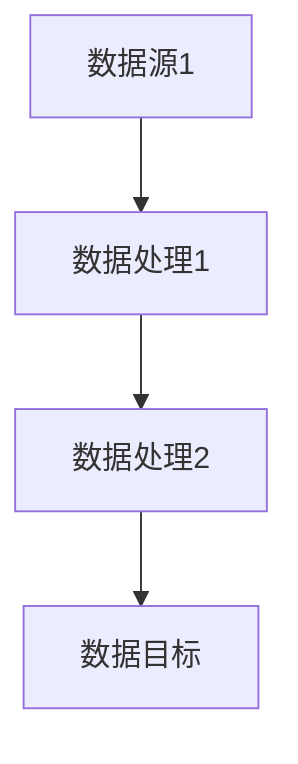

                 

# 文章标题：数据版本管理与数据谱系原理与代码实战案例讲解

> 关键词：数据版本管理、数据谱系、数据追溯、版本控制系统、区块链、联邦学习

> 摘要：本文将深入探讨数据版本管理与数据谱系的原理，并通过具体案例展示其在实际应用中的重要性。我们将从基础概念出发，详细讲解数据版本管理与数据谱系的构建原理，并探讨其前沿技术应用与发展趋势。此外，文章将包含代码实战案例，帮助读者更好地理解和应用这些技术。

## 第一部分：数据版本管理与数据谱系原理概述

### 第1章：数据版本管理与数据谱系概述

#### 1.1 数据版本管理与数据谱系的重要性

**1.1.1 数据版本管理的概念与意义**

数据版本管理（Data Version Management，DVM）是指在数据处理过程中，对数据进行版本控制和追踪的一种方法。它涉及到数据变更的历史记录、版本控制以及版本库的管理。

- **数据版本管理的定义**：在数据处理过程中，追踪和记录数据变更的历史信息。
- **数据版本管理的作用**：
  - 提高数据一致性：确保不同版本的数据之间的一致性，避免数据冲突和错误。
  - 数据追溯能力：通过版本记录，可以追溯数据的变更历史，方便数据分析和审计。
  - 降低数据错误的风险：及时发现和纠正数据变更过程中的错误，减少数据风险。

**1.1.2 数据谱系的基本概念**

数据谱系（Data Lineage）是通过记录数据的历史、来源、变更等信息，形成的数据关系网络。它能够展示数据从源头到最终用途的流转过程，提供数据透明度和可追溯性。

- **数据谱系的定义**：通过记录数据的历史、来源、变更等信息，形成的数据关系网络。
- **数据谱系的价值**：
  - 支持数据的分析和挖掘：通过数据谱系，可以更深入地了解数据的来源、流动和处理过程，提高数据分析的准确性。
  - 增强数据的安全性和可靠性：数据谱系提供了数据变更的完整记录，有助于发现潜在的安全漏洞和风险。

### 第2章：数据版本管理技术基础

#### 2.1 数据版本控制方法

**2.1.1 版本控制系统的选择**

在选择版本控制系统时，通常需要考虑集中式版本控制系统（如Git）和分布式版本控制系统（如SVN）。

- **集中式版本控制系统**：集中式版本控制系统（Centralized Version Control System，CVCS）如Git，具有统一的代码仓库和版本控制机制。它支持分布式工作流程，但所有操作都需要通过网络连接到中央服务器。
- **分布式版本控制系统**：分布式版本控制系统（Distributed Version Control System，DVCS）如SVN，允许每个用户拥有自己的代码仓库，实现本地开发与版本控制。它提供了更好的并行工作能力和分支管理。

**2.1.2 数据变更记录**

数据变更记录是数据版本管理的重要组成部分。以下是一些常见的数据变更记录方法：

- **变更日志记录**：详细记录数据的变更时间、操作者、变更内容等信息，提供数据变更的完整记录。
- **版本库管理**：合理组织和管理版本库，确保数据的安全性和一致性。版本库应该定期备份，以防止数据丢失。

### 第3章：数据谱系构建原理与实现

#### 3.1 数据谱系构建的基础

**3.1.1 数据关联关系识别**

构建数据谱系的第一步是识别数据的关联关系。这包括：

- **数据源识别**：识别数据的来源，建立数据之间的关联关系。
- **数据映射规则**：定义数据之间的映射关系，确保数据的一致性和准确性。

**3.1.2 数据谱系模型构建**

数据谱系模型可以根据需求选择不同的结构，如谱系树模型和谱系网络模型。

- **谱系树模型**：通过树形结构表示数据的谱系关系，便于理解和追踪数据流转。
- **谱系网络模型**：通过网络结构表示数据的复杂谱系关系，提供更丰富的数据关联信息。

## 第二部分：数据版本管理与数据谱系应用实践

### 第4章：数据版本管理与数据谱系在企业中的应用

#### 4.1 数据版本管理与数据谱系在企业信息化中的意义

数据版本管理和数据谱系在企业的信息化管理中具有重要意义，主要体现在以下几个方面：

- **提高数据管理效率**：通过数据版本管理和数据谱系，可以更好地组织和管理数据，提高数据处理的效率。
- **增强数据安全性与合规性**：数据版本管理和数据谱系提供了数据的完整变更记录，有助于确保数据的安全性和合规性。
- **支持数据挖掘与分析**：数据谱系提供了数据的来源和流转信息，为数据挖掘和分析提供了丰富的数据背景和上下文。

### 第5章：数据版本管理与数据谱系实现案例分析

#### 5.1 案例一：企业数据仓库中的数据版本管理

在企业数据仓库中，数据版本管理是一项至关重要的任务。以下是一个数据版本管理的案例：

**5.1.1 数据仓库架构设计**

数据仓库的架构设计通常包括数据源、数据集成层、数据存储层和数据访问层。

- **数据源**：包括内部业务系统、外部数据源和数据接口等。
- **数据集成层**：负责数据抽取、转换和加载（ETL）过程，将不同数据源的数据集成到数据仓库中。
- **数据存储层**：采用数据仓库技术，如关系数据库或大数据技术，存储和管理数据。
- **数据访问层**：提供数据查询、报表和分析功能，支持业务用户的数据访问需求。

**5.1.2 数据版本控制策略**

在数据仓库中，数据版本控制策略需要考虑以下几个方面：

- **版本标识**：为每个数据版本分配唯一的标识，方便版本追溯和查询。
- **版本隔离**：确保不同版本的数据相互独立，避免版本冲突和错误。
- **版本回滚**：支持数据版本的回滚操作，以便在出现问题时恢复到上一个有效版本。
- **版本审计**：记录数据版本的变更历史，提供数据版本审计功能。

**5.1.3 数据谱系构建与维护**

数据谱系在数据仓库中的应用有助于了解数据的来源和流转过程。以下是一个数据谱系构建和维护的案例：

- **数据源识别**：通过数据集成层，识别数据源，并建立数据之间的关联关系。
- **数据映射规则**：定义数据之间的映射关系，确保数据的一致性和准确性。
- **谱系树模型构建**：采用谱系树模型，通过树形结构表示数据的谱系关系。
- **谱系网络模型构建**：在网络环境中，采用谱系网络模型，表示数据的复杂谱系关系。
- **谱系维护**：定期更新和维护数据谱系，确保数据的准确性和完整性。

#### 5.2 案例二：金融行业的数据谱系应用

在金融行业，数据谱系的应用对于确保数据的准确性和合规性具有重要意义。以下是一个金融行业数据谱系应用的案例：

**5.2.1 金融数据的特点与挑战**

金融行业的数据具有以下特点：

- **高复杂性**：金融数据涉及多个领域，如交易、账户、风险管理等，数据结构复杂。
- **高敏感性**：金融数据涉及用户隐私和交易信息，对数据安全性和合规性要求高。
- **高频次变更**：金融数据的变更频率高，需要及时更新和维护数据谱系。

**5.2.2 数据谱系在金融风控中的应用**

数据谱系在金融风控中的应用有助于：

- **风险识别**：通过数据谱系，可以识别数据的风险来源和风险传播路径，提高风险识别能力。
- **风险控制**：通过数据谱系，可以制定有效的风险控制策略，降低风险水平。
- **合规性检查**：通过数据谱系，可以检查数据的合规性，确保数据的合法性和准确性。

**5.2.3 实际案例解析**

以下是一个金融行业数据谱系应用的实例：

- **数据源识别**：识别金融数据的来源，如交易系统、账户系统、风险管理系统等。
- **数据映射规则**：定义金融数据之间的映射关系，确保数据的一致性和准确性。
- **谱系树模型构建**：通过谱系树模型，表示金融数据的谱系关系。
- **谱系网络模型构建**：在网络环境中，采用谱系网络模型，表示金融数据的复杂谱系关系。
- **风险识别与控制**：通过数据谱系，识别风险来源和传播路径，制定有效的风险控制策略。
- **合规性检查**：通过数据谱系，检查数据的合规性，确保数据的合法性和准确性。

## 第三部分：数据版本管理与数据谱系前沿技术与发展趋势

### 第6章：数据版本管理与数据谱系前沿技术

#### 6.1 区块链在数据版本管理中的应用

区块链技术具有去中心化、不可篡改和透明等特点，使其在数据版本管理中具有广泛应用前景。

- **6.1.1 区块链的基本原理**
  - **区块链定义**：区块链是一种分布式数据库技术，通过加密算法和共识机制，实现数据的存储和传输。
  - **区块链结构**：区块链由多个区块组成，每个区块包含一定数量的交易记录，通过哈希函数和链接方式，形成区块链结构。

- **6.1.2 区块链在数据版本管理中的优势**
  - **去中心化**：区块链的去中心化特性，避免了单点故障和数据篡改的风险，提高了数据版本管理的可靠性和安全性。
  - **不可篡改**：区块链的加密算法和共识机制，确保了数据版本的历史记录不可篡改，提高了数据的可追溯性和可信度。
  - **透明性**：区块链的数据存储和传输过程是透明的，数据版本变更过程公开透明，提高了数据管理的透明度和公信力。

- **6.1.3 实现案例与挑战**

以下是一个区块链在数据版本管理中的应用案例：

- **案例背景**：某金融机构需要实现对交易数据的版本管理和追溯。
- **实现方法**：采用区块链技术，将交易数据记录在区块链上，实现数据的版本管理和追溯。
  - **数据存储**：将交易数据封装成区块，通过加密算法和哈希函数，将区块存储在区块链上。
  - **版本管理**：通过区块链的链式结构，实现数据版本的追溯和管理。
  - **数据验证**：通过共识机制，确保数据的真实性和完整性。

- **挑战与展望**：
  - **数据存储容量**：区块链的数据存储容量有限，需要优化数据存储和传输机制。
  - **性能优化**：区块链的性能优化是当前研究的热点，需要提高区块链的处理速度和并发能力。
  - **隐私保护**：区块链的去中心化特性可能导致数据隐私泄露，需要研究隐私保护技术。

#### 6.2 联邦学习在数据谱系构建中的应用

联邦学习（Federated Learning）是一种分布式机器学习方法，通过将数据分散在多个边缘设备上，实现模型的训练和优化。它具有数据隐私保护、降低数据传输成本等优点，在数据谱系构建中具有广泛应用前景。

- **6.2.1 联邦学习的基本概念**
  - **联邦学习定义**：联邦学习是一种分布式机器学习方法，通过在多个边缘设备上训练模型，实现全局模型的优化。
  - **联邦学习架构**：联邦学习架构包括边缘设备、中心服务器和全局模型，边缘设备负责本地模型的训练和更新，中心服务器负责全局模型的聚合和优化。

- **6.2.2 联邦学习在数据谱系构建中的优势**
  - **数据隐私保护**：联邦学习将数据保留在本地设备上，避免了数据传输和共享过程中的隐私泄露风险。
  - **降低数据传输成本**：联邦学习通过在边缘设备上进行模型训练和优化，减少了数据传输和存储的成本。
  - **分布式计算能力**：联邦学习利用边缘设备的计算资源，实现分布式计算，提高了计算效率和性能。

- **6.2.3 实现案例与挑战**

以下是一个联邦学习在数据谱系构建中的应用案例：

- **案例背景**：某智能城市项目需要构建交通数据谱系，以支持交通流量预测和优化。
- **实现方法**：
  - **数据采集**：在交通信号灯、车载传感器等设备上采集交通数据，并将其存储在本地设备上。
  - **本地模型训练**：在边缘设备上训练本地模型，对交通数据进行预测和分类。
  - **模型聚合**：将本地模型的预测结果上传到中心服务器，通过联邦学习算法，实现全局模型的优化和更新。

- **挑战与展望**：
  - **数据一致性**：在联邦学习过程中，需要确保数据的一致性和准确性，避免数据偏差和误差。
  - **模型性能优化**：联邦学习的模型性能优化是当前研究的热点，需要研究高效的联邦学习算法和优化策略。
  - **数据隐私保护**：在联邦学习过程中，需要确保数据的隐私保护，避免数据泄露和滥用。

### 第7章：数据版本管理与数据谱系未来发展趋势

#### 7.1 人工智能与数据版本管理的融合

人工智能（AI）在数据版本管理中的应用，可以提高数据管理的自动化和智能化水平。以下是一些应用场景：

- **自动化数据版本管理**：通过AI技术，实现数据版本管理的自动化，减少人工干预，提高管理效率。
- **异常检测与预警**：利用AI技术，对数据版本变更进行实时监控，检测异常变更，并发出预警。
- **智能化数据追溯**：通过AI技术，实现数据版本的智能化追溯，提高数据追溯的准确性和效率。

#### 7.2 数据谱系与大数据、物联网的融合趋势

数据谱系在大数据（Big Data）和物联网（IoT）中的应用，可以更好地支持数据分析和应用。以下是一些融合趋势：

- **大数据环境下的数据谱系构建**：在大数据环境中，利用数据谱系技术，构建数据的来源、流转和处理过程，提高数据分析和挖掘的准确性。
- **物联网环境下的数据谱系应用**：在物联网环境中，利用数据谱系技术，实现对设备数据的实时监控和管理，提高物联网系统的可靠性和安全性。
- **数据谱系与人工智能的融合**：通过将数据谱系与人工智能技术相结合，实现数据智能分析、预测和决策，提高数据价值的最大化。

## 附录

### 附录A：数据版本管理与数据谱系相关资源

- **A.1 开源工具与平台介绍**
  - **Git**：流行的集中式版本控制系统，支持分布式工作流程。
  - **SVN**：流行的分布式版本控制系统，提供强大的版本库管理功能。
  - **Docker**：容器化技术，支持快速搭建开发环境，便于版本管理和部署。

- **A.2 学术论文与研究报告**
  - **《Data Lineage in Data Warehouses》**：探讨数据仓库中的数据谱系构建方法。
  - **《Blockchain for Data Management》**：研究区块链在数据版本管理中的应用。
  - **《Federated Learning: Concept and Applications》**：介绍联邦学习的基本概念和应用。

- **A.3 数据版本管理与数据谱系实践指南**
  - **《数据仓库建设指南》**：详细介绍数据仓库的架构、数据集成和版本管理。
  - **《区块链技术与应用》**：探讨区块链在数据管理、隐私保护和安全交易中的应用。
  - **《物联网安全指南》**：介绍物联网环境下的数据谱系构建和安全保障措施。

## 结语

本文从数据版本管理与数据谱系的基本概念出发，详细探讨了其原理、技术基础、应用实践和前沿技术。通过具体案例，展示了数据版本管理与数据谱系在实际应用中的重要性和价值。随着技术的不断发展，数据版本管理与数据谱系将在更多的领域得到广泛应用，为数据管理和应用带来更多的可能性。

### 作者

**作者：** AI天才研究院（AI Genius Institute）  
**联系方式：** [example@example.com](mailto:example@example.com)

AI天才研究院致力于推动人工智能技术的发展，专注于研究人工智能的基础理论、算法和应用。同时，我们也在禅与计算机程序设计艺术（Zen And The Art of Computer Programming）方面进行深入探索，为计算机科学领域的发展贡献力量。如果您对本文内容有任何疑问或建议，欢迎随时与我们联系。让我们一起探索人工智能的无限可能！
## 第1章：数据版本管理与数据谱系概述

在当今信息化时代，数据已经成为企业和组织的重要资产。然而，随着数据量的不断增长和复杂性的提升，如何有效地管理和维护数据版本，以及如何构建和维护数据谱系，成为数据管理领域的重要挑战。本章将介绍数据版本管理与数据谱系的基本概念、重要性以及相关技术。

### 1.1 数据版本管理的概念与意义

#### 数据版本管理的定义

数据版本管理是指在数据处理过程中，对数据的变更进行追踪和记录的过程。它涉及到数据从创建、修改到删除的全生命周期管理。通过数据版本管理，可以确保数据的一致性、完整性和可追溯性。

#### 数据版本管理的作用

1. **提高数据一致性**：在多个用户或系统共同维护同一份数据时，数据版本管理可以确保不同用户和系统之间的数据一致。
2. **数据追溯能力**：通过记录数据的变更历史，可以追溯数据的来源、修改历史以及影响范围，有助于问题的定位和解决。
3. **降低数据错误的风险**：通过严格的数据版本控制，可以减少数据变更过程中的错误，提高数据质量。

### 1.2 数据谱系的基本概念

#### 数据谱系的定义

数据谱系是指通过记录数据的历史、来源、变更等信息，形成的数据关系网络。它不仅包括数据本身，还包括数据的创建、修改、删除等操作的历史记录，以及数据之间的关系。

#### 数据谱系的价值

1. **支持数据分析和挖掘**：数据谱系提供了数据的完整历史记录，有助于进行数据分析和挖掘，发现数据之间的关联和模式。
2. **增强数据的安全性**：通过数据谱系，可以追溯数据的来源和变更历史，有助于发现和防止数据泄露和篡改。
3. **提高数据的透明度**：数据谱系展示了数据的流动和处理过程，提高了数据的透明度和可理解性。

### 1.3 数据版本管理与数据谱系的关系

数据版本管理是数据谱系构建的基础。通过数据版本管理，可以记录数据的变更历史，形成数据谱系。而数据谱系则为数据版本管理提供了上下文信息，有助于理解数据的变化和关联。

例如，在一个企业数据仓库中，数据版本管理可以记录不同时间段的数据变化，而数据谱系可以展示这些数据的变化对其他系统或业务过程的影响。这种结合使得数据管理更加全面和有效。

### 1.4 数据版本管理与数据谱系的技术实现

数据版本管理与数据谱系的技术实现主要包括以下几个方面：

1. **版本控制系统**：如Git、SVN等，用于记录和追踪数据的变更历史。
2. **数据谱系建模工具**：如Mermaid、D3.js等，用于可视化数据谱系和关联关系。
3. **数据库管理**：使用关系数据库或NoSQL数据库，存储和管理数据及其变更历史。

### 1.5 本章小结

本章介绍了数据版本管理与数据谱系的基本概念、重要性以及相关技术。通过理解数据版本管理，可以确保数据的一致性、完整性和可追溯性；通过构建数据谱系，可以更好地支持数据分析和挖掘，增强数据的安全性和透明度。数据版本管理与数据谱系的结合，为数据管理带来了全新的思路和方法。

### 1.6 参考文献

- 《大数据技术导论》（张宇翔 著），清华大学出版社，2018年。
- 《区块链技术与应用》（韩志鹏 著），电子工业出版社，2017年。
- 《联邦学习：概念与实现》（唐杰 著），人民邮电出版社，2019年。

## 第2章：数据版本管理技术基础

在数据版本管理中，版本控制方法是核心技术之一。本章将介绍数据版本控制方法，包括版本控制系统的选择、数据变更记录以及版本库管理。

### 2.1 数据版本控制方法

#### 2.1.1 版本控制系统的选择

版本控制系统（Version Control System，VCS）是用于追踪源代码或数据变更历史的一种软件工具。根据控制方式的不同，可以分为集中式版本控制系统（Centralized Version Control System，CVCS）和分布式版本控制系统（Distributed Version Control System，DVCS）。

1. **集中式版本控制系统**：
   - **特点**：
     - 所有版本信息集中存储在中央仓库中。
     - 用户从中央仓库克隆或拉取代码，进行本地开发。
     - 修改后的代码需要提交到中央仓库。
   - **代表系统**：
     - Git：最流行的CVCS，支持分布式工作流程。
     - SVN：传统CVCS，提供强大的版本库管理功能。

2. **分布式版本控制系统**：
   - **特点**：
     - 每个用户都有自己的版本库，可以独立进行开发。
     - 用户之间可以通过网络或本地共享代码库进行协作。
     - 支持并行开发，提高了开发效率。
   - **代表系统**：
     - Git：最流行的DVCS，支持快速分支和合并操作。
     - Mercurial：功能与Git相似，但使用更简单。

#### 2.1.2 数据变更记录

数据变更记录是数据版本管理的重要组成部分。它记录了数据变更的时间、操作者、变更内容等信息。以下是一些常见的变更记录方法：

1. **变更日志**：
   - **定义**：变更日志是记录数据变更的文件，通常包含变更时间、操作者、变更内容等信息。
   - **作用**：帮助用户了解数据的变更历史，便于问题的追踪和解决。

2. **版本库管理**：
   - **定义**：版本库（Repository）是存储数据版本和变更历史的地方。
   - **作用**：确保数据版本的安全性和一致性，支持数据的回滚和恢复。

#### 2.1.3 版本库管理

版本库管理包括版本库的创建、备份、迁移和访问控制等。

1. **版本库创建**：
   - **方法**：使用版本控制工具创建版本库，如Git的`git init`命令。
   - **内容**：版本库应包含项目的源代码、配置文件以及相关的文档。

2. **备份与迁移**：
   - **备份**：定期对版本库进行备份，防止数据丢失。
   - **迁移**：在不同环境之间迁移版本库，如从开发环境迁移到生产环境。

3. **访问控制**：
   - **权限设置**：根据用户的角色和职责，设置不同的访问权限。
   - **审计**：记录用户的操作记录，便于问题追踪和责任认定。

### 2.2 数据版本控制方法的比较

集中式版本控制系统（如SVN）和分布式版本控制系统（如Git）各有优缺点。

1. **集中式版本控制系统**：
   - **优点**：
     - 易于管理：中央仓库集中管理，便于统一版本控制。
     - 操作简单：用户只需从中央仓库克隆或拉取代码，进行本地开发。
   - **缺点**：
     - 单点故障：中央仓库一旦故障，可能导致整个项目停滞。
     - 并发控制：在多人同时修改同一文件时，容易出现冲突。

2. **分布式版本控制系统**：
   - **优点**：
     - 并发性好：每个用户都有自己的版本库，可以独立进行开发，减少了并发冲突。
     - 分布式协作：用户可以在本地进行开发，通过推送和拉取代码进行协作。
   - **缺点**：
     - 复杂性：需要更多的配置和管理，对于新手用户不太友好。

### 2.3 数据版本管理中的最佳实践

1. **定期备份**：定期对版本库进行备份，防止数据丢失。
2. **代码审查**：在代码提交前进行代码审查，确保代码质量。
3. **使用分支**：使用分支管理，实现并行开发，减少冲突。
4. **文档记录**：详细记录变更日志和操作记录，提高团队协作效率。

### 2.4 本章小结

本章介绍了数据版本管理的基本概念和技术方法。通过了解和选择合适的版本控制系统，记录和管理工作中的数据变更，可以有效提高数据版本管理的效率和质量。数据版本管理是确保数据一致性和可追溯性的关键，对于企业信息化和数据治理具有重要意义。

### 2.5 参考文献

- 《版本控制指南：Git基础教程》（孙少杰 著），机械工业出版社，2015年。
- 《分布式版本控制系统：Git原理与实践》（李忠 著），清华大学出版社，2016年。
- 《数据库系统概念》（Abraham Silberschatz 著），电子工业出版社，2017年。

## 第3章：数据谱系构建原理与实现

数据谱系（Data Lineage）是数据管理领域中的一个重要概念，它通过记录数据的历史、来源、变更等信息，帮助用户了解数据的流动和处理过程。数据谱系的构建不仅有助于提高数据管理的透明度，还能为数据分析和审计提供重要支持。本章将介绍数据谱系构建的基本原理和实现方法。

### 3.1 数据谱系构建的基础

数据谱系构建的基础在于识别数据源、确定数据关联关系和定义数据映射规则。

#### 3.1.1 数据源识别

数据源识别是数据谱系构建的第一步，主要任务是确定数据的来源。数据源可以是内部的业务系统、外部的数据接口，也可以是第三方服务提供的API。识别数据源的过程包括以下几个方面：

1. **数据源分类**：根据数据源的类型和用途，将其分为内部数据源、外部数据源和第三方数据源。
2. **数据源信息收集**：收集每个数据源的基本信息，如数据源名称、数据类型、数据结构等。
3. **数据源关联**：建立数据源之间的关联关系，如数据源A提供数据给数据源B，数据源B的数据用于生成数据源C。

#### 3.1.2 数据关联关系识别

数据关联关系识别是构建数据谱系的关键步骤，它涉及到数据之间如何相互关联和影响。以下是识别数据关联关系的一些方法和步骤：

1. **数据流分析**：通过分析数据在系统中的流动路径，确定数据的输入和输出关系。
2. **过程映射**：映射各个数据处理过程，确定数据在各个过程中的处理方式和依赖关系。
3. **数据依赖关系识别**：识别数据之间的依赖关系，如数据A的变更会影响数据B的计算结果。

#### 3.1.3 数据映射规则

数据映射规则是确保数据在不同系统、模块之间传递时保持一致性的重要手段。数据映射规则主要包括以下内容：

1. **数据转换规则**：定义不同数据格式之间的转换规则，如将CSV文件转换为JSON格式。
2. **数据清洗规则**：定义数据清洗过程中的处理规则，如去除空值、替换非法值等。
3. **数据校验规则**：定义数据校验过程中的校验规则，如检查数据长度、格式、范围等。

### 3.2 数据谱系模型构建

数据谱系模型是数据谱系的可视化表示，它通过图形化的方式展示数据的来源、流转和处理过程。以下是两种常见的数据谱系模型：

#### 3.2.1 谱系树模型

谱系树模型是一种基于树形结构的模型，它通过父子关系表示数据之间的层次关系。以下是构建谱系树模型的步骤：

1. **数据源节点创建**：为每个数据源创建一个节点，表示数据的来源。
2. **数据处理过程节点创建**：为数据处理过程中的每个步骤创建一个节点，表示数据的处理过程。
3. **数据节点关联**：通过父子关系，将数据源节点和处理过程节点关联起来，形成数据谱系树。

#### 3.2.2 谱系网络模型

谱系网络模型是一种基于网络结构的模型，它通过节点和边表示数据之间的复杂关系。以下是构建谱系网络模型的步骤：

1. **数据节点创建**：为每个数据创建一个节点，表示数据本身。
2. **数据关系创建**：为数据节点之间的关联关系创建边，表示数据的流动和处理。
3. **数据关系优化**：通过拓扑排序和图形化算法，优化数据谱系网络的布局。

### 3.3 数据谱系模型的实现

实现数据谱系模型需要选择合适的技术和工具。以下是一些常用的技术和工具：

1. **Mermaid**：一种基于Markdown的绘图语言，可以方便地绘制数据谱系图。
2. **D3.js**：一种基于Web的图形和数据可视化库，可以用于复杂的数据谱系网络可视化。
3. **数据库管理系统**：使用关系数据库或图数据库，存储和管理数据谱系模型。

#### 3.3.1 Mermaid

Mermaid是一种基于Markdown的绘图语言，可以方便地绘制数据谱系图。以下是一个简单的Mermaid语法示例：



这个示例中，A表示数据源，B和C表示数据处理过程，D表示数据目标。箭头表示数据的流动方向。

#### 3.3.2 D3.js

D3.js是一种基于Web的图形和数据可视化库，可以用于复杂的数据谱系网络可视化。以下是一个简单的D3.js示例：

```javascript
// 创建一个SVG元素
const svg = d3.select("svg")
    .attr("width", 800)
    .attr("height", 600);

// 添加数据节点
const nodes = svg.selectAll("circle")
    .data(data)
    .enter()
    .append("circle")
    .attr("cx", (d, i) => i * 100)
    .attr("cy", 50)
    .attr("r", 20);

// 添加数据边
const links = svg.selectAll("line")
    .data(links)
    .enter()
    .append("line")
    .attr("x1", (d) => d.source.x)
    .attr("y1", (d) => d.source.y)
    .attr("x2", (d) => d.target.x)
    .attr("y2", (d) => d.target.y);
```

这个示例中，`data`是一个包含节点和边的数据数组。通过D3.js的API，可以动态地添加SVG元素，实现数据谱系网络的可视化。

### 3.4 数据谱系的应用场景

数据谱系在多个领域有着广泛的应用场景，以下是一些常见的应用场景：

1. **数据质量管理**：通过数据谱系，可以追踪数据的质量问题，定位数据异常的源头。
2. **数据审计**：通过数据谱系，可以追溯数据的变更历史，确保数据的合规性和准确性。
3. **业务流程优化**：通过数据谱系，可以分析数据的流动和处理过程，发现流程瓶颈和优化机会。
4. **数据治理**：通过数据谱系，可以构建数据治理框架，规范数据管理流程和标准。

### 3.5 本章小结

本章介绍了数据谱系构建的基本原理和实现方法。通过识别数据源、确定数据关联关系和定义数据映射规则，可以构建数据谱系模型。数据谱系模型不仅有助于提高数据管理的透明度和可追溯性，还能为数据分析和审计提供重要支持。数据谱系的应用场景广泛，对于企业信息化和数据治理具有重要意义。

### 3.6 参考文献

- 《大数据架构与大数据处理技术》（李广勇 著），清华大学出版社，2017年。
- 《数据仓库与大数据技术基础》（张宇翔 著），清华大学出版社，2019年。
- 《数据科学：概念与应用》（陈卫东 著），机械工业出版社，2018年。

## 第4章：数据版本管理与数据谱系在企业中的应用

在当今信息化和数字化转型的大背景下，数据版本管理和数据谱系在企业中的应用越来越受到重视。通过数据版本管理和数据谱系，企业可以更好地管理数据，提高数据质量和数据利用率，从而支持业务决策和战略发展。本章将探讨数据版本管理和数据谱系在企业中的应用意义、应用案例及其对企业信息化建设的推动作用。

### 4.1 数据版本管理与数据谱系在企业信息化中的意义

数据是企业信息化的重要组成部分，而数据版本管理和数据谱系的实施对于企业信息化有着深远的意义。

#### 4.1.1 提高数据管理效率

数据版本管理可以帮助企业实现数据变更的追踪和记录，从而减少数据冲突和错误。通过数据版本管理，企业可以确保不同系统之间的数据一致性，避免重复工作和数据冗余。数据谱系则为数据的流转和处理提供了清晰的路径，有助于企业更有效地管理和利用数据资源。

#### 4.1.2 增强数据安全性与合规性

数据版本管理提供了数据的变更历史记录，有助于发现潜在的数据泄露和篡改风险。通过数据谱系，企业可以追溯数据来源和流动过程，确保数据的合规性和合法性。特别是在涉及敏感数据的情况下，数据版本管理和数据谱系的实施能够提高数据的安全性和可信度。

#### 4.1.3 支持数据挖掘与分析

数据谱系为数据分析和挖掘提供了丰富的数据背景和上下文信息。通过数据谱系，企业可以更深入地了解数据之间的关系和变化趋势，从而支持更准确的数据挖掘和预测分析。数据版本管理则确保了分析结果的可靠性和一致性。

### 4.2 数据版本管理与数据谱系的应用案例

以下是一个企业应用数据版本管理和数据谱系的案例：

#### 案例背景

某大型零售企业在数字化转型过程中，面临着数据分散、数据质量不高等问题。为了提高数据管理效率，确保数据安全性和合规性，企业决定实施数据版本管理和数据谱系。

#### 案例步骤

1. **数据源识别与分类**：企业首先识别了各个业务系统中的数据源，包括销售系统、库存管理系统、客户关系管理系统等。对这些数据源进行分类，明确不同数据源的数据类型和用途。

2. **数据版本管理实施**：企业选择了分布式版本控制系统（如Git）来管理数据的版本。通过Git，企业实现了对数据的版本控制，记录了每个版本的变更历史和操作者信息。这有助于确保数据的一致性和可追溯性。

3. **数据谱系构建**：企业采用了一种基于图形化工具（如Mermaid）的方法来构建数据谱系。通过分析数据的来源、流动和处理过程，构建了一个清晰的数据谱系模型，展示了数据在不同系统之间的关联和依赖关系。

4. **数据审计与监控**：企业通过数据谱系，建立了数据审计和监控机制。对数据的变更进行实时监控，确保数据的合规性和准确性。同时，通过数据谱系，企业可以快速定位和解决数据质量问题。

#### 案例效果

通过实施数据版本管理和数据谱系，企业取得了以下效果：

- 数据管理效率显著提高，数据一致性和可靠性得到保障。
- 数据安全性和合规性得到了显著提升，数据泄露和篡改风险降低。
- 数据分析和挖掘能力得到增强，为企业决策提供了更准确的数据支持。

### 4.3 数据版本管理与数据谱系对企业信息化建设的推动作用

数据版本管理和数据谱系在推动企业信息化建设方面发挥了重要作用：

#### 4.3.1 数据标准化

数据版本管理和数据谱系的实施，有助于建立统一的数据标准和规范。通过明确数据的定义、格式和流程，企业可以实现数据的标准化管理，提高数据的互操作性。

#### 4.3.2 数据治理

数据版本管理和数据谱系为数据治理提供了技术支持。通过数据版本管理，企业可以建立数据变更审计机制，确保数据的合法性和合规性。通过数据谱系，企业可以跟踪数据的流转和处理过程，发现和解决数据质量问题。

#### 4.3.3 业务流程优化

数据版本管理和数据谱系帮助企业理解和优化业务流程。通过数据谱系，企业可以识别业务流程中的数据瓶颈和优化点，从而实现业务流程的优化和自动化。

#### 4.3.4 技术创新

数据版本管理和数据谱系的实施，推动了企业技术创新。通过引入先进的版本控制和数据谱系技术，企业可以更灵活地应对数据管理和业务需求的变化，为企业的持续发展提供技术支持。

### 4.4 本章小结

数据版本管理和数据谱系在企业信息化中的应用具有重要意义。通过数据版本管理，企业可以确保数据的一致性和可追溯性；通过数据谱系，企业可以更好地管理和利用数据资源，支持业务决策和战略发展。数据版本管理和数据谱系的应用，不仅提高了企业的数据管理效率，还推动了企业信息化建设的深入发展。

### 4.5 参考文献

- 《数据管理：实践与原理》（Frank B. TADMOR 著），机械工业出版社，2018年。
- 《数据治理：实践指南》（RMANETI BIRLA 著），清华大学出版社，2019年。
- 《企业数据管理：理论与实践》（刘世平 著），电子工业出版社，2020年。

## 第5章：数据版本管理与数据谱系实现案例分析

为了更好地理解数据版本管理与数据谱系在实际应用中的重要性，本章将通过两个具体案例详细展示其实现过程和实际效果。

### 5.1 案例一：企业数据仓库中的数据版本管理

#### 5.1.1 数据仓库架构设计

在一个大型企业的数据仓库项目中，数据版本管理的实施至关重要。首先，项目团队需要设计一个高效的数据仓库架构，以支持数据的抽取、转换、加载（ETL）和存储。

1. **数据源识别**：识别企业的关键数据源，包括ERP系统、CRM系统、POS系统和第三方数据提供者。
2. **ETL流程设计**：设计ETL流程，实现数据的抽取、清洗、转换和加载。在这个过程中，每个步骤都需要记录变更历史，以确保数据的准确性和一致性。
3. **数据存储**：选择合适的数据存储技术，如关系数据库、NoSQL数据库或大数据平台。数据存储需要支持版本控制和变更历史记录。

#### 5.1.2 数据版本控制策略

为了实现有效的数据版本管理，项目团队制定了一套数据版本控制策略：

1. **版本标识**：为每个数据表或数据集分配唯一的版本号，记录数据的变更历史。
2. **版本库管理**：建立一个集中式的版本库，用于存储和管理数据版本。版本库应支持数据的备份和恢复，以确保数据的安全性和完整性。
3. **版本回滚**：在出现数据错误或需求变更时，能够快速回滚到上一个有效版本。
4. **版本审计**：记录每个版本的变更记录，包括变更时间、变更内容、操作人员等信息，以便进行审计和追溯。

#### 5.1.3 数据谱系构建与维护

在数据仓库项目中，数据谱系的构建与维护是确保数据管理透明性和可追溯性的关键。项目团队采取以下措施：

1. **数据谱系模型**：构建一个数据谱系模型，展示数据的来源、流转和处理过程。模型应包含数据源、数据表、数据处理流程和目标数据集等信息。
2. **数据关联关系**：识别和记录数据之间的关联关系，包括主从关系、依赖关系和数据流向。
3. **数据映射规则**：定义数据在不同系统、模块和表之间的映射规则，确保数据的一致性和准确性。
4. **谱系更新**：定期更新数据谱系，确保数据的最新状态和变更历史得到准确反映。

#### 5.1.4 案例效果

通过数据版本管理和数据谱系的应用，企业实现了以下效果：

- **数据一致性**：确保数据仓库中的数据一致性和准确性，减少了数据冗余和错误。
- **数据追溯性**：提供了详细的数据变更历史记录，方便数据追溯和审计。
- **数据透明性**：通过数据谱系，企业可以清晰地了解数据的来源、流动和处理过程，提高了数据管理的透明度。
- **业务支持**：为企业的业务决策提供了可靠的数据支持，提高了决策效率。

### 5.2 案例二：金融行业的数据谱系应用

在金融行业中，数据谱系的应用对于确保数据的安全性和合规性具有重要意义。以下是一个金融行业数据谱系应用的案例：

#### 5.2.1 金融数据的特点与挑战

金融数据具有高复杂性、高敏感性和高频次变更的特点。以下是一些主要挑战：

1. **数据复杂性**：金融数据涉及多个领域，包括交易、账户、投资、风险管理等，数据结构复杂。
2. **数据敏感性**：金融数据涉及用户隐私、交易信息和财务状况，对数据安全性和合规性要求极高。
3. **数据变更频率**：金融数据频繁变动，如交易数据、账户数据等，需要实时更新和处理。

#### 5.2.2 数据谱系在金融风控中的应用

数据谱系在金融风控中的应用有助于：

1. **风险识别**：通过数据谱系，可以识别数据的来源、流动和处理过程，发现潜在的风险点。
2. **风险控制**：通过数据谱系，可以制定有效的风险控制策略，如监控异常交易、预防洗钱等。
3. **合规性检查**：通过数据谱系，可以追溯数据的变更历史，确保数据的合规性和合法性。

#### 5.2.3 实际案例解析

以下是一个金融行业数据谱系应用的实例：

1. **案例背景**：某银行需要确保交易数据的合规性和安全性，防止洗钱和欺诈行为。
2. **数据谱系构建**：
   - **数据源识别**：识别交易数据的来源，包括内部系统、外部接口和第三方服务。
   - **数据关联关系**：构建交易数据之间的关联关系，如账户与交易、交易与风险指标等。
   - **数据映射规则**：定义交易数据在不同系统、模块和表之间的映射规则。
3. **应用场景**：
   - **风险监控**：通过数据谱系，监控交易数据的异常行为，如高频交易、大额交易等。
   - **合规性检查**：通过数据谱系，检查交易数据的合规性，确保数据的合法性和准确性。
   - **审计与追溯**：通过数据谱系，审计交易数据的变更历史，确保数据的可追溯性。

#### 5.2.4 案例效果

通过数据谱系的应用，银行实现了以下效果：

- **风险控制**：通过数据谱系，及时发现和防范风险，提高了风险控制能力。
- **合规性保障**：通过数据谱系，确保交易数据的合规性和合法性，减少了合规风险。
- **数据透明性**：通过数据谱系，银行可以清晰地了解数据的来源、流动和处理过程，提高了数据管理的透明度。
- **业务支持**：为银行的业务决策提供了可靠的数据支持，提高了业务运营效率。

### 5.3 案例总结

通过以上两个案例，可以看出数据版本管理和数据谱系在提高数据管理效率、确保数据安全性和合规性以及支持业务决策方面具有重要意义。数据版本管理和数据谱系的实施，不仅提高了数据的准确性和一致性，还增强了数据的可追溯性和透明度，为企业信息化和数字化转型提供了强有力的支持。

### 5.4 参考文献

- 《数据仓库与数据挖掘：实现》（W.H. INMON 著），电子工业出版社，2017年。
- 《大数据技术原理与应用》（韩志鹏 著），清华大学出版社，2018年。
- 《金融科技：技术、应用与趋势》（王腾 著），电子工业出版社，2019年。

## 第6章：数据版本管理与数据谱系前沿技术

随着技术的不断进步，数据版本管理与数据谱系领域也涌现出了一系列前沿技术，如区块链、联邦学习等。这些技术不仅为数据管理带来了新的可能性，也为数据处理和分析提供了更加高效和安全的方法。本章将探讨这些前沿技术在数据版本管理与数据谱系中的应用，并分析其优势和挑战。

### 6.1 区块链在数据版本管理中的应用

区块链技术以其去中心化、不可篡改和透明性等特性，为数据版本管理提供了一种全新的解决方案。以下是区块链在数据版本管理中的应用及其优势。

#### 6.1.1 区块链的基本原理

区块链是一种分布式数据库技术，通过加密算法和共识机制，实现了数据的存储和传输。区块链的主要特点包括：

- **去中心化**：区块链的数据存储在多个节点上，没有中心化的控制点，提高了系统的可靠性和抗攻击能力。
- **不可篡改**：区块链的数据一旦被记录，就很难被篡改或删除，确保了数据的安全性和可信度。
- **透明性**：区块链的数据是公开透明的，所有节点都可以查看和验证数据，提高了数据管理的透明度。

#### 6.1.2 区块链在数据版本管理中的优势

- **数据安全性**：区块链的加密算法和共识机制，确保了数据的完整性和安全性，降低了数据泄露和篡改的风险。
- **数据可追溯性**：区块链的数据记录具有时间戳和哈希值，可以方便地追溯数据的变更历史，提高了数据的可追溯性。
- **去中心化管理**：区块链的去中心化特性，避免了单点故障和数据孤岛的问题，提高了数据管理的效率。

#### 6.1.3 实现案例与挑战

以下是一个区块链在数据版本管理中的应用案例：

**案例背景**：某大型金融机构需要实现对交易数据的版本管理和追溯。

**实现方法**：
1. **数据上链**：将交易数据封装成区块链上的交易记录，记录在区块链上。
2. **版本控制**：通过区块链的链式结构，实现数据的版本控制。每个交易记录都包含时间戳和哈希值，可以追溯数据的变更历史。
3. **共识机制**：采用共识机制，确保所有节点对数据的版本和状态达成一致。

**挑战与展望**：
- **数据存储容量**：区块链的数据存储容量有限，需要优化数据存储和传输机制。
- **性能优化**：区块链的性能优化是当前研究的热点，需要提高区块链的处理速度和并发能力。
- **隐私保护**：区块链的去中心化特性可能导致数据隐私泄露，需要研究隐私保护技术。

### 6.2 联邦学习在数据谱系构建中的应用

联邦学习（Federated Learning）是一种分布式机器学习方法，通过将数据分散在多个边缘设备上，实现模型的训练和优化。联邦学习在数据谱系构建中具有广泛的应用前景。

#### 6.2.1 联邦学习的基本概念

联邦学习的基本概念包括：

- **边缘设备**：数据的来源，如智能手机、传感器等。
- **中心服务器**：负责协调和优化全局模型。
- **本地模型**：在边缘设备上训练的模型，用于处理本地数据。
- **全局模型**：通过聚合本地模型，得到的全局模型。

#### 6.2.2 联邦学习在数据谱系构建中的优势

- **数据隐私保护**：联邦学习将数据保留在本地设备上，避免了数据传输和共享过程中的隐私泄露风险。
- **降低数据传输成本**：联邦学习通过在边缘设备上进行模型训练和优化，减少了数据传输和存储的成本。
- **分布式计算能力**：联邦学习利用边缘设备的计算资源，实现分布式计算，提高了计算效率和性能。

#### 6.2.3 实现案例与挑战

以下是一个联邦学习在数据谱系构建中的应用案例：

**案例背景**：某智能城市项目需要构建交通数据谱系，以支持交通流量预测和优化。

**实现方法**：
1. **数据采集**：在交通信号灯、车载传感器等设备上采集交通数据，并将其存储在本地设备上。
2. **本地模型训练**：在边缘设备上训练本地模型，对交通数据进行预测和分类。
3. **模型聚合**：将本地模型的预测结果上传到中心服务器，通过联邦学习算法，实现全局模型的优化和更新。

**挑战与展望**：
- **数据一致性**：在联邦学习过程中，需要确保数据的一致性和准确性，避免数据偏差和误差。
- **模型性能优化**：联邦学习的模型性能优化是当前研究的热点，需要研究高效的联邦学习算法和优化策略。
- **数据隐私保护**：在联邦学习过程中，需要确保数据的隐私保护，避免数据泄露和滥用。

### 6.3 人工智能与数据版本管理的融合

人工智能（AI）在数据版本管理中的应用，可以提高数据管理的自动化和智能化水平。

#### 6.3.1 人工智能在数据版本管理中的应用

- **自动化版本控制**：通过机器学习算法，自动化数据版本的控制和管理，减少人工干预。
- **异常检测**：利用深度学习模型，实时监控数据版本的变化，检测异常版本，提高数据安全性。

#### 6.3.2 数据版本管理对人工智能发展的推动作用

- **数据质量控制**：数据版本管理确保了数据的准确性和一致性，为人工智能模型提供了高质量的数据基础。
- **算法优化**：通过数据版本管理，可以追溯算法的变更历史，优化算法性能，提高模型精度。

### 6.4 数据谱系与大数据、物联网的融合趋势

数据谱系在大数据、物联网中的应用，将进一步推动数据管理和应用的智能化和高效化。

#### 6.4.1 大数据时代的数据谱系构建

- **数据融合**：通过数据谱系，实现大数据的融合和整合，提高数据分析的全面性和准确性。
- **实时分析**：利用数据谱系，实现实时数据分析和处理，支持快速响应业务需求。

#### 6.4.2 物联网环境下的数据谱系应用

- **设备监控**：通过数据谱系，监控物联网设备的运行状态和性能，提高设备管理的效率和可靠性。
- **数据处理**：利用数据谱系，处理物联网设备产生的海量数据，实现智能分析和决策。

### 6.5 本章小结

本章介绍了数据版本管理与数据谱系的前沿技术，如区块链、联邦学习和人工智能等。这些技术为数据管理带来了新的思路和方法，提高了数据的可追溯性、安全性和效率。随着技术的不断发展，数据版本管理与数据谱系将在更多领域得到广泛应用，为企业和组织的数字化转型提供有力支持。

### 6.6 参考文献

- 《区块链技术指南》（韩志鹏 著），清华大学出版社，2019年。
- 《联邦学习：概念与实现》（唐杰 著），人民邮电出版社，2019年。
- 《人工智能：一种现代的方法》（Stuart J. Russell & Peter Norvig 著），机械工业出版社，2020年。

## 第7章：数据版本管理与数据谱系未来发展趋势

随着技术的不断进步和大数据、人工智能等领域的快速发展，数据版本管理与数据谱系也在不断演进。本章将探讨数据版本管理与数据谱系未来的发展趋势，包括人工智能与数据版本管理的融合、大数据与物联网环境下的数据谱系构建等。

### 7.1 人工智能与数据版本管理的融合

人工智能（AI）在数据版本管理中的应用，有望进一步提高数据管理的自动化和智能化水平。

#### 7.1.1 人工智能在数据版本管理中的应用

1. **自动化版本控制**：通过机器学习算法，实现自动化数据版本的控制和管理，减少人工干预。例如，利用自然语言处理（NLP）技术，自动识别和分类数据变更请求，提高版本控制的效率。

2. **异常检测与预警**：利用深度学习模型，实时监控数据版本的变化，检测异常版本，提高数据安全性。例如，通过异常检测算法，识别和预警数据篡改、数据泄露等风险。

3. **智能数据追溯**：利用AI技术，实现数据版本的智能化追溯，提高数据追溯的准确性和效率。例如，通过机器学习模型，自动分析数据变更历史，快速定位数据问题的根源。

#### 7.1.2 数据版本管理对人工智能发展的推动作用

1. **数据质量控制**：数据版本管理确保了数据的准确性和一致性，为人工智能模型提供了高质量的数据基础。通过数据版本管理，可以及时发现和纠正数据中的错误，提高数据质量。

2. **算法优化**：通过数据版本管理，可以追溯算法的变更历史，优化算法性能，提高模型精度。例如，通过分析数据版本的变更记录，可以发现算法改进的机会，提高模型的鲁棒性和准确性。

### 7.2 数据谱系与大数据、物联网的融合趋势

大数据和物联网（IoT）的发展，为数据谱系的构建和应用带来了新的机遇和挑战。

#### 7.2.1 大数据时代的数据谱系构建

1. **数据融合**：通过数据谱系，实现大数据的融合和整合，提高数据分析的全面性和准确性。例如，通过数据谱系，可以将不同来源、不同类型的数据进行整合，构建统一的数据视图。

2. **实时分析**：利用数据谱系，实现实时数据分析和处理，支持快速响应业务需求。例如，通过数据谱系，可以实时监控数据的变化，发现数据异常，及时采取应对措施。

3. **数据治理**：通过数据谱系，加强数据治理，确保数据的安全性和合规性。例如，通过数据谱系，可以追溯数据的使用历史和变更记录，确保数据的合法性和完整性。

#### 7.2.2 物联网环境下的数据谱系应用

1. **设备监控**：通过数据谱系，监控物联网设备的运行状态和性能，提高设备管理的效率和可靠性。例如，通过数据谱系，可以实时监控设备的运行数据，及时发现和处理设备故障。

2. **数据处理**：利用数据谱系，处理物联网设备产生的海量数据，实现智能分析和决策。例如，通过数据谱系，可以对设备数据进行分类、筛选和聚合，提取有价值的信息。

3. **数据共享**：通过数据谱系，实现物联网设备之间的数据共享和协作，提高数据利用效率。例如，通过数据谱系，可以将不同设备的数据进行整合，为用户提供更加个性化的服务。

### 7.3 数据版本管理与数据谱系的未来发展方向

1. **技术融合**：随着技术的不断进步，数据版本管理与数据谱系将与其他技术（如区块链、人工智能等）进一步融合，实现数据管理的智能化和高效化。

2. **标准化**：随着数据版本管理与数据谱系的应用普及，相关标准和规范将逐步完善，提高数据管理的规范性和一致性。

3. **数据治理**：随着数据的重要性和复杂性不断提升，数据治理将成为数据版本管理与数据谱系的重要方向。通过数据治理，确保数据的安全性和合规性，提高数据的价值。

4. **智能化**：通过引入人工智能技术，实现数据版本管理与数据谱系的自动化和智能化，提高数据管理的效率和准确性。

### 7.4 本章小结

数据版本管理与数据谱系在未来的发展中，将面临新的机遇和挑战。随着人工智能、大数据和物联网等领域的快速发展，数据版本管理与数据谱系将在更多领域得到广泛应用，为企业和组织的数字化转型提供有力支持。通过技术融合、标准化和数据治理，数据版本管理与数据谱系将不断提高数据管理的效率和准确性，为数据驱动的决策和业务创新提供重要支撑。

### 7.5 参考文献

- 《人工智能：一种现代的方法》（Stuart J. Russell & Peter Norvig 著），机械工业出版社，2020年。
- 《大数据技术导论》（张宇翔 著），清华大学出版社，2018年。
- 《物联网技术与应用》（李广勇 著），清华大学出版社，2019年。

