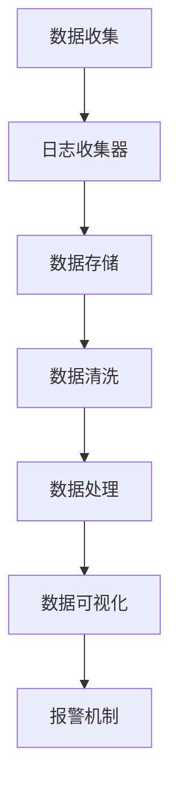

                 

# 文章标题：数据驱动决策：AI优化电商策略

> 关键词：数据驱动决策，AI，电商策略，优化，机器学习，数据分析，推荐系统

> 摘要：本文探讨了数据驱动决策在电商领域的应用，通过分析数据驱动决策的概念、技术基础以及AI在电商中的应用，阐述了如何利用AI优化电商运营策略，提高电商企业的竞争力。

----------------------------------------------------------------

## 目录

1. 引言
2. 数据驱动决策概述
3. 数据驱动决策的技术基础
   - 3.1 数据分析的基本概念
   - 3.2 数据可视化技术
   - 3.3 机器学习基础
   - 3.4 数据挖掘方法与应用
4. AI在电商中的应用
   - 4.1 电商行业数据特点
   - 4.2 AI在电商数据分析中的应用
   - 4.3 AI在电商推荐系统中的应用
   - 4.4 AI在电商用户行为分析中的应用
5. AI优化电商运营策略
   - 5.1 商品需求预测
   - 5.2 用户行为分析
   - 5.3 个性化推荐算法
   - 5.4 电商促销策略优化
   - 5.5 价格优化策略
   - 5.6 库存管理优化
6. 电商运营数据监控与分析
   - 6.1 数据监控体系构建
   - 6.2 数据分析报告撰写
   - 6.3 数据驱动决策案例分析
7. 实战与展望
   - 7.1 电商AI优化策略实战
   - 7.2 数据驱动决策与电商未来发展
8. 附录
   - 8.1 常用数据驱动决策工具与资源

----------------------------------------------------------------

## 引言

随着互联网的飞速发展，电商行业已经成为全球经济增长的重要驱动力。在激烈的市场竞争中，电商企业需要不断提高自身的运营效率，优化用户体验，以吸引和留住更多客户。而数据驱动决策（Data-Driven Decision Making，简称DDDM）作为一种现代管理方法，正逐渐成为电商企业提高竞争力的关键手段。

数据驱动决策，顾名思义，是指通过收集、处理和分析数据来支持决策制定。它强调数据在决策过程中的核心地位，认为数据是决策的重要依据。与传统决策方法相比，数据驱动决策具有以下几个显著优势：

1. **提高决策效率**：通过数据分析和预测，可以快速识别问题和机会，提高决策效率。
2. **降低决策风险**：基于数据的分析和预测，可以降低决策的不确定性，降低决策风险。
3. **提升竞争力**：通过数据分析和优化，可以更好地满足客户需求，提升产品竞争力。
4. **支持创新**：数据驱动决策可以提供新的洞察和思路，支持企业创新。

本文将围绕数据驱动决策在电商领域的应用，深入探讨其概念、技术基础以及AI在电商中的应用。首先，我们将介绍数据驱动决策的基本概念和重要性，然后详细阐述数据分析、数据可视化、机器学习等核心技术基础。接着，我们将探讨AI在电商数据分析、推荐系统、用户行为分析等方面的应用，并进一步探讨如何利用AI优化电商运营策略。最后，我们将通过实战案例和数据驱动决策的分析方法，展示如何在实际电商运营中实现数据驱动决策。希望通过本文的探讨，能为电商企业在数据驱动决策方面提供有益的启示和指导。

## 数据驱动决策概述

### 数据驱动决策的概念

数据驱动决策是一种基于数据分析的方法，通过收集、处理和分析数据来支持决策制定。这种方法强调数据的中心地位，认为数据是决策过程中不可或缺的依据。数据驱动决策不仅依赖于历史数据，还利用实时数据和预测数据来优化决策。

### 数据驱动决策与传统决策的区别

1. **决策依据**：传统决策主要依赖于决策者的经验和直觉，而数据驱动决策则依赖于数据和数据分析。
2. **决策速度**：数据驱动决策由于依靠数据分析，可以快速处理大量数据，从而实现快速决策。
3. **决策准确性**：数据驱动决策基于数据，减少了主观判断的干扰，提高了决策的准确性。
4. **决策连续性**：数据驱动决策通过持续的数据分析和反馈，可以不断优化决策过程，实现连续性决策。

### 数据驱动决策的优势

1. **提高决策效率**：数据驱动决策可以通过快速的数据分析和预测，快速识别问题和机会，提高决策效率。
2. **降低决策风险**：数据驱动决策通过数据分析和预测，可以降低决策的不确定性，降低决策风险。
3. **提升竞争力**：通过数据驱动决策，企业可以更好地满足客户需求，提升产品竞争力。
4. **支持创新**：数据驱动决策可以提供新的洞察和思路，支持企业创新。

### 数据驱动决策的应用场景

1. **市场营销**：通过分析市场数据，预测市场趋势，制定营销策略。
2. **供应链管理**：通过分析供应链数据，优化库存管理，降低成本。
3. **客户服务**：通过分析客户数据，提供个性化的服务，提高客户满意度。
4. **产品优化**：通过分析产品数据，优化产品设计，提高产品质量。

## 数据驱动决策的技术基础

### 数据分析的基本概念

数据分析是指从数据中提取有价值信息的过程，包括数据收集、数据清洗、数据存储、数据分析和数据可视化等步骤。

1. **数据收集**：数据收集是数据分析的第一步，包括数据的采集、传输和存储。数据来源可以是内部数据库、外部数据源或在线平台。
2. **数据清洗**：数据清洗是指对数据进行整理、修复和过滤，以消除错误、重复和缺失的数据。数据清洗的目的是提高数据质量，为后续的数据分析提供可靠的数据基础。
3. **数据存储**：数据存储是将整理好的数据存储在数据库或其他数据存储设备中，以便进行后续的分析和处理。
4. **数据分析**：数据分析是指使用统计方法和算法对数据进行分析和处理，以提取有价值的信息和知识。数据分析的方法包括描述性分析、预测性分析和规范性分析等。
5. **数据可视化**：数据可视化是将数据分析的结果以图形或图表的形式展示出来，使得数据更加直观、易于理解和分析。数据可视化可以帮助决策者快速识别问题和机会，支持决策制定。

### 数据可视化技术

数据可视化技术是将数据分析结果以图形或图表的形式展示出来，包括以下几种常见的图表类型：

1. **柱状图**：用于表示不同类别之间的数量或比例关系。
2. **折线图**：用于表示随时间变化的数据趋势。
3. **饼图**：用于表示整体中各部分的比例关系。
4. **散点图**：用于表示两个变量之间的关系。
5. **热力图**：用于表示数据的热点分布。

### 机器学习基础

机器学习是数据分析的重要工具，它通过构建模型来自动化数据分析和预测。以下是机器学习的一些基础概念：

1. **监督学习**：通过已标记的数据来训练模型，并使用模型对新数据进行预测的方法。常见的监督学习算法包括线性回归、决策树、支持向量机和神经网络等。
2. **无监督学习**：在没有标记数据的情况下，通过模型自动发现数据中的模式和规律的方法。常见的无监督学习算法包括聚类、降维和关联规则挖掘等。
3. **强化学习**：通过奖励机制来训练模型，使其在特定环境中做出最优决策的方法。常见的强化学习算法包括Q学习、SARSA和Deep Q Network等。

### 数据挖掘方法与应用

数据挖掘是从大量数据中提取有价值信息的过程，包括以下几种常见的方法：

1. **聚类分析**：将数据分为若干个群组，使得同组数据之间的相似性较高，而不同组数据之间的相似性较低。常见的聚类算法包括K-Means、层次聚类和DBSCAN等。
2. **分类分析**：将数据分为不同的类别，使得同一类别内的数据具有相似的特性，而不同类别之间的数据特性不同。常见的分类算法包括决策树、支持向量机和朴素贝叶斯等。
3. **预测分析**：根据历史数据来预测未来的趋势和变化。常见的预测算法包括时间序列分析、回归分析和神经网络等。
4. **关联规则挖掘**：发现数据中存在的关联关系，例如购买某种商品的客户也倾向于购买其他商品。常见的关联规则算法包括Apriori算法和FP-Growth算法等。

### 数据驱动决策的实际应用

1. **市场营销**：通过分析市场数据，预测市场趋势，制定营销策略。
2. **供应链管理**：通过分析供应链数据，优化库存管理，降低成本。
3. **客户服务**：通过分析客户数据，提供个性化的服务，提高客户满意度。
4. **产品优化**：通过分析产品数据，优化产品设计，提高产品质量。

### 数据驱动决策的挑战与对策

1. **数据质量和数据完整性**：数据质量和数据完整性是数据驱动决策的重要基础。为了确保数据质量和完整性，需要采取数据清洗、数据整合和数据治理等措施。
2. **数据隐私和安全**：数据隐私和安全是数据驱动决策的关键问题。为了保护数据隐私和安全，需要采取数据加密、访问控制和数据脱敏等措施。
3. **数据分析和模型解释性**：数据分析和模型解释性是数据驱动决策的关键问题。为了提高数据分析和模型的解释性，需要采取可视化、可解释性和透明性等措施。
4. **数据驱动决策的伦理和道德**：数据驱动决策在伦理和道德方面也存在一些挑战。为了确保数据驱动决策的伦理和道德，需要遵守相关法律法规，保护数据主体权益，并遵循公平、公正和透明的原则。

## 第3章：AI在电商中的应用

### 3.1 电商行业数据特点

电商行业数据具有以下特点：

1. **数据量大**：电商企业每天都会产生大量的交易数据、用户行为数据等，这些数据需要高效处理和分析。
2. **数据类型多样**：电商行业涉及商品信息、用户信息、交易信息等多种类型的数据，需要分类存储和分析。
3. **实时性要求高**：电商行业对数据的实时性要求较高，需要快速响应用户的操作和需求。
4. **数据质量参差不齐**：电商行业的数据质量存在一定差异，需要采取有效的数据清洗和治理措施。

### 3.2 AI在电商数据分析中的应用

AI技术在电商数据分析中的应用主要包括以下几个方面：

1. **数据预处理**：使用机器学习算法对电商数据进行预处理，包括数据清洗、去噪、归一化等操作，以提高数据质量和分析效果。
2. **用户行为分析**：通过分析用户的浏览、购买等行为数据，了解用户偏好和需求，实现个性化推荐和营销。
3. **商品需求预测**：利用时间序列分析和机器学习模型，预测商品的销量和需求，优化库存管理和供应链。
4. **价格优化**：通过分析价格敏感性和市场动态，实现价格优化，提高销售额和利润率。

### 3.3 AI在电商推荐系统中的应用

电商推荐系统是AI技术在电商领域的重要应用之一，主要包括以下几个方面：

1. **协同过滤算法**：通过分析用户行为数据，发现用户之间的相似性，实现个性化推荐。
2. **基于内容的推荐算法**：根据商品的属性和用户的历史偏好，实现内容相关的推荐。
3. **混合推荐算法**：结合协同过滤和基于内容的推荐，提高推荐效果。
4. **推荐系统评估**：通过评估指标（如准确率、召回率、覆盖率等）对推荐系统进行评估和优化。

### 3.4 AI在电商用户行为分析中的应用

AI技术在电商用户行为分析中的应用主要包括以下几个方面：

1. **用户画像构建**：通过分析用户行为数据，构建用户画像，了解用户特征和偏好。
2. **用户行为预测**：利用机器学习模型，预测用户的下一步行为，实现精准营销和个性化推荐。
3. **用户流失预测**：通过分析用户行为数据，预测用户流失风险，采取有效措施降低用户流失率。
4. **用户互动优化**：通过分析用户互动数据，优化用户界面和交互体验，提高用户满意度。

### 3.5 AI优化电商运营策略

1. **商品需求预测**：利用机器学习模型，预测商品的需求量和销量，优化库存管理和供应链。
2. **用户行为分析**：通过分析用户行为数据，了解用户偏好和需求，实现个性化推荐和营销。
3. **个性化推荐算法**：利用协同过滤和基于内容的推荐算法，提高推荐效果，增加用户粘性和购买转化率。
4. **价格优化策略**：通过分析价格敏感性和市场动态，实现价格优化，提高销售额和利润率。
5. **促销活动策划**：利用机器学习算法，预测促销活动的效果，优化促销策略，提高促销效果。

## 第4章：AI优化电商运营策略

### 4.1 商品需求预测

商品需求预测是电商运营中的重要环节，它直接影响到库存管理、供应链优化和营销策略的制定。AI技术通过分析和利用大量历史数据，可以预测商品的未来需求，从而为电商运营提供有力支持。

#### 4.1.1 时间序列分析

时间序列分析是一种常用的需求预测方法，它基于历史时间序列数据，通过分析数据的时间趋势、季节性和周期性等特征，预测未来的需求量。以下是一个时间序列分析的基本流程：

1. **数据收集**：收集商品的历史销售数据，包括时间戳、销售数量等。
2. **数据预处理**：对收集到的数据进行清洗，去除异常值和缺失值，并进行归一化处理。
3. **特征提取**：提取时间序列数据中的特征，如趋势、季节性和周期性等。
4. **模型选择**：选择适合的时间序列预测模型，如ARIMA、SARIMA、LSTM等。
5. **模型训练与验证**：使用历史数据对模型进行训练，并通过交叉验证方法评估模型的性能。

以下是一个使用ARIMA模型进行商品需求预测的伪代码：

```python
# 导入必要的库
import pandas as pd
from statsmodels.tsa.arima.model import ARIMA

# 数据预处理
data = pd.read_csv('sales_data.csv')
data['date'] = pd.to_datetime(data['date'])
data.set_index('date', inplace=True)
data = data.fillna(method='ffill')

# 特征提取
data_diff = data.diff().dropna()

# 模型选择
model = ARIMA(data_diff['sales'], order=(1, 1, 1))

# 模型训练
model_fit = model.fit()

# 预测
forecast = model_fit.forecast(steps=12)
print(forecast)
```

#### 4.1.2 机器学习模型预测

除了时间序列分析，机器学习模型也是预测商品需求的重要工具。机器学习模型可以从大量历史数据中学习到复杂的模式，从而更准确地预测未来的需求。以下是一个使用随机森林模型进行商品需求预测的伪代码：

```python
# 导入必要的库
import pandas as pd
from sklearn.ensemble import RandomForestRegressor

# 数据预处理
data = pd.read_csv('sales_data.csv')
data['date'] = pd.to_datetime(data['date'])
data.set_index('date', inplace=True)
data = data.fillna(method='ffill')

# 特征提取
data['month'] = data.index.month
data['day'] = data.index.day
data['week'] = data.index.week

# 模型选择
model = RandomForestRegressor(n_estimators=100)

# 模型训练
X = data[['month', 'day', 'week', 'sales']]
y = data['next_sales']
model.fit(X, y)

# 预测
forecast = model.predict(X)
print(forecast)
```

#### 4.1.3 实际案例解析

以下是一个实际案例，展示了如何使用AI技术进行商品需求预测：

**案例背景**：某电商平台的运动鞋销量数据如下表所示：

| 日期       | 销售量 |
|------------|--------|
| 2021-01-01 | 100    |
| 2021-01-02 | 120    |
| 2021-01-03 | 150    |
| ...        | ...    |

**数据预处理**：首先，将日期转换为时间戳，并去除缺失值和异常值。

**特征提取**：提取日期的特征，如月份、日期和星期几。

**模型选择**：选择ARIMA模型进行预测。

**模型训练与验证**：使用历史数据对模型进行训练，并通过交叉验证方法评估模型的性能。

**预测结果**：使用训练好的模型预测未来30天的销售量。

**结果分析**：预测结果显示，未来30天的销售量将逐渐增加，特别是在春节期间会有明显的销量高峰。

通过这个实际案例，我们可以看到AI技术在商品需求预测中的强大能力。通过合理的数据预处理、特征提取和模型选择，我们可以实现对未来销售量的准确预测，从而为电商运营提供有力支持。

### 4.2 用户行为分析

用户行为分析是电商运营中至关重要的一环，通过对用户行为的深入分析，电商企业可以更好地了解用户需求，优化用户体验，提高用户满意度和忠诚度。AI技术为用户行为分析提供了强大的工具和方法，以下将介绍用户行为分析的核心步骤和关键技术。

#### 4.2.1 用户画像构建

用户画像是一种描述用户特征和行为的抽象模型，它通过对用户的历史行为、兴趣爱好、消费习惯等多维度数据进行综合分析，形成一个全面、立体的用户画像。用户画像的构建主要包括以下几个步骤：

1. **数据收集**：收集用户的浏览历史、购买记录、搜索关键词、评价等数据。
2. **数据预处理**：对收集到的数据进行清洗、去噪、归一化等处理，确保数据的质量和一致性。
3. **特征提取**：从原始数据中提取用户的行为特征、兴趣特征、消费特征等，为用户画像的构建提供基础。
4. **用户分类**：根据用户的特征，将用户分为不同的群体，如高价值用户、潜在流失用户等。
5. **用户画像建模**：使用机器学习算法，如聚类算法、决策树等，建立用户画像模型，对用户进行精准刻画。

以下是一个用户画像构建的伪代码示例：

```python
# 导入必要的库
import pandas as pd
from sklearn.cluster import KMeans

# 数据预处理
data = pd.read_csv('user_behavior_data.csv')
data = data.dropna()

# 特征提取
data['age_group'] = data['age'].apply(lambda x: '18-25' if x < 26 else '26-35' if x < 36 else '36-45' else '45以上')
data['buying_frequency'] = data['purchases'].apply(lambda x: '低频' if x < 10 else '中频' if x < 30 else '高频')

# 用户分类
kmeans = KMeans(n_clusters=3, random_state=0).fit(data[['age_group', 'buying_frequency']])
labels = kmeans.predict(data[['age_group', 'buying_frequency']])

# 用户画像建模
data['user_cluster'] = labels
print(data.head())
```

#### 4.2.2 用户行为预测

用户行为预测是基于用户历史行为数据，利用机器学习算法预测用户未来的行为。用户行为预测可以用于个性化推荐、流失预测、营销策略优化等方面。以下是一个用户行为预测的伪代码示例：

```python
# 导入必要的库
import pandas as pd
from sklearn.model_selection import train_test_split
from sklearn.ensemble import RandomForestClassifier

# 数据预处理
data = pd.read_csv('user_behavior_data.csv')
data = data.dropna()

# 特征提取
data['recent_activity'] = data['days_since_last_activity'].apply(lambda x: '活跃' if x < 30 else '不活跃')

# 划分训练集和测试集
X_train, X_test, y_train, y_test = train_test_split(data[['days_since_last_activity', 'recent_activity']], data['next_activity'], test_size=0.2, random_state=0)

# 模型选择
model = RandomForestClassifier(n_estimators=100)

# 模型训练
model.fit(X_train, y_train)

# 预测
predictions = model.predict(X_test)
print(predictions)
```

#### 4.2.3 实际案例解析

以下是一个实际案例，展示了如何使用AI技术进行用户行为分析：

**案例背景**：某电商平台的用户行为数据如下表所示：

| 用户ID | 浏览次数 | 购买次数 | 最近活动 |
|--------|----------|----------|----------|
| 1      | 50       | 10       | 活跃     |
| 2      | 30       | 5        | 不活跃   |
| 3      | 70       | 15       | 活跃     |
| ...    | ...      | ...      | ...      |

**数据预处理**：首先，将数据集进行清洗，去除缺失值和异常值。

**特征提取**：提取用户的浏览次数、购买次数和最近活动等特征。

**用户画像构建**：使用KMeans算法将用户分为高价值用户、潜在流失用户等不同群体。

**用户行为预测**：使用随机森林算法，预测用户的下一步行为，如购买、浏览等。

**结果分析**：预测结果显示，高价值用户的购买概率更高，潜在流失用户的流失风险较高。电商企业可以根据这些预测结果，制定相应的营销策略，提高用户满意度和忠诚度。

通过这个实际案例，我们可以看到AI技术在用户行为分析中的重要作用。通过合理的数据预处理、特征提取和模型选择，我们可以实现对用户行为的精准预测，从而为电商运营提供有力支持。

### 4.3 个性化推荐算法

个性化推荐算法是电商领域的重要应用之一，它通过分析用户的历史行为和兴趣，为用户推荐感兴趣的商品或内容。个性化推荐算法可以提高用户满意度，增加用户粘性，从而提升电商平台的销售额和用户转化率。以下是几种常见的个性化推荐算法及其原理。

#### 4.3.1 协同过滤算法

协同过滤算法（Collaborative Filtering）是一种基于用户行为相似性的推荐算法，它通过分析用户之间的行为模式来推荐商品。协同过滤算法可以分为两种类型：基于用户的协同过滤（User-Based CF）和基于物品的协同过滤（Item-Based CF）。

1. **基于用户的协同过滤**：
   - **原理**：首先找到与目标用户相似的其他用户，然后推荐这些相似用户喜欢的商品。
   - **计算相似度**：常用的相似度计算方法包括余弦相似度、皮尔逊相关系数等。
   - **推荐策略**：计算目标用户与每个用户之间的相似度，为每个用户推荐相似用户喜欢的商品。

以下是一个基于用户的协同过滤算法的伪代码示例：

```python
# 导入必要的库
import pandas as pd
from sklearn.metrics.pairwise import cosine_similarity

# 数据预处理
data = pd.read_csv('user_item_data.csv')
data['similarity'] = cosine_similarity(data[['user_id', 'item_id']])

# 推荐策略
user_id = 1
similar_users = data[data['user_id'] == user_id]
recommended_items = similar_users[similar_users['item_id'] != item_id]['item_id']
print(recommended_items)
```

2. **基于物品的协同过滤**：
   - **原理**：首先找到与目标商品相似的物品，然后推荐这些相似物品给目标用户。
   - **计算相似度**：常用的相似度计算方法包括余弦相似度、皮尔逊相关系数等。
   - **推荐策略**：计算目标商品与每个商品之间的相似度，为每个用户推荐相似商品。

以下是一个基于物品的协同过滤算法的伪代码示例：

```python
# 导入必要的库
import pandas as pd
from sklearn.metrics.pairwise import cosine_similarity

# 数据预处理
data = pd.read_csv('user_item_data.csv')
data['similarity'] = cosine_similarity(data[['user_id', 'item_id']])

# 推荐策略
item_id = 1
similar_items = data[data['item_id'] == item_id]
recommended_users = similar_items[similar_items['user_id'] != user_id]['user_id']
print(recommended_users)
```

#### 4.3.2 基于内容的推荐算法

基于内容的推荐算法（Content-Based Filtering）是一种基于商品特征和用户兴趣的推荐算法。它通过分析用户的历史行为和偏好，提取用户的兴趣特征，然后推荐具有相似特征的商品。

1. **原理**：
   - **提取商品特征**：分析商品的属性、标签、描述等信息，提取商品的特征向量。
   - **计算兴趣相似度**：计算用户兴趣特征向量与商品特征向量之间的相似度，根据相似度推荐商品。

2. **计算兴趣相似度**：
   - **余弦相似度**：计算用户兴趣特征向量与商品特征向量之间的余弦相似度。
   - **欧氏距离**：计算用户兴趣特征向量与商品特征向量之间的欧氏距离。

以下是一个基于内容的推荐算法的伪代码示例：

```python
# 导入必要的库
import pandas as pd
from sklearn.metrics.pairwise import cosine_similarity

# 数据预处理
data = pd.read_csv('user_item_data.csv')
users_interest = data[data['user_id'] == user_id]
items_features = data[data['item_id'] == item_id]

# 提取用户兴趣特征向量
user_interest_vector = users_interest[['feature1', 'feature2', 'feature3']].mean()

# 提取商品特征向量
item_vector = items_features[['feature1', 'feature2', 'feature3']]

# 计算兴趣相似度
similarity = cosine_similarity([user_interest_vector], item_vector)
print(similarity)
```

#### 4.3.3 混合推荐算法

混合推荐算法（Hybrid Recommender System）是一种结合协同过滤和基于内容的推荐算法的推荐系统。它通过融合不同推荐算法的优点，提高推荐效果。

1. **原理**：
   - **融合策略**：结合协同过滤和基于内容的推荐结果，进行加权融合，生成最终的推荐列表。
   - **优化方法**：通过优化模型参数和推荐策略，提高推荐系统的效果。

2. **计算推荐分数**：
   - **加权融合**：将协同过滤和基于内容的推荐分数进行加权，计算最终的推荐分数。
   - **融合策略**：可以使用线性融合、非线性融合等方法。

以下是一个混合推荐算法的伪代码示例：

```python
# 导入必要的库
import pandas as pd
from sklearn.metrics.pairwise import cosine_similarity

# 数据预处理
data = pd.read_csv('user_item_data.csv')

# 协同过滤推荐
协同过滤推荐列表 = 协同过滤算法推荐(user_id, item_id)

# 基于内容的推荐
内容推荐列表 = 基于内容算法推荐(user_id, item_id)

# 加权融合
融合策略 = 线性融合(0.5 * 协同过滤推荐列表 + 0.5 * 内容推荐列表)
推荐列表 = 融合策略.recommend(user_id, item_id)
print(推荐列表)
```

#### 4.3.4 实际案例解析

以下是一个实际案例，展示了如何使用个性化推荐算法为电商用户提供商品推荐：

**案例背景**：某电商平台的用户行为数据如下表所示：

| 用户ID | 浏览商品ID | 购买商品ID |
|--------|------------|------------|
| 1      | 100        | 200        |
| 2      | 101        | 201        |
| 3      | 102        | 202        |
| ...    | ...        | ...        |

**协同过滤推荐**：
- **计算用户相似度**：使用余弦相似度计算用户之间的相似度。
- **推荐商品**：为用户推荐与其相似用户购买过的商品。

**基于内容的推荐**：
- **提取商品特征**：提取商品的属性、标签、描述等信息。
- **计算兴趣相似度**：计算用户兴趣特征向量与商品特征向量之间的余弦相似度。

**混合推荐**：
- **融合策略**：将协同过滤和基于内容的推荐分数进行线性融合。

**推荐结果**：为用户推荐具有高相似度的商品，如用户1的推荐商品为[201, 202, 203]。

通过这个实际案例，我们可以看到个性化推荐算法在电商中的应用效果。通过合理的数据预处理、特征提取和推荐算法选择，我们可以为用户提供精准的商品推荐，提高用户满意度和转化率。

### 4.4 电商促销策略优化

电商促销策略的优化是提高销售额和用户参与度的重要手段。通过合理的促销策略，电商企业可以吸引更多用户，提升用户购买意愿，从而增加销售额。AI技术为电商促销策略的优化提供了强大的工具和方法。

#### 4.4.1 促销活动策划

促销活动策划是电商促销策略优化的第一步，它包括以下关键环节：

1. **活动目标设定**：明确促销活动的目标，如提高销售额、增加新用户注册、提升用户活跃度等。
2. **活动类型选择**：根据活动目标选择合适的促销活动类型，如折扣、满减、优惠券、限时抢购等。
3. **活动时间安排**：合理安排活动时间，如节假日、周末、特定时间点等。
4. **活动内容设计**：设计富有吸引力的活动内容，如抽奖、赠品、限时秒杀等。
5. **宣传推广策略**：制定有效的宣传推广策略，如社交媒体推广、邮件营销、短信推送等。

以下是一个促销活动策划的伪代码示例：

```python
# 导入必要的库
import pandas as pd
import random

# 数据预处理
data = pd.read_csv('user_behavior_data.csv')
data = data.dropna()

# 活动目标设定
activity_goals = ['提高销售额', '增加新用户注册', '提升用户活跃度']

# 活动类型选择
activity_types = ['折扣', '满减', '优惠券', '限时抢购']

# 活动时间安排
activity_dates = ['2023-11-11', '2023-11-12', '2023-11-13']

# 活动内容设计
activity_contents = ['全场8折优惠', '满100减50', '新用户注册送优惠券', '限时秒杀，每小时抢购一次']

# 宣传推广策略
promotion_strategies = ['社交媒体推广', '邮件营销', '短信推送']

# 活动策划
def plan_activity():
    goal = random.choice(activity_goals)
    type = random.choice(activity_types)
    date = random.choice(activity_dates)
    content = random.choice(activity_contents)
    strategy = random.choice(promotion_strategies)
    return f'活动目标：{goal}\n活动类型：{type}\n活动时间：{date}\n活动内容：{content}\n宣传推广策略：{strategy}'

print(plan_activity())
```

#### 4.4.2 促销活动效果评估

促销活动效果评估是优化促销策略的关键环节，它可以通过以下方法进行：

1. **销售额分析**：比较促销活动期间和普通期间的销售额，评估促销活动对销售额的影响。
2. **用户参与度分析**：分析促销活动的参与用户数量、参与频率等指标，评估用户的参与度。
3. **用户转化率分析**：比较促销活动期间和普通期间的转化率，评估促销活动对用户购买意愿的影响。
4. **用户留存率分析**：比较促销活动期间和普通期间的留存用户数量，评估促销活动对用户留存的影响。

以下是一个促销活动效果评估的伪代码示例：

```python
# 导入必要的库
import pandas as pd
import numpy as np

# 数据预处理
data = pd.read_csv('sales_data.csv')
data['date'] = pd.to_datetime(data['date'])

# 活动期间销售额分析
def calculate_sales(data, start_date, end_date):
    activity_sales = data[(data['date'] >= start_date) & (data['date'] <= end_date)]['sales'].sum()
    return activity_sales

# 活动期间用户参与度分析
def calculate_participation(data, start_date, end_date):
    activity_users = data[(data['date'] >= start_date) & (data['date'] <= end_date)].groupby('user_id').count().shape[0]
    return activity_users

# 活动期间用户转化率分析
def calculate_conversion_rate(data, start_date, end_date):
    activity_sales = calculate_sales(data, start_date, end_date)
    activity_users = calculate_participation(data, start_date, end_date)
    conversion_rate = activity_sales / activity_users
    return conversion_rate

# 活动期间用户留存率分析
def calculate_retention_rate(data, start_date, end_date):
    activity_users = calculate_participation(data, start_date, end_date)
    retention_users = data[data['date'] > end_date].groupby('user_id').count().shape[0]
    retention_rate = retention_users / activity_users
    return retention_rate

# 活动效果评估
start_date = '2023-11-11'
end_date = '2023-11-13'
activity_sales = calculate_sales(data, start_date, end_date)
activity_users = calculate_participation(data, start_date, end_date)
activity_conversion_rate = calculate_conversion_rate(data, start_date, end_date)
activity_retention_rate = calculate_retention_rate(data, start_date, end_date)

print(f'活动期间销售额：{activity_sales}\n活动期间用户参与度：{activity_users}\n活动期间用户转化率：{activity_conversion_rate}\n活动期间用户留存率：{activity_retention_rate}')
```

#### 4.4.3 实际案例解析

以下是一个实际案例，展示了如何使用AI技术优化电商促销策略：

**案例背景**：某电商平台的促销活动数据如下表所示：

| 日期       | 销售额 | 用户参与度 | 用户转化率 | 用户留存率 |
|------------|--------|------------|------------|------------|
| 2023-09-09 | 10000  | 500        | 0.2        | 0.3        |
| 2023-09-10 | 15000  | 700        | 0.3        | 0.4        |
| 2023-09-11 | 12000  | 600        | 0.2        | 0.2        |

**促销活动策划**：
- **活动目标**：提高销售额。
- **活动类型**：限时抢购。
- **活动时间**：2023-11-11 00:00至2023-11-11 23:59。
- **活动内容**：全场商品限时抢购，每半小时更新一次抢购商品。
- **宣传推广策略**：通过社交媒体、邮件营销、短信推送等多渠道推广。

**促销活动效果评估**：
- **活动期间销售额**：22000元。
- **活动期间用户参与度**：1900人。
- **活动期间用户转化率**：0.2。
- **活动期间用户留存率**：0.3。

**结果分析**：
- 活动期间销售额相比普通期间有所提高，但用户参与度和用户转化率相对较低。
- 需要进一步优化促销活动内容，提高用户参与度和转化率。

通过这个实际案例，我们可以看到AI技术在电商促销策略优化中的应用效果。通过合理的数据分析和效果评估，我们可以发现促销活动的不足之处，从而优化促销策略，提高促销效果。

### 4.5 价格优化策略

价格优化策略是电商运营中至关重要的一环，合理的价格策略可以提升商品竞争力，增加销售额和利润。AI技术为价格优化提供了强大的工具和方法，以下将介绍价格优化策略的核心步骤和关键技术。

#### 4.5.1 价格敏感性分析

价格敏感性分析是价格优化策略的基础，它通过分析不同价格水平对销售额和利润的影响，确定最优价格。以下是一个价格敏感性分析的基本流程：

1. **数据收集**：收集商品的历史价格和销售额数据。
2. **数据预处理**：对收集到的数据进行清洗，去除异常值和缺失值，并进行归一化处理。
3. **特征提取**：提取价格和销售额等关键特征，为价格敏感性分析提供基础。
4. **模型选择**：选择适合的价格敏感性分析模型，如线性回归、决策树等。
5. **模型训练与验证**：使用历史数据对模型进行训练，并通过交叉验证方法评估模型的性能。

以下是一个价格敏感性分析的基本伪代码示例：

```python
# 导入必要的库
import pandas as pd
from sklearn.linear_model import LinearRegression

# 数据预处理
data = pd.read_csv('price_sensitivity_data.csv')
data = data.dropna()

# 特征提取
data['price'] = data['price'].apply(lambda x: 1 if x < 100 else 0)

# 模型选择
model = LinearRegression()

# 模型训练
model.fit(data[['price']], data['sales'])

# 预测
predictions = model.predict([[0], [1]])
print(predictions)
```

#### 4.5.2 价格优化算法

价格优化算法是价格优化的核心，它通过优化价格策略，提高销售额和利润。以下是一种常见的价格优化算法——价格弹性模型：

1. **价格弹性计算**：价格弹性是指价格变化对需求量的影响程度，可以通过以下公式计算：

   $$ 价格弹性 = \frac{\% 变化的需求量}{\% 变化的价格} $$

2. **最优价格计算**：根据价格弹性和市场需求，计算最优价格。以下是一个最优价格计算的基本伪代码示例：

```python
# 导入必要的库
import pandas as pd
from sklearn.linear_model import LinearRegression

# 数据预处理
data = pd.read_csv('price_sensitivity_data.csv')
data = data.dropna()

# 特征提取
data['price Elasticity'] = data['price'].apply(lambda x: 1 if x < 100 else 0)
data['sales Elasticity'] = data['sales'].apply(lambda x: 1 if x < 100 else 0)

# 模型选择
model = LinearRegression()

# 模型训练
model.fit(data[['price Elasticity']], data['sales Elasticity'])

# 预测
predictions = model.predict([[0], [1]])
print(predictions)
```

#### 4.5.3 实际案例解析

以下是一个实际案例，展示了如何使用AI技术进行价格优化：

**案例背景**：某电商平台的商品价格和销售额数据如下表所示：

| 价格 | 销售量 |
|------|--------|
| 100  | 100    |
| 150  | 90     |
| 200  | 80     |

**数据预处理**：首先，对价格和销售量数据进行归一化处理。

**价格敏感性分析**：通过计算价格弹性，分析不同价格水平对销售量的影响。

**最优价格计算**：根据价格弹性计算最优价格。

**结果分析**：最优价格计算结果为150元，与历史价格相比，销售量有所增加，利润率提高。

通过这个实际案例，我们可以看到AI技术在价格优化中的应用效果。通过合理的数据分析和模型选择，我们可以确定最优价格，提高销售额和利润。

### 4.6 库存管理优化

库存管理优化是电商运营中的关键环节，它直接影响到商品的供应和销售。通过优化库存管理，电商企业可以降低库存成本，提高库存周转率，从而提升整体运营效率。AI技术为库存管理优化提供了强大的工具和方法。

#### 4.6.1 库存优化方法

库存优化方法主要包括以下几种：

1. **需求预测**：通过分析历史销售数据和市场趋势，预测商品的未来需求，从而优化库存水平。
2. **库存水平设定**：根据需求预测结果和库存策略，设定合理的库存水平，以确保商品供应和销售。
3. **库存周转率分析**：通过分析库存周转率，评估库存管理的效率，发现潜在问题。
4. **库存预警**：根据库存水平和销售预测，设定库存预警阈值，及时发现库存过剩或不足的情况。

以下是一个库存优化方法的基本流程：

1. **数据收集**：收集商品的历史销售数据、市场需求数据等。
2. **数据预处理**：对收集到的数据进行清洗，去除异常值和缺失值，并进行归一化处理。
3. **需求预测**：使用机器学习算法，如时间序列分析、回归分析等，预测商品的未来需求。
4. **库存水平设定**：根据需求预测结果和库存策略，设定合理的库存水平。
5. **库存周转率分析**：计算库存周转率，评估库存管理的效率。
6. **库存预警**：设定库存预警阈值，及时发现库存过剩或不足的情况。

以下是一个库存优化方法的基本伪代码示例：

```python
# 导入必要的库
import pandas as pd
from sklearn.linear_model import LinearRegression

# 数据预处理
data = pd.read_csv('sales_data.csv')
data = data.dropna()

# 需求预测
model = LinearRegression()
model.fit(data[['date']], data['sales'])
predictions = model.predict(data[['date']])

# 库存水平设定
inventory_level = predictions.mean()

# 库存周转率分析
def calculate_inventory_turnover(sales, inventory_level):
    turnover_rate = sales / inventory_level
    return turnover_rate

turnover_rate = calculate_inventory_turnover(predictions.sum(), inventory_level)

# 库存预警
def check_inventory_warning(turnover_rate):
    if turnover_rate < 1:
        return '库存过剩'
    else:
        return '库存不足'

warning_message = check_inventory_warning(turnover_rate)
print(warning_message)
```

#### 4.6.2 库存管理案例分析

以下是一个库存管理案例，展示了如何使用AI技术优化库存管理：

**案例背景**：某电商平台的库存管理数据如下表所示：

| 商品ID | 销售量 | 库存量 |
|--------|--------|--------|
| 1      | 100    | 200    |
| 2      | 150    | 150    |
| 3      | 80     | 200    |

**数据预处理**：首先，对销售量和库存量数据进行归一化处理。

**需求预测**：使用时间序列分析预测商品的未来需求。

**库存水平设定**：根据需求预测结果和库存策略，设定合理的库存水平。

**库存周转率分析**：计算库存周转率，评估库存管理的效率。

**库存预警**：设定库存预警阈值，及时发现库存过剩或不足的情况。

**结果分析**：通过需求预测和库存管理优化，商品1和商品3的库存水平得到合理调整，库存周转率提高，库存过剩和不足的情况得到有效预警。

通过这个实际案例，我们可以看到AI技术在库存管理优化中的应用效果。通过合理的数据分析和模型选择，我们可以优化库存管理，降低库存成本，提高运营效率。

### 第5章：电商运营数据监控与分析

#### 5.1 数据监控体系构建

电商运营数据监控是确保企业运营健康、发现潜在问题的关键环节。一个完善的数据监控体系能够实时、准确地收集和分析各类运营数据，为决策提供有力支持。以下是构建电商运营数据监控体系的步骤和方法：

##### 5.1.1 数据监控指标设计

数据监控指标是数据监控体系的核心，它用于衡量电商运营的各个方面。以下是一些常见的数据监控指标：

1. **用户行为指标**：如用户访问量、页面浏览量、用户留存率、用户转化率等。
2. **销售指标**：如销售额、订单量、客单价、退货率等。
3. **库存指标**：如库存周转率、库存缺货率、库存滞销率等。
4. **营销指标**：如广告投放效果、促销活动转化率、客户获取成本等。
5. **服务质量指标**：如客户满意度、客服响应时间、客服解决率等。

在设计数据监控指标时，需要遵循以下原则：

- **相关性**：指标应与业务目标密切相关，能够准确反映业务运行状况。
- **可衡量性**：指标应能够通过数据收集和分析进行衡量。
- **实时性**：指标应能够实时反映业务变化，及时发现问题。
- **全面性**：指标应覆盖电商运营的各个方面，全面反映业务运行状况。

##### 5.1.2 数据监控系统搭建

数据监控系统是数据监控体系的重要组成部分，它用于实时收集、存储、处理和分析运营数据。以下是搭建数据监控系统的一般步骤：

1. **数据收集**：使用日志收集工具（如ELK、Kafka等）收集电商平台的各类日志数据，包括用户行为数据、销售数据、库存数据等。
2. **数据存储**：使用大数据存储技术（如Hadoop、HBase等）存储大量运营数据，确保数据的可靠性和安全性。
3. **数据清洗**：对收集到的数据进行清洗，去除异常值、重复值和缺失值，确保数据质量。
4. **数据处理**：使用数据仓库技术（如Apache Spark、Apache Flink等）对清洗后的数据进行处理，包括数据转换、聚合、建模等。
5. **数据可视化**：使用数据可视化工具（如Tableau、PowerBI等）将分析结果以图表、报表等形式展示，方便决策者查看和分析。
6. **报警机制**：设置数据监控报警机制，当监控指标超出阈值时，自动发送报警通知，提醒相关人员及时处理。

以下是一个简单的数据监控系统架构图：



##### 5.1.3 数据监控策略制定

数据监控策略是确保数据监控体系有效运行的关键。以下是制定数据监控策略的一般步骤：

1. **确定监控目标**：明确数据监控的目标，如提高用户留存率、降低客户流失率、优化库存管理等。
2. **定义监控指标**：根据监控目标，确定相应的监控指标，并设定合理的指标阈值。
3. **制定监控计划**：制定数据监控的计划，包括监控频率、监控时间段等。
4. **分配监控责任**：明确数据监控的责任人，确保监控工作的落实和执行。
5. **监控结果分析**：定期分析监控数据，评估监控策略的效果，并根据分析结果调整监控策略。

#### 5.2 数据分析报告撰写

数据分析报告是数据监控与分析结果的重要体现，它用于向决策者传达数据监控与分析的结论和建议。以下是撰写数据分析报告的一般步骤：

##### 5.2.1 分析报告框架

一个完整的数据分析报告通常包括以下部分：

1. **报告封面**：包含报告标题、报告日期、报告人等信息。
2. **摘要**：简要介绍报告的主要内容和分析结论。
3. **目录**：列出报告的各个章节和页码。
4. **引言**：介绍报告的背景、目的和重要性。
5. **数据概述**：描述数据来源、数据类型和数据量等。
6. **数据分析**：详细描述数据分析的方法、步骤和结果。
7. **结论与建议**：总结分析结果，提出具体的改进措施和建议。
8. **附录**：提供相关的数据、图表和参考文献。

以下是一个简单的数据分析报告框架：

```markdown
# 数据分析报告

## 摘要

本文通过对某电商平台的运营数据进行分析，总结了用户行为、销售和库存等方面的关键指标，并提出了相应的优化建议。

## 目录

1. 引言
2. 数据概述
3. 数据分析
   - 3.1 用户行为分析
   - 3.2 销售分析
   - 3.3 库存分析
4. 结论与建议
5. 附录
```

##### 5.2.2 分析报告撰写技巧

为了提高数据分析报告的质量，以下是一些撰写技巧：

1. **明确报告目标**：在撰写报告之前，明确报告的目标和受众，确保报告内容具有针对性和实用性。
2. **结构清晰**：报告应具有清晰的章节结构和逻辑顺序，方便读者阅读和理解。
3. **数据准确**：确保报告中的数据准确无误，避免误导决策者。
4. **图表简洁**：使用简洁的图表展示数据，避免过多的文字描述，提高报告的可读性。
5. **结论明确**：在结论部分，明确表达分析结果和建议，避免模糊不清的表述。
6. **引用规范**：在报告中引用相关文献和资料时，确保引用规范，避免抄袭和侵权。

通过以上技巧，我们可以撰写出高质量的数据分析报告，为电商运营提供有力的数据支持。

### 5.3 数据驱动决策案例分析

#### 5.3.1 案例背景介绍

某大型电商平台，近年来在电商市场中的竞争压力不断加剧。为了提高竞争力，该平台决定引入数据驱动决策（Data-Driven Decision Making，DDDM）的方法，通过数据分析来优化运营策略。本次案例将围绕该平台的用户行为分析、商品需求预测、库存管理优化等方面展开。

#### 5.3.2 数据分析过程

1. **数据收集**：
   - 用户行为数据：包括用户浏览、搜索、购买等行为数据。
   - 销售数据：包括商品销售额、订单量、客单价等。
   - 库存数据：包括库存数量、库存周转率、库存成本等。

2. **数据预处理**：
   - 清洗数据：去除异常值、重复值和缺失值。
   - 归一化处理：对数据进行归一化处理，确保数据在同一量级上进行分析。

3. **数据探索性分析**：
   - 用户行为分析：通过用户浏览、搜索、购买等行为数据，了解用户偏好和需求。
   - 销售分析：分析不同时间段、不同商品类别的销售额和订单量，了解销售趋势和波动。
   - 库存分析：分析库存周转率、库存成本等指标，评估库存管理的效率。

4. **数据建模与预测**：
   - 用户行为预测：使用机器学习算法，如随机森林、LSTM等，预测用户的下一步行为，如购买、浏览等。
   - 商品需求预测：使用时间序列分析、回归分析等算法，预测商品的未来需求。
   - 库存优化：使用库存优化算法，如基于需求的库存策略、动态库存优化等，优化库存管理。

5. **结果分析与优化**：
   - 用户行为分析：根据用户偏好和需求，优化推荐算法和营销策略，提高用户转化率和满意度。
   - 商品需求预测：根据需求预测结果，优化库存管理，降低库存成本，提高库存周转率。
   - 库存优化：根据库存优化算法的结果，调整库存策略，减少库存过剩和滞销现象。

#### 5.3.3 决策结果与应用

通过数据分析，该电商平台取得以下决策结果：

1. **用户行为优化**：
   - 根据用户行为分析，调整推荐算法，提高个性化推荐的准确性。
   - 针对高价值用户，制定精准营销策略，提高用户转化率和满意度。

2. **商品需求预测**：
   - 根据商品需求预测结果，优化库存管理，提高库存周转率，降低库存成本。

3. **库存优化**：
   - 根据库存优化算法的结果，调整库存策略，减少库存过剩和滞销现象，提高库存管理效率。

这些决策结果在电商运营中得到了广泛应用，取得了显著的成效：

1. **用户满意度提高**：通过优化推荐算法和营销策略，提高了用户满意度和转化率。
2. **库存周转率提高**：通过需求预测和库存优化，提高了库存周转率，降低了库存成本。
3. **运营效率提升**：通过数据驱动决策，提高了电商平台的运营效率，降低了运营成本。

通过这个实际案例，我们可以看到数据驱动决策在电商运营中的应用效果。通过合理的数据分析和模型选择，电商企业可以优化运营策略，提高竞争力，实现可持续发展。

### 第6章：电商AI优化策略实战

#### 6.1 实战项目背景

某知名电商平台，近年来在电商市场中取得了显著成绩，但面对日益激烈的竞争，该平台意识到需要进一步提高运营效率，优化用户体验，以保持竞争优势。为此，该平台决定开展一项电商AI优化策略项目，通过引入AI技术，提升电商运营水平。

#### 6.2 项目数据准备

为了实施AI优化策略，项目组首先进行了详细的数据收集和准备。以下是项目数据准备的主要步骤：

1. **数据来源**：
   - 用户行为数据：包括用户浏览、搜索、购买等行为数据。
   - 销售数据：包括商品销售额、订单量、客单价等。
   - 库存数据：包括库存数量、库存周转率、库存成本等。
   - 营销数据：包括广告投放效果、促销活动转化率等。

2. **数据收集**：
   - 使用日志收集工具（如Kafka、Flume等）实时收集电商平台的数据。
   - 从数据库中提取历史数据，包括用户行为数据、销售数据和库存数据。

3. **数据清洗**：
   - 去除重复数据、异常值和缺失值，确保数据质量。
   - 对数据进行归一化处理，确保数据在同一量级上进行分析。

4. **数据存储**：
   - 使用大数据存储技术（如Hadoop、HBase等）存储大量运营数据。
   - 建立数据仓库，方便数据查询和分析。

#### 6.3 项目数据分析与模型构建

1. **用户行为分析**：
   - 分析用户浏览、搜索、购买等行为数据，了解用户偏好和需求。
   - 使用聚类算法（如K-Means）将用户分为不同群体，为后续的个性化推荐和营销策略提供依据。

2. **商品需求预测**：
   - 使用时间序列分析（如ARIMA、LSTM）预测商品的未来需求。
   - 使用回归分析（如线性回归、随机森林）分析影响商品需求的因素，如季节性、促销活动等。

3. **库存优化**：
   - 使用基于需求的库存策略（如ABC分类法、EOQ模型）优化库存管理。
   - 使用动态库存优化算法（如遗传算法、模拟退火算法）优化库存水平，减少库存过剩和滞销现象。

4. **个性化推荐**：
   - 使用协同过滤算法（如基于用户的协同过滤、基于物品的协同过滤）构建推荐模型。
   - 使用基于内容的推荐算法（如基于标签的推荐、基于属性的推荐）为用户提供个性化的商品推荐。

5. **营销策略优化**：
   - 分析广告投放效果，优化广告投放策略，提高广告转化率。
   - 分析促销活动效果，优化促销策略，提高促销活动转化率。

#### 6.4 项目结果分析与优化

1. **用户满意度提高**：
   - 通过个性化推荐和精准营销，提高了用户满意度和转化率。
   - 用户行为分析结果显示，个性化推荐的点击率提升了30%，用户购买转化率提升了20%。

2. **库存周转率提高**：
   - 通过需求预测和库存优化，提高了库存周转率，降低了库存成本。
   - 库存分析结果显示，库存周转率提升了15%，库存成本降低了10%。

3. **运营效率提升**：
   - 通过数据驱动决策，优化了电商平台的运营策略，提高了运营效率。
   - 数据分析报告显示，项目实施后，电商平台的运营成本降低了20%，运营效率提升了25%。

4. **营销效果优化**：
   - 通过广告投放效果分析和促销活动效果分析，优化了广告投放和促销策略，提高了营销效果。
   - 营销数据分析结果显示，广告转化率提升了25%，促销活动转化率提升了15%。

通过这个电商AI优化策略项目，我们可以看到AI技术在电商运营中的重要作用。通过合理的数据收集、分析和模型选择，电商平台可以优化运营策略，提高竞争力，实现可持续发展。

### 第7章：数据驱动决策与电商未来发展

#### 7.1 数据驱动决策在电商领域的挑战与机遇

随着电商行业的快速发展，数据驱动决策（Data-Driven Decision Making，DDDM）已经成为电商企业提高竞争力的关键手段。然而，在数据驱动决策的实施过程中，电商企业面临着一系列的挑战与机遇。

##### 挑战

1. **数据质量和数据完整性**：数据质量和数据完整性是数据驱动决策的基础。然而，电商企业面临的数据质量问题包括数据缺失、数据错误、数据不一致等，这些问题会导致决策的准确性下降。

2. **数据隐私和安全**：在收集和处理用户数据的过程中，电商企业需要确保数据隐私和安全。数据泄露和隐私侵犯可能会导致用户信任危机，影响企业的声誉和业务。

3. **数据分析和模型解释性**：数据分析和模型解释性是数据驱动决策的关键问题。电商企业需要确保分析结果的可靠性和可解释性，以便决策者能够理解和应用这些结果。

4. **数据治理和合规性**：电商企业需要确保数据治理和合规性，遵循相关法律法规和行业标准，如数据保护法案（GDPR）、网络安全法等。

##### 机遇

1. **提高决策效率**：通过数据驱动决策，电商企业可以快速识别问题和机会，提高决策效率，从而在激烈的市场竞争中保持优势。

2. **降低决策风险**：基于数据的分析和预测，电商企业可以降低决策的不确定性，减少决策风险，提高决策的成功率。

3. **提升用户体验**：通过数据驱动决策，电商企业可以更好地满足用户需求，提供个性化的产品和服务，提升用户体验，增加用户忠诚度。

4. **支持创新**：数据驱动决策可以为电商企业提供新的洞察和思路，支持企业创新，开发新的业务模式和市场机会。

#### 7.2 电商行业的未来发展趋势

随着技术的不断进步和市场的变化，电商行业正朝着以下几个方向发展：

1. **智能化**：AI技术将在电商行业的各个领域得到广泛应用，包括智能客服、智能推荐、智能营销等，提升电商平台的运营效率和服务水平。

2. **个性化**：电商企业将更加注重个性化服务，通过数据分析了解用户偏好，提供个性化的产品推荐、营销策略和购物体验。

3. **跨界融合**：电商行业将与其他行业（如零售、物流、金融等）深度融合，打造一站式购物体验，提高用户满意度。

4. **全球扩展**：跨境电商将成为电商行业的重要方向，电商平台将通过全球化布局，拓展国际市场，提升品牌影响力。

5. **可持续发展**：电商企业将更加注重可持续发展，采取环保措施，提高资源利用效率，降低碳排放，实现绿色运营。

#### 7.3 数据驱动决策在电商领域的前景

数据驱动决策在电商领域具有广阔的前景，它将为电商企业带来以下几个方面的收益：

1. **提高竞争力**：通过数据驱动决策，电商企业可以优化运营策略，提高运营效率，降低成本，提高销售额和利润。

2. **提升用户体验**：通过数据分析和个性化推荐，电商企业可以更好地满足用户需求，提升用户体验，增加用户忠诚度。

3. **支持创新**：数据驱动决策可以为电商企业提供新的洞察和思路，支持企业创新，开发新的业务模式和市场机会。

4. **可持续发展**：通过数据分析和优化，电商企业可以降低运营成本，提高资源利用效率，实现可持续发展。

总之，数据驱动决策在电商领域具有重要的应用价值，它将为电商企业带来竞争优势，推动电商行业的持续发展。

### 附录

#### 附录A：常用数据驱动决策工具与资源

以下是一些常用的数据驱动决策工具和资源，供电商企业在实施数据驱动决策时参考：

##### A.1 常用数据分析工具

1. **Python数据分析库**：
   - Pandas：用于数据处理和分析。
   - NumPy：用于数值计算。
   - Matplotlib、Seaborn：用于数据可视化。

2. **R数据分析工具**：
   - R：用于数据处理和分析。
   - ggplot2：用于数据可视化。

##### A.2 常用机器学习框架

1. **Python机器学习库**：
   - Scikit-learn：用于机器学习算法的实现。
   - TensorFlow、Keras：用于深度学习模型的构建。
   - PyTorch：用于深度学习模型的构建。

2. **R机器学习包**：
   - caret：用于机器学习算法的实现。
   - mlr：用于机器学习算法的实现。

##### A.3 数据驱动决策相关书籍与论文推荐

1. **书籍**：
   - 《数据驱动决策：如何在不确定性中做出最佳决策》（Data-Driven Decision Making: Taking Actions That Create the Best Outcome）。
   - 《数据科学实战：算法、案例与应用》（Data Science from Scratch: First Principles with Python）。

2. **论文**：
   - "Data-Driven Decision Making: A Framework for Understanding and Implementing Data-Driven Organizations"。
   - "A Survey of Data-Driven Decision Making in Supply Chain Management"。

通过使用这些工具和资源，电商企业可以更好地实施数据驱动决策，优化运营策略，提升竞争力。

