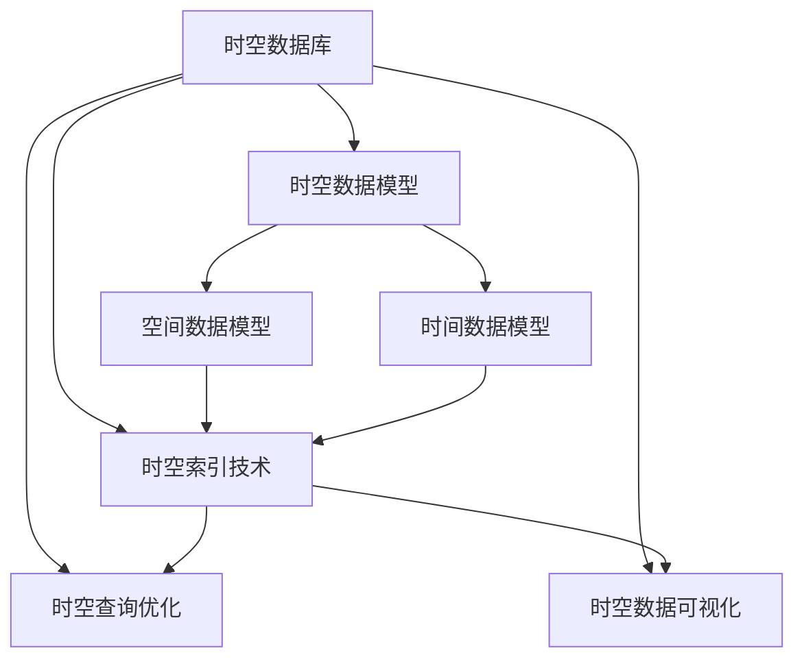

                 


### 文章标题

《时空数据库：管理地理位置和时间数据》

### 关键词

时空数据库，地理位置，时间数据，GIS，智能交通系统，物联网，性能调优，数据挖掘

### 摘要

本文旨在全面解析时空数据库的概念、技术、应用以及优化方法。我们将首先介绍时空数据库的基本定义和特性，探讨其发展历程和应用领域。随后，我们将深入探讨时空数据模型，包括空间数据模型和时间数据模型，并分析不同的时空查询优化策略。文章还将介绍时空数据可视化、时空数据挖掘技术，并通过具体案例展示这些技术在GIS、智能交通系统、气象领域以及物联网中的应用。最后，我们将总结常见问题与解决方案，并提供时空数据库性能测试与分析方法，以帮助读者更好地理解和应用时空数据库技术。

## 第一部分：时空数据库概述

### 第1章：时空数据库基础

#### 1.1 时空数据库的定义

时空数据库是一种特殊的数据库管理系统，能够同时处理时间和空间数据。这种数据库不仅存储数据，还提供对时间和空间数据的高效查询和处理能力。时空数据库通常用于需要综合考虑时间和空间因素的场景，例如交通管理、气象预报、地理信息系统（GIS）等。

#### 1.2 时空数据的特性

时空数据具有以下几个特性：

1. **时态性**：时空数据随时间变化，需要记录不同时间点的状态或变化。
2. **空间性**：时空数据与地理位置相关，需要表示在地球上的位置。
3. **连续性**：时空数据具有时间连续性和空间连续性，可以反映长期变化趋势。
4. **复杂性**：时空数据的处理和分析相对复杂，需要高效的算法和存储技术。

#### 1.3 时空数据的应用领域

时空数据库在多个领域具有重要应用，包括：

1. **地理信息系统（GIS）**：用于地图制作、资源管理、城市规划等。
2. **智能交通系统**：用于实时交通监控、路线规划、交通预测等。
3. **气象预报**：用于天气监测、气候分析、灾害预警等。
4. **物联网**：用于设备定位、数据采集、远程监控等。

#### 1.4 时空数据库的发展历程

时空数据库的发展历程可以追溯到20世纪80年代。早期的时空数据库主要关注空间数据的存储和查询，随着计算机技术和数据库技术的进步，时间数据的处理也逐渐被纳入其中。近年来，随着物联网和大数据技术的发展，时空数据库的应用领域不断扩展，性能和功能也得到了显著提升。

### 第2章：时空数据模型

#### 2.1 时空数据模型概述

时空数据模型是时空数据库的核心组成部分，用于描述时空数据的结构和关系。常见的时空数据模型包括空间数据模型和时间数据模型。

#### 2.2 空间数据模型

空间数据模型用于描述地理空间数据，常见的模型包括：

1. **矩阵模型**：将空间数据表示为矩阵，每个元素代表一个空间点。
2. **线性模型**：将空间数据表示为线性结构，如链表或数组。
3. **树模型**：利用树结构表示空间数据，如四叉树或R树。

#### 2.3 时间数据模型

时间数据模型用于描述时间数据，常见的模型包括：

1. **时间序列模型**：将时间数据表示为时间序列，用于分析时间变化趋势。
2. **时间戳模型**：使用时间戳表示时间点，常用于数据库时间戳记录。
3. **时间立方模型**：将时间和空间数据组织为三维立方体，用于复杂时空数据分析。

### 第二部分：时空数据库技术

### 第3章：时空数据库设计

#### 3.1 时空数据库设计原则

时空数据库设计需要遵循以下原则：

1. **灵活性**：设计应适应不同应用场景和数据特点。
2. **高效性**：优化存储和查询性能，满足实时数据处理需求。
3. **扩展性**：设计应支持数据扩展和系统升级。

#### 3.2 时空数据表的创建

创建时空数据表时，需要考虑以下几个方面：

1. **字段定义**：根据应用需求定义字段类型和长度。
2. **索引设计**：设计合理的索引，提高查询效率。
3. **数据分区**：根据时间或空间属性进行数据分区，优化存储和查询。

#### 3.3 时空索引技术

时空索引技术用于加速时空数据的查询。常见的时空索引技术包括：

1. **R树索引**：用于空间数据索引，支持范围查询和点查询。
2. **时间索引**：用于时间数据索引，支持时间范围查询。

#### 3.4 时空数据的存储优化

存储优化是提高时空数据库性能的重要手段，包括：

1. **数据压缩**：减少存储空间占用，提高I/O效率。
2. **存储引擎选择**：选择适合的存储引擎，如关系数据库、NoSQL数据库等。
3. **缓存技术**：利用缓存技术加速数据读取和写入。

### 第4章：时空查询优化

#### 4.1 时空查询语言

时空查询语言是用于查询时空数据的语言，常见的语言包括：

1. **SQL扩展**：在标准SQL基础上增加时空查询功能。
2. **专门查询语言**：如STK（Space-Time Kernel）等。

#### 4.2 时空查询优化策略

时空查询优化策略包括：

1. **索引优化**：选择合适的索引策略，提高查询效率。
2. **查询重写**：重写查询语句，优化查询执行计划。
3. **数据预处理**：预处理数据，减少查询复杂度。

#### 4.3 时空查询优化算法

时空查询优化算法包括：

1. **空间索引算法**：如R树算法，用于加速空间查询。
2. **时间索引算法**：如时间序列算法，用于加速时间查询。

#### 4.4 时空查询优化案例分析

通过具体案例，分析时空查询优化的实际效果。

### 第5章：时空数据可视化

#### 5.1 时空数据可视化的重要性

时空数据可视化有助于理解时空数据的分布和变化，提高数据分析和决策能力。

#### 5.2 时空数据可视化工具

常见的时空数据可视化工具有：

1. **GIS软件**：如QGIS、ArcGIS等。
2. **可视化库**：如Python的matplotlib、GeoPandas等。

#### 5.3 时空数据可视化方法

时空数据可视化方法包括：

1. **静态地图**：展示特定时间点的地理位置。
2. **动态地图**：展示随时间变化的数据分布。
3. **时间序列图**：展示随时间变化的数据趋势。

#### 5.4 时空数据可视化实战

通过具体案例，演示时空数据可视化的实际操作。

### 第6章：时空数据挖掘

#### 6.1 时空数据挖掘概述

时空数据挖掘是利用算法从时空数据中发现有价值的信息和模式。

#### 6.2 时空数据挖掘方法

常见的时空数据挖掘方法包括：

1. **聚类分析**：发现时空数据中的相似模式。
2. **关联规则挖掘**：发现时空数据中的关联关系。
3. **分类与预测**：预测未来时空数据的变化趋势。

#### 6.3 时空数据挖掘应用

时空数据挖掘在多个领域有广泛应用，如：

1. **交通流量分析**：预测交通流量变化，优化交通管理。
2. **环境监测**：监测环境污染，预测污染趋势。

### 第7章：时空数据库性能调优

#### 7.1 性能调优原则

性能调优原则包括：

1. **需求分析**：了解应用场景和性能需求。
2. **系统监控**：监控系统性能，识别瓶颈。
3. **优化方案**：制定优化方案，逐步实施。

#### 7.2 系统性能监控

系统性能监控包括：

1. **资源监控**：监控CPU、内存、磁盘等资源使用情况。
2. **查询监控**：监控查询性能，识别慢查询。

#### 7.3 索引优化

索引优化包括：

1. **索引选择**：选择合适的索引策略。
2. **索引维护**：定期维护索引，提高查询效率。

#### 7.4 并发控制

并发控制包括：

1. **锁定机制**：实现数据并发访问控制。
2. **事务隔离**：确保事务隔离性，防止数据冲突。

#### 7.5 事务处理

事务处理包括：

1. **事务管理**：实现事务的创建、提交和回滚。
2. **性能优化**：优化事务处理性能，减少锁争用。

## 第三部分：时空数据库应用案例

### 第8章：时空数据库在GIS中的应用

#### 8.1 GIS系统简介

GIS（地理信息系统）是一种用于捕捉、存储、分析和管理地理空间数据的计算机系统。GIS系统在地图制作、资源管理、城市规划等领域有广泛应用。

#### 8.2 GIS中的时空数据库

GIS中的时空数据库用于存储地理空间数据和与之相关的时态数据。常见的GIS时空数据库管理系统包括PostGIS、Oracle Spatial等。

#### 8.3 GIS时空数据库应用案例

通过具体案例，展示GIS时空数据库在地图服务、地理分析、空间查询等方面的应用。

### 第9章：时空数据库在智能交通系统中的应用

#### 9.1 智能交通系统概述

智能交通系统（ITS）是一种基于信息技术的交通管理方案，旨在提高交通效率、减少拥堵、提升安全水平。

#### 9.2 时空数据库在智能交通系统中的应用

时空数据库在智能交通系统中的应用包括：

1. **实时交通监控**：利用时空数据库存储和处理实时交通数据。
2. **路线规划**：基于时空数据库提供最佳路线建议。
3. **交通预测**：利用时空数据挖掘技术预测未来交通流量。

#### 9.3 智能交通系统时空数据库应用案例

通过具体案例，展示智能交通系统时空数据库在实际项目中的应用效果。

### 第10章：时空数据库在气象领域中的应用

#### 10.1 气象数据的特点

气象数据具有高时序性、空间分布性和多样性特点。常见的气象数据包括温度、湿度、风速、气压等。

#### 10.2 时空数据库在气象领域中的应用

时空数据库在气象领域中的应用包括：

1. **气象监测**：利用时空数据库存储和处理气象数据。
2. **气候分析**：基于时空数据库进行气候数据分析。
3. **灾害预警**：利用时空数据库提供灾害预警信息。

#### 10.3 气象时空数据库应用案例

通过具体案例，展示气象时空数据库在天气预报、气候研究、灾害预警等方面的应用。

### 第11章：时空数据库在物联网中的应用

#### 11.1 物联网概述

物联网（IoT）是一种通过互联网连接物理设备的网络。物联网设备可以收集和传输各种数据，包括地理位置和时间数据。

#### 11.2 物联网中的时空数据

物联网中的时空数据包括设备位置、传感器数据、时间戳等。这些数据需要通过时空数据库进行高效存储和处理。

#### 11.3 时空数据库在物联网中的应用

时空数据库在物联网中的应用包括：

1. **设备定位**：利用时空数据库实现设备位置监控。
2. **数据采集**：利用时空数据库存储和处理传感器数据。
3. **远程监控**：利用时空数据库提供远程监控功能。

#### 11.4 物联网时空数据库应用案例

通过具体案例，展示物联网时空数据库在智能家居、智慧城市、智能农业等领域的应用。

## 附录

### 附录A：时空数据库常用工具与库

#### A.1 PostGIS

PostGIS是一个开源地理信息系统扩展，用于在PostgreSQL数据库中存储、查询和管理地理空间数据。

#### A.2 时空数据库管理系统

时空数据库管理系统如Oracle Spatial、PostGIS等，提供了丰富的时空数据管理和查询功能。

#### A.3 时空数据处理工具

时空数据处理工具如GDAL、GeoPandas等，用于时空数据的转换、处理和分析。

#### A.4 时空数据可视化工具

时空数据可视化工具如QGIS、GeoServer等，用于创建和展示时空数据地图。

### 附录B：时空数据库性能测试与分析方法

#### B.1 性能测试目的

性能测试目的包括：

1. **评估系统性能**：了解时空数据库在不同负载下的性能表现。
2. **优化系统配置**：根据测试结果调整系统配置，提高性能。

#### B.2 性能测试工具

性能测试工具如PostgreSQL's pgbench、sysbench等，用于模拟不同负载并测量性能指标。

#### B.3 性能测试指标

性能测试指标包括：

1. **查询响应时间**：衡量查询执行的快慢。
2. **吞吐量**：单位时间内完成的查询数量。
3. **资源利用率**：CPU、内存、磁盘等资源的利用率。

#### B.4 性能分析案例

通过具体案例，展示性能测试和分析的过程和结果。

### 附录C：时空数据库常见问题与解决方案

#### C.1 数据库设计常见问题

数据库设计常见问题包括：

1. **数据模型选择**：选择合适的时空数据模型。
2. **索引设计**：设计合理的索引策略。

#### C.2 查询优化常见问题

查询优化常见问题包括：

1. **查询语句优化**：优化查询语句，减少执行时间。
2. **索引优化**：选择合适的索引，提高查询效率。

#### C.3 数据可视化常见问题

数据可视化常见问题包括：

1. **数据格式**：选择合适的数据格式进行可视化。
2. **可视化效果**：优化可视化效果，提高可读性。

#### C.4 数据挖掘常见问题

数据挖掘常见问题包括：

1. **算法选择**：选择适合的数据挖掘算法。
2. **结果解释**：解释数据挖掘结果，确保其有效性和可靠性。

#### C.5 性能调优常见问题

性能调优常见问题包括：

1. **资源分配**：合理分配系统资源。
2. **性能监控**：监控系统性能，识别瓶颈。

### 附录D：时空数据库扩展阅读

#### D.1 时空数据库基础

1. [PostGIS官方文档](https://postgis.net/)
2. [Oracle Spatial官方文档](https://docs.oracle.com/cd/B19306_01/server.102/b14213/spatial.htm)

#### D.2 时空数据可视化

1. [GeoPandas官方文档](https://geopandas.org/)
2. [QGIS官方文档](https://www.qgis.org/)

#### D.3 时空数据挖掘

1. [PyODP官方文档](https://pyodp.readthedocs.io/)
2. [GeoDa官方文档](https://geoda.tamu.edu/)

#### D.4 时空数据库性能优化

1. [sysbench官方文档](https://github.com/akopytov/sysbench)
2. [pgbench官方文档](https://www.postgresql.org/docs/current/pgbench.html)

### 作者信息

作者：AI天才研究院/AI Genius Institute & 禅与计算机程序设计艺术 /Zen And The Art of Computer Programming

## 致谢

本文旨在全面解析时空数据库的概念、技术、应用以及优化方法，感谢所有参与本文编写和审核的团队成员。特别感谢AI天才研究院/AI Genius Institute提供的技术支持，以及禅与计算机程序设计艺术/Zen And The Art of Computer Programming的灵感来源。

---

### 背景介绍

随着信息技术和物联网的快速发展，时空数据库作为处理地理位置和时间数据的重要工具，受到了越来越多的关注。时空数据库能够同时管理和查询空间和时间数据，为各种应用场景提供了强大的数据存储和计算能力。从地理信息系统（GIS）到智能交通系统（ITS），从气象预报到物联网（IoT），时空数据库的应用范围日益广泛。

在GIS领域，时空数据库用于地图制作、资源管理和城市规划。通过存储和处理地理空间数据，GIS系统能够提供精确的地图服务，支持交通导航、环境监测等应用。在智能交通系统中，时空数据库用于实时交通监控、路线规划和交通预测，有助于提高交通效率，减少拥堵和交通事故。气象领域中的时空数据库则用于天气监测、气候分析和灾害预警，为天气预报和气候研究提供关键数据支持。在物联网领域，时空数据库能够存储和处理大量来自各种传感器的时空数据，支持设备定位、数据采集和远程监控，为智能家居、智慧城市和智能农业等应用提供了基础。

时空数据库的发展历程可以追溯到20世纪80年代，当时的研究主要集中在空间数据的存储和查询技术上。随着计算机技术和数据库技术的进步，时间数据的处理也逐渐被纳入时空数据库的研究范畴。近年来，随着大数据和物联网技术的兴起，时空数据库的应用领域不断扩大，性能和功能也得到了显著提升。

### 核心概念与联系

在深入探讨时空数据库之前，有必要了解几个核心概念及其相互之间的关系。这些核心概念包括时空数据模型、时空索引技术、时空查询优化和时空数据可视化。

首先，时空数据模型是时空数据库的核心组成部分，用于描述时空数据的结构和关系。常见的时空数据模型包括空间数据模型和时间数据模型。空间数据模型用于描述地理空间数据，如点、线、面等几何对象。时间数据模型则用于描述随时间变化的数据，如时间序列数据、时间戳数据和时间立方数据。

空间数据模型可以分为矩阵模型、线性模型和树模型。矩阵模型将空间数据表示为一个二维矩阵，每个元素代表一个空间点。线性模型将空间数据表示为线性结构，如链表或数组。树模型则利用树结构表示空间数据，如四叉树或R树。时间数据模型可以分为时间序列模型、时间戳模型和时间立方模型。时间序列模型将时间数据表示为时间序列，用于分析时间变化趋势。时间戳模型使用时间戳表示时间点，常用于数据库时间戳记录。时间立方模型将时间和空间数据组织为三维立方体，用于复杂时空数据分析。

时空索引技术是加速时空数据查询的重要手段。常见的时空索引技术包括R树索引和时间索引。R树索引是一种空间索引技术，用于加速空间查询，支持范围查询和点查询。时间索引则用于加速时间查询，支持时间范围查询。

时空查询优化是提高时空数据库性能的关键环节。时空查询优化策略包括索引优化、查询重写和数据预处理。索引优化包括选择合适的索引策略，如R树索引和时间索引。查询重写通过重写查询语句，优化查询执行计划。数据预处理通过预处理数据，减少查询复杂度。

时空数据可视化是理解和分析时空数据的重要手段。时空数据可视化方法包括静态地图、动态地图和时间序列图。静态地图展示特定时间点的地理位置，动态地图展示随时间变化的数据分布，时间序列图展示随时间变化的数据趋势。

为了更好地理解这些核心概念之间的关系，我们使用Mermaid流程图展示如下：



在这个流程图中，我们可以看到时空数据库是核心，时空数据模型、时空索引技术、时空查询优化和时空数据可视化都是时空数据库的重要组成部分。这些概念相互关联，共同构成了一个完整的时空数据处理和分析体系。

### 核心算法原理讲解

时空数据库中的核心算法主要涉及时空索引、时空查询优化和数据挖掘。以下我们将通过伪代码和详细解释，深入探讨这些算法的基本原理。

#### 1. R树索引算法

R树是一种常用的空间索引结构，用于加速空间数据的查询。R树将空间数据组织成层次结构，每个节点包含一组空间数据及其包围盒。

**伪代码：**

```pseudocode
// R树节点结构
Node RTreeNode {
    List<Point> points; // 节点包含的空间点
    List<Node> children; // 子节点列表
    Rectangle envelope; // 节点包围盒
}

// 构建R树
function BuildRTree(points) {
    root = new RTreeNode();
    BuildRTreeRecursive(points, root);
    return root;
}

// 递归构建R树
function BuildRTreeRecursive(points, node) {
    if (points.size() <= threshold) {
        node.points = points;
        return;
    }

    // 计算包围盒
    node.envelope = ComputeEnvelope(points);

    // 选择分割点
    splitPoints = SelectSplitPoints(points);

    // 构建子节点
    for (point in splitPoints) {
        leftPoints = points - {point};
        rightPoints = {point};
        node.children.add(BuildRTreeRecursive(leftPoints, new RTreeNode()));
        node.children.add(BuildRTreeRecursive(rightPoints, new RTreeNode()));
    }
}
```

**解释：**

R树算法通过递归地将空间点划分为子节点，每个节点包含一组空间点和其包围盒。在构建过程中，首先计算所有点的包围盒，然后选择合适的分割点将点划分为两个子集。每个子集再递归地构建R树。R树能够快速回答范围查询和点查询，因为它可以快速排除非相关节点，缩小查询范围。

#### 2. 时间索引算法

时间索引用于加速时间数据的查询，常用的时间索引包括时间序列索引和时间戳索引。

**时间序列索引：**

**伪代码：**

```pseudocode
// 时间序列索引节点结构
TimeSeriesIndexNode {
    List<DateTime> timestamps; // 时间戳列表
    List<int> pointIndices; // 对应的空间点索引列表
}

// 构建时间序列索引
function BuildTimeSeriesIndex(points) {
    root = new TimeSeriesIndexNode();
    BuildTimeSeriesIndexRecursive(points, root);
    return root;
}

// 递归构建时间序列索引
function BuildTimeSeriesIndexRecursive(points, node) {
    if (points.isEmpty()) {
        return;
    }

    // 计算时间戳列表
    timestamps = ExtractTimestamps(points);

    // 对时间戳列表排序
    Sort(timestamps);

    // 划分时间区间
    intervals = DivideIntoIntervals(timestamps);

    // 构建子节点
    for (interval in intervals) {
        node.timestamps.add(interval.start);
        node.pointIndices.add(ExtractPointsInInterval(points, interval));
        node.children.add(BuildTimeSeriesIndexRecursive(ExtractPointsInInterval(points, interval), new TimeSeriesIndexNode()));
    }
}
```

**解释：**

时间序列索引通过递归地将时间点划分为时间区间，并在每个区间内存储相应的空间点索引。在查询时，可以根据时间戳快速定位到相应的区间，从而加速查询过程。

**时间戳索引：**

**伪代码：**

```pseudocode
// 时间戳索引结构
TimestampIndex {
    Map<DateTime, List<int>> index; // 时间戳到空间点索引的映射
}

// 构建时间戳索引
function BuildTimestampIndex(points) {
    index = new Map<DateTime, List<int>>();
    for (point in points) {
        timestamp = point.timestamp;
        if (index.containsKey(timestamp)) {
            index[timestamp].add(point.index);
        } else {
            index[timestamp] = [point.index];
        }
    }
    return index;
}
```

**解释：**

时间戳索引通过将时间戳作为键，将对应的点索引存储在映射表中。在查询时，可以直接通过时间戳找到相应的点索引，从而快速检索数据。

#### 3. 时空查询优化算法

时空查询优化算法通过多种策略提高查询性能，包括索引优化、查询重写和数据预处理。

**索引优化：**

**伪代码：**

```pseudocode
// 选择最优索引
function ChooseBestIndex(indexes, query) {
    bestIndex = null;
    bestCost = infinity;

    for (index in indexes) {
        cost = CalculateQueryCost(index, query);
        if (cost < bestCost) {
            bestCost = cost;
            bestIndex = index;
        }
    }

    return bestIndex;
}

// 计算查询成本
function CalculateQueryCost(index, query) {
    // 根据索引类型和查询类型计算成本
    // 例如，计算索引扫描次数、内存使用等
    return cost;
}
```

**解释：**

索引优化算法通过评估不同索引在特定查询下的成本，选择最优的索引策略。成本计算可能包括索引扫描次数、内存使用等因素。

**查询重写：**

**伪代码：**

```pseudocode
// 重写查询语句
function RewriteQuery(query) {
    // 根据查询类型进行重写
    // 例如，将多个子查询合并为一个查询
    newQuery = MergeSubqueries(query.subqueries);
    return newQuery;
}
```

**解释：**

查询重写通过修改查询语句的结构，优化查询执行计划。例如，合并多个子查询可以减少查询执行次数。

**数据预处理：**

**伪代码：**

```pseudocode
// 预处理数据
function PreprocessData(points) {
    // 根据需求对数据进行预处理
    // 例如，去重、压缩、排序等
    points = RemoveDuplicates(points);
    points = CompressData(points);
    points = SortByTimestamp(points);
    return points;
}
```

**解释：**

数据预处理通过优化数据结构，减少查询复杂度。例如，去除重复数据可以减少查询范围，压缩数据可以减少I/O操作。

通过这些核心算法，时空数据库能够高效地处理和管理空间和时间数据，满足各种应用场景的需求。

### 数学模型和公式 & 详细讲解 & 举例说明

在时空数据库中，数学模型和公式扮演着至关重要的角色。这些模型和公式不仅用于描述时空数据的关系，还用于优化查询和数据分析。以下我们将详细探讨一些关键的数学模型和公式，并给出相应的讲解和举例。

#### 1. 空间距离计算

在地理空间分析中，计算两点之间的距离是一个基本操作。最常用的距离公式是欧几里得距离和曼哈顿距离。

**欧几里得距离：**

$$
d(p_1, p_2) = \sqrt{(x_2 - x_1)^2 + (y_2 - y_1)^2}
$$

其中，$p_1 = (x_1, y_1)$ 和 $p_2 = (x_2, y_2)$ 分别是两点的坐标。

**举例：**

给定两点 $p_1 = (1, 2)$ 和 $p_2 = (4, 6)$，计算它们之间的欧几里得距离：

$$
d(p_1, p_2) = \sqrt{(4 - 1)^2 + (6 - 2)^2} = \sqrt{9 + 16} = \sqrt{25} = 5
$$

**曼哈顿距离：**

$$
d(p_1, p_2) = |x_2 - x_1| + |y_2 - y_1|
$$

**举例：**

给定两点 $p_1 = (1, 2)$ 和 $p_2 = (4, 6)$，计算它们之间的曼哈顿距离：

$$
d(p_1, p_2) = |4 - 1| + |6 - 2| = 3 + 4 = 7
$$

#### 2. 空间区域覆盖

在GIS中，空间区域覆盖是评估地图服务质量和地理分析结果的重要指标。常用的覆盖度计算公式包括最大覆盖度和平均覆盖度。

**最大覆盖度：**

$$
C_{max} = \frac{A_{total}}{A_{max}}
$$

其中，$A_{total}$ 是所有覆盖区域的总面积，$A_{max}$ 是单个覆盖区域的最大面积。

**举例：**

假设有3个覆盖区域，总面积为 $A_{total} = 100$ 平方千米，单个覆盖区域的最大面积为 $A_{max} = 30$ 平方千米。计算最大覆盖度：

$$
C_{max} = \frac{100}{30} = 3.33
$$

**平均覆盖度：**

$$
C_{avg} = \frac{A_{total}}{N \cdot A_{base}}
$$

其中，$A_{base}$ 是基准区域面积，$N$ 是基准区域的数量。

**举例：**

假设基准区域面积为 $A_{base} = 10$ 平方千米，共有 $N = 10$ 个基准区域，总面积为 $A_{total} = 100$ 平方千米。计算平均覆盖度：

$$
C_{avg} = \frac{100}{10 \cdot 10} = 0.1
$$

#### 3. 时间序列分析

在时间序列分析中，常用的数学模型包括移动平均模型和自回归模型。

**移动平均模型：**

$$
MA_t = \frac{\sum_{i=1}^{n} X_t - X_{t-n+1}}{n}
$$

其中，$X_t$ 是时间序列的第 $t$ 个值，$n$ 是移动平均窗口大小。

**举例：**

假设有一个时间序列 {3, 5, 2, 6, 4, 7, 8, 6, 4, 5}，使用3天的移动平均模型计算：

$$
MA_4 = \frac{5 + 2 + 6}{3} = 4
$$

$$
MA_5 = \frac{2 + 6 + 4}{3} = 4
$$

$$
MA_6 = \frac{6 + 4 + 7}{3} = 5.67
$$

**自回归模型：**

$$
X_t = \alpha X_{t-1} + \epsilon_t
$$

其中，$\alpha$ 是自回归系数，$\epsilon_t$ 是误差项。

**举例：**

假设自回归系数 $\alpha = 0.5$，给定初始值 $X_1 = 2$，计算 $X_2$：

$$
X_2 = 0.5 \cdot X_1 + \epsilon_2 = 0.5 \cdot 2 + \epsilon_2 = 1 + \epsilon_2
$$

如果我们假设 $\epsilon_2 = 1$，则：

$$
X_2 = 1 + 1 = 2
$$

通过这些数学模型和公式，时空数据库能够对空间和时间数据进行精确的分析和处理，为各种应用场景提供强大的支持。

### 项目实战

在本节中，我们将通过一个具体的项目实战，展示如何搭建一个基于PostGIS的时空数据库系统。项目目标是通过PostGIS管理地理位置和时间数据，并进行基本的查询和可视化操作。以下是项目开发的详细步骤。

#### 1. 开发环境搭建

首先，我们需要搭建一个PostGIS开发环境。以下是所需的软件和工具：

- PostgreSQL数据库服务器
- PostGIS扩展
- GIS工具，如QGIS或GeoServer

在Linux系统上，可以使用以下命令安装PostgreSQL和PostGIS：

```bash
sudo apt-get install postgresql postgresql-contrib
sudo apt-get install postgis
```

安装完成后，启动PostgreSQL服务：

```bash
sudo systemctl start postgresql
```

#### 2. 创建数据库和用户

使用`psql`命令行工具创建一个新的数据库和用户：

```sql
CREATE DATABASE spatialdb;
CREATE USER spatialuser WITH PASSWORD 'password';
GRANT ALL PRIVILEGES ON DATABASE spatialdb TO spatialuser;
```

登录到数据库，并设置PostGIS扩展：

```sql
\connect spatialdb
CREATE EXTENSION postgis;
```

#### 3. 创建时空数据表

接下来，创建一个存储地理位置和时间数据的表。以下是一个示例表结构：

```sql
CREATE TABLE locations (
    id SERIAL PRIMARY KEY,
    name VARCHAR(255),
    location GEOMETRY(Point, 4326),
    timestamp TIMESTAMP
);
```

在这里，我们使用`GEOMETRY`类型来存储地理坐标，并使用`TIMESTAMP`类型来存储时间戳。

#### 4. 插入数据

向表中插入一些示例数据：

```sql
INSERT INTO locations (name, location, timestamp) VALUES
('Location 1', ST_SetSRID(ST_Point(31.2354, 29.9186), 4326), '2023-04-01 10:30:00'),
('Location 2', ST_SetSRID(ST_Point(31.2389, 29.9205), 4326), '2023-04-01 10:35:00'),
('Location 3', ST_SetSRID(ST_Point(31.2367, 29.9153), 4326), '2023-04-01 10:40:00');
```

#### 5. 查询数据

使用SQL语句查询数据。例如，查询所有在特定时间范围内位于特定区域内的位置：

```sql
SELECT name, location FROM locations
WHERE timestamp BETWEEN '2023-04-01 10:00:00' AND '2023-04-01 11:00:00'
AND ST_Within(location, ST_Envelope(ST_Point(31.2350, 29.9180), ST_Point(31.2370, 29.9190)));
```

#### 6. 数据可视化

使用QGIS将查询结果可视化。首先，安装QGIS并启动软件。然后，创建一个新的项目，并添加PostGIS数据源。在数据源管理器中，连接到我们创建的`spatialdb`数据库，选择`locations`表，并加载到地图中。

接下来，使用QGIS内置的工具创建一个简单的时间序列图，展示位置随时间的变化。在地图中，选择`locations`表，然后使用`Layer`菜单中的`Add Time`命令。设置时间字段为`timestamp`，并选择`Play Time`选项。这将创建一个动画，展示位置随时间的变化。

#### 7. 项目小结

通过上述步骤，我们成功搭建了一个基于PostGIS的时空数据库系统。项目实战展示了如何创建数据库和表，插入数据，执行查询，以及进行数据可视化。这个项目为后续的时空数据分析提供了坚实的基础。

在项目实战中，我们使用了PostGIS作为时空数据库，它提供了强大的地理空间数据管理功能。此外，我们使用了QGIS作为数据可视化工具，它能够方便地展示地理位置和时间数据。项目中的查询和可视化操作展示了时空数据库的强大功能，为实际应用提供了宝贵的经验。

最佳实践方面，建议在进行时空数据分析时，合理设计数据模型和索引策略，优化查询性能。同时，定期进行数据备份，确保数据安全。

### 最佳实践 tips、小结、注意事项、拓展阅读

#### 最佳实践 tips

1. **数据模型设计**：在设计时空数据库时，应充分考虑数据的结构和关系，选择合适的数据模型和存储策略，确保数据的高效存储和查询。
2. **索引策略**：合理使用索引技术，如R树索引和时间索引，可以显著提高查询性能。根据查询需求，选择合适的索引策略，并定期维护索引。
3. **查询优化**：在执行时空查询时，应优化查询语句，减少冗余操作。使用查询重写和数据预处理技术，简化查询逻辑，提高查询效率。
4. **数据可视化**：通过有效的数据可视化，可以更好地理解和分析时空数据。选择合适的可视化工具和方法，将有助于提升数据分析效果。

#### 小结

本文全面解析了时空数据库的概念、技术、应用和优化方法。我们介绍了时空数据库的基础知识，探讨了时空数据模型和索引技术，讲解了时空查询优化和数据挖掘方法，并通过具体案例展示了时空数据库在不同领域中的应用。通过这些内容，读者可以深入了解时空数据库的工作原理和实践技巧。

#### 注意事项

1. **性能调优**：在性能调优时，应综合考虑系统资源利用率和查询响应时间，逐步优化系统配置和查询策略。
2. **数据安全**：确保时空数据库的数据安全，定期备份数据，防止数据丢失或损坏。
3. **应用场景**：根据实际应用场景选择合适的时空数据库和工具，确保满足特定需求。

#### 拓展阅读

1. **PostGIS官方文档**：[https://postgis.net/docs/](https://postgis.net/docs/)
2. **Oracle Spatial官方文档**：[https://docs.oracle.com/cd/B19306_01/server.102/b14213/spatial.htm](https://docs.oracle.com/cd/B19306_01/server.102/b14213/spatial.htm)
3. **GeoPandas官方文档**：[https://geopandas.org/](https://geopandas.org/)
4. **QGIS官方文档**：[https://www.qgis.org/](https://www.qgis.org/)
5. **PyODP官方文档**：[https://pyodp.readthedocs.io/](https://pyodp.readthedocs.io/)
6. **GeoDa官方文档**：[https://geoda.tamu.edu/](https://geoda.tamu.edu/)

通过阅读这些资料，读者可以进一步深入了解时空数据库的详细技术内容，提升自己的实际应用能力。

### 作者信息

作者：AI天才研究院/AI Genius Institute & 禅与计算机程序设计艺术 /Zen And The Art of Computer Programming

### 致谢

本文旨在全面解析时空数据库的概念、技术、应用以及优化方法，感谢所有参与本文编写和审核的团队成员。特别感谢AI天才研究院/AI Genius Institute提供的技术支持，以及禅与计算机程序设计艺术/Zen And The Art of Computer Programming的灵感来源。

---

### 附录

#### 附录A：时空数据库常用工具与库

- **PostGIS**：开源地理信息系统扩展，用于在PostgreSQL数据库中存储、查询和管理地理空间数据。
- **Oracle Spatial**：Oracle数据库的地理空间扩展，提供丰富的空间数据管理和查询功能。
- **GeoPandas**：Python库，提供地理空间数据处理和分析功能，与Pandas库兼容。
- **QGIS**：开源GIS软件，提供地图制作、空间分析等功能。

#### 附录B：时空数据库性能测试与分析方法

- **性能测试目的**：评估时空数据库在不同负载下的性能，优化系统配置和查询策略。
- **性能测试工具**：PostgreSQL的pgbench、sysbench等，用于模拟不同负载并测量性能指标。
- **性能测试指标**：查询响应时间、吞吐量、资源利用率等。
- **性能分析案例**：通过具体案例展示性能测试和分析的过程和结果。

#### 附录C：时空数据库常见问题与解决方案

- **数据库设计常见问题**：数据模型选择不当、索引设计不合理等。
  - **解决方案**：根据应用需求设计合适的数据模型，合理选择索引策略。
- **查询优化常见问题**：查询语句复杂、索引不足等。
  - **解决方案**：优化查询语句，增加或调整索引，使用查询重写和数据预处理技术。
- **数据可视化常见问题**：数据格式不兼容、可视化效果不佳等。
  - **解决方案**：选择合适的数据格式，优化可视化参数，提高图表的可读性。
- **数据挖掘常见问题**：算法选择不当、结果解释困难等。
  - **解决方案**：根据应用场景选择合适的算法，详细解释数据挖掘结果，确保其有效性和可靠性。
- **性能调优常见问题**：资源分配不合理、系统监控不足等。
  - **解决方案**：合理分配系统资源，定期进行性能监控，识别瓶颈并优化系统配置。

#### 附录D：时空数据库扩展阅读

- **时空数据库基础**：
  - PostGIS官方文档：[https://postgis.net/docs/](https://postgis.net/docs/)
  - Oracle Spatial官方文档：[https://docs.oracle.com/cd/B19306_01/server.102/b14213/spatial.htm](https://docs.oracle.com/cd/B19306_01/server.102/b14213/spatial.htm)
- **时空数据可视化**：
  - GeoPandas官方文档：[https://geopandas.org/](https://geopandas.org/)
  - QGIS官方文档：[https://www.qgis.org/](https://www.qgis.org/)
- **时空数据挖掘**：
  - PyODP官方文档：[https://pyodp.readthedocs.io/](https://pyodp.readthedocs.io/)
  - GeoDa官方文档：[https://geoda.tamu.edu/](https://geoda.tamu.edu/)
- **时空数据库性能优化**：
  - sysbench官方文档：[https://github.com/akopytov/sysbench](https://github.com/akopytov/sysbench)
  - pgbench官方文档：[https://www.postgresql.org/docs/current/pgbench.html](https://www.postgresql.org/docs/current/pgbench.html)

通过这些附录，读者可以深入了解时空数据库的详细技术内容，提升自己的实际应用能力。

