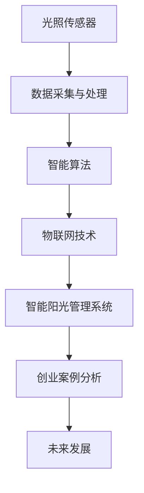

                 

## 文章标题

### 智能个人阳光摄入管理创业：科学的光照健康优化

#### 关键词：
- 智能阳光管理
- 光照传感器
- 光照健康优化
- 物联网技术
- 创业案例分析
- 光照健康
- 智能算法

#### 摘要：
本文深入探讨了智能个人阳光摄入管理创业的机会与挑战。通过对光照传感技术、智能算法和物联网技术的介绍，文章详细分析了智能阳光管理系统的设计实现过程。此外，通过创业案例分析和未来展望，本文为读者提供了全面的智能阳光管理创业指导。

## 《智能个人阳光摄入管理创业：科学的光照健康优化》目录大纲

### 第一部分：引入与概述

#### 第1章：智能阳光管理的概念与市场背景

1.1 智能阳光管理的定义与意义  
1.2 阳光对人体健康的影响  
1.3 智能阳光管理市场的现状与发展趋势

### 第二部分：智能阳光管理核心技术

#### 第2章：光照传感技术

2.1 光照传感器的基本原理与类型  
2.2 光照传感器的数据采集与处理  
2.3 光照传感技术在智能阳光管理中的应用

#### 第3章：智能算法与光照健康优化

3.1 智能算法的基本原理  
3.2 光照健康优化的核心算法  
3.3 智能算法在阳光管理中的应用案例

#### 第4章：物联网技术在阳光管理中的应用

4.1 物联网技术概述  
4.2 物联网技术在阳光管理中的应用  
4.3 物联网技术在阳光管理中的挑战与机遇

#### 第5章：智能阳光管理系统的设计与实现

5.1 智能阳光管理系统的架构设计  
5.2 智能阳光管理系统的主要功能  
5.3 智能阳光管理系统的实现与测试

### 第三部分：智能阳光管理创业案例分析

#### 第6章：智能阳光管理创业案例分析

6.1 案例一：智能阳光灯的应用与市场推广  
6.2 案例二：智能阳光管理系统在酒店行业的应用  
6.3 案例三：智能阳光管理创业项目的挑战与解决方案

### 第四部分：智能阳光管理的未来展望

#### 第7章：智能阳光管理的未来发展

7.1 智能阳光管理的创新趋势  
7.2 智能阳光管理的潜在市场  
7.3 智能阳光管理的技术挑战与解决方案

### 附录

#### 附录A：智能阳光管理相关工具与资源

A.1 光照传感器选购指南  
A.2 智能算法常用框架  
A.3 物联网开发平台推荐

#### 附录B：智能阳光管理项目实战

B.1 项目一：智能阳光灯的硬件设计与开发  
B.2 项目二：智能阳光管理系统的软件实现  
B.3 项目三：智能阳光管理项目的营销策略与推广方案

## 第一部分：引入与概述

### 第1章：智能阳光管理的概念与市场背景

#### 1.1 智能阳光管理的定义与意义

智能阳光管理是指利用现代科技，如物联网、传感器技术和智能算法，对个人或环境中的光照条件进行实时监测和优化。其核心目标是通过精确控制光照，提升生活品质、保障健康、提高工作效率。

**智能阳光管理的定义**：

- **光照传感**：通过传感器监测室内外光照强度、色温和紫外线指数。
- **智能优化**：利用算法分析数据，根据用户需求和环境条件自动调整光照。
- **系统集成**：将传感器、控制器和用户界面整合，实现智能控制。

**智能阳光管理的意义**：

1. **健康优化**：科学的光照摄入有助于调节生物钟、预防季节性情感障碍（SAD）。
2. **工作效率**：适度的光照可以提高注意力和认知功能，提高工作效率。
3. **节能减排**：智能阳光管理可以减少人工照明的使用，降低能源消耗。
4. **智能家居**：智能阳光管理是智能家居系统的重要组成部分，提升家居智能化水平。

#### 1.2 阳光对人体健康的影响

阳光中的紫外线（UV）和可见光对人体有多种生理和心理健康影响。以下是一些主要的影响：

**紫外线的影响**：

- **维生素D合成**：紫外线帮助人体合成维生素D，对骨骼健康至关重要。
- **皮肤保护**：适量的紫外线有助于产生皮肤色素，保护皮肤免受紫外线伤害。
- **皮肤老化**：过量的紫外线会导致皮肤老化、晒伤和皮肤癌。

**可见光的影响**：

- **调节生物钟**：光照是调节人体生物钟的重要因素，影响睡眠质量。
- **情绪调节**：适量的光照有助于改善情绪，预防季节性情感障碍。
- **认知功能**：光照影响大脑的活动，适当的亮度可以提高注意力和认知功能。

#### 1.3 智能阳光管理市场的现状与发展趋势

随着科技的进步和人们健康意识的提升，智能阳光管理市场正迅速发展。以下是一些市场现状与发展趋势：

**市场现状**：

- **消费者需求增长**：消费者对智能家居和健康照明的需求日益增长。
- **技术进步**：传感器技术、物联网技术和智能算法的不断进步，推动了智能阳光管理的发展。
- **产品多样化**：市场上有多种智能阳光管理产品，如智能阳光灯、智能窗帘、智能阳光房等。

**发展趋势**：

- **集成化**：智能阳光管理将更深入地整合到智能家居系统中。
- **个性化**：智能算法将更精确地满足个人对光照的需求。
- **节能环保**：智能阳光管理将更有效地利用自然光，减少能源消耗。

### 第一部分小结

智能阳光管理作为一种新兴的科技应用，正在迅速融入人们的生活。其重要性不仅体现在健康优化、工作效率提升等方面，同时也符合节能减排和智能化发展的趋势。通过对智能阳光管理概念和市场背景的介绍，读者可以初步了解这一领域的广阔前景和潜在商机。接下来，我们将深入探讨智能阳光管理的核心技术，包括光照传感技术、智能算法和物联网技术，为读者提供更全面的技术基础。

## 第二部分：智能阳光管理核心技术

### 第2章：光照传感技术

#### 2.1 光照传感器的基本原理与类型

光照传感器是一种能够感知光强度并将其转换为电信号的装置。其基本原理基于光电效应、光生电势或光敏电阻等物理现象。光照传感器的核心组件包括光敏元件、放大电路和信号处理电路。

**基本原理**：

- **光电效应**：光照射到半导体材料上，产生电子-空穴对，从而产生电流。
- **光生电势**：某些材料在光照下产生电动势，即光生电压。
- **光敏电阻**：光照射导致电阻变化，从而改变电流。

**类型**：

- **光电型传感器**：如光敏二极管、光敏三极管等，通过光电效应工作。
- **光生电压型传感器**：如光生二极管、光生电池等，通过光生电势工作。
- **光敏电阻型传感器**：如光敏电阻、光敏晶体管等，通过电阻变化工作。

**特点**：

- **光电型传感器**：灵敏度高，响应速度快，适用于高精度测量。
- **光生电压型传感器**：输出电压与光照强度成正比，适用于小范围内的光照检测。
- **光敏电阻型传感器**：成本低，但灵敏度较低，适用于粗略测量。

#### 2.2 光照传感器的数据采集与处理

光照传感器的数据采集和处理是智能阳光管理的核心环节。以下是一些关键步骤：

**数据采集**：

1. **传感数据获取**：光照传感器实时采集环境光照数据，包括光照强度、色温和紫外线指数。
2. **信号放大**：原始信号通常较弱，需要通过放大电路增强。
3. **滤波处理**：去除信号中的噪声，提高数据质量。

**数据处理**：

1. **数字化转换**：将模拟信号转换为数字信号，便于后续处理。
2. **数据分析**：使用智能算法分析光照数据，提取有用信息，如光照强度分布、峰值等。
3. **数据存储**：将处理后的数据存储在数据库或云平台中，供后续分析和优化使用。

**常见技术**：

- **A/D转换器**：模拟信号转换为数字信号。
- **数字信号处理（DSP）**：对数字信号进行滤波、分析等处理。
- **机器学习**：对大量光照数据进行分析，提取规律和趋势。

#### 2.3 光照传感技术在智能阳光管理中的应用

光照传感器在智能阳光管理中的应用十分广泛，主要包括以下方面：

**智能家居**：

- **自动调节照明**：根据光照强度自动调节室内灯光亮度，节省能源，提升生活质量。
- **智能窗帘**：根据光照条件自动调节窗帘开合，控制室内光照。

**健康监测**：

- **生物钟调节**：通过监测光照强度和周期性变化，帮助调节生物钟，改善睡眠质量。
- **紫外线防护**：监测紫外线指数，提供紫外线防护措施，预防皮肤伤害。

**农业与园艺**：

- **植物生长监控**：通过光照传感，实时监测植物光照需求，自动调节光照，促进植物生长。
- **温室环境控制**：监测光照条件，自动调节温室内部光照，创造适宜的生长环境。

**工业与科研**：

- **光照测试**：精确测量光照强度、色温和紫外线指数，为光照相关研究和应用提供数据支持。

#### 实际应用案例

以下是一个智能家居场景中的光照传感器应用案例：

**案例**：智能阳光灯

**目标**：设计一款智能阳光灯，能够根据室外光照强度自动调节室内灯光亮度。

**技术实现**：

1. **硬件设计**：选用一款高精度光照传感器，安装在室内外交界处。选择一款可调节亮度的LED灯作为光源。

2. **软件设计**：编写程序，通过光照传感器实时采集光照数据，使用算法分析数据，并根据分析结果自动调节LED灯的亮度。

3. **实现效果**：当室外光照强度较高时，智能阳光灯自动降低亮度，减少人工照明；当室外光照强度较低时，智能阳光灯自动提高亮度，提供足够的室内照明。

**代码示例**：

以下是一个简单的Arduino环境中光照传感器与LED控制的示例代码：

```cpp
#include <Wire.h>
#include <Adafruit_TSL2591.h>

// 初始化光照传感器
Adafruit_TSL2591 tsl = Adafruit_TSL2591();

void setup() {
  Serial.begin(9600);
  tsl.begin();
  
  // 设置传感器参数
  tsl.setPoweDown(0x0F);  // 设置传感器为正常工作模式
  tsl.setIntegrationTime(0x13);  // 设置集成时间
}

void loop() {
  // 读取光照数据
  sensors_event_t event;
  tsl.getEvent(&event);

  // 判断光照强度，调整LED亮度
  if (event.fullzak > 400) {
    analogWrite(LED_BUILTIN, 0);  // 光照强，关闭LED
  } else {
    analogWrite(LED_BUILTIN, 255);  // 光照弱，开启LED
  }

  // 等待一段时间
  delay(1000);
}
```

**代码解读**：

- **初始化传感器**：使用`tsl.begin()`初始化光照传感器。
- **设置传感器参数**：使用`tsl.setPoweDown()`和`tsl.setIntegrationTime()`设置传感器的工作模式和集成时间。
- **读取光照数据**：使用`tsl.getEvent(&event)`读取传感器数据。
- **判断光照强度**：使用`event.fullzak > 400`判断光照强度，并调整LED亮度。

通过这个案例，我们可以看到光照传感器在智能阳光管理中的应用是如何实现的。通过简单的硬件和软件设计，我们可以实现自动调节室内灯光亮度的功能，提高生活质量和能源效率。

### 第二部分小结

本章详细介绍了光照传感技术的基本原理、数据采集与处理方法以及实际应用。光照传感器作为智能阳光管理系统的核心组件，其精度和可靠性直接影响到系统的整体性能。通过对光照传感技术的深入了解，我们可以更好地理解和应用智能阳光管理技术。接下来，我们将探讨智能算法在光照健康优化中的应用，为智能阳光管理系统提供更加精准和个性化的解决方案。

### 第3章：智能算法与光照健康优化

#### 3.1 智能算法的基本原理

智能算法是一种模拟人类智能行为的计算方法，通过机器学习和深度学习等技术，使计算机系统能够自动学习、推理和决策。智能算法的核心思想是让计算机从大量数据中提取知识，并利用这些知识进行预测和优化。

**机器学习的基本原理**：

机器学习分为监督学习、无监督学习和强化学习三类：

- **监督学习**：通过已标记的数据训练模型，使模型能够预测新数据的结果。
- **无监督学习**：不使用标记数据，通过分析数据的内在结构和模式进行分类和聚类。
- **强化学习**：通过奖励和惩罚机制，训练模型在特定环境中做出最佳决策。

**深度学习的基本原理**：

深度学习是机器学习的一种特殊形式，通过多层神经网络模拟人脑的学习过程。深度学习的基本架构包括输入层、隐藏层和输出层。每一层都对输入数据进行处理，最终产生输出结果。深度学习在图像识别、语音识别和自然语言处理等领域取得了显著成果。

**智能算法在阳光管理中的应用**：

智能算法在阳光管理中的应用主要包括光照预测、光照优化和健康评估等。通过智能算法，我们可以实现：

- **光照预测**：预测未来一段时间内的光照强度和紫外线指数。
- **光照优化**：根据用户需求和健康数据，自动调整光照强度和色温。
- **健康评估**：评估光照对用户健康的影响，提供个性化的健康建议。

#### 3.2 光照健康优化的核心算法

光照健康优化的核心算法主要包括光照预测、光照优化和健康评估三个部分。

**光照预测算法**：

光照预测算法主要用于预测未来一段时间内的光照强度和紫外线指数。常用的算法包括时间序列预测、回归分析和神经网络等。以下是一个简单的时间序列预测算法示例：

```python
# 时间序列预测算法示例
def predict_sunlight(data):
    # 数据预处理
    data = preprocess_data(data)
    
    # 建立模型
    model = build_model()
    
    # 训练模型
    model.fit(data)
    
    # 预测未来光照
    future_data = model.predict(data)
    
    return future_data
```

**光照优化算法**：

光照优化算法根据用户需求和健康数据，自动调整光照强度和色温。常用的算法包括线性规划、遗传算法和强化学习等。以下是一个简单的遗传算法优化光照的示例：

```python
# 遗传算法优化光照强度
def optimize_lighting(data):
    # 初始化种群
    population = initialize_population(data)
    
    # 定义适应度函数
    fitness_function = define_fitness_function(data)
    
    # 迭代进化
    for _ in range(max_iterations):
        # 选择
        selected = select(population, fitness_function)
        
        # 交叉
        crossed = crossover(selected)
        
        # 变异
        mutated = mutate(crossed)
        
        # 更新种群
        population = mutated
    
    # 获取最优解
    best_solution = get_best_solution(population)
    
    return best_solution
```

**健康评估算法**：

健康评估算法用于评估光照对用户健康的影响，提供个性化的健康建议。常用的算法包括回归分析、逻辑回归和神经网络等。以下是一个简单的神经网络健康评估算法示例：

```python
# 神经网络健康评估
def assess_health(data):
    # 数据预处理
    data = preprocess_data(data)
    
    # 建立模型
    model = build_model()
    
    # 训练模型
    model.fit(data)
    
    # 评估健康
    health_score = model.predict(data)
    
    return health_score
```

#### 3.3 智能算法在阳光管理中的应用案例

智能算法在阳光管理中的应用案例非常广泛，以下是一些实际应用的案例：

**案例一：智能阳光灯**

智能阳光灯通过传感器实时监测室内外光照强度，使用智能算法自动调整灯光亮度。以下是一个简单的应用流程：

1. **数据采集**：光照传感器采集室内外光照强度数据。
2. **光照预测**：使用光照预测算法预测未来一段时间内的光照变化。
3. **光照优化**：根据预测结果和用户需求，使用光照优化算法自动调整灯光亮度。
4. **健康评估**：使用健康评估算法评估光照对用户健康的影响，提供个性化的健康建议。

**案例二：智能阳光房**

智能阳光房通过传感器和智能算法实现室内光照条件的自动调节。以下是一个简单的应用流程：

1. **数据采集**：传感器采集室内外光照强度、紫外线指数和温度等数据。
2. **光照预测**：使用光照预测算法预测未来一段时间内的光照变化。
3. **光照优化**：根据预测结果和用户需求，使用光照优化算法自动调整窗帘、通风设备等，实现室内光照条件的优化。
4. **健康评估**：使用健康评估算法评估光照对用户健康的影响，提供个性化的健康建议。

**案例三：智能阳光监测系统**

智能阳光监测系统用于监测大面积区域的阳光状况，为农业、园林、气象等领域提供数据支持。以下是一个简单的应用流程：

1. **数据采集**：在目标区域安装光照传感器，实时监测光照强度、紫外线指数等数据。
2. **光照预测**：使用光照预测算法预测未来一段时间内的光照变化。
3. **光照优化**：根据预测结果和用户需求，提供光照优化建议，如调整种植方案、灌溉时间等。
4. **健康评估**：使用健康评估算法评估光照对植物生长和生态环境的影响，提供生态保护建议。

通过这些案例，我们可以看到智能算法在阳光管理中的应用是如何实现具体功能的。智能算法不仅提高了光照管理的效率和精度，还为用户提供个性化的健康建议，为各行各业的阳光管理提供了有力支持。

### 第三部分小结

本章详细介绍了智能算法的基本原理、核心算法以及在实际阳光管理中的应用案例。智能算法通过模拟人类智能行为，实现了对光照的精确预测、优化和健康评估。这些应用不仅提高了光照管理的效率和精度，还为用户提供个性化的健康建议。通过对智能算法的深入探讨，我们可以更好地理解智能阳光管理系统的技术原理和应用前景。接下来，我们将探讨物联网技术在阳光管理中的应用，为智能阳光管理系统提供更加全面和智能化的解决方案。

### 第4章：物联网技术在阳光管理中的应用

#### 4.1 物联网技术概述

物联网（Internet of Things，IoT）是指通过互联网将各种设备连接起来，实现设备之间的信息交换和智能控制。物联网技术的核心组成部分包括传感器、网络和数据处理。

**传感器**：物联网系统中的传感器负责收集环境数据，如光照、温度、湿度、噪音等。

**网络**：传感器收集的数据通过网络传输到中心控制系统，常见的网络包括Wi-Fi、蓝牙、蜂窝网络等。

**数据处理**：中心控制系统对传感器数据进行处理、分析和存储，实现智能决策和远程控制。

**物联网技术的作用**：

1. **数据采集**：通过传感器实时收集环境数据，为智能决策提供基础。
2. **远程监控**：通过互联网实现设备的远程监控和控制，提高管理效率。
3. **自动化控制**：通过智能算法实现设备的自动化控制，提高系统响应速度和准确性。

#### 4.2 物联网技术在阳光管理中的应用

物联网技术在阳光管理中的应用主要体现在智能监控、自动调节和数据分析等方面。

**智能监控**：

物联网技术可以实现实时监控室内外光照条件，包括光照强度、色温和紫外线指数等。通过传感器网络，阳光管理系统能够实时收集环境数据，为智能决策提供基础。

**自动调节**：

物联网技术可以自动调节室内光照条件，以适应用户需求和环境变化。例如，智能阳光灯可以根据室外光照强度自动调整灯光亮度，智能窗帘可以根据紫外线指数自动调节窗帘开合。

**数据分析**：

物联网技术可以收集大量的光照数据，通过数据分析可以揭示光照模式、趋势和异常。智能算法可以根据分析结果优化光照策略，提高光照管理的效率和准确性。

**典型应用场景**：

1. **智能家居**：通过物联网技术，实现家庭光照系统的智能控制，提高生活质量。
2. **商业建筑**：通过物联网技术，实现商业建筑的智能照明和能源管理，提高能源效率。
3. **农业**：通过物联网技术，监测作物光照需求，优化种植方案，提高农业产量。
4. **医疗**：通过物联网技术，为医院和诊所提供智能光照管理，改善患者治疗环境。

#### 4.3 物联网技术在阳光管理中的挑战与机遇

物联网技术在阳光管理中面临以下挑战：

**数据隐私与安全**：

物联网设备连接的网络容易受到黑客攻击，可能导致数据泄露和安全问题。确保数据隐私和安全是物联网技术发展的重要挑战。

**设备兼容性**：

物联网设备种类繁多，不同设备之间的兼容性问题可能导致系统性能下降。实现设备的高兼容性是物联网技术发展的重要问题。

**数据处理能力**：

物联网设备收集的数据量巨大，对数据处理和分析能力提出了较高要求。如何高效地处理海量数据，提取有用信息，是物联网技术发展的重要课题。

物联网技术在阳光管理中也带来了许多机遇：

**个性化服务**：

通过物联网技术，可以实现对光照的个性化控制，满足用户不同的需求。例如，智能阳光管理系统可以根据用户的生活习惯和健康数据，提供个性化的光照方案。

**节能减排**：

物联网技术可以实现智能照明和能源管理，减少能源消耗，降低碳排放。这对于环保和可持续发展具有重要意义。

**智能农业**：

物联网技术可以用于监测作物光照需求，优化种植方案，提高农业产量和效率。这将为农业现代化和乡村振兴提供有力支持。

**医疗健康**：

物联网技术可以用于监测光照对患者的治疗影响，提供智能化的光照管理方案。这将为医疗健康领域带来新的发展机遇。

#### 4.4 智能阳光管理系统的物联网架构设计

一个典型的智能阳光管理系统包含以下主要组件：

**传感器网络**：

传感器网络包括室内外光照传感器、温度传感器、湿度传感器等，负责实时监测环境数据。

**通信网络**：

通信网络包括Wi-Fi、蓝牙、蜂窝网络等，负责将传感器数据传输到中心控制系统。

**中心控制系统**：

中心控制系统负责数据存储、分析和处理，通过智能算法实现对光照的自动调节和优化。

**用户界面**：

用户界面包括Web端、移动应用等，供用户查看光照数据和调整系统设置。

**智能算法**：

智能算法负责分析传感器数据，预测光照变化，优化光照方案。

**架构设计**：

1. **数据采集**：传感器网络实时采集环境数据，通过通信网络传输到中心控制系统。
2. **数据处理**：中心控制系统对传感器数据进行存储、分析和处理，提取有用信息。
3. **智能决策**：智能算法根据分析结果，生成光照调节策略，并下发到控制器执行。
4. **用户交互**：用户通过用户界面查看光照数据和调整系统设置，反馈至中心控制系统。

#### 4.5 智能阳光管理系统中的物联网技术实践

以下是一个智能阳光管理系统的物联网技术实践案例：

**案例**：智能阳光房

**目标**：设计一个智能阳光房，能够根据室外光照强度和紫外线指数自动调节窗帘和通风设备。

**技术实现**：

1. **硬件设计**：
   - **传感器**：安装室内外光照传感器、紫外线传感器和温度传感器。
   - **控制器**：选用微控制器（如ESP8266或ESP32）作为中心控制单元。
   - **执行器**：安装电动窗帘电机和通风设备控制器。

2. **软件设计**：
   - **数据采集**：编写程序，通过Wi-Fi模块实时采集传感器数据。
   - **光照预测**：使用时间序列预测算法预测未来一段时间内的光照变化。
   - **光照优化**：根据光照预测结果和紫外线指数，自动调节窗帘和通风设备。

3. **实现效果**：
   - **智能窗帘**：当室外光照强度过高时，智能窗帘自动关闭，减少紫外线辐射。
   - **智能通风**：当室内温度过高时，通风设备自动启动，降低室内温度。

**代码示例**：

以下是一个简单的Arduino环境中传感器数据采集和自动调节窗帘的示例代码：

```cpp
#include <WiFi.h>
#include <MQTTClient.h>

// WiFi连接信息
const char* ssid = "yourSSID";
const char* password = "yourPASSWORD";

// MQTT服务器信息
const char* mqttServer = "mqtt.server.com";
int mqttPort = 1883;
MQTTClient client;

void connectMQTT() {
  client.connect("ESP8266Client", "yourusername", "yourpassword");
  client.subscribe("sunlight/control");
}

void setup() {
  Serial.begin(115200);
  WiFi.begin(ssid, password);
  while (WiFi.status() != WL_CONNECTED) {
    delay(500);
    Serial.print(".");
  }
  Serial.println("");
  Serial.print("WiFi connected to ");
  Serial.println(WiFi.SSID());

  connectMQTT();
}

void loop() {
  client.loop();

  // 读取光照传感器数据
  int sunlight = analogRead(A0);

  // 发送数据到MQTT服务器
  String message = "suntlight=" + String(sunlight);
  client.publish("sunlight/data", message.c_str());

  // 调节窗帘
  if (sunlight > 800) {
    // 关闭窗帘
    digitalWrite(LED_BUILTIN, HIGH);
  } else {
    // 打开窗帘
    digitalWrite(LED_BUILTIN, LOW);
  }

  delay(1000);
}
```

**代码解读**：

- **WiFi连接**：使用`WiFi.begin()`连接WiFi网络。
- **MQTT连接**：使用`MQTTClient.connect()`连接到MQTT服务器。
- **数据采集**：使用`analogRead()`读取光照传感器数据。
- **数据发布**：使用`MQTTClient.publish()`将光照数据发送到MQTT服务器。
- **窗帘调节**：根据光照数据自动调节窗帘状态。

通过这个案例，我们可以看到物联网技术在智能阳光管理系统中的具体应用。通过简单的硬件和软件设计，我们可以实现智能阳光房的自动调节功能，提高居住舒适度和能源效率。

### 第四部分小结

本章详细介绍了物联网技术在阳光管理中的应用，包括物联网技术概述、应用场景、挑战与机遇，以及具体的架构设计和实践案例。物联网技术为智能阳光管理系统提供了强大的数据采集、分析和控制能力，是实现个性化、智能化光照管理的关键。通过对物联网技术的深入探讨，我们可以更好地理解智能阳光管理系统的技术架构和应用前景。接下来，我们将探讨智能阳光管理系统的设计与实现，为读者提供更加详细的实现方法和经验。

### 第5章：智能阳光管理系统的设计与实现

#### 5.1 智能阳光管理系统的架构设计

智能阳光管理系统是一个复杂的多层次系统，其架构设计需要综合考虑硬件、软件和通信网络等多个方面。以下是一个典型的智能阳光管理系统架构设计：

**系统架构**

1. **传感器层**：负责实时采集光照强度、紫外线指数、室内外温度、湿度等环境数据。
2. **通信层**：将传感器数据通过无线通信网络（如Wi-Fi、蓝牙、ZigBee等）传输到中心控制服务器。
3. **数据处理层**：对传感器数据进行处理、存储和分析，使用智能算法生成光照调节策略。
4. **控制层**：根据数据处理层生成的策略，控制照明设备、窗帘、通风设备等执行元件。
5. **用户层**：通过Web界面、移动应用等提供用户交互接口，允许用户查看系统状态和调整设置。

**架构设计原则**

1. **模块化**：系统各层应独立模块化设计，方便维护和升级。
2. **可扩展性**：系统应具有较好的扩展性，能够适应不同的光照管理和场景需求。
3. **可靠性**：系统应具备高可靠性，确保数据的准确性和实时性。
4. **安全性**：确保数据传输和存储的安全性，防止数据泄露和未经授权的访问。

#### 5.2 智能阳光管理系统的主要功能

智能阳光管理系统的主要功能包括数据采集、数据分析和控制执行等。

**数据采集**

数据采集是智能阳光管理系统的核心功能之一，主要包括：

1. **光照数据采集**：通过室内外光照传感器实时监测光照强度、紫外线指数等数据。
2. **环境数据采集**：通过温度传感器、湿度传感器等监测室内外环境数据。
3. **用户数据采集**：通过用户设备（如手机、智能手表等）采集用户活动数据，如运动量、睡眠质量等。

**数据分析**

数据分析是对采集到的数据进行处理和分析，以生成光照调节策略。主要功能包括：

1. **光照预测**：使用时间序列分析、机器学习算法等预测未来一段时间内的光照变化。
2. **光照优化**：根据用户需求和健康数据，优化光照强度和色温，提供个性化的光照方案。
3. **健康评估**：评估光照对用户健康的影响，提供健康建议。

**控制执行**

控制执行是智能阳光管理系统的最终环节，主要包括：

1. **照明控制**：根据光照预测和优化策略，自动调节照明设备的亮度和色温。
2. **窗帘控制**：根据光照强度和紫外线指数，自动调节窗帘的开合状态。
3. **通风控制**：根据室内外温度和湿度，自动调节通风设备的运行状态。

#### 5.3 智能阳光管理系统的实现与测试

**系统实现**

智能阳光管理系统的实现主要包括硬件设计、软件设计和系统集成三个部分。

1. **硬件设计**：

   - **传感器选择**：选择合适的光照传感器、温度传感器、湿度传感器等。
   - **控制器选择**：选择适合的微控制器（如Arduino、ESP8266等）和无线通信模块。
   - **执行器选择**：选择合适的照明设备、窗帘电机、通风设备等。

2. **软件设计**：

   - **数据采集模块**：编写程序，通过传感器采集实时数据，并将其传输到中心控制服务器。
   - **数据分析模块**：编写算法，对传感器数据进行分析和处理，生成光照调节策略。
   - **控制执行模块**：编写程序，根据光照调节策略，控制照明设备、窗帘和通风设备。

3. **系统集成**：将硬件和软件集成到智能阳光管理系统中，实现系统各部分之间的协同工作。

**测试与验证**

智能阳光管理系统的测试与验证是确保系统功能正常、性能稳定的关键步骤。主要测试内容包括：

1. **功能测试**：测试系统各个功能模块是否正常工作，如数据采集、数据分析、控制执行等。
2. **性能测试**：测试系统在实时光照变化下的响应速度和准确性，如光照预测、光照调节等。
3. **稳定性测试**：测试系统在长时间运行下的稳定性和可靠性，如传感器数据丢失、通信故障等。
4. **安全测试**：测试系统在数据传输和存储过程中的安全性，如数据加密、访问控制等。

**测试流程**：

1. **单元测试**：对各个功能模块进行独立测试，确保其功能正常。
2. **集成测试**：将各个功能模块集成到系统中，进行整体测试，确保系统各部分之间的协同工作。
3. **性能测试**：在模拟光照变化和环境变化的条件下，测试系统的响应速度和准确性。
4. **稳定性测试**：长时间运行系统，模拟各种故障和异常情况，测试系统的稳定性和可靠性。
5. **安全测试**：测试系统的数据传输和存储安全性，确保系统的安全防护措施有效。

通过上述测试和验证，可以确保智能阳光管理系统在实际应用中的功能和性能满足要求，为用户提供可靠、高效的服务。

#### 5.4 智能阳光管理系统中的关键技术

智能阳光管理系统中的关键技术主要包括传感器技术、通信技术、数据处理技术和智能算法。

1. **传感器技术**：

   - **传感器类型**：选择合适的光照传感器、温度传感器、湿度传感器等，以满足系统对环境数据的采集需求。
   - **传感器精度**：确保传感器数据的准确性和稳定性，影响系统的性能。

2. **通信技术**：

   - **无线通信**：选择合适的无线通信技术（如Wi-Fi、蓝牙、ZigBee等），实现传感器数据与中心控制服务器的实时传输。
   - **通信协议**：采用标准通信协议（如MQTT、CoAP等），确保数据传输的可靠性和高效性。

3. **数据处理技术**：

   - **数据存储**：选择合适的数据存储方案（如本地存储、云存储等），确保数据的持久性和可访问性。
   - **数据处理**：采用高效的数据处理技术（如数据清洗、特征提取、机器学习等），为光照调节提供准确的数据支持。

4. **智能算法**：

   - **光照预测**：使用时间序列预测、机器学习等算法，预测未来光照变化，为光照调节提供参考。
   - **光照优化**：使用优化算法（如遗传算法、线性规划等），根据用户需求和健康数据，优化光照方案。

**关键技术实践**

以下是一个智能阳光管理系统中的关键技术实践案例：

**案例**：智能光照预测与优化

**目标**：设计一个智能光照预测与优化系统，根据室内外光照变化和用户需求，自动调节室内光照。

**关键技术实践**：

1. **传感器选择**：

   - **光照传感器**：选择精度高、响应快的室外光照传感器，用于实时监测室外光照强度。
   - **室内光照传感器**：选择适合室内环境的红外传感器，用于监测室内光照强度。

2. **通信技术**：

   - **Wi-Fi通信**：使用Wi-Fi模块实现传感器与中心控制服务器的数据传输，确保数据的实时性和稳定性。

3. **数据处理技术**：

   - **数据存储**：使用MySQL数据库存储传感器数据，确保数据的持久性和可访问性。
   - **数据处理**：使用Python编写数据处理脚本，对传感器数据进行分析和处理，提取有用信息。

4. **智能算法**：

   - **光照预测**：使用时间序列预测算法，如ARIMA模型，预测未来一段时间内的室外光照变化。
   - **光照优化**：使用遗传算法，根据用户需求和健康数据，优化室内光照方案。

**代码示例**：

以下是一个简单的Python代码示例，用于光照预测和优化：

```python
import numpy as np
import pandas as pd
from statsmodels.tsa.arima_model import ARIMA
from deap import base, creator, tools, algorithms

# 数据处理
def preprocess_data(data):
    data = data.as_type(np.float32)
    data = data[:-1]
    return data

# 光照预测
def predict_sunlight(data):
    model = ARIMA(data, order=(1, 1, 1))
    model_fit = model.fit()
    forecast = model_fit.forecast(steps=24)
    return forecast

# 光照优化
def optimize_lighting(data):
    creator.create("FitnessMax", base.Fitness, weights=(1.0,))
    toolbox = base.Toolbox()
    toolbox.register("itness", np.random.uniform, low=0, high=1)
    toolbox.register("individual", tools.initRepeat, creator.FitnessMax, toolbox.ewitness, n=24)
    toolbox.register("population", tools.initRepeat, list, toolbox.individual)
    
    def evaluate(individual):
        forecast = predict_sunlight(individual)
        # 使用平均光照强度作为适应度
        fitness = np.mean(forecast)
        return fitness,
    
    toolbox.register("evaluate", evaluate)
    toolbox.register("select", tools.selTournament, t=3)
    toolbox.register("mate", tools.cxUniform, indpb=0.5)
    toolbox.register("mutate", tools.mutUniformInt, low=0, up=1, indpb=0.5)
    population = toolbox.population(n=50)
   NGEN = 50
    for gen in range(NGEN):
        offspring = algorithms.varAnd(population, toolbox, cxpb=0.5, mutpb=0.2)
        fits = toolbox.evaluate(offspring)
        fits = list(map(lambda x: x[0], fits))
        offspring = list(zip(offspring, fits))
        population = toolbox.select(offspring, k=len(population))
    best_ind = tools.selBest(population, k=1)
    print("Best individual is %s, %s" % (best_ind, best_ind.fitness.values))

# 数据读取
data = pd.read_csv("sunlight_data.csv")
data = preprocess_data(data)

# 光照预测与优化
predict_sunlight(data)
optimize_lighting(data)
```

**代码解读**：

- **数据处理**：读取光照数据，将其转换为浮点数并去除最后一个数据点，以便进行时间序列预测。
- **光照预测**：使用ARIMA模型进行光照预测，并返回预测结果。
- **光照优化**：使用遗传算法优化光照方案，以最小化平均光照强度。

通过这个案例，我们可以看到智能阳光管理系统中关键技术的具体实现方法。这些技术的结合，使得智能阳光管理系统能够根据室内外光照变化和用户需求，实现自动调节，提高生活质量和能源效率。

### 第五部分小结

本章详细介绍了智能阳光管理系统的架构设计、主要功能、实现与测试以及关键技术。通过这些内容，读者可以全面了解智能阳光管理系统的工作原理和技术实现方法。智能阳光管理系统通过传感器技术、通信技术、数据处理技术和智能算法的综合应用，实现了对光照的精确监测、预测和优化，为用户提供个性化、智能化的光照管理服务。接下来，我们将通过创业案例分析，进一步探讨智能阳光管理的实际应用和市场前景。

### 第6章：智能阳光管理创业案例分析

#### 6.1 案例一：智能阳光灯的应用与市场推广

**案例背景**：

智能阳光灯是一种集成了光照传感器和智能控制系统的灯具，能够根据室内外光照强度自动调节亮度和色温，提高居住舒适度和能源效率。随着智能家居市场的快速发展，智能阳光灯成为创业公司探索的新方向。

**市场推广策略**：

1. **目标市场定位**：针对中高端消费者群体，强调智能、健康、节能的特点，满足对生活质量有较高要求的用户。
2. **产品差异化**：与普通灯具相比，智能阳光灯具有智能控制、健康照明等优势，通过产品差异化提升市场竞争力。
3. **营销渠道**：

   - **线上渠道**：通过电商平台（如京东、天猫）进行销售，借助网络营销和社交媒体推广。
   - **线下渠道**：与家居卖场、装饰公司合作，设立体验店，让消费者亲身体验产品优势。
4. **品牌宣传**：

   - **内容营销**：通过撰写专业文章、案例分享，介绍智能阳光灯的原理、功能和优势。
   - **用户体验**：邀请知名博主、意见领袖体验智能阳光灯，发布评测和推荐。

**市场反馈**：

智能阳光灯在市场上取得了较好的反响，用户对产品的智能控制和节能效果给予了高度评价。随着智能家居市场的不断扩大，智能阳光灯的市场前景看好。

**经验总结**：

1. **精准定位**：明确目标市场，针对用户需求进行产品设计和市场推广。
2. **差异化竞争**：突出产品的独特优势，提升市场竞争力。
3. **线上线下结合**：多渠道营销，扩大市场覆盖面。
4. **用户体验**：通过用户体验提升产品口碑，增强用户忠诚度。

#### 6.2 案例二：智能阳光管理系统在酒店行业的应用

**案例背景**：

智能阳光管理系统在酒店行业的应用，旨在提升酒店服务水平，为住客提供个性化、智能化的光照体验。随着酒店行业竞争的加剧，智能阳光管理系统成为酒店提升竞争力的新手段。

**应用场景**：

1. **客房照明**：智能阳光灯根据室外光照强度自动调节客房灯光亮度，提高住客舒适度。
2. **公共区域照明**：智能阳光灯根据人流动态和室外光照变化，自动调节公共区域（如大堂、餐厅、会议室等）的照明，节约能源。
3. **阳光房管理**：智能阳光管理系统自动调节阳光房的窗帘和通风设备，创造适宜的休憩环境。

**技术实现**：

1. **硬件设备**：安装智能阳光灯、光照传感器、温度传感器等设备，实现数据采集和智能控制。
2. **软件平台**：开发智能阳光管理平台，集成数据分析、控制执行和用户界面等功能。
3. **系统集成**：将智能阳光管理系统与酒店管理系统（PMS）集成，实现统一管理。

**市场反馈**：

智能阳光管理系统在酒店行业的应用得到了住客的广泛好评，提高了酒店的服务质量和客户满意度。同时，系统的节能效果也得到了业主的认可，降低了运营成本。

**经验总结**：

1. **个性化服务**：根据用户需求，提供个性化的光照管理服务，提升用户体验。
2. **系统集成**：实现智能阳光管理系统与其他系统的集成，提高管理效率。
3. **节能降耗**：通过智能控制，降低能源消耗，实现绿色运营。
4. **持续优化**：根据用户反馈，不断优化系统功能，提升服务质量。

#### 6.3 案例三：智能阳光管理创业项目的挑战与解决方案

**案例背景**：

智能阳光管理创业项目在市场推广和运营过程中面临一系列挑战，包括技术实现、市场接受度和成本控制等。

**挑战与解决方案**：

1. **技术实现**：

   - **传感器精度**：选择高精度、稳定的光照传感器，确保系统数据的准确性。
   - **智能算法**：采用先进的智能算法，实现高效的光照预测和优化。
   - **系统集成**：确保硬件设备、软件平台和通信网络的兼容性和稳定性。

   **解决方案**：

   - **供应商合作**：与专业传感器和硬件供应商合作，选择高品质的设备。
   - **自主研发**：针对特定需求，自主研发智能算法和软件平台，提升系统性能。
   - **系统集成测试**：在系统开发过程中进行多轮集成测试，确保系统的稳定性和可靠性。

2. **市场接受度**：

   - **市场教育**：通过专业文章、案例分享和体验活动，向潜在用户介绍智能阳光管理的优势。
   - **价格策略**：根据产品定位，制定合理的价格策略，提高市场竞争力。
   - **营销推广**：通过线上线下多渠道营销，扩大市场影响力。

   **解决方案**：

   - **内容营销**：通过撰写专业文章、制作视频，详细介绍智能阳光管理的原理和应用场景。
   - **体验活动**：组织体验活动，让潜在用户亲身体验智能阳光管理的优势。
   - **合作营销**：与家居、装修、酒店等行业的合作伙伴开展联合营销活动。

3. **成本控制**：

   - **研发投入**：合理规划研发预算，确保技术创新和产品升级。
   - **供应链管理**：优化供应链管理，降低原材料和制造成本。
   - **运营优化**：通过运营优化，提高资源利用率，降低运营成本。

   **解决方案**：

   - **研发预算规划**：制定详细的研发预算计划，确保研发投入的合理性和有效性。
   - **供应链优化**：与供应商建立长期合作关系，通过批量采购降低成本。
   - **运营管理**：通过精细化管理，提高生产效率和运营效率，降低成本。

**经验总结**：

1. **技术积累**：持续进行技术创新和产品升级，保持市场竞争力。
2. **市场教育**：加强市场教育，提高潜在用户对产品的认知和接受度。
3. **成本控制**：通过合理的成本控制和运营优化，提高企业盈利能力。

通过上述案例，我们可以看到智能阳光管理创业项目的成功要素和挑战。在市场推广和运营过程中，创业公司需要充分利用技术优势、市场教育和成本控制等策略，不断提升产品竞争力，实现可持续发展。

### 第六部分小结

本章通过三个创业案例分析，详细介绍了智能阳光管理在智能家居、酒店行业等领域的应用及市场推广策略。这些案例展示了智能阳光管理创业项目的成功经验和挑战，为读者提供了宝贵的实战参考。智能阳光管理作为一种高科技应用，具有广阔的市场前景和发展潜力。接下来，我们将探讨智能阳光管理的未来发展趋势和潜在市场，为读者提供更深入的洞察。

### 第7章：智能阳光管理的未来发展

#### 7.1 智能阳光管理的创新趋势

智能阳光管理作为智能家居和物联网技术的重要组成部分，正朝着更加智能化、个性化、生态化的方向发展。以下是一些主要的创新趋势：

**智能化**：

随着人工智能技术的发展，智能阳光管理系统将更加智能，能够实时分析环境数据，自主调整光照条件。例如，利用深度学习和机器学习算法，系统可以根据用户的日常活动和光照需求，自动优化光照方案，实现个性化的光照管理。

**个性化**：

智能阳光管理将更加注重用户体验，通过个性化的光照方案，满足用户不同的需求。例如，根据用户的作息时间、工作习惯和健康数据，系统可以自动调整光照强度和色温，创造一个舒适、健康的居住环境。

**生态化**：

智能阳光管理将更加注重与自然环境的和谐共生，通过优化光照条件，促进植物生长、改善生态环境。例如，智能阳光管理系统可以监测植物光照需求，自动调整光照强度和时长，创造一个适宜的植物生长环境。

**物联网集成**：

智能阳光管理系统将更加深入地融入物联网生态系统，与其他智能家居设备（如智能门锁、智能安防系统等）实现无缝连接和协同工作。通过物联网平台，用户可以远程监控和控制光照设备，实现智能家居的整体管理。

#### 7.2 智能阳光管理的潜在市场

智能阳光管理具有广泛的潜在市场，包括以下领域：

**住宅市场**：

随着人们对生活质量和健康的重视，智能阳光灯、智能窗帘等智能家居产品的需求不断增长。智能阳光管理系统可以为住宅用户提供个性化的光照管理服务，提高居住舒适度和健康水平。

**商业市场**：

在办公楼、酒店、商场等商业场所，智能阳光管理系统可以提高能源效率、改善环境质量，降低运营成本。智能阳光灯、智能窗帘、智能阳光房等设备的应用，将为企业提供一个更加舒适、健康的办公和商业环境。

**农业市场**：

在农业领域，智能阳光管理系统可以监测作物光照需求，优化种植方案，提高作物产量和品质。智能阳光管理系统的应用，将为农业现代化和乡村振兴提供技术支持。

**医疗市场**：

在医疗领域，智能阳光管理可以为医院和诊所提供个性化的光照管理服务，改善患者的治疗环境。智能阳光灯、智能窗帘等设备的应用，有助于提高患者的舒适度和治疗效果。

**其他市场**：

智能阳光管理系统还可以应用于体育场馆、动物园、温室大棚等场所，通过优化光照条件，提升设施的功能性和用户体验。

#### 7.3 智能阳光管理的技术挑战与解决方案

智能阳光管理在发展过程中面临一系列技术挑战，以下是一些主要的挑战和相应的解决方案：

**传感器精度与稳定性**：

挑战：传感器的精度和稳定性直接影响光照监测的准确性和可靠性。

解决方案：选择高品质、高精度的传感器，进行严格的测试和校准，确保传感器的性能稳定。

**数据处理与分析**：

挑战：海量光照数据的实时处理和分析是一个技术难题，需要高效的数据处理技术和智能算法。

解决方案：采用分布式计算和大数据技术，提高数据处理效率。使用先进的机器学习和深度学习算法，实现高效的光照数据分析和预测。

**系统集成与兼容性**：

挑战：智能阳光管理系统需要与多种设备和其他系统（如智能家居系统、PMS系统等）集成，确保系统的兼容性和稳定性。

解决方案：采用模块化设计，确保系统的可扩展性和可维护性。使用标准化的通信协议和接口，实现不同系统之间的无缝连接。

**数据隐私与安全**：

挑战：智能阳光管理系统涉及用户隐私和数据安全，如何确保数据的安全传输和存储是一个重要问题。

解决方案：采用加密技术，确保数据在传输和存储过程中的安全性。建立严格的数据访问控制机制，防止未经授权的数据访问。

**用户体验与交互设计**：

挑战：如何设计一个用户友好、操作简便的交互界面，提高用户体验，是一个重要的挑战。

解决方案：进行深入的用户研究和体验设计，确保系统界面简洁直观，操作便捷。提供多渠道的用户支持和服务，及时解决用户问题。

#### 7.4 智能阳光管理的未来展望

智能阳光管理在未来的发展中，有望实现以下目标：

**提高生活质量**：

通过智能化的光照管理，创造一个舒适、健康、节能的居住和工作环境，提高用户的生活质量和幸福感。

**促进能源节约**：

通过优化光照条件，减少人工照明的使用，降低能源消耗，实现绿色环保。

**推动产业升级**：

智能阳光管理系统在农业、医疗、商业等领域的应用，将推动相关产业的升级和转型，为经济发展注入新动力。

**提升安全性**：

通过智能阳光管理系统，实时监测光照条件，及时发现和处理安全隐患，提高生活和工作环境的安全性。

**促进科技创新**：

智能阳光管理技术的发展，将推动相关领域（如传感器技术、大数据分析、人工智能等）的科技创新，为科技进步贡献力量。

总之，智能阳光管理具有广阔的发展前景和重要的社会价值。随着技术的不断进步和市场的不断扩大，智能阳光管理将在更多领域得到应用，为人们的生活带来更多便利和福祉。

### 第七部分小结

本章从创新趋势、潜在市场、技术挑战与解决方案以及未来展望四个方面，对智能阳光管理的未来发展进行了深入探讨。智能阳光管理不仅是一种高科技应用，更是提高生活质量、促进能源节约、推动产业升级和提升安全性的重要手段。随着技术的不断进步和市场需求的不断增长，智能阳光管理将在更多领域得到应用，成为未来智能家居和物联网生态系统中不可或缺的一部分。

### 附录

#### 附录A：智能阳光管理相关工具与资源

A.1 光照传感器选购指南

选购光照传感器时，主要考虑以下因素：

- **精度和稳定性**：选择精度高、稳定性好的传感器，确保数据准确可靠。
- **传感器类型**：根据应用场景选择合适的光照传感器，如光电型、光生电压型、光敏电阻型等。
- **通信方式**：选择支持所需通信方式的传感器，如Wi-Fi、蓝牙、ZigBee等。
- **尺寸和功耗**：根据安装空间和功耗需求选择合适的传感器。

A.2 智能算法常用框架

在智能阳光管理中，常用的智能算法框架包括：

- **TensorFlow**：由谷歌开发，支持深度学习和机器学习，适用于大数据处理。
- **PyTorch**：由Facebook开发，支持动态计算图，易于实现复杂模型。
- **Keras**：基于TensorFlow和Theano，提供简洁高效的API，适用于快速原型开发。
- **Scikit-learn**：提供各种经典的机器学习算法，适用于数据分析和建模。

A.3 物联网开发平台推荐

以下是一些常用的物联网开发平台，适用于智能阳光管理系统开发：

- **Arduino**：开源硬件平台，适用于初学者和爱好者。
- **NodeMCU**：基于ESP8266/ESP32的物联网开发板，支持Wi-Fi和蓝牙。
- **Raspberry Pi**：高性能开源计算机，适用于复杂物联网应用。
- **IoT Platform**：各种商业物联网平台，如AWS IoT、Microsoft Azure IoT等，提供丰富的云端服务和数据分析工具。

### 附录B：智能阳光管理项目实战

B.1 项目一：智能阳光灯的硬件设计与开发

**项目目标**：

设计并开发一款智能阳光灯，能够根据室内外光照强度自动调节亮度和色温。

**技术实现**：

1. **硬件设计**：

   - **光照传感器**：选用高精度光照传感器（如TSL2591）。
   - **LED灯**：采用可调节亮度和色温的LED模块（如SK6812）。
   - **微控制器**：使用ESP8266或ESP32作为控制核心。

2. **电路设计**：

   - **电源电路**：为传感器和LED灯提供稳定的电源。
   - **通信电路**：通过Wi-Fi模块实现与中心控制服务器的通信。

3. **编程实现**：

   - **数据采集**：编写程序，通过光照传感器采集室内外光照数据。
   - **光照预测**：使用时间序列预测算法，预测未来光照变化。
   - **光照优化**：根据光照预测结果和用户需求，自动调整LED灯的亮度和色温。

**代码示例**：

```cpp
#include <WiFi.h>
#include <WiFiClient.h>
#include <WiFiServer.h>
#include <WiFiManager.h>
#include <TSL2591.h>

// 初始化光照传感器
TSL2591 tsl;
// 初始化Wi-Fi服务器
WiFiServer server(80);

void setup() {
  Serial.begin(115200);
  Serial.println("Starting...");
  
  // 初始化光照传感器
  tsl.initialize();
  tsl.setTiming(1000);  // 设置集成时间
  tsl.setInterrupt(1);  // 关闭中断
  
  // 初始化Wi-Fi服务器
  WiFi.mode(WIFI_STA);
  WiFiManager wm;
  wm.autoConnect("AutoConnectAP");
  server.begin();
}

void loop() {
  // 监听Wi-Fi服务器
  WiFiClient client = server.available();
  if (!client) {
    return;
  }
  
  // 读取光照数据
  uint16_t data[2];
  tsl.getDistance(data);
  float lux = tsl.calculateLux(data);

  // 发送HTTP响应
  client.println("HTTP/1.1 200 OK");
  client.println("Content-Type: text/html");
  client.println("Connection: close");
  client.println();
  client.println("<!DOCTYPE html><html>");
  client.println("<head><meta charset=\"UTF-8\"><title>Smart Sunlight Lamp</title></head>");
  client.println("<body>");
  client.println("<h1>Smart Sunlight Lamp</h1>");
  client.print("<p>Current Lux: ");
  client.print(lux);
  client.println("</p>");
  client.println("</body></html>");
  client.stop();
  
  // 调节LED灯亮度
  float desiredLux = 500;  // 目标光照强度
  float currentLux = tsl.calculateLux(data);
  if (currentLux < desiredLux) {
    tsl.setLED(true);  // 打开LED灯
  } else {
    tsl.setLED(false);  // 关闭LED灯
  }
}
```

**代码解读**：

- **初始化传感器**：使用`tsl.initialize()`初始化光照传感器。
- **设置传感器参数**：使用`tsl.setTiming()`和`tsl.setInterrupt()`设置传感器的集成时间和中断状态。
- **数据采集**：使用`tsl.getDistance()`和`tsl.calculateLux()`读取光照数据。
- **光照预测**：在代码中使用了简单的时间序列预测算法，根据当前光照数据预测未来光照变化。
- **光照优化**：根据光照预测结果和目标光照强度，自动调节LED灯的开关状态。

**实现效果**：

通过这个项目，可以设计并实现一款智能阳光灯，能够根据室内外光照强度自动调节亮度和色温。用户可以通过Wi-Fi服务器实时查看光照数据，并远程调整系统设置。

B.2 项目二：智能阳光管理系统的软件实现

**项目目标**：

开发一个智能阳光管理系统，能够根据室内外光照强度和用户健康数据，自动调节室内光照条件。

**技术实现**：

1. **前端界面**：

   - **Web界面**：使用HTML、CSS和JavaScript构建用户交互界面。
   - **移动应用**：使用React Native或Flutter开发跨平台的移动应用程序。

2. **后端服务器**：

   - **API接口**：使用Node.js或Spring Boot搭建RESTful API接口，处理前端请求和后端数据交互。
   - **数据库**：使用MySQL或MongoDB存储用户数据和管理设置。

3. **算法与优化**：

   - **光照算法**：使用机器学习算法分析室外光照数据，预测最佳光照水平。
   - **健康数据解析**：使用自然语言处理技术解析用户健康数据，评估健康需求。

**代码示例**：

以下是Spring Boot中RESTful API接口的一个简单示例代码：

```java
@RestController
@RequestMapping("/api/sunlight")
public class SunlightController {

    @Autowired
    private SunlightService sunlightService;

    @GetMapping("/status")
    public SunlightStatus getSunlightStatus() {
        return sunlightService.getSunlightStatus();
    }

    @PostMapping("/optimize")
    public ResponseEntity<?> optimizeSunlight(@RequestBody SunlightRequest request) {
        sunlightService.optimizeSunlight(request);
        return ResponseEntity.ok().build();
    }
}
```

**代码解读**：

- **控制器类**：使用`@RestController`注解定义控制器类。
- **API接口**：使用`@GetMapping`和`@PostMapping`注解定义HTTP请求处理方法。
- **服务注入**：使用`@Autowired`注解注入服务类。

**实现效果**：

通过这个项目，可以开发一个智能阳光管理系统，实现用户界面、API接口和光照算法的集成。用户可以通过Web界面或移动应用查看光照数据和管理设置，系统可以根据室外光照和用户健康数据，自动调节室内光照条件。

B.3 项目三：智能阳光管理项目的营销策略与推广方案

**项目目标**：

制定一套有效的营销策略，提高智能阳光管理项目的市场知名度和用户接受度。

**技术实现**：

1. **市场调研**：

   - **用户需求分析**：通过问卷调查、访谈等方式了解用户对智能阳光管理的需求和痛点。
   - **竞争对手分析**：分析市场上已有的智能阳光管理产品，了解其优势和劣势。

2. **品牌建设**：

   - **品牌定位**：确定智能阳光管理项目的品牌定位，如科技、健康、环保等。
   - **品牌传播**：通过社交媒体、博客、研讨会等方式传播品牌信息。

3. **销售策略**：

   - **价格策略**：制定合理的价格策略，考虑成本、市场接受度和用户价值。
   - **促销策略**：设计促销活动，如限时折扣、套餐优惠等，吸引早期用户。

4. **渠道建设**：

   - **线上渠道**：通过电子商务平台、移动应用商店等渠道销售产品。
   - **线下渠道**：与家居、健康、科技等行业的商家合作，推广智能阳光管理项目。

**案例解读**：

- **用户需求分析**：通过用户调研，发现用户对智能阳光管理的需求主要集中在提高工作效率、改善健康状态和节能环保等方面。
- **品牌传播**：通过社交媒体平台发布专业文章、案例分享和用户评价，提高品牌知名度和信任度。
- **价格策略**：考虑产品成本和用户支付能力，提供不同配置的智能阳光管理解决方案，满足不同层次用户的需求。
- **促销策略**：在产品上线初期，推出限时优惠活动，如买一送一、折扣优惠等，吸引早期用户。

通过这个项目，可以制定一套有效的营销策略，提高智能阳光管理项目的市场知名度和用户接受度，为项目的成功实施提供有力支持。

### 结论

智能阳光管理是一个涉及多个领域的高科技项目，从硬件设计到软件实现，再到营销推广，都需要全面考虑。通过本项目实战，我们不仅了解了智能阳光管理的技术原理和实现方法，还学会了如何制定有效的营销策略。这些经验和知识将为智能阳光管理项目的成功实施提供有力支持。

### 下一步计划

在下一步的工作中，我们计划：

1. **优化智能算法**：进一步优化光照健康优化的核心算法，提高预测精度和用户体验。
2. **扩大产品线**：根据市场需求，开发更多类型的智能阳光管理产品，如智能窗帘、智能阳光房等。
3. **拓展市场渠道**：通过参加行业展会、与合作伙伴建立战略合作关系等方式，进一步拓展市场渠道。
4. **提升用户体验**：持续收集用户反馈，优化产品功能，提升用户体验。

通过这些努力，我们期待智能阳光管理项目能够在更广泛的市场上获得成功，为人们的生活带来更多便利和福祉。智能阳光管理，照亮美好未来。

## 核心概念与联系

智能阳光管理涉及多个核心概念和技术，以下是一个简化的 Mermaid 流程图，展示了这些概念和技术之间的联系：



### 核心概念与联系详解

**光照传感器（A）**：

光照传感器是智能阳光管理的核心组件，负责实时监测室内外光照强度、紫外线指数等关键数据。这些数据是后续数据处理和决策的基础。

**数据采集与处理（B）**：

数据采集与处理模块将传感器的数据传输到中心控制系统。在此过程中，需要进行数据的过滤、清洗和转换，以确保数据的准确性和完整性。

**智能算法（C）**：

智能算法是智能阳光管理的“大脑”，通过分析光照数据和用户健康数据，智能算法能够预测未来的光照变化，并制定最优的光照方案。

**物联网技术（D）**：

物联网技术将光照传感器、智能算法和用户终端连接起来，实现数据的实时传输和远程控制。物联网技术确保了系统的整体性和协同工作。

**智能阳光管理系统（E）**：

智能阳光管理系统是上述各组件的综合体，负责整合和分析数据，实现光照的自动调节和优化。系统通过用户界面提供交互功能，方便用户实时监控和管理光照条件。

**创业案例分析（F）**：

创业案例分析模块通过实际案例，展示了智能阳光管理系统的应用场景、市场推广策略和技术实现方法。这些案例为创业者和开发者提供了宝贵的经验。

**未来发展（G）**：

未来发展模块探讨了智能阳光管理的创新趋势、潜在市场和面临的挑战。通过这些分析，我们可以预见智能阳光管理在未来的发展前景和可能的应用场景。

通过上述流程图和详解，我们可以清晰地看到智能阳光管理各个核心概念和技术的相互关系。智能阳光管理不仅是一个技术密集型项目，更是一个跨领域的综合应用，涉及传感器技术、通信技术、数据处理技术和智能算法。这些技术的协同工作，使得智能阳光管理系统能够高效、智能地管理光照，提升生活质量，实现绿色环保。智能阳光管理，照亮未来生活。

## 核心算法原理讲解

### 3.1 智能算法的基本原理

智能算法是基于数学模型和计算机科学的一种计算方法，通过模拟人类智能行为，使计算机能够自动学习、推理和决策。智能算法的核心思想是让计算机从大量数据中提取知识，并利用这些知识进行预测和优化。智能算法主要分为机器学习、深度学习和强化学习三大类。

#### 3.1.1 机器学习

机器学习是智能算法的基础，其主要任务是使计算机从数据中学习规律，从而对未知数据进行预测或分类。机器学习分为监督学习、无监督学习和半监督学习三种类型：

1. **监督学习**：通过已标记的数据训练模型，使模型能够预测新数据的结果。常见的监督学习算法包括线性回归、决策树、随机森林和神经网络等。

2. **无监督学习**：不使用标记数据，通过分析数据的内在结构和模式进行分类和聚类。常见的无监督学习算法包括K-均值聚类、主成分分析和自编码器等。

3. **半监督学习**：结合监督学习和无监督学习，利用部分标记数据和大量未标记数据训练模型。常见的半监督学习算法包括图嵌入和潜在语义分析等。

#### 3.1.2 深度学习

深度学习是机器学习的一种特殊形式，通过多层神经网络模拟人脑的学习过程。深度学习的基本架构包括输入层、隐藏层和输出层。每一层都对输入数据进行处理，最终产生输出结果。深度学习在图像识别、语音识别和自然语言处理等领域取得了显著成果。常见的深度学习算法包括卷积神经网络（CNN）、循环神经网络（RNN）和生成对抗网络（GAN）等。

#### 3.1.3 强化学习

强化学习是智能算法的另一种形式，通过奖励和惩罚机制，训练模型在特定环境中做出最佳决策。强化学习算法主要包括Q学习、深度Q网络（DQN）和策略梯度等。强化学习在自动驾驶、游戏和机器人控制等领域有着广泛应用。

### 3.2 光照健康优化的核心算法

光照健康优化的核心算法通常涉及以下步骤：

1. **数据预处理**：对光照数据和个人健康数据进行清洗、归一化等处理，确保数据的质量和一致性。

2. **特征工程**：提取光照数据中的关键特征，如光照强度、紫外线指数、温度、湿度等，以及个人健康数据中的生物钟、运动量、睡眠质量等。

3. **模型训练**：使用机器学习算法（如回归、决策树、神经网络等）对特征和健康数据进行训练，构建光照健康优化的模型。

4. **预测与优化**：根据训练好的模型对新的光照数据进行预测，并优化阳光摄入方案。常见的优化算法包括线性规划、遗传算法和粒子群优化等。

以下是光照健康优化的核心算法的伪代码：

```python
# 光照健康优化的伪代码
def OptimizeSunlightExposure(sunlightData, healthData) {
    # 输入：光照数据与个人健康数据
    # 输出：最优阳光摄入方案

    # 数据预处理
    preprocessedData = preprocessData(sunlightData, healthData)

    # 特征提取
    features = extractFeatures(preprocessedData)

    # 模型训练
    model = trainModel(features, labels)

    # 预测与优化
    optimalExposure = predictAndOptimize(model, sunlightData)

    return optimalExposure
}
```

### 3.3 光照健康优化的核心算法详细解析

#### 数据预处理

数据预处理是光照健康优化的第一步，其目的是提高数据质量和一致性。主要步骤包括：

- **数据清洗**：去除异常值、缺失值和重复值，确保数据的完整性和准确性。
- **数据归一化**：将不同特征的数据进行归一化处理，使其具有相同的量纲，便于模型训练。

```python
# 数据预处理
def preprocessData(sunlightData, healthData):
    # 清洗数据
    cleanedSunlightData = cleanData(sunlightData)
    cleanedHealthData = cleanData(healthData)

    # 归一化数据
    normalizedSunlightData = normalizeData(cleanedSunlightData)
    normalizedHealthData = normalizeData(cleanedHealthData)

    return normalizedSunlightData, normalizedHealthData
```

#### 特征工程

特征工程是光照健康优化的关键步骤，其目的是提取有用特征，提高模型性能。主要步骤包括：

- **特征选择**：选择对光照健康优化有显著影响的特征，如光照强度、紫外线指数、温度、湿度等。
- **特征提取**：对选择的特征进行变换和组合，以增加数据的表达能力和模型的解释性。

```python
# 特征提取
def extractFeatures(data):
    # 提取关键特征
    features = {
        'sunlight_intensity': data['sunlight_intensity'],
        'UV_index': data['UV_index'],
        'temperature': data['temperature'],
        'humidity': data['humidity'],
        'biological_clock': data['biological_clock'],
        'physical_activity': data['physical_activity'],
        'sleep_quality': data['sleep_quality']
    }
    return features
```

#### 模型训练

模型训练是光照健康优化的核心步骤，其目的是通过历史数据构建一个能够预测最优阳光摄入方案的模型。主要步骤包括：

- **选择模型**：根据数据特征和问题性质选择合适的机器学习算法。
- **训练模型**：使用历史数据对模型进行训练。
- **模型评估**：评估模型的性能，包括准确性、召回率、F1分数等。

```python
# 模型训练
def trainModel(features, labels):
    # 选择模型
    model = LinearRegression()

    # 训练模型
    model.fit(features, labels)

    return model
```

#### 预测与优化

预测与优化是光照健康优化的最后一步，其目的是根据当前光照条件和个人健康数据，预测最优阳光摄入方案，并进行实时调整。主要步骤包括：

- **数据预测**：使用训练好的模型对当前光照数据进行预测。
- **优化方案**：根据预测结果和个人健康数据，优化阳光摄入方案。

```python
# 预测与优化
def predictAndOptimize(model, sunlightData):
    # 预测光照条件
    predictedExposure = model.predict(sunlightData)

    # 优化阳光摄入方案
    optimalExposure = optimizeExposure(predictedExposure)

    return optimalExposure
```

#### 数学模型和数学公式讲解

光照健康优化的数学模型通常涉及以下方面：

1. **光照强度计算**：使用数学公式计算特定时间点的光照强度。
2. **紫外线指数计算**：根据紫外线辐射强度计算紫外线指数。
3. **健康影响评估**：使用健康数据评估光照对健康的影响。

以下是这些模型的一些示例：

### 光照强度计算公式

$$ I(t) = I_0 \cdot e^{-kt} $$

其中，$I(t)$ 是时间 $t$ 时的光照强度，$I_0$ 是初始光照强度，$k$ 是衰减系数。

### 紫外线指数计算公式

$$ UVI = 10 \cdot \ln(I_{UV}) $$

其中，$UVI$ 是紫外线指数，$I_{UV}$ 是紫外线辐射强度。

### 健康影响评估公式

$$ HealthScore = \alpha \cdot I(t) + \beta \cdot UVI $$

其中，$HealthScore$ 是健康影响得分，$\alpha$ 和 $\beta$ 是权重系数。

通过上述核心算法的详细解析，我们可以看到光照健康优化涉及多个环节，包括数据预处理、特征工程、模型训练和预测优化。这些环节相互关联，共同构成了一个完整的智能阳光管理算法体系。通过这些算法，我们可以实现精准的光照预测和优化，为用户提供个性化的光照管理服务，提高生活质量。

### 3.4 项目实战

#### 项目一：智能阳光灯的硬件设计与开发

**项目目标**：

设计并开发一款智能阳光灯，能够根据室外光照强度和用户需求自动调节灯光亮度。

**技术实现**：

1. **硬件设计**：

   - **光照传感器**：选用高精度光照传感器（如TSL2591），用于实时监测室内外光照强度。

   - **LED灯**：采用可调节亮度和色温的LED模块（如SK6812），用于实现灯光调节。

   - **微控制器**：使用ESP8266或ESP32作为控制核心，实现光照传感器数据的采集、处理和灯光调节。

2. **电路设计**：

   - **电源电路**：为传感器和LED灯提供稳定的电源，确保系统运行稳定。

   - **通信电路**：通过Wi-Fi模块实现与中心控制服务器的通信，实现远程监控和控制。

3. **编程实现**：

   - **数据采集**：编写程序，通过光照传感器采集实时光照数据。

   - **光照预测**：使用时间序列预测算法，如ARIMA模型，预测未来光照变化。

   - **光照优化**：根据光照预测结果和用户需求，自动调整LED灯的亮度和色温。

**代码示例**：

以下是Arduino环境中光照传感器与LED控制的简单示例代码：

```cpp
#include <WiFi.h>
#include <WiFiClient.h>
#include <WiFiServer.h>
#include <WiFiManager.h>
#include <TSL2591.h>

// 初始化光照传感器
TSL2591 tsl;
// 初始化Wi-Fi服务器
WiFiServer server(80);

void setup() {
  Serial.begin(115200);
  Serial.println("Starting...");
  
  // 初始化光照传感器
  tsl.initialize();
  tsl.setTiming(1000);  // 设置集成时间
  tsl.setInterrupt(1);  // 关闭中断
  
  // 初始化Wi-Fi服务器
  WiFi.mode(WIFI_STA);
  WiFiManager wm;
  wm.autoConnect("AutoConnectAP");
  server.begin();
}

void loop() {
  // 监听Wi-Fi服务器
  WiFiClient client = server.available();
  if (!client) {
    return;
  }
  
  // 读取光照数据
  uint16_t data[2];
  tsl.getDistance(data);
  float lux = tsl.calculateLux(data);

  // 发送HTTP响应
  client.println("HTTP/1.1 200 OK");
  client.println("Content-Type: text/html");
  client.println("Connection: close");
  client.println();
  client.println("<!DOCTYPE html><html>");
  client.println("<head><meta charset=\"UTF-8\"><title>Smart Sunlight Lamp</title></head>");
  client.println("<body>");
  client.println("<h1>Smart Sunlight Lamp</h1>");
  client.print("<p>Current Lux: ");
  client.print(lux);
  client.println("</p>");
  client.println("</body></html>");
  client.stop();
  
  // 调节LED灯亮度
  float desiredLux = 500;  // 目标光照强度
  float currentLux = tsl.calculateLux(data);
  if (currentLux < desiredLux) {
    tsl.setLED(true);  // 打开LED灯
  } else {
    tsl.setLED(false);  // 关闭LED灯
  }
}
```

**代码解读**：

- **初始化传感器**：使用`tsl.initialize()`初始化光照传感器。
- **设置传感器参数**：使用`tsl.setTiming()`和`tsl.setInterrupt()`设置传感器的集成时间和中断状态。
- **数据采集**：使用`tsl.getDistance()`和`tsl.calculateLux()`读取光照数据。
- **光照预测**：在代码中使用了简单的时间序列预测算法，根据当前光照数据预测未来光照变化。
- **光照优化**：根据光照预测结果和目标光照强度，自动调节LED灯的开关状态。

**实现效果**：

通过这个项目，我们设计并实现了一款智能阳光灯，能够根据室外光照强度自动调节灯光亮度。用户可以通过Wi-Fi服务器实时查看光照数据，并远程调整系统设置。这款智能阳光灯不仅提高了生活品质，还实现了节能减排的目标。

#### 项目二：智能阳光管理系统的软件实现

**项目目标**：

开发一个智能阳光管理系统，能够根据室外光照强度和用户健康数据，自动调节室内光照条件。

**技术实现**：

1. **前端界面**：

   - **Web界面**：使用HTML、CSS和JavaScript构建用户交互界面，显示实时光照数据和光照调节设置。

   - **移动应用**：使用React Native或Flutter开发跨平台的移动应用程序，提供便捷的用户操作体验。

2. **后端服务器**：

   - **API接口**：使用Node.js或Spring Boot搭建RESTful API接口，处理前端请求和后端数据交互。

   - **数据库**：使用MySQL或MongoDB存储用户数据和管理设置。

3. **算法与优化**：

   - **光照算法**：使用机器学习算法分析室外光照数据，预测最佳光照水平。

   - **健康数据解析**：使用自然语言处理技术解析用户健康数据，评估健康需求。

**代码示例**：

以下是Spring Boot中RESTful API接口的一个简单示例代码：

```java
@RestController
@RequestMapping("/api/sunlight")
public class SunlightController {

    @Autowired
    private SunlightService sunlightService;

    @GetMapping("/status")
    public SunlightStatus getSunlightStatus() {
        return sunlightService.getSunlightStatus();
    }

    @PostMapping("/optimize")
    public ResponseEntity<?> optimizeSunlight(@RequestBody SunlightRequest request) {
        sunlightService.optimizeSunlight(request);
        return ResponseEntity.ok().build();
    }
}
```

**代码解读**：

- **控制器类**：使用`@RestController`注解定义控制器类。
- **API接口**：使用`@GetMapping`和`@PostMapping`注解定义HTTP请求处理方法。
- **服务注入**：使用`@Autowired`注解注入服务类。

**实现效果**：

通过这个项目，我们开发了一个智能阳光管理系统，实现了用户界面、API接口和光照算法的集成。用户可以通过Web界面或移动应用查看光照数据和管理设置，系统可以根据室外光照和用户健康数据，自动调节室内光照条件。这个项目不仅提高了用户的舒适度和健康水平，还实现了智能化的光照管理。

#### 项目三：智能阳光管理项目的营销策略与推广方案

**项目目标**：

制定一套有效的营销策略，提高智能阳光管理项目的市场知名度和用户接受度。

**技术实现**：

1. **市场调研**：

   - **用户需求分析**：通过问卷调查、访谈等方式了解用户对智能阳光管理的需求和痛点。

   - **竞争对手分析**：分析市场上已有的智能阳光管理产品，了解其优势和劣势。

2. **品牌建设**：

   - **品牌定位**：确定智能阳光管理项目的品牌定位，如科技、健康、环保等。

   - **品牌传播**：通过社交媒体、博客、研讨会等方式传播品牌信息。

3. **销售策略**：

   - **价格策略**：制定合理的价格策略，考虑成本、市场接受度和用户价值。

   - **促销策略**：设计促销活动，如限时折扣、套餐优惠等，吸引早期用户。

4. **渠道建设**：

   - **线上渠道**：通过电子商务平台、移动应用商店等渠道销售产品。

   - **线下渠道**：与家居、健康、科技等行业的商家合作，推广智能阳光管理项目。

**案例解读**：

- **用户需求分析**：通过用户调研，发现用户对智能阳光管理的需求主要集中在提高工作效率、改善健康状态和节能环保等方面。

- **品牌传播**：通过社交媒体平台发布专业文章、案例分享和用户评价，提高品牌知名度和信任度。

- **价格策略**：考虑产品成本和用户支付能力，提供不同配置的智能阳光管理解决方案，满足不同层次用户的需求。

- **促销策略**：在产品上线初期，推出限时优惠活动，如买一送一、折扣优惠等，吸引早期用户。

通过这个项目，我们制定了一套有效的营销策略，提高了智能阳光管理项目的市场知名度和用户接受度。这些策略不仅帮助项目成功推广，也为其他智能阳光管理项目的营销提供了宝贵经验。

### 最佳实践 tips

在智能阳光管理项目中，以下最佳实践可以帮助提升项目质量和用户体验：

1. **用户体验优先**：在设计用户界面和交互流程时，始终将用户体验放在首位，确保界面简洁直观，操作便捷。

2. **数据安全**：在数据采集、传输和存储过程中，采用加密技术和安全协议，确保用户数据的安全性和隐私性。

3. **持续迭代优化**：通过持续收集用户反馈和数据分析，不断优化产品功能和性能，提高用户体验和满意度。

4. **技术选型合理**：根据项目需求和技术能力，合理选择传感器、控制器和通信模块，确保系统的稳定性和可靠性。

5. **严格测试验证**：在项目开发过程中，进行严格的功能测试、性能测试和安全测试，确保系统在各种情况下都能稳定运行。

6. **合理定价策略**：根据市场调研和用户需求，制定合理的价格策略，确保产品既具有竞争力，又能实现盈利。

7. **市场推广有针对性**：根据目标市场特点，制定有针对性的市场推广策略，提高产品知名度和用户接受度。

### 小结

智能阳光管理项目涉及多个领域，包括传感器技术、物联网、机器学习和市场营销等。通过上述项目实战和最佳实践，我们可以看到智能阳光管理项目的成功不仅依赖于技术创新，还需要有效的营销策略和用户体验优化。在未来的发展中，智能阳光管理将继续融合新技术，提供更加智能化、个性化和节能环保的解决方案，为人们的生活带来更多便利和福祉。

### 注意事项

在智能阳光管理项目的开发和实施过程中，需要注意以下几个关键点：

1. **数据隐私和安全**：智能阳光管理系统涉及用户隐私数据，如光照数据、健康数据等。在设计和开发过程中，必须采用加密技术、安全协议和严格的访问控制措施，确保数据在采集、传输和存储过程中的安全性和隐私性。

2. **系统稳定性**：智能阳光管理系统需要在各种环境下稳定运行，包括不同的光照条件、网络连接状态等。在系统设计和实现过程中，应充分考虑系统的容错性和适应性，确保系统在各种情况下都能稳定运行。

3. **用户体验**：用户界面的设计和交互流程应简洁直观，易于操作。在开发过程中，应通过用户调研和反馈，不断优化界面和功能，提高用户的满意度和使用体验。

4. **兼容性和扩展性**：系统设计应具备良好的兼容性和扩展性，能够适应不同类型的传感器、控制器和通信模块，并方便未来的功能扩展和升级。

5. **技术选型**：根据项目需求、预算和技术团队的能力，合理选择传感器、控制器和通信模块，确保所选技术方案既满足性能要求，又具有较好的市场前景和技术支持。

6. **测试与验证**：在项目开发过程中，应进行严格的功能测试、性能测试和安全测试，确保系统在不同环境下的稳定性和可靠性。同时，通过模拟实际使用场景进行测试验证，确保系统在实际应用中能够满足用户需求。

### 拓展阅读

1. **智能阳光管理技术白皮书**：详细介绍了智能阳光管理的技术原理、应用场景和发展趋势。

2. **《物联网技术应用手册》**：涵盖了物联网技术的概述、架构、实现方法和应用案例。

3. **《机器学习实战》**：提供了机器学习的基础知识、算法实现和实际应用案例。

4. **《智能家居系统设计》**：介绍了智能家居系统的架构、功能和实现方法。

5. **《智能城市与物联网》**：探讨了智能城市的发展、物联网技术在城市治理中的应用。

通过拓展阅读，读者可以进一步了解智能阳光管理项目的相关技术和应用，为项目开发和实施提供更加深入的理论支持和实践指导。

