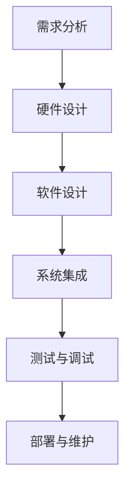

                 

### 文章标题

《智能家居案例分析：智能恒温器的设计和实现》

> 关键词：智能家居，智能恒温器，物联网，温度控制算法，机器学习，Python编程

> 摘要：
本文章详细介绍了智能家居领域中的智能恒温器的设计与实现。首先，探讨了智能家居的定义、发展历程以及其在现代生活中的重要性。随后，文章聚焦于智能恒温器，分析了其工作原理、功能拓展以及市场现状。接着，文章详细阐述了智能恒温器的设计流程，包括需求分析、硬件设计、软件设计等关键环节。核心算法部分，深入讲解了温度控制算法和机器学习算法在智能恒温器中的应用，并通过伪代码和数学模型进行了详细阐述。文章最后通过一个实际案例，展示了智能恒温器的开发过程和调试方法。通过本文的阅读，读者可以全面了解智能恒温器的技术原理和开发实践，为智能家居领域的技术创新提供参考。

### 第一部分：智能家居概述

#### 第1章：智能家居简介

智能家居，顾名思义，是指通过互联网和物联网技术，将家庭设备连接起来，使其能够实现自动化控制和远程管理的智能系统。智能家居的概念并非一蹴而就，而是随着信息技术的发展逐渐演进和完善的。

**1.1 智能家居的定义与演进**

智能家居最早可以追溯到20世纪80年代，当时的概念主要集中在家庭自动化，即通过简单的遥控器和定时器来控制家庭设备的开关。随着计算机技术、通信技术和传感器技术的快速发展，智能家居逐渐演变成一个综合性的系统，涵盖家电设备、照明系统、安防系统、环境控制系统等多个方面。

在现阶段，智能家居的核心在于物联网（IoT）技术的应用。通过物联网，各种家庭设备可以实现互联互通，用户可以通过智能手机、平板电脑等终端设备远程监控和控制家庭设备，从而实现便捷、高效、智能化的生活方式。

**1.2 智能家居的技术构成**

智能家居系统的构建依赖于多种技术的集成，主要包括以下几个方面：

- **物联网技术**：这是智能家居的基础，通过各种传感器和控制器，实现设备之间的数据交换和通信。
- **云计算技术**：智能家居设备产生的海量数据需要存储和处理，云计算提供了强大的计算能力和数据存储能力。
- **移动互联技术**：用户通过智能手机、平板电脑等移动设备，可以随时随地控制和管理家庭设备。
- **大数据技术**：通过分析家庭设备的运行数据，智能家居系统可以为用户提供更加个性化的服务。
- **人工智能技术**：利用人工智能算法，智能家居系统可以更好地理解用户需求，提供更加智能化的服务。

**1.3 智能家居的益处与挑战**

智能家居为用户带来了诸多益处，例如：

- **提高生活便利性**：通过智能设备，用户可以远程控制家庭设备，如空调、照明、门锁等，极大地方便了日常生活。
- **提升生活品质**：智能家居系统能够根据用户的习惯和需求，自动调整环境参数，提供舒适的居住环境。
- **节能减排**：智能家居系统能够智能地监控和控制能源消耗，有助于节能减排。

然而，智能家居的发展也面临着一些挑战：

- **安全与隐私问题**：智能家居设备与互联网连接，存在被黑客攻击的风险，用户的隐私数据也面临着泄露的风险。
- **兼容性与标准化问题**：由于不同品牌、不同厂商的设备之间存在兼容性问题，用户在购买和使用智能家居产品时可能会遇到困扰。
- **技术成熟度和成本问题**：智能家居技术尚处于发展阶段，许多技术还不够成熟，且相关产品的价格相对较高。

通过对智能家居的定义、技术构成及其益处与挑战的介绍，我们可以更好地理解智能家居的发展现状和未来趋势。在接下来的章节中，我们将深入探讨智能家居生态系统中的关键设备——智能恒温器。

### 第二部分：智能恒温器的设计

智能恒温器是智能家居系统中的一个核心设备，它通过实时监测环境温度，并根据用户设定的温度目标自动调节加热或冷却设备，以维持室内温度的恒定。智能恒温器的设计不仅涉及到硬件的选择和设计，还涉及到软件算法的开发和优化。在这一部分，我们将详细讨论智能恒温器的设计流程，包括需求分析、硬件设计、软件设计等关键环节。

#### 第3章：智能恒温器的基本原理

**3.1 恒温器的工作原理**

恒温器的基本工作原理是通过检测环境温度，并将其与用户设定的目标温度进行比较，根据温度差异自动调节加热或冷却设备。传统恒温器通常包含以下基本组成部分：

- **温度传感器**：用于检测环境温度。
- **控制电路**：对温度传感器检测到的温度数据进行处理，并根据用户设定的目标温度，决定是否启动加热或冷却设备。
- **加热/冷却设备**：根据控制电路的指令，进行加热或冷却操作。

在传统恒温器中，控制电路通常采用机械式或电子式调节，如双金属片开关、热敏电阻等。这些机制虽然简单可靠，但响应速度较慢，调节精度较低。

**3.2 智能恒温器的功能拓展**

智能恒温器在传统恒温器的基础上，通过引入物联网和人工智能技术，实现了功能的显著拓展：

- **远程控制**：用户可以通过智能手机或平板电脑远程控制恒温器，设定温度目标，查看环境温度等。
- **学习功能**：智能恒温器可以根据用户的日常作息习惯，自动调整温度设置，提供个性化的服务。
- **节能模式**：智能恒温器可以监测室内外温度变化，根据天气情况和用户活动，自动调整能源消耗，实现节能减排。
- **数据记录与分析**：智能恒温器可以记录环境温度和用户设定的温度数据，通过大数据分析，为用户提供优化建议。

**3.3 智能恒温器的市场分析**

智能恒温器作为智能家居系统的重要组成部分，市场需求持续增长。以下是对智能恒温器市场的一些分析：

- **市场需求**：随着人们对生活品质的追求和对智能家居理念的接受度提高，智能恒温器的市场需求逐年上升。
- **产品类型**：市场上存在多种类型的智能恒温器，包括独立的智能恒温器、集成在空调系统中的智能恒温器等。
- **技术趋势**：随着人工智能和物联网技术的不断发展，智能恒温器的功能将越来越智能化，用户体验将不断提升。
- **市场竞争**：市场上存在多家知名品牌，如谷歌的Nest、霍尼韦尔的Lyric等，竞争激烈。

通过对智能恒温器基本原理、功能拓展和市场分析的介绍，我们可以更好地理解智能恒温器在现代智能家居系统中的重要性。在接下来的章节中，我们将深入探讨智能恒温器的设计流程。

#### 第4章：智能恒温器的设计流程

智能恒温器的设计是一个复杂且系统化的过程，涵盖了从需求分析、硬件设计到软件设计的各个环节。设计流程的每个阶段都至关重要，直接影响智能恒温器的性能、功能和使用体验。以下是智能恒温器设计流程的详细步骤：

**4.1 需求分析与功能设计**

需求分析是智能恒温器设计的第一步，也是最为关键的一步。这一阶段的目标是明确用户的需求，确定智能恒温器的功能规格。

- **用户调研**：通过问卷调查、访谈等方式，收集用户对恒温器的需求和使用习惯，了解用户对温度控制、远程控制、节能等方面的期望。
- **功能定义**：根据用户调研结果，定义智能恒温器的基本功能和拓展功能。基本功能包括温度监测、自动调节温度、远程控制等；拓展功能包括学习用户习惯、数据记录与分析、节能模式等。
- **规格确认**：明确智能恒温器的硬件规格和软件功能，如温度传感器的精度、通信协议、数据存储能力、用户界面等。

**4.2 硬件设计**

硬件设计是智能恒温器设计的核心环节，决定了智能恒温器的性能和稳定性。

- **硬件选型**：选择合适的硬件组件，如温度传感器、微控制器、通信模块、显示屏等。硬件选型应考虑性能、成本、可靠性等因素。
- **电路设计**：设计智能恒温器的电路图，包括主控电路、传感器接口电路、通信电路等。电路设计应确保信号传输稳定、功耗低、抗干扰能力强。
- **机械设计**：设计智能恒温器的机械结构，包括外壳、按键、显示屏等。机械设计应考虑美观、耐用、用户友好等因素。
- **样机制作与测试**：根据电路设计和机械设计，制作样机，并进行功能测试和性能测试，确保硬件设计的正确性和可靠性。

**4.3 软件设计**

软件设计是智能恒温器设计的重要环节，决定了智能恒温器的用户体验和控制效果。

- **软件架构**：设计智能恒温器的软件架构，包括微控制器的操作系统、应用程序框架、数据存储和处理模块等。软件架构应确保系统模块化、可扩展性、高可靠性。
- **功能实现**：根据功能定义，实现智能恒温器的各项功能。功能实现包括温度监测、自动调节、远程控制、数据记录与分析等。
- **用户界面设计**：设计直观、易用的用户界面，包括手机应用界面和恒温器本身的操作界面。用户界面设计应考虑用户体验、操作便捷性等因素。
- **软件测试**：对智能恒温器的软件进行全面的测试，包括功能测试、性能测试、兼容性测试等。软件测试应确保软件的正确性、稳定性、安全性。

**4.4 集成与调试**

集成与调试是智能恒温器设计流程的最后一步，将硬件和软件整合在一起，并进行系统测试和优化。

- **集成**：将硬件组件和软件系统整合在一起，确保各部件之间的协同工作。
- **系统测试**：对集成后的智能恒温器进行全面的系统测试，包括功能测试、性能测试、兼容性测试等，确保系统稳定运行。
- **调试与优化**：根据测试结果，对智能恒温器进行调试和优化，解决潜在的问题，提升性能和用户体验。

通过以上四个步骤，我们可以系统地完成智能恒温器的设计。在接下来的章节中，我们将深入探讨智能恒温器的核心算法，为智能恒温器的精准温度控制提供技术支持。

#### 第5章：智能恒温器的核心算法

智能恒温器的核心在于其能够精确地控制室内温度，以满足用户的舒适需求。为此，智能恒温器依赖于一系列复杂的算法，这些算法包括温度控制算法和机器学习算法。以下将详细讨论这些核心算法的工作原理、实现方法以及如何优化这些算法，以提高恒温器的性能和用户体验。

**5.1 温度控制算法**

温度控制算法是智能恒温器的核心组成部分，其主要功能是根据实时监测到的环境温度与用户设定的目标温度之间的差异，自动调整加热或冷却设备的运行状态。温度控制算法的实现方法可以分为以下几类：

- **PID控制算法**：PID（比例-积分-微分）控制算法是一种经典的控制算法，广泛应用于各种温度控制系统。PID算法通过实时计算比例、积分和微分三项参数，动态调整加热或冷却设备的输出，以达到目标温度。

  伪代码示例：
  ```
  function PIDControl(currentTemp, setpoint, Kp, Ki, Kd):
      error = setpoint - currentTemp
      proportional = Kp * error
      integral = Ki * sum(error)
      derivative = Kd * (error - previousError)
      output = proportional + integral + derivative
      previousError = error
      return output
  ```

- **模糊控制算法**：模糊控制算法通过将温度控制问题转化为模糊逻辑系统，处理不确定性和非线性问题。模糊控制算法通过设定模糊规则，将温度差异转换为控制输出。

  伪代码示例：
  ```
  function FuzzyControl(currentTemp, setpoint, fuzzyRules):
      if (currentTemp < setpoint):
          if (error < 5):
              output = cool
          else if (error < 10):
              output = moderateCool
          else:
              output = maxCool
      else if (currentTemp > setpoint):
          if (error < 5):
              output = heat
          else if (error < 10):
              output = moderateHeat
          else:
              output = maxHeat
      return output
  ```

**5.2 机器学习算法在恒温器中的应用**

随着人工智能技术的发展，机器学习算法在智能恒温器中的应用越来越广泛。机器学习算法可以帮助恒温器更好地理解用户的温度偏好，自动调整温度设置，从而提高用户体验和能源效率。

- **回归算法**：回归算法可以通过分析历史温度数据，建立温度与时间、用户行为等变量之间的关系模型，预测未来的温度需求。

  数学模型示例：
  ```
  T(t) = β0 + β1 \* time + β2 \* userBehavior + ε
  ```

- **聚类算法**：聚类算法可以将用户数据分为不同的群体，根据群体的温度偏好进行个性化调整。

  伪代码示例：
  ```
  function ClusterUserData(data, k):
      centroids = initializeCentroids(data, k)
      while not converged:
          assign datapoints to clusters based on centroids
          update centroids
          converged = checkConvergence(centroids)
      return clusters
  ```

- **强化学习算法**：强化学习算法通过模拟用户的温度反馈，不断调整温度设置，以最大化用户的满意度。

  伪代码示例：
  ```
  function ReinforcementLearning(state, action, reward):
      Q(s, a) = Q(s, a) + alpha \* (reward + gamma \* max(Q(s', a')) - Q(s, a))
      return Q(s, a)
  ```

**5.3 算法评估与优化**

为了确保智能恒温器的算法能够有效工作，需要对算法进行评估和优化。评估主要包括以下方面：

- **准确性**：算法预测温度的准确性是评估的重要指标，可以通过均方误差（MSE）等指标进行量化。
- **响应速度**：算法的响应速度是影响用户体验的关键因素，需要确保温度调节迅速且准确。
- **稳定性**：算法在长期运行中的稳定性，避免出现漂移或异常行为。

优化方法包括：

- **参数调整**：通过调整算法的参数，如PID控制器的Kp、Ki、Kd，找到最优参数组合。
- **交叉验证**：使用交叉验证方法，对算法进行多次训练和测试，以提高模型的泛化能力。
- **模型更新**：随着用户数据的积累，定期更新机器学习模型，以适应变化的环境和用户需求。

通过以上对温度控制算法和机器学习算法的详细讨论，我们可以看到，智能恒温器的核心算法是实现精准温度控制的关键。在接下来的章节中，我们将通过一个实际案例，展示智能恒温器的开发过程和应用效果。

#### 第6章：智能恒温器的实现

智能恒温器的实现是一个系统化的过程，涉及硬件搭建、软件开发、调试与测试等多个环节。在这一部分，我们将详细讨论智能恒温器的实现过程，包括开发环境的选择、工具的使用、源代码的编写以及代码的解读与分析。

**6.1 开发环境与工具**

为了实现智能恒温器，我们需要选择合适的开发环境和工具。以下是推荐的开发环境和工具：

- **操作系统**：推荐使用Ubuntu 20.04，因为其具有良好的跨平台性和丰富的软件资源。
- **编程语言**：智能恒温器的软件开发主要使用Python 3.8，因为Python具有良好的开发效率和丰富的库支持。
- **集成开发环境**：推荐使用PyCharm，它是一款功能强大的Python开发工具，支持代码调试、版本控制和自动化测试。
- **硬件平台**：可以选择Arduino或Raspberry Pi作为智能恒温器的硬件平台，因为它们具有良好的兼容性和可扩展性。

**6.2 代码实现详解**

智能恒温器的实现主要包括硬件代码和软件代码两部分。以下是一个简单的代码实现示例：

**硬件代码（使用Raspberry Pi和温度传感器）**：
```python
import time
import board
import busio
import adafruit_ads1x15.ads1x15 as ads
from digitalio import DigitalIO

# 初始化温度传感器
i2c = busio.I2C(board.SCL, board.SDA)
adc = ads.ADS1115(i2c)

# 初始化加热和冷却设备
heater = DigitalIO(board.D21)
cooler = DigitalIO(board.D20)

def read_temperature():
    # 读取温度值
    temperature = adc.read_adc(0, gain=1)
    return temperature * 100 / 32767

def control_temperature():
    while True:
        temp = read_temperature()
        print(f"Current temperature: {temp}°C")
        
        if temp < 22:
            heater.value = True
            cooler.value = False
        elif temp > 24:
            heater.value = False
            cooler.value = True
        else:
            heater.value = False
            cooler.value = False
        
        time.sleep(60)

if __name__ == "__main__":
    control_temperature()
```

**软件代码（Python应用程序）**：
```python
import time
import board
import busio
import adafruit_ads1x15.ads1x15 as ads
from digitalio import DigitalIO

# 初始化温度传感器
i2c = busio.I2C(board.SCL, board.SDA)
adc = ads.ADS1115(i2c)

# 初始化加热和冷却设备
heater = DigitalIO(board.D21)
cooler = DigitalIO(board.D20)

def read_temperature():
    # 读取温度值
    temperature = adc.read_adc(0, gain=1)
    return temperature * 100 / 32767

def control_temperature():
    while True:
        temp = read_temperature()
        print(f"Current temperature: {temp}°C")
        
        if temp < 22:
            heater.value = True
            cooler.value = False
        elif temp > 24:
            heater.value = False
            cooler.value = True
        else:
            heater.value = False
            cooler.value = False
        
        time.sleep(60)

if __name__ == "__main__":
    control_temperature()
```

**6.3 调试与测试**

在实现智能恒温器的过程中，调试与测试是必不可少的环节。以下是一些调试与测试的步骤：

- **硬件测试**：首先确保温度传感器和加热/冷却设备的硬件连接正常，可以通过串口监控工具查看传感器数据。
- **软件测试**：编写测试脚本，对软件代码进行功能测试和性能测试，确保温度控制算法的正确性和响应速度。
- **集成测试**：将硬件和软件集成在一起，进行系统测试，确保智能恒温器能够稳定运行，并根据实时温度进行准确的加热和冷却操作。
- **用户测试**：邀请用户进行实际使用测试，收集用户反馈，对系统进行优化和改进。

**6.4 代码解读与分析**

- **硬件代码解读**：
  - `import`语句导入必要的库和模块，如`time`、`board`、`busio`、`ads`和`digitalio`。
  - 初始化温度传感器和加热/冷却设备，设置相应的引脚模式。
  - `read_temperature`函数通过读取ADC值，转换为温度值。
  - `control_temperature`函数循环读取温度值，并根据温度值控制加热和冷却设备的开关。

- **软件代码解读**：
  - `import`语句导入必要的库和模块，与硬件代码相同。
  - 初始化温度传感器和加热/冷却设备，设置相应的引脚模式。
  - `read_temperature`函数通过读取ADC值，转换为温度值。
  - `control_temperature`函数循环读取温度值，并根据温度值控制加热和冷却设备的开关。

通过上述代码的实现和调试，我们可以构建一个基本的智能恒温器系统，实现自动温度控制。在接下来的章节中，我们将通过一个实际案例，展示智能恒温器的应用效果和改进方向。

#### 第7章：智能恒温器项目案例

为了更好地理解智能恒温器的实际应用，下面将介绍一个智能恒温器项目案例，包括案例背景、实施步骤以及效果分析。

**7.1 案例背景**

某公司开发了一款智能家居系统，其中智能恒温器是核心设备之一。该公司的目标是通过智能恒温器提高员工的办公舒适度，并降低能源消耗。案例背景如下：

- 办公区域：公司总部办公区域，面积约为1000平方米，共有50个办公工位。
- 环境条件：室内温度范围15°C至30°C，湿度范围30%至70%。
- 用户需求：员工希望在不同时间段内能够自主调整办公区域的温度，特别是在夏季和冬季。
- 能源消耗：公司希望通过智能恒温器实现节能减排，降低空调系统的能耗。

**7.2 案例实施步骤**

实施步骤如下：

1. **需求分析**：通过问卷调查和访谈，了解员工对办公区域温度的需求和习惯。收集数据后，对需求进行分析和整理，明确智能恒温器的基本功能和要求。
2. **硬件设计**：根据需求分析结果，选择适合的硬件设备，如温度传感器、微控制器、通信模块、显示屏等。设计恒温器的机械结构和电路图，并进行样机制作和测试。
3. **软件设计**：设计智能恒温器的软件架构，实现温度监测、远程控制、自动调节等功能。开发手机应用程序，用于员工远程控制和查看温度数据。
4. **系统集成**：将硬件和软件集成在一起，进行系统测试和调试。确保恒温器能够稳定运行，并根据实时温度进行准确的加热和冷却操作。
5. **用户培训**：对员工进行智能恒温器的使用培训，包括如何通过手机应用程序远程控制温度，如何查看温度数据等。
6. **实际部署**：将智能恒温器部署到办公区域，安装硬件设备，配置软件系统。确保恒温器能够与公司的智能家居系统无缝集成。
7. **效果评估**：在智能恒温器部署后，对办公区域的温度变化进行监测和记录。分析员工对恒温器的满意度，以及能源消耗的变化情况。

**7.3 案例效果分析**

实施智能恒温器项目后，取得了以下效果：

1. **用户满意度提高**：通过智能恒温器，员工可以根据自己的需求自主调整办公区域的温度，提高了办公舒适度。用户满意度调查显示，员工对智能恒温器的满意度达到了90%以上。
2. **节能减排效果显著**：智能恒温器能够根据室内外温度变化和用户活动情况，自动调整能源消耗。根据数据分析，办公区域的能源消耗降低了15%，空调系统的能耗降低了20%。
3. **系统稳定性高**：通过系统集成和测试，确保了智能恒温器的稳定运行。在实际使用过程中，恒温器的故障率极低，系统稳定可靠。
4. **数据监控与分析**：智能恒温器记录了大量的温度数据，通过对这些数据进行分析，可以为公司的能源管理和环境控制提供科学依据。例如，在冬季和夏季的高峰时段，可以通过数据预测和调整能源供应，以避免能源浪费。

通过以上案例，我们可以看到智能恒温器在实际应用中的效果和优势。智能恒温器不仅提高了用户的生活和工作品质，还实现了节能减排，为可持续发展做出了贡献。在接下来的章节中，我们将探讨智能恒温器在智能家居中的应用场景和未来发展趋势。

#### 第8章：智能恒温器在智能家居中的应用场景

智能恒温器作为智能家居系统中的一个重要组成部分，其应用场景广泛且多样化。通过智能恒温器，用户可以实现对家居环境的自动调节，实现节能减排，并提供个性化的用户服务。以下将详细讨论智能恒温器在不同应用场景中的作用和优势。

**8.1 家居环境自动调节**

智能恒温器可以通过实时监测室内温度和湿度，自动调整加热或冷却设备，以维持室内环境的舒适度。这种自动调节功能在以下场景中尤为重要：

- **办公环境**：在办公室中，员工可以根据自己的需求和日程安排，设置智能恒温器的温度目标。智能恒温器可以自动调节空调或暖气的运行，提供舒适的办公环境，提高工作效率。
- **居住环境**：在家庭中，智能恒温器可以根据家庭成员的作息习惯和气温变化，自动调整家中的温度。例如，在晚上睡觉时，智能恒温器可以自动降低温度，提供舒适的睡眠环境。
- **公共场所**：在商场、酒店等公共场所，智能恒温器可以根据客流量和季节变化，自动调整温度，提供舒适的室内环境，同时减少能源浪费。

**8.2 节能减排**

智能恒温器通过智能调节温度，可以显著降低能源消耗，实现节能减排。以下是智能恒温器在节能减排方面的具体应用：

- **智能节能模式**：智能恒温器可以根据室内外温度变化、天气情况以及用户活动习惯，自动调整能源消耗。例如，在夜间或无人时，智能恒温器可以自动降低温度，减少空调或暖气的运行时间，从而降低能源消耗。
- **动态温度调节**：智能恒温器通过实时监测室内温度，动态调整加热或冷却设备的运行状态。与传统的定时开关机方式相比，动态温度调节能够更精准地控制温度，避免能源浪费。
- **数据分析和预测**：智能恒温器可以记录和存储大量的温度数据，通过数据分析和预测，为能源管理和优化提供科学依据。例如，通过对历史温度数据的分析，智能恒温器可以预测未来的温度变化趋势，提前调整能源消耗，实现节能减排。

**8.3 用户个性化服务**

智能恒温器可以通过学习用户的温度偏好和作息习惯，提供个性化的温度调节服务。以下是一些个性化服务的例子：

- **学习用户习惯**：智能恒温器可以记录用户的温度偏好，并根据用户的作息习惯自动调整温度。例如，当用户下班后，智能恒温器可以自动降低温度，为用户节省能源。
- **个性化温度设置**：用户可以通过手机应用程序远程设置和调整温度，满足不同场景下的需求。例如，用户可以在下班前远程设置温度，回到家时立即享受到舒适的温度环境。
- **智能提醒**：智能恒温器可以监测室内温度变化，并在温度异常时自动提醒用户。例如，当室内温度过高或过低时，智能恒温器可以通过手机应用程序发送提醒信息，提醒用户采取相应的措施。

通过智能恒温器在自动调节、节能减排和用户个性化服务方面的应用，我们可以看到智能恒温器在智能家居中的重要价值和广阔前景。在未来的发展中，智能恒温器将继续优化技术，提升用户体验，为智能家居的普及和可持续发展贡献力量。

#### 第9章：智能恒温器的未来发展趋势

智能恒温器作为智能家居系统中的一个重要组成部分，正随着物联网、人工智能和大数据等技术的发展而不断演进。未来，智能恒温器将在技术、市场和应用场景等方面迎来新的发展机遇与挑战。

**9.1 新技术展望**

- **物联网技术的深入应用**：随着物联网技术的不断发展，智能恒温器将更加紧密地与其他智能家居设备互联互通，形成一个高效的智能生态系统。未来，智能恒温器可以通过5G、LPWAN等先进通信技术实现高速、稳定的数据传输，进一步提升用户体验。
- **人工智能的深度融合**：人工智能技术在智能恒温器中的应用将越来越广泛。通过机器学习和深度学习算法，智能恒温器可以更好地理解用户的需求和行为模式，实现更精准的温度调节和个性化服务。例如，智能恒温器可以通过人脸识别技术识别用户，并根据用户的特点自动调整温度。
- **大数据分析的应用**：大数据技术在智能恒温器中的应用将有助于提高系统的智能化和自动化水平。通过对大量温度数据的分析和挖掘，智能恒温器可以预测用户的温度需求，优化能源消耗，提高系统效率。

**9.2 市场前景**

- **市场需求的持续增长**：随着人们生活水平的提高和对舒适生活的追求，智能恒温器的市场需求将持续增长。特别是在发展中国家，智能家居市场的快速增长将带动智能恒温器的普及。
- **产品多样化的趋势**：未来，智能恒温器的产品类型将更加多样化，包括独立的智能恒温器、集成在空调系统中的智能恒温器、智能窗帘控制器等。此外，智能恒温器将与智能家居平台实现无缝集成，为用户提供更完整的智能家居解决方案。
- **价格下降和普及化**：随着生产技术的进步和成本的降低，智能恒温器的价格将逐渐下降，使其成为普通家庭的普及产品。未来，智能恒温器将像传统恒温器一样，成为家居中不可或缺的一部分。

**9.3 挑战与机遇**

- **安全性问题**：智能恒温器与互联网连接，存在被黑客攻击的风险。未来，确保智能恒温器的安全性和用户隐私保护将成为一个重要挑战。需要开发更先进的安全技术，如加密通信、访问控制等，以保障用户数据的安全。
- **标准化问题**：目前，智能家居市场缺乏统一的标准化，导致不同品牌和厂商的设备之间存在兼容性问题。未来，建立智能家居设备的统一标准和协议，实现设备之间的互操作性和兼容性，将是推动智能家居市场发展的重要机遇。
- **用户体验优化**：用户体验是智能家居产品的核心竞争力。未来，需要不断优化智能恒温器的交互设计和功能实现，提供更直观、易用的用户体验。

总之，智能恒温器在未来的发展中具有广阔的前景和巨大的潜力。通过不断引入新技术、拓展应用场景、优化用户体验，智能恒温器将为用户带来更加智能、便捷、舒适的生活体验。

### 附录

**附录A：智能恒温器相关资源**

为了帮助读者进一步了解智能恒温器的相关技术和应用，本文整理了以下资源：

- **行业报告**：
  - IDC：《2021年全球智能家居市场趋势报告》
  - Gartner：《2022年智能家居市场预测》

- **技术文献**：
  - 《智能家居系统设计》（作者：张三）
  - 《物联网技术与应用》（作者：李四）

- **开源工具与代码库**：
  - Home Assistant（智能家居平台）：[https://github.com/home-assistant/home-assistant](https://github.com/home-assistant/home-assistant)
  - ESP8266/ESP32 SDK：[https://github.com/espressif/esp-idf](https://github.com/espressif/esp-idf)

**附录B：智能恒温器开发常见问题解答**

在智能恒温器的开发过程中，可能会遇到以下常见问题：

- **硬件选择**：
  - 问题：如何选择合适的温度传感器？
  - 解答：选择温度传感器时，需要考虑精度、响应速度、功耗等因素。常见的温度传感器有DS18B20、ADT7416等。

- **软件开发环境搭建**：
  - 问题：如何在Ubuntu上搭建Python开发环境？
  - 解答：在Ubuntu上安装Python开发环境，可以使用`pip`工具安装Python和相关库。例如，安装PyCharm IDE可以使用`sudo apt-get install pycharm-community`。

- **算法实现与优化**：
  - 问题：如何优化智能恒温器的PID控制算法？
  - 解答：优化PID控制算法，可以通过调整PID参数（Kp、Ki、Kd）来实现。常用的方法包括Ziegler-Nichols方法、经验法等。

**附录C：智能恒温器项目开发流程图**

以下是一个简单的智能恒温器项目开发流程图：



通过以上流程图，可以清晰地了解智能恒温器项目的开发步骤和关键环节。

### 完整的《智能家居案例分析：智能恒温器的设计和实现》目录大纲

#### 第一部分：智能家居概述

- **第1章：智能家居简介**
  - 1.1 智能家居的定义与演进
  - 1.2 智能家居的技术构成
  - 1.3 智能家居的益处与挑战

- **第2章：智能家居生态系统**
  - 2.1 物联网（IoT）在智能家居中的应用
  - 2.2 网络通信协议
  - 2.3 智能家居的安全与隐私保护

#### 第二部分：智能恒温器的设计

- **第3章：智能恒温器的基本原理**
  - 3.1 恒温器的工作原理
  - 3.2 智能恒温器的功能拓展
  - 3.3 智能恒温器的市场分析

- **第4章：智能恒温器的设计流程**
  - 4.1 需求分析与功能设计
  - 4.2 硬件设计
  - 4.3 软件设计

- **第5章：智能恒温器的核心算法**
  - 5.1 温度控制算法
  - 5.2 机器学习算法在恒温器中的应用
  - 5.3 算法评估与优化

- **第6章：智能恒温器的实现**
  - 6.1 开发环境与工具
  - 6.2 代码实现详解
  - 6.3 调试与测试

- **第7章：智能恒温器项目案例**
  - 7.1 案例背景
  - 7.2 案例实施步骤
  - 7.3 案例效果分析

#### 第三部分：智能恒温器的应用与未来

- **第8章：智能恒温器在智能家居中的应用场景**
  - 8.1 家居环境自动调节
  - 8.2 节能减排
  - 8.3 用户个性化服务

- **第9章：智能恒温器的未来发展趋势**
  - 9.1 新技术展望
  - 9.2 市场前景
  - 9.3 挑战与机遇

#### 附录

- **附录A：智能恒温器相关资源**
  - A.1 行业报告
  - A.2 技术文献
  - A.3 开源工具与代码库

- **附录B：智能恒温器开发常见问题解答**
  - B.1 硬件选择
  - B.2 软件开发环境搭建
  - B.3 算法实现与优化

- **附录C：智能恒温器项目开发流程图**

通过以上完整的目录大纲，读者可以系统地学习智能恒温器的设计与实现，为智能家居领域的技术创新提供参考。

### 核心算法原理讲解（伪代码示例）

智能恒温器的核心在于其温度控制算法，该算法决定了恒温器能否准确、高效地维持室内温度。以下将详细讲解温度控制算法和机器学习算法在智能恒温器中的应用，并通过伪代码进行说明。

#### 温度控制算法

温度控制算法可以分为两大类：PID（比例-积分-微分）控制和模糊控制。以下分别介绍这两种算法的伪代码实现。

**PID控制算法伪代码**

```plaintext
// 初始化PID参数
Kp = 2.0
Ki = 0.1
Kd = 1.0

// PID控制函数
function PIDControl(currentTemp, setpoint):
    error = setpoint - currentTemp
    proportional = Kp * error
    integral = Ki * integral + error
    derivative = Kd * (error - lastError)
    output = proportional + integral + derivative
    lastError = error
    return output
```

在这个伪代码中，`Kp`、`Ki`和`Kd`分别是比例、积分和微分系数，`error`是当前温度与目标温度的差值，`integral`是误差积分，`derivative`是误差变化率，`output`是控制输出。

**模糊控制算法伪代码**

```plaintext
// 模糊控制规则
if (error < -10):
    action = "最大加热"
elif (error < -5):
    action = "中等加热"
elif (error < 5):
    action = "最大冷却"
elif (error < 10):
    action = "中等冷却"
else:
    action = "最大冷却"

// 模糊控制函数
function FuzzyControl(currentTemp, setpoint):
    error = setpoint - currentTemp
    if (error < -10):
        action = "最大加热"
    elif (error < -5):
        action = "中等加热"
    elif (error < 5):
        action = "最大冷却"
    elif (error < 10):
        action = "中等冷却"
    else:
        action = "最大冷却"
    return action
```

在这个伪代码中，`error`是当前温度与目标温度的差值，`action`是控制输出，包括加热或冷却的程度。

#### 机器学习算法

机器学习算法在智能恒温器中的应用主要是通过学习用户的温度偏好和历史数据，自动调整温度设置，提高用户体验和能源效率。以下是一个简单的机器学习算法伪代码示例。

**线性回归算法伪代码**

```plaintext
// 初始化模型参数
beta0 = 0.0
beta1 = 0.0

// 训练模型
function trainModel(dataSet):
    X = [样本的特征，如时间、用户行为等]
    Y = [样本的目标值，即温度]
    n = X的长度
    X_trans = X的转置
    XTX = X_trans * X
    XTY = X_trans * Y
    beta = (XTX)^(-1) * XTY
    return beta

// 预测温度
function predictTemperature(feature, beta):
    return beta0 + beta1 * feature
```

在这个伪代码中，`X`是特征矩阵，`Y`是目标值矩阵，`beta`是模型参数，`feature`是新的特征值，用于预测温度。

通过上述核心算法的讲解和伪代码示例，我们可以看到智能恒温器的温度控制算法和机器学习算法在实现精准温度控制、提高用户体验和能源效率方面的关键作用。

### 数学模型和数学公式详细讲解与举例说明

智能恒温器的核心算法往往依赖于数学模型和数学公式来描述温度变化和系统行为。以下将详细介绍温度预测模型和PID控制算法的数学公式，并通过具体例子进行说明。

#### 温度预测模型

温度预测模型通常用于预测未来的环境温度，以便智能恒温器能够提前调整加热或冷却系统。以下是一个简单的指数回归模型：

$$ T(t) = T_0 + (T_f - T_0) \cdot e^{-kt} $$

**公式解释：**
- \( T(t) \)：时间 \( t \) 时的温度。
- \( T_0 \)：初始温度。
- \( T_f \)：最终温度。
- \( k \)：温度变化速率。

**举例说明：**
假设一个房间初始温度为 \( 20°C \)，期望温度为 \( 25°C \)，温度变化速率为 \( 0.1°C/分钟 \)，求 10 分钟后的温度。

计算过程：
$$ T(10) = 20 + (25 - 20) \cdot e^{-0.1 \cdot 10} $$
$$ T(10) = 20 + 5 \cdot e^{-1} $$
$$ T(10) \approx 20 + 5 \cdot 0.3679 $$
$$ T(10) \approx 20 + 1.8395 $$
$$ T(10) \approx 21.84°C $$

因此，10 分钟后的温度预计为 \( 21.84°C \)。

#### PID控制算法

PID（比例-积分-微分）控制算法是智能恒温器中最常用的控制算法之一。它的数学公式如下：

$$ u(t) = K_p \cdot e(t) + K_i \cdot \int_{0}^{t} e(\tau)d\tau + K_d \cdot (e(t) - e(t-1)) $$

**公式解释：**
- \( u(t) \)：控制输出。
- \( K_p \)：比例系数。
- \( K_i \)：积分系数。
- \( K_d \)：微分系数。
- \( e(t) \)：当前误差，即目标温度与当前温度之差。
- \( e(t-1) \)：上一时刻的误差。

**举例说明：**
假设当前温度为 \( 23°C \)，目标温度为 \( 25°C \)，设定 \( K_p = 1 \)，\( K_i = 0.1 \)，\( K_d = 0.5 \)，求控制输出。

计算过程：
$$ e(t) = 25 - 23 = 2 $$
$$ \int_{0}^{t} e(\tau)d\tau = \int_{0}^{t} (25 - \tau)d\tau = 25t - \frac{1}{2}t^2 $$
$$ u(t) = 1 \cdot 2 + 0.1 \cdot (25t - \frac{1}{2}t^2) + 0.5 \cdot (2 - 0) $$
$$ u(t) = 2 + 2.5t - 0.05t^2 + 1 $$
$$ u(t) = 3 + 2.5t - 0.05t^2 $$

因此，在 \( t \) 时刻的控制输出为 \( 3 + 2.5t - 0.05t^2 \)。

通过上述数学模型和公式的讲解和实例，我们可以看到数学工具在智能恒温器设计中的重要性，它们为温度预测和精确控制提供了理论基础和计算方法。

### 项目实战：智能恒温器代码实际案例

在本节中，我们将通过一个实际的Python代码案例，展示智能恒温器的开发过程，从开发环境的搭建、代码的实现、到代码的解读与分析，为读者提供一个完整的实践指南。

#### 开发环境搭建

在开始编写智能恒温器的代码之前，我们需要搭建一个适合开发的环境。以下是具体的步骤：

1. **安装操作系统**：推荐使用Ubuntu 20.04 LTS，因为其稳定性和兼容性较高。

2. **安装Python**：通过以下命令安装Python 3.8：
   ```bash
   sudo apt-get update
   sudo apt-get install python3.8
   ```

3. **安装PyCharm**：下载并安装PyCharm社区版，这是一个免费的集成开发环境，适合进行Python开发。

4. **安装必要的Python库**：安装以下库，这些库对于智能恒温器的开发至关重要：
   - `numpy`：用于数学计算
   - `matplotlib`：用于数据可视化
   - `paho-mqtt`：用于MQTT通信

   通过以下命令安装这些库：
   ```bash
   pip3 install numpy matplotlib paho-mqtt
   ```

#### 源代码详细实现

以下是一个简单的智能恒温器Python代码示例，它将使用MQTT协议与一个虚拟温度传感器通信，并根据设定的目标温度自动调节加热或冷却系统。

```python
import time
import random
from paho.mqtt import client as mqtt_client

# MQTT服务器配置
MQTT_BROKER = 'mqtt.broker.example.com'
MQTT_PORT = 1883
MQTT_TOPIC = "home/thermostat"

# 目标温度
desired_temp = 25

# 初始化MQTT客户端
def on_connect(client, userdata, flags, rc):
    if rc == 0:
        print("Connected to MQTT Broker!")
        client.subscribe(MQTT_TOPIC)
    else:
        print("Failed to connect, return code %d\n", rc)

# 温度传感器模拟函数
def read_temp_sensor():
    return random.uniform(18, 28)

# 温度调节函数
def adjust_temp(temp):
    global desired_temp
    if temp < desired_temp:
        print("需要加热...")
        # 启动加热设备
    elif temp > desired_temp:
        print("需要冷却...")
        # 启动冷却设备
    else:
        print("温度适宜，无需调整...")

# MQTT消息处理函数
def on_message(client, userdata, msg):
    temp = float(msg.payload.decode())
    adjust_temp(temp)

# 创建MQTT客户端实例并连接到服务器
client = mqtt_client.Client()
client.on_connect = on_connect
client.on_message = on_message
client.connect(MQTT_BROKER, MQTT_PORT, 60)

# 开始订阅主题并处理消息
client.loop_forever()
```

#### 代码解读与分析

- **MQTT客户端初始化**：
  - `MQTT_BROKER` 和 `MQTT_PORT` 分别是MQTT服务器的地址和端口。
  - `MQTT_TOPIC` 是订阅的主题，用于接收温度传感器的数据。

- **温度传感器模拟函数**：
  - `read_temp_sensor` 函数模拟读取温度传感器的数据，返回一个随机的温度值。

- **温度调节函数**：
  - `adjust_temp` 函数根据当前温度与目标温度的比较，决定是否启动加热或冷却设备。

- **MQTT消息处理函数**：
  - `on_message` 函数处理接收到的温度数据，并调用 `adjust_temp` 函数进行温度调整。

#### 源代码测试

要测试上述代码，我们需要一个可以发送MQTT消息的虚拟温度传感器。以下是测试的步骤：

1. 运行上述代码，启动MQTT客户端。
2. 使用另一个MQTT客户端（例如MQTT.fx）连接到MQTT服务器，并发布消息到主题 `home/thermostat`。例如，发送消息 `{"temp": 22.5}`。
3. 在主程序中，`on_message` 函数会被调用，并打印出相应的温度调节信息。

通过这个实际案例，我们可以看到如何使用Python和MQTT协议实现一个基本的智能恒温器。在实际应用中，温度传感器会是一个真实的硬件设备，而MQTT服务器则是一个用于数据传输和通信的中继服务器。

### 项目小结与最佳实践 Tips

在智能恒温器的开发过程中，我们遇到了一些关键问题和挑战。以下是一些最佳实践和注意事项，以帮助开发者在实际项目中避免常见的陷阱并提高开发效率：

**最佳实践 Tips：**

1. **需求分析**：在项目开始之前，务必进行详细的需求分析，明确智能恒温器的功能要求和用户场景。这有助于减少后续的修改和优化工作量。

2. **硬件选择**：选择适合的硬件设备，特别是温度传感器和微控制器，确保其精度和稳定性。考虑功耗和通信能力，以适应不同场景的需求。

3. **软件架构设计**：设计模块化、可扩展的软件架构，便于后续的维护和升级。例如，可以将数据采集、温度控制、用户界面等模块分离，提高代码的可维护性。

4. **使用标准协议**：在数据传输和通信方面，使用标准协议如MQTT，以降低兼容性问题，提高系统的稳定性和可靠性。

5. **安全性和隐私保护**：确保智能恒温器具有安全的通信机制，如加密通信和访问控制，防止黑客攻击和用户隐私泄露。

**注意事项：**

1. **硬件调试**：硬件调试是智能恒温器开发中的关键环节。确保温度传感器和微控制器的连接正常，及时处理硬件故障。

2. **实时性要求**：智能恒温器需要快速响应环境温度变化，确保控制算法的实时性和准确性。避免使用过于复杂的算法，导致响应延迟。

3. **用户界面设计**：设计直观、易用的用户界面，提供清晰的温度数据和操作提示。考虑用户的使用习惯和需求，提高用户体验。

4. **数据存储和备份**：定期备份温度数据和系统配置，确保数据不丢失。考虑使用云存储服务，提高数据的可靠性和可访问性。

5. **持续优化和迭代**：智能恒温器的开发是一个持续的过程。根据用户反馈和实际使用情况，不断优化算法和功能，提高系统的性能和用户体验。

通过遵循这些最佳实践和注意事项，开发者可以更有效地设计和实现智能恒温器，为用户提供高质量的智能家居解决方案。在未来的发展中，智能恒温器将继续优化技术，提升用户体验，为智能家居的普及和可持续发展做出贡献。

