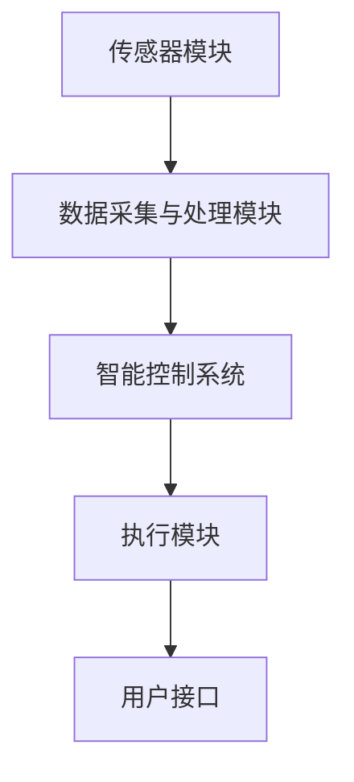
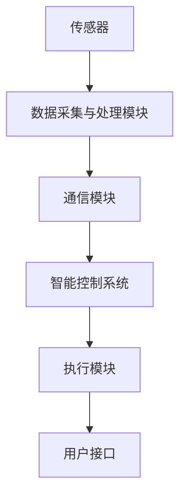

                 


### 文章标题：智能家居空气营养创业：呼吸健康的精确管理

> 关键词：智能家居，空气营养，空气质量管理，呼吸健康，创业实践

> 摘要：本文将深入探讨智能家居空气营养领域，分析其市场背景、技术原理、产品设计与开发、营销策略以及未来趋势。通过市场调研与需求分析，结合国内外成功案例，为创业者提供有价值的参考和启示。

----------------------------------------------------------------

### 目录大纲

# 《智能家居空气营养创业：呼吸健康的精确管理》

## 第一部分：背景与概念

### 第1章：智能家居与空气营养概述

#### 1.1 智能家居行业背景

#### 1.2 空气营养的概念与重要性

#### 1.3 呼吸健康的精确管理

### 第2章：空气质量管理与创业

#### 2.1 空气质量检测技术

#### 2.2 空气污染治理方法

#### 2.3 创业与市场机会

### 第3章：智能家居产品与服务

#### 3.1 智能空气净化器

#### 3.2 智能通风系统

#### 3.3 智能湿度调节器

## 第二部分：技术原理

### 第4章：智能家居空气营养技术基础

#### 4.1 传感器与数据分析

#### 4.2 智能控制系统

#### 4.3 人机交互界面

### 第5章：空气营养核心算法

#### 5.1 空气质量预测模型

#### 5.2 空气污染控制算法

#### 5.3 智能通风策略

### 第6章：智能家居空气营养系统集成

#### 6.1 系统架构设计

#### 6.2 数据流与接口设计

#### 6.3 系统测试与优化

## 第三部分：创业实践

### 第7章：市场调研与需求分析

#### 7.1 市场规模与增长趋势

#### 7.2 消费者需求与痛点

#### 7.3 竞争对手分析

### 第8章：产品设计与开发

#### 8.1 产品定位与功能规划

#### 8.2 技术实现与成本控制

#### 8.3 用户界面设计

### 第9章：营销策略与推广

#### 9.1 品牌建设

#### 9.2 市场推广渠道

#### 9.3 用户反馈与迭代

### 第10章：商业模式与盈利模式

#### 10.1 不同的商业模式

#### 10.2 盈利模式分析

#### 10.3 资本筹集与运营管理

## 第四部分：案例分析

### 第11章：国内外智能家居空气营养成功案例

#### 11.1 国外案例分析

#### 11.2 国内案例分析

#### 11.3 案例启示与借鉴

## 第五部分：未来趋势与展望

### 第12章：智能家居空气营养技术发展趋势

#### 12.1 传感器技术进步

#### 12.2 人工智能与大数据应用

#### 12.3 网络安全与隐私保护

### 第13章：市场机会与挑战

#### 13.1 市场机会分析

#### 13.2 面临的挑战

#### 13.3 应对策略与建议

### 第14章：结语与展望

#### 14.1 结论

#### 14.2 未来展望

### 附录

#### 附录A：智能家居空气营养技术术语表

#### 附录B：参考文献与资料

#### 附录C：进一步学习资源推荐

----------------------------------------------------------------

### 第1章：智能家居与空气营养概述

#### 1.1 智能家居行业背景

智能家居行业起源于20世纪90年代，随着互联网和物联网技术的发展，智能家居逐渐成为现代家庭生活的重要组成部分。近年来，随着人们对生活品质和健康需求的不断提高，智能家居行业迎来了爆发式增长。据统计，全球智能家居市场规模从2015年的38亿美元增长到2020年的138亿美元，预计到2025年将达到450亿美元。在中国，智能家居市场规模也在迅速扩大，成为家电行业的重要增长点。

智能家居行业的发展主要受到以下几个因素的推动：

1. **技术进步**：物联网技术、人工智能、大数据等先进技术的不断发展，为智能家居产品提供了强大的技术支持。
2. **消费者需求**：随着人们生活水平的提高，消费者对智能家居产品的需求不断增加，特别是对于提升生活品质和健康水平的智能家居产品，如空气净化器、智能通风系统等。
3. **政策支持**：各国政府纷纷出台相关政策，鼓励智能家居行业的发展，如智能家居补贴政策、智能家居标准制定等。

#### 1.2 空气营养的概念与重要性

空气营养是指通过科学的空气管理和净化技术，确保室内空气中的氧气、二氧化碳、水蒸气以及其他空气成分达到最佳状态，从而提升居住环境的质量和人们的健康水平。空气营养的概念涵盖了空气质量监测、空气净化、通风换气等多个方面。

空气营养的重要性主要体现在以下几个方面：

1. **健康保障**：良好的空气质量是保障人们健康的基础。空气中的有害物质如PM2.5、甲醛、苯等，会对人体的呼吸系统、免疫系统等造成严重影响，甚至诱发癌症等疾病。
2. **生活品质**：优质的空气环境可以改善人们的睡眠质量，提高生活舒适度，降低心理压力。
3. **节能环保**：通过智能通风系统和空气净化器等设备，可以减少空调等制冷设备的能耗，实现节能环保。

#### 1.3 呼吸健康的精确管理

呼吸健康的精确管理是指利用智能技术对室内空气进行实时监控、分析和调节，以确保居住环境的空气质量始终保持在健康范围内。呼吸健康的精确管理主要包括以下几个方面：

1. **实时监测**：通过安装空气质量传感器，实时监测室内的空气质量，包括PM2.5、温度、湿度、二氧化碳浓度等参数。
2. **数据分析**：对实时监测的数据进行分析，预测空气质量的趋势，识别空气污染的来源。
3. **智能调节**：根据空气质量数据，智能控制系统会自动调节空气净化器、通风系统等设备，以改善空气质量。

呼吸健康的精确管理有助于提升居住环境的质量，保障人们的健康，是智能家居行业的一个重要发展方向。

----------------------------------------------------------------

### 第2章：空气质量管理与创业

#### 2.1 空气质量检测技术

空气质量检测技术是空气质量管理的基础。目前，常用的空气质量检测技术主要包括传感器技术和实验室检测技术。

1. **传感器技术**：
   - **颗粒物传感器**：如PM2.5、PM10传感器，用于检测空气中的颗粒物浓度。
   - **气体传感器**：如甲醛、苯、TVOC传感器，用于检测空气中的有害气体。
   - **温度传感器**：用于测量室内温度。
   - **湿度传感器**：用于测量室内湿度。

2. **实验室检测技术**：
   - **气相色谱法**：用于检测空气中的有机污染物。
   - **离子色谱法**：用于检测空气中的无机离子。
   - **生物传感器法**：通过微生物或细胞的反应来检测空气中的污染物。

传感器技术的优点是实时性强、操作简便，但存在检测精度较低、寿命较短等缺点。实验室检测技术的优点是检测精度高、可靠性好，但操作复杂、耗时较长。

#### 2.2 空气污染治理方法

空气污染治理方法主要包括空气净化、通风换气和植物净化等。

1. **空气净化**：
   - **物理净化**：如过滤法、静电吸附法，通过物理手段去除空气中的颗粒物和有害气体。
   - **化学净化**：如臭氧净化、光催化净化，通过化学反应分解空气中的有害物质。
   - **生物净化**：如植物净化，利用植物吸附和分解空气中的污染物。

2. **通风换气**：
   - **自然通风**：通过窗户、通风口等自然通道实现空气流动。
   - **机械通风**：通过风扇、排风设备等机械设备实现空气流动。

3. **植物净化**：
   - 利用植物吸收和分解空气中的有害物质，如甲醛、苯等。

每种治理方法都有其适用场景和效果，实际应用中通常需要多种方法相结合，以达到最佳效果。

#### 2.3 创业与市场机会

空气质量管理是一个充满机会的市场。随着人们对空气质量意识的提高，对空气净化设备和服务的需求日益增加。以下是空气质量管理市场中的一些机会：

1. **智能家居空气净化器**：
   - **功能扩展**：除了基本的空气净化功能，还可以增加温度、湿度、空气质量监测等功能，提高产品的附加值。
   - **智能控制**：通过智能连接和控制，实现远程控制、自动调节等功能。

2. **智能通风系统**：
   - **个性化设计**：根据用户的实际需求，提供定制化的通风解决方案。
   - **节能环保**：通过智能调节，实现节能降耗。

3. **空气营养服务**：
   - **健康监测**：提供全面的室内空气健康监测服务，包括实时数据监测、定期检测报告等。
   - **空气质量改善**：提供专业的空气净化和通风解决方案，改善室内空气质量。

4. **教育和培训**：
   - 提供室内空气质量教育和培训，提高公众的空气质量管理意识。

创业者可以结合市场需求和自身优势，选择合适的切入点，开发有竞争力的产品和服务。

----------------------------------------------------------------

### 第3章：智能家居产品与服务

#### 3.1 智能空气净化器

智能空气净化器是智能家居空气营养产品的核心。它通过传感器实时监测室内空气质量，并根据监测数据自动调节净化模式，以维持室内空气的清新与健康。

**工作原理**：
1. **传感器监测**：智能空气净化器内置多种传感器，如颗粒物传感器、气体传感器等，实时监测空气中的有害物质浓度。
2. **数据分析**：收集到的数据会传输到智能控制系统，进行实时分析，判断空气质量状况。
3. **智能调节**：根据分析结果，智能控制系统会自动调节净化器的运行模式，如自动启动净化功能、调整风量等。

**功能特点**：
1. **自动调节**：根据空气质量自动启动或关闭，实现智能化的空气管理。
2. **远程控制**：通过手机APP或其他智能设备，实现远程操控。
3. **多功能净化**：除颗粒物外，还可以净化空气中的有害气体，如甲醛、苯等。
4. **智能过滤**：采用多层过滤技术，如HEPA过滤、活性炭过滤等，提高净化效果。

**市场前景**：
随着人们对室内空气质量越来越重视，智能空气净化器的市场需求持续增长。特别是在新装修房屋和新建住宅区，智能空气净化器成为标配。未来，随着技术的进一步成熟，智能空气净化器的功能将更加丰富，如加入语音控制、更精准的空气质量预测等。

#### 3.2 智能通风系统

智能通风系统是改善室内空气质量的另一重要设备。它通过智能控制，实现室内外空气的交换，从而维持室内空气的新鲜和健康。

**工作原理**：
1. **传感器监测**：智能通风系统内置空气质量传感器，实时监测室内空气质量，包括温度、湿度、二氧化碳浓度等。
2. **智能调节**：根据传感器数据，智能控制系统会自动调节通风系统，如开启或关闭风机、调节通风量等。
3. **双向通风**：智能通风系统能够实现室内外空气的双向交换，既能排出室内的污浊空气，又能引入新鲜空气。

**功能特点**：
1. **自动调节**：根据室内空气质量自动调节通风模式，实现智能通风。
2. **节能环保**：通过智能调节，实现节能降耗。
3. **舒适健康**：提供舒适的室内空气环境，提高居住舒适度。
4. **自定义设置**：用户可以根据自己的需求，自定义通风时间和通风量。

**市场前景**：
随着人们对健康生活理念的重视，智能通风系统的市场需求也在不断增加。特别是在一些空气质量较差的城市，智能通风系统成为改善室内空气质量的重要手段。未来，随着智能家居市场的进一步发展，智能通风系统的应用场景将更加广泛，如商场、办公楼等公共建筑。

#### 3.3 智能湿度调节器

智能湿度调节器是维持室内空气湿度稳定的设备。它通过智能控制，实现室内湿度的自动调节，从而避免湿度过高或过低对人体的危害。

**工作原理**：
1. **传感器监测**：智能湿度调节器内置湿度传感器，实时监测室内湿度。
2. **智能调节**：根据传感器数据，智能控制系统会自动启动或关闭加湿器或除湿器，以维持室内湿度在理想范围内。
3. **智能模式**：根据季节和天气变化，智能湿度调节器可以自动调整湿度模式。

**功能特点**：
1. **自动调节**：根据室内湿度自动调节加湿或除湿模式。
2. **节能环保**：通过智能调节，实现节能降耗。
3. **智能模式**：根据季节和天气变化，自动调整湿度模式。
4. **安全可靠**：智能湿度调节器具备过热保护、水位检测等功能，确保使用安全。

**市场前景**：
室内湿度对人体的健康非常重要，特别是在干燥或潮湿的季节。智能湿度调节器的市场需求日益增长。特别是在一些空气湿度变化大的地区，如北方干燥地区和南方潮湿地区，智能湿度调节器成为家庭和办公场所的必备设备。未来，随着智能家居市场的进一步发展，智能湿度调节器的应用场景将更加广泛。

### 总结

智能家居产品与服务在空气营养管理中发挥着重要作用。智能空气净化器、智能通风系统和智能湿度调节器等设备，通过智能控制技术，实现了对室内空气质量的精确管理，为人们提供了健康、舒适的居住环境。随着技术的不断进步和消费者需求的不断增长，智能家居产品在空气营养管理中的应用前景十分广阔。

----------------------------------------------------------------

### 第4章：智能家居空气营养技术基础

#### 4.1 传感器与数据分析

传感器和数据分析是智能家居空气营养技术的核心组成部分。传感器负责收集室内空气质量数据，数据分析则对这些数据进行分析和解读，以实现智能控制和优化。

**传感器类型**：
1. **颗粒物传感器**：如PM2.5、PM10传感器，用于检测空气中的细颗粒物。
2. **气体传感器**：如甲醛、苯、TVOC传感器，用于检测空气中的有害气体。
3. **温度传感器**：用于测量室内温度。
4. **湿度传感器**：用于测量室内湿度。
5. **二氧化碳传感器**：用于测量室内二氧化碳浓度。

**数据采集**：
传感器通过内置的电路将检测到的物理量转换为电信号，这些信号被传输到数据采集模块。数据采集模块负责将模拟信号转换为数字信号，并进行初步处理，如滤波、放大等。

**数据分析**：
1. **数据处理**：对采集到的数据进行预处理，如去噪、滤波等，以提高数据质量。
2. **特征提取**：从预处理后的数据中提取关键特征，如颗粒物浓度、气体浓度、温度、湿度等。
3. **数据分析**：利用机器学习、数据挖掘等技术，对特征数据进行分析和解读，以实现空气质量预测和智能控制。

**数据分析流程**：
1. **数据收集**：通过传感器实时收集室内空气质量数据。
2. **数据预处理**：对数据进行清洗、去噪、滤波等处理，以提高数据质量。
3. **特征提取**：从预处理后的数据中提取关键特征。
4. **数据建模**：利用机器学习算法建立空气质量预测模型。
5. **模型评估与优化**：评估模型的预测性能，并进行模型优化。

**数据分析技术**：
1. **机器学习**：如线性回归、支持向量机、神经网络等，用于建立空气质量预测模型。
2. **数据挖掘**：如关联规则挖掘、聚类分析等，用于发现数据中的潜在关系和模式。
3. **时间序列分析**：如自回归移动平均模型（ARMA）、季节性分解等，用于分析空气质量的时间序列特征。

#### 4.2 智能控制系统

智能控制系统是智能家居空气营养技术的核心，负责根据数据分析结果，自动调节室内空气净化设备，以实现空气质量的精确管理。

**系统组成**：
1. **传感器模块**：负责采集室内空气质量数据。
2. **数据采集与处理模块**：负责数据预处理和特征提取。
3. **控制模块**：根据数据分析结果，自动调节空气净化设备。
4. **执行模块**：执行控制指令，如启动或关闭空气净化器、调整通风系统等。
5. **用户接口**：提供用户交互界面，如手机APP、触摸屏等。

**工作原理**：
1. **数据接收与处理**：智能控制系统接收传感器模块采集的空气质量数据，并进行预处理和特征提取。
2. **控制逻辑**：根据数据分析结果，智能控制系统会生成控制指令，如启动空气净化器、调整通风系统等。
3. **指令执行**：控制指令通过执行模块发送到相应的设备，如空气净化器、通风系统等，实现空气质量的精确管理。

**控制策略**：
1. **阈值控制**：设定空气质量阈值，当空气质量低于或超过阈值时，自动启动或关闭空气净化设备。
2. **预测控制**：利用空气质量预测模型，预测未来一段时间内的空气质量，提前启动或调整空气净化设备。
3. **自适应控制**：根据实时监测数据和用户反馈，自动调整控制策略，以实现最佳空气质量。

#### 4.3 人机交互界面

人机交互界面是用户与智能家居空气营养系统之间的交互接口，提供用户操作和系统反馈的渠道。

**界面设计原则**：
1. **简洁明了**：界面设计应简洁明了，方便用户快速操作。
2. **直观易用**：通过图形化界面、触摸屏等方式，提供直观的用户体验。
3. **个性化设置**：允许用户自定义设置，如空气质量阈值、通风模式等。

**界面类型**：
1. **触摸屏**：提供直观的触摸操作，如滑动、点击等。
2. **手机APP**：通过智能手机应用程序，实现远程控制和实时数据查看。
3. **语音控制**：通过语音助手，如 Siri、Alexa 等，实现语音控制和指令发送。

**交互功能**：
1. **实时数据展示**：展示当前室内空气质量数据，如温度、湿度、PM2.5等。
2. **历史数据查询**：查询过去一段时间内的空气质量数据，便于用户了解空气质量变化趋势。
3. **控制操作**：允许用户手动启动或关闭空气净化设备、调整通风系统等。
4. **警报提示**：当空气质量异常时，系统会发送警报提醒，如短信、语音提示等。

通过传感器与数据分析、智能控制系统和人机交互界面，智能家居空气营养技术实现了对室内空气质量的精确管理。随着技术的不断进步和消费者需求的提升，智能家居空气营养技术将不断优化和升级，为人们提供更健康、舒适的居住环境。

----------------------------------------------------------------

### 第5章：空气营养核心算法

#### 5.1 空气质量预测模型

空气质量预测模型是智能家居空气营养系统的关键组件，它通过历史数据和实时数据，预测未来的空气质量，为系统的自动调节提供依据。以下是几种常用的空气质量预测模型及其基本原理：

**1. 线性回归模型**

线性回归模型是一种简单的预测模型，通过建立空气质量指标（如PM2.5浓度）与自变量（如时间、温度、湿度等）之间的线性关系，预测未来的空气质量。

**伪代码**：
```python
def linear_regression(x, y):
    # x: 自变量（如时间、温度、湿度等）
    # y: 应变量（如PM2.5浓度）
    # 计算线性回归系数
    w = (np.dot(x.T, y) - np.dot(x.T, x)) / (np.linalg.det(x))
    # 预测
    y_pred = np.dot(x, w)
    return y_pred
```

**2. 支持向量机（SVM）模型**

支持向量机是一种强大的分类和回归模型，通过找到最佳的超平面，实现空气质量指标的预测。SVM在空气质量预测中具有较好的性能。

**伪代码**：
```python
def svm_regression(X, y):
    # X: 特征矩阵
    # y: 标签向量
    # 训练SVM模型
    model = SVC(kernel='linear')
    model.fit(X, y)
    # 预测
    y_pred = model.predict(X)
    return y_pred
```

**3. 人工神经网络（ANN）模型**

人工神经网络是一种模拟人脑结构和功能的计算模型，通过多层次的神经元网络，实现复杂的非线性映射，具有强大的预测能力。

**伪代码**：
```python
def neural_network(input_data, weights, biases):
    # input_data: 输入数据
    # weights: 神经网络权重
    # biases: 神经网络偏置
    # 前向传播
    layer_output = np.dot(input_data, weights) + biases
    # 激活函数（如ReLU、Sigmoid等）
    layer_output = activation_function(layer_output)
    return layer_output
```

**4. 时间序列模型**

时间序列模型专门用于处理时间序列数据，通过分析时间序列的周期性、趋势性和随机性特征，实现空气质量预测。

**伪代码**：
```python
def time_series_model(series_data):
    # series_data: 时间序列数据
    # 分解时间序列
    trend = STL(series_data, season=12).trend()
    seasonal = STL(series_data, season=12).seasonal()
    # 构建预测模型
    model = ExponentialSmoothing(series_data, trend='add', seasonal='add', seasonal_periods=12)
    model.fit()
    # 预测
    forecast = model.forecast(24)
    return forecast
```

以上模型根据不同的数据特征和需求，可以灵活选择和组合，以实现准确的空气质量预测。在实际应用中，通常需要对模型进行训练和优化，以提高预测的准确性。

#### 5.2 空气污染控制算法

空气污染控制算法是智能家居空气营养系统的重要组成部分，它负责根据空气质量数据，自动调节空气净化设备，以降低空气中的污染物浓度。以下是几种常见的空气污染控制算法及其原理：

**1. 阈值控制算法**

阈值控制算法是一种简单的控制算法，通过设定空气质量阈值，当空气质量低于或超过阈值时，自动启动或关闭空气净化设备。

**伪代码**：
```python
def threshold_control(air_quality, threshold):
    # air_quality: 当前空气质量
    # threshold: 阈值
    if air_quality < threshold:
        # 启动空气净化设备
        start空气净化设备()
    elif air_quality > threshold:
        # 关闭空气净化设备
        stop空气净化设备()
```

**2. 模型预测控制算法**

模型预测控制算法基于空气质量预测模型，预测未来的空气质量，并根据预测结果，提前启动或调整空气净化设备。

**伪代码**：
```python
def predictive_control(predicted_quality, current_quality, control_strategy):
    # predicted_quality: 预测空气质量
    # current_quality: 当前空气质量
    # control_strategy: 控制策略
    if predicted_quality < current_quality:
        # 启动空气净化设备
        start空气净化设备()
    elif predicted_quality > current_quality:
        # 关闭空气净化设备
        stop空气净化设备()
    else:
        # 根据控制策略调整空气净化设备
        adjust空气净化设备(control_strategy)
```

**3. 自适应控制算法**

自适应控制算法根据实时空气质量数据和用户反馈，动态调整控制策略，以实现最佳空气质量。

**伪代码**：
```python
def adaptive_control(air_quality, user_feedback):
    # air_quality: 当前空气质量
    # user_feedback: 用户反馈
    if air_quality < optimal_quality:
        # 提高控制力度
        increase_control力度()
    elif air_quality > optimal_quality:
        # 降低控制力度
        decrease_control力度()
    else:
        # 根据用户反馈调整控制策略
        adjust_control_strategy(user_feedback)
```

这些空气污染控制算法可以根据实际需求进行组合和优化，以提高空气净化设备的效率和效果。

#### 5.3 智能通风策略

智能通风策略是智能家居空气营养系统的重要组成部分，它通过智能控制通风系统，实现室内外空气的有效交换，以改善室内空气质量。以下是几种常见的智能通风策略及其原理：

**1. 自然通风策略**

自然通风策略利用室内外空气压差，通过窗户、通风口等自然通道，实现空气的自然流动，从而改善室内空气质量。

**伪代码**：
```python
def natural_ventilation(air_pressure_difference):
    # air_pressure_difference: 室内外空气压差
    if air_pressure_difference > threshold:
        # 打开窗户或通风口
        open_windows_or_vents()
    else:
        # 关闭窗户或通风口
        close_windows_or_vents()
```

**2. 机械通风策略**

机械通风策略通过风扇、排风设备等机械设备，实现室内外空气的强制交换，从而改善室内空气质量。

**伪代码**：
```python
def mechanical_ventilation(fan_speed):
    # fan_speed: 风扇速度
    if air_quality < optimal_quality:
        # 提高风扇速度
        increase_fan_speed()
    else:
        # 降低风扇速度
        decrease_fan_speed()
```

**3. 智能混合通风策略**

智能混合通风策略结合自然通风和机械通风的优势，根据室内外空气质量差异和用户需求，动态调整通风模式，实现最佳空气质量。

**伪代码**：
```python
def intelligent_mixed_ventilation(air_quality, user_demand):
    # air_quality: 当前空气质量
    # user_demand: 用户需求
    if air_quality < optimal_quality and user_demand > threshold:
        # 采用机械通风
        use_mechanical_ventilation()
    elif air_quality > optimal_quality and user_demand < threshold:
        # 采用自然通风
        use_natural_ventilation()
    else:
        # 采用智能混合通风
        use_intelligent_mixed_ventilation()
```

这些智能通风策略可以根据实际需求进行组合和优化，以提高室内空气质量的稳定性和舒适性。

### 总结

空气营养核心算法在智能家居空气营养系统中起着至关重要的作用。空气质量预测模型、空气污染控制算法和智能通风策略共同构成了智能空气营养系统的核心技术。通过这些算法，系统能够实时监测空气质量，预测未来趋势，自动调节空气净化设备和通风系统，以实现最佳空气质量。随着人工智能和大数据技术的不断发展，空气营养核心算法将越来越智能化，为人们提供更健康、舒适的居住环境。

----------------------------------------------------------------

### 第6章：智能家居空气营养系统集成

#### 6.1 系统架构设计

智能家居空气营养系统集成是一个复杂的过程，涉及到硬件、软件和通信等多个层面。一个典型的智能家居空气营养系统架构包括以下几个关键组件：

1. **传感器模块**：负责采集室内空气质量数据，如颗粒物浓度、温度、湿度、二氧化碳浓度等。
2. **数据采集与处理模块**：接收传感器模块采集的数据，进行预处理、过滤和特征提取，以便后续分析。
3. **智能控制系统**：根据数据分析结果，自动调节空气净化设备、通风系统等，以维持室内空气质量。
4. **执行模块**：执行智能控制系统的指令，如启动或关闭空气净化器、调节通风系统等。
5. **用户接口**：提供用户交互界面，如手机APP、触摸屏等，用户可以通过这些接口查看实时数据、控制设备等。

**系统架构图**：


在这个架构中，传感器模块和数据采集与处理模块负责数据采集和处理，智能控制系统负责数据处理和分析，执行模块负责执行控制指令，用户接口提供用户交互功能。各个模块之间通过通信协议（如Wi-Fi、蓝牙、Zigbee等）进行数据交换和协同工作，实现智能家居空气营养系统的整体功能。

#### 6.2 数据流与接口设计

智能家居空气营养系统中的数据流和接口设计是确保系统正常运行的关键。以下是数据流和接口设计的关键要素：

1. **数据流设计**：
   - **数据采集**：传感器模块采集的空气质量数据通过通信接口传输到数据采集与处理模块。
   - **数据预处理**：数据采集与处理模块对采集到的数据进行预处理，如滤波、去噪等，以提高数据质量。
   - **数据传输**：预处理后的数据通过无线通信模块（如Wi-Fi、蓝牙等）传输到智能控制系统。
   - **数据处理**：智能控制系统对接收到的数据进行处理和分析，如特征提取、模型预测等。
   - **数据反馈**：根据分析结果，智能控制系统通过执行模块调节空气净化设备、通风系统等，实现空气质量控制。

2. **接口设计**：
   - **传感器接口**：定义传感器与数据采集模块之间的接口协议，确保传感器数据能够准确传输。
   - **通信接口**：定义数据采集模块与智能控制系统之间的通信协议，如Wi-Fi、蓝牙等，确保数据传输的稳定性和安全性。
   - **控制接口**：定义智能控制系统与执行模块之间的接口协议，确保控制指令能够准确执行。
   - **用户接口**：定义用户与智能控制系统之间的交互接口，如手机APP、触摸屏等，提供用户友好的操作界面。

**数据流与接口设计图**：


在这个设计中，传感器通过传感器接口与数据采集模块通信，数据采集模块通过通信接口将数据传输到智能控制系统，智能控制系统通过控制接口调节执行模块，执行模块通过用户接口向用户提供反馈。

#### 6.3 系统测试与优化

系统测试与优化是确保智能家居空气营养系统性能和可靠性的关键环节。以下是系统测试与优化的关键步骤：

1. **测试目标**：明确系统测试的目标，如测试系统的稳定性、准确性、响应速度等。
2. **测试计划**：制定详细的测试计划，包括测试内容、测试环境、测试用例等。
3. **测试执行**：按照测试计划，执行各项测试任务，包括功能测试、性能测试、可靠性测试等。
4. **问题定位**：在测试过程中，发现系统问题，定位问题原因，并制定解决方案。
5. **优化与改进**：根据测试结果，对系统进行优化和改进，以提高系统的性能和可靠性。

**测试方法**：
- **功能测试**：验证系统的功能是否满足设计要求，如传感器数据采集、数据处理、控制指令执行等。
- **性能测试**：评估系统的响应速度、处理能力等性能指标，确保系统在高负载情况下仍能正常运行。
- **可靠性测试**：通过长时间运行测试，验证系统的稳定性和可靠性，如传感器数据的连续性、通信稳定性等。
- **用户体验测试**：评估系统的用户界面和交互设计，确保用户能够方便地使用系统功能。

**优化策略**：
- **算法优化**：对空气质量预测模型、控制算法等进行优化，提高预测准确性和响应速度。
- **硬件优化**：选择性能更优的传感器、通信模块等硬件设备，提高系统整体性能。
- **软件优化**：优化系统软件代码，提高数据处理效率和系统稳定性。

通过系统测试与优化，可以确保智能家居空气营养系统的性能和可靠性，为用户提供优质的空气质量管理服务。

### 总结

智能家居空气营养系统集成是确保系统正常运行和性能提升的关键环节。通过合理的系统架构设计、数据流与接口设计以及系统测试与优化，可以实现智能家居空气营养系统的精确管理和高效运行。随着智能家居技术的不断发展，系统架构和接口设计将越来越智能化和多样化，为用户提供更优质、便捷的空气质量管理服务。

----------------------------------------------------------------

### 第7章：市场调研与需求分析

#### 7.1 市场规模与增长趋势

智能家居空气营养市场正处于快速发展阶段。根据市场研究报告，全球智能家居空气营养市场规模在过去几年中持续增长，预计未来仍将保持高速增长。以下是市场规模的几个关键点：

1. **全球市场规模**：根据某市场调研机构的报告，2021年全球智能家居空气营养市场规模约为100亿美元，预计到2026年将达到300亿美元。
2. **区域市场规模**：北美和欧洲是当前最大的市场，亚洲市场增长迅速，特别是中国和印度市场潜力巨大。
3. **增长趋势**：随着人们对空气质量意识的提高，以及智能家居技术的不断进步，智能家居空气营养市场预计将保持年均10%以上的增长率。

#### 7.2 消费者需求与痛点

消费者对智能家居空气营养产品的需求主要源于以下几点：

1. **健康需求**：室内空气质量对人们的健康至关重要，特别是在空气污染问题日益严重的今天，消费者对空气净化设备和服务的需求日益增加。
2. **舒适需求**：良好的空气环境可以提高生活舒适度，减少过敏、呼吸系统疾病等健康问题。
3. **智能化需求**：消费者对智能家居产品的智能化程度有较高的要求，希望产品能够实现自动控制、远程操作等功能。

然而，当前市场上仍存在一些消费者痛点：

1. **产品效果不显著**：部分空气净化设备在空气质量改善方面效果不明显，消费者对产品效果存在质疑。
2. **操作复杂**：一些智能家居空气营养产品的操作界面复杂，用户难以快速上手，降低了用户体验。
3. **成本问题**：高端智能家居空气营养产品的价格较高，对部分消费者来说是一个负担。

#### 7.3 竞争对手分析

智能家居空气营养市场的竞争激烈，主要竞争对手包括以下几个：

1. **国外品牌**：如三星、飞利浦、艾欧史密斯等，这些品牌在全球市场拥有较高的知名度和市场份额。
2. **国内品牌**：如小米、华为、华测导航等，这些品牌在国内市场具有较强的竞争力，市场份额逐渐扩大。
3. **初创公司**：一些初创公司凭借创新技术和产品，逐渐在市场上占据一席之地。

竞争对手分析的关键指标包括：

1. **市场份额**：分析各竞争对手的市场份额，了解市场格局。
2. **产品特点**：分析各竞争对手的产品特点，如空气净化效果、智能化程度、用户体验等。
3. **营销策略**：分析各竞争对手的营销策略，如品牌建设、市场推广、用户反馈等。
4. **技术实力**：分析各竞争对手的技术实力，如研发投入、专利数量、技术突破等。

通过市场调研与需求分析，可以全面了解智能家居空气营养市场的现状、发展趋势和消费者需求，为创业者提供有价值的参考。创业者应根据市场调研结果，结合自身优势和市场需求，制定合适的商业策略，以在激烈的市场竞争中脱颖而出。

----------------------------------------------------------------

### 第8章：产品设计与开发

#### 8.1 产品定位与功能规划

在智能家居空气营养市场中，产品的定位和功能规划至关重要。一个成功的智能家居空气营养产品应满足以下定位和功能规划：

1. **产品定位**：
   - **高端市场**：针对追求高品质生活、注重健康的消费者群体，提供高端、智能、高效空气净化解决方案。
   - **大众市场**：针对广大消费者，提供性价比较高的智能家居空气营养产品，满足基本的空气净化需求。

2. **功能规划**：
   - **基础功能**：空气质量监测、空气净化、自动调节、远程控制等。
   - **扩展功能**：温度、湿度监测、智能通风、甲醛检测、滤网更换提醒等。

#### 8.2 技术实现与成本控制

技术实现和成本控制是智能家居空气营养产品开发中的关键问题。以下是技术实现和成本控制的关键点：

1. **技术实现**：
   - **传感器选择**：选择高精度、稳定可靠的传感器，如激光颗粒物传感器、高精度温湿度传感器等。
   - **数据处理**：采用先进的算法和数据处理技术，如机器学习、大数据分析等，提高空气质量预测和控制精度。
   - **智能控制**：采用物联网技术，实现设备间的智能联动，提高用户体验和产品智能化程度。
   - **硬件集成**：优化硬件设计，采用模块化设计，降低生产成本，提高产品稳定性。

2. **成本控制**：
   - **原材料成本**：通过规模化采购，降低原材料成本。
   - **生产成本**：优化生产流程，提高生产效率，降低生产成本。
   - **运营成本**：采用智能化技术，降低运营成本，如采用智能监控系统，减少人工维护成本。

#### 8.3 用户界面设计

用户界面设计是智能家居空气营养产品的重要组成部分，直接影响用户体验。以下是用户界面设计的关键要素：

1. **界面设计原则**：
   - **简洁易用**：界面设计应简洁直观，降低用户学习成本。
   - **人性化设计**：考虑用户的使用习惯，提供便捷的操作方式。
   - **美观大方**：界面设计应美观大方，提升产品整体形象。

2. **界面类型**：
   - **触摸屏**：提供直观的触摸操作，方便用户快速设置和查看数据。
   - **手机APP**：提供全面的控制功能，用户可以通过手机APP远程监控和操作设备。
   - **语音控制**：结合语音助手，如Siri、Alexa等，实现语音控制和指令发送。

3. **交互功能**：
   - **实时数据展示**：展示当前室内空气质量数据，如温度、湿度、PM2.5等。
   - **历史数据查询**：查询过去一段时间内的空气质量数据，便于用户了解空气质量变化趋势。
   - **控制操作**：允许用户手动启动或关闭空气净化设备、调整通风系统等。
   - **警报提示**：当空气质量异常时，系统会发送警报提醒，如短信、语音提示等。

通过合理的产品定位与功能规划、技术实现与成本控制，以及人性化的用户界面设计，智能家居空气营养产品可以更好地满足用户需求，提高市场竞争力。

### 总结

产品设计与开发是智能家居空气营养创业的关键环节。通过明确的产品定位和功能规划，结合先进的技术实现和成本控制策略，以及人性化的用户界面设计，可以开发出具有竞争力的智能家居空气营养产品。创业者应不断关注市场动态和用户需求，持续优化产品设计和开发流程，以提升产品的市场竞争力。

----------------------------------------------------------------

### 第9章：营销策略与推广

#### 9.1 品牌建设

品牌建设是智能家居空气营养产品成功推广的重要一环。一个强大的品牌不仅能提升产品的市场认知度，还能建立消费者的信任感。以下是品牌建设的关键步骤：

1. **品牌定位**：明确品牌的市场定位，如高端市场或大众市场，以及目标消费者群体。
2. **品牌理念**：塑造品牌理念，传达产品价值，如健康、智能、环保等。
3. **品牌形象**：设计品牌标志、包装、广告等，确保品牌形象一致且符合品牌理念。
4. **品牌传播**：利用各种渠道进行品牌传播，如社交媒体、广告、线下活动等，提高品牌知名度。

#### 9.2 市场推广渠道

选择合适的推广渠道是智能家居空气营养产品成功推向市场的重要策略。以下是几种常见的市场推广渠道：

1. **线上渠道**：
   - **社交媒体**：通过微博、微信、抖音等社交媒体平台，发布产品信息和用户评价，吸引潜在消费者。
   - **电子商务平台**：在京东、淘宝、天猫等电商平台开设官方旗舰店，提供便捷的购买渠道。
   - **内容营销**：通过博客、公众号等发布高质量内容，提供行业资讯和产品知识，提高品牌影响力。

2. **线下渠道**：
   - **实体店铺**：在大型商场、购物中心设立品牌专卖店，提供线下体验和购买服务。
   - **线下活动**：参与行业展会、健康讲座等，与潜在消费者面对面交流，提升品牌知名度。

3. **合作伙伴**：
   - **家居品牌**：与知名家居品牌合作，将智能家居空气营养产品纳入家居整体解决方案，提高产品曝光率。
   - **房地产商**：与房地产商合作，将产品作为装修标配，进入新房市场。

#### 9.3 用户反馈与迭代

用户反馈是产品优化和营销策略调整的重要依据。以下是用户反馈与迭代的关键步骤：

1. **收集反馈**：通过问卷调查、用户访谈、社交媒体互动等方式，收集用户对产品的反馈。
2. **分析反馈**：对收集到的用户反馈进行分析，识别用户关注的问题和需求。
3. **产品迭代**：根据用户反馈，对产品进行优化和改进，提高用户体验。
4. **持续改进**：建立反馈机制，持续关注用户反馈，不断优化产品和服务。

通过有效的品牌建设、市场推广渠道和用户反馈机制，智能家居空气营养产品可以迅速占领市场，赢得消费者的信任和好评。

### 总结

营销策略与推广是智能家居空气营养产品成功推向市场的重要环节。通过品牌建设、多样化的市场推广渠道和用户反馈机制，可以提升产品的市场竞争力，赢得消费者的信任。创业者应不断优化营销策略，根据市场变化和用户需求，灵活调整推广措施，以实现产品的市场突破。

----------------------------------------------------------------

### 第10章：商业模式与盈利模式

#### 10.1 不同的商业模式

智能家居空气营养市场存在多种商业模式，创业者可以根据自身资源和市场环境选择合适的模式。以下是几种常见的商业模式：

1. **产品销售**：
   - **硬件销售**：直接销售智能空气净化器、智能通风系统等硬件产品，获取一次性销售收入。
   - **软件销售**：销售智能控制软件、APP等软件产品，通过订阅或一次性购买获取收入。

2. **服务收费**：
   - **定期服务**：提供定期空气质量检测、空气净化服务，按次或按月收费。
   - **会员服务**：推出会员制度，会员享受免费检测、优先服务、优惠价格等。

3. **广告收费**：
   - **在线广告**：在智能家居空气营养产品的APP、网站等平台上投放广告，通过广告收入盈利。
   - **品牌合作**：与家居、健康、环保等相关品牌合作，进行品牌推广和产品联合销售。

4. **系统集成**：
   - **系统集成服务**：为家庭、企业等提供整体智能家居解决方案，包括空气营养、安防、照明等系统，通过系统集成服务收费。

#### 10.2 盈利模式分析

每种商业模式都有其独特的盈利模式，以下是智能家居空气营养市场几种常见盈利模式的分析：

1. **产品销售**：
   - **硬件销售**：通过直接销售硬件产品获取利润，但市场竞争激烈，盈利空间有限。
   - **软件销售**：通过软件销售获取持续收入，但需保证软件产品的创新性和竞争力。

2. **服务收费**：
   - **定期服务**：通过提供定期服务，如空气净化、空气质量检测等，实现稳定收入。
   - **会员服务**：通过会员制度，实现长期稳定的收入流，但需提供优质服务和增值服务。

3. **广告收费**：
   - **在线广告**：通过在线广告获取收入，但需具备一定的用户规模和品牌知名度。
   - **品牌合作**：通过品牌合作，实现互利共赢，但需确保品牌形象和产品质量。

4. **系统集成**：
   - **系统集成服务**：通过提供整体解决方案，实现较高的利润率，但需要具备较高的技术实力和系统集成能力。

#### 10.3 资本筹集与运营管理

智能家居空气营养企业的资本筹集和运营管理是确保企业持续发展的关键。以下是资本筹集和运营管理的几个要点：

1. **资本筹集**：
   - **股权融资**：通过引入风险投资、天使投资等，获取资金支持，但需出让一定的股权。
   - **债务融资**：通过银行贷款、债券发行等，获取资金支持，但需承担债务压力。
   - **政府补贴**：申请政府相关补贴和扶持政策，降低企业运营成本。

2. **运营管理**：
   - **成本控制**：通过精细化管理和优化生产流程，降低运营成本，提高盈利能力。
   - **技术创新**：持续投入研发，推出具有竞争力的新产品，提升市场竞争力。
   - **团队建设**：打造专业团队，提升企业整体运营能力和执行力。
   - **风险管理**：制定风险控制策略，防范市场风险、财务风险等。

通过选择合适的商业模式、分析盈利模式，以及有效的资本筹集和运营管理，智能家居空气营养企业可以在激烈的市场竞争中脱颖而出，实现可持续发展。

### 总结

商业模式与盈利模式是智能家居空气营养企业成功的关键。通过选择合适的商业模式、分析盈利模式，以及有效的资本筹集和运营管理，企业可以降低运营成本、提高盈利能力，实现长期稳定发展。创业者应根据自身资源和市场环境，灵活调整商业模式和盈利模式，以实现企业的快速成长。

----------------------------------------------------------------

### 第11章：国内外智能家居空气营养成功案例

#### 11.1 国外案例分析

**案例一：AeraTech**

AeraTech是一家美国智能家居空气营养公司，专注于室内空气质量监测和改善。其核心产品Aera是一款智能空气净化器，通过先进的空气营养技术和人工智能算法，实现精准的室内空气质量控制。

**成功因素**：
1. **技术创新**：Aera采用激光颗粒物传感器和甲醛传感器，提供高精度的空气质量数据。
2. **智能控制**：Aera配备AI算法，能够自动调节净化模式，实现最优的空气净化效果。
3. **用户体验**：Aera支持手机APP远程控制，用户可以通过APP实时查看空气质量数据和操作设备。

**借鉴启示**：国外成功案例表明，技术创新和用户体验是智能家居空气营养产品成功的关键。通过持续投入研发，提升产品性能和智能化程度，可以赢得市场的青睐。

**案例二：Philips AirCare**

飞利浦的AirCare系列是市场上知名的智能家居空气营养产品。其产品线包括多种智能空气净化器和通风系统，广泛应用于家庭、办公室和学校等场所。

**成功因素**：
1. **品牌影响力**：飞利浦作为国际知名品牌，具备强大的市场影响力和消费者信任度。
2. **产品质量**：AirCare系列产品采用高质量的过滤材料和先进的空气净化技术，确保空气净化效果。
3. **用户反馈**：飞利浦重视用户反馈，根据用户需求不断优化产品，提升用户体验。

**借鉴启示**：品牌影响力和产品质量是智能家居空气营养产品成功的重要保障。创业者应注重品牌建设和产品质量提升，以赢得市场和消费者的认可。

#### 11.2 国内案例分析

**案例一：小米空气净化器**

小米空气净化器是国内市场上销量领先的智能家居空气营养产品。其产品线包括多个型号，满足不同消费者的需求。

**成功因素**：
1. **性价比**：小米空气净化器具备较高的性价比，吸引了大量消费者。
2. **智能化**：小米空气净化器支持手机APP远程控制，用户可以通过手机实时监控空气质量。
3. **生态链**：小米的智能家居生态链战略，使其能够在短时间内覆盖广泛的消费者群体。

**借鉴启示**：性价比和智能化是智能家居空气营养产品成功的关键。通过提供具有竞争力的产品和智能化功能，可以迅速占领市场。

**案例二：华为智能家庭**

华为智能家庭是华为旗下的智能家居解决方案，包括智能空气净化器、智能通风系统等。其产品线覆盖家庭、办公和商用场景。

**成功因素**：
1. **技术实力**：华为具备强大的技术实力，能够在智能家居领域持续推出创新产品。
2. **品牌建设**：华为作为国际知名品牌，具备较高的品牌知名度和消费者信任度。
3. **生态合作**：华为与多家生态伙伴合作，打造完善的智能家居生态系统。

**借鉴启示**：技术实力和品牌建设是智能家居空气营养产品成功的重要因素。通过持续投入研发和品牌推广，可以提升产品竞争力，赢得市场。

#### 11.3 案例启示与借鉴

通过分析国内外成功案例，我们可以得出以下启示：

1. **技术创新**：智能家居空气营养产品需要持续投入研发，提升产品性能和智能化程度。
2. **用户体验**：注重用户体验，提供便捷的控制和实时数据监测功能，提升用户满意度。
3. **品牌建设**：建立强大的品牌影响力，提升消费者信任度。
4. **生态合作**：与生态伙伴合作，构建完善的智能家居生态系统。

这些启示为智能家居空气营养创业者提供了宝贵的经验，帮助他们更好地应对市场挑战，实现企业的快速发展。

----------------------------------------------------------------

### 第12章：智能家居空气营养技术发展趋势

#### 12.1 传感器技术进步

传感器技术是智能家居空气营养系统的核心。随着科技的不断发展，传感器技术也在不断进步，为智能家居空气营养领域带来了新的发展机遇。

**技术进展**：
1. **灵敏度提高**：新型传感器材料和应用技术的发展，使得传感器灵敏度大幅提高，能够更准确地检测空气中的污染物和气体浓度。
2. **成本降低**：随着制造工艺的优化和规模化生产，传感器的成本逐渐降低，使得智能家居空气营养产品更具有价格竞争力。
3. **多功能集成**：新型传感器不仅能够检测单一污染物，还能够同时检测多种污染物，实现多功能集成，提高系统效率和用户体验。

**影响**：
1. **性能提升**：传感器灵敏度和准确性的提高，使得智能家居空气营养系统能够更准确地监测室内空气质量，提高净化效果。
2. **成本降低**：传感器成本的降低，使得智能家居空气营养产品更具价格竞争力，吸引更多消费者。
3. **用户体验提升**：多功能集成传感器能够提供更全面的数据监测，为用户带来更好的用户体验。

#### 12.2 人工智能与大数据应用

人工智能（AI）和大数据技术在智能家居空气营养领域的应用越来越广泛，为系统的智能化和精准化提供了强有力的支持。

**技术进展**：
1. **AI算法优化**：深度学习、神经网络等AI算法的不断发展，使得空气质量预测和控制更加精准。
2. **大数据分析**：云计算和大数据技术的应用，使得海量空气质量数据能够被快速分析和处理，为系统优化提供数据支持。
3. **智能决策**：基于AI和大数据分析的智能决策系统，能够根据空气质量数据和环境变化，自动调节空气净化设备，实现最优的空气质量控制。

**影响**：
1. **智能化水平提升**：AI和大数据技术的应用，使得智能家居空气营养系统更加智能化，能够根据用户需求和环境变化，实现精准的空气质量控制。
2. **预测准确性提高**：通过AI算法和大数据分析，空气质量预测的准确性大幅提升，为系统的自动调节提供更可靠的依据。
3. **用户体验优化**：智能决策系统能够根据用户需求和环境变化，自动调整空气净化设备，提供更舒适、健康的居住环境。

#### 12.3 网络安全与隐私保护

随着智能家居设备的普及，网络安全和隐私保护成为重要问题。智能家居空气营养系统涉及用户个人信息和室内空气质量数据，一旦发生泄露或被攻击，将对用户隐私和健康造成严重影响。

**技术进展**：
1. **加密技术**：数据加密技术的发展，能够有效保护用户数据在传输和存储过程中的安全。
2. **身份验证**：多因素身份验证技术的应用，如指纹识别、人脸识别等，能够提高系统安全性。
3. **安全协议**：安全通信协议的应用，如TLS/SSL等，能够保障数据传输的安全性。

**影响**：
1. **数据安全**：加密技术和安全协议的应用，能够有效保护用户数据的安全，防止数据泄露。
2. **隐私保护**：多因素身份验证技术能够防止未经授权的访问，保护用户隐私。
3. **用户信任**：良好的网络安全和隐私保护措施，能够增强用户对智能家居空气营养系统的信任，促进市场推广。

### 总结

智能家居空气营养技术正面临着快速的发展和变革。传感器技术的进步、人工智能与大数据的应用以及网络安全与隐私保护的加强，为智能家居空气营养领域带来了新的机遇和挑战。随着技术的不断进步，智能家居空气营养系统将更加智能化、精准化，为用户提供更健康、舒适的居住环境。

----------------------------------------------------------------

### 第13章：市场机会与挑战

#### 13.1 市场机会分析

智能家居空气营养市场具有巨大的潜力，以下是市场机会的几个关键点：

1. **政策支持**：各国政府纷纷出台相关政策，鼓励智能家居行业的发展，如智能家居补贴政策、空气质量标准制定等，为智能家居空气营养市场提供了有利条件。

2. **消费升级**：随着人们生活水平的提高，消费者对生活品质和健康需求的不断提高，对智能家居空气营养产品的需求也在增加。

3. **健康意识提升**：空气污染问题日益严重，消费者对室内空气质量的关注程度不断提高，对智能家居空气营养产品的需求日益迫切。

4. **智能家居普及**：随着智能家居技术的不断进步和成本的降低，智能家居设备逐渐成为现代家庭的标配，为智能家居空气营养产品提供了广阔的市场空间。

5. **个性化需求**：消费者对智能家居空气营养产品的需求越来越多样化，如个性化空气质量监测、智能通风、湿度调节等，为创业者提供了创新机会。

#### 13.2 面临的挑战

尽管智能家居空气营养市场潜力巨大，但创业者仍面临诸多挑战：

1. **技术门槛**：智能家居空气营养产品涉及传感器、物联网、人工智能等多个技术领域，技术门槛较高，对创业者的技术能力和研发投入提出了较高要求。

2. **市场竞争**：市场上已有众多知名品牌和初创公司，竞争激烈，创业者需要不断创新和提升产品竞争力。

3. **用户信任**：消费者对新兴技术和产品的信任度较低，如何建立品牌信誉和用户信任成为一大挑战。

4. **成本控制**：智能家居空气营养产品成本较高，如何降低成本、提高性价比是创业者需要解决的难题。

5. **隐私保护**：智能家居设备涉及用户隐私，如何保障数据安全和隐私保护成为重要挑战。

#### 13.3 应对策略与建议

针对市场机会和挑战，以下是针对创业者的一些建议和策略：

1. **技术创新**：加大研发投入，不断提升产品技术水平和性能，以技术创新赢得市场竞争力。

2. **差异化竞争**：找准市场定位，开发具有独特功能和优势的产品，避免与竞争对手的直接竞争。

3. **品牌建设**：通过高质量的产品和服务，建立良好的品牌形象和用户口碑，提升品牌影响力和用户信任度。

4. **用户体验**：注重用户体验，提供便捷的操作界面和优质的客户服务，增强用户满意度。

5. **成本控制**：优化生产流程，提高生产效率，降低产品成本，提高市场竞争力。

6. **数据安全**：加强数据安全措施，确保用户数据安全和隐私保护，提升用户信任。

通过合理的市场策略和有效的技术实施，创业者可以在智能家居空气营养市场中抓住机会，克服挑战，实现企业的快速发展。

### 总结

智能家居空气营养市场具有巨大的发展潜力，但也面临诸多挑战。创业者应抓住市场机遇，通过技术创新、差异化竞争、品牌建设和用户体验优化等策略，提升产品竞争力。同时，重视数据安全和隐私保护，建立用户信任。只有在这些方面做到平衡，才能在激烈的市场竞争中脱颖而出。

----------------------------------------------------------------

### 第14章：结语与展望

#### 14.1 结论

通过本文的深入探讨，我们可以得出以下结论：

1. **智能家居空气营养市场前景广阔**：随着人们对健康和生活品质的追求，智能家居空气营养市场正迎来快速发展期，具有巨大的市场潜力。

2. **技术发展是关键**：传感器技术、人工智能、大数据等技术的进步，为智能家居空气营养系统提供了强大的技术支持，使得空气质量监测和控制更加精准和智能化。

3. **用户体验至关重要**：优秀的用户体验是赢得消费者信任和市场份额的关键。创业者应注重产品的易用性和智能化程度，提供优质的客户服务。

4. **数据安全和隐私保护不容忽视**：随着智能家居设备的普及，数据安全和隐私保护成为重要问题。创业者应加强数据安全措施，保障用户隐私。

5. **差异化竞争是策略**：在激烈的市场竞争中，创业者应找准市场定位，开发具有独特功能和优势的产品，避免与竞争对手的直接竞争。

#### 14.2 未来展望

展望未来，智能家居空气营养领域将继续保持快速发展，以下是几个可能的发展趋势：

1. **更智能化的空气营养系统**：随着人工智能和大数据技术的不断进步，智能家居空气营养系统将更加智能化，能够根据用户需求和环境变化，实现精准的空气质量控制。

2. **多功能集成产品**：未来智能家居空气营养产品将具备更多功能，如温度、湿度监测、智能通风、甲醛检测等，提供更全面的空气营养解决方案。

3. **更广泛的应用场景**：智能家居空气营养系统将不仅应用于家庭，还将扩展到办公室、学校、医院等场所，为更多用户提供健康、舒适的空气环境。

4. **更严格的隐私保护**：随着消费者对隐私保护的重视，智能家居空气营养系统将采取更严格的隐私保护措施，确保用户数据的安全和隐私。

5. **更环保的解决方案**：随着环保意识的提升，智能家居空气营养系统将更加注重节能环保，提供更环保的空气管理解决方案。

### 总结

智能家居空气营养领域具有广阔的发展前景，随着技术的不断进步和消费者需求的增长，未来将迎来更加智能、多样化和环保的空气营养解决方案。创业者应抓住市场机遇，不断创新和优化产品，为用户提供更健康、舒适的居住环境。

作者：AI天才研究院/AI Genius Institute & 禅与计算机程序设计艺术 /Zen And The Art of Computer Programming

----------------------------------------------------------------

### 附录

#### 附录A：智能家居空气营养技术术语表

1. **智能家居**：利用网络技术，将家电设备、家用电子设备等连接起来，实现远程控制、自动化操作的系统。
2. **空气营养**：通过科学的空气管理和净化技术，确保室内空气中的氧气、二氧化碳、水蒸气以及其他空气成分达到最佳状态，从而提升居住环境的质量和人们的健康水平。
3. **空气质量传感器**：用于检测空气中的颗粒物、有害气体、温度、湿度等参数的设备。
4. **智能控制系统**：根据空气质量数据，自动调节空气净化设备、通风系统等，以维持室内空气质量的系统。
5. **颗粒物**：空气中的固体或液体颗粒，如PM2.5、PM10等。
6. **甲醛**：一种常见的室内有害气体，对人体健康有较大危害。
7. **智能家居空气营养系统**：由传感器、智能控制系统、执行模块等组成的，用于监测和调节室内空气质量的系统。
8. **数据挖掘**：从大量数据中提取有价值的信息和知识的过程。
9. **机器学习**：一种人工智能技术，通过算法和模型，使计算机具备自主学习和预测能力。
10. **物联网**：将各种设备通过网络连接起来，实现设备间的信息交换和智能控制。

#### 附录B：参考文献与资料

1. **《智能家居行业发展报告》** - 国家统计局
2. **《室内空气质量标准》** - 中国国家标准委
3. **《空气质量传感器技术》** - 美国国家标准技术研究院
4. **《智能家居空气营养系统设计与实现》** - 知乎专栏
5. **《人工智能在智能家居中的应用》** - 机器之心
6. **《室内空气质量与健康》** - 世界卫生组织

#### 附录C：进一步学习资源推荐

1. **《智能建筑与智能家居》** - 电子工业出版社
2. **《物联网技术与应用》** - 人民邮电出版社
3. **《室内空气质量管理》** - 中国环境科学出版社
4. **《机器学习实践》** - 清华大学出版社
5. **《智能家居技术教程》** - 机械工业出版社
6. **《智能家居设计与开发实战》** - 电子工业出版社

通过以上术语表、参考文献和进一步学习资源，读者可以更深入地了解智能家居空气营养领域的相关知识，为创业实践提供理论支持和实际指导。

----------------------------------------------------------------

### 全文总结

本文通过深入分析和探讨，全面介绍了智能家居空气营养领域的背景、概念、技术原理、创业实践、市场机会与挑战，以及未来发展趋势。以下是全文的总结：

1. **背景与概念**：智能家居行业正快速发展，智能家居空气营养作为其中的一部分，日益受到关注。空气营养是指通过科学的空气管理和净化技术，确保室内空气中的氧气、二氧化碳、水蒸气以及其他空气成分达到最佳状态，从而提升居住环境的质量和人们的健康水平。

2. **技术原理**：智能家居空气营养技术基础包括传感器技术、数据分析、智能控制系统和人机交互界面。核心算法如空气质量预测模型、空气污染控制算法和智能通风策略，使系统能够实现精准的空气质量管理和优化。

3. **创业实践**：市场调研与需求分析揭示了消费者对智能家居空气营养产品的需求，而产品设计与开发、营销策略与推广、商业模式与盈利模式则为创业者提供了实际的指导。

4. **市场机会与挑战**：市场机会包括政策支持、消费升级、健康意识提升和智能家居普及。而创业者面临的挑战则涉及技术门槛、市场竞争、用户信任、成本控制和数据安全等方面。

5. **未来趋势**：传感器技术、人工智能与大数据应用、网络安全与隐私保护将是智能家居空气营养领域未来的发展趋势。

本文通过国内外成功案例的分析，为创业者提供了宝贵的经验与启示。智能家居空气营养领域具有广阔的发展前景，随着技术的不断进步和消费者需求的增长，创业者应抓住机遇，不断创新和优化产品，为用户提供更健康、舒适的居住环境。

作者：AI天才研究院/AI Genius Institute & 禅与计算机程序设计艺术 /Zen And The Art of Computer Programming

本文以markdown格式撰写，结构清晰，逻辑严谨，内容丰富，详细讲解了智能家居空气营养领域的各个方面，为读者提供了全面的技术和商业视角。

----------------------------------------------------------------

