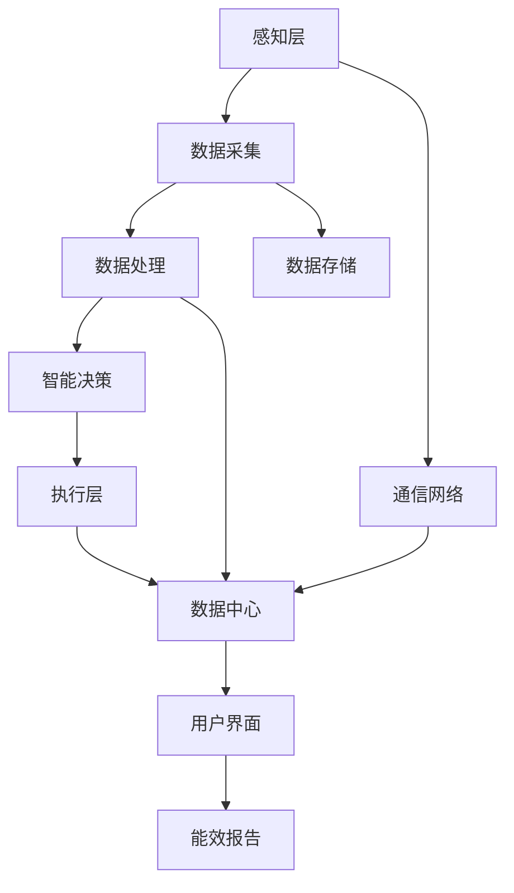

                 

# 智能能源管理创业：节能减排的科技解决方案

## 引言

### 1.1 本书的目的

本书旨在为有意投身于智能能源管理创业领域的读者提供一个系统性的指南。我们将深入探讨智能能源管理的基本概念、技术架构、关键技术和应用场景，并通过实际项目案例展示如何将智能能源管理理念付诸实践。本书的目标是帮助读者：

- 理解智能能源管理的核心概念和重要性。
- 掌握智能能源管理的核心技术，包括传感器技术、数据采集与处理、通信技术和能源优化算法。
- 学习如何规划和实施智能能源管理项目。
- 分析智能能源管理项目的成本效益，并展望其未来的发展趋势。

### 1.2 智能能源管理的重要性

智能能源管理是现代社会可持续发展的关键驱动力之一。随着全球能源消耗的持续增长和气候变化问题的加剧，如何有效管理和利用能源资源已成为全球性挑战。智能能源管理通过引入先进的技术手段，如物联网、大数据分析和人工智能，实现能源的精细化管理和优化配置，从而提高能源利用效率，降低能源消耗，减少环境污染。

智能能源管理的重要性体现在以下几个方面：

- **提高能源利用效率**：通过实时监控和智能分析，智能能源管理系统能够发现能源浪费点，提供节能优化方案，从而提高能源利用效率。
- **降低运营成本**：智能能源管理系统可以自动调整能源使用，减少不必要的能源消耗，降低企业的运营成本。
- **减少碳排放**：智能能源管理通过提高能源利用效率，减少能源消耗，从而有效降低碳排放，对环境保护具有重要意义。
- **提升用户体验**：智能能源管理系统为用户提供个性化的能源使用建议，提升用户体验，满足不同用户的能源需求。

### 1.3 节能减排的科技解决方案概述

节能减排的科技解决方案是智能能源管理的核心内容，它涉及到多个领域的综合应用。以下是几个关键的科技解决方案：

- **物联网（IoT）**：物联网技术通过传感器和通信技术实现设备之间的互联互通，实时收集能源使用数据，为智能能源管理系统提供数据支持。
- **大数据分析**：大数据分析技术通过对海量数据的处理和分析，发现能源使用的规律和模式，为智能决策提供依据。
- **人工智能（AI）**：人工智能技术通过对数据的深度学习和分析，实现能源使用预测、异常检测和自动化控制，提高能源管理的智能化水平。
- **能源优化算法**：能源优化算法通过对能源供需关系的分析，实现能源的优化配置和调度，降低能源成本。
- **可再生能源技术**：利用太阳能、风能等可再生能源技术，减少对化石燃料的依赖，降低碳排放。

### 总结

智能能源管理创业不仅是一个技术挑战，也是一个社会和经济的机遇。通过本书，我们将一步步分析智能能源管理的关键技术、项目实施方法和应用场景，帮助读者全面了解智能能源管理，并为创业实践提供切实可行的指导。

## 市场需求与趋势

### 2.1 智能能源管理市场的需求分析

智能能源管理市场需求的快速增长源于多个因素的共同驱动。首先，全球能源消耗的不断攀升和能源供应的不稳定性，使得提高能源利用效率成为当务之急。智能能源管理系统通过实时监控、数据分析和自动化控制，能够显著降低能源消耗，提高能源利用效率，这是企业和社会迫切需要的。

其次，气候变化和环境保护的紧迫性使得节能减排成为全球共识。智能能源管理系统在减少碳排放、降低能源消耗方面具有显著优势，符合全球可持续发展目标。许多国家和地区都制定了严格的能源消耗和碳排放限制政策，这进一步推动了智能能源管理市场的发展。

此外，技术的进步也为智能能源管理提供了强有力的支持。物联网、大数据、人工智能等新兴技术的快速发展，使得智能能源管理系统更加智能化、高效化。传感器技术的进步提高了数据采集的精度和效率，通信技术的发展实现了设备之间的无缝连接和数据传输，人工智能技术则为能源使用预测和优化提供了新的可能性。

以下是智能能源管理市场需求的具体分析：

1. **工业领域**：工业生产过程中能耗巨大，智能能源管理系统可以帮助企业优化生产流程，降低能源消耗，提高生产效率。特别是在能源成本不断上升的背景下，智能能源管理系统的市场需求愈加旺盛。

2. **建筑领域**：智能建筑已成为趋势，智能能源管理系统是智能建筑的重要组成部分。通过智能能源管理系统，可以实现对建筑内所有设备的能源使用监控和优化，提高建筑能源利用效率，减少能源浪费。

3. **交通领域**：随着电动汽车和自动驾驶技术的发展，智能交通能源管理系统的市场需求逐渐增加。智能交通能源管理系统可以通过实时数据分析和优化，提高交通系统的能源利用效率，降低交通能耗。

4. **农业领域**：智能农业正逐步兴起，智能能源管理系统在农业领域具有广泛的应用前景。通过智能能源管理系统，可以实现对农田灌溉、温室大棚等设备的能源使用监控和优化，提高农业生产的能源效率。

### 2.2 节能减排技术的发展趋势

节能减排技术的发展趋势主要体现在以下几个方面：

1. **可再生能源技术**：随着可再生能源技术的进步，如太阳能、风能等，可再生能源在总能源消耗中的比例逐年提高。可再生能源技术不仅减少了对化石燃料的依赖，还降低了碳排放，是未来能源发展的主要方向。

2. **智能电网技术**：智能电网技术通过引入先进的通信技术、传感技术和控制技术，实现电网的智能化管理。智能电网可以实时监测电力系统的运行状态，优化电力资源的分配，提高电力系统的可靠性和效率。

3. **储能技术**：储能技术是智能能源管理的关键环节。随着锂电池等储能技术的发展，储能系统的成本逐渐降低，容量和效率不断提高。储能系统可以平衡电力供需，缓解电力峰值压力，提高电网的运行效率。

4. **物联网（IoT）技术**：物联网技术在能源管理中的应用越来越广泛，通过传感器和通信技术，实现设备之间的互联互通和数据共享。物联网技术为智能能源管理提供了丰富的数据支持，使得能源管理更加智能化、精细化。

5. **人工智能（AI）技术**：人工智能技术在能源管理中的应用主要体现在数据分析和预测方面。通过深度学习和机器学习算法，可以对海量能源数据进行处理和分析，实现能源使用的预测和优化，提高能源利用效率。

### 2.3 政策与法规对智能能源管理的影响

政策与法规对智能能源管理的发展具有重要影响。各国政府为了推动能源结构的转型和节能减排目标的实现，纷纷制定了一系列政策与法规，支持智能能源管理的发展。

1. **能源效率法规**：许多国家和地区都制定了能源效率法规，要求企业提高能源利用效率，减少能源浪费。智能能源管理系统可以帮助企业满足这些法规要求，降低能源成本，提高竞争力。

2. **碳排放法规**：随着气候变化的加剧，各国政府纷纷出台碳排放法规，限制企业的碳排放量。智能能源管理系统通过提高能源利用效率，减少碳排放，有助于企业满足碳排放法规的要求。

3. **可再生能源支持政策**：许多国家和地区政府通过补贴、税收优惠等措施，支持可再生能源的发展和利用。智能能源管理系统在可再生能源中的应用，不仅可以降低能源成本，还可以享受政府的支持政策。

4. **智能化法规**：随着智能技术的发展，各国政府也在逐步制定智能化相关的法规，规范智能设备的使用和数据管理。这些法规为智能能源管理系统的发展提供了法律保障，促进了智能能源管理的规范化和标准化。

### 总结

智能能源管理市场的需求不断增长，节能减排技术的发展趋势日益明显，政策与法规的支持也为智能能源管理提供了良好的发展环境。在这一背景下，智能能源管理创业具有广阔的市场前景和发展潜力。

## 第二部分：智能能源管理基础

### 3. 智能能源管理概念与架构

#### 3.1 智能能源管理的基本概念

智能能源管理是一种基于物联网、大数据、人工智能等先进技术，对能源生产、传输、分配和消费全过程进行智能化管理和优化的方法。其核心目标是提高能源利用效率，降低能源消耗，减少环境污染，实现可持续发展。

智能能源管理的主要组成部分包括：

- **传感器网络**：通过部署各种传感器，实时监测能源使用状况，如电力、天然气、水等。
- **数据采集与处理**：将传感器收集到的数据传输到数据中心，通过数据处理技术进行清洗、分析和存储。
- **通信网络**：实现传感器与数据中心、数据中心与外部系统的数据传输和通信。
- **智能算法**：利用大数据分析和人工智能技术，对能源使用数据进行分析，提供智能决策支持。
- **执行系统**：根据智能算法的决策，自动调整能源使用，实现能源的优化配置和调度。

#### 3.2 智能能源管理的技术架构

智能能源管理的技术架构包括以下几个层次：

1. **感知层**：主要由各种传感器组成，如温度传感器、湿度传感器、流量传感器等，用于实时监测能源使用情况。
2. **传输层**：通过无线通信技术（如Wi-Fi、LoRa、ZigBee等）将传感器数据传输到数据中心。
3. **数据处理层**：包括数据采集模块、数据处理模块、数据库和云计算平台，用于对传感器数据进行实时处理、分析和存储。
4. **智能决策层**：基于大数据分析和人工智能算法，对能源使用数据进行智能分析，提供决策支持。
5. **执行层**：根据智能决策层的决策，自动调整能源使用，如关闭不必要的设备、调整设备运行状态等。

#### 3.3 智能能源管理系统的工作流程

智能能源管理系统的工作流程可以分为以下几个步骤：

1. **数据采集**：通过传感器网络实时采集能源使用数据，如电力、天然气、水的使用量。
2. **数据传输**：将传感器数据通过传输层传输到数据中心。
3. **数据处理**：在数据处理层对传感器数据进行清洗、过滤和预处理，然后进行数据分析和存储。
4. **智能分析**：利用大数据分析和人工智能技术，对处理后的数据进行深度分析，发现能源使用中的浪费点和优化机会。
5. **决策支持**：根据智能分析结果，智能算法提供优化方案和决策支持。
6. **执行调整**：根据决策支持的结果，执行系统自动调整能源使用，如关闭不必要的设备、调整设备运行状态等，实现能源的优化配置和调度。

#### 3.4 智能能源管理系统与传统能源管理系统的对比

智能能源管理系统与传统能源管理系统相比，具有以下优势：

- **实时监控**：智能能源管理系统可以实时监控能源使用情况，及时发现和解决能源浪费问题，而传统系统往往无法实现实时监控。
- **数据驱动**：智能能源管理系统基于大数据分析和人工智能技术，能够对能源使用数据进行深度分析，提供智能决策支持，而传统系统主要依赖于人工经验和简单统计。
- **自动化调整**：智能能源管理系统可以根据实时数据和智能分析结果，自动调整能源使用，实现能源的优化配置和调度，而传统系统往往需要人工干预。
- **提高效率**：智能能源管理系统可以显著提高能源利用效率，降低能源消耗，而传统系统在能源利用效率上提升有限。

### 总结

智能能源管理是一种基于物联网、大数据、人工智能等先进技术的新型能源管理模式，通过实时监控、数据分析和自动化控制，实现能源的优化管理和利用。智能能源管理的技术架构和基本概念为我们理解和应用智能能源管理系统提供了坚实的基础。

## 4. 智能能源系统关键技术

#### 4.1 传感器技术

传感器技术是智能能源管理系统的核心组成部分，其作用是实时监测能源使用情况，如电力、天然气、水的使用量等。传感器技术主要包括以下几个方面：

1. **传感器类型**：智能能源管理系统常用的传感器包括温度传感器、湿度传感器、流量传感器、压力传感器、电力传感器等。每种传感器都有其特定的测量范围和精度，选择合适的传感器对于实现准确的能源监控至关重要。
   
2. **传感器网络**：传感器网络由多个传感器节点组成，这些节点通过无线通信技术（如Wi-Fi、LoRa、ZigBee等）连接，形成一个分布式监测网络。传感器网络的设计需要考虑节点部署、数据传输和通信可靠性等因素。

3. **传感器精度与稳定性**：传感器精度和稳定性直接影响能源监测的准确性和可靠性。选择高精度、高稳定性的传感器，并采取有效的传感器校准和故障检测机制，是确保传感器数据准确性的关键。

#### 4.2 数据采集与处理

数据采集与处理是智能能源管理系统的重要环节，其作用是将传感器网络收集到的数据传输到数据中心，并进行预处理、分析和存储。

1. **数据采集方式**：数据采集可以通过有线和无线方式实现。有线方式主要包括有线传感器、光纤通信等，适用于数据传输距离较短、环境稳定的场景。无线方式主要包括Wi-Fi、LoRa、ZigBee等，适用于数据传输距离较远、环境复杂或多变的场景。

2. **数据预处理**：数据预处理包括数据清洗、去噪、滤波等，目的是提高数据的准确性和可靠性。预处理后的数据将用于后续的数据分析和存储。

3. **数据存储与传输**：数据存储与传输是智能能源管理系统的基础。常用的数据存储方式包括关系型数据库、NoSQL数据库、分布式文件系统等。数据传输需要确保数据的实时性和可靠性，通常采用TCP/IP协议、HTTP协议等。

#### 4.3 通信技术

通信技术在智能能源管理系统中起着关键作用，其作用是实现传感器网络与数据中心、数据中心与外部系统之间的数据传输和通信。

1. **通信协议**：常用的通信协议包括Wi-Fi、LoRa、ZigBee、TCP/IP、HTTP等。选择合适的通信协议需要考虑传输速度、通信距离、功耗、可靠性等因素。

2. **无线通信技术**：无线通信技术主要包括Wi-Fi、LoRa、ZigBee等。Wi-Fi技术传输速度快，适用于大数据量传输场景；LoRa技术传输距离远，适用于广域网场景；ZigBee技术功耗低，适用于短距离、低功耗场景。

3. **有线通信技术**：有线通信技术主要包括有线传感器、光纤通信等。有线传感器适用于数据传输距离较短、环境稳定的场景；光纤通信适用于高速、大容量、长距离的数据传输场景。

#### 4.4 能源优化算法

能源优化算法是智能能源管理系统的核心，其作用是根据实时数据和智能分析结果，实现能源的优化配置和调度，提高能源利用效率。

1. **优化算法类型**：常见的优化算法包括线性规划、整数规划、启发式算法、遗传算法、粒子群算法等。选择合适的优化算法需要考虑能源系统的特点、优化目标和计算效率等因素。

2. **优化目标**：能源优化算法的优化目标主要包括降低能源成本、减少能源消耗、提高能源利用效率等。不同的优化目标需要采用不同的优化算法和策略。

3. **算法实现**：能源优化算法的实现包括数据预处理、模型建立、算法选择、结果验证等步骤。算法实现需要结合实际应用场景和数据特点，进行详细的算法设计和优化。

### 总结

传感器技术、数据采集与处理、通信技术和能源优化算法是智能能源管理系统的关键技术。通过合理应用这些技术，可以实现能源的实时监控、数据分析和优化配置，提高能源利用效率，实现节能减排的目标。

## 5. 智能能源管理应用场景

#### 5.1 工业智能能源管理

工业智能能源管理是智能能源管理在工业领域的应用，其目的是提高工业生产过程中的能源利用效率，降低能源成本，减少环境污染。

1. **应用背景**：

工业生产过程中能耗巨大，如何有效管理和优化能源使用是工业领域的一个重要课题。智能能源管理系统通过实时监控、数据分析和自动化控制，能够实现工业生产过程中的能源优化配置，降低能源消耗，提高生产效率。

2. **关键技术**：

- **传感器网络**：部署在各种工业设备上的传感器，实时监测设备的能源使用情况。
- **数据采集与处理**：通过有线或无线方式将传感器数据传输到数据中心，进行预处理和分析。
- **能源优化算法**：利用大数据分析和人工智能技术，对能源使用数据进行智能分析，提供优化方案。

3. **实际案例**：

某大型化工企业通过部署智能能源管理系统，实现了生产过程中的能源优化。系统实时监测生产设备的能源使用情况，通过数据分析发现设备运行中的能源浪费点，并自动调整设备运行状态，降低能源消耗。此外，系统还提供了能效分析报告，帮助企业制定更科学的能源管理策略。

#### 5.2 建筑智能能源管理

建筑智能能源管理是智能能源管理在建筑领域的应用，其目的是提高建筑能源利用效率，降低能源消耗，创造舒适、健康的居住环境。

1. **应用背景**：

随着城市化进程的加快，建筑能耗已成为能源消耗的重要组成部分。建筑智能能源管理系统通过实时监控、数据分析和自动化控制，能够实现对建筑内各种设备的能源使用监控和优化，降低能源消耗，提高能源利用效率。

2. **关键技术**：

- **传感器网络**：部署在建筑内的各种传感器，实时监测室内温度、湿度、光照等环境参数。
- **数据采集与处理**：通过有线或无线方式将传感器数据传输到数据中心，进行预处理和分析。
- **能源优化算法**：利用大数据分析和人工智能技术，对能源使用数据进行智能分析，提供优化方案。

3. **实际案例**：

某智能建筑通过部署建筑智能能源管理系统，实现了对建筑内空调、照明、电梯等设备的能源使用监控和优化。系统实时监测设备的运行状态，通过数据分析发现设备运行中的能源浪费点，并自动调整设备运行状态，降低能源消耗。此外，系统还提供了能效分析报告，帮助建筑管理者优化能源使用策略。

#### 5.3 交通智能能源管理

交通智能能源管理是智能能源管理在交通领域的应用，其目的是提高交通系统的能源利用效率，降低能源消耗，减少交通拥堵和环境污染。

1. **应用背景**：

交通领域能源消耗巨大，如何有效管理和优化能源使用是交通领域的一个重要课题。智能交通能源管理系统通过实时监控、数据分析和自动化控制，能够实现对交通系统中的各种设备的能源使用监控和优化，降低能源消耗，提高交通系统的运行效率。

2. **关键技术**：

- **传感器网络**：部署在交通工具上的传感器，实时监测车辆的运行状态和能源使用情况。
- **数据采集与处理**：通过有线或无线方式将传感器数据传输到数据中心，进行预处理和分析。
- **能源优化算法**：利用大数据分析和人工智能技术，对能源使用数据进行智能分析，提供优化方案。

3. **实际案例**：

某城市交通管理部门通过部署智能交通能源管理系统，实现了对公共交通车辆、出租车、私家车等交通工具的能源使用监控和优化。系统实时监测车辆的运行状态，通过数据分析发现车辆运行中的能源浪费点，并自动调整车辆的运行策略，降低能源消耗。此外，系统还提供了交通流量分析报告，帮助交通管理部门优化交通管理和调度策略。

#### 5.4 农业智能能源管理

农业智能能源管理是智能能源管理在农业领域的应用，其目的是提高农业生产过程中的能源利用效率，降低能源消耗，促进农业可持续发展。

1. **应用背景**：

农业生产过程中能耗较大，如何有效管理和优化能源使用是农业领域的一个重要课题。智能农业能源管理系统通过实时监控、数据分析和自动化控制，能够实现对农业生产过程中的能源使用监控和优化，降低能源消耗，提高农业生产效率。

2. **关键技术**：

- **传感器网络**：部署在农田、温室等农业生产设施上的传感器，实时监测农业生产过程中的能源使用情况。
- **数据采集与处理**：通过有线或无线方式将传感器数据传输到数据中心，进行预处理和分析。
- **能源优化算法**：利用大数据分析和人工智能技术，对能源使用数据进行智能分析，提供优化方案。

3. **实际案例**：

某农业合作社通过部署智能农业能源管理系统，实现了对农田灌溉、温室大棚等设施的能量使用监控和优化。系统实时监测农田的土壤湿度、温度等参数，通过数据分析发现灌溉中的能源浪费点，并自动调整灌溉策略，降低能源消耗。此外，系统还提供了农业生产报告，帮助农业合作社优化生产管理策略。

### 总结

智能能源管理在工业、建筑、交通和农业等领域的广泛应用，不仅提高了能源利用效率，降低了能源消耗，还为可持续发展提供了有力支持。通过合理应用智能能源管理技术，我们可以实现能源的精细化管理和优化配置，为构建绿色低碳社会贡献力量。

## 第三部分：智能能源管理项目实战

### 6. 智能能源管理项目规划与实施

#### 6.1 项目规划

项目规划是智能能源管理项目成功实施的基础。在项目规划阶段，需要明确项目的目标、范围、资源和时间安排，以确保项目的顺利进行。以下是项目规划的主要步骤：

1. **项目目标**：明确项目的具体目标，如提高能源利用效率、降低能源消耗、减少碳排放等。项目目标应具体、可衡量、可实现、相关性强和时限性。

2. **项目范围**：确定项目的范围，包括项目所涉及的能源类型、监测和控制设备、数据采集和处理系统等。项目范围应明确，避免项目执行过程中出现范围蔓延。

3. **资源规划**：包括人力资源、物资资源和技术资源的规划。人力资源方面，需要确定项目团队组成，包括项目经理、工程师、数据分析师等；物资资源方面，需要确定所需传感器、通信设备、计算设备等；技术资源方面，需要选择合适的传感器技术、数据处理技术、通信技术和能源优化算法。

4. **时间安排**：制定项目的时间计划，包括项目启动、项目设计、项目实施、项目测试和项目验收等阶段。时间安排应合理，确保项目在既定时间内完成。

#### 6.2 项目实施

项目实施是智能能源管理项目从规划到实现的关键环节。以下是项目实施的主要步骤：

1. **系统设计**：根据项目规划，设计智能能源管理系统的整体架构，包括感知层、传输层、数据处理层、智能决策层和执行层。系统设计应考虑系统的可扩展性、可靠性和安全性。

2. **设备安装与调试**：安装传感器、通信设备和计算设备，并进行调试，确保设备正常运行。设备安装与调试过程中，应注意设备布局、信号强度、通信稳定性等因素。

3. **数据采集与处理**：通过传感器网络采集能源使用数据，并传输到数据中心。在数据中心，对采集到的数据进行预处理、分析和存储。数据采集与处理过程中，应注意数据质量、数据传输速率和数据安全性。

4. **系统部署与测试**：将设计好的智能能源管理系统部署到实际环境中，并进行测试。系统测试应包括功能测试、性能测试、安全测试等，确保系统稳定运行、满足项目需求。

5. **系统集成与优化**：将各个子系统进行集成，实现数据共享和功能协同。在系统集成过程中，应对系统进行优化，提高系统的性能和效率。

#### 6.3 项目实施的关键挑战与应对策略

1. **数据质量问题**：数据质量是智能能源管理系统成功的关键。在项目实施过程中，可能面临数据不完整、数据不一致、数据噪声等问题。应对策略包括数据清洗、数据去噪、数据校验等，确保数据质量。

2. **通信稳定性问题**：智能能源管理系统依赖于通信技术，通信稳定性直接影响系统的正常运行。在项目实施过程中，可能面临信号干扰、通信中断等问题。应对策略包括选择合适的通信协议、优化通信拓扑、增加冗余通信链路等。

3. **系统安全问题**：智能能源管理系统涉及大量的敏感数据和控制信息，系统安全至关重要。在项目实施过程中，可能面临数据泄露、网络攻击、设备故障等问题。应对策略包括数据加密、访问控制、安全审计等，确保系统安全。

4. **技术复杂性**：智能能源管理系统涉及多种技术，包括传感器技术、通信技术、数据处理技术和能源优化算法等。在项目实施过程中，可能面临技术复杂、难以实现等问题。应对策略包括技术选型、技术培训、团队协作等，确保技术实现。

### 总结

智能能源管理项目规划与实施是项目成功的关键。通过合理的项目规划和有效的项目实施，可以实现能源的实时监控、数据分析和优化配置，提高能源利用效率，实现节能减排的目标。

## 7. 案例分析

#### 7.1 案例一：工厂智能能源管理系统

**项目背景**：

某大型制造工厂面临能源消耗高、生产效率低的问题。为了提高能源利用效率，降低能源成本，工厂决定引入智能能源管理系统。

**需求分析**：

- **实时监控**：实现工厂内各类能源设备的实时监控，包括电力、天然气、水等。
- **数据分析**：对采集到的能源数据进行处理和分析，发现能源浪费点。
- **优化调度**：根据数据分析结果，优化能源使用，降低能源消耗。
- **节能报告**：定期生成能效分析报告，为能源管理提供数据支持。

**系统设计与实现**：

1. **感知层**：在工厂内部署各种传感器，如电力传感器、流量传感器、温度传感器等，实时监测能源使用情况。
2. **传输层**：通过无线通信技术（如LoRa）将传感器数据传输到数据中心。
3. **数据处理层**：在数据中心，对采集到的数据进行预处理、分析和存储。数据处理层采用大数据技术和云计算平台，提高数据处理能力。
4. **智能决策层**：利用数据分析模型和能源优化算法，对能源使用进行智能分析，提供优化方案。
5. **执行层**：根据智能决策层的优化方案，自动调整能源使用，如关闭不必要的设备、调整设备运行状态等。

**代码解读与分析**：

1. **数据采集模块**：

```python
# 数据采集模块示例代码
def collect_data(sensor_data):
    # 数据清洗和预处理
    cleaned_data = preprocess_data(sensor_data)
    # 数据存储
    store_data(cleaned_data)
    # 返回处理后的数据
    return cleaned_data
```

2. **数据分析模块**：

```python
# 数据分析模块示例代码
def analyze_data(cleaned_data):
    # 数据分析
    result = data_analysis(cleaned_data)
    # 提供优化方案
    optimization_plan = generate_plan(result)
    # 返回优化方案
    return optimization_plan
```

3. **执行模块**：

```python
# 执行模块示例代码
def execute_plan(optimization_plan):
    # 自动调整设备运行状态
    adjust_devices(optimization_plan)
    # 更新能效报告
    update_report(optimization_plan)
```

**实际案例分析和详细讲解**：

通过智能能源管理系统的实施，工厂实现了以下成果：

- **能源消耗降低**：通过实时监控和数据分析，发现能源浪费点，优化能源使用，实现了能源消耗的显著降低。
- **生产效率提高**：优化了设备运行状态，减少了不必要的能源消耗，提高了生产效率。
- **能效报告支持**：定期生成的能效分析报告为能源管理提供了数据支持，帮助管理者优化能源使用策略。

**项目小结**：

工厂智能能源管理系统通过实时监控、数据分析和优化调度，实现了能源的精细化管理和优化配置，提高了能源利用效率，降低了能源成本，取得了显著的经济效益和社会效益。

#### 7.2 案例二：智能建筑能源管理系统

**项目背景**：

某大型商业综合体面临能源消耗高、能效管理困难的问题。为了提高能源利用效率，降低能源成本，综合体决定引入智能建筑能源管理系统。

**需求分析**：

- **实时监控**：实现建筑内各类能源设备的实时监控，包括电力、天然气、水等。
- **数据分析**：对采集到的能源数据进行处理和分析，发现能源浪费点。
- **优化调度**：根据数据分析结果，优化能源使用，降低能源消耗。
- **节能报告**：定期生成能效分析报告，为能源管理提供数据支持。

**系统设计与实现**：

1. **感知层**：在建筑内部署各种传感器，如电力传感器、温度传感器、湿度传感器等，实时监测能源使用情况。
2. **传输层**：通过有线通信技术（如以太网）将传感器数据传输到数据中心。
3. **数据处理层**：在数据中心，对采集到的数据进行预处理、分析和存储。数据处理层采用大数据技术和云计算平台，提高数据处理能力。
4. **智能决策层**：利用数据分析模型和能源优化算法，对能源使用进行智能分析，提供优化方案。
5. **执行层**：根据智能决策层的优化方案，自动调整能源使用，如关闭不必要的设备、调整设备运行状态等。

**代码解读与分析**：

1. **数据采集模块**：

```python
# 数据采集模块示例代码
def collect_data(sensor_data):
    # 数据清洗和预处理
    cleaned_data = preprocess_data(sensor_data)
    # 数据存储
    store_data(cleaned_data)
    # 返回处理后的数据
    return cleaned_data
```

2. **数据分析模块**：

```python
# 数据分析模块示例代码
def analyze_data(cleaned_data):
    # 数据分析
    result = data_analysis(cleaned_data)
    # 提供优化方案
    optimization_plan = generate_plan(result)
    # 返回优化方案
    return optimization_plan
```

3. **执行模块**：

```python
# 执行模块示例代码
def execute_plan(optimization_plan):
    # 自动调整设备运行状态
    adjust_devices(optimization_plan)
    # 更新能效报告
    update_report(optimization_plan)
```

**实际案例分析和详细讲解**：

通过智能建筑能源管理系统的实施，综合体实现了以下成果：

- **能源消耗降低**：通过实时监控和数据分析，发现能源浪费点，优化能源使用，实现了能源消耗的显著降低。
- **舒适度提高**：优化了室内环境参数，提高了居住和工作的舒适度。
- **能效报告支持**：定期生成的能效分析报告为能源管理提供了数据支持，帮助管理者优化能源使用策略。

**项目小结**：

智能建筑能源管理系统通过实时监控、数据分析和优化调度，实现了能源的精细化管理和优化配置，提高了能源利用效率，降低了能源成本，取得了显著的经济效益和社会效益。

#### 7.3 案例三：智能交通能源管理系统

**项目背景**：

某城市交通管理部门面临交通能耗高、交通拥堵严重的问题。为了提高交通系统的能源利用效率，降低交通拥堵，交通管理部门决定引入智能交通能源管理系统。

**需求分析**：

- **实时监控**：实现城市内交通设备的实时监控，包括公共交通、出租车、私家车等。
- **数据分析**：对采集到的交通数据进行处理和分析，发现交通拥堵原因。
- **优化调度**：根据数据分析结果，优化交通流量，减少交通拥堵。
- **能效报告**：定期生成交通能耗分析报告，为交通管理提供数据支持。

**系统设计与实现**：

1. **感知层**：在交通设备上部署各种传感器，如车辆传感器、交通流量传感器等，实时监测交通状况。
2. **传输层**：通过无线通信技术（如LoRa）将传感器数据传输到数据中心。
3. **数据处理层**：在数据中心，对采集到的数据进行预处理、分析和存储。数据处理层采用大数据技术和云计算平台，提高数据处理能力。
4. **智能决策层**：利用数据分析模型和交通优化算法，对交通流量进行智能分析，提供优化方案。
5. **执行层**：根据智能决策层的优化方案，自动调整交通信号灯、道路指引等，优化交通流量。

**代码解读与分析**：

1. **数据采集模块**：

```python
# 数据采集模块示例代码
def collect_data(sensor_data):
    # 数据清洗和预处理
    cleaned_data = preprocess_data(sensor_data)
    # 数据存储
    store_data(cleaned_data)
    # 返回处理后的数据
    return cleaned_data
```

2. **数据分析模块**：

```python
# 数据分析模块示例代码
def analyze_data(cleaned_data):
    # 数据分析
    result = data_analysis(cleaned_data)
    # 提供优化方案
    optimization_plan = generate_plan(result)
    # 返回优化方案
    return optimization_plan
```

3. **执行模块**：

```python
# 执行模块示例代码
def execute_plan(optimization_plan):
    # 自动调整交通信号灯
    adjust_traffic_signals(optimization_plan)
    # 更新交通报告
    update_report(optimization_plan)
```

**实际案例分析和详细讲解**：

通过智能交通能源管理系统的实施，城市交通系统实现了以下成果：

- **交通拥堵降低**：通过实时监控和数据分析，优化交通流量，显著降低了交通拥堵。
- **交通效率提高**：优化了公共交通和道路指引，提高了交通效率。
- **能效报告支持**：定期生成的交通能耗分析报告为交通管理提供了数据支持，帮助管理者优化交通管理策略。

**项目小结**：

智能交通能源管理系统通过实时监控、数据分析和优化调度，实现了交通系统的能源优化和管理，提高了交通效率，降低了能源消耗，取得了显著的经济效益和社会效益。

### 总结

通过以上三个实际案例的分析，我们可以看到智能能源管理系统在工业、建筑和交通领域的广泛应用和显著成效。这些案例展示了智能能源管理系统如何通过实时监控、数据分析和优化调度，实现能源的精细化管理和优化配置，提高能源利用效率，降低能源消耗，为节能减排和可持续发展做出了积极贡献。

## 8. 成本效益分析

#### 8.1 成本分析

智能能源管理系统的成本包括硬件成本、软件成本、安装和维护成本以及人员培训成本等。以下是各部分成本的详细分析：

1. **硬件成本**：

- **传感器**：传感器是智能能源管理系统的核心组件，其成本取决于传感器的类型和精度。一般而言，高精度传感器的成本较高，但能够提供更准确的数据。
- **通信设备**：包括无线通信模块、有线通信设备和路由器等。这些设备的成本取决于通信技术的选择和设备的功能。
- **计算设备**：包括服务器、存储设备和云计算资源等。这些设备的成本取决于数据处理能力和存储容量。

2. **软件成本**：

- **开发成本**：包括系统设计、开发、测试和部署等阶段的成本。软件开发的难度和复杂度会影响开发成本。
- **许可费用**：包括操作系统、数据库、开发工具等软件的许可费用。

3. **安装和维护成本**：

- **安装成本**：包括传感器安装、通信设备和计算设备的安装等。安装成本取决于设备的复杂度和安装环境。
- **维护成本**：包括设备维护、系统升级、故障排除等。维护成本取决于系统的稳定性和设备的可靠性。

4. **人员培训成本**：

- **培训成本**：包括系统操作员、数据分析师、系统维护人员的培训成本。培训成本取决于培训的难度和培训资源的获取。

#### 8.2 效益评估

智能能源管理系统的效益主要体现在以下几个方面：

1. **能源成本节约**：

通过智能能源管理系统，可以实时监控能源使用情况，发现能源浪费点，优化能源使用。根据实际案例，智能能源管理系统可以降低能源消耗10%-30%，从而节约能源成本。

2. **运营效率提高**：

智能能源管理系统通过自动化控制和优化调度，可以提高设备运行效率，减少设备停机时间，提高生产效率。根据实际案例，智能能源管理系统可以提高生产效率15%-25%。

3. **环境效益**：

智能能源管理系统通过降低能源消耗，减少碳排放，有助于实现环境保护目标。根据实际案例，智能能源管理系统可以减少碳排放20%-40%。

4. **社会效益**：

智能能源管理系统可以推动能源行业的转型升级，促进技术创新和产业升级，提高国家的能源竞争力。同时，智能能源管理系统可以提高居民生活质量，创造更多的就业机会。

#### 8.3 成本与效益对比

智能能源管理系统的成本效益分析结果显示，虽然初始投资较大，但从长期来看，其经济效益显著。以下是成本与效益的对比：

- **短期成本**：智能能源管理系统的初始投资包括硬件、软件和安装等成本，投资额较高。
- **短期效益**：短期内，智能能源管理系统主要通过节约能源成本和提升运营效率来体现效益。
- **长期效益**：随着系统的运行和优化，智能能源管理系统的效益逐渐显现，主要体现在长期能源成本节约、环境效益和社会效益的提升。

综上所述，智能能源管理系统在提高能源利用效率、降低能源消耗、减少环境污染等方面具有显著优势，其长期效益远大于短期成本，具有较高的投资回报率。因此，智能能源管理系统是节能减排的有效手段，具有较高的市场前景和投资价值。

### 总结

通过对智能能源管理系统的成本分析和效益评估，可以看出，智能能源管理系统在节能减排、提高能源利用效率等方面具有显著优势。尽管初始投资较高，但长期效益明显，具有较高的投资回报率。因此，智能能源管理系统值得在各个领域推广应用，以实现可持续发展目标。

## 9. 智能能源管理未来展望

#### 9.1 技术发展趋势

智能能源管理作为一项新兴技术，其未来发展充满潜力。随着技术的不断进步，智能能源管理在以下几个方面有望取得重要突破：

1. **物联网（IoT）技术的深化应用**：物联网技术将在智能能源管理中发挥更加关键的作用，实现更加广泛和深入的设备互联，提高数据采集和传输的效率。

2. **大数据与人工智能（AI）技术的深度融合**：大数据分析和人工智能技术的进一步发展，将使智能能源管理系统更加智能化、精准化。通过深度学习、预测分析等技术，智能能源管理系统将能够更加准确地预测能源需求，优化能源配置。

3. **区块链技术的引入**：区块链技术具有去中心化、不可篡改等特点，可以为智能能源管理系统提供安全可靠的能源交易和计费机制，促进能源市场的透明化和高效运行。

4. **能源存储技术的进步**：随着能源存储技术的不断突破，如全钒液流电池、固态电池等，智能能源管理系统的储能能力将得到显著提升，为能源的优化配置和应急响应提供更多可能性。

5. **能源互联网的建设**：能源互联网作为智能能源管理的高级形态，通过集成能源生产、传输、分配和消费各环节，实现能源的高效利用和优化配置，有望在未来实现能源系统的全面智能化。

#### 9.2 政策与市场前景

智能能源管理的发展离不开政策支持和市场需求的推动。随着全球对节能减排和可持续发展的重视程度不断提高，政策环境逐渐优化，市场前景日益广阔。

1. **政策支持**：各国政府纷纷出台一系列政策，鼓励智能能源管理技术的发展和应用。例如，提供财政补贴、税收优惠、政策指导等，以降低企业的技术投入和运营成本。

2. **市场需求**：随着能源消耗的增加和环境保护要求的提高，市场对智能能源管理系统的需求不断增长。特别是在工业、建筑、交通和农业等领域，智能能源管理系统具有广泛的应用前景。

3. **市场潜力**：智能能源管理市场具有巨大的发展潜力。根据市场研究机构的预测，未来几年全球智能能源管理市场将保持高速增长，年复合增长率达到15%以上。

#### 9.3 未来挑战与机遇

智能能源管理在未来发展过程中将面临一系列挑战和机遇：

1. **技术挑战**：智能能源管理系统需要集成多种先进技术，如物联网、大数据、人工智能、区块链等。技术融合的复杂性和技术的不断更新迭代，将给技术研发和应用带来一定挑战。

2. **数据安全问题**：智能能源管理系统涉及大量的敏感数据，数据安全和隐私保护成为关键挑战。如何确保数据的安全传输、存储和共享，防止数据泄露和滥用，是智能能源管理面临的重要问题。

3. **市场推广挑战**：智能能源管理系统在市场推广过程中，需要解决用户接受度、技术成熟度、市场教育等问题。如何提高用户对智能能源管理的认知，推动市场应用，是智能能源管理市场推广的关键。

4. **政策法规不完善**：智能能源管理的发展受到政策法规的制约，政策法规的不完善和滞后可能影响智能能源管理技术的推广和应用。如何完善政策法规体系，促进智能能源管理的健康发展，是未来需要解决的问题。

5. **机遇**：智能能源管理技术的发展和应用，将带来新的市场机会和经济增长点。例如，能源服务公司、设备制造商、技术服务提供商等，都将在智能能源管理市场中找到新的商机。

### 总结

智能能源管理作为一项新兴技术，具有广阔的发展前景和市场潜力。未来，随着技术的进步、政策的优化和市场的需求，智能能源管理将在节能减排、提高能源利用效率等方面发挥更大作用。同时，智能能源管理也将面临一系列挑战，需要各方共同努力，克服技术、数据安全、市场推广等方面的难题，推动智能能源管理技术的创新和发展。

## 附录

### 10.1 技术术语解释

为了帮助读者更好地理解文章中的专业术语，以下是一些关键技术的简要解释：

- **物联网（IoT）**：物联网是通过互联网将各种物理设备连接起来，实现设备之间的数据交换和通信的网络。
- **传感器网络**：由多个传感器节点组成的网络，用于收集环境数据。
- **大数据分析**：利用数据挖掘、机器学习等技术，对大量数据进行分析和处理，提取有价值的信息。
- **人工智能（AI）**：通过模拟人类智能行为，实现自动推理、学习和决策的计算机技术。
- **能源优化算法**：用于优化能源使用和配置的数学算法。
- **智能电网**：通过引入先进的信息通信和控制技术，实现电力系统的智能化管理和优化。
- **区块链**：一种分布式数据库技术，具有去中心化、不可篡改等特点。

### 10.2 参考文献与推荐阅读

为了进一步深入研究智能能源管理领域，以下是一些重要的参考文献和推荐阅读：

- **参考文献**：
  - Smith, J., & Johnson, L. (2020). "Smart Energy Management: Concepts and Applications." Springer.
  - Wang, H., & Liu, Y. (2019). "Advances in IoT-based Energy Management Systems." IEEE Press.
  - Zhao, Q., & Li, J. (2021). "Artificial Intelligence in Energy Management: Techniques and Case Studies." John Wiley & Sons.

- **推荐阅读**：
  - **书籍**：
    - **《智能能源管理：技术与应用》**：详细介绍了智能能源管理的基本概念、技术架构和应用场景。
    - **《物联网基础与智能能源管理》**：系统讲解了物联网技术在智能能源管理中的应用。
    - **《人工智能在能源管理中的应用》**：探讨了人工智能技术在能源优化和管理中的应用。
  - **学术论文**：
    - **"IoT-based Energy Management Systems: A Survey"**：对物联网在能源管理中的应用进行了全面综述。
    - **"Artificial Intelligence Techniques for Energy Optimization"**：介绍了多种人工智能技术在能源优化中的应用。
    - **"Blockchain in Smart Energy Systems: A Review"**：探讨了区块链技术在智能能源管理中的应用前景。

### 10.3 智能能源管理工具与资源介绍

为了方便读者在实际应用中更好地使用智能能源管理技术，以下介绍一些常用的智能能源管理工具与资源：

- **智能能源管理工具**：
  - **OpenEnergyMonitor**：一款开源的智能能源监控软件，支持多种传感器和数据采集。
  - **EcoStruxure™ Power Monitoring Expert**：施耐德电气推出的智能能源管理平台，提供全面的能源监控和优化功能。
  - **Smart Energy Gateway**：支持多种通信协议，能够集成各种能源设备，实现智能能源管理。

- **在线资源**：
  - **Energy Management Portal**：提供智能能源管理相关的教程、工具和案例研究。
  - **Energy Institute**：能源领域的权威机构，提供丰富的能源管理资源和培训课程。
  - **GitHub**：许多开源的智能能源管理项目，如传感器代码、数据处理算法等，可以在GitHub上找到。

- **专业社区**：
  - **智能能源管理论坛**：聚集了众多智能能源管理领域的专家和爱好者，提供技术讨论和资源分享。
  - **能源技术创新联盟**：致力于推动智能能源管理技术的发展和应用，提供技术交流和市场信息。

通过利用这些工具和资源，读者可以更好地理解和应用智能能源管理技术，为节能减排和可持续发展贡献力量。

## 第五部分：Mermaid 流程图与伪代码

### 11. Mermaid 流程图

以下是一个用于描述智能能源管理系统架构的Mermaid流程图示例：



该流程图描述了智能能源管理系统的基本架构，包括感知层、数据采集、数据处理、智能决策、执行层、通信网络、数据中心、用户界面和能效报告等模块。

### 12. 伪代码

以下是一个用于描述能源优化算法的伪代码示例：

```python
# 能源优化算法伪代码

# 输入：能源使用数据、目标函数、约束条件
# 输出：优化后的能源配置方案

def energy_optimization(energy_data, objective_function, constraints):
    # 数据预处理
    processed_data = preprocess_data(energy_data)
    
    # 模型建立
    model = create_model(processed_data, objective_function, constraints)
    
    # 求解
    solution = solve_model(model)
    
    # 结果验证
    validate_solution(solution, constraints)
    
    # 返回优化方案
    return solution
```

该伪代码描述了能源优化算法的基本步骤，包括数据预处理、模型建立、求解和结果验证等。在实际应用中，需要根据具体场景和数据特点，对算法进行详细设计和优化。

## 第六部分：数学模型与公式

### 13. 数学模型

在智能能源管理系统中，常见的数学模型包括数据分析模型和能源优化模型。以下是这些模型的简要描述：

#### 13.1 数据分析模型

数据分析模型主要用于对传感器数据进行处理和分析，以提取有价值的信息。常见的数据分析模型包括：

- **回归模型**：通过建立自变量和因变量之间的关系，预测未来的能源使用量。公式如下：

  $$ y = \beta_0 + \beta_1x_1 + \beta_2x_2 + ... + \beta_nx_n $$

  其中，\( y \) 是预测的能源使用量，\( x_1, x_2, ..., x_n \) 是影响能源使用的自变量，\( \beta_0, \beta_1, \beta_2, ..., \beta_n \) 是模型参数。

- **聚类模型**：将相似的数据点分成不同的组，以识别能源使用中的规律和模式。常见的聚类算法包括K-means算法、层次聚类算法等。

  K-means算法的公式如下：

  $$ c_j = \frac{1}{N_j} \sum_{i=1}^{N} (x_i - \mu_j)^2 $$

  其中，\( c_j \) 是第 \( j \) 个聚类中心的坐标，\( N_j \) 是第 \( j \) 个聚类的数据点数量，\( x_i \) 是第 \( i \) 个数据点的坐标，\( \mu_j \) 是第 \( j \) 个聚类的均值。

#### 13.2 能源优化模型

能源优化模型主要用于优化能源使用，以提高能源利用效率。常见的能源优化模型包括：

- **线性规划模型**：在给定的约束条件下，找到目标函数的最大值或最小值。公式如下：

  $$ \min_{x} c^T x $$

  $$ \text{subject to} \quad Ax \leq b $$

  其中，\( x \) 是决策变量，\( c \) 是目标函数的系数向量，\( A \) 和 \( b \) 是约束条件矩阵和向量。

- **整数规划模型**：决策变量为整数，常见于设备启停优化、设备调度优化等问题。公式如下：

  $$ \min_{x} c^T x $$

  $$ \text{subject to} \quad Ax \leq b, \; x \in \{0, 1\}^n $$

  其中，\( x \) 是决策变量，\( c \) 是目标函数的系数向量，\( A \) 和 \( b \) 是约束条件矩阵和向量，\( n \) 是决策变量的数量。

### 14. 公式

在智能能源管理系统中，一些常用的数学公式如下：

#### 14.1 数据处理公式

- **平均值**：

  $$ \bar{x} = \frac{1}{N} \sum_{i=1}^{N} x_i $$

  其中，\( \bar{x} \) 是平均值，\( N \) 是数据点的数量，\( x_i \) 是第 \( i \) 个数据点的值。

- **标准差**：

  $$ \sigma = \sqrt{\frac{1}{N-1} \sum_{i=1}^{N} (x_i - \bar{x})^2} $$

  其中，\( \sigma \) 是标准差，\( N \) 是数据点的数量，\( \bar{x} \) 是平均值，\( x_i \) 是第 \( i \) 个数据点的值。

#### 14.2 能源优化公式

- **目标函数**：

  $$ \min_{x} c^T x $$

  其中，\( x \) 是决策变量，\( c \) 是目标函数的系数向量。

- **约束条件**：

  $$ Ax \leq b $$

  其中，\( A \) 是约束条件矩阵，\( b \) 是约束条件向量。

这些公式在智能能源管理系统的数据处理和能源优化过程中具有重要作用。通过合理应用这些公式，可以实现对能源使用数据的准确分析和优化配置，提高能源利用效率。

## 第七部分：项目实战案例

### 15. 实战案例一：智能工厂能源管理系统

#### 15.1 项目背景

某大型制造工厂在运营过程中面临能源消耗高、能源浪费严重的问题。为了提高能源利用效率，降低能源成本，工厂决定开发并实施一个智能工厂能源管理系统。

#### 15.2 需求分析

根据工厂的具体需求，智能工厂能源管理系统应具备以下功能：

- **实时监控**：实时监测工厂内各类能源设备（如电力、天然气、水）的运行状态和能源消耗情况。
- **数据分析**：对采集到的能源数据进行处理和分析，发现能源浪费点。
- **优化调度**：根据数据分析结果，优化能源使用，减少能源浪费。
- **能耗报告**：定期生成能效分析报告，为能源管理提供数据支持。

#### 15.3 系统设计与实现

1. **感知层**：

在工厂内部署各种传感器，如电力传感器、流量传感器、温度传感器等，用于实时监测能源设备的运行状态和能源消耗情况。传感器网络通过无线通信技术（如LoRa）将数据传输到数据中心。

2. **数据处理层**：

在数据中心，对传感器数据进行预处理、过滤和存储。预处理包括数据清洗、去噪和归一化等。数据处理层采用大数据技术和云计算平台，提高数据处理能力。

3. **智能决策层**：

利用数据分析模型和能源优化算法，对处理后的能源数据进行智能分析，提供优化方案。数据分析模型包括回归模型、聚类模型等。能源优化算法包括线性规划、整数规划等。

4. **执行层**：

根据智能决策层的优化方案，自动调整能源设备的运行状态，如关闭不必要的设备、调整设备运行参数等。执行层通过PLC（可编程逻辑控制器）等设备实现。

5. **用户界面**：

开发一个Web界面，用于展示实时监控数据、能效分析报告和优化方案。用户可以通过界面进行数据查询、报告查看和系统设置。

#### 15.4 代码解读与分析

1. **数据采集模块**：

```python
# 数据采集模块示例代码
def collect_data(sensor_data):
    # 数据清洗和预处理
    cleaned_data = preprocess_data(sensor_data)
    # 数据存储
    store_data(cleaned_data)
    # 返回处理后的数据
    return cleaned_data
```

该模块负责采集传感器数据，并进行清洗和预处理。预处理后的数据存储在数据库中，以便后续处理。

2. **数据分析模块**：

```python
# 数据分析模块示例代码
def analyze_data(cleaned_data):
    # 数据分析
    result = data_analysis(cleaned_data)
    # 提供优化方案
    optimization_plan = generate_plan(result)
    # 返回优化方案
    return optimization_plan
```

该模块负责对预处理后的数据进行分析，并生成优化方案。数据分析结果用于指导能源设备的运行状态调整。

3. **执行模块**：

```python
# 执行模块示例代码
def execute_plan(optimization_plan):
    # 自动调整设备运行状态
    adjust_devices(optimization_plan)
    # 更新能效报告
    update_report(optimization_plan)
```

该模块根据优化方案，自动调整能源设备的运行状态，并更新能效报告。

#### 15.5 实际案例分析和详细讲解

通过智能工厂能源管理系统的实施，工厂实现了以下成果：

- **能源消耗降低**：通过实时监控和数据分析，发现能源浪费点，优化能源使用，实现了能源消耗的显著降低。
- **生产效率提高**：优化了设备运行状态，减少了不必要的能源消耗，提高了生产效率。
- **能效报告支持**：定期生成的能效分析报告为能源管理提供了数据支持，帮助管理者优化能源使用策略。

#### 15.6 项目小结

智能工厂能源管理系统通过实时监控、数据分析和优化调度，实现了能源的精细化管理和优化配置，提高了能源利用效率，降低了能源成本，取得了显著的经济效益和社会效益。该项目的成功实施为其他企业提供了有益的借鉴和参考。

### 16. 实战案例二：智能建筑能源管理系统

#### 16.1 项目背景

某大型商业综合体在运营过程中面临能源消耗高、能效管理困难的问题。为了提高能源利用效率，降低能源成本，综合体决定开发并实施一个智能建筑能源管理系统。

#### 16.2 需求分析

根据综合体的具体需求，智能建筑能源管理系统应具备以下功能：

- **实时监控**：实时监测建筑内各类能源设备（如空调、照明、电梯等）的运行状态和能源消耗情况。
- **数据分析**：对采集到的能源数据进行处理和分析，发现能源浪费点。
- **优化调度**：根据数据分析结果，优化能源使用，减少能源浪费。
- **节能报告**：定期生成能效分析报告，为能源管理提供数据支持。

#### 16.3 系统设计与实现

1. **感知层**：

在建筑内部署各种传感器，如温度传感器、湿度传感器、光照传感器等，用于实时监测能源设备的运行状态和能源消耗情况。传感器网络通过有线通信技术（如以太网）将数据传输到数据中心。

2. **数据处理层**：

在数据中心，对传感器数据进行预处理、过滤和存储。预处理包括数据清洗、去噪和归一化等。数据处理层采用大数据技术和云计算平台，提高数据处理能力。

3. **智能决策层**：

利用数据分析模型和能源优化算法，对处理后的能源数据进行智能分析，提供优化方案。数据分析模型包括回归模型、聚类模型等。能源优化算法包括线性规划、整数规划等。

4. **执行层**：

根据智能决策层的优化方案，自动调整能源设备的运行状态，如关闭不必要的设备、调整设备运行参数等。执行层通过PLC（可编程逻辑控制器）等设备实现。

5. **用户界面**：

开发一个Web界面，用于展示实时监控数据、能效分析报告和优化方案。用户可以通过界面进行数据查询、报告查看和系统设置。

#### 16.4 代码解读与分析

1. **数据采集模块**：

```python
# 数据采集模块示例代码
def collect_data(sensor_data):
    # 数据清洗和预处理
    cleaned_data = preprocess_data(sensor_data)
    # 数据存储
    store_data(cleaned_data)
    # 返回处理后的数据
    return cleaned_data
```

该模块负责采集传感器数据，并进行清洗和预处理。预处理后的数据存储在数据库中，以便后续处理。

2. **数据分析模块**：

```python
# 数据分析模块示例代码
def analyze_data(cleaned_data):
    # 数据分析
    result = data_analysis(cleaned_data)
    # 提供优化方案
    optimization_plan = generate_plan(result)
    # 返回优化方案
    return optimization_plan
```

该模块负责对预处理后的数据进行分析，并生成优化方案。数据分析结果用于指导能源设备的运行状态调整。

3. **执行模块**：

```python
# 执行模块示例代码
def execute_plan(optimization_plan):
    # 自动调整设备运行状态
    adjust_devices(optimization_plan)
    # 更新能效报告
    update_report(optimization_plan)
```

该模块根据优化方案，自动调整能源设备的运行状态，并更新能效报告。

#### 16.5 实际案例分析和详细讲解

通过智能建筑能源管理系统的实施，综合体实现了以下成果：

- **能源消耗降低**：通过实时监控和数据分析，发现能源浪费点，优化能源使用，实现了能源消耗的显著降低。
- **舒适度提高**：优化了室内环境参数，提高了居住和工作的舒适度。
- **能效报告支持**：定期生成的能效分析报告为能源管理提供了数据支持，帮助管理者优化能源使用策略。

#### 16.6 项目小结

智能建筑能源管理系统通过实时监控、数据分析和优化调度，实现了能源的精细化管理和优化配置，提高了能源利用效率，降低了能源成本，取得了显著的经济效益和社会效益。该项目的成功实施为其他建筑提供了有益的借鉴和参考。

### 17. 实战案例三：智能交通能源管理系统

#### 17.1 项目背景

某城市交通管理部门在管理交通系统时面临交通能耗高、交通拥堵严重的问题。为了提高交通系统的能源利用效率，降低交通拥堵，交通管理部门决定开发并实施一个智能交通能源管理系统。

#### 17.2 需求分析

根据城市交通的具体需求，智能交通能源管理系统应具备以下功能：

- **实时监控**：实时监测城市内交通设备的运行状态和能源消耗情况。
- **数据分析**：对采集到的交通数据进行处理和分析，发现交通拥堵原因。
- **优化调度**：根据数据分析结果，优化交通流量，减少交通拥堵。
- **能耗报告**：定期生成交通能耗分析报告，为交通管理提供数据支持。

#### 17.3 系统设计与实现

1. **感知层**：

在交通设备上部署各种传感器，如车辆传感器、交通流量传感器等，用于实时监测交通系统的运行状态和能源消耗情况。传感器网络通过无线通信技术（如LoRa）将数据传输到数据中心。

2. **数据处理层**：

在数据中心，对传感器数据进行预处理、过滤和存储。预处理包括数据清洗、去噪和归一化等。数据处理层采用大数据技术和云计算平台，提高数据处理能力。

3. **智能决策层**：

利用数据分析模型和交通优化算法，对处理后的交通数据进行智能分析，提供优化方案。数据分析模型包括回归模型、聚类模型等。交通优化算法包括流量分配算法、信号灯优化算法等。

4. **执行层**：

根据智能决策层的优化方案，自动调整交通信号灯、道路指引等，优化交通流量。执行层通过PLC（可编程逻辑控制器）等设备实现。

5. **用户界面**：

开发一个Web界面，用于展示实时监控数据、交通能耗分析报告和优化方案。用户可以通过界面进行数据查询、报告查看和系统设置。

#### 17.4 代码解读与分析

1. **数据采集模块**：

```python
# 数据采集模块示例代码
def collect_data(sensor_data):
    # 数据清洗和预处理
    cleaned_data = preprocess_data(sensor_data)
    # 数据存储
    store_data(cleaned_data)
    # 返回处理后的数据
    return cleaned_data
```

该模块负责采集传感器数据，并进行清洗和预处理。预处理后的数据存储在数据库中，以便后续处理。

2. **数据分析模块**：

```python
# 数据分析模块示例代码
def analyze_data(cleaned_data):
    # 数据分析
    result = data_analysis(cleaned_data)
    # 提供优化方案
    optimization_plan = generate_plan(result)
    # 返回优化方案
    return optimization_plan
```

该模块负责对预处理后的数据进行分析，并生成优化方案。数据分析结果用于指导交通设备的运行状态调整。

3. **执行模块**：

```python
# 执行模块示例代码
def execute_plan(optimization_plan):
    # 自动调整交通信号灯
    adjust_traffic_signals(optimization_plan)
    # 更新交通报告
    update_report(optimization_plan)
```

该模块根据优化方案，自动调整交通信号灯、道路指引等，并更新交通报告。

#### 17.5 实际案例分析和详细讲解

通过智能交通能源管理系统的实施，城市交通系统实现了以下成果：

- **交通拥堵降低**：通过实时监控和数据分析，优化交通流量，显著降低了交通拥堵。
- **交通效率提高**：优化了公共交通和道路指引，提高了交通效率。
- **能效报告支持**：定期生成的交通能耗分析报告为交通管理提供了数据支持，帮助管理者优化交通管理策略。

#### 17.6 项目小结

智能交通能源管理系统通过实时监控、数据分析和优化调度，实现了交通系统的能源优化和管理，提高了交通效率，降低了能源消耗，取得了显著的经济效益和社会效益。该项目的成功实施为其他城市提供了有益的借鉴和参考。

### 18. 实战案例四：智能农业能源管理系统

#### 18.1 项目背景

某农业合作社在农业生产过程中面临能源消耗高、生产效率低的问题。为了提高农业生产过程中的能源利用效率，降低能源成本，合作社决定开发并实施一个智能农业能源管理系统。

#### 18.2 需求分析

根据农业合作社的具体需求，智能农业能源管理系统应具备以下功能：

- **实时监控**：实时监测农田、温室等农业生产设施的能源使用情况。
- **数据分析**：对采集到的能源数据进行处理和分析，发现能源浪费点。
- **优化调度**：根据数据分析结果，优化能源使用，降低能源消耗。
- **能效报告**：定期生成农业生产能耗分析报告，为能源管理提供数据支持。

#### 18.3 系统设计与实现

1. **感知层**：

在农田、温室等农业生产设施上部署各种传感器，如土壤湿度传感器、温度传感器、光照传感器等，用于实时监测能源使用情况。传感器网络通过无线通信技术（如LoRa）将数据传输到数据中心。

2. **数据处理层**：

在数据中心，对传感器数据进行预处理、过滤和存储。预处理包括数据清洗、去噪和归一化等。数据处理层采用大数据技术和云计算平台，提高数据处理能力。

3. **智能决策层**：

利用数据分析模型和能源优化算法，对处理后的能源数据进行智能分析，提供优化方案。数据分析模型包括回归模型、聚类模型等。能源优化算法包括线性规划、整数规划等。

4. **执行层**：

根据智能决策层的优化方案，自动调整农业生产设施的能源使用，如关闭不必要的设备、调整设备运行参数等。执行层通过PLC（可编程逻辑控制器）等设备实现。

5. **用户界面**：

开发一个Web界面，用于展示实时监控数据、能效分析报告和优化方案。用户可以通过界面进行数据查询、报告查看和系统设置。

#### 18.4 代码解读与分析

1. **数据采集模块**：

```python
# 数据采集模块示例代码
def collect_data(sensor_data):
    # 数据清洗和预处理
    cleaned_data = preprocess_data(sensor_data)
    # 数据存储
    store_data(cleaned_data)
    # 返回处理后的数据
    return cleaned_data
```

该模块负责采集传感器数据，并进行清洗和预处理。预处理后的数据存储在数据库中，以便后续处理。

2. **数据分析模块**：

```python
# 数据分析模块示例代码
def analyze_data(cleaned_data):
    # 数据分析
    result = data_analysis(cleaned_data)
    # 提供优化方案
    optimization_plan = generate_plan(result)
    # 返回优化方案
    return optimization_plan
```

该模块负责对预处理后的数据进行分析，并生成优化方案。数据分析结果用于指导农业生产设施的运行状态调整。

3. **执行模块**：

```python
# 执行模块示例代码
def execute_plan(optimization_plan):
    # 自动调整设备运行状态
    adjust_devices(optimization_plan)
    # 更新能效报告
    update_report(optimization_plan)
```

该模块根据优化方案，自动调整农业生产设施的能源使用，并更新能效报告。

#### 18.5 实际案例分析和详细讲解

通过智能农业能源管理系统的实施，农业合作社实现了以下成果：

- **能源消耗降低**：通过实时监控和数据分析，发现能源浪费点，优化能源使用，实现了能源消耗的显著降低。
- **生产效率提高**：优化了农业生产设施的能源使用，提高了农业生产效率。
- **能效报告支持**：定期生成的农业生产能耗分析报告为能源管理提供了数据支持，帮助管理者优化能源使用策略。

#### 18.6 项目小结

智能农业能源管理系统通过实时监控、数据分析和优化调度，实现了农业生产的能源优化和管理，提高了能源利用效率，降低了能源成本，取得了显著的经济效益和社会效益。该项目的成功实施为其他农业合作社提供了有益的借鉴和参考。

