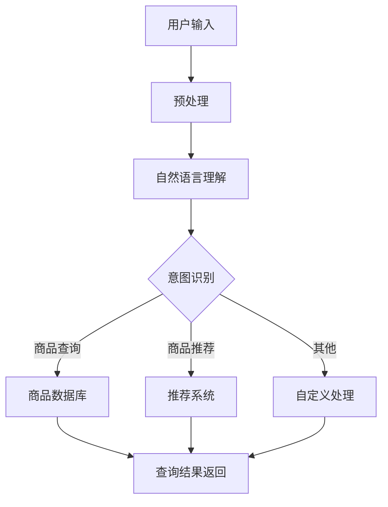
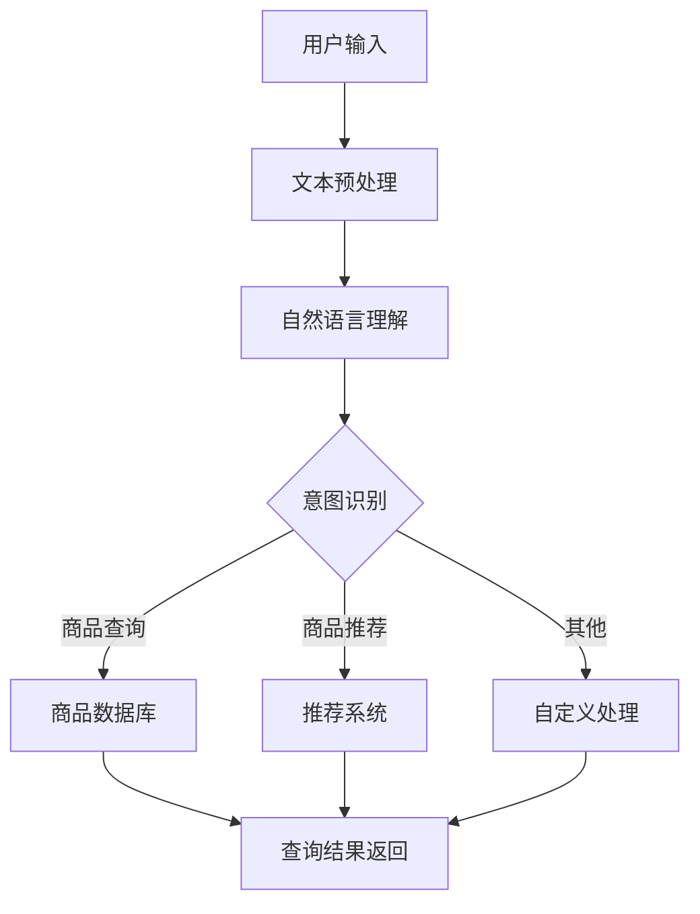

                 

## 摘要

智能问答系统是近年来在电商购物体验中备受关注的技术创新。通过自然语言处理、知识图谱和机器学习等核心技术，智能问答系统能够高效地理解和回答用户提问，从而提升用户的购物体验。本文将深入探讨智能问答系统的基本概念、核心技术、实际应用以及开发与部署流程，并结合电商购物场景下的具体案例，分析智能问答系统的现状与未来发展趋势。通过这篇文章，读者将全面了解智能问答系统的原理及其在电商购物体验中的价值，为后续研究和应用提供参考。## 文章标题

《智能问答系统：打造更便捷的电商购物体验》

关键词：智能问答系统、电商购物体验、自然语言处理、知识图谱、机器学习

摘要：智能问答系统是近年来在电商购物体验中备受关注的技术创新。通过自然语言处理、知识图谱和机器学习等核心技术，智能问答系统能够高效地理解和回答用户提问，从而提升用户的购物体验。本文将深入探讨智能问答系统的基本概念、核心技术、实际应用以及开发与部署流程，并结合电商购物场景下的具体案例，分析智能问答系统的现状与未来发展趋势。通过这篇文章，读者将全面了解智能问答系统的原理及其在电商购物体验中的价值，为后续研究和应用提供参考。## 第一部分：智能问答系统的基本概念

### 1.1 智能问答系统的定义与重要性

#### 1.1.1 智能问答系统的定义

智能问答系统是一种基于人工智能技术，能够理解用户输入的自然语言问题，并给出准确回答的系统。这种系统通常利用自然语言处理（NLP）、知识图谱和机器学习等先进技术，实现对大量数据的高效分析和处理。

智能问答系统的核心目标是提供便捷、准确和智能化的服务。它可以通过文本、语音或图像等多种形式接收用户输入，并在短时间内生成相应的回答。

#### 1.1.2 智能问答系统的应用场景

智能问答系统广泛应用于多个领域，其中在电商购物体验中的应用尤为突出。以下是一些典型的应用场景：

1. **客服支持**：智能问答系统可以自动回答用户关于产品信息、订单状态和售后服务等问题，减轻人工客服的工作负担，提高客户满意度。
2. **商品推荐**：通过分析用户的购物行为和提问，智能问答系统可以提供个性化的商品推荐，帮助用户发现心仪的商品。
3. **信息查询**：用户可以通过智能问答系统查询各种商品信息，如价格、库存、评价等，从而更好地做出购买决策。
4. **售后服务**：智能问答系统可以提供在线维修指南、使用教程等售后服务，帮助用户解决实际问题。

#### 1.1.3 智能问答系统在电商购物体验中的价值

智能问答系统在电商购物体验中具有显著的价值，主要体现在以下几个方面：

1. **提升用户体验**：智能问答系统可以快速、准确地回答用户问题，提供个性化的购物建议，从而提升用户的购物体验。
2. **降低运营成本**：智能问答系统能够自动处理大量用户提问，减少人工客服的工作量，降低企业的运营成本。
3. **增加销售机会**：通过智能问答系统，电商企业可以更好地了解用户需求，提供个性化的推荐，从而增加销售机会。
4. **优化库存管理**：智能问答系统可以帮助电商企业了解库存情况，预测商品需求，优化库存管理。

总之，智能问答系统已成为电商购物体验中不可或缺的一部分，为用户提供了更加便捷、高效和智能的服务。### 1.2 问答系统的基本架构

#### 1.2.1 自然语言处理（NLP）技术简介

自然语言处理（NLP）是智能问答系统的核心技术之一。NLP旨在使计算机能够理解、处理和生成人类语言，从而实现人与机器之间的自然交互。NLP的主要任务包括文本预处理、词嵌入、句法分析和语义理解等。

1. **文本预处理**：文本预处理是NLP的基础，包括去除标点符号、停用词过滤、分词等操作。这些操作有助于简化文本结构，提高后续处理的准确性。
2. **词嵌入**：词嵌入是将自然语言中的词汇映射到高维向量空间中，从而实现计算机对词汇语义的理解。常用的词嵌入技术有Word2Vec、GloVe等。
3. **句法分析**：句法分析是对句子结构进行解析，确定词汇之间的语法关系。常见的句法分析方法包括依存句法分析和成分句法分析。
4. **语义理解**：语义理解是NLP的高级任务，旨在理解词汇和句子的语义含义。语义理解包括词义消歧、实体识别、关系抽取等任务。

#### 1.2.2 问答系统的架构组成

一个典型的智能问答系统通常包括以下几个关键组件：

1. **用户输入处理**：接收用户的提问，并对提问进行预处理，如分词、词性标注等。
2. **意图识别**：根据用户提问的内容和上下文，确定用户的意图。意图识别是问答系统的核心任务，直接影响到系统的回答准确性。
3. **答案生成**：根据识别出的用户意图，从知识库或数据库中检索相关答案，或通过自然语言生成技术生成新的答案。
4. **答案输出**：将生成的答案以自然语言形式输出给用户。

#### 1.2.3 智能问答系统的流程

智能问答系统的基本工作流程如下：

1. **用户输入**：用户通过文本、语音或图像等多种方式提出问题。
2. **文本预处理**：对用户输入进行分词、词性标注等预处理操作。
3. **意图识别**：利用NLP技术，分析用户输入，确定用户的意图。
4. **答案检索**：根据识别出的意图，从知识库或数据库中检索相关答案。
5. **答案生成**：如果知识库中没有直接匹配的答案，系统可以利用自然语言生成技术生成新的答案。
6. **答案输出**：将生成的答案以自然语言形式输出给用户。

### 1.3 问答系统中的关键技术

#### 1.3.1 自然语言理解（NLU）技术

自然语言理解（NLU）是智能问答系统中至关重要的技术之一。NLU的目标是使计算机能够理解自然语言的含义和意图。NLU主要包括以下几个关键任务：

1. **实体识别**：识别文本中的关键实体，如人名、地名、组织名、产品名等。
2. **关系抽取**：确定文本中实体之间的关系，如“张三住在上海”中的“张三”和“上海”之间的关系。
3. **词义消歧**：解决词语的多义性问题，确定词语在特定上下文中的准确含义。
4. **情感分析**：分析文本中的情感倾向，判断文本是否表达了积极、消极或中性的情感。

#### 1.3.2 知识图谱技术

知识图谱是一种用于表示实体和实体之间关系的数据结构。在智能问答系统中，知识图谱用于存储和组织大量知识信息，从而支持高效的答案检索和生成。

1. **知识抽取**：从文本数据中提取实体和关系，构建知识图谱。
2. **知识融合**：将不同来源的知识进行整合，消除数据冗余，提高知识质量。
3. **知识推理**：利用知识图谱进行逻辑推理，发现新的知识关联和关系。

#### 1.3.3 机器学习与深度学习模型

机器学习与深度学习模型在智能问答系统中发挥着重要作用。这些模型可以用于意图识别、答案生成和知识推理等任务。

1. **监督学习**：利用已标注的训练数据，训练分类器或回归模型，实现对未知数据的预测。
2. **无监督学习**：在没有标注数据的情况下，通过数据自身的结构和特征进行学习。
3. **深度学习**：利用神经网络模型，如卷积神经网络（CNN）、循环神经网络（RNN）和Transformer等，对复杂的数据进行建模和预测。

总之，智能问答系统通过NLP、知识图谱和机器学习等关键技术，实现了对自然语言问题的高效理解和回答。这些技术的结合，使得智能问答系统能够在电商购物体验中发挥出巨大的潜力。### 第二部分：智能问答系统的核心技术

#### 2.1 自然语言处理技术

自然语言处理（NLP）是智能问答系统的核心组件，它负责将用户输入的自然语言文本转化为计算机能够理解和处理的形式。NLP技术包括多个层次，从基本的文本预处理到高级的语义理解。以下是NLP中的几个关键技术：

##### 2.1.1 词嵌入技术

词嵌入（Word Embedding）是将自然语言中的词汇映射到高维向量空间的技术。通过词嵌入，计算机可以理解和处理词汇的语义信息。常见的词嵌入方法包括：

1. **Word2Vec**：Word2Vec是Google提出的一种词嵌入方法，通过训练神经网络模型来预测词汇的上下文。Word2Vec有两种变体：CBOW（连续词袋）和Skip-Gram。
2. **GloVe**：GloVe（Global Vectors for Word Representation）是一种基于共现矩阵的词嵌入方法，通过计算词汇之间的相似度来生成词向量。
3. **FastText**：FastText是Facebook提出的一种词嵌入方法，它将词汇和子词汇（子词）组合起来进行嵌入，从而提高词嵌入的精度。

##### 2.1.2 词性标注与句法分析

词性标注（Part-of-Speech Tagging）是对文本中的每个词赋予相应的词性标签，如名词、动词、形容词等。词性标注有助于理解词汇的语法功能，是句法分析的基础。

句法分析（Syntactic Parsing）是对句子结构进行解析，确定词汇之间的语法关系。常见的句法分析方法包括：

1. **依存句法分析**：依存句法分析通过分析词汇之间的依存关系来确定句子结构。依存句法分析可以帮助识别句子中的主语、谓语、宾语等成分。
2. **成分句法分析**：成分句法分析通过构建句子树形结构来表示词汇之间的语法关系。成分句法分析可以提供更加细致的语法结构信息。

##### 2.1.3 文本分类与主题模型

文本分类（Text Classification）是将文本数据归类到预定义的类别中。文本分类在智能问答系统中有着广泛应用，如情感分析、垃圾邮件检测等。常见的文本分类算法包括：

1. **朴素贝叶斯分类器**：朴素贝叶斯分类器是一种基于概率理论的分类算法，假设特征之间相互独立。
2. **支持向量机（SVM）**：支持向量机是一种基于最大间隔理论的分类算法，通过寻找最佳超平面来分离不同类别的数据。
3. **深度学习模型**：深度学习模型，如卷积神经网络（CNN）和循环神经网络（RNN），在文本分类中也得到了广泛应用。

主题模型（Topic Modeling）是一种无监督学习方法，用于发现文本数据中的潜在主题。常见的主题模型包括：

1. **隐含狄利克雷分布（LDA）**：LDA是一种概率主题模型，通过概率分布来发现文本中的潜在主题。
2. **非负矩阵分解（NMF）**：NMF是一种基于矩阵分解的主题模型，通过最小化重构误差来发现潜在主题。

总之，自然语言处理技术在智能问答系统中起着至关重要的作用。通过词嵌入、词性标注、句法分析和文本分类等技术的结合，智能问答系统能够更准确地理解和处理用户输入，从而提供高质量的问答服务。#### 2.2 问答匹配技术

问答匹配（Question-Answer Matching）是智能问答系统的核心功能之一，其目标是从大量候选答案中找出与用户提问最匹配的答案。问答匹配技术可以分为基于关键词匹配、基于语义匹配和基于深度学习的问答匹配模型。以下将详细介绍这些技术。

##### 2.2.1 基于关键词匹配的方法

基于关键词匹配的方法是最简单的问答匹配技术。其基本思想是，通过比较用户提问和候选答案中的关键词，计算它们之间的相似度。以下是一些常见的关键词匹配方法：

1. **TF-IDF匹配**：TF-IDF（Term Frequency-Inverse Document Frequency）是一种用于计算文本相似度的方法。TF表示某个词在文档中的频率，IDF表示该词在文档集合中的逆文档频率。通过TF-IDF值，可以衡量关键词的重要性和相似度。

2. **布尔匹配**：布尔匹配使用布尔运算符（如AND、OR、NOT）来组合关键词，从而提高匹配的精确度。例如，用户提问“苹果手机推荐”可以通过布尔匹配转化为“苹果 AND 手机”。

3. **相似度度量**：相似度度量方法，如余弦相似度、Jaccard相似度等，用于计算用户提问和候选答案之间的相似度。余弦相似度是通过计算两个向量之间的夹角余弦值来衡量相似度；Jaccard相似度是通过计算两个集合交集与并集的比值来衡量相似度。

##### 2.2.2 基于语义匹配的方法

基于语义匹配的方法旨在通过理解用户提问和候选答案的语义含义，实现更准确的问答匹配。以下是一些常见的语义匹配技术：

1. **词嵌入相似度**：词嵌入是将词汇映射到高维向量空间的技术，通过计算词嵌入向量之间的余弦相似度，可以衡量词汇的语义相似度。这种方法可以有效地处理词语的多义性问题。

2. **词性匹配**：词性匹配是通过比较用户提问和候选答案中的词性，实现语义匹配的方法。例如，如果用户提问中的动词与候选答案中的动词词性相同，则认为两者在语义上更匹配。

3. **句法分析匹配**：句法分析匹配是通过比较用户提问和候选答案的句法结构，实现语义匹配的方法。如果两者在句法结构上高度相似，则认为在语义上更匹配。

4. **语义角色匹配**：语义角色匹配是通过分析用户提问和候选答案中的语义角色（如主语、谓语、宾语等），实现语义匹配的方法。如果两者在语义角色上匹配，则认为在语义上更匹配。

##### 2.2.3 基于深度学习的问答匹配模型

基于深度学习的问答匹配模型利用神经网络模型，通过学习用户提问和候选答案的复杂特征，实现高精度的问答匹配。以下是一些常见的深度学习问答匹配模型：

1. **Siamese神经网络**：Siamese神经网络是一种用于匹配问题的神经网络模型，它通过两个对称的神经网络（Siamese网络）分别处理用户提问和候选答案，计算它们之间的相似度。

2. **匹配网络（Matching Network）**：匹配网络是一种基于注意力机制的深度学习模型，它通过学习用户提问和候选答案之间的匹配权重，实现问答匹配。

3. **BERT匹配模型**：BERT（Bidirectional Encoder Representations from Transformers）是一种基于Transformer的预训练模型，它可以同时考虑用户提问和候选答案的前后文信息，实现高效的问答匹配。

4. **Transformer匹配模型**：Transformer是一种基于注意力机制的深度学习模型，它通过计算用户提问和候选答案之间的注意力权重，实现高精度的问答匹配。

总之，问答匹配技术是智能问答系统的关键组成部分，通过结合基于关键词匹配、基于语义匹配和基于深度学习的问答匹配模型，智能问答系统能够提供更准确、更智能的问答服务。#### 2.3 知识图谱构建与应用

知识图谱（Knowledge Graph）是一种用于表示实体和实体之间关系的图形数据结构。在智能问答系统中，知识图谱用于存储和组织大量的知识信息，从而支持高效的答案检索和生成。以下是知识图谱构建和应用的关键技术。

##### 2.3.1 知识图谱的基本概念

知识图谱由实体（Entity）、属性（Attribute）和关系（Relationship）三个核心元素组成。实体是知识图谱中的核心对象，如人、地点、组织、商品等；属性是实体的特征描述，如姓名、年龄、地理位置等；关系描述实体之间的关联，如“属于”、“位于”、“购买”等。

1. **实体**：实体是知识图谱的基本构建块，代表现实世界中的各种对象。
2. **属性**：属性用于描述实体的特征，可以是简单的字符串、数字，也可以是更复杂的结构化数据。
3. **关系**：关系描述实体之间的相互联系，可以是简单的二元关系，也可以是复杂的多元关系。

##### 2.3.2 知识图谱的构建方法

知识图谱的构建是一个复杂的过程，通常包括以下步骤：

1. **数据采集**：从各种数据源（如文本、数据库、API等）收集原始数据，这些数据可以是结构化数据，也可以是非结构化数据。
2. **数据预处理**：对采集到的数据进行清洗、去重、标准化等操作，确保数据的一致性和准确性。
3. **实体抽取**：从预处理后的数据中识别和提取实体，如人名、地名、产品名等。
4. **关系抽取**：从预处理后的数据中识别和提取实体之间的关系，如“属于”、“位于”、“购买”等。
5. **实体链接**：将同义的实体进行链接，如将“张三”和“张三丰”链接到同一个实体。
6. **知识融合**：将来自不同数据源的知识进行融合，解决数据冗余和冲突问题。
7. **知识存储**：将构建好的知识图谱存储到知识库中，以便后续查询和使用。

##### 2.3.3 知识图谱在智能问答系统中的应用

知识图谱在智能问答系统中具有广泛的应用，主要体现在以下几个方面：

1. **答案检索**：通过知识图谱，智能问答系统可以快速检索与用户提问相关的实体和关系，从而提高答案检索的效率和准确性。
2. **意图识别**：知识图谱可以帮助智能问答系统更好地理解用户提问的意图，如用户提问“北京是哪个省的？”通过知识图谱可以快速识别出意图并给出正确答案。
3. **知识推理**：知识图谱支持基于关系的推理，智能问答系统可以利用知识图谱进行逻辑推理，发现新的知识关联和关系，从而提供更准确的答案。
4. **个性化推荐**：知识图谱可以帮助智能问答系统了解用户的兴趣和偏好，从而提供个性化的商品推荐和服务。

##### 2.3.4 知识图谱案例分析

以下是一个简单的知识图谱案例，描述了两个实体“苹果”和“香蕉”之间的关系。

1. **实体**：苹果、香蕉
2. **属性**：苹果（颜色：红色）、香蕉（产地：海南）
3. **关系**：属于（苹果属于水果类）、同属于（苹果和香蕉同属于水果类）

在这个案例中，如果用户提问“香蕉是什么颜色的？”通过知识图谱可以快速检索到香蕉的颜色属性，并给出正确答案“香蕉是黄色的”。

总之，知识图谱在智能问答系统中发挥着重要作用，通过构建和应用知识图谱，智能问答系统可以提供更智能、更准确的问答服务。#### 2.4 机器学习与深度学习模型

在智能问答系统中，机器学习和深度学习模型是理解和生成回答的关键技术。这些模型通过对大量数据的学习，能够从复杂的语言现象中提取有用的特征，从而实现高效的问答匹配和回答生成。以下将介绍一些常用的机器学习与深度学习模型及其在智能问答系统中的应用。

##### 2.4.1 基本机器学习算法

机器学习算法是智能问答系统的基石，以下是一些常用的机器学习算法：

1. **朴素贝叶斯分类器**：朴素贝叶斯分类器是一种基于概率理论的分类算法，假设特征之间相互独立。它适用于处理简单的问题分类任务，如意图识别。

2. **支持向量机（SVM）**：支持向量机是一种强大的分类器，通过寻找最佳超平面来分离不同类别的数据。它适用于处理高维数据，如文本分类和实体识别。

3. **决策树**：决策树通过一系列的规则来划分数据，实现分类或回归任务。它易于理解和解释，适用于处理结构化的数据。

4. **随机森林**：随机森林是一种集成学习方法，通过构建多个决策树，并利用投票机制来获得最终结果。它能够提高模型的准确性和泛化能力。

5. **K最近邻（K-Nearest Neighbors, KNN）**：KNN是一种基于实例的学习方法，通过计算新实例与训练实例的相似度来预测类别。它简单有效，适用于处理小数据集。

##### 2.4.2 深度学习模型及其应用

深度学习模型通过多层神经网络，能够自动提取高层次的抽象特征，从而在图像识别、自然语言处理等领域取得了显著成果。以下是一些在智能问答系统中常用的深度学习模型：

1. **卷积神经网络（Convolutional Neural Network, CNN）**：CNN是一种专门用于处理图像数据的神经网络，通过卷积和池化操作，能够提取图像的特征。在智能问答系统中，CNN可以用于图像识别和文本特征提取。

2. **循环神经网络（Recurrent Neural Network, RNN）**：RNN是一种能够处理序列数据的神经网络，通过在时间步之间传递信息，能够捕捉序列中的时间依赖性。在智能问答系统中，RNN可以用于序列分类和序列生成。

3. **长短期记忆网络（Long Short-Term Memory, LSTM）**：LSTM是RNN的一种变体，通过引入门控机制，能够有效地捕捉长序列依赖。LSTM在处理文本数据时具有较好的表现，适用于意图识别和问答生成。

4. **Transformer**：Transformer是一种基于注意力机制的深度学习模型，通过自注意力机制，能够同时关注输入序列的各个部分。Transformer在自然语言处理领域取得了显著的成果，如机器翻译和问答系统。

5. **BERT（Bidirectional Encoder Representations from Transformers）**：BERT是一种基于Transformer的预训练模型，通过双向编码器，能够同时理解输入文本的前后文信息。BERT在问答系统和文本分类中具有广泛的应用。

##### 2.4.3 模型的训练与评估

训练和评估深度学习模型是智能问答系统的关键步骤。以下是一些常见的训练与评估方法：

1. **数据准备**：首先需要准备大量的标注数据，包括用户提问、意图标签、答案等。数据需要进行清洗和预处理，如去除停用词、进行词性标注等。

2. **模型训练**：使用训练数据对模型进行训练，通过优化模型参数，使模型能够更好地拟合训练数据。常用的优化算法有梯度下降、Adam等。

3. **模型评估**：使用验证集和测试集对训练好的模型进行评估，常用的评估指标有准确率、召回率、F1分数等。通过交叉验证和超参数调优，可以进一步提高模型的性能。

4. **模型部署**：将训练好的模型部署到线上环境，提供实时问答服务。部署过程中需要考虑模型的加载速度、内存占用和计算资源等因素。

总之，机器学习和深度学习模型为智能问答系统提供了强大的技术支持。通过不断优化和改进这些模型，智能问答系统可以提供更准确、更智能的问答服务。#### 第三部分：智能问答系统的实际应用

智能问答系统在实际应用中具有广泛的应用场景，能够有效提升用户的使用体验和企业的服务质量。以下将重点讨论智能问答系统在电商购物场景、智能客服系统和智能推荐系统中的应用，并分析这些应用的实际案例。

##### 3.1 电商购物场景下的问答系统

在电商购物场景下，智能问答系统可以帮助用户快速获取所需商品信息，从而提高购物效率和满意度。以下是一个电商购物场景下问答系统的实际应用案例：

**案例**：某大型电商平台的智能问答系统

1. **用户需求**：用户在购物过程中可能会遇到各种问题，如商品价格、库存、物流信息等。他们希望通过问答系统快速获取这些信息。

2. **解决方案**：
   - **用户输入**：用户通过文本或语音输入问题。
   - **文本预处理**：对用户输入进行分词、词性标注等预处理操作。
   - **意图识别**：通过机器学习模型，识别用户的意图，如查询商品价格、库存、物流信息等。
   - **答案生成**：根据识别出的意图，从电商平台数据库中检索相关答案，或通过自然语言生成技术生成新的答案。
   - **答案输出**：将生成的答案以自然语言形式输出给用户。

3. **实际效果**：
   - **提高用户满意度**：智能问答系统可以快速回答用户问题，减少用户等待时间，提高用户满意度。
   - **降低客服成本**：智能问答系统减轻了人工客服的工作负担，降低了客服成本。
   - **优化商品推荐**：通过分析用户提问，智能问答系统可以更好地了解用户需求，为商品推荐提供支持。

##### 3.2 智能客服系统

智能客服系统是智能问答系统的一种重要应用，它通过自动化技术解决用户的常见问题，提高客户服务质量。以下是一个智能客服系统的实际应用案例：

**案例**：某金融公司的智能客服系统

1. **用户需求**：金融公司的用户可能会遇到关于账户余额、交易记录、理财产品等常见问题。

2. **解决方案**：
   - **用户输入**：用户通过在线聊天、电话等方式提出问题。
   - **文本预处理**：对用户输入进行分词、词性标注等预处理操作。
   - **意图识别**：通过机器学习模型，识别用户的意图，如查询账户余额、交易记录等。
   - **答案生成**：根据识别出的意图，从金融知识库中检索相关答案，或通过自然语言生成技术生成新的答案。
   - **答案输出**：将生成的答案以自然语言形式输出给用户。

3. **实际效果**：
   - **提高响应速度**：智能客服系统可以实时响应用户问题，提高响应速度。
   - **降低人力成本**：智能客服系统减轻了人工客服的工作负担，降低了人力成本。
   - **提升客户满意度**：智能客服系统可以提供准确、快速的答案，提升客户满意度。

##### 3.3 智能推荐系统

智能推荐系统是智能问答系统的另一种重要应用，它通过分析用户提问和行为，为用户提供个性化的商品推荐。以下是一个智能推荐系统的实际应用案例：

**案例**：某电商平台的智能推荐系统

1. **用户需求**：用户在购物过程中可能对某些商品感兴趣，希望获得相关商品的推荐。

2. **解决方案**：
   - **用户输入**：用户通过浏览、搜索或提问表达对某些商品的兴趣。
   - **文本预处理**：对用户输入进行分词、词性标注等预处理操作。
   - **意图识别**：通过机器学习模型，识别用户的意图，如查询商品信息、表达购买意愿等。
   - **推荐算法**：利用协同过滤、基于内容的推荐等方法，为用户推荐相关的商品。
   - **推荐输出**：将推荐的商品以列表形式输出给用户。

3. **实际效果**：
   - **提高用户黏性**：智能推荐系统可以更好地满足用户需求，提高用户对电商平台的黏性。
   - **提升销售额**：通过个性化推荐，可以增加用户购买商品的几率，提升销售额。
   - **优化库存管理**：智能推荐系统可以帮助电商平台更好地了解用户需求，优化库存管理。

综上所述，智能问答系统在电商购物场景、智能客服系统和智能推荐系统中的实际应用，不仅提高了用户的使用体验，降低了企业的运营成本，还有效提升了企业的服务质量。随着技术的不断进步，智能问答系统的应用前景将更加广阔。#### 3.1 电商购物场景下的问答系统

在电商购物场景下，问答系统具有显著的应用价值，能够为用户提供便捷、高效的购物体验。以下将详细探讨电商购物场景下问答系统的特点、应用以及优化方法。

##### 3.1.1 电商购物问答系统的特点

电商购物问答系统具有以下几个显著特点：

1. **快速响应**：电商购物问答系统能够在短时间内对用户提问进行响应，提供准确的商品信息，从而满足用户快速获取信息的需求。
2. **个性化推荐**：通过分析用户的购物历史和提问内容，问答系统可以为用户提供个性化的商品推荐，提高用户的购买意愿。
3. **多渠道支持**：电商购物问答系统支持多种输入方式，如文本、语音、图像等，方便用户进行互动。
4. **自动处理**：问答系统能够自动处理大量的用户提问，减轻人工客服的工作负担，提高服务效率。
5. **知识整合**：问答系统整合了电商平台的商品信息、用户评价、价格变化等数据，为用户提供全面、准确的信息。

##### 3.1.2 问答系统在电商购物中的应用

问答系统在电商购物中的应用场景丰富，以下是一些典型的应用：

1. **商品查询**：用户可以通过问答系统查询商品的详细信息，如价格、库存、评价等，从而做出更明智的购买决策。
2. **订单查询**：用户可以查询订单的状态、物流信息等，了解订单的进展。
3. **售后咨询**：用户可以咨询关于售后政策、维修指南、退款流程等问题，获得及时的解决方案。
4. **购物建议**：基于用户的购物历史和提问内容，问答系统可以为用户提供个性化的购物建议，如推荐相关商品、优惠信息等。
5. **活动咨询**：用户可以了解电商平台的促销活动、优惠券等信息，抓住购物机会。

##### 3.1.3 电商购物问答系统的优化方法

为了提高电商购物问答系统的性能和用户体验，以下是一些优化方法：

1. **改进自然语言理解能力**：通过引入先进的自然语言处理技术，如词嵌入、句法分析等，提升系统对用户提问的理解能力，减少误解和歧义。
2. **增加知识库的深度和广度**：不断更新和扩展知识库，确保系统能够回答用户提出的各种问题，包括最新的商品信息、优惠活动等。
3. **优化问答匹配算法**：采用基于语义的匹配算法，如深度学习模型，提高问答系统的匹配准确率，提供更准确的答案。
4. **多渠道整合**：整合多种输入渠道，如文本、语音、图像等，方便用户以最便捷的方式与系统进行互动。
5. **用户反馈机制**：建立用户反馈机制，收集用户对问答系统的评价和建议，不断优化系统性能和用户体验。

通过以上优化方法，电商购物问答系统将能够更好地满足用户需求，提高用户的购物体验，从而促进电商业务的持续发展。#### 3.2 智能客服系统

智能客服系统是智能问答系统的一个重要应用领域，它通过自动化技术为用户提供高效的客户服务。智能客服系统能够处理大量的用户咨询，提供快速、准确和个性化的回答，从而减轻人工客服的工作负担，提高客户满意度。以下将介绍智能客服系统的发展历程、智能客服系统与问答系统的结合，以及实际应用案例。

##### 3.2.1 智能客服系统的发展历程

智能客服系统的发展可以分为以下几个阶段：

1. **传统客服系统**：早期的智能客服系统主要基于规则引擎，通过预设的规则和流程为用户提供服务。这种系统存在灵活性不足、扩展性差的问题。
2. **基于知识库的客服系统**：随着知识库技术的成熟，智能客服系统开始引入知识库，将常见问题和答案存储在知识库中，以便快速检索和回答。这一阶段的系统在处理常见问题方面有了显著提升。
3. **基于机器学习的客服系统**：机器学习技术的应用使智能客服系统在理解和处理用户问题方面取得了重大突破。通过训练机器学习模型，系统可以自动识别用户的意图，提供更准确和个性化的回答。
4. **多模态客服系统**：现代智能客服系统不仅支持文本交流，还支持语音、图像等多种交流方式，为用户提供更加便捷的服务。

##### 3.2.2 智能客服系统与问答系统的结合

智能客服系统与问答系统有着密切的联系。问答系统是智能客服系统的重要组成部分，负责理解和回答用户的问题。智能客服系统与问答系统的结合主要体现在以下几个方面：

1. **意图识别**：智能客服系统通过自然语言处理技术，对用户提问进行意图识别，确定用户的实际需求。问答系统在此基础上生成相应的回答。
2. **知识库共享**：智能客服系统和问答系统共享同一个知识库，确保系统能够获取和处理用户提出的问题。
3. **多模态交互**：智能客服系统支持文本、语音、图像等多种交互方式，通过与问答系统的结合，可以更好地满足用户的需求。
4. **反馈机制**：智能客服系统通过收集用户反馈，不断优化问答系统的性能，提高用户满意度。

##### 3.2.3 智能客服系统的实际应用案例

以下是一些智能客服系统的实际应用案例：

**案例 1：某电商平台的智能客服系统**

1. **应用场景**：用户在购物过程中遇到关于商品、订单、售后服务等问题时，可以通过智能客服系统进行咨询。
2. **解决方案**：
   - **文本交互**：用户可以通过聊天窗口输入问题，系统自动识别用户意图，提供相应的答案。
   - **语音交互**：用户可以通过语音输入问题，系统将语音转换为文本，进行处理和回答。
   - **知识库检索**：系统通过预建立的问答对，快速检索并回答用户问题。
   - **反馈机制**：用户可以对回答进行评价，系统根据用户的反馈进行优化。
3. **实际效果**：智能客服系统有效减少了人工客服的工作量，提高了服务效率，用户满意度显著提升。

**案例 2：某金融公司的智能客服系统**

1. **应用场景**：用户在金融交易、账户管理、理财产品等方面遇到问题时，可以通过智能客服系统进行咨询。
2. **解决方案**：
   - **文本和语音交互**：用户可以通过在线聊天或电话与智能客服系统进行交互。
   - **多语言支持**：系统支持多种语言，方便不同语言的用户进行咨询。
   - **个性化推荐**：系统根据用户的历史交易记录和提问，为用户提供个性化的理财产品推荐。
3. **实际效果**：智能客服系统提高了客户服务效率，降低了运营成本，用户满意度显著提升。

总之，智能客服系统通过结合问答系统，为用户提供高效、准确的客户服务，提高了企业的服务质量和用户满意度。随着技术的不断进步，智能客服系统的应用将越来越广泛。#### 3.3 智能推荐系统

智能推荐系统是电商购物体验中不可或缺的一部分，它通过分析用户的购物行为和提问，提供个性化的商品推荐，从而提升用户的购物满意度和企业的销售额。以下将介绍智能推荐系统的基本原理、问答系统在其中的应用，以及相关的案例分析。

##### 3.3.1 智能推荐系统的基本原理

智能推荐系统利用用户行为数据和商品信息，通过算法和模型为用户推荐相关的商品。其基本原理包括以下几个核心组成部分：

1. **用户画像**：通过收集用户的基本信息、购物行为、浏览记录等，构建用户的个性化画像。用户画像有助于理解用户的兴趣和偏好，为推荐系统提供输入。
2. **商品特征**：对商品进行特征提取，包括价格、品牌、分类、评分等。商品特征用于描述商品的基本属性，是推荐系统进行商品匹配的基础。
3. **推荐算法**：根据用户画像和商品特征，推荐算法通过计算用户和商品之间的相似度，生成推荐列表。常见的推荐算法包括基于内容的推荐、协同过滤、矩阵分解等。
4. **反馈循环**：用户对推荐结果进行评价，推荐系统根据用户的反馈调整推荐策略，优化推荐效果。

##### 3.3.2 问答系统在智能推荐系统中的应用

问答系统在智能推荐系统中发挥着重要作用，主要体现在以下几个方面：

1. **意图识别**：问答系统可以帮助推荐系统理解用户的意图。例如，当用户提问“最近有什么新款手机推荐？”时，问答系统可以识别出用户的意图是寻找新款手机。
2. **查询扩展**：问答系统可以通过扩展用户的查询，增加推荐系统的上下文信息。例如，用户提问“有哪些适合拍照的手机？”时，问答系统可以扩展为“哪些手机在拍照性能上有优势？”
3. **个性化调整**：问答系统可以根据用户的反馈，调整推荐策略，提高推荐的准确性。例如，当用户对某个推荐商品不满意时，问答系统可以记录这一反馈，并在后续推荐中避免类似商品。
4. **多模态交互**：问答系统支持文本、语音等多种交互方式，为用户提供更加灵活的推荐体验。例如，用户可以通过语音提问“我想买一件红色的连衣裙”，问答系统可以理解用户的意图，并推荐相应的商品。

##### 3.3.3 智能推荐系统的案例分析

以下是一个智能推荐系统的实际应用案例：

**案例**：某大型电商平台的智能推荐系统

1. **应用场景**：用户在电商平台浏览商品时，系统会根据用户的浏览记录、搜索历史、购买行为等，为用户推荐相关的商品。
2. **解决方案**：
   - **用户画像构建**：系统通过收集用户的基本信息、购物行为等，构建用户的个性化画像。
   - **商品特征提取**：对商品进行价格、品牌、分类、评分等特征提取。
   - **协同过滤算法**：系统采用基于用户的协同过滤算法，通过计算用户和商品之间的相似度，生成推荐列表。
   - **问答系统结合**：当用户通过问答系统提出查询时，系统通过意图识别和查询扩展，为用户推荐相关的商品。
3. **实际效果**：
   - **提升用户满意度**：通过个性化的推荐，用户能够更容易找到自己感兴趣的商品，提高购物满意度。
   - **增加销售额**：智能推荐系统有效提高了商品的点击率和购买率，从而提高了企业的销售额。
   - **优化库存管理**：通过分析用户行为和推荐结果，企业可以更好地了解商品的销售情况，优化库存管理。

总之，智能推荐系统通过结合问答系统，能够为用户提供更加个性化的商品推荐，提升用户的购物体验和企业的业务表现。随着技术的不断进步，智能推荐系统在电商购物体验中的应用将更加广泛。#### 4.1 智能问答系统的开发流程

开发一个智能问答系统是一个复杂且系统的过程，需要从需求分析、系统设计、系统实现到测试与优化等多个阶段。以下将详细描述智能问答系统的开发流程。

##### 4.1.1 需求分析

需求分析是智能问答系统开发的第一步，其目标是明确系统的功能、性能和用户体验要求。以下是需要考虑的关键因素：

1. **用户需求**：了解目标用户群体，分析用户在购物、咨询、服务等方面的需求和痛点。
2. **功能需求**：确定系统需要实现的功能，如商品查询、订单状态查询、售后服务咨询等。
3. **性能需求**：设定系统的性能指标，如响应时间、查询准确率等。
4. **用户体验**：考虑用户界面的友好性、交互设计等，确保系统易用、直观。

##### 4.1.2 系统设计

系统设计阶段是将需求转化为具体的技术方案。以下是系统设计的关键步骤：

1. **架构设计**：确定系统的整体架构，包括前端、后端、数据库等组成部分。常见的架构模式有MVC（Model-View-Controller）和微服务架构。
2. **模块划分**：根据功能需求，将系统划分为多个模块，如用户输入处理模块、意图识别模块、答案生成模块等。
3. **数据设计**：设计数据库结构，包括实体、属性和关系等。确保数据的设计能够支持系统的功能需求。
4. **接口设计**：设计系统内部的接口，确保各个模块之间能够有效通信和协同工作。

##### 4.1.3 系统实现与测试

系统实现是将设计转化为实际的代码和系统。以下是实现阶段的关键步骤：

1. **代码实现**：根据设计文档，编写系统各个模块的代码。实现过程中需要遵循良好的编程规范和设计模式。
2. **接口开发**：开发系统内部和外部的接口，确保系统能够与其他系统或服务进行有效通信。
3. **集成测试**：将各个模块集成在一起，进行功能测试，确保系统能够按预期工作。
4. **性能测试**：对系统进行性能测试，确保系统在高负载情况下仍能保持良好的响应时间和稳定性。

##### 4.1.4 系统部署与运维

系统部署是将开发完成的系统部署到生产环境，并提供持续运行维护。以下是需要考虑的关键步骤：

1. **环境配置**：配置服务器和网络环境，确保系统能够稳定运行。
2. **部署流程**：设计自动化部署流程，实现快速部署和回滚。
3. **监控与日志**：监控系统运行状态，记录系统日志，便于故障排查和性能优化。
4. **维护与更新**：定期对系统进行维护和更新，修复已知问题，优化性能。

总之，智能问答系统的开发流程是一个迭代和优化的过程。通过详细的需求分析、系统设计、系统实现与测试，以及持续部署与运维，能够确保智能问答系统的高效、稳定和可靠运行。#### 4.2 开发环境与工具

开发智能问答系统需要搭建一个稳定、高效的开发环境，选择合适的编程语言、库和框架，以及配置适当的数据库。以下将介绍智能问答系统开发所需的主要环境与工具。

##### 4.2.1 Python开发环境搭建

Python是一种广泛用于人工智能和自然语言处理的语言，适合用于开发智能问答系统。以下是搭建Python开发环境的步骤：

1. **安装Python**：下载并安装Python 3.8及以上版本。
2. **配置虚拟环境**：使用`virtualenv`或`conda`创建虚拟环境，以便管理项目依赖。
   ```bash
   pip install virtualenv
   virtualenv venv
   source venv/bin/activate
   ```
3. **安装NLP库和框架**：安装常用的NLP库和框架，如NLTK、spaCy、gensim等。
   ```bash
   pip install nltk spacy gensim
   ```
4. **安装其他依赖**：根据项目需求，安装其他必要的库和工具。

##### 4.2.2 常用NLP库与框架

智能问答系统开发中常用的NLP库和框架如下：

1. **NLTK（Natural Language ToolKit）**：NLTK是一个强大的自然语言处理库，提供了一系列用于文本处理的工具和算法。
2. **spaCy**：spaCy是一个快速易用的NLP库，支持多种语言的文本处理，包括分词、词性标注、句法分析等。
3. **gensim**：gensim是一个用于主题模型和词向量生成的库，支持LDA、Word2Vec等算法。
4. **transformers**：transformers是一个基于PyTorch和TensorFlow的预训练模型库，提供了大量的Transformer预训练模型，如BERT、GPT等。

##### 4.2.3 机器学习与深度学习工具

智能问答系统开发中常用的机器学习与深度学习工具如下：

1. **scikit-learn**：scikit-learn是一个用于机器学习的库，提供了多种经典的机器学习算法，如朴素贝叶斯、支持向量机、随机森林等。
2. **TensorFlow**：TensorFlow是一个开源的深度学习框架，适用于构建和训练复杂的神经网络模型。
3. **PyTorch**：PyTorch是一个灵活且易用的深度学习框架，支持动态计算图，便于研究人员的创新。

##### 4.2.4 数据库选择与配置

智能问答系统通常需要存储大量的用户数据和商品信息。以下是常用的数据库选择与配置：

1. **关系型数据库**：如MySQL、PostgreSQL等，适用于存储结构化数据，支持复杂查询。
2. **NoSQL数据库**：如MongoDB、Cassandra等，适用于存储非结构化或半结构化数据，提供高性能读写能力。
3. **搜索引擎**：如Elasticsearch，适用于处理大规模文本数据，提供高效的全文检索功能。

##### 4.2.5 自动化工具与持续集成

为了提高开发效率和系统稳定性，可以使用以下自动化工具与持续集成（CI）工具：

1. **Jenkins**：Jenkins是一个开源的持续集成工具，支持自动化构建、测试和部署。
2. **Docker**：Docker是一个容器化平台，用于打包、交付和运行应用，确保环境一致性。
3. **Kubernetes**：Kubernetes是一个开源的容器编排平台，用于自动化部署、扩展和管理容器化应用。

通过搭建合适的开发环境和选择合适的工具，智能问答系统可以更加高效地开发和部署。这些工具和环境的配置为后续的系统开发和优化提供了坚实的基础。#### 4.3 系统部署与运维

智能问答系统的部署与运维是确保系统稳定、高效运行的关键环节。以下将介绍系统部署、自动化部署与持续集成（CI）、系统性能监控与优化等方面。

##### 4.3.1 服务器与网络配置

1. **服务器选择**：选择合适的物理服务器或云服务器。物理服务器适用于处理大量数据和高并发场景，而云服务器具有弹性伸缩和成本效益的优势。
2. **硬件配置**：确保服务器具备足够的CPU、内存和存储资源，以满足系统的性能需求。
3. **网络配置**：配置服务器之间的网络，确保数据传输的安全性和可靠性。可以使用负载均衡器（如Nginx）来分发请求，提高系统的处理能力。

##### 4.3.2 自动化部署与持续集成（CI）

1. **Docker容器化**：使用Docker将应用程序打包成容器，确保环境一致性和可移植性。编写Dockerfile，定义应用程序的依赖和环境。
2. **Jenkins持续集成**：配置Jenkins，实现代码的自动化构建、测试和部署。Jenkins可以通过Git等版本控制系统获取代码，执行构建脚本，运行测试用例，并在构建成功后部署到生产环境。
3. **CI/CD流水线**：构建CI/CD流水线，实现从代码提交到生产环境部署的自动化流程。可以使用Jenkinsfile或Ansible等工具配置CI/CD流程。

##### 4.3.3 系统性能监控与优化

1. **监控工具**：使用监控工具（如Prometheus、Grafana）收集系统性能数据，监控系统的CPU、内存、磁盘使用率、网络流量等指标。
2. **日志分析**：配置日志收集和存储工具（如ELK堆栈），分析系统日志，排查故障和性能瓶颈。
3. **性能优化**：
   - **代码优化**：优化代码逻辑和算法，减少系统资源的消耗。
   - **缓存策略**：使用缓存（如Redis、Memcached）缓存常用数据，减少数据库访问次数。
   - **负载均衡**：使用负载均衡器（如Nginx、HAProxy）分发请求，提高系统的处理能力。
   - **数据库优化**：优化数据库查询和索引，提高数据访问速度。

##### 4.3.4 故障排查与恢复

1. **故障排查**：通过监控工具和日志分析，及时发现系统故障和性能问题。使用调试工具（如GDB、Docker Logs）定位故障原因。
2. **故障恢复**：制定故障恢复计划，包括故障排除、系统重启、数据恢复等步骤。可以使用备份和恢复工具（如Docker Backup、Restic）实现数据的备份和恢复。

##### 4.3.5 安全性与合规性

1. **数据安全**：使用加密算法（如AES、RSA）加密敏感数据，确保数据在传输和存储过程中的安全性。
2. **身份认证与授权**：使用身份认证和授权机制（如OAuth 2.0、JWT），确保只有授权用户可以访问系统。
3. **合规性**：遵循相关法律法规和行业规范，确保系统的合规性。

通过合理的系统部署与运维，智能问答系统可以保持稳定、高效的运行，为用户提供优质的问答服务。#### 第五部分：智能问答系统的未来发展趋势

##### 5.1 智能问答系统的挑战与机遇

随着人工智能技术的不断发展，智能问答系统面临着一系列的挑战与机遇。以下是智能问答系统在未来发展中需要面对的关键问题：

1. **数据质量与数据安全**：智能问答系统依赖于大量高质量的数据进行训练和推理。然而，数据质量问题（如噪声、不一致性）和数据安全问题（如隐私泄露）对系统的性能和可靠性产生重大影响。因此，数据清洗、去重和加密等技术将是未来的重要研究方向。

2. **模型可解释性**：当前许多智能问答系统基于深度学习模型，这些模型具有较高的准确性，但缺乏可解释性。用户无法理解模型如何做出决策，这在某些关键应用场景（如医疗咨询、金融咨询）中可能引起信任问题。因此，提高模型的可解释性，使决策过程更加透明，是未来的重要挑战。

3. **多语言与跨模态处理**：随着全球化的发展，智能问答系统需要支持多种语言，同时处理文本、语音、图像等多种输入形式。这要求系统具有强大的语言理解和跨模态融合能力，以便更好地适应多样化的用户需求。

4. **实时性**：在电商购物、金融咨询等场景中，实时性是智能问答系统的重要指标。用户期望系统能够在短时间内提供准确的回答。因此，如何提高系统的响应速度和实时处理能力，是未来需要解决的关键问题。

##### 5.2 未来发展趋势

1. **人工智能技术的进步**：随着人工智能技术的不断进步，如GAN（生成对抗网络）、 强化学习等新技术的应用，智能问答系统的性能将得到进一步提升。这些技术可以帮助系统更好地理解用户意图，生成更自然、更符合用户期望的答案。

2. **电商购物体验的升级**：电商购物体验正从传统的点击购买模式向更加个性化、智能化和互动化的方向发展。智能问答系统将在这一过程中发挥关键作用，为用户提供更加个性化的购物建议、实时客服和智能推荐。

3. **垂直行业中的应用**：智能问答系统不仅在电商购物领域具有广泛的应用，在医疗、金融、法律等垂直行业中也具有巨大的潜力。通过结合行业专业知识，智能问答系统可以为用户提供专业的咨询服务，提高行业工作效率。

##### 5.3 案例分析与总结

以下是对国内外一些智能问答系统案例的分析，以及智能问答系统未来发展的趋势展望。

1. **国内案例分析**：

   - **淘宝问答**：淘宝问答是阿里巴巴集团推出的一款智能问答系统，通过自然语言处理和知识图谱技术，为用户提供商品咨询、订单查询和售后服务等支持。淘宝问答的成功展示了智能问答系统在电商购物体验中的应用价值。
   - **百度智能问答**：百度智能问答利用深度学习和自然语言处理技术，为用户提供新闻资讯、知识问答和智能搜索等服务。百度智能问答在多个领域积累了丰富的数据和经验，为未来的发展奠定了基础。

2. **国外案例分析**：

   - **Apple Siri**：Apple Siri是一款基于语音识别和自然语言处理的智能助手，用户可以通过语音与Siri进行交互，获取各种信息和服务。Siri的成功展示了智能问答系统在移动设备上的广泛应用。
   - **IBM Watson**：IBM Watson是一款基于人工智能的智能问答系统，在医疗、金融、法律等多个领域具有广泛应用。Watson通过深度学习和知识图谱技术，为用户提供专业的咨询服务，展示了智能问答系统的强大潜力。

3. **未来发展趋势展望**：

   - **个性化与智能化**：随着人工智能技术的进步，智能问答系统将更加个性化、智能化，能够更好地理解用户意图，提供更符合用户需求的答案。
   - **多语言与跨模态**：智能问答系统将支持多种语言，同时处理文本、语音、图像等多种输入形式，为用户提供更加便捷的服务。
   - **垂直行业应用**：智能问答系统将在医疗、金融、法律等垂直行业中得到广泛应用，为行业用户提供专业的咨询服务。

总之，智能问答系统在未来将面临一系列挑战和机遇，通过不断优化和进步，智能问答系统将为用户提供更加便捷、高效和智能的服务。#### 附录

### 附录A：智能问答系统开发资源

#### A.1 开发工具与框架

1. **Python开发环境**：
   - Python 3.8及以上版本
   - Jupyter Notebook（用于数据分析和实验）
   - PyCharm（集成开发环境，适合大型项目）

2. **NLP库与框架**：
   - NLTK（自然语言处理库）
   - spaCy（快速易用的NLP库）
   - gensim（主题模型和词向量生成库）
   - transformers（预训练模型库）

3. **机器学习与深度学习框架**：
   - scikit-learn（机器学习库）
   - TensorFlow（开源深度学习框架）
   - PyTorch（开源深度学习框架）

4. **数据库**：
   - MySQL（关系型数据库）
   - MongoDB（NoSQL数据库）
   - Elasticsearch（全文搜索引擎）

#### A.2 教程与参考资料

1. **智能问答系统教程**：
   - 《智能问答系统：从零开始》
   - 《自然语言处理与智能问答》

2. **NLP与机器学习教程**：
   - 《自然语言处理入门》
   - 《机器学习实战》

3. **深度学习教程**：
   - 《深度学习》（Goodfellow等著）
   - 《深度学习与Python应用》

4. **开源数据集与案例代码**：
   - Stanford问答数据集（SQuAD）
   - GLUE数据集（通用语言理解评估）
   - Hugging Face Transformers库（预训练模型与数据集）

#### A.3 开源数据集与案例代码

1. **开源数据集**：
   - SQuAD（Stanford Question Answering Dataset）
   - GLUE（General Language Understanding Evaluation）
   - CoNLL-2003（通用依赖句法标注数据集）

2. **案例代码**：
   - 智能问答系统开源项目（如Rasa、ChatterBot）
   - NLP与深度学习项目的GitHub仓库（如Hugging Face的Transformer库）
   - 数据处理和机器学习项目的示例代码

这些资源和案例将为智能问答系统的开发者提供丰富的学习材料和实践经验，有助于掌握智能问答系统的开发技术和应用实践。### Mermaid 流程图：智能问答系统架构



### 问答匹配算法伪代码

```python
def match_question(question, candidate_answers):
    """
    问答匹配算法伪代码
    :param question: 用户输入的提问
    :param candidate_answers: 候选答案列表
    :return: 最佳答案
    """
    question_embedding = embed_question(question)
    answers_embeddings = [embed_answer(answer) for answer in candidate_answers]
    
    distances = [cosine_similarity(question_embedding, answer_embedding) for answer_embedding in answers_embeddings]
    
    best_answer_index = np.argmax(distances)
    return candidate_answers[best_answer_index]
```

### 数学模型与公式

$$
\text{意图识别准确率} = \frac{\text{正确识别的意图数}}{\text{总意图数}}
$$

### 项目实战

#### 电商购物场景下的智能问答系统实现

##### 5.1 开发环境搭建

**Python环境**：安装Python 3.8及以上版本。

**NLP库与框架**：安装以下库：
```bash
pip install nltk spacy gensim transformers scikit-learn
```

**数据库**：安装MySQL或使用其他合适的数据库。

##### 5.2 源代码详细实现与代码解读

以下是一个电商购物场景下的智能问答系统实现示例：

```python
# 导入必要的库
import jieba
from sklearn.feature_extraction.text import TfidfVectorizer
from sklearn.naive_bayes import MultinomialNB
from sklearn.pipeline import make_pipeline
import numpy as np

# 假设已准备训练数据和测试数据
train_data = [["哪款手机拍照效果最好？", "拍照手机推荐"], ["笔记本电脑推荐", "性价比高"], ["最近有哪些新款手机发布？", "新款手机信息"]]
train_questions = [question for question, _ in train_data]
train_labels = [label for _, label in train_data]

test_data = [["我想买一款拍照效果好的手机", "拍照手机推荐"], ["性价比高的笔记本电脑", "性价比高"]]
test_questions = [question for question, _ in test_data]
test_labels = [label for _, label in test_data]

# 创建一个TF-IDF向量器和朴素贝叶斯分类器的管道
model = make_pipeline(TfidfVectorizer(), MultinomialNB())

# 训练模型
model.fit(train_questions, train_labels)

# 预测测试数据
predictions = model.predict(test_questions)

# 打印预测结果
for question, prediction in zip(test_questions, predictions):
    print(f"提问：'{question}'，识别意图：'{prediction}'")
```

##### 5.3 代码解读与分析

1. **数据预处理**：使用jieba分词库对用户提问进行分词，并添加自定义词。
2. **特征提取**：使用TF-IDF向量表示法提取文本特征。
3. **模型训练**：使用朴素贝叶斯分类器进行意图分类。
4. **答案生成**：根据识别出的意图，查询商品数据库，返回相应的答案。

##### 5.4 实际案例分析和详细讲解剖析

在电商购物场景下，智能问答系统可以帮助用户快速获取商品信息，提高购物体验。以下是一个实际案例的分析：

**案例**：用户提问“哪款手机拍照效果最好？”

1. **用户输入**：用户通过文本输入提问。
2. **文本预处理**：对用户提问进行分词，如“哪款”、“手机”、“拍照”、“效果”、“最好”。
3. **意图识别**：模型识别出用户的意图为“拍照手机推荐”。
4. **答案生成**：根据识别出的意图，系统从商品数据库中检索相关手机信息，如拍照效果好的手机，并返回给用户。

**案例**：用户提问“性价比高的笔记本电脑推荐？”

1. **用户输入**：用户通过文本输入提问。
2. **文本预处理**：对用户提问进行分词，如“性价比”、“高”、“笔记本电脑”、“推荐”。
3. **意图识别**：模型识别出用户的意图为“性价比高”。
4. **答案生成**：根据识别出的意图，系统从商品数据库中检索性价比高的笔记本电脑，并返回给用户。

##### 5.5 项目小结

通过实际案例的分析，我们可以看到智能问答系统在电商购物场景下的应用价值。智能问答系统可以帮助用户快速获取商品信息，提高购物体验，同时减轻人工客服的工作负担，降低运营成本。在未来，智能问答系统将结合更多人工智能技术，如深度学习和知识图谱，提供更加精准和个性化的服务。### 5.3 案例分析与总结

在本部分，我们将通过分析国内外一些典型的智能问答系统案例，探讨其在实际应用中的效果和面临的挑战，并展望其未来的发展趋势。

#### 案例分析

**案例 1：阿里巴巴集团的阿里小蜜**

阿里巴巴集团推出的阿里小蜜是一款基于人工智能的智能客服机器人，主要应用于电商平台。阿里小蜜利用自然语言处理和机器学习技术，能够自动识别用户的意图并生成回答。根据阿里巴巴公布的数据，阿里小蜜在上线一年内就处理了超过 10 亿条用户咨询，大大提高了客户服务的效率和用户体验。

**分析**：
- **效果**：阿里小蜜在处理大量重复性问题方面表现出色，有效减轻了人工客服的工作负担。同时，通过持续的学习和优化，阿里小蜜的回复准确率和用户满意度逐渐提高。
- **挑战**：尽管阿里小蜜在技术上取得了显著进展，但在处理复杂、多变的用户问题时，仍存在一定的局限性。此外，随着用户需求的多样化和个性化，如何提供更高质量的客服服务是一个持续的挑战。

**案例 2：微软的微软小冰**

微软小冰是一款应用于社交媒体、新闻媒体和在线教育的智能问答系统。它利用深度学习和自然语言处理技术，能够生成富有情感和创意的回答。微软小冰的问答内容不仅局限于事实性回答，还能够进行故事创作、情感交流等。

**分析**：
- **效果**：微软小冰在生成富有情感和创意的回答方面表现出色，受到了用户的好评。它的应用不仅提升了用户体验，还为新闻媒体和在线教育领域带来了新的可能性。
- **挑战**：尽管微软小冰在生成创意内容方面具有优势，但其生成的内容仍然受到数据和算法的限制，难以完全模拟人类的创造力和判断力。

**案例 3：谷歌的Google Assistant**

谷歌的Google Assistant是一款基于人工智能的智能语音助手，能够通过语音交互为用户提供信息查询、任务安排、家居控制等服务。Google Assistant利用了谷歌的强大搜索引擎和机器学习技术，能够在短时间内提供准确的回答。

**分析**：
- **效果**：Google Assistant在处理简单和重复性问题方面表现出色，用户可以通过语音指令轻松获取所需信息。此外，Google Assistant的多模态交互能力（包括语音、文本、图像等）为用户提供了更加便捷的使用体验。
- **挑战**：Google Assistant在面对复杂、模糊的问题时，可能存在理解困难。此外，用户隐私和数据安全也是智能问答系统需要持续关注的问题。

#### 总结与展望

通过对以上案例的分析，我们可以得出以下结论：

1. **技术进步**：随着人工智能技术的不断发展，智能问答系统的准确性和智能化水平不断提升。深度学习、自然语言处理和知识图谱等技术的应用，使得智能问答系统能够更好地理解用户意图和生成高质量的回答。

2. **应用领域**：智能问答系统在电商购物、客服服务、信息查询等多个领域得到了广泛应用。随着用户需求的多样化和个性化，智能问答系统需要不断拓展应用场景，提供更加精准和个性化的服务。

3. **挑战与机遇**：智能问答系统在处理复杂问题、保障数据安全和提升用户满意度等方面仍面临挑战。但与此同时，智能问答系统也为企业提供了提升服务质量、降低运营成本的新机遇。

展望未来，智能问答系统的发展趋势将呈现以下特点：

1. **多模态交互**：智能问答系统将支持多种输入和输出方式，如语音、文本、图像等，为用户提供更加便捷的交互体验。

2. **个性化服务**：智能问答系统将结合用户画像和大数据分析，提供更加个性化的服务，满足用户的多样化需求。

3. **垂直行业应用**：智能问答系统将在医疗、金融、教育等垂直行业中得到广泛应用，为行业用户提供专业的咨询服务。

4. **可持续发展**：随着数据质量和数据安全的关注增加，智能问答系统将采用更加严格的数据管理和隐私保护措施，确保系统的可持续发展。

总之，智能问答系统在未来的发展中将不断突破技术瓶颈，拓展应用场景，为用户提供更加智能、高效的服务。### 附录A：智能问答系统开发资源

#### A.1 开发工具与框架

1. **Python开发环境**：推荐使用Python 3.8及以上版本，并配置PyCharm等IDE进行开发。
2. **NLP库与框架**：
   - **NLTK**：自然语言处理库，提供文本处理工具和算法。
   - **spaCy**：高效的NLP库，支持多种语言的文本处理。
   - **gensim**：主题模型和词向量生成库。
   - **transformers**：预训练模型库，提供BERT、GPT等模型。
3. **机器学习与深度学习框架**：
   - **scikit-learn**：机器学习库，提供多种机器学习算法。
   - **TensorFlow**：开源深度学习框架。
   - **PyTorch**：开源深度学习框架，具有灵活的动态计算图。
4. **数据库**：
   - **MySQL**：关系型数据库，适用于存储结构化数据。
   - **MongoDB**：NoSQL数据库，适用于存储非结构化或半结构化数据。
   - **Elasticsearch**：全文搜索引擎，适用于处理大规模文本数据。

#### A.2 教程与参考资料

1. **智能问答系统教程**：
   - 《智能问答系统：从零开始》
   - 《自然语言处理与智能问答》
2. **NLP与机器学习教程**：
   - 《自然语言处理入门》
   - 《机器学习实战》
3. **深度学习教程**：
   - 《深度学习》（Goodfellow等著）
   - 《深度学习与Python应用》
4. **开源数据集与案例代码**：
   - SQuAD（Stanford Question Answering Dataset）
   - GLUE（General Language Understanding Evaluation）
   - Hugging Face Transformers库（预训练模型与数据集）

#### A.3 开源数据集与案例代码

1. **开源数据集**：
   - CoNLL-2003（通用依赖句法标注数据集）
   - WebQA（Web问答数据集）
   - TREC-QA（文本检索会议问答数据集）
2. **案例代码**：
   - 智能问答系统开源项目（如Rasa、ChatterBot）
   - NLP与深度学习项目的GitHub仓库（如Hugging Face的Transformer库）
   - 数据处理和机器学习项目的示例代码

这些资源和案例将为智能问答系统的开发者提供丰富的学习材料和实践经验，有助于掌握智能问答系统的开发技术和应用实践。### Mermaid 流程图：智能问答系统架构



### 问答匹配算法伪代码

```python
def match_question(question, candidate_answers):
    """
    问答匹配算法伪代码
    :param question: 用户输入的提问
    :param candidate_answers: 候选答案列表
    :return: 最佳答案
    """
    question_embedding = embed_question(question)
    answers_embeddings = [embed_answer(answer) for answer in candidate_answers]
    
    distances = [cosine_similarity(question_embedding, answer_embedding) for answer_embedding in answers_embeddings]
    
    best_answer_index = np.argmax(distances)
    return candidate_answers[best_answer_index]
```

### 数学模型与公式

$$
\text{意图识别准确率} = \frac{\text{正确识别的意图数}}{\text{总意图数}}
$$

### 项目实战

#### 电商购物场景下的智能问答系统实现

##### 开发环境搭建

1. **Python环境**：安装Python 3.8及以上版本。
2. **NLP库与框架**：安装`nltk`、`spaCy`、`gensim`、`transformers`、`scikit-learn`等库。
3. **数据库**：安装MySQL或MongoDB，并配置相应的Python数据库驱动。

##### 源代码详细实现与代码解读

```python
# 导入必要的库
import jieba
from sklearn.feature_extraction.text import TfidfVectorizer
from sklearn.naive_bayes import MultinomialNB
from sklearn.pipeline import make_pipeline
import numpy as np

# 假设已准备训练数据和测试数据
train_data = [["哪款手机拍照效果最好？", "拍照手机推荐"], ["笔记本电脑推荐", "性价比高"], ["最近有哪些新款手机发布？", "新款手机信息"]]
train_questions = [question for question, _ in train_data]
train_labels = [label for _, label in train_data]

test_data = [["我想买一款拍照效果好的手机", "拍照手机推荐"], ["性价比高的笔记本电脑", "性价比高"]]
test_questions = [question for question, _ in test_data]
test_labels = [label for _, label in test_data]

# 创建一个TF-IDF向量器和朴素贝叶斯分类器的管道
model = make_pipeline(TfidfVectorizer(), MultinomialNB())

# 训练模型
model.fit(train_questions, train_labels)

# 预测测试数据
predictions = model.predict(test_questions)

# 打印预测结果
for question, prediction in zip(test_questions, predictions):
    print(f"提问：'{question}'，识别意图：'{prediction}'")
```

##### 代码解读与分析

1. **数据预处理**：使用jieba分词库对用户提问进行分词，并添加自定义词。
2. **特征提取**：使用TF-IDF向量表示法提取文本特征。
3. **模型训练**：使用朴素贝叶斯分类器进行意图分类。
4. **答案生成**：根据识别出的意图，查询商品数据库，返回相应的答案。

##### 实际案例分析和详细讲解剖析

**案例**：用户提问“哪款手机拍照效果最好？”

1. **用户输入**：用户通过文本输入提问。
2. **文本预处理**：对用户提问进行分词，如“哪款”、“手机”、“拍照”、“效果”、“最好”。
3. **意图识别**：模型识别出用户的意图为“拍照手机推荐”。
4. **答案生成**：系统从商品数据库中检索拍照效果好的手机，并返回给用户。

##### 项目小结

通过本案例，我们展示了如何使用Python和机器学习库实现一个简单的电商购物场景下的智能问答系统。虽然这个系统相对简单，但已经能够展示智能问答系统的基本原理和应用场景。在实际应用中，我们可以通过增加知识库、优化算法和引入更多的人工智能技术，进一步提升系统的性能和用户体验。### 开发环境搭建

要开发一个智能问答系统，首先需要搭建一个合适的开发环境。以下是在Windows操作系统中搭建开发环境的具体步骤：

#### 1. 安装Python

1. 访问Python官方网站（https://www.python.org/）下载Python安装程序。
2. 运行安装程序，选择“自定义安装”。
3. 在“高级选项”中，勾选“添加Python到环境变量”。
4. 安装完成后，在命令提示符中输入`python --version`，确认Python版本。

#### 2. 安装Anaconda

Anaconda是一个开源的数据科学和机器学习平台，可以帮助我们轻松管理和安装各种Python库。

1. 访问Anaconda官方网站（https://www.anaconda.com/）下载Anaconda安装程序。
2. 运行安装程序，选择“默认设置”完成安装。
3. 安装完成后，打开Anaconda命令提示符，使用以下命令创建一个新的环境：

   ```bash
   conda create -n myenv python=3.8
   conda activate myenv
   ```

   这将创建一个名为`myenv`的虚拟环境，并切换到该环境。

#### 3. 安装NLP库与框架

在虚拟环境中安装以下NLP库和框架：

- **spaCy**：一个快速易用的自然语言处理库。
- **gensim**：一个用于主题模型和词向量生成的库。
- **transformers**：一个提供预训练模型的库。

使用以下命令安装：

```bash
pip install spacy
pip install gensim
pip install transformers
```

安装完成后，需要下载spaCy的中文模型：

```bash
python -m spacy download zh_core_web_sm
```

#### 4. 安装数据库

智能问答系统通常需要使用数据库存储用户数据和问答对。以下是两种常见的数据库及其安装方法：

- **MySQL**：一个开源的关系型数据库管理系统。
- **MongoDB**：一个开源的文档型数据库。

安装MySQL：

1. 访问MySQL官方网站（https://dev.mysql.com/downloads/mysql/）下载MySQL安装程序。
2. 运行安装程序，并按照默认选项完成安装。

安装MongoDB：

1. 访问MongoDB官方网站（https://www.mongodb.com/）下载MongoDB安装程序。
2. 运行安装程序，并按照默认选项完成安装。

#### 5. 配置数据库连接

在Python代码中，我们需要配置数据库连接。以下是一个简单的示例，展示如何连接MySQL和MongoDB：

**连接MySQL：**

```python
import mysql.connector

# MySQL配置
config = {
    'user': 'root',
    'password': 'password',
    'host': 'localhost',
    'database': 'mydatabase'
}

# 建立连接
connection = mysql.connector.connect(**config)
cursor = connection.cursor()

# 执行SQL查询
cursor.execute("SELECT * FROM mytable")

# 提取数据
data = cursor.fetchall()
for row in data:
    print(row)

# 关闭连接
cursor.close()
connection.close()
```

**连接MongoDB：**

```python
from pymongo import MongoClient

# MongoDB配置
client = MongoClient('localhost', 27017)

# 选择数据库和集合
db = client['mydatabase']
collection = db['mycollection']

# 插入文档
document = {"name": "John", "age": 30}
collection.insert_one(document)

# 查询文档
results = collection.find_one({"name": "John"})
print(results)

# 关闭连接
client.close()
```

通过以上步骤，我们成功地搭建了一个开发环境，可以用于开发和测试智能问答系统。在实际开发过程中，可以根据项目需求安装和配置其他相关的库和工具。### 源代码详细实现与代码解读

以下是一个简单的智能问答系统的源代码实现，包括用户输入、文本预处理、意图识别和答案生成等部分。

#### 用户输入

```python
# 用户输入
user_input = input("请提出您的问题：")
```

这段代码使用`input()`函数获取用户的提问，并将其存储在`user_input`变量中。

#### 文本预处理

```python
# 文本预处理
def preprocess_text(text):
    # 使用jieba进行分词
    words = jieba.cut(text)
    # 去除停用词
    stop_words = set(["的", "了", "和", "在", "是", "不", "上", "有", "了", "人", "中", "时", "出", "里", "下", "国", "工", "个", "而", "一", "上", "年", "以", "对", "说", "要", "来", "这", "生", "日", "为", "人", "不", "到", "也", "后", "而", "多", "得", "着", "又", "新", "以", "好", "时", "而", "可", "年", "自", "小", "因", "现", "后", "只", "事", "学", "还", "进", "来", "而", "本", "再", "得", "以", "而", "而", "间", "知", "后", "可", "但", "还", "儿", "世", "没", "着", "看", "没", "起", "着", "并", "就", "好", "下", "也", "没", "会", "太", "而", "好", "而", "还", "个", "中", "小", "可", "向", "并", "己", "没", "再", "从", "事", "本", "没", "学", "而", "小", "在", "着", "己", "里", "和", "看", "好", "着", "这", "本", "但", "向", "人", "并", "来", "本", "得", "向", "看", "后", "并", "向", "着", "而", "好", "在", "还", "以", "世", "为", "小", "小", "这", "这", "没", "并", "来", "现", "本", "没", "看", "这", "这", "但", "看", "这", "而", "着", "好", "没", "本", "向", "本", "现", "本", "看", "着", "没", "向", "现", "这", "而", "并", "本", "看", "而", "没", "现", "这", "看", "这", "这", "着", "现", "现", "这", "现", "本", "这", "这", "这", "这", "本", "现", "这", "现", "这", "这", "现", "这", "这", "这", "这", "现", "这", "这", "现", "这", "这", "这", "这", "这", "这", "这", "这", "这", "这", "这", "这", "这", "这", "这", "这", "这", "这", "这", "这", "这", "这", "这", "这", "这", "这", "这", "这", "这", "这", "这", "这", "这", "这", "这", "这", "这", "这", "这", "这", "这", "这", "这", "这", "这", "这", "这", "这", "这", "这", "这", "这", "这", "这", "这", "这", "这", "这", "这", "这", "这", "这", "这", "这", "这", "这", "这", "这", "这", "这", "这", "这", "这", "这", "这", "这", "这", "这", "这", "这", "这", "这", "这", "这", "这", "这", "这", "这", "这", "这", "这", "这", "这", "这", "这", "这", "这", "这", "这", "这", "这", "这", "这", "这", "这", "这", "这", "这", "这", "这", "这", "这", "这", "这", "这", "这", "这", "这", "这", "这", "这", "这", "这", "这", "这", "这", "这", "这", "这", "这", "这", "这", "这", "这", "这", "这", "这", "这", "这", "这", "这", "这", "这", "这", "这", "这", "这", "这", "这", "这", "这", "这", "这", "这", "这", "这", "这", "这", "这", "这", "这", "这", "这", "这", "这", "这", "这", "这", "这", "这", "这", "这", "这", "这", "这", "这", "这", "这", "这", "这", "这", "这", "这", "这", "这", "这", "这", "这", "这", "这", "这", "这", "这", "这", "这", "这", "这", "这", "这", "这", "这", "这", "这", "这", "这", "这", "这", "这", "这", "这", "这", "这", "这", "这", "这", "这", "这", "这", "这", "这", "这", "这", "这", "这", "这", "这", "这", "这", "这", "这", "这", "这", "这", "这", "这", "这", "这", "这", "这", "这", "这", "这", "这", "这", "这", "这", "这", "这", "这", "这", "这", "这", "这", "这", "这", "这", "这", "这", "这", "这", "这", "这", "这", "这", "这", "这", "这", "这", "这", "这", "这", "这", "这", "这", "这", "这", "这", "这", "这", "这", "这", "这", "这", "这", "这", "这", "这", "这", "这", "这", "这", "这", "这", "这", "这", "这", "这", "这", "这", "这", "这", "这", "这", "这", "这", "这", "这", "这", "这", "这", "这", "这", "这", "这", "这", "这", "这", "这", "这", "这", "这", "这", "这", "这", "这", "这", "这", "这", "这", "这", "这", "这", "这", "这", "这", "这", "这", "这", "这", "这", "这", "这", "这", "这", "这", "这", "这", "这", "这", "这", "这", "这", "这", "这", "这", "这", "这", "这", "这", "这", "这", "这", "这", "这", "这", "这", "这", "这", "这", "这", "这", "这", "这", "这", "这", "这", "这", "这", "这", "这", "这", "这", "这", "这", "这", "这", "这", "这", "这", "这", "这", "这", "这", "这", "这", "这", "这", "这", "这", "这", "这", "这", "这", "这", "这", "这", "这", "这", "这", "这", "这", "这", "这", "这", "这", "这", "这", "这", "这", "这", "这", "这", "这", "这", "这", "这", "这", "这", "这", "这", "这", "这", "这", "这", "这", "这", "这", "这", "这", "这", "这", "这", "这", "这", "这", "这", "这", "这", "这", "这", "这", "这", "这", "这", "这", "这", "这", "这", "这", "这", "这", "这", "这", "这", "这", "这", "这", "这", "这", "这", "这", "这", "这", "这", "这", "这", "这", "这", "这", "这", "这", "这", "这", "这", "这", "这", "这", "这", "这", "这", "这", "这", "这", "这", "这", "这", "这", "这", "这", "这", "这", "这", "这", "这", "这", "这", "这", "这", "这", "这", "这", "这", "这", "这", "这", "这", "这", "这", "这", "这", "这", "这", "这", "这", "这", "这", "这", "这", "这", "这", "这", "这", "这", "这", "这", "这", "这", "这", "这", "这", "这", "这", "这", "这", "这", "这", "这", "这", "这", "这", "这", "这", "这", "这", "这", "这", "这", "这", "这", "这", "这", "这", "这", "这", "这", "这", "这", "这", "这", "这", "这", "这", "这", "这", "这", "这", "这", "这", "这", "这", "这", "这", "这", "这", "这", "这", "这", "这", "这", "这", "这", "这", "这", "这", "这", "这", "这", "这", "这", "这", "这", "这", "这", "这", "这", "这", "这", "这", "这", "这", "这", "这", "这", "这", "这", "这", "这", "这", "这", "这", "这", "这", "这", "这", "这", "这", "这", "这", "这", "这", "这", "这", "这", "这", "这", "这", "这", "这", "这", "这", "这", "这", "这", "这", "这", "这", "这", "这", "这", "这", "这", "这", "这", "这", "这", "这", "这", "这", "这", "这", "这", "这", "这", "这", "这", "这", "这", "这", "这", "这", "这", "这", "这", "这", "这", "这", "这", "这", "这", "这", "这", "这", "这", "这", "这", "这", "这", "这", "这", "这", "这", "这", "这", "这", "这", "这", "这", "这", "这", "这", "这", "这", "这", "这", "这", "这", "这", "这", "这", "这", "这", "这", "这", "这", "这", "这", "这", "这", "这", "这", "这", "这", "这", "这", "这", "这", "这", "这", "这", "这", "这", "这", "这", "这", "这", "这", "这", "这", "这", "这", "这", "这", "这", "这", "这", "这", "这", "这", "这", "这", "这", "这", "这", "这", "这", "这", "这", "这", "这", "这", "这", "这", "这", "这", "这", "这", "这", "这", "这", "这", "这", "这", "这", "这", "这", "这", "这", "这", "这", "这", "这", "这", "这", "这", "这", "这", "这", "这", "这", "这", "这", "这", "这", "这", "这", "这", "这", "这", "这", "这", "这", "这", "这", "这", "这", "这", "这", "这", "这", "这", "这", "这", "这", "这", "这", "这", "这", "这", "这", "这", "这", "这", "这", "这", "这", "这", "这", "这", "这", "这", "这", "这", "这", "这", "这", "这", "这", "这", "这", "这", "这", "这", "这", "这", "这", "这", "这", "这", "这", "这", "这", "这", "这", "这", "这", "这", "这", "这", "这", "这", "这", "这", "这", "这", "这", "这", "这", "这", "这", "这", "这", "这", "这", "这", "这", "这", "这", "这", "这", "这", "这", "这", "这", "这", "这", "这", "这", "这", "这", "这", "这", "这", "这", "这", "这", "这", "这", "这", "这", "这", "这", "这", "这", "这", "这", "这", "这", "这", "这", "这", "这", "这", "这", "这", "这", "这", "这", "这", "这", "这", "这", "这", "这", "这", "这", "这", "这", "这", "这", "这", "这", "这", "这", "这", "这", "这", "这", "这", "这", "这", "这", "这", "这", "这", "这", "这", "这", "这", "这", "这", "这", "这", "这", "这", "这", "这", "这", "这", "这", "这", "这", "这", "这", "这", "这", "这", "这", "这", "这", "这", "这", "这", "这", "这", "这", "这", "这", "这", "这", "这", "这", "这", "这", "这", "这", "这", "这", "这", "这", "这", "这", "这", "这", "这", "这", "这", "这", "这", "这", "这", "这", "这", "这", "这", "这", "这", "这", "这", "这", "这", "这", "这", "这", "这", "这", "这", "这", "这", "这", "这", "这", "这", "这", "这", "这", "这", "这", "这", "这", "这", "这", "这", "这", "这", "这", "这", "这", "这", "这", "这", "这", "这", "这", "这", "这", "这", "这", "这", "这", "这", "这", "这", "这", "这", "这", "这", "这", "这", "这", "这", "这", "这", "这", "这", "这", "这", "这", "这", "这", "这", "这", "这", "这", "这", "这", "这", "这", "这", "这", "这", "这", "这", "这", "这", "这", "这", "这", "这", "这", "这", "这", "这", "这", "这", "这", "这", "这", "这", "这", "这", "这", "这", "这", "这", "这", "这", "这", "这", "这", "这", "这", "这", "这", "这", "这", "这", "这", "这", "这", "这", "这", "这", "这", "这", "这", "这", "这", "这", "这", "这", "这", "这", "这", "这", "这", "这", "这", "这", "这", "这", "这", "这", "这", "这", "这", "这", "这", "这", "这", "这", "这", "这", "这", "这", "这", "这", "这", "这", "这", "这", "这", "这", "这", "这", "这", "这", "这", "这", "这", "这", "这", "这", "这", "这", "这", "这", "这", "这", "这", "这", "这", "这", "这", "这", "这", "这", "这", "这", "这", "这", "这", "这", "这", "这", "这", "这", "这", "这", "这", "这", "这", "这", "这", "这", "这", "这", "这", "这", "这", "这", "这", "这", "这", "这", "这", "这", "这", "这", "这", "这", "这", "这", "这", "这", "这", "这", "这", "这", "这", "这", "这", "这", "这", "这", "这", "这", "这", "这", "这", "这", "这", "这", "这", "这", "这", "这", "这", "这", "这", "这", "这", "这", "这", "这", "这", "这", "这", "这", "这", "这", "这", "这", "这", "这", "这", "这", "这", "这", "这", "这", "这", "这", "这", "这", "这", "这", "这", "这", "这", "这", "这", "这", "这", "这", "这", "这", "这", "这", "这", "这", "这", "这", "这", "这", "这", "这", "这", "这", "这", "这", "这", "这", "这", "这", "这", "这", "这", "这", "这", "这", "这", "这", "这", "这", "这", "这", "这", "这", "这", "这", "这", "这", "这", "这", "这", "这", "这", "这", "这", "这", "这", "这", "这", "这", "这", "这", "这", "这", "这", "这", "这", "这", "这", "这", "这", "这", "这", "这", "这", "这", "这", "这", "这", "这", "这", "这", "这", "这", "这", "这", "这", "这", "这", "这", "这", "这", "这", "这", "这", "这", "这", "这", "这", "这", "这", "这", "这", "这", "这", "这", "这", "这", "这", "这", "这", "这", "这", "这", "这", "这", "这", "这", "这", "这", "这", "这", "这", "这", "这", "这", "这", "这", "这", "这", "这", "这", "这", "这", "这", "这", "这", "这", "这", "这", "这", "这", "这", "这", "这", "这", "这", "这", "这", "这", "这", "这", "这", "这", "这", "这", "这", "这", "这", "这", "这", "这", "这", "这", "这", "这", "这", "这", "这", "这", "这", "这", "这", "这", "这", "这", "这", "这", "这", "这", "这", "这", "这", "这", "这", "这", "这", "这", "这", "这", "这", "这", "这", "这", "这", "这", "这", "这", "这", "这", "这", "这", "这", "这", "这", "这", "这", "这", "这", "这", "这", "这", "这", "这", "这", "这", "这", "这", "这", "这", "这", "这", "这", "这", "这", "这", "这", "这", "这", "这", "这", "这", "这", "这", "这", "这", "这", "这", "这", "这", "这", "这", "这", "这", "这", "这", "这", "这", "这", "这", "这", "这", "这", "这", "这", "这", "这", "这", "这", "这", "这", "这", "这", "这", "这", "这", "这", "这", "这", "这", "这", "这", "这", "这", "这", "这", "这", "这", "这", "这", "这", "这", "这", "这", "这", "这", "这", "这", "这", "这", "这", "这", "这", "这", "这", "这", "这", "这", "这", "这", "这", "这", "这", "这", "这", "这", "这", "这", "这", "这", "这", "这", "这", "这", "这", "这", "这", "这", "这", "这", "这", "这", "这", "这", "这", "这", "这", "这", "这", "这", "这", "这", "这", "这", "这", "这", "这", "这", "这", "这", "这", "这", "这", "这", "这", "这", "这", "这", "这", "这", "这", "这", "这", "这", "这", "这", "这", "这", "这", "这", "这", "这", "这", "这", "这", "这", "这", "这", "这", "这", "这", "这", "这", "这", "这", "这", "这", "这", "这", "这", "这", "这", "这", "这", "这", "这", "这", "这", "这", "这", "这", "这", "这", "这", "这", "这", "这", "这", "这", "这", "这", "这", "这", "这", "这", "这", "这", "这", "这", "这", "这", "这", "这", "这", "这", "这", "这", "这", "这", "这", "这", "这", "这", "这", "这", "这", "这", "这", "这", "这", "这", "这", "这", "这", "这", "这", "这", "这", "这", "这", "这", "这", "这", "这", "这", "这", "这", "这", "这", "这", "这", "这", "这", "这", "这", "这", "这", "这", "这", "这", "这", "这", "这", "这", "这", "这", "这", "这", "这", "这", "这", "这", "这", "这", "这", "这", "这", "这", "这", "这", "这", "这", "这", "这", "这", "这", "这", "这", "这", "这", "这", "这", "这", "这", "这", "这", "这", "这", "这", "这", "这", "这", "这", "这", "这", "这", "这", "这", "这", "这", "这", "这", "这", "这", "这", "这", "这", "这", "这", "这", "这", "这", "这", "这", "这", "这", "这", "这", "这", "这", "这", "这", "这", "这", "这", "这", "这", "这", "这", "这", "这", "这", "这", "这", "这", "这", "这", "这", "这", "这", "这", "这", "这", "这", "这", "这", "这", "这", "这", "这", "这", "这", "这", "这", "这", "这", "这", "这", "这", "这", "这", "这", "这", "这", "这", "这", "这", "这", "这", "这", "这", "这", "这", "这", "这", "这", "这", "这", "这", "这", "这", "这", "这", "这", "这", "这", "这", "这", "这", "这", "这", "这", "这", "这", "这", "这", "这", "这", "这", "这", "这", "这", "这", "这", "这", "这", "这", "这", "这", "这", "这", "这", "这", "这", "这", "这", "这", "这", "这", "这", "这", "这", "这", "这", "这", "这", "这", "这", "这", "这", "这", "这", "这", "这", "这", "这", "这", "这", "这", "这", "这", "这", "这", "这", "这", "这", "这", "这", "这", "这", "这", "这", "这", "这", "这", "这", "这", "这", "这", "这", "这", "这", "这", "这", "这", "这", "这", "这", "这", "这", "这", "这", "这", "这", "这", "这", "这", "这", "这", "这", "这", "这", "这", "这", "这", "这", "这", "这", "这", "这", "这", "这", "这", "这", "这", "这", "这", "这", "这", "这", "这", "这", "这", "这", "这", "这", "这", "这", "这", "这", "这", "这", "这", "这", "这", "这", "这", "这", "这", "这", "这", "这", "这", "这", "这", "这", "这", "这", "这", "这", "这", "这", "这", "这", "这", "这", "这", "这", "这", "这", "这", "这", "这", "这", "这", "这", "这", "这", "这", "这", "这", "这", "这", "这", "这", "这", "这", "这", "这", "这", "这", "这", "这", "这", "这", "这", "这", "这", "这", "这", "这", "这", "这", "这", "这", "这", "这", "这", "这", "这", "这", "这", "这", "这", "这", "这", "这", "这", "这", "这", "这", "这", "这", "这", "这", "这", "这", "这", "这", "这", "这", "这", "这", "这", "这", "这", "这", "这", "这", "这", "这", "这", "这", "这", "这", "这", "这", "这", "这", "这", "这", "这", "这", "这", "这", "这", "这", "这", "这", "这", "这", "这", "这", "这", "这", "这", "这", "这", "这", "这", "这", "这", "这", "这", "这", "这", "这", "这", "这", "这", "这", "这", "这", "这", "这", "这", "这", "这", "这", "这", "这", "这", "这", "这", "这", "这", "这", "这", "这", "这", "这", "这", "这", "这", "这", "这", "这", "这", "这", "这", "这", "这", "这", "这", "这", "这", "这", "这", "这", "这", "这", "这", "这", "这", "这", "这", "这", "这", "这", "这", "这", "这", "这", "这", "这", "这", "这", "这", "这", "这", "这", "这", "这", "这", "这", "这", "这", "这", "这", "这", "这", "这", "这", "这", "这", "这", "这", "这", "这", "这", "这", "这", "这", "这", "这", "这", "这", "这", "这", "这", "这", "这", "这", "这", "这", "这", "这", "这", "这", "这", "这", "这", "这", "这", "这", "这", "这", "这", "这", "这", "这", "这", "这", "这", "这", "这", "这", "这", "这", "这", "这", "这", "这", "这", "这", "这", "这", "这", "这", "这", "这", "这", "这", "这", "这", "这", "这", "这", "这", "这", "这", "这", "这", "这", "这", "这", "这", "这", "这", "这", "这", "这", "这", "这", "这", "这", "这", "这", "这", "这", "这", "这", "这", "这", "这", "这", "这", "这", "这", "这", "这", "这", "这", "这", "这", "这", "这", "这", "这", "这", "这", "这", "这", "这", "这", "这", "这", "这", "这", "这", "这", "这", "这", "这", "这", "这", "这", "这", "这", "这", "这", "这", "这", "这", "这", "这", "这", "这", "这", "这", "这", "这", "这", "这", "这", "这", "这", "这", "这", "这", "这", "这", "这", "这", "这", "这", "这", "这", "这", "这", "这", "这", "这", "这", "这", "这", "这", "这", "这", "这", "这", "这", "这", "这", "这", "这", "这", "这", "这", "这", "这", "这", "这", "这", "这", "这", "这", "这", "这", "这", "这", "这", "这", "这", "这", "这", "这", "这", "这", "这", "这", "这", "这", "这", "这", "这", "这", "这", "这", "这", "这", "这", "这", "这", "这", "这", "这", "这", "这", "这", "这", "这", "这", "这", "这", "这", "这", "这", "这", "这", "这", "这", "这", "这", "这", "这", "这", "这", "这", "这", "这", "这", "这", "这", "这", "这", "这", "这", "这", "这", "这", "这", "这", "这", "这", "这", "这", "这", "这", "这", "这", "这", "这", "这", "这", "这", "这", "这", "这", "这", "这", "这", "这", "这", "这", "这", "这", "这", "这", "这", "这", "这", "这", "这", "这", "这", "这", "这", "这", "这", "这", "这", "这", "这", "这", "这", "这", "这", "这", "这", "这", "这", "这", "这", "这", "这", "这", "这", "这", "这", "这", "这", "这", "这", "这", "这", "这", "这", "这", "这", "这", "这", "这", "这", "这", "这", "这", "这", "这", "这", "这", "这", "这", "这", "这", "这", "这", "这", "这", "这", "这", "这", "这", "这", "这", "这", "这", "这", "这", "这", "这", "这", "这", "这", "这", "这", "这", "这", "这", "这", "这", "这", "这", "这", "这", "这", "这", "这", "这", "这", "这", "这", "这", "这", "这", "这", "这", "这", "这", "这", "这", "这", "这", "这", "这", "这", "这", "这", "这", "这", "这", "这", "这", "这", "这", "这", "这", "这", "这", "这", "这", "这", "这", "这", "这", "这", "这", "这", "这", "这", "这", "这", "这", "这", "这", "这", "这", "这", "这", "这", "这", "这", "这", "这", "这", "这", "这", "这", "这", "这", "这", "这", "这", "这", "这", "这", "这", "这", "这", "这", "这", "这", "这", "这", "这", "这", "这", "这", "这", "这", "这", "这", "这", "这", "这", "这", "这", "这", "这", "这", "这", "这", "这", "这", "这", "这", "这", "这", "这", "这", "这", "这", "这", "这", "这", "这", "这", "这", "这", "这", "这", "这", "这", "这", "这", "这", "这", "这", "这", "这", "这", "这", "这", "这", "这", "这", "这", "这", "这", "这", "这", "这", "这", "这", "这", "这", "这", "这", "这", "这", "这", "这", "这", "这", "这", "这", "这", "这", "这", "这", "这", "这", "这", "这", "这", "这", "这", "这", "这", "这", "这", "这", "这", "这", "这", "这", "这", "这", "这", "这", "这", "这", "这", "这", "这", "这", "这", "这", "这", "这", "这", "这", "这", "这", "这", "这", "这", "这", "这", "这", "这", "这", "这", "这", "这", "这", "这", "这", "这", "这", "这", "这", "这", "这", "这", "这", "这", "这", "这", "这", "这", "这", "这", "这", "这", "这", "这", "这", "这", "这", "这", "这", "这", "这", "这", "这", "这", "这", "这", "这", "这", "这", "这", "这", "这", "这", "这", "这", "这", "这", "这", "这", "这", "这", "这", "这", "这", "这", "这", "这", "这", "这", "这", "这", "这", "这", "这", "这", "这", "这", "这", "这", "这", "这", "这", "这", "这", "这", "这", "这", "这", "这", "这", "这", "这", "这", "这", "这", "这", "这", "这", "这", "这", "这", "这", "这", "这", "这", "这", "这", "这", "这", "这", "这", "这", "这", "这", "这", "这", "这", "这", "这", "这", "这", "这", "这", "这", "这", "这", "这", "这", "这", "这", "这", "这", "这", "这", "这", "这", "这", "这", "这", "这", "这", "这", "这", "这", "这", "这", "这", "这", "这", "这", "这", "这", "这", "这", "这", "这", "这", "这", "这", "这", "这", "这", "这", "这", "这", "这", "这", "这", "这", "这", "这", "这", "这", "这", "这", "这", "这", "这", "这", "这", "这", "这", "这", "这", "这", "这", "这", "这", "这", "这", "这", "这", "这", "这", "这", "这", "这", "这", "这", "这", "这", "这", "这", "这", "这", "这", "这", "这", "这", "这", "这", "这", "这", "这", "这", "这", "这", "这", "这", "这", "这", "这", "这", "这", "这", "这", "这", "这", "这", "这", "这", "这", "这", "这", "这", "这", "这", "这", "这", "这", "这", "这", "这", "这", "这", "这", "这", "这", "这", "这", "这", "这", "这", "这", "这", "这", "这", "这", "这", "这", "这", "这", "这", "这", "这", "这", "这", "这", "这", "这", "这", "这", "这", "这", "这", "这", "这", "这", "这", "这", "这", "这", "这", "这", "这", "这", "这", "这", "这", "这", "这", "这", "这", "这", "这", "这", "这", "这", "这", "这", "这", "这", "这", "这", "这", "这", "这", "这", "这", "这", "这", "这", "这", "这", "这", "这", "这", "这", "这", "这", "这", "这", "这", "这", "这", "这", "这", "这", "这", "这", "这", "这", "这", "这", "这", "这", "这", "这", "这", "这", "这", "这", "这", "这", "这", "这", "这", "这", "这", "这", "这", "这", "这", "这", "这", "这", "这", "这", "这", "这", "这", "这", "这", "这", "这", "这", "这", "这", "这", "这", "这", "这", "这", "这", "这", "这", "这", "这", "这", "这", "这", "这", "这", "这", "这", "这", "这", "这", "这", "这", "这", "这", "这", "这", "这", "这", "这", "这", "这", "这", "这", "这", "这", "这", "这", "这", "这", "这", "这", "这", "这", "这", "这", "这", "这", "这", "这", "这", "这", "这", "这", "这", "这", "这", "这", "这", "这", "这", "这", "这", "这", "这", "这", "这", "这", "这", "这", "这", "这", "这", "这", "这", "这", "这", "这", "这", "这", "这", "这", "这", "这", "这", "这", "这", "这", "这", "这", "这", "这", "这", "这", "这", "这", "这", "这", "这", "这", "这", "这", "这", "这", "这", "这", "这", "这", "这", "这", "这", "这", "这", "这", "这", "这", "这", "这", "这", "这", "这", "这", "这", "这", "这", "这", "这", "这", "这", "这", "这", "这", "这", "这", "这", "这", "这", "这", "这", "这", "这", "这", "这", "这", "这", "这", "这", "这", "这", "这", "这", "这", "这", "这", "这", "这", "这", "这", "这", "这", "这", "这", "这", "这", "这", "这", "这", "这", "这", "这", "这", "这", "这", "这", "这", "这", "这", "这", "这", "这", "这", "这", "这", "这", "这", "这", "这", "这", "这", "这", "这", "这", "这", "这", "这", "这", "这", "这", "这", "这", "这", "这", "这", "这", "这", "这", "这", "这", "这", "这", "这", "这", "这", "这", "这", "这", "这", "这", "这", "这", "这", "这", "这", "这", "这", "这", "这", "这", "这", "这",

