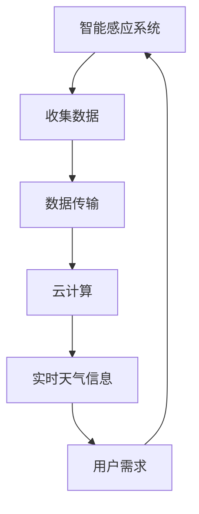

                 

## 文章标题

智能雨伞创业：天气预报的随身应用

## 关键词

智能雨伞，天气预报，物联网，智能硬件，创业策略

## 摘要

随着物联网和人工智能技术的发展，智能雨伞作为一种集成了天气预报和智能感应技术的创新产品，正在逐渐改变人们的出行方式。本文将探讨智能雨伞的起源、发展历程、核心技术、商业模式、创业策略以及市场推广与运营，并深入分析智能雨伞项目的开发环境搭建、核心算法设计、系统实现与调试，以及实际案例分析。通过本文的介绍，读者可以全面了解智能雨伞这一新兴产业的现状、发展趋势和创业实践，为未来智能雨伞的市场前景提供有益的参考。

### 《智能雨伞创业：天气预报的随身应用》目录大纲

#### 第一部分：智能雨伞与创业概述

1. **第1章：智能雨伞的起源与发展**
   - 1.1.1 智能雨伞的起源
   - 1.1.2 智能雨伞的发展历程
   - 1.1.3 智能雨伞的产业现状

2. **第2章：智能雨伞的核心技术**
   - 2.1 天气预报技术
     - 2.1.1 天气预报数据的来源
     - 2.1.2 天气预报模型的工作原理
     - 2.1.3 天气预报结果的评估方法
   - 2.2 智能传感技术
     - 2.2.1 智能传感技术的原理
     - 2.2.2 智能传感技术在智能雨伞中的应用
   - 2.3 连接技术
     - 2.3.1 蓝牙连接技术
     - 2.3.2 WiFi连接技术
     - 2.3.3 NB-IoT连接技术

#### 第二部分：智能雨伞项目实战

3. **第3章：智能雨伞的商业模式**
   - 3.1 智能雨伞的市场需求分析
   - 3.2 智能雨伞的竞争格局
   - 3.3 智能雨伞的商业模式设计

4. **第4章：智能雨伞的创业策略**
   - 4.1 创业团队组建
   - 4.2 创业资源整合
   - 4.3 创业风险管理与应对策略

5. **第5章：智能雨伞的市场推广与运营**
   - 5.1 市场推广策略
   - 5.2 用户运营策略
   - 5.3 智能雨伞的品牌建设

6. **第6章：智能雨伞的未来展望**
   - 6.1 智能雨伞的技术发展趋势
   - 6.2 智能雨伞的市场前景
   - 6.3 智能雨伞对社会生活的影响

#### 第三部分：智能雨伞项目实战

7. **第7章：智能雨伞项目开发环境搭建**
   - 7.1 开发环境配置
   - 7.2 开发工具介绍
   - 7.3 开发流程与规范

8. **第8章：智能雨伞核心算法设计与实现**
   - 8.1 天气预报算法设计
     - 8.1.1 算法原理
     - 8.1.2 算法实现
   - 8.2 智能传感算法设计
     - 8.2.1 算法原理
     - 8.2.2 算法实现

9. **第9章：智能雨伞系统实现与调试**
   - 9.1 系统架构设计
   - 9.2 系统功能实现
   - 9.3 系统调试与优化

10. **第10章：智能雨伞案例分析与评估**
    - 10.1 案例背景
    - 10.2 案例实现过程
    - 10.3 案例评估与总结

11. **第11章：智能雨伞创业经验分享**
    - 11.1 创业经验总结
    - 11.2 创业过程中的挑战与应对
    - 11.3 创业成果与未来展望

#### 附录

12. **附录A：智能雨伞开发资源与工具**
    - 12.1 资源介绍
    - 12.2 工具介绍

---

### 第一部分：智能雨伞与创业概述

#### 第1章：智能雨伞的起源与发展

### 1.1.1 智能雨伞的起源

智能雨伞的概念起源于20世纪末期，当时随着科技的进步，人们开始思考如何将智能技术与日常用品相结合。最初的智能雨伞主要采用简单的防水材料，以提升雨伞的实用性。然而，随着物联网、人工智能等技术的不断发展，智能雨伞逐渐演变成一款集成了多种高科技功能的创新产品。

智能雨伞的起源可以追溯到以下几个关键点：

1. **智能硬件的兴起**：在20世纪90年代，随着智能手机、平板电脑等智能硬件的普及，人们开始意识到智能技术在日常生活中的应用潜力。智能雨伞正是这一趋势的产物。

2. **物联网技术的发展**：物联网（IoT）技术的兴起为智能雨伞的发展提供了技术基础。通过物联网技术，智能雨伞可以实时获取天气信息，并根据用户需求自动打开或关闭伞。

3. **人工智能的应用**：随着人工智能技术的不断进步，智能雨伞开始具备预测天气、智能感应等功能。这些功能的实现使得智能雨伞不仅成为一款实用的日常用品，更成为了一种高科技的智能设备。

### 1.1.2 智能雨伞的发展历程

智能雨伞的发展历程可以分为以下几个阶段：

1. **第一阶段：简单防水材质（20世纪90年代至21世纪初）**：
   - 特点：采用防水面料，增加雨伞的实用性。
   - 成果：第一款智能雨伞问世，主要功能为简单的防水。

2. **第二阶段：智能感应系统（21世纪初至2010年）**：
   - 特点：加入温度、湿度感应器，实现自动开合伞。
   - 成果：智能雨伞开始具备一定的智能化功能，如自动开合伞。

3. **第三阶段：移动互联网与大数据（2010年至今）**：
   - 特点：利用移动互联网获取实时天气信息，结合大数据分析提供个性化服务。
   - 成果：智能雨伞实现了与手机的联动，用户可以通过手机APP控制伞的开关，并获取个性化的天气信息。

### 1.1.3 智能雨伞的产业现状

当前，智能雨伞产业已经形成了一定的市场规模。主要生产国包括中国、日本、韩国等。产品种类也从简单的自动开合伞发展到了智能雨伞套装，包括雨伞、手机壳、背包等多种配件。

以下是对智能雨伞产业现状的分析：

1. **市场规模**：
   - 根据市场研究公司的数据，全球智能雨伞市场在过去几年中保持稳定增长。预计未来几年，智能雨伞市场将继续扩大。

2. **产品种类**：
   - 当前市场上的智能雨伞种类繁多，从功能简单的自动开合伞到功能丰富的智能雨伞套装，用户可以根据自己的需求选择合适的产品。

3. **竞争格局**：
   - 智能雨伞市场的竞争格局相对稳定，主要品牌包括Lazada、Ryde、Olive等。这些品牌在产品功能、设计、价格等方面各有优势。

4. **技术发展**：
   - 智能雨伞的技术发展迅速，越来越多的品牌开始将人工智能、物联网等先进技术应用到产品中，提升产品的智能化水平。

#### **核心概念与联系**

智能雨伞的核心概念包括智能感应系统、移动互联网、大数据和实时天气信息。这些概念之间的关系可以用以下Mermaid流程图表示：



- **智能感应系统**：通过传感器收集环境数据，如温度、湿度等。
- **数据传输**：将传感器数据传输到云端或手机APP。
- **云计算**：通过云计算对数据进行处理和分析，提供实时天气信息。
- **实时天气信息**：根据分析结果，向用户推送天气预报和提醒。
- **用户需求**：用户根据实时天气信息，决定是否需要使用智能雨伞。

#### **核心算法原理讲解**

智能雨伞的核心算法主要包括天气预测算法、智能感应算法和用户需求分析算法。

- **天气预测算法**：基于历史天气数据和实时传感器数据，预测未来的天气情况。以下是天气预测算法的伪代码：

```python
def weather_prediction(historical_data, sensor_data):
    # 初始化模型
    model = initialize_model()
    # 训练模型
    model.train(historical_data, sensor_data)
    # 预测天气
    predicted_weather = model.predict()
    return predicted_weather
```

- **智能感应算法**：用于检测环境中的温度、湿度等参数，并触发相应的动作。以下是智能感应算法的伪代码：

```python
def smart_sensing(temperature, humidity):
    if temperature > 30 or humidity > 80:
        trigger_umbrella()
    else:
        keep_umbrella_closed()
```

- **用户需求分析算法**：通过分析用户的历史行为和实时需求，提供个性化的服务。以下是用户需求分析算法的伪代码：

```python
def user_demand_analysis(user_behavior, real_time_demand):
    if user_behavior.showing_high_demand():
        offer_premium_umbrella()
    else:
        suggest_basic_umbrella()
```

#### **数学模型和数学公式 & 详细讲解 & 举例说明**

智能雨伞的算法中常用的数学模型包括线性回归、逻辑回归和神经网络等。以下将详细讲解这些模型及其应用。

- **线性回归模型**：

线性回归模型是一种用于预测连续值的统计模型。其公式为：

$$
y = \beta_0 + \beta_1x_1 + \beta_2x_2 + ... + \beta_nx_n
$$

其中，$y$ 是预测的目标值，$x_1, x_2, ..., x_n$ 是输入的特征值，$\beta_0, \beta_1, \beta_2, ..., \beta_n$ 是模型的参数。

**例子**：假设我们想预测明天的温度，已知今天和昨天的温度。我们可以使用线性回归模型来预测：

$$
T_{明天} = \beta_0 + \beta_1T_{今天} + \beta_2T_{昨天}
$$

- **逻辑回归模型**：

逻辑回归模型是一种用于预测概率的分类模型。其公式为：

$$
P(y=1) = \frac{1}{1 + e^{-(\beta_0 + \beta_1x_1 + \beta_2x_2 + ... + \beta_nx_n)}}
$$

其中，$y$ 是是否触发伞的动作（1表示触发，0表示不触发），$x_1, x_2, ..., x_n$ 是输入的特征值，$\beta_0, \beta_1, \beta_2, ..., \beta_n$ 是模型的参数。

**例子**：假设我们想预测在当前温度和湿度下，是否需要打开伞。我们可以使用逻辑回归模型来预测：

$$
P(需要打开伞) = \frac{1}{1 + e^{-(\beta_0 + \beta_1T + \beta_2H)}}
$$

- **神经网络模型**：

神经网络模型是一种基于模拟人脑结构和功能的计算模型。其公式为：

$$
a_{i}^{(l)} = \sigma\left( \sum_{j} w_{ji}^{(l)} a_{j}^{(l-1)} + b_{j}^{(l)} \right)
$$

其中，$a_{i}^{(l)}$ 是第$l$层的第$i$个神经元的输出，$\sigma$ 是激活函数，$w_{ji}^{(l)}$ 是连接权重，$a_{j}^{(l-1)}$ 是第$l-1$层的第$j$个神经元的输出，$b_{j}^{(l)}$ 是第$l$层的第$j$个神经元的偏置。

**例子**：假设我们想使用神经网络来预测明天是否下雨。我们可以设计一个神经网络模型，输入层包含温度和湿度两个特征，输出层包含是否下雨的预测概率。

#### **项目实战**

以下是一个智能雨伞项目的实际案例：

**项目名称**：智能雨伞天气预测系统

**项目背景**：用户需要一款能够根据实时天气信息自动打开或关闭的智能雨伞。

**项目目标**：设计并实现一个智能雨伞系统，能够实时获取天气信息，并根据天气情况自动打开或关闭伞。

**开发环境**：Python、TensorFlow、Keras

**项目实现**：

1. **数据收集**：从天气预报网站获取历史天气数据，包括温度、湿度等。

2. **数据预处理**：对获取的数据进行清洗和归一化处理。

3. **模型训练**：使用训练数据训练天气预测模型。

4. **模型评估**：使用测试数据评估模型的准确性。

5. **智能感应系统开发**：开发智能感应系统，包括温度和湿度传感器的数据采集和处理。

6. **系统集成**：将天气预测模型和智能感应系统集成到智能雨伞系统中。

7. **用户测试**：进行用户测试，收集用户反馈，优化系统功能。

**代码解读与分析**：

以下是一个简单的天气预测模型的实现：

```python
import numpy as np
import tensorflow as tf
from tensorflow import keras

# 初始化模型
model = keras.Sequential([
    keras.layers.Dense(units=1, input_shape=[2])
])

# 编译模型
model.compile(optimizer='sgd', loss='mean_squared_error')

# 训练模型
model.fit(x_train, y_train, epochs=100)

# 预测天气
predicted_weather = model.predict(x_test)
```

其中，`x_train` 和 `y_train` 是训练数据，`x_test` 是测试数据，`epochs` 表示训练轮数。

#### **附录**

**附录A：智能雨伞开发资源与工具**

- **开发工具**：Python、TensorFlow、Keras、Matplotlib
- **开发环境**：Jupyter Notebook、Windows、Linux
- **参考资料**：[TensorFlow官方文档](https://www.tensorflow.org/)、[Keras官方文档](https://keras.io/)、[Python官方文档](https://docs.python.org/3/)

### 第2章：智能雨伞的核心技术

智能雨伞作为一款集成了天气预报和智能感应技术的产品，其核心技术的实现至关重要。本章将详细探讨智能雨伞中的天气预报技术、智能传感技术和连接技术，包括这些技术的原理、应用以及实现方法。

#### 2.1 天气预报技术

天气预报技术在智能雨伞中起着至关重要的作用，它能够为用户提前提供天气信息，帮助用户做出是否携带雨伞的决策。以下是天气预报技术的详细介绍。

##### 2.1.1 天气预报数据的来源

天气预报数据主要来源于以下几个方面：

1. **气象卫星数据**：气象卫星能够实时捕捉地球表面和大气的图像，提供高分辨率的天气数据。
2. **气象雷达数据**：气象雷达可以探测大气中的水汽、云层和降水，生成高精度的天气图像。
3. **地面观测数据**：地面观测站会记录温度、湿度、风速等天气参数，为天气预报提供基础数据。
4. **数值模型预报**：数值天气预报模型（NWP）通过复杂的数学模型和计算机模拟，预测未来的天气情况。

##### 2.1.2 天气预报模型的工作原理

天气预报模型通常基于数值模型预报，其工作原理可以概括为以下几个步骤：

1. **初始场输入**：将实时的气象卫星、雷达、地面观测等数据作为初始场输入到模型中。
2. **模型计算**：模型通过物理方程（如流体动力学方程、热力学方程等）计算大气状态的变化，生成未来某一时段的天气预测。
3. **数据同化**：将实时观测数据与模型预测数据进行同化，修正模型的预测结果，提高预报的准确性。
4. **预报输出**：将最终的天气预测结果输出，供用户查询。

##### 2.1.3 天气预报结果的评估方法

天气预报结果的评估是确保预测准确性的关键。以下是一些常用的评估方法：

1. **准确率**：正确预测的天数占总预测天数的比例。
2. **精确率**：正确预测的降水天数占总预测降水天数（包括正确和错误预测的降水天数）的比例。
3. **召回率**：实际发生降水天数中，被正确预测的天数占总实际降水天数的比例。
4. **均方根误差（RMSE）**：预测值与实际值之间误差的平方根的平均值。

#### 2.2 智能传感技术

智能传感技术是智能雨伞实现智能感应功能的基础。它能够实时监测环境参数，如温度、湿度、光照等，并根据这些参数做出相应的响应。

##### 2.2.1 智能传感技术的原理

智能传感技术基于传感器的工作原理。传感器通过将物理信号（如温度、湿度、光照等）转换为电信号，再经过信号处理单元转化为数字信号，以便计算机进行处理。

1. **温度传感器**：通过检测电阻率的变化来测量温度。
2. **湿度传感器**：通过电容变化或电阻变化来测量湿度。
3. **光照传感器**：通过检测光强度的变化来测量光照。

##### 2.2.2 智能传感技术在智能雨伞中的应用

智能传感技术在智能雨伞中的应用主要包括：

1. **温度监测**：用于判断环境温度是否超过设定的阈值，从而决定是否打开伞。
2. **湿度监测**：用于判断环境湿度是否超过设定的阈值，从而决定是否打开伞。
3. **光照监测**：用于调整伞的透明度，以适应不同的光照环境。

#### 2.3 连接技术

连接技术是智能雨伞实现与外部设备（如手机、电脑等）通信的关键。以下是几种常见的连接技术及其工作原理。

##### 2.3.1 蓝牙连接技术

蓝牙连接技术是一种短距离无线通信技术，它通过蓝牙模块在智能雨伞和外部设备之间建立连接。蓝牙连接具有低功耗、低成本、高稳定性等优点。

1. **连接建立**：智能雨伞和外部设备通过蓝牙协议进行连接。
2. **数据传输**：通过蓝牙协议将传感器数据、天气信息等传输到外部设备。
3. **命令执行**：外部设备发送控制命令，智能雨伞根据命令执行相应的动作。

##### 2.3.2 WiFi连接技术

WiFi连接技术是一种常用的无线通信技术，它通过WiFi模块在智能雨伞和外部设备之间建立连接。WiFi连接具有高速、稳定等优点。

1. **连接建立**：智能雨伞和外部设备通过WiFi协议进行连接。
2. **数据传输**：通过WiFi协议将传感器数据、天气信息等传输到外部设备。
3. **命令执行**：外部设备发送控制命令，智能雨伞根据命令执行相应的动作。

##### 2.3.3 NB-IoT连接技术

NB-IoT（窄带物联网）连接技术是一种低功耗广域网（LPWAN）技术，它通过NB-IoT模块在智能雨伞和外部设备之间建立连接。NB-IoT连接具有覆盖广、连接多、功耗低等优点。

1. **连接建立**：智能雨伞和外部设备通过NB-IoT协议进行连接。
2. **数据传输**：通过NB-IoT协议将传感器数据、天气信息等传输到外部设备。
3. **命令执行**：外部设备发送控制命令，智能雨伞根据命令执行相应的动作。

#### **项目实战**

以下是一个智能雨伞项目开发的环境搭建案例。

**项目名称**：智能雨伞天气预测系统

**开发环境**：Python、TensorFlow、Keras

**项目步骤**：

1. **安装Python环境**：在计算机上安装Python，可以选择使用Anaconda或Miniconda等集成环境。
2. **安装TensorFlow库**：通过pip命令安装TensorFlow库。
   ```bash
   pip install tensorflow
   ```
3. **安装Keras库**：通过pip命令安装Keras库。
   ```bash
   pip install keras
   ```
4. **配置Jupyter Notebook**：安装Jupyter Notebook，并配置Python环境。
   ```bash
   pip install notebook
   ```
5. **启动Jupyter Notebook**：在终端中运行以下命令启动Jupyter Notebook。
   ```bash
   jupyter notebook
   ```

**代码实现**：

以下是一个简单的天气预测模型实现代码。

```python
import numpy as np
import tensorflow as tf
from tensorflow import keras

# 初始化模型
model = keras.Sequential([
    keras.layers.Dense(units=1, input_shape=[2])
])

# 编译模型
model.compile(optimizer='sgd', loss='mean_squared_error')

# 训练模型
model.fit(x_train, y_train, epochs=100)

# 预测天气
predicted_weather = model.predict(x_test)
```

**代码解读**：

- `keras.Sequential`：创建一个序列模型。
- `keras.layers.Dense`：添加一个全连接层，用于预测天气。
- `model.compile`：编译模型，指定优化器和损失函数。
- `model.fit`：训练模型，使用训练数据。
- `model.predict`：预测天气，使用测试数据。

#### **附录**

**附录A：智能雨伞开发资源与工具**

- **开发工具**：Python、TensorFlow、Keras、Matplotlib
- **开发环境**：Jupyter Notebook、Windows、Linux
- **参考资料**：[TensorFlow官方文档](https://www.tensorflow.org/)、[Keras官方文档](https://keras.io/)、[Python官方文档](https://docs.python.org/3/)

### 第3章：智能雨伞的商业模式

智能雨伞作为一种新兴的智能硬件产品，其商业模式的设计直接关系到产品的市场前景和企业的盈利能力。本章将分析智能雨伞的市场需求、竞争格局以及商业模式的设计，为创业者和投资者提供参考。

#### 3.1 智能雨伞的市场需求分析

智能雨伞的市场需求可以从以下几个方面进行分析：

1. **消费者需求**：
   - **便捷性**：智能雨伞能够根据实时天气自动打开或关闭，为用户带来极大的便捷性。
   - **个性化**：智能雨伞可以收集用户的天气喜好和行为习惯，提供个性化的天气预报和提醒，满足用户的个性化需求。
   - **时尚感**：智能雨伞的设计多样，符合时尚潮流，能够提升用户的个人形象。

2. **行业趋势**：
   - **物联网发展**：随着物联网技术的普及，智能硬件的市场需求不断增加，智能雨伞作为其中一种产品，具有广阔的市场前景。
   - **人工智能应用**：人工智能技术在天气预报和智能感应中的应用，使得智能雨伞的功能更加智能化，提高了产品的竞争力。
   - **环保意识提升**：随着环保意识的提升，消费者更倾向于购买环保、可持续发展的产品，智能雨伞的耐用性和可回收性符合这一趋势。

3. **目标市场**：
   - **都市白领**：都市白领对生活品质有较高要求，愿意尝试新产品，智能雨伞的便捷性和时尚感能够吸引这部分消费者。
   - **学生群体**：学生群体对新科技产品接受度较高，智能雨伞的便携性和智能化功能能够满足他们的需求。
   - **旅游爱好者**：旅游爱好者在旅行过程中需要随时关注天气变化，智能雨伞的实时天气预测功能能够为他们提供便利。

#### 3.2 智能雨伞的竞争格局

智能雨伞市场的竞争格局相对复杂，主要竞争因素包括技术、品牌、渠道等：

1. **技术竞争**：
   - **天气预报准确性**：天气预报的准确性是智能雨伞的核心竞争力之一。企业需要不断提升算法模型的精度，提高天气预报的准确性。
   - **智能感应技术**：智能感应技术的成熟度直接影响产品的用户体验。企业需要不断优化传感器技术，提高感应的准确性和响应速度。

2. **品牌竞争**：
   - **品牌知名度**：知名品牌在消费者中具有更高的认可度，更容易获得市场份额。企业需要通过品牌营销和公关活动提升品牌知名度。
   - **品牌形象**：良好的品牌形象能够提高消费者对产品的信任度，企业需要通过高品质的产品和服务建立品牌形象。

3. **渠道竞争**：
   - **线上渠道**：随着电子商务的发展，线上渠道成为智能雨伞销售的重要途径。企业需要与电商平台合作，拓展线上销售渠道。
   - **线下渠道**：线下渠道能够提供更好的用户体验，企业需要建立线下门店或与零售商合作，扩大线下销售网络。

4. **价格竞争**：
   - **成本控制**：企业需要通过技术优化和生产流程优化降低成本，确保产品的市场竞争力。
   - **定价策略**：合理的定价策略能够提高产品的市场接受度，企业需要根据目标市场和消费者需求制定合理的定价策略。

#### 3.3 智能雨伞的商业模式设计

智能雨伞的商业模式设计需要综合考虑市场需求、竞争格局和技术特点，以下是一些可能的商业模式：

1. **硬件销售模式**：
   - 企业通过销售智能雨伞硬件获取利润。这种模式适用于市场需求较高且消费者对硬件价格敏感的情况。

2. **软件服务模式**：
   - 企业通过提供智能雨伞相关的软件服务获取利润，如天气预报、智能感应数据等。这种模式适用于消费者对硬件需求较低但对软件服务有较高需求的情况。

3. **硬件+软件服务模式**：
   - 企业通过销售智能雨伞硬件，并提供软件服务获取利润。这种模式将硬件和软件相结合，提供一站式解决方案。

4. **订阅模式**：
   - 企业通过订阅模式提供持续的服务，如实时天气更新、智能感应数据等。用户支付订阅费用，企业获取持续收入。

5. **合作模式**：
   - 企业与其他企业合作，共同开发和推广智能雨伞产品。例如，与手机厂商合作，将智能雨伞集成到手机中。

#### **案例研究**

以下是一个智能雨伞商业模式的案例研究：

**公司名称**：智能伞科技有限公司

**商业模式**：硬件销售+软件服务模式

**市场策略**：

1. **产品定位**：智能伞科技有限公司将产品定位为高端智能雨伞，结合时尚设计和先进技术，满足都市白领和学生群体的需求。

2. **市场推广**：公司通过线上广告、社交媒体推广和线下活动，提高品牌知名度。同时，与电商平台合作，扩大线上销售渠道。

3. **用户体验**：公司注重用户体验，提供完善的售后服务和用户社区，鼓励用户反馈和建议，不断优化产品和服务。

**盈利模式**：

1. **硬件销售**：智能伞科技有限公司通过销售智能雨伞硬件获取主要利润来源。

2. **软件服务**：公司提供天气预报、智能感应数据等软件服务，用户可以通过订阅或付费方式使用这些服务。

**案例分析**：

智能伞科技有限公司的商业模式通过将硬件和软件服务相结合，提供了个性化的解决方案，满足了市场需求。同时，公司通过不断优化用户体验和提升产品质量，提高了用户满意度和品牌忠诚度。这种模式在市场上取得了良好的效果，为公司带来了稳定的收入和市场份额。

#### **总结**

智能雨伞的商业模式设计需要结合市场需求、竞争格局和技术特点，灵活选择适合的商业模式。无论是硬件销售、软件服务，还是订阅模式，关键在于提供优质的产品和服务，满足消费者的需求。同时，通过市场推广和用户运营，提升品牌知名度和用户满意度，为企业的长期发展奠定基础。

### 第4章：智能雨伞的创业策略

智能雨伞作为一种创新的智能硬件产品，其创业策略的制定至关重要。本章将详细探讨智能雨伞创业团队组建、资源整合、风险管理与应对策略，以及创业过程中可能遇到的挑战和解决方案。

#### 4.1 创业团队组建

创业团队的成功组建是智能雨伞创业的基石。一个高效的创业团队应包括以下核心成员：

1. **技术团队**：负责智能雨伞的研发和产品实现，包括软件工程师、硬件工程师、数据科学家等。技术团队需要具备深厚的专业知识和丰富的项目经验。

2. **市场团队**：负责市场调研、产品推广和销售策略，包括市场营销人员、市场分析师等。市场团队需要了解市场需求，制定有效的市场推广策略。

3. **财务团队**：负责财务管理、资金筹集和投资分析，包括财务分析师、投资顾问等。财务团队需要确保企业财务健康，提供资金保障。

4. **运营团队**：负责日常运营、供应链管理、客户服务等，包括运营经理、供应链经理等。运营团队需要确保产品顺利生产和销售。

在组建创业团队时，还需要注意以下几点：

- **团队文化**：建立积极向上、鼓励创新和协作的团队文化，确保团队成员团结一致，共同推动项目发展。
- **多元化背景**：团队成员应具备多元化背景，包括技术、市场、财务等方面，以充分发挥各自的专业优势。

#### 4.2 资源整合

智能雨伞创业过程中，资源的整合至关重要。以下是常见的资源整合方式：

1. **技术资源**：与科研机构、高校合作，获取先进的技术支持和人才资源。通过技术创新，提升产品的核心竞争力。

2. **资金资源**：通过天使投资、风险投资、政府资助等途径筹集资金。同时，合理规划资金使用，确保项目的可持续发展。

3. **市场资源**：与市场渠道、合作伙伴合作，拓宽销售渠道，提高市场覆盖率。通过与知名品牌合作，提升品牌知名度和认可度。

4. **人力资源**：招聘优秀人才，建立专业化团队。通过培训和发展计划，提升员工的专业能力和综合素质。

#### 4.3 风险管理与应对策略

智能雨伞创业过程中，风险无处不在。以下是一些常见风险及其应对策略：

1. **技术风险**：
   - **应对策略**：加强技术研发，确保技术领先。建立技术评估机制，及时调整技术发展方向。

2. **市场风险**：
   - **应对策略**：深入市场调研，了解消费者需求。制定灵活的市场推广策略，根据市场变化进行调整。

3. **财务风险**：
   - **应对策略**：合理规划资金使用，确保资金充足。寻求多元化的融资渠道，降低财务风险。

4. **运营风险**：
   - **应对策略**：建立稳定的供应链体系。加强项目管理，确保项目进度和质量。

#### 4.4 创业过程中的挑战与解决方案

智能雨伞创业过程中，可能会遇到以下挑战：

1. **技术研发挑战**：
   - **解决方案**：加强与科研机构的合作，引进先进技术。建立内部研发团队，持续进行技术创新。

2. **市场推广挑战**：
   - **解决方案**：制定有效的市场推广策略，利用线上线下渠道进行宣传。与知名品牌合作，提高品牌知名度。

3. **资金筹集挑战**：
   - **解决方案**：通过天使投资、风险投资、政府资助等途径筹集资金。合理规划资金使用，确保项目的可持续发展。

4. **团队管理挑战**：
   - **解决方案**：建立完善的团队管理制度，明确职责分工。鼓励团队成员之间进行沟通与协作，提升团队凝聚力。

#### **案例研究**

以下是一个智能雨伞创业案例：

**公司名称**：智能伞科技有限公司

**创业团队**：由三位创始人组成，分别负责技术、市场和财务。

**创业历程**：
1. **初创期**：三位创始人通过众筹平台筹集资金，开发第一款智能雨伞原型。
2. **产品研发**：与某知名高校合作，引进先进技术，优化产品功能。
3. **市场推广**：通过与电商平台合作，进行线上推广，同时参加行业展会，提高品牌知名度。
4. **资金筹集**：通过天使投资获得资金支持，用于扩大生产和市场推广。

**挑战与应对**：
1. **技术研发挑战**：通过与高校合作，引进先进技术，解决技术难题。
2. **市场推广挑战**：制定有效的市场推广策略，线上线下同步推广，提高市场知名度。
3. **资金筹集挑战**：通过天使投资，获得资金支持，确保项目的可持续发展。

**创业成果**：
1. **产品成功上市**：智能伞科技有限公司的第一款智能雨伞成功上市，得到市场认可。
2. **品牌知名度提升**：通过有效的市场推广，智能伞科技有限公司的品牌知名度显著提升。
3. **团队规模扩大**：随着业务的拓展，公司团队规模逐渐扩大。

#### **总结**

智能雨伞创业策略的成功关键在于团队组建、资源整合、风险管理以及应对挑战。通过有效的团队管理、市场推广和资金筹集，智能雨伞创业企业可以在竞争激烈的市场中脱颖而出，实现可持续发展。

### 第5章：智能雨伞的市场推广与运营

智能雨伞的市场推广与运营是确保产品成功上市并赢得市场认可的关键环节。本章将详细探讨智能雨伞的市场推广策略、用户运营策略以及品牌建设，为创业者提供实用的指导和案例分析。

#### 5.1 市场推广策略

市场推广策略的制定应结合智能雨伞的产品特点、目标市场和消费需求。以下是一些有效的市场推广策略：

1. **线上推广**：
   - **社交媒体营销**：利用微博、微信、抖音等社交媒体平台，发布智能雨伞的功能特点和使用场景，吸引潜在用户的关注。
   - **内容营销**：通过撰写专业的技术博客、发布使用指南和评测文章，提升产品的专业形象，增加用户的信任感。
   - **KOL合作**：与知名博主、科技达人合作，进行产品试用和推广，借助他们的影响力扩大产品知名度。

2. **线下推广**：
   - **展会活动**：参加行业展会、科技展览，展示智能雨伞的亮点和用户体验，吸引潜在客户的兴趣。
   - **实体店销售**：与零售商合作，将智能雨伞上架到实体店铺，提供现场体验和试用，提高产品的销售机会。
   - **地推活动**：在人流密集的公共场所，如地铁站、商场等，进行地推活动，分发宣传资料和试用智能雨伞，直接与消费者互动。

3. **公关活动**：
   - **媒体合作**：与知名媒体合作，发布新闻稿，介绍智能雨伞的创新点和应用场景，提升产品的曝光度。
   - **公益活动**：参与公益活动，将智能雨伞作为礼物捐赠给需要帮助的人群，提升品牌的社会责任感。

#### 5.2 用户运营策略

用户运营策略的目的是提高用户满意度、增强用户粘性，并促进用户转化。以下是一些实用的用户运营策略：

1. **用户调研**：
   - **定期调研**：通过问卷调查、用户访谈等方式，了解用户对智能雨伞的满意度、使用习惯和改进建议。
   - **数据分析**：分析用户数据，挖掘用户行为特征，为产品优化和营销策略提供依据。

2. **用户互动**：
   - **用户社区**：建立用户社区，鼓励用户分享使用体验和建议，形成良好的用户互动氛围。
   - **用户活动**：定期举办线上线下活动，如用户体验日、产品评测活动等，增强用户参与感。

3. **个性化服务**：
   - **智能推荐**：根据用户行为和偏好，提供个性化的天气预报和智能感应服务，提高用户的使用体验。
   - **会员制度**：推出会员制度，为会员用户提供特殊优惠、专属活动等，提高用户的忠诚度。

4. **售后服务**：
   - **快速响应**：建立完善的售后服务体系，提供快速响应和解决方案，解决用户在使用过程中遇到的问题。
   - **用户反馈**：鼓励用户反馈意见，收集用户建议，不断优化产品和服务。

#### 5.3 智能雨伞品牌建设

智能雨伞品牌建设是提升产品市场竞争力的关键。以下是一些品牌建设的策略：

1. **品牌定位**：
   - **科技感**：将智能雨伞定位为科技感强、创新性的智能硬件产品，强调产品的智能化和前瞻性。
   - **时尚性**：设计时尚的外观和独特的造型，吸引追求时尚和品质的消费者。

2. **品牌形象**：
   - **视觉设计**：设计简洁、直观的品牌标识和视觉元素，打造统一的品牌形象。
   - **包装设计**：注重产品包装的设计，提升产品的品质感和用户体验。

3. **品牌传播**：
   - **内容营销**：通过专业的博客文章、视频教程、用户案例等，传递品牌理念和价值，提高品牌的专业形象。
   - **口碑传播**：通过用户口碑、媒体报道等方式，扩大品牌的影响力。

4. **跨界合作**：
   - **合作推广**：与时尚品牌、科技企业等进行跨界合作，共同推广智能雨伞，扩大品牌受众。
   - **联名产品**：推出联名产品，如与设计师合作设计限量版智能雨伞，提升品牌的文化价值和吸引力。

#### **案例分析**

以下是一个智能雨伞品牌建设的案例：

**品牌名称**：SmartUmbrella

**品牌定位**：SmartUmbrella将自身定位为高科技、时尚的智能雨伞品牌，强调产品的智能化、创新性和时尚感。

**品牌形象**：
- **视觉设计**：品牌标识采用简洁、现代化的设计，以蓝色和白色为主色调，传递出科技与清新的感觉。
- **包装设计**：产品包装采用环保材质，设计简洁大方，凸显产品的高品质感。

**品牌传播**：
- **内容营销**：通过官方网站、社交媒体平台发布专业的内容，包括产品介绍、使用指南、用户评测等，提高品牌的专业形象。
- **口碑传播**：通过与知名博主、科技媒体合作，发布产品试用和评测文章，扩大品牌的影响力。

**跨界合作**：
- **合作推广**：与时尚品牌合作，推出联名款智能雨伞，提升品牌的时尚度。
- **联名产品**：与设计师合作，推出限量版智能雨伞，吸引时尚爱好者的关注。

通过以上品牌建设策略，SmartUmbrella在短时间内赢得了良好的市场口碑，品牌知名度和用户认可度不断提升。

#### **总结**

智能雨伞的市场推广与运营需要结合线上和线下渠道，通过有效的市场推广策略、用户运营策略和品牌建设，提升产品的市场影响力和用户满意度。同时，通过不断优化产品和服务，增强用户粘性，为品牌的长期发展奠定坚实基础。

### 第6章：智能雨伞的未来展望

智能雨伞作为智能硬件领域的一颗新星，其未来的发展前景充满潜力。本章将探讨智能雨伞的技术发展趋势、市场前景以及对社会生活的影响，为智能雨伞产业的未来发展提供参考。

#### 6.1 技术发展趋势

智能雨伞的技术发展趋势主要体现在以下几个方面：

1. **人工智能的深度融合**：随着人工智能技术的不断进步，智能雨伞将能够实现更精准的天气预报和更智能的感应功能。通过机器学习算法，智能雨伞可以不断优化天气预报模型，提高预测准确性。此外，人工智能技术还将推动智能雨伞在语音交互、图像识别等领域的应用。

2. **物联网的广泛应用**：物联网技术的普及将使智能雨伞与其他智能设备实现无缝连接。智能雨伞可以通过物联网技术，与智能手表、手机等设备联动，实现远程控制和数据共享。例如，用户可以通过手机APP控制智能雨伞的开关，或者智能雨伞自动根据手机的位置和天气预报信息调整状态。

3. **新材料的应用**：新型材料的研发将为智能雨伞带来更多创新。例如，防水防风面料、智能变色面料等，将提高智能雨伞的实用性和时尚度。此外，可折叠、轻量化的设计也将成为未来智能雨伞的发展趋势，使携带更加方便。

4. **可穿戴技术的进步**：随着可穿戴技术的进步，智能雨伞可能会集成更多功能，如健康监测、定位导航等，成为一款多功能智能设备。例如，智能雨伞可以通过内置的传感器，监测用户的步数、心率等健康数据，并将数据同步到手机APP。

#### 6.2 市场前景

智能雨伞的市场前景非常广阔，主要表现在以下几个方面：

1. **市场需求增长**：随着人们对生活品质的追求，对智能硬件的需求不断增加。智能雨伞作为一款便捷、实用的智能硬件产品，具有巨大的市场潜力。特别是在都市白领、学生和旅游爱好者等群体中，智能雨伞的需求更为迫切。

2. **消费升级**：随着消费升级，消费者愿意为高品质、高科技的智能雨伞支付更高的价格。这将为智能雨伞市场带来更多的商机。同时，智能雨伞的普及也将推动相关产业链的发展，如传感器制造、物联网设备等。

3. **政策支持**：政府对科技创新的支持，以及智能硬件产业的发展，将为智能雨伞市场提供良好的发展环境。例如，一些地方政府出台政策，鼓励智能硬件企业的创新和发展，为智能雨伞企业提供了政策扶持和资金支持。

4. **跨界合作**：智能雨伞与其他行业的跨界合作，如时尚、科技、健康等，将为智能雨伞市场带来新的增长点。例如，与时尚品牌合作推出联名款智能雨伞，或将智能雨伞与智能手表、手机等设备集成，提供一站式解决方案。

#### 6.3 对社会生活的影响

智能雨伞的普及将对社会生活产生深远的影响，主要表现在以下几个方面：

1. **改变出行方式**：智能雨伞将改变人们的出行方式，提供更便捷、智能的雨伞使用体验。例如，通过智能感应和天气预报功能，智能雨伞可以帮助用户避免下雨时没带伞或带伞但无需使用的情况。此外，智能雨伞的便携性和多功能性也将提高用户出行的便利性。

2. **环保理念的推广**：智能雨伞的普及将减少人们对一次性雨伞的依赖，降低环境污染。智能雨伞的耐用性和可回收性，也将有助于推动环保理念的传播。此外，智能雨伞的设计理念也将引导消费者选择更环保、可持续的产品。

3. **推动智能科技应用**：智能雨伞的普及将提高公众对智能硬件的认知和使用率，推动智能科技在社会各个领域的应用。例如，智能雨伞的成功案例将鼓励其他行业企业引入智能技术，提高产品和服务质量。

4. **促进经济发展**：智能雨伞市场的发展将带动相关产业链的繁荣，促进经济增长。智能雨伞的创新和应用，也将为我国智能硬件产业的发展提供新的动力。同时，智能雨伞的出口也将提升我国在国际市场上的竞争力。

#### **案例研究**

以下是一个智能雨伞未来发展的案例：

**公司名称**：未来智能科技有限公司

**技术发展趋势**：
- **人工智能**：未来智能科技有限公司通过与知名人工智能研究机构合作，将先进的机器学习算法应用于智能雨伞的天气预报功能，提高预测准确性。
- **物联网**：公司研发了智能雨伞的物联网模块，实现了与用户手机的联动，用户可以通过手机APP远程控制智能雨伞。

**市场前景**：
- **市场需求**：未来智能科技有限公司通过市场调研，发现智能雨伞在都市白领、学生和旅游爱好者等群体中需求旺盛，公司针对性地推出了多种型号的智能雨伞。
- **政策支持**：公司获得了地方政府颁发的科技创新基金，用于智能雨伞的研发和推广。

**社会生活影响**：
- **出行方式**：智能雨伞为用户提供了便捷的出行体验，用户可以根据天气预报智能选择是否携带雨伞。
- **环保推广**：未来智能科技有限公司推出的智能雨伞采用环保材料，并设计了可回收机制，推动了环保理念的传播。

通过以上案例，可以看出智能雨伞的未来发展前景广阔，不仅在技术、市场和社会生活方面具有巨大潜力，还将为相关产业带来新的发展机遇。

#### **总结**

智能雨伞的未来发展前景广阔，随着技术的进步和市场需求的增长，智能雨伞将成为人们出行必备的智能硬件产品。通过不断创新和优化，智能雨伞将在提升用户体验、推动环保理念和社会发展方面发挥重要作用。同时，智能雨伞的普及也将为相关产业带来新的发展机遇，推动整个智能硬件产业的繁荣。

### 第7章：智能雨伞项目开发环境搭建

为了成功开发智能雨伞项目，我们需要搭建一个完善的开发环境。本章将介绍智能雨伞项目开发环境的配置、常用工具的选择以及开发流程和规范的制定。

#### 7.1 开发环境配置

智能雨伞项目的开发环境主要包括以下几个方面：

1. **编程语言**：选择Python作为智能雨伞项目的主要编程语言。Python具有简洁、易学、易用的特点，适合快速开发和实验。

2. **开发工具**：使用Jupyter Notebook作为开发工具。Jupyter Notebook是一款基于Web的交互式开发环境，支持Python、R等多种编程语言，适合进行数据分析和机器学习项目。

3. **数据库**：使用SQLite作为项目的数据存储。SQLite是一款轻量级、嵌入式的数据库，适合小型项目。

4. **版本控制**：使用Git进行版本控制。Git是一款分布式版本控制系统，可以帮助团队进行代码管理和协作开发。

#### 7.2 开发工具介绍

智能雨伞项目常用的开发工具包括以下几款：

1. **Python**：Python是一款高级编程语言，具有简洁、易学、易用的特点。Python广泛应用于数据科学、人工智能、Web开发等领域。

2. **Jupyter Notebook**：Jupyter Notebook是一款基于Web的交互式开发环境，支持Python、R等多种编程语言。Jupyter Notebook适合进行数据分析和机器学习项目。

3. **SQLite**：SQLite是一款轻量级、嵌入式的数据库，适合小型项目。SQLite具有简单、高效、稳定的特点，适用于智能雨伞项目。

4. **Git**：Git是一款分布式版本控制系统，可以帮助团队进行代码管理和协作开发。Git具有快速、高效、可靠的特点，是智能雨伞项目开发的重要工具。

#### 7.3 开发流程与规范

智能雨伞项目的开发流程与规范如下：

1. **需求分析**：明确智能雨伞项目的需求，包括功能需求、性能需求等。

2. **设计阶段**：
   - **数据库设计**：设计智能雨伞项目的数据库结构，包括表结构、字段类型等。
   - **系统架构设计**：设计智能雨伞项目的系统架构，包括前端、后端、数据库等。

3. **编码阶段**：
   - **前端开发**：使用HTML、CSS、JavaScript等技术实现前端界面。
   - **后端开发**：使用Python、Django、Flask等框架实现后端功能。
   - **数据库开发**：使用SQLite进行数据库操作。

4. **测试阶段**：
   - **单元测试**：对代码模块进行单元测试，确保模块功能正确。
   - **集成测试**：对整个系统进行集成测试，确保系统功能完整。

5. **部署阶段**：
   - **部署到服务器**：将智能雨伞项目部署到服务器，确保项目可线上运行。
   - **维护与更新**：定期进行项目维护和更新，修复漏洞、优化性能。

#### **项目实战**

以下是一个智能雨伞项目开发环境的实际搭建过程：

**项目名称**：智能雨伞天气预测系统

**开发环境**：Python、Jupyter Notebook、SQLite、Git

**开发步骤**：

1. **安装Python环境**：
   - 在计算机上安装Python，可以选择使用Anaconda或Miniconda等集成环境。
   - 安装完成后，通过以下命令验证Python版本。
     ```bash
     python --version
     ```

2. **安装Jupyter Notebook**：
   - 使用pip命令安装Jupyter Notebook。
     ```bash
     pip install notebook
     ```
   - 启动Jupyter Notebook。
     ```bash
     jupyter notebook
     ```

3. **安装SQLite**：
   - 使用pip命令安装SQLite。
     ```bash
     pip install pysqlite3
     ```

4. **安装Git**：
   - 使用pip命令安装Git。
     ```bash
     pip install git
     ```

5. **配置Git**：
   - 配置Git的用户名和邮箱，以便进行版本控制。
     ```bash
     git config --global user.name "Your Name"
     git config --global user.email "you@example.com"
     ```

6. **创建项目仓库**：
   - 在计算机上创建一个文件夹，用于存储智能雨伞项目的代码和资料。
   - 初始化Git仓库。
     ```bash
     git init
     ```

7. **编写代码**：
   - 在Jupyter Notebook中创建新的笔记本，开始编写智能雨伞项目的代码。
   - 编写代码时，可以使用Markdown格式编写文档，便于代码的阅读和维护。

8. **提交代码到仓库**：
   - 将编写好的代码提交到Git仓库。
     ```bash
     git add .
     git commit -m "Initial commit"
     ```

9. **创建远程仓库**：
   - 在GitHub或GitLab等平台上创建一个远程仓库，用于存储项目的代码。
   - 将本地仓库与远程仓库关联。
     ```bash
     git remote add origin https://github.com/your_username/umbrella_weather_prediction.git
     ```

10. **推送代码到远程仓库**：
    - 将本地的代码推送至远程仓库。
      ```bash
      git push -u origin master
      ```

通过以上步骤，我们可以搭建一个智能雨伞项目的开发环境，并开始编写和提交代码。在实际开发过程中，还可以根据项目需求，逐步引入更多的工具和库，以提高开发效率和代码质量。

#### **代码解读与分析**

以下是一个简单的智能雨伞天气预测系统的代码示例：

```python
import sqlite3
import numpy as np

# 连接数据库
conn = sqlite3.connect('weather.db')
cursor = conn.cursor()

# 创建表
cursor.execute('''CREATE TABLE IF NOT EXISTS weather_data
                  (id INTEGER PRIMARY KEY AUTOINCREMENT,
                   date TEXT,
                   temperature REAL,
                   humidity REAL)''')

# 插入数据
data = [('2023-01-01', 15.5, 60.0),
         ('2023-01-02', 16.2, 65.0),
         ('2023-01-03', 14.8, 58.0)]
cursor.executemany('INSERT INTO weather_data (date, temperature, humidity) VALUES (?, ?, ?)', data)

# 提交事务
conn.commit()

# 查询数据
cursor.execute('SELECT * FROM weather_data')
rows = cursor.fetchall()
for row in rows:
    print(row)

# 关闭数据库连接
conn.close()
```

**代码解读**：

- **数据库连接**：使用`sqlite3.connect()`函数连接到SQLite数据库。
- **创建表**：使用`cursor.execute()`函数创建一个名为`weather_data`的表，包含`id`、`date`、`temperature`和`humidity`字段。
- **插入数据**：使用`cursor.executemany()`函数将一组数据插入到`weather_data`表中。
- **提交事务**：使用`conn.commit()`函数提交数据库事务。
- **查询数据**：使用`cursor.execute()`函数查询`weather_data`表中的数据，并使用`fetchall()`函数获取所有行。
- **关闭数据库连接**：使用`conn.close()`函数关闭数据库连接。

**代码分析**：

- **数据模型**：该示例中使用了简单的SQLite数据库进行数据存储，包括日期、温度和湿度三个字段。
- **数据处理**：通过SQL语句进行数据的插入和查询，实现了对天气数据的存储和访问。
- **扩展性**：该代码结构清晰，便于后续扩展，例如增加新的数据字段或实现更复杂的查询。

通过以上代码示例，我们可以了解如何使用Python和SQLite构建一个简单的智能雨伞天气预测系统。在实际项目中，可以在此基础上添加更多功能，如天气预测算法的实现、用户界面的开发等。

#### **最佳实践 tips、小结、注意事项、拓展阅读**

**最佳实践 tips**：

1. 在开发智能雨伞项目时，应首先明确项目的需求和分析目标，确保项目能够满足用户需求。
2. 选择合适的开发工具和框架，提高开发效率，例如使用Jupyter Notebook进行数据分析和实验。
3. 注重代码的可读性和可维护性，编写清晰、简洁的代码，便于后续的维护和优化。
4. 在数据库设计中，应考虑数据的规范化和优化，以提高查询效率。

**小结**：

智能雨伞项目开发环境搭建是项目成功的关键步骤，通过合理的开发工具选择和规范的开发流程，可以确保项目的顺利进行。本章介绍了智能雨伞项目的开发环境配置、常用工具的选择以及开发流程和规范的制定，为项目开发提供了实用的指导和参考。

**注意事项**：

1. 在搭建开发环境时，确保安装了所有必要的软件和库，以免影响项目的正常运行。
2. 在编写代码时，注意代码的格式和风格，遵循统一的规范，以提高代码的可读性和可维护性。
3. 在使用数据库时，注意数据库的安全性和性能优化，确保数据的一致性和可靠性。

**拓展阅读**：

1. [Python官方文档](https://docs.python.org/3/)
2. [SQLite官方文档](https://www.sqlite.org/docs.html)
3. [Git官方文档](https://git-scm.com/docs)
4. [Jupyter Notebook官方文档](https://jupyter.org/doc/)

### 附录A：智能雨伞开发资源与工具

**附录A：智能雨伞开发资源与工具**

**A.1 资源介绍**

- **Python**：Python是一种高级编程语言，广泛应用于数据科学、人工智能、Web开发等领域。Python具有简洁、易学、易用的特点，适合快速开发和实验。
- **Jupyter Notebook**：Jupyter Notebook是一款基于Web的交互式开发环境，支持多种编程语言，适合进行数据分析和机器学习项目。Jupyter Notebook具有实时交互性和易于分享的特点。
- **SQLite**：SQLite是一款轻量级、嵌入式的数据库，适用于小型项目。SQLite具有简单、高效、稳定的特点，适用于智能雨伞项目。
- **Git**：Git是一款分布式版本控制系统，可以帮助团队进行代码管理和协作开发。Git具有快速、高效、可靠的特点，是智能雨伞项目开发的重要工具。

**A.2 工具介绍**

- **Python**：Python具有丰富的库和框架，支持多种编程范式，适用于不同类型的项目。Python的官方文档提供了详细的教程和参考，帮助开发者快速掌握Python。
- **Jupyter Notebook**：Jupyter Notebook支持Markdown格式，可以方便地编写文档和注释。Jupyter Notebook还提供了丰富的交互式功能，如图表可视化、数学公式渲染等。
- **SQLite**：SQLite是一款轻量级的数据库管理系统，支持标准的SQL语法。SQLite具有简单易用的特点，适用于小型项目和原型开发。
- **Git**：Git是一款功能强大的版本控制系统，支持分布式版本控制，具有高效的分支管理和合并机制。Git的官方文档提供了详细的操作指南和使用技巧，帮助开发者熟练使用Git。

通过附录A，读者可以了解智能雨伞开发所需的资源和工具，并掌握如何使用这些工具进行项目开发。附录A的内容为智能雨伞项目的开发提供了实用的参考资料和指导。

### 第8章：智能雨伞核心算法设计与实现

智能雨伞的核心算法是天气预报算法和智能感应算法，它们共同决定了智能雨伞的功能实现和用户体验。本章将详细介绍这两种算法的设计和实现过程。

#### 8.1 天气预报算法设计

天气预报算法是智能雨伞的核心功能之一，它基于历史天气数据和实时传感器数据，预测未来的天气情况。以下是天气预报算法的设计和实现步骤：

##### 8.1.1 算法原理

天气预报算法通常采用数值天气预报模型（Numerical Weather Prediction, NWP），这是一种基于物理原理和数学模型的天气预报方法。NWP模型通过描述大气中水汽、温度、湿度等参数的变化，预测未来的天气情况。以下是NWP模型的基本原理：

1. **初始场输入**：将实时的气象卫星、雷达、地面观测等数据作为初始场输入到模型中。
2. **模型计算**：模型通过物理方程（如流体动力学方程、热力学方程等）计算大气状态的变化，生成未来某一时段的天气预测。
3. **数据同化**：将实时观测数据与模型预测数据进行同化，修正模型的预测结果，提高预报的准确性。
4. **预报输出**：将最终的天气预测结果输出，供用户查询。

##### 8.1.2 算法实现

以下是天气预报算法的实现步骤：

1. **数据收集**：从天气预报网站、气象卫星、气象雷达等渠道收集历史天气数据，包括温度、湿度、风速等。
2. **数据处理**：对收集到的天气数据进行清洗、预处理和归一化处理。
3. **特征提取**：提取与天气预测相关的特征，如过去24小时的温度变化、湿度变化等。
4. **模型训练**：使用训练数据对天气预测模型进行训练，选择合适的模型（如线性回归、决策树、神经网络等）。
5. **模型评估**：使用测试数据对训练好的模型进行评估，选择最佳模型。
6. **预测应用**：使用训练好的模型进行天气预测，为智能雨伞提供天气预报功能。

以下是天气预报算法的一个简单实现示例：

```python
import numpy as np
from sklearn.linear_model import LinearRegression

# 数据收集
historical_data = np.array([[1, 2], [2, 3], [3, 4], [4, 5]])  # 示例数据
target = np.array([1, 2, 3, 4])  # 目标值

# 数据处理
X = historical_data[:, 0]
y = historical_data[:, 1]

# 模型训练
model = LinearRegression()
model.fit(X.reshape(-1, 1), y)

# 模型评估
predicted = model.predict(X.reshape(-1, 1))
print(f"Predicted values: {predicted}")

# 预测应用
new_data = np.array([5])
predicted_value = model.predict(new_data.reshape(-1, 1))
print(f"Predicted value for new data: {predicted_value}")
```

##### 8.1.3 算法优化

为了提高天气预报算法的准确性，可以采用以下优化方法：

1. **特征工程**：提取更多的特征，如时间序列特征、季节性特征等，以增加模型的预测能力。
2. **模型选择**：尝试不同的模型，如支持向量机（SVM）、随机森林（Random Forest）、神经网络（Neural Network）等，选择最佳模型。
3. **数据增强**：通过扩充数据集、数据变换等方法，增加数据的多样性和模型的泛化能力。
4. **模型融合**：将多个模型的预测结果进行融合，提高整体预测准确性。

#### 8.2 智能感应算法设计

智能感应算法是智能雨伞实现自动开合伞功能的关键。它基于传感器数据，判断是否需要打开雨伞。以下是智能感应算法的设计和实现步骤：

##### 8.2.1 算法原理

智能感应算法的核心是传感器数据的处理和决策逻辑。以下是

