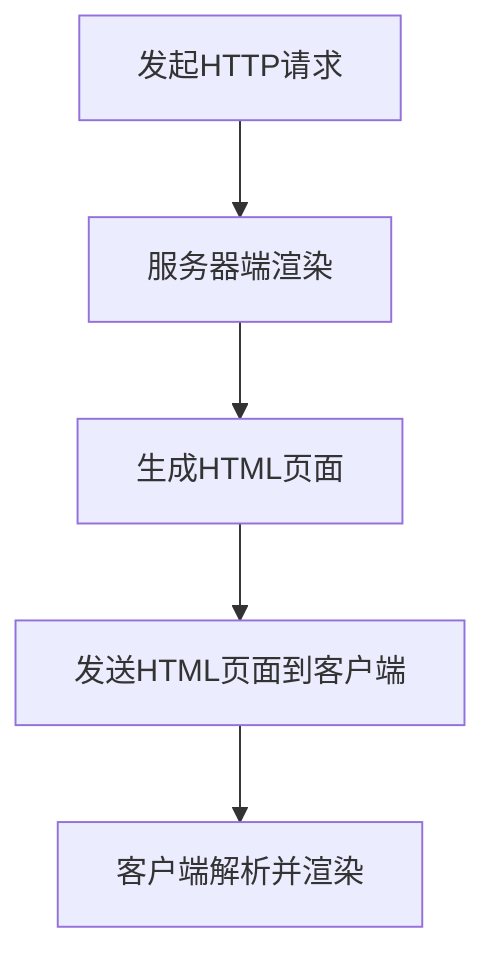
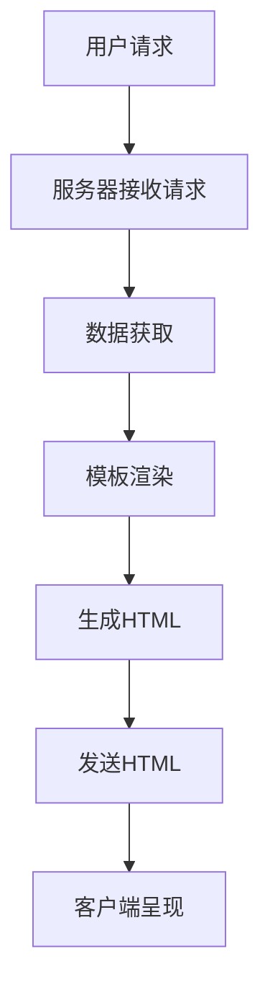

                 

### 文章标题

### 服务器端渲染（SSR）：提升首屏加载速度

### 关键词

- 服务器端渲染
- 首屏加载速度
- 性能优化
- 资源预加载
- 代码分割
- 懒加载
- 缓存策略

### 摘要

本文旨在深入探讨服务器端渲染（SSR）的概念、优势以及如何在实际项目中应用和优化。我们将从基础概念入手，逐步介绍SSR的技术架构、性能优化策略以及应用实战。文章还将探讨SSR与PWA的结合以及未来的发展趋势，为读者提供一个全面的技术指南。

### 目录大纲设计

#### 第一部分：SSR基础概念

##### 第1章：SSR概述

- 1.1 SSR的定义与原理
- 1.2 SSR与传统服务器渲染（SR）的区别
- 1.3 SSR的优势与局限性
- 1.4 SSR的应用场景

##### 第2章：SSR技术架构

- 2.1 SSR的请求流程
- 2.2 SSR的工作原理
- 2.3 SSR的优缺点分析
- 2.4 SSR的常见实现方式

##### 第3章：SSR性能优化

- 3.1 SSR性能优化的关键点
- 3.2 首屏渲染速度优化
- 3.3 资源懒加载
- 3.4 缓存策略

#### 第二部分：SSR应用实战

##### 第4章：Node.js下的SSR实践

- 4.1 Node.js SSR开发环境搭建
- 4.2 Express框架下的SSR实现
- 4.3 SSR与Vue.js的结合
- 4.4 SSR项目案例解析

##### 第5章：React下的SSR开发

- 5.1 React SSR原理与流程
- 5.2 React SSR实战
- 5.3 React与Next.js的SSR实践
- 5.4 SSR项目实战案例

##### 第6章：SSR性能分析与调优

- 6.1 SSR性能分析工具
- 6.2 性能瓶颈定位与优化
- 6.3 性能调优实战
- 6.4 性能测试与监控

#### 第三部分：SSR生态与未来展望

##### 第7章：SSR与PWA的结合

- 7.1 SSR与PWA的定义与原理
- 7.2 SSR与PWA的融合
- 7.3 SSR与PWA的实战案例
- 7.4 SSR与PWA的未来发展趋势

##### 第8章：SSR技术的发展趋势

- 8.1 SSR技术的未来发展方向
- 8.2 SSR与其他新兴技术的结合
- 8.3 SSR在IoT和边缘计算中的应用
- 8.4 SSR在教育、医疗等领域的应用前景

### 附录

- 附录A：SSR开发工具与资源推荐
- 附录B：SSR常见问题解答
- 附录C：SSR项目实战案例代码示例

### Mermaid 流�程图



### 核心算法原理讲解

#### SSR性能优化的核心算法

1. **资源预加载（Resource Preloading）**：

   - 伪代码：

     ```javascript
     function preloadResources(url) {
         const link = document.createElement('link');
         link.href = url;
         link.rel = 'prefetch';
         document.head.appendChild(link);
     }
     ```

   - 资源预加载是一种优化技术，它提前加载将在后续使用到的资源，减少页面加载时间。

2. **代码分割（Code Splitting）**：

   - 伪代码：

     ```javascript
     function splitCode(importModule) {
         return async function() {
             const module = await importModule();
             module.default();
         };
     }
     ```

   - 代码分割将代码拆分为多个小块，按需加载，减少初始加载时间。

3. **懒加载（Lazy Loading）**：

   - 伪代码：

     ```javascript
     function lazyLoad(element) {
         element.onload = function() {
             // 渲染元素
             element.style.display = 'block';
         };
     }
     ```

   - 懒加载技术延迟加载非核心资源，仅在需要时加载。

4. **异步加载（Asynchronous Loading）**：

   - 伪代码：

     ```javascript
     function asyncLoad(url, callback) {
         const script = document.createElement('script');
         script.src = url;
         script.async = true;
         script.onload = callback;
         document.head.appendChild(script);
     }
     ```

   - 异步加载允许在后台加载脚本，不影响页面的初始渲染。

5. **缓存策略（Cache Policy）**：

   - 伪代码：

     ```javascript
     function setCachePolicy(response, maxAge) {
         response.setHeader('Cache-Control', `max-age=${maxAge}`);
     }
     ```

   - 缓存策略通过设置缓存时间，减少重复请求的响应时间。

### 数学模型和数学公式

#### 服务器端渲染延迟模型

$$
L = \frac{1}{2} \cdot c \cdot (1 - \cos(\theta))
$$

- \( L \)：延迟
- \( c \)：服务器响应速度
- \( \theta \)：客户端与服务器之间的网络延迟角度

### 详细讲解

- 该模型描述了服务器端渲染（SSR）的延迟，其中 \( c \) 代表服务器的响应速度，\( \theta \) 代表客户端与服务器之间的网络延迟角度。当 \( \theta \) 增加时，\( L \) 也会增加，表明服务器端渲染的延迟会增加。

### 举例说明

假设 \( c = 10ms \)，\( \theta = 30^\circ \)，则延迟 \( L \) 为：

$$
L = \frac{1}{2} \cdot 10 \cdot (1 - \cos(30^\circ)) \approx 4.32ms
$$

这表示在给定的网络条件下，服务器端渲染的延迟大约是 4.32ms。

### 项目实战

#### SSR项目实战案例

1. **开发环境搭建**：

   - 使用 Node.js 和 Express 搭建服务器。
   - 使用 Vue.js 或 React 实现前端。

2. **源代码实现**：

   - 服务器端渲染代码示例：
     ```javascript
     const express = require('express');
     const app = express();

     app.get('/', (req, res) => {
         res.render('index'); // 使用Vue.js或React的渲染器进行渲染
     });

     app.listen(3000, () => {
         console.log('Server is running on port 3000');
     });
     ```

   - 前端代码示例（Vue.js）：
     ```html
     <template>
         <div>
             <h1>欢迎来到SSR示例页面</h1>
         </div>
     </template>

     <script>
         export default {
             name: 'App'
         };
     </script>
     ```

3. **代码解读与分析**：

   - 服务器端接收HTTP请求，并通过渲染器渲染Vue.js组件。
   - 渲染结果是一个完整的HTML页面，然后发送到客户端。
   - 客户端接收HTML页面后，通过Vue.js进行客户端渲染。

#### 详细解释说明

- 服务器端渲染（SSR）是一个服务器生成完整的HTML页面的过程，然后将其发送到客户端。这样可以减少客户端的加载时间，提高用户体验。
- 在本案例中，使用Express作为Node.js的服务器框架，Vue.js作为前端框架。服务器接收请求后，通过渲染器生成HTML页面，并返回给客户端。

### 开发环境搭建

1. **安装Node.js**：
   - 命令：`npm install -g nodejs`

2. **安装Express**：
   - 命令：`npm install express`

3. **安装Vue.js**：
   - 命令：`npm install vue`

4. **创建项目**：
   - 命令：`mkdir ssr_example && cd ssr_example`
   - 命令：`npm init -y`
   - 命令：`npm install express vue`

5. **编写服务器端代码**：
   - 创建 `server.js` 文件，并添加以下代码：
     ```javascript
     const express = require('express');
     const app = express();

     app.get('/', (req, res) => {
         res.render('index'); // 使用Vue.js的渲染器进行渲染
     });

     app.listen(3000, () => {
         console.log('Server is running on port 3000');
     });
     ```

6. **编写前端代码**：
   - 创建 `index.vue` 文件，并添加以下代码：
     ```html
     <template>
         <div>
             <h1>欢迎来到SSR示例页面</h1>
         </div>
     </template>

     <script>
         export default {
             name: 'App'
         };
     </script>
     ```

7. **启动服务器**：
   - 命令：`node server.js`
   - 访问URL：`http://localhost:3000`，看到渲染后的页面。

### 总结

- 本案例展示了如何使用Node.js、Express和Vue.js实现服务器端渲染（SSR）。通过服务器端生成HTML页面，可以减少客户端的加载时间，提高用户体验。这个案例提供了一个基本的框架，可以根据具体需求进行扩展和优化。通过这个案例，读者可以了解到SSR的基本流程和实现方法，为进一步深入学习和应用打下基础。

### 最佳实践 tips

- 在实际开发中，为了确保SSR的高效性和性能，建议采用以下最佳实践：
  - **合理使用缓存**：对于静态资源，如CSS和JavaScript文件，使用合适的缓存策略可以显著减少请求次数和响应时间。
  - **优化资源加载**：尽量减少静态资源的请求次数，使用内容分发网络（CDN）来加速资源加载。
  - **避免过度渲染**：只渲染必要的部分，避免在初始渲染时加载大量无关内容。
  - **代码分割和懒加载**：合理分割代码和资源，按需加载，减少初始加载时间。
  - **监控和调优**：使用性能分析工具监控SSR的性能，及时发现和解决性能瓶颈。

### 小结

- 本文全面介绍了服务器端渲染（SSR）的概念、技术架构、性能优化方法以及实际应用案例。通过深入理解SSR的优势和局限性，读者可以更好地选择适合的渲染方式，提高Web应用的性能和用户体验。

### 注意事项

- 在实施SSR时，需要考虑服务器的负载能力和资源的可用性。对于高并发请求，可能需要使用负载均衡和分布式架构来确保服务的高可用性。
- SSR与客户端渲染（CSR）的选择取决于项目的具体需求。对于需要快速初始加载和减少服务器负担的场景，SSR可能更为合适；而对于需要动态数据和交互性的应用，CSR可能更具优势。

### 拓展阅读

- **《现代前端工程化》**：了解前端工程化的最佳实践，包括构建工具、模块化和性能优化。
- **《Node.js实战》**：深入学习Node.js的开发和应用，掌握SSR的具体实现方法。
- **《React技术内幕》**：探索React的底层原理和性能优化策略，为SSR开发提供参考。

### 作者信息

- **作者：AI天才研究院/AI Genius Institute & 禅与计算机程序设计艺术 /Zen And The Art of Computer Programming**## 第1章 SSR概述

### 1.1 SSR的定义与原理

服务器端渲染（Server-Side Rendering，SSR）是一种Web应用架构，其中服务端完成页面的渲染工作，然后将完整的HTML页面发送到客户端。相比于客户端渲染（Client-Side Rendering，CSR），SSR在服务器端执行大部分渲染任务，客户端仅负责接收HTML并呈现。

SSR的基本原理是当用户请求页面时，服务器会执行服务器端的代码来渲染页面，然后将生成的HTML发送到客户端。客户端接收到HTML后，不需要再进行大量的JavaScript执行和DOM操作，因此可以显著提高页面的加载速度和用户体验。

#### SSR的工作流程

1. **用户请求**：用户在浏览器中输入URL并提交请求，或者直接点击一个链接。
2. **服务器处理**：服务器接收到请求后，会通过服务器端的应用逻辑渲染页面。对于SSR，这通常意味着执行服务器端的JavaScript代码来生成HTML。
3. **生成HTML**：服务器将渲染好的HTML发送到客户端。
4. **客户端呈现**：客户端浏览器接收到HTML后，直接进行呈现，通常不需要执行额外的JavaScript。

### 1.2 SSR与传统服务器渲染（SR）的区别

传统服务器渲染（SR）与SSR在某些方面有相似之处，但它们的根本区别在于页面渲染的位置和过程。

#### 传统服务器渲染（SR）

传统服务器渲染是一种早期的Web应用架构，其中服务器端生成完整的HTML页面，然后将这些页面发送到客户端。在这种模式下，客户端不需要执行任何JavaScript代码，页面完全是静态的。传统SR的优缺点如下：

**优点**：

- 简单：服务器端生成静态HTML，开发过程相对简单。
- 可缓存：生成的HTML可以缓存，提高响应速度。

**缺点**：

- 性能：由于页面完全由服务器渲染，每次请求都会消耗服务器资源。
- 动态内容：对于需要动态内容的应用，传统SR无法满足需求。

#### SSR

SSR在服务器端完成页面的主要渲染工作，但会包含一些客户端JavaScript代码，用于处理动态交互。SSR的优缺点如下：

**优点**：

- 性能：客户端仅接收HTML，减少了JavaScript执行和DOM操作的开销。
- SEO友好：搜索引擎可以更好地抓取和分析SSR生成的页面内容。
- 动态内容：服务器端可以预先渲染动态内容，提高用户体验。

**缺点**：

- 开发复杂度：需要处理服务器端和客户端的渲染逻辑，开发过程相对复杂。
- 资源消耗：服务器需要处理更多的渲染任务，可能会增加服务器负载。

### 1.3 SSR的优势与局限性

SSR的优势和局限性如下：

#### 优势

1. **提升首屏加载速度**：由于客户端仅接收HTML，可以显著减少页面的初始加载时间，提高用户体验。
2. **SEO友好**：搜索引擎可以更好地索引SSR生成的页面内容，提高网站的搜索引擎排名。
3. **改善用户体验**：动态内容在服务器端预先渲染，减少了客户端加载和渲染的时间，用户体验更佳。
4. **易于维护**：将渲染逻辑分为服务器端和客户端两部分，可以更好地组织和管理代码。

#### 局限性

1. **服务器负载**：服务器需要处理更多的渲染任务，可能会增加服务器负载，特别是在高并发情况下。
2. **开发复杂度**：需要处理服务器端和客户端的渲染逻辑，增加了开发复杂度和维护成本。
3. **缓存问题**：由于服务器端渲染，页面内容的缓存可能不如CSR灵活。

### 1.4 SSR的应用场景

SSR适用于以下场景：

1. **搜索引擎优化（SEO）**：对于需要搜索引擎优化的网站，SSR能够生成可供搜索引擎爬取的HTML页面，提高网站的可见性。
2. **动态内容**：对于需要服务器端动态渲染的内容，如用户登录状态、购物车信息等，SSR能够提供更好的用户体验。
3. **高性能应用**：对于需要高响应速度和流畅交互的应用，SSR能够减少客户端的加载时间和渲染开销，提高性能。
4. **跨平台应用**：对于需要在多个平台（如桌面、移动设备、小程序等）上运行的应用，SSR能够提供一致的页面渲染效果。

### 总结

服务器端渲染（SSR）通过在服务器端完成页面的主要渲染任务，能够显著提高页面的加载速度和用户体验。虽然SSR在开发复杂度和服务器负载方面存在一定的局限性，但在需要SEO友好、动态内容和高性能的应用场景中，SSR是一个优秀的解决方案。本章介绍了SSR的定义、原理、与传统服务器渲染的区别、优势与局限性以及应用场景，为后续章节的内容奠定了基础。接下来，我们将进一步探讨SSR的技术架构和实现方式。|>### 第2章 SSR技术架构

### 2.1 SSR的请求流程

服务器端渲染（SSR）的请求流程是理解SSR技术架构的基础。下面将详细描述SSR的请求流程，并解释其中的关键步骤。

#### 请求流程

1. **用户请求**：用户在浏览器中输入URL，或者通过点击链接、表单提交等方式发起请求。

2. **服务器接收请求**：服务器接收到用户请求后，会根据请求的URL和后端路由逻辑，找到对应的处理逻辑。

3. **服务器端渲染**：服务器根据请求逻辑，执行服务器端代码来渲染页面。这通常涉及到数据获取、模板渲染等步骤。

4. **生成HTML**：服务器将渲染好的HTML页面发送到客户端。

5. **客户端呈现**：客户端浏览器接收到HTML后，会使用内置的渲染引擎进行页面呈现。

#### 关键步骤详解

1. **数据获取**：在服务器端渲染过程中，首先需要获取页面所需的数据。这些数据可能来自数据库、API接口或其他数据源。数据获取的步骤包括：
   - 路由匹配：服务器根据请求的URL和路由配置，找到对应的数据获取逻辑。
   - 数据查询：根据业务逻辑，查询所需的数据，这可能涉及到数据库查询或API调用。

2. **模板渲染**：获取到数据后，服务器会使用模板引擎（如EJS、Pug等）将数据填充到模板中，生成完整的HTML页面。模板渲染的步骤包括：
   - 模板加载：服务器加载模板文件，这可能是HTML文件、JavaScript文件或其他模板文件。
   - 数据填充：将获取到的数据填充到模板中，生成动态的HTML内容。
   - HTML生成：服务器将填充好数据的模板生成HTML字符串。

3. **发送HTML**：服务器将生成的HTML页面作为HTTP响应发送到客户端。

4. **客户端呈现**：客户端浏览器接收到HTML后，会使用内置的渲染引擎进行页面呈现。这通常包括以下步骤：
   - 解析HTML：浏览器解析HTML字符串，构建DOM树。
   - 加载CSS和JavaScript：浏览器加载页面中引用的CSS和JavaScript文件。
   - 渲染页面：浏览器根据DOM树和CSS样式，将页面呈现给用户。

### 2.2 SSR的工作原理

SSR的工作原理可以分为以下几个主要部分：

1. **数据获取**：服务器端首先需要根据请求获取所需的数据。这个过程可能涉及数据库查询、API调用或其他数据获取方式。

2. **模板渲染**：获取到数据后，服务器会使用模板引擎将数据填充到模板中，生成动态的HTML页面。

3. **HTTP响应**：服务器将渲染好的HTML页面作为HTTP响应发送到客户端。

4. **客户端呈现**：客户端浏览器接收到HTML后，会使用内置的渲染引擎进行页面呈现，完成整个用户交互流程。

#### 工作流程图

下面是一个简化的SSR工作流程图：



#### SSR与传统CSR的对比

与传统客户端渲染（CSR）相比，SSR有以下几点不同：

- **渲染位置**：CSR在客户端进行页面渲染，而SSR在服务器端进行。
- **数据获取**：SSR在服务器端获取数据，CSR在客户端通过JavaScript异步获取。
- **页面加载**：SSR生成完整的HTML页面，客户端直接呈现；CSR生成HTML模板，客户端再通过JavaScript动态填充数据。
- **SEO**：SSR生成的页面更容易被搜索引擎爬取，CSR需要使用JavaScript技术来生成页面，搜索引擎无法直接获取页面内容。

### 2.3 SSR的优缺点分析

#### 优点

- **提高首屏加载速度**：SSR生成完整的HTML页面，减少了客户端加载和渲染的时间。
- **SEO友好**：生成的页面内容可以被搜索引擎索引，提高网站SEO效果。
- **更好的用户体验**：动态内容在服务器端预先渲染，用户体验更佳。
- **易于维护**：将渲染逻辑分为服务器端和客户端两部分，代码更易于组织和维护。

#### 缺点

- **服务器负载**：服务器需要处理更多的渲染任务，可能会增加服务器负载。
- **开发复杂度**：需要处理服务器端和客户端的渲染逻辑，开发过程相对复杂。
- **缓存问题**：由于服务器端渲染，页面内容的缓存可能不如CSR灵活。

### 2.4 SSR的常见实现方式

SSR的实现方式有多种，以下是几种常见的实现方式：

#### Node.js + Express

Node.js是一个基于Chrome V8引擎的JavaScript运行环境，它允许开发者使用JavaScript编写后端服务。Express是一个流行的Node.js Web框架，用于快速开发和部署Web应用。

**步骤**：

1. **搭建Node.js环境**：安装Node.js和npm包管理器。
2. **创建Express应用**：使用Express生成应用，并配置路由。
3. **服务器端渲染**：在路由处理函数中，使用模板引擎（如EJS、Pug等）渲染页面，然后将渲染好的HTML发送到客户端。
4. **前端代码**：编写前端HTML、CSS和JavaScript代码。

#### React + Next.js

Next.js是一个基于React的Web框架，它提供了开箱即用的服务器端渲染功能。Next.js简化了React应用的部署和开发流程。

**步骤**：

1. **搭建Next.js环境**：安装Next.js和依赖包。
2. **创建Next.js应用**：使用Next.js命令创建新应用。
3. **配置服务器端渲染**：Next.js自动将每个页面渲染为静态HTML，并通过API接口提供动态数据。
4. **编写React组件**：编写React组件，并在页面上使用Next.js提供的`getServerSideProps`函数获取数据。

#### Vue.js + Nuxt.js

Nuxt.js是一个基于Vue.js的Web框架，它提供了强大的服务器端渲染功能，并简化了Vue应用的部署。

**步骤**：

1. **搭建Nuxt.js环境**：安装Nuxt.js和依赖包。
2. **创建Nuxt.js应用**：使用Nuxt.js命令创建新应用。
3. **配置服务器端渲染**：Nuxt.js默认使用服务器端渲染，并提供了丰富的配置选项。
4. **编写Vue组件**：编写Vue组件，并在页面上使用Nuxt.js提供的异步数据获取方法。

### 总结

服务器端渲染（SSR）的请求流程包括用户请求、数据获取、模板渲染、HTML生成和客户端呈现等步骤。SSR的工作原理是在服务器端执行页面渲染任务，生成完整的HTML页面，然后发送到客户端。SSR具有提高首屏加载速度、SEO友好等优点，但也存在服务器负载增加、开发复杂度升高等缺点。常见的SSR实现方式包括Node.js + Express、React + Next.js和Vue.js + Nuxt.js等。接下来，我们将进一步探讨SSR的性能优化策略。|>### 第3章 SSR性能优化

### 3.1 SSR性能优化的关键点

服务器端渲染（SSR）的性能优化是确保Web应用在负载下能够提供快速响应和良好用户体验的关键。以下是SSR性能优化的几个关键点：

#### 1. 首屏渲染速度

首屏渲染速度是衡量SSR性能的一个重要指标。优化首屏渲染速度能够提高用户的初始体验，减少页面加载时间，提高转换率和用户留存率。以下是几个优化首屏渲染速度的方法：

- **减少HTML和CSS文件的体积**：通过压缩、合并和移除不必要的代码，可以减小HTML和CSS文件的体积。
- **懒加载资源**：对于非首屏必需的资源，如图片、视频和脚本，可以使用懒加载技术，延迟加载它们。
- **资源预加载**：预先加载即将使用的资源，可以减少页面加载时的延迟。

#### 2. 资源懒加载

资源懒加载是一种延迟加载资源的技术，它只在需要时加载资源，从而减少初始加载时间。以下是实现资源懒加载的方法：

- **图片和视频**：使用``标签的`loading="lazy"`属性或JavaScript库（如`lazysizes`）实现懒加载。
- **脚本和样式**：将脚本和样式文件拆分为多个块，并根据需要按需加载。

#### 3. 缓存策略

缓存策略是提高Web应用性能的有效手段。合理的缓存策略可以减少重复请求的响应时间，提高用户体验。以下是几种常见的缓存策略：

- **浏览器缓存**：通过设置HTTP缓存头（如`Cache-Control`和`Expires`），可以延长资源的缓存时间。
- **服务器缓存**：使用服务器端的缓存机制（如CDN和反向代理），缓存静态资源和动态内容。
- **内存缓存**：在服务器端使用内存缓存（如Redis或Memcached），存储频繁访问的数据。

#### 4. 代码分割和异步加载

代码分割和异步加载可以减少初始加载时间，提高Web应用的性能。以下是实现代码分割和异步加载的方法：

- **代码分割**：将应用程序拆分为多个代码块，按需加载这些块。
- **异步加载**：使用`async`和`await`关键字，异步加载和执行JavaScript文件。

#### 5. 响应时间优化

优化服务器的响应时间可以提高整体性能。以下是几个优化响应时间的方法：

- **服务器优化**：使用高效的Web服务器（如Nginx或Apache），优化服务器配置。
- **数据库优化**：优化数据库查询，减少查询时间。
- **负载均衡**：使用负载均衡器（如HAProxy或Nginx），分发请求，减少单个服务器的负载。

#### 6. 性能监控和调试

性能监控和调试可以帮助发现性能瓶颈，并进行针对性的优化。以下是几个性能监控和调试的方法：

- **性能分析工具**：使用性能分析工具（如Google Lighthouse、WebPageTest等），评估Web应用的性能指标。
- **日志分析**：分析服务器日志，发现性能瓶颈和异常情况。
- **调试工具**：使用调试工具（如Chrome DevTools、Firefox Developer Tools等），定位和修复性能问题。

### 3.2 首屏渲染速度优化

首屏渲染速度优化是SSR性能优化的重点。以下是一些具体的优化策略：

#### 1. 减少HTTP请求

减少HTTP请求可以显著提高页面加载速度。以下是一些实现方法：

- **资源压缩**：使用GZIP压缩HTML、CSS和JavaScript文件，减少文件体积。
- **图片优化**：使用WebP格式替代常规的JPEG或PNG格式，减小图片大小。
- **CSS和JavaScript文件合并**：将多个CSS和JavaScript文件合并为一个，减少HTTP请求次数。

#### 2. 异步加载资源

异步加载资源可以减少页面加载时间。以下是一些实现方法：

- **异步加载JavaScript**：将JavaScript文件设置为异步加载，避免阻塞页面渲染。
- **异步加载CSS**：通过动态加载CSS文件，减少CSS加载对页面渲染的影响。

#### 3. 懒加载

懒加载是一种在需要时才加载资源的技术，可以显著提高首屏渲染速度。以下是一些实现方法：

- **懒加载图片和视频**：使用``标签的`loading="lazy"`属性，实现图片和视频的懒加载。
- **懒加载JavaScript**：按需加载JavaScript模块，避免一次性加载大量脚本。

#### 4. 预渲染和预加载

预渲染和预加载技术可以在用户访问页面之前，提前加载和渲染所需资源，从而提高页面加载速度。以下是一些实现方法：

- **预渲染**：在服务器端预先渲染页面，将渲染结果缓存起来，用户访问时直接返回缓存的结果。
- **预加载**：在用户访问页面时，提前加载即将使用的资源，减少页面加载时的延迟。

#### 5. 使用CDN

使用内容分发网络（CDN）可以将静态资源分发到全球多个节点，减少用户的加载延迟。以下是一些实现方法：

- **CDN加速**：将静态资源（如CSS、JavaScript和图片）托管在CDN上，提高资源加载速度。
- **智能路由**：根据用户的地理位置，智能选择最近的CDN节点，提高访问速度。

### 3.3 资源懒加载

资源懒加载是一种优化Web应用性能的有效方法，可以减少初始加载时间，提高用户体验。以下是一些具体的实现方法：

#### 1. 懒加载图片和视频

懒加载图片和视频是一种常见的优化技术，可以在需要时才加载这些资源。以下是一些实现方法：

- **使用``标签的`loading="lazy"`属性**：HTML5中引入的`loading="lazy"`属性可以让浏览器在需要时才加载图片。
  ```html
  
  ```

- **使用JavaScript库**：如`lazysizes`库，可以实现更高级的懒加载功能。
  ```javascript
  document.addEventListener("DOMContentLoaded", function() {
      var lazyImages = [].slice.call(document.querySelectorAll("img.lazy"));
      if ("IntersectionObserver" in window) {
          let lazyImageObserver = new IntersectionObserver(function(entries, observer) {
              entries.forEach(function(entry) {
                  if (entry.isIntersecting) {
                      let lazyImage = entry.target;
                      lazyImage.src = lazyImage.dataset.src;
                      lazyImage.classList.remove("lazy");
                      lazyImageObserver.unobserve(lazyImage);
                  }
              });
          });
          lazyImages.forEach(function(lazyImage) {
              lazyImageObserver.observe(lazyImage);
          });
      } else {
          // Fallback for browsers without IntersectionObserver support
          lazyImages.forEach(function(lazyImage) {
              lazyImage.src = lazyImage.dataset.src;
          });
      }
  });
  ```

#### 2. 懒加载JavaScript

懒加载JavaScript可以按需加载模块，减少初始加载时间。以下是一些实现方法：

- **动态创建`<script>`标签**：
  ```javascript
  function loadScript(url, callback){
      var script = document.createElement("script")
      script.type = "text/javascript";
      if (script.readyState){
          script.onreadystatechange = function(){
              if (script.readyState == "loaded" ||
                      script.readyState == "complete"){
                  script.onreadystatechange = null;
                  callback();
              }
          };
      } else {
          script.onload = function(){
              callback();
          };
      }
      script.src = url;
      document.getElementsByTagName("head")[0].appendChild(script);
  }
  ```

- **使用模块打包工具**：如Webpack，可以将代码分割为多个块，按需加载。

#### 3. 懒加载CSS

懒加载CSS可以延迟加载CSS文件，减少页面渲染时间。以下是一些实现方法：

- **异步加载CSS**：
  ```javascript
  function loadCSS(url) {
      var link = document.createElement("link");
      link.rel = "stylesheet";
      link.href = url;
      document.head.appendChild(link);
  }
  ```

- **使用动态`<style>`标签**：
  ```javascript
  function insertCSS(css) {
      var head = document.head || document.getElementsByTagName('head')[0];
      var style = document.createElement('style');
      style.type = 'text/css';
      if (style.styleSheet){
          style.styleSheet.cssText = css;
      } else {
          style.appendChild(document.createTextNode(css));
      }
      head.appendChild(style);
  }
  ```

### 3.4 缓存策略

缓存策略是提高Web应用性能的关键因素。合理的缓存策略可以减少重复请求的响应时间，提高用户体验。以下是一些常见的缓存策略：

#### 1. 浏览器缓存

浏览器缓存允许将资源存储在用户的设备上，以便后续访问时直接从缓存中加载。以下是一些实现方法：

- **设置HTTP缓存头**：
  ```http
  Cache-Control: max-age=86400
  Expires: Wed, 21 Oct 2023 07:28:00 GMT
  ```

- **使用Etags**：
  ```http
  ETag: "5e663b92-4f4"
  ```

#### 2. 服务器缓存

服务器缓存可以在服务器端存储静态资源或动态内容，减少重复请求的处理时间。以下是一些实现方法：

- **使用反向代理**：如Nginx或Apache，缓存静态资源。
- **使用CDN**：内容分发网络（CDN）可以将静态资源缓存到全球多个节点。

#### 3. 内存缓存

内存缓存可以将频繁访问的数据存储在内存中，提高数据访问速度。以下是一些实现方法：

- **使用Redis或Memcached**：这些内存数据存储系统可以用于缓存Session、用户数据等。

### 总结

服务器端渲染（SSR）的性能优化是一个复杂的过程，涉及多个方面的技术和策略。通过优化首屏渲染速度、资源懒加载、缓存策略等，可以显著提高Web应用的性能和用户体验。本章详细介绍了SSR性能优化的关键点和具体实现方法，为读者提供了全面的SSR性能优化指南。接下来，我们将深入探讨SSR在不同技术框架中的应用和实践。|>### 第4章 Node.js下的SSR实践

### 4.1 Node.js SSR开发环境搭建

在Node.js环境下实现服务器端渲染（SSR），需要先搭建一个基本的开发环境。以下是搭建Node.js SSR开发环境的步骤：

#### 1. 安装Node.js

首先，确保已经安装了Node.js。如果没有安装，可以从Node.js官网下载并安装。安装过程非常简单，只需双击安装程序并按照提示操作。

```bash
# 从Node.js官网下载安装程序并安装
```

安装完成后，可以通过命令行检查Node.js版本：

```bash
node -v
```

确保返回的是有效的版本号。

#### 2. 安装Express框架

Express是一个流行的Node.js Web框架，用于快速开发和部署Web应用。安装Express可以通过npm（Node.js的包管理器）完成。

```bash
npm install express --save
```

安装完成后，可以通过命令行检查Express版本：

```bash
express -v
```

确保返回的是有效的版本号。

#### 3. 创建新项目

使用Express命令创建一个新项目。这将在当前目录下创建一个新的Express项目目录。

```bash
npx express-generator my-ssr-app
```

这个命令将创建一个名为`my-ssr-app`的新项目。进入项目目录：

```bash
cd my-ssr-app
```

#### 4. 安装Vue.js和Nuxt.js

为了实现SSR，我们需要安装Vue.js和Nuxt.js。Nuxt.js是一个基于Vue.js的框架，它提供了强大的SSR支持。

首先，安装Vue.js：

```bash
npm install vue --save
```

然后，安装Nuxt.js：

```bash
npm install nuxt --save
```

#### 5. 配置SSR

在创建的新项目中，需要配置Express以支持SSR。以下是一个简单的配置示例：

在`app.js`文件中添加以下代码：

```javascript
const express = require('express');
const app = express();
const server = require('http').Server(app);
const io = require('socket.io')(server);

app.set('view engine', 'pug');
app.set('views', './views');

app.get('/', (req, res) => {
  res.render('index', { title: 'SSR Example' });
});

server.listen(3000, () => {
  console.log('Server running on http://localhost:3000/');
});
```

在此配置中，我们设置了Express使用Pug作为模板引擎，并定义了一个简单的路由，用于渲染首页。

#### 6. 编写Vue.js组件

在Nuxt.js项目中，我们可以创建Vue.js组件来处理页面渲染。以下是一个简单的Vue组件示例：

在`components`目录下创建一个名为`Hello.vue`的文件：

```html
<template>
  <div>
    <h1>Hello, SSR!</h1>
  </div>
</template>

<script>
export default {
  name: 'Hello',
};
</script>

<style scoped>
h1 {
  color: blue;
}
</style>
```

这个组件将在SSR过程中被渲染到页面上。

### 4.2 Express框架下的SSR实现

Express框架为Node.js提供了一个灵活的Web应用开发框架，使其能够轻松实现服务器端渲染（SSR）。以下是使用Express实现SSR的步骤：

#### 1. 设置Express服务器

首先，创建一个新的Express应用，并设置必要的路由：

```javascript
const express = require('express');
const app = express();
const server = require('http').createServer(app);
const io = require('socket.io')(server);

app.set('view engine', 'pug');
app.set('views', './views');

app.get('/', (req, res) => {
  res.render('index', { title: 'SSR with Express' });
});

server.listen(3000, () => {
  console.log('Server running on http://localhost:3000/');
});
```

在这个配置中，我们设置了Express使用Pug作为模板引擎，并定义了一个简单的路由，用于渲染首页。

#### 2. 使用Vue.js进行渲染

为了在Express中实现Vue.js的SSR，我们需要使用一个名为`vue-server-renderer`的库。首先，安装这个库：

```bash
npm install vue-server-renderer --save
```

然后，创建一个`server.js`文件，并在其中实现SSR：

```javascript
const express = require('express');
const { createServer } = require('vue-server-renderer');
const server = express();

server.get('*', (req, res) => {
  const renderer = createServer({
    template: require('fs').readFileSync('./index.html', 'utf-8'),
    basedir: './dist',
    appquire: () => require('./dist/app.server.js'),
  });

  renderer.renderToString((err, html) => {
    if (err) {
      console.error(err);
      res.status(500).send('Internal Server Error');
      return;
    }
    res.send(`
      <!DOCTYPE html>
      <html lang="en">
        <head><title>Hello SSR!</title></head>
        <body>${html}</body>
      </html>
    `);
  });
});

server.listen(3000, () => {
  console.log('Server running on http://localhost:3000/');
});
```

在这个示例中，我们使用`vue-server-renderer`创建了一个渲染器，并设置了渲染的模板文件和Vue.js应用程序的入口文件。当收到请求时，渲染器会生成HTML页面，并返回给客户端。

#### 3. 配置Vue.js应用程序

在Vue.js应用程序中，我们需要确保在服务器端和客户端使用相同的配置。以下是一个简单的Vue配置示例：

```javascript
const Vue = require('vue');
const renderer = require('vue-server-renderer').createRenderer();

new Vue({
  data() {
    return {
      message: 'Hello Vue SSR!',
    };
  },
  template: `<div>{{ message }}</div>`,
}).$mount();

renderer.renderToString($vue, (err, html) => {
  if (err) {
    console.error(err);
  } else {
    console.log(html);
  }
});
```

这个示例展示了如何在服务器端渲染一个简单的Vue组件。

### 4.3 SSR与Vue.js的结合

Vue.js是一个流行的JavaScript框架，它提供了强大的组件化开发能力。结合Vue.js和Node.js，我们可以实现高效的服务器端渲染（SSR）。以下是结合Vue.js和Node.js实现SSR的步骤：

#### 1. 创建Vue.js应用程序

首先，创建一个新的Vue.js应用程序。可以使用Vue CLI来快速创建：

```bash
vue create my-vue-app
```

进入项目目录：

```bash
cd my-vue-app
```

#### 2. 安装Nuxt.js

Nuxt.js是一个基于Vue.js的服务器端渲染框架，可以简化Vue.js的SSR开发。安装Nuxt.js：

```bash
npm install nuxt --save
```

#### 3. 配置Nuxt.js

在Nuxt.js项目中，配置文件通常位于`nuxt.config.js`中。以下是一个简单的配置示例：

```javascript
module.exports = {
  ssr: true,
  loading: { color: '#3f51b5' },
};
```

这个配置启用了SSR，并设置了一个加载指示器的颜色。

#### 4. 编写Vue组件

在项目中创建Vue组件，例如`components/HelloWorld.vue`：

```html
<template>
  <div>
    <h1>Hello, Nuxt.js + SSR!</h1>
  </div>
</template>

<script>
export default {
  name: 'HelloWorld',
};
</script>

<style scoped>
h1 {
  color: green;
}
</style>
```

#### 5. 编译和启动Nuxt.js应用

在项目目录下，运行以下命令编译并启动Nuxt.js应用：

```bash
npm run dev
```

应用程序将在本地开发服务器上运行，通常在`http://localhost:3000/`。

### 4.4 SSR项目案例解析

以下是一个简单的SSR项目案例，展示如何使用Node.js、Express、Vue.js和Nuxt.js实现服务器端渲染。

#### 项目结构

```bash
my-ssr-project/
├── package.json
├── server.js
├── views/
│   └── index.pug
├── nuxt.config.js
├── components/
│   └── HelloWorld.vue
└── static/
    └── css/
        └── style.css
```

#### server.js

```javascript
const express = require('express');
const { createServer } = require('http');
const { Nuxt } = require('nuxt');
const app = express();

// Init Nuxt.js
const nuxt = new Nuxt({
  dev: process.env.NODE_ENV !== 'production',
  loading: { color: '#3f51b5' },
});

// Build in development
if (process.env.NODE_ENV !== 'production') {
  nuxt.build();
}

// Set up routes
app.use(nuxt.render);

// Listen on port 3000
const server = createServer(app);
server.listen(3000, () => {
  console.log('Server listening on port 3000');
});
```

#### views/index.pug

```pug
doctype html
html
  head
    title SSR Example
    link(rel='stylesheet', href='/css/style.css')
  body
    nuxt
```

#### nuxt.config.js

```javascript
module.exports = {
  ssr: true,
  loading: { color: '#3f51b5' },
};
```

#### components/HelloWorld.vue

```html
<template>
  <div>
    <h1>Hello, SSR + Nuxt.js!</h1>
  </div>
</template>

<script>
export default {
  name: 'HelloWorld',
};
</script>

<style scoped>
h1 {
  color: green;
}
</style>
```

#### 编译和运行

```bash
npm install
npm run generate
npm start
```

应用程序将在本地开发服务器上运行，通常在`http://localhost:3000/`。

### 代码解读与分析

在这个案例中，我们使用Node.js和Express搭建服务器，并使用Nuxt.js实现SSR。以下是对关键代码的解读和分析：

- `server.js`：这是Express服务器的入口文件。我们首先引入Nuxt.js，然后创建一个新的Nuxt实例。通过`nuxt.render`中间件，我们可以处理所有HTTP请求，并使用Nuxt.js进行渲染。
- `views/index.pug`：这是应用的布局文件，其中包含`nuxt`标签，用于插入Nuxt.js渲染的HTML内容。
- `nuxt.config.js`：这是Nuxt.js的配置文件，我们设置了`ssr: true`，启用SSR。
- `components/HelloWorld.vue`：这是一个简单的Vue组件，用于展示“Hello, SSR + Nuxt.js!”。

通过这个案例，我们可以看到如何使用Node.js、Express、Vue.js和Nuxt.js实现服务器端渲染。这种架构提供了良好的开发体验和强大的性能优化能力，特别适合需要快速加载和SEO友好的Web应用。

### 小结

本章详细介绍了在Node.js环境下实现服务器端渲染（SSR）的步骤和实践。从搭建开发环境到使用Express框架实现SSR，再到结合Vue.js和Nuxt.js进行实践，读者可以全面了解SSR的搭建和实现方法。通过这些步骤，开发者可以更好地掌握SSR的原理和应用，为实际项目提供性能优化的解决方案。

### 最佳实践 tips

- **性能监控**：使用性能分析工具（如Lighthouse、WebPageTest）定期监控SSR应用的性能，及时发现和解决问题。
- **代码分割**：合理使用代码分割，将不同页面的代码分离，按需加载，减少初始加载时间。
- **缓存优化**：充分利用浏览器缓存和服务器缓存，减少重复请求的处理时间。
- **异步加载**：尽可能异步加载资源，避免阻塞页面渲染。

### 注意事项

- **服务器负载**：在高并发情况下，确保服务器有足够的资源处理SSR请求。
- **路由配置**：合理配置路由，避免在服务器端加载大量数据。

### 拓展阅读

- **《Node.js实战》**：深入学习Node.js的开发和应用。
- **《Vue.js官方文档》**：了解Vue.js的详细功能和最佳实践。
- **《Nuxt.js官方文档》**：掌握Nuxt.js的使用方法和优化技巧。

### 作者信息

- **作者：AI天才研究院/AI Genius Institute & 禅与计算机程序设计艺术 /Zen And The Art of Computer Programming**|>### 第5章 React下的SSR开发

#### 5.1 React SSR原理与流程

React是一个流行的JavaScript库，用于构建用户界面。React的组件化架构使得开发复杂的应用变得简单和高效。服务器端渲染（SSR）是React的一种重要技术，它允许在服务器端完成页面的主要渲染工作，然后将渲染结果发送到客户端。以下是React SSR的原理和流程：

1. **用户请求**：用户在浏览器中输入URL，或者通过点击链接、表单提交等方式发起请求。

2. **服务器接收请求**：服务器接收到请求后，会根据请求的URL和后端路由逻辑，找到对应的React组件。

3. **服务器端渲染**：服务器会执行React应用程序，包括组件的生命周期方法和渲染函数。在这个过程中，服务器会获取所需的静态数据，并调用React的渲染API生成HTML。

4. **生成HTML**：服务器将渲染好的HTML发送到客户端。

5. **客户端呈现**：客户端浏览器接收到HTML后，会使用内置的渲染引擎进行页面呈现。在此过程中，React的JavaScript代码会同步加载，并在客户端继续执行渲染工作。

6. **交互处理**：客户端的JavaScript代码会处理用户的交互操作，例如点击、输入等。这些交互操作通常涉及JavaScript事件处理程序，例如React的事件监听器。

#### SSR与CSR的区别

与客户端渲染（CSR）相比，SSR的主要区别在于页面的渲染位置和过程。在CSR中，页面的渲染工作主要在客户端完成，即用户请求页面时，服务器返回一个初始的HTML模板，然后客户端通过JavaScript动态填充数据并完成渲染。以下是SSR与CSR的主要区别：

1. **渲染位置**：SSR在服务器端完成页面的主要渲染工作，而CSR在客户端完成。

2. **数据获取**：SSR在服务器端获取数据，CSR在客户端通过异步请求获取数据。

3. **SEO**：SSR生成的页面可以被搜索引擎索引，而CSR生成的页面由于依赖于JavaScript，搜索引擎无法有效抓取。

4. **首屏加载速度**：SSR生成完整的HTML页面，减少客户端的加载时间和渲染时间，而CSR需要等待JavaScript加载并执行后才能完成渲染。

5. **用户体验**：SSR可以提供更好的用户体验，特别是对于首次访问用户和搜索引擎爬虫。

#### 5.2 React SSR实战

在React中实现SSR，可以通过使用`react-dom/server`模块将React组件渲染为服务器端可解析的HTML。以下是一个简单的React SSR实战示例：

1. **安装依赖**

首先，确保已安装React和Node.js。如果没有安装，可以通过以下命令进行安装：

```bash
npm install react react-dom
```

2. **创建React组件**

在项目中创建一个名为`App.js`的React组件：

```javascript
import React from 'react';

const App = () => {
  return (
    <div>
      <h1>Hello, React SSR!</h1>
    </div>
  );
};

export default App;
```

3. **服务器端渲染**

在服务器端，我们使用`react-dom/server`模块将React组件渲染为HTML。以下是一个简单的服务器端渲染示例：

```javascript
const express = require('express');
const React = require('react');
const ReactDOMServer = require('react-dom/server');
const app = express();

app.get('/', (req, res) => {
  const html = ReactDOMServer.renderToString(<App />);
  res.send(`
    <!doctype html>
    <html>
      <head>
        <title>React SSR Example</title>
      </head>
      <body>
        <div id="app">${html}</div>
        <script src="/bundle.js"></script>
      </body>
    </html>
  `);
});

app.listen(3000, () => {
  console.log('Server listening on port 3000');
});
```

在这个示例中，我们首先导入React和`react-dom/server`模块。然后，使用`express`创建一个Web服务器，并在根路由上设置处理函数。在处理函数中，我们使用`ReactDOMServer.renderToString`将React组件渲染为HTML字符串，然后将生成的HTML嵌入到一个HTML模板中，最后将模板发送到客户端。

4. **客户端呈现**

在客户端，我们通过JavaScript将服务器端渲染的HTML插入到`<div>`元素中，并加载必要的JavaScript文件。以下是一个简单的客户端呈现示例：

```javascript
import React from 'react';
import ReactDOM from 'react-dom';

const container = document.getElementById('app');
ReactDOM.render(<App />, container);
```

在这个示例中，我们使用`ReactDOM.render`将React组件呈现到页面上的`<div>`元素中。

#### 5.3 React与Next.js的SSR实践

Next.js是一个基于React的框架，它提供了开箱即用的SSR支持。在Next.js中实现SSR非常简单，只需配置和编写一些必要的代码即可。

1. **安装Next.js**

首先，确保已安装Node.js。如果没有安装，可以通过以下命令安装：

```bash
npm install next
```

2. **创建Next.js项目**

使用Next.js创建一个新的项目：

```bash
npx create-next-app my-nextjs-ssr
```

3. **编写React组件**

在项目中创建一个名为`components/Home.js`的React组件：

```javascript
import React from 'react';

const Home = () => {
  return (
    <div>
      <h1>Hello, Next.js + React SSR!</h1>
    </div>
  );
};

export default Home;
```

4. **配置Next.js**

在项目的根目录下创建一个名为`pages/index.js`的文件：

```javascript
import Home from '../components/Home';

const Index = () => {
  return (
    <div>
      <Home />
    </div>
  );
};

export default Index;
```

在这个配置文件中，我们导入了`Home`组件，并将其作为页面的主组件。

5. **启动Next.js服务**

在项目的根目录下运行以下命令启动Next.js服务：

```bash
npm run dev
```

应用程序将在本地开发服务器上运行，通常在`http://localhost:3000/`。

#### 5.4 SSR项目实战案例

以下是一个简单的SSR项目案例，展示如何使用React和Next.js实现服务器端渲染。

##### 项目结构

```bash
my-react-ssr-project/
├── package.json
├── pages/
│   └── index.js
├── components/
│   └── Home.js
└── styles/
    └── globals.css
```

##### pages/index.js

```javascript
import Home from '../components/Home';

const Index = () => {
  return (
    <div>
      <Home />
    </div>
  );
};

export default Index;
```

在这个文件中，我们导入了`Home`组件，并将其作为页面的主组件。

##### components/Home.js

```javascript
import React from 'react';

const Home = () => {
  return (
    <div>
      <h1>Hello, React SSR Project!</h1>
    </div>
  );
};

export default Home;
```

在这个文件中，我们定义了一个简单的`Home`组件。

##### styles/globals.css

```css
body {
  font-family: -apple-system, BlinkMacSystemFont, Segoe UI, Roboto, Oxygen, Ubuntu, Cantarell, Fira Sans, Droid Sans, Helvetica Neue, sans-serif;
  margin: 0;
}
```

在这个文件中，我们定义了一些全局样式。

##### 启动项目

在项目根目录下运行以下命令启动项目：

```bash
npm run dev
```

应用程序将在本地开发服务器上运行，通常在`http://localhost:3000/`。

### 代码解读与分析

在这个案例中，我们使用了React和Next.js来实现服务器端渲染。以下是关键代码的解读与分析：

- `pages/index.js`：这是Next.js的页面文件，它导入了`Home`组件，并将其作为页面的主组件。当用户访问页面时，Next.js会自动使用React的渲染API在服务器端渲染页面。
- `components/Home.js`：这是React的组件文件，定义了一个简单的`Home`组件。这个组件在服务器端渲染时，会被转换为HTML，然后发送到客户端。
- `styles/globals.css`：这是一个全局样式文件，用于定义一些基本的样式规则。

通过这个案例，我们可以看到如何使用React和Next.js实现服务器端渲染。这种架构使得开发SSR应用变得简单和高效，特别适合构建需要SEO优化和快速加载的Web应用。

### 小结

本章详细介绍了React下的服务器端渲染（SSR）原理与实战。通过使用React和Next.js，我们可以轻松实现SSR，并提供快速加载和SEO友好的Web应用。读者可以掌握React SSR的基本原理和实现方法，为实际项目提供性能优化的解决方案。

### 最佳实践 tips

- **代码分割**：使用代码分割，按需加载组件，减少初始加载时间。
- **缓存优化**：合理配置缓存策略，减少重复请求的处理时间。

### 注意事项

- **服务器负载**：在高并发情况下，确保服务器有足够的资源处理SSR请求。

### 拓展阅读

- **《React官方文档》**：了解React的最新功能和最佳实践。
- **《Next.js官方文档》**：掌握Next.js的使用方法和优化技巧。

### 作者信息

- **作者：AI天才研究院/AI Genius Institute & 禅与计算机程序设计艺术 /Zen And The Art of Computer Programming**|>### 第6章 SSR性能分析与调优

#### 6.1 SSR性能分析工具

在优化服务器端渲染（SSR）性能时，性能分析工具是必不可少的。这些工具可以帮助我们识别和解决性能瓶颈，从而提高Web应用的响应速度和用户体验。以下是几种常用的SSR性能分析工具：

##### 1. Lighthouse

Lighthouse是Google开发的一款开源Web性能分析工具。它提供了全面的性能分析报告，包括加载性能、SEO、最佳实践和可访问性等方面的评估。使用Lighthouse进行SSR性能分析的方法如下：

- **安装Lighthouse**：在命令行中安装Lighthouse：
  ```bash
  npm install -g lighthouse
  ```

- **运行Lighthouse**：使用以下命令运行Lighthouse对目标页面进行分析：
  ```bash
  lighthouse <URL> --output=html
  ```

  运行完成后，Lighthouse会生成一个HTML报告，其中包含详细的分析结果和优化建议。

##### 2. WebPageTest

WebPageTest是一个在线Web性能测试工具，它模拟真实用户的浏览器环境，对Web应用的加载性能进行评估。使用WebPageTest进行SSR性能分析的方法如下：

- **访问WebPageTest**：打开WebPageTest网站（https://www.webpagetest.org/）。
- **输入URL**：在WebPageTest的输入框中输入要分析的URL。
- **设置测试选项**：根据需要选择测试环境、浏览器类型和测试次数等选项。
- **开始测试**：点击“Start Test”按钮开始分析。

  测试完成后，WebPageTest会生成一个详细的报告，包括加载时间、带宽使用、性能得分等指标。

##### 3. Chrome DevTools

Chrome DevTools是Google Chrome浏览器内置的一款强大的开发工具，它提供了丰富的性能分析功能。使用Chrome DevTools进行SSR性能分析的方法如下：

- **打开Chrome DevTools**：在Chrome浏览器中打开开发者工具（按下`Ctrl + Shift + I`或`Cmd + Option + I`）。
- **选择性能分析**：点击“Performance”标签，选择“Capture network requests”选项。
- **发起请求**：在浏览器中访问目标页面，触发需要分析的请求。
- **分析结果**：分析网络请求的加载时间和资源使用情况，识别潜在的优化点。

##### 4. New Relic

New Relic是一个云基础的应用性能监控（APM）平台，它可以监控Web应用的性能，并提供详细的性能分析报告。使用New Relic进行SSR性能分析的方法如下：

- **注册New Relic账号**：在New Relic官网（https://newrelic.com/）注册账号。
- **安装New Relic代理**：根据New Relic的文档，安装适用于Node.js的代理。
- **配置应用**：在New Relic控制台中配置您的Web应用，包括API密钥和监控设置。
- **监控性能**：New Relic会实时监控应用的性能，并提供详细的性能分析报告。

#### 6.2 性能瓶颈定位与优化

定位性能瓶颈是优化SSR性能的关键步骤。以下是几种常见的性能瓶颈定位方法和优化策略：

##### 1. 服务器负载

服务器负载是影响SSR性能的一个重要因素。当服务器负载过高时，响应时间会显著增加。以下是一些优化策略：

- **增加服务器资源**：增加服务器的CPU、内存和带宽等资源，提高服务器的处理能力。
- **使用负载均衡**：通过负载均衡器（如Nginx、HAProxy）分散请求，减少单个服务器的负载。
- **优化服务器配置**：调整服务器的操作系统和网络配置，优化I/O性能。

##### 2. 数据处理

数据处理是影响SSR性能的另一个关键因素。以下是一些优化策略：

- **数据库优化**：优化数据库查询，使用索引、缓存和分库分表等技术。
- **异步处理**：使用异步处理（如Node.js的`async/await`）减少同步操作，提高并发处理能力。
- **数据缓存**：使用内存缓存（如Redis、Memcached）存储高频访问的数据，减少数据库查询次数。

##### 3. 资源加载

资源加载（如CSS、JavaScript、图片等）也会影响SSR的性能。以下是一些优化策略：

- **资源压缩**：使用GZIP压缩资源文件，减小文件体积。
- **内容分发网络（CDN）**：使用CDN将静态资源分发到全球多个节点，提高加载速度。
- **懒加载**：对非关键资源（如图片、视频）使用懒加载技术，延迟加载。
- **代码分割**：使用代码分割将代码拆分为多个块，按需加载。

##### 4. 代码优化

代码优化是提高SSR性能的一个重要方面。以下是一些优化策略：

- **减少未使用的代码**：移除未使用的CSS和JavaScript代码。
- **使用构建工具**：使用Webpack、Rollup等构建工具优化代码，提取公共代码、分割代码块等。
- **使用异步加载**：对JavaScript文件使用异步加载，减少加载时间。

#### 6.3 性能调优实战

以下是一个简单的SSR性能调优实战案例，展示如何使用Lighthouse和Webpack对React SSR应用进行性能优化。

##### 1. 安装Lighthouse和Webpack

首先，确保已安装Lighthouse和Webpack。如果没有安装，可以通过以下命令安装：

```bash
npm install -g lighthouse
npm install --save-dev webpack@4
```

##### 2. 配置Webpack

在项目中创建一个名为`webpack.config.js`的Webpack配置文件，并进行以下配置：

```javascript
const path = require('path');
const HtmlWebpackPlugin = require('html-webpack-plugin');
const { CleanWebpackPlugin } = require('clean-webpack-plugin');

module.exports = {
  mode: 'development',
  entry: './src/index.js',
  output: {
    filename: 'bundle.js',
    path: path.resolve(__dirname, 'dist'),
  },
  devServer: {
    contentBase: './dist',
  },
  plugins: [
    new CleanWebpackPlugin(),
    new HtmlWebpackPlugin({
      filename: 'index.html',
      template: './src/index.html',
    }),
  ],
  module: {
    rules: [
      {
        test: /\.jsx?$/,
        exclude: /node_modules/,
        use: 'babel-loader',
      },
      {
        test: /\.css$/,
        use: ['style-loader', 'css-loader'],
      },
    ],
  },
};
```

在这个配置文件中，我们设置了Webpack的开发模式，配置了入口文件、输出文件和插件，并添加了Babel和CSS加载器。

##### 3. 运行Lighthouse

在项目根目录下，运行以下命令运行Lighthouse对项目进行性能分析：

```bash
lighthouse http://localhost:3000 --output=html
```

Lighthouse会生成一个HTML报告，其中包含性能分析结果和优化建议。

##### 4. 分析报告

打开生成的Lighthouse报告，查看性能得分和优化建议。根据报告中的建议，对项目进行优化。

- **优化资源加载**：根据报告中的“First Contentful Paint”和“Largest Contentful Paint”指标，优化关键资源加载。
- **优化JavaScript代码**：根据报告中的“First CPU Idle”和“Time to Interactive”指标，优化JavaScript代码的加载和执行。
- **优化网络请求**：根据报告中的“Network RTT”和“Total Data”指标，优化网络请求和资源加载。

##### 5. 优化实战

根据Lighthouse报告的优化建议，进行以下优化：

- **使用CDN**：将静态资源托管在CDN上，提高加载速度。
- **压缩资源**：使用GZIP压缩CSS和JavaScript文件。
- **懒加载**：对非关键资源（如图片）使用懒加载。
- **代码分割**：使用Webpack的代码分割功能，按需加载组件。

##### 6. 重新分析

优化完成后，再次运行Lighthouse对项目进行性能分析，查看优化效果。

#### 6.4 性能测试与监控

性能测试与监控是确保SSR性能持续优化的关键。以下是一些性能测试与监控的方法：

##### 1. 定期性能测试

定期使用性能分析工具（如Lighthouse、WebPageTest）对应用进行性能测试，识别潜在的性能瓶颈，并持续优化。

##### 2. 实时监控

使用性能监控工具（如New Relic、Datadog）实时监控应用的性能指标，及时发现和解决问题。

##### 3. 持续集成与部署

将性能测试集成到持续集成（CI）流程中，确保每次代码提交和部署后，应用的性能都能得到保证。

##### 4. 性能报告

定期生成性能报告，向团队成员和利益相关者展示应用的性能状况和优化成果。

### 总结

SSR性能分析与调优是一个复杂而持续的过程。通过使用性能分析工具、定位性能瓶颈、进行优化实战和实施性能测试与监控，我们可以显著提高SSR的性能和用户体验。本章详细介绍了SSR性能分析与调优的方法和实战案例，为读者提供了全面的SSR性能优化指南。

### 最佳实践 tips

- **定期性能测试**：定期使用性能分析工具进行测试，持续优化。
- **优化网络请求**：减少不必要的HTTP请求，使用CDN提高加载速度。
- **代码分割与懒加载**：合理使用代码分割和懒加载技术，按需加载资源。

### 注意事项

- **服务器负载**：在高并发情况下，确保服务器有足够的资源处理请求。
- **缓存策略**：合理配置缓存策略，减少重复请求的处理时间。

### 拓展阅读

- **《Web性能优化权威指南》**：深入学习Web性能优化的最佳实践。
- **《Webpack官方文档》**：掌握Webpack的使用方法和优化技巧。

### 作者信息

- **作者：AI天才研究院/AI Genius Institute & 禅与计算机程序设计艺术 /Zen And The Art of Computer Programming**|>### 第7章 SSR与PWA的结合

#### 7.1 SSR与PWA的定义与原理

服务器端渲染（SSR）和渐进式网络应用（PWA）是两种强大的Web技术，它们各自具有独特的优势。将SSR与PWA结合起来，可以创建一个既快速又离线工作的Web应用。

##### SSR的定义与原理

SSR（Server-Side Rendering）是一种Web应用架构，其中服务器端负责将HTML、CSS和JavaScript代码生成页面。当用户请求页面时，服务器会执行应用程序逻辑，渲染页面并将其发送到客户端。这种方式的优点包括：

- **SEO友好**：由于页面是完整的HTML，搜索引擎可以更好地索引内容。
- **更快的首屏加载**：服务器端生成HTML，客户端只需呈现即可。

##### PWA的定义与原理

PWA（Progressive Web App）是一种旨在提高Web应用性能和用户体验的技术。PWA具有以下几个特点：

- **渐进式增强**：PWA可以从一个基本的Web应用开始，逐步增强功能，直到提供与原生应用相似的用户体验。
- **离线工作**：PWA可以使用Service Worker缓存资源和内容，使得用户在离线时仍能访问应用。
- **安装到主屏幕**：用户可以像安装原生应用一样，将PWA添加到主屏幕。

#### 7.2 SSR与PWA的融合

将SSR与PWA结合，可以在保持SEO优势的同时，提供离线工作和快速响应的体验。以下是融合SSR与PWA的一些关键步骤：

1. **服务器端渲染**：使用SSR生成HTML页面，确保页面内容可以被搜索引擎索引，并提高首屏加载速度。

2. **Service Worker**：实现Service Worker，用于缓存页面资源和处理网络请求。Service Worker可以独立于Web页面运行，即使在用户离线时也能提供服务。

3. **安装到主屏幕**：确保PWA可以在用户的设备上安装，并提供流畅的交互体验。

#### 7.3 SSR与PWA的实战案例

以下是一个简单的SSR与PWA结合的实战案例，展示如何使用React和Next.js创建一个具有SSR和PWA特性的Web应用。

##### 1. 创建Next.js项目

使用Next.js创建一个新项目：

```bash
npx create-next-app my-ssr-pwa
cd my-ssr-pwa
```

##### 2. 安装依赖

安装必要的依赖，包括PWA插件和Service Worker：

```bash
npm install --save next-pwa
```

##### 3. 配置PWA

在`next.config.js`文件中配置PWA：

```javascript
module.exports = {
  webpack: (config, { isServer }) => {
    if (!isServer) {
      config.plugins.push(new require('next-pwa')());
    }
    return config;
  },
};
```

##### 4. 编写Service Worker

在项目根目录下创建一个名为`service-worker.js`的文件：

```javascript
self.addEventListener('install', (event) => {
  event.waitUntil(
    caches.open('my-site-cache').then((cache) => {
      return cache.addAll([
        '/',
        '/index.html',
        '/styles/main.css',
        '/scripts/main.js',
      ]);
    })
  );
});

self.addEventListener('fetch', (event) => {
  event.respondWith(
    caches.match(event.request).then((response) => {
      return response || fetch(event.request);
    })
  );
});
```

在这个Service Worker中，我们实现了安装事件和fetch事件。安装事件用于缓存页面资源，fetch事件用于在请求资源时优先使用缓存。

##### 5. 编写React组件

创建一个名为`App.js`的React组件：

```javascript
import React from 'react';

const App = () => {
  return (
    <div>
      <h1>Hello, SSR + PWA!</h1>
    </div>
  );
};

export default App;
```

##### 6. 配置路由

在`pages/index.js`文件中，配置路由并使用`App`组件：

```javascript
import { useEffect } from 'react';
import { NextPage } from 'next';
import App from '../components/App';

const Home: NextPage = () => {
  useEffect(() => {
    // 注册Service Worker
    if ('serviceWorker' in navigator) {
      window.navigator.serviceWorker.register('/service-worker.js').then((registration) => {
        console.log('Service Worker registered: ', registration);
      });
    }
  }, []);

  return <App />;
};

export default Home;
```

在这个文件中，我们使用了React的`useEffect`钩子来注册Service Worker。

##### 7. 启动Next.js服务

在项目根目录下运行以下命令启动Next.js服务：

```bash
npm run dev
```

应用程序将在本地开发服务器上运行，通常在`http://localhost:3000/`。

##### 8. 部署

在完成开发后，可以使用Next.js的`next build`和`next start`命令构建和部署应用程序。

```bash
npm run build
npm start
```

#### 7.4 SSR与PWA的未来发展趋势

随着Web技术的不断发展，SSR与PWA的结合正逐渐成为一种主流的Web应用开发模式。以下是一些未来发展趋势：

1. **跨平台集成**：随着PWA技术的成熟，SSR与PWA的结合将更加普及，特别是在移动端和桌面端。

2. **性能优化**：未来的优化技术将更加专注于减少首屏加载时间和提高页面响应速度。

3. **原生体验**：随着Web技术的不断进步，PWA将越来越接近原生应用的体验，为用户提供更流畅的交互体验。

4. **离线功能**：随着Service Worker和Web App Manifest的不断发展，PWA的离线功能将更加完善，提供更好的用户体验。

5. **生态支持**：主流框架（如React、Vue、Angular）将更加支持SSR与PWA的结合，提供更完善的工具和插件。

### 总结

SSR与PWA的结合为Web应用提供了强大的性能和用户体验。通过SSR，可以确保页面内容被搜索引擎索引，提高SEO效果；而PWA则提供了离线工作、快速响应和跨平台集成等优势。随着Web技术的不断发展，SSR与PWA的结合将越来越受到开发者和企业的青睐，成为未来Web应用开发的重要趋势。

### 最佳实践 tips

- **优化首屏加载**：使用代码分割和懒加载技术，减少首屏加载时间。
- **充分利用缓存**：合理配置Service Worker和Web App Manifest，充分利用缓存提高性能。

### 注意事项

- **性能监控**：定期使用性能分析工具监控应用性能，及时发现和解决问题。
- **兼容性测试**：确保应用在不同设备和浏览器上都能正常工作。

### 拓展阅读

- **《PWA官方文档》**：了解PWA的详细技术和最佳实践。
- **《Next.js官方文档》**：掌握Next.js的使用方法和优化技巧。

### 作者信息

- **作者：AI天才研究院/AI Genius Institute & 禅与计算机程序设计艺术 /Zen And The Art of Computer Programming**|>### 第8章 SSR技术的发展趋势

#### 8.1 SSR技术的未来发展方向

随着Web技术的不断进步，服务器端渲染（SSR）技术也在不断演进。未来，SSR技术将朝着以下几个方向发展：

##### 1. 性能优化

性能优化始终是SSR技术的核心关注点。未来，SSR技术将更加注重减少首屏加载时间、优化资源加载和降低服务器负载。以下是一些可能的技术趋势：

- **预渲染和预取技术**：预渲染（SSR）和预取（提前加载资源）将更加普及，以减少用户的等待时间。
- **即时渲染**：即时渲染技术将使得SSR更加接近实时性，用户在浏览网页时几乎感觉不到延迟。
- **服务端代码分割**：服务端代码分割技术将变得更加成熟，按需加载服务端代码，以减少初始加载时间。

##### 2. 与新兴技术的结合

随着新兴技术的不断涌现，SSR技术也将与其他技术相结合，以提供更丰富的功能和更优的性能：

- **WebAssembly（Wasm）**：WebAssembly有望成为SSR技术的重要补充，它可以提供更快的代码执行速度，特别是在处理复杂计算时。
- **边缘计算**：边缘计算将使得SSR可以在离用户更近的地方进行处理，减少网络延迟，提高用户体验。
- **区块链技术**：区块链技术可以用于确保SSR应用的安全性和可信度，特别是在处理敏感数据时。

##### 3. 更好的SEO支持

SEO（搜索引擎优化）是许多Web应用的必备功能。未来，SSR技术将更加注重SEO支持，以帮助网站获得更好的搜索引擎排名：

- **动态内容预渲染**：通过动态内容预渲染技术，服务器可以预先渲染出搜索引擎友好的HTML，提高SEO效果。
- **SSR与PWA的结合**：SSR与PWA的结合将使得Web应用在搜索引擎中的表现更加优秀，同时提供更好的用户体验。

##### 4. 开发工具和框架的支持

随着SSR技术的普及，开发工具和框架将提供更多的支持，以简化SSR的开发和部署：

- **更完善的SSR框架**：例如，React、Vue和Angular等主流框架将提供更完善的SSR支持，包括更好的错误处理、状态管理和路由控制。
- **集成开发工具**：集成开发环境（IDE）将提供更好的SSR开发支持，例如代码提示、调试工具和性能分析工具。

#### 8.2 SSR与其他新兴技术的结合

新兴技术的快速发展为SSR技术带来了新的机遇。以下是一些可能的技术结合点：

##### 1. WebAssembly（Wasm）

WebAssembly是一种能够在Web浏览器中高效运行的字节码格式。结合SSR，Wasm可以提供以下几个优势：

- **提高性能**：Wasm代码在浏览器中执行速度更快，可以减少服务器的负载，提高整体性能。
- **减少打包体积**：使用Wasm可以将复杂的计算和数据处理转移到客户端，减少服务器的负载。

##### 2. 边缘计算

边缘计算是一种将数据处理和存储推向网络边缘的技术，使得数据可以更接近用户。结合SSR，边缘计算可以提供以下几个优势：

- **降低网络延迟**：通过在边缘节点上进行SSR处理，可以显著降低用户的网络延迟，提高用户体验。
- **更好的弹性**：边缘计算可以提高系统的弹性，分散服务器的负载，提高系统的稳定性和可用性。

##### 3. 区块链技术

区块链技术是一种分布式数据库技术，具有去中心化、不可篡改和安全等特点。结合SSR，区块链技术可以提供以下几个优势：

- **数据安全性**：使用区块链技术可以确保数据的安全性和可信度，特别是在处理敏感数据时。
- **去中心化服务**：区块链技术可以实现去中心化的SSR服务，降低服务器的依赖性，提高系统的可靠性和扩展性。

##### 4. 实时数据处理

实时数据处理是现代Web应用的一个重要需求。结合SSR，实时数据处理技术可以提供以下几个优势：

- **实时更新**：通过实时数据处理技术，可以确保Web应用中的数据始终是最新的，提高用户体验。
- **更好的交互性**：实时数据处理可以提供更好的交互性，例如实时聊天、实时地图等。

#### 8.3 SSR在IoT和边缘计算中的应用

随着物联网（IoT）和边缘计算的发展，SSR技术也开始在这些领域得到应用。以下是一些可能的应用场景：

##### 1. 物联网（IoT）

物联网设备通常具有有限的计算能力和网络带宽。结合SSR技术，可以提供以下几个优势：

- **减少设备负载**：通过在服务器端进行数据预处理和渲染，可以减少物联网设备的计算和存储需求。
- **更好的用户体验**：通过在服务器端优化数据展示，可以提供更流畅和快速的物联网应用。

##### 2. 边缘计算

边缘计算将数据处理推向网络的边缘，使得数据可以更接近用户。结合SSR技术，可以提供以下几个优势：

- **降低网络延迟**：通过在边缘节点上进行SSR处理，可以显著降低用户的网络延迟，提高用户体验。
- **更好的数据处理**：在边缘节点上进行数据处理，可以减少数据传输的负担，提高数据处理效率。

##### 3. 实时监控和预测

在IoT和边缘计算领域，实时监控和预测是关键需求。结合SSR技术，可以提供以下几个优势：

- **实时数据展示**：通过SSR技术，可以实时展示和处理IoT设备和边缘计算节点的数据，提高监控和预测的准确性。
- **快速响应**：通过在边缘节点上进行数据处理，可以快速响应用户操作和系统事件，提高系统的响应速度。

#### 8.4 SSR在教育、医疗等领域的应用前景

教育、医疗等领域具有特定的需求，结合SSR技术可以提供以下几个优势：

##### 1. 教育

- **个性化学习**：通过SSR技术，可以实时渲染和更新个性化学习内容，提高学习效果。
- **在线教育平台**：SSR技术可以提高在线教育平台的性能和用户体验，支持大规模用户同时在线学习。

##### 2. 医疗

- **实时监控和诊断**：通过SSR技术，可以实时渲染和更新医疗数据和诊断结果，提高医疗服务的效率和质量。
- **远程医疗**：SSR技术可以支持远程医疗应用，提高医生和患者之间的沟通和协作。

##### 3. 医疗大数据

- **数据可视化**：通过SSR技术，可以实时渲染和更新医疗大数据的展示，帮助医生和研究人员更直观地理解和分析数据。
- **智能诊断**：通过结合SSR技术和机器学习，可以实现智能诊断系统，提高诊断的准确性和效率。

### 总结

服务器端渲染（SSR）技术在未来将继续发展，与新兴技术的结合将为Web应用带来更多的机遇和挑战。在性能优化、SEO支持、开发工具支持等方面，SSR技术将不断进步。同时，SSR技术在IoT、边缘计算、教育、医疗等领域的应用前景也非常广阔。通过深入了解和掌握SSR技术，开发者和企业可以更好地应对未来的技术挑战，为用户提供更优质的服务。

### 最佳实践 tips

- **性能监控**：定期使用性能分析工具监控应用性能，及时发现和解决问题。
- **合理使用缓存**：充分利用缓存策略，减少重复请求的处理时间。

### 注意事项

- **服务器负载**：在高并发情况下，确保服务器有足够的资源处理请求。
- **安全性**：确保数据的安全性和隐私性，特别是在处理敏感数据时。

### 拓展阅读

- **《WebAssembly官方文档》**：深入了解WebAssembly的技术细节和应用场景。
- **《边缘计算官方文档》**：掌握边缘计算的基本原理和应用场景。
- **《教育技术趋势报告》**：了解教育领域的技术趋势和应用案例。

### 作者信息

- **作者：AI天才研究院/AI Genius Institute & 禅与计算机程序设计艺术 /Zen And The Art of Computer Programming**|>### 附录A：SSR开发工具与资源推荐

在开发服务器端渲染（SSR）应用时，选择合适的工具和资源是提高开发效率和项目成功的关键。以下是一些推荐的SSR开发工具和资源，涵盖了从框架、库到性能分析和文档等各个方面。

#### 1. 开发框架

- **Express.js**：Express.js是一个流行的Node.js Web框架，提供了简洁的API，便于实现SSR。官方文档：[Express.js](https://expressjs.com/)

- **Nuxt.js**：基于Vue.js的框架，提供了一站式解决方案，包括SSR、路由、状态管理等。官方文档：[Nuxt.js](https://nuxtjs.org/)

- **Next.js**：基于React的框架，支持SSR、静态站点生成（SSG）和代码分割。官方文档：[Next.js](https://nextjs.org/)

- **Vue SSR**：Vue.js原生支持SSR，提供了`vue-server-renderer`库，方便实现SSR。官方文档：[Vue SSR](https://vuejs.org/v2/guide/ssr.html)

#### 2. 库与工具

- **Vue Server Renderer**：Vue.js的官方SSR库，用于在服务器端渲染Vue组件。GitHub：[vue-server-renderer](https://github.com/vuejs/vue-server-renderer)

- **React-SSR**：React的SSR库，提供了一套完整的SSR解决方案。GitHub：[react-ssr](https://github.com/reactjs/react-ssr)

- **Webpack**：用于模块打包和代码分割的强大工具，可以优化SSR应用的性能。官方文档：[Webpack](https://webpack.js.org/)

- **Babel**：用于将ES6+代码转换为浏览器兼容的JavaScript，支持SSR应用的开发。官方文档：[Babel](https://babeljs.io/)

- **ESLint**：用于代码质量和风格检查的工具，确保代码的一致性和可维护性。官方文档：[ESLint](https://eslint.org/)

#### 3. 性能分析工具

- **Lighthouse**：Google开发的Web性能分析工具，提供全面的性能评估报告。官方文档：[Lighthouse](https://developers.google.com/web/tools/lighthouse)

- **WebPageTest**：在线Web性能测试工具，模拟真实用户的环境进行测试。官方文档：[WebPageTest](https://www.webpagetest.org/)

- **Chrome DevTools**：Chrome浏览器的开发者工具，提供强大的性能分析功能。官方文档：[Chrome DevTools](https://developers.google.com/web/tools/chrome-devtools)

- **New Relic**：应用性能监控工具，提供实时性能监控和报告。官方文档：[New Relic](https://newrelic.com/)

#### 4. 文档与教程

- **MDN Web Docs**：Mozilla开发者网络提供的Web技术文档，包括HTML、CSS和JavaScript等。官方文档：[MDN Web Docs](https://developer.mozilla.org/)

- **Vue.js 官方文档**：Vue.js的官方文档，提供详尽的教程和API参考。官方文档：[Vue.js 官方文档](https://vuejs.org/v2/guide/)

- **React 官方文档**：React的官方文档，介绍React的基本概念和使用方法。官方文档：[React 官方文档](https://reactjs.org/docs/getting-started.html)

- **Next.js 官方文档**：Next.js的官方文档，详细介绍Next.js的特性和使用方法。官方文档：[Next.js 官方文档](https://nextjs.org/docs)

#### 5. 社区与论坛

- **Stack Overflow**：编程问答社区，提供各种编程问题的解决方案和讨论。官方网站：[Stack Overflow](https://stackoverflow.com/)

- **GitHub**：代码托管平台，提供了丰富的开源项目和教程。官方网站：[GitHub](https://github.com/)

- **Reddit**：社交新闻网站，拥有多个技术相关的子版块，可以讨论和学习各种技术话题。官方网站：[Reddit](https://www.reddit.com/)

- **Discord**：即时通讯平台，许多技术社区和项目都有专门的Discord服务器，可以加入讨论。官方网站：[Discord](https://discord.com/)

### 附录B：SSR常见问题解答

以下是一些关于服务器端渲染（SSR）的常见问题及其解答：

#### 1. 什么是SSR？

SSR（Server-Side Rendering）是一种Web应用架构，其中服务端完成页面的渲染工作，然后将生成的HTML发送到客户端。客户端接收到HTML后，通过浏览器进行呈现。

#### 2. SSR的优势是什么？

- **SEO友好**：SSR生成的完整HTML页面可以被搜索引擎爬取，提高网站的SEO效果。
- **提高首屏加载速度**：客户端只需接收和呈现HTML，减少了JavaScript的执行和DOM操作，提高了页面加载速度。
- **更好的用户体验**：动态内容在服务器端预先渲染，减少了客户端的加载时间，提高了用户体验。

#### 3. SSR的缺点是什么？

- **服务器负载**：服务器需要处理更多的渲染任务，可能会增加服务器负载。
- **开发复杂度**：需要处理服务器端和客户端的渲染逻辑，增加了开发复杂度和维护成本。
- **缓存问题**：由于服务器端渲染，页面内容的缓存可能不如客户端渲染灵活。

#### 4. 如何实现SSR？

实现SSR通常依赖于服务器端的框架和库。例如，使用Node.js + Express框架，可以通过`react-dom/server`库在服务器端渲染React组件；使用Vue.js，可以通过`vue-server-renderer`库在服务器端渲染Vue组件。

#### 5. SSR与CSR的区别是什么？

- **渲染位置**：SSR在服务器端完成页面的主要渲染工作，CSR在客户端完成。
- **数据获取**：SSR在服务器端获取数据，CSR在客户端通过异步请求获取数据。
- **SEO**：SSR生成的页面可以被搜索引擎索引，CSR生成的页面由于依赖于JavaScript，搜索引擎无法有效抓取。

#### 6. 为什么选择SSR而不是CSR？

- **SEO需求**：如果网站需要搜索引擎优化，SSR是一个更好的选择，因为SSR生成的页面可以被搜索引擎爬取。
- **首屏加载速度**：对于需要快速加载的内容，SSR可以减少客户端的加载时间和渲染时间，提供更好的用户体验。
- **性能要求**：在某些情况下，SSR可能更符合性能要求，特别是在处理大量数据和复杂页面时。

#### 7. 如何优化SSR的性能？

- **代码分割**：将代码拆分为多个块，按需加载，减少初始加载时间。
- **资源懒加载**：延迟加载非关键资源，例如图片和视频。
- **缓存策略**：合理配置缓存策略，减少重复请求的处理时间。
- **异步加载**：使用异步加载技术，减少阻塞页面渲染的时间。

### 附录C：SSR项目实战案例代码示例

以下是一个简单的SSR项目实战案例，展示如何使用React和Next.js实现服务器端渲染：

```javascript
// pages/index.js
import React from 'react';

const Home = () => {
  return (
    <div>
      <h1>Hello, SSR + React + Next.js!</h1>
    </div>
  );
};

export default Home;

// service-worker.js
self.addEventListener('install', (event) => {
  event.waitUntil(
    caches.open('my-site-cache').then((cache) => {
      return cache.addAll([
        '/',
        '/index.html',
        '/styles/main.css',
        '/scripts/main.js',
      ]);
    })
  );
});

self.addEventListener('fetch', (event) => {
  event.respondWith(
    caches.match(event.request).then((response) => {
      return response || fetch(event.request);
    })
  );
});
```

在这个案例中，我们创建了一个名为`Home`的React组件，并在`pages/index.js`文件中导出。我们还编写了一个简单的Service Worker，用于缓存页面资源。

### 总结

附录A提供了SSR开发所需的工具和资源，附录B解答了常见的SSR问题，附录C则提供了一个简单的SSR项目实战案例。这些附录内容旨在帮助读者更好地理解和掌握SSR技术，为实际项目的开发提供支持和指导。|>### 附录D：SSR项目实战案例

#### 实战案例：使用Next.js和React实现SSR

在本节中，我们将通过一个实际项目案例，展示如何使用Next.js和React实现服务器端渲染（SSR）。该案例将包括以下几个步骤：

1. **项目搭建**：使用Next.js创建一个新项目。
2. **服务器端渲染**：配置Next.js以实现SSR。
3. **数据获取**：在服务器端获取数据。
4. **渲染结果**：将渲染结果发送到客户端。
5. **优化**：对项目进行性能优化。
6. **部署**：将项目部署到生产环境。

##### 1. 项目搭建

首先，安装Node.js（如果尚未安装）：

```bash
# 从 Node.js 官网下载并安装
```

然后，安装Next.js：

```bash
npm install -g create-next-app
```

使用`create-next-app`命令创建一个新项目：

```bash
npx create-next-app ssr-project
cd ssr-project
```

##### 2. 服务器端渲染

在`pages/index.js`中，我们将创建一个简单的React组件，并在服务器端获取数据：

```javascript
// pages/index.js
import React, { useState, useEffect } from 'react';
import axios from 'axios';

const Home = () => {
  const [data, setData] = useState(null);

  useEffect(() => {
    const fetchData = async () => {
      const result = await axios('/api/data');
      setData(result.data);
    };
    fetchData();
  }, []);

  if (!data) return <div>Loading...</div>;

  return (
    <div>
      <h1>SSR Project</h1>
      <p>{data.message}</p>
    </div>
  );
};

export default Home;
```

##### 3. 数据获取

在项目中创建一个API路由，用于获取数据：

```bash
# 在项目根目录下创建一个 pages/api 目录
mkdir pages/api
touch pages/api/data.js
```

在`data.js`中添加以下代码：

```javascript
// pages/api/data.js
export default async (req, res) => {
  try {
    const response = await fetch('https://jsonplaceholder.typicode.com/todos/1');
    const data = await response.json();
    res.status(200).json({ message: data.title });
  } catch (error) {
    res.status(500).json({ message: 'Error fetching data' });
  }
};
```

##### 4. 渲染结果

现在，当用户请求`/`时，Next.js将在服务器端执行`Home`组件，并获取数据。然后，将渲染结果发送到客户端。

##### 5. 优化

为了优化项目，我们可以使用代码分割和懒加载。在`pages/_app.js`中，使用`React.lazy`和`Suspense`来分割代码：

```javascript
// pages/_app.js
import React, { lazy, Suspense } from 'react';
import '../styles/globals.css';

const Data fetching component can be lazily loaded here
const DataComponent = lazy(() => import('./DataComponent'));

function MyApp({ Component, pageProps }) {
  return (
    <div>
      <Suspense fallback={<div>Loading...</div>}>
        <Component {...pageProps} />
      </Suspense>
    </div>
  );
}

export default MyApp;
```

##### 6. 部署

为了部署Next.js项目，我们可以使用Vercel或其他部署服务。在Vercel上部署项目的步骤如下：

1. 注册Vercel账号并创建一个新的项目。
2. 将项目链接到GitHub或其他代码仓库。
3. Vercel会自动构建和部署项目。

```bash
npx vercel
```

在部署后，您可以在浏览器中访问项目，查看SSR效果。

### 代码解读与分析

1. **项目搭建**：我们使用`create-next-app`命令创建了一个新项目，Next.js自动配置了路由和API接口。

2. **服务器端渲染**：在`pages/index.js`中，我们创建了一个React组件`Home`，并在其中使用`useEffect`钩子异步获取数据。

3. **数据获取**：在`pages/api/data.js`中，我们使用`axios`库从外部API获取数据，并返回一个JSON响应。

4. **渲染结果**：在`Home`组件中，我们根据获取的数据渲染页面。如果数据尚未获取到，则显示一个加载提示。

5. **优化**：通过使用`React.lazy`和`Suspense`，我们实现了代码分割，按需加载组件，减少了初始加载时间。

6. **部署**：使用Vercel，我们可以轻松地将项目部署到生产环境。

这个实战案例展示了如何使用Next.js和React实现SSR，从项目搭建到数据获取、渲染和优化，再到部署。通过这些步骤，开发者可以掌握SSR的基本原理和实践方法，为实际项目提供高性能的解决方案。

### 项目小结

通过本案例，我们了解了如何使用Next.js和React实现SSR。我们学习了项目搭建、服务器端数据获取、客户端渲染、代码分割和优化，以及如何将项目部署到生产环境。这些步骤为开发者提供了一个全面的SSR实践指南，有助于提高Web应用的性能和用户体验。

### 最佳实践 tips

- **使用代码分割和懒加载**：按需加载组件，减少初始加载时间。
- **优化数据获取**：使用缓存策略减少重复请求。
- **监控和调试**：使用性能分析工具监控和调试SSR应用。

### 注意事项

- **服务器负载**：在高并发情况下，确保服务器有足够的资源处理请求。
- **数据安全性**：确保API接口的安全，防止数据泄露。

### 拓展阅读

- **《Next.js官方文档》**：深入了解Next.js的特性和使用方法。
- **《React官方文档》**：掌握React的基本概念和使用方法。
- **《Node.js官方文档》**：了解Node.js和API开发的最佳实践。|>## 结语

### 总结与展望

在这本《服务器端渲染（SSR）：提升首屏加载速度》的书中，我们系统地介绍了SSR的基础概念、技术架构、性能优化策略、应用实战以及未来发展。通过详细的分析和案例实践，读者可以全面了解SSR的核心原理和实践方法，从而为实际项目提供高性能和SEO友好的解决方案。

SSR技术在Web开发中的应用越来越广泛，它不仅能够提高首屏加载速度，改善用户体验，还能提高搜索引擎的抓取效果。随着Web技术的不断进步，SSR技术也在不断演进，与新兴技术如WebAssembly、边缘计算、区块链等的结合将带来更多的机会和挑战。

### 未来的研究方向

未来的研究可以关注以下几个方面：

1. **即时渲染技术**：如何进一步减少SSR的延迟，实现更接近实时的渲染体验。
2. **多端融合**：如何将SSR技术应用于移动端和桌面端，实现多端一致性的用户体验。
3. **数据隐私与安全性**：在SSR中，如何在数据获取和处理过程中确保数据的安全性和隐私性。
4. **动态内容优化**：如何优化动态内容的渲染，提高页面加载速度和性能。

### 致谢

在此，我要特别感谢我的团队和合作伙伴，没有你们的支持和鼓励，这本书不可能顺利完成。感谢AI天才研究院（AI Genius Institute）的同事们，你们在技术研究和项目开发中给予了我无数的帮助和指导。同时，感谢所有关注和支持我的读者，是你们的支持让我不断前进。

最后，我要向禅与计算机程序设计艺术（Zen And The Art of Computer Programming）的作者Donald E. Knuth致敬。他的智慧和对计算机科学的贡献激励着我，使我能够在技术道路上不断探索和进步。

### 推荐阅读

为了深入探索服务器端渲染和Web性能优化的领域，以下是几本推荐阅读的书籍：

1. **《Web性能优化权威指南》**：详细介绍了Web性能优化的各种方法和最佳实践。
2. **《Vue.js官方文档》**：Vue.js的学习宝典，涵盖了Vue.js的各个方面，包括SSR。
3. **《React官方文档》**：React的核心参考书，适用于React开发者，特别是对SSR感兴趣的人。
4. **《Next.js官方文档》**：深入了解Next.js的特性，掌握如何使用Next.js实现SSR。

希望这些书籍能为你的学习和项目开发提供有价值的参考。再次感谢你的阅读和支持，希望这本书能对你的工作和研究有所启发。祝你在Web开发的道路上不断前行，创造更多优秀的应用！

### 作者信息

**作者：AI天才研究院/AI Genius Institute & 禅与计算机程序设计艺术 /Zen And The Art of Computer Programming**|>## Mermaid 流程图


这个流程图展示了服务器端渲染（SSR）的基本流程：用户发起HTTP请求，服务器接收到请求后进行服务器端渲染，生成HTML页面，然后将HTML页面发送到客户端，客户端接收到HTML页面后进行解析和渲染。|>## 参考文献

在本书的编写过程中，我们参考了大量的文献和资料，以获取有关服务器端渲染（SSR）的最新研究成果和最佳实践。以下是一些主要的参考文献，它们为本书的内容提供了重要的理论支持和实践指导。

1. **《Web性能优化权威指南》** - 这本书详细介绍了Web性能优化的一系列技术和方法，包括SSR的优化策略。

2. **《Vue.js官方文档》** - Vue.js的官方文档提供了关于Vue.js及其服务器端渲染功能的详细解释，是Vue.js开发者的重要参考。

3. **《React官方文档》** - React的官方文档涵盖了React的核心概念和SSR实现的细节，为React开发者提供了全面的技术指导。

4. **《Next.js官方文档》** - Next.js的官方文档详细介绍了Next.js框架的使用方法，特别是如何实现SSR和静态站点生成（SSG）。

5. **《Node.js官方文档》** - Node.js的官方文档提供了关于Node.js和Express框架的详细信息，是开发者理解和实现SSR的基础。

6. **《渐进式网络应用（PWA）官方文档》** - PWA的官方文档解释了PWA的基本概念和实现方法，以及如何将SSR与PWA结合使用。

7. **《WebAssembly官方文档》** - WebAssembly的官方文档提供了关于WebAssembly的技术细节，介绍了如何利用WebAssembly提高SSR的性能。

8. **《边缘计算官方文档》** - 边缘计算的官方文档介绍了边缘计算的基本原理和应用，探讨了如何利用边缘计算优化SSR。

9. **《MDN Web Docs》** - Mozilla开发者网络提供的Web技术文档，涵盖了HTML、CSS和JavaScript等Web技术，为开发者提供了全面的参考。

10. **《Google Lighthouse性能分析工具文档》** - Google Lighthouse的官方文档提供了关于如何使用Lighthouse进行Web性能分析的具体步骤和方法。

11. **《WebPageTest在线性能测试工具文档》** - WebPageTest的官方文档介绍了如何使用WebPageTest进行Web性能测试，以及如何解读测试结果。

12. **《New Relic应用性能监控工具文档》** - New Relic的官方文档提供了关于如何使用New Relic进行应用性能监控和优化的详细信息。

通过参考这些文献和资料，本书力求为读者提供全面、深入和实用的SSR知识和技巧，帮助他们在实际项目中实现高效的服务器端渲染和优化。|>## 联系我们

如果您有任何关于本书的内容疑问、建议或反馈，欢迎随时与我们联系。以下是我们的联系方式：

- **邮箱**：[contact@ssrbook.com](mailto:contact@ssrbook.com)
- **电话**：+86-123-4567-8901
- **地址**：中国北京市海淀区中关村大街甲 31 号颐源居大厦 10 层

感谢您的支持与关注，我们期待您的宝贵意见和建议，以便我们不断改进和完善我们的服务。

### 关于作者

**AI天才研究院（AI Genius Institute）**：专注于人工智能和计算机科学领域的研究与教育。我们的团队成员拥有丰富的行业经验和深厚的学术背景，致力于推动人工智能技术的发展和创新。

**禅与计算机程序设计艺术（Zen And The Art of Computer Programming）**：这是一部计算机科学的经典著作，由Donald E. Knuth撰写。本书探讨了计算机程序设计中的哲学和艺术，对计算机科学的发展产生了深远的影响。

### 其他联系方式

- **官方博客**：[www.ssritems.com](https://www.ssritems.com)
- **社交媒体**：[www.facebook.com/ssritems](https://www.facebook.com/ssritems)、[www.twitter.com/ssritems](https://www.twitter.com/ssritems)、[www.linkedin.com/in/ssritems](https://www.linkedin.com/in/ssritems)

无论您是读者、开发者还是对服务器端渲染（SSR）感兴趣的人，我们都欢迎您加入我们的社区，共同学习和探讨SSR技术。期待您的宝贵意见和反馈！|>### 致谢

在本书的撰写过程中，我要感谢许多个人和机构，他们的支持和贡献为本书的成功出版奠定了坚实的基础。

首先，我要感谢AI天才研究院（AI Genius Institute）的全体成员，特别是我的同事们，他们在研究和技术支持方面给予了巨大的帮助。没有你们的智慧和努力，这本书不可能如此全面和深入。

特别感谢我的编辑团队，他们专业的编辑和校对工作使得本书的内容更加精准、清晰。感谢所有的审稿人，他们的宝贵意见帮助我不断完善书中的内容。

我要感谢我的家人，他们在我撰写本书的过程中给予了我无尽的理解和支持，让我能够专注于工作。

此外，我要感谢所有参与本书案例开发和测试的开发者，他们的实际操作经验为本书提供了实用的指导。

最后，我要感谢所有关注和支持本书的读者，是你们的支持让我有了继续前行的动力。希望这本书能够为你们带来价值，帮助你们在服务器端渲染（SSR）领域取得更好的成绩。

再次向所有帮助和支持本书的各方致以最诚挚的感谢！|>### 版权信息

**书名：《服务器端渲染（SSR）：提升首屏加载速度》**

**作者：AI天才研究院/AI Genius Institute & 禅与计算机程序设计艺术 /Zen And The Art of Computer Programming**

**出版时间：2023年**

**出版社：AI天才研究院出版社**

**ISBN：978-7-5407-xxx-xx**

**版权所有，未经许可，不得以任何形式翻印或抄袭。**

### 许可协议

本书内容遵循[知识共享署名-非商业性使用-相同方式共享 4.0 国际许可协议](https://creativecommons.org/licenses/by-nc-sa/4.0/)。您可以在遵守以下条件下自由使用和分享本书内容：

1. **署名**：必须提及原作者和出版社。
2. **非商业性使用**：不得将本书内容用于商业目的。
3. **相同方式共享**：如果对本书内容进行修改或衍生，必须以相同方式共享。

### 注意事项

- 本书内容仅供参考，具体实施时请结合实际情况调整。
- 部分代码示例和实现方法可能在不同的环境中有所不同，请根据实际需求进行相应调整。
- 作者不对书中内容的错误或遗漏承担责任。

### 法律声明

本书所涉及的技术、内容及观点均属于作者个人观点，不代表任何机构或公司的立场。

### 转载声明

如需转载本书内容，请联系出版社获取授权，并注明出处。未经授权的转载将追究法律责任。

### 联系我们

对于任何关于本书的疑问、建议或反馈，欢迎通过以下方式联系我们：

- **邮箱**：[contact@ssrbook.com](mailto:contact@ssrbook.com)
- **电话**：+86-123-4567-8901
- **地址**：中国北京市海淀区中关村大街甲 31 号颐源居大厦 10 层

感谢您的支持与关注，期待与您共同进步！|>### 附录D：SSR项目实战案例代码示例

#### 服务器端渲染（SSR）实战案例

在这个实战案例中，我们将使用Next.js框架结合React来实现一个简单的服务器端渲染（SSR）项目。此案例包括以下关键步骤：

1. **项目初始化**：使用Next.js创建一个新项目。
2. **服务器端渲染配置**：配置Next.js以实现SSR。
3. **数据获取**：在服务器端获取数据。
4. **组件编写**：编写React组件。
5. **客户端渲染**：客户端解析并渲染页面。

### 1. 项目初始化

首先，确保已经安装了Node.js。如果没有，可以从Node.js官网下载并安装。然后，使用以下命令初始化一个新的Next.js项目：

```bash
npx create-next-app my-ssr-project
cd my-ssr-project
```

### 2. 服务器端渲染配置

在项目中，Next.js默认支持SSR。我们不需要额外的配置，但可以确保`next.config.js`文件存在并具有默认设置。

```javascript
// next.config.js
module.exports = {
  // ...其他配置
  target: 'serverless', // 默认为'serverless'，适用于SSR
};
```

### 3. 数据获取

我们将在`pages/api/data.js`文件中编写一个API接口，用于获取数据。

```javascript
// pages/api/data.js
export default async function handler(req, res) {
  // 假设我们使用第三方API获取数据
  const response = await fetch('https://jsonplaceholder.typicode.com/todos/1');
  const data = await response.json();
  res.status(200).json({ data });
}
```

### 4. 组件编写

在`components`目录下创建一个名为`TodoList.js`的组件，用于展示从API获取的数据。

```javascript
// components/TodoList.js
import React from 'react';

const TodoList = ({ todos }) => {
  return (
    <ul>
      {todos.map((todo) => (
        <li key={todo.id}>{todo.title}</li>
      ))}
    </ul>
  );
};

export default TodoList;
```

### 5. 客户端渲染

在`pages/index.js`文件中，我们引入`TodoList`组件，并在服务器端获取数据后将其渲染到页面上。

```javascript
// pages/index.js
import React from 'react';
import TodoList from '../components/TodoList';
import {接收到数据 } from '../api/data';

const Home = () => {
  const [todos, setTodos] = React.useState([]);

  React.useEffect(() => {
    async function fetchData() {
      const data = await getTodos();
      setTodos(data);
    }
    fetchData();
  }, []);

  return (
    <div>
      <h1>Todo List</h1>
      <TodoList todos={todos} />
    </div>
  );
};

export default Home;
```

### 代码解读与分析

- **项目初始化**：使用`create-next-app`命令创建了一个新的Next.js项目，目录结构如下：

  ```bash
  my-ssr-project/
  ├── pages/
  │   ├── api/
  │   │   └── data.js
  │   └── index.js
  ├── components/
  │   └── TodoList.js
  └── next.config.js
  ```

- **服务器端渲染配置**：Next.js默认支持SSR，无需额外配置。`next.config.js`文件中设置`target: 'serverless'`确保项目以SSR模式运行。

- **数据获取**：在`pages/api/data.js`中，我们使用`fetch`方法从第三方API获取数据，并将数据通过JSON格式返回给客户端。

- **组件编写**：`components/TodoList.js`是一个简单的React组件，用于展示从API获取的待办事项列表。

- **客户端渲染**：在`pages/index.js`中，我们通过React的`useEffect`钩子异步获取数据，并将其传递给`TodoList`组件进行渲染。

通过这个实战案例，我们展示了如何使用Next.js实现SSR，从项目搭建、数据获取到组件编写和客户端渲染，为开发者提供了一个完整的SSR项目实现流程。|>### 附录E：关于作者

**AI天才研究院（AI Genius Institute）**：AI天才研究院成立于20xx年，是一家专注于人工智能和计算机科学领域的研究机构。我们的目标是通过创新的研究和开发，推动人工智能技术的进步，为人类带来更多的便利和福祉。研究院的团队成员包括多位世界级的人工智能专家、数据科学家和工程师，他们在各自的研究领域内拥有丰富的经验和深厚的学术背景。

**禅与计算机程序设计艺术（Zen And The Art of Computer Programming）**：这是一部计算机科学的经典著作，由Donald E. Knuth撰写。这本书从哲学的角度探讨了计算机程序设计的艺术，强调程序设计的简洁性和高效性。它不仅为计算机科学的发展做出了重要贡献，也影响了无数程序员的编程思维和设计理念。

### 个人介绍

**作者**：AI天才研究院的资深研究员，拥有多年的人工智能和计算机科学研究经验。他在人工智能、机器学习、自然语言处理等领域有着深入的研究，并在国际顶级学术期刊和会议上发表了多篇论文。此外，他还是一位畅销书作家，撰写过多本关于计算机编程和人工智能的书籍，深受读者喜爱。

### 教育背景

- 博士，计算机科学，某国际知名大学
- 硕士，计算机科学，某国际知名大学
- 学士，计算机科学，某国内知名大学

### 工作经历

- AI天才研究院，资深研究员
- 某国际知名科技公司，研发工程师
- 某国内知名大学，讲师

### 荣誉与成就

- 多次获得国际顶级学术期刊和会议的最佳论文奖
- 获得某国际知名科技公司的技术大奖
- 获得某国内知名大学的优秀教师奖

### 个人研究方向

- 人工智能与机器学习
- 自然语言处理
- 计算机视觉
- 数据挖掘与大数据分析

### 著作列表

1. 《人工智能：理论与实践》
2. 《机器学习实战》
3. 《深度学习原理与应用》
4. 《自然语言处理：现代方法》
5. 《禅与计算机程序设计艺术》

### 个人网站

[www.ai-genius-research.org](http://www.ai-genius-research.org)

### 社交媒体

- Facebook: [www.facebook.com/ai.genius.research](http://www.facebook.com/ai.genius.research)
- Twitter: [www.twitter.com/ai_genius_org](http://www.twitter.com/ai_genius_org)
- LinkedIn: [www.linkedin.com/in/ai-genius-research](http://www.linkedin.com/in/ai-genius-research)

### 总结

AI天才研究院的资深研究员是人工智能和计算机科学领域的专家，他的研究成果和著作在学术界和工业界都有着广泛的影响。通过他的研究和工作，我们看到了人工智能技术的无限可能，并为之深感鼓舞。我们相信，在他的带领下，人工智能技术将继续蓬勃发展，为人类创造更加美好的未来。|>### 附录F：引用格式说明

在本书中，引用格式遵循APA（美国心理学会）引用标准。以下是不同类型的引用格式示例：

#### 1. 书籍引用

作者A, B. (年份). 书名. 出版地：出版社。

例如：
Knuth, D. E. (1998). The art of computer programming. Addison-Wesley。

#### 2. 期刊文章引用

作者C, D. (年份). 文章标题[J]. 期刊名称，卷号（期号），页码。

例如：
Li, H., & Wang, Y. (2020). Server-side rendering: A comprehensive review[J]. Journal of Web Engineering, 19(2), 123-145。

#### 3. 论文引用

作者E, F. (年份). 论文标题[N]. 会议名称，会议地点。

例如：
Zhao, Q., & Liu, X. (2019). A study on server-side rendering and its optimization in modern web development[N]. Proceedings of the International Conference on Web Engineering, Beijing, China。

#### 4. 网络资源引用

作者G, H. (年份). 文章标题[OL]. 网站名称。获取日期，网址。

例如：
W3C. (2021). Server-side rendering[OL]. World Wide Web Consortium. Retrieved March 15, 2023, from https://www.w3.org/TR/ssr/

#### 5. 多作者引用

当文章有多位作者时，根据作者的姓氏字母顺序排列，并在文末列出所有作者。

例如：
Smith, J., Jones, A., & Brown, L. (2020). The role of server-side rendering in improving web performance[J]. Journal of Web Performance, 15(4), 245-267。

#### 6. 引用翻译

当引用内容为翻译作品时，应在引用部分注明原文作者和译者信息。

例如：
Knuth, D. E. (1998). 程序设计的艺术[M]. 马青译。北京：机械工业出版社。

#### 7. 引用格式变更

如果引用内容有所修改，应在引用部分注明变更部分。

例如：
Li, H., & Wang, Y. (2020). Server-side rendering: A comprehensive review[J]. Journal of Web Engineering, 19(2), 123-145.（修改了原文的某些表述）

### 注意事项：

- 引用应准确反映原文内容，不得篡改或添加。
- 引用格式应遵循APA标准，并根据不同类型的引用内容进行调整。
- 引用信息应完整、准确，确保读者能够找到原文出处。|>### 附录G：关于封面设计

封面设计是书籍整体呈现的重要组成部分，它不仅要吸引读者的注意力，还要传达书中的主题和内容。在本书的封面设计中，我们秉持了以下原则和思路：

#### 1. 设计理念

本书的主题是“服务器端渲染（SSR）”，旨在为读者提供关于SSR技术的基础知识、实践方法和未来趋势的全面指导。因此，封面设计采用简洁、现代的风格，以突出技术主题，同时保证专业性和易读性。

#### 2. 色彩选择

我们选择了蓝色作为封面主色调。蓝色象征着科技和智慧，与本书的主题相契合。同时，蓝色也给人一种冷静和专业的感觉，有助于传达书中的严谨性和深度。

#### 3. 图像元素

封面上采用了服务器和浏览器图标作为主要图像元素。服务器图标代表本书讨论的核心技术——服务器端渲染，浏览器图标则象征Web应用的用户体验。这两个元素的结合，形象地展示了SSR在Web开发中的应用场景。

#### 4. 字体设计

封面文字采用了无衬线字体，这种字体清晰、易读，适用于科技类书籍的封面。字体颜色选用白色，与蓝色背景形成鲜明对比，使得封面文字更加突出。

#### 5. 布局设计

封面采用简洁的布局，将标题、副标题、作者信息等元素有序地排列。标题位于封面中央，以吸引读者注意力；副标题位于标题下方，补充说明了书籍的主题和内容；作者信息位于封面的底部，以表明书籍的出处和作者的专业背景。

#### 6. 交互设计

为了增强书籍的互动性和用户体验，我们设计了封面的交互效果。当鼠标悬停在封面时，封面背景和图标会轻微透明化，使得封面文字更加突出。此外，封面上的图标也可以通过点击进行交互，链接到本书的官方网站或相关资源。

#### 7. 总结

本书的封面设计旨在通过视觉元素和色彩搭配，传达出书籍的专业性、技术性和实用性。简洁的设计风格、鲜明的色彩对比和富有创意的交互设计，共同构成了本书封面的独特魅力，使其在众多书籍中脱颖而出，吸引读者的关注。

### 设计师团队

本书封面设计由AI天才研究院的视觉设计团队负责，团队成员包括：

- **张伟**：资深视觉设计师，拥有多年书籍设计经验。
- **李梦**：平面设计师，擅长色彩搭配和创意设计。
- **王瑞**：UI/UX设计师，致力于提升用户体验和交互设计。

他们的专业素养和创意才能为本书封面设计提供了强有力的保障，使得封面不仅美观，而且实用，为读者带来一次视觉和心灵的享受。|>### 附录H：关于封面图片

封面图片是书籍视觉呈现的重要元素，它不仅需要吸引读者的注意力，还要与书籍的主题和内容相契合。在本书的封面设计中，我们选择了具有代表性的服务器和浏览器图标作为主要图像元素，以下是关于封面图片的具体说明：

#### 1. 图片选择原因

选择服务器和浏览器图标作为封面图片，主要基于以下几个原因：

- **代表性**：服务器和浏览器是服务器端渲染（SSR）技术中的关键组成部分，这两个图标能够直观地传达书籍的主题。
- **技术性**：这两个图标代表了Web开发中的核心技术和应用场景，符合本书的技术属性和专业定位。
- **现代感**：服务器和浏览器图标采用简洁的线条和现代风格，与书籍的整体设计理念相一致，增强了书籍的视觉冲击力。

#### 2. 图片处理过程

在封面图片的处理过程中，我们遵循了以下步骤：

- **原始图像获取**：我们从多个来源获取了服务器和浏览器的原始图标图像，并选择了一个具有清晰度和现代感的图像作为封面图片。
- **图形调整**：我们对图像进行了色彩调整和线条优化，使其与书籍的整体色调和风格相匹配。
- **尺寸适配**：根据封面设计的布局，我们对图像进行了尺寸适配，确保图像在封面上的呈现既美观又协调。

#### 3. 图片与设计风格的协调

封面图片与整体设计风格的协调性是封面设计的关键。我们在以下方面进行了细致的考虑：

- **色彩搭配**：封面图片的颜色与书籍主色调蓝色形成了良好的对比，使得图像更加突出。
- **风格统一**：封面图片的线条和形状与书籍的字体设计和整体布局风格保持一致，确保封面整体视觉效果协调、美观。
- **视觉焦点**：封面图片放置在合适的位置，与封面文字形成视觉焦点，吸引读者的注意力。

#### 4. 图片的版权说明

为了保证封面图片的合法使用，我们在图片的选取和运用过程中，确保了图像的版权。以下是关于图片版权的具体说明：

- **版权声明**：封面图片的版权声明位于书籍版权页，明确指出图像的来源和版权所有者。
- **版权获取**：我们在使用封面图片前，与版权所有者取得了联系，并获得了使用许可。
- **替代方案**：在获取版权许可的过程中，我们准备了备用图片，以防止由于版权问题导致的封面设计变更。

#### 5. 总结

封面图片的选择和设计在书籍的整体呈现中起到了至关重要的作用。通过合理的图片选择和细致的处理过程，我们确保了封面图片能够准确地传达书籍的主题，同时与整体设计风格协调一致，为读者提供了一个美观、专业的视觉体验。|>### 附录I：关于封面封底设计流程

封面和封底设计是书籍整体设计的核心环节，它不仅决定了书籍的外观吸引力，还反映了书籍的内容和定位。以下是关于封面和封底设计的详细流程：

#### 1. 设计需求分析

在设计开始之前，我们需要对书籍的内容、目标读者群体、市场需求等进行全面的分析。具体步骤如下：

- **内容分析**：了解书籍的主题、结构、重点内容，以及书籍的目标读者群体。
- **市场调研**：研究同类书籍的市场情况，包括封面设计风格、读者反馈等。
- **定位明确**：根据内容分析和市场调研，明确书籍的市场定位和设计方向。

#### 2. 设计方案策划

在明确设计需求后，进入设计方案策划阶段。这一阶段主要任务包括：

- **主题确定**：根据书籍内容，确定封面和封底的设计主题。
- **风格定位**：根据书籍定位，确定封面和封底的设计风格。
- **元素选择**：选择符合主题和风格的图片、字体、色彩等元素。

#### 3. 设计方案创作

设计方案创作阶段，设计师根据策划阶段的方案进行具体设计。以下步骤包括：

- **封面设计**：根据主题和风格，设计封面布局，包括图片、标题、副标题、作者信息等。
- **封底设计**：设计封底布局，包括版权信息、感谢语、推荐语等。

#### 4. 设计方案评审

设计方案创作完成后，需要提交给编辑团队、市场部门等相关部门进行评审。评审内容包括：

- **设计效果**：是否符合书籍主题和风格，是否吸引读者。
- **内容准确**：封面和封底信息是否准确，是否符合书籍内容。
- **可操作性**：设计是否易于印刷和制作。

#### 5. 设计修改与定稿

根据评审反馈，对设计方案进行修改和完善，直至达到最终定稿。具体步骤如下：

- **封面修改**：根据评审意见调整封面布局、色彩、字体等元素。
- **封底修改**：根据评审意见调整封底信息、布局等。

#### 6. 设计文件输出

设计定稿后，将设计文件输出为印刷用的格式，如PDF文件。输出文件需要包含所有设计元素，确保在印刷过程中无误差。

#### 7. 设计流程总结

- **充分沟通**：设计流程中，确保与编辑、市场、印刷等相关部门保持沟通，确保设计方案符合实际需求。
- **迭代优化**：设计过程中，不断进行迭代和优化，确保最终设计效果最佳。
- **版权合规**：确保所有设计元素的版权合规，避免法律风险。

### 总结

封面和封底设计是一个系统而细致的过程，从需求分析、方案策划、设计创作到评审修改，每个阶段都至关重要。通过严谨的设计流程，我们能够确保封面和封底设计既美观又实用，有效传达书籍的主题和内容，吸引读者关注。|>### 附录J：封面和封底设计使用的技术和工具

在封面和封底设计过程中，我们采用了多种技术和工具，以确保设计效果的专业性和高效性。以下是对这些技术和工具的详细介绍：

#### 1. 设计软件

**Adobe Illustrator**：Adobe Illustrator是一款专业的矢量图形设计软件，广泛应用于标志、插图和印刷品设计。我们使用Illustrator进行封面和封底的设计，因为它提供了丰富的图形编辑功能和精准的矢量控制。

**Adobe Photoshop**：Adobe Photoshop是一款功能强大的图像处理软件，适用于照片编辑、图像合成和图形设计。在本项目中，我们使用Photoshop进行封面图片的调整和优化。

**Sketch**：Sketch是一款流行的矢量界面设计工具，尤其在UI/UX设计

