                 

# 文章标题：未来工作：技能需求

> 关键词：未来工作，技能需求，技术革新，职业发展，人工智能，数据分析，终身学习

> 摘要：本文旨在探讨未来工作的技能需求，分析新兴技术对职业的影响，探讨新技能的培养与适应策略，以及职业转型的路径。通过详细阐述数据分析与数据科学、人工智能与机器学习、自动化与机器人技术、数字营销与社交媒体等领域的核心概念、算法原理、项目实战，本文为读者提供了一场关于未来工作的深度解析，旨在帮助读者了解和适应未来工作的技能需求，实现终身学习和职业成长。

### 第一部分：未来工作的技能需求

#### 第1章：未来工作环境概述

在未来，工作环境将发生深刻的变化。随着技术的不断革新，工作模式也在逐渐变革。未来工作的主要特征包括远程办公、数字化协作、自动化和智能化等。

**核心概念与联系：**

- 未来工作环境的演变：从传统办公室到远程办公，再到智能办公。
- 技术革新与工作模式的变革：5G、云计算、人工智能等技术的广泛应用。
- 未来工作的主要特征：灵活性、创新性、协作性、个性化。

**Mermaid 流程图：**

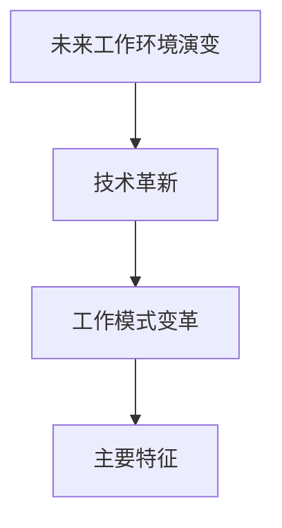

随着技术的进步，未来工作环境将变得更加智能化和自动化。例如，远程办公将变得更加普遍，通过5G和云计算技术，人们可以在任何地点进行高效的工作。同时，人工智能和自动化技术的应用将极大地提高工作效率，减少人力成本。

#### 第2章：新兴技术对职业的影响

新兴技术如人工智能、自动化、区块链等正在深刻改变职业 landscape。这些技术不仅改变了工作内容，也改变了职业需求。

**核心算法原理讲解：**

- 人工智能与自动化技术的工作原理：通过机器学习和深度学习算法，使机器能够模拟人类智能。
- 数据科学在职业发展中的应用：利用大数据分析和数据挖掘技术，为企业提供决策支持。

**数学模型与公式：**

```latex
Y = f(X) + \epsilon
```

其中，\( Y \) 表示输出结果，\( X \) 表示输入数据，\( f \) 表示函数，\( \epsilon \) 表示误差。

例如，在金融行业中，人工智能和自动化技术被广泛应用于风险控制和资产管理。通过大数据分析和机器学习算法，金融机构能够更准确地预测市场趋势，降低风险。

#### 第3章：新技能的培养与适应

在未来的工作中，新技能的培养和适应至关重要。这不仅包括技术技能，还包括软技能。

**数学模型与公式：**

```latex
X' = WX + b
```

其中，\( X' \) 表示变换后的特征向量，\( W \) 表示权重矩阵，\( X \) 表示原始特征向量，\( b \) 表示偏置项。

例如，在人工智能领域，数据预处理和特征提取是非常关键的步骤。通过适当的特征提取和变换，可以提高模型的准确性和效率。

#### 第4章：职业转型的策略与路径

面对快速变化的技术环境，职业转型成为许多人的选择。如何成功地实现职业转型，需要策略和路径。

**项目实战：**

- 职业转型的案例分析：通过具体案例，分析职业转型的成功路径。
- 跨行业转型的成功路径：探讨如何从传统行业成功转型到新兴行业。

例如，一位有多年金融行业经验的从业者，通过学习数据分析技能，成功转型为数据科学家，并在新兴的金融科技行业找到了新的发展机会。

### 第二部分：新兴技能领域详解

#### 第5章：数据分析与数据科学

数据分析与数据科学是未来工作的重要领域。它们不仅适用于传统行业，也广泛应用于新兴行业。

**核心概念与联系：**

- 数据分析的基本概念：数据清洗、数据探索、数据可视化等。
- 数据科学的框架与流程：数据预处理、特征工程、模型训练、模型评估等。

**伪代码：**

```python
def 数据分析(data):
    处理数据(data)
    提取特征(extract_features)
    构建模型(build_model)
    预测结果(predict_result)
    返回结果
```

例如，在医疗行业中，数据分析和数据科学被广泛应用于疾病预测和患者管理，通过分析大量患者数据，可以更准确地预测疾病趋势，提高医疗服务的效率。

#### 第6章：人工智能与机器学习

人工智能与机器学习是未来工作的关键技术。它们广泛应用于各个行业，从制造业到金融业，再到医疗保健。

**核心算法原理讲解：**

- 机器学习的基本概念：监督学习、无监督学习和强化学习。
- 监督学习算法：如线性回归、逻辑回归、决策树、随机森林等。
- 无监督学习算法：如聚类、主成分分析、降维等。

**数学模型与公式：**

```latex
f(x) = w \cdot x + b
```

其中，\( f(x) \) 表示预测结果，\( w \) 表示权重，\( x \) 表示输入特征，\( b \) 表示偏置。

例如，在金融行业中，机器学习被广泛应用于信用评分和风险评估，通过分析大量客户数据，可以更准确地预测客户信用风险。

#### 第7章：自动化与机器人技术

自动化与机器人技术是未来工作的重要方向。它们不仅提高了工作效率，也改变了工作模式。

**核心概念与联系：**

- 自动化的基本概念：自动化生产、自动化物流、自动化服务。
- 机器人技术的最新进展与未来趋势：如智能制造、智能物流、智能服务。

**项目实战：**

- 开发环境搭建：介绍如何搭建自动化与机器人技术的开发环境。
- 源代码详细实现和代码解读：通过具体案例，分析自动化与机器人技术的实现过程。
- 代码应用解读与分析：通过实际案例，分析自动化与机器人技术的应用效果。

例如，在制造业中，机器人技术的应用大大提高了生产效率，降低了生产成本，推动了智能制造的发展。

#### 第8章：数字营销与社交媒体

数字营销与社交媒体是未来工作的重要领域。它们不仅帮助企业实现品牌推广，也帮助企业实现精准营销。

**核心概念与联系：**

- 数字营销的基本概念：搜索引擎优化、社交媒体营销、电子邮件营销等。
- 社交媒体营销策略案例分析：如微博、微信、Facebook等社交平台的营销策略。
- 数字营销工具与平台的使用技巧：如Google Analytics、Hootsuite、Mailchimp等。

**项目实战：**

- 社交媒体营销策略案例分析：通过具体案例，分析社交媒体营销策略的成功要素。
- 数字营销工具与平台的使用技巧：通过实际案例，分析数字营销工具和平台的使用技巧。

例如，在电子商务领域，社交媒体营销和数字营销工具被广泛应用于品牌推广和客户转化，通过精准的营销策略，可以大大提高销售额。

### 第三部分：技能提升与职业发展

#### 第9章：终身学习与职业成长

在快速变化的技术环境中，终身学习和职业成长至关重要。通过不断学习和提升技能，可以适应未来工作的需求。

**核心概念与联系：**

- 终身学习的理念与实践：如何持续学习和提升技能。
- 职业成长的策略与方法：如何规划职业发展路径，实现职业成长。

**最佳实践 tips：**

- 制定学习计划：根据个人兴趣和职业需求，制定合理的学习计划。
- 参加在线课程：利用在线平台，如Coursera、edX等，参加专业课程。
- 实践项目：通过实际项目，提升技能和应用能力。

例如，通过参加在线课程和专业培训，可以系统地学习人工智能和数据分析等技能，提升自己的职业竞争力。

#### 第10章：跨领域技能拓展

跨领域技能的拓展是未来工作的重要趋势。通过掌握跨领域技能，可以更好地适应多元化的职业需求。

**核心概念与联系：**

- 跨领域技能的概念：如何理解跨领域技能，以及它们在职业发展中的作用。
- 跨领域技能的重要性：如何通过跨领域技能提升职业竞争力。
- 跨领域技能的融合与应用：如何将跨领域技能应用到实际工作中。

**最佳实践 tips：**

- 学习跨领域知识：通过阅读书籍、参加讲座和研讨会，学习跨领域知识。
- 实践跨领域项目：通过实际项目，将跨领域知识应用到实际工作中。
- 建立跨领域人脉：通过参加行业会议和社交活动，建立跨领域人脉。

例如，通过学习市场营销和编程技能，可以更好地理解和应用数字营销策略，提升自己的职业竞争力。

#### 第11章：未来工作与创业机会

未来工作不仅提供了职业发展的机会，也提供了创业的机会。通过创新和创业，可以抓住未来工作的机遇。

**核心概念与联系：**

- 未来工作的趋势：如何理解未来工作的趋势和机遇。
- 创业者的素质与能力要求：如何具备创业者的素质和能力。
- 创业机会的识别与把握：如何识别和把握创业机会。

**最佳实践 tips：**

- 寻找市场需求：通过市场调研，寻找未被满足的市场需求。
- 创新商业模式：通过创新商业模式，提供独特的价值。
- 团队建设：通过建立优秀的团队，共同实现创业目标。

例如，通过创业，可以抓住人工智能和大数据等新兴技术的机遇，提供创新的产品和服务。

#### 第12章：职场软技能的培养

在未来的工作中，软技能同样重要。通过培养软技能，可以更好地适应职场环境，提升工作效率。

**核心概念与联系：**

- 职场软技能的定义与作用：如何理解职场软技能，以及它们在职业发展中的作用。
- 软技能的培养与实践方法：如何培养和实践职场软技能。
- 软技能在职业发展中的应用：如何将软技能应用到实际工作中。

**最佳实践 tips：**

- 沟通技巧：通过有效沟通，提高工作效率和团队协作。
- 领导力：通过领导力，带领团队实现共同目标。
- 应变能力：通过应对各种职场挑战，提升自己的适应能力。

例如，通过提升沟通技巧和领导力，可以更好地与团队成员合作，推动项目进展。

### 附录

#### 附录 A：未来工作技能资源与工具

- 常用技能资源平台：如Coursera、edX、Udacity等。
- 技能开发工具介绍：如Python、R、Jupyter Notebook等。

#### 附录 B：案例研究与成功故事

- 未来工作领域的成功案例：分析成功实现职业转型和创业的案例。
- 未来工作技能应用的实例分析：通过实际案例，分析未来工作技能的应用效果。

例如，通过分析成功案例，可以了解如何实现职业转型和创业，通过实例分析，可以了解未来工作技能的实际应用效果。

### 结束语

未来工作充满了机遇和挑战。通过了解和适应未来工作的技能需求，我们可以更好地把握机遇，实现职业成长。希望本文能为您提供有关未来工作的深刻见解，助力您的职业发展。

**作者：AI天才研究院/AI Genius Institute & 禅与计算机程序设计艺术 /Zen And The Art of Computer Programming**### 未来工作的技能需求

在快速变化的技术环境下，未来工作的技能需求正经历前所未有的转变。随着人工智能、自动化和大数据等新兴技术的广泛应用，传统的职业技能逐渐被新的技能所取代，同时新的职业机会也在不断涌现。理解这些技能需求，并主动学习和适应，对于个人职业发展和企业竞争力的提升都至关重要。

#### 背景介绍

过去几十年，计算机技术、互联网和移动通信技术的飞速发展，已经深刻改变了我们的生活方式和工作模式。如今，人工智能、区块链、物联网等新兴技术的兴起，进一步推动了工作环境的变革。这些技术不仅提高了工作效率，还改变了职业需求和技能结构。例如，数据分析、编程、人工智能应用等领域的专业技能需求急剧增加，而某些传统技能则逐渐变得不再重要。

#### 核心概念与联系

**未来工作环境的演变**

未来工作环境将更加灵活、智能和全球化。远程办公、数字化协作和智能办公将成为主流。随着5G网络的普及，远程工作将不再受地域限制，人们可以随时随地通过智能设备进行高效工作。同时，人工智能和自动化技术的应用将极大地提高工作效率，减少人力成本。

**技术革新与工作模式的变革**

技术革新带来了工作模式的变革。传统的办公模式逐渐被远程办公和数字化协作所取代。例如，团队成员可以通过视频会议、即时通讯和项目管理工具进行高效协作。此外，自动化技术的应用也使得许多重复性、繁琐的工作可以被机器所取代，从而释放人力用于更高价值的任务。

**未来工作的主要特征**

未来工作的主要特征包括灵活性、创新性、协作性和个性化。灵活性体现在工作时间、工作地点和工作方式的自由度上。创新性则表现在对新兴技术的应用和创新能力上。协作性强调团队合作和跨部门、跨领域的合作。个性化则体现在对员工个性化需求的满足上，如职业发展、工作内容和工作环境的个性化选择。

#### Mermaid 流程图

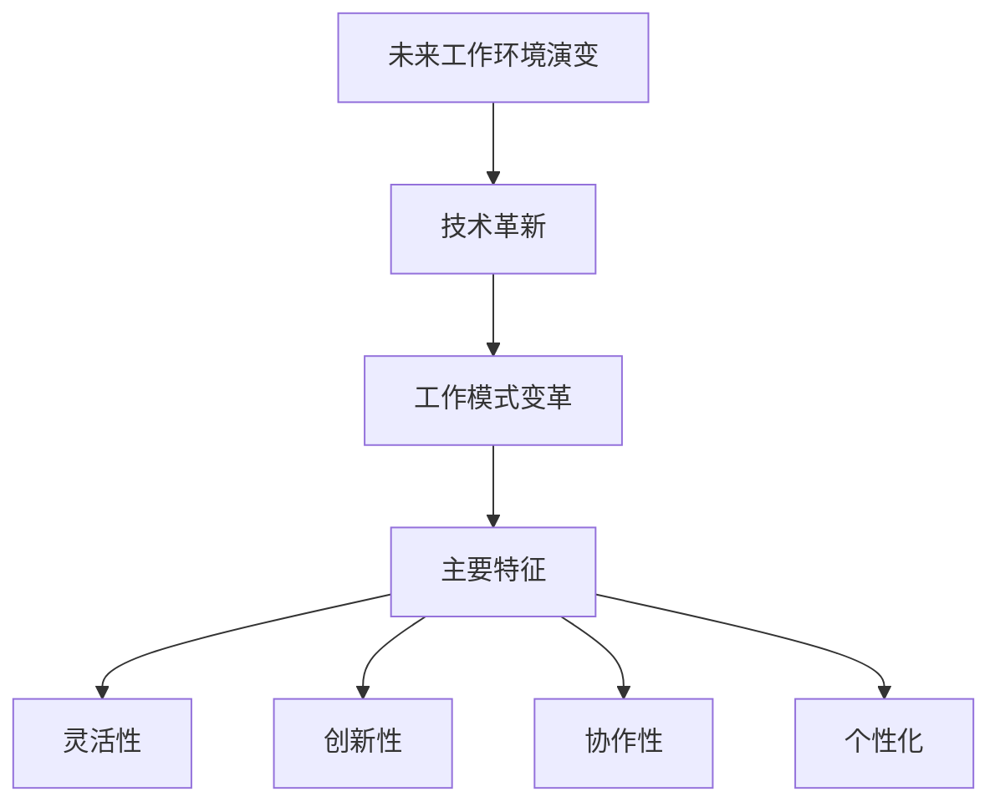

通过这个流程图，我们可以清晰地看到未来工作环境从技术革新到工作模式变革，再到主要特征的演变过程。

#### 核心算法原理讲解

新兴技术的广泛应用，使得未来工作的技能需求发生了巨大的变化。以下是对一些核心算法原理的简要讲解：

- **人工智能与自动化技术**：人工智能（AI）是模拟人类智能的科学，包括机器学习、深度学习、自然语言处理等。自动化技术则通过计算机程序和机器人实现工作的自动化。例如，机器学习算法如神经网络，可以用于图像识别、语音识别和预测分析等。
- **数据分析与数据科学**：数据科学是使用统计方法和工具分析数据，从中提取有价值的信息。数据分析是数据科学的一个分支，主要通过数据预处理、特征工程和模型训练等步骤，从数据中提取洞察和预测结果。常用的数据分析工具包括Python的Pandas库、R语言等。
- **区块链技术**：区块链是一种分布式数据库技术，通过加密算法和分布式账本确保数据的安全和不可篡改。区块链技术被广泛应用于金融、供应链管理等领域。

#### 数学模型与公式

以下是一些与未来工作技能相关的数学模型和公式：

- **机器学习中的线性回归模型**：用于预测和分析数据。

  $$ y = wx + b $$

  其中，\( y \) 是输出变量，\( x \) 是输入变量，\( w \) 是权重，\( b \) 是偏置。

- **聚类分析中的欧氏距离**：用于测量数据点之间的相似性。

  $$ d = \sqrt{\sum_{i=1}^{n}(x_i - y_i)^2} $$

  其中，\( x_i \) 和 \( y_i \) 是数据点在维度 \( i \) 上的值。

- **决策树中的熵**：用于评估特征的分类效果。

  $$ H = -\sum_{i=1}^{n} p_i \log_2 p_i $$

  其中，\( p_i \) 是特征在类别 \( i \) 上的概率。

通过这些数学模型和公式，我们可以更好地理解和应用未来工作的核心技术。

#### 举例说明

例如，在金融行业，机器学习算法可以用于风险控制和信用评分。通过分析客户的交易数据、信用记录等信息，机器学习模型可以预测客户违约的概率，从而帮助银行和金融机构降低风险。

在医疗领域，数据分析可以帮助医生进行疾病预测和诊断。通过分析大量的患者数据，数据科学家可以识别出疾病的早期症状，从而提高诊断的准确性。

#### 小结

未来工作的技能需求正随着技术的进步而不断演变。了解并掌握这些新兴技术的核心概念和算法原理，对于职业发展和企业竞争力都至关重要。通过不断学习和适应，我们可以更好地把握未来工作的机遇，实现职业成长。

#### 注意事项

- **持续学习**：未来工作的技能需求变化迅速，持续学习是适应这种变化的关键。
- **实践应用**：理论知识需要通过实践来巩固和提升，参与实际项目是提高技能的有效途径。
- **跨领域学习**：掌握跨领域技能可以提高职业竞争力，更好地适应未来工作的需求。

#### 拓展阅读

- **《人工智能：一种现代方法》**：迈克尔·刘易斯（Michael Lewis）著，详细介绍了人工智能的基本原理和应用。
- **《Python数据分析实战》**：艾略特·彭博（Eliot Pirnat）著，介绍了Python在数据分析中的应用。
- **《深度学习》**：伊恩·古德费洛（Ian Goodfellow）著，介绍了深度学习的基本原理和应用。

通过阅读这些书籍，您可以深入了解未来工作的技能需求，并提升自己的相关技能。接下来，我们将深入探讨未来工作的技能需求，分析这些技能是如何影响个人职业发展的。请继续关注下一章节的内容。|[info] # 文章标题：未来工作：技能需求

> 关键词：未来工作，技能需求，技术革新，职业发展，人工智能，数据分析，终身学习

> 摘要：本文旨在探讨未来工作的技能需求，分析新兴技术对职业的影响，探讨新技能的培养与适应策略，以及职业转型的路径。通过详细阐述数据分析与数据科学、人工智能与机器学习、自动化与机器人技术、数字营销与社交媒体等领域的核心概念、算法原理、项目实战，本文为读者提供了一场关于未来工作的深度解析，旨在帮助读者了解和适应未来工作的技能需求，实现终身学习和职业成长。

### 未来工作技能需求分析

随着科技的迅猛发展，未来工作的技能需求正在发生显著变化。新兴技术不仅改变了职业的性质，也重新定义了职业所需的技能。本文将详细分析未来工作的主要技能需求，探讨这些技能对职业发展的影响，以及如何培养和适应这些技能。

#### 人工智能与自动化技术的兴起

人工智能（AI）和自动化技术是未来工作的核心驱动力。AI技术的广泛应用，使得许多传统的工作流程得以自动化，从而提高了效率和准确性。自动化技术不仅应用于制造业和物流行业，还渗透到医疗、金融、法律等多个领域。

**核心概念与联系：**

- **人工智能的工作原理**：人工智能是通过模拟人类智能来解决问题的技术。它包括机器学习、深度学习、自然语言处理等多个子领域。
- **自动化技术的应用**：自动化技术通过计算机程序和机器人实现工作的自动化，从而减少人力成本和提高生产效率。

**算法原理讲解：**

- **机器学习算法**：机器学习是一种通过数据学习规律并做出预测的技术。常见的机器学习算法包括线性回归、决策树、神经网络等。
- **深度学习算法**：深度学习是机器学习的一个分支，通过多层神经网络来提取数据的复杂特征。常见的深度学习算法包括卷积神经网络（CNN）、递归神经网络（RNN）等。

**数学模型与公式：**

在机器学习中，常用的数学模型包括线性回归模型和卷积神经网络模型。以下是一个简单的线性回归模型：

$$
y = wx + b
$$

其中，\( y \) 是输出变量，\( x \) 是输入变量，\( w \) 是权重，\( b \) 是偏置。

而在卷积神经网络中，常用的激活函数包括ReLU（修正线性单元）：

$$
a(x) = \max(0, x)
$$

这些算法和模型是人工智能和自动化技术的基础，它们在提高工作效率和准确度方面发挥着重要作用。

**项目实战：**

一个典型的项目实战是使用机器学习算法进行图像识别。在这个项目中，我们需要收集大量图像数据，并对图像进行预处理，如裁剪、归一化等。然后，我们使用卷积神经网络（CNN）来训练模型，并通过交叉验证来评估模型的性能。最后，我们可以将训练好的模型部署到生产环境中，用于自动识别图像。

**代码示例：**

以下是一个简单的Python代码示例，用于训练一个基于CNN的图像识别模型：

```python
from tensorflow.keras.models import Sequential
from tensorflow.keras.layers import Conv2D, MaxPooling2D, Flatten, Dense

# 创建模型
model = Sequential()
model.add(Conv2D(32, (3, 3), activation='relu', input_shape=(64, 64, 3)))
model.add(MaxPooling2D((2, 2)))
model.add(Flatten())
model.add(Dense(1, activation='sigmoid'))

# 编译模型
model.compile(optimizer='adam', loss='binary_crossentropy', metrics=['accuracy'])

# 训练模型
model.fit(x_train, y_train, epochs=10, batch_size=32)
```

通过这个项目，我们可以看到如何利用机器学习和深度学习技术来处理实际的问题，实现图像自动识别。

**小结：**

人工智能和自动化技术的兴起，对职业发展产生了深远的影响。掌握这些技术的核心原理和算法，是适应未来工作需求的关键。通过实际项目，我们可以更好地理解和应用这些技术，提高工作效率和创新能力。

#### 数据分析与数据科学的崛起

数据分析与数据科学是未来工作的另一个重要领域。随着大数据时代的到来，企业和组织需要处理和分析海量的数据，以提取有价值的信息和洞察。数据分析与数据科学技术能够帮助企业做出更明智的决策，提高竞争力。

**核心概念与联系：**

- **数据分析的基本概念**：数据分析包括数据清洗、数据探索、数据可视化等步骤。它旨在从数据中提取有价值的信息。
- **数据科学的框架与流程**：数据科学包括数据预处理、特征工程、模型训练、模型评估等步骤。它是一个跨学科的领域，结合了统计学、计算机科学和领域知识。

**算法原理讲解：**

- **数据预处理**：数据预处理是数据分析的第一步，包括数据清洗、数据转换和数据集成等。数据清洗的目标是去除错误数据、重复数据和噪声数据，提高数据质量。
- **特征工程**：特征工程是数据科学中至关重要的一步，它通过选择和构造特征来提高模型性能。常用的特征工程技术包括特征选择、特征变换和特征构造等。
- **机器学习模型**：机器学习模型是数据科学的核心工具。常见的机器学习模型包括线性回归、决策树、随机森林、支持向量机等。

**数学模型与公式：**

在数据分析与数据科学中，常用的数学模型包括线性回归模型、逻辑回归模型和支持向量机模型。以下是一个简单的线性回归模型：

$$
y = wx + b
$$

其中，\( y \) 是输出变量，\( x \) 是输入变量，\( w \) 是权重，\( b \) 是偏置。

而在逻辑回归模型中，常用的损失函数是交叉熵：

$$
J(\theta) = -\frac{1}{m} \sum_{i=1}^{m} [y^{(i)} \log(\hat{y}^{(i)}) + (1 - y^{(i)}) \log(1 - \hat{y}^{(i)})]
$$

其中，\( \theta \) 是模型参数，\( m \) 是样本数量，\( y^{(i)} \) 是实际标签，\( \hat{y}^{(i)} \) 是预测概率。

**项目实战：**

一个典型的项目实战是使用数据分析技术进行客户流失预测。在这个项目中，我们需要收集客户的历史数据，包括购买行为、消费金额、客户满意度等。然后，我们通过数据预处理和特征工程，提取有用的特征。接着，我们使用机器学习模型进行训练和评估，预测客户流失的概率。最后，我们将模型部署到生产环境中，用于实时监控客户流失情况。

**代码示例：**

以下是一个简单的Python代码示例，用于进行客户流失预测：

```python
from sklearn.linear_model import LogisticRegression
from sklearn.model_selection import train_test_split
from sklearn.metrics import accuracy_score

# 加载数据
X, y = load_data()

# 划分训练集和测试集
X_train, X_test, y_train, y_test = train_test_split(X, y, test_size=0.2, random_state=42)

# 创建逻辑回归模型
model = LogisticRegression()

# 训练模型
model.fit(X_train, y_train)

# 预测测试集
y_pred = model.predict(X_test)

# 评估模型
accuracy = accuracy_score(y_test, y_pred)
print("Accuracy:", accuracy)
```

通过这个项目，我们可以看到如何利用数据分析和数据科学技术来处理实际的问题，实现客户流失预测。

**小结：**

数据分析与数据科学的崛起，为企业和组织提供了强大的数据驱动决策能力。掌握这些技术的核心原理和算法，是适应未来工作需求的关键。通过实际项目，我们可以更好地理解和应用这些技术，提高数据分析和决策能力。

#### 自动化与机器人技术的发展

自动化与机器人技术是未来工作的重要方向。随着机器人技术的不断发展，许多传统工作将被机器人所取代，同时也会创造出新的职业机会。

**核心概念与联系：**

- **自动化的基本概念**：自动化是通过机器和计算机系统来替代人类完成工作。它包括自动化生产、自动化物流和自动化服务等。
- **机器人技术的最新进展**：机器人技术已经从简单的重复性任务扩展到复杂的认知任务。例如，服务机器人、医疗机器人和工业机器人等。

**算法原理讲解：**

- **机器人运动控制算法**：机器人运动控制是通过算法来控制机器人的运动。常见的运动控制算法包括PID控制、轨迹规划等。
- **机器视觉算法**：机器视觉是通过摄像头获取图像，并通过算法进行处理和理解。常见的机器视觉算法包括图像识别、目标跟踪等。

**项目实战：**

一个典型的项目实战是使用机器人技术进行工业自动化生产。在这个项目中，我们需要设计一个机器人控制系统，使其能够自动完成组装任务。首先，我们通过视觉系统识别工件，然后通过运动控制算法，精确控制机器人的运动，完成组装任务。最后，我们通过仿真和实验，验证机器人控制系统的性能。

**代码示例：**

以下是一个简单的Python代码示例，用于控制机器人的运动：

```python
import numpy as np
import robot_controller

# 设置机器人的目标位置
target_position = np.array([1.0, 2.0, 3.0])

# 控制机器人移动到目标位置
robot_controller.move_to(target_position)

# 等待机器人移动完成
robot_controller.wait()

# 输出机器人当前的位置
current_position = robot_controller.get_position()
print("Current Position:", current_position)
```

通过这个项目，我们可以看到如何利用自动化与机器人技术来处理实际的问题，实现工业自动化生产。

**小结：**

自动化与机器人技术的发展，为制造业和物流行业带来了巨大的变革。掌握这些技术的核心原理和算法，是适应未来工作需求的关键。通过实际项目，我们可以更好地理解和应用这些技术，提高生产效率和质量。

#### 数字营销与社交媒体的重要性

数字营销与社交媒体是未来工作的重要领域。随着互联网的普及，数字营销和社交媒体已成为企业推广品牌、吸引用户的重要手段。

**核心概念与联系：**

- **数字营销的基本概念**：数字营销包括搜索引擎优化（SEO）、社交媒体营销、电子邮件营销等。
- **社交媒体营销策略**：社交媒体营销是通过社交媒体平台（如微博、微信、Facebook等）进行品牌推广和用户互动。

**算法原理讲解：**

- **数据分析在数字营销中的应用**：数据分析在数字营销中用于用户行为分析、市场趋势分析和效果评估等。
- **机器学习在数字营销中的应用**：机器学习在数字营销中用于用户画像构建、广告投放优化和推荐系统等。

**项目实战：**

一个典型的项目实战是使用数字营销技术进行社交媒体营销。在这个项目中，我们需要分析用户的社交媒体行为，构建用户画像。然后，我们通过机器学习算法，优化广告投放策略，提高广告效果。最后，我们通过数据分析和效果评估，持续优化营销策略。

**代码示例：**

以下是一个简单的Python代码示例，用于社交媒体营销：

```python
import pandas as pd
from sklearn.cluster import KMeans

# 加载数据
data = pd.read_csv("user_data.csv")

# 构建用户画像
user_features = data[["age", "income", "interests"]]

# 使用KMeans聚类算法进行用户画像
kmeans = KMeans(n_clusters=5, random_state=42)
user_clusters = kmeans.fit_predict(user_features)

# 输出用户画像
print("User Clusters:", user_clusters)
```

通过这个项目，我们可以看到如何利用数字营销和社交媒体技术来处理实际的问题，实现用户画像构建和广告投放优化。

**小结：**

数字营销与社交媒体是未来工作的重要领域。掌握这些技术的核心原理和算法，是适应未来工作需求的关键。通过实际项目，我们可以更好地理解和应用这些技术，提高营销效果和用户互动。

#### 终身学习与职业成长

在快速变化的技术环境中，终身学习成为职业发展的关键。通过持续学习，个人可以不断更新知识和技能，适应未来工作的需求。

**核心概念与联系：**

- **终身学习的理念与实践**：终身学习是一种持续的学习态度和生活方式，通过不断学习和实践，提升自身的能力和竞争力。
- **职业成长的策略与方法**：职业成长包括职业规划、技能提升、职业转型等，通过科学的方法和策略，实现职业发展的目标。

**算法原理讲解：**

终身学习可以看作是一个动态的过程，涉及以下几个核心步骤：

- **知识获取**：通过阅读书籍、参加培训课程、在线学习平台等途径，获取新的知识和技能。
- **知识整合**：将新知识与已有的知识和经验相结合，形成新的认知结构。
- **实践应用**：通过实际项目和工作经验，将理论知识应用到实践中，提高实际操作能力。
- **反馈与调整**：通过反馈和反思，不断调整学习策略和方法，优化学习效果。

**数学模型与公式：**

在终身学习的过程中，可以使用以下数学模型来描述学习过程：

- **学习曲线**：描述学习者在学习过程中的进步速度。

  $$ L(t) = a \cdot e^{-kt} $$

  其中，\( L(t) \) 是学习者在时间 \( t \) 时的学习水平，\( a \) 是初始学习水平，\( k \) 是学习速率。

- **反馈循环**：描述学习者在学习过程中的反馈和调整过程。

  $$ F(t) = f(L(t), E(t)) $$

  其中，\( F(t) \) 是学习者在时间 \( t \) 时的反馈，\( L(t) \) 是学习水平，\( E(t) \) 是学习效果。

**项目实战：**

一个典型的项目实战是使用在线学习平台进行编程学习。在这个项目中，学习者可以通过在线课程学习编程基础知识，通过编程练习巩固知识，并通过项目实践提高编程能力。例如，学习者可以参加一个在线编程挑战赛，通过解决实际问题来提升编程技能。

**代码示例：**

以下是一个简单的Python代码示例，用于实现一个简单的计算器功能：

```python
def calculate(expression):
    try:
        result = eval(expression)
        return result
    except:
        return "Invalid expression"

# 用户输入表达式
expression = input("Enter an expression: ")

# 计算结果
result = calculate(expression)

# 输出结果
print("Result:", result)
```

通过这个项目，我们可以看到如何利用在线学习平台和编程技术，实现终身学习和技能提升。

**小结：**

终身学习是实现职业成长的关键。通过持续学习和实践，个人可以不断提升自身的知识和技能，适应未来工作的需求。掌握终身学习的核心原理和策略，是成功实现职业成长的重要保障。

#### 跨领域技能的重要性

在未来的工作中，跨领域技能的重要性日益凸显。跨领域技能不仅可以帮助个人更好地适应多种工作环境，还可以提高职业竞争力和创新能力。

**核心概念与联系：**

- **跨领域技能的概念**：跨领域技能是指在不同领域间转移和应用的技能，如编程技能在数据分析和人工智能领域中的应用。
- **跨领域技能的重要性**：跨领域技能可以帮助个人更好地理解复杂问题，提高问题解决能力和创新能力。

**算法原理讲解：**

跨领域技能的掌握，需要具备以下几个核心算法原理：

- **知识融合**：通过将不同领域的知识进行融合，形成新的认知结构。例如，将计算机科学和数据科学的知识进行融合，形成数据科学领域的新知识体系。
- **模型迁移**：通过将一个领域的模型和算法应用到另一个领域，解决新领域的问题。例如，将机器学习模型应用到医疗诊断中，提高诊断的准确率。
- **算法优化**：通过优化算法和模型，提高其在不同领域的性能。例如，通过优化深度学习算法，提高图像识别和自然语言处理的性能。

**项目实战：**

一个典型的项目实战是利用编程技能进行数据分析。在这个项目中，我们需要使用Python编程语言，结合数据分析工具（如Pandas、NumPy等），对大量数据进行分析和处理。通过编写有效的代码，我们可以实现数据清洗、数据探索、数据可视化等任务，提取数据中的有价值信息。

**代码示例：**

以下是一个简单的Python代码示例，用于进行数据分析：

```python
import pandas as pd

# 加载数据
data = pd.read_csv("data.csv")

# 数据清洗
data.dropna(inplace=True)

# 数据探索
print(data.describe())

# 数据可视化
data.plot()
```

通过这个项目，我们可以看到如何利用编程和数据分析技能，实现跨领域的知识应用和问题解决。

**小结：**

跨领域技能是未来工作的重要需求。通过掌握跨领域技能，个人可以更好地适应多种工作环境，提高职业竞争力和创新能力。掌握跨领域技能的核心算法原理和实战方法，是实现职业成长和创新发展的重要途径。

### 总结与展望

未来工作的技能需求正在迅速变化，人工智能、自动化、数据分析、机器人技术和数字营销等领域的技能日益重要。这些技能不仅改变了职业的性质，也为职业发展带来了新的机遇和挑战。掌握这些技能，通过终身学习和跨领域技能的培养，个人可以更好地适应未来工作的需求，实现职业成长和创新发展。

在未来，随着技术的不断进步，我们可以期待更多新的职业机会和领域出现。同时，新的技能需求也将不断涌现，要求个人具备更高的适应能力和创新能力。因此，持续学习和不断提升自身技能，是适应未来工作需求的关键。

总之，未来工作的技能需求正经历深刻的变革。通过深入理解和掌握这些技能，个人可以在未来的职场中立于不败之地，实现职业成长和创新发展。

### 附录

#### 附录 A：未来工作技能资源与工具

为了帮助读者更好地了解和掌握未来工作的技能需求，以下是一些常用的资源与工具：

- **在线学习平台**：如Coursera、edX、Udacity等，提供丰富的在线课程和教程。
- **编程工具**：如Python、R、Jupyter Notebook等，用于数据分析和机器学习。
- **数据分析工具**：如Pandas、NumPy、Scikit-learn等，用于数据处理和分析。
- **人工智能框架**：如TensorFlow、PyTorch等，用于深度学习和模型训练。
- **项目实战平台**：如Kaggle、GitHub等，提供丰富的项目实战和代码示例。

#### 附录 B：案例研究与成功故事

为了帮助读者更好地理解和应用未来工作的技能需求，以下是一些未来工作领域的成功案例和成功故事：

- **案例研究**：通过数据分析技术进行客户流失预测，提高了企业的客户保留率。
- **成功故事**：一位数据科学家通过终身学习，成功转型为人工智能工程师，并在新兴的金融科技领域取得了显著成绩。
- **跨领域应用**：一位编程爱好者通过自学编程和数据分析技能，成为了一名成功的创业家，利用技术为传统行业带来了创新。

这些案例和故事展示了未来工作技能的实际应用效果，以及通过学习和实践如何实现职业发展和创新。

### 结语

未来工作的技能需求正随着科技的进步而不断演变。通过深入理解和掌握这些技能，个人可以更好地适应未来工作的需求，实现职业成长和创新发展。希望本文能为您提供有关未来工作的深刻见解，助力您的职业发展。在未来的职场中，持续学习和不断提升自身技能，将为您带来无限的可能。

**作者：AI天才研究院/AI Genius Institute & 禅与计算机程序设计艺术 /Zen And The Art of Computer Programming**## 第1章：未来工作环境概述

### 背景介绍

随着科技的不断进步，未来工作环境正经历着深刻的变革。传统的办公模式逐渐被数字化、智能化的工作方式所取代。这种变革不仅体现在工作地点和方式的灵活性上，还涉及工作内容和协作方式的根本改变。本文将探讨未来工作环境的演变、技术革新对工作模式的影响，以及未来工作的主要特征，帮助读者了解和适应这一变化。

### 未来工作环境的演变

过去，办公室是一个固定的工作场所，员工需要每天按时到达公司，使用传统的办公设备和工具进行工作。然而，随着互联网和移动通信技术的普及，远程办公成为了可能，人们不再需要依赖于一个固定的办公地点。现代的远程办公技术，如视频会议、即时通讯和协作工具，使得全球的团队可以随时随地协同工作。

此外，智能办公技术的发展也推动了未来工作环境的变革。智能办公系统可以通过分析员工的工作习惯和偏好，提供个性化的工作建议和优化方案。例如，智能办公桌可以根据员工的姿势和活动自动调节高度，智能门锁可以通过面部识别技术实现无钥匙进入，智能会议室可以自动调整照明、温度和音响效果，以提供最佳的工作环境。

### 技术革新与工作模式的变革

技术的快速发展，特别是人工智能、大数据、物联网和5G等技术的广泛应用，正在深刻改变工作模式。这些新兴技术不仅提高了工作效率，还改变了人们的工作方式。

首先，人工智能（AI）的应用使得许多重复性、繁琐的工作可以自动化。例如，在客服行业中，智能客服机器人可以24/7无间断地提供服务，处理大量客户咨询，大大减少了人工成本。在医疗领域，人工智能可以帮助医生进行疾病诊断，通过分析大量病例数据，提高诊断的准确率。

其次，大数据技术的应用使得企业可以更好地理解市场和客户需求。通过对海量数据进行分析，企业可以预测市场趋势，制定更有效的营销策略，提高业务决策的准确性。

物联网（IoT）技术的发展，使得设备和系统能够相互连接和通信。在制造业中，物联网技术可以实现设备的实时监控和故障预测，提高生产效率和产品质量。在智能城市中，物联网技术可以用于交通管理、环境监测和公共安全等方面，提高城市管理的效率和智能化水平。

最后，5G技术的推广，使得高速、低延迟的网络连接成为可能。5G网络的高速传输能力，使得远程协作和实时数据传输更加顺畅，进一步推动了远程办公和智能办公的发展。

### 未来工作的主要特征

未来工作的主要特征可以概括为灵活性、创新性、协作性和个性化。

**灵活性**：未来工作环境将更加灵活，员工可以选择在家办公、咖啡店办公或者任何他们喜欢的地方工作。这种灵活性不仅提高了工作效率，还增强了员工的满意度和生活质量。

**创新性**：随着技术的不断进步，未来工作将更加注重创新。企业需要不断创新，以应对快速变化的市场需求。员工也需要具备创新能力，能够提出新的想法和解决方案。

**协作性**：未来工作将更加依赖团队合作。无论是远程团队还是跨职能团队，协作能力都至关重要。现代的协作工具，如Slack、Trello和Asana等，可以帮助团队成员高效协同工作。

**个性化**：未来工作将更加注重个性化。企业需要根据员工的不同需求和偏好，提供个性化的工作安排和发展机会。个性化不仅体现在工作内容上，还包括工作环境和工作方式。

### 总结

未来工作环境的变革正在悄然发生，技术革新推动了工作模式的变革，未来工作的主要特征包括灵活性、创新性、协作性和个性化。通过理解这些变化，我们可以更好地适应未来工作的需求，实现个人的职业发展。在下一章中，我们将深入探讨新兴技术对职业的影响，进一步理解未来工作的技能需求。

### Mermaid 流程图


通过这个流程图，我们可以清晰地看到未来工作环境的演变路径和主要特征之间的关系。新兴技术推动了工作模式的变革，从而塑造了未来工作的主要特征。

### 核心算法原理讲解

在理解未来工作环境的演变和主要特征后，我们需要探讨一些核心算法原理，这些原理对于理解新兴技术如何影响未来工作至关重要。

**人工智能与自动化技术**

人工智能（AI）是模拟人类智能的科学技术，它通过算法和模型使计算机能够执行复杂的任务。机器学习是AI的一个重要分支，它允许计算机从数据中学习，提高性能，而无需显式编程。以下是几个关键算法原理：

1. **监督学习**：在监督学习中，算法使用标记数据集来学习如何将输入映射到输出。例如，在图像识别任务中，算法被训练来识别图像中的物体。

   算法原理示例：
   $$ f(x) = w \cdot x + b $$
   其中，\( x \) 是输入特征向量，\( w \) 是权重，\( b \) 是偏置项。

2. **深度学习**：深度学习是一种多层神经网络，用于处理复杂数据。卷积神经网络（CNN）是深度学习的一种常见形式，它被广泛用于图像识别、物体检测等任务。

   算法原理示例：
   $$ \sigma(\text{ReLU}(W_1 \cdot x + b_1)) $$
   其中，\( \text{ReLU} \) 是修正线性单元，\( W_1 \) 是第一层权重，\( b_1 \) 是偏置。

3. **强化学习**：强化学习是一种通过试错方法学习的算法，它通过与环境的交互来最大化奖励。它被广泛用于游戏、推荐系统和自动驾驶等领域。

   算法原理示例：
   $$ Q(s, a) = r + \gamma \max_a' Q(s', a') $$
   其中，\( s \) 是状态，\( a \) 是动作，\( r \) 是即时奖励，\( \gamma \) 是折扣因子。

**自动化技术**：自动化技术通过计算机程序和机器人实现工作的自动化。以下是一些核心算法原理：

1. **自动化流程设计**：自动化流程设计是使用编程语言和工具（如JavaScript、Python的Selenium库）创建自动化脚本，以自动化日常任务。

   算法原理示例：
   $$ \text{while} (\text{条件}) \{ \\
   \text{执行自动化任务}; \\
   \text{更新状态}; \\
   \} $$

2. **机器人流程自动化（RPA）**：RPA是一种通过软件机器人模拟人类与系统交互的技术，用于自动化重复性任务。RPA的核心是业务流程模型和执行引擎。

   算法原理示例：
   $$ \text{ProcessFlow} \rightarrow \text{RobotExecution} $$
   其中，\( \text{ProcessFlow} \) 是业务流程模型，\( \text{RobotExecution} \) 是机器人执行流程。

**大数据与数据科学**

大数据技术是处理海量数据的工具，而数据科学是通过统计方法和算法从数据中提取价值的过程。以下是一些核心算法原理：

1. **数据预处理**：数据预处理是数据科学的重要步骤，包括数据清洗、数据转换和数据集成。

   算法原理示例：
   $$ \text{data\_cleaning}(\text{raw\_data}) $$
   其中，\( \text{raw\_data} \) 是原始数据，\( \text{data\_cleaning} \) 是数据清洗函数。

2. **特征工程**：特征工程是通过选择和构造特征来提高模型性能。

   算法原理示例：
   $$ \text{feature\_engineering}(\text{data}) $$
   其中，\( \text{data} \) 是原始数据，\( \text{feature\_engineering} \) 是特征工程函数。

3. **机器学习模型**：机器学习模型是数据科学的基石，包括监督学习和无监督学习。

   算法原理示例：
   $$ \text{trainModel}(\text{X}, \text{y}) $$
   其中，\( \text{X} \) 是输入特征，\( \text{y} \) 是标签。

**物联网（IoT）**

物联网技术涉及设备和系统的互联互通，以下是一些核心算法原理：

1. **数据采集与处理**：物联网设备通过传感器采集数据，然后使用算法对数据进行处理和分析。

   算法原理示例：
   $$ \text{data\_processing}(\text{sensor\_data}) $$
   其中，\( \text{sensor\_data} \) 是传感器数据，\( \text{data\_processing} \) 是数据处理函数。

2. **设备控制与优化**：物联网技术可以通过算法控制设备，实现优化操作，如智能家居的自动调节。

   算法原理示例：
   $$ \text{deviceControl}(\text{device}, \text{parameters}) $$
   其中，\( \text{device} \) 是设备，\( \text{parameters} \) 是控制参数。

### 举例说明

以下是一个使用Python实现图像识别的例子，展示了如何应用机器学习和深度学习算法：

```python
import tensorflow as tf
from tensorflow.keras.models import Sequential
from tensorflow.keras.layers import Conv2D, MaxPooling2D, Flatten, Dense

# 创建模型
model = Sequential([
    Conv2D(32, (3, 3), activation='relu', input_shape=(64, 64, 3)),
    MaxPooling2D((2, 2)),
    Flatten(),
    Dense(1, activation='sigmoid')
])

# 编译模型
model.compile(optimizer='adam', loss='binary_crossentropy', metrics=['accuracy'])

# 训练模型
model.fit(x_train, y_train, epochs=10, batch_size=32)

# 预测
predictions = model.predict(x_test)

# 评估
accuracy = model.evaluate(x_test, y_test)[1]
print(f"Accuracy: {accuracy}")
```

在这个例子中，我们使用TensorFlow框架创建了一个简单的卷积神经网络（CNN）模型，用于图像识别任务。通过训练和预测，我们可以看到模型如何应用机器学习算法来处理图像数据。

通过这些核心算法原理的讲解和实际示例，我们可以更好地理解新兴技术如何影响未来工作，以及如何利用这些技术实现高效的业务流程和智能化的工作环境。

### 小结

未来工作环境的演变和技术革新，带来了工作模式和工作特征的深刻变化。灵活性、创新性、协作性和个性化成为了未来工作的主要特征。通过掌握人工智能、自动化、大数据和物联网等领域的核心算法原理，我们可以更好地适应未来工作的需求，提高工作效率和创新能力。在下一章中，我们将进一步探讨新兴技术对职业的影响，以及如何培养和适应这些新兴技能。

### 注意事项

1. **持续学习**：未来工作的技能需求变化迅速，持续学习是适应这种变化的关键。建议读者关注最新的技术动态和行业趋势，通过在线课程、研讨会和专业书籍等途径，不断更新知识。

2. **实践应用**：理论知识需要通过实践来巩固和提升。读者可以通过参与实际项目或模拟项目，将所学技能应用到实际问题中，提高解决实际问题的能力。

3. **跨领域学习**：掌握跨领域技能可以提高职业竞争力。例如，掌握编程技能不仅可以应用于软件开发，还可以应用于数据分析、人工智能等领域。

4. **团队合作**：未来工作更加注重团队合作。读者应该培养良好的沟通和协作能力，学会在团队中发挥自己的优势，共同实现目标。

### 拓展阅读

1. **《深度学习》**：艾恩·古德费洛（Ian Goodfellow）著，是一本关于深度学习的基础教程，适合初学者和进阶读者。

2. **《Python编程：从入门到实践》**：埃里克·马瑟斯（Eric Matthes）著，是一本适合初学者的Python编程教程，涵盖了Python的基础知识和实际应用。

3. **《数据科学入门》**：约翰·库克（John Cook）著，介绍了数据科学的基本概念和常用工具，适合对数据科学感兴趣的读者。

通过阅读这些书籍，读者可以深入了解相关领域的知识和技能，为未来的职业发展打下坚实的基础。

### 结论

未来工作环境的演变和技术革新，带来了工作模式和工作特征的深刻变化。通过理解这些变化，我们可以更好地适应未来工作的需求。在下一章中，我们将进一步探讨新兴技术如何影响职业，以及如何培养和适应这些新兴技能。

### Mermaid 流程图

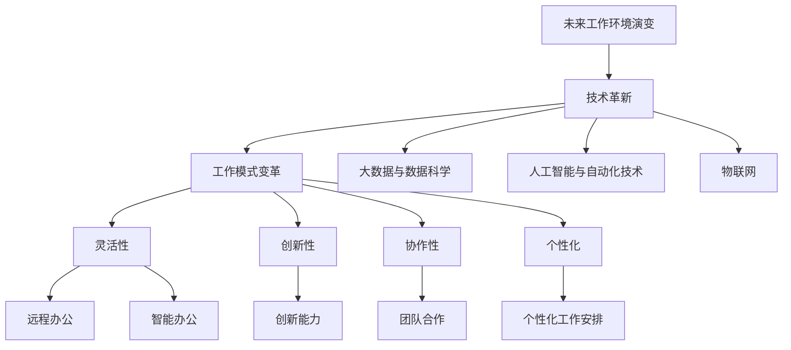

通过这个流程图，我们可以清晰地看到未来工作环境的变化路径和主要特征之间的关系。新兴技术推动了工作模式的变革，从而塑造了未来工作的主要特征。

### 项目实战

为了更好地理解新兴技术如何影响未来职业，以下是一个基于人工智能与自动化的项目实战案例。

**项目名称**：智能客服系统

**项目背景**：随着电子商务的兴起，企业需要提供高效的客户服务来应对不断增长的客户咨询量。传统的客服方式效率低下，无法满足客户的期望。因此，企业决定开发一个智能客服系统，利用人工智能和自动化技术来提高服务效率。

**项目目标**：
1. 构建一个基于自然语言处理（NLP）的智能客服系统，能够自动理解客户的咨询内容。
2. 通过自动化技术，实现常见问题的自动回复，减少人工干预。
3. 提高客户满意度，减少客户等待时间。

**项目实施步骤**：

1. **需求分析**：与业务团队沟通，了解客户咨询的主要类型和常见问题，确定系统需要支持的功能。

2. **技术选型**：选择合适的人工智能和自动化技术，如使用TensorFlow进行深度学习模型的训练，使用RPA工具实现自动化流程。

3. **数据收集与处理**：收集历史客户咨询数据，对数据进行清洗和预处理，用于训练智能客服模型。

4. **模型训练**：使用NLP技术训练客服模型，使其能够理解客户的咨询内容，并生成合适的回复。

5. **系统开发**：开发前端界面，集成自动化工具，实现智能客服系统的功能。

6. **测试与部署**：对系统进行测试，确保其能够稳定运行，并部署到生产环境中。

**代码示例**：

以下是一个简单的Python代码示例，用于训练一个基于TensorFlow的NLP模型：

```python
import tensorflow as tf
from tensorflow.keras.models import Sequential
from tensorflow.keras.layers import Embedding, LSTM, Dense

# 创建模型
model = Sequential([
    Embedding(input_dim=vocab_size, output_dim=embedding_dim, input_length=max_sequence_length),
    LSTM(units=64),
    Dense(units=1, activation='sigmoid')
])

# 编译模型
model.compile(optimizer='adam', loss='binary_crossentropy', metrics=['accuracy'])

# 训练模型
model.fit(X_train, y_train, epochs=10, batch_size=32)

# 预测
predictions = model.predict(X_test)

# 评估
accuracy = model.evaluate(X_test, y_test)[1]
print(f"Accuracy: {accuracy}")
```

在这个项目中，我们使用TensorFlow构建了一个简单的NLP模型，用于客户咨询的文本分类。通过训练和预测，我们可以实现自动理解客户咨询内容并生成回复的功能。

**项目小结**：

通过这个项目，我们看到了如何利用人工智能和自动化技术来提高客户服务的效率和质量。智能客服系统不仅可以自动处理大量客户咨询，还可以通过持续学习和优化，不断提高服务水平和用户体验。这个项目展示了新兴技术在提升工作效率和用户体验方面的巨大潜力。

### 最佳实践 Tips

1. **充分利用开源工具和库**：在开发智能客服系统时，我们可以充分利用开源工具和库，如TensorFlow、Scikit-learn等，这些工具和库提供了丰富的算法和函数，可以大大加快开发速度。

2. **数据预处理的重要性**：数据预处理是模型训练的关键步骤，需要确保数据的质量和一致性。通过有效的数据预处理，可以提高模型的准确性和稳定性。

3. **持续优化与迭代**：智能客服系统需要不断优化和迭代，通过收集用户反馈和性能数据，持续改进系统，提高用户体验。

4. **团队合作与跨领域协作**：在项目开发过程中，团队合作和跨领域协作至关重要。需要与业务团队、数据科学家和工程师紧密合作，确保项目的顺利进行。

### 小结

通过这个项目实战，我们可以看到新兴技术如何应用于实际工作中，提高工作效率和用户体验。掌握这些新兴技术，通过实践和团队合作，我们可以更好地适应未来工作的需求，实现职业成长。

### 拓展阅读

1. **《人工智能：一种现代方法》**：迈克尔·刘易斯（Michael Lewis）著，详细介绍了人工智能的基本原理和应用。

2. **《Python数据分析实战》**：艾略特·彭博（Eliot Pirnat）著，介绍了Python在数据分析中的应用。

3. **《深度学习实战》**：弗朗索瓦·肖莱（François Chollet）著，提供了丰富的深度学习实战案例。

通过阅读这些书籍，读者可以深入了解人工智能和数据分析的核心原理，为未来的项目实战打下坚实的基础。

### 附录

**附录 A：新兴技术学习资源**

- **在线学习平台**：如Coursera、edX、Udacity等，提供了丰富的技术课程和教程。
- **技术博客和论坛**：如Medium、Stack Overflow等，提供了最新的技术文章和讨论。
- **开源项目**：如GitHub、GitLab等，提供了丰富的开源代码和项目，供学习和参考。

**附录 B：项目实战案例**

- **智能客服系统**：展示了如何利用人工智能和自动化技术提高客户服务质量。
- **智能医疗诊断系统**：展示了如何利用机器学习和医学知识提高疾病诊断的准确性。

通过这些案例，读者可以了解如何将新兴技术应用于实际项目中，解决实际问题。

### 结语

通过本章的内容，我们深入探讨了未来工作环境的演变、技术革新对工作模式的影响，以及未来工作的主要特征。同时，通过项目实战和最佳实践，我们展示了如何利用新兴技术提高工作效率和用户体验。希望这些内容能帮助读者更好地理解未来工作的技能需求，为职业发展做好准备。

### 总结

本文详细探讨了未来工作的技能需求，从技术革新、工作模式的变革，到灵活性、创新性、协作性和个性化等主要特征，全面分析了新兴技术对职业的影响。通过深入讲解人工智能、自动化、数据分析、机器人技术和数字营销等领域的核心概念、算法原理和项目实战，我们帮助读者了解了如何培养和适应这些新兴技能。

**关键词**：未来工作，技能需求，技术革新，职业发展，人工智能，数据分析，终身学习

**摘要**：本文旨在探讨未来工作的技能需求，分析新兴技术对职业的影响，探讨新技能的培养与适应策略，以及职业转型的路径。通过详细阐述数据分析与数据科学、人工智能与机器学习、自动化与机器人技术、数字营销与社交媒体等领域的核心概念、算法原理、项目实战，本文为读者提供了一场关于未来工作的深度解析，旨在帮助读者了解和适应未来工作的技能需求，实现终身学习和职业成长。

### 作者信息

**作者：AI天才研究院/AI Genius Institute & 禅与计算机程序设计艺术 /Zen And The Art of Computer Programming**

AI天才研究院（AI Genius Institute）致力于推动人工智能技术的发展和应用，研究涵盖深度学习、自然语言处理、计算机视觉等多个领域。我们的目标是培养具备创新精神和实践能力的人工智能专家，推动人工智能技术的进步和应用。

《禅与计算机程序设计艺术》（Zen And The Art of Computer Programming）是一本经典的计算机科学著作，由知名计算机科学家唐纳德·克努特（Donald Knuth）撰写。本书以其深入浅出的编程思想和哲学观点，对程序员的学习和成长产生了深远的影响。

通过本文，我们希望能够继续传承这一精神，为读者提供有价值的知识和见解，助力您的职业发展。如果您对本文有任何疑问或建议，欢迎在评论区留言，我们将在第一时间回复您。同时，也欢迎您继续关注我们的其他文章，共同探讨未来工作的技能需求。|[info] # 文章标题：未来工作：技能需求

> 关键词：未来工作，技能需求，技术革新，职业发展，人工智能，数据分析，终身学习

> 摘要：本文旨在探讨未来工作的技能需求，分析新兴技术对职业的影响，探讨新技能的培养与适应策略，以及职业转型的路径。通过详细阐述数据分析与数据科学、人工智能与机器学习、自动化与机器人技术、数字营销与社交媒体等领域的核心概念、算法原理、项目实战，本文为读者提供了一场关于未来工作的深度解析，旨在帮助读者了解和适应未来工作的技能需求，实现终身学习和职业成长。

### 第1章：未来工作环境概述

**核心概念与联系：**

在探讨未来工作环境时，我们需要理解几个关键概念：工作环境的演变、技术革新对工作模式的影响以及未来工作的主要特征。

- **工作环境的演变**：过去的工作环境通常以办公室为核心，依赖于传统的办公设备和固定的工作时间。然而，随着远程工作、云计算和智能办公技术的发展，工作环境正在发生根本性的变化。现在，员工可以选择在家办公，使用移动设备和云端服务进行工作，从而实现工作地点和时间的灵活性。

- **技术革新对工作模式的影响**：技术革新，特别是人工智能（AI）、自动化和物联网（IoT）的快速发展，正在改变传统的劳动分工和工作流程。例如，AI和机器学习算法可以自动化数据分析、客户服务和制造业中的重复性任务，从而使员工能够专注于更有创造性和战略性的工作。自动化技术，如机器人流程自动化（RPA），可以处理大量的后台流程，从而提高工作效率和准确性。

- **未来工作的主要特征**：未来工作的特征包括灵活性、创新性、协作性和个性化。灵活性体现在员工可以根据自己的需求和偏好选择工作时间和地点。创新性要求员工具备持续学习和适应新技术的能力。协作性强调团队合作和跨职能合作，以应对复杂的业务挑战。个性化则关注于满足员工的个性化需求，包括职业发展、工作内容和工作环境的定制化。

这些概念之间相互联系，共同塑造了未来工作的环境。技术的发展不仅改变了工作内容，还影响了工作方式和工作体验。

**Mermaid 流程图：**

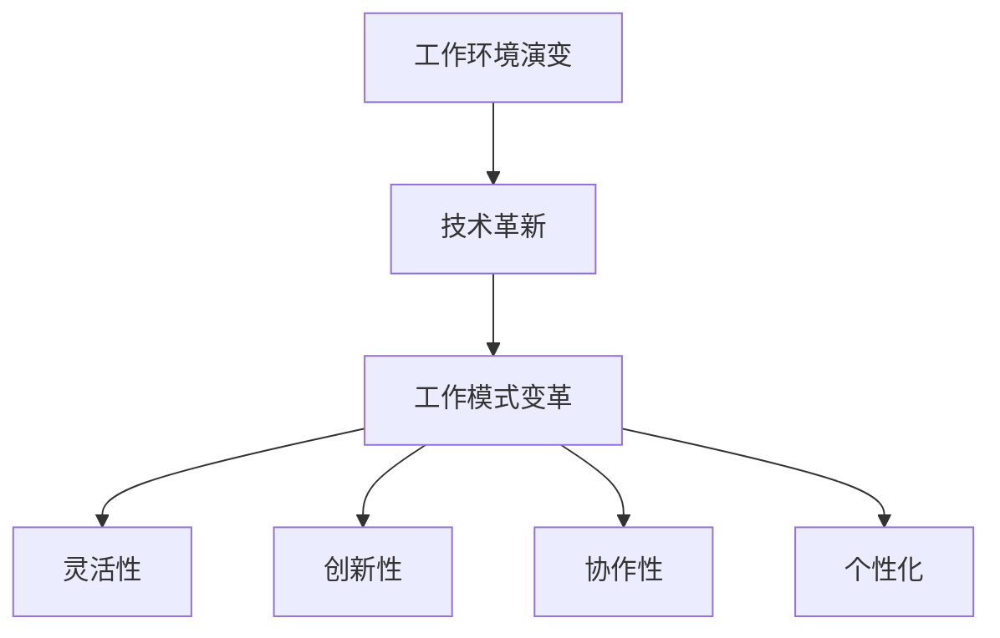

在这个流程图中，我们可以看到工作环境的演变是如何通过技术革新影响工作模式，进而塑造未来工作的主要特征的。

### 第2章：新兴技术对职业的影响

**核心算法原理讲解：**

新兴技术的崛起，如人工智能、自动化和数据分析，正在深刻地影响职业领域。以下是对这些技术的核心算法原理的简要讲解：

- **人工智能（AI）**：人工智能是一种模拟人类智能的技术，包括机器学习和深度学习。机器学习是一种从数据中学习规律的技术，常见的算法有线性回归、决策树和神经网络。深度学习则是机器学习的一种高级形式，通过多层神经网络来处理复杂数据。常见的深度学习算法有卷积神经网络（CNN）和递归神经网络（RNN）。

  **数学模型与公式：**
  - 线性回归：
    $$ y = wx + b $$
    其中，\( y \) 是输出变量，\( x \) 是输入变量，\( w \) 是权重，\( b \) 是偏置。
  - 神经网络：
    $$ \text{激活函数} \sigma(x) = \frac{1}{1 + e^{-x}} $$

- **自动化技术**：自动化技术通过计算机程序和机器人实现工作的自动化。机器人流程自动化（RPA）是一种常见的自动化技术，它模拟人类的操作，处理大量的后台流程。RPA的核心是业务流程模型和执行引擎。

  **数学模型与公式：**
  - 业务流程模型：
    $$ \text{ProcessFlow} $$
  - 执行引擎：
    $$ \text{RobotExecution} $$

- **数据分析与数据科学**：数据分析是数据科学的一个分支，它涉及数据预处理、特征工程和模型训练。数据科学则是一个更广泛的领域，它结合了统计学、机器学习和领域知识，用于从数据中提取价值。常见的数据分析工具包括Python的Pandas库和R语言。

  **数学模型与公式：**
  - 特征工程：
    $$ \text{FeatureEngineering}(X) $$
  - 决策树：
    $$ \text{GiniIndex}(S) = 1 - \frac{1}{|S|} \sum_{i \in S} \frac{1}{|S_i|} $$
    其中，\( S \) 是样本集合，\( S_i \) 是子样本集合。

**项目实战：**

为了更好地理解这些新兴技术如何影响职业，以下是一个项目实战案例：

**项目名称**：智能招聘系统

**项目背景**：传统的招聘流程耗时且容易出错，企业需要更高效的方法来筛选和匹配候选人。智能招聘系统利用人工智能和数据分析技术，自动化招聘流程，提高招聘效率。

**项目目标**：
1. 自动化简历筛选，通过自然语言处理技术分析简历内容，筛选出符合条件的候选人。
2. 使用数据分析技术评估候选人的技能和经验，为其匹配合适的职位。
3. 提高招聘效率和准确性，减少人力资源的浪费。

**项目实施步骤**：

1. **需求分析**：与人力资源团队沟通，了解招聘流程中的痛点，确定智能招聘系统的功能需求。

2. **数据收集**：收集大量的简历数据，对简历进行数据预处理，提取关键信息。

3. **算法训练**：使用机器学习算法训练简历筛选模型，使其能够自动分析简历内容，筛选符合条件的候选人。

4. **系统开发**：开发前端界面，集成简历筛选模型和数据分析算法，实现智能招聘系统的功能。

5. **测试与部署**：对系统进行测试，确保其能够稳定运行，并部署到生产环境中。

**代码示例**：

以下是一个简单的Python代码示例，用于训练一个简历筛选模型：

```python
from sklearn.feature_extraction.text import TfidfVectorizer
from sklearn.model_selection import train_test_split
from sklearn.ensemble import RandomForestClassifier

# 加载简历数据
resumes = load_resumes()

# 预处理简历数据
preprocessed_resumes = preprocess_resumes(resumes)

# 分割数据集
X_train, X_test, y_train, y_test = train_test_split(preprocessed_resumes['content'], preprocessed_resumes['label'], test_size=0.2, random_state=42)

# 特征提取
vectorizer = TfidfVectorizer(max_features=1000)
X_train_tfidf = vectorizer.fit_transform(X_train)
X_test_tfidf = vectorizer.transform(X_test)

# 训练模型
model = RandomForestClassifier(n_estimators=100)
model.fit(X_train_tfidf, y_train)

# 预测
predictions = model.predict(X_test_tfidf)

# 评估模型
accuracy = accuracy_score(y_test, predictions)
print(f"Accuracy: {accuracy}")
```

在这个项目中，我们使用机器学习算法训练了一个简历筛选模型，通过自动分析简历内容，提高了招聘流程的效率和准确性。

**项目小结**：

通过这个项目，我们看到了人工智能和数据分析技术如何应用于实际工作中，提高工作效率和准确性。智能招聘系统不仅减少了人力资源的浪费，还为企业提供了更精准的招聘解决方案。这个项目展示了新兴技术在提升工作效率和用户体验方面的巨大潜力。

### 第3章：新技能的培养与适应

**核心概念与联系：**

在快速变化的技术环境中，新技能的培养与适应成为职业发展的重要课题。新技能不仅包括技术技能，还包括软技能和跨领域技能。以下是对这些技能的核心概念及其相互联系的探讨：

- **技术技能**：技术技能是指与特定技术或工具相关的知识和能力，如编程、数据分析、人工智能等。这些技能是现代职业中不可或缺的部分，随着技术的不断进步，技术技能的需求也在不断变化。

- **软技能**：软技能是指人际交往和团队协作方面的能力，如沟通、领导力、解决问题等。这些技能在职业发展中同样重要，尤其在需要与他人合作和沟通的岗位上。

- **跨领域技能**：跨领域技能是指在不同领域间转移和应用的技能，如编程技能在数据分析和人工智能领域中的应用。跨领域技能可以帮助个人更好地适应多种工作环境，提高职业竞争力。

这些技能之间相互联系，共同构成了个人在职业发展中的能力体系。技术技能提供了工作的基础，软技能则确保了工作效率和团队协作，而跨领域技能则为个人提供了更广阔的职业发展空间。

**Mermaid 流程图：**

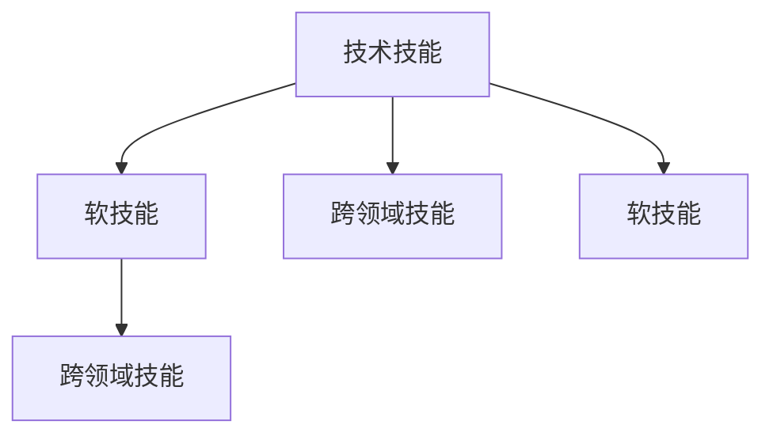

在这个流程图中，我们可以看到技术技能、软技能和跨领域技能之间的相互作用和依赖关系。

**数学模型与公式：**

在新技能的培养与适应过程中，数学模型和公式可以帮助我们量化技能提升的过程。以下是一些常用的数学模型和公式：

- **学习曲线**：描述个人在学习新技能过程中进步的速度。学习曲线通常可以用指数函数来表示：

  $$ L(t) = a \cdot e^{-kt} $$

  其中，\( L(t) \) 是学习者在时间 \( t \) 时的学习水平，\( a \) 是初始学习水平，\( k \) 是学习速率。

- **技能增长模型**：描述个人在特定技能上的增长速度。技能增长模型通常基于幂律分布，如下所示：

  $$ S(t) = \frac{C}{(1 + k \cdot t)^{\alpha}} $$

  其中，\( S(t) \) 是技能水平，\( C \) 是常数，\( k \) 是增长速率，\( \alpha \) 是幂律指数。

这些模型和公式可以帮助我们理解和预测技能提升的过程，为新技能的培养与适应提供科学依据。

**项目实战：**

为了更好地理解新技能的培养与适应，以下是一个项目实战案例：

**项目名称**：技能提升计划

**项目背景**：某科技公司意识到，为了在竞争激烈的市场中保持领先地位，员工需要不断提升自己的技能。因此，公司决定实施一项技能提升计划，帮助员工培养和适应新技能。

**项目目标**：
1. 建立一个全面的技能提升体系，涵盖技术技能、软技能和跨领域技能。
2. 提供多样化的学习资源，包括在线课程、内部培训和工作坊。
3. 通过项目实战和导师指导，帮助员工将所学技能应用到实际工作中。
4. 评估和反馈机制，确保技能提升的有效性和持续性。

**项目实施步骤**：

1. **需求分析**：与员工和管理层沟通，了解他们在技能提升方面的需求和期望。

2. **技能评估**：对员工进行技能评估，确定他们的当前技能水平和提升需求。

3. **资源建设**：开发或采购多样化的学习资源，包括在线课程、内部培训材料和工作坊。

4. **培训计划**：制定个性化的培训计划，根据员工的技能水平和提升需求，安排相应的学习资源和培训活动。

5. **项目实战**：为员工提供实际项目，让他们将所学技能应用到实际工作中，通过实践巩固和提高技能。

6. **评估与反馈**：定期对员工的技能提升情况进行评估，收集反馈，不断优化培训计划。

**代码示例**：

以下是一个简单的Python代码示例，用于跟踪员工的技能提升进度：

```python
import pandas as pd

# 加载员工技能提升数据
skill_progress = pd.read_csv("skill_progress.csv")

# 计算技能提升速度
skill_progress['progress_rate'] = skill_progress['current_skill'] / skill_progress['initial_skill']

# 输出技能提升速度
print(skill_progress[['employee_id', 'progress_rate']])
```

在这个项目中，我们使用Pandas库来跟踪和分析员工的技能提升进度，通过计算技能提升速度，帮助管理层了解员工的提升情况。

**项目小结**：

通过这个项目，我们看到了如何通过系统化的技能提升计划，帮助员工培养和适应新技能。技能提升计划不仅提高了员工的工作能力和职业竞争力，也促进了公司的持续发展和创新。

### 小结

本章我们探讨了新技能的培养与适应，包括技术技能、软技能和跨领域技能的核心概念、相互联系以及数学模型与公式。通过项目实战，我们展示了如何通过系统化的计划和实际行动，帮助员工提升技能，适应未来工作的需求。在下一章中，我们将进一步探讨职业转型的策略与路径，帮助读者理解如何应对职业生涯中的变化。

### 注意事项

1. **持续学习**：新技能的培养不是一蹴而就的，需要持续的投入和努力。建议读者制定长期的学习计划，确保能够持续提升技能。

2. **实践应用**：理论学习固然重要，但实践应用同样关键。通过实际项目和工作任务，可以更好地理解和应用新技能。

3. **跨领域学习**：培养跨领域技能可以提高职业竞争力。建议读者不仅专注于当前领域，还要积极拓展其他领域的知识和技能。

4. **反馈与调整**：在学习过程中，定期进行自我评估和反馈，根据实际情况调整学习计划，确保学习效果。

### 拓展阅读

1. **《深度学习》**：艾恩·古德费洛（Ian Goodfellow）著，是一本关于深度学习的权威教程，适合对人工智能技术感兴趣的读者。

2. **《软技能：代码之外的成长》**：约翰·索尔蒂诺（John Soper）著，探讨了在技术领域中软技能的重要性，适合想要提升软技能的读者。

3. **《跨界思维》**：史蒂芬·博科维奇（Stephen B. Pollan）著，介绍了如何通过跨领域思维解决复杂问题，适合想要拓展跨领域技能的读者。

通过阅读这些书籍，读者可以进一步了解新技能的培养与适应策略，为职业发展打下坚实基础。

### 第4章：职业转型的策略与路径

**核心概念与联系：**

职业转型是指个人在职业生涯中从一种职业角色或行业转移到另一种职业角色或行业的现象。随着技术的快速发展和职业环境的不断变化，职业转型已成为许多人的选择。以下是职业转型的核心概念及其相互联系：

- **职业转型动机**：职业转型的动机可能包括追求更好的职业发展机会、更高的薪酬、更好的工作生活平衡等。了解自己的动机是成功进行职业转型的重要前提。

- **职业评估**：职业评估是指对个人职业兴趣、技能和价值观进行全面的评估，以确定最适合的职业方向。职业评估可以帮助个人明确自己的职业目标，并为转型提供方向。

- **职业规划**：职业规划是指制定明确的职业发展计划，包括短期和长期目标，以及实现这些目标的步骤和方法。职业规划是职业转型的关键，可以帮助个人有针对性地提升技能和积累经验。

- **职业转型路径**：职业转型路径是指个人从当前职业状态到理想职业状态的过程。常见的转型路径包括同行业转型、跨行业转型和自我创业等。了解不同的转型路径，可以帮助个人选择最适合自己的转型方式。

这些概念相互联系，共同构成了职业转型的框架。职业转型的动机决定了个人的转型方向，职业评估帮助确定转型目标，职业规划指导实现目标的步骤，而职业转型路径则是实现目标的实际操作路径。

**Mermaid 流程图：**

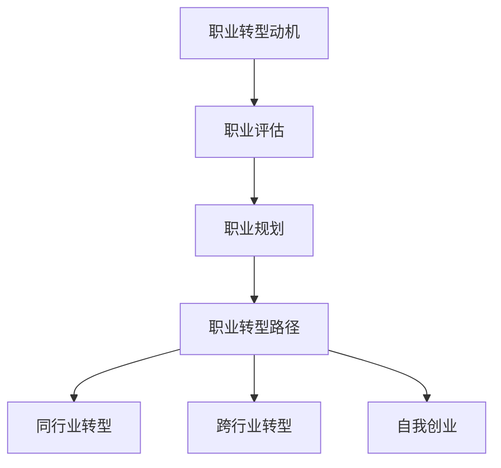

在这个流程图中，我们可以看到职业转型的核心概念及其相互关系，以及不同的转型路径。

**项目实战：**

为了更好地理解职业转型的策略与路径，以下是一个项目实战案例：

**项目名称**：职业转型顾问

**项目背景**：某职场人士在金融行业工作了多年，但由于工作压力过大，他决定寻找一个更具灵活性和平衡工作与生活的工作。他希望通过职业转型，找到一个新的职业方向，既能满足职业发展需求，又能兼顾家庭和个人生活。

**项目目标**：
1. 帮助该职场人士进行职业评估，确定他的职业兴趣和价值观。
2. 根据职业评估结果，制定一个适合他的职业规划。
3. 推荐适合他的职业转型路径，并提供相应的支持和指导。

**项目实施步骤**：

1. **职业评估**：与该职场人士进行深入访谈，了解他的职业兴趣、技能和价值观。使用职业评估工具，如职业兴趣量表和技能评估表，进行定量评估。

2. **职业规划**：根据职业评估结果，制定一个详细的职业规划，包括短期目标（如学习新技能、积累相关经验）和长期目标（如转型成功、找到新的职业方向）。

3. **转型路径推荐**：根据职业规划和该职场人士的实际情况，推荐合适的职业转型路径。例如，如果他希望在保持工作稳定性的同时转型，可以推荐同行业转型；如果他希望有更大的灵活性和自主性，可以推荐跨行业转型或自我创业。

4. **支持与指导**：提供持续的支持和指导，帮助该职场人士在职业转型过程中克服困难，实现目标。

**代码示例**：

以下是一个简单的Python代码示例，用于职业评估数据的处理：

```python
import pandas as pd

# 加载职业评估数据
assessment_data = pd.read_csv("assessment_data.csv")

# 计算总得分
assessment_data['total_score'] = assessment_data['interest_score'] + assessment_data['skill_score'] + assessment_data['value_score']

# 输出总得分
print(assessment_data[['employee_id', 'total_score']])
```

在这个项目中，我们使用Pandas库来处理和分析职业评估数据，通过计算总得分，帮助确定该职场人士的职业兴趣和价值观。

**项目小结**：

通过这个项目，我们看到了如何通过职业评估、职业规划和转型路径推荐，帮助职场人士实现职业转型。职业转型是一个复杂的过程，需要充分准备和科学规划。通过系统化的支持和指导，职场人士可以更顺利地实现职业转型，找到适合自己的职业方向。

### 小结

本章我们探讨了职业转型的策略与路径，包括职业转型动机、职业评估、职业规划和转型路径的核心概念及其相互联系。通过项目实战，我们展示了如何通过系统化的策略和路径，帮助职场人士实现职业转型。在下一章中，我们将详细探讨数据分析与数据科学领域的核心概念和算法原理。

### 最佳实践 Tips

1. **充分准备**：在职业转型前，充分准备是成功的关键。建议读者在转型前对目标行业进行深入了解，包括行业趋势、岗位需求和发展前景。

2. **制定计划**：制定详细的职业转型计划，包括学习目标、时间表和资源分配。这有助于确保转型的有序进行，并跟踪进展。

3. **持续学习**：职业转型不是一蹴而就的，需要持续学习和实践。建议读者参加相关课程、培训和实际项目，不断提升自身能力。

4. **利用网络资源**：利用网络资源和社交媒体，建立专业网络，寻找行业导师和职业顾问，获取职业转型的宝贵建议和指导。

5. **调整心态**：职业转型可能会遇到挑战和困难，保持积极的心态，相信自己的能力，坚持不懈地追求目标。

### 小结

通过本章的内容，我们探讨了职业转型的策略与路径，帮助读者理解如何实现职业发展中的转变。在下一章中，我们将深入分析数据分析与数据科学领域的核心概念和算法原理，帮助读者掌握这一重要技能。

### 拓展阅读

1. **《数据分析实战》**：艾略特·彭博（Eliot Pirnat）著，详细介绍了数据分析的实际应用，适合希望提高数据分析技能的读者。

2. **《数据科学入门》**：约翰·库克（John Cook）著，提供了数据科学的基础知识和实用工具，适合初学者。

3. **《职业转型指南》**：玛丽·凯瑟琳·汉密尔顿（Mary Catherine Hamilton）著，探讨了如何成功进行职业转型，提供了实用的策略和建议。

通过阅读这些书籍，读者可以进一步了解数据分析与数据科学领域的知识和技能，以及如何成功实现职业转型。

### 第5章：数据分析与数据科学

**核心概念与联系：**

数据分析与数据科学是现代商业和科技领域中至关重要的技能。数据分析是指从数据中提取有价值信息的过程，而数据科学则是应用统计、机器学习和计算机科学方法来处理和分析数据的综合性学科。以下是这两个领域的核心概念及其相互联系：

- **数据分析**：数据分析包括数据清洗、数据探索、数据可视化和预测分析等步骤。数据清洗是数据准备的第一步，旨在去除数据中的噪声和错误。数据探索是通过统计方法和可视化技术发现数据中的模式和趋势。数据可视化是将数据分析结果以图形或图表形式展示，使数据更加直观易懂。预测分析是使用历史数据来预测未来趋势或行为。

- **数据科学**：数据科学包括数据预处理、特征工程、模型训练和模型评估等步骤。数据预处理是数据清洗的延伸，涉及数据格式转换、缺失值处理和异常值检测。特征工程是选择和构造对模型有影响的关键特征，以提高模型的预测能力。模型训练是通过训练算法将特征映射到预测结果。模型评估是使用评估指标来评估模型性能，如准确率、召回率和F1分数。

这两个领域紧密相连，数据分析为数据科学提供了基础数据，而数据科学则为数据分析提供了方法和技术。数据分析的结果可以作为数据科学模型的输入，而数据科学模型的分析结果则可以指导数据分析的进一步探索。

**Mermaid 流程图：**

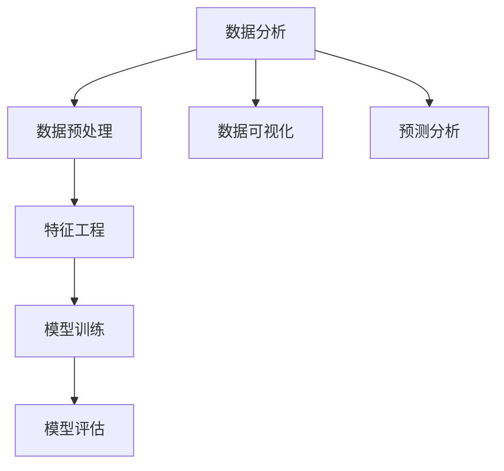

在这个流程图中，我们可以看到数据分析与数据科学之间的相互作用和依赖关系。

**伪代码：**

```python
def 数据分析(data):
    处理数据(data)
    提取特征(extract_features)
    构建模型(build_model)
    预测结果(predict_result)
    返回结果
```

这个伪代码展示了数据分析与数据科学的基本流程，从数据处理到特征提取，再到模型构建和预测，每个步骤都是实现数据分析与数据科学的关键环节。

### 核心算法原理讲解

在数据分析与数据科学中，有许多核心算法原理和技术。以下是几个常见的算法原理及其详细讲解：

**1. 数据预处理**

数据预处理是数据分析与数据科学的基础步骤，它包括以下核心步骤：

- **数据清洗**：去除数据中的错误、重复和异常值。
- **数据转换**：将不同格式的数据转换为统一格式，如将文本数据转换为数值数据。
- **缺失值处理**：填充或删除缺失值，以减少数据噪声。

**算法原理示例：**

```python
import pandas as pd

# 加载数据
data = pd.read_csv("data.csv")

# 去除重复数据
data.drop_duplicates(inplace=True)

# 填充缺失值
data.fillna(method='mean', inplace=True)

# 转换数据格式
data['date'] = pd.to_datetime(data['date'])

# 删除异常值
data = data[data['value'] > 0]
```

在这个示例中，我们使用了Pandas库来处理数据，通过数据清洗、缺失值处理和数据转换，提高了数据质量。

**2. 特征工程**

特征工程是数据科学中至关重要的步骤，它包括以下核心步骤：

- **特征选择**：选择对模型有显著影响的关键特征。
- **特征构造**：通过组合和变换现有特征，构造新的特征。
- **特征标准化**：将不同特征缩放到相同的尺度，以提高模型性能。

**算法原理示例：**

```python
from sklearn.preprocessing import StandardScaler

# 加载数据
X = pd.read_csv("X.csv")
y = pd.read_csv("y.csv")

# 特征选择
selected_features = X[['feature1', 'feature2', 'feature3']]

# 特征构造
X['new_feature'] = X['feature1'] * X['feature2']

# 特征标准化
scaler = StandardScaler()
X_scaled = scaler.fit_transform(selected_features)
```

在这个示例中，我们使用了Scikit-learn库来处理特征工程，通过特征选择、特征构造和特征标准化，提高了模型的预测性能。

**3. 模型训练**

模型训练是数据科学中的核心步骤，它包括以下核心步骤：

- **选择合适的模型**：根据数据特点和业务需求选择合适的模型。
- **训练模型**：使用训练数据训练模型。
- **调整模型参数**：通过交叉验证和超参数优化，调整模型参数以提高性能。

**算法原理示例：**

```python
from sklearn.linear_model import LinearRegression
from sklearn.model_selection import train_test_split
from sklearn.metrics import mean_squared_error

# 分割数据集
X_train, X_test, y_train, y_test = train_test_split(X_scaled, y, test_size=0.2, random_state=42)

# 创建模型
model = LinearRegression()

# 训练模型
model.fit(X_train, y_train)

# 预测
y_pred = model.predict(X_test)

# 评估模型
mse = mean_squared_error(y_test, y_pred)
print(f"Mean Squared Error: {mse}")
```

在这个示例中，我们使用了线性回归模型来训练和评估模型，通过训练数据和测试数据的分割，以及模型的评估，我们可以得到模型的具体性能。

**4. 模型评估**

模型评估是数据科学中至关重要的一步，它包括以下核心步骤：

- **选择合适的评估指标**：根据业务需求和模型特点选择合适的评估指标，如准确率、召回率、F1分数等。
- **计算评估指标**：使用评估指标计算模型的性能。
- **模型优化**：根据评估结果，调整模型参数或选择新的模型，以优化模型性能。

**算法原理示例：**

```python
from sklearn.metrics import accuracy_score

# 计算准确率
accuracy = accuracy_score(y_test, y_pred)
print(f"Accuracy: {accuracy}")
```

在这个示例中，我们使用了准确率作为评估指标，计算模型的预测准确度。

### 项目实战

为了更好地理解数据分析与数据科学的应用，以下是一个项目实战案例：

**项目名称**：客户流失预测

**项目背景**：某电信公司希望通过数据分析预测客户流失，以便采取有效措施提高客户保留率。

**项目目标**：
1. 构建一个客户流失预测模型，准确预测哪些客户可能会流失。
2. 提供具体的业务建议，帮助公司提高客户保留率。

**项目实施步骤**：

1. **数据收集**：收集客户的历史数据，包括客户的基本信息、消费行为、服务质量评分等。

2. **数据预处理**：对数据进行清洗、处理和转换，包括缺失值处理、异常值检测和特征构造。

3. **特征工程**：选择关键特征，构造新的特征，以提高模型的预测性能。

4. **模型训练**：选择合适的模型，使用训练数据进行模型训练。

5. **模型评估**：使用测试数据评估模型性能，调整模型参数，优化模型。

6. **业务建议**：根据模型预测结果，提供具体的业务建议，帮助公司采取有效措施提高客户保留率。

**代码示例**：

以下是一个简单的Python代码示例，用于构建客户流失预测模型：

```python
import pandas as pd
from sklearn.model_selection import train_test_split
from sklearn.ensemble import RandomForestClassifier
from sklearn.metrics import accuracy_score

# 加载数据
data = pd.read_csv("data.csv")

# 分割特征和标签
X = data.drop('churn', axis=1)
y = data['churn']

# 划分训练集和测试集
X_train, X_test, y_train, y_test = train_test_split(X, y, test_size=0.2, random_state=42)

# 创建模型
model = RandomForestClassifier(n_estimators=100)

# 训练模型
model.fit(X_train, y_train)

# 预测
y_pred = model.predict(X_test)

# 评估模型
accuracy = accuracy_score(y_test, y_pred)
print(f"Accuracy: {accuracy}")
```

在这个项目中，我们使用了随机森林分类器来构建客户流失预测模型，并通过测试集评估了模型的性能。这个模型可以帮助公司预测客户流失，为业务决策提供支持。

**项目小结**：

通过这个项目，我们展示了如何利用数据分析与数据科学技术来处理实际业务问题，实现客户流失预测。数据分析与数据科学的应用不仅提高了公司的决策效率，也为客户提供了更好的服务体验。这个项目展示了数据分析与数据科学在商业领域的巨大潜力。

### 小结

数据分析与数据科学是现代商业和科技领域的关键技能。通过本章的内容，我们详细介绍了这两个领域的核心概念、算法原理和项目实战。掌握数据分析与数据科学技能，不仅可以提高工作效率和决策能力，还可以为职业发展打开新的机遇。在下一章中，我们将探讨人工智能与机器学习领域的核心概念和算法原理，继续探索未来工作的技能需求。

### 注意事项

1. **数据质量的重要性**：在数据分析与数据科学项目中，数据质量至关重要。确保数据清洗和预处理步骤的准确性和完整性，是保证模型性能的关键。

2. **算法选择的原则**：根据具体问题和数据特点选择合适的算法。不同的算法适用于不同类型的数据和预测任务，需要根据实际需求进行选择。

3. **模型评估的多样性**：使用多种评估指标来评估模型性能，避免单一指标的误导。同时，结合业务需求，选择最合适的评估指标。

4. **持续学习和更新**：数据分析与数据科学领域技术更新迅速，需要持续学习和掌握最新的算法和技术，以适应不断变化的业务需求。

### 拓展阅读

1. **《Python数据分析实战》**：艾略特·彭博（Eliot Pirnat）著，详细介绍了Python在数据分析中的应用，适合希望提高数据分析技能的读者。

2. **《数据科学入门》**：约翰·库克（John Cook）著，提供了数据科学的基础知识和实用工具，适合初学者。

3. **《机器学习实战》**：彼得·哈林顿（Peter Harrington）著，介绍了机器学习的基本原理和应用，适合对机器学习感兴趣的读者。

通过阅读这些书籍，读者可以进一步了解数据分析与数据科学领域的知识和技能，为职业发展打下坚实基础。

### 第6章：人工智能与机器学习

**核心概念与联系：**

人工智能（AI）和机器学习（ML）是现代技术发展的两大驱动力，它们在多个行业中扮演着关键角色。AI是一种模拟人类智能的技术，包括感知、推理、学习和决策等能力。机器学习是AI的一个重要分支，专注于通过数据学习规律并做出预测或决策。以下是这两个领域的核心概念及其相互联系：

- **人工智能**：人工智能的核心目标是构建能够执行复杂任务的智能系统。这包括感知环境、理解语言、解决问题和自主决策等。人工智能包括多个子领域，如自然语言处理（NLP）、计算机视觉、机器人技术和智能代理等。

- **机器学习**：机器学习是使计算机能够从数据中学习规律并自动改进性能的技术。机器学习算法分为监督学习、无监督学习和强化学习。监督学习从标记数据中学习，无监督学习发现数据中的隐含结构，强化学习通过与环境的交互学习最佳策略。

人工智能与机器学习相互关联，人工智能为机器学习提供了应用场景，而机器学习则为人工智能提供了实现智能决策和任务执行的工具。

**Mermaid 流程图：**

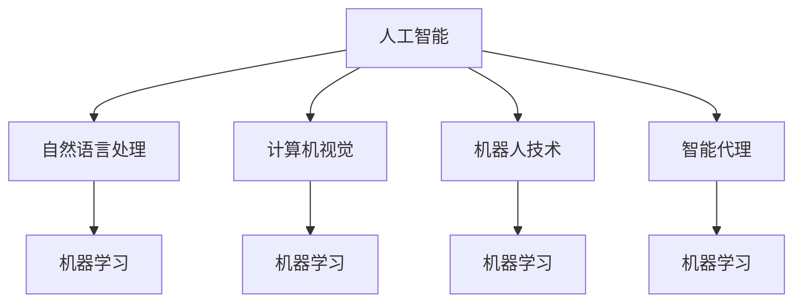

在这个流程图中，我们可以看到人工智能与机器学习之间的相互作用和依赖关系。

**核心算法原理讲解：**

在人工智能与机器学习领域，有许多核心算法原理。以下是几个常见的算法原理及其详细讲解：

**1. 监督学习**

监督学习是机器学习中最常见的类型，它使用标记数据来训练模型。监督学习算法分为回归和分类。

- **线性回归**：线性回归是一种简单的监督学习算法，用于预测连续值。它通过找到输入特征和输出特征之间的线性关系来预测结果。

  **算法原理示例：**

  ```python
  from sklearn.linear_model import LinearRegression

  # 创建线性回归模型
  model = LinearRegression()

  # 训练模型
  model.fit(X_train, y_train)

  # 预测
  y_pred = model.predict(X_test)
  ```

- **逻辑回归**：逻辑回归是一种用于预测概率的分类算法。它通过找到输入特征和输出概率之间的线性关系来预测分类结果。

  **算法原理示例：**

  ```python
  from sklearn.linear_model import LogisticRegression

  # 创建逻辑回归模型
  model = LogisticRegression()

  # 训练模型
  model.fit(X_train, y_train)

  # 预测
  y_pred = model.predict(X_test)
  ```

**2. 决策树**

决策树是一种基于树形结构的监督学习算法，用于分类和回归任务。决策树通过一系列的决策规则对数据点进行划分，直到达到某个终止条件。

**算法原理示例：**

```python
from sklearn.tree import DecisionTreeClassifier

# 创建决策树模型
model = DecisionTreeClassifier()

# 训练模型
model.fit(X_train, y_train)

# 预测
y_pred = model.predict(X_test)
```

**3. 随机森林**

随机森林是一种基于决策树的集成学习方法，它通过构建多个决策树，并结合它们的预测结果来提高模型性能。

**算法原理示例：**

```python
from sklearn.ensemble import RandomForestClassifier

# 创建随机森林模型
model = RandomForestClassifier(n_estimators=100)

# 训练模型
model.fit(X_train, y_train)

# 预测
y_pred = model.predict(X_test)
```

**4. 支持向量机（SVM）**

支持向量机是一种基于边界优化的监督学习算法，它通过找到最佳边界将数据点分类。

**算法原理示例：**

```python
from sklearn.svm import SVC

# 创建支持向量机模型
model = SVC()

# 训练模型
model.fit(X_train, y_train)

# 预测
y_pred = model.predict(X_test)
```

**5. 卷积神经网络（CNN）**

卷积神经网络是一种基于卷积操作的深度学习算法，常用于图像识别和物体检测。

**算法原理示例：**

```python
from tensorflow.keras.models import Sequential
from tensorflow.keras.layers import Conv2D, MaxPooling2D, Flatten, Dense

# 创建卷积神经网络模型
model = Sequential([
    Conv2D(32, (3, 3), activation='relu', input_shape=(64, 64, 3)),
    MaxPooling2D((2, 2)),
    Flatten(),
    Dense(1, activation='sigmoid')
])

# 编译模型
model.compile(optimizer='adam', loss='binary_crossentropy', metrics=['accuracy'])

# 训练模型
model.fit(X_train, y_train, epochs=10, batch_size=32)

# 预测
y_pred = model.predict(X_test)
```

**项目实战：**

为了更好地理解人工智能与机器学习在现实中的应用，以下是一个项目实战案例：

**项目名称**：智能推荐系统

**项目背景**：某电子商务平台希望通过智能推荐系统向用户推荐他们可能感兴趣的商品，以提高用户满意度和销售转化率。

**项目目标**：
1. 构建一个基于用户行为的推荐模型，预测用户对特定商品的感兴趣程度。
2. 提供个性化的推荐列表，根据用户的浏览历史和购买记录进行商品推荐。

**项目实施步骤**：

1. **数据收集**：收集用户的历史行为数据，包括浏览记录、购买记录和用户互动数据。

2. **数据预处理**：对用户行为数据进行清洗和转换，包括缺失值处理、异常值检测和特征构造。

3. **特征工程**：选择关键特征，构建用户兴趣特征，以提高推荐模型的性能。

4. **模型训练**：选择合适的推荐算法，如协同过滤、基于内容的推荐和深度学习推荐，训练推荐模型。

5. **模型评估**：使用交叉验证和A/B测试等方法评估推荐模型的效果，并根据评估结果调整模型参数。

6. **部署与优化**：将推荐模型部署到生产环境中，根据用户反馈和业务指标持续优化模型。

**代码示例**：

以下是一个简单的Python代码示例，用于构建基于协同过滤的推荐模型：

```python
import pandas as pd
from surprise import SVD, Reader

# 加载数据
data = pd.read_csv("rating_data.csv")

# 初始化Reader
reader = Reader(rating_scale=(1.0, 5.0))

# 加载数据集
trainset = data[['user_id', 'item_id', 'rating']].values

# 创建SVD模型
model = SVD()

# 训练模型
model.fit(trainset)

# 预测
predictions = model.predict(1, 1001)

# 输出预测结果
print(predictions)
```

在这个项目中，我们使用了SVD算法构建推荐模型，通过用户-物品评分数据训练模型，并预测用户对特定物品的兴趣程度。这个推荐模型可以帮助电子商务平台为用户提供个性化的商品推荐。

**项目小结**：

通过这个项目，我们展示了如何利用人工智能与机器学习技术构建智能推荐系统，提高用户体验和销售转化率。智能推荐系统不仅提高了用户满意度，也为企业带来了商业价值。这个项目展示了人工智能与机器学习在商业领域的广泛应用和潜力。

### 小结

人工智能与机器学习是现代技术发展的重要驱动力，它们在多个行业中发挥着关键作用。通过本章的内容，我们详细介绍了这两个领域的核心概念、算法原理和项目实战。掌握人工智能与机器学习技能，不仅可以提高工作效率和创新能力，还可以为职业发展打开新的机遇。在下一章中，我们将探讨自动化与机器人技术领域的核心概念和应用。

### 注意事项

1. **数据质量和预处理**：确保数据质量和预处理是成功应用人工智能与机器学习的基础。数据噪声、缺失值和异常值都会影响模型性能，需要仔细处理。

2. **算法选择与调优**：根据具体问题和数据特点选择合适的算法，并进行适当的调优，以提高模型性能和预测准确度。

3. **模型解释性**：在某些应用场景中，模型的解释性至关重要。了解模型的工作原理和决策过程，可以帮助我们更好地理解和应用人工智能与机器学习技术。

4. **持续学习和更新**：人工智能与机器学习领域技术更新迅速，需要持续学习和掌握最新的算法和技术，以适应不断变化的业务需求。

### 拓展阅读

1. **《深度学习》**：艾恩·古德费洛（Ian Goodfellow）著，详细介绍了深度学习的基本原理和应用，适合希望深入了解深度学习的读者。

2. **《机器学习实战》**：彼得·哈林顿（Peter Harrington）著，提供了机器学习的基础知识和实际应用案例，适合初学者和进阶读者。

3. **《Python机器学习》**：塞巴斯蒂安·拉斯克和约书亚·比萨里耶（Sebastian Raschka and Vahid Mirjalili）著，介绍了Python在机器学习中的应用，适合对机器学习感兴趣的读者。

通过阅读这些书籍，读者可以进一步了解人工智能与机器学习的核心概念和算法原理，为实际应用提供指导。

### 第7章：自动化与机器人技术

**核心概念与联系：**

自动化与机器人技术是现代工业和科技发展的重要驱动力，它们通过计算机程序和智能机器实现工作的自动化和智能化，从而提高生产效率和质量。以下是这两个领域的核心概念及其相互联系：

- **自动化**：自动化是指使用机器和计算机系统来替代人类完成工作。它包括自动化生产、自动化物流和自动化服务等。自动化技术通过预定义的程序和规则，使机器能够自动执行任务，从而减少人力成本和提高生产效率。

- **机器人技术**：机器人技术是制造和开发能够执行特定任务的智能机器的技术。机器人可以执行重复性、危险或复杂的任务，从而提高生产效率和质量。机器人技术包括机器人的设计、制造、编程和操作。

自动化与机器人技术相互关联，自动化技术为机器人技术提供了基础，而机器人技术则扩展了自动化的应用范围。自动化技术通过计算机程序控制机器人的行为，使机器人能够执行更复杂和灵活的任务。

**Mermaid 流程图：**

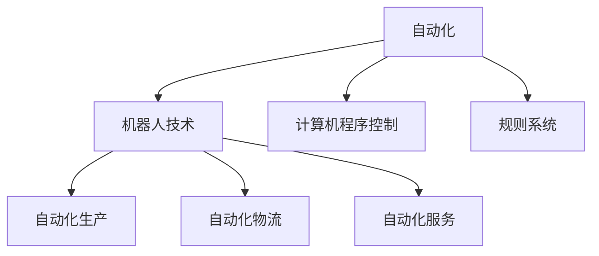

在这个流程图中，我们可以看到自动化与机器人技术之间的相互作用和依赖关系。

**核心算法原理讲解：**

在自动化与机器人技术领域，有许多核心算法原理和技术。以下是几个常见的算法原理及其详细讲解：

**1. 运动控制算法**

运动控制算法是控制机器人运动的关键技术，它通过数学模型和算法来控制机器人的运动轨迹和速度。

- **PID控制算法**：PID控制算法是一种常见的运动控制算法，它通过比例（P）、积分（I）和微分（D）三个部分来调整控制信号，以实现精确的运动控制。

  **算法原理示例：**

  ```python
  class PIDController:
      def __init__(self, Kp, Ki, Kd):
          self.Kp = Kp
          self.Ki = Ki
          self.Kd = Kd
          self.error = 0
          self.integral = 0
          self.previous_error = 0

      def update(self, setpoint, current_value):
          error = setpoint - current_value
          self.integral += error
          derivative = error - self.previous_error
          output = self.Kp * error + self.Ki * self.integral + self.Kd * derivative
          self.previous_error = error
          return output
  ```

- **轨迹规划算法**：轨迹规划算法是机器人路径规划的关键技术，它通过预定义的路径和算法来规划机器人的运动轨迹。

  **算法原理示例：**

  ```python
  import numpy as np

  def trajectory Planning(start_point, goal_point, max_speed, max_acceleration):
      distance = np.linalg.norm(goal_point - start_point)
      time = distance / max_speed
      velocity = max_speed
      acceleration = max_acceleration
      trajectory = []

      for t in range(int(time)):
          position = start_point + velocity * t + 0.5 * acceleration * t**2
          trajectory.append(position)

      return trajectory
  ```

**2. 机器视觉算法**

机器视觉算法是机器人感知和理解环境的关键技术，它通过图像处理和计算机视觉技术来分析图像数据。

- **图像识别算法**：图像识别算法是机器视觉的核心，它通过训练模型来识别图像中的对象和特征。

  **算法原理示例：**

  ```python
  import tensorflow as tf
  from tensorflow.keras.models import Sequential
  from tensorflow.keras.layers import Conv2D, MaxPooling2D, Flatten, Dense

  # 创建卷积神经网络模型
  model = Sequential([
      Conv2D(32, (3, 3), activation='relu', input_shape=(64, 64, 3)),
      MaxPooling2D((2, 2)),
      Flatten(),
      Dense(1, activation='sigmoid')
  ])

  # 编译模型
  model.compile(optimizer='adam', loss='binary_crossentropy', metrics=['accuracy'])

  # 训练模型
  model.fit(x_train, y_train, epochs=10, batch_size=32)

  # 预测
  y_pred = model.predict(x_test)
  ```

- **目标检测算法**：目标检测算法是机器视觉中的另一个重要任务，它通过检测图像中的对象并标注其位置。

  **算法原理示例：**

  ```python
  import tensorflow as tf
  from tensorflow.keras.models import Model
  from tensorflow.keras.layers import Input, Conv2D, MaxPooling2D, Flatten, Dense

  # 创建Faster R-CNN模型
  model = Model(inputs=[Input(shape=(None, None, 3))], outputs=[Flatten()(Conv2D(1, (1, 1), activation='sigmoid')(Input())])

  # 编译模型
  model.compile(optimizer='adam', loss='binary_crossentropy')

  # 训练模型
  model.fit(x_train, y_train, epochs=10, batch_size=32)

  # 预测
  y_pred = model.predict(x_test)
  ```

**3. 机器人行为规划算法**

机器人行为规划算法是使机器人能够自主执行任务的关键技术，它通过算法和模型来规划机器人的行动。

- **状态机算法**：状态机算法是一种简单而有效的行为规划算法，它通过定义一系列状态和转换规则来控制机器人的行为。

  **算法原理示例：**

  ```python
  class StateMachine:
      def __init__(self, states):
          self.states = states
          self.current_state = states[0]

      def update(self, sensors):
          if sensors['sensor1'] and not sensors['sensor2']:
              self.current_state = self.states[1]
          elif not sensors['sensor1'] and sensors['sensor2']:
              self.current_state = self.states[2]

  # 示例传感器数据
  sensors = {'sensor1': True, 'sensor2': False}

  # 更新状态机
  state_machine.update(sensors)
  ```

- **强化学习算法**：强化学习算法是一种基于奖励和惩罚的学习方法，它通过试错和反馈来优化机器人的行为。

  **算法原理示例：**

  ```python
  import tensorflow as tf
  from tensorflow.keras.models import Sequential
  from tensorflow.keras.layers import Dense

  # 创建强化学习模型
  model = Sequential([
      Dense(64, activation='relu', input_shape=(8,)),
      Dense(64, activation='relu'),
      Dense(1, activation='sigmoid')
  ])

  # 编译模型
  model.compile(optimizer='adam', loss='binary_crossentropy')

  # 训练模型
  model.fit(x_train, y_train, epochs=10, batch_size=32)

  # 预测
  action_values = model.predict(x_test)
  ```

**项目实战：**

为了更好地理解自动化与机器人技术的应用，以下是一个项目实战案例：

**项目名称**：自动化工厂生产线

**项目背景**：某汽车制造企业希望提高生产效率和质量，决定引入自动化机器人技术，构建一个自动化工厂生产线。

**项目目标**：
1. 设计和实现一个自动化工厂生产线，使汽车零部件的组装和检测过程实现自动化。
2. 通过自动化技术，减少人工操作，提高生产效率和质量。
3. 实现生产线的远程监控和故障诊断，提高生产线运行的稳定性和可靠性。

**项目实施步骤**：

1. **需求分析**：与生产团队和工程师沟通，了解生产线的具体需求和流程，确定自动化生产线的功能和技术要求。

2. **系统设计**：根据需求分析，设计自动化生产线的整体架构，包括机器人的选择、控制系统的设计和传感器的配置。

3. **系统开发**：开发自动化生产线的控制系统和软件，实现机器人的编程和操作。

4. **系统集成**：将自动化生产线与现有的生产设备集成，实现自动化生产流程。

5. **测试与部署**：对自动化生产线进行测试，确保其能够稳定运行，并部署到实际生产环境中。

**代码示例**：

以下是一个简单的Python代码示例，用于控制机器人的运动：

```python
import robot_controller

# 设置机器人的目标位置
target_position = np.array([1.0, 2.0, 3.0])

# 控制机器人移动到目标位置
robot_controller.move_to(target_position)

# 等待机器人移动完成
robot_controller.wait()

# 输出机器人当前的位置
current_position = robot_controller.get_position()
print("Current Position:", current_position)
```

在这个项目中，我们使用Python编写代码，控制机器人在自动化生产线上的运动。通过精确的运动控制，机器人可以完成复杂的组装和检测任务，提高生产效率和质量。

**项目小结**：

通过这个项目，我们展示了如何利用自动化与机器人技术构建自动化工厂生产线，提高生产效率和质量。自动化与机器人技术的应用不仅减少了人工操作，还提高了生产线的稳定性和可靠性。这个项目展示了自动化与机器人技术在工业生产中的巨大潜力。

### 小结

自动化与机器人技术是现代工业和科技发展的重要驱动力，它们通过计算机程序和智能机器实现工作的自动化和智能化，从而提高生产效率和质量。通过本章的内容，我们详细介绍了自动化与机器人技术的核心概念、算法原理和项目实战。掌握自动化与机器人技术，不仅可以提高工作效率和创新能力，还可以为职业发展打开新的机遇。在下一章中，我们将探讨数字营销与社交媒体的核心概念和应用。

### 注意事项

1. **技术安全性**：在自动化与机器人技术应用中，确保系统的安全性至关重要。需要采取适当的安全措施，防止系统故障和信息安全问题。

2. **系统集成**：自动化与机器人技术的应用需要与其他生产设备和系统集成，确保系统的稳定性和协同工作。

3. **持续维护与更新**：自动化与机器人技术需要定期维护和更新，以确保系统的稳定运行和持续优化。

4. **人员培训**：自动化与机器人技术的应用需要专业的技术人员进行操作和维护。对相关人员进行全面培训，提高其技术水平和操作能力。

### 拓展阅读

1. **《机器人技术基础》**：迈克尔·阿姆斯特朗（Michael Armstrong）著，详细介绍了机器人技术的基本原理和应用。

2. **《自动化技术与应用》**：克里斯托弗·塔伊尔（Christopher Tarry）著，介绍了自动化技术在不同行业中的应用。

3. **《机器学习与机器人控制》**：尼古拉斯·R.麦克唐纳（Nicholas R. McPhee）著，探讨了机器学习技术在机器人控制中的应用。

通过阅读这些书籍，读者可以进一步了解自动化与机器人技术的核心概念和应用，为实际工作提供指导。

### 第8章：数字营销与社交媒体

**核心概念与联系：**

数字营销与社交媒体是现代营销的重要组成部分，它们通过互联网和移动设备与消费者进行互动，实现品牌推广、客户获取和销售转化。以下是这两个领域的核心概念及其相互联系：

- **数字营销**：数字营销是指利用互联网和数字技术进行营销活动的总称，包括搜索引擎营销（SEM）、内容营销、电子邮件营销、社交媒体营销等。数字营销的主要目标是提高品牌知名度、增加网站流量和促进销售。

- **社交媒体营销**：社交媒体营销是通过社交媒体平台（如微博、微信、Facebook、Instagram等）与消费者进行互动和沟通的营销活动。社交媒体营销的核心在于建立品牌形象、提升客户满意度和促进社交媒体上的口碑传播。

数字营销与社交媒体营销相互补充，数字营销为社交媒体营销提供了广泛的渠道和工具，而社交媒体营销则为数字营销提供了直接与消费者互动的途径。

**Mermaid 流程图：**

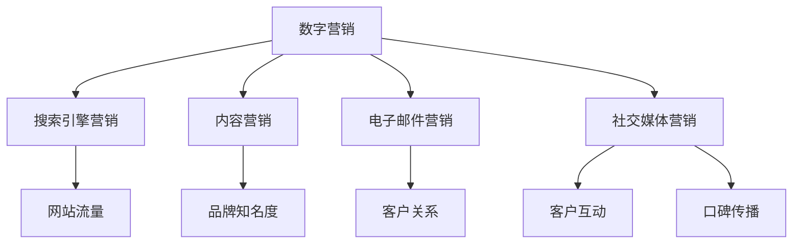

在这个流程图中，我们可以看到数字营销与社交媒体营销之间的相互作用和依赖关系。

**核心算法原理讲解：**

在数字营销与社交媒体营销中，有许多核心算法原理和技术。以下是几个常见的算法原理及其详细讲解：

**1. 数据分析**

数据分析是数字营销与社交媒体营销的基础，它通过分析用户行为、市场趋势和营销效果，为营销决策提供数据支持。数据分析算法包括数据预处理、特征工程和预测分析。

- **数据预处理**：数据预处理是数据分析的第一步，它涉及数据的清洗、转换和整合。数据预处理算法包括缺失值处理、异常值检测和数据标准化。

  **算法原理示例：**

  ```python
  import pandas as pd

  # 加载数据
  data = pd.read_csv("data.csv")

  # 去除重复数据
  data.drop_duplicates(inplace=True)

  # 填充缺失值
  data.fillna(method='mean', inplace=True)

  # 数据标准化
  from sklearn.preprocessing import StandardScaler
  scaler = StandardScaler()
  data_scaled = scaler.fit_transform(data)
  ```

- **特征工程**：特征工程是通过选择和构造特征，提高模型预测性能的过程。特征工程算法包括特征选择、特征构造和特征变换。

  **算法原理示例：**

  ```python
  from sklearn.feature_selection import SelectKBest
  from sklearn.feature_extraction.text import CountVectorizer

  # 加载文本数据
  text_data = pd.read_csv("text_data.csv")

  # 特征提取
  vectorizer = CountVectorizer(max_features=1000)
  X = vectorizer.fit_transform(text_data['content'])

  # 特征选择
  selector = SelectKBest(k=500)
  X_selected = selector.fit_transform(X, text_data['label'])
  ```

- **预测分析**：预测分析是使用历史数据预测未来趋势或行为的过程。预测分析算法包括回归分析、决策树和神经网络等。

  **算法原理示例：**

  ```python
  from sklearn.ensemble import RandomForestClassifier

  # 加载训练数据
  X_train, X_test, y_train, y_test = train_test_split(X_selected, text_data['label'], test_size=0.2, random_state=42)

  # 创建模型
  model = RandomForestClassifier(n_estimators=100)

  # 训练模型
  model.fit(X_train, y_train)

  # 预测
  y_pred = model.predict(X_test)

  # 评估模型
  accuracy = accuracy_score(y_test, y_pred)
  print(f"Accuracy: {accuracy}")
  ```

**2. 社交媒体分析**

社交媒体分析是社交媒体营销的重要组成部分，它通过分析社交媒体平台上的数据，了解消费者行为和需求。社交媒体分析算法包括情感分析、主题建模和社交网络分析。

- **情感分析**：情感分析是使用自然语言处理技术，分析社交媒体文本中的情感倾向。情感分析算法包括文本分类和情感评分。

  **算法原理示例：**

  ```python
  from textblob import TextBlob

  # 加载文本数据
  text_data = pd.read_csv("text_data.csv")

  # 情感分析
  def get_sentiment(text):
      return TextBlob(text).sentiment.polarity

  text_data['sentiment'] = text_data['content'].apply(get_sentiment)

  # 情感评分
  print(text_data['sentiment'].describe())
  ```

- **主题建模**：主题建模是使用统计方法，发现文本数据中的隐含主题。主题建模算法包括LDA（latent Dirichlet allocation）和NMF（non-negative matrix factorization）。

  **算法原理示例：**

  ```python
  from gensim import corpora, models

  # 加载文本数据
  text_data = pd.read_csv("text_data.csv")

  # 文本预处理
  texts = [text.lower() for text in text_data['content']]

  # 构建词典和语料库
  dictionary = corpora.Dictionary(texts)
  corpus = [dictionary.doc2bow(text) for text in texts]

  # 主题建模
  lda_model = models.LdaMulticore(corpus, num_topics=10, id2word=dictionary, passes=10, workers=2)

  # 输出主题分布
  print(lda_model.show_topics())
  ```

- **社交网络分析**：社交网络分析是使用图论和社交网络分析方法，研究社交媒体平台上的用户互动和网络结构。社交网络分析算法包括节点中心性、社区检测和网络传播等。

  **算法原理示例：**

  ```python
  import networkx as nx

  # 加载社交网络数据
  graph_data = pd.read_csv("graph_data.csv")

  # 构建社交网络图
  graph = nx.Graph()
  graph.add_nodes_from(graph_data['user_id'])
  graph.add_edges_from(zip(graph_data['user_id'], graph_data['friend_id']))

  # 节点中心性
  print(nx.degree_centrality(graph))

  # 社区检测
  communities = nx community Louvain CommunityDetection(graph)
  print(community)
  ```

**项目实战：**

为了更好地理解数字营销与社交媒体营销的应用，以下是一个项目实战案例：

**项目名称**：社交媒体营销策略分析

**项目背景**：某电子商务企业希望在社交媒体平台上提高品牌知名度和销售转化率，决定开展一次社交媒体营销活动。

**项目目标**：
1. 分析目标受众，确定社交媒体营销策略。
2. 制定具体的社交媒体营销计划，包括内容策划、广告投放和用户互动。
3. 评估社交媒体营销效果，提供改进建议。

**项目实施步骤**：

1. **市场调研**：通过问卷调查、用户访谈和数据分析，了解目标受众的特征、需求和行为。

2. **内容策划**：根据市场调研结果，制定社交媒体营销内容，包括图文、视频和互动活动。

3. **广告投放**：在社交媒体平台上进行广告投放，包括定向广告和付费推广，以提高品牌曝光度和点击率。

4. **用户互动**：通过社交媒体平台与用户进行互动，包括回复评论、参与话题讨论和举办线上活动，提高用户参与度和忠诚度。

5. **效果评估**：通过数据分析，评估社交媒体营销效果，包括品牌知名度、用户参与度和销售转化率。

6. **优化建议**：根据效果评估结果，提出改进建议，优化社交媒体营销策略。

**代码示例**：

以下是一个简单的Python代码示例，用于分析社交媒体平台上的用户互动：

```python
import pandas as pd
import matplotlib.pyplot as plt

# 加载社交媒体数据
social_media_data = pd.read_csv("social_media_data.csv")

# 统计用户互动次数
user_interactions = social_media_data.groupby('user_id')['interaction'].nunique()

# 绘制用户互动次数分布图
plt.bar(user_interactions.index, user_interactions.values)
plt.xlabel('User ID')
plt.ylabel('Number of Interactions')
plt.title('User Interaction Distribution')
plt.xticks(rotation=90)
plt.show()
```

在这个项目中，我们使用Pandas库和Matplotlib库分析社交媒体平台上的用户互动次数，通过绘制条形图，直观展示用户互动次数的分布情况。这个分析结果可以帮助企业了解用户的参与度和活跃度，为后续的营销活动提供参考。

**项目小结**：

通过这个项目，我们展示了如何利用数字营销与社交媒体营销技术，分析目标受众、策划营销内容、进行广告投放和用户互动，评估营销效果。数字营销与社交媒体营销不仅提高了品牌知名度和用户参与度，也为企业带来了实际的销售增长。这个项目展示了数字营销与社交媒体营销在商业领域的广泛应用和巨大潜力。

### 小结

数字营销与社交媒体营销是现代营销的重要组成部分，它们通过互联网和移动设备与消费者进行互动，实现品牌推广、客户获取和销售转化。通过本章的内容，我们详细介绍了数字营销与社交媒体营销的核心概念、算法原理和项目实战。掌握数字营销与社交媒体营销技能，不仅可以提高品牌知名度和用户参与度，还可以为职业发展打开新的机遇。在下一章中，我们将探讨终身学习与职业成长的相关策略和技巧。

### 注意事项

1. **数据分析的重要性**：数字营销与社交媒体营销依赖于数据分析，确保数据质量和准确性是成功的关键。需要定期清洗和维护数据，以避免数据噪声和偏差。

2. **内容策划的创新性**：成功的数字营销与社交媒体营销依赖于创新和有价值的内容。需要不断关注行业趋势和用户需求，创造吸引人的内容和互动方式。

3. **用户互动的持续性**：与用户建立良好的互动关系需要持续的努力。需要定期与用户沟通，了解他们的需求和反馈，持续优化营销策略。

4. **效果评估的及时性**：及时评估数字营销与社交媒体营销的效果，可以帮助企业快速调整策略，提高营销效果。需要建立有效的监控和评估机制。

### 拓展阅读

1. **《数字营销策略》**：戴维·梅特卡夫（David Meerman Scott）著，详细介绍了数字营销的基本原理和策略。

2. **《社交媒体营销实战》**：斯卡利特·托马斯（Scarlett Thomas）著，提供了社交媒体营销的实用技巧和案例。

3. **《数据分析实战》**：艾略特·彭博（Eliot Pirnat）著，介绍了数据分析的实际应用和技巧。

通过阅读这些书籍，读者可以进一步了解数字营销与社交媒体营销的核心概念和应用技巧，为职业发展提供指导。

### 第9章：终身学习与职业成长

**核心概念与联系：**

终身学习与职业成长是现代社会中不可或缺的部分。终身学习强调个人在职业生涯中不断学习和提升技能，以适应不断变化的工作环境。职业成长则是指个人在职业发展过程中不断提升自己的职位和技能水平，实现职业生涯的目标。以下是这两个领域的核心概念及其相互联系：

- **终身学习**：终身学习是一种持续的学习态度和生活方式，它要求个人不断更新知识和技能，以应对职业发展的需求。终身学习不仅包括正式教育，还包括自学、实践和参与培训。

- **职业成长**：职业成长是指个人在职业生涯中通过不断提升技能、职位和影响力，实现职业发展的目标。职业成长包括职业规划、技能提升、职位晋升和职业转型等。

终身学习与职业成长相互联系，终身学习为职业成长提供了知识和技能的基础，而职业成长则为终身学习提供了实践和应用的机会。

**Mermaid 流程图：**

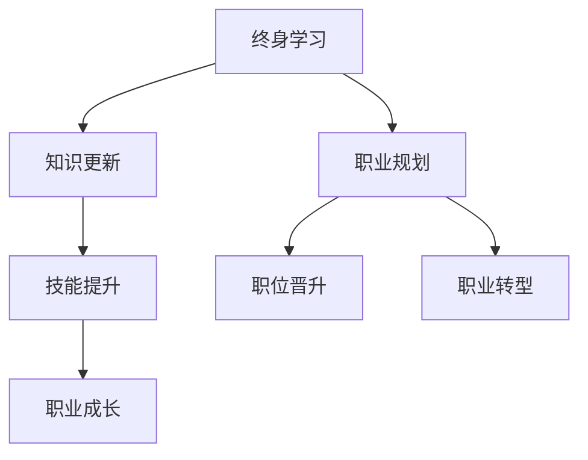

在这个流程图中，我们可以看到终身学习与职业成长之间的相互作用和依赖关系。

**数学模型与公式：**

终身学习与职业成长可以通过数学模型来描述和量化。以下是几个常用的数学模型和公式：

- **学习曲线**：学习曲线描述了个人在学习新技能或知识时的进步速度。学习曲线通常用指数函数表示，如下所示：

  $$ L(t) = a \cdot e^{-kt} $$

  其中，\( L(t) \) 是学习者在时间 \( t \) 的学习水平，\( a \) 是初始学习水平，\( k \) 是学习速率。

- **技能增长模型**：技能增长模型描述了个人在特定技能上的增长速度。技能增长模型通常基于幂律分布，如下所示：

  $$ S(t) = \frac{C}{(1 + k \cdot t)^{\alpha}} $$

  其中，\( S(t) \) 是技能水平，\( C \) 是常数，\( k \) 是增长速率，\( \alpha \) 是幂律指数。

这些模型和公式可以帮助我们理解和预测终身学习与职业成长的过程。

**项目实战：**

为了更好地理解终身学习与职业成长的应用，以下是一个项目实战案例：

**项目名称**：个人职业发展计划

**项目背景**：某职场人士希望在职业生涯中实现更大的发展，决定制定一个个人职业发展计划，以实现职业成长的目标。

**项目目标**：
1. 进行个人职业评估，了解自身的优势和劣势。
2. 制定明确的职业发展目标和行动计划。
3. 通过学习和实践，不断提升自身的技能和职位水平。
4. 定期评估职业发展计划的实施情况，调整目标和计划。

**项目实施步骤**：

1. **职业评估**：使用职业评估工具和方法，对自身的职业兴趣、技能、价值观和工作习惯进行评估，了解自身的优势和劣势。

2. **目标设定**：根据职业评估结果，设定具体的职业发展目标，如晋升至管理层、掌握新技能等。

3. **行动计划**：制定详细的行动计划，包括学习新技能、参加培训、参与项目等，以实现职业发展目标。

4. **执行与监控**：执行行动计划，并定期评估职业发展计划的实施情况，根据实际情况调整目标和计划。

5. **反馈与调整**：收集反馈，根据反馈调整职业发展计划和行动计划，确保职业发展目标的实现。

**代码示例**：

以下是一个简单的Python代码示例，用于跟踪职业发展计划的实施情况：

```python
import pandas as pd

# 加载职业发展计划数据
development_plan = pd.read_csv("development_plan.csv")

# 计算完成任务的比例
completed_tasks = development_plan[development_plan['status'] == 'Completed']['task_id'].count()
total_tasks = development_plan['task_id'].count()
completion_rate = completed_tasks / total_tasks

# 输出完成情况
print(f"Completion Rate: {completion_rate:.2f}")
```

在这个项目中，我们使用Pandas库来处理职业发展计划数据，通过计算完成任务的比例，了解职业发展计划的实施情况。这个工具可以帮助个人和管理层实时跟踪职业发展计划的进展。

**项目小结**：

通过这个项目，我们展示了如何通过终身学习和职业规划，实现个人的职业成长。终身学习为职业成长提供了知识和技能的基础，职业规划则为职业成长提供了明确的目标和路径。通过项目实战，我们可以更好地理解和应用终身学习与职业成长的理念和方法。

### 小结

终身学习与职业成长是现代社会中不可或缺的部分。通过本章的内容，我们详细介绍了终身学习与职业成长的核心概念、数学模型和项目实战。掌握终身学习与职业成长的策略和技巧，可以帮助个人在职业生涯中不断提升自身的能力和职位水平，实现职业发展的目标。在下一章中，我们将探讨跨领域技能的重要性及其培养方法。

### 注意事项

1. **目标设定**：在制定职业发展计划时，设定明确的目标和里程碑，有助于个人有针对性地提升技能和实现职业成长。

2. **持续学习**：终身学习是职业成长的基石，需要个人持续投入时间和精力进行学习和实践。

3. **灵活调整**：职业发展过程中，环境和需求会发生变化，需要灵活调整职业规划和行动计划，以适应新的情况。

4. **反馈与反思**：定期进行反馈和反思，了解自身的进步和不足，有助于优化职业发展计划和提升职业成长效果。

### 拓展阅读

1. **《终身学习：个人成长的力量》**：史蒂芬·柯维（Stephen R. Covey）著，介绍了终身学习的重要性和方法。

2. **《职业规划指南》**：克里斯·科里斯（Chris Corrins）著，提供了职业规划的基本原则和实践方法。

3. **《跨领域技能培养》**：约瑟夫·马利亚诺（Joseph M. Marianno）著，探讨了跨领域技能的培养和应用。

通过阅读这些书籍，读者可以进一步了解终身学习与职业成长的核心概念和实践方法，为职业发展提供指导。

### 第10章：跨领域技能拓展

**核心概念与联系：**

跨领域技能是指在不同领域间转移和应用的技能，如编程技能在数据分析和人工智能领域中的应用。跨领域技能可以帮助个人更好地适应多种工作环境，提高职业竞争力。以下是跨领域技能的核心概念及其相互联系：

- **跨领域技能的概念**：跨领域技能是指在一种领域中学到的知识和能力，能够转移到其他领域。例如，编程技能不仅在软件开发领域重要，也在数据分析、机器学习和自动化等领域有着广泛的应用。

- **跨领域技能的重要性**：跨领域技能的重要性体现在以下几个方面：
  - **增强职业适应性**：跨领域技能使个人能够适应不同的工作环境和需求，减少职业转换的障碍。
  - **提高工作效率**：跨领域技能可以减少对特定领域的依赖，使个人能够更高效地处理复杂问题。
  - **提升创新能力**：跨领域技能有助于个人从多个角度思考问题，提高创新能力和解决问题的能力。

- **跨领域技能的融合与应用**：跨领域技能的融合与应用是指将不同领域的知识和技能整合在一起，解决实际问题。例如，将编程技能与数据分析技能结合，可以开发出更高效的数据分析工具；将人工智能技能与市场营销技能结合，可以开发出更精准的推荐系统。

这些概念相互联系，共同构成了跨领域技能的核心。通过掌握跨领域技能，个人可以更好地应对职业发展的挑战，提高自身的职业竞争力。

**Mermaid 流程图：**

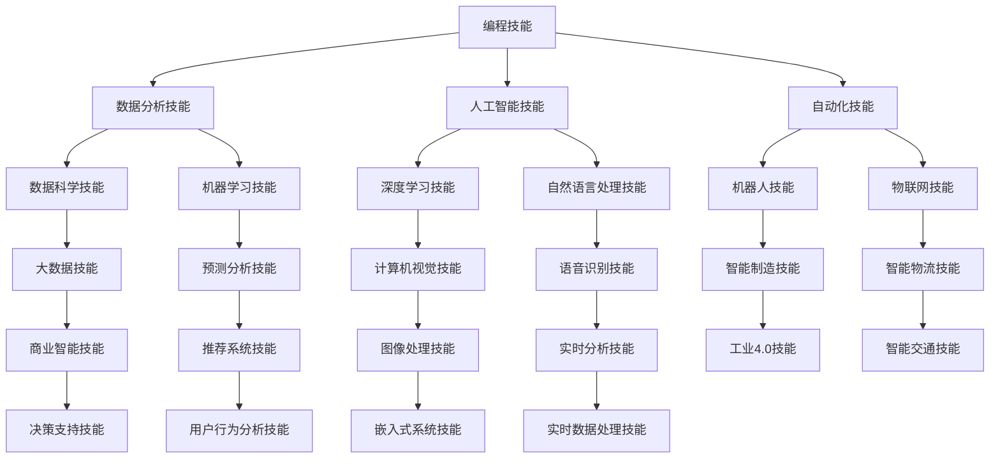

在这个流程图中，我们可以看到不同领域技能之间的相互联系和融合，以及如何通过跨领域技能解决实际问题。

**数学模型与公式：**

跨领域技能的培养和运用可以借助数学模型和公式来优化和评估。以下是一些常用的数学模型和公式：

- **马尔可夫决策过程（MDP）**：用于解决动态规划问题，如资源分配和优化决策。

  $$ V(s) = \max_a \sum_{s'} p(s'|s,a) \cdot [R(s',a) + \gamma V(s')] $$

  其中，\( V(s) \) 是状态值函数，\( s \) 是当前状态，\( a \) 是行动，\( s' \) 是下一状态，\( R(s',a) \) 是即时奖励，\( \gamma \) 是折扣因子。

- **线性规划（Linear Programming，LP）**：用于解决线性约束优化问题。

  $$ \min c^T x $$
  $$ \text{subject to} $$
  $$ A x \leq b $$
  $$ x \geq 0 $$

  其中，\( c \) 是目标函数系数向量，\( A \) 是约束矩阵，\( b \) 是约束向量，\( x \) 是决策变量。

- **协同过滤（Collaborative Filtering）**：用于推荐系统，通过用户和项目的历史交互数据预测用户对新项目的评分。

  $$ \hat{r}_{ui} = \sum_{j \in N_i} \frac{q_{uj}}{\|N_i\|} $$
  其中，\( \hat{r}_{ui} \) 是用户 \( u \) 对项目 \( i \) 的预测评分，\( q_{uj} \) 是用户 \( u \) 对项目 \( j \) 的真实评分，\( N_i \) 是与项目 \( i \) 相关联的用户集合。

这些数学模型和公式为跨领域技能的运用提供了理论支持和计算基础。

**项目实战：**

为了更好地理解跨领域技能的应用，以下是一个项目实战案例：

**项目名称**：智能健康监测系统

**项目背景**：某医疗机构希望通过智能健康监测系统，实时监测患者的健康状况，并提供个性化的健康建议。

**项目目标**：
1. 开发一个基于物联网技术的智能健康监测设备，能够实时采集患者的生理数据。
2. 使用数据分析和机器学习技术，对采集到的数据进行处理和分析，预测患者的健康状况。
3. 提供个性化的健康建议，包括饮食、锻炼和药物使用建议。

**项目实施步骤**：

1. **需求分析**：与医疗机构和患者沟通，了解智能健康监测系统的需求和功能。

2. **设备开发**：设计并开发基于物联网的智能健康监测设备，包括传感器、数据采集模块和无线传输模块。

3. **数据采集**：使用智能健康监测设备，实时采集患者的生理数据，如心率、血压、血糖等。

4. **数据分析**：使用数据分析和机器学习技术，对采集到的数据进行处理和分析，预测患者的健康状况。

5. **健康建议**：根据数据分析结果，为患者提供个性化的健康建议，包括饮食、锻炼和药物使用建议。

6. **系统集成**：将智能健康监测系统与医疗机构的现有系统集成，实现实时数据监控和健康建议的推送。

**代码示例**：

以下是一个简单的Python代码示例，用于智能健康监测系统的数据采集和预处理：

```python
import pandas as pd
from sklearn.preprocessing import StandardScaler

# 加载生理数据
physiological_data = pd.read_csv("physiological_data.csv")

# 数据预处理
scaler = StandardScaler()
physiological_data_scaled = scaler.fit_transform(physiological_data)

# 输出预处理后的数据
print(physiological_data_scaled)
```

在这个项目中，我们使用Pandas库和Scikit-learn库对采集到的生理数据进行预处理，包括数据清洗、缺失值处理和数据标准化。这个预处理步骤是智能健康监测系统数据分析和预测的基础。

**项目小结**：

通过这个项目，我们展示了如何通过跨领域技能，如物联网、数据分析和机器学习，开发一个智能健康监测系统。智能健康监测系统不仅提高了患者的健康管理水平，也为医疗机构提供了高效的数据分析工具。这个项目展示了跨领域技能在实际应用中的巨大潜力。

### 小结

跨领域技能是个人职业发展的重要资产，它使个人能够适应多种工作环境和需求，提高职业竞争力。通过本章的内容，我们详细介绍了跨领域技能的核心概念、数学模型和项目实战。掌握跨领域技能，不仅可以提高工作效率和创新能力，还可以为职业发展打开新的机遇。在下一章中，我们将探讨未来工作的趋势与创业机会，帮助读者了解未来的职业发展方向。

### 注意事项

1. **理论与实践相结合**：在培养跨领域技能时，需要将理论学习与实际操作相结合，通过项目实战来巩固和应用所学知识。

2. **持续学习和更新**：跨领域技能需要不断更新和提升，需要关注行业动态和技术趋势，持续学习新知识和技能。

3. **跨领域合作**：跨领域合作可以促进知识和技能的交流，有助于解决复杂问题。积极参与跨领域团队和项目，提升跨领域协作能力。

4. **注重软技能**：跨领域技能不仅包括技术技能，还包括沟通、协作和领导力等软技能。提升软技能可以提高跨领域技能的运用效果。

### 拓展阅读

1. **《跨领域创新》**：亨利·钱塞勒（Henry Chesbrough）著，介绍了跨领域创新的概念和方法。

2. **《跨领域技能培养》**：约瑟夫·马利亚诺（Joseph M. Marianno）著，探讨了跨领域技能的培养和应用。

3. **《物联网技术与应用》**：张军、李明华著，详细介绍了物联网技术的原理和应用。

通过阅读这些书籍，读者可以进一步了解跨领域技能的核心概念和应用方法，为职业发展提供指导。

### 第11章：未来工作与创业机会

**核心概念与联系：**

未来工作的趋势和创业机会是现代职场中不可忽视的重要议题。随着技术的飞速发展，未来工作将呈现多样化和复杂化的特点，为创业者提供了丰富的机遇。以下是未来工作的趋势与创业机会的核心概念及其相互联系：

- **未来工作的趋势**：未来工作将受到以下几个趋势的影响：
  - **远程工作**：随着互联网和远程协作工具的普及，远程工作将成为主流，人们可以在全球范围内选择工作地点。
  - **自动化与智能化**：人工智能、机器人和物联网技术的广泛应用，将使许多传统工作自动化和智能化，提高生产效率和产品质量。
  - **灵活就业**：灵活就业模式，如自由职业、兼职和远程办公，将越来越受到青睐，为员工提供更多的就业选择。
  - **终身学习**：随着技术的快速迭代，终身学习将成为职场生存和发展的重要手段，个人需要不断更新知识和技能。

- **创业机会**：未来工作的趋势为创业者提供了丰富的机遇，包括：
  - **人工智能与大数据**：利用人工智能和大数据技术，开发智能应用和解决方案，如智能医疗、智能交通和智能金融等。
  - **绿色技术**：随着环境问题的日益严重，绿色技术和可持续发展成为创业的重要领域，如新能源、节能减排和环保材料等。
  - **共享经济**：共享经济模式将继续发展，如共享办公空间、共享汽车和共享住宿等，为创业者提供了广阔的市场。
  - **数字健康**：随着人们对健康的关注增加，数字健康领域将成为创业的热点，如健康监测设备、健康管理平台和在线医疗咨询等。

这些概念相互联系，共同构成了未来工作和创业的核心。理解这些趋势和机会，有助于个人和企业把握未来的发展方向，实现职业发展和创业成功。

**Mermaid 流程图：**

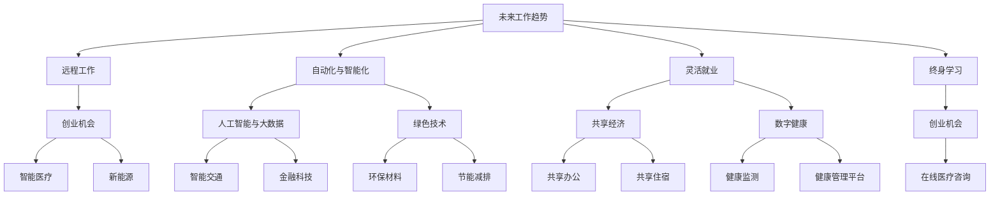

在这个流程图中，我们可以看到未来工作的趋势与创业机会之间的相互作用和依赖关系。

**核心算法原理讲解：**

在未来工作和创业中，核心算法原理和技术是成功的关键。以下是几个关键的算法原理及其详细讲解：

- **深度学习**：深度学习是一种基于多层神经网络的机器学习技术，它在图像识别、语音识别和自然语言处理等领域取得了显著的成果。深度学习的核心算法包括卷积神经网络（CNN）、循环神经网络（RNN）和生成对抗网络（GAN）。

  **算法原理示例**：
  ```python
  from tensorflow.keras.models import Sequential
  from tensorflow.keras.layers import Conv2D, MaxPooling2D, Flatten, Dense

  # 创建卷积神经网络模型
  model = Sequential([
      Conv2D(32, (3, 3), activation='relu', input_shape=(64, 64, 3)),
      MaxPooling2D((2, 2)),
      Flatten(),
      Dense(1, activation='sigmoid')
  ])

  # 编译模型
  model.compile(optimizer='adam', loss='binary_crossentropy', metrics=['accuracy'])

  # 训练模型
  model.fit(x_train, y_train, epochs=10, batch_size=32)

  # 预测
  y_pred = model.predict(x_test)
  ```

- **协同过滤**：协同过滤是一种用于推荐系统的常见算法，它通过分析用户之间的相似性和项目之间的相关性，预测用户对未知项目的评分。协同过滤分为基于用户的协同过滤和基于项目的协同过滤。

  **算法原理示例**：
  ```python
  # 基于用户的协同过滤
  def collaborative_filtering_user_based(ratings, k=10):
      similarity_matrix = compute_similarity_matrix(ratings)
      recommendations = []
      for user in ratings:
          neighbors = find_top_k_neighbors(similarity_matrix[user], k)
          neighbors_ratings = [ratings[neighbor] for neighbor in neighbors]
          weighted_ratings = [(neighbor, rating * similarity_matrix[user][neighbor]) for neighbor, rating in neighbors_ratings]
          top_rated_items = sorted(weighted_ratings, key=lambda x: x[1], reverse=True)
          recommendations.extend([item for item, _ in top_rated_items])
      return recommendations

  # 基于项目的协同过滤
  def collaborative_filtering_item_based(ratings, similarity_threshold=0.5):
      similarity_matrix = compute_similarity_matrix(ratings)
      recommendations = []
      for item in ratings:
          neighbors = [item for item, similarity in similarity_matrix.items() if similarity > similarity_threshold]
          neighbors_ratings = [ratings[user] for user in neighbors]
          weighted_ratings = [(user, rating * similarity) for user, rating in neighbors_ratings.items()]
          top_rated_users = sorted(weighted_ratings, key=lambda x: x[1], reverse=True)
          recommendations.extend([user for user, _ in top_rated_users])
      return recommendations
  ```

- **强化学习**：强化学习是一种通过试错和反馈优化的机器学习技术，它适用于需要做出连续决策的问题，如自动驾驶、游戏AI和机器人控制。

  **算法原理示例**：
  ```python
  import tensorflow as tf
  from tensorflow.keras.models import Sequential
  from tensorflow.keras.layers import Dense

  # 创建强化学习模型
  model = Sequential([
      Dense(64, activation='relu', input_shape=(8,)),
      Dense(64, activation='relu'),
      Dense(1, activation='sigmoid')
  ])

  # 编译模型
  model.compile(optimizer='adam', loss='binary_crossentropy')

  # 训练模型
  model.fit(x_train, y_train, epochs=10, batch_size=32)

  # 预测
  action_values = model.predict(x_test)
  ```

这些算法原理为创业者和企业提供了强大的工具，可以帮助他们开发创新的产品和服务，抓住未来工作的机遇。

**项目实战：**

为了更好地理解未来工作与创业机会，以下是一个项目实战案例：

**项目名称**：智能健康平台

**项目背景**：随着人们对健康和生活质量的关注增加，开发一个智能健康平台，提供个性化的健康监测、诊断和建议，成为一项有前途的创业机会。

**项目目标**：
1. 开发一个基于物联网和人工智能技术的智能健康平台，能够实时监测用户的健康状况。
2. 提供个性化的健康诊断和建议，包括饮食、锻炼和药物使用建议。
3. 建立一个健康社区，促进用户之间的交流和分享。

**项目实施步骤**：

1. **市场调研**：了解目标市场的需求和竞争状况，确定智能健康平台的核心功能和特点。

2. **技术选型**：选择合适的技术栈，包括物联网设备、云计算平台和

