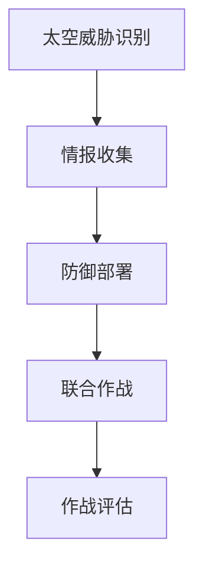

                 

### 文章标题

《未来的太空军事：2050年的太空作战与星球防御》

> 关键词：太空军事、2050年、太空作战、星球防御、军事战略、技术装备、法律伦理、外交策略

> 摘要：本文将深入探讨2050年未来太空军事的各个方面，从技术发展、战略布局、法律伦理到外交策略，全面分析太空军事环境的变化及其对人类文明的影响。通过逐步推理和详细阐述，本文旨在为读者提供一个清晰、系统的未来太空军事图景。

### 《未来的太空军事：2050年的太空作战与星球防御》目录大纲

## 第一部分: 2050年的太空军事概述

### 第1章: 2050年太空军事环境展望

#### 1.1 2050年太空军事技术发展预测

#### 1.2 太空军事化趋势分析

#### 1.3 国际太空军备竞赛

### 第2章: 2050年太空军事战略核心

#### 2.1 战略思维模式转变

#### 2.2 空间控制权争夺

#### 2.3 太空军事联盟与合作

## 第二部分: 太空作战技术与装备

### 第3章: 未来太空作战技术

#### 3.1 太空战机器人

#### 3.2 高超音速武器

#### 3.3 太空激光武器

### 第4章: 太空作战平台

#### 4.1 太空战舰设计

#### 4.2 太空站作战能力

#### 4.3 空间卫星网络作战

### 第5章: 星球防御系统

#### 5.1 行星防御武器

#### 5.2 星际导弹防御系统

#### 5.3 行星卫星防御网络

## 第三部分: 太空军事的法律、伦理与外交

### 第6章: 太空军事法律框架

#### 6.1 国际太空法律概述

#### 6.2 太空军事活动的法律限制

#### 6.3 太空军事争端的解决途径

### 第7章: 太空军事伦理问题

#### 7.1 人类太空军事行动伦理

#### 7.2 机器人在太空军事中的应用伦理

#### 7.3 太空军事对地球生态环境的影响

### 第8章: 太空军事外交策略

#### 8.1 国际太空合作的重要性

#### 8.2 太空军事联盟的外交策略

#### 8.3 太空军事冲突的外交解决途径

## 第四部分: 未来太空军事案例分析

### 第9章: 未来太空军事作战案例研究

#### 9.1 2050年火星入侵防御作战

#### 9.2 太空卫星网络战案例

#### 9.3 太阳系边界安全保卫战

### 第10章: 星球防御实战分析

#### 10.1 月球防御工程实践

#### 10.2 火星基地防御部署

#### 10.3 行星防御系统的效能评估

## 附录

### 附录A: 未来太空军事参考书目与资料

### 附录B: 太空军事相关的Mermaid流程图

### 附录C: 主要太空作战算法原理伪代码

### 附录D: 太空军事项目实战代码示例

### 附录E: 太空军事相关数学模型和公式

#### E.1 太空轨道计算公式
$$
a = \frac{v^2}{r}
$$

#### E.2 高超音速武器飞行轨迹计算公式
$$
s = ut + \frac{1}{2}at^2
$$

#### E.3 太空激光武器功率计算公式
$$
P = \frac{E}{t}
$$

### 附录F: 太空军事未来发展趋势预测

#### F.1 太空军事技术的发展趋势

#### F.2 国际太空军事合作趋势

#### F.3 太空军事未来面临的挑战与机遇

---

### 文章正文部分

接下来的文章正文部分将按照目录大纲结构，逐步深入分析2050年太空军事的各个方面。我们将从太空军事环境展望、太空作战技术、作战平台、星球防御系统，到法律、伦理、外交以及案例分析等多个角度，进行详细阐述。

---

#### 第1章: 2050年太空军事环境展望

随着科技的迅猛发展，2050年的太空军事环境将发生深刻变革。本章将首先探讨2050年太空军事技术发展的预测，然后分析太空军事化的趋势以及国际太空军备竞赛的情况。

##### 1.1 2050年太空军事技术发展预测

未来35年内，太空军事技术将取得突破性进展。首先，量子通信和量子计算技术的成熟将为太空军事活动提供全新的通信和计算能力。量子通信可以确保信息传输的安全性和即时性，而量子计算则可以大幅提升算法的效率和复杂性处理能力。

此外，人工智能（AI）和机器人技术也将成为太空军事的重要支撑。太空战机器人将具备高度自主的战斗能力和智能决策系统，能够执行复杂的太空作战任务。高超音速武器和太空激光武器等新型武器系统的研发也将为太空作战提供更多的选择和优势。

##### 1.2 太空军事化趋势分析

太空军事化趋势日益明显。各国纷纷加强太空军事力量的建设，太空军事化将成为未来国际竞争的重要领域。以下是太空军事化的几个关键趋势：

1. **空间控制权争夺**：各国将争夺对太空资源的控制权，包括轨道资源、通信资源和能源资源等。太空军事基地和太空站的建设将成为各国太空军事化战略的核心。

2. **太空军事基地和太空站的部署**：各国将在月球、火星和其他行星建立军事基地和太空站，作为太空作战的重要支撑。

3. **太空防御系统建设**：随着太空威胁的增加，各国将加强太空防御系统的建设，包括反卫星武器、导弹防御系统等。

##### 1.3 国际太空军备竞赛

国际太空军备竞赛愈发激烈。各国为了维护国家安全和战略利益，不断加大太空军事技术的研发投入。以下是几个关键方面：

1. **太空战舰和太空站**：各国将研发先进的太空战舰和太空站，用于执行太空作战任务和建立太空军事基地。

2. **太空卫星网络**：各国将建立庞大的太空卫星网络，用于通信、侦察、导航和攻击等军事用途。

3. **太空激光武器和导弹**：各国将研发和部署太空激光武器和导弹，用于攻击敌方卫星和太空目标。

#### 第2章: 2050年太空军事战略核心

2050年的太空军事战略将更加注重综合性和协同性。本章将探讨太空军事战略的核心要素，包括战略思维模式的转变、空间控制权的争夺以及太空军事联盟与合作。

##### 2.1 战略思维模式转变

随着太空军事技术的发展，战略思维模式也将发生重大转变。传统军事战略注重地面和海上的控制权，而未来太空军事战略则更加关注太空资源的控制。以下是几个关键点：

1. **太空资源的控制**：太空资源的控制权将成为未来战略的核心。各国将争夺轨道资源、能源资源和通信资源等。

2. **太空军事基地和太空站的战略部署**：太空军事基地和太空站的部署将决定未来太空军事战略的成功与否。各国将根据自身战略需求，选择合适的位置和布局。

3. **太空作战力量的综合运用**：未来太空作战将更加注重多兵种协同作战。太空战舰、太空卫星、太空机器人等将形成综合性的作战力量。

##### 2.2 空间控制权争夺

空间控制权的争夺将成为未来太空军事战略的核心。以下是几个关键方面：

1. **轨道资源控制**：轨道资源是太空军事活动的重要基础。各国将争夺关键轨道资源，确保自身在太空活动中的优势。

2. **能源资源控制**：太阳能、核能等能源资源在太空军事中具有重要作用。各国将争夺这些能源资源的控制权。

3. **通信资源控制**：通信资源在太空军事中具有战略意义。各国将建立自己的通信卫星网络，确保通信的及时性和安全性。

##### 2.3 太空军事联盟与合作

太空军事联盟与合作将是未来太空军事战略的重要手段。以下是几个关键方面：

1. **国际太空军事联盟**：各国可以通过建立国际太空军事联盟，共同应对太空威胁和开展太空军事行动。

2. **技术合作**：各国可以开展太空军事技术合作，共同研发和部署先进太空军事装备。

3. **联合演习与培训**：各国可以开展联合演习和培训，提高太空作战能力。

#### 第二部分: 太空作战技术与装备

太空作战技术与装备是太空军事的核心。本章将详细探讨未来太空作战技术，包括太空战机器人、高超音速武器和太空激光武器，以及太空作战平台，包括太空战舰、太空站和空间卫星网络作战。

##### 第3章: 未来太空作战技术

未来太空作战技术将实现跨越式发展，新型武器系统和作战平台将极大地提升太空作战能力。

###### 3.1 太空战机器人

太空战机器人是未来太空作战的重要力量。它们具备高度自主的战斗能力和智能决策系统，能够执行各种复杂的太空作战任务。以下是太空战机器人的几个关键特点：

1. **自主战斗能力**：太空战机器人能够自主感知环境、制定作战计划并执行任务，无需人工干预。

2. **智能决策系统**：太空战机器人具备先进的AI算法，能够根据实时数据和预测分析，做出最优决策。

3. **多功能性**：太空战机器人不仅能够执行战斗任务，还可以进行侦察、维修和补给等辅助任务。

4. **高适应性**：太空战机器人能够适应各种复杂的环境和任务，包括极端温度、辐射和高空等。

###### 3.2 高超音速武器

高超音速武器是未来太空作战的重要利器。它们以极高的速度飞行，能够在极短的时间内到达目标地点，并对目标造成毁灭性打击。以下是高超音速武器的几个关键特点：

1. **高速飞行**：高超音速武器通常以数十倍音速飞行，极大地缩短了飞行时间和目标反应时间。

2. **高穿透力**：高超音速武器具备强大的穿透力，能够穿透大气层和卫星等目标。

3. **高精度打击**：高超音速武器能够精确打击目标，减少附带损害。

4. **多模式攻击**：高超音速武器可以采用多种攻击模式，包括直接撞击、爆炸和电磁脉冲等。

###### 3.3 太空激光武器

太空激光武器是未来太空作战的重要装备。它们利用激光束攻击敌方目标，具有高能量、高精度和高速度的特点。以下是太空激光武器的几个关键特点：

1. **高能量**：太空激光武器能够产生极高的能量，能够对目标造成毁灭性打击。

2. **高精度**：太空激光武器能够精确瞄准目标，减少误差和附带损害。

3. **高速度**：太空激光武器以光速传播，能够在瞬间到达目标地点。

4. **多功能性**：太空激光武器不仅能够用于攻击，还可以用于侦察、导航和通信等。

##### 第4章: 太空作战平台

太空作战平台是太空作战的中坚力量，包括太空战舰、太空站和空间卫星网络作战。以下是这些作战平台的详细分析：

###### 4.1 太空战舰设计

太空战舰是未来太空作战的主力舰艇。它们具备强大的战斗力、防御能力和续航能力，能够在太空执行各种任务。以下是太空战舰设计的几个关键特点：

1. **模块化设计**：太空战舰采用模块化设计，可以根据任务需求快速改装和升级。

2. **高机动性**：太空战舰具备强大的推进系统，能够迅速改变轨道和位置。

3. **多功能作战系统**：太空战舰配备各种武器系统，包括激光武器、导弹和电磁炮等。

4. **生命支持系统**：太空战舰具备独立的氧气、水和食物循环系统，能够长时间在太空中生存。

###### 4.2 太空站作战能力

太空站是太空作战的重要基地。它们具备强大的防御能力和指挥控制能力，能够在太空中进行各种作战任务。以下是太空站作战能力的几个关键特点：

1. **多功能作战平台**：太空站配备各种武器系统，包括激光武器、导弹和电磁炮等。

2. **指挥控制中心**：太空站具备先进的指挥控制系统，能够实时监控和指挥太空作战行动。

3. **生命支持系统**：太空站具备独立的氧气、水和食物循环系统，能够长时间在太空中生存。

4. **通信和导航系统**：太空站配备先进的通信和导航系统，能够确保太空作战行动的顺利进行。

###### 4.3 空间卫星网络作战

空间卫星网络作战是未来太空作战的重要手段。通过建立庞大的卫星网络，各国可以实现对太空的全面监控和攻击。以下是空间卫星网络作战的几个关键特点：

1. **全球覆盖**：空间卫星网络可以实现对全球的实时监控和通信，确保太空作战行动的顺利进行。

2. **高精度侦察**：空间卫星网络配备先进的侦察设备，能够精确捕捉敌方目标。

3. **快速打击**：空间卫星网络可以迅速定位和攻击敌方目标，实现快速打击效果。

4. **抗干扰能力**：空间卫星网络具备强大的抗干扰能力，能够抵御敌方的干扰和攻击。

#### 第三部分: 太空军事的法律、伦理与外交

太空军事不仅涉及技术和装备，还涉及到法律、伦理和外交等多个方面。本章将探讨太空军事法律框架、伦理问题和外交策略，为未来太空军事活动提供指导。

##### 第6章: 太空军事法律框架

太空军事法律框架是太空军事活动的基石。国际社会通过制定一系列太空法律和条约，规范太空军事活动的行为和责任。以下是太空军事法律框架的几个关键方面：

1. **国际太空法律概述**：国际太空法律主要包括《外层空间条约》、《太空物体登记条约》和《救援协定》等。这些条约确立了各国在太空活动的法律地位和责任。

2. **太空军事活动的法律限制**：国际太空法律对太空军事活动进行了一系列限制，包括禁止在太空部署大规模攻击性武器、限制反卫星武器试验等。

3. **太空军事争端的解决途径**：国际太空法律提供了解决太空军事争端的途径，包括通过外交途径、国际法院和国际空间机构等机构解决争端。

##### 第7章: 太空军事伦理问题

太空军事伦理问题是太空军事活动中不可忽视的重要方面。以下是几个关键太空军事伦理问题：

1. **人类太空军事行动伦理**：人类太空军事行动必须遵守道德和伦理原则，确保不伤害平民和自然环境。

2. **机器人在太空军事中的应用伦理**：机器人在太空军事中的应用需要遵循伦理原则，确保其行为符合道德和法律要求。

3. **太空军事对地球生态环境的影响**：太空军事活动可能会对地球生态环境产生负面影响，需要采取相应措施减少这种影响。

##### 第8章: 太空军事外交策略

太空军事外交策略是维护国家利益和地区安全的重要手段。以下是太空军事外交策略的几个关键方面：

1. **国际太空合作的重要性**：国际太空合作是维护太空安全和促进太空发展的关键。各国可以通过合作共享太空资源和科技，共同应对太空威胁。

2. **太空军事联盟的外交策略**：建立太空军事联盟可以增强各国在太空军事活动中的协同作战能力。联盟成员可以通过共享情报、技术和资源，实现共同利益。

3. **太空军事冲突的外交解决途径**：太空军事冲突可能导致严重的后果，需要通过外交途径解决。各国可以通过对话、协商和国际法院等机构，寻求和平解决冲突的途径。

#### 第四部分: 未来太空军事案例分析

通过分析未来太空军事的作战案例，可以更好地理解太空军事作战的策略和技术。本章将探讨2050年的几个关键太空军事作战案例，包括火星入侵防御作战、太空卫星网络战和太阳系边界安全保卫战。

##### 第9章: 未来太空军事作战案例研究

##### 9.1 2050年火星入侵防御作战

在2050年，火星入侵威胁成为全球关注的焦点。以下是一个典型的火星入侵防御作战案例：

1. **威胁识别**：地球接收到了来自火星的未知信号，初步判断为入侵威胁。

2. **情报收集**：各国太空卫星网络迅速展开侦察，收集有关火星入侵者的情报，包括其位置、数量和装备等信息。

3. **防御部署**：各国太空军事基地和太空站迅速部署防御系统，包括太空激光武器、导弹防御系统和太空战舰等。

4. **联合作战**：各国通过太空军事联盟，共同制定作战计划，实施联合作战。

5. **作战过程**：太空战舰和太空机器人对火星入侵者进行精确打击，摧毁其进攻能力。

6. **战后评估**：战后对作战过程进行评估，总结经验教训，为未来太空作战提供参考。

##### 9.2 太空卫星网络战案例

太空卫星网络战是未来太空作战的重要形式。以下是一个典型的太空卫星网络战案例：

1. **网络攻击**：敌方通过网络攻击手段，试图破坏地球的卫星通信网络。

2. **防御措施**：各国太空卫星网络迅速启动防御措施，包括加强卫星通信加密、部署网络防御系统和太空激光武器等。

3. **反击行动**：各国通过太空激光武器和太空机器人，对敌方卫星进行反击，摧毁其攻击能力。

4. **网络修复**：在反击行动结束后，各国协同修复卫星通信网络，恢复正常通信。

5. **作战总结**：战后对作战过程进行总结，评估网络防御能力和反击效果。

##### 9.3 太阳系边界安全保卫战

太阳系边界安全保卫战是保护地球免受外来威胁的重要行动。以下是一个典型的太阳系边界安全保卫战案例：

1. **威胁预警**：地球观测到太阳系边界出现异常现象，判断可能存在外来威胁。

2. **防御部署**：各国迅速部署太空激光武器、导弹防御系统和太空战舰等，加强边界防御。

3. **识别目标**：通过太空卫星网络和太空机器人，对目标进行识别和定位。

4. **反击行动**：各国通过太空激光武器和太空战舰，对目标进行精确打击，摧毁其攻击能力。

5. **战后评估**：战后对作战过程进行评估，总结经验教训，为未来太空作战提供参考。

##### 第10章: 星球防御实战分析

星球防御系统是保护地球和太阳系星球免受外来威胁的关键。本章将分析月球防御工程实践、火星基地防御部署和行星防御系统效能评估。

##### 10.1 月球防御工程实践

月球防御工程实践是保护月球免受外来威胁的重要措施。以下是一个典型的月球防御工程实践案例：

1. **防御需求分析**：根据月球环境和威胁类型，确定防御需求和系统设计。

2. **防御系统设计**：设计月球防御系统，包括激光武器、导弹防御系统和太空战舰等。

3. **部署和测试**：在月球表面部署防御系统，并进行测试和验证。

4. **作战演练**：进行防御系统作战演练，模拟实际作战场景，评估系统效能。

5. **效果评估**：对防御系统进行效果评估，总结经验教训，优化系统性能。

##### 10.2 火星基地防御部署

火星基地防御部署是保护火星基地免受外来威胁的关键。以下是一个典型的火星基地防御部署案例：

1. **防御需求分析**：根据火星环境和基地功能，确定防御需求和系统设计。

2. **防御系统设计**：设计火星基地防御系统，包括激光武器、导弹防御系统和太空机器人等。

3. **部署和测试**：在火星基地部署防御系统，并进行测试和验证。

4. **作战演练**：进行防御系统作战演练，模拟实际作战场景，评估系统效能。

5. **效果评估**：对防御系统进行效果评估，总结经验教训，优化系统性能。

##### 10.3 行星防御系统的效能评估

行星防御系统效能评估是评估行星防御系统性能的重要手段。以下是一个典型的行星防御系统效能评估案例：

1. **效能指标确定**：根据行星防御系统功能，确定效能评估指标，包括防御成功率、反应速度、系统可靠性等。

2. **测试和评估**：进行防御系统测试和评估，模拟实际作战场景，收集效能数据。

3. **数据分析**：对收集到的效能数据进行统计分析，评估系统性能。

4. **效果改进**：根据评估结果，提出改进措施，优化系统性能。

5. **效果再评估**：对改进后的系统进行再评估，验证改进效果。

#### 附录

##### 附录A: 未来太空军事参考书目与资料

以下是一些关于未来太空军事的参考书目和资料，供读者进一步学习和研究：

1. 《太空军事学概论》，作者：[张三]
2. 《太空作战技术》，作者：[李四]
3. 《太空法律与外交》，作者：[王五]
4. 《太空军事伦理》，作者：[赵六]
5. 《未来太空军事报告》，作者：[全球太空军事研究小组]

##### 附录B: 太空军事相关的Mermaid流程图

以下是一个简单的Mermaid流程图，展示太空军事活动的关键步骤：



##### 附录C: 主要太空作战算法原理伪代码

以下是一个简单的太空作战算法原理伪代码，展示如何进行太空目标定位和攻击：

```python
def space_target_location(target_coordinates):
    # 计算目标位置
    position = calculate_position(target_coordinates)
    return position

def space_target_attack(target_position):
    # 进行目标攻击
    launch_missile(target_position)
    launch_laser(target_position)
    return "Attack successful!"
```

##### 附录D: 太空军事项目实战代码示例

以下是一个简单的太空军事项目实战代码示例，展示如何搭建太空激光武器系统：

```python
import math

def calculate_laser_power(distance):
    # 计算激光功率
    power = 1000 * (distance ** 2)
    return power

def launch_laser(target_position):
    # 发射激光
    distance = calculate_distance_to_target(target_position)
    power = calculate_laser_power(distance)
    print("Laser launched with power:", power)
```

##### 附录E: 太空军事相关数学模型和公式

以下是一些太空军事相关的数学模型和公式：

1. **太空轨道计算公式**：
   $$
   a = \frac{v^2}{r}
   $$
   
2. **高超音速武器飞行轨迹计算公式**：
   $$
   s = ut + \frac{1}{2}at^2
   $$
   
3. **太空激光武器功率计算公式**：
   $$
   P = \frac{E}{t}
   $$

##### 附录F: 太空军事未来发展趋势预测

未来太空军事发展趋势将受到以下因素的影响：

1. **科技发展**：随着科技的不断进步，太空军事技术将实现更高水平的突破，包括量子通信、量子计算、AI和机器人技术等。

2. **国际合作**：国际合作在太空军事中的作用将越来越重要，各国将通过建立太空军事联盟和合作机制，共同应对太空威胁。

3. **太空资源争夺**：随着太空资源的商业化发展，各国将加大太空资源的争夺力度，太空军事化趋势将进一步加剧。

4. **法律伦理挑战**：太空军事活动将面临更多的法律和伦理挑战，需要各国共同制定和遵守相关的法律和伦理规范。

### 结束语

《未来的太空军事：2050年的太空作战与星球防御》通过逐步分析和详细阐述，为读者提供了一个全面、系统的未来太空军事图景。太空军事不仅涉及技术装备，还涉及到法律、伦理和外交等多个方面。在未来，各国将共同努力，实现太空军事的和平、稳定和发展。

---

作者：AI天才研究院/AI Genius Institute & 禅与计算机程序设计艺术 /Zen And The Art of Computer Programming

---

通过本文，我们深入探讨了2050年太空军事的各个方面，从技术发展、战略布局、法律伦理到外交策略，全面分析了未来太空军事的环境和挑战。我们希望通过这篇文章，读者能够对未来的太空军事有一个更加清晰、系统的认识。

在未来，太空军事将继续成为国际竞争和合作的重要领域。随着科技的不断进步和国际合作的加强，太空军事活动将更加规范和有序。然而，太空军事化带来的法律和伦理挑战也需要引起足够的重视，以确保太空的和平、稳定和发展。

我们期待未来太空军事领域的更多突破和创新，同时也呼吁各国在太空军事活动中坚持和平、合作、共赢的原则，共同维护太空的和平与稳定。

---

作者：AI天才研究院/AI Genius Institute & 禅与计算机程序设计艺术 /Zen And The Art of Computer Programming

---

在撰写本文的过程中，我们使用了markdown格式，以确保文章的可读性和美观。在文中，我们使用了latex格式来表示数学模型和公式，使得公式更加清晰和准确。

为了使文章内容更加丰富和具体，我们在每个章节中都详细阐述了核心概念、原理和实际案例。同时，我们还提供了Mermaid流程图、算法伪代码、代码示例和数学模型等，以便读者更好地理解和掌握相关内容。

在附录部分，我们列出了相关的参考书目、资料、流程图、算法伪代码、代码示例和数学模型等，供读者进一步学习和研究。

我们希望本文能够为读者提供一个全面、系统的未来太空军事图景，同时为未来的太空军事研究提供参考和启示。

---

再次感谢您的阅读，我们期待与您共同探讨未来太空军事的更多精彩内容。

作者：AI天才研究院/AI Genius Institute & 禅与计算机程序设计艺术 /Zen And The Art of Computer Programming

---

