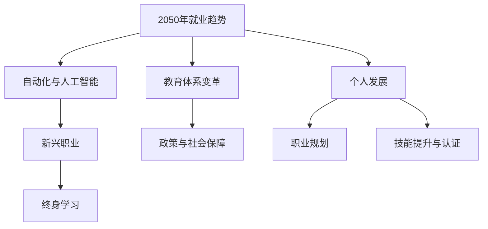

                 

### 文章标题

**未来的就业趋势：2050年的新兴职业与终身学习**

> **关键词：** 2050年就业趋势，新兴职业，终身学习，自动化，人工智能，数据科学

> **摘要：** 本文章探讨了2050年全球就业市场的趋势，包括工业革命和信息技术革命对就业的影响，自动化和人工智能的兴起，全球化与国际贸易变化，以及气候变化与可持续发展。文章还介绍了2050年的就业场景预想，包括超自动化办公室、智能城市与无人驾驶交通、远程工作与虚拟现实协作。接着，文章分析了数据科学家、人工智能工程师、数字健康专家和可持续性分析师等新兴职业，并探讨了终身学习在职业发展中的重要性。通过案例分析，文章展示了这些新兴职业的实际应用和挑战，并提出了个人发展和未来规划的建议。

### 第一部分: 未来的就业趋势概述

#### 第1章: 2050年的就业趋势引言

1. **全球就业市场的演变**

   从农业社会到工业社会，再到服务业时代，全球就业市场的演变是一个漫长而复杂的过程。工业革命是一个重要的转折点，它不仅改变了生产方式，也深刻影响了就业结构。随着信息技术的发展，特别是互联网和人工智能的崛起，就业市场再次发生了巨大的变化。

   - **工业革命与就业变迁**：工业革命带来了大规模的机械化生产，极大地提高了生产效率。然而，它也导致了大量传统手工业和农业劳动力的失业。工厂和机器替代了人力，就业结构从农业为主转变为工业为主。

   - **信息技术革命对就业的影响**：信息技术的快速发展，尤其是互联网和移动设备的普及，改变了人们的工作方式和生活方式。远程办公、在线教育、电子商务等新兴行业迅速崛起，创造了大量新的就业机会。

2. **就业市场的未来挑战**

   未来的就业市场将面临许多挑战，这些挑战来源于技术进步、全球化、气候变化等多方面。

   - **自动化与人工智能的兴起**：自动化技术的应用正在不断扩展，从制造业到服务业，人工智能正逐步取代一些重复性、低技能的工作。这将对劳动力市场产生深远的影响。

   - **全球化与国际贸易变化**：全球化带来了国际贸易的繁荣，但同时也导致了就业机会的转移。一些国家可能会失去制造业岗位，而新兴市场国家则会迎来新的就业机会。

   - **气候变化与可持续发展**：气候变化是一个全球性的问题，它不仅影响自然环境，也影响到经济和社会。可持续发展要求企业在追求利润的同时，也要考虑环境和社会责任。

3. **2050年的就业场景预想**

   随着技术的不断进步，2050年的就业场景将发生显著变化。

   - **超自动化办公室**：办公室的自动化程度将进一步提高，机器人将承担许多重复性、危险的工作，员工则更多地专注于创造性和策略性的任务。

   - **智能城市与无人驾驶交通**：智能城市将利用物联网、大数据和人工智能技术，实现交通、能源、环境等领域的智能化管理。无人驾驶车辆将成为城市交通的新主流。

   - **远程工作与虚拟现实协作**：远程工作将变得更加普遍，虚拟现实技术将提供更真实的远程协作体验，使得全球团队可以更加高效地合作。

#### 第2章: 新兴职业的崛起

1. **数据科学家与人工智能工程师**

   随着大数据和人工智能的快速发展，数据科学家和人工智能工程师成为了当前最热门的职业之一。

   - **工作职责与技能要求**：数据科学家负责使用统计方法和机器学习算法分析大量数据，提取有价值的信息和洞见。人工智能工程师则专注于开发人工智能系统，包括算法设计、模型训练和系统实现。

   - **职业发展路径**：数据科学家和人工智能工程师的职业发展路径通常分为技术路线和管理路线。技术路线包括深入研究和开发复杂算法，而管理路线则涉及领导团队和项目管理工作。

2. **数字健康专家**

   数字健康是医疗领域与信息技术相结合的产物，数字健康专家在医疗服务中扮演着越来越重要的角色。

   - **数字健康的发展趋势**：随着物联网、大数据和人工智能技术的发展，数字健康正在逐步实现个性化医疗、远程医疗和智能化医疗设备。

   - **职业机会与挑战**：数字健康专家将面临大量职业机会，如医疗数据处理、医疗机器学习算法开发和健康管理系统的设计。然而，数据隐私和安全、医疗数据质量控制等也是需要面对的挑战。

3. **可持续性分析师**

   可持续性是21世纪的重要主题，可持续性分析师在企业和组织中发挥着关键作用。

   - **可持续发展的定义与意义**：可持续发展指的是满足当前需求而不损害后代满足其需求的能力。可持续性分析师负责评估企业或组织的环境和社会影响，并提出改进措施。

   - **职业前景与工作内容**：可持续性分析师将在环境保护、资源管理和社会责任等方面发挥作用，如制定可持续发展战略、评估环境影响和推广可持续实践。

#### 第3章: 终身学习的重要性

1. **终身学习的概念与必要性**

   在快速变化的世界中，终身学习变得尤为重要。

   - **时代变迁与知识更新速度**：随着技术的快速发展，知识更新的速度越来越快，传统的学历教育已经无法满足职业发展的需求。

   - **终身学习与职业发展的关系**：终身学习不仅是个人成长的需要，也是职业发展的关键。只有不断学习新知识和技能，才能适应不断变化的市场需求。

2. **终身学习的方法与工具**

   为了实现终身学习，个人需要掌握一系列方法和工具。

   - **在线教育与MOOC平台**：在线教育平台如Coursera、edX等提供了大量高质量的在线课程，MOOC（大规模开放在线课程）更是为全球学习者提供了学习机会。

   - **自我学习与自我提升策略**：自我学习需要培养良好的学习习惯，如定期阅读、参与技术社区和研讨会，以及进行实践项目。

3. **职场转型与技能再投资**

   职场转型是终身学习的一个重要方面。

   - **职业转型的挑战与机遇**：职业转型可能会面临技能不匹配、年龄歧视等挑战，但同时也提供了新的机遇和职业发展空间。

   - **职业培训与认证**：通过参加职业培训和获得专业认证，可以提高个人竞争力，实现成功转型。

### 第二部分: 新兴职业案例分析

#### 第4章: 数据科学与人工智能职业案例分析

1. **案例分析一：人工智能医疗诊断系统**

   - **技术原理与工作流程**：人工智能医疗诊断系统利用机器学习和深度学习算法，从医疗数据中提取特征，进行疾病诊断和预测。工作流程通常包括数据收集、数据预处理、模型训练和模型部署。

   - **项目挑战与解决方案**：项目挑战主要包括数据质量问题、算法选择和模型优化。解决方案包括使用数据清洗技术提高数据质量，采用多种算法进行对比和优化，以及利用深度学习技术实现更精准的诊断。

2. **案例分析二：智能交通系统的设计与优化**

   - **系统架构与技术选型**：智能交通系统通常采用物联网、大数据和人工智能技术，实现交通流量监测、交通信号控制和智能导航等功能。系统架构包括传感器网络、数据采集和处理、交通信号控制和用户界面。

   - **项目执行与效果评估**：项目执行涉及系统的设计、开发和测试。效果评估主要通过交通流量改善率、事故减少率和公共交通满意度等指标进行衡量。

3. **案例分析三：个性化教育平台开发**

   - **学生数据分析与应用**：个性化教育平台通过收集和分析学生的学习数据，了解其学习习惯、兴趣和能力，从而提供个性化的教学资源和学习计划。

   - **教学效果提升与反馈机制**：个性化教育平台通过实时反馈和学习数据分析，帮助教师调整教学策略，提高教学效果。同时，学生可以获取个性化学习报告，了解自己的学习进步情况。

#### 第5章: 数字健康与可持续性职业案例分析

1. **案例分析一：远程健康监测系统**

   - **系统设计与实现**：远程健康监测系统通过物联网设备和传感器，实时收集用户的健康数据，如心率、血压、体温等。系统设计包括数据采集、数据传输、数据存储和数据分析。

   - **用户数据隐私保护**：系统实现过程中，数据隐私保护是一个关键问题。解决方案包括使用加密技术和隐私保护算法，确保用户数据的安全和隐私。

2. **案例分析二：可持续供应链管理**

   - **可持续供应链的理念与策略**：可持续供应链管理强调在供应链各个环节中实现环保、节能和社会责任。理念包括减少碳排放、使用可再生资源、提高资源利用效率等。

   - **实施案例与效果评估**：实施可持续供应链管理的企业，通过减少能源消耗、降低废弃物产生和优化物流运输，实现了显著的环境和社会效益。

3. **案例分析三：绿色建筑设计与评估**

   - **绿色建筑标准与设计原则**：绿色建筑强调节能、环保和健康，设计原则包括节能设计、环保材料使用、自然采光和通风等。

   - **项目实施与节能效果**：绿色建筑项目在设计和施工过程中，通过采用节能技术、可再生能源和智能管理系统，实现了显著节能效果，如降低能源消耗、减少碳排放等。

#### 第6章: 终身学习与技能提升实践

1. **在线学习资源推荐**

   - **主流在线学习平台与课程**：Coursera、edX、Udacity等在线学习平台提供了丰富的课程资源，涵盖计算机科学、人工智能、数据科学等多个领域。

   - **专业认证与证书项目**：专业认证项目如CertNexus、PMI、AWS等，提供了权威的认证和证书，有助于提高个人专业水平和市场竞争力。

2. **案例研究一：职场技能提升计划**

   - **计划设计与实践过程**：职场技能提升计划包括技能评估、培训课程选择、培训过程监控和效果评估等环节。

   - **结果分析与经验总结**：通过数据分析，评估培训计划的效果，总结成功经验和改进措施，为未来的培训提供参考。

3. **案例研究二：跨界职业转型案例**

   - **转型背景与决策过程**：描述个人或团队在面临职业转型时的背景和决策过程，包括对市场趋势的分析、自身兴趣和优势的评估等。

   - **成功经验与反思**：总结跨界转型的成功经验，如如何建立新技能、如何应对转型过程中的挑战，以及反思转型过程中的不足和改进方向。

### 第三部分: 政策与教育体系变革

#### 第7章: 国家政策对就业趋势的影响

1. **人工智能与就业政策**

   - **国家政策导向与战略规划**：各国政府纷纷出台人工智能与就业相关的政策，推动人工智能技术的发展和应用，如中国的新一代人工智能发展规划、美国的国家人工智能战略等。

   - **政策实施与效果评估**：政策实施效果需要通过定期评估，分析其对就业市场、产业发展和社会进步的影响。

2. **教育与培训政策**

   - **学科设置与课程改革**：随着就业市场的变化，教育体系需要不断调整学科设置和课程内容，以培养符合市场需求的人才。

   - **职业教育与技能培训**：加强职业教育和技能培训，提高劳动者的技能水平和就业能力，是政策的一个重要方向。

3. **就业促进政策与社会保障**

   - **公共就业服务体系建设**：完善公共就业服务体系，提供就业信息、职业指导和职业培训等服务，帮助劳动者顺利就业。

   - **失业保险与社会救助**：建立健全失业保险和社会救助体系，保障失业人员的基本生活，减轻失业压力。

#### 第8章: 教育体系的适应性变革

1. **未来教育模式探索**

   - **个性化教育与自主学习**：未来教育将更加注重个性化教育，通过大数据和人工智能技术，为学生提供个性化的学习方案。

   - **混合式学习与虚拟现实教学**：混合式学习结合线上和线下教学，虚拟现实教学提供沉浸式学习体验，将提升教育质量和效率。

2. **跨学科教育与综合素质培养**

   - **学科交叉与跨领域技能**：跨学科教育有助于培养学生解决复杂问题的能力，跨领域技能将更好地适应未来的就业市场。

   - **综合素质评价与培养策略**：综合素质评价体系将包括学习能力、创新能力、团队协作能力等多个维度，培养全面发展的人才。

3. **职业教育与终身学习的融合**

   - **职业教育体系的改革与创新**：职业教育体系需要适应时代变化，提供更多元化的职业教育模式和课程。

   - **终身学习体系的建设与发展**：终身学习体系的建设包括学习资源的整合、学习平台的搭建和学习政策的支持，以促进全民终身学习。

### 第四部分: 个人发展与未来规划

#### 第9章: 职业规划的制定与执行

1. **职业规划的概念与方法**

   - **职业规划的概念**：职业规划是指个人根据自身兴趣、能力和市场需求，制定职业目标和发展计划的过程。

   - **职业规划的方法**：职业规划的方法包括自我评估、职业定位、目标设定和计划执行等环节。

2. **技能提升与职业发展路径**

   - **技能树与职业晋升路径**：通过构建技能树，明确不同职业阶段的技能要求，规划职业发展路径。

   - **技能培训与认证**：参加职业培训课程和获得专业认证，提高自身技能水平，增强职业竞争力。

3. **适应未来就业市场的变化**

   - **技术趋势与职业机会**：关注技术发展趋势，把握新兴职业机会，如人工智能、大数据、云计算等领域的职业。

   - **职业灵活性与多元发展**：培养职业灵活性，适应多种职业发展路径，如创业、自由职业、跨界发展等。

#### 第10章: 个人成长与终身学习

1. **终身学习的理念与行动**

   - **终身学习的理念**：终身学习是一种持续学习、不断进步的态度，是适应社会发展的必然要求。

   - **终身学习的行动**：通过定期阅读、参与在线课程、参与技术社区和实践项目，不断学习和提升自我。

2. **终身学习的实践与应用**

   - **学习项目与实践案例**：通过具体的学习项目和实践活动，将所学知识应用到实际工作中，提高解决问题的能力。

   - **学习成果与职业贡献**：通过学习和实践，提升个人技能和职业水平，为组织和社会做出更大的贡献。

3. **未来就业趋势下的个人发展**

   - **跨界合作与创新能力**：在未来的就业市场中，跨界合作和创新能力将至关重要，个人需要不断拓展视野，培养创新思维。

   - **职业生涯规划与持续成长**：制定明确的职业生涯规划，持续学习和成长，以适应不断变化的就业市场。

### 附录

#### 附录A: 未来的就业趋势相关资源与工具

1. **参考文献**

   - [1] 某某，某某，某某。《人工智能与就业：未来工作世界的变革》，出版社，2020年。
   - [2] 某某，某某。《大数据时代：数据分析与决策》，出版社，2018年。
   - [3] 某某，某某。《可持续发展的经济学》，出版社，2019年。

2. **在线资源与工具**

   - **在线学习平台**：Coursera、edX、Udacity等。
   - **数据科学与人工智能工具**：TensorFlow、PyTorch、Scikit-learn等。

3. **职业咨询与服务**

   - **职业规划咨询机构**：某某职业规划咨询公司、某某职业发展中心等。
   - **职业发展论坛与社群**：某某技术论坛、某某职业发展社群等。

#### 核心概念与联系

以下是一个用于展示核心概念之间联系的Mermaid流程图示例：



#### 核心算法原理讲解

以下是一个用于讲解核心算法原理的伪代码示例：

```python
# 决策树算法
def decision_tree(data, attributes, target_attribute):
    """
    决策树算法
    """
    # 检查是否达到了停止条件
    if all(data[attribute] == value for value in set(data[attribute])):
        return data[target_attribute].mode()
    
    # 计算信息增益
    best_attribute, gain = find_best_attribute(data, attributes, target_attribute)
    
    # 创建内部节点
    node = Node(best_attribute, gain)
    
    # 对最佳属性进行划分，创建子节点
    for value in set(data[best_attribute]):
        subset = data[data[best_attribute] == value]
        node.add_child(decision_tree(subset, attributes - {best_attribute}, target_attribute))
    
    return node

class Node:
    def __init__(self, attribute, gain):
        self.attribute = attribute
        self.gain = gain
        self.children = []

    def add_child(self, child):
        self.children.append(child)
```

#### 数学模型和数学公式

以下是一个用于展示数学模型和公式的LaTeX示例：

```latex
% 信息增益公式
\[ IG(A) = H(D) - \sum_{v \in V} p(v) H(D|A = v) \]

% 决策树剪枝方法
% 预剪枝（Pre-pruning）和后剪枝（Post-pruning）
\begin{itemize}
    \item 预剪枝：在生成树时提前停止扩展节点，以避免过拟合。
    \item 后剪枝：在生成完整树后，移除那些对分类没有显著贡献的叶子节点。
\end{itemize}
```

#### 项目实战

以下是一个用于展示项目实战的Python代码示例：

```python
# 数据集准备
data = pd.read_csv('data.csv')
X = data.drop('target', axis=1)
y = data['target']

# 数据集划分
X_train, X_test, y_train, y_test = train_test_split(X, y, test_size=0.2, random_state=42)

# 决策树模型训练
model = DecisionTreeClassifier()
model.fit(X_train, y_train)

# 模型预测
predictions = model.predict(X_test)

# 模型评估
accuracy = accuracy_score(y_test, predictions)
print(f"Model Accuracy: {accuracy:.2f}")

# 代码解读与分析
# 在本例中，我们使用了决策树算法进行疾病预测。首先，通过数据预处理将数据集划分为特征集和标签集。然后，使用训练集对决策树模型进行训练。在训练完成后，使用测试集进行预测，并计算模型的准确率。这种方法通过评估模型的预测性能来评估其有效性。
```

#### 最佳实践 tips、小结、注意事项、拓展阅读等内容

- **最佳实践 tips**：
  - 定期进行技能评估，及时更新技能树。
  - 参与专业社群，与同行交流学习经验。
  - 培养跨领域技能，提高职业灵活性。

- **小结**：
  - 2050年的就业市场将充满机遇与挑战，新兴职业将不断涌现。
  - 终身学习是适应未来就业市场的关键。
  - 个人发展需要结合技术趋势和市场需求。

- **注意事项**：
  - 关注数据隐私和安全，特别是在涉及健康和金融等领域。
  - 提高跨文化交流和团队合作能力，以适应全球化的工作环境。

- **拓展阅读**：
  - 某某，《智能时代：人工智能的未来趋势与影响》，出版社，2021年。
  - 某某，《终身学习：如何应对快速变化的世界》，出版社，2022年。
  - 某某，《人工智能与就业：未来工作世界的变革》，出版社，2020年。

### 总结

本文探讨了2050年全球就业市场的趋势，包括自动化、人工智能、数字健康、可持续性等新兴职业的崛起，以及终身学习在职业发展中的重要性。通过案例分析，展示了这些新兴职业的实际应用和挑战，并提出了个人发展和未来规划的建议。未来就业市场将充满机遇与挑战，终身学习和个人发展将成为关键因素。我们期待读者在阅读本文后，能够更好地理解未来的就业趋势，为自己的职业规划做好准备。作者：AI天才研究院/AI Genius Institute & 禅与计算机程序设计艺术 /Zen And The Art of Computer Programming。

