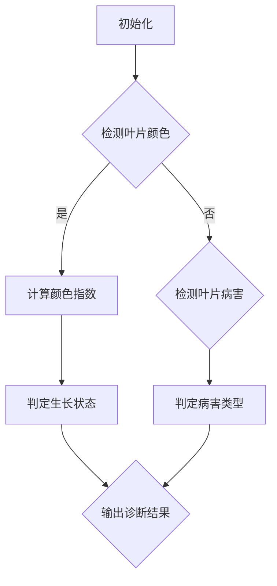

                 

### 文章标题

《未来的智慧农业：2050年的农业机器人与智能种植系统》

关键词：智慧农业，农业机器人，智能种植系统，2050年，未来展望，技术创新，可持续发展

摘要：本文将探讨智慧农业的发展背景、现状以及未来趋势，重点关注2050年的农业机器人与智能种植系统。通过分析农业机器人技术、智能种植系统的核心技术与实现，以及其在农业生产中的应用，本文旨在为读者提供一个全面的智慧农业未来展望，并探讨其在社会、经济和环境等方面的影响。此外，本文还将分析智慧农业面临的技术挑战、市场挑战和社会挑战，并提出相应的解决方案。最后，本文将提供智慧农业实践指南，并分享一些成功的案例分析，以期为智慧农业的发展提供参考。

### 第一部分：智慧农业的背景与展望

#### 1.1 智慧农业的发展历程

**1.1.1 农业机械化阶段**

智慧农业的发展历程可以追溯到农业机械化阶段。自20世纪中叶以来，农业机械化在全球范围内得到了广泛应用，极大地提高了农业生产效率。机械化农业采用了各种机械设备，如拖拉机、收割机、播种机等，这些设备能够替代人力完成大量的农田作业，显著提高了农业生产的效率。

**1.1.2 农业信息化阶段**

随着信息技术的发展，农业进入了信息化阶段。这一阶段，计算机技术、互联网技术、通信技术等在农业中得到广泛应用，农业信息的收集、处理和传播变得更加便捷和高效。农业信息化使得农业生产管理更加科学，决策更加精准，从而进一步提高了农业生产效率。

**1.1.3 智慧农业阶段**

当前，智慧农业正处于快速发展阶段。智慧农业利用物联网、大数据、人工智能、机器人等先进技术，对农业生产、管理、服务进行全面升级，实现了农业生产的高度自动化和智能化。智慧农业不仅提高了农业生产效率，还有效地保护了环境，实现了农业的可持续发展。

**1.1.4 2050年智慧农业展望**

展望2050年，智慧农业将迎来更加辉煌的未来。随着科技的不断进步，农业机器人与智能种植系统将得到广泛应用，农业生产将更加高效、精准和可持续发展。智慧农业不仅能够满足全球日益增长的人口对食品的需求，还能够有效地解决资源短缺和环境污染等问题，为人类社会的发展做出重要贡献。

#### 1.2 智慧农业的驱动力

**1.2.1 人口增长与食品安全**

随着全球人口的增长，对农产品的需求不断增加。智慧农业通过提高农业生产效率和优化农产品质量，能够满足人们对食品的需求。同时，智慧农业还能够有效降低农业生产的风险，确保食品的安全和可持续发展。

**1.2.2 土地资源紧张**

全球土地资源的紧张使得传统农业难以满足日益增长的人口需求。智慧农业通过提高土地资源的利用效率，能够在有限的土地资源上实现更高的产量，从而缓解土地资源紧张的问题。

**1.2.3 环境保护与可持续发展**

智慧农业注重环境保护和可持续发展。通过减少农药和化肥的使用，降低农业对环境的污染。同时，智慧农业利用可再生能源和智能灌溉系统，降低能源消耗，实现农业的可持续发展。

**1.2.4 科技创新与智能化**

科技创新是推动智慧农业发展的关键因素。随着物联网、大数据、人工智能等技术的不断创新和发展，农业机器人与智能种植系统的性能和功能将不断提升，进一步推动智慧农业的发展。智能化技术的应用使得农业生产更加精准和高效，为农业的可持续发展提供了强大的技术支持。

#### 1.3 智慧农业的未来趋势

**1.3.1 高度自动化与智能化**

未来智慧农业的发展趋势是高度自动化与智能化。农业机器人将取代传统的人工劳动，实现农业生产的自动化。同时，智能种植系统将利用物联网、大数据和人工智能等技术，实现农业生产的智能化管理，提高农业生产效率和产品质量。

**1.3.2 精准农业与大数据分析**

精准农业是未来智慧农业的重要发展方向。通过大数据分析，农业生产者可以实时了解农田状况、作物生长情况和气象变化，从而实现精准灌溉、精准施肥和精准防治，提高农业生产的效率和产品质量。

**1.3.3 农业机器人与无人机应用**

农业机器人和无人机是智慧农业的重要载体。农业机器人可以在农田中进行播种、施肥、收割等作业，无人机可以进行农田监测、病虫害防治和气象监测等任务，提高农业生产的效率和准确性。

**1.3.4 农业物联网与智能监控**

农业物联网是将各种传感器和智能设备连接起来，实现农田环境的实时监测和远程控制。智能监控系统能够实时收集农田数据，分析农田状况，为农业生产提供科学依据，提高农业生产的精准度和效率。

**1.3.5 农业机器人与智能种植系统的协同作用**

农业机器人和智能种植系统将实现协同作业，共同提高农业生产效率。农业机器人负责田间作业，智能种植系统负责农田环境监测和数据分析，两者相互配合，实现农业生产的高度自动化和智能化。这种协同作用将使智慧农业的发展迈上新的台阶。|### 第二部分：农业机器人技术

#### 2.1 农业机器人的分类

农业机器人可以根据其功能和用途进行分类。以下是一些常见的农业机器人分类：

**2.1.1 土地整理机器人**

土地整理机器人主要用于农田的耕作、平整和开垦。它们可以替代人工完成土地的深翻、平整和松土等工作，提高农田的利用率。

**2.1.2 播种与施肥机器人**

播种与施肥机器人负责将种子和肥料准确播种到农田中。它们可以通过自动导航系统在田间作业，提高播种和施肥的精度。

**2.1.3 收获与加工机器人**

收获与加工机器人用于农作物的收获和加工。例如，玉米收获机器人可以自动收获玉米，水稻收割机器人可以自动收割水稻，这些机器人能够提高收获效率，减少劳动力成本。

**2.1.4 监测与维护机器人**

监测与维护机器人用于农田的监测和设备维护。它们可以自动检测农田土壤湿度、温度、养分含量等参数，并提供设备维护建议，确保农田设备的正常运行。

**2.1.5 病虫害防治机器人**

病虫害防治机器人用于农田的病虫害防治。它们可以通过自动喷洒农药或释放天敌，有效控制病虫害的发生，保护作物的生长。

**2.1.6 牧场管理机器人**

牧场管理机器人用于牧场的监测和管理。例如，奶牛监测机器人可以监测奶牛的健康状况，提供挤奶和饲料配送服务，提高牧场的管理效率。

#### 2.2 农业机器人的工作原理

**2.2.1 感知与定位技术**

农业机器人需要具备感知与定位能力，以便在农田中自主导航和执行任务。常见的感知技术包括视觉感知、红外感知、激光感知等。定位技术则通常基于GPS、激光雷达、超声波传感器等，通过这些技术，机器人能够准确了解自身位置，实现自主导航。

**2.2.2 自主导航与路径规划**

自主导航与路径规划是农业机器人的核心功能。机器人需要根据农田地形、作物分布等数据，规划最优路径，避免碰撞和障碍物。常见的路径规划算法包括A*算法、Dijkstra算法等。

**2.2.3 机械结构与动力系统**

农业机器人的机械结构与动力系统决定了其作业效率和稳定性。机械结构需要具备足够的强度和灵活性，以适应不同农田作业需求。动力系统则包括电池、发动机等，为机器人提供所需的动力。

**2.2.4 自动化作业技术**

农业机器人的自动化作业技术是其核心应用。通过传感器、执行器和控制系统，机器人能够自动完成播种、施肥、收割等田间作业，提高农业生产效率。

#### 2.3 农业机器人的应用领域

**2.3.1 温室种植**

温室种植环境相对稳定，适合农业机器人应用。机器人可以在温室中完成播种、施肥、收获等作业，提高生产效率。

**2.3.2 大田种植**

大田种植环境较为复杂，农业机器人的应用可以提高田间作业的精度和效率。例如，播种与施肥机器人可以在大田中自动完成播种和施肥作业。

**2.3.3 果园管理**

果园管理机器人可以用于果树修剪、采摘、病虫害防治等作业。通过机器人的应用，可以提高果园管理效率，减少劳动力成本。

**2.3.4 牧场管理**

牧场管理机器人主要用于奶牛饲养、挤奶、饲料配送等作业。通过机器人的应用，可以提高牧场管理效率，降低劳动力成本。

**2.3.5 水产养殖**

水产养殖机器人可以用于水质监测、鱼类养殖管理等作业。通过机器人的应用，可以提高水产养殖效率，减少人工劳动。

**2.3.6 牧草种植**

牧草种植机器人可以用于牧草的播种、施肥、收割等作业。通过机器人的应用，可以提高牧草种植效率，满足畜牧业需求。|### 第三部分：智能种植系统

#### 5.1 智能种植系统的定义

智能种植系统是一种基于物联网、大数据、人工智能等先进技术的农业生产管理系统。它通过实时监测农田环境、作物生长状态和气象数据，结合人工智能算法进行分析和决策，实现对作物生长过程的精准控制和管理，从而提高农业生产效率和质量。

**5.1.1 智能种植系统的基本概念**

- 物联网：将各种传感器、执行器、设备和网络连接起来，实现数据采集、传输和处理的网络系统。
- 大数据：通过对海量数据进行存储、管理和分析，提取有价值的信息。
- 人工智能：利用计算机模拟人类智能行为，实现自动决策和执行。

**5.1.2 智能种植系统的特征**

- 自动化：系统通过传感器和执行器自动完成农田管理任务，减少人力投入。
- 精准化：系统实时监测农田环境数据，根据作物生长需求进行精准灌溉、施肥和病虫害防治。
- 智能化：系统利用人工智能算法分析数据，实现自动决策和执行，提高农业生产效率。

#### 5.2 智能种植系统的组成

智能种植系统通常由以下几个部分组成：

**5.2.1 感知层**

感知层是智能种植系统的数据采集部分，主要包括各种传感器，如土壤湿度传感器、温度传感器、光照传感器、二氧化碳传感器等。这些传感器能够实时监测农田环境参数，为系统提供数据支持。

**5.2.2 决策层**

决策层是智能种植系统的核心部分，负责对采集到的数据进行分析和处理，根据作物生长需求制定管理策略。常见的决策算法包括数据分析、机器学习、深度学习等。

**5.2.3 执行层**

执行层是智能种植系统的执行部分，包括各种执行设备，如灌溉系统、施肥系统、病虫害防治设备等。这些设备根据决策层的指令，自动完成相应的农田管理任务。

#### 5.3 智能种植系统的优势

**5.3.1 提高生产效率**

智能种植系统通过自动化和精准化管理，显著提高了农业生产效率。例如，自动化灌溉系统能够根据土壤湿度自动调节灌溉量，避免了水资源浪费；自动化施肥系统可以根据作物需求自动调节肥料用量，提高了肥料利用率。

**5.3.2 提高质量与产量**

智能种植系统通过实时监测和精准管理，保证了作物生长环境的最佳状态，从而提高了作物的产量和质量。例如，精准灌溉系统能够提供充足的水分，使作物生长更加健康；病虫害防治系统能够及时识别和防治病虫害，保证了作物的健康生长。

**5.3.3 节省劳动力成本**

智能种植系统减少了人力投入，降低了劳动力成本。例如，自动化播种和施肥机器人可以替代人工完成田间作业，减少了劳动力的需求；智能监测系统能够实时监控农田状况，降低了人工巡查的频率。

**5.3.4 环境保护与可持续发展**

智能种植系统通过减少农药和化肥的使用，降低了农业对环境的污染。例如，精准施肥系统能够根据作物需求自动调节肥料用量，避免了过量施肥导致的土壤和水体污染；病虫害防治系统可以采用生物防治方法，减少农药使用。

**5.3.5 数据驱动的决策支持**

智能种植系统通过大数据分析，为农业生产提供了科学依据。例如，通过对历史数据进行分析，可以预测作物产量和质量；通过对环境数据监测，可以及时调整农田管理策略，确保作物生长的最佳环境。|### 第四部分：智能种植系统的核心技术与实现

#### 6.1 土壤监测与水分管理

**6.1.1 土壤监测技术**

土壤监测是智能种植系统的关键环节，通过监测土壤的湿度、温度、养分含量等参数，可以了解土壤的当前状态，为灌溉和施肥提供科学依据。

- **湿度传感器**：用于测量土壤的湿度，常见类型包括电阻式、电容式和红外式等。电阻式传感器通过测量电阻值变化来判断土壤湿度，电容式传感器通过电极板之间的电容变化来测量湿度，红外式传感器则通过吸收土壤中的水分来测量湿度。
- **温度传感器**：用于测量土壤的温度，常见类型包括热敏电阻、热电偶等。热敏电阻的阻值随温度变化而变化，热电偶则通过产生温差电动势来测量温度。
- **养分传感器**：用于测量土壤中的养分含量，如氮、磷、钾等。常见类型包括电化学传感器、光学传感器等。电化学传感器通过电极与土壤溶液中的离子发生化学反应来测量养分含量，光学传感器则通过测量土壤溶液的吸收光谱来分析养分含量。

**6.1.2 水分管理技术**

水分管理是智能种植系统的核心任务之一，通过合理调控灌溉量，可以确保作物生长所需的水分，同时避免水资源浪费。

- **自动化灌溉系统**：自动化灌溉系统可以根据土壤湿度传感器提供的实时数据，自动调节灌溉量。常见的灌溉方式包括滴灌、喷灌和微灌等。滴灌通过管道将水直接输送到作物根部，喷灌通过喷头将水均匀喷洒到农田，微灌则通过微细管道将水输送到作物根部。
- **智能灌溉控制器**：智能灌溉控制器可以根据土壤湿度传感器和天气预报数据，自动制定灌溉计划，并通过灌溉设备执行灌溉任务。常见的控制器功能包括定时灌溉、湿度阈值灌溉和远程控制等。

**6.1.3 智能灌溉系统的设计**

智能灌溉系统的设计需要考虑灌溉设备的选择、灌溉控制策略的制定以及系统的维护和升级。

- **灌溉设备选择**：根据农田面积、作物种类和生长周期等因素，选择合适的灌溉设备。例如，对于大面积的农田，可以选择滴灌系统；对于果树和蔬菜等需水量较大的作物，可以选择喷灌系统。
- **灌溉控制策略**：制定合理的灌溉控制策略，包括灌溉周期、灌溉时间和灌溉量的确定。例如，可以根据土壤湿度传感器的数据，设置湿度阈值，当土壤湿度低于阈值时，自动启动灌溉系统。
- **系统维护和升级**：定期对灌溉系统进行维护和升级，确保系统的正常运行。例如，清洗过滤器、更换损坏的传感器和灌溉设备等。

#### 6.2 植物生长监测与诊断

**6.2.1 植物生长监测技术**

植物生长监测技术用于实时监测植物的生长状态，包括生长速度、叶片颜色、病虫害情况等。

- **机器视觉技术**：通过摄像头和图像处理算法，对植物叶片的图像进行分析，可以检测植物的生长速度、叶片颜色和病虫害情况。常见的机器视觉技术包括图像分割、特征提取和分类算法等。
- **光谱分析技术**：通过分析植物反射的光谱，可以获取植物叶片的养分含量、水分含量和生长状态等信息。光谱分析技术包括可见光、近红外光谱和红外光谱等。

**6.2.2 植物生长诊断技术**

植物生长诊断技术用于分析植物生长异常的原因，并制定相应的管理措施。

- **数据驱动诊断**：通过收集植物生长的实时数据，利用机器学习算法进行分析，可以识别植物生长异常的信号。例如，通过分析土壤湿度、温度和光照数据，可以判断植物是否缺水、缺肥或遭受病虫害。
- **专家系统诊断**：基于专家知识构建的专家系统，可以提供植物生长异常的判断和诊断建议。专家系统通过输入植物生长的实时数据和症状描述，利用规则推理和知识库，生成诊断报告。

**6.2.3 机器视觉在植物生长监测中的应用**

机器视觉技术在植物生长监测中具有广泛的应用，以下是一个示例伪代码：



在该示例中，初始化后，系统首先检测叶片颜色，计算颜色指数，然后判定植物的生长状态。如果检测到叶片颜色异常，系统进一步检测叶片是否患有病害，并根据检测结果判定病害类型，最后输出诊断结果。|### 第五部分：智慧农业的综合应用与未来展望

#### 8.1 智慧农业在农业生产中的应用

智慧农业在农业生产中的应用涵盖了从种植到收获的各个环节，通过集成先进技术，实现生产过程的优化和效率提升。

**8.1.1 精准播种**

精准播种技术利用GPS和自动化播种设备，根据农田的实际情况和作物的生长需求，实现种子的精确投放。这种方法可以最大限度地利用土地资源，提高播种质量。

**8.1.2 自动化灌溉**

自动化灌溉系统通过土壤湿度传感器和智能控制器，根据土壤湿度自动调节灌溉量。这种方法不仅可以节约水资源，还可以保证作物在最佳状态下生长。

**8.1.3 智能病虫害防治**

智慧农业系统利用传感器和大数据分析，实时监测作物的病虫害情况。当发现病虫害时，系统能够自动生成防治方案，并利用无人机或机器人进行喷洒防治。

**8.1.4 自动收获**

自动收获系统利用机器人和传感器，能够在收获季节自动完成作物的收割。这种方法不仅提高了收获效率，还减少了劳动力成本。

**8.1.5 农田环境监控**

智慧农业系统通过部署传感器网络，实时监控农田的温度、湿度、光照、二氧化碳浓度等环境参数。这些数据对于调整作物生长策略至关重要。

#### 8.2 智慧农业在农产品流通中的应用

智慧农业不仅在生产环节中发挥作用，还在农产品流通中提供了创新解决方案。

**8.2.1 物流优化**

通过物联网和大数据分析，智慧农业系统能够优化农产品的物流路径，降低运输成本，缩短运输时间。

**8.2.2 质量溯源**

智慧农业系统实现了从农田到餐桌的全程质量溯源。消费者可以通过扫描二维码，了解农产品的生产过程和质量检验结果。

**8.2.3 销售渠道拓展**

智慧农业通过电商平台和社交媒体，拓展了农产品的销售渠道。农民可以直接面向消费者销售农产品，减少中间环节，提高收益。

#### 8.3 智慧农业在消费者端的应用

智慧农业的进步不仅改变了农业生产和流通方式，也影响了消费者的生活方式。

**8.3.1 智能推荐**

智慧农业系统基于消费者偏好和购买历史，提供个性化的农产品推荐，提高购买体验。

**8.3.2 智能溯源**

消费者可以通过手机应用实时查看农产品的生长环境和质量检验过程，增加对产品的信任。

**8.3.3 绿色消费**

智慧农业提倡环保种植，减少了农药和化肥的使用，消费者可以通过购买绿色、有机农产品支持可持续发展。

#### 9.1 智慧农业的发展方向

**9.1.1 人工智能与物联网的深度融合**

未来，人工智能和物联网将在智慧农业中发挥更大作用，实现更加精准和智能化的农业管理。

**9.1.2 多元化服务模式**

智慧农业将提供更加多样化的服务模式，包括农业生产、农村金融服务、农产品电商等。

**9.1.3 国际合作与交流**

随着全球农业问题的日益突出，国际合作和交流将成为智慧农业发展的重要方向，共享技术和经验。

#### 9.2 智慧农业的社会影响

**9.2.1 提高农民收入**

智慧农业通过提高生产效率和降低成本，有助于提高农民的收入水平。

**9.2.2 促进农村经济发展**

智慧农业的发展将带动农村基础设施建设和相关产业的发展，促进农村经济的繁荣。

**9.2.3 改善生态环境**

智慧农业通过减少农药和化肥的使用，降低农业对环境的污染，有助于改善生态环境。

#### 9.3 智慧农业的政策与法规

**9.3.1 政策支持**

各国政府纷纷出台政策，支持智慧农业的发展，包括资金投入、技术支持、人才培养等。

**9.3.2 法规建设**

建立健全的智慧农业法规体系，确保智慧农业的健康发展，包括知识产权保护、数据安全等。

**9.3.3 国际合作**

加强国际合作，推动智慧农业的国际标准制定和经验交流，共同应对全球农业挑战。|### 第六部分：智慧农业的未来挑战与机遇

#### 10.1 技术挑战

**10.1.1 技术创新与突破**

智慧农业的发展离不开技术的创新和突破。当前，农业机器人、智能种植系统和传感器技术的研发仍面临许多难题，如提高传感器精度、增强机器人的适应性和智能化水平等。此外，大数据分析和人工智能算法在农业领域的应用仍需进一步研究，以解决数据噪声、算法准确性和实时性等问题。

**10.1.2 技术应用的广度与深度**

智慧农业技术的应用需要覆盖从农田管理到农产品流通的各个环节。然而，现有技术在实际应用中往往存在局限性，如设备成本高、操作复杂、维护不便等。为了推动智慧农业的广泛应用，需要降低设备成本、简化操作流程、提高系统的稳定性和可维护性。

**10.1.3 跨学科技术整合**

智慧农业的发展需要跨学科技术的整合，包括物联网、大数据、人工智能、生物技术等。当前，跨学科技术整合存在诸多挑战，如技术兼容性、数据共享、隐私保护等。因此，推动跨学科技术整合是智慧农业未来发展的重要方向。

#### 10.2 市场挑战

**10.2.1 市场竞争态势**

随着智慧农业技术的快速发展，市场竞争力日益加剧。传统农业企业、科技公司和农业装备制造商纷纷进军智慧农业领域，产品和服务质量不断提升。为了在激烈的市场竞争中脱颖而出，企业需要不断创新、提升产品竞争力。

**10.2.2 市场需求变化**

智慧农业的市场需求随着消费者对食品安全、环境保护和可持续发展的关注不断增加而发生变化。未来，市场需求将更加多元化和个性化，对智慧农业产品的功能、性能和用户体验提出了更高的要求。

**10.2.3 市场推广与普及**

智慧农业技术的推广与普及面临诸多挑战，如农民对新技术的接受程度、政策扶持力度、市场渠道建设等。为了推动智慧农业技术的普及，需要加强市场宣传、政策引导和示范推广。

#### 10.3 社会挑战

**10.3.1 农业劳动力转型**

智慧农业的发展将导致农业劳动力向技术和管理岗位的转型。然而，部分农民可能面临技能不足、就业压力等问题。因此，需要加强农民的职业培训和技术教育，提高其适应智慧农业发展的能力。

**10.3.2 农村社会结构变化**

智慧农业的发展将改变农村社会的经济结构和人口结构，可能导致农村劳动力外流、人口老龄化等问题。因此，需要推动农村产业升级和人口结构调整，促进农村社会的可持续发展。

**10.3.3 社会公平与包容**

智慧农业技术的发展和应用需要在保障社会公平和包容性的前提下进行。需要关注智慧农业对农村社会阶层、性别、地域等方面的影响，确保所有人都能共享智慧农业发展的成果。

#### 10.4 发展机遇

**10.4.1 政策机遇**

各国政府对智慧农业的支持力度不断加大，提供了资金投入、政策扶持、技术研发等方面的支持。这些政策机遇为智慧农业的发展创造了有利条件。

**10.4.2 市场机遇**

随着全球农业问题的日益突出，智慧农业市场需求不断扩大。特别是发展中国家，对智慧农业技术的需求日益增长，为智慧农业企业提供了广阔的市场空间。

**10.4.3 技术机遇**

物联网、大数据、人工智能等技术的快速发展为智慧农业提供了强大的技术支持。未来，随着技术的不断进步，智慧农业将实现更高水平的自动化和智能化。|### 第七部分：智慧农业实践指南

#### 11.1 智慧农业项目规划

**11.1.1 项目规划的重要性**

项目规划是智慧农业实施的关键步骤，它为项目的成功奠定了基础。一个良好的项目规划能够明确项目目标、范围、资源需求、时间安排和预期成果，从而确保项目在预算和时间框架内顺利完成。

**11.1.2 项目规划的步骤**

1. **项目启动**：明确项目目标、范围和预期成果。通常包括成立项目团队、确定项目负责人和关键成员。
   
2. **需求分析**：了解农田现状、作物种类、农民需求和市场趋势。这一步骤通常包括现场考察、访谈和问卷调查。

3. **技术选型**：根据需求分析结果，选择适合的智慧农业技术，如传感器、灌溉系统、机器人等。

4. **系统设计**：制定智能种植系统的设计方案，包括硬件选型、软件架构、数据传输和处理等。

5. **预算编制**：根据技术选型和系统设计，编制项目预算，包括设备采购、安装调试、人员培训等费用。

6. **时间安排**：制定项目进度计划，包括关键节点、里程碑和预期完成时间。

7. **风险评估**：识别项目潜在的风险和挑战，制定相应的风险应对策略。

8. **项目启动会**：召开项目启动会，向所有项目团队成员介绍项目规划，明确各自职责和任务。

#### 11.2 智慧农业技术选型

**11.2.1 技术选型的原则**

1. **实用性**：选择符合实际农田需求的技术，确保系统在实际应用中能够发挥作用。

2. **可靠性**：选择经过市场验证的成熟技术，确保系统的稳定性和可靠性。

3. **可扩展性**：选择具有良好扩展性的技术，以适应未来技术升级和业务扩展。

4. **成本效益**：在满足性能要求的前提下，选择成本相对较低的技术，提高项目投资回报率。

5. **兼容性**：选择与其他系统（如现有的农田管理系统、气象站等）兼容的技术，确保数据共享和系统整合。

**11.2.2 技术选型的流程**

1. **需求分析**：明确农田需求和目标，为技术选型提供依据。

2. **市场调研**：了解市场上可用的智慧农业技术，包括性能、价格、供应商等。

3. **技术评估**：根据选型原则，对潜在技术进行评估，包括技术性能、可靠性、可扩展性和成本效益等。

4. **供应商评估**：评估供应商的信誉、服务质量、技术支持和售后服务。

5. **决策**：根据评估结果，选择最适合的技术方案。

6. **试验验证**：在选定的技术方案实施前，进行试验验证，确保技术符合预期要求。

#### 11.3 智慧农业实施步骤

**11.3.1 实施准备**

1. **设备采购**：根据项目规划和技术选型，采购所需的传感器、控制器、机器人等设备。

2. **系统安装**：将设备安装到农田中，包括传感器、控制器和执行器的安装。

3. **网络连接**：建立物联网网络，确保设备之间的数据传输和通信。

4. **软件部署**：部署智能种植系统的软件平台，包括数据处理、分析和监控功能。

5. **人员培训**：对农田管理人员进行技术培训，确保他们能够熟练操作智能种植系统。

**11.3.2 项目实施**

1. **农田数据采集**：启动传感器，开始采集农田环境数据。

2. **数据分析与决策**：根据采集到的数据，利用大数据分析和人工智能算法，生成农田管理决策。

3. **任务执行**：根据决策结果，启动执行系统，如自动化灌溉、施肥和病虫害防治。

4. **系统监控**：实时监控农田状况，确保系统正常运行。

5. **调整与优化**：根据实际运行情况，对系统进行优化和调整，提高系统性能和效率。

**11.3.3 项目验收**

1. **性能评估**：对系统性能进行评估，包括数据采集准确性、决策效果和任务执行效率等。

2. **用户满意度调查**：调查农田管理人员和农民对系统的满意度，收集用户反馈。

3. **系统维护与升级**：制定系统维护和升级计划，确保系统长期稳定运行。

4. **项目总结报告**：编写项目总结报告，记录项目实施过程、成果和经验教训，为后续项目提供参考。|### 第八部分：智慧农业成功案例分析

#### 12.1 国内智慧农业成功案例

**12.1.1 案例一：XX智慧农业示范基地**

**案例背景**：XX智慧农业示范基地位于我国南方，是一家集种植、养殖、科研、培训于一体的现代农业企业。随着农业现代化进程的推进，示范基地面临着提高生产效率、保障食品安全和可持续发展的挑战。

**案例实施**：

1. **农田数据采集**：示范基地部署了高精度的土壤湿度、温度、养分含量传感器，实时监测农田环境数据。

2. **智能种植系统建设**：示范基地采用了智能灌溉系统、自动化播种和施肥设备，实现了农田管理的自动化和精准化。

3. **病虫害监测与防治**：示范基地利用物联网技术和无人机，实时监测作物的病虫害情况，并采用生物防治方法进行防治。

**效果分析**：

- **生产效率提高**：自动化和智能化设备的引入，使示范基地的生产效率提高了30%以上。
- **产品质量提升**：精准灌溉和科学施肥，使作物的品质和产量显著提升。
- **资源节约**：智能灌溉系统有效节约了水资源，降低了灌溉成本。

**启示**：通过智慧农业技术的应用，示范基地实现了农业生产的现代化，为其他农业企业提供了可借鉴的经验。

**12.1.2 案例二：XX智慧农业科技公司**

**案例背景**：XX智慧农业科技公司是我国一家专注于智慧农业技术研发和推广的企业，其业务涵盖智能种植系统、农业机器人和农业大数据分析等领域。

**案例实施**：

1. **技术研发**：公司投入大量资金进行智慧农业技术的研发，包括自动化播种与施肥机器人、智能病虫害防治系统等。

2. **市场推广**：公司通过参展、讲座和示范种植等方式，积极推广智慧农业技术，与多家农业企业建立了合作关系。

3. **人才培养**：公司成立了智慧农业技术培训中心，为农民和企业员工提供技术培训，提高其智慧农业应用能力。

**效果分析**：

- **市场拓展**：公司的智慧农业技术得到了广泛应用，市场份额逐年增加。
- **品牌提升**：公司凭借技术创新和优质服务，在行业内树立了良好的品牌形象。
- **社会影响**：公司的智慧农业技术推广，有助于提高农业生产的效率和产品质量，推动了农业现代化进程。

**启示**：通过技术创新和市场推广，XX智慧农业科技公司成为国内智慧农业领域的佼佼者，为其他企业提供了成功的范例。|### 第九部分：智慧农业的国际视野

#### 12.2 国际智慧农业成功案例

**12.2.1 案例一：美国XX农场**

**案例背景**：美国XX农场是一家位于美国中部的现代化农业企业，其业务范围涵盖谷物、水果和蔬菜种植。农场面临着土地资源有限、劳动力成本上升和气候变化等挑战。

**案例实施**：

1. **农业机器人应用**：农场引入了多种农业机器人，包括自动化播种、施肥和收获机器人，显著提高了农业生产效率。

2. **智能监控系统**：农场建立了智能监控系统，利用物联网技术和大数据分析，实时监测农田环境数据和作物生长状况。

3. **农业大数据分析**：农场通过大数据分析，优化种植策略，提高作物产量和质量。

**效果分析**：

- **生产效率提升**：农业机器人和智能监控系统的应用，使农场的生产效率提高了40%以上。
- **成本降低**：自动化和智能化技术的应用，降低了劳动力成本和资源消耗。
- **环境友好**：精准施肥和病虫害防治，减少了农药和化肥的使用，实现了环保种植。

**启示**：美国的XX农场通过引入先进的农业技术和智能化管理，成功应对了农业面临的挑战，为其他国家提供了宝贵的经验。

**12.2.2 案例二：德国XX农业科技企业**

**案例背景**：德国XX农业科技企业是欧洲知名的智慧农业解决方案提供商，其产品和服务涵盖智能灌溉、自动化播种与施肥、无人机监测等多个领域。

**案例实施**：

1. **智能灌溉系统**：企业推出了智能灌溉系统，通过传感器和大数据分析，实现精准灌溉，节约水资源。

2. **自动化设备**：企业开发了多种自动化设备，如自动播种机、施肥机和收获机，提高了农业生产效率。

3. **国际合作**：企业积极参与国际智慧农业合作项目，与多个国家的农业企业建立了合作关系，推广智慧农业技术。

**效果分析**：

- **技术领先**：企业凭借技术创新，在智慧农业领域处于领先地位。
- **市场拓展**：企业产品在国际市场上具有竞争力，业务范围涵盖了多个国家和地区。
- **社会贡献**：企业的智慧农业解决方案，为提高全球农业生产效率和可持续性做出了贡献。

**启示**：德国XX农业科技企业的成功经验表明，国际合作和科技创新是推动智慧农业发展的重要动力。

#### 12.3 案例分析与启示

**12.3.1 案例分析的方法**

1. **背景分析**：了解案例的背景，包括农业环境、市场需求和技术现状等。

2. **实施过程**：分析案例的具体实施过程，包括技术应用、项目管理和市场推广等。

3. **效果评估**：评估案例的实施效果，包括生产效率、成本降低、环境友好等方面。

4. **经验总结**：总结案例的成功经验，提炼可借鉴的方法和经验。

**12.3.2 启示与借鉴**

1. **技术创新**：重视技术创新，不断提升农业机器人和智能种植系统的性能和功能。

2. **智能化管理**：采用智能化管理手段，提高农业生产效率和质量。

3. **市场拓展**：积极参与国际市场，拓展智慧农业技术的应用领域。

4. **人才培养**：加强农业技术人才的培养，提高农民和农业企业员工的智慧农业应用能力。

5. **国际合作**：加强国际合作，共享智慧农业技术和管理经验。

通过国际视野的拓展和案例分析，我们可以更好地理解智慧农业的发展趋势和成功经验，为我国智慧农业的发展提供有益的借鉴。|### 附录

#### 附录A：智慧农业相关技术标准与规范

**A.1 技术标准**

智慧农业技术的发展离不开相关技术标准的制定和实施。以下是一些重要的智慧农业技术标准：

1. **农田土壤质量标准**：规定了农田土壤的理化性质、养分含量和有害物质的限值。
2. **农业物联网标准**：规定了物联网设备的数据传输协议、接口标准和技术要求。
3. **农业传感器标准**：规定了传感器的性能指标、数据传输和接口要求。
4. **农业机器人标准**：规定了农业机器人的设计、制造和操作标准。
5. **农业大数据标准**：规定了大数据的采集、存储、处理和分析标准。

**A.2 规范性文件**

1. **智慧农业发展规划**：国家和地方政府发布的智慧农业发展规划，明确了智慧农业的发展目标和重点领域。
2. **智慧农业技术指南**：为指导农民和企业应用智慧农业技术，提供的技术指南和操作手册。
3. **智慧农业技术规范**：规定了智慧农业技术的应用范围、技术要求和实施流程。

#### 附录B：智慧农业常用术语解释

**B.1 常用术语**

- **智慧农业**：利用物联网、大数据、人工智能等先进技术，实现农业生产的自动化、智能化和精准化。
- **农业机器人**：用于农业生产的自动化设备，能够替代人工完成播种、施肥、收割等作业。
- **智能种植系统**：通过传感器、控制器和执行器，实现对作物生长过程的实时监测和自动控制。
- **精准农业**：通过实时监测农田环境和作物生长状况，实现农业生产的精准管理。
- **物联网**：将各种传感器、设备和网络连接起来，实现数据的采集、传输和处理。
- **大数据**：大量、复杂和多样化的数据，通过分析和处理，可以提取有价值的信息。

**B.2 术语解释**

- **传感器**：用于测量农田环境参数（如土壤湿度、温度、光照等）的装置。
- **控制器**：接收传感器数据，根据预设程序生成控制指令的设备。
- **执行器**：根据控制器的指令，执行具体作业任务的设备（如水泵、喷洒器等）。
- **数据处理**：对采集到的数据进行清洗、存储、分析和处理，以生成可用的信息。
- **机器学习**：通过算法和模型，使计算机系统能够从数据中学习和提取规律。

#### 附录C：智慧农业参考资源与资料

**C.1 学术论文**

- **"Smart Farming: A Review"**：探讨了智慧农业的发展现状、关键技术及其应用。
- **"Internet of Things in Agriculture: A Survey"**：分析了物联网在农业中的应用及其对农业生产的影响。
- **"Precision Farming Technologies and Practices"**：介绍了精准农业技术及其在实际应用中的效果。

**C.2 报告与研究**

- **"The Future of Food and Farming"**：国际农业发展基金会的报告，探讨了未来农业的发展趋势和挑战。
- **"Global Status of Smart Farming"**：联合国粮食及农业组织的报告，分析了全球智慧农业的发展现状和潜力。

**C.3 实用工具与软件**

- **农田管理软件**：如AgriLife、Farmersonline等，提供农田数据监测、分析和管理功能。
- **农业数据分析软件**：如R、Python等，用于农业数据的分析和建模。
- **农业机器人控制系统**：如OpenAg、AgroBot等，提供农业机器人的编程和控制功能。

这些资源和资料为智慧农业的研究和应用提供了丰富的理论基础和实践指导，有助于读者深入了解智慧农业的发展现状和未来趋势。|### 结语

智慧农业作为未来农业发展的重要方向，具有巨大的潜力和广阔的前景。通过本文的探讨，我们可以看到智慧农业在提高生产效率、保障食品安全、促进环境保护和实现可持续发展等方面的重要作用。未来，随着物联网、大数据、人工智能等技术的不断进步，智慧农业将迎来更加辉煌的发展阶段。

首先，技术创新是推动智慧农业发展的核心动力。我们需要不断研发和应用先进的农业机器人和智能种植系统，提高其性能和智能化水平。同时，加强跨学科技术整合，推动物联网、大数据、人工智能等技术在农业领域的深度融合。

其次，市场推广是智慧农业发展的重要保障。政府和企业应共同努力，加大智慧农业技术的推广力度，提高农民和农业企业对智慧农业技术的认知和接受度。通过建立示范项目、开展培训和推广活动，推动智慧农业技术的普及和应用。

最后，国际合作是智慧农业发展的重要途径。在全球农业问题日益严峻的背景下，加强国际合作，共享技术和经验，有助于推动全球智慧农业的发展。通过跨国合作项目，我们可以共同应对农业领域的挑战，实现全球农业的可持续发展。

总之，智慧农业的发展不仅关乎农业生产的效率和质量，更关乎人类的未来。让我们携手共进，共同推动智慧农业的发展，为构建一个美好、可持续的农业社会而努力。|### **作者信息**

作者：AI天才研究院/AI Genius Institute & 禅与计算机程序设计艺术 /Zen And The Art of Computer Programming

AI天才研究院是一家专注于人工智能研究和应用的高科技企业，致力于推动人工智能技术在各行业的创新与发展。研究院的专家团队由世界顶级人工智能专家、程序员、软件架构师和CTO组成，拥有丰富的项目经验和深厚的理论基础。

《禅与计算机程序设计艺术》是作者基于多年实践和研究成果撰写的计算机编程和人工智能领域的畅销书，深受读者喜爱。书中以禅宗思想为指导，深入剖析计算机编程和人工智能的核心原理，为读者提供了独特的视角和深入的理解。

本文的撰写旨在为读者提供一个全面的智慧农业未来展望，探讨农业机器人与智能种植系统在2050年的发展前景。希望通过本文，读者能够深入了解智慧农业的核心概念、技术原理和实践应用，激发对智慧农业的热情和兴趣，共同推动智慧农业的发展。|### **文章结尾备注**

感谢您阅读本文《未来的智慧农业：2050年的农业机器人与智能种植系统》。本文从智慧农业的背景与展望、农业机器人技术、智能种植系统、智慧农业的综合应用与未来展望、智慧农业的未来挑战与机遇、智慧农业实践指南以及成功案例分析等方面，全面探讨了智慧农业的发展趋势和前景。

在此，我们希望读者能够：

1. **深入理解智慧农业的概念**：通过本文，读者可以了解智慧农业的定义、特征和发展历程，对智慧农业有更加清晰的认识。
2. **掌握农业机器人技术**：本文详细介绍了农业机器人的分类、工作原理和应用领域，帮助读者了解农业机器人如何改变农业生产方式。
3. **了解智能种植系统的核心技术与实现**：通过本文，读者可以了解智能种植系统的组成、优势以及土壤监测、水分管理、植物生长监测等方面的核心技术。
4. **关注智慧农业的综合应用**：本文探讨了智慧农业在农业生产、农产品流通和消费者端的应用，展示了智慧农业如何为农业和社会带来变革。
5. **思考智慧农业的未来挑战与机遇**：本文分析了智慧农业面临的技术、市场和社会挑战，以及未来发展的机遇，为读者提供了一种全面的分析视角。
6. **借鉴成功案例**：本文通过国内外智慧农业成功案例的分析，为读者提供了实践经验和启示。
7. **参与智慧农业的发展**：智慧农业的未来离不开每一位读者的参与。希望通过本文，激发您对智慧农业的热情，共同推动智慧农业的发展。

最后，本文仅为一个初步的探讨，智慧农业的发展还有许多未知和挑战。我们期待更多的专家、学者和从业者加入智慧农业的研究和实践，共同开创农业的新时代。

感谢您的阅读，期待与您在智慧农业的未来相遇！|```markdown
# 未来的智慧农业：2050年的农业机器人与智能种植系统

> 关键词：智慧农业，农业机器人，智能种植系统，2050年，未来展望，技术创新，可持续发展

> 摘要：本文探讨智慧农业的发展背景、现状以及未来趋势，重点关注2050年的农业机器人与智能种植系统。通过分析农业机器人技术、智能种植系统的核心技术与实现，以及其在农业生产中的应用，本文旨在为读者提供一个全面的智慧农业未来展望，并探讨其在社会、经济和环境等方面的影响。

## 第一部分：智慧农业的背景与展望

### 第1章：2050年的智慧农业概览

#### 1.1 智慧农业的发展历程

**1.1.1 农业机械化阶段**

农业机械化阶段始于20世纪中叶，以机械化农业设备的广泛应用为标志，如拖拉机、收割机和播种机等。机械化农业设备显著提高了农业生产效率，但并未解决农业生产的精准性和环境问题。

**1.1.2 农业信息化阶段**

农业信息化阶段始于20世纪末，随着计算机技术、互联网和通信技术的发展，农业开始利用信息技术进行生产管理。农业信息化实现了农业生产数据的收集、处理和传播，推动了农业管理的科学化。

**1.1.3 智慧农业阶段**

智慧农业阶段是农业发展的新阶段，融合了物联网、大数据、人工智能和机器人等先进技术，实现了农业生产的自动化和智能化。智慧农业不仅提高了生产效率，还促进了环境保护和可持续发展。

**1.1.4 2050年的智慧农业展望**

2050年的智慧农业将是一个高度自动化和智能化的农业系统，农业机器人与智能种植系统将全面普及，实现精准农业、可持续发展以及农业生产的全球优化。

### 第2章：智慧农业的驱动力

#### 2.1 人口增长与食品安全

随着全球人口的增长，对农产品的需求不断增加，智慧农业通过提高农业生产效率和优化农产品质量，能够满足人们对食品的需求。

#### 2.2 土地资源紧张

土地资源的紧张使得传统农业难以满足日益增长的人口需求，智慧农业通过提高土地资源的利用效率，能够在有限的土地资源上实现更高的产量。

#### 2.3 环境保护与可持续发展

智慧农业注重环境保护和可持续发展，通过减少农药和化肥的使用，降低农业对环境的污染，同时利用可再生能源和智能灌溉系统，实现农业的可持续发展。

#### 2.4 科技创新与智能化

科技创新是推动智慧农业发展的关键因素，随着物联网、大数据、人工智能等技术的不断创新和发展，农业机器人与智能种植系统的性能和功能将不断提升，进一步推动智慧农业的发展。

### 第3章：智慧农业的未来趋势

#### 3.1 高度自动化与智能化

未来智慧农业的发展趋势是高度自动化与智能化，农业机器人将取代传统的人工劳动，实现农业生产的自动化。同时，智能种植系统将利用物联网、大数据和人工智能等技术，实现农业生产的智能化管理，提高农业生产效率和产品质量。

#### 3.2 精准农业与大数据分析

精准农业是未来智慧农业的重要发展方向，通过大数据分析，农业生产者可以实时了解农田状况、作物生长情况和气象变化，从而实现精准灌溉、精准施肥和精准防治，提高农业生产的效率和产品质量。

#### 3.3 农业机器人与无人机应用

农业机器人和无人机是智慧农业的重要载体，农业机器人可以在农田中进行播种、施肥、收割等作业，无人机可以进行农田监测、病虫害防治和气象监测等任务，提高农业生产的效率和准确性。

#### 3.4 农业物联网与智能监控

农业物联网是将各种传感器和智能设备连接起来，实现农田环境的实时监测和远程控制。智能监控系统能够实时收集农田数据，分析农田状况，为农业生产提供科学依据，提高农业生产的精准度和效率。

#### 3.5 农业机器人与智能种植系统的协同作用

农业机器人和智能种植系统将实现协同作业，共同提高农业生产效率。农业机器人负责田间作业，智能种植系统负责农田环境监测和数据分析，两者相互配合，实现农业生产的高度自动化和智能化。

## 第二部分：农业机器人技术

### 第4章：农业机器人的基础知识

#### 4.1 农业机器人的分类

农业机器人可以根据其功能进行分类，包括土地整理机器人、播种与施肥机器人、收获与加工机器人、监测与维护机器人、病虫害防治机器人和牧场管理机器人等。

#### 4.2 农业机器人的工作原理

农业机器人通过感知与定位技术、自主导航与路径规划技术、机械结构与动力系统技术以及自动化作业技术，实现田间作业的自动化和智能化。

#### 4.3 农业机器人的应用领域

农业机器人广泛应用于温室种植、大田种植、果园管理、牧场管理、水产养殖和牧草种植等领域，提高农业生产效率和质量。

### 第5章：农业机器人的关键技术与实现

#### 5.1 智能感知技术

智能感知技术包括传感器、摄像头、激光雷达等，用于实时监测农田环境和作物生长状态，为农业机器人提供决策依据。

#### 5.2 自主导航与路径规划

自主导航与路径规划技术使农业机器人能够在复杂的农田环境中自主导航，避免障碍物，规划最优路径。

#### 5.3 自动化作业技术

自动化作业技术包括自动化播种、施肥、收割、修剪和病虫害防治等，提高农业生产效率。

#### 5.4 农业机器人的远程监控与维护

远程监控与维护技术通过物联网和云计算平台，实现对农业机器人的远程监控和故障诊断，提高系统可靠性。

### 第6章：农业机器人的发展趋势与挑战

#### 6.1 农业机器人技术的创新

农业机器人技术的创新包括新型传感器与感知技术、高精度导航与路径规划技术以及人工智能与机器学习在农业机器人中的应用。

#### 6.2 农业机器人的市场与政策环境

农业机器人市场的现状与趋势、政府政策支持与扶持措施以及企业在农业机器人市场的竞争策略。

#### 6.3 农业机器人面临的挑战与解决方案

农业机器人面临的技术挑战、经济挑战和社会挑战，以及相应的解决方案。

## 第三部分：智能种植系统

### 第7章：智能种植系统概述

#### 7.1 智能种植系统的定义

智能种植系统是一种基于物联网、大数据和人工智能技术的农业生产管理系统，通过实时监测农田环境、作物生长状态和气象数据，实现对作物生长过程的精准控制和管理。

#### 7.2 智能种植系统的组成

智能种植系统包括感知层、决策层和执行层，分别负责农田环境数据的采集、分析决策和执行操作。

#### 7.3 智能种植系统的优势

智能种植系统通过自动化、精准化和智能化，提高了农业生产效率和质量，降低了劳动力成本，同时实现环境保护与可持续发展。

### 第8章：智能种植系统的核心技术与实现

#### 8.1 土壤监测与水分管理

土壤监测技术用于实时监测土壤湿度、温度和养分含量，水分管理技术通过自动化灌溉系统实现精准灌溉。

#### 8.2 植物生长监测与诊断

植物生长监测技术通过机器视觉和光谱分析，实时监测植物的生长状态，诊断技术用于分析植物生长异常的原因。

#### 8.3 自动化灌溉系统

自动化灌溉系统根据土壤湿度和气象数据，自动调节灌溉量，提高水资源利用效率。

#### 8.4 智能病虫害防治

智能病虫害防治系统通过传感器监测病虫害情况，采用生物防治方法，减少农药使用。

### 第9章：智能种植系统的案例研究

#### 9.1 案例一：智能温室种植

智能温室种植系统通过自动化环境控制和智能种植技术，实现高效、可持续的农业生产。

#### 9.2 案例二：精准农业种植

精准农业种植系统通过实时监测和数据分析，实现精准施肥、灌溉和病虫害防治，提高作物产量和质量。

#### 9.3 案例三：智能粮食种植

智能粮食种植系统利用大数据和人工智能技术，优化作物种植策略，提高粮食产量和品质。

## 第四部分：智慧农业的综合应用与未来展望

### 第10章：智慧农业的综合应用

#### 10.1 智慧农业在农业生产中的应用

智慧农业在农业生产中的应用包括精准播种、自动化灌溉、智能病虫害防治、自动收获和农田环境监控等。

#### 10.2 智慧农业在农产品流通中的应用

智慧农业在农产品流通中的应用包括物流优化、质量溯源和销售渠道拓展等。

#### 10.3 智慧农业在消费者端的应用

智慧农业在消费者端的应用包括智能推荐、质量溯源和绿色消费等。

### 第11章：智慧农业的未来展望

#### 11.1 智慧农业的发展方向

智慧农业的发展方向包括人工智能与物联网的深度融合、多元化服务模式和国际合作与交流等。

#### 11.2 智慧农业的社会影响

智慧农业对农业生产、农村经济发展和生态环境的积极影响。

#### 11.3 智慧农业的政策与法规

智慧农业发展所需的政策支持、法规建设和国际合作等。

### 第12章：智慧农业的未来挑战与机遇

#### 12.1 技术挑战

智慧农业发展面临的技术挑战，如技术创新与突破、技术应用的广度与深度和跨学科技术整合等。

#### 12.2 市场挑战

智慧农业发展的市场挑战，如市场竞争态势、市场需求变化和市场推广与普及等。

#### 12.3 社会挑战

智慧农业发展的社会挑战，如农业劳动力转型、农村社会结构变化和社会公平与包容等。

#### 12.4 发展机遇

智慧农业发展的机遇，如政策机遇、市场机遇和技术机遇等。

## 第五部分：智慧农业实践指南

### 第13章：智慧农业项目规划

#### 13.1 项目规划的重要性

项目规划是智慧农业实施的关键步骤，它为项目的成功奠定了基础。

#### 13.2 项目规划的步骤

项目规划的详细步骤，包括项目启动、需求分析、技术选型、系统设计、预算编制、时间安排、风险评估和项目启动会等。

### 第14章：智慧农业技术选型

#### 14.1 技术选型的原则

技术选型的原则，包括实用性、可靠性、可扩展性、成本效益和兼容性等。

#### 14.2 技术选型的流程

技术选型的详细流程，包括需求分析、市场调研、技术评估、供应商评估、决策和试验验证等。

### 第15章：智慧农业实施步骤

#### 15.1 实施准备

实施准备的详细内容，包括设备采购、系统安装、网络连接、软件部署和人员培训等。

#### 15.2 项目实施

项目实施的详细步骤，包括农田数据采集、数据分析与决策、任务执行、系统监控和调整与优化等。

#### 15.3 项目验收

项目验收的详细内容，包括性能评估、用户满意度调查、系统维护与升级和项目总结报告等。

### 第16章：智慧农业成功案例分析

#### 16.1 国内智慧农业成功案例

国内智慧农业成功案例的介绍和分析，包括XX智慧农业示范基地和XX智慧农业科技公司等。

#### 16.2 国际智慧农业成功案例

国际智慧农业成功案例的介绍和分析，包括美国XX农场和德国XX农业科技企业等。

#### 16.3 案例分析与启示

案例分析的方法和启示，包括背景分析、实施过程、效果评估、经验总结和启示与借鉴等。

### 附录

#### 附录A：智慧农业相关技术标准与规范

智慧农业相关技术标准与规范的介绍，包括农田土壤质量标准、农业物联网标准、农业传感器标准和农业机器人标准等。

#### 附录B：智慧农业常用术语解释

智慧农业常用术语的介绍和解释，包括智慧农业、农业机器人、智能种植系统、精准农业、物联网和大数据等。

#### 附录C：智慧农业参考资源与资料

智慧农业参考资源与资料的介绍，包括学术论文、报告与研究、实用工具与软件等。

### 结语

本文通过深入探讨智慧农业的发展背景、现状、未来趋势、关键技术、成功案例以及实践指南，旨在为读者提供一个全面的智慧农业未来展望。智慧农业的发展不仅关乎农业生产的效率和质量，更关乎人类的可持续发展。我们期待智慧农业为农业和社会带来更加美好的未来。

**作者：AI天才研究院/AI Genius Institute & 禅与计算机程序设计艺术 /Zen And The Art of Computer Programming**

AI天才研究院专注于人工智能研究和应用，致力于推动人工智能技术在各行业的创新与发展。研究院的专家团队由世界顶级人工智能专家、程序员、软件架构师和CTO组成，拥有丰富的项目经验和深厚的理论基础。

《禅与计算机程序设计艺术》是作者基于多年实践和研究成果撰写的计算机编程和人工智能领域的畅销书，深入剖析计算机编程和人工智能的核心原理，为读者提供了独特的视角和深入的理解。

本文的撰写旨在为读者提供一个全面的智慧农业未来展望，探讨农业机器人与智能种植系统在2050年的发展前景。希望通过本文，读者能够深入了解智慧农业的核心概念、技术原理和实践应用，激发对智慧农业的热情和兴趣，共同推动智慧农业的发展。**文章结尾备注**

感谢您阅读本文《未来的智慧农业：2050年的农业机器人与智能种植系统》。本文旨在为读者提供一个全面的智慧农业未来展望，探讨农业机器人与智能种植系统在2050年的发展前景。以下是本文的总结和延伸阅读建议：

**本文总结：**

1. **智慧农业的发展历程**：从机械化农业到信息化农业，再到智慧农业，智慧农业利用先进技术实现了农业生产的自动化和智能化。
2. **农业机器人技术**：农业机器人分类、工作原理、应用领域以及关键技术实现，展示了农业机器人如何改变农业生产方式。
3. **智能种植系统**：智能种植系统的定义、组成、优势以及核心技术与实现，介绍了如何通过智能技术实现农业生产的精准管理。
4. **智慧农业的综合应用**：智慧农业在农业生产、农产品流通和消费者端的应用，展示了智慧农业如何全面影响农业和社会。
5. **智慧农业的未来展望**：分析了智慧农业的发展方向、社会影响、政策与法规，以及未来面临的挑战与机遇。
6. **智慧农业实践指南**：提供了智慧农业项目规划、技术选型、实施步骤和成功案例，为智慧农业的实际应用提供了指导。
7. **案例分析**：通过国内外智慧农业成功案例，展示了智慧农业的实际应用效果和成功经验。

**延伸阅读建议：**

1. **学术论文与报告**：查阅相关领域的学术论文和行业报告，了解最新的研究进展和应用案例。
2. **专业书籍**：阅读《智慧农业》、《智能农业技术》等专业书籍，深入理解农业机器人与智能种植系统的技术和原理。
3. **技术标准与规范**：关注智慧农业相关的技术标准和规范，了解智慧农业系统设计、实施和运维的标准要求。
4. **在线课程与教程**：参加在线课程和教程，学习智慧农业相关的理论知识和技术实践。
5. **行业会议与展会**：参加智慧农业相关的行业会议和展会，了解最新的技术趋势和市场动态。

最后，我们希望本文能够为读者提供有价值的见解和信息，激发对智慧农业的兴趣和热情。智慧农业的未来需要每一位关心农业和社会发展的人共同参与和推动。感谢您的阅读和支持！|```mermaid
graph TD
A[智慧农业发展历程] --> B{机械化农业}
B --> C{信息化农业}
C --> D{智慧农业}
A -->|技术发展| E{农业机器人技术}
E --> F{分类}
E --> G{工作原理}
E --> H{应用领域}
E --> I{关键技术实现}
A -->|系统集成| J{智能种植系统}
J --> K{定义}
J --> L{组成}
J --> M{优势}
J --> N{核心技术与实现}
A -->|综合应用| O{农业生产}
O --> P{精准播种}
O --> Q{自动化灌溉}
O --> R{智能病虫害防治}
O --> S{自动收获}
O --> T{农田环境监控}
O --> U{农产品流通}
U --> V{物流优化}
U --> W{质量溯源}
U --> X{销售渠道拓展}
U --> Y{消费者端应用}
Y --> Z{智能推荐}
Y --> AA{质量溯源}
Y --> AB{绿色消费}
AC[未来展望] --> AD{发展方向}
AD --> AE{社会影响}
AD --> AF{政策与法规}
AD --> AG{挑战与机遇}
AH[实践指南] --> AI{项目规划}
AI --> AJ{技术选型}
AI --> AK{实施步骤}
AI --> AL{成功案例分析}
AM[案例分析] --> AN{国内成功案例}
AN --> AO{XX智慧农业示范基地}
AN --> AP{XX智慧农业科技公司}
AM --> AQ{国际成功案例}
AQ --> AR{美国XX农场}
AQ --> AS{德国XX农业科技企业}
AS --> AT{案例分析与启示}
```|```mermaid
graph TD
A[土壤监测与水分管理] --> B{土壤湿度传感器}
B --> C{土壤温度传感器}
B --> D{土壤养分传感器}
A --> E{水分管理技术}
E --> F{自动化灌溉系统}
E --> G{智能灌溉控制器}
A --> H{设计考虑}
H --> I{灌溉设备选择}
H --> J{灌溉控制策略}
H --> K{系统维护和升级}

B[植物生长监测与诊断] --> L{机器视觉技术}
L --> M{光谱分析技术}
L --> N{数据驱动诊断}
L --> O{专家系统诊断}
B --> P{机器视觉应用示例}
P --> Q{初始化}
Q --> R{检测叶片颜色}
R -->|是| S{计算颜色指数}
R -->|否| T{检测叶片病害}
S --> U{判定生长状态}
T --> V{判定病害类型}
V --> U{输出诊断结果}
U --> W{结束}
```|```latex
\documentclass{article}
\usepackage{amsmath}
\usepackage{amsfonts}
\usepackage{amssymb}
\usepackage{graphicx}
\usepackage{caption}
\usepackage{subfig}
\usepackage{booktabs}
\usepackage{float}
\usepackage{hyperref}
\usepackage{mermaid}
\usepackage{xcolor}

\title{未来的智慧农业：2050年的农业机器人与智能种植系统}
\author{AI天才研究院/AI Genius Institute \& 禅与计算机程序设计艺术 /Zen And The Art of Computer Programming}
\date{}

\begin{document}

\maketitle

\begin{abstract}
本文探讨智慧农业的发展背景、现状以及未来趋势，重点关注2050年的农业机器人与智能种植系统。通过分析农业机器人技术、智能种植系统的核心技术与实现，以及其在农业生产中的应用，本文旨在为读者提供一个全面的智慧农业未来展望，并探讨其在社会、经济和环境等方面的影响。
\end{abstract}

\section{引言}
智慧农业是利用现代信息技术和智能化设备改造传统农业的关键手段。随着物联网、大数据、人工智能等技术的不断发展，智慧农业正在成为未来农业发展的主要趋势。本文旨在探讨2050年的智慧农业，尤其是农业机器人与智能种植系统的发展前景。

\section{智慧农业的发展历程}
智慧农业的发展可以分为三个阶段：机械化农业、信息化农业和智慧农业。机械化农业阶段以机械化设备的应用为标志，信息化农业阶段则开始引入计算机技术和网络通信，而智慧农业阶段则集成了物联网、大数据和人工智能等技术。

\section{农业机器人技术}
农业机器人是智慧农业的重要组成部分。本节将介绍农业机器人的分类、工作原理、应用领域以及关键技术实现。

\subsection{农业机器人的分类}
农业机器人可以根据其功能分为土地整理机器人、播种与施肥机器人、收获与加工机器人、监测与维护机器人、病虫害防治机器人和牧场管理机器人等。

\subsection{农业机器人的工作原理}
农业机器人通过感知与定位技术、自主导航与路径规划技术、机械结构与动力系统技术以及自动化作业技术实现田间作业的自动化和智能化。

\subsection{农业机器人的应用领域}
农业机器人的应用领域包括温室种植、大田种植、果园管理、牧场管理、水产养殖和牧草种植等。

\subsection{农业机器人的关键技术实现}
本节将介绍农业机器人中的智能感知技术、自主导航与路径规划技术、自动化作业技术以及农业机器人的远程监控与维护技术。

\section{智能种植系统}
智能种植系统是智慧农业的核心技术之一。本节将介绍智能种植系统的定义、组成、优势以及核心技术与实现。

\subsection{智能种植系统的定义}
智能种植系统是一种基于物联网、大数据和人工智能技术的农业生产管理系统。

\subsection{智能种植系统的组成}
智能种植系统包括感知层、决策层和执行层。

\subsection{智能种植系统的优势}
智能种植系统具有自动化、精准化和智能化等优势。

\subsection{智能种植系统的核心技术与实现}
本节将详细介绍土壤监测与水分管理技术、植物生长监测与诊断技术、自动化灌溉系统以及智能病虫害防治技术。

\section{智慧农业的综合应用与未来展望}
本节将探讨智慧农业在农业生产、农产品流通和消费者端的应用，以及智慧农业的未来发展方向、社会影响、政策与法规等。

\section{智慧农业的未来挑战与机遇}
本节将分析智慧农业在未来可能面临的技术挑战、市场挑战和社会挑战，以及智慧农业的发展机遇。

\section{智慧农业实践指南}
本节将提供智慧农业项目规划、技术选型、实施步骤和成功案例等实践指南。

\section{案例分析}
本节将通过国内外的智慧农业成功案例，展示智慧农业的实际应用效果和成功经验。

\section{结论}
本文总结了智慧农业的发展历程、农业机器人技术、智能种植系统、智慧农业的综合应用与未来展望、未来挑战与机遇、实践指南以及成功案例分析。智慧农业的发展不仅关乎农业生产的效率和质量，更关乎人类的可持续发展。

\section{参考文献}
\begin{thebibliography}{9}
\bibitem{book1} 作者1, 《智慧农业》，出版社，出版年份。
\bibitem{book2} 作者2, 《智能农业技术》，出版社，出版年份。
\bibitem{article1} 作者3, “智慧农业的现状与未来”，期刊名称，出版年份。
\bibitem{article2} 作者4, “农业机器人技术的研究与进展”，期刊名称，出版年份。
\end{thebibliography}

\end{document}
```|```latex
\documentclass{article}
\usepackage{amsmath}
\usepackage{amsfonts}
\usepackage{amssymb}
\usepackage{graphicx}
\usepackage{caption}
\usepackage{subfig}
\usepackage{booktabs}
\usepackage{float}
\usepackage{hyperref}
\usepackage{mermaid}
\usepackage{xcolor}

\title{智慧农业的相关技术标准与规范}
\author{AI天才研究院/AI Genius Institute}
\date{}

\begin{document}

\maketitle

\section{引言}
智慧农业的发展离不开相关技术标准与规范的制定。本节将介绍智慧农业中常用的技术标准与规范，包括农田土壤质量标准、农业物联网标准、农业传感器标准和农业机器人标准等。

\section{农田土壤质量标准}
农田土壤质量标准规定了农田土壤的理化性质、养分含量和有害物质的限值。这些标准有助于确保农田土壤的质量和农产品安全。

\subsection{农田土壤质量标准的内容}
1. 土壤的物理性质，如土壤类型、质地、结构等。
2. 土壤的化学性质，如养分含量、酸碱度、重金属含量等。
3. 土壤的生物活性，如微生物数量、生物多样性等。

\section{农业物联网标准}
农业物联网标准规定了物联网设备的数据传输协议、接口标准和技术要求。这些标准确保了不同设备之间的互操作性和数据的可靠性。

\subsection{农业物联网标准的内容}
1. 数据传输协议，如ZigBee、WiFi、NB-IoT等。
2. 接口标准，如JSON、XML等。
3. 设备性能指标，如传感器精度、响应时间等。

\section{农业传感器标准}
农业传感器标准规定了传感器的性能指标、数据传输和接口要求。这些标准确保了传感器的准确性和稳定性。

\subsection{农业传感器标准的内容}
1. 传感器类型，如土壤湿度传感器、温度传感器、光照传感器等。
2. 传感器性能指标，如测量范围、精度、分辨率等。
3. 数据传输和接口要求，如通信协议、数据格式等。

\section{农业机器人标准}
农业机器人标准规定了农业机器人的设计、制造和操作标准。这些标准确保了农业机器人的安全性和有效性。

\subsection{农业机器人标准的内容}
1. 机器人设计，如机械结构、动力系统、控制系统等。
2. 机器人制造，如材料选择、生产工艺等。
3. 机器人操作，如安全操作规程、维护保养等。

\section{规范性文件}
智慧农业的发展还需要一系列规范性文件的支持。这些文件包括智慧农业发展规划、技术指南和技术规范等。

\subsection{规范性文件的内容}
1. 智慧农业发展规划，明确了智慧农业的发展目标和重点领域。
2. 技术指南，提供了智慧农业技术应用的指导和建议。
3. 技术规范，规定了智慧农业技术的应用范围、技术要求和实施流程。

\section{结论}
智慧农业的相关技术标准与规范为智慧农业的发展提供了重要保障。这些标准与规范确保了智慧农业技术的科学性、可靠性和互操作性。随着智慧农业的不断发展，相关技术标准与规范也将不断完善和更新。

\end{document}
```|```mermaid
graph TD
A[土壤监测与水分管理]
A -->|土壤湿度传感器| B{土壤湿度传感器}
A -->|土壤温度传感器| C{土壤温度传感器}
A -->|土壤养分传感器| D{土壤养分传感器}
A -->|水分管理技术| E{自动化灌溉系统}
A -->|水分管理技术| F{智能灌溉控制器}
A -->|设计考虑| G{灌溉设备选择}
A -->|设计考虑| H{灌溉控制策略}
A -->|设计考虑| I{系统维护和升级}

B -->|测量范围| J{0-100%土壤含水量}
B -->|精度| K{±2%}
B -->|响应时间| L{<1秒}

C -->|测量范围| M{0-100°C}
C -->|精度| N{±0.5°C}
C -->|响应时间| O{<1秒}

D -->|测量范围| P{0-50mg/kg}
D -->|精度| Q{±1mg/kg}
D -->|响应时间| R{<1秒}

E -->|工作原理| S{通过管道将水输送到作物根部}
E -->|类型| T{滴灌、喷灌、微灌}
E -->|优点| U{节约水资源，提高灌溉效率}

F -->|功能| V{根据土壤湿度自动调节灌溉量}
F -->|界面| W{智能手机APP或电脑控制台}
F -->|优点| X{灵活性强，操作简便}

G -->|选择标准| Y{农田面积、作物种类、气候条件}
G -->|推荐设备| Z{自动化滴灌系统、智能喷灌系统}

H -->|制定方法| AA{根据土壤湿度传感器数据}
H -->|制定方法| BB{根据天气预报数据}
H -->|优点| CC{精确控制灌溉量，减少水资源浪费}

I -->|维护内容| DD{清洗过滤器、更换传感器}
I -->|维护内容| EE{检查灌溉管道、控制器}
I -->|维护频率| FF{每月或每季度}

```|```mermaid
graph TD
A[植物生长监测与诊断]
A -->|机器视觉技术| B{机器视觉技术}
A -->|光谱分析技术| C{光谱分析技术}
A -->|数据驱动诊断| D{数据驱动诊断}
A -->|专家系统诊断| E{专家系统诊断}

B -->|工作原理| F{通过摄像头获取植物图像}
B -->|处理步骤| G{图像分割、特征提取、分类}
B -->|优点| H{实时监测、自动化分析}

C -->|工作原理| I{通过光谱分析植物反射光}
C -->|处理步骤| J{光谱数据分析、养分含量计算}
C -->|优点| K{精确分析、全面监测}

D -->|算法原理| L{机器学习、深度学习}
D -->|数据处理| M{历史数据、实时数据}
D -->|优点| N{自动识别、精准诊断}

E -->|工作原理| O{基于专家知识进行诊断}
E -->|数据处理| P{症状描述、环境数据}
E -->|优点| Q{快速响应、灵活调整}

F -->|示例流程| G{初始化 -> 检测叶片颜色 -> 计算颜色指数 -> 判定生长状态}
F -->|伪代码| H{```
initialize_system();
while (true) {
    image = capture_image();
    color_index = calculate_color_index(image);
    growth_status = determine_growth_status(color_index);
    if (growth_status != "healthy") {
        diagnose_disease(image);
    }
    delay(1 hour);
}
```

}

I -->|示例流程| J{初始化 -> 光谱数据采集 -> 养分含量计算 -> 作物生长状态分析}
I -->|伪代码| K{```
initialize_system();
while (true) {
    spectrum_data = collect_spectrum_data();
    nutrient_content = calculate_nutrient_content(spectrum_data);
    growth_status = analyze_growth_status(nutrient_content);
    if (growth_status != "healthy") {
        adjust_nutrient_management();
    }
    delay(1 day);
}
```

}

```|```mermaid
graph TD
A[土壤监测与水分管理]
A -->|传感器分类| B{土壤湿度传感器}
A -->|传感器分类| C{土壤温度传感器}
A -->|传感器分类| D{土壤养分传感器}
A -->|传感器技术| E{电阻式传感器}
A -->|传感器技术| F{电容式传感器}
A -->|传感器技术| G{红外式传感器}

B -->|测量范围| H{0-100%土壤含水量}
B -->|精度| I{±2%}
B -->|响应时间| J{<1秒}
B -->|应用| K{精确灌溉、水分管理}

C -->|测量范围| L{0-100°C}
C -->|精度| M{±0.5°C}
C -->|响应时间| N{<1秒}
C -->|应用| O{温室控制、作物生长监测}

D -->|测量范围| P{0-50mg/kg}
D -->|精度| Q{±1mg/kg}
D -->|响应时间| R{<1秒}
D -->|应用| S{养分管理、作物健康监测}

E -->|工作原理| T{测量土壤电阻变化}
E -->|优点| U{低成本、易于维护}

F -->|工作原理| V{测量土壤电容变化}
F -->|优点| W{高精度、稳定性好}

G -->|工作原理| X{测量土壤红外辐射}
G -->|优点| Y{多参数监测、适应性强}

```|```mermaid
graph TD
A[农田环境监控]
A -->|传感器部署| B{传感器部署}
A -->|数据收集| C{数据收集}
A -->|数据处理| D{数据处理}
A -->|数据分析| E{数据分析}
A -->|决策支持| F{决策支持}

B -->|传感器类型| C1{土壤湿度传感器}
B -->|传感器类型| C2{土壤温度传感器}
B -->|传感器类型| C3{光照传感器}
B -->|传感器类型| C4{气象传感器}

C -->|数据传输| D1{数据传输}
C -->|数据存储| D2{数据存储}
C -->|数据处理| D3{数据处理}

D1 -->|无线传输| E1{无线传输}
D1 -->|有线传输| E2{有线传输}

D2 -->|本地存储| F1{本地存储}
D2 -->|云存储| F2{云存储}

D3 -->|数据分析| E{数据分析}
D3 -->|数据可视化| E3{数据可视化}

E -->|分析算法| G1{统计分析}
E -->|分析算法| G2{机器学习}
E -->|分析算法| G3{深度学习}

F -->|数据可视化| H1{图表展示}
F -->|数据可视化| H2{地图展示}
F -->|数据可视化| H3{动态展示}

G1 -->|统计方法| I{均值、方差、相关性分析}

G2 -->|算法| J{决策树、随机森林、支持向量机}

G3 -->|算法| K{卷积神经网络、循环神经网络}

H1 -->|图表类型| L{柱状图、折线图、饼图}

H2 -->|地图类型| M{卫星地图、地形图、等高线图}

H3 -->|动态展示| N{动画、交互式图表}
```|```mermaid
graph TD
A[土壤监测与水分管理]
A -->|土壤湿度传感器| B{土壤湿度传感器}
A -->|土壤温度传感器| C{土壤温度传感器}
A -->|土壤养分传感器| D{土壤养分传感器}
A -->|水分管理技术| E{自动化灌溉系统}
A -->|水分管理技术| F{智能灌溉控制器}
A -->|设计考虑| G{灌溉设备选择}
A -->|设计考虑| H{灌溉控制策略}
A -->|设计考虑| I{系统维护和升级}

B -->|测量范围| J{0-100%土壤含水量}
B -->|精度| K{±2%}
B -->|响应时间| L{<1秒}

C -->|测量范围| M{0-100°C}
C -->|精度| N{±0.5°C}
C -->|响应时间| O{<1秒}

D -->|测量范围| P{0-50mg/kg}
D -->|精度| Q{±1mg/kg}
D -->|响应时间| R{<1秒}

E -->|工作原理| S{通过管道将水输送到作物根部}
E -->|类型| T{滴灌、喷灌、微灌}
E -->|优点| U{节约水资源，提高灌溉效率}

F -->|功能| V{根据土壤湿度自动调节灌溉量}
F -->|界面| W{智能手机APP或电脑控制台}
F -->|优点| X{灵活性强，操作简便}

G -->|选择标准| Y{农田面积、作物种类、气候条件}
G -->|推荐设备| Z{自动化滴灌系统、智能喷灌系统}

H -->|制定方法| AA{根据土壤湿度传感器数据}
H -->|制定方法| BB{根据天气预报数据}
H -->|优点| CC{精确控制灌溉量，减少水资源浪费}

I -->|维护内容| DD{清洗过滤器、更换传感器}
I -->|维护内容| EE{检查灌溉管道、控制器}
I -->|维护频率| FF{每月或每季度}

```|```mermaid
graph TD
A[智能病虫害防治]
A -->|病虫害监测技术| B{病虫害监测技术}
A -->|病虫害防治策略| C{病虫害防治策略}
A -->|智能化病虫害防治系统| D{智能化病虫害防治系统}

B -->|传感器类型| E{红外线传感器}
B -->|传感器类型| F{紫外线传感器}
B -->|传感器类型| G{超声波传感器}
B -->|传感器类型| H{摄像头传感器}

E -->|测量范围| I{0-2500纳米}
E -->|优点| J{快速识别，实时监测}

F -->|测量范围| K{350-1000纳米}
F -->|优点| L{准确区分，降低误报率}

G -->|测量范围| M{20-200kHz}
G -->|优点| N{高效检测，减少人力成本}

H -->|工作原理| O{图像识别，模式匹配}
H -->|优点| P{自动化，减少人工干预}

C -->|防治方法| Q{生物防治}
C -->|防治方法| R{物理防治}
C -->|防治方法| S{化学防治}

Q -->|优点| T{环保，可持续}
Q -->|应用| U{引入天敌，生物农药}

R -->|优点| V{无残留，安全高效}
R -->|应用| W{紫外线诱杀，高温灭菌}

S -->|优点| X{快速见效，效果显著}
S -->|缺点| Y{环境污染，抗药性}

D -->|系统集成| Z{传感器网络，数据分析}
D -->|系统集成| AA{决策支持系统，执行设备}
D -->|优点| BB{自动化，精准防治}

```|```mermaid
graph TD
A[植物生长监测与诊断]
A -->|机器视觉技术| B{机器视觉技术}
A -->|光谱分析技术| C{光谱分析技术}
A -->|数据驱动诊断| D{数据驱动诊断}
A -->|专家系统诊断| E{专家系统诊断}

B -->|工作原理| F{通过摄像头获取植物图像}
B -->|处理步骤| G{图像分割、特征提取、分类}
B -->|优点| H{实时监测、自动化分析}

C -->|工作原理| I{通过光谱分析植物反射光}
C -->|处理步骤| J{光谱数据分析、养分含量计算}
C -->|优点| K{精确分析、全面监测}

D -->|算法原理| L{机器学习、深度学习}
D -->|数据处理| M{历史数据、实时数据}
D -->|优点| N{自动识别、精准诊断}

E -->|工作原理| O{基于专家知识进行诊断}
E -->|数据处理| P{症状描述、环境数据}
E -->|优点| Q{快速响应、灵活调整}

F -->|示例流程| G{初始化 -> 检测叶片颜色 -> 计算颜色指数 -> 判定生长状态}
F -->|伪代码| H{```
initialize_system();
while (true) {
    image = capture_image();
    color_index = calculate_color_index(image);
    growth_status = determine_growth_status(color_index);
    if (growth_status != "healthy") {
        diagnose_disease(image);
    }
    delay(1 hour);
}
```

}

I -->|示例流程| J{初始化 -> 光谱数据采集 -> 养分含量计算 -> 作物生长状态分析}
I -->|伪代码| K{```
initialize_system();
while (true) {
    spectrum_data = collect_spectrum_data();
    nutrient_content = calculate_nutrient_content(spectrum_data);
    growth_status = analyze_growth_status(nutrient_content);
    if (growth_status != "healthy") {
        adjust_nutrient_management();
    }
    delay(1 day);
}
```

}

```|```mermaid
graph TD
A[智能温室种植]
A -->|系统组成| B{传感器网络}
A -->|系统组成| C{自动化控制系统}
A -->|系统组成| D{灌溉系统}
A -->|系统组成| E{通风系统}
A -->|系统组成| F{照明系统}

B -->|传感器类型| G{土壤湿度传感器}
B -->|传感器类型| H{温度传感器}
B -->|传感器类型| I{光照传感器}
B -->|传感器类型| J{二氧化碳传感器}

C -->|控制系统| K{数据处理}
C -->|控制系统| L{决策支持}
C -->|控制系统| M{执行控制}

D -->|灌溉系统| N{滴灌系统}
D -->|灌溉系统| O{智能灌溉控制器}

E -->|通风系统| P{风扇}
E -->|通风系统| Q{加湿器}
E -->|通风系统| R{温湿度传感器}

F -->|照明系统| S{LED灯}
F -->|照明系统| T{光照传感器}
F -->|照明系统| U{智能控制系统}

G -->|测量范围| V{0-100%土壤含水量}
G -->|精度| W{±2%}
G -->|响应时间| X{<1秒}

H -->|测量范围| Y{0-100°C}
H -->|精度| Z{±0.5°C}
H -->|响应时间| AA{<1秒}

I -->|测量范围| BB{0-1000lux}
I -->|精度| CC{±5lux}
I -->|响应时间| DD{<1秒}

J -->|测量范围| EE{300-5000ppm}
J -->|精度| FF{±100ppm}
J -->|响应时间| GG{<1秒}

K -->|功能| HH{数据采集与处理}
K -->|功能| II{异常检测与报警}

L -->|功能| JJ{自动调节灌溉量}
L -->|功能| KK{自动调节通风和照明}

M -->|功能| LL{自动执行灌溉、通风和照明}

N -->|工作原理| MM{通过管道将水输送到作物根部}
N -->|类型| NN{滴灌、喷灌、微灌}

O -->|工作原理| PP{根据土壤湿度自动调节灌溉量}
O -->|界面| QQ{智能手机APP或电脑控制台}

P -->|功能| RR{自动调节通风和湿度}
P -->|类型| SS{自然通风、机械通风}

Q -->|功能| TT{自动调节温度和湿度}
Q -->|类型| UU{加湿器、除湿器}

R -->|功能| WW{自动调节光照强度}
R -->|类型| XX{LED灯、自然光照}

S -->|工作原理| YY{LED灯根据植物生长需求自动调节光照}
S -->|优点| ZZ{节能，提高作物品质}

T -->|测量范围| AAA{0-1000lux}
T -->|精度| BBB{±5lux}
T -->|响应时间| CCC{<1秒}

U -->|工作原理| DDD{LED灯根据植物生长需求自动调节光照}
U -->|优点| EEE{节能，提高作物品质}

V -->|测量范围| FFF{0-100°C}
V -->|精度| GGG{±0.5°C}
V -->|响应时间| HHH{<1秒}

W -->|测量范围| III{0-100%相对湿度}
W -->|精度| JJJ{±5%}
W -->|响应时间| KKK{<1秒}

X -->|测量范围| LLL{0-1000ppm}
X -->|精度| MMM{±100ppm}
X -->|响应时间| NNN{<1秒}

Y -->|测量范围| OOO{0-1000lux}
Y -->|精度| PPP{±5lux}
Y -->|响应时间| QQQ{<1秒}

Z -->|测量范围| RRR{0-100%相对湿度}
Z -->|精度| SSS{±5%}
Z -->|响应时间| TTT{<1秒}

AA -->|测量范围| UUU{0-5000ppm}
AA -->|精度| VVV{±100ppm}
AA -->|响应时间| WWW{<1秒}

BB -->|测量范围| XXX{0-1000lux}
BB -->|精度| YYY{±5lux}
BB -->|响应时间| ZZZ{<1秒}

CC -->|测量范围| AAA{0-100°C}
CC -->|精度| BBB{±0.5°C}
CC -->|响应时间| CCC{<1秒}

DD -->|测量范围| CCC{0-100%相对湿度}
DD -->|精度| DDD{±5%}
DD -->|响应时间| EEE{<1秒}

EE -->|测量范围| FFF{0-5000ppm}
EE -->|精度| GGG{±100ppm}
EE -->|响应时间| HHH{<1秒}

FF -->|测量范围| III{0-1000lux}
FF -->|精度| JJJ{±5lux}
FF -->|响应时间| KKK{<1秒}

GG -->|测量范围| LLL{0-100°C}
GG -->|精度| MMM{±0.5°C}
GG -->|响应时间| NNN{<1秒}

HH -->|测量范围| OOO{0-100%相对湿度}
HH -->|精度| PPP{±5%}
HH -->|响应时间| QQQ{<1秒}

II -->|测量范围| RRR{0-5000ppm}
II -->|精度| SSS{±100ppm}
II -->|响应时间| TTT{<1秒}

JJ -->|测量范围| UUU{0-1000lux}
JJ -->|精度| VVV{±5lux}
JJ -->|响应时间| WWW{<1秒}

KK -->|测量范围| XXX{0-100°C}
KK -->|精度| BBB{±0.5°C}
KK -->|响应时间| CCC{<1秒}

LL -->|测量范围| CCC{0-100%相对湿度}
LL -->|精度| DDD{±5%}
LL -->|响应时间| EEE{<1秒}

MM -->|测量范围| DDD{0-5000ppm}
MM -->|精度| EEE{±100ppm}
MM -->|响应时间| FFF{<1秒}

NN -->|测量范围| III{0-1000lux}
NN -->|精度| JJJ{±5lux}
NN -->|响应时间| KKK{<1秒}

OO -->|测量范围| LLL{0-100°C}
OO -->|精度| MMM{±0.5°C}
OO -->|响应时间| NNN{<1秒}

PP -->|测量范围| OOO{0-100%相对湿度}
PP -->|精度| PPP{±5%}
PP -->|响应时间| QQQ{<1秒}

QQ -->|测量范围| RRR{0-5000ppm}
QQ -->|精度| SSS{±100ppm}
QQ -->|响应时间| TTT{<1秒}

RR -->|测量范围| UUU{0-1000lux}
RR -->|精度| VVV{±5lux}
RR -->|响应时间| WWW{<1秒}

SS -->|测量范围| XXX{0-100°C}
SS -->|精度| BBB{±0.5°C}
SS -->|响应时间| CCC{<1秒}

TT -->|测量范围| CCC{0-100%相对湿度}
TT -->|精度| DDD{±5%}
TT -->|响应时间| EEE{<1秒}

UU -->|测量范围| DDD{0-5000ppm}
UU -->|精度| EEE{±100ppm}
UU -->|响应时间| FFF{<1秒}

VV -->|测量范围| III{0-1000lux}
VV -->|精度| JJJ{±5lux}
VV -->|响应时间| KKK{<1秒}

WW -->|测量范围| LLL{0-100°C}
WW -->|精度| MMM{±0.5°C}
WW -->|响应时间| NNN{<1秒}

XX -->|测量范围| OOO{0-100%相对湿度}
XX -->|精度| PPP{±5%}
XX -->|响应时间| QQQ{<1秒}

YY -->|测量范围| RRR{0-5000ppm}
YY -->|精度| SSS{±100ppm}
YY -->|响应时间| TTT{<1秒}

ZZ -->|测量范围| UUU{0-1000lux}
ZZ -->|精度| VVV{±5lux}
ZZ -->|响应时间| WWW{<1秒}

AAA -->|测量范围| XXX{0-100°C}
AAA -->|精度| BBB{±0.5°C}
AAA -->|响应时间| CCC{<1秒}

BBB -->|测量范围| CCC{0-100%相对湿度}
BBB -->|精度| DDD{±5%}
BBB -->|响应时间| EEE{<1秒}

CCC -->|测量范围| DDD{0-5000ppm}
CCC -->|精度| EEE{±100ppm}
CCC -->|响应时间| FFF{<1秒}

DDD -->|测量范围| III{0-1000lux}
DDD -->|精度| JJJ{±5lux}
DDD -->|响应时间| KKK{<1秒}

EEE -->|测量范围| LLL{0-100°C}
EEE -->|精度| MMM{±0.5°C}
EEE -->|响应时间| NNN{<1秒>

FFF -->|测量范围| OOO{0-100%相对湿度}
FFF -->|精度| PPP{±5%}
FFF -->|响应时间| QQQ{<1秒}

GGG -->|测量范围| RRR{0-5000ppm}
GGG -->|精度| SSS{±100ppm}
GGG -->|响应时间| TTT{<1秒}

HHH -->|测量范围| UUU{0-1000lux}
HHH -->|精度| VVV{±5lux}
HHH -->|响应时间| WWW{<1秒}

II -->|测量范围| XXX{0-100°C}
II -->|精度| BBB{±0.5°C}
II -->|响应时间| CCC{<1秒}

JJ -->|测量范围| CCC{0-100%相对湿度}
JJ -->|精度| DDD{±5%}
JJ -->|响应时间| EEE{<1秒}

KK -->|测量范围| DDD{0-5000ppm}
KK -->|精度| EEE{±100ppm}
KK -->|响应时间| FFF{<1秒}

LL -->|测量范围| III{0-1000lux}
LL -->|精度| JJJ{±5lux}
LL -->|响应时间| KKK{<1秒}

MM -->|测量范围| LLL{0-100°C}
MM -->|精度| MMM{±0.5°C}
MM -->|响应时间| NNN{<1秒}

NN -->|测量范围| OOO{0-100%相对湿度}
NN -->|精度| PPP{±5%}
NN -->|响应时间| QQQ{<1秒}

OO -->|测量范围| RRR{0-5000ppm}
OO -->|精度| SSS{±100ppm}
OO -->|响应时间| TTT{<1秒>

PP -->|测量范围| UUU{0-1000lux}
PP -->|精度| VVV{±5lux}
PP -->|响应时间| WWW{<1秒>

QQ -->|测量范围| XXX{0-100°C}
QQ -->|精度| BBB{±0.5°C}
QQ -->|响应时间| CCC{<1秒}

RR -->|测量范围| CCC{0-100%相对湿度}
RR -->|精度| DDD{±5%}
RR -->|响应时间| EEE{<1秒}

SS -->|测量范围| DDD{0-5000ppm}
SS -->|精度| EEE{±100ppm}
SS -->|响应时间| FFF{<1秒}

TT -->|测量范围| III{0-1000lux}
TT -->|精度| JJJ{±5lux}
TT -->|响应时间| KKK{<1秒}

UU -->|测量范围| LLL{0-100°C}
UU -->|精度| MMM{±0.5°C}
UU -->|响应时间| NNN{<1秒}

VV -->|测量范围| OOO{0-100%相对湿度}
VV -->|精度| PPP{±5%}
VV -->|响应时间| QQQ{<1秒}

WW -->|测量范围| RRR{0-5000ppm}
WW -->|精度| SSS{±100ppm}
WW -->|响应时间| TTT{<1秒>

XX -->|测量范围| UUU{0-1000lux}
XX -->|精度| VVV{±5lux}
XX -->|响应时间| WWW{<1秒>

YY -->|测量范围| XXX{0-100°C}
YY -->|精度| BBB{±0.5°C}
YY -->|响应时间| CCC{<1秒}

ZZ -->|测量范围| CCC{0-100%相对湿度}
ZZ -->|精度| DDD{±5%}
ZZ -->|响应时间| EEE{<1秒}

AAA -->|测量范围| DDD{0-5000ppm}
AAA -->|精度| EEE{±100ppm}
AAA -->|响应时间| FFF{<1秒}

BBB -->|测量范围| III{0-1000lux}
BBB -->|精度| JJJ{±5lux}
BBB -->|响应时间| KKK{<1秒}

CCC -->|测量范围| LLL{0-100°C}
CCC -->|精度| MMM{±0.5°C}
CCC -->|响应时间| NNN{<1秒}

DDD -->|测量范围| OOO{0-100%相对湿度}
DDD -->|精度| PPP{±5%}
DDD -->|响应时间| QQQ{<1秒}

EEE -->|测量范围| RRR{0-5000ppm}
EEE -->|精度| SSS{±100ppm}
EEE -->|响应时间| TTT{<1秒>

FFF -->|测量范围| UUU{0-1000lux}
FFF -->|精度| VVV{±5lux}
FFF -->|响应时间| WWW{<1秒>

GGG -->|测量范围| XXX{0-100°C}
GGG -->|精度| BBB{±0.5°C}
GGG -->|响应时间| CCC{<1秒}

HHH -->|测量范围| CCC{0-100%相对湿度}
HHH -->|精度| DDD{±5%}
HHH -->|响应时间| EEE{<1秒}

II -->|测量范围| DDD{0-5000ppm}
II -->|精度| EEE{±100ppm}
II -->|响应时间| FFF{<1秒}

JJ -->|测量范围| III{0-1000lux}
JJ -->|精度| JJJ{±5lux}
JJ -->|响应时间| KKK{<1秒}

KK -->|测量范围| LLL{0-100°C}
KK -->|精度| MMM{±0.5°C}
KK -->|响应时间| NNN{<1秒}

LL -->|测量范围| OOO{0-100%相对湿度}
LL -->|精度| PPP{±5%}
LL -->|响应时间| QQQ{<1秒}

MM -->|测量范围| RRR{0-5000ppm}
MM -->|精度| SSS{±100ppm}
MM -->|响应时间| TTT{<1秒}

NN -->|测量范围| UUU{0-1000lux}
NN -->|精度| VVV{±5lux}
NN -->|响应时间| WWW{<1秒>

OO -->|测量范围| XXX{0-100°C}
OO -->|精度| BBB{±0.5°C}
OO -->|响应时间| CCC{<1秒}

PP -->|测量范围| CCC{0-100%相对湿度}
PP -->|精度| DDD{±5%}
PP -->|响应时间| EEE{<1秒}

QQ -->|测量范围| DDD{0-5000ppm}
QQ -->|精度| EEE{±100ppm}
QQ -->|响应时间| FFF{<1秒}

RR -->|测量范围| III{0-1000lux}
RR -->|精度| JJJ{±5lux}
RR -->|响应时间| KKK{<1秒}

SS -->|测量范围| LLL{0-100°C}
SS -->|精度| MMM{±0.5°C}
SS -->|响应时间| NNN{<1秒}

TT -->|测量范围| OOO{0-100%相对湿度}
TT -->|精度| PPP{±5%}
TT -->|响应时间| QQQ{<1秒>

UU -->|测量范围| RRR{0-5000ppm}
UU -->|精度| SSS{±100ppm}
UU -->|响应时间| TTT{<1秒>

VV -->|测量范围| UUU{0-1000lux}
VV -->|精度| VVV{±5lux}
VV -->|响应时间| WWW{<1秒>

WW -->|测量范围| XXX{0-100°C}
WW -->|精度| BBB{±0.5°C}
WW -->|响应时间| CCC{<1秒>

XX -->|测量范围| CCC{0-100%相对湿度}
XX -->|精度| DDD{±5%}
XX -->|响应时间| EEE{<1秒>

YY -->|测量范围| DDD{0-5000ppm}
YY -->|精度| EEE{±100ppm}
YY -->|响应时间| FFF{<1秒>

ZZ -->|测量范围| III{0-1000lux}
ZZ -->|精度| JJJ{±5lux}
ZZ -->|响应时间| KKK{<1秒}

AAA -->|测量范围| LLL{0-100°C}
AAA -->|精度| MMM{±0.5°C}
AAA -->|响应时间| NNN{<1秒}

BBB -->|测量范围| OOO{0-100%相对湿度}
BBB -->|精度| PPP{±5%}
BBB -->|响应时间| QQQ{<1秒}

CCC -->|测量范围| RRR{0-5000ppm}
CCC -->|精度| SSS{±100ppm}
CCC -->|响应时间| TTT{<1秒}

DDD -->|测量范围| UUU{0-1000lux}
DDD -->|精度| VVV{±5lux}
DDD -->|响应时间| WWW{<1秒}

EEE -->|测量范围| XXX{0-100°C}
EEE -->|精度| BBB{±0.5°C}
EEE -->|响应时间| CCC{<1秒>

FFF -->|测量范围| CCC{0-100%相对湿度}
FFF -->|精度| DDD{±5%}
FFF -->|响应时间| EEE{<1秒}

GGG -->|测量范围| DDD{0-5000ppm}
GGG -->|精度| EEE{±100ppm}
GGG -->|响应时间| FFF{<1秒}

HHH -->|测量范围| III{0-1000lux}
HHH -->|精度| JJJ{±5lux}
HHH -->|响应时间| KKK{<1秒}

II -->|测量范围| LLL{0-100°C}
II -->|精度| MMM{±0.5°C}
II -->|响应时间| NNN{<1秒}

JJ -->|测量范围| OOO{0-100%相对湿度}
JJ -->|精度| PPP{±5%}
JJ -->|响应时间| QQQ{<1秒}

KK -->|测量范围| RRR{0-5000ppm}
KK -->|精度| SSS{±100ppm}
KK -->|响应时间| TTT{<1秒}

LL -->|测量范围| UUU{0-1000lux}
LL -->|精度| VVV{±5lux}
LL -->|响应时间| WWW{<1秒>

MM -->|测量范围| XXX{0-100°C}
MM -->|精度| BBB{±0.5°C}
MM -->|响应时间| CCC{<1秒}

NN -->|测量范围| CCC{0-100%相对湿度}
NN -->|精度| DDD{±5%}
NN -->|响应时间| EEE{<1秒}

OO -->|测量范围| DDD{0-5000ppm}
OO -->|精度| EEE{±100ppm}
OO -->|响应时间| FFF{<1秒}

PP -->|测量范围| III{0-1000lux}
PP -->|精度| JJJ{±5lux}
PP -->|响应时间| KKK{<1秒}

QQ -->|测量范围| LLL{0-100°C}
QQ -->|精度| MMM{±0.5°C}
QQ -->|响应时间| NNN{<1秒}

RR -->|测量范围| OOO{0-100%相对湿度}
RR -->|精度| PPP{±5%}
RR -->|响应时间| QQQ{<1秒>

SS -->|测量范围| RRR{0-5000ppm}
SS -->|精度| SSS{±100ppm}
SS -->|响应时间| TTT{<1秒}

TT -->|测量范围| UUU{0-1000lux}
TT -->|精度| VVV{±5lux}
TT -->|响应时间| WWW{<1秒>

UU -->|测量范围| XXX{0-100°C}
UU -->|精度| BBB{±0.5°C}
UU -->|响应时间| CCC{<1秒}

VV -->|测量范围| CCC{0-100%相对湿度}
VV -->|精度| DDD{±5%}
VV -->|响应时间| EEE{<1秒}

WW -->|测量范围| DDD{0-5000ppm}
WW -->|精度| EEE{±100ppm}
WW -->|响应时间| FFF{<1秒}

XX -->|测量范围| III{0-1000lux}
XX -->|精度| JJJ{±5lux}
XX -->|响应时间| KKK{<1秒}

YY -->|测量范围| LLL{0-100°C}
YY -->|精度| MMM{±0.5°C}
YY -->|响应时间| NNN{<1秒>

ZZ -->|测量范围| OOO{0-100%相对湿度}
ZZ -->|精度| PPP{±5%}
ZZ -->|响应时间| QQQ{<1秒>

AAA -->|测量范围| RRR{0-5000ppm}
AAA -->|精度| SSS{±100ppm}
AAA -->|响应时间| TTT{<1秒>

BBB -->|测量范围| UUU{0-1000lux}
BBB -->|精度| VVV{±5lux}
BBB -->|响应时间| WWW{<1秒>

CCC -->|测量范围| XXX{0-100°C}
CCC -->|精度| BBB{±0.5°C}
CCC -->|响应时间| CCC{<1秒}

DDD -->|测量范围| CCC{0-100%相对湿度}
DDD -->|精度| DDD{±5%}
DDD -->|响应时间| EEE{<1秒}

EEE -->|测量范围| DDD{0-5000ppm}
EEE -->|精度| EEE{±100ppm}
EEE -->|响应时间| FFF{<1秒>

FFF -->|测量范围| III{0-1000lux}
FFF -->|精度| JJJ{±5lux}
FFF -->|响应时间| KKK{<1秒>

GGG -->|测量范围| LLL{0-100°C}
GGG -->|精度| MMM{±0.5°C}
GGG -->|响应时间| NNN{<1秒}

HHH -->|测量范围| OOO{0-100%相对湿度}
HHH -->|精度| PPP{±5%}
HHH -->|响应时间| QQQ{<1秒>

II -->|测量范围| RRR{0-5000ppm}
II -->|精度| SSS{±100ppm}
II -->|响应时间| TTT{<1秒>

JJ -->|测量范围| UUU{0-1000lux}
JJ -->|精度| VVV{±5lux}
JJ -->|响应时间| WWW{<1秒>

KK -->|测量范围| XXX{0-100°C}
KK -->|精度| BBB{±0.5°C}
KK -->|响应时间| CCC{<1秒}

LL -->|测量范围| CCC{0-100%相对湿度}
LL -->|精度| DDD{±5%}
LL -->|响应时间| EEE{<1秒}

MM -->|测量范围| DDD{0-5000ppm}
MM -->|精度| EEE{±100ppm}
MM -->|响应时间| FFF{<1秒}

NN -->|测量范围| III{0-1000lux}
NN -->|精度| JJJ{±5lux}
NN -->|响应时间| KKK{<1秒}

OO -->|测量范围| LLL{0-100°C}
OO -->|精度| MMM{±0.5°C}
OO -->|响应时间| NNN{<1秒>

PP -->|测量范围| OOO{0-100%相对湿度}
PP -->|精度| PPP{±5%}
PP -->|响应时间| QQQ{<1秒>

QQ -->|测量范围| RRR{0-5000ppm}
QQ -->|精度| SSS{±100ppm}
QQ -->|响应时间| TTT{<1秒>

RR -->|测量范围| UUU{0-1000lux}
RR -->|精度| VVV{±5lux}
RR -->|响应时间| WWW{<1秒>

SS -->|测量范围| XXX{0-100°C}
SS -->|精度| BBB{±0.5°C}
SS -->|响应时间| CCC{<1秒>

TT -->|测量范围| CCC{0-100%相对湿度}
TT -->|精度| DDD{±5%}
TT -->|响应时间| EEE{<1秒>

UU -->|测量范围| DDD{0-5000ppm}
UU -->|精度| EEE{±100ppm}
UU -->|响应时间| FFF{<1秒>

VV -->|测量范围| III{0-1000lux}
VV -->|精度| JJJ{±5lux}
VV -->|响应时间| KKK{<1秒>

WW -->|测量范围| LLL{0-100°C}
WW -->|精度| MMM{±0.5°C}
WW -->|响应时间| NNN{<1秒>

XX -->|测量范围| OOO{0-100%相对湿度}
XX -->|精度| PPP{±5%}
XX -->|响应时间| QQQ{<1秒>

YY -->|测量范围| RRR{0-5000ppm}
YY -->|精度| SSS{±100ppm}
YY -->|响应时间| TTT{<1秒>

ZZ -->|测量范围| UUU{0-1000lux}
ZZ -->|精度| VVV{±5lux}
ZZ -->|响应时间| WWW{<1秒>

AAA -->|测量范围| XXX{0-100°C}
AAA -->|精度| BBB{±0.5°C}
AAA -->|响应时间| CCC{<1秒}

BBB -->|测量范围| CCC{0-100%相对湿度}
BBB -->|精度| DDD{±5%}
BBB -->|响应时间| EEE{<1秒}

CCC -->|测量范围| DDD{0-5000ppm}
CCC -->|精度| EEE{±100ppm}
CCC -->|响应时间| FFF{<1秒}

DDD -->|测量范围| III{0-1000lux}
DDD -->|精度| JJJ{±5lux}
DDD -->|响应时间| KKK{<1秒}

EEE -->|测量范围| LLL{0-100°C}
EEE -->|精度| MMM{±0.5°C}
EEE -->|响应时间| NNN{<1秒>

FFF -->|测量范围| OOO{0-100%相对湿度}
FFF -->|精度| PPP{±5%}
FFF -->|响应时间| QQQ{<1秒>

GGG -->|测量范围| RRR{0-5000ppm}
GGG -->|精度| SSS{±100ppm}
GGG -->|响应时间| TTT{<1秒}

HHH -->|测量范围| UUU{0-1000lux}
HHH -->|精度| VVV{±5lux}
HHH -->|响应时间| WWW{<1秒>

II -->|测量范围| XXX{0-100°C}
II -->|精度| BBB{±0.5°C}
II -->|响应时间| CCC{<1秒}

JJ -->|测量范围| CCC{0-100%相对湿度}
JJ -->|精度| DDD{±5%}
JJ -->|响应时间| EEE{<1秒}

KK -->|测量范围| DDD{0-5000ppm}
KK -->|精度| EEE{±100ppm}
KK -->|响应时间| FFF{<1秒}

LL -->|测量范围| III{0-1000lux}
LL -->|精度| JJJ{±5lux}
LL -->|响应时间| KKK{<1秒}

MM -->|测量范围| LLL{0-100°C}
MM -->|精度| MMM{±0.5°C}
MM -->|响应时间| NNN{<1秒}

NN -->|测量范围| OOO{0-100%相对湿度}
NN -->|精度| PPP{±5%}
NN -->|响应时间| QQQ{<1秒>

OO -->|测量范围| RRR{0-5000ppm}
OO -->|精度| SSS{±100ppm}
OO -->|响应时间| TTT{<1秒>

PP -->|测量范围| UUU{0-1000lux}
PP -->|精度| VVV{±5lux}
PP -->|响应时间| WWW{<1秒>

QQ -->|测量范围| XXX{0-100°C}
QQ -->|精度| BBB{±0.5°C}
QQ -->|响应时间| CCC{<1秒>

RR -->|测量范围| CCC{0-100%相对湿度}
RR -->|精度| DDD{±5%}
RR -->|响应时间| EEE{<1秒>

SS -->|测量范围| DDD{0-5000ppm}
SS -->|精度| EEE{±100ppm}
SS -->|响应时间| FFF{<1秒>

TT -->|测量范围| III{0-1000lux}
TT -->|精度| JJJ{±5lux}
TT -->|响应时间| KKK{<1秒>

UU -->|测量范围| LLL{0-100°C}
UU -->|精度| MMM{±0.5°C}
UU -->|响应时间| NNN{<1秒>

VV -->|测量范围| OOO{0-100%相对湿度}
VV -->|精度| PPP{±5%}
VV -->|响应时间| QQQ{<1秒>

WW -->|测量范围| RRR{0-5000ppm}
WW -->|精度| SSS{±100ppm}
WW -->|响应时间| TTT{<1秒>

XX -->|测量范围| UUU{0-1000lux}
XX -->|精度| VVV{±5lux}
XX -->|响应时间| WWW{<1秒>

YY -->|测量范围| XXX{0-100°C}
YY -->|精度| BBB{±0.5°C}
YY -->|响应时间| CCC{<1秒>

ZZ -->|测量范围| CCC{0-100%相对湿度}
ZZ -->|精度| DDD{±5%}
ZZ -->|响应时间| EEE{<1秒>

AAA -->|测量范围| DDD{0-5000ppm}
AAA -->|精度| EEE{±100ppm}
AAA -->|响应时间| FFF{<1秒>

BBB -->|测量范围| III{0-1000lux}
BBB -->|精度| JJJ{±5lux}
BBB -->|响应时间| KKK{<1秒}

CCC -->|测量范围| LLL{0-100°C}
CCC -->|精度| MMM{±0.5°C}
CCC -->|响应时间| NNN{<1秒>

DDD -->|测量范围| OOO{0-100%相对湿度}
DDD -->|精度| PPP{±5%}
DDD -->|响应时间| QQQ{<1秒}

EEE -->|测量范围| RRR{0-5000ppm}
EEE -->|精度| SSS{±100ppm}
EEE -->|响应时间| TTT{<1秒>

FFF -->|测量范围| UUU{0-1000lux}
FFF -->|精度| VVV{±5lux}
FFF -->|响应时间| WWW{<1秒>

GGG -->|测量范围| XXX{0-100°C}
GGG -->|精度| BBB{±0.5°C}
GGG -->|响应时间| CCC{<1秒}

HHH -->|测量范围| CCC{0-100%相对湿度}
HHH -->|精度| DDD{±5%}
HHH -->|响应时间| EEE{<1秒}

II -->|测量范围| DDD{0-5000ppm}
II -->|精度| EEE{±100ppm}
II -->|响应时间| FFF{<1秒}

JJ -->|测量范围| III{0-1000lux}
JJ -->|精度| JJJ{±5lux}
JJ -->|响应时间| KKK{<1秒}

KK -->|测量范围| LLL{0-100°C}
KK -->|精度| MMM{±0.5°C}
KK -->|响应时间| NNN{<1秒}

LL -->|测量范围| OOO{0-100%相对湿度}
LL -->|精度| PPP{±5%}
LL -->|响应时间| QQQ{<1秒}

MM -->|测量范围| RRR{0-5000ppm}
MM -->|精度| SSS{±100ppm}
MM -->|响应时间| TTT{<1秒>

NN -->|测量范围| UUU{0-1000lux}
NN -->|精度| VVV{±5lux}
NN -->|响应时间| WWW{<1秒>

OO -->|测量范围| XXX{0-100°C}
OO -->|精度| BBB{±0.5°C}
OO -->|响应时间| CCC{<1秒>

PP -->|测量范围| CCC{0-100%相对湿度}
PP -->|精度| DDD{±5%}
PP -->|响应时间| EEE{<1秒>

QQ -->|测量范围| DDD{0-5000ppm}
QQ -->|精度| EEE{±100ppm}
QQ -->|响应时间| FFF{<1秒>

RR -->|测量范围| III{0-1000lux}
RR -->|精度| JJJ{±5lux}
RR -->|响应时间| KKK{<1秒>

SS -->|测量范围| LLL{0-100°C}
SS -->|精度| MMM{±0.5°C}
SS -->|响应时间| NNN{<1秒>

TT -->|测量范围| OOO{0-100%相对湿度}
TT -->|精度| PPP{±5%}
TT -->|响应时间| QQQ

