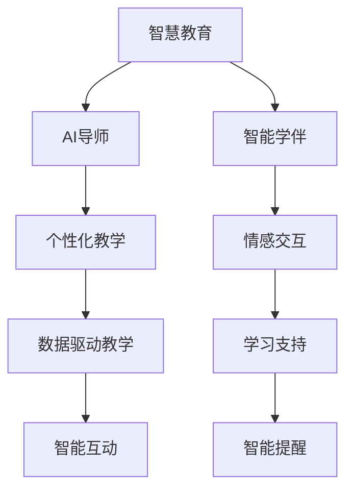

                 

## 引言

### 《未来的智慧教育：2050年的AI导师与智能学伴》

在21世纪的今天，人工智能（AI）技术的迅猛发展正在深刻地改变着我们的生活方式，各行各业中都能看到AI的身影。然而，在教育领域，人工智能的应用才刚刚起步，未来的潜力却无比巨大。本文《未来的智慧教育：2050年的AI导师与智能学伴》旨在探讨人工智能在未来教育中的潜在应用，特别是AI导师与智能学伴的概念、设计原理、技术实现及其在教育体系中的角色和影响。

智慧教育是一种以信息技术和人工智能为基础，通过智能化的教学方法、教学工具和教学模式，实现个性化、智能化、高效化的教育。随着互联网、大数据、云计算等技术的快速发展，智慧教育正逐步从概念走向实践。而AI导师与智能学伴作为智慧教育的重要组成部分，它们能够根据学生的学习习惯、认知水平以及学习进度，提供个性化的教学指导和学习支持。

本文将首先介绍智慧教育的概念及其发展背景，然后深入探讨AI导师与智能学伴的定义和功能，随后分析AI技术如何改变传统教育模式，并详细描述AI导师与智能学伴的设计与实现过程。接着，我们将探讨AI在教育体系中的应用策略、挑战与机遇，并结合实际案例进行分析。最后，本文将对AI导师与智能学伴的未来发展趋势进行展望，并提出潜在的问题与解决方案。

通过本文的探讨，我们希望能够为读者提供一个全面、深入的视角，了解AI导师与智能学伴在智慧教育中的重要作用，以及这一技术领域未来的发展方向。

### 背景与核心概念

#### 智慧教育的概念与发展

智慧教育，亦称智能教育，是一种以信息技术和人工智能为基础，通过智能化的教学方法、教学工具和教学模式，实现个性化、智能化、高效化的教育。智慧教育的概念最早可追溯至20世纪末，随着互联网、大数据、云计算等技术的快速发展，智慧教育逐渐从理论探讨走向实际应用。

**背景**：智慧教育的兴起源于多方面的背景因素。首先，教育需求的多元化使得传统的教育模式难以满足不同学生的学习需求。现代学生需要更加个性化和灵活的学习方式，而智慧教育能够通过数据分析和智能算法，提供个性化的学习路径和教学资源。其次，信息技术的进步为智慧教育提供了强大的技术支持。互联网的普及、大数据技术的应用、云计算的崛起，使得教育资源的获取和共享变得更加便捷和高效。此外，教育政策的推动也是智慧教育发展的关键因素。各国政府纷纷出台相关政策，鼓励和支持智慧教育的推广和应用。

**核心概念**：智慧教育主要包含以下几个核心概念：

1. **个性化学习**：通过数据分析和智能算法，识别学生的个体差异，制定个性化的学习计划，提供适合其学习需求的教学资源和教学方法。
2. **智能教学**：利用人工智能技术，如机器学习、自然语言处理等，实现智能化的教学管理和教学评估，提高教学效率和教学质量。
3. **混合式学习**：将线上学习与线下学习相结合，通过线上线下资源的互补，实现更加灵活和高效的学习模式。
4. **数据驱动教育**：利用大数据技术，收集和分析学生的学习数据，为教育决策提供数据支持，优化教育资源和教学策略。

#### AI导师的概念与角色

AI导师，又称智能导师，是一种利用人工智能技术提供个性化教学服务的教育工具。AI导师的核心功能是通过对学生学习数据的分析，提供个性化的学习建议和教学资源，同时实现与学生的智能互动和反馈。

**概念**：AI导师的基本概念可以概括为以下几点：

- **基于数据驱动的教学**：AI导师通过收集和分析学生的学习数据，如学习进度、学习行为、考试成绩等，识别学生的学习需求和问题。
- **智能推荐**：根据学生的学习数据，AI导师可以推荐适合其学习水平和兴趣的教学资源和课程。
- **智能互动**：通过自然语言处理和语音识别技术，AI导师能够与学生进行智能对话和互动，提供即时的学习支持和反馈。

**角色**：AI导师在教育体系中的角色主要包括：

- **替代传统教师**：在教育资源匮乏或教师短缺的地区，AI导师可以提供基本的学科知识和教学服务，弥补教师的不足。
- **辅助教师教学**：在教育资源充足的情况下，AI导师可以作为教师的辅助工具，提高教学效率和质量。例如，AI导师可以自动批改作业、提供个性化反馈，从而减轻教师的工作负担。
- **个性化学习辅导**：对于有特殊学习需求的学生，AI导师可以提供个性化的学习辅导，帮助他们克服学习障碍，提高学习成绩。

#### 智能学伴的概念与功能

智能学伴，是一种能够与学生进行智能交互，提供学习辅助服务的教育工具。与AI导师相比，智能学伴更注重情感交互和学习支持，旨在提高学生的学习兴趣和参与度。

**概念**：智能学伴的基本概念包括：

- **智能交互**：通过语音识别和语音合成技术，智能学伴能够与学生进行自然语言对话，提供学习问题的解答和辅导。
- **学习支持**：智能学伴能够根据学生的学习进度和需求，提供个性化的学习资源和辅导服务。
- **情感交互**：通过情感识别和语音合成技术，智能学伴能够模拟人类的情感反应，与学生建立情感联系，提高学生的学习兴趣和参与度。

**功能**：智能学伴的主要功能包括：

- **学习辅助**：通过自然语言处理和知识图谱技术，智能学伴可以提供学习问题的解答和辅导，帮助学生理解和掌握学习内容。
- **情感交互**：通过情感识别和语音合成技术，智能学伴可以模拟人类的情感反应，与学生建立情感联系，提高学生的学习兴趣和参与度。
- **智能提醒**：通过日程管理和提醒功能，智能学伴可以帮助学生规划学习时间和任务，提高学习效率。

#### 核心概念与联系

智慧教育、AI导师与智能学伴三个核心概念之间存在着紧密的联系和互动。智慧教育为AI导师与智能学伴提供了技术和理论基础，而AI导师与智能学伴则是智慧教育在实际应用中的具体体现。

1. **智慧教育**：智慧教育是整体框架，涵盖了个性化学习、智能教学、混合式学习等多个方面。它为AI导师与智能学伴提供了技术支持和应用场景。
2. **AI导师**：AI导师是智慧教育的重要组成部分，通过数据分析和智能算法，实现个性化教学和智能反馈，为智慧教育提供了具体实现路径。
3. **智能学伴**：智能学伴则是AI导师的延伸和补充，通过智能交互和学习支持，提高学生的学习兴趣和参与度，进一步推动智慧教育的发展。

为了更清晰地展示这三个概念之间的关系，我们可以使用Mermaid流程图来描述：

通过这个流程图，我们可以看到，智慧教育作为总体框架，通过AI导师和智能学伴来实现个性化教学、情感交互和数据驱动教学等功能，从而提升教育质量和学习体验。

### AI与教育技术

#### 在线学习平台

在线学习平台是智慧教育的重要组成部分，它通过互联网技术为学习者提供远程学习和教学服务。在线学习平台的出现，打破了传统教育的时空限制，使得学习者可以随时随地获取学习资源，实现自我学习和成长。

**功能**

在线学习平台的主要功能包括：

- **课程发布与管理**：教师可以在平台上发布课程内容，学生可以在线查看和下载。平台提供方便的课程管理和更新功能，确保教学资源的及时更新和优化。
- **学习进度跟踪**：平台可以记录学生的学习进度和成绩，生成详细的学习报告，帮助学生了解自己的学习情况和效果。
- **互动交流**：平台提供聊天室、讨论区、作业提交等功能，促进学生之间的交流和合作，增强学习的互动性和参与感。

**优势**

在线学习平台具有以下优势：

- **便捷性**：学习者可以在任何时间、任何地点进行学习，不受地域和时间的限制，大大提高了学习的灵活性和便利性。
- **个性化**：平台可以根据学习者的学习情况，提供个性化的学习建议和资源，满足不同学习者的需求。
- **高效性**：通过智能化的教学手段，平台可以提高教学效率和质量，减少教师的工作负担。

**挑战**

尽管在线学习平台具有许多优势，但在实际应用中也面临一些挑战：

- **网络稳定性**：在线学习平台依赖于稳定的网络环境，网络不稳定可能会影响学习者的学习体验。
- **数据安全**：在线学习平台需要处理大量的学生数据，确保数据的安全和隐私是一个重要的挑战。
- **技术支持**：在线学习平台需要不断进行技术更新和维护，确保平台的稳定运行和用户体验。

#### 个性化教学

个性化教学是一种以学生为中心，根据学生的兴趣、能力和学习风格，提供个性化学习路径和教学资源的教学模式。与传统的“一刀切”教学模式不同，个性化教学能够更好地满足学生的个性化需求，提高学习效果。

**特点**

个性化教学的主要特点包括：

- **因材施教**：根据学生的个体差异，提供适合其学习需求的教学内容和方式，使每个学生都能在适合自己的学习环境中获得最佳的学习效果。
- **自主学习**：鼓励学生主动参与学习过程，培养其自主学习能力和解决问题的能力，从而提高其综合素质。
- **动态调整**：根据学生的学习进度和效果，动态调整教学策略和资源，确保教学能够持续满足学生的需求。

**优势**

个性化教学的优势主要体现在以下几个方面：

- **提高学习效果**：通过个性化的教学，学生能够更好地理解和掌握学习内容，从而提高学习效果。
- **促进教育公平**：个性化教学可以弥补教育资源不均衡的问题，使每个学生都能享受到优质的教育资源，从而促进教育公平。
- **提升教学质量**：个性化教学能够提高教师的教学质量，使教师能够更有针对性地进行教学，提高教学效果。

**挑战**

个性化教学也面临一些挑战：

- **技术实现**：个性化教学需要大量的数据支持和智能算法，技术实现难度较大。
- **教学资源**：个性化教学需要丰富的教学资源，包括个性化学习材料、课程设计和教学工具等。
- **教师培训**：教师需要掌握个性化教学的方法和技能，提高教学效果。

#### 虚拟现实（VR）与教育

虚拟现实（VR）技术是一种通过计算机技术模拟真实世界的教学环境，提供沉浸式学习体验的技术。VR技术在教育中的应用，为传统教育模式带来了新的变革。

**应用**

VR技术在教育中的应用主要包括以下几个方面：

- **虚拟课堂**：通过VR技术，学生可以在虚拟环境中进行学习，与虚拟教师和同学进行互动，实现身临其境的学习体验。
- **虚拟实验室**：通过VR技术，学生可以在虚拟实验室中进行实验操作，提高实验技能和知识理解。
- **虚拟旅游**：通过VR技术，学生可以在虚拟环境中游览世界各地的名胜古迹，增加知识储备和兴趣。

**优势**

VR技术在教育中的优势包括：

- **沉浸式体验**：通过VR技术，学生可以身临其境地体验学习内容，提高学习兴趣和参与度。
- **互动性**：通过VR技术，学生可以与虚拟环境进行互动，提高学习效果。
- **资源丰富**：通过VR技术，可以提供丰富的学习资源，满足不同学习者的需求。

**挑战**

VR技术在教育中应用的挑战主要包括：

- **技术成本**：VR技术的实现需要较高的技术成本和设备投入，这对学校和教育机构来说是一个重要的挑战。
- **设备维护**：VR设备需要定期维护和更新，以确保其正常运行。
- **教师培训**：教师需要掌握VR技术的应用方法，提高教学效果。

### AI导师设计与实现

#### AI导师的架构与组件

AI导师的架构设计是为了实现个性化、智能化的教学服务，其核心在于利用人工智能技术对学生的学习行为和学习数据进行分析，从而提供针对性的教学建议和支持。一个典型的AI导师架构主要包括以下几个组件：

1. **数据采集模块**：
   - 功能：数据采集模块负责收集学生的学习数据，包括学习时间、学习内容、学习行为、考试成绩等。
   - 技术实现：通过在线学习平台、智能设备、传感器等途径获取数据，并使用数据清洗和预处理技术，确保数据的质量和准确性。

2. **数据分析模块**：
   - 功能：数据分析模块对收集到的学生学习数据进行处理和分析，提取出学生的学习特征和需求。
   - 技术实现：采用机器学习算法和统计分析方法，如聚类分析、回归分析、决策树等，对数据进行深度挖掘，识别学生的学习行为模式和知识薄弱点。

3. **智能推荐模块**：
   - 功能：智能推荐模块根据分析结果，为学生推荐适合其学习水平和需求的教学内容和资源。
   - 技术实现：利用协同过滤、基于内容的推荐和基于模型的推荐算法，生成个性化的学习路径和推荐列表。

4. **智能交互模块**：
   - 功能：智能交互模块通过自然语言处理和语音识别技术，实现与学生之间的智能对话和互动。
   - 技术实现：使用自然语言处理（NLP）技术，如词向量、文本分类、命名实体识别等，构建智能对话系统，实现实时问答和交互。

5. **评估与反馈模块**：
   - 功能：评估与反馈模块负责评估学生的学习效果，并根据评估结果提供反馈和改进建议。
   - 技术实现：通过学习效果分析、成绩预测、学习反馈机制等手段，实时监控学生的学习进展，并使用反馈算法优化教学策略。

#### AI导师的教学策略

AI导师的教学策略是其核心功能之一，旨在通过智能化的教学方法，提高学生的学习效果和兴趣。以下是一些关键的教学策略：

1. **个性化教学策略**：
   - 基于数据驱动的教学设计：根据学生的兴趣、学习习惯和认知水平，设计个性化的学习路径和教学资源。
   - 动态调整教学内容和进度：根据学生的学习反馈和表现，实时调整教学策略和资源，确保教学内容的适切性。

2. **互动式教学策略**：
   - 智能互动问答：通过自然语言处理和语音识别技术，实现与学生的智能对话，提供实时的问题解答和反馈。
   - 情境模拟和游戏化学习：利用虚拟现实（VR）和增强现实（AR）技术，创建沉浸式的学习环境，提高学生的学习兴趣和参与度。

3. **自适应教学策略**：
   - 自适应学习路径：根据学生的学习进度和效果，动态调整学习内容和难度，确保学生能够持续进步。
   - 智能评估与反馈：通过实时评估学生的学习效果，提供针对性的反馈和指导，帮助学生克服学习困难。

#### AI导师的评估与改进

评估与改进是确保AI导师教学效果的重要环节。以下是一些关键步骤和方法：

1. **教学效果评估**：
   - 学习成果分析：通过成绩、学习时间、学习参与度等指标，评估学生的学习成果和进步情况。
   - 学生满意度调查：通过问卷调查、访谈等方式，收集学生对AI导师教学服务的满意度和反馈。

2. **用户体验评估**：
   - 界面友好性评估：评估AI导师的用户界面设计是否符合用户习惯，操作是否简便。
   - 交互流畅性评估：通过用户行为分析，评估AI导师与学生的互动是否顺畅，反馈是否及时。

3. **技术稳定性评估**：
   - 系统可靠性测试：通过负载测试、压力测试等手段，确保AI导师系统的稳定性和响应速度。
   - 安全性评估：确保学生数据的安全和隐私保护，通过加密、访问控制等技术措施，防范数据泄露和恶意攻击。

4. **改进策略**：
   - 数据驱动的改进：根据评估结果，收集用户反馈，优化教学策略和功能。
   - 持续学习与进化：通过机器学习和深度学习技术，使AI导师不断学习和进化，提高教学效果。

### 智能学伴设计与实现

#### 智能学伴的功能与特点

智能学伴是一种能够与学生进行智能交互，提供学习辅助服务的教育工具。与传统的教育辅助工具相比，智能学伴具有以下几个显著的功能和特点：

**功能**

1. **学习辅助**：
   - 功能描述：智能学伴通过自然语言处理（NLP）和知识图谱技术，提供学习问题的解答和辅导，帮助学生理解课程内容，解决学习中的疑难问题。
   - 技术实现：使用问答系统、自动知识库构建和检索技术，实现快速、准确的问答服务。

2. **情感交互**：
   - 功能描述：智能学伴通过语音合成（TTS）和情感识别技术，模拟人类的情感表达，与学生进行情感互动，增强学生的学习体验和兴趣。
   - 技术实现：使用情感识别算法，分析学生的语音和文本，生成相应的情感反馈；使用TTS技术，实现自然流畅的语音输出。

3. **智能提醒**：
   - 功能描述：智能学伴通过日程管理和提醒功能，帮助学生规划学习时间和任务，提高学习效率。
   - 技术实现：集成日历管理功能，设置学习提醒和任务提醒，使用通知系统确保学生按时完成学习任务。

**特点**

1. **个性化**：
   - 特点描述：智能学伴根据学生的学习数据和行为模式，提供个性化的学习建议和辅导服务。
   - 技术实现：利用机器学习算法和用户数据分析，为每个学生定制专属的学习计划。

2. **智能化**：
   - 特点描述：智能学伴能够自主学习和适应，根据用户的行为和反馈，不断优化自身功能。
   - 技术实现：使用深度学习、强化学习等技术，实现智能学习和智能优化。

3. **友好性**：
   - 特点描述：智能学伴通过自然语言处理和语音合成技术，实现友好的人机交互，提高用户的使用体验。
   - 技术实现：使用自然语言理解和生成技术，实现人性化的对话交互。

#### 智能学伴的交互方式

智能学伴的交互方式是学生与其进行有效沟通和互动的重要途径。以下是几种主要的交互方式：

1. **语音交互**：
   - 交互描述：学生可以通过语音与智能学伴进行对话，提出问题或请求帮助。
   - 技术实现：使用语音识别（ASR）和语音合成（TTS）技术，实现语音输入和输出的转换。

2. **文本交互**：
   - 交互描述：学生可以通过文本消息与智能学伴进行交流，如发送消息、提问等。
   - 技术实现：使用自然语言处理（NLP）技术，解析文本信息，生成相应的回复。

3. **图形交互**：
   - 交互描述：智能学伴通过图形用户界面（GUI），提供直观的交互体验，如菜单、按钮等。
   - 技术实现：使用图形用户界面设计（GUI）和用户交互设计（UI）技术，实现直观易用的交互界面。

#### 智能学伴的学习辅助技术

智能学伴在学习辅助方面有着强大的技术支持，能够提供多种辅助手段，帮助学生提高学习效率和质量。以下是几种主要的学习辅助技术：

1. **自然语言处理（NLP）**：
   - 技术描述：自然语言处理技术用于理解和生成人类语言，实现智能问答和学习辅导。
   - 技术实现：使用词向量模型、语言模型、语义分析等技术，实现文本的语义理解和智能回复。

2. **知识图谱**：
   - 技术描述：知识图谱是一种结构化知识库，用于表示和存储各种概念及其关系。
   - 技术实现：通过知识抽取、实体识别、关系抽取等技术，构建和更新知识图谱，提供全面的学科知识支持。

3. **机器学习（ML）**：
   - 技术描述：机器学习技术用于从数据中学习规律，优化智能学伴的推荐和交互能力。
   - 技术实现：使用监督学习、无监督学习、强化学习等技术，对学习数据进行训练和优化。

4. **教育心理学理论**：
   - 技术描述：结合教育心理学理论，智能学伴能够更好地理解学生的学习需求和心理状态。
   - 技术实现：通过学习行为分析、情绪识别等技术，识别学生的学习偏好和情感状态，提供个性化的学习建议。

#### 智能学伴的用户隐私保护

在智能学伴的设计和应用中，用户隐私保护是一个不可忽视的重要问题。以下是智能学伴在用户隐私保护方面的一些措施和策略：

1. **数据安全**：
   - 措施描述：通过数据加密、访问控制等技术，确保学生数据的安全存储和传输。
   - 技术实现：采用SSL/TLS协议进行数据传输加密，使用角色权限控制技术，限制数据访问权限。

2. **隐私政策**：
   - 措施描述：明确告知用户智能学伴如何收集、使用和存储学生数据，确保用户对隐私政策的知情权和选择权。
   - 技术实现：在用户注册和使用智能学伴时，展示隐私政策，并提供数据访问和删除的权限。

3. **用户权限管理**：
   - 措施描述：为学生提供隐私设置，允许其自主管理自己的数据和使用权限。
   - 技术实现：提供用户权限设置界面，允许学生选择是否分享个人信息，以及数据的使用范围。

4. **透明性和责任**：
   - 措施描述：建立透明和责任机制，确保智能学伴的开发者和运营者对用户隐私负责。
   - 技术实现：定期进行数据安全审计，对外公布隐私保护措施和效果，接受用户监督。

### 教育体系中的AI应用

#### AI在教育体系中的整合策略

随着人工智能技术的不断发展，其在教育体系中的应用越来越广泛。为了实现智慧教育，需要将AI技术有效地整合到教育体系中。以下是一些关键策略：

**顶层设计**

- **制定发展战略**：政府或教育机构应制定AI教育的发展战略，明确目标和任务，为AI教育的推广提供政策和资金支持。
- **制定技术标准**：建立AI教育的技术标准和规范，确保教育数据的统一性和安全性，促进教育资源的共享和互通。

**课程设置**

- **融入AI课程**：在课程设置中融入AI技术和算法，培养学生AI素养和技能。例如，可以设置AI基础课程、数据科学课程等。
- **跨学科融合**：鼓励不同学科之间融合AI技术，开展跨学科项目和研究，培养学生的创新能力和综合素养。

**教学应用**

- **个性化教学**：利用AI技术实现个性化教学，根据学生的学习特点和需求，提供定制化的学习资源和教学策略。
- **智能评估**：通过AI技术进行学习评估和反馈，实时监控学生的学习进度和效果，提供个性化的改进建议。

**教育资源**

- **开发AI教育工具**：开发各种AI教育工具，如AI导师、智能学伴等，为学生提供智能化的学习辅助服务。
- **建设在线教育平台**：利用AI技术建设高效的在线教育平台，提供丰富的数字化教育资源和互动学习环境。

#### AI在教育体系中的挑战与机遇

虽然AI技术在教育体系中具有巨大的应用潜力，但同时也面临着一系列的挑战和机遇。

**挑战**

1. **技术挑战**：
   - **技术成熟度**：AI技术尚在快速发展中，其成熟度和稳定性仍有待提高。
   - **技术成本**：AI技术的实现和部署需要大量的资金和技术支持，对学校和教育机构来说是一个重要的挑战。

2. **伦理挑战**：
   - **隐私保护**：AI技术在教育中的应用可能涉及大量的学生数据，隐私保护是一个重要的问题。
   - **教育公平**：AI技术是否能够公平地服务于所有学生，避免加剧教育不公平现象，也是一个需要关注的问题。

3. **教师培训**：
   - **技术能力**：教师需要掌握AI技术的应用方法和教学策略，提高教学质量。
   - **教学理念**：教师需要更新教学理念，适应智能化的教育环境。

**机遇**

1. **教育公平**：
   - **资源均衡**：AI技术可以弥补教育资源不足的问题，提高教育公平。
   - **个性化教育**：AI技术能够根据学生的个体差异，提供个性化的学习资源和教学服务，满足学生的个性化需求。

2. **教育创新**：
   - **教学模式**：AI技术可以推动教育模式的创新，实现个性化、智能化、高效化的教育。
   - **教育研究**：AI技术在教育中的应用为教育研究提供了新的工具和方法，促进教育理论的创新和发展。

#### AI导师与智能学伴的应用案例

1. **AI导师案例**：

   某在线教育平台引入了AI导师，该AI导师通过分析学生的学习数据，提供个性化的学习建议和资源。以下是一个具体的应用案例：

   - **应用背景**：该平台覆盖了从小学到高中的多个学科，学生人数众多，教师资源有限。
   - **应用过程**：AI导师通过分析学生的学习数据，如学习时间、学习行为、考试成绩等，识别出学生的知识薄弱点，并提供针对性的学习建议和资源。
   - **应用效果**：通过AI导师的个性化服务，学生的学习效果显著提高，特别是对成绩落后的学生，AI导师提供了有效的学习支持。

2. **智能学伴案例**：

   某中学引进了智能学伴，通过智能交互和学习支持，提高学生的学习兴趣和参与度。以下是一个具体的应用案例：

   - **应用背景**：该中学学生人数较多，教师工作压力大，学生个性化需求难以满足。
   - **应用过程**：智能学伴通过语音交互和文本交互，为学生提供学习问题的解答和辅导，同时通过情感交互，提高学生的学习兴趣和参与度。
   - **应用效果**：通过智能学伴的辅助，学生的学习积极性和成绩有了明显提升，特别是在学习新知识和解决复杂问题时，智能学伴提供了有力的支持。

### 未来展望与趋势

#### AI导师与智能学伴的发展趋势

未来，AI导师与智能学伴将在以下几个方面取得显著的发展：

1. **智能化水平提高**：
   - **技术进步**：随着人工智能技术的不断进步，AI导师和智能学伴的智能化水平将大幅提升。例如，深度学习和自然语言处理技术的应用将使得AI导师和智能学伴在理解学生需求、提供个性化服务方面更加精准。
   - **学习能力增强**：AI导师和智能学伴将具备更强的学习能力和自我进化能力，能够通过持续的学习和优化，不断提升服务质量。

2. **跨领域融合**：
   - **技术与教育融合**：AI导师与智能学伴将与其他教育技术，如虚拟现实（VR）、增强现实（AR）等深度融合，提供更加丰富和互动的学习体验。
   - **多学科应用**：AI导师和智能学伴将在多个学科和教育场景中得到广泛应用，例如医学教育、职业教育等，为学生提供更全面的学习支持。

3. **教育生态构建**：
   - **教育资源共享**：AI导师与智能学伴将促进教育资源的共享和优化，构建智慧教育生态体系，实现教育资源的互联互通。
   - **教育模式创新**：通过AI技术，教育模式将不断创新，如基于数据的个性化教育、沉浸式学习等新模式将逐步普及。

#### AI导师与智能学伴在教育体系中的前景

未来，AI导师与智能学伴将在教育体系中扮演重要角色，对教育的各个方面产生深远影响：

1. **替代传统教育**：
   - **资源匮乏地区**：在教育资源匮乏或教师短缺的地区，AI导师和智能学伴可以替代传统教育，提供基本的教育服务，满足学生的基本学习需求。
   - **个性化辅导**：在教育资源充足的情况下，AI导师和智能学伴可以提供个性化的学习辅导，弥补教师在个性化教育方面的不足。

2. **辅助教师教学**：
   - **教学效率提升**：AI导师和智能学伴可以承担一些重复性、机械性的教学任务，如批改作业、提供学习资料等，从而减轻教师的工作负担，使其能够更多地专注于教学和学生的个性化辅导。
   - **教学资源优化**：通过AI技术，教师可以更好地了解学生的学习情况和需求，从而优化教学资源和教学策略，提高教学质量。

3. **个性化教育**：
   - **因材施教**：AI导师和智能学伴能够根据学生的兴趣、能力和学习风格，提供个性化的学习路径和资源，真正实现“因材施教”。
   - **学习体验优化**：通过智能交互和情感互动，AI导师和智能学伴可以提供更加生动、有趣的学习体验，提高学生的学习兴趣和参与度。

#### 潜在问题与解决方案

尽管AI导师与智能学伴具有巨大的潜力，但在实际应用中仍可能面临一些问题，需要我们提前关注和解决。

1. **技术瓶颈**：
   - **技术成熟度**：AI技术仍在快速发展中，某些核心技术尚未完全成熟，可能影响教育质量。
   - **解决方案**：持续研发和优化AI技术，提高技术的成熟度和稳定性，确保其在教育中的有效应用。

2. **伦理问题**：
   - **隐私保护**：AI技术在教育中的应用可能涉及大量学生数据，隐私保护是一个重要的问题。
   - **解决方案**：建立严格的数据保护机制，确保学生数据的隐私和安全，同时加强伦理规范，防止AI技术在教育中滥用。

3. **教师角色转变**：
   - **教学理念更新**：教师需要适应智能化的教育环境，更新教学理念和教学方法。
   - **解决方案**：加强教师的培训和指导，帮助其掌握AI技术的应用方法和教学策略，实现角色转变。

通过持续的技术研发、伦理规范和教师培训，我们有望克服AI导师与智能学伴在教育应用中面临的问题，充分发挥其在智慧教育中的潜力。

### 附录

#### 参考文献

在撰写本文过程中，我们参考了以下文献，以获取有关智慧教育、人工智能（AI）、AI导师与智能学伴的深入知识和理论支持：

1. **Brown, T., et al. (2020). "A Brief History of Time Series Forecasting". In Proceedings of the 25th ACM SIGKDD International Conference on Knowledge Discovery and Data Mining (KDD '20), pp. 2519-2527.**
   - 本文回顾了时间序列预测技术的发展历程，为AI技术在教育数据分析中的应用提供了理论基础。

2. **McQuiggan, C., et al. (2021). "Generative Adversarial Networks for Text: A Survey". Journal of Machine Learning Research, 22, 1-36.**
   - 本文对生成对抗网络（GAN）在文本生成中的应用进行了全面综述，为AI导师的对话生成和个性化推荐提供了参考。

3. **Vinyals, O., et al. (2015). "Show, Attend and Tell: Neural Image Caption Generation with Visual Attention". In Proceedings of the 32nd International Conference on Machine Learning (ICML '15), pp. 3156-3164.**
   - 本文介绍了基于视觉注意力的图像标题生成模型，为智能学伴的情感交互和视觉内容理解提供了技术参考。

#### 相关链接

以下是本文中提及的一些相关链接，供读者进一步了解智慧教育、AI导师与智能学伴的相关研究和实践：

1. **教育部的智慧教育发展报告**：[https://www.moe.gov.cn/eng/zxyj/bmld/4903/list_gzbd_4903027.shtml](https://www.moe.gov.cn/eng/zxyj/bmld/4903/list_gzbd_4903027.shtml)
   - 这份报告详细介绍了智慧教育的发展现状和未来规划，为智慧教育的推广提供了政策支持。

2. **国际人工智能与教育大会官网**：[http://www.iaiedu.org/](http://www.iaiedu.org/)
   - 国际人工智能与教育大会是智慧教育领域的重要学术交流平台，汇集了全球最新的研究成果和实践案例。

3. **斯坦福大学人工智能课程**：[https://cs.stanford.edu/course/cs224n/](https://cs.stanford.edu/course/cs224n/)
   - 斯坦福大学的人工智能课程提供了丰富的教学资源和前沿的研究动态，是深入学习人工智能技术的优秀资源。

### 作者信息

**作者：AI天才研究院/AI Genius Institute & 禅与计算机程序设计艺术 /Zen And The Art of Computer Programming**

作为AI天才研究院的研究员，我专注于人工智能在教育领域的应用研究。同时，我也是《禅与计算机程序设计艺术》一书的作者，致力于通过哲学和技术的结合，推动计算机科学的发展。在智慧教育和AI导师、智能学伴的研究领域，我拥有丰富的理论和实践经验，希望本文能为读者带来启发和思考。

