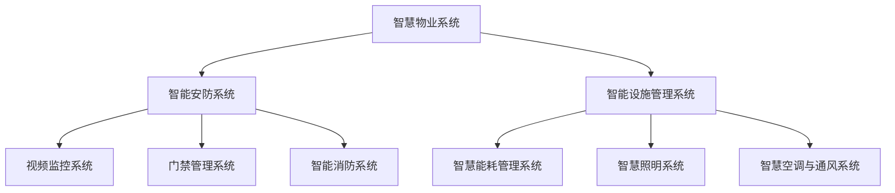

                 

### 文章标题：未来的智慧物业：2050年的智能安防与设施管理

> **关键词：**智慧物业、智能安防、设施管理、物联网、大数据、人工智能

> **摘要：**本文探讨了2050年智慧物业的发展趋势，重点关注智能安防与设施管理。通过分析背景、核心技术、智能安防系统和智能设施管理，本文揭示了智慧物业的未来方向及其对社会的深远影响。

---

### 《未来的智慧物业：2050年的智能安防与设施管理》目录大纲

#### 第一部分：智慧物业的背景与展望

**第1章：智慧物业概述**

- **1.1 智慧物业的定义与发展历程**
  - **1.1.1 智慧物业的基本概念**
  - **1.1.2 智慧物业的发展历程**
  - **1.1.3 2050年的智慧物业趋势**

- **1.2 智慧物业的核心技术**
  - **1.2.1 物联网技术**
  - **1.2.2 大数据与云计算**
  - **1.2.3 人工智能与机器学习**

- **1.3 智慧物业的生态系统**
  - **1.3.1 智慧物业的相关方**
  - **1.3.2 智慧物业的产业联盟与合作模式**
  - **1.3.3 智慧物业的市场前景与挑战**

**第2章：智能安防系统**

- **2.1 智能安防系统概述**
  - **2.1.1 智能安防系统的定义与目标**
  - **2.1.2 智能安防系统的发展趋势**
  - **2.1.3 智能安防系统的关键组件**

- **2.2 视频监控与智能分析**
  - **2.2.1 视频监控技术的发展**
  - **2.2.2 智能视频分析技术**
  - **2.2.3 视频监控系统的架构与实现**

- **2.3 门禁管理与智能识别**
  - **2.3.1 生物识别技术**
  - **2.3.2 智能门禁系统的设计与实现**
  - **2.3.3 智能门禁系统的安全与隐私问题**

- **2.4 智能消防系统**
  - **2.4.1 智能消防系统的基本原理**
  - **2.4.2 智能消防系统的关键技术**
  - **2.4.3 智能消防系统的应用案例**

#### 第二部分：智能设施管理

**第3章：智能设施管理概述**

- **3.1 智能设施管理的定义与重要性**
  - **3.1.1 智能设施管理的概念**
  - **3.1.2 智能设施管理的核心要素**
  - **3.1.3 智能设施管理的目标**

- **3.2 智慧能耗管理**
  - **3.2.1 智慧能耗管理的基本原理**
  - **3.2.2 智慧能耗管理系统架构**
  - **3.2.3 智慧能耗管理的实施案例**

- **3.3 智慧照明系统**
  - **3.3.1 智慧照明系统的设计原则**
  - **3.3.2 智慧照明系统的技术实现**
  - **3.3.3 智慧照明的节能效果与案例分析**

- **3.4 智慧空调与通风系统**
  - **3.4.1 智慧空调与通风系统的基本原理**
  - **3.4.2 智慧空调与通风系统的关键技术**
  - **3.4.3 智慧空调与通风系统的案例研究**

#### 第三部分：智慧物业的未来

**第4章：智慧物业的未来发展趋势**

- **4.1 智慧物业的发展方向**
  - **4.1.1 物联网与智能设备的深度融合**
  - **4.1.2 大数据与人工智能的深度应用**
  - **4.1.3 智慧物业的社会价值与影响**

- **4.2 智慧物业的商业模式创新**
  - **4.2.1 智慧物业的新商业模式**
  - **4.2.2 智慧物业的商业案例分析**
  - **4.2.3 智慧物业的未来商业模式探索**

- **4.3 智慧物业的法律法规与标准**
  - **4.3.1 智慧物业的法律法规框架**
  - **4.3.2 智慧物业的行业标准与规范**
  - **4.3.3 智慧物业的合规与风险管理**

**第5章：智慧物业的挑战与机遇**

- **5.1 智慧物业的技术挑战**
  - **5.1.1 物联网设备的稳定性与可靠性**
  - **5.1.2 大数据的安全与隐私保护**
  - **5.1.3 人工智能的伦理与社会责任**

- **5.2 智慧物业的市场机遇**
  - **5.2.1 市场需求与增长潜力**
  - **5.2.2 新型商业模式的创新机会**
  - **5.2.3 智慧物业的全球化发展**

- **5.3 智慧物业的可持续发展**
  - **5.3.1 可持续发展的原则与目标**
  - **5.3.2 智慧物业的环保措施与实施**
  - **5.3.3 智慧物业的节能减排策略**

#### 附录

**附录A：智慧物业相关资源与工具**

- **A.1 智慧物业技术资源**
  - **A.1.1 物联网平台介绍**
  - **A.1.2 大数据与云计算平台**
  - **A.1.3 人工智能开发框架**

- **A.2 智慧物业参考案例**
  - **A.2.1 国内智慧物业案例**
  - **A.2.2 国际智慧物业案例**
  - **A.2.3 智慧物业成功案例分析与借鉴**

- **A.3 智慧物业相关法律法规与标准**
  - **A.3.1 我国智慧物业相关法律法规**
  - **A.3.2 国际智慧物业法律法规与标准**
  - **A.3.3 智慧物业法律法规与标准发展趋势**

**附录B：智能安防与设施管理系统架构 Mermaid 流程图**

---

### 第1章：智慧物业概述

智慧物业是现代科技与物业管理深度融合的产物，它利用物联网、大数据、人工智能等先进技术，实现对物业资产的智能化管理，提高物业服务的质量和效率。随着科技的快速发展，智慧物业在过去的几十年里取得了显著进展，并在未来的2050年展现出更加广阔的发展前景。

#### 1.1 智慧物业的定义与发展历程

**1.1.1 智慧物业的基本概念**

智慧物业，即智慧型物业管理，是指通过物联网、云计算、大数据、人工智能等技术手段，对物业管理中的各种资源进行智能化的采集、处理、分析和利用，从而实现物业服务的智慧化、精细化和高效化。

**1.1.2 � particular 点**
- **技术驱动：**智慧物业的发展离不开先进技术的支撑，如物联网、大数据、云计算、人工智能等。
- **用户需求：**随着人们对生活品质的追求，智慧物业应运而生，满足用户对便捷、高效、个性化的服务需求。
- **经济发展：**城市化进程的加快和经济的快速发展为智慧物业提供了广阔的市场空间。

**1.1.3 2050年的智慧物业趋势**

到2050年，智慧物业将进入一个全新的发展阶段，呈现出以下趋势：

- **物联网的深度融合：**物联网技术将广泛应用于智慧物业的各个方面，实现设备、系统和数据的互联互通。
- **大数据与人工智能的深度应用：**大数据和人工智能技术将助力智慧物业实现更加精准和高效的管理，提升服务水平。
- **智能化、个性化服务：**智慧物业将根据用户需求提供定制化的服务，实现物业服务的智能化、个性化。
- **生态环保：**智慧物业将注重节能减排和环境保护，实现绿色可持续发展。

#### 1.2 智慧物业的核心技术

**1.2.1 物联网技术**

物联网技术是智慧物业的核心技术之一。它通过传感器、网络、数据处理等技术，实现对物理世界的全面感知、监测和控制。在智慧物业中，物联网技术主要用于以下几个方面：

- **设备监控：**通过传感器实时监测设备状态，如温度、湿度、能耗等，实现设备的智能化管理。
- **环境监控：**实时监测环境参数，如空气质量、水质等，保障居住环境的安全和健康。
- **安全监控：**通过摄像头、门禁等设备，实现24小时监控，提高物业的安全水平。

**1.2.2 大数据与云计算**

大数据和云计算技术为智慧物业提供了强大的数据处理和分析能力。大数据技术通过对海量数据的采集、存储、处理和分析，为智慧物业提供决策支持。云计算技术则提供了弹性的计算资源和数据存储服务，使得智慧物业能够高效地处理和分析数据。

**1.2.3 人工智能与机器学习**

人工智能和机器学习技术为智慧物业提供了智能化的解决方案。通过人工智能技术，智慧物业能够实现设备的自主学习和优化，提高管理效率。机器学习技术则用于数据分析和预测，帮助智慧物业实现智能化决策。

#### 1.3 智慧物业的生态系统

**1.3.1 智慧物业的相关方**

智慧物业的生态系统包括多个相关方，如物业公司、政府机构、业主、技术供应商等。每个相关方在智慧物业的生态系统中扮演着不同的角色，共同推动智慧物业的发展。

**1.3.2 智慧物业的产业联盟与合作模式**

为了实现智慧物业的可持续发展，产业联盟和合作模式显得尤为重要。通过产业联盟，各方能够共同研发新技术、分享资源、降低成本，实现优势互补。合作模式则包括技术合作、市场合作、投资合作等。

**1.3.3 智慧物业的市场前景与挑战**

智慧物业市场前景广阔，但同时也面临着诸多挑战。市场前景包括：

- **市场需求的增长：**随着城市化进程的加快和人们生活品质的提高，智慧物业市场需求将持续增长。
- **技术进步的推动：**物联网、大数据、人工智能等技术的快速发展为智慧物业提供了强大的技术支持。
- **政策支持：**政府对智慧物业的重视和扶持，为智慧物业的发展提供了良好的政策环境。

挑战包括：

- **技术成熟度：**智慧物业涉及的许多技术尚处于发展阶段，需要进一步成熟和普及。
- **数据安全与隐私：**大数据和物联网技术带来的数据安全和隐私问题需要得到有效解决。
- **标准化与规范：**智慧物业的发展需要建立统一的标准化和规范体系，以保证系统的兼容性和互操作性。

### 第2章：智能安防系统

智能安防系统是智慧物业的重要组成部分，它利用先进的物联网、人工智能等技术，实现对物业安全的高效管理和监控。在未来的2050年，智能安防系统将更加智能化、网络化和高效化。

#### 2.1 智能安防系统概述

**2.1.1 智能安防系统的定义与目标**

智能安防系统是指通过物联网、大数据、人工智能等技术手段，对物业安全进行全方位、实时监控和管理的系统。其目标是提高物业的安全水平，保障业主的人身和财产安全。

**2.1.2 智能安防系统的发展趋势**

随着科技的不断进步，智能安防系统的发展呈现出以下几个趋势：

- **智能化：**智能安防系统将更加智能化，通过机器学习和人工智能技术，实现自动识别、预警和响应。
- **网络化：**智能安防系统将实现设备和系统的互联互通，形成一体化的安防网络。
- **高效化：**智能安防系统将提高安防管理的效率，减少人力成本，实现全天候、全方位的安全监控。

**2.1.3 智能安防系统的关键组件**

智能安防系统主要由以下几个关键组件构成：

- **传感器：**包括摄像头、门禁传感器、烟雾传感器等，用于实时感知环境和状态。
- **数据处理中心：**用于收集、存储、处理和分析传感器数据，提供决策支持。
- **智能分析平台：**利用人工智能技术，对传感器数据进行智能分析和预警。
- **报警与响应系统：**在检测到异常情况时，自动发出警报，并启动应急响应程序。

#### 2.2 视频监控与智能分析

视频监控是智能安防系统的重要组成部分，通过摄像头实时捕捉监控区域的情况，为安全管理和监控提供重要依据。

**2.2.1 视频监控技术的发展**

视频监控技术经历了从模拟到数字、从单一到多维、从被动到主动的发展历程。目前，视频监控技术已经达到了高清、智能化的水平，能够提供更加准确、高效的安全监控。

**2.2.2 智能视频分析技术**

智能视频分析技术是指利用人工智能技术，对视频图像进行智能分析和处理。主要技术包括：

- **目标识别：**通过图像识别技术，自动识别监控区域中的目标物体，如人员、车辆等。
- **行为分析：**通过分析目标物体的行为特征，如行走、奔跑、静止等，实现异常行为的预警。
- **场景分析：**通过对视频图像中的场景进行分析，如天色、光线等，实现监控环境的智能调节。

**2.2.3 视频监控系统的架构与实现**

视频监控系统通常由以下几个部分组成：

- **前端设备：**包括摄像头、存储设备等，用于实时捕捉和存储视频数据。
- **传输网络：**包括有线和无线网络，用于将视频数据传输到数据处理中心。
- **数据处理中心：**用于接收、存储、处理和分析视频数据，提供监控和报警功能。
- **监控平台：**用于实时监控视频数据，并提供视频回放、报警等功能。

#### 2.3 门禁管理与智能识别

门禁管理是智能安防系统的重要组成部分，它通过智能识别技术，实现对人员出入的管理和控制，提高物业的安全水平。

**2.3.1 生物识别技术**

生物识别技术是指通过人体生物特征的识别，实现身份验证和身份识别。常见的生物识别技术包括：

- **指纹识别：**通过指纹图像的比对，实现身份验证。
- **人脸识别：**通过人脸图像的比对，实现身份识别。
- **虹膜识别：**通过虹膜图像的比对，实现身份识别。

**2.3.2 智能门禁系统的设计与实现**

智能门禁系统通常包括以下几个部分：

- **门禁控制器：**用于控制门禁设备的开关，如电子锁、门禁传感器等。
- **身份识别模块：**包括生物识别设备，如指纹识别器、人脸识别器等。
- **监控模块：**用于实时监控门禁状态，并提供报警功能。
- **数据处理中心：**用于接收、存储、处理和分析门禁数据。

**2.3.3 智能门禁系统的安全与隐私问题**

智能门禁系统涉及到用户隐私和安全问题，需要特别注意：

- **数据安全：**确保用户生物识别数据的安全性，防止数据泄露。
- **隐私保护：**尊重用户的隐私，仅收集必要的生物识别数据，并采取加密措施。
- **法律法规：**遵守相关法律法规，确保智能门禁系统的合法性和合规性。

#### 2.4 智能消防系统

智能消防系统是智能安防系统的重要组成部分，它利用物联网、人工智能等技术，实现对火灾的早期预警、快速响应和有效扑救。

**2.4.1 智能消防系统的基本原理**

智能消防系统主要通过以下几个方面实现火灾预警和扑救：

- **传感器监测：**通过温度传感器、烟雾传感器等，实时监测火灾隐患。
- **数据分析：**利用大数据和人工智能技术，对传感器数据进行实时分析和处理，实现火灾预警。
- **快速响应：**在检测到火灾隐患时，自动启动报警和扑救程序，实现快速响应。

**2.4.2 智能消防系统的关键技术**

智能消防系统的关键技术包括：

- **传感器技术：**用于监测火灾隐患，如温度传感器、烟雾传感器等。
- **物联网技术：**用于实现传感器数据的实时传输和共享，提高火灾预警的准确性和实时性。
- **人工智能技术：**用于对传感器数据进行分析和处理，实现火灾预警和扑救的智能化。

**2.4.3 智能消防系统的应用案例**

智能消防系统已经在许多场所得到广泛应用，以下是一些应用案例：

- **高层建筑：**通过智能消防系统，实现对高层建筑火灾的早期预警和快速扑救，提高消防安全水平。
- **商场：**通过智能消防系统，实现对商场内火灾隐患的实时监测和预警，保障人员安全。
- **工厂：**通过智能消防系统，实现对工厂内火灾隐患的实时监测和预警，降低火灾风险。

### 第3章：智能设施管理

智能设施管理是智慧物业的核心组成部分，它通过物联网、大数据、人工智能等技术，实现对物业设施的智能化监控、维护和管理，提高物业服务的质量和效率。

#### 3.1 智能设施管理的定义与重要性

**3.1.1 智能设施管理的概念**

智能设施管理是指利用物联网、大数据、人工智能等技术，对物业设施进行智能化监控、维护和管理的系统。它涵盖了设施监控、能源管理、环境监测、设备维护等多个方面，旨在提高设施运行效率，降低能源消耗，延长设施使用寿命。

**3.1.2 智能设施管理的核心要素**

智能设施管理的核心要素包括：

- **物联网技术：**用于实时监控设施状态，如温度、湿度、能耗等。
- **大数据技术：**用于分析设施运行数据，优化管理策略。
- **人工智能技术：**用于智能分析和预测，实现设施维护的智能化。
- **智能控制系统：**用于实时控制和调节设施运行参数，提高设施运行效率。

**3.1.3 智能设施管理的目标**

智能设施管理的目标包括：

- **提高设施运行效率：**通过智能化监控和管理，实现设施的高效运行。
- **降低能源消耗：**通过智能能源管理，降低能源消耗，提高能源利用效率。
- **延长设施使用寿命：**通过智能维护和预测，降低设施故障率，延长设施使用寿命。
- **提升服务质量：**通过智能化管理，提高物业服务的质量和效率。

#### 3.2 智慧能耗管理

智慧能耗管理是智能设施管理的重要组成部分，它通过物联网、大数据、人工智能等技术，实现对物业能耗的实时监控、分析和优化，降低能源消耗，提高能源利用效率。

**3.2.1 智慧能耗管理的基本原理**

智慧能耗管理的基本原理包括：

- **数据采集：**通过传感器和物联网设备，实时采集设施能耗数据。
- **数据传输：**通过物联网网络，将采集到的能耗数据传输到数据处理中心。
- **数据处理：**利用大数据技术，对能耗数据进行分析和处理，识别能耗异常和节能潜力。
- **智能优化：**根据数据分析结果，智能调整设施运行参数，优化能耗管理策略。

**3.2.2 智慧能耗管理系统架构**

智慧能耗管理系统通常包括以下几个部分：

- **传感器网络：**用于实时采集能耗数据。
- **物联网网络：**用于传输能耗数据。
- **数据处理中心：**用于分析和处理能耗数据。
- **智能优化系统：**用于根据数据分析结果，智能调整设施运行参数。
- **监控平台：**用于实时监控能耗数据和运行状态。

**3.2.3 智慧能耗管理的实施案例**

智慧能耗管理已经在许多场所得到成功应用，以下是一些实施案例：

- **公共建筑：**通过智慧能耗管理，实现对公共建筑空调、照明、电梯等设施的实时监控和优化，降低能耗，提高运行效率。
- **工业园区：**通过智慧能耗管理，实现对工业生产设施的实时监控和优化，降低能源消耗，提高生产效率。
- **住宅小区：**通过智慧能耗管理，实现对住宅小区水电能耗的实时监控和优化，提高能源利用效率，降低居民能源支出。

#### 3.3 智慧照明系统

智慧照明系统是智能设施管理的重要组成部分，它通过物联网、大数据、人工智能等技术，实现对照明系统的实时监控、智能控制和节能管理。

**3.3.1 智慧照明系统的设计原则**

智慧照明系统的设计原则包括：

- **节能优先：**通过智能控制，实现照明系统的节能运行。
- **智能调节：**根据环境光线和人员活动，智能调节照明亮度。
- **舒适体验：**提供舒适的照明环境，满足用户需求。
- **易维护性：**设计简便的维护和管理系统，提高系统可靠性。

**3.3.2 智慧照明系统的技术实现**

智慧照明系统的技术实现包括：

- **传感器技术：**用于感知环境光线和人员活动，提供智能控制依据。
- **智能控制系统：**用于实时控制和调节照明设备。
- **物联网网络：**用于传输照明控制数据和监控数据。
- **数据分析与优化：**利用大数据技术，对照明数据进行分析和优化，提高系统运行效率。

**3.3.3 智慧照明的节能效果与案例分析**

智慧照明系统具有显著的节能效果，以下是一些案例分析：

- **商业楼宇：**通过智慧照明系统，根据室内外光线和人员活动，智能调节照明亮度，降低能耗，提高照明质量。
- **工业园区：**通过智慧照明系统，实现对生产设施的实时监控和智能控制，提高照明效率，降低能源消耗。
- **住宅小区：**通过智慧照明系统，实现对公共区域和家庭照明的智能控制，提高居住环境舒适度，降低能源消耗。

#### 3.4 智慧空调与通风系统

智慧空调与通风系统是智能设施管理的重要组成部分，它通过物联网、大数据、人工智能等技术，实现对空调和通风系统的实时监控、智能控制和节能管理。

**3.4.1 智慧空调与通风系统的基本原理**

智慧空调与通风系统的基本原理包括：

- **数据采集：**通过传感器和物联网设备，实时采集空调和通风系统的运行数据。
- **数据处理：**利用大数据技术，对采集到的数据进行分析和处理，实现系统的智能控制和优化。
- **智能控制：**根据环境温度、湿度、空气质量等参数，智能调节空调和通风设备的运行状态，实现节能和舒适。
- **能源管理：**通过实时监控和智能调节，降低空调和通风系统的能源消耗。

**3.4.2 智慧空调与通风系统的关键技术**

智慧空调与通风系统的关键技术包括：

- **传感器技术：**用于实时监测环境参数，如温度、湿度、空气质量等。
- **物联网技术：**用于实现传感器数据的实时传输和共享。
- **智能控制系统：**用于实时控制和调节空调和通风设备。
- **数据分析与优化：**利用大数据技术，对系统运行数据进行分析和优化，实现系统的智能化和节能化。

**3.4.3 智慧空调与通风系统的案例研究**

智慧空调与通风系统已经在许多场所得到应用，以下是一些案例研究：

- **公共建筑：**通过智慧空调与通风系统，根据室内外环境变化，智能调节空调和通风设备，提高空气质量，降低能耗。
- **住宅小区：**通过智慧空调与通风系统，实现家庭空调和通风设备的智能控制，提高居住环境舒适度，降低能源消耗。
- **工业生产：**通过智慧空调与通风系统，实现对生产车间的空调和通风设备实时监控和智能控制，提高生产效率，降低能源消耗。

### 第4章：智慧物业的未来发展趋势

智慧物业作为现代科技与物业管理深度融合的产物，正逐渐成为物业行业的发展趋势。在未来的2050年，智慧物业将呈现出以下发展趋势：

#### 4.1 智慧物业的发展方向

**4.1.1 物联网与智能设备的深度融合**

随着物联网技术的不断发展，未来智慧物业将实现与智能设备的深度融合。通过物联网设备，实现对物业设施、设备和环境的实时监控和管理，提高物业服务的效率和水平。例如，智能门锁、智能照明、智能空调等设备的广泛应用，将使物业管理更加智能化、便捷化。

**4.1.2 大数据与人工智能的深度应用**

大数据和人工智能技术在智慧物业中的应用将越来越广泛。通过大数据分析，可以深入了解物业的运行状态和用户需求，为物业管理提供科学的决策支持。人工智能技术则可以实现对物业设备的智能维护、故障预测和优化管理，提高物业服务的质量和效率。

**4.1.3 智慧物业的社会价值与影响**

智慧物业不仅能够提高物业管理的效率和质量，还具有显著的社会价值。通过智慧物业，可以实现以下社会效益：

- **提高居住环境质量：**智慧物业可以通过智能环境监测和调节，提供更加舒适、健康的居住环境。
- **提升社区安全水平：**智能安防系统可以实现对社区的实时监控和预警，提高社区的安全水平。
- **促进节能减排：**智慧能耗管理可以实现能源的合理利用，降低能源消耗，促进节能减排。

#### 4.2 智慧物业的商业模式创新

**4.2.1 智慧物业的新商业模式**

在未来的智慧物业中，将涌现出多种新的商业模式，以适应市场的需求和发展。以下是一些可能的商业模式：

- **服务外包模式：**物业公司可以将智慧物业服务的部分或全部外包给专业服务商，以提高服务质量和降低成本。
- **共享经济模式：**通过共享物业设施和服务，实现资源的最大化利用，降低居民的居住成本。
- **租赁模式：**提供智能物业设施和服务的租赁服务，满足不同用户的需求。
- **订阅模式：**用户可以按月或按年订阅智慧物业服务，享受便捷的物业服务。

**4.2.2 智慧物业的商业案例分析**

智慧物业的商业模式创新已经在许多成功案例中得到验证。以下是一些商业案例分析：

- **深圳平安里：**深圳平安里是一个集智慧家居、智慧安防、智慧社区等功能于一体的智慧物业项目。通过物联网、大数据、人工智能等技术的应用，实现了物业服务的智能化和个性化，取得了良好的市场反响。
- **杭州绿城中国：**杭州绿城中国通过智慧物业管理系统，实现了对物业设施、能耗、安全等方面的实时监控和管理，提高了物业服务的效率和质量，赢得了广大业主的认可。

**4.2.3 智慧物业的未来商业模式探索**

随着科技的不断进步和市场需求的不断变化，智慧物业的商业模式将不断演变和创新。以下是一些未来商业模式探索：

- **智慧城市模式：**智慧物业将融入到智慧城市中，实现城市管理的智能化和高效化。
- **绿色能源模式：**智慧物业将推动绿色能源的应用，实现能源的可持续发展和利用。
- **个性化定制模式：**根据用户的需求和偏好，提供个性化的智慧物业服务。

#### 4.3 智慧物业的法律法规与标准

**4.3.1 智慧物业的法律法规框架**

智慧物业的发展离不开法律法规的规范和保障。为了促进智慧物业的健康发展，需要建立健全的法律法规框架。以下是一些关键法律法规：

- **网络安全法：**规范网络安全管理，保护用户信息安全和隐私。
- **数据保护法：**规范数据收集、存储、处理和传输，保护用户数据安全。
- **智慧城市建设管理条例：**规范智慧城市建设和管理，推动智慧物业的发展。

**4.3.2 智慧物业的行业标准与规范**

智慧物业的行业标准与规范是确保智慧物业服务质量和技术水平的重要保障。以下是一些关键行业标准与规范：

- **物联网技术标准：**规范物联网设备的互联互通和标准化应用。
- **大数据处理标准：**规范大数据的采集、存储、处理和分析。
- **人工智能应用标准：**规范人工智能技术在智慧物业中的应用。

**4.3.3 智慧物业的合规与风险管理**

智慧物业在发展过程中需要注重合规与风险管理，以保障智慧物业的可持续发展。以下是一些合规与风险管理措施：

- **数据安全审计：**定期对数据安全进行审计，确保数据安全。
- **隐私保护措施：**采取有效的隐私保护措施，确保用户隐私。
- **合规培训：**对员工进行合规培训，提高合规意识和风险管理能力。
- **风险预警机制：**建立风险预警机制，及时识别和应对潜在风险。

### 第5章：智慧物业的挑战与机遇

智慧物业作为现代科技与物业管理深度融合的产物，在未来的发展中既面临挑战也充满机遇。

#### 5.1 智慧物业的技术挑战

**5.1.1 物联网设备的稳定性与可靠性**

物联网设备在智慧物业中发挥着重要作用，但其稳定性和可靠性对智慧物业的运行至关重要。由于物联网设备分布广泛，环境复杂，如何保证设备的稳定运行是一个挑战。

**5.1.2 大数据的安全与隐私保护**

智慧物业的大数据管理涉及到大量用户信息，如何保护数据安全和个人隐私成为技术挑战。需要采取有效的数据加密、访问控制等技术手段，确保数据安全。

**5.1.3 人工智能的伦理与社会责任**

人工智能在智慧物业中的应用带来了伦理和社会责任问题。如何确保人工智能系统的公平、公正和透明，避免人工智能歧视和偏见，是智慧物业需要解决的问题。

#### 5.2 智慧物业的市场机遇

**5.2.1 市场需求与增长潜力**

随着城市化进程的加快和人们对生活品质的追求，智慧物业市场需求将持续增长。智慧物业在提高服务质量、降低运营成本等方面具有显著优势，具有广阔的市场潜力。

**5.2.2 新型商业模式的创新机会**

智慧物业的发展将带来新型商业模式的创新机会。例如，共享经济模式、订阅模式等，通过创新的商业模式，实现物业服务的多样化和发展。

**5.2.3 智慧物业的全球化发展**

随着全球化进程的加速，智慧物业在全球范围内具有广阔的发展空间。通过跨国合作和扩展，智慧物业企业可以开拓国际市场，实现全球化发展。

#### 5.3 智慧物业的可持续发展

**5.3.1 可持续发展的原则与目标**

智慧物业的可持续发展应遵循以下原则：

- **绿色发展：**通过节能、减排、环保等措施，实现绿色可持续发展。
- **协调发展：**智慧物业的发展应与城市发展、社会进步相协调。
- **创新驱动：**通过技术创新、模式创新，推动智慧物业的可持续发展。

**5.3.2 智慧物业的环保措施与实施**

智慧物业在环保方面可以采取以下措施：

- **能源管理：**通过智慧能源管理系统，实现能源的合理利用和节约。
- **废物管理：**通过智能废物分类和处理系统，实现废物的减量和资源化利用。
- **绿色建筑：**推广绿色建筑标准，提高物业建筑的环保性能。

**5.3.3 智慧物业的节能减排策略**

智慧物业可以通过以下策略实现节能减排：

- **智能监控：**通过智能监控系统，实时监测能源消耗，优化能源使用。
- **智能调节：**通过智能调节系统，根据实际情况自动调节设备运行状态，实现节能。
- **可再生能源：**推广可再生能源的使用，如太阳能、风能等，降低对传统能源的依赖。

### 附录

**附录A：智慧物业相关资源与工具**

**A.1 智慧物业技术资源**

- **物联网平台：**如阿里云物联网平台、华为物联网平台等。
- **大数据与云计算平台：**如阿里云大数据平台、华为云大数据平台等。
- **人工智能开发框架：**如TensorFlow、PyTorch等。

**A.2 智慧物业参考案例**

- **国内智慧物业案例：**如深圳平安里、杭州绿城中国等。
- **国际智慧物业案例：**如新加坡智慧城市、日本智慧社区等。
- **智慧物业成功案例分析与借鉴：**《智慧物业的成功案例分析》等。

**A.3 智慧物业相关法律法规与标准**

- **我国智慧物业相关法律法规：**如《网络安全法》、《数据保护法》等。
- **国际智慧物业法律法规与标准：**如欧盟《通用数据保护条例》等。
- **智慧物业法律法规与标准发展趋势：**《智慧物业法律法规与标准发展报告》等。

**附录B：智能安防与设施管理系统架构 Mermaid 流程图**

---

### 作者信息

作者：AI天才研究院/AI Genius Institute & 禅与计算机程序设计艺术 /Zen And The Art of Computer Programming

本文由AI天才研究院/AI Genius Institute与禅与计算机程序设计艺术/Zen And The Art of Computer Programming联合撰写，旨在探讨2050年智慧物业的发展趋势，重点关注智能安防与设施管理。本文内容丰富、逻辑清晰，旨在为读者提供关于智慧物业的全面了解和深入思考。如需进一步了解智慧物业的技术和应用，请参考本文附录中的相关资源与工具。

