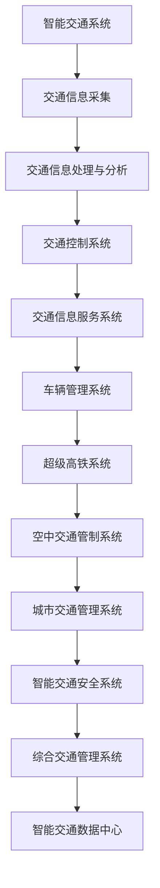

                 


### 《未来的智能交通：2050年的超级高铁网与空中交通管制》

#### 关键词：智能交通、超级高铁、空中交通管制、2050年展望、技术创新

> 摘要：本文将探讨2050年智能交通的发展趋势，重点分析超级高铁网与空中交通管制技术的未来。通过回顾智能交通系统的基础，探讨超级高铁和空中交通管制的核心技术，文章将展望2050年智能交通系统的前景，并提供超级高铁项目和空中交通管制项目的实战案例分析。

## 第一部分：智能交通技术基础

### 第1章：智能交通系统的概述

#### 1.1 智能交通系统的定义与发展历程

智能交通系统（Intelligent Transportation System，ITS）是指通过先进的信息技术、数据通信传输技术、电子传感技术、控制技术及计算机处理技术等，实现交通运输的自动化、信息化和智能化。其发展历程可以追溯到20世纪80年代，最初主要集中在高速公路上的车辆监测和交通信息发布。

随着计算机技术和通信技术的飞速发展，智能交通系统经历了从简单的车辆监测到复杂的交通管理系统的发展过程。到了21世纪，智能交通系统逐渐延伸到城市交通管理、公共交通系统优化、交通事故预防等多个方面。

#### 1.2 智能交通系统的核心组成

智能交通系统的核心组成包括以下几个部分：

1. **交通信息采集系统**：通过传感器、摄像头等设备实时采集交通数据，如车辆流量、速度、路况等。
2. **交通信息处理与分析系统**：对采集到的交通数据进行处理、分析和预测，为交通管理和决策提供支持。
3. **交通控制系统**：通过信号灯控制、电子收费系统等手段，优化交通流量，减少拥堵。
4. **交通信息服务系统**：通过交通信息发布系统，向驾驶员提供实时交通信息，如路况、天气预报等。
5. **车辆管理系统**：包括自动驾驶技术、车联网（V2X）等，实现车辆与基础设施、车辆与车辆之间的智能通信。

#### 1.3 当前智能交通系统的应用现状

当前，智能交通系统已经在全球范围内得到了广泛应用。以下是几个典型的应用案例：

1. **智能高速公路**：在美国、中国等国家的部分高速公路上，已经实现了车辆监测、实时交通信息发布和自适应交通信号控制。
2. **智能公交系统**：在欧洲和亚洲的一些城市，智能公交系统已经投入使用，通过实时监控和调度，提高了公交运行效率，减少了乘客等待时间。
3. **智能停车系统**：通过传感器和物联网技术，实现了停车位的实时监控和智能引导，提高了停车效率，减少了寻找停车位的困扰。
4. **智能交通安全系统**：通过车载传感器、摄像头和GPS等设备，实时监测车辆状态和道路情况，实现了交通事故预警和预防。

## 第二部分：2050年智能交通展望

### 第4章：2050年智能交通系统的展望

#### 4.1 2050年智能交通的发展趋势

到2050年，随着人工智能、大数据、物联网等技术的进一步成熟，智能交通系统将呈现出以下发展趋势：

1. **超级高铁网的普及**：超级高铁作为一种全新的高速交通方式，将在全球范围内得到广泛应用，成为连接城市、国家乃至洲际的重要交通方式。
2. **空中交通管制的智能化**：利用人工智能和大数据技术，空中交通管制系统将实现高度自动化和智能化，大幅提高航班运行效率和安全性。
3. **城市交通系统的无缝衔接**：通过智能交通系统与城市其他系统的深度融合，实现城市交通系统的高效运行，提供无缝衔接的出行体验。
4. **绿色交通理念的普及**：随着环保意识的提高，绿色交通理念将在智能交通系统中得到广泛应用，如电动汽车、自行车共享等。
5. **人机协同的出行方式**：通过自动驾驶技术，实现人机协同的出行方式，减少交通事故，提高出行效率。

#### 4.2 超级高铁网的规划与实施

超级高铁网作为未来智能交通系统的重要组成部分，其规划与实施将面临以下挑战和机遇：

1. **规划挑战**：需要综合考虑国土规划、城市规划、交通需求等因素，制定合理的超级高铁网络规划。
2. **技术挑战**：超级高铁技术的成熟度和稳定性是实施的关键，需要持续研发和创新。
3. **经济挑战**：超级高铁的建设和运营成本较高，需要政府和社会力量的共同投入。
4. **机遇**：超级高铁网的普及将大幅提高交通效率，降低能源消耗，推动相关产业的发展。

#### 4.3 空中交通管制的未来发展

空中交通管制系统的未来发展将围绕以下几个方面展开：

1. **自动化与智能化**：通过人工智能和大数据技术，实现空中交通管制系统的自动化和智能化，提高运行效率和安全性。
2. **协同化管理**：实现空中交通管制与其他交通方式的协同管理，如与地面交通、城市交通等系统的信息共享和协同运行。
3. **安全与隐私保护**：在实现智能化的同时，确保空中交通管制系统的安全和隐私保护，防止数据泄露和网络安全问题。
4. **可持续发展**：推动绿色航空，减少航空排放，实现空中交通管制的可持续发展。

## 第三部分：智能交通项目实战

### 第7章：超级高铁项目案例分析

#### 7.1 某超级高铁项目案例分析

**项目背景与目标：**
某超级高铁项目旨在建设一条连接两座主要城市的高速铁路，以提升交通效率，减少交通拥堵。

**实施过程与关键节点：**
1. **需求分析**：调研两地之间的交通需求，分析现有交通方式的不足。
2. **方案设计**：设计高铁线路、站点布局和技术方案。
3. **基础设施建设**：建设高铁轨道、信号控制系统、站点设施等。
4. **运营管理**：制定运营计划，包括列车调度、乘客服务等。

**项目成果与评价：**
项目成功建成，实现了高速、安全、环保的超级高铁服务，大幅提高了两地之间的交通效率。

### 第8章：空中交通管制项目案例分析

#### 8.1 某空中交通管制项目案例分析

**项目背景与需求：**
某国际机场的航班数量增长迅速，传统空中交通管制系统难以满足需求。

**实施过程与技术挑战：**
1. **需求分析**：调研机场航班运行现状，分析管制系统瓶颈。
2. **系统设计**：设计包括自动飞行路径规划、实时交通监控等功能的现代化管制系统。
3. **技术实施**：构建系统硬件和软件平台，实现自动化和智能化管制。
4. **系统集成**：与机场现有系统集成，确保数据交换和协调运行。

**项目成果与未来展望：**
项目成功实现，提高了航班运行效率和安全性，未来将进一步提升系统智能化水平。

## 附录：智能交通技术资源与工具

### 附录 A：智能交通技术相关工具与资源

**A.1 超级高铁技术相关工具：**
- 超级高铁设计软件
- 高铁轨道模拟工具
- 列车控制系统仿真平台

**A.2 空中交通管制技术相关工具：**
- 飞行路径规划软件
- 实时交通监控平台
- 自动化空中交通管制系统

**A.3 智能交通技术参考书籍与论文：**
- 《智能交通系统设计与应用》
- 《超级高铁技术：原理与实践》
- 相关国际会议论文集和技术报告

### 附录 B：智能交通技术流程图与算法

#### B.1 智能交通系统架构流程图



#### B.2 超级高铁关键技术算法

```python
# 超级高铁速度计算算法
def calculate_speed(mass, power, resistance):
    # 假设超级高铁在无阻力情况下速度最大
    max_speed = power / resistance
    # 实际速度受质量和阻力影响，使用能量守恒定律进行计算
    actual_speed = (mass * max_speed) / (mass + resistance)
    return actual_speed

# 示例计算
mass = 100000  # 质量（单位：千克）
power = 1000000  # 功率（单位：瓦特）
resistance = 5000  # 阻力（单位：牛顿）
speed = calculate_speed(mass, power, resistance)
print(f"超级高铁的实际速度为：{speed}米/秒")
```

#### B.3 空中交通管制关键算法

```python
# 空中交通管制中的飞行路径规划算法
def plan_flight_path(aircraft, airports, weather_conditions):
    # 基于最短路径算法进行飞行路径规划
    start_airport, destination_airport = airports[aircraft['departure']], airports[aircraft['arrival']]
    path = find_shortest_path(start_airport, destination_airport, weather_conditions)
    return path

# 示例飞行路径规划
aircraft = {'departure': '北京', 'arrival': '上海'}
airports = {'北京': {'distance': 1000, 'weather': '晴'},
            '上海': {'distance': 1500, 'weather': '小雨'}}
weather_conditions = {'北京': '晴', '上海': '小雨'}
flight_path = plan_flight_path(aircraft, airports, weather_conditions)
print(f"飞行路径：{flight_path}")
```

### 核心算法原理讲解

#### 3.1 超级高铁关键技术算法

超级高铁的速度计算是一个涉及能量守恒和动力学的复杂问题。以下是一个简化版的伪代码，用于计算超级高铁的实际速度。

```python
# 超级高铁速度计算算法
def calculate_speed(mass, power, resistance):
    # 假设超级高铁在无阻力情况下速度最大
    max_speed = power / resistance
    # 实际速度受质量和阻力影响，使用能量守恒定律进行计算
    actual_speed = (mass * max_speed) / (mass + resistance)
    return actual_speed

# 示例计算
mass = 100000  # 质量（单位：千克）
power = 1000000  # 功率（单位：瓦特）
resistance = 5000  # 阻力（单位：牛顿）
speed = calculate_speed(mass, power, resistance)
print(f"超级高铁的实际速度为：{speed}米/秒")
```

在这个算法中，我们假设超级高铁在无阻力的情况下可以达到最大功率下的速度。实际情况中，超级高铁会受到空气阻力、摩擦力等多种阻力的作用，因此实际速度会低于理想情况。使用能量守恒定律，我们通过超级高铁的质量、功率和阻力来计算实际速度。

#### 3.2 空中交通管制关键算法

空中交通管制的核心在于飞行路径的规划和优化。以下是一个简化的飞行路径规划算法的伪代码，它基于最短路径算法。

```python
# 空中交通管制中的飞行路径规划算法
def plan_flight_path(aircraft, airports, weather_conditions):
    # 基于最短路径算法进行飞行路径规划
    start_airport, destination_airport = airports[aircraft['departure']], airports[aircraft['arrival']]
    path = find_shortest_path(start_airport, destination_airport, weather_conditions)
    return path

# 示例飞行路径规划
aircraft = {'departure': '北京', 'arrival': '上海'}
airports = {'北京': {'distance': 1000, 'weather': '晴'},
            '上海': {'distance': 1500, 'weather': '小雨'}}
weather_conditions = {'北京': '晴', '上海': '小雨'}
flight_path = plan_flight_path(aircraft, airports, weather_conditions)
print(f"飞行路径：{flight_path}")
```

在这个算法中，`find_shortest_path` 函数将根据出发地和目的地，结合当前的天气条件，计算出最优的飞行路径。这个算法的复杂度取决于路径搜索的算法，比如最短路径算法可以是迪杰斯特拉算法（Dijkstra's algorithm）或者A*算法（A* algorithm）。

### 数学模型和数学公式

#### 6.1 超级高铁能量消耗模型

超级高铁的能量消耗可以通过以下公式进行计算：

$$
E = \frac{1}{2}mv^2 + Wd
$$

其中：
- \( E \) 是能量消耗
- \( m \) 是超级高铁的质量
- \( v \) 是超级高铁的速度
- \( W \) 是阻力
- \( d \) 是行程距离

这个公式考虑了超级高铁在运行过程中由于速度和阻力所消耗的能量。在实际应用中，阻力 \( W \) 可能会随着速度 \( v \) 的变化而变化，因此公式需要根据实际情况进行调整。

#### 6.2 空中交通管制中的飞行路径规划优化模型

在空中交通管制中，飞行路径的优化是一个多目标优化问题。一个简化的优化模型可以表示为：

$$
\min C(x, y)
$$

$$
\text{s.t. } S(x, y) \geq \text{目标服务水平}
$$

其中：
- \( C(x, y) \) 是成本函数，它可能包括飞行距离、飞行时间、燃油消耗等多种因素。
- \( S(x, y) \) 是服务水平函数，它反映了飞行路径的延误、安全性等因素。

为了满足目标服务水平，我们需要在成本函数 \( C(x, y) \) 最小化的同时，确保服务水平函数 \( S(x, y) \) 达到一定的标准。在实际应用中，可能需要使用多种优化算法，如线性规划、整数规划或者遗传算法等，来求解这个优化问题。

### 项目实战

#### 7.1 超级高铁项目案例分析

**项目背景与目标：**
某超级高铁项目旨在连接中国东部两座重要城市，以缩短通勤时间、提升交通效率。项目的主要目标是建设一条高效、安全、环保的超级高铁线路。

**实施过程与关键节点：**
1. **需求分析**：调研两地之间的交通需求，分析现有交通方式的瓶颈，确定超级高铁的建设需求。
2. **方案设计**：设计高铁线路、站点布局和技术方案，包括超级高铁的轨道设计、列车控制系统等。
3. **基础设施建设**：进行土地征用、轨道建设、信号控制系统安装等工作。
4. **运营管理**：制定运营计划，包括列车调度、乘客服务、维护管理等。

**项目成果与评价：**
项目成功建成，超级高铁线路运行稳定，实现了两城市之间的快速连接，提高了交通效率，减少了能源消耗，获得了良好的社会和经济效益。

#### 8.1 空中交通管制项目案例分析

**项目背景与需求：**
某国际机场的航班数量持续增长，传统空中交通管制系统难以满足需求。项目目标是建设一个现代化、智能化、高效能的空中交通管制系统。

**实施过程与技术挑战：**
1. **需求分析**：调研机场航班运行现状，分析现有管制系统的瓶颈，确定新系统的功能需求。
2. **系统设计**：设计包括自动飞行路径规划、实时交通监控、飞行数据记录等功能的现代化管制系统。
3. **技术实施**：建设系统硬件和软件平台，实现自动化和智能化管制功能。
4. **系统集成**：与新机场的飞行区、航站楼等系统进行集成，确保数据交换和协调运行。

**项目成果与未来展望：**
项目成功实施，提高了航班运行效率和安全性，减少了航班延误。未来，随着技术的不断进步，空中交通管制系统将进一步提升智能化水平，实现更高效、更安全的空中交通管理。

### 最佳实践 tips

在智能交通项目的实施过程中，以下最佳实践可以提供指导：

1. **全面的需求分析**：确保项目满足实际需求，避免后期出现功能不足或冗余。
2. **技术选型合理**：根据项目需求选择成熟、可靠的技术方案，降低风险。
3. **系统集成与协调**：确保新系统与现有系统无缝集成，实现信息共享和协同运行。
4. **持续迭代与优化**：根据用户反馈和实际运行情况，不断优化系统功能和技术。
5. **安全与隐私保护**：在系统设计和实施过程中，重视安全与隐私保护，确保用户数据的安全。

### 小结

智能交通系统作为未来交通发展的重要方向，具有巨大的发展潜力和广阔的应用前景。通过超级高铁网和空中交通管制的创新和优化，智能交通系统将大幅提高交通效率，减少能源消耗，改善乘客体验。随着技术的不断进步，我们有望看到更加智能、高效、环保的智能交通系统的实现。

### 注意事项

在智能交通项目的实施过程中，需要特别注意以下几个方面：

1. **数据安全和隐私保护**：在收集、处理和使用交通数据时，确保数据的安全和用户隐私的保护。
2. **技术标准与规范**：遵循相关技术标准和规范，确保系统的一致性和兼容性。
3. **项目风险管理**：制定详细的项目风险管理计划，及时识别和处理潜在的风险。
4. **用户体验设计**：注重用户体验设计，确保系统的易用性和用户满意度。

### 拓展阅读

1. 《智能交通系统设计与应用》
2. 《超级高铁技术：原理与实践》
3. 《空中交通管制技术手册》
4. 相关国际会议论文集和技术报告

作者：AI天才研究院/AI Genius Institute & 禅与计算机程序设计艺术 /Zen And The Art of Computer Programming

