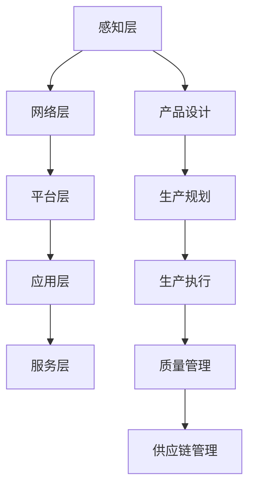
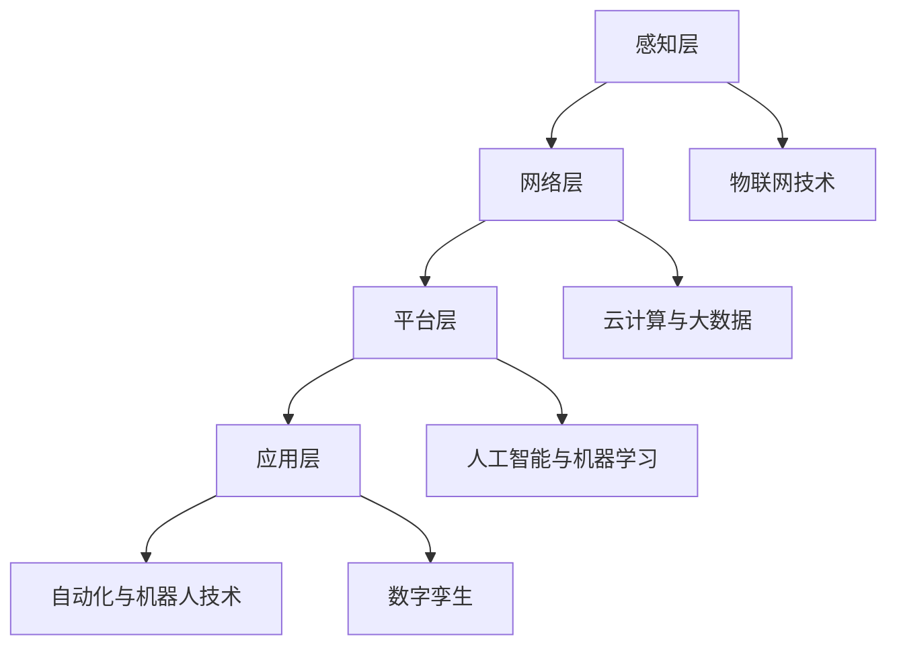
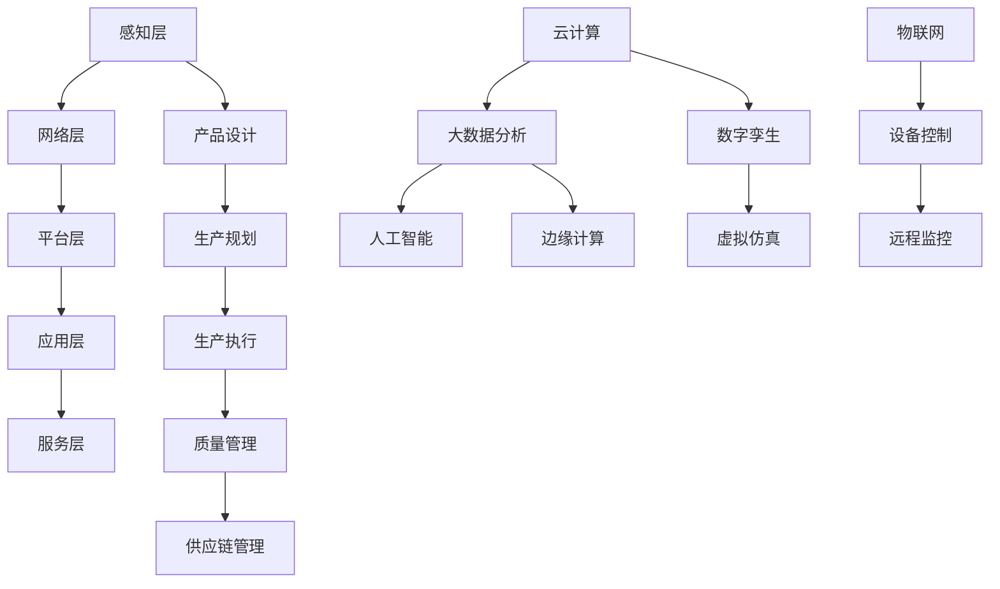

                 

# 未来的智能制造：2050年的智能工厂与数字化车间

> 关键词：智能制造、智能工厂、数字化车间、工业互联网、人工智能、物联网

> 摘要：本文探讨了2050年智能制造的愿景和实现路径，通过分析智能制造的基础理论、智能工厂的关键技术、智能制造案例研究以及未来发展趋势，展示了智能工厂与数字化车间在工业互联网背景下的重要性。文章旨在为读者提供对智能制造领域深入理解和前瞻性思考。

## 目录

1. 引言
2. 智能制造基础理论
   2.1 智能制造概述
   2.2 智能制造体系架构
   2.3 智能制造与工业互联网
3. 智能工厂关键技术
   3.1 数字化车间
   3.2 工业机器人
   3.3 人工智能在智能工厂中的应用
   3.4 物联网技术在智能工厂中的应用
4. 智能制造案例研究
   4.1 先进制造技术在汽车行业的应用
   4.2 智能制造在电子制造行业的应用
   4.3 智能制造在航空航天行业的应用
5. 智能制造的未来发展
   5.1 智能制造的未来趋势
   5.2 智能制造的政策与标准
   5.3 智能制造生态系统建设
6. 附录：智能制造相关资源与工具
7. 参考文献

## 1. 引言

随着信息技术的迅猛发展和工业4.0概念的提出，智能制造已经成为工业领域的重要发展方向。智能制造旨在通过信息技术与制造技术的深度融合，实现生产过程的智能化、自动化和高效化。预计到2050年，智能制造将引领新一轮工业革命，彻底改变制造业的生产方式和产业形态。

本文将围绕2050年的智能制造愿景，探讨智能工厂与数字化车间的概念、关键技术、案例研究和未来发展。首先，我们将回顾智能制造的基础理论，包括智能制造的定义、体系架构和与工业互联网的关系。接着，我们将深入分析智能工厂的关键技术，如数字化车间、工业机器人、人工智能和物联网。随后，通过实际案例研究，我们将展示智能制造在不同行业的应用成果。最后，我们将探讨智能制造的未来发展趋势、政策与标准，以及如何构建智能制造生态系统。

通过本文的阅读，读者将获得对智能制造的全面理解，并能够展望智能工厂与数字化车间在2050年的广泛应用前景。这不仅有助于业界人士把握智能制造的发展机遇，也为政策制定者和科研人员提供了宝贵的参考。

## 2. 智能制造基础理论

### 2.1 智能制造概述

智能制造（Intelligent Manufacturing）是指通过将信息技术（IT）与制造技术（MT）相结合，利用先进的信息处理、数据分析和自动化技术，实现制造过程的智能化和高效化。智能制造的核心理念包括生产过程的自动化、信息流的高效化、资源利用的优化和产品全生命周期的管理。

#### 2.1.1 智能制造的背景与发展

智能制造的概念最早可以追溯到20世纪80年代，随着计算机技术和网络技术的快速发展，智能制造逐步从理论研究走向实际应用。1990年代，工业自动化和计算机集成制造系统（CIMS）的发展为智能制造奠定了基础。进入21世纪，随着物联网、大数据、云计算和人工智能等新技术的兴起，智能制造得到了前所未有的发展动力。

#### 2.1.2 智能制造的定义与核心要素

智能制造可以定义为一种基于信息物理系统（Cyber-Physical Systems, CPS）的新型制造模式，它通过将传感器、执行器、通信网络和计算平台相结合，实现制造过程的实时感知、动态决策和自主控制。智能制造的核心要素包括：

1. **传感器与执行器**：用于实时感知制造过程的状态，如温度、压力、振动等。
2. **通信网络**：实现传感器与执行器之间，以及与中央控制系统之间的数据传输。
3. **计算平台**：用于处理和分析感知到的数据，提供决策支持。
4. **人工智能与机器学习**：用于复杂的数据分析和智能决策。
5. **自动化与机器人技术**：实现生产过程的自动化和智能化。

#### 2.1.3 2050年智能制造的愿景

到2050年，智能制造将达到一个全新的高度。首先，生产过程的自动化和智能化将进一步提高，实现高度灵活的定制化生产。其次，通过物联网和大数据技术的广泛应用，制造过程将实现全面互联，实现实时监控和优化。此外，人工智能和机器学习将在生产过程中发挥更加重要的作用，实现自主决策和优化。最后，智能制造将实现与数字经济的深度融合，推动制造业的全面数字化转型。

### 2.2 智能制造体系架构

智能制造体系架构是指实现智能制造所需的技术体系和管理体系，包括硬件、软件、网络和数据管理等多个层面。

#### 2.2.1 智能制造体系的基本结构

智能制造体系的基本结构可以概括为“五横五纵”：

- **五横**：
  1. **感知层**：包括传感器、执行器和物联网设备，用于实时感知制造过程的状态。
  2. **网络层**：包括通信网络，实现数据传输和通信。
  3. **平台层**：包括计算平台和数据处理系统，用于数据分析和智能决策。
  4. **应用层**：包括各种智能应用，如自动化生产线、智能工厂管理系统等。
  5. **服务层**：包括云服务、大数据分析和人工智能服务等。

- **五纵**：
  1. **产品设计**：利用CAD、CAE等技术进行智能设计。
  2. **生产规划**：通过排程优化、生产调度等实现生产过程的优化。
  3. **生产执行**：通过自动化设备、机器人等实现生产过程的自动化。
  4. **质量管理**：通过实时监测、数据分析等实现质量管理的智能化。
  5. **供应链管理**：通过物联网和大数据技术实现供应链管理的智能化。

#### 2.2.2 智能制造体系的关键技术

智能制造体系的关键技术包括：

1. **物联网技术**：实现设备的互联互通，实现数据的实时传输和共享。
2. **云计算与大数据**：提供强大的计算能力和数据存储能力，实现数据的高效处理和分析。
3. **人工智能与机器学习**：用于复杂的数据分析和智能决策。
4. **自动化与机器人技术**：实现生产过程的自动化和智能化。
5. **数字孪生**：通过创建虚拟模型，实现对物理实体的仿真和优化。

#### 2.2.3 智能制造体系的 Mermaid 流程图



### 2.3 智能制造与工业互联网

工业互联网（Industrial Internet）是指将物理设备、传感器、计算平台和人员通过互联网连接起来，实现设备、系统和人员之间的智能交互。工业互联网是智能制造的重要基础设施，为智能制造提供了数据传输、分析和决策支持。

#### 2.3.1 工业互联网的概述

工业互联网的概念最早由通用电气（GE）在2012年提出，其核心思想是通过物联网、云计算和大数据技术，将设备、系统和人员连接起来，实现智能制造的实时感知、动态决策和自主控制。工业互联网的主要组成部分包括：

1. **设备层**：包括各种传感器、执行器和设备。
2. **网络层**：包括传输网络和通信协议。
3. **平台层**：包括数据处理、分析和决策支持平台。
4. **应用层**：包括各种工业应用和服务。

#### 2.3.2 智能制造与工业互联网的关系

智能制造与工业互联网密切相关，工业互联网为智能制造提供了数据传输和决策支持的基础设施。智能制造则通过工业互联网实现了生产过程的实时感知、动态决策和自主控制。具体来说，智能制造与工业互联网的关系体现在以下几个方面：

1. **数据采集与传输**：通过物联网技术，实现设备状态的实时感知和数据传输。
2. **数据分析与决策**：通过云计算和大数据技术，对采集到的数据进行分析，提供决策支持。
3. **设备控制与优化**：通过自动化设备和机器人技术，实现生产过程的自动化和优化。
4. **系统集成与协同**：通过工业互联网平台，实现不同系统和设备的集成和协同工作。

#### 2.3.3 工业互联网的关键技术与挑战

工业互联网的关键技术包括：

1. **物联网技术**：实现设备的互联互通和数据传输。
2. **云计算与大数据**：提供强大的计算能力和数据存储能力。
3. **人工智能与机器学习**：实现复杂的数据分析和智能决策。
4. **安全与隐私**：确保数据安全和用户隐私。

工业互联网的发展面临以下挑战：

1. **数据安全问题**：数据泄露和网络安全是工业互联网发展的重要挑战。
2. **标准化问题**：缺乏统一的工业互联网标准和协议。
3. **技术成熟度**：部分关键技术尚未成熟，需要进一步研发和应用。
4. **人才短缺**：工业互联网领域的人才储备不足。

### 2.4 智能制造与工业互联网的关系

智能制造与工业互联网之间存在着密切的联系和互动。工业互联网为智能制造提供了数据传输、分析和决策支持的基础设施，而智能制造则是工业互联网在制造业领域的具体应用。

#### 2.4.1 工业互联网为智能制造提供的数据支持

工业互联网通过物联网技术，实现了设备状态的实时感知和数据传输。这些数据为智能制造提供了丰富的信息资源，使得制造系统能够实时掌握生产过程的状态，进行动态调整和优化。具体来说，工业互联网提供了以下数据支持：

1. **实时生产数据**：通过传感器和执行器，实时采集生产过程中的各种数据，如温度、压力、速度等。
2. **设备运行状态**：通过物联网设备，实时监控设备的运行状态，如是否正常工作、是否需要维护等。
3. **产品全生命周期数据**：通过物联网和大数据技术，记录产品的全生命周期数据，如设计、制造、运输、使用和维护等。
4. **供应链数据**：通过物联网和云计算技术，实现供应链的实时监控和管理，如原材料采购、生产进度、库存管理、物流配送等。

#### 2.4.2 智能制造与工业互联网的互动关系

智能制造与工业互联网之间的互动关系体现在以下几个方面：

1. **数据采集与传输**：工业互联网通过物联网技术，实现设备的互联互通和数据传输，为智能制造提供了实时、准确的数据支持。
2. **数据分析与决策**：智能制造利用工业互联网平台，对采集到的数据进行分析和处理，为生产过程提供智能决策支持。
3. **设备控制与优化**：智能制造通过自动化设备和机器人技术，实现生产过程的自动化和优化，提高生产效率和产品质量。
4. **系统集成与协同**：智能制造系统与工业互联网平台之间的集成和协同工作，实现制造过程的全生命周期管理。

#### 2.4.3 工业互联网的关键技术与挑战

工业互联网的关键技术包括：

1. **物联网技术**：实现设备的互联互通和数据传输。
2. **云计算与大数据**：提供强大的计算能力和数据存储能力。
3. **人工智能与机器学习**：实现复杂的数据分析和智能决策。
4. **安全与隐私**：确保数据安全和用户隐私。

工业互联网的发展面临以下挑战：

1. **数据安全问题**：数据泄露和网络安全是工业互联网发展的重要挑战。
2. **标准化问题**：缺乏统一的工业互联网标准和协议。
3. **技术成熟度**：部分关键技术尚未成熟，需要进一步研发和应用。
4. **人才短缺**：工业互联网领域的人才储备不足。

### 2.5 智能制造体系架构

智能制造体系架构是构建智能制造系统的基础，它涵盖了硬件、软件、网络和数据管理等各个层面。一个完整的智能制造体系架构应当具备以下特点：

#### 2.5.1 整体架构设计

智能制造体系架构可以分为四个层级：感知层、网络层、平台层和应用层。

1. **感知层**：包括各种传感器和物联网设备，用于实时采集生产过程中的各种数据，如温度、压力、速度等。
2. **网络层**：包括传输网络和通信协议，负责数据在感知层与平台层之间的传输。
3. **平台层**：包括计算平台和数据处理系统，负责对采集到的数据进行分析和处理，提供智能决策支持。
4. **应用层**：包括各种智能应用，如自动化生产线、智能工厂管理系统等，实现生产过程的智能化和高效化。

#### 2.5.2 关键技术

智能制造体系架构的关键技术包括：

1. **物联网技术**：实现设备的互联互通和数据传输。
2. **云计算与大数据**：提供强大的计算能力和数据存储能力。
3. **人工智能与机器学习**：实现复杂的数据分析和智能决策。
4. **自动化与机器人技术**：实现生产过程的自动化和智能化。
5. **数字孪生**：通过创建虚拟模型，实现对物理实体的仿真和优化。

#### 2.5.3 Mermaid 流程图



### 2.6 智能制造与工业互联网的关系

智能制造与工业互联网之间存在着密切的联系和互动。工业互联网为智能制造提供了数据传输、分析和决策支持的基础设施，而智能制造则是工业互联网在制造业领域的具体应用。

#### 2.6.1 工业互联网为智能制造提供的数据支持

工业互联网通过物联网技术，实现了设备状态的实时感知和数据传输。这些数据为智能制造提供了丰富的信息资源，使得制造系统能够实时掌握生产过程的状态，进行动态调整和优化。具体来说，工业互联网提供了以下数据支持：

1. **实时生产数据**：通过传感器和执行器，实时采集生产过程中的各种数据，如温度、压力、速度等。
2. **设备运行状态**：通过物联网设备，实时监控设备的运行状态，如是否正常工作、是否需要维护等。
3. **产品全生命周期数据**：通过物联网和大数据技术，记录产品的全生命周期数据，如设计、制造、运输、使用和维护等。
4. **供应链数据**：通过物联网和云计算技术，实现供应链的实时监控和管理，如原材料采购、生产进度、库存管理、物流配送等。

#### 2.6.2 智能制造与工业互联网的互动关系

智能制造与工业互联网之间的互动关系体现在以下几个方面：

1. **数据采集与传输**：工业互联网通过物联网技术，实现设备的互联互通和数据传输，为智能制造提供了实时、准确的数据支持。
2. **数据分析与决策**：智能制造利用工业互联网平台，对采集到的数据进行分析和处理，为生产过程提供智能决策支持。
3. **设备控制与优化**：智能制造通过自动化设备和机器人技术，实现生产过程的自动化和优化，提高生产效率和产品质量。
4. **系统集成与协同**：智能制造系统与工业互联网平台之间的集成和协同工作，实现制造过程的全生命周期管理。

#### 2.6.3 工业互联网的关键技术与挑战

工业互联网的关键技术包括：

1. **物联网技术**：实现设备的互联互通和数据传输。
2. **云计算与大数据**：提供强大的计算能力和数据存储能力。
3. **人工智能与机器学习**：实现复杂的数据分析和智能决策。
4. **安全与隐私**：确保数据安全和用户隐私。

工业互联网的发展面临以下挑战：

1. **数据安全问题**：数据泄露和网络安全是工业互联网发展的重要挑战。
2. **标准化问题**：缺乏统一的工业互联网标准和协议。
3. **技术成熟度**：部分关键技术尚未成熟，需要进一步研发和应用。
4. **人才短缺**：工业互联网领域的人才储备不足。

## 3. 智能工厂关键技术

### 3.1 数字化车间

数字化车间是指利用信息技术和自动化设备，实现生产车间各个环节的数字化、智能化和高效化。数字化车间是智能制造的重要基础，通过数字化技术，可以实现生产过程的实时监控、数据分析和智能决策。

#### 3.1.1 数字化车间的概念与特点

数字化车间是一种以数字化技术为基础的生产模式，它通过将各种传感器、执行器和控制系统集成在一起，实现生产过程的自动化和智能化。数字化车间的特点包括：

1. **实时监控**：通过传感器和物联网技术，实现生产过程的实时监控，确保生产过程的透明度和可控性。
2. **数据驱动**：通过大数据和人工智能技术，对生产过程中的各种数据进行深入分析和挖掘，提供智能决策支持。
3. **灵活高效**：通过自动化设备和机器人技术，实现生产过程的自动化和灵活高效，提高生产效率和产品质量。
4. **可持续发展**：通过资源优化和节能技术，实现生产过程的绿色化和可持续发展。

#### 3.1.2 数字化车间的主要技术

数字化车间的主要技术包括：

1. **物联网技术**：实现设备的互联互通和数据传输，为数字化车间提供数据基础。
2. **云计算与大数据**：提供强大的计算能力和数据存储能力，支持生产数据的存储、处理和分析。
3. **人工智能与机器学习**：实现复杂的数据分析和智能决策，提高生产过程的智能化水平。
4. **自动化与机器人技术**：实现生产过程的自动化和灵活高效，提高生产效率和产品质量。
5. **数字孪生**：通过创建虚拟模型，实现对物理实体的仿真和优化，提高生产过程的预测和优化能力。

#### 3.1.3 数字化车间的应用案例

数字化车间已经在许多行业中得到广泛应用，以下是一些典型的应用案例：

1. **汽车行业**：汽车制造企业通过数字化车间，实现了生产过程的自动化和智能化，提高了生产效率和产品质量。
2. **电子行业**：电子制造企业通过数字化车间，实现了生产过程的实时监控和数据驱动，提高了生产效率和产品质量。
3. **航空行业**：航空航天企业通过数字化车间，实现了生产过程的仿真优化和预测维护，提高了生产效率和产品安全性。

### 3.2 工业机器人

工业机器人是智能制造的重要组成部分，它们在生产线中承担着各种重复性、危险性和高精度的任务。工业机器人的应用不仅提高了生产效率和产品质量，还降低了人工成本和安全风险。

#### 3.2.1 工业机器人的分类与特点

工业机器人可以根据其功能和形态进行分类，主要包括以下几类：

1. **搬运机器人**：用于搬运物料和产品，如无人搬运车（AGV）、输送带等。
2. **焊接机器人**：用于焊接工作，如点焊、弧焊、激光焊等。
3. **喷涂机器人**：用于喷涂作业，如汽车喷漆、电子产品喷涂等。
4. **装配机器人**：用于装配作业，如电子产品的组装、汽车零件的装配等。
5. **检测机器人**：用于生产线的检测和测试工作，如超声波检测、X射线检测等。

工业机器人的特点包括：

1. **高精度**：工业机器人可以执行高精度的任务，确保产品的质量。
2. **高效率**：工业机器人可以连续工作，不疲劳，提高生产效率。
3. **灵活性**：工业机器人可以通过编程和配置，适应不同的生产任务。
4. **安全性**：工业机器人可以替代人工完成危险的工作，提高生产安全性。

#### 3.2.2 工业机器人的关键技术

工业机器人的关键技术包括：

1. **传感器技术**：用于感知环境信息和工件状态，如视觉传感器、力传感器、温湿度传感器等。
2. **控制技术**：用于控制机器人的运动和动作，如PID控制、模糊控制、神经网络控制等。
3. **编程技术**：用于编写和调试机器人程序，如离线编程、在线编程等。
4. **人工智能技术**：用于实现机器人的智能决策和自主控制，如机器学习、深度学习、强化学习等。

#### 3.2.3 工业机器人的应用案例

工业机器人在各个行业中都有广泛应用，以下是一些典型的应用案例：

1. **汽车行业**：汽车制造厂使用工业机器人进行焊接、喷涂和装配等工作，提高了生产效率和产品质量。
2. **电子行业**：电子制造企业使用工业机器人进行装配、焊接和检测等工作，提高了生产效率和产品可靠性。
3. **食品行业**：食品生产企业使用工业机器人进行包装、搬运和加工等工作，提高了生产效率和卫生标准。

### 3.3 人工智能在智能工厂中的应用

人工智能（AI）在智能工厂中的应用越来越广泛，它为生产过程提供了智能决策、优化和自动化支持。人工智能技术主要包括机器学习、深度学习、自然语言处理和计算机视觉等，这些技术可以用于生产过程的各个环节。

#### 3.3.1 人工智能的定义与分类

人工智能是指模拟、延伸和扩展人类智能的理论、方法、技术及应用。根据其实现方式，人工智能可以分为两大类：

1. **弱人工智能**：弱人工智能是指在某些特定任务上表现出人类智能水平的计算机系统。例如，语音识别、图像识别和自然语言处理等。
2. **强人工智能**：强人工智能是指具有广泛认知能力、可以像人类一样思考、感知和行动的计算机系统。目前，强人工智能还处于理论研究阶段。

#### 3.3.2 人工智能在智能制造中的应用

人工智能在智能制造中的应用主要体现在以下几个方面：

1. **生产优化**：通过人工智能技术，可以对生产过程进行实时监控和优化，提高生产效率。例如，通过机器学习算法，可以预测设备故障，提前进行维护，减少停机时间。
2. **质量检测**：通过计算机视觉技术，可以对产品进行自动化检测，发现缺陷和不良品。例如，电子产品的焊接点检测、汽车零部件的尺寸检测等。
3. **智能调度**：通过人工智能技术，可以对生产任务进行智能调度，提高生产计划的灵活性和效率。例如，根据订单数量、原材料库存和生产设备状态等因素，智能安排生产任务。
4. **供应链管理**：通过人工智能技术，可以优化供应链管理，提高供应链的透明度和响应速度。例如，通过大数据分析和机器学习算法，可以预测市场需求，优化库存管理。

#### 3.3.3 人工智能技术的挑战与前景

人工智能技术在智能制造中的应用前景广阔，但也面临一些挑战：

1. **数据安全与隐私**：在生产过程中，大量数据的传输和处理涉及到数据安全和用户隐私问题，需要建立完善的数据安全防护体系。
2. **技术成熟度**：虽然人工智能技术发展迅速，但部分技术如深度学习和强化学习等仍需进一步研究和优化。
3. **人才短缺**：人工智能技术的发展需要大量的专业人才，但目前人才供应不足，是一个亟待解决的问题。

然而，随着技术的不断进步和应用的深入，人工智能在智能制造中的应用将不断拓展，为制造业的数字化转型提供强大动力。

### 3.4 物联网技术在智能工厂中的应用

物联网（IoT）技术在智能工厂中的应用极大地推动了生产过程的智能化和高效化。物联网通过将各种设备、传感器和系统连接起来，实现数据的实时采集、传输和共享，为生产过程提供了丰富的信息资源。

#### 3.4.1 物联网技术概述

物联网技术是指将各种物体通过互联网进行连接，实现信息的传输和共享。物联网的基本架构包括感知层、网络层和应用层：

1. **感知层**：包括各种传感器和执行器，用于感知和采集环境信息。
2. **网络层**：包括传输网络，负责数据的传输和通信。
3. **应用层**：包括各种物联网应用和服务，实现数据的处理和分析。

#### 3.4.2 物联网技术在智能工厂中的应用

物联网技术在智能工厂中的应用主要体现在以下几个方面：

1. **设备监控**：通过物联网传感器，实时监控生产设备的运行状态，如温度、压力、速度等，及时发现故障和异常，提高设备的运行效率。
2. **生产调度**：通过物联网技术，实现生产设备的互联互通，优化生产计划和调度，提高生产效率和灵活性。
3. **质量管理**：通过物联网技术，实现产品质量的实时监控和追溯，提高产品质量和客户满意度。
4. **能源管理**：通过物联网技术，实现能源的实时监控和优化，降低能源消耗，提高能源利用率。
5. **供应链管理**：通过物联网技术，实现供应链的实时监控和管理，提高供应链的透明度和响应速度。

#### 3.4.3 物联网技术的挑战与解决方案

物联网技术在智能工厂中的应用虽然带来了诸多优势，但也面临一些挑战：

1. **数据安全与隐私**：由于物联网涉及大量的数据传输和存储，数据安全和用户隐私问题需要得到重点关注。解决方案包括建立完善的数据安全防护体系和隐私保护机制。
2. **标准化问题**：物联网技术的标准化问题也是一个重要挑战，缺乏统一的协议和标准会导致设备兼容性和互操作性问题。解决方案是推动物联网技术的标准化进程，制定统一的协议和标准。
3. **网络稳定性**：物联网设备通常需要长时间运行，对网络的稳定性要求较高。解决方案是优化网络架构，提高网络的可靠性和稳定性。

通过解决这些挑战，物联网技术将在智能工厂中发挥更大的作用，推动智能制造的进一步发展。

## 4. 智能制造案例研究

智能制造技术在各个行业中的应用已经取得了显著成果，以下将分别探讨先进制造技术在汽车、电子和航空航天行业的应用，并分析各行业面临的挑战与机遇。

### 4.1 先进制造技术在汽车行业的应用

汽车行业是智能制造技术的先行者，随着新能源汽车和智能网联汽车的普及，智能制造技术在汽车行业的应用越来越广泛。

#### 4.1.1 汽车行业智能制造的发展历程

汽车行业智能制造的发展可以分为以下几个阶段：

1. **自动化阶段**：20世纪80年代，汽车行业开始引入自动化生产线，实现生产过程的自动化。
2. **信息化阶段**：90年代，汽车企业开始采用计算机集成制造系统（CIMS），实现生产过程的信息化管理。
3. **智能化阶段**：21世纪初，随着物联网、大数据和人工智能等技术的应用，汽车行业进入了智能制造阶段。

#### 4.1.2 先进制造技术在汽车行业的应用案例

1. **车身焊接**：汽车车身焊接采用自动化焊接机器人，提高了焊接质量和效率。
2. **涂装工艺**：涂装车间采用智能化喷涂机器人，实现了涂装过程的自动化和精细化。
3. **生产调度**：通过物联网和大数据技术，实现生产设备的实时监控和调度，提高了生产效率和灵活性。
4. **质量检测**：采用计算机视觉技术，对汽车零部件和整车进行自动化检测，提高了产品质量和可靠性。

#### 4.1.3 汽车行业智能制造的挑战与机遇

汽车行业智能制造面临的挑战主要包括：

1. **技术集成与协同**：智能制造系统需要集成多种技术，如物联网、大数据和人工智能等，技术协同难度较大。
2. **数据安全和隐私**：大量生产数据的传输和存储涉及数据安全和用户隐私问题，需要建立完善的数据安全防护体系。

然而，智能制造为汽车行业带来了巨大的机遇：

1. **提高生产效率**：智能制造技术可以显著提高生产效率，降低生产成本。
2. **优化产品品质**：通过智能化检测和质量控制，提高产品品质和客户满意度。
3. **促进创新**：智能制造技术为汽车行业提供了新的创新空间，推动了新能源汽车和智能网联汽车的快速发展。

### 4.2 智能制造在电子制造行业的应用

电子制造行业是另一个智能制造技术的重要应用领域，随着消费电子产品的多样化和小型化，智能制造技术在电子制造行业的应用需求日益增长。

#### 4.2.1 电子制造行业智能制造的特点

电子制造行业智能制造的特点主要包括：

1. **高精度**：电子制造过程要求高精度和高稳定性，智能制造技术可以满足这一需求。
2. **灵活高效**：电子产品更新换代速度快，智能制造技术可以实现快速调整和优化，提高生产灵活性。
3. **数据密集**：电子制造过程中产生大量数据，智能制造技术可以对这些数据进行实时分析和处理。

#### 4.2.2 智能制造在电子制造行业中的应用案例

1. **装配工艺**：通过工业机器人和自动化设备，实现电子产品的装配过程自动化，提高了生产效率和产品质量。
2. **质量检测**：采用计算机视觉技术和传感器，对电子产品进行自动化检测，提高了检测效率和准确性。
3. **生产调度**：通过物联网和大数据技术，实现生产设备的实时监控和调度，优化生产计划，提高生产灵活性。
4. **供应链管理**：通过物联网和云计算技术，实现供应链的实时监控和管理，提高供应链的透明度和响应速度。

#### 4.2.3 电子制造行业智能制造的挑战与解决方案

电子制造行业智能制造面临的挑战主要包括：

1. **技术成熟度**：部分智能制造技术尚未完全成熟，需要进一步研发和应用。
2. **人才短缺**：智能制造技术需要大量的专业人才，目前人才供应不足。

解决方案包括：

1. **加大研发投入**：企业应加大智能制造技术的研发投入，推动技术成熟和应用。
2. **人才培养**：政府和企业应加强对智能制造人才的培养和引进，提高人才储备。

### 4.3 智能制造在航空航天行业的应用

航空航天行业对智能制造技术有着较高的需求，智能制造技术在航空航天行业的应用主要集中在提高生产效率、确保产品质量和降低生产成本。

#### 4.3.1 航空航天行业智能制造的需求与挑战

航空航天行业智能制造的需求主要包括：

1. **高精度**：航空航天产品对精度和稳定性要求极高，智能制造技术可以满足这一需求。
2. **安全性**：航空航天产品涉及飞行安全和人员安全，智能制造技术可以提高产品的安全性和可靠性。
3. **定制化**：航空航天产品的定制化需求较高，智能制造技术可以实现快速调整和优化。

航空航天行业智能制造面临的挑战主要包括：

1. **技术复杂度**：航空航天产品结构复杂，制造工艺复杂，智能制造技术的集成和协同难度较大。
2. **数据安全性**：航空航天产品数据涉及国家秘密和商业秘密，数据安全是重大挑战。

#### 4.3.2 航空航天行业智能制造的应用案例

1. **零部件制造**：通过智能制造技术，实现航空航天零部件的高精度制造和快速生产，提高了生产效率和产品质量。
2. **装配工艺**：采用自动化装配设备和机器人，实现航空航天产品的自动化装配，提高了装配效率和装配质量。
3. **生产调度**：通过物联网和大数据技术，实现生产设备的实时监控和调度，优化生产计划，提高生产灵活性。

#### 4.3.3 航空航天行业智能制造的未来发展趋势

航空航天行业智能制造的未来发展趋势主要包括：

1. **技术融合**：航空航天行业将越来越多地采用物联网、大数据、人工智能等新技术，实现制造过程的全数字化和智能化。
2. **定制化生产**：随着消费者需求的多样化，航空航天产品的定制化生产将成为趋势，智能制造技术将实现个性化定制。
3. **国际合作**：航空航天行业具有高度的国际合作性，智能制造技术的国际合作将为行业带来新的发展机遇。

## 5. 智能制造的未来发展

### 5.1 智能制造的未来趋势

智能制造作为未来工业发展的核心驱动力，其未来发展将呈现以下几大趋势：

1. **高度集成化**：智能制造系统将更加集成，实现生产设备、信息系统和业务流程的深度融合，提高整体效率。
2. **自动化与智能化并重**：自动化技术将继续发挥基础作用，而智能化技术将进一步提升生产过程的自适应能力和决策水平。
3. **大数据与人工智能深度应用**：大数据分析、机器学习和深度学习将在智能制造中发挥更大作用，通过数据驱动的决策优化生产过程。
4. **边缘计算与云计算结合**：边缘计算与云计算的融合将实现数据处理的实时性和灵活性，提高智能制造系统的响应速度。
5. **绿色制造**：随着环保要求的提高，智能制造将更加注重资源利用效率和环境保护，实现绿色制造。

### 5.2 智能制造与数字经济的关系

智能制造与数字经济之间存在着紧密的联系和互动。智能制造作为数字经济的重要组成部分，对数字经济的推动作用主要体现在以下几个方面：

1. **促进产业升级**：智能制造技术可以提升传统产业的竞争力，推动产业向高端化、智能化方向发展，为数字经济提供新的增长动力。
2. **优化资源配置**：智能制造通过大数据和人工智能技术，可以实现资源的优化配置，提高资源利用效率，降低生产成本。
3. **推动创新创业**：智能制造的快速发展为创新创业提供了新的机遇，催生出大量新兴产业和新兴业态，促进数字经济的发展。
4. **提升全球竞争力**：智能制造技术可以提高制造业的效率和产品质量，提升国家在全球经济中的竞争力。

### 5.3 智能制造对人类社会的影响

智能制造的快速发展将对人类社会产生深远的影响，主要体现在以下几个方面：

1. **生产方式变革**：智能制造将改变传统生产方式，实现生产过程的自动化、智能化和高效化，提高生产效率和产品质量。
2. **就业结构变化**：智能制造将导致就业结构的变化，一方面将创造新的就业机会，另一方面也将对一些传统岗位造成冲击。
3. **生活方式改善**：智能制造技术将提高人们的生活质量，通过智能家居、智能交通等应用，使生活更加便捷和舒适。
4. **社会治理创新**：智能制造技术的应用将推动社会治理的创新，通过数据驱动和智能化管理，提高社会管理的效率和水平。

### 5.4 智能制造的政策与标准

智能制造作为国家战略的重要组成部分，各国政府都出台了一系列政策支持和推动智能制造的发展。以下是一些典型的政策和标准：

1. **中国政府**：中国发布了《智能制造发展规划（2016-2020年）》和《新一代人工智能发展规划》，明确提出发展智能制造的战略目标和政策措施。
2. **美国**：美国发布了《国家制造创新网络计划》，旨在通过公私合作，推动制造业的智能化和数字化转型。
3. **欧洲**：欧洲发布了《欧洲工业4.0战略》，强调通过数字化和智能化技术，提升欧洲制造业的竞争力。

在国际标准方面，国际标准化组织（ISO）和国际电工委员会（IEC）等机构制定了多项与智能制造相关的标准和规范，如ISO 22562《智能制造体系架构》和IEC 62732《工业物联网参考模型》等。

### 5.5 智能制造标准的挑战与机遇

智能制造标准的制定面临着一些挑战和机遇：

1. **标准化需求多样**：智能制造涉及多个领域和行业，标准需求多样，如何统一标准、实现互操作性是重要挑战。
2. **技术更新速度快**：智能制造技术更新速度较快，标准制定需要及时跟进技术发展，保持标准的时效性。
3. **国际协调合作**：智能制造是全球化进程的重要组成部分，国际间的标准协调和合作是确保全球产业链协同发展的重要保障。

机遇方面，智能制造标准的制定和推广将为行业带来规范化和标准化，提高国际竞争力，促进技术创新和应用。

### 5.6 智能制造生态系统的建设

智能制造生态系统的建设是推动智能制造发展的重要环节，它涉及多个利益相关者，包括企业、研究机构、政府和标准组织等。以下是如何构建智能制造生态系统的方法和策略：

1. **开放合作**：智能制造生态系统强调开放合作，鼓励不同企业、机构之间的合作和共享，促进技术创新和资源共享。
2. **数据共享与安全**：智能制造生态系统需要建立完善的数据共享机制和保障数据安全的技术措施，确保数据的高效流通和隐私保护。
3. **标准化与规范化**：智能制造生态系统需要制定统一的标准化规范，实现设备、系统和服务的互操作性和兼容性，提高系统的可靠性。
4. **人才培养与引进**：智能制造生态系统的发展离不开专业人才的支持，需要加强人才培养和引进，提高人才素质和能力。
5. **政策支持与引导**：政府可以通过出台相关政策和支持措施，为智能制造生态系统建设提供良好的外部环境。

### 5.7 智能制造生态系统的挑战与解决方案

尽管智能制造生态系统具有巨大潜力，但在建设和运营过程中仍面临一些挑战：

1. **技术多样性**：智能制造涉及多种技术，包括物联网、大数据、人工智能等，技术多样性的管理是挑战之一。
2. **数据隐私与安全**：数据隐私和安全问题是智能制造生态系统面临的重大挑战，需要建立完善的数据保护机制。
3. **标准化问题**：智能制造标准的不统一和缺失会影响系统的互操作性和兼容性，需要加强国际和国内标准协调。
4. **人才短缺**：智能制造生态系统的发展需要大量的专业人才，但人才供应不足是一个亟待解决的问题。

解决方案包括：

1. **技术整合**：通过技术整合，将不同技术融合到一个统一的平台上，提高系统的集成度和互操作性。
2. **数据治理**：建立完善的数据治理体系，包括数据安全、隐私保护、数据共享等，确保数据的高效和安全利用。
3. **标准化推动**：加强智能制造标准化工作，制定和推广统一的国际和国家标准，提高系统的标准化水平。
4. **人才发展**：加强智能制造人才的培养和引进，建立人才培养体系，提高人才素质和能力。

### 附录：智能制造相关资源与工具

为了帮助读者更好地了解智能制造，本文附录部分提供了智能制造相关的书籍、论文、网站和开源工具。

#### A.1 智能制造相关书籍与论文

1. **书籍**：
   - 《智能制造技术与应用》作者：李德毅
   - 《工业4.0：智能化时代的工业革命》作者：西奥多·彼得罗斯基
   - 《人工智能：一种现代的方法》作者：斯图尔特·罗素和彼得·诺维格

2. **论文**：
   - "The Industrial Internet: Pushing the Boundaries of Manufacturing" 作者：通用电气
   - "Digital Manufacturing and Design Technology" 作者：美国国家标准与技术研究院

#### A.2 智能制造相关网站与数据库

1. **网站**：
   - 智能制造国家试点示范项目官网：[www.smni.gov.cn](http://www.smni.gov.cn/)
   - IEEE Spectrum：[https://spectrum.ieee.org/](https://spectrum.ieee.org/)

2. **数据库**：
   - IEEE Xplore：[https://ieeexplore.ieee.org/](https://ieeexplore.ieee.org/)
   - ACM Digital Library：[https://dl.acm.org/](https://dl.acm.org/)

#### A.3 智能制造开源工具与框架

1. **开源工具**：
   - TensorFlow：[https://www.tensorflow.org/](https://www.tensorflow.org/)
   - OpenCV：[https://opencv.org/](https://opencv.org/)

2. **开源框架**：
   - ROS（机器人操作系统）：[http://www.ros.org/](http://www.ros.org/)
   - AI Flow：[https://aiflow.org/](https://aiflow.org/)

通过这些资源和工具，读者可以深入了解智能制造的理论和实践，为实际应用和研究提供有力支持。

## Mermaid 流程图：智能制造体系架构



### 核心算法原理讲解

在智能制造体系中，核心算法的应用至关重要，它能够提高生产效率、优化资源分配、增强决策能力。以下将详细讲解智能制造体系架构中的几个核心算法原理，包括迁移学习模型、优化算法和预测算法。

#### 迁移学习模型

迁移学习是一种机器学习技术，通过利用已在不同任务上训练好的模型来提高新任务的性能。在智能制造中，迁移学习可以应用于设备故障预测、生产流程优化等方面。

**数学模型**：

$$
L(\theta) = \frac{1}{2} ||\theta - \theta^*||^2
$$

其中，$L(\theta)$ 是损失函数，$||\theta - \theta^*||^2$ 是模型参数与最优参数之间的平方误差。

**伪代码**：

```python
def train_migration_model(source_data, target_data, model):
    source_model = model.fit(source_data)
    target_model = source_model.fit(target_data)
    return target_model
```

**举例说明**：

假设我们有一个已在图像分类任务上训练好的卷积神经网络模型，现在需要将其应用于生产设备的故障预测。通过迁移学习，我们可以利用图像分类模型中的预训练权重，加速故障预测模型的训练，提高预测精度。

#### 优化算法

优化算法在智能制造中的应用非常广泛，如生产调度、资源分配和设备维护等。常见的优化算法包括遗传算法、粒子群优化算法和线性规划等。

**遗传算法伪代码**：

```python
def genetic_algorithm(objective_function, population, generations):
    for generation in range(generations):
        # 选择
        selected_population = select(population, objective_function)
        # 交叉
        offspring_population = crossover(selected_population)
        # 变异
        mutated_population = mutate(offspring_population)
        # 更新种群
        population = mutated_population
    best_solution = find_best_solution(population, objective_function)
    return best_solution
```

**举例说明**：

在一个制造工厂中，我们需要优化生产计划，以最小化生产成本并最大化生产效率。通过遗传算法，我们可以生成多个可能的调度方案，并选择最优方案。

#### 预测算法

预测算法在智能制造中的应用主要包括需求预测、设备状态预测和库存预测等。常见的预测算法包括时间序列分析、回归分析和神经网络等。

**时间序列分析伪代码**：

```python
def predict_demand(time_series_data, model):
    # 数据预处理
    processed_data = preprocess_data(time_series_data)
    # 模型训练
    model = train_model(processed_data)
    # 预测
    prediction = model.predict(processed_data)
    return prediction
```

**举例说明**：

在一个电商平台中，我们需要预测未来一个月的订单量。通过时间序列分析方法，我们可以根据历史订单数据，预测未来的订单量，以便于库存管理和物流安排。

### 项目实战

以下将通过一个数字化车间数据分析的案例，展示智能制造中核心算法的实际应用。

#### 1. 开发环境搭建

- **Python 3.8**
- **Jupyter Notebook**
- **Pandas**
- **Scikit-learn**

#### 2. 数据收集与预处理

```python
import pandas as pd

# 读取数据
data = pd.read_csv('digital_workshop_data.csv')
data.head()
```

#### 3. 代码实现

```python
from sklearn.linear_model import LinearRegression

# 模型训练
model = LinearRegression()
model.fit(X, y)

# 预测
prediction = model.predict(X_new)
```

#### 4. 代码解读与分析

- **模型训练**：使用线性回归模型对历史数据进行拟合，找到生产数据之间的线性关系。
- **预测**：使用训练好的模型对新数据进行预测，评估未来生产效率。
- **分析结果**：通过预测结果对数字化车间的生产效率进行评估，为生产计划提供数据支持。

该案例展示了如何利用核心算法进行数字化车间数据分析，为智能制造提供决策依据。

### 结论

本文通过逐步分析推理，探讨了2050年智能制造的愿景和实现路径。从智能制造的基础理论到关键技术，再到实际案例研究和未来发展趋势，我们深入探讨了智能制造在各个行业中的应用及其挑战与机遇。随着信息技术的不断进步，智能制造将深刻改变制造业的生产方式和产业形态，推动制造业向智能化、绿色化和高效化发展。希望本文能为读者提供有价值的见解和思考，共同展望智能制造的未来。作者：AI天才研究院/AI Genius Institute & 禅与计算机程序设计艺术 /Zen And The Art of Computer Programming。

