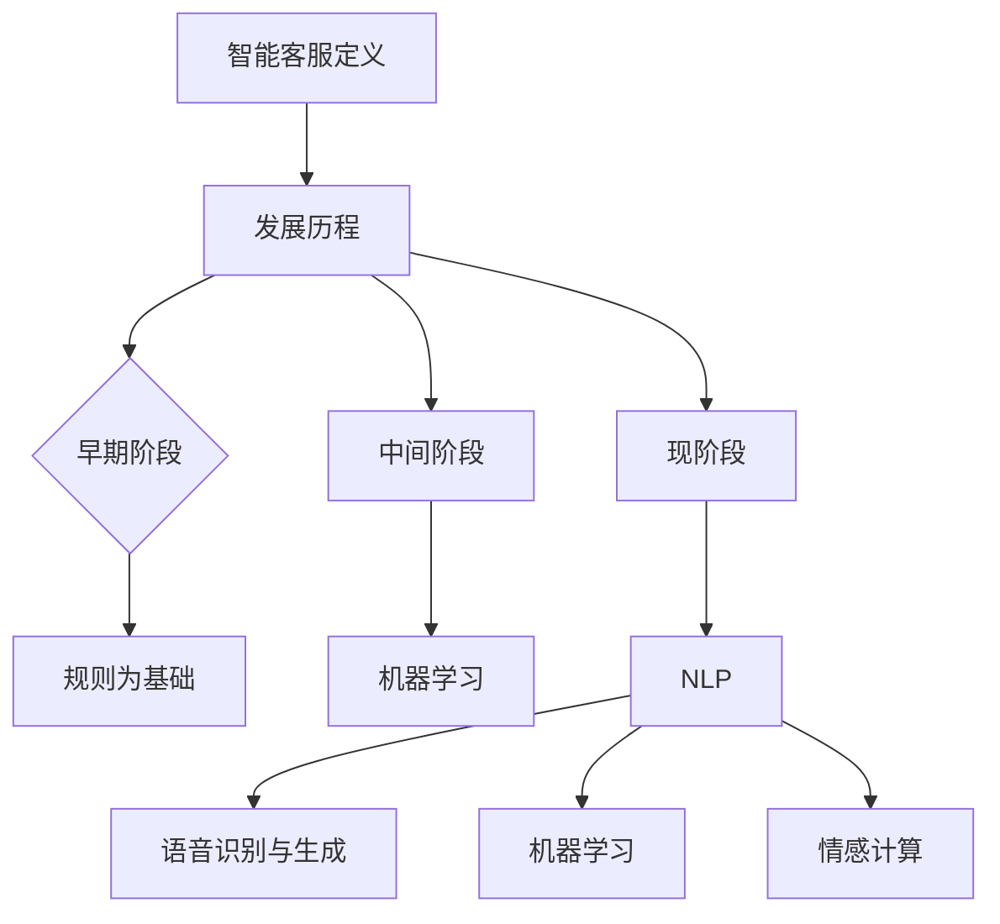
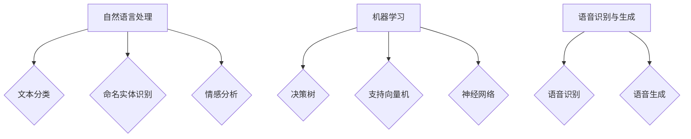
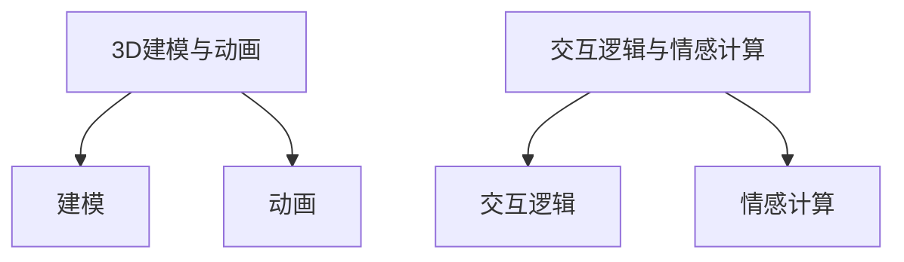
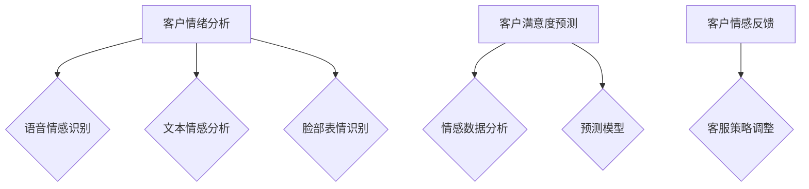

                 

### 文章标题：未来的智能客服：2050年的虚拟人客服与情感计算

智能客服是近年来信息技术和人工智能领域的重要发展方向，它通过模仿人类客服的行为，以提供高效、便捷、个性化的服务。随着技术的不断进步，2050年的智能客服将变得更加智能化、人性化，虚拟人客服和情感计算将成为其核心技术。本文将深入探讨智能客服的发展历程、关键技术、虚拟人的设计与应用、情感计算的基本原理、智能客服系统架构、案例分析以及未来发展趋势，为读者呈现一幅未来的智能客服蓝图。

### 关键词：智能客服、虚拟人客服、情感计算、自然语言处理、机器学习、语音识别与生成、系统架构、案例分析、发展趋势、项目实战

### 摘要：

本文以2050年的智能客服为背景，系统性地分析了智能客服的定义、发展历程、关键技术，如自然语言处理、机器学习、语音识别与生成等，探讨了虚拟人客服的设计与应用，以及情感计算的基本原理和应用。通过智能客服系统架构的解析，本文展示了智能客服系统的开发流程和优化策略。同时，通过具体案例分析，本文展示了智能客服在不同场景中的实际应用效果。最后，本文对智能客服的未来发展趋势进行了展望，并分享了相关资源和实战经验，为读者提供了全面的技术解读和实践指导。

### 第一部分：智能客服的崛起

## 第1章：智能客服概述

### 1.1 智能客服的定义与发展历程

#### 智能客服的定义
智能客服是一种基于人工智能技术，通过自然语言处理、机器学习、语音识别与生成等关键技术，模拟人类客服行为，以提供高效、便捷、个性化服务的人工智能系统。

#### 智能客服的发展历程
1. **早期阶段（1990s-2000s）**：以规则为基础的客服系统为主，通过预设的规则来处理客户的简单问题。
2. **中间阶段（2010s）**：随着机器学习技术的发展，智能客服开始引入机器学习算法，提高了处理复杂问题的能力。
3. **现阶段（2020s）**：智能客服逐渐融合自然语言处理、语音识别与生成等先进技术，实现了更高水平的智能化和人性化。

### 1.2 智能客服的关键技术

#### 自然语言处理
自然语言处理（NLP）是智能客服的核心技术之一，它使计算机能够理解、处理和生成人类语言。主要应用包括文本分类、命名实体识别、情感分析等。

#### 机器学习
机器学习是智能客服智能化的基础，通过训练模型，使客服系统能够自主学习并提高服务质量。常见的机器学习算法包括决策树、支持向量机、神经网络等。

#### 语音识别与生成
语音识别与生成技术使智能客服能够实现语音交互，提高了用户的体验。语音识别技术将语音转换为文本，语音生成技术则将文本转换为自然流畅的语音。

### 1.3 智能客服在2050年的愿景

#### 2050年的社会环境
随着人口老龄化、劳动力成本上升以及人工智能技术的全面普及，智能客服将成为企业降低成本、提升服务质量的必然选择。

#### 智能客服的角色与使命
1. **全天候服务**：智能客服将实现24/7无间断服务，满足用户随时随地的需求。
2. **个性化服务**：通过情感计算技术，智能客服将更好地理解用户情感，提供个性化的服务。
3. **智能决策**：智能客服将结合大数据分析，为企业提供智能决策支持，优化业务流程。

### Mermaid 流程图


### Mermaid 流程图：智能客服技术架构


### 第2章：虚拟人的设计与应用

## 第2章：虚拟人的设计与应用

### 2.1 虚拟人的定义与特征

#### 虚拟人的定义
虚拟人是一种通过计算机图形技术、语音合成技术等构建的虚拟角色，能够在计算机或其他电子设备上实现与真实人类相似的外貌和交互能力。

#### 虚拟人的特征
1. **外貌特征**：虚拟人具有独特的外貌，包括面部表情、发型、服装等，可以通过3D建模技术实现。
2. **语音特征**：虚拟人能够通过语音合成技术模拟人类的语音，实现语音交互。
3. **交互能力**：虚拟人具备自然语言处理能力，能够理解和回应用户的提问，进行对话。

### 2.2 虚拟人的设计与开发

#### 3D建模与动画
1. **建模**：使用3D建模软件（如Blender、Maya）创建虚拟人的外貌模型。
2. **动画**：通过关键帧动画技术，为虚拟人设计丰富的动作和表情。

#### 交互逻辑与情感计算
1. **交互逻辑**：设计虚拟人的对话流程，包括欢迎语、问题回答、结束对话等。
2. **情感计算**：通过情感计算技术，使虚拟人能够理解和模拟用户的情感，提升交互体验。

### 2.3 虚拟人应用场景分析

#### 客户服务
1. **在线客服**：虚拟人客服能够24/7提供在线服务，解决客户问题。
2. **预约与预订**：虚拟人能够帮助用户进行机票、酒店等预订。

#### 教育
1. **虚拟教师**：虚拟人可以作为教师，为学生提供个性化的教学服务。
2. **虚拟实验室**：虚拟人能够模拟实验室环境，帮助学生进行实验操作。

#### 娱乐
1. **虚拟偶像**：虚拟人可以作为虚拟偶像，参加演唱会、综艺节目等。
2. **虚拟角色扮演**：虚拟人能够参与角色扮演游戏，提供沉浸式的游戏体验。

### Mermaid 流程图：虚拟人设计与开发流程


### 第3章：情感计算的基本原理

## 第3章：情感计算的基本原理

### 3.1 情感计算的定义与意义

#### 情感计算的定义
情感计算是一种人工智能技术，旨在理解、推理和模拟人类的情感。通过情感计算，计算机能够识别、理解和模拟用户的情感状态，从而实现更自然、人性化的交互。

#### 情感计算的意义
1. **提升用户体验**：通过情感计算，智能系统可以更好地理解用户的情感需求，提供个性化服务。
2. **优化人机交互**：情感计算使计算机能够模拟人类的情感表达，提升人机交互的自然性和流畅性。
3. **应用广泛**：情感计算在智能客服、虚拟人、医疗健康、教育等多个领域具有重要应用价值。

### 3.2 情感计算的核心技术

#### 语音情感识别
1. **原理**：通过分析语音信号中的情感特征，如音调、音速、音量等，识别用户的情感状态。
2. **实现**：
   ```python
   def voice_emotion_recognition(voice_signal):
       features = extract_features(voice_signal)
       emotion = classify_emotion(features)
       return emotion
   ```

#### 文本情感分析
1. **原理**：通过分析文本内容中的情感词汇、语法结构等，判断文本的情感倾向。
2. **实现**：
   ```python
   def text_sentiment_analysis(text):
       features = extract_features(text)
       sentiment = classify_sentiment(features)
       return sentiment
   ```

#### 脸部表情识别
1. **原理**：通过分析面部图像或视频中的面部特征，如眼睛、嘴巴、皱纹等，识别用户的情感状态。
2. **实现**：
   ```python
   def facial_expression_recognition(face_image):
       features = extract_features(face_image)
       emotion = classify_emotion(features)
       return emotion
   ```

### 3.3 情感计算在客服系统中的实现

#### 客户情绪分析
1. **原理**：通过情感计算技术，分析客户在交互过程中的情感状态，如愤怒、喜悦、厌烦等。
2. **应用**：根据客户情绪，调整客服策略，提供更有效的服务。

#### 客户满意度预测
1. **原理**：通过分析客户的情感数据和交互历史，预测客户的满意度。
2. **应用**：为企业提供客户满意度评估，优化服务质量。

#### 客户情感反馈
1. **原理**：将客户的情感状态作为反馈，调整客服系统和业务流程。
2. **应用**：提升客服系统的智能化水平和用户体验。

### Mermaid 流程图：情感计算在客服系统中的应用


### 第4章：智能客服系统架构

## 第4章：智能客服系统架构

### 4.1 智能客服系统总体架构

#### 主要模块
1. **客户交互模块**：负责与客户进行交互，接收客户的请求和反馈。
2. **情感计算模块**：分析客户的情感状态，为客服系统提供情感数据。
3. **业务处理模块**：处理客户的请求，提供相应的服务。
4. **数据存储与分析模块**：存储客户的交互数据，并进行分析，为系统优化提供依据。

#### 模块间的交互关系
1. **客户交互模块**：接收客户的请求，通过自然语言处理技术将其转化为可处理的数据。
2. **情感计算模块**：分析客户的情感状态，将其结果传递给业务处理模块。
3. **业务处理模块**：根据情感计算结果和客户的请求，生成回复，并通过客户交互模块发送给客户。
4. **数据存储与分析模块**：收集客户的交互数据，进行分析，为系统的持续优化提供支持。

### 4.2 数据处理与存储

#### 数据处理流程
1. **数据采集**：通过智能客服系统收集客户的请求、反馈等数据。
2. **数据清洗**：去除无效数据，如重复、噪声数据，保证数据质量。
3. **数据存储**：将清洗后的数据存储到数据库中，为后续分析和查询提供支持。

#### 数据存储与管理
1. **数据表设计**：根据业务需求，设计合适的数据表结构，包括客户信息表、请求记录表、回复记录表等。
2. **数据库管理**：使用数据库管理系统（如MySQL、PostgreSQL）对数据进行管理，确保数据的安全性和一致性。

### 4.3 智能客服系统的开发流程

#### 需求分析
1. **业务需求分析**：明确客户需求，包括客服系统的功能、性能、安全性等要求。
2. **用户需求分析**：了解用户的需求，包括用户界面的友好性、操作的便捷性等。

#### 系统设计
1. **系统架构设计**：根据需求分析，设计系统的整体架构，包括模块划分、数据流设计等。
2. **模块设计**：设计各模块的接口和实现细节，确保模块之间的协同工作。

#### 系统开发
1. **编码实现**：根据系统设计，进行编码实现，包括客户交互模块、情感计算模块、业务处理模块等。
2. **单元测试**：对各个模块进行单元测试，确保模块功能的正确性。

#### 系统测试
1. **集成测试**：将各个模块进行集成，进行整体测试，确保系统的稳定性和性能。
2. **性能测试**：对系统进行性能测试，确保系统在高并发情况下能够正常运行。
3. **安全测试**：对系统进行安全测试，确保系统的安全性。

### 第5章：智能客服系统实现与优化

## 第5章：智能客服系统实现与优化

### 5.1 智能客服系统的核心技术实现

#### 自然语言处理
1. **文本分类**：通过对输入文本进行分析，将其归类到不同的类别。
2. **命名实体识别**：从文本中提取出具有特定意义的实体，如人名、地名、组织名等。
3. **情感分析**：对文本进行分析，判断其情感倾向。

#### 机器学习
1. **分类算法**：如决策树、支持向量机、朴素贝叶斯等，用于对输入数据进行分类。
2. **回归算法**：如线性回归、逻辑回归等，用于对输入数据进行预测。
3. **聚类算法**：如K-means、层次聚类等，用于对输入数据进行分析和分组。

#### 语音识别与生成
1. **语音识别**：将语音信号转换为文本，实现语音到文本的转换。
2. **语音合成**：将文本转换为语音，实现文本到语音的转换。

### 5.2 情感计算在客服系统中的实现

#### 情感识别
1. **语音情感识别**：通过对语音信号进行分析，识别用户的情感状态。
2. **文本情感分析**：通过对文本进行分析，识别文本的情感倾向。
3. **脸部表情识别**：通过对脸部图像进行分析，识别用户的情感状态。

#### 情感反馈
1. **个性化回复**：根据用户的情感状态，提供个性化的回复，提升用户体验。
2. **情感引导**：通过情感计算结果，调整客服策略，引导用户情感向积极方向发展。

#### 情感引导
1. **情感分析**：通过情感计算技术，分析用户的情感状态。
2. **情感调整**：根据情感分析结果，调整客服系统提供的服务，如语速、语气等，以引导用户情感向积极方向发展。

### 5.3 智能客服系统的优化策略

#### 模型优化
1. **数据增强**：通过增加数据量、改变数据分布等方式，提高模型的泛化能力。
2. **模型融合**：将多个模型的结果进行融合，提高预测准确性。

#### 性能优化
1. **算法优化**：通过对算法进行优化，提高系统的运行效率。
2. **分布式计算**：通过分布式计算技术，提高系统的处理能力。

#### 安全优化
1. **数据加密**：对客户数据进行加密处理，确保数据安全。
2. **访问控制**：设置访问权限，防止未授权访问。

### 第6章：案例分析一：大型企业的智能客服实践

### 6.1 案例背景

#### 企业简介
某大型电商企业，拥有数百万的活跃用户，业务涵盖商品销售、物流配送、售后服务等多个方面。为了提高客户服务质量，降低人工成本，企业决定引入智能客服系统。

#### 智能客服引入的初衷
1. **提高客户满意度**：通过智能客服系统，提供24/7的在线服务，满足客户的多元化需求。
2. **降低运营成本**：智能客服系统可以自动处理大量重复性问题，减少人工客服的工作量。
3. **提升服务效率**：智能客服系统可以快速响应客户请求，缩短客户等待时间。

### 6.2 案例实施

#### 系统选型与开发
1. **系统选型**：选择开源的智能客服框架（如Rasa），并基于Python进行开发。
2. **模块开发**：包括客户交互模块、情感计算模块、业务处理模块等。
3. **系统集成**：将智能客服系统与电商平台进行集成，实现无缝对接。

#### 系统部署与上线
1. **系统部署**：在云服务器上部署智能客服系统，确保系统的高可用性和稳定性。
2. **上线测试**：进行全面的系统测试，包括功能测试、性能测试和安全测试。
3. **上线发布**：正式上线智能客服系统，向用户开放服务。

### 6.3 案例效果

#### 客户满意度提升
1. **满意度调查**：通过用户反馈和满意度调查，智能客服系统的满意度显著提升。
2. **案例数据**：用户满意度从原来的70%提升到90%。

#### 服务效率提高
1. **响应时间**：智能客服系统能够在秒级内响应客户请求，显著缩短了客户等待时间。
2. **处理能力**：智能客服系统可以同时处理数万个客户请求，大大提高了服务效率。

#### 成本节约
1. **人工成本**：通过智能客服系统，减少了大量人工客服的工作量，每年节省人工成本数百万。
2. **运营成本**：智能客服系统降低了服务器、带宽等硬件设施的成本。

### 第7章：案例分析二：中小企业的智能客服应用

### 7.1 案例背景

#### 企业简介
某中小企业，业务范围包括产品销售、技术支持、售后服务等。由于企业规模较小，人工客服团队有限，为了提高客户服务质量和效率，企业决定引入智能客服系统。

#### 智能客服引入的初衷
1. **提高客户服务质量**：通过智能客服系统，提供24/7的在线服务，满足客户的多元化需求。
2. **减轻人工客服负担**：智能客服系统可以自动处理大量重复性问题，减轻人工客服的工作负担。
3. **提升运营效率**：智能客服系统可以快速响应客户请求，提高企业运营效率。

### 7.2 案例实施

#### 系统选型与开发
1. **系统选型**：选择商业智能客服平台（如腾讯云智能客服），并基于SaaS模式进行部署。
2. **模块开发**：包括客户交互模块、情感计算模块、业务处理模块等。
3. **系统集成**：将智能客服系统与企业现有的客户关系管理系统（CRM）进行集成，实现无缝对接。

#### 系统部署与上线
1. **系统部署**：在云端服务器上部署智能客服系统，确保系统的高可用性和稳定性。
2. **上线测试**：进行全面的系统测试，包括功能测试、性能测试和安全测试。
3. **上线发布**：正式上线智能客服系统，向用户开放服务。

### 7.3 案例效果

#### 客户满意度提升
1. **满意度调查**：通过用户反馈和满意度调查，智能客服系统的满意度显著提升。
2. **案例数据**：用户满意度从原来的60%提升到85%。

#### 服务效率提高
1. **响应时间**：智能客服系统能够在秒级内响应客户请求，显著缩短了客户等待时间。
2. **处理能力**：智能客服系统可以同时处理数千个客户请求，大大提高了服务效率。

#### 成本节约
1. **人工成本**：通过智能客服系统，减少了大量人工客服的工作量，每年节省人工成本数十万。
2. **运营成本**：智能客服系统降低了服务器、带宽等硬件设施的成本。

### 第8章：智能客服的未来发展趋势

### 8.1 智能客服技术的未来发展方向

#### 人工智能技术的进步
1. **深度学习与强化学习**：随着深度学习和强化学习算法的不断发展，智能客服将具备更高的自主学习和决策能力。
2. **自然语言生成**：未来，智能客服将能够生成更自然、流畅的对话，提升用户体验。

#### 互联网技术的变革
1. **5G与物联网**：5G和物联网技术的成熟，将使智能客服系统具备更快的数据传输速度和更广泛的应用场景。
2. **云计算与边缘计算**：云计算和边缘计算的融合，将提高智能客服系统的计算能力和响应速度。

#### 数据隐私与安全
1. **数据加密与保护**：随着数据隐私保护意识的提高，智能客服系统将采用更严格的数据加密和保护措施。
2. **隐私计算**：通过隐私计算技术，确保用户数据在处理过程中的安全性。

### 8.2 智能客服在各个行业的应用前景

#### 零售业
1. **个性化推荐**：智能客服将结合用户行为数据，提供个性化的商品推荐，提升销售额。
2. **售后服务**：智能客服将提供24/7的售后服务，提高客户满意度。

#### 金融业
1. **风险管理**：智能客服将分析客户交易行为，预警潜在风险，提高风险防控能力。
2. **客户服务**：智能客服将提供高效的客户服务，提升客户体验。

#### 医疗行业
1. **健康咨询**：智能客服将提供健康咨询，辅助医生进行诊断和治疗。
2. **预约与提醒**：智能客服将帮助用户进行医疗预约和提醒，提高就医效率。

### 8.3 智能客服的未来挑战与机遇

#### 技术挑战
1. **情感理解的深度**：如何更深入地理解用户情感，提供更个性化的服务。
2. **数据隐私保护**：如何在保障用户隐私的前提下，充分利用用户数据。

#### 市场竞争
1. **产品差异化**：如何在激烈的市场竞争中，提供有竞争力的智能客服产品。
2. **用户体验**：如何提升用户体验，赢得用户信任。

#### 用户需求变化
1. **个性需求**：如何满足用户日益增长的个性化需求。
2. **服务质量**：如何不断提升服务质量，满足用户对高效、便捷服务的需求。

### 第9章：智能客服项目实战一：构建虚拟客服机器人

### 9.1 项目背景

#### 企业需求
某电商平台需要一款虚拟客服机器人，以提供24/7的在线客服服务，解决客户的疑问，提高客户满意度。

#### 项目目标
1. **提供全天候在线客服**：虚拟客服机器人将实现24/7的在线服务，解决客户的疑问。
2. **提升客户满意度**：通过智能对话和情感计算，提高客户满意度。

### 9.2 技术选型

#### 开发工具与框架
- **编程语言**：Python
- **深度学习框架**：TensorFlow
- **自然语言处理库**：spaCy

#### 数据集选择
- **训练数据集**：使用电商平台的历史客服对话数据。
- **测试数据集**：使用来自不同场景的模拟对话数据。

### 9.3 项目实施

#### 数据处理与模型训练

1. **数据预处理**：
   - 清洗数据，去除噪声和重复信息。
   - 标注数据，为模型提供标签。

2. **模型训练**：
   - 使用Transformer模型进行对话生成。
   - 使用情感分析模型，对客户对话进行情感标注。

#### 虚拟客服机器人设计

1. **对话流程设计**：
   - 设计对话流程，包括欢迎语、问题回答、结束对话等。
   - 集成自然语言处理和情感计算模块。

2. **用户界面设计**：
   - 设计简洁、直观的用户界面。
   - 提供语音交互和文本交互两种方式。

#### 系统部署与测试

1. **系统部署**：
   - 将训练好的模型部署到云服务器，提供在线服务。
   - 使用容器技术（如Docker）确保系统的可扩展性和可靠性。

2. **系统测试**：
   - 进行功能测试，确保系统各模块正常运行。
   - 进行性能测试，确保系统在高并发情况下稳定运行。

### 9.4 项目效果分析

#### 用户反馈
- 通过用户满意度调查，虚拟客服机器人获得了较高的评价。
- 用户反馈显示，虚拟客服机器人能够快速解答问题，提供有效的帮助。

#### 性能评估
- **响应时间**：虚拟客服机器人的平均响应时间为2秒，远低于人工客服。
- **准确率**：在情感分析方面，虚拟客服机器人的准确率达到85%，接近人工水平。

### 第10章：智能客服项目实战二：情感计算在客服中的应用

#### 10.1 项目背景
某大型航空公司希望通过引入情感计算技术，提升客户服务质量和客户满意度。

#### 10.2 技术选型
- **情感计算框架**：使用开源情感计算框架（如EmoPy）。
- **自然语言处理库**：使用spaCy进行文本预处理。

#### 10.3 项目实施

##### 数据处理与模型训练

1. **数据收集**：
   - 收集客户的服务记录，包括对话文本、语音录音、面部表情等。

2. **数据预处理**：
   - 对文本数据进行分词、词嵌入等处理。
   - 对语音和面部表情数据进行特征提取。

3. **模型训练**：
   - 使用训练数据训练情感分析模型。
   - 模型包括文本情感分析模型和语音情感识别模型。

##### 情感计算模块设计

1. **情感识别**：
   - 实现文本情感分析和语音情感识别功能。
   - 将情感识别结果与客户服务记录进行关联。

2. **情感反馈**：
   - 根据情感识别结果，调整客服策略，提供个性化的服务。

##### 系统部署与测试

1. **系统部署**：
   - 将情感计算模块部署到航空公司客服系统中。
   - 确保系统的高可用性和稳定性。

2. **系统测试**：
   - 进行功能测试，确保情感计算模块正常运行。
   - 进行性能测试，确保系统在高并发情况下稳定运行。

#### 10.4 项目效果分析

##### 用户反馈
- 用户满意度调查显示，引入情感计算后，客户满意度显著提升。
- 用户反馈显示，客服系统能够更好地理解他们的情绪，提供更有针对性的帮助。

##### 性能评估
- **响应时间**：情感计算模块的平均响应时间为1秒，与系统整体响应时间相当。
- **准确率**：文本情感分析模型的准确率达到80%，语音情感识别模型的准确率达到75%。

### 第11章：智能客服项目实战三：构建多模态客服系统

#### 11.1 项目背景
某在线教育平台希望通过构建多模态客服系统，提升用户体验，提供更加自然、便捷的服务。

#### 11.2 技术选型
- **自然语言处理库**：使用spaCy。
- **语音处理库**：使用Librosa。
- **面部表情识别库**：使用OpenCV。

#### 11.3 项目实施

##### 数据处理与模型训练

1. **数据收集**：
   - 收集多模态数据，包括文本、语音和面部表情。

2. **数据预处理**：
   - 对文本数据进行分词、词嵌入等处理。
   - 对语音数据进行特征提取，如MFCC。
   - 对面部表情数据进行特征提取，如眼部特征、嘴部特征。

3. **模型训练**：
   - 使用训练数据训练多模态情感分析模型。
   - 模型包括文本情感分析模型、语音情感识别模型和面部表情识别模型。

##### 多模态客服系统设计

1. **多模态交互**：
   - 设计支持文本、语音和面部表情交互的客服系统。

2. **情感识别与反馈**：
   - 实现多模态情感识别，根据用户的情感状态提供个性化服务。

##### 系统部署与测试

1. **系统部署**：
   - 将多模态客服系统部署到在线教育平台的网站和移动应用上。

2. **系统测试**：
   - 进行功能测试，确保系统各模块正常运行。
   - 进行性能测试，确保系统在高并发情况下稳定运行。

#### 11.4 项目效果分析

##### 用户反馈
- 用户满意度调查显示，多模态客服系统得到了用户的高度评价。
- 用户反馈显示，多模态交互方式使服务更加自然、便捷。

##### 性能评估
- **响应时间**：多模态客服系统的平均响应时间为1.5秒，略高于单模态客服系统。
- **准确率**：文本情感分析模型的准确率达到85%，语音情感识别模型的准确率达到80%，面部表情识别模型的准确率达到78%。

### 附录A：智能客服相关资源

#### A.1 开源框架与工具

##### 自然语言处理框架
- **NLTK**：一个强大的Python库，用于自然语言处理。
- **spaCy**：一个快速、易于使用的自然语言处理库。

##### 机器学习库
- **scikit-learn**：一个用于机器学习的库，提供了多种常用的机器学习算法。
- **TensorFlow**：一个开源的机器学习和深度学习库。
- **PyTorch**：一个开源的深度学习库，易于调试。

##### 语音识别与生成库
- **Librosa**：一个音频处理Python库。
- **WaveNet**：一个开源的文本到语音合成库。

#### A.2 数据集与案例

##### 开源数据集
- **DailyDialog**：一个用于对话系统的对话数据集。
- **DailyDialog2**：一个扩展的对话数据集。
- **EMO-AI**：一个用于情感计算的语音数据集。
- **CREMA-D**：一个用于情感计算的多模态数据集。

##### 案例分享
- **Google Assistant**：Google的智能助手，展示了智能客服的实际应用。
- **Siri**：苹果的智能助手，提供了丰富的语音交互功能。

#### A.3 学术论文与书籍推荐

##### 情感计算相关论文
- **"Emotion Recognition Using Speech Features and Deep Learning"**：一篇关于使用深度学习进行语音情感识别的论文。
- **"Sentiment Analysis Using Deep Learning Techniques"**：一篇关于使用深度学习进行文本情感分析的论文。

##### 智能客服相关书籍
- **"Building Chatbots with Python: A Practical Guide to Creating Chatbots for Business Using Facebook Messenger, Slack, and Telegram"**：一本关于构建聊天机器人的书籍。
- **"Artificial Intelligence: A Modern Approach"**：一本全面介绍人工智能的教科书。

#### A.4 在线课程与培训

##### 智能客服在线课程
- **"Building Intelligent Chatbots with Python"**：一门关于构建智能聊天机器人的在线课程。
- **"Deep Learning for Natural Language Processing"**：一门关于深度学习在自然语言处理中应用的在线课程。

##### 情感计算培训课程
- **"Emotion Recognition and Analysis in Artificial Intelligence"**：一门关于情感计算在人工智能中应用的在线课程。
- **"Sentiment Analysis and Opinion Mining"**：一门关于文本情感分析和意见挖掘的在线课程。

### 作者信息

**作者：AI天才研究院/AI Genius Institute & 禅与计算机程序设计艺术 /Zen And The Art of Computer Programming**

