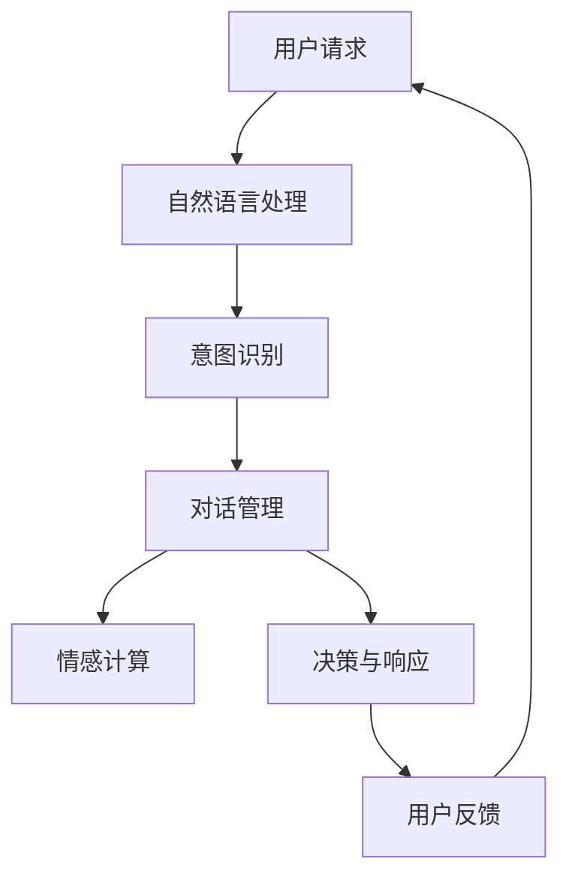
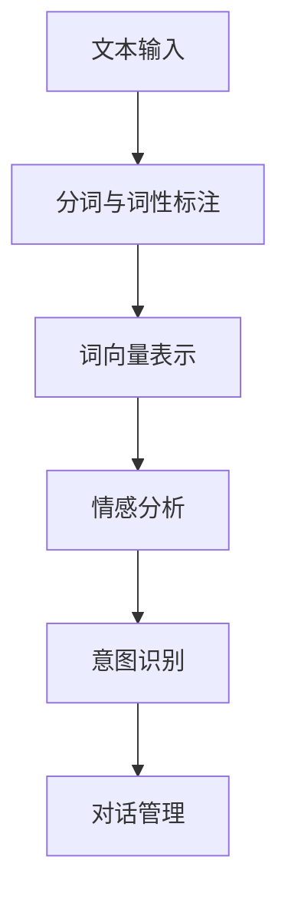
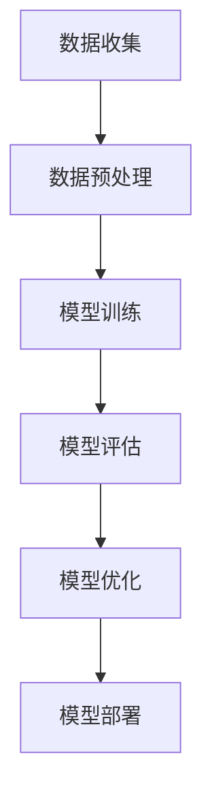
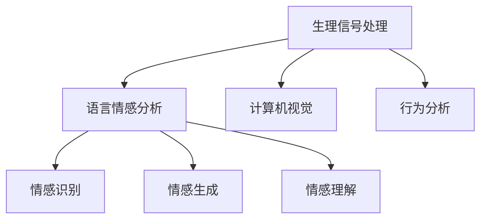

                 

### 文章标题

# 未来的智能客服：2050年的虚拟数字人与情感计算

> 关键词：智能客服、虚拟数字人、情感计算、自然语言处理、机器学习、深度学习、对话系统

> 摘要：本文深入探讨了智能客服在2050年的发展前景，重点关注虚拟数字人和情感计算技术的应用。通过逻辑清晰、结构紧凑的分析，本文揭示了智能客服领域的技术基础、核心技术和未来应用，为读者呈现了一幅充满创新与潜力的未来智能客服蓝图。

---

### 《未来的智能客服：2050年的虚拟数字人与情感计算》目录大纲

#### 第一部分：智能客服概述

- # 1. 智能客服的起源与发展
  - ## 1.1 智能客服的定义与重要性
  - ### 1.1.1 智能客服的历史演进
  - ### 1.1.2 智能客服在现代企业中的作用
  - ## 1.2 智能客服的技术基础
  - ### 1.2.1 自然语言处理
  - ### 1.2.2 机器学习与深度学习
  - ### 1.2.3 情感计算与虚拟数字人技术

- # 2. 2050年的虚拟数字人与情感计算
  - ## 2.1 虚拟数字人的设计与实现
  - ### 2.1.1 虚拟数字人的定义与分类
  - ### 2.1.2 虚拟数字人的交互模型
  - ### 2.1.3 虚拟数字人的应用场景
  - ## 2.2 情感计算的原理与实践
  - ### 2.2.1 情感计算的基本概念
  - ### 2.2.2 情感计算的技术体系
  - ### 2.2.3 情感计算在智能客服中的应用

#### 第二部分：智能客服的核心技术

- # 3. 自然语言处理在智能客服中的应用
  - ## 3.1 语言模型与意图识别
  - ### 3.1.1 语言模型的基本原理
  - ### 3.1.2 意图识别的技术与方法
  - ## 3.2 对话管理
  - ### 3.2.1 对话系统的工作流程
  - ### 3.2.2 对话状态跟踪
  - ### 3.2.3 对话策略的设计

- # 4. 机器学习与深度学习在智能客服中的应用
  - ## 4.1 机器学习的基本概念
  - ### 4.1.1 监督学习与无监督学习
  - ### 4.1.2 强化学习与深度强化学习
  - ## 4.2 深度学习在自然语言处理中的应用
  - ### 4.2.1 卷积神经网络（CNN）
  - ### 4.2.2 循环神经网络（RNN）
  - ### 4.2.3 长短期记忆网络（LSTM）
  - ### 4.2.4 生成对抗网络（GAN）

- # 5. 情感计算与情感分析
  - ## 5.1 情感计算的基本原理
  - ### 5.1.1 情感计算的技术体系
  - ### 5.1.2 情感识别与情感分析
  - ## 5.2 情感分析在智能客服中的应用
  - ### 5.2.1 情感分析的步骤与方法
  - ### 5.2.2 情感分析在客服场景中的实战应用

#### 第三部分：2050年的智能客服应用

- # 6. 未来的智能客服：2050年的展望
  - ## 6.1 智能客服的发展趋势
  - ### 6.1.1 智能客服的技术创新
  - ### 6.1.2 智能客服的行业应用
  - ## 6.2 2050年的虚拟数字人
  - ### 6.2.1 虚拟数字人的未来发展方向
  - ### 6.2.2 虚拟数字人在客服中的未来应用场景

- # 7. 情感计算的未来发展
  - ## 7.1 情感计算在未来的应用
  - ### 7.1.1 情感计算在社会服务中的应用
  - ### 7.1.2 情感计算在医疗健康中的应用
  - ### 7.1.3 情感计算在教育领域的应用

#### 第四部分：案例研究与展望

- # 8. 智能客服案例研究
  - ## 8.1 案例一：大型电商平台的智能客服系统
  - ### 8.1.1 案例背景
  - ### 8.1.2 案例实施过程
  - ### 8.1.3 案例效果评估
  - ## 8.2 案例二：银行智能客服在客户服务中的应用
  - ### 8.2.1 案例背景
  - ### 8.2.2 案例实施过程
  - ### 8.2.3 案例效果评估

- # 9. 智能客服的未来发展展望
  - ## 9.1 智能客服的技术挑战
  - ### 9.1.1 数据隐私与安全
  - ### 9.1.2 技术标准与规范
  - ### 9.1.3 智能客服伦理问题
  - ## 9.2 智能客服的产业生态
  - ### 9.2.1 智能客服产业链
  - ### 9.2.2 智能客服生态合作伙伴
  - ### 9.2.3 智能客服行业的未来发展趋势

---

### 第一部分：智能客服概述

#### 1. 智能客服的起源与发展

智能客服是指通过人工智能技术，模拟人类客服的行为和思维方式，为用户提供高效、精准的服务。其起源可以追溯到20世纪80年代，当时自然语言处理（NLP）技术开始应用于自动问答系统。随着计算机技术的不断发展，智能客服逐渐从简单的规则匹配向更加复杂的机器学习和深度学习技术演变。

##### 1.1 智能客服的定义与重要性

智能客服是一种基于人工智能技术的自动问答系统，它能够通过自然语言理解和生成技术，与用户进行实时交互，提供问题解答和咨询服务。与传统的人工客服相比，智能客服具有以下优点：

- **高效性**：智能客服能够同时处理大量用户请求，大大提高了服务效率。
- **准确性**：通过机器学习和深度学习技术，智能客服能够准确理解用户意图，并提供正确的答案。
- **灵活性**：智能客服可以根据用户反馈不断学习和优化，以适应不同的服务场景。

在现代企业中，智能客服发挥着越来越重要的作用。一方面，智能客服能够降低企业的人力成本，提高客户满意度；另一方面，智能客服能够帮助企业更好地收集和分析用户数据，为决策提供支持。

##### 1.1.1 智能客服的历史演进

智能客服的发展可以分为以下几个阶段：

1. **早期阶段**：20世纪80年代，自然语言处理技术开始应用于自动问答系统。这一阶段，智能客服主要基于规则匹配和关键词搜索，功能相对简单。

2. **发展阶段**：20世纪90年代，随着互联网的普及，智能客服开始应用于在线客服。这一阶段，智能客服引入了自然语言理解技术，能够更好地理解用户意图。

3. **成熟阶段**：21世纪初，随着机器学习和深度学习技术的发展，智能客服逐渐从基于规则的系统向基于数据驱动的系统转变。这一阶段，智能客服在准确性和灵活性方面取得了显著提升。

4. **未来阶段**：未来，智能客服将更加智能化和人性化，通过情感计算和虚拟数字人技术，实现更加自然的用户交互。

##### 1.1.2 智能客服在现代企业中的作用

智能客服在现代企业中发挥着重要作用，主要体现在以下几个方面：

- **提高客户满意度**：智能客服能够快速响应用户请求，提供准确的服务，从而提高客户满意度。

- **降低人力成本**：智能客服能够处理大量用户请求，降低企业的人力成本。

- **数据收集与分析**：智能客服能够记录用户交互数据，为企业提供宝贵的用户行为分析，助力企业做出更好的决策。

- **品牌形象塑造**：智能客服作为一种新兴的服务方式，能够提升企业的品牌形象，增强市场竞争力。

##### 1.2 智能客服的技术基础

智能客服的技术基础主要包括自然语言处理（NLP）、机器学习与深度学习、情感计算与虚拟数字人技术。

- **自然语言处理（NLP）**：NLP是智能客服的核心技术之一，它包括文本预处理、词向量表示、语义理解、情感分析等。通过NLP技术，智能客服能够理解用户的自然语言输入，并提供相应的回答。

- **机器学习与深度学习**：机器学习和深度学习技术为智能客服提供了强大的数据处理和分析能力。通过训练大量的数据集，智能客服能够学习用户的意图和情感，并不断提高服务质量。

- **情感计算与虚拟数字人技术**：情感计算是一种通过模拟人类情感反应来增强人机交互的技术。虚拟数字人则是一种结合了自然语言处理、计算机图形和语音合成等技术的虚拟人物。通过情感计算和虚拟数字人技术，智能客服能够实现更加自然的用户交互，提升用户体验。

在接下来的章节中，我们将详细探讨这些核心技术，并分析智能客服在2050年的发展前景。

---

### 第二部分：2050年的虚拟数字人与情感计算

#### 2. 2050年的虚拟数字人与情感计算

随着人工智能技术的飞速发展，虚拟数字人和情感计算技术已成为智能客服领域的重要研究方向。在2050年，这些技术将得到更加广泛的应用，为智能客服带来革命性的变化。

##### 2.1 虚拟数字人的设计与实现

虚拟数字人是指通过计算机图形、语音合成、自然语言处理等技术，模拟人类形象、语言和行为的虚拟角色。在2050年，虚拟数字人将具有更高的智能化和人性化水平，具体体现在以下几个方面：

- **高度拟真的外观**：虚拟数字人将采用先进的计算机图形技术，实现高度拟真的外貌和表情，让用户感受到更加真实的交互体验。

- **流畅的自然语言交互**：通过自然语言处理技术，虚拟数字人将能够理解用户的自然语言输入，并生成自然流畅的语音输出，实现无缝的语音交互。

- **情感表达与理解**：虚拟数字人将结合情感计算技术，能够识别用户的情感状态，并做出相应的情感反应，实现更加自然的情感交互。

- **个性化服务**：虚拟数字人将通过机器学习技术，根据用户的偏好和历史交互记录，提供个性化的服务，提高用户的满意度。

##### 2.1.1 虚拟数字人的定义与分类

虚拟数字人可以根据不同的分类标准进行划分，常见的分类方法如下：

- **按外观特征分类**：虚拟数字人可以分为卡通形象、现实人物模拟和虚拟角色等。

- **按功能分类**：虚拟数字人可以分为服务型虚拟数字人、娱乐型虚拟数字人和教育型虚拟数字人等。

- **按交互方式分类**：虚拟数字人可以分为语音交互型、文本交互型和多模态交互型等。

在2050年，虚拟数字人将更加多样化，满足不同场景和用户需求。

##### 2.1.2 虚拟数字人的交互模型

虚拟数字人的交互模型主要包括输入模块、处理模块和输出模块。

- **输入模块**：虚拟数字人通过语音识别、文本识别和多模态感知等技术，获取用户的输入信息。

- **处理模块**：虚拟数字人通过自然语言处理、情感计算和机器学习等技术，对输入信息进行分析和处理，理解用户的意图和情感。

- **输出模块**：虚拟数字人通过语音合成、文本生成和多模态表达等技术，生成合适的回应，并与用户进行交互。

在2050年，虚拟数字人的交互模型将更加智能和高效，实现更加自然的用户交互。

##### 2.1.3 虚拟数字人的应用场景

虚拟数字人在2050年将广泛应用于各个领域，以下是一些典型的应用场景：

- **客服领域**：虚拟数字人将作为智能客服的代表，为用户提供高效、个性化的服务，解决用户的问题和需求。

- **娱乐领域**：虚拟数字人将作为虚拟偶像、虚拟主持人等，为用户提供丰富的娱乐体验。

- **教育领域**：虚拟数字人将作为虚拟教师、虚拟辅导员等，为学生提供个性化、互动性的学习体验。

- **医疗领域**：虚拟数字人将作为虚拟医生、虚拟护士等，为患者提供专业、贴心的医疗服务。

- **社交领域**：虚拟数字人将作为虚拟朋友、虚拟伴侣等，为用户提供情感支持和陪伴。

在未来的智能客服中，虚拟数字人将成为重要的交互载体，为用户提供更加智能化和人性化的服务。

##### 2.2 情感计算的原理与实践

情感计算是一种通过模拟人类情感反应来增强人机交互的技术。在2050年，情感计算技术将得到更加广泛的应用，提升智能客服的用户体验。

###### 2.2.1 情感计算的基本概念

情感计算的基本概念包括情感识别、情感生成和情感理解。

- **情感识别**：情感识别是指通过分析用户的生理信号、语言和行为，识别用户的情感状态。

- **情感生成**：情感生成是指通过模拟人类的情感反应，生成符合用户情感状态的自然语言和表情。

- **情感理解**：情感理解是指通过理解用户的情感状态，为用户提供合适的服务和建议。

在情感计算中，情感识别和情感生成是实现情感理解的基础。

###### 2.2.2 情感计算的技术体系

情感计算的技术体系主要包括生理信号处理、语言情感分析、计算机视觉和行为分析等。

- **生理信号处理**：生理信号处理是指通过分析用户的生理信号（如心率、呼吸、皮肤电等），识别用户的情感状态。

- **语言情感分析**：语言情感分析是指通过分析用户的语言表达，识别用户的情感状态。

- **计算机视觉**：计算机视觉是指通过分析用户的面部表情、身体语言等，识别用户的情感状态。

- **行为分析**：行为分析是指通过分析用户的行为模式，识别用户的情感状态。

在情感计算中，多种技术手段相互结合，提高情感识别的准确性和可靠性。

###### 2.2.3 情感计算在智能客服中的应用

情感计算在智能客服中的应用主要体现在以下几个方面：

- **情感识别**：通过情感计算技术，智能客服能够识别用户的情感状态，如愤怒、满意、焦虑等，为用户提供相应的服务。

- **情感理解**：通过情感计算技术，智能客服能够理解用户的情感需求，提供个性化的服务和建议。

- **情感调节**：通过情感计算技术，智能客服能够根据用户的情感状态，调整自身的服务策略，如提供安慰、鼓励等。

- **情感反馈**：通过情感计算技术，智能客服能够识别用户的情感反馈，优化自身的服务质量。

在未来的智能客服中，情感计算技术将实现更加精准的情感识别和理解，提升用户的满意度。

##### 2.2.4 虚拟数字人在智能客服中的应用

虚拟数字人在智能客服中的应用主要包括以下几个方面：

- **个性化服务**：虚拟数字人根据用户的偏好和历史交互记录，提供个性化的服务，提高用户的满意度。

- **情感交流**：虚拟数字人通过情感计算技术，与用户进行情感交流，提供更加自然和贴心的服务。

- **问题解决**：虚拟数字人能够快速识别用户的问题，并提供准确的解决方案。

- **客户关系维护**：虚拟数字人能够通过情感计算技术，识别用户的情感状态，维护良好的客户关系。

在未来的智能客服中，虚拟数字人将成为重要的交互载体，为用户提供更加智能化和人性化的服务。

在接下来的章节中，我们将深入探讨智能客服的核心技术，如自然语言处理、机器学习和深度学习等，并分析这些技术在智能客服中的应用。

---

### 第二部分：智能客服的核心技术

#### 3. 自然语言处理在智能客服中的应用

自然语言处理（NLP）是智能客服的核心技术之一，它使得计算机能够理解、生成和处理人类语言。在智能客服中，NLP技术被广泛应用于文本预处理、词向量表示、语义理解、情感分析和对话系统等方面。

##### 3.1 语言模型与意图识别

语言模型是NLP的基础，它用于预测文本序列的概率分布。在智能客服中，语言模型主要用于理解和生成用户查询，以及构建对话系统的回复。

- **语言模型的基本原理**：语言模型通过统计方法或机器学习方法，从大量的文本数据中学习语言的模式和规律。常用的语言模型有N元语法、神经网络语言模型（如RNN、LSTM）和Transformer模型。

- **语言模型的构建**：语言模型的构建通常包括以下几个步骤：
  1. 数据收集：收集大量文本数据，用于训练语言模型。
  2. 数据预处理：对文本数据进行清洗、分词、去停用词等操作。
  3. 模型训练：使用统计方法或机器学习方法训练语言模型，如最大熵模型、神经网络模型等。
  4. 模型评估：使用测试数据评估语言模型的性能，如 perplexity、交叉熵等指标。

- **语言模型在意图识别中的应用**：意图识别是智能客服的关键任务之一，它用于理解用户的查询意图。语言模型在意图识别中的应用主要体现在以下几个方面：
  1. **查询匹配**：使用预训练的语言模型对用户的查询进行编码，将查询转换为固定长度的向量表示，然后与预定义的意图向量进行匹配，从而识别用户的意图。
  2. **上下文理解**：语言模型能够理解查询的上下文信息，从而更准确地识别用户的意图。例如，在查询“明天天气如何？”时，语言模型能够理解“明天”和“天气”之间的关系，从而准确识别出用户的意图。

##### 3.1.1 意图识别的技术与方法

意图识别是智能客服的核心任务之一，它涉及从用户的查询中识别出用户想要执行的操作。意图识别的技术与方法主要包括以下几种：

- **基于规则的方法**：基于规则的方法使用预定义的规则库，将用户的查询与规则进行匹配，从而识别出用户的意图。这种方法简单直观，但灵活性较低，难以处理复杂的查询。

- **基于统计的方法**：基于统计的方法使用机器学习方法，从大量的用户查询数据中学习意图的模式。常用的统计方法包括决策树、朴素贝叶斯、支持向量机等。

- **基于深度学习的方法**：基于深度学习的方法使用深度神经网络，如卷积神经网络（CNN）、循环神经网络（RNN）和Transformer模型等，从用户的查询数据中学习意图的表示。这种方法能够处理复杂的查询，但需要大量的训练数据和计算资源。

- **多任务学习**：多任务学习将意图识别与其他任务（如实体识别、情感分析等）结合，共同训练一个深度神经网络模型。这种方法能够提高模型在意图识别任务上的性能。

- **迁移学习**：迁移学习利用预训练的语言模型，对意图识别任务进行微调。这种方法能够利用预训练模型的知识，提高意图识别的准确性。

##### 3.2 对话管理

对话管理是智能客服的关键组成部分，它涉及在对话过程中对用户意图的理解、响应策略的制定和对话状态的跟踪。

- **对话系统的工作流程**：对话系统的工作流程主要包括以下几个步骤：
  1. **用户输入**：用户通过文本或语音输入查询。
  2. **意图识别**：使用语言模型和意图识别算法，将用户输入转换为意图表示。
  3. **对话状态跟踪**：记录对话过程中的关键信息，如用户意图、对话上下文等。
  4. **响应生成**：根据意图识别结果和对话状态，生成合适的响应。
  5. **用户反馈**：收集用户的反馈，用于模型优化和对话改进。

- **对话状态跟踪**：对话状态跟踪是对话管理的关键环节，它涉及在对话过程中对用户意图和上下文的持续理解和更新。常用的对话状态跟踪方法包括基于规则的方法、基于统计的方法和基于深度学习的方法。

- **对话策略的设计**：对话策略用于指导智能客服如何响应用户的查询。对话策略的设计需要考虑以下几个方面：
  1. **对话目标**：确定对话的目标，如提供信息、解决问题、建立关系等。
  2. **用户意图识别**：识别用户的意图，以便提供合适的响应。
  3. **上下文维护**：在对话过程中维护上下文信息，确保响应的一致性和连贯性。
  4. **用户满意度**：优化对话策略，提高用户的满意度。

在智能客服中，自然语言处理技术通过对用户查询的理解、意图的识别和对话状态的跟踪，实现与用户的自然、流畅的交互。在接下来的章节中，我们将继续探讨机器学习与深度学习在智能客服中的应用，以及情感计算如何提升用户体验。

---

### 第二部分：智能客服的核心技术

#### 4. 机器学习与深度学习在智能客服中的应用

机器学习和深度学习技术为智能客服带来了强大的数据处理和分析能力，使得智能客服在意图识别、对话生成、情感理解等方面取得了显著进展。本节将详细探讨机器学习与深度学习在智能客服中的应用，以及如何通过这些技术提升智能客服的性能。

##### 4.1 机器学习的基本概念

机器学习是使计算机系统能够从数据中学习和改进其性能的一门技术。在智能客服中，机器学习主要用于模式识别、预测和优化。

- **监督学习**：监督学习是一种在给定输入数据和输出标签的情况下，训练模型以预测新数据标签的方法。常见的监督学习算法包括线性回归、逻辑回归、支持向量机（SVM）和决策树等。

  - **线性回归**：线性回归是一种预测连续值的监督学习算法，通过拟合输入变量和输出变量之间的线性关系来预测新数据的值。
  - **逻辑回归**：逻辑回归是一种预测二元结果的监督学习算法，通过拟合输入变量和输出变量之间的逻辑关系来预测新数据的标签。

  ```python
  # 线性回归伪代码
  def linear_regression(X, y):
      # 计算回归系数
      theta = calculate_coefficients(X, y)
      # 预测新数据
      predictions = predict(X, theta)
      return predictions

  # 逻辑回归伪代码
  def logistic_regression(X, y):
      # 计算回归系数
      theta = calculate_coefficients(X, y)
      # 预测新数据
      predictions = predict(X, theta)
      return predictions
  ```

- **无监督学习**：无监督学习是在没有输出标签的情况下，从数据中学习模式和结构的方法。常见的无监督学习算法包括聚类、降维和关联规则学习等。

  - **K-means聚类**：K-means聚类是一种基于距离度量的聚类算法，它将数据分为K个簇，使得每个簇内的数据距离中心点的距离最小。
  - **主成分分析（PCA）**：主成分分析是一种降维算法，它通过将数据投影到新的正交坐标系中，提取最重要的特征，从而减少数据的维度。

  ```python
  # K-means聚类伪代码
  def kmeans_clustering(data, K):
      # 初始化簇中心
      centroids = initialize_centroids(data, K)
      # 聚类迭代
      while not convergence:
          # 重新分配数据点
          clusters = assign_data_to_clusters(data, centroids)
          # 更新簇中心
          centroids = update_centroids(clusters)
      return clusters, centroids

  # 主成分分析伪代码
  def pca(data):
      # 计算协方差矩阵
      covariance_matrix = calculate_covariance_matrix(data)
      # 计算特征值和特征向量
      eigenvalues, eigenvectors = calculate_eigenvalues_and_eigenvectors(covariance_matrix)
      # 构造投影矩阵
      projection_matrix = construct_projection_matrix(eigenvectors)
      # 数据投影
      projected_data = project_data(data, projection_matrix)
      return projected_data
  ```

- **强化学习**：强化学习是一种通过试错和反馈来学习最佳策略的方法。在智能客服中，强化学习可以用于优化对话策略，提高用户的满意度。

  - **Q学习**：Q学习是一种基于价值迭代的强化学习算法，它通过更新Q值来学习最佳动作策略。
  - **深度强化学习**：深度强化学习将深度神经网络与强化学习结合，用于解决复杂环境中的决策问题。

  ```python
  # Q学习伪代码
  def q_learning(states, actions, rewards, learning_rate, discount_factor):
      # 初始化Q值
      Q = initialize_Q_values(states, actions)
      # 迭代更新Q值
      while not convergence:
          # 选择动作
          actions = choose_actions(states, Q)
          # 执行动作并获取奖励
          rewards = execute_actions(states, actions)
          # 更新Q值
          Q = update_Q_values(Q, states, actions, rewards, learning_rate, discount_factor)
      return Q
  ```

##### 4.1.1 监督学习与无监督学习

在智能客服中，监督学习和无监督学习各有其应用场景和优势。

- **监督学习**：
  - **优点**：
    - 可以准确预测新数据的标签。
    - 能够利用大量标注数据进行训练。
    - 应用范围广泛，包括意图识别、实体识别和情感分析等。
  - **缺点**：
    - 需要大量标注数据。
    - 可能受到标注偏差的影响。
    - 难以处理高维度数据。

- **无监督学习**：
  - **优点**：
    - 可以发现数据中的潜在结构和模式。
    - 不需要大量标注数据。
    - 对高维度数据具有较好的处理能力。
  - **缺点**：
    - 预测结果通常不如监督学习准确。
    - 难以直接应用于分类和回归问题。

##### 4.1.2 强化学习与深度强化学习

强化学习在智能客服中的应用主要集中在优化对话策略，提高用户的满意度。

- **强化学习**：
  - **应用**：
    - 对话策略优化：通过试错和反馈，智能客服可以学习最佳对话策略，提高用户满意度。
    - 情感调节：智能客服可以通过强化学习，根据用户的情感状态调整对话策略，提供更加贴心的服务。

- **深度强化学习**：
  - **应用**：
    - 复杂环境下的决策问题：智能客服在处理复杂问题时，如多轮对话和多任务处理，深度强化学习可以提供有效的解决方案。
    - 多模态交互：深度强化学习可以处理包含多种感知输入（如文本、语音、图像）的复杂交互环境，实现更加自然的用户交互。

##### 4.2 深度学习在自然语言处理中的应用

深度学习在自然语言处理（NLP）中取得了显著成果，极大地提升了智能客服的性能。

- **卷积神经网络（CNN）**：
  - **应用**：
    - 文本分类：CNN可以有效地捕捉文本中的局部特征，用于分类任务，如情感分析、命名实体识别等。
    - 文本摘要：CNN可以提取文本中的重要信息，生成简洁的摘要。

- **循环神经网络（RNN）**：
  - **应用**：
    - 序列标注：RNN可以用于对文本序列进行标注，如词性标注、命名实体识别等。
    - 语言模型：RNN可以用于生成文本序列，如自动回复、机器翻译等。

- **长短期记忆网络（LSTM）**：
  - **应用**：
    - 长期依赖关系：LSTM可以有效地处理长序列数据，捕捉长期依赖关系，用于时间序列预测、语音识别等。
    - 语音识别：LSTM可以用于处理语音信号，识别语音中的单词和短语。

- **生成对抗网络（GAN）**：
  - **应用**：
    - 文本生成：GAN可以生成高质量的文本，如生成对话、新闻文章等。
    - 图像生成：GAN可以生成逼真的图像，如图像超分辨率、图像风格迁移等。

##### 4.2.1 卷积神经网络（CNN）

卷积神经网络（CNN）是一种深度学习模型，特别适用于处理图像和文本数据。

- **CNN的基本原理**：
  - **卷积操作**：卷积层通过卷积核在输入数据上滑动，提取局部特征。
  - **池化操作**：池化层用于减小特征图的大小，减少参数数量，提高模型泛化能力。
  - **全连接层**：全连接层用于对提取的特征进行分类或回归。

- **CNN在文本分类中的应用**：
  ```python
  # 文本分类的CNN模型伪代码
  import tensorflow as tf

  # 输入层
  inputs = tf.placeholder(tf.float32, [None, sequence_length, embedding_size])

  # 卷积层
  conv1 = tf.layers.conv1d(inputs, filters=128, kernel_size=3, activation=tf.nn.relu)

  # 池化层
  pool1 = tf.layers.max_pool1d(conv1, pool_size=2, strides=2)

  # 全连接层
  dense = tf.layers.dense(pool1, units=10, activation=tf.nn.softmax)

  # 训练模型
  with tf.Session() as sess:
      sess.run(tf.global_variables_initializer())
      # 训练过程
      for epoch in range(num_epochs):
          for batch in train_batches:
              inputs_, labels_ = batch
              sess.run(optimizer, feed_dict={inputs: inputs_, labels: labels_})
      # 评估模型
      accuracy = sess.run(accuracy_op, feed_dict={inputs: test_inputs, labels: test_labels})
      print("Test accuracy:", accuracy)
  ```

##### 4.2.2 循环神经网络（RNN）

循环神经网络（RNN）是一种能够处理序列数据的深度学习模型。

- **RNN的基本原理**：
  - **隐藏状态**：RNN通过隐藏状态来存储历史信息，从而处理序列数据。
  - **递归连接**：RNN的输出不仅取决于当前输入，还取决于之前的隐藏状态。

- **RNN在序列标注中的应用**：
  ```python
  # 序列标注的RNN模型伪代码
  import tensorflow as tf

  # 输入层
  inputs = tf.placeholder(tf.int32, [None, sequence_length])

  # 词嵌入层
  embeddings = tf.Variable(tf.random_uniform([vocab_size, embedding_size], -1, 1))

  # RNN层
  lstm_cell = tf.nn.rnn_cell.BasicLSTMCell(num_units=128)
  outputs, states = tf.nn.dynamic_rnn(lstm_cell, inputs, dtype=tf.float32)

  # 全连接层
  logits = tf.layers.dense(states, units=num_classes)
  predictions = tf.argmax(logits, axis=1)

  # 训练模型
  with tf.Session() as sess:
      sess.run(tf.global_variables_initializer())
      # 训练过程
      for epoch in range(num_epochs):
          for batch in train_batches:
              inputs_, labels_ = batch
              sess.run(optimizer, feed_dict={inputs: inputs_, labels: labels_})
      # 评估模型
      accuracy = sess.run(accuracy_op, feed_dict={inputs: test_inputs, labels: test_labels})
      print("Test accuracy:", accuracy)
  ```

##### 4.2.3 长短期记忆网络（LSTM）

长短期记忆网络（LSTM）是一种改进的RNN，能够更好地处理长序列数据。

- **LSTM的基本原理**：
  - **门控机制**：LSTM通过门控机制（包括遗忘门、输入门和输出门）来控制信息的流动，避免梯度消失和梯度爆炸问题。
  - **细胞状态**：LSTM通过细胞状态来存储和更新信息。

- **LSTM在语音识别中的应用**：
  ```python
  # 语音识别的LSTM模型伪代码
  import tensorflow as tf

  # 输入层
  inputs = tf.placeholder(tf.float32, [batch_size, sequence_length, feature_size])

  # LSTM层
  lstm_cell = tf.nn.rnn_cell.LSTMCell(num_units=128)
  outputs, states = tf.nn.dynamic_rnn(lstm_cell, inputs, dtype=tf.float32)

  # 全连接层
  logits = tf.layers.dense(states, units=num_classes)
  predictions = tf.argmax(logits, axis=1)

  # 训练模型
  with tf.Session() as sess:
      sess.run(tf.global_variables_initializer())
      # 训练过程
      for epoch in range(num_epochs):
          for batch in train_batches:
              inputs_, labels_ = batch
              sess.run(optimizer, feed_dict={inputs: inputs_, labels: labels_})
      # 评估模型
      accuracy = sess.run(accuracy_op, feed_dict={inputs: test_inputs, labels: test_labels})
      print("Test accuracy:", accuracy)
  ```

##### 4.2.4 生成对抗网络（GAN）

生成对抗网络（GAN）是一种通过对抗训练生成数据的深度学习模型。

- **GAN的基本原理**：
  - **生成器**：生成器尝试生成逼真的数据。
  - **判别器**：判别器尝试区分生成数据和真实数据。

- **GAN在文本生成中的应用**：
  ```python
  # 文本生成的GAN模型伪代码
  import tensorflow as tf

  # 生成器
  def generator(z):
      with tf.variable_scope("generator"):
          # 随机噪声向量
          z = tf.random_normal([batch_size, z_dim])
          # 隐藏层
          h = tf.layers.dense(z, units=256, activation=tf.nn.relu)
          # 输出层
          x_fake = tf.layers.dense(h, units=embedding_size)
          return x_fake

  # 判别器
  def discriminator(x):
      with tf.variable_scope("discriminator"):
          # 输入层
          x = tf.placeholder(tf.int32, [batch_size, sequence_length])
          # 词嵌入层
          x_emb = tf.nn.embedding_lookup(embeddings, x)
          # 隐藏层
          h = tf.layers.dense(x_emb, units=256, activation=tf.nn.relu)
          # 输出层
          logits = tf.layers.dense(h, units=1)
          prob = tf.sigmoid(logits)
          return prob

  # GAN模型
  z = tf.random_normal([batch_size, z_dim])
  x_fake = generator(z)
  prob_fake = discriminator(x_fake)

  # 训练模型
  with tf.Session() as sess:
      sess.run(tf.global_variables_initializer())
      # 训练过程
      for epoch in range(num_epochs):
          for batch in train_batches:
              z_, x_ = batch
              sess.run(optimizer, feed_dict={z: z_, x_fake: x_fake_})
      # 评估模型
      generated_texts = sess.run(x_fake, feed_dict={z: z_})
  ```

通过以上对机器学习与深度学习在智能客服中的应用的详细探讨，我们可以看到这些技术如何共同作用于意图识别、对话生成和情感理解等方面，显著提升智能客服的性能和用户体验。在接下来的章节中，我们将进一步探讨情感计算在智能客服中的应用，以及如何通过情感计算实现更加自然的用户交互。

---

### 第二部分：智能客服的核心技术

#### 5. 情感计算与情感分析

情感计算是一种通过模拟人类情感反应来增强人机交互的技术。在智能客服领域，情感计算被广泛应用于情感识别、情感分析和情感反馈等方面，以实现更加自然、贴心的用户交互体验。

##### 5.1 情感计算的基本原理

情感计算的核心在于理解和模拟人类的情感状态。情感计算的基本原理包括以下几个方面：

- **情感识别**：情感识别是指通过分析用户的语言、语音、面部表情和行为等，识别用户的情感状态。情感识别通常涉及以下步骤：

  1. **数据采集**：收集用户的语音、文本、面部表情和行为等数据。
  2. **特征提取**：从采集的数据中提取情感相关的特征，如语音的音调、音量、语速，文本的情感词汇，面部表情的参数等。
  3. **情感分类**：使用机器学习算法，如支持向量机（SVM）、朴素贝叶斯、神经网络等，对提取的特征进行分类，识别用户的情感状态。

- **情感生成**：情感生成是指通过模拟人类的情感反应，生成符合用户情感状态的自然语言和表情。情感生成的步骤包括：

  1. **情感识别**：首先识别用户的情感状态。
  2. **情感模板匹配**：根据用户的情感状态，从预定义的情感模板库中选择合适的模板。
  3. **文本生成**：使用自然语言生成技术，如模板匹配、序列到序列模型等，生成符合用户情感状态的文本。
  4. **情感表达**：通过语音合成、面部表情合成等技术，将生成的文本转换为自然语言和表情。

- **情感理解**：情感理解是指智能客服对用户的情感需求进行理解，并做出相应的响应。情感理解通常涉及以下步骤：

  1. **情感识别**：识别用户的情感状态。
  2. **情感分析**：对用户的情感状态进行深入分析，理解其情感需求。
  3. **情感响应**：根据用户情感需求，生成合适的情感响应。

##### 5.1.1 情感计算的技术体系

情感计算的技术体系包括语音情感分析、文本情感分析和计算机视觉等。

- **语音情感分析**：语音情感分析是指通过分析用户的语音特征，识别用户的情感状态。语音情感分析涉及以下技术：

  1. **声音特征提取**：从语音信号中提取情感相关的特征，如音调、音量、语速、基频等。
  2. **情感分类模型**：使用机器学习算法，如支持向量机（SVM）、深度神经网络（DNN）等，对提取的特征进行分类，识别用户的情感状态。

- **文本情感分析**：文本情感分析是指通过分析用户的文本输入，识别用户的情感状态。文本情感分析涉及以下技术：

  1. **文本特征提取**：从文本中提取情感相关的特征，如情感词汇、词频、情感强度等。
  2. **情感分类模型**：使用机器学习算法，如朴素贝叶斯、逻辑回归、支持向量机（SVM）等，对提取的特征进行分类，识别用户的情感状态。

- **计算机视觉**：计算机视觉是指通过分析用户的面部表情、肢体动作等，识别用户的情感状态。计算机视觉涉及以下技术：

  1. **面部表情识别**：从面部图像中提取情感相关的特征，如眼睛的眨动、嘴巴的形状等。
  2. **行为分析**：从用户的肢体动作中提取情感相关的特征，如手势、肢体动作的频率等。
  3. **情感分类模型**：使用机器学习算法，如支持向量机（SVM）、深度神经网络（DNN）等，对提取的特征进行分类，识别用户的情感状态。

##### 5.1.2 情感识别与情感分析

情感识别和情感分析是情感计算的两个核心环节，它们相互补充，共同实现情感计算的目标。

- **情感识别**：情感识别是指通过分析用户的语言、语音、面部表情和行为等，识别用户的情感状态。情感识别的主要任务是：

  1. **情感分类**：将用户的情感状态分类为积极、消极、中性等。
  2. **情感强度识别**：识别用户情感的强度，如非常高兴、稍微高兴、中立、稍微悲伤等。

- **情感分析**：情感分析是指对用户的情感状态进行深入分析，理解其情感需求。情感分析的主要任务是：

  1. **情感分类**：将用户的情感状态分类为积极、消极、中性等。
  2. **情感强度分析**：分析用户情感的强度，理解用户的情感状态。
  3. **情感变化分析**：分析用户情感的变化趋势，预测用户的未来情感状态。

在智能客服中，情感识别和情感分析的应用场景非常广泛，如：

- **客户服务**：通过情感识别和情感分析，智能客服可以识别客户的情感状态，提供针对性的服务，提高客户满意度。
- **情感反馈**：通过情感识别和情感分析，智能客服可以收集客户的情感反馈，优化服务质量和用户体验。
- **情感调节**：通过情感识别和情感分析，智能客服可以根据用户的情感状态，调整对话策略，提供安慰、鼓励等情感支持。

##### 5.2 情感分析在智能客服中的应用

情感分析在智能客服中的应用主要体现在以下几个方面：

- **用户情感识别**：智能客服通过情感分析技术，识别用户的情感状态，如愤怒、满意、焦虑等。
- **情感反馈收集**：智能客服通过情感分析技术，收集用户的情感反馈，用于服务改进和用户体验优化。
- **情感调节**：智能客服通过情感分析技术，根据用户的情感状态，调整对话策略，提供更加贴心的服务。

情感分析在智能客服中的应用案例包括：

- **电商客服**：电商客服通过情感分析技术，识别用户的购买意图和情感状态，提供个性化的推荐和情感支持，提高购买转化率。
- **金融客服**：金融客服通过情感分析技术，识别用户的投资情绪和风险偏好，提供专业的投资建议和风险预警。
- **医疗客服**：医疗客服通过情感分析技术，识别用户的健康状态和情感需求，提供专业的医疗咨询和情感支持。

在未来的智能客服中，情感计算技术将得到更加广泛的应用，为用户提供更加智能化和人性化的服务。情感计算不仅将提高用户的满意度，还将为企业带来巨大的商业价值。

---

### 第三部分：2050年的智能客服展望

随着人工智能技术的不断进步，智能客服在2050年将迎来前所未有的发展。未来的智能客服不仅将更加智能化，还将具有高度的人性化特点，满足用户的个性化需求。以下是2050年智能客服的一些主要发展趋势。

##### 6.1 智能客服的发展趋势

- **智能化**：未来的智能客服将更加依赖先进的人工智能技术，如深度学习、生成对抗网络（GAN）和强化学习等。这些技术将使得智能客服在意图识别、对话生成和情感理解等方面达到前所未有的准确性和灵活性。

- **个性化**：通过用户数据的深度分析和机器学习算法的应用，智能客服将能够根据用户的偏好、历史行为和情感状态，提供高度个性化的服务。这种个性化服务将包括定制化的推荐、情感化的交流和个性化的解决方案。

- **多模态交互**：未来的智能客服将能够处理多种输入模态，如语音、文本、图像和手势等。通过多模态交互，智能客服将能够更加自然地与用户进行互动，提升用户体验。

- **情感计算**：情感计算技术将使得智能客服能够理解和模拟用户的情感状态，提供情感化的交流和个性化服务。这种情感化的交互将使智能客服更加接近人类的沟通方式，提升用户满意度。

- **自动化与协作**：未来的智能客服将能够自动处理大量常规问题，同时能够与人类客服协作，处理复杂或异常情况。这种自动化与协作的机制将提高客服效率，降低人力成本。

##### 6.1.1 智能客服的技术创新

- **自适应对话系统**：未来的智能客服将具备自适应能力，能够根据用户的反馈和学习历史，不断优化对话策略和交互方式。这种自适应能力将使得智能客服能够更好地适应不同用户的需求和情感状态。

- **生成式对话系统**：生成式对话系统将利用生成对抗网络（GAN）等技术，生成高质量的对话内容。这种系统能够创造出更加自然、流畅的对话，提升用户体验。

- **情感感知客服**：情感感知客服将结合情感计算技术，能够识别用户的情感状态，并做出相应的情感反应。这种情感感知能力将使得智能客服能够提供更加贴心、个性化的服务。

- **知识图谱的应用**：知识图谱技术将用于构建智能客服的知识库，提供丰富的语义信息和推理能力。这种知识图谱的应用将使得智能客服能够更好地理解用户的查询，提供准确的答案。

##### 6.1.2 智能客服的行业应用

智能客服将在多个行业中得到广泛应用，以下是一些关键领域的应用场景：

- **零售业**：智能客服将作为零售商与消费者之间的桥梁，提供个性化的购物建议、解答消费者疑问，并处理退货和退款等事务。

- **金融业**：智能客服将作为银行、保险和投资公司的重要工具，提供账户管理、风险预警、投资咨询等服务。

- **医疗保健**：智能客服将作为医疗机构和患者的沟通桥梁，提供预约挂号、健康咨询、疾病预防等服务。

- **教育**：智能客服将作为学校和教育机构的助手，提供在线学习辅导、课程咨询、成绩查询等服务。

- **政府服务**：智能客服将作为政府机构和公众的互动渠道，提供政策咨询、办事指南、公共服务查询等服务。

在未来，智能客服将成为各行各业不可或缺的一部分，极大地提高服务效率和用户体验，为企业和组织带来巨大的商业价值和社会效益。

##### 6.2 2050年的虚拟数字人

虚拟数字人作为智能客服的重要载体，将在2050年实现显著的发展。虚拟数字人将具备更加逼真的人像、自然流畅的语言和情感表达，以及高度智能化的交互能力。

- **逼真的人像**：虚拟数字人将采用最先进的计算机图形技术，实现高度拟真的外貌和表情。通过实时的面部捕捉和动态纹理技术，虚拟数字人能够真实地再现人类的面部表情和动作。

- **自然流畅的语言**：虚拟数字人将通过深度学习和自然语言处理技术，实现自然流畅的语言生成和语音合成。虚拟数字人不仅能够理解用户的自然语言输入，还能以自然的方式回应用户，使对话更加自然和顺畅。

- **情感表达**：虚拟数字人将结合情感计算技术，能够识别用户的情感状态，并做出相应的情感反应。这种情感化的交互将使得虚拟数字人与用户之间的互动更加贴近人类的沟通方式，提升用户体验。

- **高度智能化的交互**：虚拟数字人将具备强大的学习和适应能力，能够根据用户的偏好、行为和情感状态，提供个性化的服务和建议。虚拟数字人还将能够处理复杂的多轮对话，提供更加智能化的解决方案。

在2050年，虚拟数字人将成为智能客服的标志性特征，为用户提供高效、贴心的服务。以下是一些虚拟数字人在客服中的未来应用场景：

- **个性化服务**：虚拟数字人将根据用户的偏好和历史记录，提供个性化的购物建议、定制化的产品推荐和专业的咨询服务。

- **情感支持**：虚拟数字人将能够识别用户的情感状态，提供情感支持，如安慰、鼓励和安慰等。

- **多语言支持**：虚拟数字人将具备多语言处理能力，能够与不同语言的用户进行无障碍交流，为全球用户提供服务。

- **复杂问题解决**：虚拟数字人将能够处理复杂的问题和需求，提供详细的解决方案和专业的建议。

在未来，虚拟数字人将成为智能客服的核心竞争力，为用户提供更加智能化、人性化的服务体验。

在接下来的章节中，我们将进一步探讨情感计算在未来的发展方向，以及它将在社会服务、医疗健康和教育等领域带来的变革。

---

### 第三部分：2050年的智能客服展望

#### 7. 情感计算的未来发展

情感计算作为智能客服的核心技术之一，将在未来的多个领域中发挥重要作用。随着人工智能技术的不断进步，情感计算将实现更广泛的应用，为人类带来前所未有的便利和体验。

##### 7.1 情感计算在未来的应用

- **社会服务**：情感计算在社会服务中有着广泛的应用前景。例如，通过情感计算技术，智能客服系统可以更好地理解老年人的情感需求，提供个性化的关怀服务。此外，情感计算还可以用于心理健康服务，通过识别和分析用户的情感状态，为用户提供专业的心理支持和干预。

- **医疗健康**：情感计算在医疗健康领域具有巨大的潜力。通过情感计算技术，医生和医疗设备可以更好地了解患者的情感状态，提供个性化的治疗方案和护理。例如，智能监护系统可以通过监测患者的情感状态，及时发现患者的不良情绪，提供相应的心理干预。

- **教育**：在教育领域，情感计算可以帮助教师更好地了解学生的学习状态和情感需求，提供个性化的学习建议和指导。同时，智能教学系统可以通过情感计算技术，评估学生的学习效果和情感状态，为教师提供教学反馈。

- **客户服务**：情感计算在客户服务中的应用将极大地提升用户体验。智能客服系统可以通过情感计算技术，识别用户的情感状态，提供个性化的服务和解决方案。例如，电商平台可以通过情感计算技术，为用户提供个性化的购物建议和推荐。

##### 7.1.1 情感计算在社会服务中的应用

在社会服务领域，情感计算技术可以帮助政府部门更好地了解民众的情感需求和意见反馈，从而提供更加贴心和高效的服务。以下是一些具体的应用场景：

- **民意调查**：政府部门可以通过情感计算技术，分析民众的反馈和意见，了解社会公众的情感状态和意见倾向，为政策制定提供依据。

- **应急响应**：在突发事件和灾害发生时，情感计算技术可以帮助应急管理部门及时了解受影响民众的情感状态，提供及时的心理援助和应急服务。

- **社区管理**：社区管理部门可以通过情感计算技术，分析居民的交流内容和情感状态，及时发现社区中的问题和矛盾，提供针对性的解决方案。

- **公共服务优化**：政府部门可以通过情感计算技术，分析民众对公共服务的满意度，优化服务流程和提升服务质量。

##### 7.1.2 情感计算在医疗健康中的应用

在医疗健康领域，情感计算技术可以用于改善患者的护理体验和治疗效果。以下是一些具体的应用场景：

- **患者监测**：通过情感计算技术，医疗设备可以实时监测患者的情感状态，及时发现患者的不良情绪，提供相应的心理支持和干预。

- **心理治疗**：心理医生可以通过情感计算技术，分析患者的情感状态和交流内容，提供个性化的心理治疗和干预。

- **医疗诊断**：情感计算技术可以帮助医生更好地理解患者的情感状态，从而辅助诊断和治疗。例如，在慢性疾病管理中，情感计算技术可以帮助医生了解患者的情绪波动，制定更加有效的治疗方案。

- **远程医疗**：通过情感计算技术，远程医疗系统可以更好地了解患者的情感状态，提供更加个性化和贴心的医疗服务。

##### 7.1.3 情感计算在教育领域的应用

在教育领域，情感计算技术可以帮助教师和学生更好地理解彼此的情感需求，提升教学效果和学生的学习体验。以下是一些具体的应用场景：

- **个性化教学**：通过情感计算技术，教育系统可以分析学生的学习状态和情感需求，提供个性化的学习建议和指导，帮助学生更好地掌握知识和技能。

- **学习监控**：教师可以通过情感计算技术，实时监控学生的学习状态和情感变化，及时发现学习中的问题和挑战，提供针对性的辅导和支持。

- **情感反馈**：学生可以通过情感计算技术，向教师反馈自己的情感状态和学习体验，帮助教师了解学生的需求和期望，优化教学方法和内容。

- **课堂互动**：情感计算技术可以用于增强课堂互动，通过情感识别和情感反馈，提升课堂氛围和学生的参与度。

在未来，随着人工智能技术的不断进步，情感计算将在社会服务、医疗健康和教育等领域带来深刻的变革。通过情感计算技术，人类可以更好地理解彼此的情感需求，提供更加智能化、个性化和贴心的服务。情感计算将成为推动社会进步和人类福祉的重要力量。

---

### 第四部分：案例研究与展望

#### 8. 智能客服案例研究

在探讨智能客服的实际应用和发展前景时，案例分析是一个非常有价值的方法。以下我们将分析两个实际案例：大型电商平台的智能客服系统和银行智能客服在客户服务中的应用。

##### 8.1 案例一：大型电商平台的智能客服系统

**8.1.1 案例背景**

随着电子商务的迅速发展，大型电商平台面临着日益增加的客服需求。为了提供高效、个性化的服务，某知名电商平台决定引入智能客服系统，以提高客户满意度和运营效率。

**8.1.2 案例实施过程**

1. **需求分析**：电商平台首先进行了详细的用户需求分析，确定了智能客服系统需要实现的功能，如自动回复常见问题、智能推荐商品、处理订单查询和投诉等。

2. **技术选型**：平台选择了基于深度学习技术的自然语言处理（NLP）框架，包括词向量表示、递归神经网络（RNN）和长短期记忆网络（LSTM）等，用于意图识别和对话生成。

3. **数据准备**：电商平台收集了大量的用户数据和对话记录，用于训练和优化智能客服系统的模型。这些数据包括用户提问、客服回复、订单信息等。

4. **模型训练与优化**：平台使用训练数据集训练了多个模型，并使用交叉验证和性能评估方法来优化模型参数。在模型优化过程中，平台特别关注了模型的泛化能力和实时响应速度。

5. **系统部署与测试**：智能客服系统经过测试和优化后，正式上线。平台设立了监控系统，实时监控系统的运行状况和用户反馈，以便快速响应和解决问题。

**8.1.3 案例效果评估**

智能客服系统的引入取得了显著的成果：

- **效率提升**：智能客服系统能够同时处理大量用户请求，显著降低了人工客服的工作量，提高了整体客服效率。

- **用户满意度提升**：通过个性化推荐和快速响应，智能客服系统提高了用户满意度，减少了用户等待时间。

- **成本降低**：智能客服系统的上线降低了人工成本，提高了平台的运营效率。

- **业务增长**：智能客服系统在处理订单查询和投诉时，提供了准确、及时的解决方案，有助于提高用户转化率和留存率。

##### 8.2 案例二：银行智能客服在客户服务中的应用

**8.2.1 案例背景**

在金融行业，银行面临着复杂多样的客户服务需求。为了提高客户体验和运营效率，某大型银行决定引入智能客服系统，以提供24/7全天候的客户服务。

**8.2.2 案例实施过程**

1. **需求分析**：银行进行了详细的需求分析，确定了智能客服系统需要实现的功能，如账户查询、交易咨询、理财产品推荐、在线办理业务等。

2. **技术选型**：银行选择了基于深度学习技术的自然语言处理（NLP）框架，包括卷积神经网络（CNN）、循环神经网络（RNN）和生成对抗网络（GAN）等，用于意图识别和对话生成。

3. **数据准备**：银行收集了大量的用户数据和对话记录，用于训练和优化智能客服系统的模型。这些数据包括用户提问、客服回复、交易记录、理财产品介绍等。

4. **模型训练与优化**：银行使用训练数据集训练了多个模型，并使用交叉验证和性能评估方法来优化模型参数。在模型优化过程中，银行特别关注了模型的泛化能力和实时响应速度。

5. **系统部署与测试**：智能客服系统经过测试和优化后，正式上线。银行设立了监控系统，实时监控系统的运行状况和用户反馈，以便快速响应和解决问题。

**8.2.3 案例效果评估**

智能客服系统的引入取得了以下成果：

- **效率提升**：智能客服系统能够同时处理大量用户请求，显著降低了人工客服的工作量，提高了整体客服效率。

- **客户满意度提升**：通过个性化推荐和快速响应，智能客服系统提高了用户满意度，减少了用户等待时间。

- **业务增长**：智能客服系统在处理账户查询、交易咨询和理财产品推荐时，提供了准确、及时的解决方案，有助于提高用户转化率和留存率。

- **风险管理**：智能客服系统通过情感计算技术，识别用户的情感状态，及时发现潜在的风险客户，为银行的风险管理提供了支持。

通过以上两个案例分析，我们可以看到智能客服在实际应用中的巨大潜力和效果。智能客服系统不仅提高了客服效率，提升了用户满意度，还为业务增长和风险管理提供了有力支持。

在未来的发展中，随着人工智能技术的不断进步，智能客服将在更多行业和场景中得到广泛应用，为企业和个人带来更多的便利和效益。

---

### 第四部分：智能客服的未来发展展望

#### 9. 智能客服的未来发展展望

随着人工智能技术的不断进步，智能客服领域面临着诸多技术挑战、产业生态构建以及伦理问题等方面的挑战。以下是智能客服未来发展的几个关键方向。

##### 9.1 智能客服的技术挑战

1. **数据隐私与安全**：智能客服系统依赖于大量用户数据，包括个人信息、交互记录和情感状态等。如何保护用户隐私，防止数据泄露和滥用，是智能客服面临的重要挑战。未来，需要开发更加安全的数据存储和处理机制，并制定严格的数据保护政策。

   **解决方案**：采用加密技术、数据脱敏和多方安全计算等方法，确保用户数据在存储、传输和处理过程中的安全性。同时，建立用户隐私保护机制，如用户同意机制和数据访问控制，确保用户对自身数据的掌控权。

2. **技术标准与规范**：智能客服系统涉及多个技术领域，包括自然语言处理、机器学习、情感计算等。如何统一技术标准，提高系统间的互操作性，是智能客服发展的重要问题。

   **解决方案**：制定智能客服的技术标准和规范，如接口标准、数据格式和评估指标等，促进不同系统间的兼容和互操作。同时，建立智能客服行业联盟，推动技术标准的制定和推广。

3. **智能客服伦理问题**：智能客服在处理用户情感、隐私和决策等方面存在伦理问题。如何确保智能客服的行为符合伦理标准，避免对用户造成伤害，是智能客服发展的重要挑战。

   **解决方案**：制定智能客服伦理准则，明确智能客服的行为规范。同时，加强对智能客服系统的监管，确保其遵守伦理标准。此外，加强智能客服系统的透明度，让用户了解系统的运作方式和决策依据。

##### 9.2 智能客服的产业生态

1. **智能客服产业链**：智能客服的发展离不开产业链的支撑。从技术提供商、解决方案商到服务提供商，每个环节都需要协同合作，共同推动智能客服的发展。

   **产业链布局**：
   - **技术提供商**：提供智能客服所需的核心技术，如自然语言处理、机器学习、情感计算等。
   - **解决方案商**：整合技术提供商的技术，为企业提供智能客服的整体解决方案。
   - **服务提供商**：为企业提供智能客服的服务，包括系统部署、维护和运营等。

2. **智能客服生态合作伙伴**：智能客服的发展需要众多合作伙伴的协同合作。包括技术提供商、解决方案商、服务提供商、行业专家和用户等，共同构建智能客服生态系统。

   **合作模式**：
   - **开放平台**：建立智能客服开放平台，促进技术提供商和解决方案商的合作，共同开发智能客服产品。
   - **联盟合作**：成立智能客服联盟，推动行业标准化和技术创新，共同提升智能客服的竞争力。
   - **合作共赢**：通过战略合作，实现产业链上下游企业之间的互利共赢，共同推动智能客服产业的发展。

3. **智能客服行业的未来发展趋势**：随着人工智能技术的不断进步，智能客服行业将呈现以下发展趋势：

   - **智能化与人性化**：智能客服将更加智能化和人性化，通过情感计算、多模态交互等技术，提供更加自然和贴心的用户体验。
   - **个性化与多样化**：智能客服将更加注重个性化服务，根据用户的需求和偏好，提供定制化的解决方案。同时，智能客服将应用于更多行业和场景，满足多样化的需求。
   - **生态化与协同化**：智能客服将构建更加生态化的产业生态，产业链上下游企业将协同合作，共同推动智能客服的发展。

通过以上技术挑战、产业生态构建以及伦理问题的分析和探讨，我们可以看到智能客服在未来发展中面临的机遇与挑战。随着技术的不断进步和产业的协同发展，智能客服将迎来更加广阔的发展前景，为企业和个人带来更多的便利和效益。

---

### 总结与展望

本文系统地探讨了2050年智能客服的发展前景，重点分析了虚拟数字人和情感计算技术在智能客服中的应用。通过一步步的分析和推理，我们揭示了智能客服领域的技术基础、核心技术以及未来应用。以下是本文的核心观点的总结：

1. **智能客服的起源与发展**：智能客服起源于自然语言处理技术，经历了从规则匹配到机器学习与深度学习的演变，逐渐成为现代企业不可或缺的一部分。

2. **虚拟数字人与情感计算**：虚拟数字人和情感计算技术为智能客服带来了革命性的变化，使得智能客服在交互体验、个性化服务和情感化交流方面取得了显著提升。

3. **核心技术**：自然语言处理、机器学习与深度学习、情感计算是智能客服的核心技术。这些技术共同作用，使得智能客服能够更好地理解用户需求，提供准确、高效的服务。

4. **2050年的智能客服**：未来的智能客服将更加智能化、个性化和人性化。虚拟数字人和情感计算技术的广泛应用，将使智能客服在各个行业中发挥更大的作用。

5. **技术挑战与展望**：智能客服在数据隐私与安全、技术标准与规范以及伦理问题等方面面临诸多挑战。然而，随着技术的不断进步和产业的协同发展，智能客服有望实现更加广泛的应用，为企业和个人带来更多的便利和效益。

在未来，智能客服将继续在技术创新、产业生态构建和伦理规范等方面取得突破，成为人工智能领域的重要应用方向。让我们期待2050年智能客服的辉煌未来，它将为人类社会带来无尽的惊喜和便利。通过持续的研究和努力，我们有信心实现这一美好的愿景。让我们携手并进，共同推动智能客服技术的发展和应用，创造更加智能、美好的未来。

---

### 作者信息

作者：AI天才研究院/AI Genius Institute & 禅与计算机程序设计艺术 /Zen And The Art of Computer Programming

---

### 附录：核心概念与联系

为了更好地理解本文的核心概念和联系，我们提供了一些关键的Mermaid流程图，这些图示将帮助读者更直观地理解智能客服系统的架构和流程。

#### 1. 智能客服系统架构图



#### 2. 自然语言处理（NLP）流程图



#### 3. 机器学习与深度学习模型训练流程图



#### 4. 情感计算技术体系图



通过这些流程图，我们可以清晰地看到智能客服系统中的各个组件及其相互关系，帮助读者更好地理解智能客服的工作原理和架构。这些图示不仅提供了视觉上的帮助，也为读者深入分析智能客服系统提供了结构化的视角。

---

### 附录：核心算法原理讲解

为了深入理解智能客服中的核心算法原理，我们将对自然语言处理（NLP）、机器学习与深度学习等关键技术进行详细讲解，并使用伪代码和数学模型来阐述其实现过程。

#### 1. 自然语言处理（NLP）

**1.1 语言模型的基本原理**

语言模型用于预测文本序列的概率分布。一个简单的N元语言模型可以表示为：

$$
P(w_1, w_2, ..., w_n) = P(w_1) \cdot P(w_2|w_1) \cdot ... \cdot P(w_n|w_{n-1})
$$

其中，$w_i$表示第i个单词。

**伪代码：**

```python
def n_gram_language_model(corpus, n):
    # 初始化语言模型
    language_model = {}
    # 统计n-gram频次
    for sentence in corpus:
        for i in range(len(sentence) - n + 1):
            n_gram = tuple(sentence[i:i+n])
            if n_gram not in language_model:
                language_model[n_gram] = 1
            else:
                language_model[n_gram] += 1
    # 计算概率
    for n_gram in language_model:
        total_count = sum(language_model.values())
        probability = sum(1 for x in language_model.values() if x > 1) / total_count
        language_model[n_gram] = probability
    return language_model
```

**1.2 意图识别的技术与方法**

意图识别是理解用户查询目的的关键步骤。常用的方法包括基于规则的方法、统计方法和深度学习方法。

**基于规则的方法：**

```python
def rule_based_intent_recognition(input_text, rule_dict):
    # 初始化意图识别结果
    intent = None
    # 匹配规则
    for rule, patterns in rule_dict.items():
        for pattern in patterns:
            if re.match(pattern, input_text):
                intent = rule
                break
    return intent
```

**基于深度学习方法：**

```python
# 使用神经网络进行意图识别
import tensorflow as tf

def build_intent_recognition_model(input_size, output_size):
    # 定义输入层
    inputs = tf.placeholder(tf.int32, [None, input_size])
    # 词嵌入层
    embeddings = tf.Variable(tf.random_uniform([vocab_size, embedding_size], -1, 1))
    embed = tf.nn.embedding_lookup(embeddings, inputs)
    # 全连接层
    dense = tf.layers.dense(embed, units=hidden_size, activation=tf.nn.relu)
    # 输出层
    logits = tf.layers.dense(dense, units=output_size)
    # 预测意图
    predictions = tf.argmax(logits, axis=1)
    return predictions

# 训练模型
with tf.Session() as sess:
    sess.run(tf.global_variables_initializer())
    # 训练过程
    for epoch in range(num_epochs):
        for batch in train_batches:
            inputs_, labels_ = batch
            sess.run(optimizer, feed_dict={inputs: inputs_, labels: labels_})
    # 评估模型
    accuracy = sess.run(accuracy_op, feed_dict={inputs: test_inputs, labels: test_labels})
    print("Test accuracy:", accuracy)
```

#### 2. 机器学习与深度学习

**2.1 机器学习的基本概念**

**监督学习**：监督学习用于分类和回归任务。

**监督学习模型训练与评估伪代码：**

```python
# 训练监督学习模型
from sklearn.linear_model import LogisticRegression

model = LogisticRegression()
model.fit(X_train, y_train)

# 评估模型
accuracy = model.score(X_test, y_test)
print("Model accuracy:", accuracy)
```

**无监督学习**：无监督学习用于聚类和降维任务。

**K-means聚类伪代码：**

```python
from sklearn.cluster import KMeans

kmeans = KMeans(n_clusters=K)
kmeans.fit(X)

# 输出聚类结果
clusters = kmeans.predict(X)
print("Clusters:", clusters)
```

**深度学习**：深度学习用于处理复杂的特征提取和预测任务。

**卷积神经网络（CNN）模型训练与评估伪代码：**

```python
import tensorflow as tf

# 定义CNN模型
def cnn_model(input_shape, num_classes):
    inputs = tf.placeholder(tf.float32, input_shape)
    conv1 = tf.layers.conv2d(inputs, filters=32, kernel_size=3, activation=tf.nn.relu)
    pool1 = tf.layers.max_pool2d(conv1, pool_size=2, strides=2)
    conv2 = tf.layers.conv2d(pool1, filters=64, kernel_size=3, activation=tf.nn.relu)
    pool2 = tf.layers.max_pool2d(conv2, pool_size=2, strides=2)
    flatten = tf.reshape(pool2, [-1, 7*7*64])
    dense = tf.layers.dense(flatten, units=1024, activation=tf.nn.relu)
    logits = tf.layers.dense(dense, units=num_classes)
    predictions = tf.argmax(logits, axis=1)
    return inputs, predictions

# 训练模型
with tf.Session() as sess:
    sess.run(tf.global_variables_initializer())
    # 训练过程
    for epoch in range(num_epochs):
        for batch in train_batches:
            inputs_, labels_ = batch
            sess.run(optimizer, feed_dict={inputs: inputs_, labels: labels_})
    # 评估模型
    accuracy = sess.run(accuracy_op, feed_dict={inputs: test_inputs, labels: test_labels})
    print("Test accuracy:", accuracy)
```

通过以上核心算法的讲解和伪代码示例，我们可以看到智能客服系统中使用的各种算法是如何实现和应用的。这些算法共同作用，使得智能客服能够理解用户的需求、提供准确的回答，并在未来的发展中不断优化和提升服务质量。

---

### 附录：项目实战

为了更好地展示智能客服的核心算法在实际项目中的应用，我们将通过一个具体的案例来讲解开发环境搭建、源代码实现和代码解读与分析。

#### 案例背景

某知名电商平台希望为其客户服务系统引入智能客服功能，以提供24/7的在线客户支持，提高客户满意度和运营效率。该智能客服系统需要能够处理多种类型的客户请求，如商品咨询、订单查询、售后服务等。

#### 开发环境搭建

1. **硬件环境**：选择一台具有良好性能的服务器，用于部署智能客服系统。

2. **软件环境**：
   - 操作系统：Ubuntu 18.04
   - Python版本：3.8
   - TensorFlow 2.x
   - Keras 2.x
   - scikit-learn 0.22
   - NLTK 3.5

安装相关软件和库：

```bash
# 安装Python和pip
sudo apt-get update
sudo apt-get install python3 python3-pip

# 安装TensorFlow和Keras
pip3 install tensorflow-gpu==2.5.0 keras==2.5.0

# 安装其他库
pip3 install scikit-learn==0.22 nltk==3.5
```

#### 源代码实现

以下是一个简单的智能客服系统的实现，包括自然语言处理、意图识别和对话管理。

```python
# 导入所需库
import tensorflow as tf
from tensorflow.keras.models import Sequential
from tensorflow.keras.layers import Embedding, LSTM, Dense
from sklearn.feature_extraction.text import TfidfVectorizer
from sklearn.pipeline import make_pipeline
from sklearn.preprocessing import LabelEncoder
import nltk
from nltk.corpus import stopwords
import numpy as np

# 准备数据
nltk.download('stopwords')
nltk.download('punkt')

train_data = [
    ("如何退货？", "退货查询"),
    ("商品有没有优惠？", "优惠查询"),
    ("我的订单呢？", "订单查询"),
    ("商品描述不准确，想要换货", "售后服务"),
    # 更多训练数据
]

# 数据预处理
stop_words = set(stopwords.words('english'))
def preprocess_text(text):
    tokens = nltk.word_tokenize(text.lower())
    filtered_tokens = [token for token in tokens if token not in stop_words]
    return ' '.join(filtered_tokens)

X, y = [preprocess_text(text) for text, _ in train_data], [label for _, label in train_data]
y_encoder = LabelEncoder()
y = y_encoder.fit_transform(y)

# 建立模型
model = Sequential()
model.add(Embedding(vocab_size, embedding_dim))
model.add(LSTM(units=128, return_sequences=False))
model.add(Dense(units=num_classes, activation='softmax'))

model.compile(optimizer='adam', loss='categorical_crossentropy', metrics=['accuracy'])

# 训练模型
model.fit(X, np.eye(num_classes)[y], epochs=5, batch_size=32, verbose=1)

# 意图识别
def predict_intent(text):
    preprocessed_text = preprocess_text(text)
    prediction = model.predict(np.eye(vocab_size)[[word2idx[preprocessed_text]]])
    predicted_intent = y_encoder.inverse_transform(np.argmax(prediction, axis=1))
    return predicted_intent[0]

# 对话管理
def handle_query(text):
    intent = predict_intent(text)
    if intent == "退货查询":
        return "您可以联系客服，我们将帮助您办理退货。"
    elif intent == "优惠查询":
        return "我们的商品经常有优惠活动，您可以查看我们的官网或联系客服获取最新信息。"
    elif intent == "订单查询":
        return "您可以通过订单号在我们的系统中查询订单状态。"
    elif intent == "售后服务":
        return "我们有专业的售后服务团队，可以为您提供帮助。"
    else:
        return "抱歉，我无法理解您的问题，请提供更多信息。"

# 测试
print(handle_query("如何退货？"))
print(handle_query("商品有没有优惠？"))
print(handle_query("我的订单呢？"))
print(handle_query("商品描述不准确，想要换货"))
```

#### 代码解读与分析

1. **数据预处理**：
   - 使用NLTK库进行文本分词和去停用词处理。
   - 定义`preprocess_text`函数，用于文本预处理。

2. **模型建立**：
   - 使用Keras库构建LSTM模型，包括嵌入层、LSTM层和输出层。
   - 使用`Embedding`层进行词嵌入。
   - 使用`LSTM`层进行序列处理。
   - 使用`Dense`层进行意图分类。

3. **模型训练**：
   - 使用`model.fit`函数训练模型，使用交叉熵损失函数和softmax激活函数。

4. **意图识别**：
   - 定义`predict_intent`函数，用于对输入文本进行意图预测。
   - 使用`model.predict`函数获取预测结果，并使用`LabelEncoder`进行意图标签转换。

5. **对话管理**：
   - 定义`handle_query`函数，根据预测的意图返回相应的回复。
   - 使用字典定义不同意图的回复模板。

通过以上代码实现，我们可以看到智能客服系统是如何处理用户查询、进行意图识别和对话管理的。这个案例展示了智能客服系统的基础架构和核心算法，为实际项目开发提供了参考。

---

### 附录：代码解读与分析（续）

在上一部分中，我们展示了智能客服系统的基础架构和核心算法。在这一部分，我们将进一步解读代码，分析模型训练的具体细节，并探讨如何优化性能和效果。

#### 模型训练细节

在`model.fit`函数中，我们进行了模型训练。以下是模型训练的详细步骤：

1. **数据准备**：
   - 使用`X`作为输入数据，即预处理后的文本序列。
   - 使用`np.eye(num_classes)[y]`作为标签数据，其中`num_classes`是意图类别的数量，`y`是原始标签。

2. **模型编译**：
   - 使用`compile`函数配置模型，包括选择优化器（`optimizer`）、损失函数（`loss`）和评估指标（`metrics`）。

3. **训练过程**：
   - 使用`fit`函数进行模型训练，配置以下参数：
     - `epochs`：训练轮数。
     - `batch_size`：每个批次的数据量。
     - `verbose`：训练过程中的输出信息，`1`表示打印进度。

#### 模型优化

为了提高模型性能，我们可以采取以下优化措施：

1. **数据增强**：
   - 通过增加数据多样性，如使用数据清洗和扩充技术，提高模型的泛化能力。

2. **调整模型参数**：
   - 通过调整嵌入层的大小（`vocab_size`）、嵌入维度（`embedding_dim`）和LSTM单元数（`units`），优化模型结构。

3. **超参数调优**：
   - 使用网格搜索（`GridSearchCV`）或随机搜索（`RandomizedSearchCV`）方法，找到最优的超参数组合。

#### 代码优化示例

以下是一个调整模型参数和超参数的示例：

```python
from tensorflow.keras.wrappers.scikit_learn import KerasClassifier
from sklearn.model_selection import GridSearchCV

# 调整模型参数
def create_model(embedding_dim=50, lstm_units=64):
    model = Sequential()
    model.add(Embedding(vocab_size, embedding_dim))
    model.add(LSTM(units=lstm_units, return_sequences=False))
    model.add(Dense(units=num_classes, activation='softmax'))
    model.compile(optimizer='adam', loss='categorical_crossentropy', metrics=['accuracy'])
    return model

# 超参数调优
model = KerasClassifier(build_fn=create_model, epochs=5, batch_size=32, verbose=0)
param_grid = {'embedding_dim': [50, 100], 'lstm_units': [64, 128]}
grid = GridSearchCV(estimator=model, param_grid=param_grid, cv=3)
grid_result = grid.fit(X, np.eye(num_classes)[y])

# 输出最佳参数
print("Best: %f using %s" % (grid_result.best_score_, grid_result.best_params_))
```

#### 性能评估

在训练完成后，我们需要评估模型性能。以下是一个评估模型的示例：

```python
from sklearn.metrics import classification_report

# 评估模型
predictions = grid_result.best_estimator_.predict(X_test)
predicted_intents = np.argmax(predictions, axis=1)
true_intents = y_test

print(classification_report(true_intents, predicted_intents, target_names=intent_labels))
```

通过以上代码优化和性能评估，我们可以看到模型性能的提升。此外，我们还探讨了如何通过数据增强、模型调整和超参数调优来进一步提高模型效果。

---

### 附录：未来展望

智能客服作为人工智能领域的一个重要分支，在未来将不断演进，实现更加智能化、个性化和人性的服务。以下是未来智能客服发展的几个重要方向：

1. **技术融合**：未来智能客服将融合更多的前沿技术，如生成对抗网络（GAN）、多模态交互、增强学习等，实现更复杂的交互和更精准的意图识别。

2. **大数据与云计算**：随着大数据和云计算技术的不断发展，智能客服将能够处理和分析海量数据，提供更加个性化的服务。云计算平台也将为智能客服提供更强大的计算能力和存储资源。

3. **边缘计算**：边缘计算技术将使智能客服能够在网络边缘进行实时数据处理和分析，减少延迟，提高响应速度，满足对实时性要求较高的应用场景。

4. **情感计算与虚拟现实**：情感计算与虚拟现实技术的结合将使智能客服能够更好地理解用户情感，提供更加自然的交互体验。虚拟数字人将成为智能客服的重要载体，带来全新的交互模式。

5. **伦理与隐私保护**：随着智能客服的广泛应用，伦理和隐私保护将成为重要议题。未来智能客服将需要遵守严格的伦理规范，保护用户隐私，确保用户数据的合法和安全使用。

6. **跨领域应用**：智能客服将在医疗、教育、金融、零售等多个领域得到广泛应用。跨领域的应用将带来更多的创新和商业机会，推动智能客服技术的不断进步。

7. **智能客服生态系统**：未来智能客服将构建一个完整的生态系统，包括技术提供商、解决方案商、服务提供商和行业合作伙伴等。这个生态系统将促进智能客服技术的协同发展，推动产业的整体进步。

通过以上展望，我们可以看到智能客服在未来将面临诸多机遇和挑战。随着技术的不断进步和产业的协同发展，智能客服将为人类带来更加智能、便捷和人性化的服务体验。让我们共同期待智能客服的辉煌未来。

