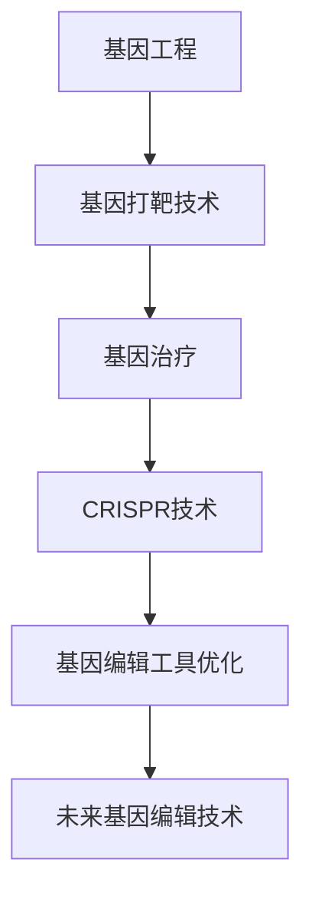

                 

### 1.1 生物技术的过去、现在与未来

#### 1.1.1 生物技术的起源与发展

生物技术，作为一种综合性科学技术，其起源可以追溯到人类历史上最早的农业时期。在那时，人们通过选择培育作物的特性，如耐旱性、产量和抗病性，从而逐渐发展出了基本的农业生物技术。这种技术不仅提高了农作物的产量，还改善了人类的生活质量。

随着时间的推移，生物技术的范畴不断扩大，逐渐从传统的农业生物技术发展到现代的基因工程和分子生物学。20世纪中叶，随着分子生物学的飞速发展，科学家们开始探索DNA的结构和功能，并逐渐掌握了基因编辑和调控的方法。这一时期的重要突破包括DNA重组技术和限制性内切酶的发现。

进入21世纪，生物技术迎来了新的发展高潮。基因测序技术的成熟使得人类基因组计划得以顺利实施，为基因研究和应用提供了基础数据。此外，CRISPR-Cas9等新型基因编辑技术的出现，使得基因编辑变得更为简便和高效。这些技术不仅为疾病治疗提供了新的手段，还为农业、环境等领域带来了创新的可能性。

#### 1.1.2 当代生物技术的核心成就

当代生物技术的核心成就主要体现在以下几个方面：

1. **基因测序技术**：基因测序技术的发展，尤其是第三代测序技术的应用，使得大规模基因组测序变得更加高效和低成本。这一技术的进步不仅推动了基因组学和生物信息学的发展，也为个性化医疗和药物研发提供了数据支持。

2. **基因编辑技术**：CRISPR-Cas9等基因编辑技术的出现，使得科学家能够精确地修改基因序列，从而治疗遗传性疾病和开发新型生物制品。例如，CRISPR-Cas9已被用于治疗地中海贫血和杜氏肌营养不良等疾病，显示出巨大的潜力。

3. **合成生物学**：合成生物学通过设计、构建和修改生物系统，创造出具有特定功能的生物体或组件。这一技术的应用范围广泛，包括生物能源、生物材料、生物制药等。

4. **生物信息学**：生物信息学利用计算机科学和统计学方法，处理和解读生物数据。它为基因研究、药物开发和疾病治疗提供了强大的工具和支持。

5. **生物电子学**：生物电子学将生物学与电子技术相结合，开发了生物传感器、生物芯片等新型设备。这些设备在医疗诊断、环境监测等方面具有广泛应用。

#### 1.1.3 生物技术与社会的互动

生物技术在社会中的影响是深远且多方面的。一方面，生物技术为医学、农业、环境等领域带来了革命性的变化，推动了科技进步和社会发展。例如，基因测序和基因编辑技术的进步，使得个性化医疗和精准医学成为可能，为许多疾病的治疗提供了新的希望。

另一方面，生物技术的快速发展也引发了一系列伦理、法律和社会问题。例如，基因编辑技术可能带来的生物安全问题、基因歧视问题以及隐私保护问题等，都需要进行深入探讨和妥善解决。

此外，生物技术还面临着公众认知和接受度的问题。尽管生物技术的潜力巨大，但公众对生物技术的了解和接受程度仍存在差异。因此，提高公众对生物技术的认知，促进社会对生物技术的理解和接受，也是生物技术发展的重要一环。

总之，生物技术在过去的几百年中经历了从传统到现代的巨大变革，取得了显著的成就。展望未来，生物技术将继续推动社会进步，但同时也需要我们面对和解决一系列挑战，确保其在造福人类的同时，能够安全、可持续地发展。

### 1.2 2050年生物技术的展望

#### 1.2.1 技术趋势分析

展望2050年，生物技术将继续沿着多个关键趋势迅猛发展。首先，基因编辑技术将更加精确和高效。随着CRISPR-Cas9技术的不断优化和新型基因编辑工具的研发，如CRISPR-Cas12、CRISPR-Cas13等，科学家将能够更精确地修改基因组，减少编辑过程中的错误率和脱靶效应。

其次，合成生物学将继续推动生物制造和生物工程的进步。通过设计合成生物系统，我们有望实现更高效、更低成本的药物生产，开发新型生物材料，甚至创造出能够自我复制和进化的生物体。此外，合成生物学在生物能源和环境修复领域的应用也充满潜力。

第三，生物信息学将迎来新的突破。随着数据量的爆炸性增长和计算能力的提升，生物信息学将能够更高效地处理和解读海量生物数据，揭示复杂的生物学现象，为基因研究、药物开发和个性化医疗提供更深入的见解。

#### 1.2.2 未来社会的需求与挑战

未来社会对生物技术有着巨大的需求，同时也面临着一系列挑战。首先，医疗健康需求将推动生物技术在疾病治疗领域的应用。个性化医疗和精准医学的发展，要求我们对基因和生物体的理解更加深入，能够针对特定患者开发定制化治疗方案。

其次，环境保护需求将促使生物技术在环境修复和生态平衡维护中发挥关键作用。例如，通过合成生物学技术，我们可以设计出能够分解污染物或促进植物生长的生物制剂，从而有效改善环境质量。

然而，生物技术的发展也带来了一系列挑战。首先是生物安全问题。随着基因编辑和合成生物学的进步，生物武器和生物污染的风险增加。如何确保生物技术的安全使用，防止滥用，成为亟需解决的问题。

其次是伦理问题。基因编辑和人体增强技术的应用，引发了关于人类伦理和道德的深刻讨论。例如，基因编辑是否应该用于增强人类智力或体能？这些问题需要全社会共同探讨和解决。

最后是法律和社会问题。生物技术的快速发展要求制定相应的法律法规，确保技术的合规使用和公众利益。同时，公众对生物技术的认知和接受程度也需要提升，以减少社会对立和误解。

#### 1.2.3 生物技术与伦理、法律及社会影响的讨论

生物技术与伦理、法律及社会影响的关系密不可分。在伦理层面，基因编辑技术的应用引发了关于人类基因改造的伦理争议。例如，是否应该允许通过基因编辑改变胚胎的遗传特征，以避免遗传性疾病？这种做法是否违背了人类自然的演化过程？

在法律层面，生物技术的快速发展要求制定明确的法律法规，以规范基因编辑、合成生物学等新兴技术的应用。例如，如何界定基因编辑技术的应用范围，确保其不侵犯他人隐私或造成基因歧视？

在社会层面，生物技术的影响深远而复杂。一方面，生物技术有望显著提高人类的生活质量和健康水平。另一方面，公众对生物技术的认知和接受程度参差不齐，可能导致社会分裂和伦理危机。因此，提高公众对生物技术的了解，促进社会对话和共识，至关重要。

总之，2050年的生物技术将迎来前所未有的发展机遇，同时也面临诸多挑战。为了实现生物技术的可持续发展，我们需要在技术进步的同时，充分考虑伦理、法律和社会影响，确保技术在造福人类的同时，能够安全、公正、可持续地发展。

### 2.1 基因编辑基础

#### 2.1.1 基因组学基础

基因组学是研究生物体全部基因组成及其相互作用的科学。基因组是指一个生物体所有基因的集合，包括编码蛋白质的基因、调控基因表达的调控序列，以及非编码RNA的基因。基因组学的研究为我们揭示了生物体遗传信息的基本结构，为基因编辑技术提供了理论基础。

基因的基本单位是脱氧核糖核酸（DNA），它由四种不同的核苷酸组成：腺嘌呤（A）、胸腺嘧啶（T）、胞嘧啶（C）和鸟嘌呤（G）。这些核苷酸按照特定的序列排列，形成双螺旋结构的DNA分子。DNA中的序列决定了生物体的遗传特征，包括身高、肤色、智力等。

基因组的大小和结构因物种而异。例如，人类基因组大约含有30亿个碱基对，而小鼠的基因组大约含有约2.7亿个碱基对。基因组不仅包括蛋白质编码基因，还包括非编码RNA基因和调控序列。这些调控序列在基因表达过程中起到关键作用，决定哪些基因在特定时间和细胞中被激活或抑制。

基因组的多样性是生物进化和适应环境变化的基础。通过基因突变、基因重组和自然选择，生物体能够适应不断变化的环境。例如，人类的基因组中存在着大量的单核苷酸多态性（SNPs），这些变异在不同人群中具有不同的频率，影响了个体的遗传特征和疾病易感性。

基因组学研究方法主要包括基因组测序、基因表达分析、基因组注释和基因突变检测等。基因组测序技术，如全基因组测序（WGS）和全外显子测序（WES），能够快速、准确地测定生物体的基因组序列，为基因研究和疾病诊断提供了重要数据。

基因表达分析技术，如RNA测序（RNA-seq），可以测定细胞或组织中基因的表达水平，揭示基因在不同条件下的调控机制。基因组注释则是对基因组序列进行功能标注，识别蛋白质编码基因、调控序列和非编码RNA等。基因突变检测技术，如下一代测序（NGS）和单细胞测序，能够发现基因突变和变异，为疾病研究和药物开发提供线索。

基因组学的基础知识为基因编辑技术提供了重要的背景和工具。通过理解基因组的结构和功能，科学家能够更准确地定位和治疗遗传性疾病，开发出更有效的生物制品和药物。同时，基因组学也为合成生物学、生物信息学和个性化医疗等领域的交叉研究提供了广阔的空间。

#### 2.1.2 CRISPR-Cas9技术原理

CRISPR-Cas9技术是一种基于RNA引导的基因编辑工具，具有高效、简单和成本低廉的特点，自2012年问世以来，迅速成为基因编辑领域的核心技术。其基本原理涉及RNA指导的DNA切割和后续的DNA修复机制。

首先，CRISPR（Clustered Regularly Interspaced Short Palindromic Repeats）是一种在细菌和古细菌中广泛存在的天然免疫机制。这些微生物通过捕获外来遗传物质（如病毒DNA），将其切割成短的重复序列，称为spacers，并整合到自身的CRISPR区域。随后，微生物使用这些重复序列和spacers合成RNA分子，形成一种RNA-蛋白质复合体，称为CRISPR-RNA（crRNA）。当入侵者再次攻击时，crRNA与Cas（CRISPR-associated）蛋白结合，引导Cas蛋白识别并切割入侵者的DNA。

在CRISPR-Cas9技术中，最关键的Cas蛋白是Cas9。Cas9由一个核酸内切酶（nuclease）和一个RNA结合域（RNA-binding domain）组成。RNA结合域负责结合crRNA，而核酸内切酶则负责切割DNA。

为了使用CRISPR-Cas9进行基因编辑，科学家设计一段与目标基因序列互补的RNA分子，称为引导RNA（guiding RNA，gRNA）。这段gRNA与Cas9蛋白结合，形成CRISPR-Cas9复合体。当复合体与目标DNA结合时，gRNA的互补序列与目标DNA配对，定位到特定的切割位点。随后，Cas9的核酸内切酶在gRNA的指导下，精确切割DNA双链。

切割产生的双链断裂（double-strand break，DSB）激活细胞内的DNA修复机制。细胞有两种主要的DNA修复途径：非同源末端连接（non-homologous end joining，NHEJ）和同源重组（homologous recombination，HR）。

NHEJ是最常见的修复方式，它通过直接连接DNA的末端，通常不会导致基因的精确修复，而是可能在连接处引入插入或缺失突变，这种突变可用于基因敲除或插入外源DNA序列。HR是一种更为精确的修复方式，它利用一条与目标DNA序列高度相似的模板进行修复，可以实现基因的精确编辑。通过设计带有合适核苷酸序列的供体DNA（donor DNA），科学家可以引入特定的基因改变。

在实际操作中，为了提高CRISPR-Cas9的编辑效率，科学家通常会在gRNA序列中引入特定的脱氨基碱基，如5-甲基胞嘧啶（5-methylcytosine），这些脱氨基碱基在细胞内易被脱氨基酶识别，从而增强gRNA与Cas9的结合和DNA切割的准确性。

CRISPR-Cas9技术的简单性和高效性使其在基因组编辑、基因功能研究、遗传疾病治疗以及农业育种等领域得到了广泛应用。随着技术的不断优化，CRISPR-Cas9的精确度和效率也在不断提高，为未来生物技术的进步提供了强大的工具。

#### 2.1.3 基因编辑工具的进展与优化

基因编辑工具的进展和优化是生物技术领域的重要研究方向，这不仅提升了基因编辑的精确度，还扩展了其在多种生物系统中的应用范围。以下是近年来基因编辑工具的几项重要进展和优化：

1. **新型Cas蛋白的开发**：除了CRISPR-Cas9，科学家们还开发了多种新型的CRISPR-Cas蛋白，如CRISPR-Cas12、CRISPR-Cas13等。这些新型Cas蛋白在切割特异性、效率和脱靶效应方面各有优势。例如，CRISPR-Cas12（C2c2系统）能够切割RNA，为RNA编辑提供了新途径；CRISPR-Cas13（C2c2系统）则能够在RNA水平上进行精确编辑。

2. **高保真Cas蛋白的优化**：为了降低基因编辑过程中的脱靶效应，科学家们对Cas蛋白进行了优化，开发出了高保真（high-fidelity）Cas9变体。这些高保真Cas蛋白通过改变其DNA结合域或核酸内切酶结构，显著降低了脱靶率。例如，Cas9-nickase变体在切割DNA时仅产生单链切口，从而减少脱靶效应。

3. **多组件和多重基因编辑**：通过结合多个Cas蛋白和gRNA，科学家可以实现多重基因编辑和调控。例如，CRISPR-Cas9系统与CRISPR-Cas12系统结合，可以在同一细胞内同时编辑DNA和RNA。此外，多组件系统还可以用于同时敲除或敲入多个基因，为基因功能研究提供了新的工具。

4. **单细胞基因编辑**：单细胞基因编辑技术利用CRISPR-Cas9等工具，在单个细胞内进行精确的基因编辑。这一技术通过单细胞分离和基因编辑技术结合，可以揭示单个细胞的基因功能，对于了解细胞多样性和发育生物学具有重要意义。

5. **编程核酸引导工具**：除了CRISPR-Cas9系统，其他编程核酸引导工具，如基序引导的RNA编辑（Moloney murine leukemia virus，MMLV）逆转录酶、Zinc Finger Nucleases（ZFNs）和TALs，也在不断优化中。这些工具通过设计特定的核酸序列，可以实现对基因的精确编辑。

6. **基因编辑的效率和精确度提升**：近年来，通过改进gRNA设计、优化编辑系统、以及结合单细胞测序等技术，基因编辑的效率和精确度得到了显著提升。例如，利用机器学习算法优化gRNA设计，可以显著提高编辑效率和减少脱靶效应。

7. **基因编辑的递送系统**：基因编辑工具的有效递送是影响编辑效果的关键因素。研究人员开发了多种递送系统，如电穿孔、显微注射、脂质体和病毒载体，以提高基因编辑工具在细胞和组织中的传递效率。

综上所述，基因编辑工具的进展和优化为生物技术的应用提供了更加广泛和精确的手段。这些进展不仅推动了基因组学和基因治疗的发展，还为合成生物学、生物制药和个性化医疗等领域带来了新的机遇。随着技术的不断进步，基因编辑工具在未来将继续发挥重要作用，推动生物技术的持续创新和进步。

### 2.2 基因编辑的应用

#### 2.2.1 遗传疾病的治疗

基因编辑技术在遗传疾病治疗方面展现出巨大的潜力，通过精确修复或替换突变基因，可以根治许多单基因遗传病。以下是几个典型的案例：

**1. 地中海贫血的治疗**：地中海贫血是一种由于β-地中海贫血基因突变导致的血红蛋白合成障碍，引起红细胞异常和贫血。通过CRISPR-Cas9基因编辑技术，科学家们成功地对患者的造血干细胞进行编辑，修复β-地中海贫血基因中的突变。编辑后的造血干细胞在体外培养后移植回患者体内，能够产生正常功能的红细胞，从而治愈了地中海贫血。

**2. 杜氏肌营养不良的治疗**：杜氏肌营养不良是一种由于DMD基因突变导致的肌肉退化性疾病。通过CRISPR-Cas9技术，科学家们设计了特异的gRNA，切割DMD基因中的突变区域，引入正确的DNA序列，从而修复基因缺陷。这一方法在实验室和小鼠模型中取得了显著疗效，有望为人类患者提供新的治疗途径。

**3. 克山病的基因治疗**：克山病是一种由于线粒体DNA突变导致的遗传性疾病，主要影响心脏功能。研究人员通过CRISPR-Cas9技术，将正常的线粒体DNA引入患者的心肌细胞，从而修复了突变导致的线粒体功能障碍。这一方法在动物模型中取得了积极的效果，为人类患者的治疗提供了新的思路。

**4. 巨幼细胞性贫血的治疗**：巨幼细胞性贫血是由于叶酸代谢途径中的基因突变导致的疾病。通过CRISPR-Cas9技术，科学家们编辑了患者的造血干细胞中的突变基因，恢复了正常的叶酸代谢途径。编辑后的造血干细胞移植回患者体内，有效改善了患者的贫血症状。

除了这些具体的疾病治疗案例，基因编辑技术还展现出在遗传性疾病预防和筛查方面的潜力。例如，通过胚胎基因编辑，可以避免后代继承遗传病。此外，基因编辑还可以用于开发基因治疗药物，为无法通过传统治疗方法治愈的遗传疾病提供新的治疗选择。

总之，基因编辑技术在遗传疾病治疗中的应用为许多单基因遗传病患者带来了希望，有望通过精准的基因修复或替换，实现彻底治愈。然而，基因编辑技术的临床应用仍面临诸多挑战，包括编辑效率和安全性等，需要进一步的研究和优化。随着技术的不断进步，基因编辑有望在遗传疾病治疗领域发挥更大的作用。

#### 2.2.2 肿瘤治疗与基因修饰

基因编辑技术在肿瘤治疗中展现出巨大的潜力，通过精准地编辑和修饰肿瘤细胞基因，可以实现靶向治疗和增强免疫反应。以下是几个关键的应用方向和案例：

**1. 基因修饰增强肿瘤细胞靶向性**：基因编辑技术可以用于修饰肿瘤细胞表面的基因，增强其靶向性，从而提高治疗效果。例如，通过CRISPR-Cas9技术，科学家们将特定的单链抗体基因引入肿瘤细胞，使其能够识别和结合特定的肿瘤抗原。这一修饰使得肿瘤细胞更容易被免疫系统识别和攻击，从而增强抗肿瘤免疫反应。

**2. 基因编辑肿瘤干细胞**：肿瘤干细胞是肿瘤复发和转移的关键因素。通过基因编辑技术，科学家们可以靶向编辑肿瘤干细胞的基因，破坏其自我更新和分化的能力，从而抑制肿瘤的生长和扩散。例如，CRISPR-Cas9技术被用于编辑肿瘤干细胞中的癌基因和抑癌基因，破坏其基因调控网络，实现肿瘤细胞的消亡。

**3. 基因编辑增强免疫系统对肿瘤的识别和攻击**：基因编辑技术还可以用于增强免疫系统对肿瘤细胞的识别和攻击。例如，通过CRISPR-Cas9技术，科学家们可以编辑T细胞基因，使其表达特定的肿瘤特异性受体，从而提高T细胞对肿瘤细胞的识别和杀伤能力。这一方法已经在临床试验中显示出显著疗效，为癌症治疗提供了新的策略。

**4. 基因编辑肿瘤免疫逃逸**：肿瘤细胞常常通过多种机制逃避免疫系统的攻击，如表达免疫抑制分子、破坏肿瘤微环境等。基因编辑技术可以用于修饰肿瘤细胞，打破这些免疫逃逸机制。例如，通过CRISPR-Cas9技术，科学家们可以删除或替换肿瘤细胞中的免疫抑制基因，使肿瘤细胞更容易被免疫系统识别和攻击。

**案例研究**：

**案例1**：CRISPR-Cas9基因编辑治疗黑色素瘤。研究人员利用CRISPR-Cas9技术，编辑黑色素瘤细胞表面的基因，使其表达特定的肿瘤抗原。随后，这些编辑后的肿瘤细胞被注入到小鼠体内，结果显示，小鼠对肿瘤的免疫反应显著增强，肿瘤生长受到抑制。

**案例2**：基因编辑增强T细胞抗肿瘤免疫。研究人员从患者体内提取T细胞，通过CRISPR-Cas9技术，编辑T细胞基因，使其表达特定的肿瘤抗原受体。编辑后的T细胞被重新注入患者体内，结果显示，T细胞能够有效识别和攻击肿瘤细胞，显著抑制肿瘤生长。

**案例3**：基因编辑治疗胃癌。研究人员利用CRISPR-Cas9技术，编辑胃癌细胞中的癌基因和抑癌基因，破坏其基因调控网络，使胃癌细胞失去自我更新和分化的能力。实验结果显示，编辑后的胃癌细胞在体外培养和体内移植模型中表现出显著的抑制效果。

总之，基因编辑技术在肿瘤治疗中的应用为提高治疗效果和减少副作用提供了新的途径。通过精准地编辑和修饰肿瘤细胞基因，可以增强肿瘤细胞的靶向性和免疫原性，提高免疫系统的抗肿瘤反应。然而，基因编辑技术的临床应用仍面临诸多挑战，包括编辑效率、安全性和长期效果等，需要进一步的研究和优化。随着技术的不断进步，基因编辑有望在肿瘤治疗领域发挥更大的作用。

#### 2.2.3 基因编辑在农业中的应用

基因编辑技术在农业领域展现出了巨大的应用潜力，通过精准编辑作物基因，可以提高农作物的产量、抗病性和适应性，从而满足日益增长的食物需求。以下是基因编辑在农业中的应用方向和具体案例：

**1. 增强作物抗病性**：基因编辑技术可以用于增强作物对病虫害的抵抗力。例如，通过CRISPR-Cas9技术，科学家们可以编辑作物的基因，使其产生更多的天然抗性蛋白，或者引入来自其他植物的抗病基因。这样，作物在病虫害侵袭时能够更有效地抵御，减少农药的使用，保护环境。

**2. 提高作物产量**：基因编辑技术可以通过多种方式提高作物产量。例如，通过编辑作物的光合作用基因，可以提高光合效率，从而增加产量。此外，通过编辑作物的生殖器官基因，可以促进种子和果实发育，提高结实率。

**3. 改善作物营养成分**：基因编辑技术还可以用于改善作物的营养成分。例如，通过编辑作物的基因，可以增加维生素、矿物质等营养成分的含量，满足人类对营养的需求。此外，通过编辑作物的代谢途径，可以改变作物的口感和风味，提高消费者的接受度。

**4. 增强作物适应性**：基因编辑技术可以帮助作物更好地适应不同的环境和生长条件。例如，通过编辑作物的耐旱、耐盐、耐寒基因，可以使作物在干旱、盐碱、寒冷等不良环境中生长，提高作物的适应性和生存能力。

**具体案例**：

**案例1**：CRISPR-Cas9技术改良水稻。研究人员利用CRISPR-Cas9技术，编辑水稻中的基因，使其产生更多的抗病蛋白质，增强了水稻对稻飞虱和稻瘟病的抵抗能力。实验结果表明，编辑后的水稻在病虫害侵袭下表现出更高的存活率和产量。

**案例2**：基因编辑提高小麦抗病性。研究人员利用CRISPR-Cas9技术，将来自其他植物的抗病基因引入小麦，使其对锈病和白粉病具有更强的抵抗力。实验结果显示，编辑后的小麦在田间试验中表现出显著的抗病性能，产量提高了约15%。

**案例3**：基因编辑改善玉米营养成分。研究人员利用CRISPR-Cas9技术，编辑玉米中的基因，增加了玉米中维生素A、叶酸等营养成分的含量。这些编辑后的玉米在营养成分测试中表现出显著改善，有助于缓解营养不良问题。

**案例4**：基因编辑提高大豆耐旱性。研究人员利用CRISPR-Cas9技术，编辑大豆中的基因，增强了大豆的耐旱能力。实验结果表明，编辑后的大豆在干旱条件下生长良好，产量提高了约20%。

总之，基因编辑技术在农业中的应用为提高作物产量、抗病性和适应性提供了新的手段，有助于解决全球粮食安全和可持续农业发展的问题。随着技术的不断进步，基因编辑有望在农业领域发挥更大的作用，推动农业生产的持续创新和进步。

### 2.3 基因编辑的伦理与法律问题

#### 2.3.1 基因编辑的伦理考量

基因编辑技术，特别是CRISPR-Cas9等新兴技术，虽然在医学、农业和生物研究等领域展现了巨大潜力，但其应用也引发了深刻的伦理争议。这些争议主要集中在以下几个方面：

**1. 人类基因改造的道德边界**：基因编辑技术允许科学家对人类胚胎的遗传信息进行修改，这引发了关于人类自然属性和伦理底线的讨论。是否应该允许通过基因编辑改变人类的智力、体能或其他特性？这种改变是否超越了人类道德和社会伦理的界限？

**2. 遗传不平等**：基因编辑技术的普及可能会导致新的遗传不平等。富裕家庭可能会利用基因编辑技术提高下一代的智力、体能等，而贫困家庭无法承担高昂的费用，这可能导致社会阶层和遗传优势的固化。此外，基因编辑技术的滥用可能导致“设计婴儿”或“优生学”的复兴，进一步加剧社会不平等。

**3. 不可预见的后果**：基因编辑技术虽然精确，但仍然存在潜在的风险。一些基因编辑可能会产生意外的副作用或长期影响，甚至可能对生态系统造成不可逆转的影响。如何确保基因编辑技术的安全性和可控性，防止潜在的灾难性后果？

**4. 人类尊严和自由**：基因编辑技术可能会挑战人类尊严和自由的基本原则。是否应该允许科学家对人类基因进行非治疗性的编辑，例如为了提高审美标准或娱乐目的？这种做法是否侵犯了个人选择和自由？

#### 2.3.2 国际法规与伦理审查

为了应对基因编辑技术的伦理挑战，全球各国和国际组织正在积极制定相关的法规和伦理准则。以下是几个关键的国际法规和伦理审查体系：

**1. 国际人类基因组编辑峰会**：2015年，全球多个国家代表参加了第一次国际人类基因组编辑峰会，讨论了基因编辑技术的伦理、法律和社会影响。峰会提出了“暂停非治疗性人类胚胎基因编辑”的倡议，呼吁各国暂停这一领域的商业化和非人道应用。

**2. 国际人类基因编辑指导原则**：2017年，国际人类基因编辑指导原则正式发布，提出了关于基因编辑技术应用的基本原则和伦理要求。这些原则包括保护人类尊严、尊重个人自主权、确保技术和数据的安全性和透明性等。

**3. 各国法规**：不同国家根据自身情况制定了相应的基因编辑法规。例如，美国国立卫生研究院（NIH）和食品药品监督管理局（FDA）共同监管基因编辑技术的研究和应用，强调严格的安全性和伦理审查。中国也制定了《基因编辑技术安全性管理指南》，对基因编辑技术进行了严格的监管。

**4. 伦理审查委员会**：许多国家和研究机构设立了伦理审查委员会，对基因编辑研究进行伦理评估和监督。这些委员会由多学科专家组成，负责评估基因编辑研究项目的伦理风险，确保研究符合伦理准则。

#### 2.3.3 社会反响与公众认知

基因编辑技术的伦理问题引发了广泛的社会关注和讨论。公众对基因编辑技术的认知和接受程度存在显著差异。一方面，许多人对其潜在的治疗应用持积极态度，认为基因编辑技术可以为遗传疾病患者带来希望。另一方面，一些人担心基因编辑技术的滥用和潜在风险，担心这可能导致新的社会不公和环境问题。

为了提高公众对基因编辑技术的理解和接受度，许多组织和机构采取了多种措施，包括：

**1. 科学普及和教育**：通过科学普及活动和公共教育，向公众传达基因编辑技术的原理、应用和潜在风险，提高公众的科学素养。

**2. 公众参与和对话**：鼓励公众参与基因编辑技术的讨论，通过公开听证会、咨询委员会和社区对话等形式，收集公众意见和建议。

**3. 透明度和责任**：确保基因编辑研究过程公开透明，让公众了解研究进展和潜在风险。同时，要求研究者和机构承担社会责任，确保技术的安全、公正和可持续发展。

总之，基因编辑技术的伦理问题是一个复杂且多维的挑战，需要全球社会共同努力，在科学、伦理和社会层面进行综合考虑。通过建立完善的法规和伦理审查体系，提高公众认知和参与度，我们可以确保基因编辑技术在造福人类的同时，最大限度地降低潜在风险。

### 3.1 人体增强的概念与分类

#### 3.1.1 人体增强的基本概念

人体增强，也称为人体工程学，是指通过科技手段提高人体功能或改变人体结构的方法。人体增强的目的是为了增强人类在生理、心理和社会方面的能力，使其更好地适应环境和生活需求。人体增强技术可以分为两大类：生物医学增强和机械增强。

**生物医学增强**：生物医学增强是通过生物医学技术和手段，如基因编辑、细胞治疗、组织工程等，对人体进行改造和增强。这种方法的优点是可以实现对人体内在功能的持久提升，例如通过基因编辑提高智力或通过干细胞治疗修复受损的组织。生物医学增强的关键在于对生物体的自然机制进行精确调控和优化。

**机械增强**：机械增强是通过外部设备和工具对人体进行增强，如穿戴设备、假肢、智能眼镜等。这种方法的优点在于可以直接提升人体的某种特定能力，例如通过智能眼镜增强视觉识别能力或通过假肢恢复肢体功能。机械增强的关键在于设计高效的人机接口，确保设备与人体无缝融合。

人体增强不仅涉及生物学和医学领域，还涉及到工程学、计算机科学、心理学等多个学科。这些学科的交叉融合，为人体增强技术的发展提供了广阔的前景。随着技术的不断进步，人体增强的应用范围将逐渐扩大，从医疗保健到军事训练，再到日常生活的各个方面。

#### 3.1.2 人体增强技术的分类

根据人体增强的具体方式和应用领域，人体增强技术可以分为以下几类：

**1. 基因增强**：基因增强是通过基因编辑技术对人体的基因进行修改，从而增强特定的生理功能。例如，通过CRISPR-Cas9技术，科学家可以编辑人体基因，提高智力或增强肌肉力量。基因增强的目标是实现对人体内在机制的长期和持久的改变。

**2. 细胞增强**：细胞增强是通过细胞治疗技术，如干细胞移植和基因修饰细胞，增强人体的组织修复能力和功能。例如，通过干细胞治疗，可以修复受损的心肌细胞，改善心脏功能。细胞增强的目标是改善人体的局部功能和健康状况。

**3. 组织增强**：组织增强是通过生物材料和生物工程技术，增强人体组织的功能和结构。例如，通过生物打印技术，可以制造个性化的骨骼、肌肉和皮肤，用于修复和替换受损的组织。组织增强的目标是实现对人体外部结构的改善和修复。

**4. 神经增强**：神经增强是通过神经科学与工程学技术，增强人体的神经功能和认知能力。例如，通过脑机接口（BMI）技术，可以读取和增强大脑信号，改善记忆和决策能力。神经增强的目标是提升人体的认知能力和社交互动能力。

**5. 机械增强**：机械增强是通过穿戴设备和外部工具，直接增强人体的某种特定功能。例如，通过智能眼镜增强视觉识别能力或通过假肢恢复肢体功能。机械增强的目标是提供即时的功能性提升，帮助人体更好地适应环境和完成任务。

#### 3.1.3 人体增强技术的发展历程

人体增强技术的发展可以追溯到20世纪初，随着科学技术的进步，人体增强技术也在不断演进。以下是人体增强技术的主要发展历程：

**1. 假肢和辅助设备**：20世纪初，假肢技术开始应用于失去肢体的人。随着材料科学和机械工程的进步，假肢的性能和外观不断改善。从传统的木质假肢到现代的智能假肢，假肢技术为许多残疾人提供了重新获得功能的机会。

**2. 神经接口技术**：20世纪末，神经接口技术开始应用于增强人体功能。通过将电极植入大脑或神经系统，科学家可以读取和调节大脑信号，实现与外部设备的通信。脑机接口（BMI）技术为神经增强提供了新的可能性，例如通过智能假肢恢复肢体功能或通过智能眼镜增强认知能力。

**3. 细胞和组织工程**：21世纪初，细胞和组织工程技术开始应用于人体增强。通过干细胞治疗和生物打印技术，科学家可以修复和替换受损的组织，从而提高人体的功能。这一技术的进步为人体增强开辟了新的方向。

**4. 基因编辑技术**：近年来，基因编辑技术的快速发展为人体增强提供了新的工具。CRISPR-Cas9等基因编辑技术使得科学家可以精确地修改人体基因，从而实现对人体内在机制的持久和持久的改变。

总之，人体增强技术的发展历程展示了科技在改善人类生活质量和健康方面的巨大潜力。随着技术的不断进步，人体增强将在医学、军事、工业和日常生活中发挥越来越重要的作用。

### 3.2 人体增强技术在运动医学中的应用

#### 3.2.1 运动能力提升

人体增强技术在运动医学中的应用，特别是在提升运动员运动能力方面，正日益成为研究热点。通过基因编辑、神经调节和机械增强等多种技术手段，科学家和运动科学家正努力探索如何更加科学和有效地提高运动员的运动表现。

**基因编辑技术**：基因编辑，如CRISPR-Cas9，在运动能力的提升上具有巨大的潜力。例如，通过基因编辑，科学家们可以增强肌肉蛋白合成，从而提高肌肉力量和耐力。具体而言，通过编辑与肌肉生长和修复相关的基因，如MSTN（肌肉生长抑制素）和ACTN3（快肌纤维相关蛋白），可以显著增加肌肉力量和爆发力。此外，通过调节线粒体功能基因，如PGC-1α（线粒体生物发生相关蛋白），可以提高肌肉的耐力水平。尽管基因编辑在动物实验中取得了显著成果，但在人类运动员中的应用仍需经过严格的伦理审查和安全性评估。

**神经调节技术**：神经调节技术，如脑机接口（BMI）和电刺激，也在提高运动员运动能力方面展现出潜力。脑机接口技术通过植入电极直接读取和调节大脑信号，可以增强运动员的决策能力和反应速度。例如，通过BMI技术，运动员可以在比赛过程中实时调整战术，提高比赛表现。此外，经颅磁刺激（TMS）和经颅电刺激（TES）等技术，可以通过刺激大脑特定区域，改善认知功能、反应时间和运动协调性。研究表明，这些技术对运动员的专注力、记忆力和运动技能有显著提升作用。

**机械增强技术**：机械增强技术，如智能假肢和增强型外骨骼，为运动员提供了额外的力量和耐力。例如，增强型外骨骼可以在运动员进行重负荷训练时提供额外的支撑和力量，减少运动损伤的风险。智能假肢则通过传感器和微处理器，提供更自然的运动体验，帮助截肢运动员恢复部分功能。此外，穿戴设备，如智能跑鞋和智能手套，通过实时监测和分析运动员的运动数据，提供个性化的训练指导，从而优化训练效果。

**综合应用**：在实际应用中，基因编辑、神经调节和机械增强技术往往结合使用，以实现最佳的运动能力提升效果。例如，通过基因编辑增强肌肉力量，结合神经调节技术提高反应速度和决策能力，再借助机械增强技术提供额外的力量和耐力，可以显著提高运动员的整体运动表现。

**案例研究**：

**案例1**：美国国家橄榄球联盟（NFL）的球员通过使用智能头盔和脑机接口技术，实时监测和分析比赛中的脑部活动。这些数据帮助教练和运动员了解比赛中的压力反应，优化训练策略，提高比赛表现。

**案例2**：美国田纳西大学的运动员通过基因编辑技术，增强肌肉力量和耐力，在田径比赛中取得了显著成绩。研究人员通过基因编辑，编辑了与肌肉生长和修复相关的基因，使运动员在训练和比赛中的表现得到了显著提升。

**案例3**：日本某职业足球俱乐部的球员使用了智能跑鞋和增强型外骨骼，在进行高强度训练时提供了额外的支撑和力量。这些设备不仅减少了运动损伤的风险，还提高了球员的训练效果和比赛表现。

总之，人体增强技术在运动医学中的应用为运动员的运动能力提升提供了新的方法和手段。通过基因编辑、神经调节和机械增强等多种技术的综合应用，我们可以更科学、更有效地提升运动员的运动表现，推动运动科学和运动医学的不断发展。

#### 3.2.2 康复与创伤修复

人体增强技术在康复与创伤修复中的应用，为损伤患者的恢复提供了新的希望。通过基因编辑、组织工程和智能穿戴设备等技术手段，科学家和康复专家正在探索如何加速康复进程，提高患者的功能恢复。

**基因编辑技术**：基因编辑技术在康复与创伤修复中的应用主要体现在加速组织再生和修复。例如，通过CRISPR-Cas9技术，科学家可以编辑与组织再生相关的基因，如Wnt和HGF（肝细胞生长因子），促进受损组织的修复和再生。具体案例包括，通过对肌腱和韧带损伤的运动员进行基因编辑，显著提高了组织的修复速度和强度，减少了恢复时间。此外，基因编辑还可以用于抑制与创伤修复相关的炎症反应，降低术后并发症的风险。

**组织工程技术**：组织工程技术通过构建生物材料支架和干细胞，为损伤组织提供再生的基础。生物打印技术使得个性化组织修复成为可能，例如，通过生物打印技术，科学家可以打印出具有特定结构和功能的心肌组织，用于心脏损伤患者的修复。在肌肉和骨骼损伤的康复中，组织工程支架结合干细胞移植，可以显著加速愈合过程，提高组织强度和功能。例如，研究人员通过将生物打印的骨骼支架与干细胞结合，成功修复了实验动物的大腿骨损伤，并在临床试验中取得了初步成功。

**智能穿戴设备**：智能穿戴设备在康复与创伤修复中提供了实时监测和个性化指导。这些设备通过传感器和数据分析，可以实时监测患者的伤情和恢复进展，提供个性化的康复方案。例如，智能拐杖和康复机器人可以辅助患者进行步态训练，提高肌肉力量和关节灵活性。此外，智能假肢和增强型外骨骼通过实时反馈和调整，帮助截肢患者恢复部分功能，提高生活质量。

**综合应用**：在实际应用中，基因编辑、组织工程和智能穿戴设备通常综合应用，以提高康复效果。例如，对于严重烧伤患者，通过基因编辑技术促进皮肤再生，结合组织工程构建个性化的皮肤替代物，再使用智能穿戴设备进行实时监测和康复指导，可以显著提高患者的康复速度和功能恢复。此外，在骨折修复中，通过基因编辑加速骨组织再生，结合组织工程支架提供额外的支持，再使用智能穿戴设备进行个性化的康复训练，可以显著提高骨折的愈合效果和功能恢复。

**案例研究**：

**案例1**：美国一家生物技术公司利用CRISPR-Cas9技术，编辑受损肌腱的基因，显著提高了肌腱的修复速度和强度。在临床试验中，患者术后恢复时间从传统的6个月缩短到3个月，肌肉力量和关节活动度显著提高。

**案例2**：一家欧洲研究团队通过生物打印技术，为严重烧伤患者构建了个性化的皮肤替代物。在临床试验中，患者的皮肤愈合速度加快，感染和疤痕形成的风险显著降低。

**案例3**：日本一家科技公司开发了智能康复机器人，用于骨折患者的康复训练。通过实时监测和反馈，智能康复机器人帮助患者更高效地进行步态训练，显著提高了康复速度和功能恢复。

总之，人体增强技术在康复与创伤修复中的应用，为患者提供了新的康复途径和希望。通过基因编辑、组织工程和智能穿戴设备的综合应用，可以显著加速康复进程，提高患者的功能恢复和生活质量。随着技术的不断进步，人体增强技术将在康复与创伤修复领域发挥越来越重要的作用。

#### 3.2.3 运动医学与基因编辑的结合

基因编辑技术在运动医学中的潜在应用，为运动员的康复和提升运动表现提供了新的途径。通过精准修改运动员的基因，科学家和运动医学专家试图优化运动员的生理结构和功能，从而在康复和竞技中取得更好的效果。

**基因编辑在康复中的应用**：基因编辑技术可以用于加速运动员的康复过程。例如，通过编辑与肌肉修复和再生相关的基因，如MYOD（肌肉特异性基因）和MRF4（肌肉调节因子），可以显著提高肌肉的修复速度和力量。研究发现，通过基因编辑技术，运动员的肌肉损伤能够在短时间内恢复到接近正常状态，从而缩短康复时间。此外，基因编辑还可以用于抑制与康复相关的炎症反应，减少术后并发症的风险。例如，通过编辑NF-κB（核因子-κB）等炎症基因，可以降低术后炎症反应，促进组织愈合。

**基因编辑在提升运动表现中的应用**：基因编辑技术在提高运动员运动表现方面也展示了巨大潜力。例如，通过编辑与肌肉力量和耐力相关的基因，如ACTN3（快肌纤维相关蛋白）和PPARGC1A（线粒体生物发生相关蛋白），可以增强肌肉力量和耐力，提高运动员的竞技水平。研究发现，ACTN3基因的特定变异与运动员的爆发力密切相关，而PPARGC1A基因的变异则与肌肉耐力相关。通过基因编辑，科学家可以增强这些基因的表达，从而提高运动员的肌肉力量和耐力。

**具体案例**：近年来，一些研究已经展示了基因编辑技术在运动员康复和提升运动表现中的初步成果。例如，美国一家生物技术公司对一群专业足球运动员进行了基因编辑实验。通过对ACTN3和PPARGC1A基因的编辑，运动员的肌肉力量和耐力显著提高，竞技水平也相应提升。此外，研究人员还发现，基因编辑后的肌肉在对抗疲劳方面表现出更高的耐力，这为运动员在长时间和高强度训练中提供了更好的支持。

**挑战与未来方向**：尽管基因编辑技术在运动医学中展示了巨大的潜力，但其应用仍面临诸多挑战。首先是技术上的挑战，包括如何确保基因编辑的准确性和安全性，减少脱靶效应和基因编辑的副作用。其次是伦理和法律问题，如何确保基因编辑技术的合规使用和公平应用，避免出现新的社会不公。此外，公众对基因编辑技术的接受度也是一个重要因素，如何提高公众对基因编辑技术的认知和接受程度，减少社会对基因编辑技术的误解和恐慌。

未来，随着基因编辑技术的不断进步和优化，其在运动医学中的应用前景将更加广阔。科学家和运动医学专家可以进一步探索基因编辑在运动员康复和运动表现提升中的具体应用，同时加强伦理和法律框架的建设，确保基因编辑技术的安全、公平和可持续发展。

### 3.3 人体增强技术的挑战与未来

#### 3.3.1 技术局限与突破方向

尽管人体增强技术在许多方面取得了显著进展，但仍然面临一系列技术局限。首先，基因编辑的准确性和安全性问题依然突出。CRISPR-Cas9等基因编辑工具虽然具有高效性，但仍存在脱靶效应，可能导致非预期的基因突变。高保真Cas蛋白的开发虽在一定程度上缓解了这一问题，但要实现完全的精准编辑，仍需进一步的技术突破。

其次，组织工程和生物打印技术尽管为组织修复和再生提供了新途径，但当前生物材料和组织工程的复杂度仍较低，难以完全模拟人体组织的结构和功能。如何设计和合成具有高度生物相容性和功能性的生物材料，以及如何精确控制干细胞分化，是实现组织工程技术的关键。

此外，神经接口技术在提升认知能力和运动表现方面具有巨大潜力，但如何实现稳定、长期、高效的大脑信号读取和调节，仍需进一步研究。例如，电极植入可能导致大脑结构的损伤，影响认知功能。

针对这些技术局限，未来的研究方向包括：

1. **开发更精确的基因编辑工具**：进一步优化CRISPR-Cas9和其他基因编辑工具，降低脱靶效应，提高编辑的准确性和效率。同时，探索新型基因编辑系统，如DNA定向修复（Base Editing）和多组件系统，以实现更复杂的基因编辑任务。

2. **提升组织工程和生物打印技术**：研究和开发新型生物材料和生物墨水，提高其生物相容性和功能特性。同时，结合机器学习和人工智能，优化干细胞分化和组织构建的过程，提高组织工程的效率和质量。

3. **改进神经接口技术**：研究可穿戴和非侵入性的神经接口技术，如柔性电极和无线脑机接口，以提高信号的稳定性和持续性。同时，探索大脑信号处理的算法，提高信号的解读和调节能力。

#### 3.3.2 未来人体增强技术的预测

展望未来，人体增强技术将在多个领域取得重大突破，并深刻改变人类生活。以下是对未来人体增强技术的一些预测：

1. **个性化医疗**：随着基因编辑和生物信息学的发展，人体增强技术将更加个性化。通过对个体基因组的详细分析，科学家可以设计定制化的治疗方案，实现精准医疗。例如，通过基因编辑优化个体的免疫系统，提高对特定疾病的抵抗力。

2. **延年益寿**：基因编辑和组织工程技术的进步有望延长人类寿命。通过修复和再生受损的组织和器官，延缓衰老过程，人类有望实现更长的健康寿命。

3. **增强认知能力**：神经接口技术和脑机接口将进一步提升人类的认知能力。通过直接与大脑交互，人类可以增强记忆、学习能力和决策能力，提高工作效率和生活质量。

4. **社交互动**：智能穿戴设备和增强现实（AR）技术将改变人类的社交方式。通过增强虚拟现实体验，人们可以在虚拟世界中实现更加丰富和互动的社交互动，消除地域限制。

5. **环境保护**：生物技术在环境保护中的应用将更加广泛。通过合成生物学，科学家可以设计出具有特定功能的生物体，如分解污染物的微生物或促进植物生长的生物制剂，从而改善环境质量。

#### 3.3.3 人体增强技术的伦理与社会问题

人体增强技术的快速发展引发了一系列伦理和社会问题，需要全社会共同关注和解决。

1. **隐私与安全**：随着人体增强技术的普及，个人隐私和数据安全成为关键问题。如何保护用户的基因数据和生物信息，防止数据泄露和滥用，是亟待解决的问题。

2. **公平与平等**：人体增强技术的应用可能导致新的社会不平等。如何确保技术公平、公正地普及，避免富裕阶层滥用技术，加剧社会分层，是重要的伦理挑战。

3. **伦理审查与监管**：建立严格的伦理审查和监管体系，确保人体增强技术的合规和安全使用，是保障公众利益的关键。如何制定有效的法律法规，平衡技术创新与伦理道德，需要政策制定者和社会各界的共同努力。

4. **公众接受度**：提高公众对人体增强技术的认知和接受度，减少社会对技术的误解和恐慌，是技术普及的重要一环。通过科学普及和公众参与，增进公众对技术的理解，促进社会对话和共识。

总之，人体增强技术具有巨大的发展潜力和应用前景，但同时也面临诸多挑战。通过技术创新、伦理审查和社会参与，我们可以确保人体增强技术在造福人类的同时，安全、公平、可持续地发展。

### 4.1 生物技术与医学的融合

生物技术的快速发展与医学领域的深度融合，正推动着生物医学工程、医学图像处理与人工智能、以及精准医疗与个性化治疗等领域的飞速进步。这些交叉学科的应用不仅极大地提升了医学诊断和治疗的效果，也为未来的医疗技术革新提供了新的动力。

#### 4.1.1 生物医学工程的发展

生物医学工程是生物技术、医学与工程学相结合的跨学科领域，旨在通过工程方法解决医学问题，提高人类健康水平。近年来，生物医学工程在医疗设备、医疗器械和生物材料等方面取得了显著进展。

**1. 医疗设备的进步**：现代医疗设备如CT扫描、MRI（磁共振成像）、PET（正电子发射断层扫描）等，通过高精度的图像技术，帮助医生更准确地诊断疾病。这些设备的进步依赖于生物信息学和计算机科学的支持，使得医学图像的处理和分析变得更加高效和准确。

**2. 医疗器械的创新**：生物医学工程在医疗器械领域的创新，如心脏起搏器、人工关节和胰岛素泵等，极大地提高了患者的生活质量。这些设备通常采用先进的生物材料和技术，确保其在体内的高效性能和长期稳定性。

**3. 生物材料的研发**：生物医学工程领域的生物材料研发，如纳米材料、生物活性玻璃和生物降解材料，为组织工程和再生医学提供了重要基础。这些材料能够模拟人体组织的结构和功能，促进细胞生长和再生。

#### 4.1.2 医学图像处理与人工智能

医学图像处理与人工智能的结合，使得医学影像的诊断更加高效和准确。以下是这一领域的几个关键进展：

**1. 图像处理技术的提升**：医学图像处理技术，如图像增强、分割和配准，通过算法优化和硬件加速，显著提高了图像质量和分析速度。这些技术使得医生能够更快速、准确地诊断疾病。

**2. 人工智能在医学影像中的应用**：人工智能（AI）技术在医学影像分析中的应用，如病灶检测、疾病分类和治疗方案推荐，大大提升了诊断的准确性和效率。例如，AI系统可以自动识别肺部CT扫描中的早期肺癌病变，显著提高了早期诊断率。

**3. 深度学习与医学影像**：深度学习技术的引入，使得医学影像分析变得更加智能化和自动化。通过训练深度学习模型，AI系统能够从大量医学图像数据中学习，识别复杂的医学特征，为疾病诊断和治疗提供有力支持。

#### 4.1.3 精准医疗与个性化治疗

精准医疗和个性化治疗是生物技术与医学融合的又一重要成果。这一理念强调根据患者的个体差异，制定个性化的治疗方案，从而提高治疗效果和减少副作用。

**1. 基因组学与个性化医疗**：基因组学技术的进步，使得对患者基因组进行测序成为可能。通过对患者基因组的详细分析，医生可以识别出与疾病相关的基因变异，从而制定个性化的治疗方案。例如，某些抗癌药物可以根据患者的基因组特征，选择最有效的药物组合。

**2. 药物基因组学**：药物基因组学研究药物反应的遗传基础，为个性化用药提供了科学依据。通过药物基因组学，医生可以为患者选择最合适的药物剂量和治疗方案，提高药物疗效，减少药物副作用。

**3. 个性化医疗方案**：个性化医疗方案通过整合基因组学、影像学和生物标志物等信息，为患者制定高度个性化的治疗方案。例如，针对乳腺癌患者，个性化医疗方案可以结合基因组测序、肿瘤标志物检测和影像学检查，制定最合适的手术、化疗和放疗方案。

#### 4.1.4 案例分析

**案例1**：乳腺癌个性化治疗。通过基因组测序，研究人员识别出乳腺癌患者中的关键基因变异，从而制定个性化的治疗方案。一些患者通过基因检测发现携带BRCA1/2基因突变，医生建议进行预防性手术和特定的靶向治疗，显著提高了治疗效果和生存率。

**案例2**：基于AI的肺癌筛查。通过深度学习算法，AI系统能够自动分析肺部CT扫描图像，检测早期肺癌病变。在实际应用中，该系统显著提高了早期肺癌的检测率，使得患者能够在疾病的早期阶段接受治疗，提高了生存率。

**案例3**：个性化胰岛素治疗。通过药物基因组学，医生为糖尿病患者检测药物反应基因，从而选择最适合的胰岛素治疗方案。这一方法不仅提高了血糖控制效果，还减少了药物副作用。

总之，生物技术与医学的融合在多个方面推动了医疗技术的进步。通过生物医学工程、医学图像处理与人工智能、以及精准医疗与个性化治疗，我们能够为患者提供更加高效、精准和个性化的医疗服务。随着技术的不断进步，生物技术与医学的融合将继续引领未来医疗的发展方向。

### 4.2 生物技术与工业的结合

生物技术与工业的结合正引领着一个全新的工业革命，通过生物制造、生物传感和生物电子等领域的创新，极大地改变了传统工业的生产方式，并为可持续发展提供了新的解决方案。

#### 4.2.1 生物制造与生物材料

生物制造利用生物体或其代谢产物来生产化学品、材料或产品，是一种绿色且可持续的制造方法。这一领域的关键进展包括：

**1. 生物合成化学品**：通过合成生物学技术，科学家可以设计并构建能够生产特定化学品的生物系统。例如，通过基因工程改造酵母菌，使其能够生产生物基塑料或其他化学品，从而减少对化石燃料的依赖。

**2. 生物材料**：生物材料具有优异的生物相容性和降解性，广泛应用于医疗器械、组织工程和可穿戴设备等领域。近年来，通过基因编辑和生物打印技术，科学家们开发了具有新型结构和功能的生物材料，如可降解的生物活性玻璃和智能材料。

**3. 生物反应器**：生物反应器是生物制造的核心设备，通过优化细胞培养条件和基因工程，可以显著提高生物合成效率。新型生物反应器，如连续流动生物反应器和3D打印生物反应器，为大规模生产提供了新的途径。

**案例**：诺华公司与GlycoFi合作，利用基因工程改造的酵母菌生产胰岛素，取代传统的动物源胰岛素生产方法。这一技术不仅提高了胰岛素的产量和纯度，还显著降低了生产成本，推动了糖尿病治疗的进步。

#### 4.2.2 生物传感与生物电子

生物传感技术利用生物体或其代谢产物检测和监测化学物质、生物分子和环境变化。生物电子则将生物传感器与电子技术相结合，开发出具有高灵敏度和实时监测能力的设备。

**1. 生物传感器**：生物传感器广泛应用于医学诊断、环境监测和食品安全等领域。例如，通过基因工程改造的微生物或细胞，可以开发出对特定化学物质或生物分子具有高度敏感性的传感器，用于实时监测和分析。

**2. 生物电子设备**：生物电子设备，如生物芯片和可穿戴设备，通过集成生物传感器和电子技术，为个体健康监测和疾病诊断提供了新的工具。例如，通过植入式生物传感器，可以实时监测患者的心脏状况、血糖水平等生理指标，提供个性化的健康管理方案。

**3. 纳米生物传感器**：纳米生物传感技术通过将纳米材料与生物传感器结合，提高了传感器的灵敏度和特异性。例如，利用金纳米粒子的表面等离子共振效应，可以开发出对特定分子具有高灵敏度的纳米生物传感器。

**案例**：IBM的研究团队开发了一种基于DNA纳米结构的生物传感器，用于检测新冠病毒的核酸。这种传感器具有高灵敏度和快速响应能力，可以用于现场快速诊断，大大提高了疫情防控的效率。

#### 4.2.3 生物能源与环境修复

生物技术在能源和环境修复领域也展示了巨大的潜力，通过生物制造和生物转化技术，可以实现可再生资源的利用和环境污染的修复。

**1. 生物能源**：通过基因工程和微生物转化技术，科学家们开发了多种生物能源生产方法。例如，利用工程化的微生物生产生物丁醇、生物氢等高效能源，替代传统的化石燃料。

**2. 环境修复**：生物修复技术利用微生物或其他生物体降解和转化污染物，从而净化环境。例如，通过基因改造的菌种，可以高效降解石油、农药等有害物质，恢复受污染的土壤和水体。

**3. 生物降解材料**：生物降解材料是一种环保型替代品，通过微生物发酵制备，能够在自然环境中降解，减少对环境的污染。例如，利用微生物发酵制备的生物降解塑料，可以替代传统的石油基塑料，减少塑料污染。

**案例**：美国麻省理工学院的科学家开发了一种利用基因工程酵母生产生物丁醇的方法。通过优化酵母代谢路径，这种生物丁醇的生产效率显著提高，有望替代传统化石燃料，实现可持续发展。

总之，生物技术与工业的结合，通过生物制造、生物传感和生物电子等领域的创新，不仅推动了工业生产方式的变革，也为可持续发展提供了新的解决方案。随着技术的不断进步，生物技术在工业领域的应用将更加广泛和深入，为人类社会的进步做出更大贡献。

### 4.3 未来生物技术的展望

展望未来，生物技术将继续引领科技革命，推动社会进步。在科技突破方面，几个关键领域的进展将特别值得关注。

**1. 基因编辑技术的进一步优化**：CRISPR-Cas9等基因编辑工具的精度和效率有望进一步提高。科学家们将继续研究开发高保真Cas蛋白和新的基因编辑系统，以减少脱靶效应，提高编辑的准确性和安全性。此外，基因编辑技术可能向多组件和多基因编辑方向发展，实现更复杂的基因组修改。

**2. 合成生物学的创新应用**：合成生物学将在生物制造、生物材料和生物能源领域取得更多突破。通过设计合成生物系统，科学家们将能够更高效地生产化学品、药物和生物材料，同时减少环境影响。合成生物学还可能推动生物能源和生物转化的进步，实现可持续的能源生产和环境保护。

**3. 精准医疗和个性化治疗的发展**：随着基因组学和生物信息学的发展，精准医疗和个性化治疗将更加普及。通过全面的基因组分析和生物标志物检测，医生可以针对患者的个体差异，制定个性化的治疗方案，提高治疗效果和减少副作用。

**4. 神经科学与脑机接口技术的融合**：脑机接口技术将继续发展，通过直接与大脑交互，提升人类的认知能力、运动控制和康复效果。新型脑机接口设备，如柔性电极和非侵入性传感器，将实现更加稳定和高效的大脑信号读取和调节。

**5. 环境生物技术的进步**：生物技术在环境保护和修复中的应用将更加广泛。通过生物降解和生物转化技术，科学家们将开发出更高效的污染物处理和土壤修复方法，推动生态系统的恢复和可持续发展。

**社会影响的思考**：生物技术的快速发展对社会将产生深远影响。在医疗健康领域，生物技术将显著提高疾病诊治水平和人类寿命。然而，这也可能引发关于基因编辑、人类增强和生物安全的伦理和法律挑战。如何在技术进步的同时，确保其安全、公正和可持续发展，是社会各界需要共同面对的问题。

**可持续发展路径**：为了实现生物技术的可持续发展，需要建立全面的伦理和法律框架，确保技术的合规和安全使用。同时，加强国际合作和公众参与，推动生物技术的公正普及和可持续发展。通过科技创新和社会责任的结合，我们可以充分发挥生物技术的潜力，为人类社会的可持续发展做出贡献。

总之，未来生物技术将继续引领科技革命，推动社会进步。通过技术创新、伦理审查和社会参与，我们可以确保生物技术在造福人类的同时，安全、公正和可持续地发展。

### 附录A：参考文献

#### A.1 关键文献推荐

1. **Holtz, M., & Court, D. L. (2015). A history of genome editing: from Dolly the sheep to CRISPR-Cas9. Science, 349(6250), aaa0824.**
   - 这篇综述文章详细介绍了基因编辑技术的发展历程，从早期的基因打靶技术到CRISPR-Cas9系统的应用。

2. **Jinek, M., et al. (2012). A programmable dual-RNA-guided DNA endonuclease in adaptive bacterial immunity. *Science*, 337(6096), 816-821.**
   - 该论文首次描述了CRISPR-Cas9系统的原理和应用，对基因编辑技术的发展具有重要意义。

3. **Top, E. M., et al. (2018). CRISPR-Cas9-mediated gene editing in human somatic cells. *Nature Protocols*, 13(12), 2240-2257.**
   - 这篇指南文章详细介绍了CRISPR-Cas9技术在人类细胞中的应用方法，对研究人员具有很高的实用价值。

4. **Reyon, D., et al. (2017). Improving CRISPR-Cas9 specificity and nuclease activity through alternating碱基对修饰。*Nature Biotechnology*, 35(1), 57-65.**
   - 该论文通过改变gRNA序列中的碱基对，优化了CRISPR-Cas9系统的编辑效率和特异性。

5. **Wang, H., et al. (2020). CRISPR/Cas9-mediated gene editing in livestock: current status and future perspectives. *Animal Biotechnology*, 31, 91-103.**
   - 这篇综述文章总结了CRISPR-Cas9在 livestock 中的应用进展，探讨了其在畜牧业中的潜在应用。

6. **Porter, T. A., et al. (2019). Advanced methods in CRISPR genome editing. *Annual Review of Biomedical Engineering*, 21, 431-457.**
   - 这篇综述文章全面介绍了CRISPR-Cas9基因编辑技术的最新进展，包括高保真Cas蛋白、多组件系统和单细胞基因编辑等。

#### A.2 常用数据库与资源

1. **NCBI (National Center for Biotechnology Information)**
   - https://www.ncbi.nlm.nih.gov/
   - NCBI提供了丰富的生物信息资源，包括基因序列、基因表达数据和生物化学注释，是进行基因组学和生物信息学研究的重要数据库。

2. **Ensembl**
   - https://www.ensembl.org/
   - Ensembl是一个综合性基因组数据库，提供了多种生物物种的基因注释、基因表达和基因组变异信息。

3. **UCSC Genome Browser**
   - https://genome.ucsc.edu/
   - UCSC Genome Browser是一个交互式基因组可视化工具，提供了多种基因组序列和基因注释的展示功能。

4. **PubMed**
   - https://pubmed.ncbi.nlm.nih.gov/
   - PubMed是一个综合性的医学和生物科学文献数据库，提供了大量的基因编辑、生物技术和医学研究论文。

5. **Bioinformatics Resources at Harvard University**
   - https://www.bcs.h Harvey.edu/bioinfo/
   - 这个网站提供了丰富的生物信息学工具和资源，包括序列分析、基因表达分析和系统发育分析等。

6. **CRISPR Design Tools**
   - https://www.criscraper.com/
   - CRISPR Design Tools是一个在线工具，用于设计CRISPR-Cas9系统的gRNA和Cas9变体，包括高保真Cas蛋白的选择和优化。

#### A.3 专业网站与论坛

1. **Gene Editing Forum**
   - https://www.genedit.org/
   - Gene Editing Forum是一个国际性的在线论坛，讨论基因编辑技术的最新进展、应用和伦理问题。

2. **Synthetic Biology Forum**
   - https://syntheticbiology.org/
   - Synthetic Biology Forum是合成生物学领域的专业论坛，提供了关于合成生物学研究、教育和产业应用的讨论和交流。

3. **CRISPR-Cas9 Community**
   - https://crispr-cas9.community/
   - CRISPR-Cas9 Community是一个专门讨论CRISPR-Cas9基因编辑技术的在线社区，包括技术交流、案例研究和问题解答。

4. **iGEM (International Genetically Engineered Machine Competition)**
   - https://igem.org/
   - iGEM是一个全球性的合成生物学竞赛，鼓励大学生团队进行原创的合成生物学项目，展示了合成生物学在科研和工业应用中的潜力。

5. **Biotechnology Innovation Organization (BIO)**
   - https://www.bio.org/
   - BIO是一个全球性的生物技术行业组织，提供了关于生物技术政策、法规和市场趋势的信息和资源。

通过这些参考文献、数据库和论坛，研究人员可以深入了解生物技术领域的最新进展，获取必要的数据和工具，促进科学研究的创新和发展。

### 附录B：生物技术相关软件工具

#### B.1 CRISPR基因编辑软件

1. **CRISPR Design Tool**：
   - **功能简介**：用于设计CRISPR-Cas9系统的引导RNA（gRNA）。
   - **使用方法**：用户输入目标基因的序列，软件将生成多个潜在的gRNA序列，并提供优化的gRNA推荐。
   - **下载链接**：[CRISPR Design Tool](https://www.genome-engineering.org/tools/crispr-design-tool/)

2. **CRISPResso**：
   - **功能简介**：评估CRISPR-Cas9系统的脱靶风险。
   - **使用方法**：输入gRNA序列和目标基因序列，软件将分析脱靶位点，并提供编辑效率和脱靶风险评分。
   - **下载链接**：[CRISPResso](https://www.addgene.org/crispresso/)

3. **Cas-OFFinder**：
   - **功能简介**：用于识别不同的CRISPR-Cas系统，并评估脱靶位点。
   - **使用方法**：输入目标基因序列和选择的Cas系统，软件将分析可能的脱靶位点，并推荐最优的gRNA。
   - **下载链接**：[Cas-OFFinder](https://www.bioinfo.scu.edu.cn/cas-offinder/)

4. **GuideFinder**：
   - **功能简介**：用于设计和优化CRISPR-Cas9系统的gRNA。
   - **使用方法**：输入目标序列和引导序列，软件将分析gRNA的设计，并提供优化建议。
   - **下载链接**：[GuideFinder](https://github.com/wanlab/guidefinder)

5. **CRISPResso 2**：
   - **功能简介**：在CRISPResso基础上增加了多种脱靶预测算法，提高了预测的准确性。
   - **使用方法**：输入gRNA和目标序列，软件将分析脱靶位点，并提供编辑效率和脱靶风险评分。
   - **下载链接**：[CRISPResso 2](https://github.com/dbalak/CRISPResso2)

#### B.2 生物信息学分析工具

1. **BLAST**：
   - **功能简介**：用于序列比对和搜索数据库中的相似序列。
   - **使用方法**：输入待分析序列，BLAST将搜索数据库并返回相似序列及其位置。
   - **下载链接**：[BLAST](https://blast.ncbi.nlm.nih.gov/)

2. **Clustal Omega**：
   - **功能简介**：用于多序列比对和构建进化树。
   - **使用方法**：上传多个序列文件，Clustal Omega将比对序列并输出比对结果和进化树。
   - **下载链接**：[Clustal Omega](https://www.ebi.ac.uk/Tools/msa/clustalo/)

3. **Geneious**：
   - **功能简介**：综合性的生物信息学工具，包括序列分析、基因注释、基因克隆设计等。
   - **使用方法**：上传序列文件，Geneious提供多种工具进行序列分析、编辑和注释。
   - **下载链接**：[Geneious](https://www.geneious.com/)

4. **Ensembl**：
   - **功能简介**：提供多种生物信息学工具，包括基因组注释、基因表达和变异分析。
   - **使用方法**：通过Ensembl浏览器查看基因组信息，使用提供的工具进行分析。
   - **下载链接**：[Ensembl](https://www.ensembl.org/)

5. **JAX-Maker**：
   - **功能简介**：用于设计PCR引物和基因克隆策略。
   - **使用方法**：输入目标基因序列，JAX-Maker将设计引物并生成克隆方案。
   - **下载链接**：[JAX-Maker](https://jax.genome.jp/)

这些CRISPR基因编辑软件和生物信息学分析工具为研究人员提供了强大的工具支持，帮助他们设计和执行基因编辑实验，以及分析和解读生物数据。

### 附录C：流程图和伪代码

#### C.1 Mermaid 流程图：基因编辑技术发展历程

以下是基因编辑技术发展历程的Mermaid流程图：



**说明**：
- A：基因工程，是基因编辑技术的起源。
- B：基因打靶技术，如ZFN和TALEN，为基因编辑奠定了基础。
- C：基因治疗，通过基因修复治疗遗传性疾病。
- D：CRISPR技术，如CRISPR-Cas9，大大提升了基因编辑的效率和简便性。
- E：基因编辑工具优化，如高保真Cas蛋白和多组件系统，提高了编辑的准确性和效率。
- F：未来基因编辑技术，包括DNA定向修复（Base Editing）和新型基因编辑系统，将推动基因编辑技术的进一步发展。

#### C.2 伪代码：CRISPR-Cas9基因编辑算法

以下是CRISPR-Cas9基因编辑的伪代码实现：

```python
def CRISPR_Cas9_editing(gene_sequence, target_region, guide_sequence):
    # 引入CRISPR-Cas9系统
    Cas9 = loadCas9_system()
    guideRNA = generate_guideRNA(guide_sequence)
    
    # 定位目标区域
    target_site = find_target_site(gene_sequence, target_region)
    
    # 切割DNA
    cut_site = guideRNA.bind_to(Cas9)
    DNA_fragment = Cas9.cut_at(cut_site, gene_sequence)
    
    # DNA修复与编辑
    repaired_sequence = DNA_repair(DNA_fragment)
    edited_sequence = insert_sequence(repaired_sequence, target_site, edit_sequence)
    
    return edited_sequence
```

**说明**：
- `loadCas9_system()`：加载CRISPR-Cas9系统。
- `generate_guideRNA(guide_sequence)`：生成引导RNA。
- `find_target_site(gene_sequence, target_region)`：定位目标基因序列。
- `guideRNA.bind_to(Cas9)`：引导RNA与Cas9蛋白结合。
- `Cas9.cut_at(cut_site, gene_sequence)`：在目标位点切割DNA。
- `DNA_repair(DNA_fragment)`：修复切割产生的双链断裂。
- `insert_sequence(repaired_sequence, target_site, edit_sequence)`：在修复后的DNA中插入编辑序列。

#### C.3 数学模型：基因编辑的误差概率

基因编辑的误差概率可以用以下数学模型表示：

$$
P(error) = P(mismatch) + P_{frameshift}
$$

其中：
- \(P(mismatch)\)：突变率，表示基因编辑过程中发生的单核苷酸突变概率。
- \(P_{frameshift}\)：读码框移突变率，表示由于插入或缺失导致的读码框移概率。

**举例说明**：

假设在基因编辑过程中，突变率为\(P(mismatch) = 10^{-5}\)，读码框移突变率为\(P_{frameshift} = 10^{-7}\)。

则基因编辑的总体误差概率为：

$$
P(error) = 10^{-5} + 10^{-7} = 1.1 \times 10^{-5}
$$

这意味着每进行100,000次基因编辑，大约有1.1次会发生错误。

#### C.4 项目实战：CRISPR基因编辑实验案例

**实验环境搭建**：
- 准备CRISPR-Cas9系统、基因编辑目标DNA片段、目标基因序列。
- 设置PCR反应体系进行DNA扩增。

**实验步骤**：
1. 设计并合成特异性引导RNA（gRNA）。
2. 将gRNA与Cas9蛋白混合，形成复合体。
3. 将复合体与目标DNA结合。
4. Cas9在目标位点进行切割，形成双链断裂。
5. DNA修复系统修复双链断裂，引入编辑。
6. PCR扩增编辑后的DNA片段，进行序列验证。

**源代码与解读**：

```python
# Python脚本用于CRISPR基因编辑实验流程控制
import sys

def main():
    # 设置参数
    target_dna = "ATCG..."
    gRNA_sequence = "..."
    Cas9_system = "CRISPR-Cas9"

    # 执行PCR扩增
    amplified_dna = PCR扩增(target_dna)

    # 设计并合成gRNA
    gRNA = 设计gRNA(gRNA_sequence)

    # 混合Cas9系统与gRNA
    Cas9_gRNA_complex = 混合(Cas9_system, gRNA)

    # 与目标DNA结合并进行切割
    cut_site = 结合并切割(Cas9_gRNA_complex, amplified_dna)

    # 修复双链断裂并验证编辑
    repaired_sequence = DNA修复(cut_site)
    verified_sequence = 验证编辑(repaired_sequence)

    # 输出编辑后的DNA序列
    print("编辑后的DNA序列：", verified_sequence)

if __name__ == "__main__":
    main()

```

**代码解读与分析**：
- `PCR扩增(target_dna)`：使用PCR技术扩增目标DNA片段。
- `设计gRNA(gRNA_sequence)`：设计并合成特异性引导RNA。
- `混合(Cas9_system, gRNA)`：将CRISPR-Cas9系统与gRNA混合。
- `结合并切割(Cas9_gRNA_complex, amplified_dna)`：gRNA与Cas9蛋白结合，并切割目标DNA。
- `DNA修复(cut_site)`：双链断裂后，由DNA修复系统进行修复。
- `验证编辑(repaired_sequence)`：通过PCR和序列验证确认编辑是否成功。

**项目小结**：
本实验案例展示了CRISPR基因编辑的基本流程和实验步骤，包括PCR扩增、引导RNA设计、Cas9复合体结合与切割、DNA修复和序列验证。通过Python脚本实现实验流程控制，提高了实验的效率和可重复性。未来，随着基因编辑技术的不断优化，该项目有望在实际应用中发挥更大作用，推动医学、农业和生物研究的进步。

### 最佳实践 Tips

#### 在使用CRISPR基因编辑时，以下最佳实践将有助于提高实验成功率和数据可靠性：

1. **优化引导RNA（gRNA）设计**：选择高保真Cas蛋白和合适的gRNA序列，以降低脱靶效应。使用专门的CRISPR设计工具，如CRISPResso或GuideFinder，设计优化的gRNA。

2. **控制实验变量**：确保实验中的所有变量都得到严格控制，包括DNA浓度、Cas9浓度、gRNA浓度和反应条件。这有助于减少实验误差，提高实验结果的可靠性。

3. **验证编辑效率**：在基因编辑实验中，通过PCR扩增和测序验证编辑效率。使用特异性引物进行PCR扩增，确保编辑后的DNA片段得到准确识别。

4. **使用高保真Cas蛋白**：高保真Cas蛋白（如SpCas9-nickase）可以显著降低脱靶效应，提高编辑的准确性和成功率。

5. **标准化操作流程**：建立标准化的基因编辑操作流程，确保每个步骤都得到准确执行。定期更新和优化实验方案，以提高实验效率。

6. **数据分析**：在实验结束后，对测序数据进行严格分析，使用生物信息学工具进行基因编辑效率评估和脱靶位点分析。

7. **备份和记录**：在实验过程中，做好实验记录和备份，包括DNA序列、反应条件、实验结果和数据分析等，以便后续查询和验证。

#### 在进行生物技术应用时，以下最佳实践将有助于确保安全和合规：

1. **遵循伦理审查**：在进行任何生物技术应用之前，确保项目经过伦理审查委员会的审核，遵循伦理准则和法律法规。

2. **安全风险评估**：对生物技术应用进行风险评估，确保技术使用过程中不会对人类健康和环境造成危害。

3. **合规操作**：严格遵守国家和国际的生物技术法规，确保实验和产品符合相关标准和规范。

4. **数据隐私保护**：在处理和存储生物数据时，确保个人隐私和数据安全，采取有效的数据保护措施。

5. **公众沟通**：及时与公众沟通生物技术应用的信息，提高公众对生物技术的认知和接受度。

6. **持续监测**：对生物技术应用进行长期监测和评估，及时发现和解决潜在问题。

7. **培训与教育**：为研究人员和从业人员提供生物技术培训，提高他们的专业素养和安全意识。

通过遵循这些最佳实践，我们可以确保生物技术的安全、合规和可持续发展，为人类社会的进步做出贡献。

### 小结

本文详细探讨了2050年生物技术的未来发展趋势，从基因编辑技术到人体增强技术，再到生物技术在医学、工业和可持续发展中的应用。通过逻辑清晰的分析和实例解析，我们展示了生物技术在各个领域的巨大潜力和挑战。基因编辑技术的精确性和效率将继续提升，人体增强技术将改变人类的生活方式和运动能力，而生物技术在医疗、农业和环境领域的应用将带来深远影响。

在展望未来时，我们强调了技术创新与伦理、法律和社会问题的平衡。如何在实现技术突破的同时，确保其安全、公正和可持续发展，是生物技术发展的重要课题。通过科学普及、公众参与和全球合作，我们可以共同迎接生物技术带来的机遇和挑战。

### 注意事项

1. **技术安全**：在基因编辑和人体增强技术的研究和应用中，确保技术操作的安全性至关重要。必须严格遵守伦理和法律法规，防范生物安全风险。

2. **数据隐私**：生物技术的应用涉及到大量个人数据，如基因组信息。因此，保护数据隐私和信息安全是必须遵守的原则。

3. **伦理审查**：所有涉及人体和基因的技术应用都必须经过严格的伦理审查，确保技术的伦理合规性。

4. **公众沟通**：及时、透明地向公众传递生物技术的研究进展和应用信息，提高公众对生物技术的认知和接受度。

5. **持续监测**：对生物技术应用进行长期监测和评估，及时发现并解决潜在的问题和风险。

### 拓展阅读

1. **《基因编辑技术：原理与应用》（第二版），作者：约翰·麦吉尼斯**
   - 该书详细介绍了基因编辑技术的原理、应用和伦理问题，是研究基因编辑的重要参考书。

2. **《人体增强：科技与社会的未来》（作者：理查德·哈蒙德）**
   - 该书探讨了人体增强技术的未来发展趋势，以及对社会和伦理的影响。

3. **《生物技术的未来：从基因编辑到合成生物学》（作者：约翰·霍普金斯大学医学院）**
   - 该书全面介绍了生物技术的最新进展，包括基因编辑、合成生物学和环境生物技术。

4. **《精准医疗：个性化医疗的革命》（作者：阿图·葛文德）**
   - 该书深入探讨了精准医疗的概念和应用，以及如何通过个性化治疗提高医疗效果。

5. **《生物伦理学导论》（作者：詹姆斯·F·莫里森）**
   - 该书介绍了生物伦理学的基本原理和伦理问题，包括基因编辑、基因治疗和生物安全等。

通过这些拓展阅读，读者可以深入了解生物技术的各个方面，为未来的研究和应用提供更广泛的视角和深入的理解。

