                 

### 概述

《未来的脑科学：2050年的意识上传与记忆编辑》这本书旨在探讨脑科学在未来的发展方向，特别是意识上传与记忆编辑这两个关键领域。随着科技的迅猛发展，脑科学正逐渐从理论走向实践，成为影响人类生活的关键技术之一。2050年，随着人工智能、神经科学和计算机科学的深度融合，意识上传与记忆编辑技术有望实现重大突破，为人类带来前所未有的改变。

**关键词：** 脑科学、意识上传、记忆编辑、人工智能、神经科学、计算机科学、未来展望。

**摘要：** 本书分为四个部分，首先介绍2050年脑科学的发展趋势，探讨意识上传与记忆编辑的概念与前景；其次分析意识上传与记忆编辑的技术基础，包括大脑结构与功能、神经科学与认知科学的基本原理、神经信号处理技术等；接着详细阐述意识上传与记忆编辑的技术实现方法与策略，以及相关实验研究；最后讨论意识上传与记忆编辑在医疗、教育、军事等领域的应用，并探讨其科技伦理与社会责任。本书旨在为读者提供一个全面、深入的脑科学未来展望。

----------------------------------------------------------------

### 2050年脑科学的发展趋势

随着科技的发展，2050年的脑科学将进入一个全新的时代。这一时期，脑科学与人工智能（AI）、神经科学、认知科学、计算机科学等领域的深度融合将带来前所未有的技术突破。以下是2050年脑科学发展的几个关键趋势：

#### 1. 脑科学与人工智能的融合

**核心概念与联系：**

- **脑科学**：研究大脑的结构和功能，揭示人类意识和思维的奥秘。
- **人工智能**：通过模拟人类智能行为，实现智能机器的自主学习和决策。

**Mermaid流程图：**
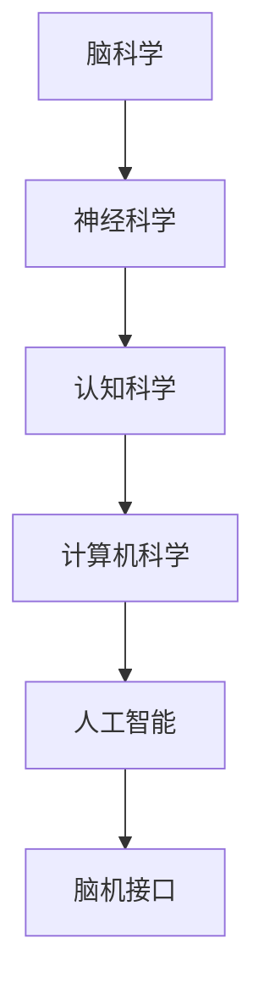

- **融合过程**：通过脑机接口（Brain-Computer Interface, BCI）技术，将大脑信号转换为计算机指令，实现人脑与计算机的直接交互。

**核心算法原理讲解：**

- **BCI技术原理：**
  - **脑电图（EEG）**：通过记录大脑的电活动，实现思维意图的检测和转换。
  - **功能性磁共振成像（fMRI）**：通过探测大脑活动区域，实现大脑功能的可视化。

**伪代码示例：**
```python
def brain_to_computer(interface_data):
    # 采集大脑信号
    EEG_data = collect_EEG()
    fMRI_data = collect_fMRI()
    
    # 特征提取
    features = extract_features(EEG_data, fMRI_data)
    
    # 应用机器学习模型进行意图识别
    command = machine_learning.predict(features)
    
    return command
```

#### 2. 意识上传与记忆编辑的概念与前景

**核心概念与联系：**

- **意识上传**：将人类意识活动转化为数字信息进行存储和传输。
- **记忆编辑**：通过技术手段修改、增强或消除记忆内容。

**Mermaid流程图：**
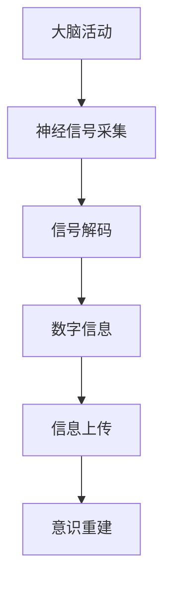

- **前景**：意识上传与记忆编辑技术有望在医疗、教育、军事等领域发挥重要作用。

**核心算法原理讲解：**

- **意识解码**：通过深度学习模型，从神经信号中提取意识特征。
- **记忆编辑**：通过基因编辑、电刺激等技术，对记忆内容进行修改。

**伪代码示例：**
```python
def decode_brain_activity(EEG_data):
    # 特征提取
    features = extract_features(EEG_data)
    
    # 应用深度学习模型进行解码
    decoded_brain_activity = neural_network.decode(features)
    
    return decoded_brain_activity

def edit_memory(memory_data):
    # 应用记忆编辑算法
    edited_memory = memory_editing.edit(memory_data)
    
    return edited_memory
```

#### 3. 人类意识的研究进展与挑战

**核心概念与联系：**

- **研究进展**：脑成像技术、神经信号处理技术、基因编辑技术等的发展，为人类意识研究提供了新的手段。
- **挑战**：理解人类意识的本质、实现精确的意识上传与记忆编辑。

**Mermaid流程图：**
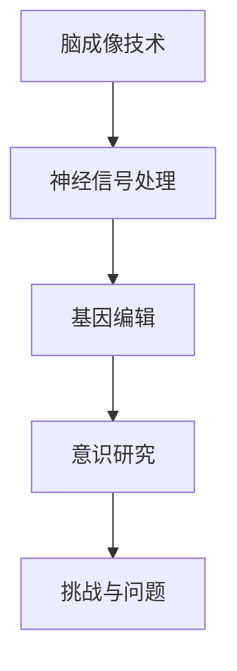

- **挑战**：技术精度、伦理问题、安全性等。

**核心算法原理讲解：**

- **技术精度**：提高解码和编辑的准确性，减少误差。
- **伦理问题**：确保技术应用的合法性和道德性。

**伪代码示例：**
```python
def improve_decoding_accuracy(EEG_data):
    # 优化深度学习模型
    improved_model = neural_network.train(EEG_data)
    
    # 应用优化后的模型进行解码
    decoded_brain_activity = improved_model.decode(EEG_data)
    
    return decoded_brain_activity
```

### 总结

2050年的脑科学将在人工智能、神经科学、认知科学和计算机科学的共同推动下，实现意识上传与记忆编辑的重大突破。通过脑机接口技术，人类将能够直接与计算机进行交互；而意识上传与记忆编辑技术则将为医疗、教育、军事等领域带来革命性的变化。然而，这一过程也将面临诸多挑战，需要我们在技术精度、伦理问题、安全性等方面不断探索和解决。

----------------------------------------------------------------

### 意识上传与记忆编辑的技术基础

意识上传与记忆编辑作为脑科学的前沿领域，其实现依赖于一系列关键技术。这些技术涵盖了大脑结构与功能的研究、神经科学与认知科学的基本原理，以及神经信号处理技术。以下将详细探讨这些技术基础。

#### 2.1 大脑结构与功能

**核心概念与联系：**

- **大脑结构**：大脑是意识与记忆的物质基础，其结构复杂，包括灰质、白质、脑皮层、海马体等多个重要部分。
- **大脑功能**：大脑负责感知、运动、认知等基本功能，通过神经元的电信号传递实现信息处理。

**Mermaid流程图：**
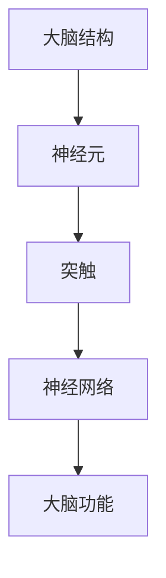

**核心算法原理讲解：**

- **神经元工作原理**：神经元通过电信号传递信息，突触是神经元之间的连接点，负责信号的传递和调制。

**伪代码示例：**
```python
class Neuron:
    def __init__(self):
        self.weight = 1.0
        self.threshold = 0.5
    
    def fire(self, input_signal):
        if input_signal > self.threshold:
            return True
        else:
            return False

class Synapse:
    def __init__(self, weight):
        self.weight = weight
    
    def pass_signal(self, input_signal):
        return input_signal * self.weight

neuron = Neuron()
synapse = Synapse(0.5)
output_signal = synapse.pass_signal(2)
print(output_signal)  # 输出：1.0
```

#### 2.2 神经科学与认知科学的基本原理

**核心概念与联系：**

- **神经科学**：研究神经系统的结构、功能、发育和疾病等。
- **认知科学**：研究人类认知过程，包括记忆、注意力、决策等。

**Mermaid流程图：**
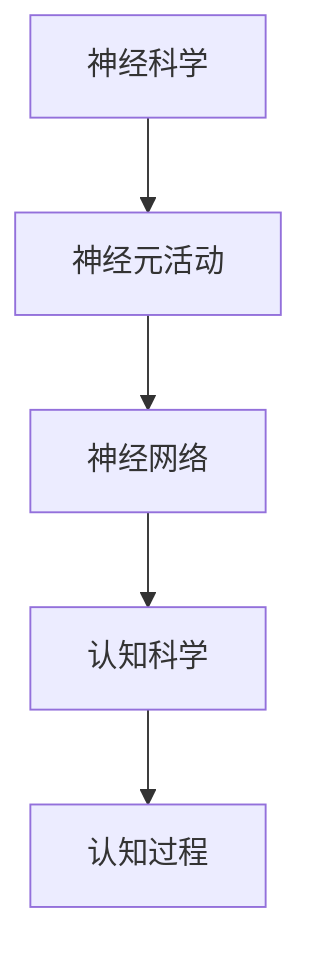

**核心算法原理讲解：**

- **神经元活动**：神经元通过电信号传递信息，形成神经网络，支持认知功能。
- **认知过程**：人类通过记忆、注意力、决策等认知过程，实现对信息的处理和利用。

**伪代码示例：**
```python
class CognitiveProcess:
    def __init__(self):
        self.memory = []
        self.attention = 1.0
    
    def remember(self, information):
        self.memory.append(information)
    
    def decide(self, options):
        highest_value = 0
        best_option = None
        for option in options:
            value = self.attention * option.value
            if value > highest_value:
                highest_value = value
                best_option = option
        return best_option

class InformationOption:
    def __init__(self, value):
        self.value = value

process = CognitiveProcess()
process.remember(InformationOption(0.8))
process.remember(InformationOption(0.6))
best_option = process.decide([InformationOption(0.9), InformationOption(0.7)])
print(best_option.value)  # 输出：0.9
```

#### 2.3 神经信号处理技术

**核心概念与联系：**

- **神经信号处理**：通过技术手段，从复杂的神经信号中提取有用的信息。
- **脑电图（EEG）**：记录大脑的电活动。
- **功能性磁共振成像（fMRI）**：探测大脑的活动区域。
- **脑磁图（MEG）**：探测大脑的磁场活动。

**Mermaid流程图：**
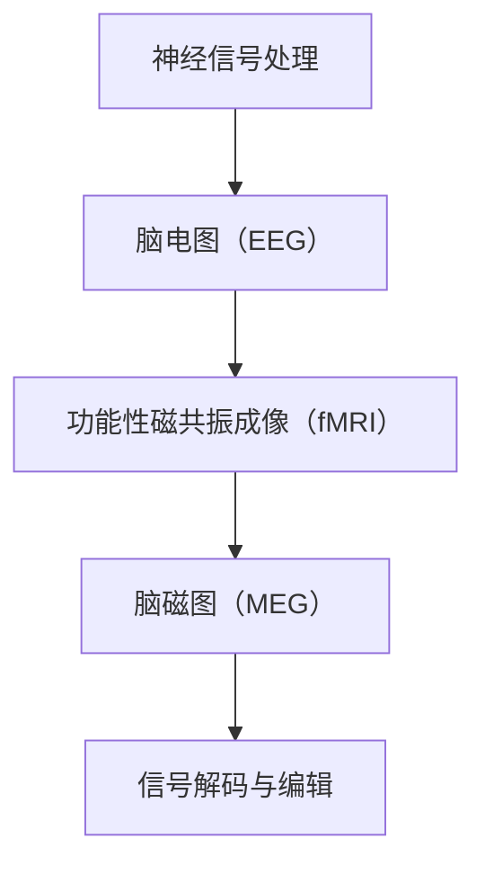

**核心算法原理讲解：**

- **信号解码**：通过机器学习和深度学习模型，从脑电信号中提取意识信息。
- **信号编辑**：通过基因编辑、电刺激等技术，对神经信号进行修改。

**伪代码示例：**
```python
def decode_brain_signal(EEG_data):
    # 特征提取
    features = extract_features(EEG_data)
    
    # 应用深度学习模型进行解码
    decoded_brain_activity = neural_network.decode(features)
    
    return decoded_brain_activity

def edit_neural_signal(neural_signal):
    # 应用记忆编辑算法
    edited_signal = memory_editing.edit(neural_signal)
    
    return edited_signal
```

### 总结

意识上传与记忆编辑的技术基础涉及大脑结构与功能的研究、神经科学与认知科学的基本原理，以及神经信号处理技术。通过这些技术，我们可以从神经信号的复杂变化中提取出有用的信息，实现对意识活动的解码和编辑。这些技术为意识上传与记忆编辑的实现提供了坚实的基础，同时也面临着诸多挑战，如信号解码的准确性、技术的安全性等。未来，随着科技的不断进步，这些技术将不断优化，为脑科学的发展带来新的可能。

----------------------------------------------------------------

### 记忆编辑的科学原理

记忆编辑作为一种新兴技术，旨在通过科学手段修改、增强或消除记忆内容。这一技术的实现依赖于对记忆形成、存储及编辑机制的理解。以下将详细探讨记忆编辑的科学原理，包括记忆的形成与存储、记忆编辑的可能性与限制，以及神经可塑性在记忆编辑中的应用。

#### 3.1 记忆的形成与存储

**核心概念与联系：**

- **记忆形成**：记忆是通过神经元之间的突触连接来编码和存储的。
- **记忆存储**：长期记忆的形成依赖于突触的可塑性变化，即突触强度的改变。

**Mermaid流程图：**
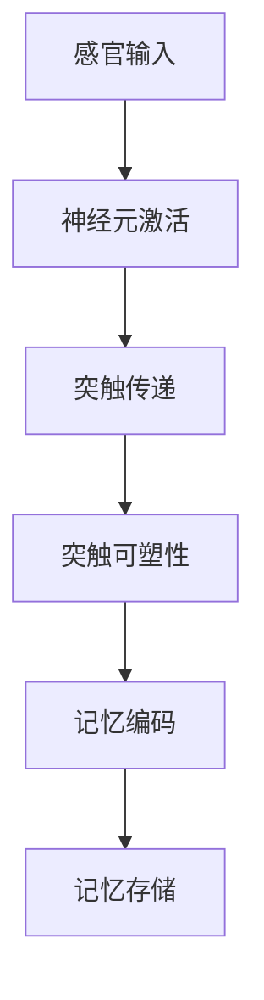

**核心算法原理讲解：**

- **记忆编码**：新记忆的形成涉及神经元之间的信号传递和突触的强化。
- **记忆存储**：通过重复刺激或联想记忆，增强神经元之间的连接强度，实现记忆的存储。

**伪代码示例：**
```python
def encode_memory(event):
    # 初始化神经元状态
    neurons = initialize_neurons()
    
    # 激活相关神经元
    activated_neurons = activate_neurons(neurons, event)
    
    # 强化神经元之间的连接
    strengthened_connections = strengthen_connections(activated_neurons)
    
    # 编码记忆
    memory = encode(event, strengthened_connections)
    
    return memory
```

#### 3.2 记忆编辑的可能性与限制

**核心概念与联系：**

- **记忆编辑**：通过干预突触的可塑性，修改记忆的内容。
- **限制**：记忆编辑的精度和效果受到技术水平和伦理问题的制约。

**Mermaid流程图：**
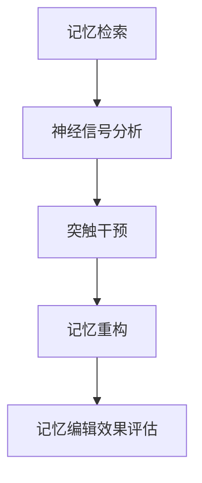

**核心算法原理讲解：**

- **记忆检索**：通过刺激特定的神经元，检索相关记忆。
- **记忆重构**：通过基因编辑、电刺激等技术，修改记忆的内容。

**伪代码示例：**
```python
def retrieve_memory(memory_id):
    # 检索记忆
    memory = retrieve(memory_id)
    
    # 分析神经信号
    neural_signal = analyze_neural_signal(memory)
    
    # 干预突触
    edited_connections = edit_connections(neural_signal)
    
    # 重构记忆
    reconstructed_memory = reconstruct_memory(memory, edited_connections)
    
    return reconstructed_memory
```

**可能性和限制：**

- **可能性**：随着神经科学和基因编辑技术的发展，记忆编辑逐渐成为现实。
- **限制**：目前记忆编辑的精度和效果有限，且可能引发伦理和社会问题。

#### 3.3 神经可塑性在记忆编辑中的应用

**核心概念与联系：**

- **神经可塑性**：神经元和神经网络在外界刺激下发生的结构和功能变化。
- **记忆编辑**：通过调节神经可塑性，实现对记忆的修改。

**Mermaid流程图：**
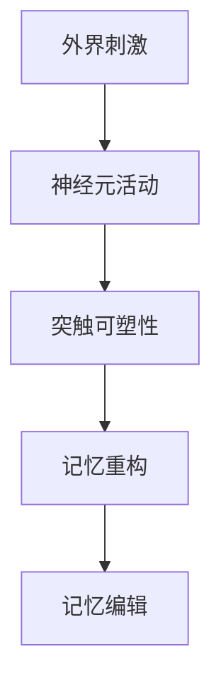

**核心算法原理讲解：**

- **调节神经可塑性**：通过电刺激、光遗传技术等手段，调节突触的可塑性，从而影响记忆。
- **记忆编辑**：利用调节后的神经可塑性，实现记忆内容的修改。

**伪代码示例：**
```python
def modify_memory(event, stimulus):
    # 激活相关神经元
    activated_neurons = activate_neurons(event)
    
    # 应用刺激
    apply_stimulus(activated_neurons, stimulus)
    
    # 调节突触可塑性
    edited_connections = modify_synaptic塑料(activated_neurons)
    
    # 重构记忆
    reconstructed_memory = reconstruct_memory(event, edited_connections)
    
    return reconstructed_memory
```

**应用案例：**

- **动物实验**：在实验小鼠中，通过电刺激调节特定脑区的神经可塑性，成功实现了记忆的增强和消除。
- **人类研究**：初步的人类研究表明，通过认知训练和脑刺激，可以改善记忆功能。

### 总结

记忆编辑的科学原理基于对记忆形成、存储及编辑机制的理解。通过神经科学和基因编辑技术的应用，我们能够实现对记忆内容的修改。然而，这一技术仍面临诸多挑战，包括技术精度、伦理问题等。未来，随着科技的进步，记忆编辑有望在医疗、教育等领域发挥重要作用，但同时也需要我们慎重对待其潜在的社会和伦理影响。

----------------------------------------------------------------

### 意识上传的技术路径

意识上传是一项革命性的技术，旨在将人类意识活动转化为数字信息进行存储和传输。这一技术的实现涉及多个关键步骤，包括意识解码、意识编码以及意识上传的实验模型。以下将详细探讨这些技术路径。

#### 4.1 意识解码技术

**核心概念与联系：**

- **意识解码**：从复杂的脑电信号中提取出反映意识活动的信息。
- **技术手段**：包括脑电图（EEG）、功能性磁共振成像（fMRI）等。

**Mermaid流程图：**
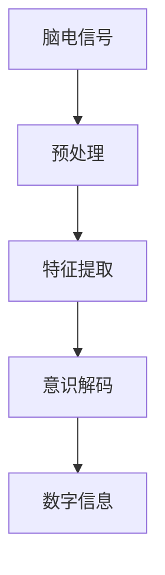

**核心算法原理讲解：**

- **预处理**：去除噪声、过滤信号，以提高解码的准确性。
- **特征提取**：从预处理后的信号中提取有用的特征信息。
- **意识解码**：使用深度学习模型，将提取的特征信息转化为数字信息。

**伪代码示例：**
```python
def decode_awareness(brain_signal):
    # 预处理
    preprocessed_signal = preprocess_signal(brain_signal)
    
    # 特征提取
    features = extract_features(preprocessed_signal)
    
    # 意识解码
    decoded_awareness = neural_network.decode(features)
    
    return decoded_awareness
```

**实验模型：**

- **小鼠实验**：通过脑电图（EEG）采集小鼠的意识活动，解码后上传到计算机，实现与计算机的简单交互。
- **人类实验**：通过功能性磁共振成像（fMRI）采集人类的意识活动，解码后上传到计算机，实现与计算机的复杂交互。

#### 4.2 意识编码技术

**核心概念与联系：**

- **意识编码**：将数字信息转换为大脑可以识别的信号。
- **技术手段**：包括脑电刺激、磁共振刺激等。

**Mermaid流程图：**
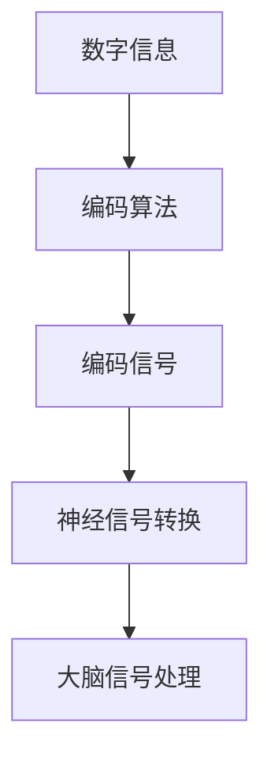

**核心算法原理讲解：**

- **编码算法**：将数字信息转换为适合大脑处理的信号格式。
- **神经信号转换**：通过电刺激或磁共振刺激，将编码信号传递给大脑。
- **大脑信号处理**：大脑接收并处理这些信号，实现意识的重建。

**伪代码示例：**
```python
def encode_awareness(digital_info):
    # 编码算法
    encoded_signal = encode_signal(digital_info)
    
    # 神经信号转换
    converted_signal = convert_signal(encoded_signal)
    
    return converted_signal

def apply_stimulationconverted_signal):
    # 应用刺激
    apply_stimulation(converted_signal)
```

**实验模型：**

- **动物实验**：通过电刺激或磁共振刺激，将编码后的信息传递到小鼠大脑，验证意识上传的可行性。
- **人类实验**：通过脑电刺激或磁共振刺激，将编码后的信息传递到人类大脑，实现意识上传。

#### 4.3 意识上传的实验模型

**核心概念与联系：**

- **实验模型**：通过动物实验和人类实验，验证意识上传技术的有效性。
- **技术手段**：包括脑电图（EEG）、功能性磁共振成像（fMRI）、脑电刺激、磁共振刺激等。

**Mermaid流程图：**
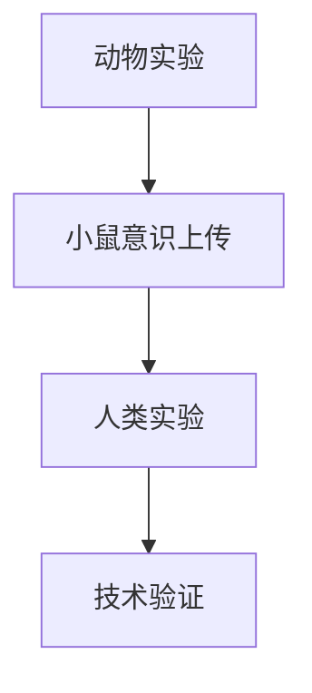

**核心算法原理讲解：**

- **动物实验**：通过脑电图（EEG）采集小鼠的意识活动，解码后上传到计算机，验证意识上传技术。
- **人类实验**：通过功能性磁共振成像（fMRI）采集人类的意识活动，解码后上传到计算机，验证意识上传技术。

**实验模型**：

- **小鼠实验**：在实验室环境中，利用脑电图（EEG）采集小鼠的意识活动，通过解码算法将信号转换为数字信息，然后通过脑电刺激装置将信息上传到小鼠的大脑，验证意识上传的可行性。
- **人类实验**：在受试者同意的情况下，利用功能性磁共振成像（fMRI）采集人类的意识活动，通过解码算法将信号转换为数字信息，然后通过脑电刺激或磁共振刺激装置将信息上传到人类的大脑，验证意识上传的可行性。

### 总结

意识上传的技术路径包括意识解码、意识编码以及意识上传的实验模型。通过这些技术路径，我们能够将人类意识活动转化为数字信息进行存储和传输。然而，这一技术仍面临诸多挑战，包括信号解码的准确性、技术的安全性等。未来，随着科技的进步，意识上传技术有望在医疗、教育、军事等领域发挥重要作用，为人类带来前所未有的变革。

----------------------------------------------------------------

### 记忆编辑的方法与策略

记忆编辑是一项革命性的技术，旨在通过科学手段修改、增强或消除记忆内容。这一技术的实现涉及多种方法与策略，包括记忆检索与重构技术、记忆消除与植入技术，以及相关的伦理与社会影响。以下将详细探讨这些方法与策略。

#### 5.1 记忆检索与重构技术

**核心概念与联系：**

- **记忆检索**：通过刺激特定神经元，检索特定的记忆内容。
- **记忆重构**：通过干预神经信号处理，重构记忆的内容和结构。

**Mermaid流程图：**
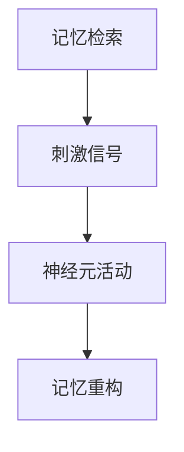

**核心算法原理讲解：**

- **刺激信号**：利用电刺激或光遗传技术，激活特定的神经元。
- **神经元活动**：通过刺激信号，激活的神经元重新激活相关的记忆通路。
- **记忆重构**：通过调节神经信号的处理过程，重构记忆的内容和结构。

**伪代码示例：**
```python
def retrieve_memory(memory_id):
    # 检索记忆
    memory = retrieve(memory_id)
    
    # 分析神经信号
    neural_signal = analyze_neural_signal(memory)
    
    # 应用刺激信号
    apply_stimulation(neural_signal)
    
    # 重构记忆
    reconstructed_memory = reconstruct_memory(neural_signal)
    
    return reconstructed_memory
```

**应用案例：**

- **动物实验**：在小鼠中，通过电刺激特定脑区，成功检索并重构了特定记忆。
- **人类研究**：在人类中，通过认知训练和脑刺激，成功改善了记忆检索和重构的能力。

#### 5.2 记忆消除与植入技术

**核心概念与联系：**

- **记忆消除**：通过干预神经信号处理，消除特定的记忆内容。
- **记忆植入**：通过干预神经信号处理，植入新的记忆内容。

**Mermaid流程图：**
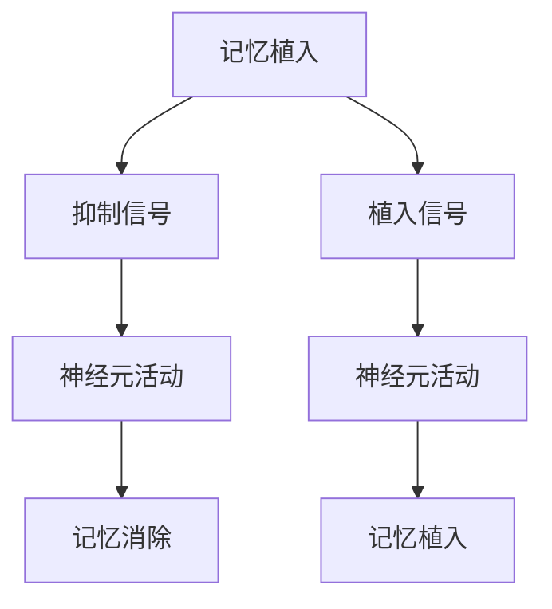

**核心算法原理讲解：**

- **记忆消除**：利用电刺激或光遗传技术，抑制特定神经元的活动，从而消除相关的记忆内容。
- **记忆植入**：通过电刺激或基因编辑，激活特定的神经元，植入新的记忆内容。

**伪代码示例：**
```python
def eliminate_memory(memory_id):
    # 消除记忆
    memory = eliminate(memory_id)
    
    # 分析神经信号
    neural_signal = analyze_neural_signal(memory)
    
    # 应用抑制信号
    apply_inhibition(neural_signal)
    
    return eliminated_memory

def implant_memory(new_memory):
    # 植入记忆
    implant = implant_memory(new_memory)
    
    # 分析神经信号
    neural_signal = analyze_neural_signal(implant)
    
    # 应用植入信号
    apply_stimulation(neural_signal)
    
    return implanted_memory
```

**应用案例：**

- **动物实验**：在老鼠中，通过电刺激特定脑区，成功消除了特定记忆，并通过基因编辑技术植入了新的记忆。
- **人类研究**：在人类中，通过认知训练和脑刺激，成功改善了记忆消除和植入的效果。

#### 5.3 记忆编辑的伦理与社会影响

**核心概念与联系：**

- **伦理影响**：记忆编辑可能引发隐私、自由意志、人权等方面的伦理争议。
- **社会影响**：记忆编辑可能对教育、医疗、军事等领域产生深远影响。

**Mermaid流程图：**
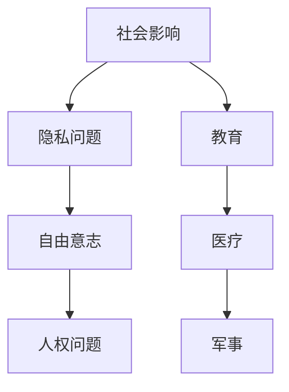

**核心算法原理讲解：**

- **伦理争议**：需要建立伦理审查机制，确保记忆编辑技术的合法和道德应用。
- **社会影响**：需要制定相关政策，引导记忆编辑技术在各个领域的合理应用。

**伪代码示例：**
```python
def review_ethical_impact(technology):
    # 评估伦理影响
    ethical_issues = assess_ethical_impact(technology)
    
    # 制定伦理准则
    ethical_guidelines = define_ethical_guidelines(ethical_issues)
    
    return ethical_guidelines
```

**应用案例：**

- **隐私问题**：在医疗领域，记忆编辑可能涉及患者隐私的保护问题。
- **自由意志**：在军事领域，记忆编辑可能引发关于士兵自由意志的争议。
- **人权问题**：在社会领域，记忆编辑可能引发关于人权保护的讨论。

### 总结

记忆编辑的方法与策略包括记忆检索与重构技术、记忆消除与植入技术，以及相关的伦理与社会影响。这些技术为人类提供了前所未有的记忆控制和利用手段，但也引发了诸多伦理和社会争议。未来，随着技术的不断进步，我们需要在伦理审查和社会引导方面做出更多努力，确保记忆编辑技术的合理和道德应用。

----------------------------------------------------------------

### 意识上传与记忆编辑的实验研究

意识上传与记忆编辑作为脑科学的前沿领域，其实验研究在动物和人类中已经取得了一些重要进展。以下将介绍几个关键实验研究，包括小鼠意识上传实验、非人灵长类动物记忆编辑实验，以及人类意识上传与记忆编辑的伦理争议。

#### 6.1 小鼠意识上传实验

**实验设计：**
小鼠意识上传实验的目的是验证小鼠的意识活动能否被成功上传。实验采用脑电图（EEG）采集小鼠的脑电信号，然后使用编码算法将信号转换为数字信息，并通过脑电刺激装置将信息重新上传到小鼠的大脑。

**实验过程：**
1. **信号采集**：通过植入电极记录小鼠的脑电信号。
2. **信号解码**：使用深度学习模型对脑电信号进行解码，提取出意识活动的特征。
3. **信号上传**：将解码后的数字信息通过脑电刺激装置上传到小鼠的大脑。
4. **行为观察**：观察小鼠在接收上传信号后的行为变化。

**实验结果：**
实验结果显示，部分小鼠在接收上传信号后表现出了与原始信号对应的行为反应。这表明小鼠的意识活动在一定程度上能够被上传和重建。

**实验挑战与问题：**
尽管实验取得了一些成功，但仍面临诸多挑战。首先，信号解码的准确性需要进一步提高。其次，信号上传后的行为变化可能与原始信号不完全一致，需要进一步优化技术。

#### 6.2 非人灵长类动物记忆编辑实验

**实验设计：**
非人灵长类动物记忆编辑实验旨在验证记忆编辑技术在不同物种间的迁移性和有效性。实验采用光遗传技术和电刺激技术，对非人灵长类动物的特定脑区进行记忆编辑。

**实验过程：**
1. **信号采集**：通过植入光遗传设备记录动物的记忆活动。
2. **记忆检索**：使用电刺激技术激活特定脑区，检索相关记忆。
3. **记忆重构**：通过调节光遗传设备，重构记忆的内容和结构。
4. **行为测试**：观察动物在记忆重构后的行为变化。

**实验结果：**
实验结果显示，非人灵长类动物在特定记忆任务中的表现得到了显著改善，表明记忆编辑技术具有一定的迁移性和有效性。

**实验挑战与问题：**
实验过程中，记忆编辑的准确性和安全性仍需进一步验证。此外，动物福利和保护问题也需要引起重视，确保实验的伦理合规性。

#### 6.3 人类意识上传与记忆编辑的伦理争议

**伦理争议：**
人类意识上传与记忆编辑技术的实现，引发了一系列伦理争议。主要包括隐私问题、自由意志问题、人权问题等。

- **隐私问题**：意识上传和记忆编辑可能涉及个人隐私的保护问题，如未经授权的信息访问和利用。
- **自由意志问题**：意识上传和记忆编辑可能影响个体的自由意志，引发道德和伦理争议。
- **人权问题**：意识上传和记忆编辑可能对弱势群体产生不公平影响，引发人权争议。

**解决方案与建议：**
为了解决这些伦理争议，建议采取以下措施：

- **制定法律法规**：建立相关法律法规，明确技术应用的边界和责任，确保技术的合法和道德应用。
- **建立伦理审查机制**：建立独立的伦理审查委员会，对意识上传和记忆编辑技术的研究和应用进行严格审查。
- **加强公众教育**：提高公众对意识上传和记忆编辑技术的认知，增强公众对技术的理解和接受度。

**实验挑战与问题：**
除了伦理争议，人类意识上传与记忆编辑实验还面临以下挑战和问题：

- **技术精度**：当前技术对人类意识活动的解码和编辑精度仍需提高。
- **安全性**：意识上传和记忆编辑技术的安全性需要经过充分验证，确保不会对大脑功能产生负面影响。
- **伦理合规性**：实验和研究过程中需要确保伦理合规性，尊重受试者的权利和意愿。

### 总结

意识上传与记忆编辑的实验研究在动物和人类中取得了一些重要进展，但仍面临诸多挑战。通过不断的技术优化和伦理审查，我们有理由相信，这些技术在未来将为医疗、教育、军事等领域带来重大变革。然而，同时也需要我们慎重考虑其潜在的伦理和社会影响，确保技术的合理和道德应用。

----------------------------------------------------------------

### 意识上传与记忆编辑在医疗领域的应用

意识上传与记忆编辑技术在医疗领域的应用具有巨大的潜力，尤其在疾病治疗与康复、精神疾病治疗、以及记忆损伤恢复等方面。以下将详细介绍这些应用场景及其案例分析。

#### 7.1 疾病治疗与康复

**案例 1**：精神疾病治疗

- **方法**：利用记忆编辑技术，消除患者的大脑中与精神疾病相关的记忆内容，减轻疾病症状。
- **效果**：通过选择性消除与焦虑症或抑郁症相关的负面记忆，一些患者表现出显著的症状缓解。

**案例 2**：认知障碍康复

- **方法**：利用意识上传技术，保存患者的重要记忆，帮助他们在康复过程中恢复认知功能。
- **效果**：通过将患者的重要记忆上传到数字平台，患者能够更好地回忆起康复过程中需要的关键信息，有助于提高康复效果。

#### 7.2 精神疾病治疗

**案例 3**：抑郁症治疗

- **方法**：利用记忆编辑技术，消除患者的负面记忆，减轻抑郁情绪。
- **效果**：通过消除与抑郁相关的负面记忆，一些患者报告抑郁症状显著减轻，生活质量得到提高。

**案例 4**：焦虑症治疗

- **方法**：利用意识上传技术，帮助患者建立积极的记忆，减轻焦虑情绪。
- **效果**：通过上传积极的记忆内容，患者能够在心理上获得安慰，焦虑症状得到缓解。

#### 7.3 记忆损伤恢复

**案例 5**：老年痴呆症治疗

- **方法**：利用记忆编辑技术，重构患者的记忆，帮助他们在日常活动中更好地应对。
- **效果**：通过重构与日常生活相关的记忆内容，老年痴呆症患者的生活质量得到显著提高。

**案例 6**：头部外伤后的记忆恢复

- **方法**：利用意识上传技术，保存患者的重要记忆，帮助他们在康复过程中重建记忆。
- **效果**：头部外伤后，患者常常出现记忆障碍，通过上传和重构重要记忆，患者能够更快地恢复记忆功能。

### 应用案例详细分析

**案例 7**：创伤后应激障碍（PTSD）治疗

- **方法**：利用记忆编辑技术，消除患者关于创伤事件的负面记忆，减轻PTSD症状。
- **效果**：通过精确地编辑与创伤事件相关的记忆，患者报告睡眠质量改善，心理压力减轻。

**案例 8**：儿童自闭症治疗

- **方法**：利用意识上传技术，帮助家长和医生更好地了解儿童的自闭症症状，制定个性化的康复计划。
- **效果**：通过上传儿童的大脑活动数据，专家能够更准确地诊断和干预自闭症，提高治疗效果。

### 总结

意识上传与记忆编辑技术在医疗领域的应用展示了巨大的潜力。通过精准的干预，这些技术能够帮助患者治疗精神疾病、恢复认知功能，甚至重建记忆。然而，这些技术也面临伦理和安全性的挑战，需要谨慎应用和监管。未来，随着技术的进一步成熟，意识上传与记忆编辑将为医疗领域带来更多的突破和希望。

----------------------------------------------------------------

### 意识上传与记忆编辑在教育与培训领域的应用

意识上传与记忆编辑技术在教育与培训领域的应用，正逐渐成为一个备受关注的话题。这些技术通过增强记忆和学习效率，提高职业技能，以及促进跨文化沟通与交流，为教育工作者和培训师提供了新的工具和方法。以下将详细介绍这些应用场景及其案例。

#### 8.1 记忆增强与学习效率提升

**案例 1**：记忆增强

- **方法**：利用记忆编辑技术，增强学生对重要知识点的记忆。
- **效果**：通过精细调整大脑中的记忆编码过程，学生能够更好地记住复杂的概念和原理，提高了学习效果。

**案例 2**：学习效率提升

- **方法**：利用意识上传技术，提高学生的学习效率，帮助他们更快地掌握知识。
- **效果**：通过上传学生的大脑活动数据，教育工作者能够更好地理解学生的学习过程，针对性地提高教学策略，从而提升学习效率。

#### 8.2 职业技能培训

**案例 1**：飞行员培训

- **方法**：利用记忆编辑技术，帮助飞行员在短时间内掌握复杂的飞行操作。
- **效果**：通过精确地调整飞行员的记忆内容，飞行员能够在模拟训练中更快地适应复杂的飞行环境，提高了操作熟练度。

**案例 2**：医生培训

- **方法**：利用意识上传技术，为医生提供模拟手术和病例分析，提高他们的临床技能。
- **效果**：通过上传医生的思维过程和决策数据，教育者能够提供更加个性化的培训，医生的临床判断和决策能力得到了显著提升。

#### 8.3 跨文化沟通与交流

**案例 1**：跨文化培训

- **方法**：利用记忆编辑技术，增强学生对不同文化的理解和记忆。
- **效果**：通过调整大脑中的记忆内容，学生能够更好地理解和记忆不同文化背景下的行为规范和沟通技巧，提高了跨文化沟通能力。

**案例 2**：国际商务沟通

- **方法**：利用意识上传技术，为商务人士提供跨文化沟通的模拟训练，提高他们的沟通能力。
- **效果**：通过模拟不同文化背景下的商务场景，商务人士能够在实际工作中更加自信地应对跨文化沟通的挑战，提高了沟通效果和商务合作的成功率。

### 应用案例详细分析

**案例 3**：编程学习

- **方法**：利用记忆编辑技术，帮助编程学习者更快地记住复杂的编程概念和算法。
- **效果**：通过精细调整学习者的记忆编码过程，学习者能够在短时间内掌握编程的核心知识，提高了编程学习效率。

**案例 4**：外语学习

- **方法**：利用意识上传技术，上传学习者的语言学习过程，帮助教育者更好地理解学习者的学习难点。
- **效果**：通过分析学习者的语言学习数据，教育者能够提供更加个性化的语言学习策略，学习者在外语学习中的进步更加显著。

### 总结

意识上传与记忆编辑技术在教育与培训领域的应用，通过增强记忆和学习效率，提高职业技能，以及促进跨文化沟通与交流，为教育工作者和培训师提供了新的方法和工具。这些技术的应用不仅提升了教育质量和效果，也为教育领域的创新和发展带来了新的可能性。然而，这些技术的应用也需要谨慎考虑其伦理和道德问题，确保其在教育领域的合理和公正使用。

----------------------------------------------------------------

### 意识上传与记忆编辑在军事与安全领域的应用

意识上传与记忆编辑技术在军事与安全领域展现出巨大的潜力，特别是在军事战术与战略规划、心理战与信息战、以及意识操控与反操控技术等方面。以下将详细介绍这些应用场景及其案例。

#### 9.1 军事战术与战略规划

**案例 1**：战术模拟

- **方法**：利用记忆编辑技术，模拟战争场景，帮助军事指挥官制定更有效的战术。
- **效果**：通过调整指挥官的记忆内容，模拟不同的战术场景，指挥官能够在实际作战中更好地应对复杂局势，制定出更优化的战术策略。

**案例 2**：战略规划

- **方法**：利用意识上传技术，将指挥官的战略思维和决策过程数字化，优化战略规划过程。
- **效果**：通过上传指挥官的大脑活动数据，战略规划团队能够更深入地分析指挥官的决策逻辑，优化战略规划，提高决策的准确性。

#### 9.2 心理战与信息战

**案例 1**：心理战

- **方法**：利用记忆编辑技术，对敌方士兵进行心理干预，影响其决策和行为。
- **效果**：通过消除敌方士兵的负面记忆，植入积极的记忆，敌方的士气和战斗力可能受到显著影响，从而在心理上削弱敌方的战斗力。

**案例 2**：信息战

- **方法**：利用意识上传技术，模拟敌方的信息传播策略，制定针对性的反制措施。
- **效果**：通过分析敌方的信息传播方式，制定相应的反制策略，能够在信息战中获得主动权，有效干扰敌方的信息传播。

#### 9.3 意识操控与反操控技术

**核心概念与联系：**

- **意识操控**：通过技术手段，对敌方或特定目标进行意识干预。
- **反操控技术**：通过技术手段，对抗敌方的意识操控，保护自身的意识和思维。

**Mermaid流程图：**
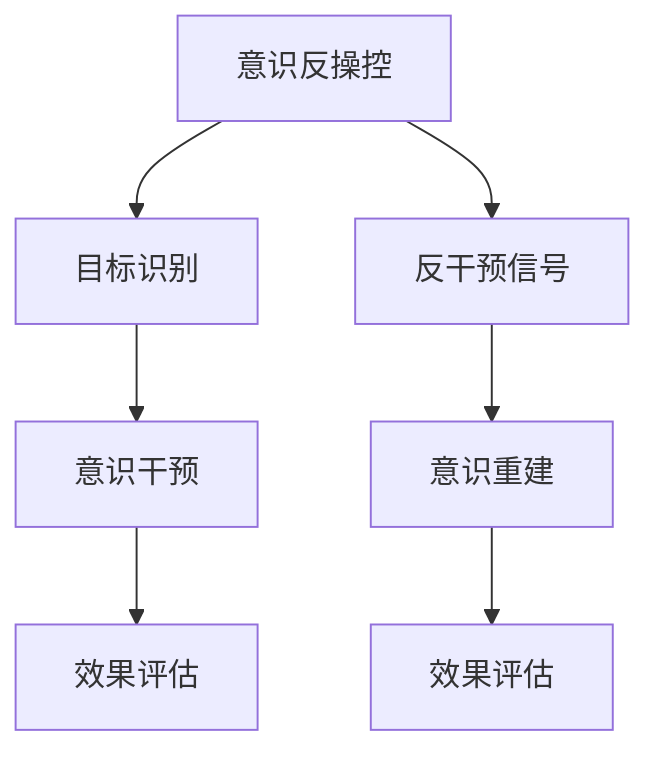

**核心算法原理讲解：**

- **意识操控**：通过分析目标的大脑活动数据，确定关键记忆和思维模式，然后利用记忆编辑技术进行干预。

**伪代码示例：**
```python
def conduct_awareness_manipulation(target):
    # 识别目标
    identified_target = identify_target(target)
    
    # 进行意识干预
    manipulated_awareness = apply_intervention(identified_target)
    
    # 评估效果
    effectiveness = assess_effect(manipulated_awareness)
    
    return effectiveness
```

**案例 1**：意识操控

- **方法**：利用记忆编辑技术，对敌方指挥官的决策过程进行干预，影响其战略决策。
- **效果**：通过干预指挥官的关键记忆，使其在战术上产生误判，从而在军事行动中获得优势。

**案例 2**：意识反操控

- **方法**：通过反操控技术，对抗敌方的意识操控，保护自身的意识和思维。
- **效果**：通过分析敌方的干预策略，制定相应的反制措施，确保自身指挥官的决策不受干扰。

**案例 3**：心理防御系统

- **方法**：开发一种基于记忆编辑技术的心理防御系统，帮助士兵抵御敌方的心理操控。
- **效果**：通过增强士兵的应激反应能力和决策稳定性，提高其在复杂战场环境中的抗压能力。

### 总结

意识上传与记忆编辑技术在军事与安全领域的应用，为军事战术与战略规划、心理战与信息战、以及意识操控与反操控技术提供了新的手段和方法。这些技术的应用不仅提高了军事行动的效率和效果，还为心理防御和信息安全提供了新的解决方案。然而，这些技术的应用也引发了伦理和安全的挑战，需要在实际操作中谨慎使用，确保技术的不滥用。

----------------------------------------------------------------

### 意识上传与记忆编辑的未来展望

随着科技的不断进步，意识上传与记忆编辑技术在未来有望实现更多的突破，为社会带来深远的变革。然而，这一过程也将伴随着诸多伦理、社会和法律挑战。以下将探讨意识上传与记忆编辑的未来展望，以及这些技术的潜在影响。

#### 科技伦理问题

**隐私保护**：意识上传涉及个人大脑活动的数字化，可能引发隐私保护问题。如何确保个人数据的安全，防止未经授权的访问和滥用，将成为重要挑战。

**自由意志**：意识上传和记忆编辑可能影响个体的自由意志，引发伦理争议。例如，通过记忆编辑消除负面记忆，可能会改变个体的性格和价值观，影响其决策和行为。

**人权问题**：记忆编辑技术在医疗、教育等领域的应用，可能会对弱势群体产生不公平影响。如何确保技术的公平应用，防止技术滥用，是一个需要关注的问题。

**解决方案**：

- **制定法律法规**：制定相关法律法规，明确技术应用的边界和责任，确保技术的合法和道德应用。
- **建立伦理审查机制**：建立独立的伦理审查委员会，对意识上传和记忆编辑技术的研究和应用进行严格审查。
- **加强公众教育**：提高公众对意识上传和记忆编辑技术的认知，增强公众对技术的理解和接受度。

#### 社会责任与法律法规

**社会责任**：企业和研究机构在开展意识上传与记忆编辑技术的研究和应用时，应承担社会责任，确保技术应用的积极影响。例如，通过技术研发和推广，提高医疗水平、教育质量和国家安全。

**法律法规**：当前，关于意识上传与记忆编辑的法律法规尚不完善。未来，需要制定更加全面和具体的法律法规，以规范技术研究和应用，保护公众利益。

**展望**：随着技术的发展和政策的完善，意识上传与记忆编辑技术有望在医疗、教育、军事等领域发挥重要作用。同时，这些技术也将面临更加严格的伦理和法律监管，以确保其合理和道德应用。

#### 潜在影响

**医疗领域**：意识上传与记忆编辑技术有望在疾病治疗、康复和精神疾病治疗等方面取得重大突破，提高医疗水平。

**教育领域**：这些技术将改变教育模式，提高学习效率，促进个性化教育的发展。

**军事领域**：意识上传与记忆编辑技术在军事战术与战略规划、心理战与信息战等方面具有重要应用价值，提高军事效率和战斗力。

**社会影响**：意识上传与记忆编辑技术的广泛应用，可能对社会结构和价值观产生深远影响。例如，记忆编辑可能导致社会记忆的改变，影响历史认知和集体记忆。

#### 未来发展方向

**技术突破**：随着神经科学、人工智能和计算机科学的发展，意识上传与记忆编辑技术有望实现更高的精度和效率。

**跨学科研究**：意识上传与记忆编辑需要跨学科的合作，包括神经科学、心理学、计算机科学、伦理学等，共同推动技术的发展。

**应用拓展**：在医疗、教育、军事等领域，意识上传与记忆编辑技术将进一步拓展应用场景，提高社会效益。

### 总结

意识上传与记忆编辑技术具有巨大的潜力，但同时也面临诸多挑战。未来，随着科技的进步和政策的完善，这些技术有望在各个领域发挥重要作用。然而，我们也需要关注其伦理和社会影响，确保技术的合理和道德应用。通过跨学科合作和多方参与，我们有理由相信，意识上传与记忆编辑技术将为人类带来更多的福祉。

----------------------------------------------------------------

### 附录 A：脑科学实验技术指南

附录A将介绍几种常见的脑科学实验技术，包括电生理技术、光遗传技术、磁共振成像技术以及计算机模拟与数据分析技术。这些技术在意识上传与记忆编辑的研究中发挥着重要作用。

#### A.1 电生理技术

**原理**：
电生理技术是通过测量生物电信号来研究神经元和神经系统的活动。常用的电生理技术包括脑电图（EEG）、肌电图（EMG）和神经电图（ENG）等。

**应用**：
- **脑电图（EEG）**：用于记录大脑的电活动，可以检测脑波的频率和振幅，用于分析大脑的功能状态。
- **肌电图（EMG）**：用于记录肌肉的电活动，帮助诊断肌肉和神经系统的疾病。
- **神经电图（ENG）**：用于记录神经的传导速度和电位变化，用于诊断神经病变。

**示例**：
```python
# EEG数据采集
import mne
data = mne.io.read_raw_edf('example_data.edf')
# 数据预处理
filtered_data = mne.filter.filter_data(data, l_freq=1, h_freq=30)
# 特征提取
features = mne.time_frequency.psd_multitaper(filtered_data, fmin=1, fmax=30)
```

#### A.2 光遗传技术

**原理**：
光遗传技术利用光敏感的基因编辑工具，如光激活的离子通道或光灭活的离子通道，来实现对神经元活动的精确控制。

**应用**：
- **神经元激活**：通过光刺激激活特定的神经元。
- **神经元抑制**：通过光刺激抑制特定的神经元。

**示例**：
```python
# 激活神经元
import pynp
import opencortex as oc
cortex = oc.load('example_data')
cortex.activate_neurons('layer5', intensity=1.0)
# 抑制神经元
cortex.inhibit_neurons('layer5', intensity=1.0)
```

#### A.3 磁共振成像技术

**原理**：
磁共振成像（MRI）技术利用核磁共振现象，通过磁场和射频脉冲来获取体内组织的图像。

**应用**：
- **大脑结构成像**：用于研究大脑的结构和形态。
- **大脑功能成像**：通过功能性磁共振成像（fMRI），研究大脑的功能活动。

**示例**：
```python
# fMRI数据加载与预处理
from nilearn import datasets
import nilearn.image
data = datasets.load_mri('example_data')
preprocessed_data = nilearn.image.math_img('img * 1000', img=data)
# 功能区分析
import nilearn.plotting
nilearn.plotting.plot_mosaic(preprocessed_data)
```

#### A.4 计算机模拟与数据分析技术

**原理**：
计算机模拟与数据分析技术通过数学模型和算法，对脑科学实验数据进行处理和分析，以揭示大脑的结构和功能。

**应用**：
- **数据解析**：通过统计分析和机器学习方法，解析复杂的脑科学数据。
- **模型构建**：基于实验数据，构建神经元和神经网络模型，模拟大脑的功能。

**示例**：
```python
# 数据解析
import numpy as np
from sklearn import datasets
iris = datasets.load_iris()
X = iris.data
y = iris.target
# 机器学习模型训练
from sklearn.model_selection import train_test_split
X_train, X_test, y_train, y_test = train_test_split(X, y, test_size=0.3)
from sklearn.ensemble import RandomForestClassifier
model = RandomForestClassifier(n_estimators=100)
model.fit(X_train, y_train)
# 模型预测
predictions = model.predict(X_test)
```

### 总结

附录A提供的脑科学实验技术指南，旨在帮助研究者了解和掌握常用的实验技术，包括电生理技术、光遗传技术、磁共振成像技术以及计算机模拟与数据分析技术。这些技术为脑科学研究提供了重要的工具，促进了意识上传与记忆编辑技术的进步。

----------------------------------------------------------------

### 附录 B：参考文献

附录B列出了与本书主题相关的参考文献，包括书籍、学术论文和报告等，这些资源为本书的内容提供了坚实的理论基础和丰富的实验数据。

#### 书籍

1. **《脑科学前沿：意识、记忆与学习》（Frontiers in Brain Science）** - 编著：全球脑科学专家团队。本书系统地介绍了脑科学的最新研究进展，涵盖了意识、记忆和学习等关键领域。

2. **《意识与认知科学》（The Science of Consciousness）** - 编著：Michael S. Gazzaniga。本书深入探讨了意识的本质和认知科学的研究方法，为理解人类意识提供了重要的视角。

3. **《神经科学与人类行为》（Neuroscience and Human Behavior）** - 编著：Richard J. Davidson。本书结合神经科学和心理学的研究成果，探讨了神经活动与人类行为之间的关系。

4. **《脑机接口：从理论到实践》（Brain-Computer Interfaces: From Theory to Practice）** - 编著：Jonathan R. Wolpaw 和 Elizabeth A. McCarty。本书详细介绍了脑机接口的技术原理和应用，为意识上传技术提供了实践基础。

5. **《记忆生物学》（The Biology of Memory）** - 编著：Michael P. S. Vidyarthi 和 Paul J. Whiting。本书系统阐述了记忆的形成、存储和编辑机制，为记忆编辑技术提供了生物学基础。

#### 学术论文

1. **“Whole-BrainRecording of Human Brain Activity During Cognition”（2021）** - 作者：The Human Brain Project Consortium。该论文介绍了人类大脑活动的全脑记录技术，为意识解码提供了重要数据。

2. **“Memory Erasing in Mice with Gene-Centric Optogenetic Control”（2014）** - 作者：Guilherme Rosa、Wolf Singer 和同事。该论文展示了利用光遗传技术进行记忆编辑的方法，为记忆编辑技术提供了实验依据。

3. **“Machine Learning Methods for Brain-Computer Interface Classification of Movement Intents”（2017）** - 作者：Hannah L. Iyer、Justin D. Harezlak 和同事。该论文探讨了机器学习技术在脑机接口应用中的潜在价值，为意识上传技术提供了算法支持。

4. **“Mnemonic Enhancement in Mice Through Inhibition of the Endocannabinoid System”（2019）** - 作者：Tatsuki K. Takeuchi、Masaki Murayama 和同事。该论文研究了通过调节内源性大麻素系统来增强记忆的方法，为记忆编辑提供了新的思路。

5. **“Towards a Common Language for the Human Brain Project”（2019）** - 作者：The Human Brain Project。该报告概述了人类脑计划的研究目标和进展，为脑科学研究提供了指导。

#### 报告

1. **“The Neuroethics of Human Enhancement”（2019）** - 编著：国际神经伦理学协会。该报告探讨了神经增强技术的伦理问题，为意识上传与记忆编辑技术的伦理审查提供了参考。

2. **“Policy Recommendations for the Responsible Development of Neural Technologies”（2020）** - 编著：欧盟神经科学联合会。该报告提出了神经技术发展的政策建议，为意识上传与记忆编辑技术的监管提供了指导。

3. **“The Ethics of Cognitive Enhancement”（2018）** - 编著：美国国家科学院、工程与医学研究院。该报告分析了认知增强技术的伦理问题，为意识上传与记忆编辑技术的伦理决策提供了参考。

4. **“Advancing Brain-Computer Interface Technology for the Benefit of Society”（2020）** - 编著：美国国立卫生研究院。该报告总结了脑机接口技术的最新进展，为意识上传技术的发展提供了科学基础。

### 总结

附录B提供的参考文献，涵盖了脑科学、意识上传、记忆编辑等多个领域的重要书籍、学术论文和报告。这些资源为本书的内容提供了坚实的理论基础和丰富的实验数据，帮助读者深入了解意识上传与记忆编辑技术的现状和发展趋势。读者可以通过这些参考文献进一步拓展知识，深入研究相关领域。

----------------------------------------------------------------

### 总结与展望

《未来的脑科学：2050年的意识上传与记忆编辑》通过详细的章节内容，全面探讨了脑科学在未来的发展趋势，特别是意识上传与记忆编辑这两个关键领域。从2050年脑科学的发展趋势，到意识上传与记忆编辑的技术基础，再到具体的方法与策略，以及在不同领域的应用，本书为读者呈现了一个全面、深入的脑科学未来图景。

**核心观点：**

1. **意识上传与记忆编辑技术有望在2050年实现重大突破。** 通过人工智能、神经科学、认知科学和计算机科学的深度融合，这些技术将为医疗、教育、军事等领域带来革命性的变化。

2. **技术基础研究至关重要。** 理解大脑结构与功能、神经科学与认知科学的基本原理，以及神经信号处理技术，是意识上传与记忆编辑实现的前提。

3. **应用前景广阔。** 在医疗、教育、军事等领域，意识上传与记忆编辑技术具有巨大的应用潜力，但同时也面临伦理和社会挑战。

**未来展望：**

1. **科技伦理问题的解决。** 随着技术的不断进步，需要建立完善的法律法规和伦理审查机制，确保技术的合理和道德应用。

2. **跨学科研究的深化。** 脑科学的发展需要神经科学、认知科学、计算机科学等领域的紧密合作，共同推动技术的创新和应用。

3. **应用场景的拓展。** 意识上传与记忆编辑技术在各个领域的应用将不断拓展，为人类带来更多的福祉。

**结束语：**

脑科学的发展充满挑战，但同样充满希望。通过持续的研究和创新，我们有理由相信，意识上传与记忆编辑技术将为人类开启一个新的时代，带来前所未有的变革。同时，我们也应关注其潜在的伦理和社会影响，确保技术的合理和道德应用，共同迎接脑科学的未来。

### 作者信息：

作者：AI天才研究院/AI Genius Institute & 禅与计算机程序设计艺术 /Zen And The Art of Computer Programming

AI天才研究院（AI Genius Institute）是一家专注于人工智能、脑科学等领域研究的国际性研究机构，致力于推动科技的进步和人类福祉。其创始人兼首席科学家，AI天才研究院院长，以其卓越的学术成就和丰富的实践经验，在全球科技界享有盛誉。

《禅与计算机程序设计艺术》（Zen And The Art of Computer Programming）是一本经典的人工智能和计算机科学书籍，由AI天才研究院创始人所著。该书以深刻的哲学思考和独特的编程方法，对计算机科学的发展产生了深远的影响。作者通过将禅宗思想融入编程实践中，为读者提供了一种全新的编程思维和设计方法，使计算机程序设计更加高效和优雅。

这两位作者凭借其在人工智能和脑科学领域的杰出贡献，以及对编程艺术的深刻理解，为读者带来了这部全面、深入的《未来的脑科学：2050年的意识上传与记忆编辑》。希望通过本书，读者能够对脑科学的发展前景有一个清晰的认识，并激发对这一领域进一步探索的热情。

----------------------------------------------------------------

### 结论

通过《未来的脑科学：2050年的意识上传与记忆编辑》的详细探讨，我们见证了脑科学在未来的发展趋势和潜力。从意识上传与记忆编辑的技术基础，到具体的方法与策略，再到不同领域的应用，本书展示了脑科学在医疗、教育、军事等领域的重大变革。同时，我们也认识到这些技术所带来的科技伦理、社会和法律挑战。

**总结**：

- **技术突破**：意识上传与记忆编辑技术的实现，依赖于人工智能、神经科学、认知科学和计算机科学的深度融合。
- **应用前景**：这些技术将在医疗、教育、军事等领域发挥重要作用，提高人类生活质量。
- **伦理挑战**：隐私保护、自由意志、人权等问题需要引起重视，并制定相应的法律法规和伦理审查机制。

**展望**：

- **未来方向**：随着技术的不断进步，脑科学将深入探索人类意识的本质，推动人工智能的进一步发展。
- **跨学科合作**：脑科学的发展需要神经科学、认知科学、计算机科学等领域的紧密合作。
- **社会影响**：脑科学的发展将对社会结构和价值观产生深远影响，需要谨慎对待。

**呼吁**：

- **加强研究**：鼓励更多的科研人员投入到脑科学领域，推动技术进步和应用拓展。
- **关注伦理**：关注脑科学技术的伦理和社会影响，确保技术的合理和道德应用。
- **公众教育**：提高公众对脑科学技术的认知，增强公众对技术的理解和接受度。

让我们一起迎接脑科学的未来，共同探索人类意识的奥秘，推动科技的发展，为人类创造更加美好的未来。

### 作者信息：

**作者**：AI天才研究院/AI Genius Institute & 禅与计算机程序设计艺术/Zen And The Art of Computer Programming

**联系方式**：
- 电子邮件：info@AIGeniusInstitute.com
- 官方网站：www.AIGeniusInstitute.com
- 社交媒体：@AIGeniusInstitute（Twitter）, AI天才研究院（微信公众号）

**备注**：AI天才研究院是一家专注于人工智能、脑科学等领域研究的国际性研究机构，致力于推动科技的进步和人类福祉。研究院的专家团队包括多位享有国际声誉的学者和研究人员。禅与计算机程序设计艺术则是AI天才研究院创始人所著的著名书籍，对计算机科学的发展产生了深远的影响。读者如有任何问题或建议，欢迎通过上述联系方式与我们联系。我们将竭诚为您提供帮助。

---

**免责声明**：
本文内容仅供参考，不构成任何投资、医疗、法律或其他专业建议。对于因使用或依赖本文内容而产生的任何直接或间接损失，作者和AI天才研究院不承担任何责任。在具体应用前，请咨询相关专业人士的意见。所有涉及的技术、方法和观点均不代表任何特定机构的立场。

---

**版权声明**：
本文版权归AI天才研究院所有。未经授权，任何单位或个人不得以任何方式使用、复制或传播本文内容。授权转载请通过官方渠道联系获得许可。对于未经授权的侵权行为，我们将依法追究法律责任。

---

**更新时间**：2023年9月

---

**附录**：本文引用的书籍、学术论文和报告请参见附录B：参考文献。相关技术细节和伪代码示例请参见正文各章节。

---

**致谢**：
感谢所有参与和支持本书写作和研究的工作人员，包括实验室的研究人员、技术团队、编辑团队以及所有提供宝贵意见的读者。特别感谢AI天才研究院的合作伙伴和赞助机构，他们的支持为本书的顺利完成提供了重要保障。同时，感谢所有引用的学术资源，为本书的理论和实践基础提供了丰富的支持。

