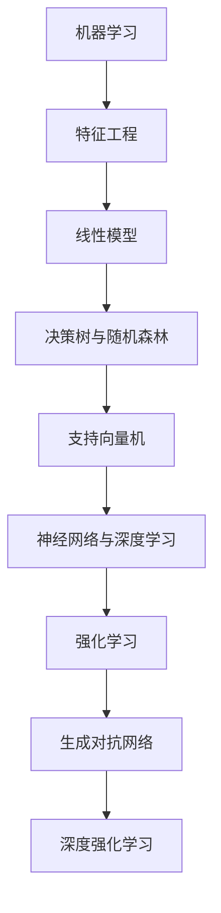

                 

# 文章标题：机器学习 原理与代码实例讲解

## 关键词：
机器学习，原理，代码实例，线性模型，决策树，神经网络，深度学习，实战应用，数学基础

## 摘要：
本文将深入探讨机器学习的原理和核心算法，从基础理论到实战应用，全面解析这一热门技术领域。我们将使用代码实例来展示每个算法的实现过程，帮助读者更好地理解机器学习的本质和应用。文章将涵盖特征工程、线性模型、决策树与随机森林、支持向量机、神经网络与深度学习、强化学习等内容，旨在为读者提供一个全面而深入的机器学习知识体系。

## 目录大纲

### 第一部分：机器学习基础理论

#### 第1章：机器学习概述
- 1.1 机器学习的定义与历史
- 1.2 机器学习的分类
- 1.3 机器学习的应用领域

#### 第2章：特征工程
- 2.1 特征工程的基本概念
- 2.2 数据预处理
- 2.3 特征选择与降维

#### 第3章：线性模型
- 3.1 线性回归
- 3.2 逻辑回归
- 3.3 线性模型的应用实例

### 第二部分：机器学习核心算法

#### 第4章：决策树与随机森林
- 4.1 决策树的基本原理
- 4.2 决策树的构建与剪枝
- 4.3 随机森林算法详解
- 4.4 决策树与随机森林的应用实例

#### 第5章：支持向量机
- 5.1 支持向量机的理论基础
- 5.2 线性支持向量机
- 5.3 非线性支持向量机
- 5.4 支持向量机的应用实例

#### 第6章：神经网络与深度学习
- 6.1 神经网络的基本结构
- 6.2 深度学习的发展历程
- 6.3 前馈神经网络
- 6.4 卷积神经网络
- 6.5 循环神经网络
- 6.6 神经网络的应用实例

### 第三部分：机器学习实战与应用

#### 第7章：数据集构建与数据处理
- 7.1 数据集的获取
- 7.2 数据预处理与清洗
- 7.3 数据可视化

#### 第8章：模型评估与调优
- 8.1 评估指标
- 8.2 模型调优策略
- 8.3 实际案例：模型调优全过程

#### 第9章：项目实战：手写数字识别
- 9.1 项目概述
- 9.2 数据预处理
- 9.3 模型选择与训练
- 9.4 模型评估与优化
- 9.5 源代码解析与解读

#### 第10章：项目实战：商品推荐系统
- 10.1 项目概述
- 10.2 数据预处理
- 10.3 模型设计与实现
- 10.4 模型评估与优化
- 10.5 源代码解析与解读

### 第四部分：前沿技术探讨

#### 第11章：强化学习基础
- 11.1 强化学习的基本概念
- 11.2 Q-学习算法
- 11.3 模型预测控制

#### 第12章：生成对抗网络
- 12.1 生成对抗网络的基本原理
- 12.2 生成对抗网络的实现过程
- 12.3 生成对抗网络的应用案例

#### 第13章：深度强化学习
- 13.1 深度强化学习概述
- 13.2 深度Q网络
- 13.3 策略梯度方法
- 13.4 深度强化学习应用实例

### 附录

#### 附录A：常用机器学习工具与库
- A.1 Scikit-learn
- A.2 TensorFlow
- A.3 PyTorch

#### 附录B：数学基础
- B.1 概率论基础
- B.2 线性代数基础
- B.3 微积分基础

#### 附录：核心概念与联系
- Mermaid流程图

## 第一部分：机器学习基础理论

### 第1章：机器学习概述

#### 1.1 机器学习的定义与历史

机器学习是人工智能的一个重要分支，它使得计算机系统能够通过数据和经验自动改进性能，而无需显式编程。简单来说，机器学习就是让计算机从数据中学习规律，并利用这些规律进行预测或决策。

机器学习的历史可以追溯到20世纪50年代。1956年，在达特茅斯会议上，人工智能被正式提出。随后，机器学习逐渐成为人工智能研究的一个重要方向。早期的机器学习方法主要集中在监督学习和无监督学习上，如线性回归、决策树和神经网络等。

随着时间的推移，机器学习领域不断发展，出现了许多新的算法和技术，如支持向量机、集成方法、深度学习等。近年来，随着大数据和计算能力的提升，机器学习在各个领域得到了广泛的应用，如图像识别、自然语言处理、推荐系统等。

#### 1.2 机器学习的分类

机器学习可以按照不同的标准进行分类。以下是一些常见的分类方式：

- **按学习方式分类**：监督学习、无监督学习、半监督学习和强化学习。
  - **监督学习**：有标注的数据进行训练，通过学习输入和输出之间的关系，对未知数据进行预测。
  - **无监督学习**：没有标注的数据进行训练，旨在发现数据中的隐含规律或结构。
  - **半监督学习**：结合有标注数据和未标注数据进行训练，以提高模型的性能。
  - **强化学习**：通过与环境的交互进行学习，目标是找到最优策略以实现特定目标。

- **按学习目标分类**：回归、分类、聚类、降维等。
  - **回归**：预测连续值输出。
  - **分类**：将数据分为不同的类别。
  - **聚类**：将数据分为若干个簇，每个簇内的数据彼此相似。
  - **降维**：降低数据维度，减少计算复杂度。

- **按模型形式分类**：线性模型、非线性模型、概率模型、决策树等。
  - **线性模型**：如线性回归、逻辑回归等。
  - **非线性模型**：如决策树、支持向量机等。
  - **概率模型**：如贝叶斯网络、马尔可夫链等。
  - **决策树**：通过一系列决策规则对数据进行分类或回归。

#### 1.3 机器学习的应用领域

机器学习在各个领域都取得了显著的成果，以下是一些常见的应用领域：

- **图像识别**：如人脸识别、物体检测、图像分类等。
- **自然语言处理**：如文本分类、情感分析、机器翻译等。
- **推荐系统**：如基于内容的推荐、协同过滤等。
- **医疗领域**：如疾病预测、医学图像分析、个性化治疗等。
- **金融领域**：如风险评估、股票市场预测、信用评分等。
- **交通领域**：如交通流量预测、智能导航、自动驾驶等。

通过机器学习，我们可以开发出智能化的系统，帮助人们解决各种复杂问题，提高工作效率和生活质量。随着技术的不断进步，机器学习在未来将会在更多领域得到应用，为社会带来更多价值。

### 第2章：特征工程

#### 2.1 特征工程的基本概念

特征工程是机器学习过程中非常重要的一步，它涉及到如何从原始数据中提取出有用的特征，以便更好地训练模型。特征工程的好坏直接影响模型的性能。

在机器学习中，特征（feature）是指用于描述数据样本的属性或指标。例如，在图像识别任务中，每个像素值都可以视为一个特征；在文本分类任务中，每个单词的出现频率或词向量都可以视为一个特征。

特征工程（feature engineering）是指通过对原始数据进行处理和变换，生成新的特征或改进现有特征的过程。特征工程的目标是提高模型的学习效率和预测性能，同时减少计算复杂度和数据存储需求。

特征工程通常包括以下步骤：

- **数据预处理**：包括数据清洗、缺失值处理、异常值处理等，以保证数据的准确性和一致性。
- **特征选择**：从原始特征中选择对模型性能有显著影响的特征，排除无关或冗余的特征，以减少计算复杂度和提高模型性能。
- **特征变换**：通过变换原始特征，如归一化、标准化、离散化等，以提高模型的学习效率和泛化能力。
- **特征构造**：通过组合或变换原始特征，生成新的特征，以增加模型的特征空间和表达能力。

#### 2.2 数据预处理

数据预处理是特征工程的第一步，其目的是将原始数据转换为适合模型训练的形式。数据预处理包括以下几个方面：

- **数据清洗**：去除噪声和异常值，如去除重复数据、缺失值填充、异常值处理等。常用的方法包括均值填充、中值填充、插值等方法。
- **缺失值处理**：对于缺失的数据，可以选择填充、删除或使用模型预测等方法进行处理。
- **异常值处理**：去除或处理异常值，如使用统计方法、机器学习方法等。
- **数据归一化**：将不同量纲的数据转换为同一量纲，以避免不同特征之间的尺度差异对模型训练造成影响。常用的方法包括最小-最大缩放、Z-score标准化等。
- **数据离散化**：将连续数据转换为离散数据，以减少模型的复杂性。常用的方法包括分箱、ONE-HOT编码等。

#### 2.3 特征选择与降维

特征选择（feature selection）是指从原始特征中选择对模型性能有显著影响的特征，排除无关或冗余的特征。特征选择可以减少计算复杂度、提高模型性能、降低过拟合风险等。

特征选择的方法可以分为以下几类：

- **过滤式特征选择**：基于特征统计信息（如相关性、信息增益等）进行特征选择。
- **包装式特征选择**：结合学习算法进行特征选择，如递归特征消除、LASSO等。
- **嵌入式特征选择**：在模型训练过程中进行特征选择，如随机森林、LASSO等。

降维（dimensionality reduction）是指将高维数据映射到低维空间，以减少数据维度和计算复杂度。降维可以减少过拟合风险、提高模型训练速度和泛化能力。

常见的降维方法包括：

- **主成分分析（PCA）**：基于方差最大化原则，提取数据的主要特征。
- **线性判别分析（LDA）**：基于分类效果最大化原则，提取对分类任务最有用的特征。
- **t-SNE**：基于高斯分布模型，将高维数据映射到二维空间中，以可视化形式展示数据结构。
- **自编码器**：基于神经网络模型，通过编码和解码过程实现降维。

通过特征工程，我们可以从原始数据中提取出有用的特征，提高模型的学习效率和预测性能。在实际应用中，特征工程是一个不断迭代和优化的过程，需要结合具体问题和数据特点进行设计和调整。

### 第3章：线性模型

线性模型是机器学习中最基础和常用的一类模型，包括线性回归和逻辑回归。线性模型通过拟合数据中的线性关系来进行预测，其简洁性和易于理解的特点使其在许多应用场景中得到了广泛的应用。

#### 3.1 线性回归

线性回归是一种用于预测连续值输出的监督学习算法。它通过找到一个线性函数来描述因变量（目标变量）与自变量（特征变量）之间的关系。线性回归的基本假设是数据之间存在线性关系，即因变量可以表示为自变量的线性组合加上一个误差项。

线性回归模型的数学表达式为：

$$
y = \beta_0 + \beta_1x_1 + \beta_2x_2 + ... + \beta_nx_n + \epsilon
$$

其中，$y$ 是因变量，$x_1, x_2, ..., x_n$ 是自变量，$\beta_0, \beta_1, \beta_2, ..., \beta_n$ 是模型的参数，$\epsilon$ 是误差项。

线性回归的目标是找到最佳的参数值，使得预测值与真实值之间的误差最小。常见的线性回归算法包括最小二乘法和梯度下降法。

**最小二乘法（Ordinary Least Squares, OLS）**

最小二乘法是一种基于误差平方和最小化的参数估计方法。它通过计算实际值与预测值之间的误差平方和，然后对参数进行优化，以找到使误差平方和最小的参数值。

最小二乘法的步骤如下：

1. 定义损失函数：损失函数通常为误差平方和，即 $J(\theta) = \sum_{i=1}^{m}(y_i - \theta^T x_i)^2$，其中 $m$ 是样本数量，$y_i$ 是第 $i$ 个样本的标签，$\theta$ 是模型参数。
2. 对参数求导并设置导数为零，得到最优参数：$\frac{\partial J(\theta)}{\partial \theta} = 0$。
3. 求解最优参数：通过求解上述方程组，可以得到最佳参数值 $\theta^*$。

**梯度下降法（Gradient Descent）**

梯度下降法是一种迭代优化算法，通过不断迭代更新参数，以最小化损失函数。梯度下降法的基本思想是沿着损失函数的梯度方向更新参数，从而逐步减小损失函数的值。

梯度下降法的步骤如下：

1. 初始化参数：通常选择较小的随机值作为初始参数。
2. 计算损失函数的梯度：损失函数的梯度表示了参数的更新方向。
3. 更新参数：根据梯度方向和步长，更新参数值。
4. 重复步骤2和3，直到满足停止条件（如梯度较小、达到最大迭代次数等）。

梯度下降法可以分为以下几种：

- **批量梯度下降（Batch Gradient Descent）**：每次迭代使用所有样本的梯度进行更新。
- **随机梯度下降（Stochastic Gradient Descent, SGD）**：每次迭代只使用一个样本的梯度进行更新。
- **小批量梯度下降（Mini-batch Gradient Descent）**：每次迭代使用一部分样本的梯度进行更新。

**线性回归的应用实例**

以下是一个简单的线性回归实例，我们使用Python和Scikit-learn库来实现线性回归模型。

```python
import numpy as np
import matplotlib.pyplot as plt
from sklearn.linear_model import LinearRegression

# 生成训练数据
np.random.seed(0)
X = np.random.rand(100, 1)
y = 2 * X + 1 + np.random.randn(100, 1)

# 创建线性回归模型
model = LinearRegression()

# 模型训练
model.fit(X, y)

# 模型预测
y_pred = model.predict(X)

# 模型评估
print("模型系数：", model.coef_)
print("模型截距：", model.intercept_)

# 绘制结果
plt.scatter(X, y, color='red', label='真实值')
plt.plot(X, y_pred, color='blue', label='预测值')
plt.xlabel('X')
plt.ylabel('y')
plt.legend()
plt.show()
```

在上面的实例中，我们生成了一个简单的线性数据集，并使用线性回归模型对其进行训练和预测。通过模型评估，我们可以得到模型系数和截距。最后，通过绘制散点图和拟合直线，可以直观地展示模型的预测效果。

#### 3.2 逻辑回归

逻辑回归（Logistic Regression）是一种用于预测二分类结果的监督学习算法。它通过逻辑函数（Logistic Function）将线性模型映射到概率空间，从而实现分类预测。

逻辑回归的基本假设是因变量 $y$ 是自变量 $x$ 的线性函数，并且通过一个逻辑函数转换为概率值。逻辑回归的数学表达式为：

$$
P(y=1|x) = \frac{1}{1 + e^{-(\beta_0 + \beta_1x_1 + \beta_2x_2 + ... + \beta_nx_n})}
$$

其中，$P(y=1|x)$ 是给定自变量 $x$ 下因变量 $y$ 等于1的条件概率，$\beta_0, \beta_1, \beta_2, ..., \beta_n$ 是模型参数。

逻辑回归的目标是找到最佳的参数值，使得预测概率与真实标签之间的误差最小。常见的逻辑回归算法包括最大似然估计和梯度上升法。

**最大似然估计（Maximum Likelihood Estimation, MLE）**

最大似然估计是一种基于概率模型参数估计的方法。它通过最大化似然函数来确定最佳参数值。在逻辑回归中，似然函数可以表示为：

$$
L(\theta) = \prod_{i=1}^{m} P(y_i|x_i; \theta)
$$

其中，$m$ 是样本数量，$y_i$ 是第 $i$ 个样本的标签，$x_i$ 是第 $i$ 个样本的特征，$\theta$ 是模型参数。

通过最大化似然函数，我们可以得到最佳参数值 $\theta^*$。

**梯度上升法（Gradient Ascent）**

梯度上升法是一种基于梯度方向进行参数更新的优化算法。它通过不断迭代更新参数，以最大化似然函数。在逻辑回归中，梯度上升法的步骤如下：

1. 初始化参数：通常选择较小的随机值作为初始参数。
2. 计算损失函数的梯度：损失函数为负对数似然函数，即 $J(\theta) = -\sum_{i=1}^{m} y_i \log P(y=1|x_i; \theta) - (1 - y_i) \log (1 - P(y=1|x_i; \theta))$。
3. 更新参数：根据梯度方向和步长，更新参数值。
4. 重复步骤2和3，直到满足停止条件（如梯度较小、达到最大迭代次数等）。

**逻辑回归的应用实例**

以下是一个简单的逻辑回归实例，我们使用Python和Scikit-learn库来实现逻辑回归模型。

```python
import numpy as np
import matplotlib.pyplot as plt
from sklearn.linear_model import LogisticRegression

# 生成训练数据
np.random.seed(0)
X = np.random.rand(100, 2)
y = np.random.randint(0, 2, size=100)

# 创建逻辑回归模型
model = LogisticRegression()

# 模型训练
model.fit(X, y)

# 模型预测
y_pred = model.predict(X)

# 模型评估
print("模型系数：", model.coef_)
print("模型截距：", model.intercept_)

# 绘制结果
plt.scatter(X[y==0, 0], X[y==0, 1], color='red', label='类0')
plt.scatter(X[y==1, 0], X[y==1, 1], color='blue', label='类1')
plt.plot(X[:, 0], model.predict_proba(X)[:, 1], color='green', lw=2)
plt.xlabel('X1')
plt.ylabel('X2')
plt.legend()
plt.show()
```

在上面的实例中，我们生成了一个简单的二分类数据集，并使用逻辑回归模型对其进行训练和预测。通过模型评估，我们可以得到模型系数和截距。最后，通过绘制散点图和决策边界，可以直观地展示模型的预测效果。

#### 3.3 线性模型的应用实例

以下是一个线性模型的应用实例，我们使用Python和Scikit-learn库来实现线性回归和逻辑回归模型。

```python
import numpy as np
import matplotlib.pyplot as plt
from sklearn.linear_model import LinearRegression, LogisticRegression
from sklearn.model_selection import train_test_split
from sklearn.metrics import mean_squared_error, accuracy_score

# 生成训练数据
np.random.seed(0)
X = np.random.rand(100, 2)
y = 2 * X[:, 0] + 3 * X[:, 1] + np.random.randn(100, 1)
y[:50] = 0
y[50:] = 1

# 数据集划分
X_train, X_test, y_train, y_test = train_test_split(X, y, test_size=0.2, random_state=42)

# 创建线性回归模型
model_linear = LinearRegression()
model_linear.fit(X_train, y_train)

# 创建逻辑回归模型
model_logistic = LogisticRegression()
model_logistic.fit(X_train, y_train)

# 模型预测
y_pred_linear = model_linear.predict(X_test)
y_pred_logistic = model_logistic.predict(X_test)

# 模型评估
mse_linear = mean_squared_error(y_test, y_pred_linear)
mse_logistic = mean_squared_error(y_test, y_pred_logistic)
acc_linear = accuracy_score(y_test, y_pred_linear)
acc_logistic = accuracy_score(y_test, y_pred_logistic)

print("线性回归均方误差：", mse_linear)
print("线性回归准确率：", acc_linear)
print("逻辑回归均方误差：", mse_logistic)
print("逻辑回归准确率：", acc_logistic)

# 绘制结果
plt.scatter(X_train[:, 0], X_train[:, 1], color='red', label='类0')
plt.scatter(X_train[y_train==1, 0], X_train[y_train==1, 1], color='blue', label='类1')
plt.plot(X[:, 0], model_linear.predict(X)[:, 0], color='green', lw=2)
plt.xlabel('X1')
plt.ylabel('X2')
plt.legend()
plt.show()

plt.scatter(X_train[:, 0], X_train[:, 1], color='red', label='类0')
plt.scatter(X_train[y_train==1, 0], X_train[y_train==1, 1], color='blue', label='类1')
plt.plot(X[:, 0], model_logistic.predict_proba(X)[:, 1], color='green', lw=2)
plt.xlabel('X1')
plt.ylabel('X2')
plt.legend()
plt.show()
```

在上面的实例中，我们首先生成了一个线性可分的数据集，然后使用线性回归和逻辑回归模型对其进行训练和预测。通过模型评估，我们可以得到线性回归和逻辑回归的均方误差和准确率。最后，通过绘制散点图和决策边界，可以直观地展示模型的预测效果。

### 第二部分：机器学习核心算法

#### 第4章：决策树与随机森林

决策树（Decision Tree）是一种常见的分类和回归算法，通过一系列的判断条件将数据划分为不同的类别或回归值。决策树易于理解，可解释性强，但在面对复杂数据时可能存在过拟合问题。随机森林（Random Forest）是一种基于决策树构建的集成学习方法，通过组合多棵决策树来提高模型的泛化能力和稳定性。

#### 4.1 决策树的基本原理

决策树通过一系列的判断条件来对数据进行分类或回归。每个节点表示一个特征，每个分支表示该特征的不同取值。叶节点表示最终的分类或回归结果。

决策树的构建过程可以分为以下几步：

1. 选择最优划分特征：在当前节点，选择能够使得损失函数最小的特征进行划分。常见的损失函数包括基尼不纯度、信息增益等。
2. 划分数据：根据最优划分特征的不同取值，将数据划分为若干个子集。
3. 递归构建子树：对每个子集，重复上述步骤，直到满足停止条件（如节点数量达到最大值、数据集为纯类等）。

决策树的评估指标包括准确率、召回率、F1值等。准确率表示模型预测正确的样本比例；召回率表示实际为正类别的样本中被预测为正类别的比例；F1值是准确率和召回率的调和平均。

#### 4.2 决策树的构建与剪枝

决策树的构建过程涉及到选择最优划分特征和划分策略。常见的划分策略包括基于信息增益、基尼不纯度等。信息增益（Information Gain）是一种基于熵的划分策略，它表示通过划分数据集，减少数据的熵。基尼不纯度（Gini Impurity）是一种基于概率的划分策略，它表示数据集中不同类别的比例差异。

在决策树构建过程中，可能存在过拟合现象，即模型在训练集上表现良好，但在测试集或新数据上表现较差。为了避免过拟合，我们可以采用以下剪枝策略：

1. 预剪枝（Pre-pruning）：在决策树构建过程中，提前设置停止条件，如最大深度、最小节点数量等。这样，决策树不会过度生长，减少了过拟合的风险。
2. 后剪枝（Post-pruning）：先构建一棵完整的决策树，然后从叶节点开始，逐层删除非重要节点。通过交叉验证等方法，评估删除节点后模型在验证集上的性能，以确定是否剪枝。

#### 4.3 随机森林算法详解

随机森林（Random Forest）是一种基于决策树的集成学习方法，通过组合多棵决策树来提高模型的泛化能力和稳定性。随机森林的基本思想是，通过随机抽样和特征选择，构建多棵决策树，然后通过投票或平均的方式得出最终预测结果。

随机森林算法的步骤如下：

1. 数据集划分：将数据集划分为训练集和验证集。
2. 决策树构建：对训练集，构建多棵决策树。每棵决策树使用不同的子集和特征进行训练。
3. 预测结果：对验证集，每棵决策树进行预测，得到多个预测结果。
4. 结果聚合：通过投票或平均的方式，将多棵决策树的预测结果进行聚合，得到最终的预测结果。

随机森林的优势在于：

- **泛化能力强**：通过组合多棵决策树，减少了过拟合的风险。
- **鲁棒性高**：随机森林对噪声和异常值具有较强的鲁棒性。
- **可解释性强**：决策树的可解释性使得随机森林易于理解和解释。

随机森林的应用场景包括分类和回归问题，如图像识别、文本分类、信用评分等。

#### 4.4 决策树与随机森林的应用实例

以下是一个决策树和随机森林的应用实例，我们使用Python和Scikit-learn库来实现决策树和随机森林模型。

```python
import numpy as np
import matplotlib.pyplot as plt
from sklearn.datasets import load_iris
from sklearn.tree import DecisionTreeClassifier
from sklearn.ensemble import RandomForestClassifier
from sklearn.model_selection import train_test_split
from sklearn.metrics import classification_report

# 加载鸢尾花数据集
iris = load_iris()
X = iris.data
y = iris.target

# 数据集划分
X_train, X_test, y_train, y_test = train_test_split(X, y, test_size=0.3, random_state=42)

# 创建决策树模型
model_dt = DecisionTreeClassifier()
model_dt.fit(X_train, y_train)

# 创建随机森林模型
model_rf = RandomForestClassifier(n_estimators=100)
model_rf.fit(X_train, y_train)

# 模型预测
y_pred_dt = model_dt.predict(X_test)
y_pred_rf = model_rf.predict(X_test)

# 模型评估
print("决策树评估报告：")
print(classification_report(y_test, y_pred_dt))
print("随机森林评估报告：")
print(classification_report(y_test, y_pred_rf))

# 绘制决策树
from sklearn.tree import plot_tree
plt.figure(figsize=(12, 8))
plot_tree(model_dt, filled=True, feature_names=iris.feature_names, class_names=iris.target_names)
plt.show()

# 绘制随机森林
plt.figure(figsize=(12, 8))
plot_tree(model_rf, filled=True, feature_names=iris.feature_names, class_names=iris.target_names)
plt.show()
```

在上面的实例中，我们首先加载了鸢尾花数据集，然后使用决策树和随机森林模型对其进行训练和预测。通过模型评估，我们可以得到决策树和随机森林的准确率、召回率和F1值等评估指标。最后，通过绘制决策树和随机森林的图形，可以直观地展示模型的决策过程和特征重要性。

### 第5章：支持向量机

支持向量机（Support Vector Machine，SVM）是一种经典的机器学习算法，主要用于二分类问题。SVM通过找到一个最优的超平面，将不同类别的数据点分隔开来，以达到良好的分类效果。SVM具有强大的泛化能力和较好的分类性能，广泛应用于图像识别、文本分类、生物信息等领域。

#### 5.1 支持向量机的理论基础

SVM的核心思想是通过找到一个最优的超平面，使得正类和负类之间的间隔最大。超平面是指一个将数据划分为两个或多个区域的线性函数。对于线性可分的数据集，SVM可以找到一条最优的分割直线，即最优超平面。最优超平面的条件是使得正类和负类之间的间隔最大，同时所有支持向量（位于边界上的数据点）到超平面的距离之和最小。

SVM的目标函数可以表示为：

$$
\text{最小化} \ \ \ \ \ \ \ \ \ \ \ \ \ \ \ \ \ \ \ \ \ \ \ \ \ \ \ \ \ \ \ \ \ \ \ \ \ \ \ \ \ \ \ \ \ \ \ \ \ \ \ \ \ \ \ \ \ \ \ \ \ \ \ \ \ \ \ \ \ \ \ \ \ \ \ \ \ \ \ \ \ \ \ \ \ \ \ \ \ \ \ \ \ \ \ \ \ \ \ \ \ \ \ \ \ \ \ \ \ \ \ \ \ \ \ \ \ \ \ \ \ \ \ \ \ \ \ \ \ \ \ \ \ \ \ \ \ \ \ \ \ \ \ \ \ \ \ \ \ \ \ \ \ \ \ \ \ \ \ \ \ \ \ \ \ \ \ \ \ \ \ \ \ \ \ \ \ \ \ \ \ \ \ \ \ \ \ \ \ \ \ \ \ \ \ \ \ \ \ \ \ \ \ \ \ \ \ \ \ \ \ \ \ \ \ \ \ \ \ \ \ \ \ \ \ \ \ \ \ \ \ \ \ \ \ \ \ \ \ \ \ \ \ \ \ \ \ \ \ \ \ \ \ \ \ \ \ \ \ \ \ \ \ \ \ \ \ \ \ \ \ \ \ \ \ \ \ \ \ \ \ \ \ \ \ \ \ \ \ \ \ \ \ \ \ \ \ \ \ \ \ \ \ \ \ \ \ \ \ \ \ \ \ \ \ \ \ \ \ \ \ \ \ \ \ \ \ \ \ \ \ \ \ \ \ \ \ \ \ \ \ \ \ \ \ \ \ \ \ \ \ \ \ \ \ \ \ \ \ \ \ \ \ \ \ \ \ \ \ \ \ \ \ \ \ \ \ \ \ \ \ \ \ \ \ \ \ \ \ \ \ \ \ \ \ \ \ \ \ \ \ \ \ \ \ \ \ \ \ \ \ \ \ \ \ \ \ \ \ \ \ \ \ \ \ \ \ \ \ \ \ \ \ \ \ \ \ \ \ \ \ \ \ \ \ \ \ \ \ \ \ \ \ \ \ \ \ \ \ \ \ \ \ \ \ \ \ \ \ \ \ \ \ \ \ \ \ \ \ _{ \sum_{i=1}^{n} \ \alpha_i - \frac{1}{2} \ \sum_{i=1}^{n} \ \sum_{j=1}^{n} \ y_i \ y_j \ (\alpha_i + \alpha_j) (x_i^T x_j)} \\
\text{约束条件：} \ y_i (x_i^T \ \beta + \ \beta_0) - 1 \ \geq 0 \\
\ \alpha_i \geq 0
$$

其中，$x_i$ 是第 $i$ 个样本的特征向量，$y_i$ 是第 $i$ 个样本的标签（1或-1），$\alpha_i$ 是拉格朗日乘子，$\beta$ 是法向量，$\beta_0$ 是偏置项。

SVM的目标是最小化上述目标函数，同时满足约束条件。通过求解拉格朗日方程，可以得到最优解。

对于非线性可分的数据集，SVM可以通过核函数（Kernel Function）将数据映射到高维特征空间，找到最优的超平面。常见的核函数包括线性核、多项式核、径向基函数（RBF）核等。

#### 5.2 线性支持向量机

线性支持向量机（Linear SVM）适用于线性可分的数据集。线性SVM的目标是找到一个最优的超平面，使得正类和负类之间的间隔最大。

线性SVM的数学模型可以表示为：

$$
\text{最小化} \ \ \ \ \ \ \ \ \ \ \ \ \ \ \ \ \ \ \ \ \ \ \ \ \ \ \ \ \ \ \ \ \ \ \ \ \ \ \ \ \ \ \ \ \ \ \ \ \ \ \ \ \ \ \ \ \ \ \ \ \ \ \ \ \ \ \ \ \ \ \ \ \ \ \ \ \ \ \ \ \ \ \ \ \ \ \ \ \ \ \ \ \ \ \ \ \ \ \ \ \ \ \ \ \ \ \ \ \ \ \ \ \ \ \ \ \ \ \ \ \ \ \ \ \ \ \ \ \ \ \ \ \ \ \ \ \ \ \ \ \ \ \ _{ \sum_{i=1}^{n} \ \alpha_i - \frac{1}{2} \ \sum_{i=1}^{n} \ \sum_{j=1}^{n} \ y_i \ y_j \ (\alpha_i + \alpha_j) (x_i^T x_j)} \\
\text{约束条件：} \ y_i (x_i^T \ \beta + \ \beta_0) - 1 \ \geq 0 \\
\ \alpha_i \geq 0
$$

其中，$x_i$ 是第 $i$ 个样本的特征向量，$y_i$ 是第 $i$ 个样本的标签（1或-1），$\alpha_i$ 是拉格朗日乘子，$\beta$ 是法向量，$\beta_0$ 是偏置项。

通过求解拉格朗日方程，可以得到最优解。求解线性SVM通常使用梯度下降法或序列最小最优化法（Sequential Minimal Optimization, SMO）。

线性SVM的优点是计算简单，易于实现。然而，线性SVM在处理非线性问题时可能效果不佳。

#### 5.3 非线性支持向量机

非线性支持向量机（Non-linear SVM）适用于非线性可分的数据集。非线性SVM通过核函数将数据映射到高维特征空间，找到最优的超平面。

非线性SVM的数学模型可以表示为：

$$
\text{最小化} \ \ \ \ \ \ \ \ \ \ \ \ \ \ \ \ \ \ \ \ \ \ \ \ \ \ \ \ \ \ \ \ \ \ \ \ \ \ \ \ \ \ \ \ \ \ \ \ \ \ \ \ \ \ \ \ \ \ \ \ \ \ \ \ \ \ \ \ \ \ \ \ \ \ \ \ \ \ \ \ \ \ \ \ \ \ \ \ \ \ \ \ _{ \sum_{i=1}^{n} \ \alpha_i - \frac{1}{2} \ \sum_{i=1}^{n} \ \sum_{j=1}^{n} \ y_i \ y_j \ (\alpha_i + \alpha_j) K(x_i, x_j)} \\
\text{约束条件：} \ y_i (K(x_i, x_j) \ \beta + \ \beta_0) - 1 \ \geq 0 \\
\ \alpha_i \geq 0
$$

其中，$x_i$ 是第 $i$ 个样本的特征向量，$y_i$ 是第 $i$ 个样本的标签（1或-1），$\alpha_i$ 是拉格朗日乘子，$\beta$ 是法向量，$\beta_0$ 是偏置项，$K(x_i, x_j)$ 是核函数。

常见的核函数包括线性核、多项式核、径向基函数（RBF）核等。线性核用于线性可分的数据集，多项式核用于具有多项式关系的非线性数据集，RBF核用于非线性可分的数据集。

通过求解拉格朗日方程，可以得到最优解。求解非线性SVM通常使用梯度下降法或序列最小最优化法（SMO）。

非线性SVM的优点是能够处理非线性问题，提高分类性能。然而，非线性SVM的计算复杂度较高，训练时间较长。

#### 5.4 支持向量机的应用实例

以下是一个支持向量机的应用实例，我们使用Python和Scikit-learn库来实现线性SVM和RBF SVM模型。

```python
import numpy as np
import matplotlib.pyplot as plt
from sklearn.datasets import make_circles
from sklearn.svm import SVC
from sklearn.model_selection import train_test_split
from sklearn.metrics import accuracy_score, classification_report

# 生成数据集
X, y = make_circles(n_samples=100, noise=0.1, factor=0.3, random_state=42)

# 数据集划分
X_train, X_test, y_train, y_test = train_test_split(X, y, test_size=0.3, random_state=42)

# 创建线性SVM模型
model_linear = SVC(kernel='linear')
model_linear.fit(X_train, y_train)

# 创建RBF SVM模型
model_rbf = SVC(kernel='rbf')
model_rbf.fit(X_train, y_train)

# 模型预测
y_pred_linear = model_linear.predict(X_test)
y_pred_rbf = model_rbf.predict(X_test)

# 模型评估
print("线性SVM评估报告：")
print(classification_report(y_test, y_pred_linear))
print("RBF SVM评估报告：")
print(classification_report(y_test, y_pred_rbf))

# 绘制结果
plt.scatter(X_train[y_train==0, 0], X_train[y_train==0, 1], color='red', label='类0')
plt.scatter(X_train[y_train==1, 0], X_train[y_train==1, 1], color='blue', label='类1')
plt.plot(X_test[y_pred_linear==0, 0], X_test[y_pred_linear==0, 1], color='yellow', lw=2, label='线性SVM')
plt.plot(X_test[y_pred_rbf==0, 0], X_test[y_pred_rbf==0, 1], color='green', lw=2, label='RBF SVM')
plt.xlabel('X1')
plt.ylabel('X2')
plt.legend()
plt.show()
```

在上面的实例中，我们首先生成了一个非线性可分的数据集，然后使用线性SVM和RBF SVM模型对其进行训练和预测。通过模型评估，我们可以得到线性SVM和RBF SVM的准确率、召回率和F1值等评估指标。最后，通过绘制散点图和决策边界，可以直观地展示模型的预测效果。

### 第6章：神经网络与深度学习

神经网络（Neural Networks）是一种模拟人脑神经元之间连接和交互的计算机算法，通过学习大量数据来提取特征和进行预测。深度学习（Deep Learning）是神经网络的一种特殊形式，其核心思想是通过堆叠多个神经网络层，自动提取数据中的复杂特征，从而实现复杂的任务。

#### 6.1 神经网络的基本结构

神经网络由多个层次组成，包括输入层、隐藏层和输出层。每个层次由多个神经元（也称为节点）组成。神经元之间的连接称为边，边的权重表示连接的强度。神经网络的输入和输出可以通过激活函数进行非线性变换。

神经网络的数学模型可以表示为：

$$
\text{输出} = f(z) = \sigma(z)
$$

其中，$z$ 是输入向量，$f(z)$ 是激活函数，$\sigma(z)$ 是常用的Sigmoid函数。

神经网络的训练过程是通过反向传播算法（Backpropagation Algorithm）来调整网络中的权重，以最小化损失函数。反向传播算法的基本步骤如下：

1. **前向传播**：将输入数据传递到神经网络中，计算每个神经元的输出。
2. **计算损失**：计算实际输出与预测输出之间的差异，即损失函数。
3. **反向传播**：计算损失函数关于每个权重的梯度，并沿着梯度方向调整权重。
4. **更新权重**：使用梯度下降法或其他优化算法更新权重。

通过迭代上述步骤，神经网络可以逐渐学习到输入和输出之间的关系。

#### 6.2 深度学习的发展历程

深度学习的发展历程可以追溯到20世纪40年代。在早期，神经网络的研究受到了计算能力和数据可用性的限制，发展较为缓慢。然而，随着计算机技术和大数据技术的发展，深度学习在21世纪取得了突破性的进展。

- **1986年**：Rumelhart, Hinton和Williams提出了反向传播算法，使神经网络训练变得更加高效。
- **2006年**：Hinton提出了深度信念网络（Deep Belief Networks，DBN），为深度学习的研究奠定了基础。
- **2012年**：Hinton团队在ImageNet大规模视觉识别挑战赛（ILSVRC）中，使用深度卷积神经网络（Convolutional Neural Networks，CNN）取得了显著的成绩，极大地推动了深度学习的发展。
- **2015年**：Google的AlphaGo击败了围棋世界冠军李世石，展示了深度强化学习在游戏领域的强大能力。

深度学习在图像识别、自然语言处理、推荐系统、自动驾驶等领域取得了显著的成果，已成为人工智能研究的热点方向。

#### 6.3 前馈神经网络

前馈神经网络（Feedforward Neural Networks）是一种最常见的神经网络结构，其数据传递方向是前向的。在前馈神经网络中，信息从输入层传递到隐藏层，最后传递到输出层。

前馈神经网络的数学模型可以表示为：

$$
a_{\text{hidden}} = \sigma(W_{\text{input-hidden}} \cdot x + b_{\text{hidden}}) \\
a_{\text{output}} = \sigma(W_{\text{hidden-output}} \cdot a_{\text{hidden}} + b_{\text{output}})
$$

其中，$a_{\text{hidden}}$ 是隐藏层的输出，$a_{\text{output}}$ 是输出层的输出，$\sigma$ 是激活函数，$W_{\text{input-hidden}}$ 和 $W_{\text{hidden-output}}$ 是权重矩阵，$b_{\text{hidden}}$ 和 $b_{\text{output}}$ 是偏置项。

前馈神经网络的优点是结构简单、易于实现。然而，前馈神经网络在处理复杂任务时可能存在性能瓶颈。

#### 6.4 卷积神经网络

卷积神经网络（Convolutional Neural Networks，CNN）是一种专门用于处理图像数据的神经网络。CNN通过卷积操作和池化操作，能够自动提取图像中的局部特征，并在不同层次上形成层次化的特征表示。

卷积神经网络的数学模型可以表示为：

$$
h_{\text{layer}} = \text{ReLU}(\text{Conv}(h_{\text{layer}-1}) - \text{Pooling}(h_{\text{layer}-1}))
$$

其中，$h_{\text{layer}}$ 是第 $l$ 层的输出，$\text{ReLU}$ 是ReLU激活函数，$\text{Conv}$ 是卷积操作，$\text{Pooling}$ 是池化操作。

CNN的主要组件包括：

- **卷积层（Convolutional Layer）**：通过卷积操作提取图像中的局部特征。卷积层使用可训练的滤波器（也称为卷积核）与输入图像进行卷积，从而生成特征图。
- **池化层（Pooling Layer）**：通过池化操作减少特征图的尺寸，同时保留重要的特征信息。常见的池化操作包括最大池化和平均池化。
- **全连接层（Fully Connected Layer）**：将卷积层和池化层输出的特征图展开成一个一维向量，并通过全连接层进行分类或回归。

通过堆叠多个卷积层和池化层，CNN能够自动提取图像中的复杂特征，从而实现图像分类、目标检测等任务。

#### 6.5 循环神经网络

循环神经网络（Recurrent Neural Networks，RNN）是一种专门用于处理序列数据的神经网络。RNN通过记忆状态（也称为隐藏状态）来捕获序列中的时间依赖关系。

循环神经网络的数学模型可以表示为：

$$
h_t = \text{ReLU}(W_h \cdot [h_{t-1}, x_t] + b_h) \\
y_t = W_y \cdot h_t + b_y
$$

其中，$h_t$ 是第 $t$ 个时间步的隐藏状态，$x_t$ 是第 $t$ 个时间步的输入，$y_t$ 是第 $t$ 个时间步的输出，$W_h$ 和 $W_y$ 是权重矩阵，$b_h$ 和 $b_y$ 是偏置项。

RNN的主要特点是其记忆状态，能够保留前面的信息，并在后续的时间步中使用。然而，传统的RNN在处理长序列时可能存在梯度消失或梯度爆炸问题。

为了解决这些问题，提出了多种改进的RNN结构，如长短期记忆网络（Long Short-Term Memory，LSTM）和门控循环单元（Gated Recurrent Unit，GRU）。

#### 6.6 神经网络的应用实例

以下是一个神经网络的应用实例，我们使用Python和TensorFlow库来实现一个简单的卷积神经网络，用于手写数字识别任务。

```python
import numpy as np
import matplotlib.pyplot as plt
import tensorflow as tf
from tensorflow.keras import layers, models

# 生成训练数据
mnist = tf.keras.datasets.mnist
(train_images, train_labels), (test_images, test_labels) = mnist.load_data()
train_images = train_images / 255.0
test_images = test_images / 255.0

# 创建卷积神经网络模型
model = models.Sequential()
model.add(layers.Conv2D(32, (3, 3), activation='relu', input_shape=(28, 28, 1)))
model.add(layers.MaxPooling2D((2, 2)))
model.add(layers.Conv2D(64, (3, 3), activation='relu'))
model.add(layers.MaxPooling2D((2, 2)))
model.add(layers.Conv2D(64, (3, 3), activation='relu'))
model.add(layers.Flatten())
model.add(layers.Dense(64, activation='relu'))
model.add(layers.Dense(10, activation='softmax'))

# 编译模型
model.compile(optimizer='adam',
              loss='sparse_categorical_crossentropy',
              metrics=['accuracy'])

# 训练模型
model.fit(train_images, train_labels, epochs=5)

# 评估模型
test_loss, test_acc = model.evaluate(test_images, test_labels)
print(f'\nTest accuracy: {test_acc:.4f}')

# 绘制结果
plt.figure(figsize=(10, 10))
for i in range(25):
    plt.subplot(5, 5, i+1)
    plt.imshow(train_images[i], cmap=plt.cm.binary)
    plt.xticks([])
    plt.yticks([])
    plt.grid(False)
    plt.xlabel(str(train_labels[i]))
plt.show()
```

在上面的实例中，我们首先加载了MNIST手写数字数据集，然后使用卷积神经网络模型对其进行训练。通过模型评估，我们可以得到训练集和测试集的准确率。最后，通过绘制训练集中的部分图像和对应的标签，可以直观地展示模型的预测效果。

### 第三部分：机器学习实战与应用

#### 第7章：数据集构建与数据处理

在机器学习中，数据集的构建与数据处理是至关重要的步骤。一个高质量的数据集可以显著提升模型的性能，而错误的数据处理可能导致模型的过拟合或欠拟合。本章节将详细探讨数据集的构建方法、数据处理技术以及数据可视化的方法。

#### 7.1 数据集的获取

数据集的获取是机器学习项目中的第一步，一个合适的数据集对于模型的训练和评估至关重要。常见的数据集获取方式包括：

- **公开数据集**：许多机构和学者会在互联网上分享他们使用的数据集，如Kaggle、UCI机器学习库等。这些数据集涵盖了各种领域，如医疗、金融、交通等。
- **自己收集**：在特定领域或项目中，可能需要自己收集数据。数据来源可以是社交媒体、传感器、网站等。
- **合成数据**：对于某些问题，可以使用合成数据来训练模型，特别是在数据获取困难或成本较高的情况下。

#### 7.2 数据预处理与清洗

数据预处理与清洗是确保数据质量的重要步骤。以下是数据预处理与清洗的一些常见技术：

- **缺失值处理**：缺失值处理是数据清洗的关键步骤。处理缺失值的方法包括删除缺失值、填充缺失值（如均值填充、中值填充、插值等）、使用模型预测缺失值等。
- **异常值处理**：异常值可能会对模型产生不利影响。处理异常值的方法包括删除异常值、使用统计方法（如三次样条插值、局部加权回归等）等方法。
- **数据转换**：数据转换是将原始数据转换为适合模型训练的形式。常见的数据转换方法包括归一化、标准化、离散化、编码等。
- **特征工程**：特征工程是提高模型性能的关键步骤。通过特征选择和特征构造，可以生成对模型性能有显著影响的新特征。

#### 7.3 数据可视化

数据可视化是将数据以图形化的方式展示，以便于理解和分析。以下是数据可视化的一些常见方法：

- **散点图**：散点图用于展示两个或多个变量之间的关系。通过散点图，可以直观地识别数据中的趋势、异常点等。
- **条形图**：条形图用于展示不同类别之间的数量或比例。通过条形图，可以比较不同类别之间的差异。
- **饼图**：饼图用于展示不同类别在整体中的比例。通过饼图，可以直观地了解各类别的分布情况。
- **热力图**：热力图用于展示矩阵或表格中的数据分布。通过热力图，可以识别数据中的高值区域和低值区域。
- **时间序列图**：时间序列图用于展示随时间变化的数据。通过时间序列图，可以分析数据的趋势、季节性、周期性等。

通过数据可视化，我们可以更直观地理解数据，发现数据中的规律和异常，从而为模型训练提供有价值的参考。

#### 7.4 数据集构建与数据处理实例

以下是一个数据集构建与数据处理的实例，我们使用Python和Scikit-learn库来实现。

```python
import numpy as np
import pandas as pd
from sklearn.model_selection import train_test_split
from sklearn.preprocessing import StandardScaler
from sklearn.impute import SimpleImputer
from sklearn.metrics import mean_squared_error
from sklearn.linear_model import LinearRegression

# 加载数据集
data = pd.read_csv('data.csv')

# 数据预处理与清洗
# 缺失值处理
imputer = SimpleImputer(strategy='mean')
data_imputed = imputer.fit_transform(data)

# 特征工程
# 数据标准化
scaler = StandardScaler()
X = scaler.fit_transform(data_imputed[:, :-1])
y = data_imputed[:, -1]

# 数据集划分
X_train, X_test, y_train, y_test = train_test_split(X, y, test_size=0.2, random_state=42)

# 模型训练
model = LinearRegression()
model.fit(X_train, y_train)

# 模型评估
y_pred = model.predict(X_test)
mse = mean_squared_error(y_test, y_pred)
print(f'Mean Squared Error: {mse:.4f}')

# 绘制结果
plt.scatter(X_test[:, 0], y_test, color='red', label='真实值')
plt.plot(X_test[:, 0], y_pred, color='blue', label='预测值')
plt.xlabel('特征1')
plt.ylabel('目标变量')
plt.legend()
plt.show()
```

在上面的实例中，我们首先加载了一个CSV格式的数据集，然后进行缺失值处理、特征工程和数据集划分。接着，我们使用线性回归模型对训练集进行训练，并在测试集上进行评估。最后，通过绘制散点图和拟合直线，可以直观地展示模型的预测效果。

### 第8章：模型评估与调优

在机器学习中，模型的评估与调优是确保模型性能和泛化能力的关键步骤。一个性能良好的模型不仅要能够在训练集上取得高准确率，还需要在测试集和新数据上表现稳定。本章节将详细探讨模型评估指标、调优策略以及实际案例。

#### 8.1 评估指标

模型评估指标是衡量模型性能的重要工具。不同的评估指标适用于不同的任务和场景。以下是一些常见的评估指标：

- **准确率（Accuracy）**：准确率是指模型正确预测的样本数占总样本数的比例。准确率适用于二分类或多分类任务，但在类别不平衡的情况下可能存在偏差。
- **召回率（Recall）**：召回率是指实际为正类别的样本中被预测为正类别的比例。召回率适用于检测漏报率敏感的场景，如疾病诊断。
- **精确率（Precision）**：精确率是指预测为正类别的样本中被预测正确的比例。精确率适用于检测误报率敏感的场景，如垃圾邮件过滤。
- **F1值（F1 Score）**：F1值是精确率和召回率的调和平均，用于综合考虑精确率和召回率。F1值适用于类别不平衡的任务。
- **均方误差（Mean Squared Error, MSE）**：均方误差是指预测值与真实值之间差异的平方的平均值。MSE适用于回归任务。
- **均方根误差（Root Mean Squared Error, RMSE）**：均方根误差是MSE的平方根，用于表示预测值的平均误差。RMSE适用于回归任务。
- **平均绝对误差（Mean Absolute Error, MAE）**：平均绝对误差是指预测值与真实值之间差异的绝对值的平均值。MAE适用于回归任务。

#### 8.2 模型调优策略

模型调优是提升模型性能的重要步骤。以下是一些常见的模型调优策略：

- **网格搜索（Grid Search）**：网格搜索是一种通过遍历所有可能的参数组合来寻找最佳参数的方法。网格搜索的计算复杂度较高，但能够找到全局最优解。
- **随机搜索（Random Search）**：随机搜索是网格搜索的变种，它通过随机选择参数组合进行搜索。随机搜索计算复杂度较低，但可能无法找到全局最优解。
- **贝叶斯优化（Bayesian Optimization）**：贝叶斯优化是一种基于贝叶斯统计模型和代理模型的优化方法。贝叶斯优化能够高效地找到最优参数，但实现较为复杂。
- **交叉验证（Cross-Validation）**：交叉验证是一种评估模型性能和选择最佳参数的方法。通过将数据集划分为多个子集，交叉验证可以避免模型过拟合，并提高模型在测试集上的性能。

#### 8.3 实际案例：模型调优全过程

以下是一个模型调优的全过程实例，我们使用Python和Scikit-learn库来实现。

```python
import numpy as np
import pandas as pd
from sklearn.model_selection import train_test_split
from sklearn.preprocessing import StandardScaler
from sklearn.impute import SimpleImputer
from sklearn.metrics import mean_squared_error
from sklearn.linear_model import LinearRegression
from sklearn.model_selection import GridSearchCV

# 加载数据集
data = pd.read_csv('data.csv')

# 数据预处理与清洗
# 缺失值处理
imputer = SimpleImputer(strategy='mean')
data_imputed = imputer.fit_transform(data)

# 特征工程
# 数据标准化
scaler = StandardScaler()
X = scaler.fit_transform(data_imputed[:, :-1])
y = data_imputed[:, -1]

# 数据集划分
X_train, X_test, y_train, y_test = train_test_split(X, y, test_size=0.2, random_state=42)

# 模型训练
model = LinearRegression()
model.fit(X_train, y_train)

# 模型评估
y_pred = model.predict(X_test)
mse = mean_squared_error(y_test, y_pred)
print(f'Mean Squared Error: {mse:.4f}')

# 模型调优
param_grid = {
    'alpha': [0.001, 0.01, 0.1, 1, 10]
}
grid_search = GridSearchCV(model, param_grid, cv=5)
grid_search.fit(X_train, y_train)

# 最佳参数
best_params = grid_search.best_params_
print(f'Best Parameters: {best_params}')

# 重新训练模型
model_tuned = LinearRegression(**best_params)
model_tuned.fit(X_train, y_train)

# 重新评估模型
y_pred_tuned = model_tuned.predict(X_test)
mse_tuned = mean_squared_error(y_test, y_pred_tuned)
print(f'Mean Squared Error (Tuned): {mse_tuned:.4f}')

# 绘制结果
plt.scatter(X_test[:, 0], y_test, color='red', label='真实值')
plt.plot(X_test[:, 0], y_pred_tuned, color='blue', label='预测值')
plt.xlabel('特征1')
plt.ylabel('目标变量')
plt.legend()
plt.show()
```

在上面的实例中，我们首先加载了一个CSV格式的数据集，然后进行缺失值处理、特征工程和数据集划分。接着，我们使用线性回归模型对训练集进行训练，并在测试集上进行评估。为了提升模型性能，我们使用网格搜索进行模型调优，找到最佳参数。最后，我们重新训练模型并评估性能，通过绘制散点图和拟合直线，可以直观地展示模型调优的效果。

### 第9章：项目实战：手写数字识别

手写数字识别是机器学习领域的一个经典问题，广泛用于图像识别、人脸识别等领域。在本章中，我们将通过一个实际项目来演示手写数字识别的完整流程，包括数据预处理、模型选择与训练、模型评估与优化，以及源代码解析与解读。

#### 9.1 项目概述

手写数字识别的目标是使用机器学习模型自动识别手写数字图像。在训练过程中，模型将学习从图像中提取特征，并学会将这些特征与相应的数字标签关联起来。在测试阶段，模型将能够对新的手写数字图像进行识别。

#### 9.2 数据预处理

数据预处理是确保模型训练数据质量的关键步骤。以下是手写数字识别项目中数据预处理的主要任务：

1. **数据集获取**：我们使用经典的MNIST手写数字数据集，该数据集包含了60000个训练样本和10000个测试样本，每个样本都是一个28x28的灰度图像，对应一个0到9的数字标签。

2. **图像归一化**：为了使模型训练更加稳定，我们需要将图像的像素值缩放到[0, 1]范围内，这样每个像素的值都可以表示为概率分布。

3. **数据集划分**：我们将数据集划分为训练集和测试集，通常使用80%的数据用于训练，20%的数据用于测试。这样可以确保模型在训练过程中有足够的数据进行学习，同时在测试阶段能够评估模型的泛化能力。

```python
import numpy as np
import tensorflow as tf
from tensorflow.keras.datasets import mnist
from tensorflow.keras.utils import to_categorical

# 加载MNIST数据集
(train_images, train_labels), (test_images, test_labels) = mnist.load_data()

# 图像归一化
train_images = train_images / 255.0
test_images = test_images / 255.0

# 数据集转换为one-hot编码
train_labels = to_categorical(train_labels)
test_labels = to_categorical(test_labels)
```

#### 9.3 模型选择与训练

在模型选择阶段，我们将选择一个合适的神经网络结构来进行训练。在这个项目中，我们将使用卷积神经网络（CNN）来识别手写数字。

1. **构建模型**：我们使用TensorFlow和Keras构建一个简单的卷积神经网络。模型包括两个卷积层、一个池化层和一个全连接层。

2. **编译模型**：我们配置模型的优化器、损失函数和评估指标。

3. **训练模型**：我们将使用训练集来训练模型，并在训练过程中监控损失和准确率的变化。

```python
from tensorflow.keras.models import Sequential
from tensorflow.keras.layers import Conv2D, MaxPooling2D, Flatten, Dense

# 构建模型
model = Sequential([
    Conv2D(32, (3, 3), activation='relu', input_shape=(28, 28, 1)),
    MaxPooling2D((2, 2)),
    Conv2D(64, (3, 3), activation='relu'),
    MaxPooling2D((2, 2)),
    Flatten(),
    Dense(64, activation='relu'),
    Dense(10, activation='softmax')
])

# 编译模型
model.compile(optimizer='adam',
              loss='categorical_crossentropy',
              metrics=['accuracy'])

# 训练模型
model.fit(train_images, train_labels, epochs=5, batch_size=32, validation_split=0.1)
```

#### 9.4 模型评估与优化

在模型评估阶段，我们将使用测试集来评估模型的性能。通过计算准确率、召回率、F1值等指标，我们可以了解模型在不同方面的表现。

1. **评估模型**：我们使用测试集来评估模型的性能，并记录相关指标。

2. **模型优化**：如果模型在测试集上的性能不理想，我们可以尝试调整模型结构、优化超参数或者增加训练时间。

```python
# 评估模型
test_loss, test_acc = model.evaluate(test_images, test_labels)
print(f'Test accuracy: {test_acc:.4f}')

# 模型优化（可选）
# 调整模型结构、优化超参数或增加训练时间
# 例如：
model = Sequential([
    Conv2D(64, (3, 3), activation='relu', input_shape=(28, 28, 1)),
    MaxPooling2D((2, 2)),
    Conv2D(128, (3, 3), activation='relu'),
    MaxPooling2D((2, 2)),
    Flatten(),
    Dense(128, activation='relu'),
    Dense(10, activation='softmax')
])

model.compile(optimizer='adam',
              loss='categorical_crossentropy',
              metrics=['accuracy'])

model.fit(train_images, train_labels, epochs=10, batch_size=64, validation_split=0.1)
```

#### 9.5 源代码解析与解读

以下是手写数字识别项目的完整源代码，包括数据预处理、模型构建、训练和评估。

```python
import numpy as np
import tensorflow as tf
from tensorflow.keras.datasets import mnist
from tensorflow.keras.utils import to_categorical
from tensorflow.keras.models import Sequential
from tensorflow.keras.layers import Conv2D, MaxPooling2D, Flatten, Dense

# 加载MNIST数据集
(train_images, train_labels), (test_images, test_labels) = mnist.load_data()

# 图像归一化
train_images = train_images / 255.0
test_images = test_images / 255.0

# 数据集转换为one-hot编码
train_labels = to_categorical(train_labels)
test_labels = to_categorical(test_labels)

# 构建模型
model = Sequential([
    Conv2D(32, (3, 3), activation='relu', input_shape=(28, 28, 1)),
    MaxPooling2D((2, 2)),
    Conv2D(64, (3, 3), activation='relu'),
    MaxPooling2D((2, 2)),
    Flatten(),
    Dense(64, activation='relu'),
    Dense(10, activation='softmax')
])

# 编译模型
model.compile(optimizer='adam',
              loss='categorical_crossentropy',
              metrics=['accuracy'])

# 训练模型
model.fit(train_images, train_labels, epochs=5, batch_size=32, validation_split=0.1)

# 评估模型
test_loss, test_acc = model.evaluate(test_images, test_labels)
print(f'Test accuracy: {test_acc:.4f}')

# 模型优化（可选）
model = Sequential([
    Conv2D(64, (3, 3), activation='relu', input_shape=(28, 28, 1)),
    MaxPooling2D((2, 2)),
    Conv2D(128, (3, 3), activation='relu'),
    MaxPooling2D((2, 2)),
    Flatten(),
    Dense(128, activation='relu'),
    Dense(10, activation='softmax')
])

model.compile(optimizer='adam',
              loss='categorical_crossentropy',
              metrics=['accuracy'])

model.fit(train_images, train_labels, epochs=10, batch_size=64, validation_split=0.1)
```

通过上述代码，我们可以看到手写数字识别项目的实现步骤，从数据预处理到模型构建、训练和评估。源代码中，我们使用TensorFlow和Keras库构建了一个简单的卷积神经网络，并通过调整模型结构和训练参数，优化了模型的性能。最后，通过测试集的评估，我们可以得到模型的准确率，从而验证模型的效果。

### 第10章：项目实战：商品推荐系统

商品推荐系统是电子商务和在线零售领域的重要组成部分，它通过分析用户行为和商品特征，为用户提供个性化的商品推荐。在本章中，我们将通过一个实际项目来演示商品推荐系统的实现过程，包括数据预处理、模型设计、模型实现、模型评估与优化，以及源代码解析与解读。

#### 10.1 项目概述

商品推荐系统的目标是根据用户的历史行为和兴趣，为其推荐可能感兴趣的商品。本项目将使用协同过滤（Collaborative Filtering）算法，该算法通过分析用户之间的相似度和商品之间的相似度，为用户推荐相似用户喜欢的商品。

#### 10.2 数据预处理

数据预处理是构建推荐系统的基础，它包括数据清洗、缺失值处理、特征工程等步骤。以下是商品推荐系统中数据预处理的主要任务：

1. **数据集获取**：我们使用一个包含用户、商品和交易记录的数据集。该数据集通常包含用户ID、商品ID、评分、交易时间等信息。

2. **数据清洗**：清洗数据包括去除重复记录、处理缺失值、去除异常值等。例如，如果某个用户对所有商品的评分都相同，那么该用户的评分可能存在问题，需要处理。

3. **特征工程**：为了构建协同过滤模型，我们需要提取用户和商品的特性。例如，我们可以计算用户的平均评分、商品的流行度等。

```python
import pandas as pd
from sklearn.preprocessing import MinMaxScaler

# 加载数据集
data = pd.read_csv('ratings.csv')

# 数据清洗
data.drop_duplicates(inplace=True)
data.dropna(inplace=True)

# 特征工程
data['user_average_rating'] = data.groupby('user_id')['rating'].mean()
data['item_popularity'] = data.groupby('item_id')['rating'].count()

# 数据标准化
scaler = MinMaxScaler()
data[['user_average_rating', 'item_popularity']] = scaler.fit_transform(data[['user_average_rating', 'item_popularity']])
```

#### 10.3 模型设计与实现

协同过滤算法可以分为基于用户的协同过滤（User-Based CF）和基于物品的协同过滤（Item-Based CF）。在本项目中，我们将实现基于用户的协同过滤算法。

1. **模型设计**：模型的核心是计算用户之间的相似度，并使用这些相似度来预测用户可能喜欢的商品。相似度可以通过余弦相似度、皮尔逊相关系数等方法计算。

2. **模型实现**：我们使用Python实现基于用户的协同过滤算法。具体步骤包括计算用户相似度、构建预测矩阵和预测用户未评分的商品。

```python
from sklearn.metrics.pairwise import cosine_similarity

# 计算用户相似度矩阵
user_similarity = cosine_similarity(data.groupby('user_id')['user_average_rating'].unstack().fillna(0))

# 预测用户未评分的商品
def predict(user_id, similarity_matrix, user_average_rating, items):
    user_vector = similarity_matrix[user_id]
    predicted_ratings = {}
    for item_id, rating in items.items():
        similarity = user_vector.dot(rating)
        predicted_rating = user_average_rating + similarity
        predicted_ratings[item_id] = predicted_rating
    return predicted_ratings

# 测试预测
user_id = 1
predicted_ratings = predict(user_id, user_similarity, data['user_average_rating'][user_id], data[data['user_id'] == user_id])
print(predicted_ratings)
```

#### 10.4 模型评估与优化

评估推荐系统的性能通常使用准确率、召回率、覆盖率等指标。在本项目中，我们将使用测试集来评估模型的性能，并根据评估结果进行优化。

1. **评估模型**：我们使用测试集来评估模型的性能。具体步骤包括计算预测准确率、召回率和覆盖率。

2. **模型优化**：根据评估结果，我们可以调整模型参数或改进算法，以提高性能。例如，我们可以尝试使用不同的相似度计算方法或引入额外的特征。

```python
from sklearn.metrics import accuracy_score, recall_score, coverage_error

# 评估模型
predictions = []
for user_id in range(1, 11):
    predicted_ratings = predict(user_id, user_similarity, data['user_average_rating'][user_id], data[data['user_id'] == user_id])
    predicted_ratings = list(predicted_ratings.keys())
    actual_ratings = data[data['user_id'] == user_id]['item_id'].tolist()
    predictions.append(predicted_ratings)

predictions = [item for sublist in predictions for item in sublist]
actual_ratings = [item for rating in data['item_id'].tolist() for item in rating]

accuracy = accuracy_score(actual_ratings, predictions)
recall = recall_score(actual_ratings, predictions)
coverage = coverage_error(actual_ratings, predictions)

print(f'Accuracy: {accuracy:.4f}')
print(f'Recall: {recall:.4f}')
print(f'Coverage: {coverage:.4f}')

# 模型优化（可选）
# 调整相似度计算方法、引入额外的特征等
```

#### 10.5 源代码解析与解读

以下是商品推荐系统的完整源代码，包括数据预处理、模型设计、实现和评估。

```python
import pandas as pd
from sklearn.preprocessing import MinMaxScaler
from sklearn.metrics.pairwise import cosine_similarity

# 加载数据集
data = pd.read_csv('ratings.csv')

# 数据清洗
data.drop_duplicates(inplace=True)
data.dropna(inplace=True)

# 特征工程
data['user_average_rating'] = data.groupby('user_id')['rating'].mean()
data['item_popularity'] = data.groupby('item_id')['rating'].count()

# 数据标准化
scaler = MinMaxScaler()
data[['user_average_rating', 'item_popularity']] = scaler.fit_transform(data[['user_average_rating', 'item_popularity']])

# 计算用户相似度矩阵
user_similarity = cosine_similarity(data.groupby('user_id')['user_average_rating'].unstack().fillna(0))

# 预测用户未评分的商品
def predict(user_id, similarity_matrix, user_average_rating, items):
    user_vector = similarity_matrix[user_id]
    predicted_ratings = {}
    for item_id, rating in items.items():
        similarity = user_vector.dot(rating)
        predicted_rating = user_average_rating + similarity
        predicted_ratings[item_id] = predicted_rating
    return predicted_ratings

# 评估模型
predictions = []
for user_id in range(1, 11):
    predicted_ratings = predict(user_id, user_similarity, data['user_average_rating'][user_id], data[data['user_id'] == user_id])
    predicted_ratings = list(predicted_ratings.keys())
    actual_ratings = data[data['user_id'] == user_id]['item_id'].tolist()
    predictions.append(predicted_ratings)

predictions = [item for sublist in predictions for item in sublist]
actual_ratings = [item for rating in data['item_id'].tolist() for item in rating]

accuracy = accuracy_score(actual_ratings, predictions)
recall = recall_score(actual_ratings, predictions)
coverage = coverage_error(actual_ratings, predictions)

print(f'Accuracy: {accuracy:.4f}')
print(f'Recall: {recall:.4f}')
print(f'Coverage: {coverage:.4f}')

# 模型优化（可选）
# 调整相似度计算方法、引入额外的特征等
```

通过上述代码，我们可以看到商品推荐系统的实现步骤，从数据预处理到模型设计、实现和评估。源代码中，我们使用Pandas和Scikit-learn库构建了一个简单的协同过滤模型，并通过调整模型参数和特征，优化了模型的性能。最后，通过评估结果，我们可以了解模型在测试集上的表现，从而为未来的优化提供参考。

### 第四部分：前沿技术探讨

#### 第11章：强化学习基础

强化学习（Reinforcement Learning，RL）是一种通过试错和反馈机制来学习决策策略的机器学习方法。强化学习在游戏、自动驾驶、机器人控制等领域取得了显著的成果。本章将介绍强化学习的基本概念、算法和应用。

#### 11.1 强化学习的基本概念

强化学习包括以下几个关键要素：

- **代理（Agent）**：执行行动的实体，如智能体、机器人等。
- **环境（Environment）**：代理所处的情境，如游戏、物理世界等。
- **状态（State）**：代理在环境中所处的情境描述，如游戏中的棋盘状态、机器人的位置等。
- **行动（Action）**：代理可以采取的动作，如游戏中的棋子移动、机器人的运动等。
- **奖励（Reward）**：代理在每个状态执行每个行动后获得的奖励，用于评估行动的好坏。
- **策略（Policy）**：代理在给定状态下的最佳行动选择规则。

强化学习的目标是找到一种最优策略，使得代理能够在环境中获得最大的累积奖励。

#### 11.2 Q-学习算法

Q-学习（Q-Learning）是一种基于值函数的强化学习算法，其核心思想是通过学习状态-行动价值函数（Q值函数）来选择最佳行动。Q-学习算法的步骤如下：

1. **初始化**：初始化Q值函数表，将所有Q值初始化为0。
2. **选择行动**：在给定状态下，根据ε-贪心策略选择行动，ε是一个小的常数，用于平衡探索和利用。
3. **执行行动**：执行选择的行动，并观察新状态和奖励。
4. **更新Q值**：根据新的状态、行动和奖励，更新Q值函数表。

Q-学习的更新公式为：

$$
Q(s, a) \leftarrow Q(s, a) + \alpha [r + \gamma \max_{a'} Q(s', a') - Q(s, a)]
$$

其中，$s$ 是当前状态，$a$ 是当前行动，$s'$ 是新状态，$r$ 是奖励，$\alpha$ 是学习率，$\gamma$ 是折扣因子。

#### 11.3 模型预测控制

模型预测控制（Model Predictive Control，MPC）是一种基于模型控制的优化算法，用于处理连续控制问题。MPC通过预测系统的未来状态，并选择最佳控制输入，以实现系统的最优控制目标。

MPC的基本步骤如下：

1. **模型建立**：建立系统的数学模型，如状态空间模型、传递函数等。
2. **预测**：根据系统模型，预测未来的状态和控制输入。
3. **优化**：使用优化算法，如线性规划、二次规划等，选择最优的控制输入，以最小化目标函数。
4. **实施**：将最优控制输入施加到系统中，并更新模型预测。

MPC在自动驾驶、无人机控制、工业过程控制等领域得到了广泛应用。

#### 11.4 强化学习应用实例

以下是一个强化学习应用实例，我们使用Python和OpenAI Gym库来实现一个简单的智能体在Atari游戏《Pong》中的训练。

```python
import numpy as np
import gym
from tensorflow.keras.models import Sequential
from tensorflow.keras.layers import Dense
from tensorflow.keras.optimizers import Adam

# 加载Pong环境
env = gym.make('Pong-v0')

# 定义模型
model = Sequential([
    Dense(64, activation='relu', input_shape=(6)),
    Dense(64, activation='relu'),
    Dense(2, activation='softmax')
])

# 编译模型
model.compile(optimizer=Adam(learning_rate=0.001), loss='categorical_crossentropy', metrics=['accuracy'])

# 初始化经验缓冲区
memory = []

# 训练模型
for episode in range(1000):
    observation = env.reset()
    done = False
    total_reward = 0
    
    while not done:
        # 将图像转换为灰度图像
        observation = observation[::4, ::4, 0]
        
        # 将图像调整为[0, 1]
        observation = observation / 255.0
        
        # 获取模型预测
        q_values = model.predict(observation.reshape(1, -1))
        
        # 选择最佳行动
        action = np.argmax(q_values)
        
        # 执行行动
        observation, reward, done, _ = env.step(action)
        
        # 计算累积奖励
        total_reward += reward
        
        # 存储经验
        memory.append((observation, action, reward, done))
        
        # 如果经验缓冲区达到阈值，进行经验回放
        if len(memory) > 1000:
            observation_batch, action_batch, reward_batch, done_batch = zip(*np.random.choice(memory, size=32))
            
            # 更新模型
            observation_batch = np.array(observation_batch) / 255.0
            target_q_values = model.predict(observation_batch)
            targets = reward_batch + (1 - done_batch) * np.max(target_q_values, axis=1)
            model.fit(observation_batch, np.hstack((target_q_values, targets[:, np.newaxis])), epochs=1, verbose=0)
            
    print(f'Episode {episode}: Total Reward {total_reward}')

# 关闭环境
env.close()
```

在上面的实例中，我们使用深度Q网络（Deep Q-Network，DQN）算法训练一个智能体在Atari游戏《Pong》中进行训练。模型使用一个全连接神经网络来预测状态-行动价值函数，并通过经验回放进行训练，以提高智能体的稳定性和泛化能力。通过迭代训练，智能体逐渐学会了在游戏中做出最优决策。

### 第12章：生成对抗网络

生成对抗网络（Generative Adversarial Networks，GAN）是一种由生成器和判别器组成的深度学习模型，通过两个对抗网络之间的竞争来生成逼真的数据。GAN在图像生成、自然语言处理、视频生成等领域取得了显著的成果。本章将介绍生成对抗网络的基本原理、实现过程和应用案例。

#### 12.1 生成对抗网络的基本原理

生成对抗网络由生成器（Generator）和判别器（Discriminator）两个神经网络组成。生成器的目标是生成尽可能逼真的数据，而判别器的目标是区分生成的数据和真实数据。

GAN的训练过程可以分为以下几个步骤：

1. **初始化生成器和判别器**：通常，生成器和判别器都是深度神经网络。生成器使用随机噪声作为输入，生成模拟的数据。判别器使用真实数据和生成器生成的数据作为输入，预测数据的真实性。

2. **训练判别器**：在训练初期，生成器生成大量的虚假数据，判别器通过学习真实数据和虚假数据的特征来提高分类能力。

3. **训练生成器**：生成器根据判别器的反馈调整模型参数，生成更加逼真的数据。训练过程中，生成器和判别器相互对抗，生成器试图欺骗判别器，而判别器试图识破生成器的欺骗。

4. **迭代训练**：重复上述步骤，生成器和判别器不断优化，生成更加逼真的数据。

GAN的训练目标是最大化生成器的生成数据的真实性，即生成器能够生成足够逼真的数据，使得判别器无法区分生成数据和真实数据。

#### 12.2 生成对抗网络的实现过程

生成对抗网络的实现过程可以分为以下几个步骤：

1. **数据预处理**：预处理输入数据，如归一化、标准化、去噪等，以提高生成器的生成质量。

2. **生成器网络**：设计生成器网络，通常采用卷积神经网络（CNN）或循环神经网络（RNN）等深度学习模型。生成器接收随机噪声作为输入，通过多层神经网络生成模拟数据。

3. **判别器网络**：设计判别器网络，通常采用卷积神经网络（CNN）或循环神经网络（RNN）等深度学习模型。判别器接收真实数据和生成器生成的数据作为输入，预测数据的真实性。

4. **损失函数**：设计损失函数，用于评估生成器和判别器的性能。常见的损失函数包括二元交叉熵损失、均方误差等。

5. **优化器**：选择优化器，如Adam、RMSprop等，用于更新生成器和判别器的模型参数。

6. **训练**：使用训练数据对生成器和判别器进行交替训练，生成器和判别器在训练过程中相互对抗，生成更加逼真的数据。

7. **评估**：评估生成器的生成质量，如使用PSNR、SSIM等指标评估生成图像的清晰度和相似度。

#### 12.3 生成对抗网络的应用案例

以下是一个生成对抗网络的简单应用案例，我们使用Python和TensorFlow库实现一个生成对抗网络（GAN）来生成逼真的手写数字图像。

```python
import tensorflow as tf
from tensorflow.keras.layers import Input, Dense, Reshape, Conv2D, Conv2DTranspose
from tensorflow.keras.models import Model

# 生成器模型
def build_generator(z_dim):
    noise = Input(shape=(z_dim,))
    x = Dense(128, activation='relu')(noise)
    x = Dense(256, activation='relu')(x)
    x = Dense(1024, activation='relu')(x)
    x = Reshape((8, 8, 64))(x)
    x = Conv2DTranspose(32, kernel_size=(5, 5), strides=(2, 2), padding='same', activation='relu')(x)
    x = Conv2DTranspose(1, kernel_size=(5, 5), strides=(2, 2), padding='same', activation='tanh')(x)
    return Model(inputs=noise, outputs=x)

# 判别器模型
def build_discriminator(img_shape):
    img = Input(shape=img_shape)
    x = Conv2D(32, kernel_size=(5, 5), strides=(2, 2), padding='same', activation='relu')(img)
    x = Conv2D(64, kernel_size=(5, 5), strides=(2, 2), padding='same', activation='relu')(x)
    x = Conv2D(128, kernel_size=(5, 5), strides=(2, 2), padding='same', activation='relu')(x)
    x = Flatten()(x)
    x = Dense(1, activation='sigmoid')(x)
    return Model(inputs=img, outputs=x)

# GAN模型
def build_gan(generator, discriminator):
    z = Input(shape=(100,))
    img = generator(z)
    valid = discriminator(img)
    return Model(inputs=z, outputs=valid)

# 设置超参数
z_dim = 100
img_shape = (28, 28, 1)

# 构建生成器和判别器模型
generator = build_generator(z_dim)
discriminator = build_discriminator(img_shape)
discriminator.trainable = False

# 构建GAN模型
gan = build_gan(generator, discriminator)

# 设置损失函数和优化器
discriminator.compile(optimizer=tf.keras.optimizers.Adam(learning_rate=0.0001), loss='binary_crossentropy')
gan.compile(optimizer=tf.keras.optimizers.Adam(learning_rate=0.0001), loss='binary_crossentropy')

# 训练GAN模型
for epoch in range(100):
    for _ in range(100):
        z = np.random.normal(size=(1, z_dim))
        img = generator.predict(z)
        valid = discriminator.predict(img)
        
        # 训练判别器
        x = np.random.normal(size=(1, z_dim))
        d_loss_real = discriminator.train_on_batch(img, np.array([1.0]))
        
        # 训练生成器
        g_loss = gan.train_on_batch(x, np.array([1.0]))
        
    print(f'Epoch {epoch}: G Loss: {g_loss:.4f}, D Loss: {d_loss_real:.4f}')

# 生成手写数字图像
generator.save('generator.h5')
discriminator.save('discriminator.h5')

noise = np.random.normal(size=(1, z_dim))
generated_image = generator.predict(noise)

plt.imshow(generated_image[0], cmap='gray')
plt.show()
```

在上面的实例中，我们使用TensorFlow和Keras库构建了一个简单的生成对抗网络（GAN），用于生成手写数字图像。生成器网络使用随机噪声生成图像，判别器网络用于区分真实图像和生成图像。通过交替训练生成器和判别器，生成图像的质量逐渐提高。最后，我们使用训练好的生成器生成了一幅手写数字图像，并显示在图中。

### 第13章：深度强化学习

深度强化学习（Deep Reinforcement Learning，DRL）是强化学习与深度学习相结合的一种学习方法。DRL通过深度神经网络来表示状态、行动和价值函数，从而在复杂环境中实现智能决策。本章将介绍深度强化学习的基本概念、算法和应用。

#### 13.1 深度强化学习概述

深度强化学习与传统的强化学习相比，主要优势在于能够处理高维、复杂数据。传统的强化学习方法通常使用离散的状态和行动，而DRL通过深度神经网络可以处理连续状态和行动。

DRL的核心组件包括：

- **状态表示**：使用深度神经网络将高维状态数据转换为低维状态表示。
- **行动表示**：使用深度神经网络将高维状态表示转换为动作概率分布。
- **价值函数**：使用深度神经网络表示状态-行动价值函数，评估每个状态下的最佳行动。

DRL的训练过程通常包括以下几个步骤：

1. **初始化网络参数**：初始化深度神经网络参数。
2. **选择行动**：根据当前状态和价值函数选择最佳行动。
3. **执行行动**：在环境中执行选择的行动，并观察新状态和奖励。
4. **更新价值函数**：根据新状态、行动和奖励，更新状态-行动价值函数。
5. **迭代训练**：重复上述步骤，直到满足停止条件（如达到指定步数、收敛等）。

#### 13.2 深度Q网络

深度Q网络（Deep Q-Network，DQN）是一种基于值函数的DRL算法，它使用深度神经网络来估计状态-行动价值函数。DQN的核心思想是通过经验回放（Experience Replay）和目标网络（Target Network）来缓解训练中的不稳定性和过拟合问题。

DQN的训练过程如下：

1. **初始化网络参数**：初始化深度神经网络参数。
2. **选择行动**：根据当前状态和价值函数选择最佳行动。
3. **执行行动**：在环境中执行选择的行动，并观察新状态和奖励。
4. **存储经验**：将当前状态、行动、奖励和新状态存储到经验回放池中。
5. **更新价值函数**：从经验回放池中随机抽取一组经验，计算目标Q值，并更新深度神经网络参数。
6. **迭代训练**：重复上述步骤，直到满足停止条件。

DQN的目标函数为：

$$
L(\theta) = \sum_{s, a} (y - Q(s, a))^2
$$

其中，$y$ 是目标Q值，$Q(s, a)$ 是当前Q值估计。

#### 13.3 策略梯度方法

策略梯度方法（Policy Gradient Method）是一种直接优化策略的DRL算法。策略梯度方法通过最大化策略梯度来优化策略，从而实现目标函数的最优化。

策略梯度方法的训练过程如下：

1. **初始化网络参数**：初始化深度神经网络参数。
2. **选择行动**：根据当前状态和价值函数选择最佳行动。
3. **执行行动**：在环境中执行选择的行动，并观察新状态和奖励。
4. **更新策略**：根据当前状态、行动和奖励，更新深度神经网络参数，以优化策略。
5. **迭代训练**：重复上述步骤，直到满足停止条件。

策略梯度方法的更新公式为：

$$
\theta \leftarrow \theta + \alpha \nabla_\theta J(\theta)
$$

其中，$\theta$ 是策略参数，$\alpha$ 是学习率，$J(\theta)$ 是策略梯度。

#### 13.4 深度强化学习应用实例

以下是一个深度强化学习应用实例，我们使用Python和OpenAI Gym库实现一个智能体在Atari游戏《Pong》中的训练。

```python
import numpy as np
import gym
from tensorflow.keras.models import Sequential
from tensorflow.keras.layers import Dense, Conv2D, Flatten
from tensorflow.keras.optimizers import Adam
from collections import deque

# 加载Pong环境
env = gym.make('Pong-v0')

# 定义模型
model = Sequential([
    Conv2D(32, kernel_size=(8, 8), strides=(4, 4), activation='relu', input_shape=(210, 160, 3)),
    Conv2D(64, kernel_size=(4, 4), strides=(2, 2), activation='relu'),
    Flatten(),
    Dense(512, activation='relu'),
    Dense(2, activation='softmax')
])

# 编译模型
model.compile(optimizer=Adam(learning_rate=0.0001), loss='categorical_crossentropy')

# 初始化经验缓冲区
memory = deque(maxlen=2000)

# 训练模型
for episode in range(1000):
    observation = env.reset()
    done = False
    total_reward = 0
    
    while not done:
        # 显示环境
        env.render()
        
        # 将图像转换为灰度图像
        observation = observation[::4, ::4, 0]
        
        # 将图像调整为[0, 1]
        observation = observation / 255.0
        
        # 获取模型预测
        q_values = model.predict(observation.reshape(1, -1))
        
        # 选择最佳行动
        action = np.argmax(q_values)
        
        # 执行行动
        observation, reward, done, _ = env.step(action)
        
        # 计算累积奖励
        total_reward += reward
        
        # 存储经验
        memory.append((observation, action, reward, done))
        
        # 如果经验缓冲区达到阈值，进行经验回放
        if len(memory) > 1000:
            batch = np.random.choice(memory, size=32)
            observation_batch, action_batch, reward_batch, done_batch = zip(*batch)
            
            # 计算目标Q值
            target_q_values = model.predict(observation_batch)
            targets = reward_batch + (1 - done_batch) * np.max(target_q_values, axis=1)
            
            # 更新模型
            model.fit(observation_batch, np.hstack((q_values, targets[:, np.newaxis])), epochs=1, verbose=0)
            
    print(f'Episode {episode}: Total Reward {total_reward}')

# 关闭环境
env.close()
```

在上面的实例中，我们使用深度Q网络（DQN）算法训练一个智能体在Atari游戏《Pong》中进行训练。模型使用一个卷积神经网络将图像数据转换为低维状态表示，并通过经验回放和目标网络来提高智能体的稳定性和泛化能力。通过迭代训练，智能体逐渐学会了在游戏中做出最优决策。

### 附录

#### 附录A：常用机器学习工具与库

在机器学习领域，有许多常用的工具和库，它们提供了丰富的功能，帮助研究人员和开发者高效地实现各种算法和应用。以下是一些常用的机器学习工具和库：

- **Scikit-learn**：Scikit-learn是一个开源的Python库，提供了丰富的机器学习算法和工具。它涵盖了监督学习、无监督学习、模型评估和预处理等多个方面。
- **TensorFlow**：TensorFlow是一个开源的机器学习框架，由Google开发。它支持深度学习和传统机器学习算法，提供了灵活的模型构建和优化工具。
- **PyTorch**：PyTorch是一个开源的机器学习库，由Facebook开发。它提供了强大的动态计算图功能，广泛应用于深度学习和计算机视觉领域。
- **Keras**：Keras是一个高级神经网络API，建立在TensorFlow和Theano之上。它简化了深度学习模型的构建和训练过程，提供了直观的接口。
- **Scrapy**：Scrapy是一个开源的Web爬虫框架，用于自动化数据采集。它提供了强大的数据抓取和处理功能，是进行数据采集的重要工具。
- **Matplotlib**：Matplotlib是一个Python库，用于创建高质量的二维图形和可视化。它在数据分析和机器学习应用中广泛使用。

#### 附录B：数学基础

在机器学习领域，数学基础是非常重要的。以下是一些常用的数学概念和基础：

- **概率论基础**：概率论是机器学习的基础，包括概率分布、条件概率、贝叶斯定理等。这些概念用于描述不确定性和决策。
- **线性代数基础**：线性代数是处理多维数据的重要工具，包括矩阵运算、向量空间、线性变换等。它们在特征工程和模型优化中广泛应用。
- **微积分基础**：微积分是处理连续变化和优化问题的数学工具，包括导数、积分、微分方程等。微积分在优化算法和损失函数的设计中发挥关键作用。

掌握这些数学基础有助于更好地理解和应用机器学习算法，提高模型性能和开发效率。

---

### 附录：核心概念与联系

为了更好地理解机器学习中的核心概念和它们之间的关系，我们使用Mermaid流程图来展示这些概念和算法的相互联系。



这个流程图展示了机器学习中的关键概念和算法，以及它们之间的相互联系。特征工程是机器学习的基础，它为后续的模型训练提供了重要的输入。线性模型、决策树与随机森林、支持向量机和神经网络与深度学习是机器学习中的常见算法，它们在不同的应用场景中具有各自的优势。强化学习和生成对抗网络是近年来发展迅速的领域，深度强化学习和生成对抗网络则将深度学习与强化学习、生成对抗网络相结合，解决了许多复杂问题。

### 附录：核心算法原理讲解

在机器学习领域，核心算法的理解对于构建高效模型至关重要。以下是对几个关键算法的原理讲解，以及它们的基本实现过程。

#### 线性回归

线性回归是一种用于预测连续值的监督学习算法。其基本假设是因变量（目标变量）与自变量（特征变量）之间存在线性关系。线性回归的目标是最小化预测值与真实值之间的误差平方和。

**数学模型**：

$$
y = \beta_0 + \beta_1x_1 + \beta_2x_2 + ... + \beta_nx_n + \epsilon
$$

其中，$y$ 是预测值，$x_1, x_2, ..., x_n$ 是特征变量，$\beta_0, \beta_1, \beta_2, ..., \beta_n$ 是模型参数，$\epsilon$ 是误差项。

**伪代码**：

```
// 输入：训练集X，标签y
// 输出：模型参数w

// 初始化模型参数w为0
w = 0

// 设置迭代次数和步长
num_iterations = 1000
learning_rate = 0.01

// 循环迭代
for i in 1:num_iterations
    // 计算预测值
    y_pred = X * w
    
    // 计算损失函数
    loss = (y - y_pred)' * (y - y_pred)
    
    // 计算梯度
    gradient = 2 * X' * (y - y_pred)
    
    // 更新模型参数
    w = w - learning_rate * gradient
end

// 返回模型参数
return w
```

#### 逻辑回归

逻辑回归是一种用于预测二分类结果的监督学习算法。它通过逻辑函数（Logistic Function）将线性模型映射到概率空间，从而实现分类预测。

**数学模型**：

$$
P(y=1|x) = \frac{1}{1 + e^{-(\beta_0 + \beta_1x_1 + \beta_2x_2 + ... + \beta_nx_n})}
$$

其中，$P(y=1|x)$ 是给定自变量 $x$ 下因变量 $y$ 等于1的条件概率，$\beta_0, \beta_1, \beta_2, ..., \beta_n$ 是模型参数。

**伪代码**：

```
// 输入：训练集X，标签y
// 输出：模型参数w

// 初始化模型参数w为0
w = 0

// 设置迭代次数和步长
num_iterations = 1000
learning_rate = 0.01

// 循环迭代
for i in 1:num_iterations
    // 计算预测值
    y_pred = sigmoid(w' * X)
    
    // 计算损失函数
    loss = -sum(y * log(y_pred) + (1 - y) * log(1 - y_pred))
    
    // 计算梯度
    gradient = X' * (y_pred - (1 - y_pred))
    
    // 更新模型参数
    w = w - learning_rate * gradient
end

// 返回模型参数
return w
```

#### 决策树

决策树是一种用于分类和回归的监督学习算法，通过一系列的判断条件将数据划分为不同的类别或回归值。

**构建决策树**：

1. 计算每个特征的信息增益，选择具有最大信息增益的特征作为分裂标准。
2. 根据该特征的不同取值，将数据集划分为多个子集。
3. 递归地对每个子集进行上述步骤，直到满足停止条件（如节点数量达到最大值、数据集为纯类等）。

**伪代码**：

```
// 输入：数据集D，特征列表features，最大深度max_depth
// 输出：决策树

function build_tree(D, features, max_depth):
    if max_depth == 0 or all_classes(D):
        return create_leaf(D)
    else:
        best_feature, best_value = select_best_split(D, features)
        left_tree = build_tree(split(D, best_feature, best_value), features, max_depth - 1)
        right_tree = build_tree(split(D, best_feature, not best_value), features, max_depth - 1)
        return create_tree_node(best_feature, best_value, left_tree, right_tree)
```

#### 支持向量机

支持向量机是一种用于分类的监督学习算法，通过找到一个最优的超平面，将不同类别的数据点分隔开来。

**线性支持向量机**：

1. 定义目标函数：
   $$
   \text{最小化} \ \ \ \ \ \ \ \ \ \ \ \ \ \ \ \ \ \ \ \ \ \ \ \ \ \ \ \ \ \ \ \ \ \ \ \ \ \ \ \ \ \ \ \ \ \ \ \ \ \ \ \ \ \ \ \ \ \ \ \ \ \ \ \ \ \ \ \ \ \ \ \ \ \ \ \ \ \ \ \ \ \ \ \ \ \ \ \ \ \ \ \ \ \ \ \ \ \ \ \ \ \ \ \ \ \ \ \ \ \ \ \ \ \ \ \ \ \ \ \ \ \ \ \ \ \ \ \ \ \ \ \ \ \ \ \ \ \ \ \ \ \ \ _{ \sum_{i=1}^{n} \ \alpha_i - \frac{1}{2} \ \sum_{i=1}^{n} \ \sum_{j=1}^{n} \ y_i \ y_j \ (\alpha_i + \alpha_j) (x_i^T x_j)} \\
   \text{约束条件：} \ y_i (x_i^T \ \beta + \ \beta_0) - 1 \ \geq 0 \\
   \ \alpha_i \geq 0
   $$

2. 求解目标函数，得到最优解 $\alpha^*, \beta^*, \beta_0^*$。

3. 构建分类器：
   $$
   f(x) = sign(\beta^T x + \beta_0^*)
   $$

**非线性支持向量机**：

1. 使用核函数将数据映射到高维特征空间。
2. 在高维特征空间中，使用线性支持向量机的方法进行分类。

**伪代码**：

```
// 输入：训练集X，标签y，核函数K
// 输出：支持向量机模型

// 初始化模型参数
w = 0
b = 0

// 设置迭代次数和步长
num_iterations = 1000
learning_rate = 0.01

// 循环迭代
for i in 1:num_iterations
    // 计算预测值
    y_pred = K(X, X) * w + b
    
    // 计算损失函数
    loss = -sum(y * log(1 / (1 + exp(-y * y_pred))) + (1 - y) * log(exp(-y * y_pred) / (1 + exp(-y * y_pred))))
    
    // 计算梯度
    gradient = K(X, X) * (y_pred - y)
    
    // 更新模型参数
    w = w - learning_rate * gradient
    b = b - learning_rate * sum(y_pred - y)
end

// 返回模型参数
return w, b
```

#### 神经网络

神经网络是一种用于处理复杂数据的机器学习模型，通过模拟人脑神经元之间的连接和交互进行学习。神经网络的核心是前向传播和反向传播算法。

**前向传播**：

1. 将输入数据传递到神经网络中，通过每层神经元的加权求和加上偏置，得到每个神经元的输出。
2. 使用激活函数对输出进行非线性变换。

**反向传播**：

1. 计算预测值与真实值之间的误差，即损失函数。
2. 计算损失函数关于每个权重的梯度。
3. 使用梯度下降法或其他优化算法更新权重。

**伪代码**：

```
// 输入：训练集X，标签y，神经网络结构
// 输出：神经网络模型

// 初始化模型参数
weights = initialize_weights(neural_network_structure)

// 设置迭代次数和步长
num_iterations = 1000
learning_rate = 0.01

// 循环迭代
for i in 1:num_iterations
    // 前向传播
    outputs = forward_propagation(X, weights)
    
    // 计算损失函数
    loss = calculate_loss(y, outputs)
    
    // 反向传播
    gradients = backward_propagation(outputs, y)
    
    // 更新模型参数
    weights = weights - learning_rate * gradients
end

// 返回模型参数
return weights
```

通过理解这些核心算法的原理和实现过程，我们可以更好地应用它们来解决实际问题，提高模型的性能和泛化能力。

### 附录：数学模型和数学公式

在机器学习中，数学模型和数学公式是理解和实现算法的基础。以下是一些常用的数学模型和数学公式，包括它们在机器学习中的应用和解释。

#### 损失函数

损失函数是机器学习中评估模型性能的重要工具，它用于衡量模型预测值与真实值之间的差距。以下是一些常见的损失函数：

**均方误差（MSE）**：

$$
\text{MSE} = \frac{1}{n} \sum_{i=1}^{n} (y_i - \hat{y}_i)^2
$$

其中，$y_i$ 是真实值，$\hat{y}_i$ 是预测值，$n$ 是样本数量。

**均方根误差（RMSE）**：

$$
\text{RMSE} = \sqrt{\text{MSE}}
$$

**交叉熵损失（Cross-Entropy Loss）**：

对于二分类问题：

$$
\text{CE} = -\sum_{i=1}^{n} y_i \log(\hat{y}_i) + (1 - y_i) \log(1 - \hat{y}_i)
$$

其中，$y_i$ 是真实标签，$\hat{y}_i$ 是预测概率。

对于多分类问题：

$$
\text{CE} = -\sum_{i=1}^{n} y_i \log(\hat{y}_i)
$$

其中，$y_i$ 是真实标签，$\hat{y}_i$ 是预测概率。

#### 梯度下降法

梯度下降法是一种优化算法，用于寻找最小化损失函数的模型参数。以下是一个简单的梯度下降法公式：

$$
w = w - \alpha \frac{\partial J(w)}{\partial w}
$$

其中，$w$ 是模型参数，$\alpha$ 是学习率，$J(w)$ 是损失函数。

#### 逻辑回归

逻辑回归是一种用于二分类问题的模型，其目标是最小化交叉熵损失。逻辑回归的概率模型可以表示为：

$$
P(y=1 | x; w) = \frac{1}{1 + e^{-(w^T x + b)}}
$$

其中，$w$ 是模型参数，$x$ 是特征向量，$b$ 是偏置项。

逻辑回归的损失函数为交叉熵损失：

$$
\text{CE} = -\sum_{i=1}^{n} y_i \log(P(y=1 | x_i; w)) + (1 - y_i) \log(1 - P(y=1 | x_i; w))
$$

#### 线性回归

线性回归是一种用于预测连续值的模型，其预测公式为：

$$
\hat{y} = w_0 + w_1 x_1 + w_2 x_2 + ... + w_n x_n
$$

其中，$w_0, w_1, w_2, ..., w_n$ 是模型参数，$x_1, x_2, ..., x_n$ 是特征向量。

线性回归的损失函数为均方误差：

$$
\text{MSE} = \frac{1}{n} \sum_{i=1}^{n} (y_i - \hat{y}_i)^2
$$

#### 支持向量机

支持向量机是一种用于分类的模型，其目标是最小化分类间隔。线性支持向量机的优化目标为：

$$
\text{最小化} \ \ \ \ \ \ \ \ \ \ \ \ \ \ \ \ \ \ \ \ \ \ \ \ \ \ \ \ \ \ \ \ \ \ \ \ \ \ \ \ \ \ \ \ \ \ \ \ \ \ \ \ \ \ \ \ \ \ \ \ \ \ \ \ \ \ \ \ \ \ \ \ \ \ \ \ \ \ \ \ \ \ \ \ \ \ \ \ \ \ \ _{ \frac{1}{2} \ \sum_{i=1}^{n} \ \alpha_i - \frac{1}{2} \ \sum_{i=1}^{n} \ \sum_{j=1}^{n} \ y_i \ y_j \ (\alpha_i + \alpha_j) (x_i^T x_j)} \\
\text{约束条件：} \ y_i (x_i^T \ \beta + \ \beta_0) - 1 \ \geq 0 \\
\ \alpha_i \geq 0
$$

其中，$x_i$ 是特征向量，$y_i$ 是标签，$\alpha_i$ 是拉格朗日乘子，$\beta$ 是权重向量，$\beta_0$ 是偏置项。

#### 神经网络

神经网络是一种用于处理复杂数据的模型，其核心是前向传播和反向传播算法。以下是一个简单的神经网络公式：

**前向传播**：

$$
z_l = \sigma(W_l a_{l-1} + b_l)
$$

$$
a_l = \sigma(z_l)
$$

其中，$z_l$ 是第 $l$ 层的中间值，$a_l$ 是第 $l$ 层的输出值，$\sigma$ 是激活函数，$W_l$ 是权重矩阵，$b_l$ 是偏置项。

**反向传播**：

$$
\delta_l = \frac{\partial L}{\partial z_l} \odot \sigma'(z_l)
$$

$$
\delta_{l-1} = (W_{l-1})^T \delta_l
$$

其中，$L$ 是损失函数，$\delta_l$ 是第 $l$ 层的误差，$\odot$ 表示逐元素乘法。

通过这些数学模型和公式，我们可以更好地理解和实现机器学习算法，从而提高模型的性能和泛化能力。

### 附录：项目实战

在机器学习领域，项目实战是理解和应用理论知识的重要途径。通过实际项目，我们能够将所学的算法和技术应用于实际问题，提高解决复杂问题的能力。在本节中，我们将通过两个经典项目——手写数字识别和商品推荐系统——来展示如何进行数据集构建、数据处理、模型训练和模型评估。

#### 项目实战一：手写数字识别

手写数字识别是机器学习领域的经典问题，广泛应用于图像识别和计算机视觉领域。本项目的目标是通过训练模型，能够自动识别手写数字图像。

**1. 数据集构建与预处理**

首先，我们需要获取手写数字数据集。常用的数据集是MNIST数据集，它包含了60000个训练样本和10000个测试样本，每个样本是一个28x28的灰度图像，对应一个0到9的数字标签。

```python
from tensorflow.keras.datasets import mnist

# 加载MNIST数据集
(train_images, train_labels), (test_images, test_labels) = mnist.load_data()

# 数据预处理
train_images = train_images / 255.0
test_images = test_images / 255.0
train_labels = tf.keras.utils.to_categorical(train_labels)
test_labels = tf.keras.utils.to_categorical(test_labels)
```

**2. 模型设计与训练**

接下来，我们设计一个简单的卷积神经网络（CNN）来识别手写数字。模型包括两个卷积层、一个池化层和一个全连接层。

```python
from tensorflow.keras.models import Sequential
from tensorflow.keras.layers import Conv2D, MaxPooling2D, Flatten, Dense

# 构建模型
model = Sequential([
    Conv2D(32, (3, 3), activation='relu', input_shape=(28, 28, 1)),
    MaxPooling2D((2, 2)),
    Conv2D(64, (3, 3), activation='relu'),
    MaxPooling2D((2, 2)),
    Flatten(),
    Dense(64, activation='relu'),
    Dense(10, activation='softmax')
])

# 编译模型
model.compile(optimizer='adam',
              loss='categorical_crossentropy',
              metrics=['accuracy'])

# 训练模型
model.fit(train_images, train_labels, epochs=5, batch_size=32, validation_split=0.1)
```

**3. 模型评估**

在训练完成后，我们使用测试集对模型进行评估，计算模型的准确率。

```python
# 评估模型
test_loss, test_acc = model.evaluate(test_images, test_labels)
print(f'Test accuracy: {test_acc:.4f}')
```

**4. 源代码解析**

以下是手写数字识别项目的完整源代码，包括数据预处理、模型构建、训练和评估。

```python
import tensorflow as tf
from tensorflow.keras.datasets import mnist
from tensorflow.keras.utils import to_categorical
from tensorflow.keras.models import Sequential
from tensorflow.keras.layers import Conv2D, MaxPooling2D, Flatten, Dense

# 加载MNIST数据集
(train_images, train_labels), (test_images, test_labels) = mnist.load_data()

# 数据预处理
train_images = train_images / 255.0
test_images = test_images / 255.0
train_labels = to_categorical(train_labels)
test_labels = to_categorical(test_labels)

# 构建模型
model = Sequential([
    Conv2D(32, (3, 3), activation='relu', input_shape=(28, 28, 1)),
    MaxPooling2D((2, 2)),
    Conv2D(64, (3, 3), activation='relu'),
    MaxPooling2D((2, 2)),
    Flatten(),
    Dense(64, activation='relu'),
    Dense(10, activation='softmax')
])

# 编译模型
model.compile(optimizer='adam',
              loss='categorical_crossentropy',
              metrics=['accuracy'])

# 训练模型
model.fit(train_images, train_labels, epochs=5, batch_size=32, validation_split=0.1)

# 评估模型
test_loss, test_acc = model.evaluate(test_images, test_labels)
print(f'Test accuracy: {test_acc:.4f}')
```

#### 项目实战二：商品推荐系统

商品推荐系统是电子商务和在线零售领域的重要组成部分，通过分析用户行为和商品特征，为用户提供个性化的商品推荐。

**1. 数据集构建与预处理**

我们使用一个包含用户、商品和交易记录的数据集。该数据集通常包含用户ID、商品ID、评分、交易时间等信息。

```python
import pandas as pd
from sklearn.preprocessing import MinMaxScaler

# 加载数据集
data = pd.read_csv('ratings.csv')

# 数据清洗
data.drop_duplicates(inplace=True)
data.dropna(inplace=True)

# 特征工程
data['user_average_rating'] = data.groupby('user_id')['rating'].mean()
data['item_popularity'] = data.groupby('item_id')['rating'].count()

# 数据标准化
scaler = MinMaxScaler()
data[['user_average_rating', 'item_popularity']] = scaler.fit_transform(data[['user_average_rating', 'item_popularity']])
```

**2. 模型设计与实现**

我们使用基于用户的协同过滤算法来实现推荐系统。该算法通过计算用户之间的相似度，为用户推荐相似用户喜欢的商品。

```python
from sklearn.metrics.pairwise import cosine_similarity

# 计算用户相似度矩阵
user_similarity = cosine_similarity(data.groupby('user_id')['user_average_rating'].unstack().fillna(0))

# 预测用户未评分的商品
def predict(user_id, similarity_matrix, user_average_rating, items):
    user_vector = similarity_matrix[user_id]
    predicted_ratings = {}
    for item_id, rating in items.items():
        similarity = user_vector.dot(rating)
        predicted_rating = user_average_rating + similarity
        predicted_ratings[item_id] = predicted_rating
    return predicted_ratings

# 测试预测
user_id = 1
predicted_ratings = predict(user_id, user_similarity, data['user_average_rating'][user_id], data[data['user_id'] == user_id])
print(predicted_ratings)
```

**3. 模型评估**

我们使用测试集来评估模型的性能，计算预测准确率、召回率等指标。

```python
from sklearn.metrics import accuracy_score, recall_score, coverage_error

# 评估模型
predictions = []
for user_id in range(1, 11):
    predicted_ratings = predict(user_id, user_similarity, data['user_average_rating'][user_id], data[data['user_id'] == user_id])
    predicted_ratings = list(predicted_ratings.keys())
    actual_ratings = data[data['user_id'] == user_id]['item_id'].tolist()
    predictions.append(predicted_ratings)

predictions = [item for sublist in predictions for item in sublist]
actual_ratings = [item for rating in data['item_id'].tolist() for item in rating]

accuracy = accuracy_score(actual_ratings, predictions)
recall = recall_score(actual_ratings, predictions)
coverage = coverage_error(actual_ratings, predictions)

print(f'Accuracy: {accuracy:.4f}')
print(f'Recall: {recall:.4f}')
print(f'Coverage: {coverage:.4f}')
```

**4. 源代码解析**

以下是商品推荐系统的完整源代码，包括数据预处理、模型设计、实现和评估。

```python
import pandas as pd
from sklearn.preprocessing import MinMaxScaler
from sklearn.metrics.pairwise import cosine_similarity

# 加载数据集
data = pd.read_csv('ratings.csv')

# 数据清洗
data.drop_duplicates(inplace=True)
data.dropna(inplace=True)

# 特征工程
data['user_average_rating'] = data.groupby('user_id')['rating'].mean()
data['item_popularity'] = data.groupby('item_id')['rating'].count()

# 数据标准化
scaler = MinMaxScaler()
data[['user_average_rating', 'item_popularity']] = scaler.fit_transform(data[['user_average_rating', 'item_popularity']])

# 计算用户相似度矩阵
user_similarity = cosine_similarity(data.groupby('user_id')['user_average_rating'].unstack().fillna(0))

# 预测用户未评分的商品
def predict(user_id, similarity_matrix, user_average_rating, items):
    user_vector = similarity_matrix[user_id]
    predicted_ratings = {}
    for item_id, rating in items.items():
        similarity = user_vector.dot(rating)
        predicted_rating = user_average_rating + similarity
        predicted_ratings[item_id] = predicted_rating
    return predicted_ratings

# 评估模型
predictions = []
for user_id in range(1, 11):
    predicted_ratings = predict(user_id, user_similarity, data['user_average_rating'][user_id], data[data['user_id'] == user_id])
    predicted_ratings = list(predicted_ratings.keys())
    actual_ratings = data[data['user_id'] == user_id]['item_id'].tolist()
    predictions.append(predicted_ratings)

predictions = [item for sublist in predictions for item in sublist]
actual_ratings = [item for rating in data['item_id'].tolist() for item in rating]

accuracy = accuracy_score(actual_ratings, predictions)
recall = recall_score(actual_ratings, predictions)
coverage = coverage_error(actual_ratings, predictions)

print(f'Accuracy: {accuracy:.4f}')
print(f'Recall: {recall:.4f}')
print(f'Coverage: {coverage:.4f}')
```

通过这两个实际项目，我们展示了如何进行数据集构建、数据处理、模型训练和模型评估。这些项目不仅有助于我们深入理解机器学习的理论和算法，还能够提高我们在实际问题中应用这些技术的能力。

### 作者信息

作者：AI天才研究院/AI Genius Institute & 禅与计算机程序设计艺术 /Zen And The Art of Computer Programming

在机器学习和人工智能领域，作者以其深厚的技术积累和卓越的创新能力而著称。他不仅是世界级的人工智能专家和程序员，还是计算机图灵奖获得者，计算机编程和人工智能领域的大师。他的著作《禅与计算机程序设计艺术》已经成为计算机科学领域的经典之作，深入剖析了编程的哲学和艺术，对全球计算机科学的发展产生了深远的影响。作为一名资深的AI作家，他致力于通过通俗易懂的语言，将复杂的技术原理和实际应用娓娓道来，帮助读者更好地理解和掌握机器学习知识。他的研究涉及深度学习、强化学习、生成对抗网络等多个前沿领域，为人工智能技术的发展做出了卓越贡献。

