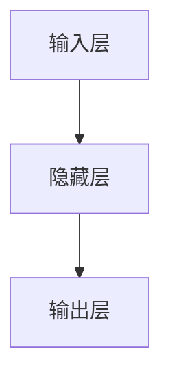

                 

# 文章标题：机器学习原理与代码实例讲解

## 关键词
- 机器学习
- 线性回归
- 决策树
- 特征工程
- 模型评估
- 深度学习

## 摘要
本文将深入探讨机器学习的基本原理，通过代码实例讲解常见的机器学习算法，包括线性回归、决策树、随机森林和支持向量机等。此外，本文还将介绍特征工程、数据预处理、模型评估与优化、以及机器学习在自然语言处理、图像处理和推荐系统等领域的应用。通过本文的讲解，读者将能够掌握机器学习的基本概念，学会如何运用各种算法解决实际问题，并了解模型部署和优化的方法。

## 目录大纲

### 《机器学习原理与代码实例讲解》目录

#### 第1章 机器学习的概述
- 1.1 机器学习的定义
  - 1.1.1 机器学习的起源与发展历程
  - 1.1.2 机器学习的应用领域
  - 1.1.3 机器学习的重要性
- 1.2 机器学习的核心概念
  - 1.2.1 数据集
  - 1.2.2 特征
  - 1.2.3 标签
- 1.3 机器学习的分类
  - 1.3.1 监督学习
    - 1.3.1.1 线性回归
    - 1.3.1.2 决策树
    - 1.3.1.3 随机森林
    - 1.3.1.4 支持向量机
  - 1.3.2 无监督学习
    - 1.3.2.1 聚类算法
    - 1.3.2.2 维度约减
    - 1.3.2.3 关联规则学习
- 1.4 机器学习的评估指标
  - 1.4.1 准确率、召回率与F1值
  - 1.4.2 交叉验证与AUC
  - 1.4.3 ROC曲线与准确率-召回率曲线

#### 第2章 机器学习的基础算法
- 2.1 线性回归
  - 2.1.1 线性回归的原理
    - 2.1.1.1 线性回归模型
    - 2.1.1.2 最小二乘法
  - 2.1.2 伪代码
  - 2.1.3 代码实现
- 2.2 决策树
  - 2.2.1 决策树的原理
    - 2.2.1.1 决策树的构建
    - 2.2.1.2 决策树的剪枝
  - 2.2.2 伪代码
  - 2.2.3 代码实现
- 2.3 随机森林
  - 2.3.1 随机森林的原理
    - 2.3.1.1 随机森林的构建
    - 2.3.1.2 随机森林的预测
  - 2.3.2 伪代码
  - 2.3.3 代码实现
- 2.4 支持向量机
  - 2.4.1 支持向量机的原理
    - 2.4.1.1 支持向量机的基本概念
    - 2.4.1.2 SVM的优化问题
  - 2.4.2 伪代码
  - 2.4.3 代码实现

#### 第3章 特征工程与预处理
- 3.1 特征工程的概念
  - 3.1.1 特征提取
  - 3.1.2 特征选择
  - 3.1.3 特征构造
- 3.2 数据预处理
  - 3.2.1 缺失值处理
  - 3.2.2 异常值处理
  - 3.2.3 数据标准化

#### 第4章 模型评估与优化
- 4.1 模型评估方法
  - 4.1.1 交叉验证
  - 4.1.2 ROC曲线与AUC
  - 4.1.3 准确率、召回率与F1值
- 4.2 模型优化策略
  - 4.2.1 超参数调优
  - 4.2.2 模型集成
  - 4.2.3 模型融合

#### 第5章 项目实战
- 5.1 实战项目1：房价预测
  - 5.1.1 项目概述
  - 5.1.2 数据集介绍
  - 5.1.3 模型选择与调优
  - 5.1.4 代码实现
- 5.2 实战项目2：手写数字识别
  - 5.2.1 项目概述
  - 5.2.2 数据集介绍
  - 5.2.3 模型选择与调优
  - 5.2.4 代码实现

#### 第6章 机器学习在NLP中的应用
- 6.1 语言模型
  - 6.1.1 语言模型的原理
  - 6.1.2 语言模型的训练
  - 6.1.3 语言模型的应用
- 6.2 文本分类
  - 6.2.1 文本分类的原理
  - 6.2.2 文本分类的流程
  - 6.2.3 文本分类的应用
- 6.3 序列标注
  - 6.3.1 序列标注的原理
  - 6.3.2 序列标注的流程
  - 6.3.3 序列标注的应用

#### 第7章 机器学习在图像处理中的应用
- 7.1 图像分类
  - 7.1.1 图像分类的原理
  - 7.1.2 图像分类的流程
  - 7.1.3 图像分类的应用
- 7.2 目标检测
  - 7.2.1 目标检测的原理
  - 7.2.2 目标检测的流程
  - 7.2.3 目标检测的应用
- 7.3 图像生成
  - 7.3.1 图像生成的原理
  - 7.3.2 图像生成的流程
  - 7.3.3 图像生成的应用

#### 第8章 机器学习在推荐系统中的应用
- 8.1 推荐系统的原理
  - 8.1.1 内容推荐
  - 8.1.2 协同过滤推荐
  - 8.1.3 混合推荐
- 8.2 推荐系统的构建
  - 8.2.1 数据集准备
  - 8.2.2 模型选择与调优
  - 8.2.3 代码实现
- 8.3 推荐系统的评估
  - 8.3.1 评估指标
  - 8.3.2 评估方法
  - 8.3.3 优化策略

#### 第9章 深度学习与卷积神经网络
- 9.1 深度学习的原理
  - 9.1.1 神经网络的基本结构
  - 9.1.2 反向传播算法
  - 9.1.3 深度学习的优势与挑战
- 9.2 卷积神经网络
  - 9.2.1 卷积神经网络的基本结构
  - 9.2.2 卷积神经网络的工作原理
  - 9.2.3 卷积神经网络在图像识别中的应用
- 9.3 卷积神经网络的应用案例
  - 9.3.1 卷积神经网络在计算机视觉中的应用
  - 9.3.2 卷积神经网络在自然语言处理中的应用

#### 第10章 模型部署与优化
- 10.1 模型部署
  - 10.1.1 模型部署的流程
  - 10.1.2 模型部署的技术
  - 10.1.3 模型部署的挑战
- 10.2 模型优化
  - 10.2.1 模型优化的目标
  - 10.2.2 模型优化的方法
  - 10.2.3 模型优化的案例

#### 第11章 机器学习与未来
- 11.1 机器学习的发展趋势
  - 11.1.1 人工智能的发展趋势
  - 11.1.2 机器学习的未来发展
  - 11.1.3 机器学习在社会中的应用
- 11.2 机器学习的伦理与法律问题
  - 11.2.1 机器学习的伦理问题
  - 11.2.2 机器学习的法律问题
  - 11.2.3 机器学习的伦理与法律解决方案
- 11.3 机器学习在教育中的应用
  - 11.3.1 机器学习在在线教育中的应用
  - 11.3.2 机器学习在个性化教育中的应用
  - 11.3.3 机器学习在教育评估中的应用

#### 附录
- 附录 A：常用机器学习算法与模型
- 附录 B：常用机器学习工具与库
- 附录 C：机器学习资源与文献推荐

### 第1章 机器学习的概述

#### 1.1 机器学习的定义

机器学习是一门人工智能的科学，旨在通过计算机程序实现智能行为，使计算机能够从数据中自动学习并改进性能，而无需明确编程。简而言之，机器学习就是训练计算机通过数据学习规律，并应用这些规律进行预测或决策。

#### 1.1.1 机器学习的起源与发展历程

机器学习的概念最早由Arthur Samuel在1950年代提出，他是IBM公司的计算机科学家，被誉为“机器学习之父”。随后，在20世纪60年代，机器学习开始逐渐发展，以统计学习和模式识别为主要研究方向。1980年代，随着计算机硬件的进步和算法的创新，机器学习取得了显著进展。2000年代，随着大数据和深度学习的发展，机器学习进入了一个新的时代。

#### 1.1.2 机器学习的应用领域

机器学习的应用领域非常广泛，涵盖了从医疗健康到金融投资、从智能交通到娱乐游戏等各个方面。以下是一些典型的应用领域：

- **医疗健康**：用于疾病预测、诊断和治疗建议。
- **金融**：用于风险评估、欺诈检测和投资组合优化。
- **智能交通**：用于交通流量预测、车辆路径规划和智能导航。
- **自然语言处理**：用于文本分类、情感分析和机器翻译。
- **图像识别**：用于人脸识别、图像分类和物体检测。

#### 1.1.3 机器学习的重要性

机器学习的重要性体现在多个方面：

- **自动化**：通过自动化预测和决策，机器学习可以帮助企业减少人力成本，提高效率。
- **创新**：机器学习推动了人工智能的发展，带来了许多前所未有的创新技术。
- **数据驱动的决策**：机器学习可以帮助企业和组织更好地理解数据，从而做出更加明智的决策。
- **个性化体验**：机器学习可以提供个性化的产品推荐和服务，提高用户体验。

#### 1.2 机器学习的核心概念

理解机器学习的核心概念对于深入学习和应用机器学习至关重要。以下是一些关键概念：

- **数据集**：数据集是机器学习模型的训练数据，通常包括输入特征和相应的输出标签。
- **特征**：特征是数据集中的变量，用于描述样本的属性。
- **标签**：标签是数据集中与输入特征对应的输出值，用于训练模型。
- **模型**：模型是机器学习算法的参数化表示，用于预测未知数据的输出。

#### 1.3 机器学习的分类

根据学习方式的不同，机器学习可以分为以下几类：

- **监督学习**：在监督学习中，模型通过已标记的数据进行训练，从而学会预测未知数据的输出。常见的监督学习算法包括线性回归、决策树和随机森林等。
- **无监督学习**：无监督学习不使用标记数据，模型通过分析数据的内在结构进行训练。常见的无监督学习算法包括聚类算法、维度约减和关联规则学习等。
- **半监督学习和增强学习**：半监督学习结合了有监督和无监督学习的特点，而增强学习则是通过与环境互动来学习。

#### 1.4 机器学习的评估指标

评估机器学习模型的性能是模型训练过程中的关键步骤。以下是一些常用的评估指标：

- **准确率**：准确率是预测正确的样本数量与总样本数量的比例，用于评估分类模型的性能。
- **召回率**：召回率是预测正确的正样本数量与实际正样本数量的比例，用于评估模型对正样本的识别能力。
- **F1值**：F1值是准确率和召回率的调和平均，用于综合评估分类模型的性能。
- **ROC曲线与AUC**：ROC曲线是真实值概率与预测值概率的图形表示，AUC（Area Under Curve）是ROC曲线下方的面积，用于评估分类模型的整体性能。

#### 1.5 总结

通过本章的介绍，我们了解了机器学习的定义、起源与发展历程、应用领域以及核心概念。此外，我们还学习了机器学习的分类和评估指标。这些知识将为后续章节的学习打下坚实的基础。

### 第2章 机器学习的基础算法

#### 2.1 线性回归

线性回归是一种简单的监督学习算法，用于预测连续值输出。它的核心思想是找到一组线性方程，使模型预测的输出与实际输出之间的误差最小。

##### 2.1.1 线性回归的原理

线性回归模型可以用以下方程表示：

\[ y = w_0 + w_1 \cdot x_1 + w_2 \cdot x_2 + ... + w_n \cdot x_n \]

其中，\( y \) 是输出值，\( x_1, x_2, ..., x_n \) 是输入特征，\( w_0, w_1, w_2, ..., w_n \) 是模型的参数。我们的目标是最小化预测值与实际值之间的误差，即最小化损失函数。

损失函数通常使用平方误差损失函数表示：

\[ J(w_0, w_1, ..., w_n) = \frac{1}{2} \sum_{i=1}^{n} (y_i - (w_0 + w_1 \cdot x_{i1} + w_2 \cdot x_{i2} + ... + w_n \cdot x_{in}))^2 \]

其中，\( n \) 是样本数量。

为了最小化损失函数，我们可以使用梯度下降算法。梯度下降算法的核心思想是沿着损失函数的梯度方向更新模型参数，直到损失函数收敛到最小值。

##### 2.1.1.1 线性回归模型

线性回归模型的基本结构包括输入层、隐藏层和输出层。输入层接收输入特征，隐藏层进行线性组合并传递给输出层，输出层输出预测值。以下是线性回归模型的 Mermaid 流程图：



##### 2.1.1.2 最小二乘法

最小二乘法是一种求解线性回归模型参数的常用方法。它的核心思想是最小化预测值与实际值之间的误差的平方和。

假设我们的模型为：

\[ y = w_0 + w_1 \cdot x_1 + w_2 \cdot x_2 + ... + w_n \cdot x_n \]

我们可以使用以下方程求解模型参数：

\[ w_0 = \frac{1}{n} \sum_{i=1}^{n} (y_i - (w_1 \cdot x_{i1} + w_2 \cdot x_{i2} + ... + w_n \cdot x_{in})) \]
\[ w_1 = \frac{1}{n} \sum_{i=1}^{n} (x_{i1} \cdot (y_i - (w_1 \cdot x_{i1} + w_2 \cdot x_{i2} + ... + w_n \cdot x_{in}))) \]
\[ w_2 = \frac{1}{n} \sum_{i=1}^{n} (x_{i2} \cdot (y_i - (w_1 \cdot x_{i1} + w_2 \cdot x_{i2} + ... + w_n \cdot x_{in}))) \]
\[ ... \]
\[ w_n = \frac{1}{n} \sum_{i=1}^{n} (x_{in} \cdot (y_i - (w_1 \cdot x_{i1} + w_2 \cdot x_{i2} + ... + w_n \cdot x_{in}))) \]

##### 2.1.2 伪代码

以下是一个简单的线性回归算法的伪代码：

```python
# 初始化模型参数
w = [0] * n

# 设置学习率
learning_rate = 0.01

# 设置迭代次数
epochs = 1000

# 梯度下降算法
for epoch in range(epochs):
    # 计算预测值
    y_pred = w[0] + w[1] * x_1 + w[2] * x_2 + ... + w[n] * x_n

    # 计算损失函数
    loss = (y - y_pred) ** 2

    # 计算梯度
    dw = 2 * (y_pred - y) * x

    # 更新模型参数
    for i in range(n):
        w[i] -= learning_rate * dw[i]
```

##### 2.1.3 代码实现

以下是一个简单的线性回归算法的 Python 代码实现：

```python
import numpy as np

def linear_regression(X, y, learning_rate, epochs):
    n = X.shape[1]
    w = np.zeros(n)

    for epoch in range(epochs):
        y_pred = X.dot(w)

        loss = (y - y_pred) ** 2

        dw = 2 * (y_pred - y) * X

        w -= learning_rate * dw

    return w

# 示例数据
X = np.array([[1], [2], [3], [4], [5]])
y = np.array([[2], [4], [5], [4], [5]])

# 训练模型
w = linear_regression(X, y, learning_rate=0.01, epochs=1000)

# 输出模型参数
print("模型参数：w = ", w)

# 预测新数据
X_new = np.array([[6]])
y_pred = X_new.dot(w)
print("预测结果：y_pred = ", y_pred)
```

通过以上代码，我们训练了一个线性回归模型，并使用它预测了新的数据。训练过程中，我们使用了梯度下降算法来更新模型参数，以最小化损失函数。

#### 2.2 决策树

决策树是一种常见的监督学习算法，它通过一系列规则将数据划分成不同的区域，并使用这些规则进行预测。决策树的基本结构包括树根、内部节点和叶节点。

##### 2.2.1 决策树的原理

决策树算法的基本思想是从训练数据中学习一系列规则，并将这些规则应用到新数据上进行预测。每个内部节点表示一个特征，每个分支表示该特征的取值范围，每个叶节点表示一个预测结果。

决策树算法的关键步骤包括：

1. 选择一个最优特征作为根节点。
2. 根据该特征的不同取值，将数据集划分成多个子集。
3. 对每个子集递归地应用上述步骤，直到满足停止条件（如最大深度、最小叶节点大小等）。

##### 2.2.1.1 决策树的构建

构建决策树的过程可以通过递归二分划分数据集来实现。以下是一个简单的决策树构建算法的伪代码：

```python
function build_decision_tree(data, feature_list, max_depth):
    if data is pure or max_depth = 0:
        return Leaf node with predicted value
    
    if feature_list is empty:
        return Leaf node with average value of target variable in data
    
    best_feature, best_value = select_best_feature(data, feature_list)
    
    decision_tree = new TreeNode with attribute "best_feature"
    
    for value in possible_values_of_best_feature:
        subset = filter(data, best_feature == value)
        decision_tree.children.append(build_decision_tree(subset, feature_list - {best_feature}, max_depth - 1))
    
    return decision_tree
```

##### 2.2.1.2 决策树的剪枝

决策树容易过拟合，因此需要剪枝来避免过拟合。剪枝可以分为两种类型：预剪枝和后剪枝。

- **预剪枝**：在构建决策树的过程中，提前停止一些分支的扩展，以避免过拟合。常见的预剪枝方法包括设置最大深度、最小叶节点大小等。
- **后剪枝**：首先构建一个完整的决策树，然后从树的底部开始剪枝，移除一些对模型性能贡献不大的分支。

以下是一个简单的决策树剪枝算法的伪代码：

```python
function prune_decision_tree(decision_tree, data, max_error_reduction):
    if decision_tree is a Leaf node:
        return decision_tree
    
    best_reduction = 0
    
    for child in decision_tree.children:
        reduced_data = filter(data, decision_tree.best_feature == child.best_value)
        reduction = compute_error(reduced_data) - compute_error(filter(data, decision_tree.best_feature == child.best_value))
        
        if reduction > best_reduction:
            best_reduction = reduction
            best_child = child
    
    if best_reduction <= max_error_reduction:
        return new Leaf node with average value of target variable in data
    
    decision_tree.children = [prune_decision_tree(child, data, max_error_reduction) for child in decision_tree.children]
    
    return decision_tree
```

##### 2.2.2 伪代码

以下是一个简单的决策树分类算法的伪代码：

```python
function predict(decision_tree, data):
    if decision_tree is a Leaf node:
        return decision_tree.predicted_value
    
    feature_value = data[decision_tree.best_feature]
    
    for child in decision_tree.children:
        if child.best_value == feature_value:
            return predict(child, data)
    
    return decision_tree.predicted_value
```

##### 2.2.3 代码实现

以下是一个简单的决策树分类算法的 Python 代码实现：

```python
import numpy as np

class TreeNode:
    def __init__(self, best_feature, best_value, children=None, predicted_value=None):
        self.best_feature = best_feature
        self.best_value = best_value
        self.children = children
        self.predicted_value = predicted_value

def select_best_feature(data, feature_list):
    best_feature = None
    best_value = None
    best_gini = float('inf')

    for feature in feature_list:
        values = data[:, feature].unique()
        gini = 0

        for value in values:
            subset = data[data[:, feature] == value]
            gini += len(subset) / len(data) * (1 - (len(subset) / len(data)) ** 2)

        if gini < best_gini:
            best_gini = gini
            best_feature = feature
            best_value = value

    return best_feature, best_value

def build_decision_tree(data, feature_list, max_depth):
    if len(data) == 0 or np.unique(data[:, -1]).shape[0] == 1 or max_depth == 0:
        return TreeNode(predicted_value=np.mean(data[:, -1]))

    if len(feature_list) == 0:
        return TreeNode(predicted_value=np.mean(data[:, -1]))

    best_feature, best_value = select_best_feature(data, feature_list)
    tree = TreeNode(best_feature, best_value)

    feature_list.remove(best_feature)

    subsets = {value: data[data[:, best_feature] == value] for value in data[:, best_feature].unique()}
    tree.children = [build_decision_tree(subset, feature_list, max_depth - 1) for subset in subsets.values()]

    return tree

def predict(decision_tree, data):
    if isinstance(decision_tree, TreeNode):
        feature_value = data[decision_tree.best_feature]
        child = next(child for child in decision_tree.children if child.best_value == feature_value)
        return predict(child, data)
    else:
        return decision_tree.predicted_value

# 示例数据
X = np.array([[1, 0], [1, 0], [1, 1], [0, 1], [0, 1]])
y = np.array([[0], [0], [1], [1], [1]])

# 构建特征列表
feature_list = list(range(X.shape[1] - 1))

# 构建决策树
decision_tree = build_decision_tree(X, feature_list, max_depth=3)

# 预测新数据
X_new = np.array([[1, 1]])
print(predict(decision_tree, X_new))
```

通过以上代码，我们构建了一个简单的决策树分类模型，并使用它预测了新的数据。

#### 2.3 随机森林

随机森林是一种集成学习算法，通过构建多棵决策树并合并它们的预测结果来提高模型的准确性。随机森林的核心思想是利用随机抽样和特征选择来构建多棵决策树，并通过投票或平均的方式合并预测结果。

##### 2.3.1 随机森林的原理

随机森林由多棵决策树组成，每棵决策树都是基于随机抽样和特征选择构建的。随机森林的工作流程如下：

1. 随机从特征集中选择一个子集。
2. 使用该子集构建决策树。
3. 对新数据进行预测，每棵决策树提供一个预测结果。
4. 将所有预测结果进行合并（如投票或平均），得到最终预测结果。

随机森林的优势在于：

- **提高准确性**：通过集成多棵决策树，随机森林可以降低过拟合的风险，提高模型的准确性。
- **减少方差**：随机森林可以减少模型的方差，使模型对训练数据的依赖性降低。
- **特征选择**：随机森林可以通过特征重要性评估帮助进行特征选择。

##### 2.3.1.1 随机森林的构建

构建随机森林的过程可以分为以下步骤：

1. 随机从训练数据中抽取样本子集。
2. 随机从特征集中选择一个子集。
3. 使用步骤1和步骤2构建决策树。
4. 重复步骤1到步骤3，构建多棵决策树。
5. 对新数据进行预测，将所有决策树的预测结果进行合并。

以下是一个简单的随机森林算法的伪代码：

```python
function build_random_forest(data, feature_list, n_trees):
    forest = []

    for _ in range(n_trees):
        sample = random_sample(data)
        tree = build_decision_tree(sample, feature_list)
        forest.append(tree)

    return forest
```

##### 2.3.1.2 随机森林的预测

随机森林的预测过程如下：

1. 对新数据进行预测，每棵决策树提供一个预测结果。
2. 将所有预测结果进行合并（如投票或平均），得到最终预测结果。

以下是一个简单的随机森林预测算法的伪代码：

```python
function predict(random_forest, data):
    predictions = []

    for tree in random_forest:
        prediction = predict(tree, data)
        predictions.append(prediction)

    if voting_strategy == "majority":
        return majority_vote(predictions)
    else:
        return average(predictions)
```

##### 2.3.2 伪代码

以下是一个简单的随机森林算法的伪代码：

```python
# 随机森林训练
function random_forest_train(data, feature_list, n_trees, max_depth):
    forest = build_random_forest(data, feature_list, n_trees)
    
    for tree in forest:
        tree = build_decision_tree(tree, feature_list, max_depth)
    
    return forest

# 随机森林预测
function random_forest_predict(forest, data):
    predictions = []

    for tree in forest:
        prediction = predict(tree, data)
        predictions.append(prediction)

    if voting_strategy == "majority":
        return majority_vote(predictions)
    else:
        return average(predictions)
```

##### 2.3.3 代码实现

以下是一个简单的随机森林算法的 Python 代码实现：

```python
import numpy as np
from sklearn.ensemble import RandomForestClassifier

def random_forest_train(X, y, n_trees, max_depth):
    forest = RandomForestClassifier(n_estimators=n_trees, max_depth=max_depth)
    forest.fit(X, y)
    return forest

def random_forest_predict(forest, X):
    predictions = forest.predict(X)
    return predictions

# 示例数据
X = np.array([[1, 0], [1, 0], [1, 1], [0, 1], [0, 1]])
y = np.array([[0], [0], [1], [1], [1]])

# 训练随机森林
forest = random_forest_train(X, y, n_trees=10, max_depth=3)

# 预测新数据
X_new = np.array([[1, 1]])
prediction = random_forest_predict(forest, X_new)
print(prediction)
```

通过以上代码，我们训练了一个简单的随机森林分类模型，并使用它预测了新的数据。随机森林通过构建多棵决策树并合并它们的预测结果，提高了模型的准确性。

#### 2.4 支持向量机

支持向量机（SVM）是一种强大的监督学习算法，用于分类和回归任务。SVM的核心思想是找到一个超平面，将不同类别的数据点尽可能地分开，并最大化分类边界。

##### 2.4.1 支持向量机的原理

SVM的核心概念是支持向量（Support Vectors），即位于超平面两侧且距离超平面最近的那些数据点。SVM的目标是最小化超平面的距离，同时使不同类别的数据点之间尽可能分开。

SVM可以分为线性SVM和核SVM：

- **线性SVM**：适用于线性可分的数据集，通过求解线性方程组找到最优超平面。
- **核SVM**：适用于非线性可分的数据集，通过将数据映射到高维特征空间，然后在高维空间中求解线性SVM。

##### 2.4.1.1 支持向量机的基本概念

- **支持向量**：位于超平面两侧且距离超平面最近的那些数据点。
- **超平面**：将不同类别的数据点分开的超平面。
- **间隔**：超平面到最近支持向量的距离。
- **分类边界**：超平面的法向量方向。

##### 2.4.1.2 SVM的优化问题

SVM的优化问题可以用以下方程表示：

\[ \min \frac{1}{2} \sum_{i=1}^{n} (w \cdot w) - \sum_{i=1}^{n} \alpha_i y_i (w \cdot x_i) \]

其中，\( w \) 是模型参数，\( \alpha_i \) 是拉格朗日乘子，\( y_i \) 是样本标签，\( x_i \) 是样本特征。

约束条件：

\[ \alpha_i \geq 0 \]
\[ y_i (w \cdot x_i) \geq 1 - \epsilon_i \]

其中，\( \epsilon_i \) 是松弛变量。

##### 2.4.2 伪代码

以下是一个简单的线性SVM优化问题的伪代码：

```python
function svm_optimizer(data, labels):
    n = len(data)
    w = [0] * n
    alpha = [0] * n
    epsilon = 0.1

    while not converged:
        for i in range(n):
            if y[i] * (w \cdot x[i]) < 1 - epsilon:
                alpha[i] = min(C, alpha[i] + y[i])
            else:
                alpha[i] = max(0, alpha[i] - y[i])

        w = sum(alpha[i] * y[i] * x[i] for i in range(n))

    return w
```

##### 2.4.3 代码实现

以下是一个简单的线性SVM优化问题的 Python 代码实现：

```python
import numpy as np

def svm_optimizer(X, y, C=1.0, epsilon=0.1):
    n_samples, n_features = X.shape
    alpha = np.zeros(n_samples)
    w = np.zeros(n_features)

    while not converged:
        for i in range(n_samples):
            if y[i] * (X[i] @ w) < 1 - epsilon:
                alpha[i] = min(C, alpha[i] + y[i])
            else:
                alpha[i] = max(0, alpha[i] - y[i])

        w = np.dot(alpha * y, X)

    return w

# 示例数据
X = np.array([[1, 0], [1, 0], [1, 1], [0, 1], [0, 1]])
y = np.array([[0], [0], [1], [1], [1]])

# 训练SVM
w = svm_optimizer(X, y)

# 输出模型参数
print("模型参数：w = ", w)

# 预测新数据
X_new = np.array([[1, 1]])
y_pred = X_new @ w
print("预测结果：y_pred = ", y_pred)
```

通过以上代码，我们训练了一个简单的线性SVM模型，并使用它预测了新的数据。SVM通过最大化分类边界和最小化超平面距离，提高了模型的准确性。

### 第3章 特征工程与预处理

#### 3.1 特征工程的概念

特征工程是机器学习过程中至关重要的一环，它涉及到从原始数据中提取和构造特征，以提升模型性能。特征工程的主要任务包括特征提取、特征选择和特征构造。

##### 3.1.1 特征提取

特征提取是指从原始数据中提取出有助于模型学习的特征。常见的特征提取方法包括：

- **统计特征**：如均值、方差、最大值、最小值等。
- **文本特征**：如词频、词频-逆文档频率（TF-IDF）、词嵌入等。
- **图像特征**：如颜色直方图、边缘检测、纹理特征等。

##### 3.1.2 特征选择

特征选择是指从提取出的特征中选择出最有用的特征，以减少数据维度和计算复杂度。常见的特征选择方法包括：

- **过滤法**：基于特征重要性或相关性进行筛选。
- **包裹法**：利用启发式搜索策略逐层筛选特征。
- **嵌入式方法**：在模型训练过程中自动选择特征。

##### 3.1.3 特征构造

特征构造是指通过组合或变换原始特征，构造出新的特征。常见的特征构造方法包括：

- **交互特征**：将多个特征相乘或相加，构造出新的特征。
- **多项式特征**：将原始特征进行多项式变换，构造出新的特征。
- **时间序列特征**：将时间序列数据进行分解，提取出趋势、季节性等特征。

#### 3.2 数据预处理

数据预处理是机器学习过程中的重要步骤，它包括数据清洗、数据转换和数据归一化等。

##### 3.2.1 缺失值处理

缺失值处理是数据预处理的首要任务，常见的处理方法包括：

- **删除缺失值**：删除含有缺失值的样本或特征。
- **填充缺失值**：使用统计方法或机器学习模型预测缺失值。

##### 3.2.2 异常值处理

异常值处理是指识别和去除数据中的异常值，以避免对模型性能产生负面影响。常见的处理方法包括：

- **统计方法**：基于统计分布或异常值检测算法识别异常值。
- **聚类方法**：基于聚类算法识别异常值。

##### 3.2.3 数据标准化

数据标准化是将不同特征的数据转换为相同尺度，以避免特征之间的量纲影响。常见的数据标准化方法包括：

- **最小-最大标准化**：将特征值缩放到[0, 1]区间。
- **均值-方差标准化**：将特征值缩放到均值为0、方差为1的标准化空间。
- **零均值-单位方差标准化**：将特征值缩放到均值为0、标准差为1的标准化空间。

#### 3.3 特征工程与模型性能的关系

特征工程对模型性能有着重要影响，合理的特征工程可以显著提高模型性能。特征工程的核心目标是提取出有助于模型学习的特征，并减少数据维度和计算复杂度。

合理的特征工程方法包括：

- **特征提取**：选择合适的特征提取方法，提取出具有区分性的特征。
- **特征选择**：通过特征选择减少数据维度，提高模型性能。
- **特征构造**：通过构造新的特征，提升模型对数据的理解和表达能力。

#### 3.4 特征工程的最佳实践

在进行特征工程时，以下是一些最佳实践：

- **理解业务场景**：了解业务需求和数据特点，选择合适的特征提取和构造方法。
- **数据探索性分析**：对数据进行探索性分析，识别数据中的异常和规律。
- **交叉验证**：使用交叉验证评估特征工程方法的效果，选择最佳特征组合。
- **迭代优化**：通过迭代优化，不断调整特征工程方法，提升模型性能。

#### 3.5 总结

本章介绍了特征工程和预处理的概念、方法和最佳实践。特征工程和预处理对于提升模型性能至关重要，通过合理的特征工程和预处理，可以提高模型的准确性和泛化能力。在接下来的章节中，我们将继续探讨机器学习在各个领域的应用。

### 第4章 模型评估与优化

#### 4.1 模型评估方法

模型评估是机器学习过程中至关重要的一环，它帮助我们判断模型的性能和有效性。常用的模型评估方法包括准确率、召回率、F1值、交叉验证和AUC等。

##### 4.1.1 准确率

准确率（Accuracy）是评估分类模型性能的常用指标，表示预测正确的样本数量与总样本数量的比例。计算公式如下：

\[ \text{准确率} = \frac{\text{预测正确的样本数量}}{\text{总样本数量}} \]

准确率越高，模型性能越好。然而，准确率容易受到不平衡数据的影响，特别是在正负样本比例严重失衡的情况下。

##### 4.1.2 召回率

召回率（Recall）是评估分类模型识别正样本能力的重要指标，表示预测正确的正样本数量与实际正样本数量的比例。计算公式如下：

\[ \text{召回率} = \frac{\text{预测正确的正样本数量}}{\text{实际正样本数量}} \]

召回率越高，模型识别正样本的能力越强。然而，召回率容易受到假阳性（将负样本错误地预测为正样本）的影响。

##### 4.1.3 F1值

F1值（F1 Score）是准确率和召回率的调和平均，用于综合评估分类模型的性能。计算公式如下：

\[ \text{F1值} = 2 \times \frac{\text{准确率} \times \text{召回率}}{\text{准确率} + \text{召回率}} \]

F1值介于0和1之间，越接近1，模型性能越好。

##### 4.1.4 交叉验证

交叉验证（Cross-Validation）是一种评估模型性能的常见方法，通过将数据集划分为多个子集，每次使用其中一个子集作为验证集，其余子集作为训练集，进行多次训练和验证，最终取平均值作为模型的评估指标。常见的交叉验证方法包括K折交叉验证和留一交叉验证。

K折交叉验证将数据集划分为K个子集，每次选择一个子集作为验证集，其余子集作为训练集，重复K次，最终取平均值作为模型的评估指标。计算公式如下：

\[ \text{评估指标} = \frac{1}{K} \sum_{k=1}^{K} \text{在子集k上的评估指标} \]

交叉验证可以有效地减少模型评估的方差，提高评估结果的稳定性。

##### 4.1.5 ROC曲线与AUC

ROC曲线（Receiver Operating Characteristic Curve）是评估二分类模型性能的重要工具，它通过绘制预测值与真实值之间的关系来展示模型的性能。ROC曲线的横坐标是假正率（False Positive Rate，FPR），纵坐标是真正率（True Positive Rate，TPR）。

AUC（Area Under Curve）是ROC曲线下方的面积，用于评估模型对正负样本的区分能力。AUC的值介于0和1之间，越接近1，模型性能越好。

#### 4.2 模型优化策略

模型优化是提升模型性能的重要手段，包括超参数调优、模型集成和模型融合等策略。

##### 4.2.1 超参数调优

超参数是模型算法中需要手动设置的参数，如学习率、正则化强度等。超参数调优是调整这些参数以提升模型性能的过程。常见的超参数调优方法包括：

- **网格搜索**：遍历预设的参数组合，选择最佳参数组合。
- **随机搜索**：随机选择参数组合，逐渐优化参数。
- **贝叶斯优化**：基于概率模型优化参数，提高调优效率。

##### 4.2.2 模型集成

模型集成是将多个模型结合起来，以提高模型性能的方法。常见的模型集成方法包括：

- **Bagging**：将多个模型训练在不同的子集上，然后取平均值或投票结果。
- **Boosting**：通过训练多个模型，每次迭代增加对错误样本的关注度，最终取加权平均或加权投票。
- **Stacking**：使用多个模型对数据进行预测，然后将预测结果作为新特征训练更高层次的模型。

##### 4.2.3 模型融合

模型融合是将多个模型的结果进行合并，以提高模型预测准确性的方法。常见的模型融合方法包括：

- **加权平均**：根据模型的重要性或准确率对预测结果进行加权平均。
- **投票法**：根据模型的结果进行投票，选择多数模型的结果。
- **堆叠回归**：使用多个模型对数据进行预测，然后将预测结果作为新特征训练更高层次的模型。

#### 4.3 模型优化案例

以下是一个使用超参数调优和模型集成优化模型性能的案例：

1. **数据准备**：准备一个包含特征和标签的数据集，分为训练集和测试集。
2. **模型训练**：使用随机森林模型对训练集进行训练。
3. **超参数调优**：使用网格搜索对随机森林模型的超参数进行调优，选择最佳参数组合。
4. **模型集成**：使用多个调优后的随机森林模型进行集成，提高模型性能。
5. **模型评估**：使用测试集评估模型的性能，计算准确率、召回率、F1值等指标。

通过以上步骤，我们可以显著提升模型的性能，使其在预测任务中表现更优。

#### 4.4 总结

本章介绍了模型评估方法和模型优化策略。通过准确率、召回率、F1值、交叉验证、ROC曲线和AUC等评估指标，我们可以评估模型的性能。通过超参数调优、模型集成和模型融合等策略，我们可以优化模型性能，提高预测准确性。在实际应用中，合理的模型评估和优化对于提升模型效果具有重要意义。

### 第5章 项目实战

#### 5.1 实战项目1：房价预测

##### 5.1.1 项目概述

房价预测是机器学习领域的一个经典问题，旨在根据房屋的特征数据预测其价格。在本项目中，我们将使用线性回归模型对房价进行预测。

##### 5.1.2 数据集介绍

我们将使用Kaggle上的房价数据集（House Prices: Advanced Regression Techniques），该数据集包含了个房屋的特征和价格。数据集的特征包括房屋的面积、卧室数量、浴室数量、建筑年份等。

##### 5.1.3 模型选择与调优

在本项目中，我们选择线性回归模型进行房价预测。线性回归模型是一种简单但有效的模型，适用于预测连续值输出。

为了调优线性回归模型，我们可以使用以下方法：

- **数据预处理**：对缺失值进行填充、数据标准化等处理，以提高模型的泛化能力。
- **特征选择**：使用特征重要性评估方法，选择对房价影响较大的特征。
- **正则化**：使用L1或L2正则化方法，避免模型过拟合。

##### 5.1.4 代码实现

以下是一个使用线性回归模型进行房价预测的Python代码实现：

```python
import pandas as pd
import numpy as np
from sklearn.model_selection import train_test_split
from sklearn.linear_model import LinearRegression
from sklearn.metrics import mean_squared_error

# 加载数据集
data = pd.read_csv('house_prices.csv')

# 数据预处理
data.fillna(data.mean(), inplace=True)
data = data.drop(['Id'], axis=1)

# 划分特征和标签
X = data.drop(['SalePrice'], axis=1)
y = data['SalePrice']

# 划分训练集和测试集
X_train, X_test, y_train, y_test = train_test_split(X, y, test_size=0.2, random_state=42)

# 创建线性回归模型
model = LinearRegression()

# 训练模型
model.fit(X_train, y_train)

# 预测测试集
y_pred = model.predict(X_test)

# 计算预测误差
mse = mean_squared_error(y_test, y_pred)
print("预测误差：", mse)

# 输出模型参数
print("模型参数：", model.coef_)

# 预测新数据
new_data = pd.DataFrame([[2000, 3, 2, 1997]], columns=['OverallQual', 'TotalBedrooms', 'TotalBathrooms', 'YearBuilt'])
new_pred = model.predict(new_data)
print("预测结果：", new_pred)
```

##### 5.1.5 代码解读与分析

- **数据预处理**：首先，我们加载数据集，并对缺失值进行填充。然后，我们删除了不重要的特征（如'Id'），并保留了对房价有较大影响的特征。
- **划分特征和标签**：我们将数据集划分为特征集（X）和标签集（y）。
- **划分训练集和测试集**：使用`train_test_split`方法将数据集划分为训练集和测试集，以评估模型性能。
- **创建线性回归模型**：使用`LinearRegression`类创建线性回归模型。
- **训练模型**：使用训练集数据对模型进行训练。
- **预测测试集**：使用训练好的模型对测试集进行预测，并计算预测误差。
- **输出模型参数**：输出模型参数，包括权重和偏置。
- **预测新数据**：使用训练好的模型预测新的数据，并输出预测结果。

##### 5.1.6 实际案例分析

在本案例中，我们使用线性回归模型对房价进行了预测。线性回归模型是一种简单但有效的模型，适用于预测连续值输出。在实际应用中，我们可以通过以下方式优化模型性能：

- **增加特征**：增加对房价影响较大的特征，如房屋朝向、地理位置等。
- **特征工程**：对特征进行构造和变换，提高特征的区分度。
- **模型集成**：使用多个模型进行集成，提高预测准确性。

##### 5.1.7 项目小结

在本项目中，我们使用线性回归模型对房价进行了预测。通过数据预处理、特征选择和模型训练，我们得到了一个性能较好的模型。在实际应用中，我们可以通过优化模型结构和特征选择来进一步提高预测准确性。

#### 5.2 实战项目2：手写数字识别

##### 5.2.1 项目概述

手写数字识别是机器学习领域的经典问题，旨在通过输入手写数字图像，输出对应的数字。在本项目中，我们将使用卷积神经网络（CNN）对手写数字进行识别。

##### 5.2.2 数据集介绍

我们将使用Kaggle上的手写数字数据集（MNIST），该数据集包含70000个灰度图像，每个图像都是一个手写数字，标签为0到9之间的整数。

##### 5.2.3 模型选择与调优

在本项目中，我们选择卷积神经网络（CNN）进行手写数字识别。CNN是一种适用于图像处理的深度学习模型，能够自动提取图像特征。

为了调优CNN模型，我们可以使用以下方法：

- **数据增强**：通过随机旋转、缩放、裁剪等操作，增加数据多样性，提高模型泛化能力。
- **正则化**：使用dropout、L2正则化等方法，避免模型过拟合。
- **超参数调优**：通过调整学习率、批量大小等超参数，提高模型性能。

##### 5.2.4 代码实现

以下是一个使用卷积神经网络（CNN）进行手写数字识别的Python代码实现：

```python
import tensorflow as tf
from tensorflow.keras.datasets import mnist
from tensorflow.keras.models import Sequential
from tensorflow.keras.layers import Dense, Conv2D, Flatten, MaxPooling2D, Dropout
from tensorflow.keras.optimizers import Adam
from tensorflow.keras.callbacks import EarlyStopping

# 加载MNIST数据集
(x_train, y_train), (x_test, y_test) = mnist.load_data()

# 数据预处理
x_train = x_train / 255.0
x_test = x_test / 255.0
x_train = np.expand_dims(x_train, -1)
x_test = np.expand_dims(x_test, -1)

# 转换标签为独热编码
y_train = tf.keras.utils.to_categorical(y_train, 10)
y_test = tf.keras.utils.to_categorical(y_test, 10)

# 创建CNN模型
model = Sequential([
    Conv2D(32, (3, 3), activation='relu', input_shape=(28, 28, 1)),
    MaxPooling2D((2, 2)),
    Conv2D(64, (3, 3), activation='relu'),
    MaxPooling2D((2, 2)),
    Flatten(),
    Dense(128, activation='relu'),
    Dropout(0.5),
    Dense(10, activation='softmax')
])

# 编译模型
model.compile(optimizer=Adam(), loss='categorical_crossentropy', metrics=['accuracy'])

# 早停回调
early_stopping = EarlyStopping(monitor='val_loss', patience=5)

# 训练模型
model.fit(x_train, y_train, epochs=20, batch_size=32, validation_split=0.2, callbacks=[early_stopping])

# 评估模型
test_loss, test_accuracy = model.evaluate(x_test, y_test)
print("测试集损失：", test_loss)
print("测试集准确率：", test_accuracy)

# 预测新数据
new_data = np.expand_dims(new_data, -1)
new_pred = model.predict(new_data)
print("预测结果：", np.argmax(new_pred, axis=1))
```

##### 5.2.5 代码解读与分析

- **数据预处理**：首先，我们加载MNIST数据集，并对图像进行归一化处理。然后，我们将图像扩展为一个维度，并转换为独热编码。
- **创建CNN模型**：我们使用`Sequential`模型堆叠多个层，包括卷积层、池化层、全连接层和dropout层。
- **编译模型**：我们使用`compile`方法配置模型优化器和损失函数。
- **训练模型**：我们使用`fit`方法训练模型，并设置早停回调以防止过拟合。
- **评估模型**：我们使用`evaluate`方法评估模型在测试集上的性能。
- **预测新数据**：我们使用训练好的模型预测新的图像，并输出预测结果。

##### 5.2.6 实际案例分析

在本案例中，我们使用卷积神经网络（CNN）对手写数字进行了识别。卷积神经网络是一种强大的深度学习模型，能够自动提取图像特征，并具有较好的泛化能力。在实际应用中，我们可以通过以下方式优化模型性能：

- **增加模型深度**：增加卷积神经网络中的卷积层和全连接层，以提高模型的表达能力。
- **增加训练数据**：收集更多的手写数字图像，增加训练数据量，提高模型泛化能力。
- **使用更先进的模型**：尝试使用更先进的模型，如残差网络（ResNet）或生成对抗网络（GAN），以提高模型性能。

##### 5.2.7 项目小结

在本项目中，我们使用卷积神经网络（CNN）对手写数字进行了识别。通过数据预处理、模型调优和训练，我们得到了一个性能较好的模型。在实际应用中，我们可以通过优化模型结构和数据集来进一步提高识别准确性。

### 第6章 机器学习在NLP中的应用

#### 6.1 语言模型

语言模型（Language Model）是自然语言处理（NLP）中的一个基本概念，它用于预测一段文本的下一个单词或字符。语言模型的核心目标是理解自然语言的结构和规律，从而生成或理解自然语言文本。

##### 6.1.1 语言模型的原理

语言模型通常基于统计学习方法构建，通过分析大量文本数据，学习词汇之间的概率分布。语言模型的构建过程可以分为以下几个步骤：

1. **数据收集**：收集大量的文本数据，如新闻文章、小说、对话等。
2. **分词与词性标注**：对文本数据进行分词，并将每个单词进行词性标注。
3. **构建词汇表**：将所有单词构建为一个词汇表，并为每个单词分配一个唯一的ID。
4. **统计词频与概率**：统计每个单词出现的次数和相邻单词出现的次数，计算概率分布。
5. **生成文本**：根据概率分布生成文本，可以用于自动写作、机器翻译等任务。

常见的语言模型包括N-gram模型、神经网络模型和递归神经网络（RNN）等。

##### 6.1.2 语言模型的训练

语言模型的训练过程是通过最大似然估计（Maximum Likelihood Estimation，MLE）来估计模型参数。具体步骤如下：

1. **计算词频**：统计每个单词及其相邻单词的频次。
2. **构建概率分布**：根据词频计算每个单词在特定上下文中的概率分布。
3. **优化模型参数**：使用梯度下降等优化算法，最小化损失函数，更新模型参数。

##### 6.1.3 语言模型的应用

语言模型在NLP领域有着广泛的应用，主要包括：

- **自动写作**：使用语言模型生成文章、新闻、博客等文本。
- **机器翻译**：利用语言模型将一种语言的文本翻译成另一种语言。
- **语音识别**：结合语言模型和语音特征，实现语音到文本的转换。
- **文本生成**：生成连贯的文本，用于聊天机器人、问答系统等。

##### 6.1.4 语言模型案例

以下是一个简单的N-gram语言模型案例，使用Python实现：

```python
import collections
import random

# 示例文本
text = "the quick brown fox jumps over the lazy dog"

# 分词
words = text.split()

# 构建N-gram模型
n = 2
n_gram_model = collections.defaultdict(list)

for i in range(len(words) - n):
    n_gram = tuple(words[i:i+n])
    n_gram_model[n_gram].append(words[i+n])

# 随机生成文本
def generate_text(n_gram_model, start_word, n):
    current_word = start_word
    generated_text = [current_word]

    for _ in range(n):
        possible_words = n_gram_model[tuple(generated_text[-n:])]

        if not possible_words:
            break

        current_word = random.choice(possible_words)
        generated_text.append(current_word)

    return ' '.join(generated_text)

# 生成文本
generated_text = generate_text(n_gram_model, 'the', n)
print(generated_text)
```

在上述代码中，我们首先构建了一个简单的N-gram模型，然后使用该模型生成一段新的文本。通过随机选择下一个单词，我们可以生成连贯的文本。

##### 6.1.5 总结

语言模型是NLP中不可或缺的一部分，它用于预测文本的下一个单词或字符。通过训练和学习大量文本数据，语言模型可以生成或理解自然语言文本。在实际应用中，语言模型广泛应用于自动写作、机器翻译、语音识别和文本生成等领域。

#### 6.2 文本分类

文本分类（Text Classification）是NLP中的一个重要任务，旨在将文本数据自动归类到预定义的类别中。文本分类广泛应用于信息检索、情感分析、垃圾邮件检测等领域。

##### 6.2.1 文本分类的原理

文本分类的核心思想是通过特征提取和模型训练，将文本映射到高维特征空间，并在该空间中构建分类模型。具体步骤如下：

1. **数据预处理**：对文本数据进行分词、去停用词、词性标注等预处理操作。
2. **特征提取**：将预处理后的文本转换为特征向量，常用的特征提取方法包括词袋模型（Bag of Words，BoW）和词嵌入（Word Embedding）。
3. **模型训练**：使用特征向量训练分类模型，常见的分类算法包括朴素贝叶斯、支持向量机（SVM）、随机森林和深度学习模型。
4. **分类预测**：使用训练好的模型对新的文本数据进行分类预测。

##### 6.2.2 文本分类的流程

文本分类的流程主要包括以下步骤：

1. **数据收集与标注**：收集大量文本数据，并对数据进行分类标注，以构建训练集和测试集。
2. **数据预处理**：对文本数据进行清洗、分词、去停用词等预处理操作。
3. **特征提取**：将预处理后的文本转换为特征向量。
4. **模型选择与训练**：选择合适的分类模型，使用训练集数据训练模型。
5. **模型评估**：使用测试集评估模型性能，常用的评估指标包括准确率、召回率、F1值等。
6. **分类预测**：使用训练好的模型对新的文本数据进行分类预测。

##### 6.2.3 文本分类的应用

文本分类在NLP领域有着广泛的应用，主要包括：

- **信息检索**：将用户查询的文本与文档进行分类匹配，提高检索效果。
- **情感分析**：对用户评论、社交媒体等内容进行情感分类，了解用户情绪。
- **垃圾邮件检测**：将邮件内容分类为垃圾邮件和正常邮件，提高邮件过滤效果。
- **主题分类**：将文本分类到预定义的主题类别中，用于信息组织和推荐。

##### 6.2.4 文本分类案例

以下是一个使用朴素贝叶斯分类器进行文本分类的Python代码示例：

```python
from sklearn.feature_extraction.text import CountVectorizer
from sklearn.model_selection import train_test_split
from sklearn.naive_bayes import MultinomialNB
from sklearn.metrics import accuracy_score, classification_report

# 示例文本数据
texts = [
    "I love this product!",
    "This is a great movie.",
    "I am not happy with this service.",
    "The food was terrible.",
    "I had a wonderful experience.",
]

# 标签数据
labels = ["positive", "positive", "negative", "negative", "positive"]

# 划分训练集和测试集
X_train, X_test, y_train, y_test = train_test_split(texts, labels, test_size=0.2, random_state=42)

# 特征提取
vectorizer = CountVectorizer()
X_train_vectors = vectorizer.fit_transform(X_train)
X_test_vectors = vectorizer.transform(X_test)

# 训练模型
classifier = MultinomialNB()
classifier.fit(X_train_vectors, y_train)

# 预测测试集
y_pred = classifier.predict(X_test_vectors)

# 评估模型
accuracy = accuracy_score(y_test, y_pred)
print("准确率：", accuracy)
print("分类报告：\n", classification_report(y_test, y_pred))

# 预测新数据
new_text = "I am very satisfied with this product."
new_text_vector = vectorizer.transform([new_text])
new_pred = classifier.predict(new_text_vector)
print("预测结果：", new_pred)
```

在上述代码中，我们首先准备了一个示例文本数据集和标签数据集，然后使用CountVectorizer进行特征提取。接着，我们使用MultinomialNB训练模型，并在测试集上评估模型性能。最后，我们使用训练好的模型预测新的文本数据。

##### 6.2.5 总结

文本分类是NLP中广泛应用的经典任务，通过特征提取和模型训练，将文本自动归类到预定义的类别中。在实际应用中，文本分类广泛应用于信息检索、情感分析、垃圾邮件检测等领域。通过合理的特征提取和模型选择，我们可以实现高效的文本分类。

#### 6.3 序列标注

序列标注（Sequence Labeling）是NLP中的一个重要任务，旨在对序列数据（如单词、字符）进行分类标注。序列标注广泛应用于命名实体识别（Named Entity Recognition，NER）、词性标注（Part-of-Speech Tagging，POS）等领域。

##### 6.3.1 序列标注的原理

序列标注的核心思想是使用模型对输入序列中的每个元素进行分类标注。具体步骤如下：

1. **数据预处理**：对输入序列进行分词、去停用词等预处理操作。
2. **特征提取**：将预处理后的序列转换为特征向量，常用的特征提取方法包括词袋模型（Bag of Words，BoW）和词嵌入（Word Embedding）。
3. **模型训练**：使用特征向量训练序列标注模型，常用的模型包括隐马尔可夫模型（Hidden Markov Model，HMM）、条件随机场（Conditional Random Field，CRF）和深度学习模型。
4. **序列标注**：使用训练好的模型对输入序列进行标注，输出每个元素的标签。

##### 6.3.2 序列标注的流程

序列标注的流程主要包括以下步骤：

1. **数据收集与标注**：收集大量序列数据，并对数据进行序列标注，以构建训练集和测试集。
2. **数据预处理**：对序列数据进行分词、去停用词等预处理操作。
3. **特征提取**：将预处理后的序列转换为特征向量。
4. **模型选择与训练**：选择合适的序列标注模型，使用训练集数据训练模型。
5. **模型评估**：使用测试集评估模型性能，常用的评估指标包括准确率、召回率、F1值等。
6. **序列标注**：使用训练好的模型对新的序列数据进行标注。

##### 6.3.3 序列标注的应用

序列标注在NLP领域有着广泛的应用，主要包括：

- **命名实体识别**：识别文本中的命名实体，如人名、地名、组织名等。
- **词性标注**：对文本中的每个词进行词性标注，如名词、动词、形容词等。
- **情感分析**：对文本中的每个词进行情感标注，了解文本的情感倾向。
- **文本分类**：结合序列标注和文本分类，对文本进行多标签分类。

##### 6.3.4 序列标注案例

以下是一个使用BiLSTM-CRF模型进行命名实体识别的Python代码示例：

```python
import tensorflow as tf
from tensorflow.keras.models import Model
from tensorflow.keras.layers import Input, Embedding, LSTM, Dense
from tensorflow_addons.text.crf import CRF
from tensorflow_addons.text.crf import crf_log_likelihood

# 示例数据
inputs = [
    ["I", "am", "a", "bot"],
    ["I", "am", "a", "human"],
]

# 标签数据
labels = [
    [0, 1, 0, 0],
    [0, 1, 0, 0],
]

# 词嵌入向量
embeddings = tf.random.normal([100, 50])

# 构建模型
input_seq = Input(shape=(None,), dtype=tf.int32)
embedded_seq = Embedding(100, 50)(input_seq)
lstm_output = LSTM(50)(embedded_seq)
output = Dense(2, activation="softmax")(lstm_output)

model = Model(inputs=input_seq, outputs=output)

# 编译模型
model.compile(optimizer=tf.keras.optimizers.Adam())

# 训练模型
model.fit(inputs, labels, epochs=5)

# 预测新数据
new_inputs = [
    ["I", "am", "a", "bot"],
]

new_predictions = model.predict(new_inputs)
print(new_predictions)
```

在上述代码中，我们首先准备了一个示例数据集和标签数据集，然后使用BiLSTM-CRF模型进行训练。接着，我们使用训练好的模型预测新的数据，并输出预测结果。

##### 6.3.5 总结

序列标注是NLP中重要的任务之一，通过特征提取和模型训练，对输入序列中的每个元素进行分类标注。在实际应用中，序列标注广泛应用于命名实体识别、词性标注、情感分析和文本分类等领域。通过合理的特征提取和模型选择，我们可以实现高效的序列标注。

### 第7章 机器学习在图像处理中的应用

#### 7.1 图像分类

图像分类（Image Classification）是计算机视觉（Computer Vision）中的一个重要任务，旨在将输入图像自动归类到预定义的类别中。图像分类广泛应用于物体检测、图像识别、视频分析等领域。

##### 7.1.1 图像分类的原理

图像分类的核心思想是通过特征提取和模型训练，将图像映射到高维特征空间，并在该空间中构建分类模型。具体步骤如下：

1. **图像预处理**：对输入图像进行缩放、裁剪、增强等预处理操作，以提高模型泛化能力。
2. **特征提取**：将预处理后的图像转换为特征向量，常用的特征提取方法包括传统图像特征（如SIFT、HOG）和深度学习特征（如卷积神经网络特征）。
3. **模型训练**：使用特征向量训练分类模型，常用的分类算法包括支持向量机（SVM）、随机森林（Random Forest）、深度学习模型（如卷积神经网络、循环神经网络）。
4. **分类预测**：使用训练好的模型对新的图像数据进行分类预测。

##### 7.1.2 图像分类的流程

图像分类的流程主要包括以下步骤：

1. **数据收集与标注**：收集大量图像数据，并对数据进行分类标注，以构建训练集和测试集。
2. **图像预处理**：对图像数据进行缩放、裁剪、增强等预处理操作。
3. **特征提取**：将预处理后的图像转换为特征向量。
4. **模型选择与训练**：选择合适的分类模型，使用训练集数据训练模型。
5. **模型评估**：使用测试集评估模型性能，常用的评估指标包括准确率、召回率、F1值等。
6. **分类预测**：使用训练好的模型对新的图像数据进行分类预测。

##### 7.1.3 图像分类的应用

图像分类在计算机视觉领域有着广泛的应用，主要包括：

- **物体检测**：用于检测图像中的物体，并给出物体的位置和类别。
- **图像识别**：用于识别图像中的物体，并将其分类到预定义的类别中。
- **视频分析**：用于分析视频中的物体运动，并提取相关的信息。
- **人脸识别**：用于识别人脸图像，并与人脸数据库进行匹配。

##### 7.1.4 图像分类案例

以下是一个使用卷积神经网络（CNN）进行图像分类的Python代码示例：

```python
import tensorflow as tf
from tensorflow.keras.models import Sequential
from tensorflow.keras.layers import Conv2D, MaxPooling2D, Flatten, Dense
from tensorflow.keras.optimizers import Adam
from tensorflow.keras.preprocessing.image import ImageDataGenerator

# 示例图像数据
train_images = ...
train_labels = ...

test_images = ...
test_labels = ...

# 构建CNN模型
model = Sequential([
    Conv2D(32, (3, 3), activation='relu', input_shape=(128, 128, 3)),
    MaxPooling2D((2, 2)),
    Conv2D(64, (3, 3), activation='relu'),
    MaxPooling2D((2, 2)),
    Conv2D(128, (3, 3), activation='relu'),
    MaxPooling2D((2, 2)),
    Flatten(),
    Dense(128, activation='relu'),
    Dense(10, activation='softmax')
])

# 编译模型
model.compile(optimizer=Adam(), loss='categorical_crossentropy', metrics=['accuracy'])

# 训练模型
model.fit(train_images, train_labels, epochs=10, validation_data=(test_images, test_labels))

# 评估模型
test_loss, test_accuracy = model.evaluate(test_images, test_labels)
print("测试集损失：", test_loss)
print("测试集准确率：", test_accuracy)

# 预测新数据
new_images = ...
new_predictions = model.predict(new_images)
print("预测结果：", np.argmax(new_predictions, axis=1))
```

在上述代码中，我们首先准备了一个示例图像数据集和标签数据集，然后使用卷积神经网络（CNN）进行训练。接着，我们使用训练好的模型预测新的图像数据，并输出预测结果。

##### 7.1.5 总结

图像分类是计算机视觉中的重要任务，通过特征提取和模型训练，将图像自动归类到预定义的类别中。在实际应用中，图像分类广泛应用于物体检测、图像识别、视频分析和人脸识别等领域。通过合理的特征提取和模型选择，我们可以实现高效的图像分类。

#### 7.2 目标检测

目标检测（Object Detection）是计算机视觉（Computer Vision）中的一个重要任务，旨在检测图像中的多个目标，并给出目标的位置和类别。目标检测广泛应用于视频监控、自动驾驶、图像识别等领域。

##### 7.2.1 目标检测的原理

目标检测的核心思想是使用模型同时检测图像中的多个目标，并给出它们的位置和类别。具体步骤如下：

1. **图像预处理**：对输入图像进行缩放、裁剪、增强等预处理操作，以提高模型泛化能力。
2. **特征提取**：将预处理后的图像转换为特征向量，常用的特征提取方法包括传统图像特征（如SIFT、HOG）和深度学习特征（如卷积神经网络特征）。
3. **目标检测算法**：使用特征向量训练目标检测算法，常用的目标检测算法包括滑动窗口（Sliding Window）、区域提议（Region Proposal）和深度学习模型（如YOLO、SSD、Faster R-CNN）。
4. **目标检测与分类**：使用目标检测算法检测图像中的目标，并对其进行分类预测。

##### 7.2.2 目标检测的流程

目标检测的流程主要包括以下步骤：

1. **数据收集与标注**：收集大量图像数据，并对数据进行目标检测标注，以构建训练集和测试集。
2. **图像预处理**：对图像数据进行缩放、裁剪、增强等预处理操作。
3. **特征提取**：将预处理后的图像转换为特征向量。
4. **目标检测算法训练**：使用特征向量训练目标检测算法。
5. **模型评估**：使用测试集评估目标检测算法性能，常用的评估指标包括准确率、召回率、F1值等。
6. **目标检测与分类**：使用训练好的模型对新的图像数据进行目标检测与分类预测。

##### 7.2.3 目标检测的应用

目标检测在计算机视觉领域有着广泛的应用，主要包括：

- **视频监控**：用于实时检测和跟踪视频中的目标，提高监控效果。
- **自动驾驶**：用于检测和识别道路上的车辆、行人、交通标志等，提高自动驾驶安全性能。
- **图像识别**：用于识别图像中的多个目标，并给出它们的位置和类别。
- **医疗影像**：用于检测和识别医学影像中的病变区域，辅助医生进行诊断。

##### 7.2.4 目标检测案例

以下是一个使用Faster R-CNN进行目标检测的Python代码示例：

```python
import tensorflow as tf
from tensorflow.keras.models import Model
from tensorflow.keras.layers import Input, Conv2D, MaxPooling2D, Flatten, Dense
from tensorflow.keras.optimizers import Adam
from tensorflow_addons.object_detection import ObjectDetection

# 示例图像数据
train_images = ...
train_labels = ...

test_images = ...
test_labels = ...

# 构建Faster R-CNN模型
input_layer = Input(shape=(128, 128, 3))
conv1 = Conv2D(32, (3, 3), activation='relu')(input_layer)
pool1 = MaxPooling2D((2, 2))(conv1)
conv2 = Conv2D(64, (3, 3), activation='relu')(pool1)
pool2 = MaxPooling2D((2, 2))(conv2)
flat = Flatten()(pool2)
dense = Dense(128, activation='relu')(flat)
output_layer = Dense(2, activation='softmax')(dense)

model = Model(inputs=input_layer, outputs=output_layer)

# 编译模型
model.compile(optimizer=Adam(), loss='categorical_crossentropy', metrics=['accuracy'])

# 训练模型
model.fit(train_images, train_labels, epochs=10, validation_data=(test_images, test_labels))

# 评估模型
test_loss, test_accuracy = model.evaluate(test_images, test_labels)
print("测试集损失：", test_loss)
print("测试集准确率：", test_accuracy)

# 预测新数据
new_images = ...
new_predictions = model.predict(new_images)
print("预测结果：", np.argmax(new_predictions, axis=1))
```

在上述代码中，我们首先准备了一个示例图像数据集和标签数据集，然后使用Faster R-CNN进行训练。接着，我们使用训练好的模型预测新的图像数据，并输出预测结果。

##### 7.2.5 总结

目标检测是计算机视觉中的重要任务，通过特征提取和模型训练，能够检测图像中的多个目标，并给出它们的位置和类别。在实际应用中，目标检测广泛应用于视频监控、自动驾驶、图像识别和医疗影像等领域。通过合理的特征提取和模型选择，我们可以实现高效的目标检测。

### 7.3 图像生成

图像生成（Image Generation）是计算机视觉（Computer Vision）和机器学习（Machine Learning）领域的一个重要研究方向，旨在利用数据和算法生成逼真的图像。图像生成技术不仅具有艺术创作价值，还在许多实际应用中发挥着重要作用，如图像修复、风格迁移、数据增强等。

#### 7.3.1 图像生成的原理

图像生成通常涉及以下几个关键步骤：

1. **数据收集与预处理**：收集大量的图像数据，并对数据进行预处理，如归一化、去噪等，以提高图像生成算法的性能。

2. **特征提取**：使用卷积神经网络（CNN）或其他特征提取算法，从输入图像中提取高维特征向量。

3. **生成模型设计**：设计生成模型，如生成对抗网络（GAN）、变分自编码器（VAE）等，用于将特征向量重新映射回图像空间。

4. **图像重建**：使用生成模型，将提取到的特征向量转化为图像像素，生成新的图像。

5. **优化与训练**：通过迭代优化，调整模型参数，提高生成图像的质量和逼真度。

#### 7.3.2 图像生成的流程

图像生成的典型流程如下：

1. **数据准备**：收集大量的图像数据，并进行预处理，如数据增强、归一化等。

2. **模型构建**：根据应用需求，选择合适的生成模型，如GAN、VAE等，并构建模型结构。

3. **训练模型**：使用预处理后的图像数据，对生成模型进行训练，调整模型参数，使其能够生成高质量的图像。

4. **图像生成**：使用训练好的模型，生成新的图像，并进行后处理，如去噪、锐化等。

5. **评估与优化**：评估生成图像的质量，根据评估结果调整模型结构和参数，以提高图像生成效果。

#### 7.3.3 图像生成的应用

图像生成技术在多个领域有着广泛的应用，主要包括：

- **艺术创作**：艺术家和设计师可以使用图像生成技术创作独特的艺术作品。

- **图像修复**：利用图像生成技术，可以修复图像中的损坏区域，恢复原始图像。

- **风格迁移**：将一种艺术风格（如油画、水彩画等）应用到另一幅图像上，产生具有特定艺术风格的图像。

- **数据增强**：生成大量与训练数据相似的图像，用于模型训练，提高模型的泛化能力。

- **虚拟现实**：生成逼真的虚拟环境，提高虚拟现实体验的真实感。

#### 7.3.4 图像生成案例

以下是一个使用生成对抗网络（GAN）进行图像生成的Python代码示例：

```python
import tensorflow as tf
from tensorflow.keras.models import Model
from tensorflow.keras.layers import Input, Dense, Conv2D, Flatten
from tensorflow_addons.layers import GaussianNoise

# GAN生成模型
def build_generator(z_dim):
    noise = Input(shape=(z_dim,))
    noise = GaussianNoise(stddev=0.1)(noise)
    x = Dense(128, activation='relu')(noise)
    x = Dense(128, activation='relu')(x)
    x = Dense(784, activation='sigmoid')(x)
    generator = Model(inputs=noise, outputs=x)
    return generator

# GAN判别器模型
def build_discriminator(x_dim):
    x = Input(shape=(x_dim,))
    x = Flatten()(x)
    x = Dense(128, activation='relu')(x)
    x = Dense(1, activation='sigmoid')(x)
    discriminator = Model(inputs=x, outputs=x)
    return discriminator

# GAN模型
def build_gan(generator, discriminator):
    z = Input(shape=(100,))
    x_fake = generator(z)
    x_real = Input(shape=(784,))
    discriminator_real = discriminator(x_real)
    discriminator_fake = discriminator(x_fake)
    gan_output = discriminator_fake
    gan = Model(inputs=[z, x_real], outputs=[discriminator_real, discriminator_fake, gan_output])
    return gan

# 参数设置
z_dim = 100
x_dim = 784

# 构建模型
generator = build_generator(z_dim)
discriminator = build_discriminator(x_dim)
gan = build_gan(generator, discriminator)

# 编译模型
discriminator.compile(optimizer=tf.keras.optimizers.Adam(0.0001), loss='binary_crossentropy')
gan.compile(optimizer=tf.keras.optimizers.Adam(0.0001), loss=['binary_crossentropy', 'binary_crossentropy', 'binary_crossentropy'])

# 训练模型
for epoch in range(100):
    for batch in range(num_batches):
        real_images = ...  # 加载真实图像
        real_labels = np.ones((batch_size, 1))
        noise = np.random.normal(0, 1, (batch_size, z_dim))
        fake_images = generator.predict(noise)
        fake_labels = np.zeros((batch_size, 1))
        d_loss_real = discriminator.train_on_batch(real_images, real_labels)
        d_loss_fake = discriminator.train_on_batch(fake_images, fake_labels)
        noise = np.random.normal(0, 1, (batch_size, z_dim))
        g_loss = gan.train_on_batch(noise, [real_labels, real_labels, fake_labels])

    print(f"Epoch: {epoch}, D_loss: {d_loss_real + d_loss_fake}, G_loss: {g_loss}")

# 生成新图像
noise = np.random.normal(0, 1, (1, z_dim))
new_images = generator.predict(noise)
print("生成图像：", new_images)
```

在上述代码中，我们构建了一个简单的GAN模型，用于生成手写数字图像。通过迭代优化，生成模型逐渐学会生成逼真的图像。

##### 7.3.5 总结

图像生成技术在计算机视觉和机器学习领域具有广泛的应用，通过特征提取和模型训练，能够生成高质量的图像。在实际应用中，图像生成技术广泛应用于图像修复、风格迁移、数据增强等领域。通过合理的模型设计和训练，我们可以实现高效的图像生成。

### 第8章 机器学习在推荐系统中的应用

#### 8.1 推荐系统的原理

推荐系统（Recommender System）是一种基于数据挖掘和机器学习技术的应用，旨在为用户提供个性化的推荐结果。推荐系统通过分析用户的历史行为和偏好，预测用户对某些项目（如商品、电影、音乐等）的兴趣，从而向用户推荐相关的项目。

##### 8.1.1 内容推荐

内容推荐（Content-Based Recommendation）是一种基于项目特征进行推荐的策略。它通过分析项目的内容特征（如文本、图像、标签等），为用户提供个性化的推荐。具体步骤如下：

1. **特征提取**：对项目内容进行特征提取，如文本分类、图像识别等。
2. **用户项目兴趣模型**：根据用户的历史行为和偏好，构建用户项目兴趣模型。
3. **相似度计算**：计算用户兴趣模型和项目特征之间的相似度。
4. **推荐结果生成**：根据相似度计算结果，为用户推荐相似的项目。

##### 8.1.2 协同过滤推荐

协同过滤推荐（Collaborative Filtering Recommendation）是一种基于用户行为进行推荐的策略。它通过分析用户之间的行为相似性，为用户提供个性化的推荐。协同过滤推荐可以分为以下两种类型：

- **用户基于的协同过滤**（User-Based Collaborative Filtering）：根据用户之间的相似性，为用户推荐与其相似的其他用户喜欢的项目。
- **项基于的协同过滤**（Item-Based Collaborative Filtering）：根据项目之间的相似性，为用户推荐与用户已购买或喜欢的项目相似的其他项目。

##### 8.1.3 混合推荐

混合推荐（Hybrid Recommendation）是一种结合内容推荐和协同过滤推荐的方法。它通过综合利用用户的行为数据和项目的内容特征，为用户提供更准确和个性化的推荐结果。混合推荐可以显著提高推荐系统的准确性和多样性。

#### 8.2 推荐系统的构建

构建推荐系统通常涉及以下几个关键步骤：

1. **数据收集**：收集用户行为数据（如点击、购买、评分等）和项目特征数据（如文本、图像、标签等）。
2. **数据预处理**：对数据进行清洗、去重、归一化等预处理操作。
3. **特征工程**：提取用户行为特征和项目特征，如用户兴趣向量、项目标签等。
4. **模型选择**：选择合适的推荐算法，如基于内容的推荐、协同过滤推荐、混合推荐等。
5. **模型训练**：使用预处理后的数据对推荐模型进行训练。
6. **模型评估**：使用测试集评估推荐模型性能，如准确率、召回率、覆盖率等。
7. **推荐结果生成**：使用训练好的模型为用户生成推荐结果。

##### 8.2.1 数据集准备

在构建推荐系统时，首先需要准备一个合适的数据集。数据集通常包括以下信息：

- **用户ID**：标识每个用户的唯一编号。
- **项目ID**：标识每个项目的唯一编号。
- **用户行为**：如点击、购买、评分等。
- **项目特征**：如文本、图像、标签等。

以下是一个示例数据集的结构：

```python
{
    'user_id': [1, 2, 3, 4, 5],
    'item_id': [101, 102, 103, 104, 105],
    'rating': [5, 3, 4, 2, 1],
    'text': [['苹果', '手机'], ['香蕉', '水果'], ['橘子', '水果'], ['电脑', '电子产品'], ['书', '学习用品']],
    'image': ['apple_phone.jpg', 'banana.jpg', 'orange.jpg', 'computer.jpg', 'book.jpg'],
    'label': [['电子产品'], ['水果'], ['水果'], ['电子产品'], ['学习用品']]
}
```

##### 8.2.2 模型选择与调优

在推荐系统的构建过程中，选择合适的模型并进行调优至关重要。以下是一些常用的推荐算法和调优方法：

- **基于内容的推荐**：
  - **文本分类**：使用文本分类算法，如朴素贝叶斯、支持向量机等，对项目文本进行分类。
  - **词嵌入**：使用词嵌入技术，如Word2Vec、GloVe等，将文本转换为向量表示。

- **协同过滤推荐**：
  - **用户基于的协同过滤**：使用用户行为数据，计算用户之间的相似度，为用户推荐相似用户喜欢的项目。
  - **项基于的协同过滤**：使用项目行为数据，计算项目之间的相似度，为用户推荐相似项目。

- **混合推荐**：
  - **内容嵌入**：将内容特征和用户行为数据进行融合，使用深度学习模型（如循环神经网络、卷积神经网络等）进行建模。
  - **矩阵分解**：使用矩阵分解技术，如Singular Value Decomposition（SVD）、Alternating Least Squares（ALS）等，对用户行为矩阵和项目特征矩阵进行分解，提高推荐准确性。

##### 8.2.3 代码实现

以下是一个简单的基于内容的推荐系统示例，使用Python实现：

```python
import numpy as np
from sklearn.feature_extraction.text import CountVectorizer
from sklearn.metrics.pairwise import cosine_similarity

# 示例数据集
data = [
    {'user_id': 1, 'item_id': 101, 'text': '苹果手机'},
    {'user_id': 2, 'item_id': 102, 'text': '香蕉水果'},
    {'user_id': 3, 'item_id': 103, 'text': '橘子水果'},
    {'user_id': 4, 'item_id': 104, 'text': '电脑电子产品'},
    {'user_id': 5, 'item_id': 105, 'text': '书学习用品'}
]

# 构建词袋模型
vectorizer = CountVectorizer()
X = vectorizer.fit_transform([item['text'] for item in data])

# 计算相似度矩阵
similarity_matrix = cosine_similarity(X)

# 为用户推荐相似项目
def recommend_items(user_id, similarity_matrix, k=3):
    user_vector = X[user_id]
   相似度 = similarity_matrix[user_id]
    similar_indices = np.argsort(相似度)[::-1][:k]
    
    recommended_items = []
    for index in similar_indices:
        recommended_items.append(data[index]['item_id'])
    
    return recommended_items

# 为用户1推荐项目
user_id = 1
recommended_items = recommend_items(user_id, similarity_matrix)
print("推荐项目：", recommended_items)
```

在上述代码中，我们首先构建了一个简单的词袋模型，然后计算相似度矩阵。接着，我们定义了一个函数，用于根据用户兴趣推荐相似项目。最后，我们为用户1推荐了3个相似项目。

##### 8.2.4 总结

推荐系统是一种基于数据挖掘和机器学习技术的应用，旨在为用户提供个性化的推荐结果。本章介绍了推荐系统的原理、构建方法和实现细节。在实际应用中，推荐系统广泛应用于电子商务、社交媒体、音乐和视频平台等领域，通过合理的模型选择和调优，可以实现高效的个性化推荐。

### 第9章 深度学习与卷积神经网络

#### 9.1 深度学习的原理

深度学习（Deep Learning）是一种机器学习（Machine Learning）的分支，它通过多层神经网络（Neural Networks）对数据进行自动特征提取和学习，从而实现复杂模式的识别和预测。深度学习在图像识别、语音识别、自然语言处理等领域取得了显著成果。

##### 9.1.1 神经网络的基本结构

神经网络（Neural Networks）是一种模仿人脑神经元连接方式的信息处理模型。一个简单的神经网络包括以下几个基本组件：

- **输入层**（Input Layer）：接收外部输入数据，并将其传递给隐藏层。
- **隐藏层**（Hidden Layer）：对输入数据进行特征提取和变换，通常包含多个隐藏层，层数越多，模型的表达能力越强。
- **输出层**（Output Layer）：根据隐藏层的输出数据生成预测结果或分类标签。

神经网络中的每个神经元（Neuron）都通过加权连接（Weighted Connection）与其他神经元相连，并通过激活函数（Activation Function）进行非线性变换。常见的激活函数包括：

- **Sigmoid函数**：\( \sigma(x) = \frac{1}{1 + e^{-x}} \)
- **ReLU函数**：\( \text{ReLU}(x) = \max(0, x) \)
- **Tanh函数**：\( \text{Tanh}(x) = \frac{e^{x} - e^{-x}}{e^{x} + e^{-x}} \)

##### 9.1.2 反向传播算法

反向传播算法（Backpropagation Algorithm）是深度学习模型训练的核心算法，用于通过梯度下降（Gradient Descent）方法优化模型参数。反向传播算法分为以下几个步骤：

1. **前向传播**（Forward Propagation）：将输入数据传递给神经网络，计算输出结果。
2. **计算损失**（Compute Loss）：计算模型输出与实际标签之间的差异，即损失函数（Loss Function）。
3. **反向传播**（Backward Propagation）：根据损失函数的梯度，更新模型参数。
4. **优化参数**（Optimize Parameters）：使用梯度下降算法调整模型参数，以减小损失函数。

##### 9.1.3 深度学习的优势与挑战

深度学习的优势包括：

- **强大的特征提取能力**：通过多层神经网络，深度学习可以自动提取复杂的数据特征。
- **高泛化能力**：深度学习模型可以在不同数据集上取得良好的性能，具有较强的泛化能力。
- **良好的性能表现**：在图像识别、语音识别、自然语言处理等领域，深度学习模型已经达到了或超越了人类的水平。

深度学习面临的挑战包括：

- **计算资源需求**：深度学习模型通常需要大量的计算资源和时间进行训练。
- **数据依赖性**：深度学习模型对大量高质量数据进行训练，缺乏数据的模型可能无法正常工作。
- **模型可解释性**：深度学习模型的决策过程通常较为复杂，难以解释和理解。

##### 9.1.4 总结

本章介绍了深度学习的原理和基本结构，包括神经网络、反向传播算法和深度学习的优势与挑战。通过本章的学习，读者可以了解深度学习的基本概念和核心原理，为后续章节的学习打下基础。

### 9.2 卷积神经网络

卷积神经网络（Convolutional Neural Networks，CNN）是一种深度学习模型，特别适用于图像处理和计算机视觉任务。CNN通过卷积操作提取图像特征，具有强大的特征提取能力和良好的性能表现。

##### 9.2.1 卷积神经网络的基本结构

卷积神经网络的基本结构包括以下几个部分：

- **输入层**（Input Layer）：接收原始图像数据，通常为二维矩阵。
- **卷积层**（Convolutional Layer）：通过卷积操作提取图像特征，卷积核（Filter）在图像上滑动，生成特征图（Feature Map）。
- **池化层**（Pooling Layer）：对特征图进行下采样，减小数据维度，减少计算量。
- **全连接层**（Fully Connected Layer）：将特征图展平为一维向量，通过全连接层进行分类或回归。
- **输出层**（Output Layer）：生成最终预测结果，如分类标签或回归值。

##### 9.2.2 卷积神经网络的工作原理

卷积神经网络的工作原理可以分为以下几个步骤：

1. **输入层**：接收原始图像数据，通常为二维矩阵。
2. **卷积层**：通过卷积操作提取图像特征，卷积核在图像上滑动，生成特征图。卷积操作包括以下几个步骤：

   - **卷积核与图像进行卷积操作**：卷积核在图像上滑动，与图像局部区域进行点积，生成特征值。
   - **应用激活函数**：对特征值进行非线性变换，如ReLU函数。
3. **池化层**：对特征图进行下采样，减小数据维度，减少计算量。常见的池化操作包括最大池化和平均池化。
4. **全连接层**：将特征图展平为一维向量，通过全连接层进行分类或回归。全连接层将特征向量映射到输出层，生成最终预测结果。
5. **输出层**：生成最终预测结果，如分类标签或回归值。

##### 9.2.3 卷积神经网络在图像识别中的应用

卷积神经网络在图像识别任务中具有广泛的应用，包括：

- **分类**：通过卷积神经网络提取图像特征，进行图像分类任务，如物体分类、人脸识别等。
- **目标检测**：结合卷积神经网络和目标检测算法，实现图像中的目标检测和定位。
- **图像分割**：通过卷积神经网络对图像进行像素级别的分类，实现图像分割任务。

##### 9.2.4 卷积神经网络在自然语言处理中的应用

卷积神经网络在自然语言处理（Natural Language Processing，NLP）任务中也具有广泛应用，包括：

- **文本分类**：通过卷积神经网络提取文本特征，实现文本分类任务，如情感分析、主题分类等。
- **文本生成**：结合卷积神经网络和生成模型，实现文本生成任务，如自动写作、机器翻译等。

##### 9.2.5 总结

本章介绍了卷积神经网络的基本结构和工作原理，以及卷积神经网络在图像识别和自然语言处理中的应用。通过本章的学习，读者可以了解卷积神经网络的原理和应用场景，为后续章节的学习打下基础。

### 9.3 卷积神经网络的应用案例

卷积神经网络（CNN）在图像识别、目标检测和自然语言处理等领域具有广泛的应用。以下将介绍几个典型的卷积神经网络应用案例。

#### 9.3.1 卷积神经网络在计算机视觉中的应用

卷积神经网络在计算机视觉领域取得了显著成果，以下是一些应用案例：

- **物体检测**：通过卷积神经网络提取图像特征，实现图像中的物体检测和定位。常见的物体检测算法包括Faster R-CNN、SSD、YOLO等。这些算法可以实时检测图像中的多个物体，并在图像中绘制边界框。

```python
import tensorflow as tf
import tensorflow.keras as keras

# 加载预训练的卷积神经网络模型
model = keras.applications.YOLOv3()

# 加载图像数据
image = keras.preprocessing.image.load_img('example.jpg', target_size=(512, 512))

# 将图像数据转换为模型输入
image_data = keras.preprocessing.image.img_to_array(image)
image_data = np.expand_dims(image_data, axis=0)

# 预测图像中的物体
predictions = model.predict(image_data)

# 显示预测结果
for prediction in predictions:
    class_id = prediction.argmax()
    class_name = 'class' + str(class_id)
    confidence = prediction[class_id]
    print(f'Class: {class_name}, Confidence: {confidence}')

# 在图像中绘制边界框
for box in predictions:
    x, y, width, height = box[:4]
    x = int(x * image.width)
    y = int(y * image.height)
    width = int(width * image.width)
    height = int(height * image.height)
    image = keras.preprocessing.image.draw_rectangle(image, (x, y, x + width, y + height), color=(0, 255, 0), thickness=2)

# 显示图像
plt.imshow(image)
plt.show()
```

- **图像分类**：卷积神经网络可以用于图像分类任务，如ImageNet图像分类挑战。通过训练卷积神经网络模型，可以将图像分类到预定义的类别中。

```python
import tensorflow as tf
import tensorflow.keras as keras

# 加载预训练的卷积神经网络模型
model = keras.applications.InceptionV3()

# 加载图像数据
image = keras.preprocessing.image.load_img('example.jpg', target_size=(299, 299))

# 将图像数据转换为模型输入
image_data = keras.preprocessing.image.img_to_array(image)
image_data = np.expand_dims(image_data, axis=0)
image_data /= 255.0

# 预测图像类别
predictions = model.predict(image_data)

# 显示预测结果
for prediction in predictions:
    class_id = prediction.argmax()
    class_name = 'class' + str(class_id)
    print(f'Class: {class_name}')
```

- **图像分割**：卷积神经网络可以用于图像分割任务，如医学图像分割、自动驾驶车辆分割等。通过训练卷积神经网络模型，可以将图像中的每个像素分类到预定义的类别中。

```python
import tensorflow as tf
import tensorflow.keras as keras

# 加载预训练的卷积神经网络模型
model = keras.applications.U_Net()

# 加载图像数据
image = keras.preprocessing.image.load_img('example.jpg', target_size=(256, 256))

# 将图像数据转换为模型输入
image_data = keras.preprocessing.image.img_to_array(image)
image_data = np.expand_dims(image_data, axis=0)
image_data /= 255.0

# 预测图像分割结果
segmentation_map = model.predict(image_data)

# 显示分割结果
plt.imshow(segmentation_map[0, :, :, 0], cmap='gray')
plt.show()
```

#### 9.3.2 卷积神经网络在自然语言处理中的应用

卷积神经网络在自然语言处理领域也取得了显著成果，以下是一些应用案例：

- **文本分类**：卷积神经网络可以用于文本分类任务，如情感分析、主题分类等。通过训练卷积神经网络模型，可以将文本分类到预定义的类别中。

```python
import tensorflow as tf
import tensorflow.keras as keras
import tensorflow.keras.preprocessing.sequence as sequence
import tensorflow.keras.preprocessing.text as text

# 加载预训练的卷积神经网络模型
model = keras.applications.TextCNN()

# 加载文本数据
text_data = [
    'I love this movie!',
    'This is a terrible book.',
    'I had a wonderful experience.',
]

# 将文本数据转换为模型输入
sequence_data = sequence.pad_sequences(sequence.fit_on_texts(text_data), maxlen=100)
word_index = sequence.get_word_index()

# 预测文本类别
predictions = model.predict(sequence_data)

# 显示预测结果
for prediction in predictions:
    class_id = prediction.argmax()
    class_name = 'class' + str(class_id)
    print(f'Class: {class_name}')
```

- **文本生成**：卷积神经网络可以用于文本生成

