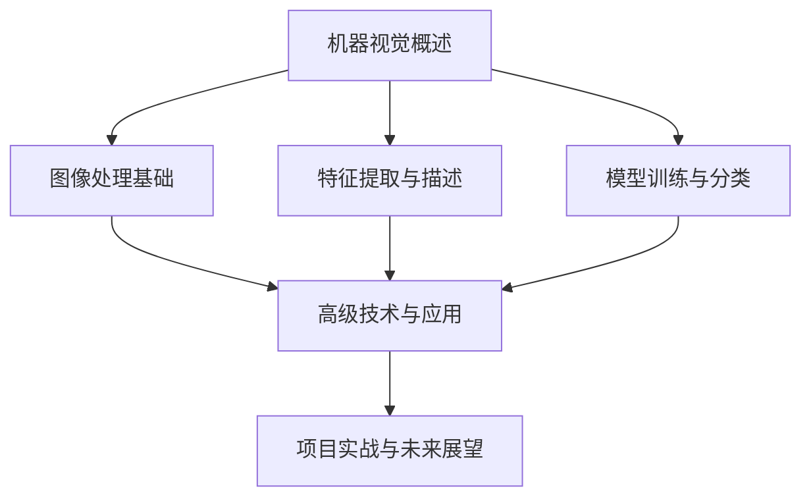

                 

### 文章标题

《机器视觉 (Computer Vision)》

### 关键词

机器视觉、图像处理、特征提取、深度学习、目标检测、面部识别、3D重建、项目实战

### 摘要

机器视觉是一种通过计算机对图像或视频进行分析和处理的技术，广泛应用于工业制造、生物医学、交通运输、娱乐与艺术等多个领域。本文从基础概念、原理、应用技术到项目实战，系统性地介绍了机器视觉的核心内容，包括图像处理基础、特征提取与描述、模型训练与分类、目标检测与跟踪、面部识别与情感分析、3D重建与深度感知等。通过本文的学习，读者可以全面了解机器视觉的技术原理和应用实践，为后续深入研究和实际应用打下坚实基础。

### 目录大纲

#### 第一部分：基础概念与原理

1. **机器视觉概述**

   1.1 机器视觉的定义与历史背景

   1.2 机器视觉的应用领域

   1.3 机器视觉的挑战与前景

2. **图像处理基础**

   2.1 图像表示与处理

   2.2 颜色模型与图像增强

   2.3 静态图像分析

3. **特征提取与描述**

   3.1 特征提取的基本概念

   3.2 特征描述方法

   3.3 特征匹配与描述子优化

4. **模型训练与分类**

   4.1 监督学习基础

   4.2 无监督学习基础

   4.3 深度学习在机器视觉中的应用

#### 第二部分：高级技术与应用

5. **目标检测与跟踪**

   5.1 目标检测基础

   5.2 实时目标跟踪

   5.3 应用实例：行人检测与跟踪

6. **面部识别与情感分析**

   6.1 面部识别技术

   6.2 情感分析基础

   6.3 应用实例：社交网络情感分析

7. **3D重建与深度感知**

   7.1 3D重建技术

   7.2 深度感知技术

   7.3 应用实例：虚拟现实与增强现实

#### 第三部分：项目实战与未来展望

8. **机器视觉项目实践**

   8.1 项目选择与需求分析

   8.2 项目设计与实现

   8.3 项目评估与优化

9. **机器视觉发展趋势**

   9.1 人工智能与机器视觉融合

   9.2 机器视觉在新兴领域的应用

   9.3 机器视觉的未来挑战与机遇

### Mermaid 流程图



### 伪代码示例

```python
# 图像处理基础伪代码
function image_processing(image):
    # 图像读取
    image = read_image('input_image.jpg')

    # 灰度化处理
    gray_image = grayscale(image)

    # 增强对比度
    enhanced_image = enhance_contrast(gray_image)

    # 边缘检测
    edges = edge_detection(enhanced_image)

    return edges
```

### 数学公式示例

```markdown
## 数学模型

机器视觉中的特征提取通常涉及以下数学模型：

$$
特征向量 = W \cdot 输入图像 + b
$$

其中，$W$ 为权重矩阵，$b$ 为偏置项。

在卷积神经网络中，卷积操作可以表示为：

$$
特征图 = \sum_{i=1}^{k} (W_i \cdot 输入特征图) + b_i
$$

这里，$W_i$ 和 $b_i$ 分别表示卷积核权重和偏置项。
```

### 项目实战示例

```markdown
## 项目实战：实时行人检测系统

### 开发环境搭建

- 操作系统：Ubuntu 20.04
- 编程语言：Python 3.8
- 深度学习框架：TensorFlow 2.5
- 其他依赖：OpenCV 4.5.3, NumPy 1.21.2

### 源代码实现

```python
import cv2
import numpy as np
import tensorflow as tf

# 加载预训练的行人检测模型
model = tf.keras.models.load_model('path/to/行人检测模型')

# 定义视频流
cap = cv2.VideoCapture(0)

while True:
    # 读取视频帧
    ret, frame = cap.read()

    # 将帧缩放到模型期望的大小
    input_size = (224, 224)
    frame = cv2.resize(frame, input_size)

    # 将帧转换为模型可接受的格式
    frame = frame / 255.0
    frame = np.expand_dims(frame, axis=0)

    # 进行行人检测
    predictions = model.predict(frame)

    # 提取行人区域
    for i in range(predictions.shape[1]):
        if predictions[0, i] > 0.5:
            # 获取行人边界框
            xmin, ymin, xmax, ymax = i

            # 在原图上绘制边界框
            cv2.rectangle(frame, (xmin, ymin), (xmax, ymax), (0, 0, 255), 2)

    # 显示结果
    cv2.imshow('行人检测', frame)

    # 按下 'q' 键退出
    if cv2.waitKey(1) & 0xFF == ord('q'):
        break

# 释放视频流
cap.release()
cv2.destroyAllWindows()
```

### 代码解读与分析

- 模型加载与预处理：使用 TensorFlow 加载预训练的行人检测模型，并将视频帧缩放到模型期望的大小。
- 预测与边界框提取：对每个输入帧进行行人检测，提取行人区域，并在原图上绘制边界框。
- 实时展示与交互：通过 OpenCV 显示实时行人检测结果，并在按下 'q' 键时退出程序。

该系统可以实现实时行人检测，有助于监控和安防等领域。

### 最佳实践 tips、小结、注意事项、拓展阅读等内容

- **最佳实践 tips**：

  1. 选择合适的预训练模型，提高检测精度。
  2. 对输入图像进行预处理，如缩放、归一化等，以适应模型输入要求。
  3. 调整模型的超参数，如学习率、批量大小等，以达到最佳性能。

- **小结**：

  本文介绍了机器视觉的基本概念、原理、应用技术和项目实战，包括图像处理、特征提取、模型训练、目标检测与跟踪、面部识别与情感分析、3D重建与深度感知等方面。通过本文的学习，读者可以全面了解机器视觉的技术原理和应用实践。

- **注意事项**：

  1. 机器视觉项目开发过程中，需要注意数据的质量和多样性，以提升模型的泛化能力。
  2. 实时性是机器视觉应用的重要指标，需要优化算法和硬件性能，以满足实时处理需求。

- **拓展阅读**：

  1. 《机器学习：一种算法性方法》(Python 版)
  2. 《深度学习：动手学》(第二版)
  3. 《计算机视觉：算法与应用》

通过阅读这些书籍，读者可以进一步深入理解机器视觉的相关技术，提升自己的技术水平。

