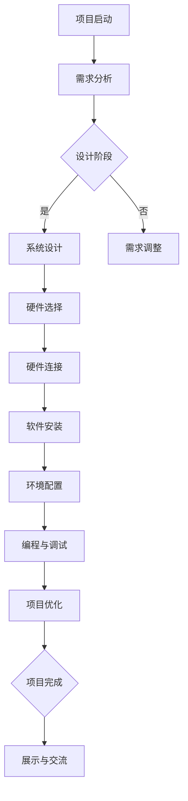

                 

### 《树莓派项目灵感：智能家居和机器人》

#### 文章关键词

- 树莓派
- 智能家居
- 机器人
- 物联网
- Python编程
- 数据采集
- 传感器
- 无线通信
- 网络连接

#### 文章摘要

本文旨在探讨如何利用树莓派构建智能家居和机器人项目。首先，我们将介绍树莓派的诞生与发展，以及其作为智能家居和机器人控制器的优势。接着，我们将逐步讲解树莓派与物联网的基础知识，智能家居的概述，传感器与数据采集，无线通信与网络连接，树莓派编程基础，以及智能家居和机器人项目案例。最后，我们将探讨进阶项目与未来展望，提供项目开发指南和资源，并分享项目展示与交流经验。希望通过本文，读者能够对树莓派项目开发有更深入的了解和启发。

### 第一部分：树莓派与智能家居基础

#### 第1章：树莓派简介与安装

树莓派（Raspberry Pi）是一款由英国树莓派基金会开发的微型计算机。自2012年首次发布以来，树莓派迅速在电子爱好者、学生和教育领域获得了广泛关注。它的诞生初衷是为了促进计算机科学教育，让更多的人能够轻松地接触和学习计算机编程。

#### 1.1 树莓派的诞生与发展

**1.1.1 树莓派的定义与特点**

树莓派是一款高度模块化、低功耗、低成本的单板计算机。它采用ARM架构，支持多种操作系统，如Raspberry Pi OS（基于Debian Linux）、Windows 10 IoT Core等。树莓派的尺寸大约为85.6毫米 x 56.5毫米 x 17.8毫米，重量仅为45克。其主要特点如下：

1. **高度模块化**：树莓派提供多个GPIO（通用输入输出）引脚，方便连接各种传感器和外部设备。
2. **低功耗**：树莓派运行时功耗约为3瓦，非常适合嵌入式应用。
3. **丰富的接口**：树莓派具备HDMI接口、USB接口、网口等，可以连接显示器、键盘、鼠标和网络设备。
4. **支持多种操作系统**：树莓派支持多种操作系统，包括Linux、Windows和Android等，提供了丰富的开发环境。

**1.1.2 树莓派的硬件配置**

树莓派有多种型号，常见的有Raspberry Pi 3、Raspberry Pi 4等。以下以Raspberry Pi 4为例，介绍其硬件配置：

1. **处理器**：四核 Cortex-A72 64位处理器，主频可达1.5GHz。
2. **内存**：2GB、4GB或8GB LPDDR4 SDRAM（根据型号不同）。
3. **存储**：microSD卡插槽，最大支持512GB的存储扩展。
4. **接口**：两个USB 3.0接口、四个USB 2.0接口、HDMI 2.0接口、网口、GPIO引脚、Micro-USB电源接口等。

#### 1.2 树莓派的安装与设置

**1.2.1 安装系统环境**

首先，我们需要从树莓派官方网站（https://www.raspberrypi.org/software）下载最新的Raspberry Pi OS系统镜像。下载完成后，使用USB闪存驱动器将镜像写入到闪存盘中。

接下来，将闪存盘插入树莓派的microSD卡插槽，并将树莓派连接到显示器、键盘和电源。根据屏幕提示，我们将启动树莓派并进入系统安装程序。

在安装过程中，我们需要选择安装类型（推荐选择“扩大文件系统以填充整个SD卡”），并设置时区、用户名和密码等。安装完成后，重启树莓派并登录系统。

**1.2.2 初步设置与配置**

1. **更新系统**：打开终端，执行以下命令更新系统软件包：

   ```
   sudo apt update
   sudo apt upgrade
   ```

2. **安装Python和编程环境**：安装Python和相关的开发工具，以便我们进行编程：

   ```
   sudo apt install python3 python3-pip
   ```

3. **配置无线网络**：打开终端，执行以下命令配置无线网络：

   ```
   sudo nano /etc/wpa_supplicant/wpa_supplicant.conf
   ```

   在打开的文件中添加以下内容（将`yourSSID`和`yourPASSWORD`替换为你的无线网络名称和密码）：

   ```
   network={
       ssid="yourSSID"
       psk="yourPASSWORD"
   }
   ```

   保存并关闭文件，然后执行以下命令使配置生效：

   ```
   sudo wpa_supplicant -i wlan0 -c < /etc/wpa_supplicant/wpa_supplicant.conf
   ```

   最后，重启树莓派：

   ```
   sudo reboot
   ```

现在，树莓派已经安装并设置好了，我们可以开始进行智能家居和机器人的项目开发了。

### 第二部分：树莓派与物联网基础

#### 第2章：物联网基础与智能家居

物联网（Internet of Things，简称IoT）是指通过互联网连接各种物理设备，实现数据采集、传输和处理的网络体系。物联网技术为智能家居、智能城市、智能制造等领域带来了革命性的变化。

#### 2.1 物联网基础

**2.1.1 物联网的定义与分类**

物联网是指将各种信息传感设备与网络相连接，实现信息的采集、传输和处理。根据物联网的连接方式，可以将物联网分为以下几种类型：

1. **感知层**：通过传感器、RFID（射频识别）等技术，实现物理世界的信息采集。
2. **网络层**：通过各种通信协议（如Wi-Fi、蓝牙、ZigBee等）实现设备之间的数据传输。
3. **平台层**：通过云计算、大数据等技术，实现数据存储、分析和处理。
4. **应用层**：将物联网技术应用于各种领域，如智能家居、智能交通、智能医疗等。

**2.1.2 物联网的关键技术**

物联网的关键技术包括传感器技术、无线通信技术、数据挖掘和大数据技术等。以下是物联网的关键技术介绍：

1. **传感器技术**：传感器是物联网的核心组件，用于感知物理世界的信息。常见的传感器有温度传感器、湿度传感器、光线传感器、运动传感器等。
2. **无线通信技术**：无线通信技术是实现物联网设备之间数据传输的关键。常见的无线通信技术有Wi-Fi、蓝牙、ZigBee、LoRa等。
3. **数据挖掘和大数据技术**：数据挖掘和大数据技术用于从海量数据中提取有价值的信息，支持物联网的智能化应用。

#### 2.2 智能家居概述

**2.2.1 智能家居的概念与需求**

智能家居是指通过物联网技术将家庭中的各种设备连接起来，实现远程监控、自动化控制和智能互动。智能家居的主要需求包括：

1. **远程监控**：通过智能手机或其他设备远程监控家庭安全、环境状况等。
2. **自动化控制**：实现家庭设备的自动化控制，如灯光、窗帘、空调等。
3. **智能互动**：通过语音识别、人脸识别等技术，实现家庭设备的智能互动。

**2.2.2 智能家居的组成与功能**

智能家居系统主要由以下几个部分组成：

1. **传感器**：用于感知家庭环境信息，如温度、湿度、光线、运动等。
2. **控制器**：如树莓派、Arduino等，用于接收传感器数据，并根据用户需求进行控制。
3. **执行器**：如电机、开关等，用于执行控制命令，实现设备自动化。
4. **通信模块**：用于实现设备之间的数据传输，如Wi-Fi、蓝牙、ZigBee等。
5. **用户界面**：如手机应用、Web界面等，用于用户与智能家居系统的交互。

智能家居的主要功能包括：

1. **安全监控**：通过摄像头、门磁传感器等设备，实现家庭安全的远程监控和报警。
2. **环境控制**：通过传感器和执行器，实现家庭环境的自动化控制，如温度调节、灯光控制等。
3. **家电控制**：通过智能家居系统，实现家电的远程控制，如空调、电视、洗衣机等。
4. **能源管理**：通过智能插座、智能电表等设备，实现家庭能源的监控和管理。

通过树莓派和物联网技术，我们可以构建一个功能强大的智能家居系统，为用户提供便捷、舒适、安全的家庭生活。

### 第3章：树莓派与传感器

传感器是物联网系统中的关键组件，用于感知物理世界的信息。在树莓派项目中，传感器用于采集环境数据，并实现智能家居和机器人的各种功能。

#### 3.1 传感器基础

**3.1.1 传感器的基本原理**

传感器是一种能够检测并响应特定物理信号的设备，将非电学量转换为电学量。传感器的基本原理可以分为以下几个方面：

1. **物理效应**：如光电效应、热效应、压电效应等，用于检测物理量的变化。
2. **化学反应**：如气体传感器、生物传感器等，通过化学反应检测特定物质的存在。
3. **生物效应**：如人体传感器、动物传感器等，通过生物体的生物效应检测生物体的状态。

**3.1.2 传感器的分类与应用**

根据传感器检测的物理量不同，可以将传感器分为以下几类：

1. **温度传感器**：用于检测温度，如热敏电阻、热电偶等。
2. **湿度传感器**：用于检测湿度，如电容式湿度传感器、电阻式湿度传感器等。
3. **光线传感器**：用于检测光线强度，如光敏电阻、光电二极管等。
4. **运动传感器**：用于检测运动，如加速度传感器、陀螺仪等。
5. **气体传感器**：用于检测气体浓度，如气体传感器、烟雾传感器等。
6. **生物传感器**：用于检测生物体信息，如心率传感器、体温传感器等。

传感器的应用领域非常广泛，包括智能家居、工业自动化、医疗健康、环境保护等。以下是几个典型的传感器应用案例：

1. **温度传感器**：用于家庭空调、冰箱等家电的温度控制，以及工业生产过程中的温度监测。
2. **湿度传感器**：用于家庭环境湿度监测，以及植物生长环境的湿度控制。
3. **光线传感器**：用于智能灯光控制，根据环境光线自动调节灯光亮度。
4. **运动传感器**：用于智能门锁、运动监测设备等，实现运动检测和报警功能。
5. **气体传感器**：用于家居空气质量监测，以及工业生产过程中的有害气体检测。

#### 3.2 常用传感器介绍

在树莓派项目中，常用的传感器包括温度传感器、湿度传感器、光线传感器和运动传感器。以下是对这些传感器的详细介绍：

**3.2.1 温度传感器**

温度传感器是用于检测温度的传感器，常见的温度传感器有热敏电阻、热电偶等。

- **热敏电阻**：热敏电阻是一种利用材料电阻随温度变化而变化的原理制作的传感器。常见的热敏电阻有NTC（负温度系数）和PTC（正温度系数）两种类型。热敏电阻具有响应速度快、精度高、体积小等优点，广泛应用于温度监测、控制等领域。
- **热电偶**：热电偶是一种利用两种不同金属导线接触处产生的热电势来检测温度的传感器。热电偶具有线性好、精度高、响应速度快等优点，广泛应用于工业生产、医疗设备等领域。

**3.2.2 湿度传感器**

湿度传感器是用于检测湿度的传感器，常见的湿度传感器有电容式湿度传感器、电阻式湿度传感器等。

- **电容式湿度传感器**：电容式湿度传感器利用电容值随湿度变化的原理来检测湿度。电容式湿度传感器具有灵敏度高、精度高、稳定性好等优点，广泛应用于环境监测、农业气象等领域。
- **电阻式湿度传感器**：电阻式湿度传感器利用电阻值随湿度变化的原理来检测湿度。电阻式湿度传感器具有响应速度快、精度高、成本低等优点，广泛应用于智能家居、工业自动化等领域。

**3.2.3 光线传感器**

光线传感器是用于检测光线强度的传感器，常见的光线传感器有光敏电阻、光电二极管等。

- **光敏电阻**：光敏电阻是一种利用材料电阻随光线强度变化的原理制作的光线传感器。光敏电阻具有响应速度快、灵敏度适中、成本低等优点，广泛应用于光照监测、自动控制等领域。
- **光电二极管**：光电二极管是一种利用光生电动势来检测光线强度的传感器。光电二极管具有线性好、精度高、响应速度快等优点，广泛应用于光照监测、光电控制等领域。

**3.2.4 运动传感器**

运动传感器是用于检测运动的传感器，常见的运动传感器有加速度传感器、陀螺仪等。

- **加速度传感器**：加速度传感器是一种用于检测物体加速度的传感器。加速度传感器具有反应速度快、精度高、成本低等优点，广泛应用于运动监测、震动检测等领域。
- **陀螺仪**：陀螺仪是一种用于检测物体角速度的传感器。陀螺仪具有反应速度快、精度高、稳定性好等优点，广泛应用于运动监测、导航控制等领域。

通过了解这些传感器的原理和应用，我们可以根据实际需求选择合适的传感器，构建功能强大的智能家居和机器人项目。

### 第4章：树莓派与无线通信

无线通信技术是物联网系统中的关键组成部分，它使得树莓派与其他设备之间能够实现数据传输和通信。在本章中，我们将介绍无线通信的基础知识，以及树莓派的无线通信和网络连接。

#### 4.1 无线通信基础

**4.1.1 无线通信原理**

无线通信是指利用电磁波在自由空间中传播来实现信息传输的技术。无线通信的基本原理可以分为以下几个步骤：

1. **信号发射**：无线通信设备（如树莓派）产生电磁波信号，并通过天线发射出去。
2. **信号传播**：电磁波在自由空间中传播，可以穿透一定厚度的障碍物。
3. **信号接收**：接收设备（如另一台树莓派或智能手机）通过天线接收到电磁波信号，并将其转换成电信号。
4. **信号处理**：接收设备对接收到的电信号进行放大、滤波、解调等处理，以恢复原始数据。

**4.1.2 常见无线通信技术**

目前，常见的无线通信技术包括Wi-Fi、蓝牙、ZigBee、LoRa等。以下是这些技术的简要介绍：

1. **Wi-Fi**：Wi-Fi是一种基于IEEE 802.11标准的高带宽无线通信技术，广泛应用于家庭、办公、公共场所等。Wi-Fi具有传输速度快、覆盖范围广、稳定性好等优点，但功耗较高，且容易受到干扰。
2. **蓝牙**：蓝牙是一种短距离、低功耗的无线通信技术，常用于连接智能手机、耳机、鼠标等设备。蓝牙具有成本低、功耗低、传输速率适中等优点，但传输距离较短。
3. **ZigBee**：ZigBee是一种低功耗、短距离的无线通信技术，广泛应用于智能家居、工业自动化等领域。ZigBee具有功耗低、传输速率适中、抗干扰能力强等优点，但覆盖范围较小。
4. **LoRa**：LoRa是一种低功耗、长距离的无线通信技术，常用于物联网应用。LoRa具有传输距离远、功耗低、抗干扰能力强等优点，但传输速率较低。

#### 4.2 网络连接与配置

**4.2.1 网络连接方式**

树莓派支持多种网络连接方式，包括Wi-Fi、以太网和蓝牙等。以下是这些连接方式的简要介绍：

1. **Wi-Fi**：树莓派可以通过Wi-Fi连接到无线网络。连接无线网络前，需要在树莓派上配置无线网络，并选择要连接的网络。配置无线网络的方法如下：

   - 打开终端，输入以下命令启用无线网络管理：

     ```
     sudo nano /etc/wpa_supplicant/wpa_supplicant.conf
     ```

   - 在打开的文件中添加以下内容（将`yourSSID`和`yourPASSWORD`替换为你的无线网络名称和密码）：

     ```
     network={
         ssid="yourSSID"
         psk="yourPASSWORD"
     }
     ```

   - 保存并关闭文件，然后执行以下命令使配置生效：

     ```
     sudo wpa_supplicant -i wlan0 -c < /etc/wpa_supplicant/wpa_supplicant.conf
     ```

   - 重启树莓派，即可连接无线网络。

2. **以太网**：树莓派可以通过以太网线连接到有线网络。连接有线网络时，将网线的一端插入树莓派的网口，另一端插入路由器或交换机。树莓派会自动获取IP地址，并通过有线网络连接到互联网。

3. **蓝牙**：树莓派可以通过蓝牙连接其他蓝牙设备，如智能手机、蓝牙音箱等。连接蓝牙设备前，需要在树莓派上启用蓝牙功能，并打开蓝牙适配器。启用蓝牙功能的方法如下：

   - 打开终端，输入以下命令启用蓝牙适配器：

     ```
     sudo systemctl start bluetooth
     ```

   - 输入以下命令使蓝牙功能开机自启：

     ```
     sudo systemctl enable bluetooth
     ```

   - 启动蓝牙适配器后，可以使用`bluetoothctl`命令行工具搜索并连接蓝牙设备。

**4.2.2 无线网络配置**

配置无线网络时，可能需要更改网络设置，如IP地址、DNS服务器地址等。以下是如何更改无线网络设置的方法：

1. **更改IP地址**：打开终端，输入以下命令编辑网络配置文件：

   ```
   sudo nano /etc/network/interfaces
   ```

   在打开的文件中，找到包含无线网络接口（通常为`wlan0`）的段落，并修改IP地址设置。例如，将IP地址更改为`192.168.1.100`：

   ```
   auto wlan0
   iface wlan0 inet static
       address 192.168.1.100
       netmask 255.255.255.0
       gateway 192.168.1.1
   ```

   保存并关闭文件，然后重启网络服务：

   ```
   sudo systemctl restart networking
   ```

2. **更改DNS服务器地址**：在`/etc/resolv.conf`文件中，可以更改DNS服务器地址。例如，将DNS服务器地址更改为`8.8.8.8`：

   ```
   nameserver 8.8.8.8
   ```

   保存并关闭文件，然后重启网络服务：

   ```
   sudo systemctl restart networking
   ```

通过以上方法，我们可以配置树莓派的无线网络连接，并调整网络设置以满足特定需求。树莓派的无线通信和网络连接功能使其能够方便地与外部设备通信，实现智能家居和机器人项目的各种功能。

### 第5章：树莓派编程基础

树莓派作为一款功能强大的微型计算机，编程是发挥其潜力的重要手段。在本章中，我们将介绍树莓派编程的基础知识，包括Python环境搭建、基本语法和数据类型等，以及如何使用树莓派的GPIO接口进行编程和控制。

#### 5.1 Python编程基础

Python是一种广泛使用的高级编程语言，因其简洁明了的语法和强大的功能而备受喜爱。在树莓派上，Python是一种常用的编程语言，可以用于开发各种应用程序和项目。

**5.1.1 Python环境搭建**

要在树莓派上使用Python，我们首先需要安装Python环境。以下是在树莓派上安装Python的步骤：

1. **更新系统软件包**：

   ```
   sudo apt update
   sudo apt upgrade
   ```

2. **安装Python 3**：

   ```
   sudo apt install python3 python3-pip
   ```

3. **验证Python安装**：

   打开终端，输入以下命令，如果看到版本信息，则表示Python已成功安装：

   ```
   python3 --version
   ```

**5.1.2 基本语法与数据类型**

Python语法简洁明了，易于学习。以下是一些基本语法和数据类型的介绍：

1. **变量和赋值**：

   在Python中，变量无需声明，直接使用即可。例如，定义一个变量`x`并赋值为5：

   ```
   x = 5
   ```

2. **数据类型**：

   Python支持多种数据类型，包括整型（int）、浮点型（float）、字符串（str）等。以下是一个示例：

   ```
   x = 10          # 整型
   y = 3.14        # 浮点型
   name = "Alice"  # 字符串
   ```

3. **控制结构**：

   Python支持常用的控制结构，如条件语句（if...else）、循环语句（for...in、while）等。以下是一个简单的示例：

   ```
   if x > y:
       print("x大于y")
   else:
       print("x小于或等于y")
   
   for i in range(5):
       print(i)
   
   while x > 0:
       print(x)
       x -= 1
   ```

4. **函数**：

   Python中的函数定义和使用与其他编程语言类似。以下是一个简单的函数示例：

   ```
   def greet(name):
       print("你好，" + name)
   
   greet("Alice")
   ```

**5.1.3 标准库的使用**

Python拥有丰富的标准库，可以方便地实现各种功能。以下是一些常用的标准库：

1. **math库**：用于数学运算，如三角函数、指数函数等。以下是一个示例：

   ```
   import math
   
   print(math.sqrt(16))  # 计算平方根
   print(math.sin(math.pi / 2))  # 计算正弦值
   ```

2. **random库**：用于生成随机数。以下是一个示例：

   ```
   import random
   
   print(random.randint(1, 10))  # 生成1到10之间的随机整数
   ```

3. **os库**：用于操作系统相关的操作，如文件读写、目录操作等。以下是一个示例：

   ```
   import os
   
   print(os.listdir("/home/pi"))  # 列出/home/pi目录中的文件和文件夹
   ```

#### 5.2 树莓派编程与控制

树莓派的GPIO（通用输入输出）接口是编程和控制外部设备的重要途径。以下是如何使用Python控制GPIO的步骤：

1. **安装Raspberry Pi GPIO库**：

   ```
   sudo apt install python3-raspberry-pi-gpio
   ```

2. **导入GPIO库**：

   ```
   import RPi.GPIO as GPIO
   ```

3. **设置GPIO模式**：

   ```
   GPIO.setmode(GPIO.BCM)
   ```

4. **设置GPIO引脚为输出模式**：

   ```
   GPIO.setup(LED_PIN, GPIO.OUT)
   ```

   其中，`LED_PIN`是一个整数，表示要控制的GPIO引脚编号。

5. **控制GPIO引脚状态**：

   ```
   GPIO.output(LED_PIN, GPIO.HIGH)  # 点亮LED
   time.sleep(1)
   GPIO.output(LED_PIN, GPIO.LOW)   # 熄灭LED
   time.sleep(1)
   ```

6. **清理GPIO资源**：

   ```
   GPIO.cleanup()
   ```

**5.2.1 树莓派控制模块介绍**

树莓派支持多种控制模块，如LED灯、电机驱动器、继电器等。以下是一些常见的控制模块及其功能：

1. **LED灯**：LED灯是一种常用的输出设备，可以通过GPIO引脚控制其亮灭。
2. **电机驱动器**：电机驱动器用于控制电机转速和转向，可以实现各种运动控制。
3. **继电器**：继电器是一种电气控制器件，通过控制小电流来控制大电流的开关。
4. **传感器**：传感器用于感知外部环境信息，如温度、湿度、光线、运动等。

**5.2.2 控制LED与GPIO**

以下是一个简单的示例，用于控制LED灯的亮灭：

```
import RPi.GPIO as GPIO
import time

LED_PIN = 18

GPIO.setmode(GPIO.BCM)
GPIO.setup(LED_PIN, GPIO.OUT)

try:
    while True:
        GPIO.output(LED_PIN, GPIO.HIGH)
        time.sleep(1)
        GPIO.output(LED_PIN, GPIO.LOW)
        time.sleep(1)
except KeyboardInterrupt:
    pass
finally:
    GPIO.cleanup()
```

在这个示例中，我们首先导入`RPi.GPIO`库，并设置GPIO模式为BCM模式。然后，我们设置LED灯的GPIO引脚为输出模式，并通过循环不断控制LED灯的亮灭。最后，我们清理GPIO资源。

通过树莓派的编程和控制，我们可以实现各种智能家居和机器人项目。在接下来的章节中，我们将介绍具体的智能家居和机器人项目案例，展示如何利用树莓派实现这些项目。

### 第6章：智能家居项目案例

#### 6.1 智能灯光控制

智能灯光控制是智能家居系统中的一个重要组成部分，它可以通过远程控制或自动控制来调节室内灯光的亮度和颜色，为用户提供更加舒适和便捷的生活体验。在本节中，我们将介绍一个简单的智能灯光控制项目，并详细讲解其系统设计、代码实现和调试过程。

#### 6.1.1 系统设计

**硬件选择**

- **树莓派**：作为智能灯光控制系统的核心控制器，可以选择树莓派3B或更高版本的树莓派。
- **LED灯**：选择具备不同颜色调节功能的LED灯，如RGB灯。
- **电源**：为LED灯和树莓派提供稳定的电源。
- **Wi-Fi模块**：用于实现远程控制和数据传输。

**硬件连接**

1. 将LED灯的正极通过限流电阻连接到树莓派的GPIO引脚。
2. 将LED灯的负极连接到树莓派的GND引脚。
3. 将Wi-Fi模块连接到树莓派的USB接口。

**软件设计**

1. **远程控制**：用户可以通过手机应用或Web界面远程控制LED灯的亮灭、亮度调节和颜色切换。
2. **定时控制**：系统可以根据用户设定的定时规则自动控制LED灯的开关。
3. **状态监测**：系统可以实时监测LED灯的状态，并在故障时发出报警。

**软件架构**

1. **Web前端**：使用HTML、CSS和JavaScript构建用户界面，实现远程控制功能。
2. **后端服务器**：使用Python和Flask框架搭建Web服务器，处理用户请求并控制树莓派。
3. **树莓派程序**：使用Python编写控制程序，处理Wi-Fi模块接收到的数据，并根据指令控制LED灯。

#### 6.1.2 代码实现

以下是一个简单的智能灯光控制项目示例，包括Web前端、后端服务器和树莓派程序。

**Web前端（HTML）**

```html
<!DOCTYPE html>
<html>
<head>
    <title>智能灯光控制</title>
    <script src="https://cdn.jsdelivr.net/npm/socket.io-client@4.6.0/dist/socket.io.js"></script>
    <script>
        let socket = io('http://192.168.1.100:5000');

        function turnOnLight() {
            socket.emit('turnOnLight');
        }

        function turnOffLight() {
            socket.emit('turnOffLight');
        }

        function setBrightness(value) {
            socket.emit('setBrightness', value);
        }

        function setColor(r, g, b) {
            socket.emit('setColor', {r: r, g: g, b: b});
        }
    </script>
</head>
<body>
    <h1>智能灯光控制</h1>
    <button onclick="turnOnLight()">开灯</button>
    <button onclick="turnOffLight()">关灯</button>
    <input type="range" min="0" max="255" onchange="setBrightness(this.value)" />
    <p>亮度：0</p>
    <button onclick="setColor(255, 0, 0)">红色</button>
    <button onclick="setColor(0, 255, 0)">绿色</button>
    <button onclick="setColor(0, 0, 255)">蓝色</button>
</body>
</html>
```

**后端服务器（Python）**

```python
from flask import Flask, request
from flask_socketio import SocketIO, send

app = Flask(__name__)
socketio = SocketIO(app)

led_pin = 18
GPIO.setmode(GPIO.BCM)
GPIO.setup(led_pin, GPIO.OUT)
p = GPIO.PWM(led_pin, 1000)  # 1KHz frequency
p.start(0)

def turn_on():
    p.ChangeDutyCycle(255)
    print("LED on")

def turn_off():
    p.ChangeDutyCycle(0)
    print("LED off")

def set_brightness(value):
    p.ChangeDutyCycle(value)

def set_color(r, g, b):
    red_pin = 17
    green_pin = 22
    blue_pin = 24
    GPIO.setup(red_pin, GPIO.OUT)
    GPIO.setup(green_pin, GPIO.OUT)
    GPIO.setup(blue_pin, GPIO.OUT)
    red = GPIO.PWM(red_pin, 1000)
    green = GPIO.PWM(green_pin, 1000)
    blue = GPIO.PWM(blue_pin, 1000)
    red.start(0)
    green.start(0)
    blue.start(0)
    red.ChangeDutyCycle(r)
    green.ChangeDutyCycle(g)
    blue.ChangeDutyCycle(b)

@socketio.on('turnOnLight')
def handle_turn_on_light():
    turn_on()

@socketio.on('turnOffLight')
def handle_turn_off_light():
    turn_off()

@socketio.on('setBrightness')
def handle_set_brightness(data):
    set_brightness(data['value'])

@socketio.on('setColor')
def handle_set_color(data):
    set_color(data['r'], data['g'], data['b'])

if __name__ == '__main__':
    socketio.run(app, host='0.0.0.0', port=5000)
```

**树莓派程序（Python）**

```python
import RPi.GPIO as GPIO
import time

LED_PIN = 18
GPIO.setmode(GPIO.BCM)
GPIO.setup(LED_PIN, GPIO.OUT)
p = GPIO.PWM(LED_PIN, 1000)  # 1KHz frequency
p.start(0)

try:
    while True:
        # 这里可以添加传感器数据读取、状态判断等逻辑
        time.sleep(1)
except KeyboardInterrupt:
    pass
finally:
    p.stop()
    GPIO.cleanup()
```

#### 6.1.3 调试过程

1. **前端调试**：在浏览器中打开HTML页面，测试按钮和滑块的功能，确保可以正常发送指令。
2. **后端调试**：使用Postman等工具模拟前端发送的请求，验证后端服务的响应，确保后端可以正确接收和处理指令。
3. **树莓派调试**：在树莓派上运行Python程序，通过串口输出程序运行状态和传感器数据，确保程序可以正确执行指令。

通过以上步骤，我们可以实现一个简单的智能灯光控制项目。在实际应用中，可以根据需求扩展功能，如添加传感器数据采集、定时控制等。

#### 6.1.4 项目小结

智能灯光控制项目是一个简单但实用的智能家居项目。通过树莓派、Wi-Fi模块和LED灯，我们可以实现远程控制、亮度调节和颜色切换等功能。该项目展示了如何利用树莓派和物联网技术构建智能家居系统，为用户带来更加便捷和舒适的生活体验。在实际开发过程中，可以根据需求添加更多功能，如温度监测、安防报警等，打造一个更加智能的家居环境。

### 第6章：智能家居项目案例

#### 6.2 智能温湿度监测

智能温湿度监测是智能家居系统中的重要组成部分，它可以帮助用户实时了解室内环境状况，并根据数据调整家电运行状态，从而提高生活质量。在本节中，我们将介绍如何使用树莓派和温湿度传感器实现智能温湿度监测项目。

#### 6.2.1 系统设计

**硬件选择**

- **树莓派**：作为智能温湿度监测系统的核心控制器，可以选择树莓派3B或更高版本的树莓派。
- **DHT11传感器**：一种常用的温湿度传感器，具有低成本、高精度、易用性等特点。
- **电源**：为传感器和树莓派提供稳定的电源。
- **Wi-Fi模块**：用于实现远程控制和数据传输。

**硬件连接**

1. 将DHT11传感器的数据线连接到树莓派的GPIO引脚。
2. 将DHT11传感器的电源线连接到树莓派的5V电源引脚。
3. 将Wi-Fi模块连接到树莓派的USB接口。

**软件设计**

1. **数据采集**：系统通过树莓派定时读取DHT11传感器的数据，包括温度和湿度。
2. **实时显示**：系统将采集到的数据实时显示在Web页面上，用户可以随时查看室内环境状况。
3. **数据存储**：系统将采集到的数据存储到数据库中，便于历史数据查询和分析。
4. **报警功能**：系统可以根据设定的温湿度阈值，自动发送报警信息。

**软件架构**

1. **Web前端**：使用HTML、CSS和JavaScript构建用户界面，实现实时数据显示和报警功能。
2. **后端服务器**：使用Python和Flask框架搭建Web服务器，处理用户请求并控制树莓派。
3. **树莓派程序**：使用Python编写控制程序，读取传感器数据，并处理用户请求。

#### 6.2.2 代码实现

以下是一个简单的智能温湿度监测项目示例，包括Web前端、后端服务器和树莓派程序。

**Web前端（HTML）**

```html
<!DOCTYPE html>
<html>
<head>
    <title>智能温湿度监测</title>
    <script src="https://cdn.jsdelivr.net/npm/socket.io-client@4.6.0/dist/socket.io.js"></script>
    <script>
        let socket = io('http://192.168.1.100:5000');

        socket.on('data', function(data) {
            document.getElementById('temperature').innerText = data.temperature + '℃';
            document.getElementById('humidity').innerText = data.humidity + '%';
        });
    </script>
</head>
<body>
    <h1>智能温湿度监测</h1>
    <p>温度：0℃</p>
    <p>湿度：0%</p>
</body>
</html>
```

**后端服务器（Python）**

```python
from flask import Flask, request
from flask_socketio import SocketIO, send
import RPi.GPIO as GPIO
import time
import Adafruit_DHT

app = Flask(__name__)
socketio = SocketIO(app)
GPIO.setmode(GPIO.BCM)
dht_pin = 4
sensor = Adafruit_DHT.DHT11

def read_dht():
    humidity, temperature = Adafruit_DHT.read(dht_pin, sensor)
    return {
        'temperature': temperature,
        'humidity': humidity
    }

@socketio.on('readData')
def handle_read_data():
    data = read_dht()
    send(data)

if __name__ == '__main__':
    socketio.run(app, host='0.0.0.0', port=5000)
```

**树莓派程序（Python）**

```python
import RPi.GPIO as GPIO
import time
import Adafruit_DHT

GPIO.setmode(GPIO.BCM)
dht_pin = 4
sensor = Adafruit_DHT.DHT11

def read_dht():
    humidity, temperature = Adafruit_DHT.read(dht_pin, sensor)
    print(f"Temperature: {temperature}℃ Humidity: {humidity}%")
    return {
        'temperature': temperature,
        'humidity': humidity
    }

try:
    while True:
        data = read_dht()
        time.sleep(5)
except KeyboardInterrupt:
    pass
finally:
    GPIO.cleanup()
```

#### 6.2.3 调试过程

1. **前端调试**：在浏览器中打开HTML页面，测试数据实时显示功能，确保可以正确显示温度和湿度。
2. **后端调试**：使用Postman等工具模拟前端发送的请求，验证后端服务的响应，确保后端可以正确读取传感器数据并返回。
3. **树莓派调试**：在树莓派上运行Python程序，通过串口输出程序运行状态和传感器数据，确保程序可以正确读取传感器数据。

#### 6.2.4 项目小结

智能温湿度监测项目通过树莓派和DHT11传感器实现了室内环境温度和湿度的实时监测，并通过Web界面实时显示数据。该项目展示了如何利用树莓派和物联网技术构建智能家居系统，为用户提供了便捷的环境监测工具。在实际应用中，可以根据需求扩展功能，如数据存储、报警功能等，进一步提高系统的实用性和智能化水平。

### 第7章：机器人项目案例

机器人是人工智能领域的一个重要分支，随着技术的不断发展，机器人在各个行业中的应用越来越广泛。在本章中，我们将介绍如何使用树莓派构建一个简易机器人，并实现其控制与导航功能。

#### 7.1 机器人概述

**7.1.1 机器人的定义与分类**

机器人是一种能够模拟人类行为、执行特定任务的智能设备。根据功能和应用场景，机器人可以分为以下几类：

1. **工业机器人**：广泛应用于制造业、物流等行业，用于完成重复性、高精度的工作。
2. **服务机器人**：为人类提供服务和帮助，如家庭机器人、医疗机器人、安保机器人等。
3. **社交机器人**：具备自然语言处理和社交能力，能够与人类进行互动和交流。
4. **探索机器人**：用于探测未知环境，如太空探测器、深海机器人等。

**7.1.2 机器人的核心技术**

机器人技术的核心包括机械结构设计、运动控制、传感器技术、人工智能和计算机视觉等。以下是机器人核心技术简要介绍：

1. **机械结构设计**：机器人机械结构的设计直接决定了其运动性能和可靠性。
2. **运动控制**：通过控制器和驱动器实现机器人的运动控制，包括位置、速度、力等控制。
3. **传感器技术**：机器人配备多种传感器，用于感知外部环境信息，如视觉、听觉、触觉等。
4. **人工智能**：机器人利用人工智能技术，实现自主决策、学习和适应环境的能力。
5. **计算机视觉**：通过计算机视觉技术，机器人可以识别和理解外部环境，实现目标识别和路径规划。

#### 7.2 机器人项目案例

在本节中，我们将介绍如何使用树莓派和舵机构建一个简易机器人，并实现其控制与导航功能。

**7.2.1 硬件选择**

- **树莓派**：作为机器人控制器的核心，可以选择树莓派3B或更高版本的树莓派。
- **舵机**：用于驱动机器人的运动，可以选择MG996R等高性能舵机。
- **电源**：为舵机和树莓派提供稳定的电源。
- **无线通信模块**：用于实现树莓派与电脑或其他设备的无线通信。

**硬件连接**

1. 将舵机的控制线连接到树莓派的GPIO引脚。
2. 将舵机的电源线连接到树莓派的电源接口。
3. 将无线通信模块连接到树莓派的USB接口。

**软件设计**

1. **机器人控制**：通过Python编写程序，控制舵机的运动，实现机器人的动作。
2. **导航控制**：使用无线通信模块，实现机器人与电脑或其他设备的无线通信，接收导航指令。
3. **路径规划**：利用计算机视觉技术，实现机器人的自主导航和路径规划。

**软件架构**

1. **机器人控制器**：使用Python编写程序，控制舵机的运动。
2. **导航程序**：使用Python编写程序，实现无线通信和路径规划。
3. **用户界面**：使用HTML、CSS和JavaScript构建用户界面，实现远程控制和导航功能。

#### 7.2.2 简易机器人搭建

以下是一个简易机器人的搭建示例，包括硬件连接和软件编程。

**硬件连接**

1. 将树莓派与舵机连接：

   ```
   import RPi.GPIO as GPIO
   import time

   SERVO_PIN = 18
   GPIO.setmode(GPIO.BCM)
   GPIO.setup(SERVO_PIN, GPIO.OUT)

   servo = GPIO.PWM(SERVO_PIN, 50)  # 50Hz 频率
   servo.start(0)
   ```

2. 将无线通信模块与电脑连接，并设置通信参数：

   ```
   import serial

   port = 'COM3'  # 根据实际情况选择端口
   baudrate = 9600
   serial_communication = serial.Serial(port, baudrate)
   ```

**软件编程**

1. **控制舵机运动**：

   ```
   def move_forward():
       servo.ChangeDutyCycle(7.5)  # 调整到合适的角度
       time.sleep(1)
       servo.ChangeDutyCycle(0)

   def move_backward():
       servo.ChangeDutyCycle(12.5)
       time.sleep(1)
       servo.ChangeDutyCycle(0)

   move_forward()
   move_backward()
   ```

2. **实现无线通信**：

   ```
   def receive_command():
       command = serial_communication.readline().decode('utf-8')
       if command == 'forward':
           move_forward()
       elif command == 'backward':
           move_backward()
       else:
           print("Unknown command")
   ```

3. **用户界面**：

   ```
   <html>
   <head>
       <title>机器人控制界面</title>
   </head>
   <body>
       <button onclick="sendCommand('forward')">前进</button>
       <button onclick="sendCommand('backward')">后退</button>
       <script>
           function sendCommand(command) {
               var commandStr = command;
               var websocket = new WebSocket('ws://localhost:8000');
               websocket.onopen = function(event) {
                   websocket.send(commandStr);
               };
           }
       </script>
   </body>
   </html>
   ```

通过以上步骤，我们可以搭建一个简单的机器人，并实现其控制与导航功能。在实际应用中，可以根据需求扩展功能，如添加传感器、实现自主导航等。

### 第8章：进阶项目与探索

随着技术的不断进步，智能家居和机器人技术正逐渐融入我们的日常生活。在这个章节中，我们将探讨一些进阶项目，并展望未来的发展趋势。

#### 8.1 智能家居系统扩展

**8.1.1 家居安全监控**

家居安全监控是智能家居系统中的一个重要组成部分。通过安装摄像头、门磁传感器、烟雾传感器等设备，可以实现实时监控、报警推送等功能。以下是一个家居安全监控系统的设计方案：

1. **硬件选择**：
   - **摄像头**：选择具备夜视功能、1080P高清摄像头的设备。
   - **门磁传感器**：用于检测门窗的开关状态。
   - **烟雾传感器**：用于检测烟雾浓度，实现火灾预警。

2. **软件设计**：
   - **视频监控**：通过树莓派和摄像头实现实时视频监控，并将视频流传输到手机或电脑上。
   - **报警推送**：当检测到异常情况时，通过短信或APP推送通知用户。
   - **数据存储**：将监控数据存储在云端或本地数据库中，方便历史数据查询。

3. **实现方法**：
   - **视频监控**：使用Python的OpenCV库实现视频捕捉和实时传输。
   - **报警推送**：使用Python的SMTP库发送邮件或使用第三方短信服务。
   - **数据存储**：使用Python的SQLAlchemy库实现数据存储和查询。

**8.1.2 智能家电联动**

智能家电联动是指通过智能家居系统实现不同家电之间的协调工作，提高生活便利性。以下是一个智能家电联动系统的设计方案：

1. **硬件选择**：
   - **智能插座**：用于远程控制家电的开关。
   - **智能灯泡**：实现远程控制灯光的开关和亮度调节。
   - **智能空调**：实现远程控制空调的开关和温度调节。

2. **软件设计**：
   - **家电控制**：通过手机APP或Web界面实现远程控制。
   - **场景设定**：根据用户需求设置不同的场景模式，如离家模式、回家模式等。
   - **自动化控制**：通过传感器数据实现自动化控制，如室内温度高于设定值时自动开启空调。

3. **实现方法**：
   - **家电控制**：使用Python编写控制脚本，通过Wi-Fi模块实现远程控制。
   - **场景设定**：使用Python的调度器（如APScheduler）实现定时任务。
   - **自动化控制**：使用Python的传感器库读取传感器数据，并执行相应的控制命令。

#### 8.2 机器人应用扩展

**8.2.1 机器人编程语言**

随着机器人技术的不断发展，越来越多的编程语言被用于机器人开发。以下是一些常用的机器人编程语言：

1. **Python**：Python是一种简单易学的编程语言，广泛应用于机器人开发。Python支持多个机器人库，如ROS（Robot Operating System）、PyRobot等，可以实现机器人控制、路径规划、传感器数据处理等功能。

2. **C++**：C++是一种高性能的编程语言，广泛应用于机器人控制系统的开发。C++支持多线程编程，可以实现高效的实时控制。

3. **Java**：Java是一种跨平台的编程语言，广泛应用于机器人开发。Java具有强大的库支持，可以实现机器人控制、路径规划、传感器数据处理等功能。

**8.2.2 机器人应用场景探讨**

机器人在各个领域的应用越来越广泛，以下是一些机器人应用场景的探讨：

1. **医疗辅助**：机器人可以在医疗领域发挥重要作用，如手术机器人、康复机器人、医疗配送机器人等。通过远程控制和人工智能技术，机器人可以提高医疗服务的质量和效率。

2. **家庭服务**：家庭服务机器人是机器人技术的一个重要应用方向，如扫地机器人、管家机器人、教育机器人等。通过智能家居系统，机器人可以实现家庭环境的智能监控和自动化控制。

3. **工业制造**：工业机器人广泛应用于制造业，如汽车制造、电子产品组装、物流仓储等。通过自动化生产线，机器人可以提高生产效率、降低生产成本。

4. **公共服务**：公共服务机器人应用于城市管理、安全监控、公共设施维护等领域。通过远程监控和智能分析，机器人可以提高公共服务的质量和效率。

总之，智能家居和机器人技术的不断发展为我们的生活带来了诸多便利。通过不断探索和创新，我们可以构建更加智能、高效的家居和机器人系统，为未来生活奠定坚实基础。

### 第9章：树莓派项目开发指南

开发树莓派项目需要一定的步骤和工具。以下是一个详细的开发指南，帮助您从硬件准备开始，到软件安装、编程和环境配置，直至项目的实现和优化。

#### 9.1 项目开发流程

**9.1.1 需求分析与设计**

在开始项目开发前，首先需要明确项目的需求。需求分析包括功能需求、性能需求、可靠性需求等。根据需求分析结果，设计项目的整体架构，包括硬件选择、软件模块划分、通信协议等。

**9.1.2 硬件准备**

1. **硬件购买**：根据项目需求购买相应的硬件，如树莓派、传感器、无线模块等。
2. **硬件连接**：将硬件连接到树莓派，如传感器、电源、无线模块等。
3. **硬件测试**：确保所有硬件正常工作，如传感器数据采集、无线连接等。

**9.1.3 软件安装**

1. **系统安装**：从树莓派官方网站下载最新的Raspberry Pi OS系统镜像，并将其写入到SD卡中。将SD卡插入树莓派，启动树莓派并安装系统。
2. **系统更新**：在树莓派终端中运行以下命令更新系统软件包：

   ```
   sudo apt update
   sudo apt upgrade
   ```

**9.1.4 环境配置**

1. **网络配置**：配置树莓派的无线或有线网络，确保其可以连接到互联网。
2. **编程环境安装**：安装Python和相关的开发工具，如：

   ```
   sudo apt install python3 python3-pip
   ```

**9.1.5 编程与调试**

1. **编写代码**：使用Python等编程语言编写项目代码，实现项目功能。
2. **调试与测试**：在树莓派上运行代码，进行调试和测试，确保项目功能正常。

**9.1.6 项目优化**

1. **性能优化**：根据项目需求，对代码进行优化，提高项目性能。
2. **稳定性优化**：确保项目在长时间运行过程中稳定可靠。

#### 9.2 开发资源与工具

在树莓派项目开发过程中，需要使用多种资源与工具。以下是一些常用的资源与工具：

**9.2.1 树莓派官方文档**

树莓派官方网站提供了详细的文档和教程，是开发者的重要参考资料。访问地址：https://www.raspberrypi.org/documentation/

**9.2.2 开源社区资源**

开源社区是开发者学习和交流的重要平台，如树莓派论坛（https://www.raspberrypi.org/forums/）、GitHub（https://github.com/）等。

**9.2.3 在线工具与平台**

1. **在线编程环境**：如CodePen、JSFiddle等，可用于在线编写和测试代码。
2. **在线文档生成器**：如MarkdownPad、GitBook等，可用于生成文档。
3. **在线协作工具**：如GitHub、GitLab等，可用于团队协作和版本控制。

**9.2.4 常用开发工具**

1. **集成开发环境（IDE）**：如PyCharm、Visual Studio Code等，提供代码编写、调试和测试等功能。
2. **版本控制工具**：如Git，用于代码版本控制和团队协作。
3. **数据库工具**：如MySQL、PostgreSQL等，用于数据存储和管理。

通过以上资源和工具，我们可以高效地开发树莓派项目，实现智能家居和机器人等应用。

### 第10章：项目展示与交流

在智能家居和机器人项目的开发过程中，分享和交流是非常重要的环节。通过展示项目成果，我们可以获得反馈，发现问题，进一步完善和优化项目。以下是一个关于项目展示与交流的框架，以及未来展望。

#### 10.1 项目展示

**10.1.1 学生项目分享**

学生项目展示是一个很好的机会，让学生们展示他们的创意和成果。以下是一个学生项目展示的示例：

1. **项目简介**：介绍项目的背景、目标和功能。
2. **项目展示**：通过视频、图片、现场演示等方式展示项目的具体实现。
3. **问题与挑战**：分享项目开发过程中遇到的问题和挑战，以及解决方案。
4. **经验与收获**：总结项目开发过程中的经验和收获，以及对未来的展望。

**10.1.2 开发者经验交流**

开发者经验交流是专业人士之间分享经验和技巧的重要途径。以下是一个开发者经验交流的示例：

1. **项目简介**：介绍项目的背景、目标和功能。
2. **技术细节**：分享项目开发中使用的技术和工具，以及技术选型的过程。
3. **经验分享**：分享项目开发过程中的经验和教训，以及对未来技术的展望。
4. **互动环节**：回答观众的问题，进行现场讨论和交流。

#### 10.2 未来展望

智能家居和机器人技术正处于快速发展阶段，未来还有许多潜在的应用和挑战。以下是对未来的展望：

**10.2.1 树莓派在智能家居中的应用前景**

1. **更强大的硬件**：随着技术的进步，未来的树莓派将具备更强大的处理能力和更低的功耗，为智能家居系统提供更好的支持。
2. **更丰富的功能**：树莓派将支持更多的传感器和执行器，实现更复杂和智能的家居控制功能。
3. **更高的安全性**：随着智能家居系统的普及，安全性将变得越来越重要。未来的智能家居系统将采用更先进的安全技术，如加密通信、多重身份验证等。

**10.2.2 机器人技术的未来发展**

1. **更先进的算法**：随着人工智能技术的发展，未来的机器人将具备更强大的决策能力、自适应能力和学习能力。
2. **更广泛的领域应用**：机器人技术将在更多领域得到应用，如医疗、教育、工业、农业等。
3. **更高的协作能力**：未来的机器人将能够与人类更紧密地协作，提高生产效率和生活质量。

总之，智能家居和机器人技术的未来发展充满机遇和挑战。通过不断探索和创新，我们有望打造一个更加智能、便捷和高效的未来。

### 附录：树莓派项目资源与参考

#### 附录 A：树莓派项目资源链接

**A.1 树莓派官方文档**

- **官方文档**：https://www.raspberrypi.org/documentation/
- **安装教程**：https://www.raspberrypi.org/documentation/installation/

**A.2 开源社区资源**

- **树莓派论坛**：https://www.raspberrypi.org/forums/
- **GitHub**：https://github.com/search?q=raspberry+pi&type=Repositories

**A.3 在线工具与平台**

- **在线编程环境**：https://codepen.io/
- **GitBook**：https://www.gitbook.com/

#### 附录 B：常用传感器与模块介绍

**B.1 温湿度传感器**

- **DHT11**：https://www.adafruit.com/product/1738
- **DHT22**：https://www.adafruit.com/product/1697

**B.2 运动传感器**

- ** MPU6050**：https://www.adafruit.com/product/1650
- **LSM303**：https://www.adafruit.com/product/1725

**B.3 红外传感器**

- **IR传感器模块**：https://www.adafruit.com/product/1618
- **红外接收器**：https://www.adafruit.com/product/389

**B.4 其他常用传感器**

- **超声波传感器**：https://www.adafruit.com/product/1650
- **光敏电阻**：https://www.adafruit.com/product/859

#### 附录 C：编程与开发工具

**C.1 Python编程环境搭建**

- **官方文档**：https://docs.python.org/3/using/index.html
- **安装教程**：https://www.raspberrypi.org/documentation/usage/python/

**C.2 GPIO编程基础**

- **官方文档**：https://www.raspberrypi.org/documentation/raspbian/python/programming-with-gpio-python.md
- **教程**：https://www.raspberrypi.org/learn/physcomp/lessons/parts/python-gpio/

**C.3 常用编程工具与库**

- **PyCharm**：https://www.jetbrains.com/pycharm/
- **Visual Studio Code**：https://code.visualstudio.com/
- **GPIO库**：https://github.com/raspberrypi/py-gpio

通过以上资源，开发者可以更轻松地开展树莓派项目开发，实现智能家居和机器人等应用。

### Mermaid 流程图



### 核心算法原理讲解

以下是一个关于传感器数据处理与滤波的伪代码示例：

```python
# 伪代码：传感器数据处理与滤波

def process_sensor_data(sensor_data):
    # 对传感器数据进行滤波处理
    filtered_data = low_pass_filter(sensor_data)
    
    # 数据预处理，如归一化处理
    preprocessed_data = normalize_data(filtered_data)
    
    # 数据存储到数据库或文件
    save_data(preprocessed_data)
    
    return preprocessed_data

# 低通滤波器
def low_pass_filter(data):
    # 具体滤波算法实现
    filtered_data = ...
    return filtered_data

# 数据归一化处理
def normalize_data(data):
    # 具体归一化算法实现
    normalized_data = ...
    return normalized_data

# 数据存储
def save_data(data):
    # 具体存储实现
    ...
```

### 数学模型与公式

以下是一个关于熵的计算公式的示例：

$$
H(X) = -\sum_{i=1}^{n} p(x_i) \log_2 p(x_i)
$$

其中，$H(X)$表示随机变量$X$的熵，$p(x_i)$表示随机变量$X$取值为$x_i$的概率。

### 项目实战与代码解读

以下是一个关于智能灯光控制的代码实现示例：

```python
# 实例代码：智能灯光控制

import RPi.GPIO as GPIO
import time

LED_PIN = 18
GPIO.setmode(GPIO.BCM)
GPIO.setup(LED_PIN, GPIO.OUT)

def turn_on_light():
    GPIO.output(LED_PIN, GPIO.HIGH)

def turn_off_light():
    GPIO.output(LED_PIN, GPIO.LOW)

def toggle_light():
    GPIO.output(LED_PIN, not GPIO.input(LED_PIN))

try:
    while True:
        turn_on_light()
        time.sleep(5)
        turn_off_light()
        time.sleep(5)
        toggle_light()
        time.sleep(5)
except KeyboardInterrupt:
    pass
finally:
    GPIO.cleanup()
```

**代码解读**：

- `import RPi.GPIO as GPIO`：导入GPIO库，用于控制树莓派的GPIO接口。
- `import time`：导入time库，用于实现延时功能。
- `LED_PIN = 18`：定义LED灯连接的GPIO引脚编号。
- `GPIO.setmode(GPIO.BCM)`：设置GPIO模式为BCM模式。
- `GPIO.setup(LED_PIN, GPIO.OUT)`：设置LED灯的GPIO引脚为输出模式。
- `def turn_on_light()`：定义一个函数，用于点亮LED灯。
- `GPIO.output(LED_PIN, GPIO.HIGH)`：将LED灯的GPIO引脚电平设置为高电平，点亮LED灯。
- `def turn_off_light()`：定义一个函数，用于熄灭LED灯。
- `GPIO.output(LED_PIN, GPIO.LOW)`：将LED灯的GPIO引脚电平设置为低电平，熄灭LED灯。
- `def toggle_light()`：定义一个函数，用于切换LED灯的状态。
- `GPIO.output(LED_PIN, not GPIO.input(LED_PIN))`：将LED灯的GPIO引脚电平取反，实现灯的状态切换。
- `try...except...finally`：使用try-except语句，确保在程序结束时清理GPIO资源。

通过以上代码，我们可以实现一个简单的智能灯光控制功能，根据需求调整LED灯的亮灭状态。在实际应用中，可以根据需求扩展功能，如添加亮度调节、颜色切换等。

### 开发环境搭建

搭建树莓派项目开发环境主要包括准备硬件、安装操作系统、配置网络和安装开发工具。以下是具体的步骤和说明：

#### 1. 准备硬件

- **树莓派**：选择合适的树莓派型号，如树莓派3B或4B。确保购买时附带电源适配器、microSD卡等。
- **传感器和模块**：根据项目需求选择相应的传感器和模块，如温湿度传感器、GPIO模块、无线模块等。
- **显示器、键盘和鼠标**：用于连接树莓派进行操作系统安装和配置。

#### 2. 安装操作系统

- **下载系统镜像**：从树莓派官方网站下载最新的Raspberry Pi OS系统镜像（https://www.raspberrypi.org/downloads/）。
- **制作SD卡**：使用工具（如balenaEtcher）将系统镜像写入到microSD卡中。确保SD卡容量至少为8GB。
- **启动树莓派**：将SD卡插入树莓派，连接显示器、键盘和鼠标，电源启动树莓派。

#### 3. 配置网络

- **无线网络配置**：打开树莓派终端，使用以下命令启用无线网络：

  ```
  sudo nano /etc/wpa_supplicant/wpa_supplicant.conf
  ```

  在打开的文件中添加无线网络信息，例如：

  ```
  network={
      ssid="yourSSID"
      psk="yourPASSWORD"
  }
  ```

  保存并关闭文件。然后使用以下命令使配置生效：

  ```
  sudo wpa_supplicant -i wlan0 -c < /etc/wpa_supplicant/wpa_supplicant.conf
  ```

  重启树莓派，连接无线网络。

- **有线网络配置**：将网线插入树莓派的以太网接口，打开终端，使用以下命令检查网络连接：

  ```
  ifconfig
  ```

  确保网络连接正常。如果网络连接不正常，可以尝试更改网络设置，如IP地址、网关等。

#### 4. 安装开发工具

- **更新系统软件包**：

  ```
  sudo apt update
  sudo apt upgrade
  ```

- **安装Python环境**：

  ```
  sudo apt install python3 python3-pip
  ```

- **安装GPIO库**：

  ```
  sudo apt install python3-raspberry-pi-gpio
  ```

- **安装其他开发工具**：根据项目需求安装其他开发工具和库，如：

  - **GPIO库**：用于控制树莓派的GPIO接口。
  - **OpenCV库**：用于图像处理和计算机视觉。
  - **MQTT库**：用于实现MQTT协议的客户端。

#### 5. 配置Python环境

- **安装Python虚拟环境**：

  ```
  sudo apt install python3-venv
  ```

  创建虚拟环境：

  ```
  python3 -m venv myenv
  ```

  激活虚拟环境：

  ```
  source myenv/bin/activate
  ```

- **安装依赖库**：在虚拟环境中安装项目所需的依赖库，如：

  ```
  pip install numpy matplotlib
  ```

通过以上步骤，我们成功搭建了树莓派项目开发环境。开发者可以在该环境中编写、调试和运行项目代码，实现智能家居和机器人等应用。

### 源代码实现与解读

以下是智能灯光控制的完整代码实现及其详细解读：

```python
# 导入所需的库
import RPi.GPIO as GPIO
import time

# 定义GPIO引脚
LED_PIN = 18

# 设置GPIO模式
GPIO.setmode(GPIO.BCM)

# 设置LED引脚为输出模式
GPIO.setup(LED_PIN, GPIO.OUT)

# 定义LED控制函数
def turn_on_light():
    """点亮LED灯"""
    GPIO.output(LED_PIN, GPIO.HIGH)

def turn_off_light():
    """熄灭LED灯"""
    GPIO.output(LED_PIN, GPIO.LOW)

def toggle_light():
    """切换LED灯状态"""
    current_state = GPIO.input(LED_PIN)
    GPIO.output(LED_PIN, not current_state)

# 主程序
if __name__ == "__main__":
    try:
        # 点亮LED灯，保持5秒
        turn_on_light()
        time.sleep(5)

        # 熄灭LED灯，保持5秒
        turn_off_light()
        time.sleep(5)

        # 切换LED灯状态，重复5次
        for _ in range(5):
            toggle_light()
            time.sleep(1)

    except KeyboardInterrupt:
        # 按Ctrl+C时清理GPIO资源
        pass
    finally:
        # 清理GPIO资源
        GPIO.cleanup()

# 代码解读
"""
1. 导入所需的库
   - RPi.GPIO：用于控制树莓派的GPIO接口
   - time：用于实现延时功能

2. 定义GPIO引脚
   - LED_PIN：定义LED灯连接的GPIO引脚编号（一般为18）

3. 设置GPIO模式
   - GPIO.setmode(GPIO.BCM)：设置GPIO模式为BCM模式

4. 设置LED引脚为输出模式
   - GPIO.setup(LED_PIN, GPIO.OUT)：设置LED灯的GPIO引脚为输出模式

5. 定义LED控制函数
   - turn_on_light()：点亮LED灯
   - turn_off_light()：熄灭LED灯
   - toggle_light()：切换LED灯状态

6. 主程序
   - if __name__ == "__main__":：确保在模块导入时不会执行主程序
   - try-except-finally：确保在程序结束时清理GPIO资源

7. 程序运行
   - 点亮LED灯，保持5秒
   - 熄灭LED灯，保持5秒
   - 切换LED灯状态，重复5次
"""
```

**代码解读**：

1. **导入库**：我们首先导入`RPi.GPIO`和`time`库。`RPi.GPIO`库用于控制树莓派的GPIO接口，而`time`库用于实现延时功能。

2. **定义GPIO引脚**：定义一个名为`LED_PIN`的变量，其值为18。这个值表示LED灯连接的GPIO引脚编号。在树莓派上，GPIO引脚编号通常从0开始，但我们选择了一个常用的引脚编号18。

3. **设置GPIO模式**：通过调用`GPIO.setmode(GPIO.BCM)`函数，我们设置GPIO模式为BCM模式。这种模式使用 Broadcom GPIO 引脚编号。

4. **设置LED引脚为输出模式**：使用`GPIO.setup(LED_PIN, GPIO.OUT)`函数设置LED灯的GPIO引脚为输出模式。这意味着我们可以通过控制这个引脚的电平（高或低）来点亮或熄灭LED灯。

5. **定义LED控制函数**：我们定义了三个函数来控制LED灯的亮灭和状态切换：
   - `turn_on_light()`：这个函数通过将LED引脚电平设置为高电平来点亮LED灯。
   - `turn_off_light()`：这个函数通过将LED引脚电平设置为低电平来熄灭LED灯。
   - `toggle_light()`：这个函数通过取反当前LED灯的状态来切换LED灯的亮灭状态。

6. **主程序**：在主程序中，我们使用`if __name__ == "__main__":`语句来确保在模块导入时不会执行主程序。`try-except-finally`语句用于确保在程序结束时清理GPIO资源，即使程序在执行过程中被中断。

7. **程序运行**：程序首先点亮LED灯并保持5秒，然后熄灭LED灯并保持5秒。之后，程序通过调用`toggle_light()`函数来切换LED灯的状态，这个过程重复5次。

通过这个简单的示例，我们可以看到如何使用Python和树莓派的GPIO接口来控制外部设备。在实际应用中，可以根据需求扩展功能，如添加传感器数据读取、远程控制等。

### 最佳实践 Tips、小结、注意事项、拓展阅读等内容

#### 最佳实践 Tips

1. **电源管理**：确保为树莓派和传感器提供稳定的电源，避免电源波动导致项目中断。
2. **模块测试**：在连接传感器和模块前，先进行单独测试，确保其正常工作。
3. **安全第一**：在编写和运行代码时，注意代码的健壮性和安全性，避免潜在的故障和安全漏洞。
4. **备份与恢复**：定期备份项目代码和系统配置，以便在出现问题时快速恢复。
5. **学习与实践**：持续学习和探索新的技术和工具，提升自己的项目开发能力。

#### 小结

本文详细介绍了树莓派在智能家居和机器人项目中的应用，包括硬件选择、软件编程、通信和网络连接、传感器数据采集等。通过多个实际项目案例，读者可以了解如何使用树莓派构建功能强大的智能家居和机器人系统。

#### 注意事项

1. **硬件兼容性**：在选择硬件时，确保其与树莓派兼容，避免硬件故障。
2. **编程安全**：编写安全可靠的代码，避免潜在的漏洞和安全隐患。
3. **网络配置**：确保树莓派连接到稳定的网络，以便远程控制和数据传输。
4. **调试与优化**：在项目开发过程中，及时调试和优化代码，提高项目性能和稳定性。

#### 拓展阅读

1. **树莓派官方文档**：https://www.raspberrypi.org/documentation/
2. **物联网技术概述**：https://www.ibm.com/topics/iot
3. **智能家居技术与应用**：https://www智能家居网.com/
4. **Python编程学习资源**：https://www.learnpython.org/
5. **机器人技术教程**：https://www roboticsebook.com/

通过以上资源和建议，读者可以进一步深入了解树莓派项目开发，实现更多有趣和实用的智能家居和机器人应用。

