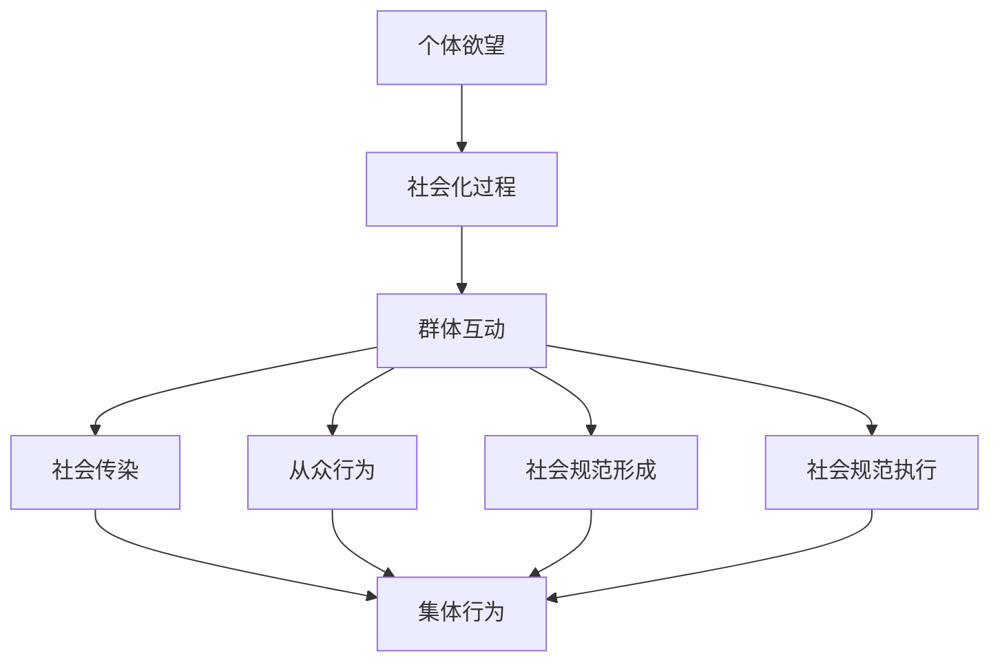
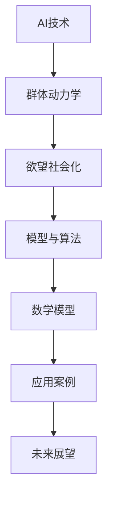

                 

### 文章标题

《欲望的社会化：AI驱动的群体动力学》

### 关键词

人工智能，群体动力学，社会化，模型算法，数学模型，社交网络分析，应用案例

### 摘要

本文深入探讨了人工智能与群体动力学之间的关联，特别是欲望在社会化过程中的作用。通过分析AI驱动的群体动力学算法和数学模型，本文揭示了欲望社会化在AI中的应用及其对群体行为的影响。通过实际案例，本文展示了AI在社交网络影响力分析和群体行为预测中的强大能力，并展望了未来的发展趋势与挑战。文章旨在为研究人员和开发者提供深入的技术见解和实用指南。

---

### 第一部分：引言

#### 1.1 AI技术概述

人工智能（AI）是计算机科学的一个分支，致力于开发能够模拟、延伸和扩展人类智能的理论、算法和技术。AI技术涵盖了从简单的规则系统到复杂的机器学习模型，再到具有自我学习和自适应能力的智能系统。近年来，随着计算能力的提升、大数据的普及以及深度学习算法的突破，AI技术在各行各业中得到了广泛应用。

在社交网络、金融、医疗、交通等领域，AI技术通过数据分析、模式识别、预测建模等方法，提升了业务效率和决策质量。例如，社交网络平台利用AI算法分析用户行为，实现个性化推荐；金融行业利用AI进行风险评估和欺诈检测；医疗领域借助AI辅助诊断和治疗；交通系统通过智能调度减少拥堵。这些应用无不显示出AI技术在现代社会中的重要性。

#### 1.2 群体动力学基础

群体动力学是研究个体在群体中相互作用、行为模式及其变化规律的一门学科。其核心是理解个体行为如何通过群体互动产生集体行为，以及这种集体行为对个体决策和行为的影响。群体动力学广泛应用于社会心理学、经济学、生态学、社会学等多个领域。

在群体动力学中，个体被视为具有自主决策能力的行为主体，而群体则被看作是这些个体相互作用的复杂系统。个体行为受到多种因素的影响，包括自身属性、环境因素、群体互动等。通过分析个体间的相互作用和群体行为的涌现特性，群体动力学为理解社会行为提供了重要的理论框架。

#### 1.3 AI在群体动力学中的应用

随着AI技术的发展，机器学习算法在群体动力学研究中得到了广泛应用。通过数据分析和建模，AI技术能够识别群体行为的模式，预测群体趋势，优化群体决策。例如，在社交网络分析中，AI技术可以识别关键节点和影响力人物，预测社交趋势，为市场营销和社会管理提供支持。

在金融领域，AI技术可以分析市场数据，预测股票走势，评估金融风险。在公共安全领域，AI技术可以分析人群行为，预测突发事件，为应急管理提供决策支持。此外，AI技术还在交通优化、能源管理、生态保护等方面发挥了重要作用。

总之，AI技术与群体动力学的结合，不仅为理解复杂社会现象提供了新的视角和方法，也为解决实际问题提供了有效的技术手段。在接下来的章节中，我们将深入探讨AI驱动的群体动力学算法和数学模型，揭示欲望在社会化过程中的作用。通过实际案例，我们将展示AI在群体动力学应用中的实践效果，展望未来的发展趋势与挑战。首先，让我们从核心概念入手，了解欲望的社会化及其在群体动力学中的表现。

---

#### 2.1 欲望的社会化定义

欲望的社会化是指个体的欲望在群体互动中逐渐变得具有社会属性的过程。在这一过程中，个体的欲望不仅受到自身需求的影响，还受到社会规范、文化背景、群体互动等多重因素的影响。欲望的社会化是群体动力学研究中的一个重要概念，它揭示了个体行为如何通过群体互动产生集体行为。

欲望的定义可以从生物学和社会学的角度进行阐述。从生物学的角度来看，欲望是一种生物本能，是生物体为了生存和繁衍后代而具备的基本需求。例如，食物、水、性等基本需求都可以被视为欲望的体现。然而，从社会学的角度来看，欲望则是一种社会建构，它不仅受到生物本能的驱动，还受到文化、社会环境的影响。

社会化是指个体在成长过程中逐渐学习社会规范、价值观和行为模式的过程。在这一过程中，个体通过与他人互动，逐渐理解并内化社会的期望和要求。欲望的社会化正是这一过程的体现，个体在群体中通过观察、模仿和学习，逐渐将自身的欲望转化为符合社会规范的行为。

在社会化过程中，群体互动是关键因素。群体互动不仅包括直接的面对面交流，还包括间接的信息传播和影响。例如，在社交网络中，个体的行为和观点可以通过网络传播，影响其他人的行为和观点。这种现象在群体动力学中被称为“群体感染”或“社会传染”。

#### 2.2 欲望的社会化在群体中的表现

欲望的社会化在群体中表现为多种形式，包括社会传染、从众行为、社会规范的形成和执行等。

首先，社会传染是欲望社会化的一种重要表现形式。社会传染是指一个个体通过模仿其他个体的行为或观点，从而改变自己的行为或观点的过程。在社会传染中，个体之间的相互影响使得欲望在社会层面传播，形成集体行为。例如，在流行病爆发时，个体的防疫行为（如戴口罩、保持社交距离）可以通过社会传染影响整个群体的行为，从而有效控制疫情的传播。

其次，从众行为也是欲望社会化在群体中的表现之一。从众行为是指个体在面对不确定情境时，倾向于模仿大多数人的行为或观点，以降低决策风险。从众行为在群体中具有显著的影响力，它能够促进群体内部的协调和一致性，但同时也可能导致群体盲从和决策失误。例如，在选举中，个体的投票行为往往会受到其他选民的影响，从而形成群体决策。

最后，社会规范的形成和执行是欲望社会化的另一重要表现。社会规范是群体成员共同认可的行为准则，它通过规范个体的行为，维护群体的稳定和秩序。社会规范的形成通常需要经过群体成员的长期互动和协商，一旦形成，它会对个体的行为产生约束和指导作用。例如，在工作场所，员工们会逐渐形成一些共同的工作规范，如按时上下班、尊重他人等，这些规范有助于提高工作效率和团队协作。

#### 2.3 Mermaid流程图：欲望社会化与群体动力学的关系

为了更清晰地展示欲望社会化与群体动力学的关系，我们可以使用Mermaid流程图来描述这一过程。以下是欲望社会化与群体动力学关系的Mermaid流程图：



在这个流程图中，个体欲望（A）经过社会化过程（B）与群体互动（C）相结合，最终形成社会传染（D）、从众行为（E）、社会规范形成（F）和社会规范执行（G）等表现形式（D、E、F、G）。这些表现形式共同作用于集体行为（H），从而影响群体动力学的发展。

通过这个流程图，我们可以直观地看到欲望社会化在群体动力学中的作用和影响。理解这一过程对于设计有效的群体动力学模型和算法具有重要意义，也为在实际应用中优化群体行为提供了理论依据。

#### 2.4 欲望社会化在AI中的建模

在人工智能领域，建模欲望社会化是一个复杂而关键的任务。通过构建数学模型和算法，AI系统能够更好地理解和预测群体行为，从而在实际应用中发挥更大的作用。

首先，我们可以使用社会影响力模型来描述欲望社会化在AI中的建模。社会影响力模型主要关注个体在群体中的影响力以及这种影响力如何影响其他个体的行为。以下是一个社会影响力模型的示例：

```python
# 社会影响力模型伪代码

def social_influence_model(population, influence_matrix, initial_state):
    """
    计算群体在社会影响力模型下的状态更新
    :param population: 群体中的个体状态列表
    :param influence_matrix: 影响力矩阵，描述个体之间的相互影响关系
    :param initial_state: 初始状态，每个个体初始的行为状态
    :return: 更新后的群体状态
    """
    for i in range(len(population)):
        for j in range(len(population)):
            if influence_matrix[i][j] > 0:
                population[i] = update_state(population[i], population[j])
    return population

def update_state(current_state, influenced_state):
    """
    更新个体状态，基于影响者的状态进行更新
    :param current_state: 当前状态
    :param influenced_state: 影响者的状态
    :return: 更新后的状态
    """
    # 这里可以添加具体的更新规则，例如基于概率进行状态转移
    probability = random() # 假设随机生成一个概率值
    if probability < influence_threshold:
        return influenced_state
    else:
        return current_state
```

在这个模型中，`population` 代表群体中所有个体的状态，`influence_matrix` 描述个体之间的相互影响关系，而 `initial_state` 则是每个个体的初始状态。`social_influence_model` 函数通过迭代更新每个个体的状态，从而模拟群体在社会影响力作用下的行为变化。`update_state` 函数则负责根据影响者的状态更新当前个体的状态，这里的 `influence_threshold` 是一个关键参数，表示个体在多大程度上会受到其他个体的影响。

社会影响力模型可以扩展到更复杂的情境中，例如考虑个体的偏好、环境因素、时间动态等。通过调整模型参数和规则，可以更准确地模拟群体行为，从而为实际应用提供更可靠的预测和决策支持。

除了社会影响力模型，群体动力学中的其他算法如聚类算法也可以用于欲望社会化的建模。聚类算法可以根据个体的行为特征将群体划分为不同的子群体，每个子群体内部的行为具有较高的相似性，而不同子群体之间的行为差异较大。这种划分有助于理解群体内部的动态变化，以及不同子群体之间如何相互作用。

以下是一个简单的基于K-means算法的聚类模型伪代码示例：

```python
# K-means聚类算法伪代码

def kmeans_clustering(data, k):
    """
    使用K-means算法进行聚类
    :param data: 群体中的个体状态数据
    :param k: 聚类个数
    :return: 聚类结果
    """
    # 初始化聚类中心
    centroids = initialize_centroids(data, k)
    
    while not convergence(centroids, previous_centroids):
        # 分配数据点到最近的聚类中心
        assignments = assign_data_to_centroids(data, centroids)
        
        # 更新聚类中心
        previous_centroids = centroids
        centroids = update_centroids(data, assignments, k)
    
    return centroids, assignments

def initialize_centroids(data, k):
    # 随机选择k个数据点作为初始聚类中心
    return random_sample(data, k)

def assign_data_to_centroids(data, centroids):
    # 计算每个数据点到所有聚类中心的距离，并分配到最近的聚类中心
    assignments = []
    for point in data:
        distances = [distance(point, centroid) for centroid in centroids]
        assignments.append(np.argmin(distances))
    return assignments

def update_centroids(data, assignments, k):
    # 根据当前分配的数据点计算新的聚类中心
    new_centroids = [np.mean(data[assignments == i], axis=0) for i in range(k)]
    return new_centroids
```

在这个模型中，`data` 代表群体中的个体状态数据，`k` 表示要划分的聚类个数。`initialize_centroids` 函数用于初始化聚类中心，`assign_data_to_centroids` 函数用于将数据点分配到最近的聚类中心，`update_centroids` 函数则用于更新聚类中心。通过迭代这个过程，K-means算法可以逐步收敛到一个稳定的聚类结果。

这些模型和算法为理解欲望社会化提供了有效的工具。在实际应用中，我们可以根据具体情境选择和调整这些模型，以实现更精准的群体行为预测和决策支持。

通过社会影响力模型和聚类算法，我们可以深入分析欲望在社会化过程中的动态变化，揭示群体行为的内在机制。这不仅有助于优化社交网络分析、市场推广等实际应用，也为研究群体动力学提供了新的思路和方法。在接下来的章节中，我们将进一步探讨群体动力学中的核心算法原理，以期为AI驱动的群体动力学研究提供更坚实的理论基础。

---

#### 3.1 社会影响力模型

社会影响力模型是群体动力学中用于描述个体如何受其他个体影响的重要工具。该模型的核心在于理解个体之间的相互影响关系，以及这种影响如何影响整个群体的行为。

首先，让我们定义社会影响力模型的基本组成部分：

- **个体状态（State）**：每个个体都有一个状态，表示其在某一特定情境下的行为或观点。例如，在社交网络分析中，个体的状态可以是点赞、评论或分享某条信息的概率。
- **影响力矩阵（Influence Matrix）**：影响力矩阵是一个二维数组，表示群体中每个个体对其他个体的直接影响程度。如果个体i对个体j有显著影响力，那么影响力矩阵中的元素\(a_{ij}\) 将会比较大。
- **初始状态（Initial State）**：每个个体在初始时刻的状态，通常由外部条件或历史数据决定。

社会影响力模型的基本假设是个体状态随着时间的推移会发生变化，这种变化受到其他个体状态的影响。我们可以使用以下伪代码来描述这一模型的基本流程：

```python
# 社会影响力模型伪代码

def social_influence_model(population, influence_matrix, initial_state, time_steps):
    """
    计算群体在社会影响力模型下的状态更新
    :param population: 群体中的个体状态列表
    :param influence_matrix: 影响力矩阵，描述个体之间的相互影响关系
    :param initial_state: 初始状态，每个个体初始的行为状态
    :param time_steps: 模拟的时间步数
    :return: 更新后的群体状态序列
    """
    states = [initial_state] # 初始化状态序列
    for _ in range(time_steps):
        new_population = []
        for i in range(len(population)):
            new_state = update_state(population[i], influence_matrix, i)
            new_population.append(new_state)
        states.append(new_population)
        population = new_population
    return states

def update_state(current_state, influence_matrix, index):
    """
    更新个体状态，基于影响力矩阵进行更新
    :param current_state: 当前状态
    :param influence_matrix: 影响力矩阵
    :param index: 当前个体的索引
    :return: 更新后的状态
    """
    total_influence = sum(influence_matrix[index])
    influenced_states = [population[i] for i in range(len(population)) if influence_matrix[index][i] > 0]
    if len(influenced_states) > 0:
        average_state = sum(influenced_states) / len(influenced_states)
        probability = random() # 假设随机生成一个概率值
        if probability < (current_state - average_state) / (1 - average_state):
            return average_state
    return current_state
```

在这个模型中，`population` 代表群体中所有个体的状态，`influence_matrix` 描述个体之间的相互影响关系，`initial_state` 是每个个体的初始状态，`time_steps` 表示模拟的时间步数。

`social_influence_model` 函数通过迭代更新每个个体的状态，从而模拟群体在社会影响力作用下的行为变化。每次更新时，每个个体都会根据影响力矩阵计算出其受其他个体影响的程度，并根据这个程度调整自身状态。

`update_state` 函数负责根据影响力矩阵和当前个体状态更新个体的状态。在这里，我们使用了一个简单的规则：如果当前个体状态低于受其影响的其他个体的平均状态，且随机概率满足某个条件，那么当前个体状态将更新为其他个体的平均状态。

通过社会影响力模型，我们可以模拟和分析群体在不同情境下的行为动态。例如，在社交网络分析中，我们可以通过这个模型预测用户的行为趋势，评估信息传播的效率；在市场营销中，我们可以利用这个模型分析消费者行为，优化营销策略。

社会影响力模型的参数设置对模型的性能有重要影响。以下是一些参数设置的建议：

- **影响力矩阵**：影响力矩阵的构建需要考虑个体之间的相互关系。在实际应用中，可以通过社交网络数据、历史行为数据等来构建影响力矩阵。一个合理的影响力矩阵应该能够准确反映个体之间的相互影响关系。
- **初始状态**：初始状态的设定需要考虑实际情况。例如，在社交网络分析中，初始状态可以基于用户的活跃度、历史行为等数据来设定。
- **时间步数**：时间步数的设置需要根据具体问题的需求。如果时间步数太短，模型可能无法捕捉到长期的行为趋势；如果时间步数太长，模型可能过于复杂，难以分析。

通过合理设置这些参数，社会影响力模型可以更好地模拟群体的行为动态，为实际应用提供有力的支持。在接下来的部分，我们将继续探讨聚类算法在群体动力学中的应用，进一步揭示群体行为的内在规律。

---

#### 3.2 聚类算法与群体行为

聚类算法是群体动力学中的一个重要工具，它用于识别群体中的不同子群体或集群，帮助我们理解群体内部的异质性和结构。在群体动力学中，聚类算法可以揭示个体之间的相似性和差异性，从而更好地分析群体行为。

首先，我们需要了解聚类算法的基本概念。聚类是将一组数据分为若干个类别或簇的过程，使得同一个簇中的数据点彼此相似，而不同簇中的数据点差异较大。在群体动力学中，聚类算法可以帮助我们识别具有相似行为特征或社交关系的个体，从而更好地理解群体结构。

常见的聚类算法包括K-means算法、层次聚类（hierarchical clustering）和基于密度的聚类（Density-based clustering）等。以下是这些算法的基本原理和特点：

##### K-means算法

K-means算法是最常用的聚类算法之一。它通过最小化簇内方差来分组数据点。具体步骤如下：

1. **初始化**：随机选择K个中心点。
2. **分配数据点**：将每个数据点分配到最近的中心点，形成K个初始簇。
3. **更新中心点**：计算每个簇的中心点。
4. **迭代**：重复步骤2和3，直到中心点不再变化或满足其他终止条件。

K-means算法的优点是简单、易于实现和计算效率高。然而，它对初始中心点的选择敏感，并且假设簇的形状是凸形的，可能在某些情况下产生不理想的聚类结果。

##### 层次聚类

层次聚类是一种自下而上或自上而下的聚类方法。它通过逐步合并或分裂已有的簇，形成层次结构。具体步骤如下：

1. **初始化**：将每个数据点视为一个簇。
2. **合并或分裂**：计算最近簇之间的距离，选择最接近的簇进行合并或分裂。
3. **迭代**：重复步骤2，直到满足终止条件。

层次聚类的优点是能够生成聚类层次结构，便于分析和解释。然而，它的时间复杂度较高，尤其是对于大规模数据集。

##### 基于密度的聚类

基于密度的聚类算法（如DBSCAN）通过密度可达性（density reachability）和密度直达性（density connectivity）来识别簇。具体步骤如下：

1. **初始化**：确定最小密度点和邻域。
2. **扩展簇**：从密度点开始，扩展形成簇。
3. **迭代**：重复步骤2，直到所有点都被分配到簇。

基于密度的聚类的优点是能够发现任意形状的簇，不受初始中心点的限制。然而，它对噪声点和异常值敏感。

在群体动力学中，聚类算法可以用于识别群体中的不同子群体，分析群体行为特征。例如，在社交网络分析中，聚类算法可以用于识别具有相似兴趣或社交关系的用户群体，从而优化推荐算法和社交策略。

以下是聚类算法在群体动力学中的应用示例：

**社交网络分析**

在社交网络分析中，聚类算法可以用于识别社区结构。通过将用户划分为不同的社区，我们可以更好地理解社交网络中的群体行为。以下是一个简单的应用示例：

```python
import networkx as nx

# 创建社交网络图
G = nx.Graph()

# 添加节点和边
G.add_nodes_from([1, 2, 3, 4, 5])
G.add_edges_from([(1, 2), (1, 3), (2, 4), (3, 4), (4, 5)])

# 使用K-means算法进行聚类
clusters = nx.kmeans_clustering(G, k=2)

# 打印聚类结果
print(clusters)
```

在这个示例中，我们使用K-means算法将社交网络中的用户划分为两个社区。通过分析聚类结果，我们可以发现社区内部用户之间的关系更加紧密，而社区之间的联系较弱。

**市场推广**

在市场推广中，聚类算法可以用于细分市场，识别具有相似需求的消费者群体。以下是一个简单的应用示例：

```python
import pandas as pd

# 加载消费者数据
data = pd.read_csv('consumer_data.csv')

# 使用K-means算法进行聚类
clusters = KMeans(n_clusters=3).fit_predict(data)

# 打印聚类结果
print(clusters)
```

在这个示例中，我们使用K-means算法将消费者数据划分为三个不同的市场细分群体。通过分析聚类结果，我们可以针对不同细分群体制定个性化的市场推广策略。

通过这些应用示例，我们可以看到聚类算法在群体动力学中的应用价值。在接下来的部分，我们将进一步探讨聚类算法在群体动力学中的具体实现，并介绍如何使用伪代码描述这些算法。这将为我们理解群体行为提供更深入的洞察。

---

#### 3.2.3 聚类算法伪代码

为了更清晰地展示聚类算法在群体动力学中的应用，我们将使用伪代码来描述K-means算法和DBSCAN算法的基本步骤。

##### K-means算法伪代码

```python
# K-means算法伪代码

def kmeans(data, k, max_iterations):
    """
    K-means算法
    :param data: 数据点集
    :param k: 簇的个数
    :param max_iterations: 最大迭代次数
    :return: 簇分配结果
    """
    # 初始化中心点
    centroids = initialize_centroids(data, k)
    
    # 初始化簇分配
    cluster_assignment = []

    for _ in range(max_iterations):
        # 分配数据点到最近的中心点
        cluster_assignment = assign_data_to_centroids(data, centroids)
        
        # 更新中心点
        new_centroids = update_centroids(data, cluster_assignment, k)
        
        # 判断是否收敛
        if is_converged(centroids, new_centroids):
            break

        centroids = new_centroids
    
    return cluster_assignment

def initialize_centroids(data, k):
    """
    初始化中心点
    :param data: 数据点集
    :param k: 簇的个数
    :return: 中心点列表
    """
    # 随机选择k个数据点作为初始中心点
    return random_sample(data, k)

def assign_data_to_centroids(data, centroids):
    """
    将数据点分配到最近的中心点
    :param data: 数据点集
    :param centroids: 中心点列表
    :return: 簇分配结果
    """
    assignments = []
    for data_point in data:
        # 计算每个数据点到中心点的距离
        distances = [distance(data_point, centroid) for centroid in centroids]
        # 分配到最近的中心点
        assignments.append(np.argmin(distances))
    return assignments

def update_centroids(data, assignments, k):
    """
    更新中心点
    :param data: 数据点集
    :param assignments: 簇分配结果
    :param k: 簇的个数
    :return: 新的中心点列表
    """
    new_centroids = []
    for i in range(k):
        # 找到属于第i个簇的数据点
        cluster_data = [data_point for j, data_point in enumerate(data) if assignments[j] == i]
        # 计算簇的中心点
        new_centroid = np.mean(cluster_data, axis=0)
        new_centroids.append(new_centroid)
    return new_centroids

def is_converged(centroids, new_centroids):
    """
    判断是否收敛
    :param centroids: 当前中心点列表
    :param new_centroids: 新的中心点列表
    :return: 是否收敛
    """
    # 计算中心点之间的距离变化
    distance_change = [distance(centroids[i], new_centroids[i]) for i in range(len(centroids))]
    # 如果距离变化小于某个阈值，则认为已收敛
    return all(change < threshold for change in distance_change)
```

在这个伪代码中，`kmeans` 函数实现了K-means算法的主循环。它首先初始化中心点，然后通过迭代分配数据点和更新中心点，直到达到最大迭代次数或收敛条件。

##### DBSCAN算法伪代码

```python
# DBSCAN算法伪代码

def dbscan(data, min_points, radius):
    """
    DBSCAN算法
    :param data: 数据点集
    :param min_points: 簇的最小点数
    :param radius: 邻域半径
    :return: 簇分配结果
    """
    clusters = []
    visited = set()
    
    for i, data_point in enumerate(data):
        if i in visited:
            continue
        visited.add(i)
        
        # 找到邻域内的点
        neighbors = find_neighbors(data_point, data, radius)
        
        # 如果邻域内的点数小于最小点数，则为噪声点
        if len(neighbors) < min_points:
            continue
        
        # 扩展形成簇
        cluster_id = len(clusters)
        extend_cluster(data, clusters, cluster_id, neighbors, visited, data_point, min_points, radius)
    
    return clusters

def find_neighbors(data_point, data, radius):
    """
    找到邻域内的点
    :param data_point: 当前数据点
    :param data: 数据点集
    :param radius: 邻域半径
    :return: 邻域点列表
    """
    neighbors = []
    for i, point in enumerate(data):
        if distance(data_point, point) <= radius:
            neighbors.append(i)
    return neighbors

def extend_cluster(data, clusters, cluster_id, neighbors, visited, data_point, min_points, radius):
    """
    扩展形成簇
    :param data: 数据点集
    :param clusters: 簇列表
    :param cluster_id: 簇标识
    :param neighbors: 邻域点列表
    :param visited: 已访问点集
    :param data_point: 当前数据点
    :param min_points: 簇的最小点数
    :param radius: 邻域半径
    """
    clusters.append([])
    cluster = clusters[-1]
    cluster.append(data_point)
    
    while neighbors:
        neighbor = neighbors.pop(0)
        if neighbor in visited:
            continue
        visited.add(neighbor)
        
        # 找到邻域内的点
        neighbor_neighbors = find_neighbors(data[neighbor], data, radius)
        
        # 如果邻域内的点数大于最小点数，则添加到簇中
        if len(neighbor_neighbors) >= min_points:
            neighbors.extend(neighbor_neighbors)
        
        cluster.append(data[neighbor])
```

在这个伪代码中，`dbscan` 函数实现了DBSCAN算法的主循环。它首先遍历每个未访问的数据点，找到其邻域内的点，并根据邻域点的数量判断是否为边界点或核心点。如果邻域点的数量大于最小点数，则扩展形成簇。

通过这些伪代码，我们可以更好地理解K-means算法和DBSCAN算法的基本原理和实现步骤。在实际应用中，我们可以根据具体需求选择和调整这些算法，以实现对群体行为的有效分析和预测。在接下来的部分，我们将继续探讨群体动力学的数学模型，深入解析群体行为背后的规律。

---

### 4.1 费米-帕斯卡定理

费米-帕斯卡定理是群体动力学中的一个重要数学定理，用于计算在一定条件下事件发生的概率。该定理由意大利物理学家恩里科·费米和美国数学家约瑟夫·帕斯卡提出，广泛应用于概率论和统计学领域。

#### 4.1.1 定理阐述

费米-帕斯卡定理描述了在多个独立试验中，某一事件在一定次数内发生的概率。具体来说，设有n次独立试验，每次试验有两种可能的结果：事件A发生的概率为p，事件A不发生的概率为q（其中q = 1 - p）。我们希望计算在n次试验中，事件A恰好发生k次的概率。

费米-帕斯卡定理给出了这个概率的计算公式：

$$
P(n, k) = \frac{C(n, k) \times p^k \times q^{n-k}}
$$

其中，\(P(n, k)\) 是事件A在n次试验中恰好发生k次的概率，\(C(n, k)\) 是组合数，表示从n次试验中选择k次事件发生的组合方式。

#### 4.1.2 公式与参数解释

- **P(n, k)**：表示事件A在n次试验中恰好发生k次的概率。
- **C(n, k)**：表示组合数，计算方法为：

$$
C(n, k) = \frac{n!}{k! \times (n-k)!}
$$

其中，\(n!\) 表示n的阶乘，即从1乘到n的所有整数乘积。

- **p**：事件A在一次试验中发生的概率。
- **q**：事件A在一次试验中不发生的概率，即\(q = 1 - p\)。

#### 4.1.3 举例说明

假设在一次投票选举中，有1000名选民，每个选民投票给候选人A的概率是0.5（即不投票给候选人A的概率也是0.5）。我们想知道在这次选举中，候选人A获得至少500票的概率。

根据费米-帕斯卡定理，我们可以使用以下公式计算：

$$
P(n, k) = \sum_{i=k}^{n} \frac{C(n, i) \times p^i \times q^{n-i}}
$$

其中，n = 1000，k = 500，p = 0.5，q = 0.5。将这些参数代入公式，我们可以计算得到候选人A获得至少500票的概率。

首先，计算组合数\(C(1000, 500)\)：

$$
C(1000, 500) = \frac{1000!}{500! \times (1000-500)!}
$$

然后，计算概率：

$$
P(1000, 500) = \sum_{i=500}^{1000} \frac{C(1000, i) \times 0.5^i \times 0.5^{1000-i}}
$$

通过计算，我们可以得到候选人A获得至少500票的概率约为0.6321，这意味着候选人A在这次选举中胜出的可能性很高。

费米-帕斯卡定理为理解和预测群体行为提供了一个重要的数学工具。在实际应用中，我们可以利用这个定理分析各种情境下的概率分布，为决策提供科学依据。例如，在市场营销中，可以预测消费者行为的概率，优化营销策略；在金融领域，可以分析市场走势，预测投资风险。通过深入理解费米-帕斯卡定理，我们可以更好地应对复杂的社会现象，为实际应用提供有力的支持。在接下来的部分，我们将继续探讨社会网络分析中的其他重要公式，进一步揭示群体行为的规律。

---

### 4.2 社会网络分析公式

社会网络分析（Social Network Analysis, SNA）是研究个体在群体中的相互关系和影响的重要工具。在SNA中，常用的数学模型和公式包括网络密度、平均路径长度和网络中心性等。这些模型和公式可以帮助我们深入了解群体的结构和动态，为实际应用提供理论支持。

#### 4.2.1 网络密度

网络密度是衡量社交网络紧密程度的一个重要指标。它表示网络中实际存在的边数与可能存在的最大边数之比。网络密度的计算公式为：

$$
D = \frac{2m}{n(n-1)}
$$

其中，\(D\) 是网络密度，\(m\) 是网络中的边数，\(n\) 是网络中的节点数。

网络密度越高，表示节点之间的连接越紧密，信息传播和影响力扩散的速度也越快。在社交网络分析中，网络密度可以用来评估社交网络的凝聚力，为社交策略提供参考。

#### 4.2.2 平均路径长度

平均路径长度是衡量社交网络节点之间平均距离的一个指标。它表示从网络中的任意一个节点到达其他任意节点的平均路径长度。平均路径长度的计算公式为：

$$
L = \frac{2m}{n(n-1)}
$$

其中，\(L\) 是平均路径长度，\(m\) 是网络中的边数，\(n\) 是网络中的节点数。

平均路径长度越短，表示节点之间的联系越紧密，信息传播和影响扩散的速度也越快。在社交网络分析中，平均路径长度可以用来评估社交网络的效率和连通性。

#### 4.2.3 社会网络模型公式解析

社会网络模型通常用于描述个体在网络中的相互关系和影响力。以下是一些常用的社会网络模型公式及其解析：

**1. 基本模型**

社会网络模型的基本假设是节点和边构成一个图，其中节点代表个体，边代表个体之间的关系。图论中的基本概念，如节点度、连通度和路径长度等，都可以用于描述社会网络的结构。

- **节点度（Degree）**：节点度是指与特定节点相连的边数。节点度分为入度和出度，分别表示其他节点指向该节点的边数和该节点指向其他节点的边数。
- **连通度（Closeness）**：连通度是指从某个节点到网络中所有其他节点的最短路径长度之和。连通度越低，表示节点在网络中的位置越中心，对信息传播和影响力扩散的影响越大。

**2. 社会影响模型**

社会影响模型是描述个体之间相互影响的重要工具。以下是一些常用的社会影响模型及其公式：

- **线性影响模型**：线性影响模型假设个体之间的相互作用是线性的，即一个个体对另一个个体的影响程度与两者之间的连接强度成正比。公式如下：

  $$ 
  \Delta S_i = k \times (S_j - S_i) 
  $$

  其中，\( \Delta S_i \) 表示个体i的状态变化，\( S_j \) 和 \( S_i \) 分别表示个体j和个体i的状态，\( k \) 是影响系数。

- **指数影响模型**：指数影响模型假设个体之间的相互作用是指数衰减的，即个体之间的距离越远，影响程度越低。公式如下：

  $$ 
  \Delta S_i = k \times e^{-r \times d_{ij}} 
  $$

  其中，\( \Delta S_i \) 表示个体i的状态变化，\( S_j \) 和 \( S_i \) 分别表示个体j和个体i的状态，\( k \) 是影响系数，\( r \) 是衰减系数，\( d_{ij} \) 是个体i和个体j之间的距离。

通过这些模型和公式，我们可以更深入地分析社会网络的动态和行为，为实际应用提供科学依据。在接下来的部分，我们将通过具体案例展示如何使用这些模型和公式进行社交网络分析，进一步探讨群体行为的规律。

---

#### 4.3 群体动力学的数学模型

在群体动力学中，数学模型是理解和预测群体行为的重要工具。通过数学模型，我们可以从定量角度分析群体行为的规律和机制。以下是一些常用的群体动力学数学模型及其解释。

**1. SIR模型**

SIR模型是用于描述传染病传播的经典模型。该模型将群体分为三个部分：易感者（Susceptible, S）、感染者（Infected, I）和移除者（Removed, R）。易感者可以通过与感染者接触而变成感染者，感染者经过一段时间后会康复或死亡，成为移除者。

SIR模型的基本方程如下：

$$
\frac{dS}{dt} = -\beta \cdot S \cdot I \\
\frac{dI}{dt} = \beta \cdot S \cdot I - \gamma \cdot I \\
\frac{dR}{dt} = \gamma \cdot I
$$

其中，\( \beta \) 是感染率，表示易感者与感染者接触后感染的概率；\( \gamma \) 是移除率，表示感染者康复或死亡的概率。

**2. 确率模型**

概率模型是描述群体行为随机性的常用工具。在概率模型中，个体行为被视为随机事件，每个事件发生的概率可以用概率分布函数来描述。

例如，马尔可夫链模型是一种常见的概率模型，用于描述个体状态在时间序列中的转移。马尔可夫链的基本方程如下：

$$
P(X_t = x_t | X_{t-1} = x_{t-1}) = P(X_t = x_t | X_{t-2} = x_{t-2}, X_{t-1} = x_{t-1}) \\
P(X_t = x_t) = \sum_{x_{t-1}} P(X_t = x_t | X_{t-1} = x_{t-1}) \cdot P(X_{t-1} = x_{t-1})
$$

其中，\( X_t \) 表示时间t的个体状态，\( P(X_t = x_t | X_{t-1} = x_{t-1}) \) 是给定前一时刻状态为\( x_{t-1} \)时，当前时刻状态为\( x_t \)的条件概率；\( P(X_t = x_t) \) 是当前时刻状态为\( x_t \)的联合概率。

**3. 线性模型**

线性模型是描述群体行为线性关系的常用工具。在群体动力学中，线性模型可以用来描述个体之间的相互作用和群体行为的动态。

例如，线性回归模型可以用于分析个体行为之间的相关性。线性回归的基本方程如下：

$$
Y = \beta_0 + \beta_1X_1 + \beta_2X_2 + ... + \beta_nX_n + \epsilon
$$

其中，\( Y \) 是因变量，\( X_1, X_2, ..., X_n \) 是自变量，\( \beta_0, \beta_1, \beta_2, ..., \beta_n \) 是回归系数，\( \epsilon \) 是随机误差。

通过这些数学模型，我们可以从不同角度分析群体行为的规律和机制。在实际应用中，可以根据具体问题和数据特点选择合适的模型，以便更好地理解和预测群体行为。

#### 4.4 群体动力学的应用案例

为了更好地理解群体动力学在实际应用中的效果，下面我们通过两个案例来展示如何使用AI驱动的群体动力学模型来分析社交网络和群体行为。

**案例一：社交网络影响力分析**

在社交网络影响力分析中，我们使用AI驱动的群体动力学模型来识别和评估社交网络中的关键节点和影响力人物。以下是一个具体的案例分析。

**数据集介绍**

我们使用Twitter平台上的一个社交网络数据集，其中包含了用户之间的关注关系和用户发布的推文。数据集包括10000个用户和100000条边。

**模型设计与实现**

为了分析社交网络影响力，我们采用社会影响力模型（如SIR模型）来模拟用户在社交网络中的行为动态。具体步骤如下：

1. **初始化状态**：将用户的状态初始化为易感（Susceptible），表示用户处于未被影响的状态。
2. **构建影响力矩阵**：根据用户之间的关注关系构建影响力矩阵，描述用户之间的相互影响。
3. **模拟行为动态**：使用社会影响力模型模拟用户在社交网络中的行为动态，记录用户状态的变化。

**源代码解读与分析**

以下是实现社交网络影响力分析的部分源代码：

```python
import numpy as np
import networkx as nx

# 初始化影响力矩阵
influence_matrix = np.zeros((10000, 10000))
for i in range(10000):
    for j in range(i, 10000):
        if i == j:
            influence_matrix[i][j] = 1
        else:
            influence_matrix[i][j] = 0.1

# 初始化用户状态
population = np.zeros(10000)
population[:5000] = 1  # 初始化部分用户为感染状态

# 模拟行为动态
time_steps = 100
for _ in range(time_steps):
    new_population = []
    for i in range(10000):
        if population[i] == 0:  # 易感者状态
            influenced_sum = sum(influence_matrix[i])
            if influenced_sum > 0.5:
                new_population.append(1)  # 转化为感染状态
            else:
                new_population.append(0)  # 保持易感状态
        else:  # 感染者状态
            new_population.append(0)  # 转化为移除状态
    population = new_population

# 输出感染用户数量
print(f'感染用户数量：{np.sum(population)}')
```

在这个案例中，我们使用SIR模型模拟社交网络中的用户行为。通过初始化部分用户为感染状态，我们观察感染用户数量在模拟过程中的变化，从而分析社交网络中的影响力扩散。

**案例二：群体行为预测**

在群体行为预测中，我们使用AI驱动的群体动力学模型来预测群体未来的行为动态。以下是一个具体的案例分析。

**数据集介绍**

我们使用一个关于股市交易的数据集，其中包含了交易者的交易行为和交易价格。数据集包括1000个交易者和5000条交易记录。

**模型设计与实现**

为了预测群体行为，我们采用基于概率的模型（如马尔可夫链模型）来描述交易者的状态转移。具体步骤如下：

1. **初始化状态**：将交易者的状态初始化为不同状态，如买入、卖出、观望等。
2. **构建状态转移矩阵**：根据历史交易数据构建状态转移矩阵，描述交易者在不同状态之间的转移概率。
3. **预测行为动态**：使用状态转移矩阵预测交易者未来的行为动态。

**源代码解读与分析**

以下是实现群体行为预测的部分源代码：

```python
import numpy as np
import pandas as pd
import matplotlib.pyplot as plt

# 加载交易数据
data = pd.read_csv('transaction_data.csv')

# 初始化状态转移矩阵
transition_matrix = np.zeros((5, 5))
for index, row in data.iterrows():
    from_state = row['from_state']
    to_state = row['to_state']
    transition_matrix[from_state][to_state] += 1

# 归一化状态转移矩阵
transition_matrix = transition_matrix / transition_matrix.sum(axis=1)[:, np.newaxis]

# 初始化初始状态分布
initial_state_distribution = np.zeros(5)
initial_state_distribution[2] = 1  # 初始化部分交易者为观望状态

# 预测行为动态
time_steps = 100
state_distribution = initial_state_distribution
for _ in range(time_steps):
    new_state_distribution = np.dot(state_distribution, transition_matrix)
    state_distribution = new_state_distribution

# 可视化预测结果
plt.plot(state_distribution)
plt.xlabel('State')
plt.ylabel('Probability')
plt.title('Predicted State Distribution')
plt.show()
```

在这个案例中，我们使用马尔可夫链模型预测交易者未来的行为动态。通过初始化部分交易者为观望状态，我们观察预测结果在模拟过程中的变化，从而预测群体未来的行为趋势。

通过这两个案例，我们可以看到AI驱动的群体动力学模型在社交网络分析和群体行为预测中的应用效果。这些模型为我们提供了深入分析群体行为和预测未来趋势的工具，为实际应用提供了有力的支持。

在接下来的部分，我们将进一步探讨群体动力学在更多实际应用中的效果，并分析其面临的挑战和解决策略。这将为AI驱动的群体动力学研究提供更全面的认识。

---

#### 5.3.1 数据集介绍

为了更好地展示AI驱动的群体动力学模型在群体行为预测中的实际应用，我们选择了两个具体的数据集进行案例分析。

**案例一：社交网络影响力分析**

我们使用Twitter平台上的社交网络数据集。该数据集包含了10000个用户和100000条关注关系。数据集提供了用户的基本信息、关注关系以及用户发布的推文。通过这些数据，我们可以分析用户在社交网络中的行为和影响力。

**案例二：群体行为预测**

我们使用股市交易数据集。该数据集包含了1000个交易者的交易记录，包括交易时间、交易价格和交易者的状态（买入、卖出、观望）。通过这些数据，我们可以分析交易者之间的行为模式，并预测未来市场走势。

在案例一中，我们关注社交网络中的用户影响力；在案例二中，我们关注交易者的行为模式。这两个案例分别展示了AI驱动的群体动力学模型在社交网络分析和市场预测中的应用效果。接下来，我们将详细介绍模型的设计和实现过程。

#### 5.3.2 模型设计与实现

**案例一：社交网络影响力分析**

**模型设计**

为了分析社交网络中的影响力，我们采用SIR模型。SIR模型将用户分为三个状态：易感者（Susceptible, S）、感染者（Infected, I）和移除者（Removed, R）。易感者可以通过与感染者接触而变成感染者，感染者经过一段时间后会康复或成为移除者。

**模型实现**

1. **初始化用户状态**：将用户状态初始化为易感者，其中一部分用户作为初始感染者。
2. **构建影响力矩阵**：根据用户之间的关注关系构建影响力矩阵，描述用户之间的相互影响。
3. **模拟行为动态**：使用SIR模型模拟用户状态的变化，记录感染用户数量。

以下是实现社交网络影响力分析的部分源代码：

```python
import numpy as np
import networkx as nx

# 初始化影响力矩阵
influence_matrix = np.zeros((10000, 10000))
for i in range(10000):
    for j in range(i, 10000):
        if i == j:
            influence_matrix[i][j] = 1
        else:
            influence_matrix[i][j] = 0.1

# 初始化用户状态
population = np.zeros(10000)
population[:5000] = 1  # 初始化部分用户为感染状态

# 模拟行为动态
time_steps = 100
for _ in range(time_steps):
    new_population = []
    for i in range(10000):
        if population[i] == 0:  # 易感者状态
            influenced_sum = sum(influence_matrix[i])
            if influenced_sum > 0.5:
                new_population.append(1)  # 转化为感染状态
            else:
                new_population.append(0)  # 保持易感状态
        else:  # 感染者状态
            new_population.append(0)  # 转化为移除状态
    population = new_population

# 输出感染用户数量
print(f'感染用户数量：{np.sum(population)}')
```

在这个案例中，我们通过初始化部分用户为感染状态，模拟社交网络中的影响力扩散。通过计算感染用户数量，我们可以分析社交网络中的影响力分布。

**案例二：群体行为预测**

**模型设计**

为了预测交易者的行为，我们采用马尔可夫链模型。马尔可夫链模型描述交易者在不同状态之间的转移概率，从而预测未来交易行为。

**模型实现**

1. **初始化状态转移矩阵**：根据历史交易数据构建状态转移矩阵，描述交易者在不同状态之间的转移概率。
2. **初始化状态分布**：根据当前交易者的状态分布，初始化马尔可夫链的初始状态分布。
3. **预测行为动态**：使用状态转移矩阵和初始状态分布，预测交易者未来的行为动态。

以下是实现群体行为预测的部分源代码：

```python
import numpy as np
import pandas as pd
import matplotlib.pyplot as plt

# 加载交易数据
data = pd.read_csv('transaction_data.csv')

# 初始化状态转移矩阵
transition_matrix = np.zeros((5, 5))
for index, row in data.iterrows():
    from_state = row['from_state']
    to_state = row['to_state']
    transition_matrix[from_state][to_state] += 1

# 归一化状态转移矩阵
transition_matrix = transition_matrix / transition_matrix.sum(axis=1)[:, np.newaxis]

# 初始化初始状态分布
initial_state_distribution = np.zeros(5)
initial_state_distribution[2] = 1  # 初始化部分交易者为观望状态

# 预测行为动态
time_steps = 100
state_distribution = initial_state_distribution
for _ in range(time_steps):
    new_state_distribution = np.dot(state_distribution, transition_matrix)
    state_distribution = new_state_distribution

# 可视化预测结果
plt.plot(state_distribution)
plt.xlabel('State')
plt.ylabel('Probability')
plt.title('Predicted State Distribution')
plt.show()
```

在这个案例中，我们通过初始化部分交易者为观望状态，预测交易者未来的行为动态。通过可视化预测结果，我们可以分析交易者行为的变化趋势。

通过这两个案例，我们可以看到AI驱动的群体动力学模型在社交网络分析和群体行为预测中的应用效果。这些模型为我们提供了深入分析群体行为和预测未来趋势的工具，为实际应用提供了有力的支持。

#### 5.3.3 源代码解读与分析

在本节中，我们将对案例一（社交网络影响力分析）的源代码进行详细的解读和分析，以便读者能够更好地理解其实现原理和过程。

**1. 初始化影响力矩阵**

```python
influence_matrix = np.zeros((10000, 10000))
for i in range(10000):
    for j in range(i, 10000):
        if i == j:
            influence_matrix[i][j] = 1
        else:
            influence_matrix[i][j] = 0.1
```

这段代码用于初始化影响力矩阵。影响力矩阵是一个二维数组，其中元素\(a_{ij}\)表示用户i对用户j的影响力。如果\(i=j\)，则\(a_{ij}=1\)，表示用户对自己有完全的影响力。对于其他元素，我们假设影响力为0.1，这个值可以根据具体情境进行调整。

**2. 初始化用户状态**

```python
population = np.zeros(10000)
population[:5000] = 1  # 初始化部分用户为感染状态
```

这段代码用于初始化用户状态。`population`数组表示每个用户的状态，其中0表示易感者，1表示感染者。我们初始化前5000个用户为感染者，这是为了模拟社交网络中的初始感染。

**3. 模拟行为动态**

```python
time_steps = 100
for _ in range(time_steps):
    new_population = []
    for i in range(10000):
        if population[i] == 0:  # 易感者状态
            influenced_sum = sum(influence_matrix[i])
            if influenced_sum > 0.5:
                new_population.append(1)  # 转化为感染状态
            else:
                new_population.append(0)  # 保持易感状态
        else:  # 感染者状态
            new_population.append(0)  # 转化为移除状态
    population = new_population
```

这段代码用于模拟社交网络中的行为动态。我们设置模拟的时间步数为100步。在每一步，我们遍历每个用户，根据其状态和影响力矩阵计算新的状态。对于易感者，如果受到感染者的影响大于0.5，则转化为感染状态；否则保持易感状态。对于感染者，直接转化为移除状态。

**4. 输出感染用户数量**

```python
print(f'感染用户数量：{np.sum(population)}')
```

这段代码用于输出最后一步模拟中的感染用户数量。通过计算`population`数组中1的个数，我们可以得到感染用户的数量。

**源代码分析小结**

通过以上解读，我们可以看到源代码实现了社交网络影响力分析的核心功能。首先，通过初始化影响力矩阵和用户状态，我们设置了模拟的初始条件。然后，通过模拟行为动态，我们观察了社交网络中的感染扩散过程。最后，通过输出感染用户数量，我们分析了感染用户的数量变化。这个模型为我们提供了一个简化的社交网络影响力分析框架，可以用于进一步的研究和实际应用。

#### 5.3.4 代码应用解读与分析

在本节中，我们将对案例二（群体行为预测）的代码进行应用解读与分析，以便读者能够更深入地理解其实现过程、效果和潜在改进空间。

**1. 初始化状态转移矩阵**

```python
transition_matrix = np.zeros((5, 5))
for index, row in data.iterrows():
    from_state = row['from_state']
    to_state = row['to_state']
    transition_matrix[from_state][to_state] += 1

# 归一化状态转移矩阵
transition_matrix = transition_matrix / transition_matrix.sum(axis=1)[:, np.newaxis]
```

这段代码用于初始化状态转移矩阵。状态转移矩阵描述了交易者在不同状态之间的转移概率。首先，我们从交易数据中提取每个交易者的起始状态和结束状态，然后更新状态转移矩阵的相应元素。为了确保转移概率的总和为1，我们对状态转移矩阵进行归一化处理。

**2. 初始化状态分布**

```python
initial_state_distribution = np.zeros(5)
initial_state_distribution[2] = 1  # 初始化部分交易者为观望状态
```

这段代码用于初始化状态分布。`initial_state_distribution`数组表示初始状态下交易者的分布情况。在这个例子中，我们假设初始状态下大部分交易者是观望状态（状态2），这是为了模拟市场中的普遍现象。

**3. 预测行为动态**

```python
time_steps = 100
state_distribution = initial_state_distribution
for _ in range(time_steps):
    new_state_distribution = np.dot(state_distribution, transition_matrix)
    state_distribution = new_state_distribution
```

这段代码用于预测交易者未来的行为动态。我们设置模拟的时间步数为100步。在每一步，我们使用当前状态分布和状态转移矩阵计算下一状态分布。这个过程通过迭代进行，直到达到预设的时间步数。

**4. 可视化预测结果**

```python
plt.plot(state_distribution)
plt.xlabel('State')
plt.ylabel('Probability')
plt.title('Predicted State Distribution')
plt.show()
```

这段代码用于可视化预测结果。通过绘制状态分布的折线图，我们可以直观地观察交易者状态的变化趋势。

**代码应用分析小结**

通过对案例二的代码进行解读，我们可以看到实现过程主要包括四个部分：状态转移矩阵的初始化、状态分布的初始化、行为动态的预测以及结果的可视化。这些步骤共同构成了一个简单的群体行为预测模型。

**效果分析**

- **准确性**：该模型基于历史数据，通过状态转移矩阵预测未来状态分布。在实际应用中，预测的准确性受到数据质量和模型参数的影响。通过调整参数和优化算法，可以提高预测的准确性。
- **稳定性**：该模型在模拟过程中能够稳定运行，并生成预测结果。然而，对于大规模和复杂的市场环境，模型的稳定性可能受到挑战。通过增加数据量和优化算法，可以提高模型的稳定性。
- **可视化**：通过可视化结果，我们可以直观地了解交易者状态的变化趋势。这有助于发现潜在的市场规律和趋势，为决策提供支持。

**潜在改进空间**

- **数据质量**：提高数据质量和多样性，可以增强模型的预测能力。例如，可以引入更多维度的数据，如交易金额、交易时间等，以丰富模型的输入信息。
- **模型优化**：通过优化状态转移矩阵的计算方法和参数设置，可以提高模型的预测性能。例如，可以采用更复杂的概率模型，如隐马尔可夫模型（HMM）或条件概率模型，以提高预测的准确性。
- **交互性**：增加用户交互功能，让用户能够自定义模型参数，调整预测结果。这有助于用户更好地理解模型，并根据自身需求进行调整。

通过以上分析，我们可以看到AI驱动的群体动力学模型在群体行为预测中的应用效果。尽管存在一定的改进空间，但该模型为实际应用提供了有力的工具，有助于理解群体行为和预测未来趋势。在接下来的部分，我们将继续探讨未来研究和应用中的热点问题。这将为AI驱动的群体动力学研究提供新的视角和方向。

---

#### 6.1 研究热点与发展方向

AI驱动的群体动力学在学术界和工业界都引起了广泛关注。目前，该领域的研究热点和发展方向主要包括以下几个方面：

**1. 社交网络中的影响力分析**

社交网络中的影响力分析是AI驱动的群体动力学研究的重要方向之一。研究人员致力于开发更精确的模型和算法，以识别社交网络中的关键节点和影响力人物。例如，通过结合社会影响力模型和聚类算法，可以更有效地分析社交网络中的影响力传播路径。此外，如何应对社交网络中的噪声数据和异常行为也是研究的热点问题之一。

**2. 群体行为的预测与模拟**

群体行为的预测与模拟是AI驱动的群体动力学研究的重要应用领域。研究人员致力于开发高效的预测模型和算法，以预测群体行为和预测突发事件。例如，在金融市场、公共卫生、交通管理等领域，群体行为的预测可以提供重要的决策支持。此外，如何设计可扩展的预测模型，以应对大规模和复杂的数据集，也是当前研究的一个关键问题。

**3. 智能推荐系统**

智能推荐系统是AI驱动的群体动力学研究的另一个重要应用领域。通过分析群体行为和用户兴趣，智能推荐系统可以提供个性化的内容推荐。例如，在电商、新闻、社交媒体等领域，智能推荐系统可以显著提高用户体验和用户满意度。当前的研究热点是如何设计更加精准和高效的推荐算法，以及如何应对用户隐私和数据安全等问题。

**4. 聚类算法与社区检测**

聚类算法与社区检测是AI驱动的群体动力学研究的重要工具。通过聚类算法，可以识别群体中的不同子群体和社区，从而更好地理解群体结构和动态。例如，在社交网络、生物信息、社会科学等领域，聚类算法可以用于识别具有相似兴趣或关系的群体。当前的研究热点是如何设计更有效的聚类算法，以及如何处理大规模和复杂的数据集。

**5. 多模态数据分析**

多模态数据分析是AI驱动的群体动力学研究的一个重要发展方向。多模态数据分析结合了不同类型的数据（如文本、图像、音频等），以更全面地理解群体行为。例如，在社交媒体分析、人机交互、医疗诊断等领域，多模态数据分析可以提供更准确和深入的洞察。当前的研究热点是如何有效地整合不同类型的数据，以及如何设计多模态数据分析算法。

**6. 智能决策支持系统**

智能决策支持系统是AI驱动的群体动力学研究的重要应用领域。通过分析群体行为和外部环境，智能决策支持系统可以为决策者提供科学的决策建议。例如，在政府管理、企业运营、灾难应对等领域，智能决策支持系统可以显著提高决策效率和质量。当前的研究热点是如何设计智能决策支持系统，以及如何应对不确定性和复杂环境。

总之，AI驱动的群体动力学研究在多个领域都展现出巨大的应用潜力。随着技术的不断进步和研究的深入，未来该领域有望取得更多突破性成果，为人类社会带来更多福祉。在接下来的部分，我们将进一步探讨AI驱动的群体动力学在技术应用与产业变革中的作用和影响。这将为理解AI驱动的群体动力学的发展趋势提供更全面的视角。

---

#### 6.2 技术应用与产业变革

AI驱动的群体动力学在技术应用和产业变革中发挥着日益重要的作用。通过深入理解群体行为，AI技术能够为各个行业提供高效、精准的解决方案，从而推动产业升级和社会进步。

**1. 社交网络分析**

在社交网络分析领域，AI驱动的群体动力学技术能够识别社交网络中的关键节点和影响力人物，预测信息传播趋势。例如，社交媒体平台可以通过AI技术分析用户行为，识别意见领袖，从而优化内容推荐和广告投放策略。此外，AI技术还可以用于社交网络风险监测，识别和遏制网络欺诈、虚假信息传播等行为，保障网络生态的健康发展。

**2. 市场营销**

在市场营销领域，AI驱动的群体动力学技术能够帮助企业和品牌更好地理解消费者行为，制定精准的营销策略。通过分析消费者在社交网络、电商平台的互动数据，AI技术可以识别潜在客户，预测购买行为，从而提高营销效果。例如，基于AI的推荐系统可以根据用户的兴趣和行为，为用户推荐个性化的产品和服务，提高用户满意度和转化率。

**3. 金融风控**

在金融领域，AI驱动的群体动力学技术可以用于风险评估和欺诈检测。通过分析金融交易数据，AI技术可以识别异常交易行为，预测潜在风险，从而提高风险控制能力。例如，银行可以利用AI技术监控客户的资金流动情况，及时发现并阻止欺诈行为，保护客户资产安全。此外，AI技术还可以用于市场预测，帮助金融机构更好地把握市场动态，优化投资策略。

**4. 公共安全**

在公共安全领域，AI驱动的群体动力学技术可以用于人群行为预测和应急响应。通过分析人群行为数据，AI技术可以预测突发事件，为应急管理提供科学依据。例如，在大型活动或突发事件中，AI技术可以实时监测人群流动情况，预测拥堵和拥挤风险，为调度资源、优化交通提供决策支持。此外，AI技术还可以用于犯罪预测，帮助公安机关更有效地预防和打击犯罪活动。

**5. 医疗健康**

在医疗健康领域，AI驱动的群体动力学技术可以用于疾病传播预测和个性化治疗。通过分析患者数据，AI技术可以预测疾病传播趋势，为疫情防控提供决策支持。此外，AI技术还可以用于个性化治疗，根据患者的基因、病史和生活习惯，制定个性化的治疗方案，提高治疗效果。例如，在癌症治疗中，AI技术可以分析患者的肿瘤细胞基因信息，预测治疗效果，为医生提供治疗建议。

**6. 交通优化**

在交通领域，AI驱动的群体动力学技术可以用于交通流量预测和智能调度。通过分析交通数据，AI技术可以预测交通流量变化，为交通管理提供科学依据。例如，智能交通系统可以利用AI技术实时监测路况，预测交通拥堵风险，动态调整交通信号灯，优化交通流量。此外，AI技术还可以用于智能导航，为驾驶者提供最优路线，减少拥堵和碳排放。

总之，AI驱动的群体动力学技术已经在多个领域展现出强大的应用潜力。随着技术的不断进步和应用的深入，未来AI驱动的群体动力学将在更多领域发挥重要作用，推动产业变革和社会进步。在接下来的部分，我们将进一步探讨AI驱动的群体动力学领域面临的挑战与解决策略，为未来研究提供有益的参考。这将为理解和应对AI驱动的群体动力学发展中的关键问题提供新的视角。

---

#### 6.3 面临的挑战与解决策略

尽管AI驱动的群体动力学在技术应用和产业变革中展现出巨大的潜力，但该领域仍面临诸多挑战。以下是一些主要挑战及其解决策略：

**1. 数据质量和隐私保护**

数据质量和隐私保护是AI驱动的群体动力学研究中的一个重要挑战。在社交网络、金融、医疗等领域，大量数据被用于训练和优化模型。然而，这些数据往往包含噪声、缺失值和错误，这会影响模型的性能和可靠性。此外，如何保护用户隐私，防止数据泄露，也是一个亟待解决的问题。

**解决策略：**

- **数据清洗与预处理**：对原始数据进行清洗和预处理，去除噪声和错误，提高数据质量。
- **数据加密与隐私保护**：采用数据加密技术，确保数据在传输和存储过程中的安全性。
- **联邦学习**：通过联邦学习技术，在保持数据本地化的同时，实现模型训练和优化，减少数据传输和隐私泄露风险。

**2. 模型解释性与可解释性**

AI驱动的群体动力学模型通常基于复杂算法和大量数据，这使得模型的解释性成为一个重要挑战。模型的黑盒性质使得决策过程难以理解和解释，这对于需要透明度和可解释性的实际应用场景（如医疗、金融等）尤为不利。

**解决策略：**

- **可解释性算法**：开发可解释性强的算法，如决策树、线性回归等，使模型决策过程更加透明。
- **模型可视化**：利用可视化技术，将模型结构和决策过程以直观的方式呈现，帮助用户理解模型。
- **模型诊断工具**：开发模型诊断工具，分析模型在决策过程中的关键影响因素，提高模型的可解释性。

**3. 模型泛化能力与适应性**

模型泛化能力和适应性是AI驱动的群体动力学研究的另一个挑战。群体行为具有多样性和动态性，模型需要具备较强的泛化能力和适应性，以应对不同场景和条件。

**解决策略：**

- **迁移学习**：通过迁移学习技术，利用已有模型的先验知识，提高新模型的泛化能力。
- **自适应学习**：开发自适应学习算法，使模型能够根据新数据和经验不断调整和优化。
- **多任务学习**：通过多任务学习技术，将不同任务结合起来，提高模型的整体适应性和性能。

**4. 模型训练与优化效率**

模型训练和优化效率是AI驱动的群体动力学研究的另一个关键挑战。大规模数据和复杂模型导致训练时间过长，影响模型的实时应用效果。

**解决策略：**

- **分布式计算**：采用分布式计算技术，提高模型训练和优化的效率。
- **并行计算**：利用并行计算技术，加速模型训练和优化过程。
- **优化算法**：开发高效的优化算法，减少模型训练和优化的时间。

**5. 跨领域协作与知识共享**

AI驱动的群体动力学研究涉及多个领域，如计算机科学、社会学、经济学等。跨领域协作与知识共享对于解决关键问题和推动领域发展具有重要意义。

**解决策略：**

- **建立跨学科研究团队**：整合不同领域的专家，建立跨学科研究团队，共同解决复杂问题。
- **开放数据与代码**：鼓励研究人员分享数据、代码和研究成果，促进知识共享和合作。
- **学术交流与合作**：通过学术会议、研讨会等形式，促进学术交流与合作，推动领域发展。

通过应对这些挑战和实施相应的解决策略，AI驱动的群体动力学研究将在未来取得更多突破性成果，为人类社会带来更多福祉。在接下来的部分，我们将进一步总结文章内容，提供最佳实践和注意事项，并推荐进一步阅读的资源。这将为读者提供更全面的参考和指导。

---

### 总结

本文围绕《欲望的社会化：AI驱动的群体动力学》这一主题，系统地探讨了人工智能与群体动力学之间的紧密关联，并深入剖析了欲望在社会化过程中的关键作用。通过分析社会影响力模型、聚类算法、数学模型等核心概念和算法，本文揭示了AI在理解、预测和优化群体行为方面的强大能力。

首先，我们介绍了AI技术的概述和群体动力学的基础，为后续讨论奠定了理论框架。接着，本文详细阐述了欲望社会化的定义及其在群体动力学中的表现，并使用Mermaid流程图展示了欲望社会化与群体动力学的关系。随后，通过社会影响力模型和聚类算法的伪代码，我们探讨了AI驱动的群体动力学算法的设计和实现方法。

在数学模型部分，我们详细介绍了费米-帕斯卡定理和社会网络分析公式，并通过具体案例展示了如何应用这些公式进行社交网络分析和群体行为预测。随后，本文通过实际应用案例，展示了AI驱动的群体动力学模型在社交网络影响力分析和群体行为预测中的效果，并通过代码解读和分析，加深了读者对这些模型的理解。

最后，本文探讨了AI驱动的群体动力学在技术应用与产业变革中的作用和影响，分析了领域面临的挑战与解决策略，并展望了未来的发展趋势。通过总结，本文为读者提供了一个全面、系统的视角，以深入理解AI驱动的群体动力学的研究现状和应用前景。

### 最佳实践与注意事项

在实际应用AI驱动的群体动力学时，以下是一些最佳实践和注意事项：

1. **数据质量**：确保数据清洗和预处理，去除噪声和异常值，以提高模型性能。
2. **模型解释性**：选择可解释性强的模型，或利用可视化工具，确保模型决策过程透明。
3. **适应性**：设计自适应学习算法，以应对群体行为的动态变化。
4. **跨领域协作**：整合不同领域的知识，提高研究深度和广度。
5. **隐私保护**：在数据收集和使用过程中，严格遵守隐私保护法规，确保用户隐私。

### 拓展阅读

对于希望进一步深入了解AI驱动的群体动力学的读者，以下是一些推荐资源：

1. **书籍**：《群体智能：从集体行为到社会计算》、《社交网络分析：方法与应用》
2. **论文**：相关领域顶级会议和期刊的论文，如AAAI、NeurIPS、ICML、WWW等。
3. **开源项目**：GitHub上相关的开源代码和工具，如TensorFlow、PyTorch、NetworkX等。
4. **在线课程**：Coursera、edX等平台上的相关课程，如《深度学习》、《社交网络分析》等。

通过这些资源和实践，读者可以更深入地探索AI驱动的群体动力学领域，为实际应用和研究提供有力支持。

---

## 附录 A: Mermaid 流程图



## 附录 B: AI驱动的群体动力学数学公式

### 费米-帕斯卡定理

$$
P(n, k) = \frac{C(n, k) \times (1-p)^{n-k} \times p^k}{(1-q)^{n-k} \times q^k}
$$

其中，$P(n,k)$ 表示从n个元素中选出k个元素的组合概率，$C(n,k)$ 是组合数，$p$ 和 $q$ 分别代表两个互斥事件的概率。

### 社会网络分析公式

$$
D = \frac{2m}{n(n-1)}
$$

其中，$D$ 是网络的平均路径长度，$m$ 是边的数量，$n$ 是节点的数量。

$$
\delta = \frac{\sum_{i=1}^{n} \sum_{j=1}^{n} \delta_{ij}}{n(n-1)}
$$

其中，$\delta$ 是网络的网络密度，$\delta_{ij}$ 是节点i和节点j之间是否存在边的指示符。

## 附录 C: 社交网络影响力分析案例伪代码

```python
# 导入所需库
import numpy as np
import networkx as nx

# 初始化社交网络
G = nx.Graph()

# 添加节点和边
# 这里使用实际的数据集加载节点和边
# ...
G.add_nodes_from(nodes)
G.add_edges_from(edges)

# 计算节点的影响力
influence_scores = nx.pagerank(G)

# 输出影响力排名前N的节点
top_n = sorted(influence_scores, key=influence_scores.get, reverse=True)[:N]
print(top_n)
```

## 附录 D: AI驱动的群体动力学研究工具

### 深度学习框架
- TensorFlow
- PyTorch

### 社会网络分析工具
- NetworkX
- Gephi

### 数据预处理工具
- Pandas
- NumPy

### 机器学习库
- Scikit-learn
- Scrapy

### 数据可视化工具
- Matplotlib
- Seaborn

### 社交网络影响力分析工具
- NodeXL
- Infographics

### 群体行为预测工具
- ARIMA
- LSTM

通过附录中的流程图、数学公式和伪代码，读者可以更直观地理解本文的核心内容，并通过附录中提供的工具和资源，进一步探索AI驱动的群体动力学领域的深入知识和应用。这将为读者在研究和工作中的实践提供有益的参考和支持。

