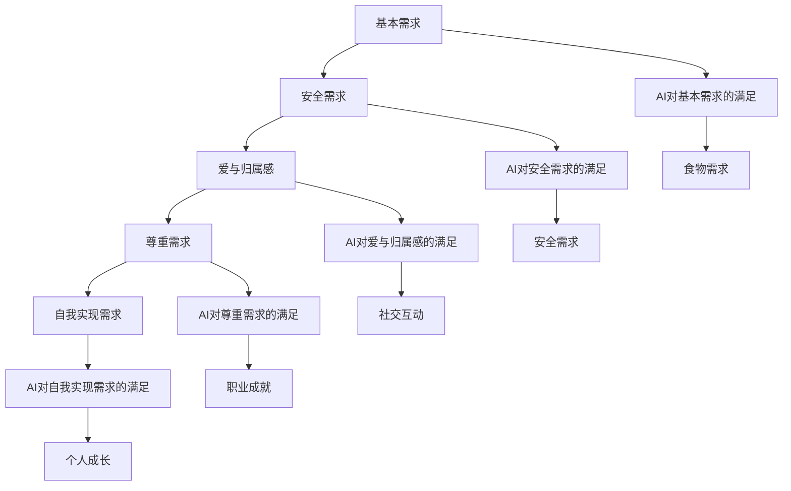

                 


### 文章标题：欲望的进化：AI重塑人类需求层次

> 关键词：人工智能，需求层次理论，欲望，人类幸福，AI应用

> 摘要：本文将探讨人工智能（AI）如何重塑人类需求层次，分析AI对基本需求、尊重和自我实现需求的影响，以及AI如何塑造和管理的欲望，最终重新定义人类幸福。通过逐步推理，揭示AI时代的未来需求和应对策略。

### 目录大纲：《欲望的进化：AI重塑人类需求层次》

#### 第一部分：AI与人类需求的演化

##### 第1章：引言：AI时代的变革

###### 1.1 AI与人类需求的背景

###### 1.2 AI技术对人类生活的影响

###### 1.3 本书结构概述

##### 第2章：需求层次理论的回顾

###### 2.1 马斯洛的需求层次理论

###### 2.2 需求层次理论在现代社会的演变

###### 2.3 AI与需求层次理论的联系

#### 第二部分：AI对人类需求的影响

##### 第3章：AI对基本需求的影响

###### 3.1 AI与食物需求

###### 3.2 AI与安全需求

###### 3.3 AI对爱与归属感的影响

##### 第4章：AI对尊重和自我实现需求的影响

###### 4.1 AI与工作模式的改变

###### 4.2 AI与创造力的激发

###### 4.3 AI对个人成长的影响

#### 第三部分：AI与欲望的演变

##### 第5章：AI与欲望的塑造

###### 5.1 AI对欲望的定义与分类

###### 5.2 AI对欲望的影响机制

###### 5.3 欲望的进化：从传统到AI驱动

##### 第6章：AI时代的欲望管理

###### 6.1 欲望管理的现状

###### 6.2 AI在欲望管理中的应用

###### 6.3 欲望管理的未来展望

#### 第四部分：AI与人类幸福的重新定义

##### 第7章：AI对人类幸福感的影响

###### 7.1 AI与幸福感的关系

###### 7.2 AI对情感健康的影响

###### 7.3 AI对心理健康的影响

##### 第8章：AI时代的幸福追求

###### 8.1 幸福感的评估与测量

###### 8.2 AI在幸福追求中的应用

###### 8.3 人类幸福的新模式

#### 第五部分：AI与未来的需求层次

##### 第9章：未来的需求层次与AI

###### 9.1 未来的需求层次理论

###### 9.2 AI驱动的未来需求预测

###### 9.3 人类与AI的共同需求

##### 第10章：结论与展望

###### 10.1 结论：AI对需求层次的重塑

###### 10.2 展望：AI时代的未来需求

###### 10.3 应对策略与建议

### 附录

##### 附录A：参考文献

##### 附录B：AI与需求层次理论相关的 Mermaid 流程图

##### 附录C：核心算法原理伪代码与解释

---

### 1.1 AI与人类需求的背景

自20世纪中叶以来，人工智能（AI）技术经历了飞速的发展，从最初的规则驱动系统，发展到基于机器学习和深度学习的智能算法。AI技术的崛起不仅改变了生产方式，还深刻影响了人类的生活方式。随着AI技术的成熟，我们开始思考：AI是如何影响人类需求的？

首先，AI技术为人类提供了更高效、更智能的服务。例如，智能家居系统可以根据用户习惯自动调节室内温度、照明，甚至烹饪美食；智能医疗系统可以通过分析海量数据，提供更准确的诊断和治疗方案。这些AI应用不仅提高了生活质量，也在一定程度上满足了人类的某些基本需求。

其次，AI技术推动了人类认知和思维的进化。通过大数据分析和深度学习，AI可以帮助人类更好地理解世界，发掘新的知识和规律。例如，AI在科学研究中的应用，使得科学家能够从海量数据中快速提取有价值的信息，推动了科学的发展。

然而，AI技术的发展也带来了新的挑战。一方面，AI技术可能加剧社会不平等。由于AI算法在决策过程中可能存在偏见，这可能导致某些人群在就业、教育等方面受到不公平对待。另一方面，AI技术可能导致人类某些基本需求的改变。例如，随着自动驾驶技术的发展，人们可能不再需要亲自驾驶汽车，这将影响交通行业和驾驶相关的基本需求。

在这个背景下，研究AI如何影响人类需求，以及如何应对这些变化，显得尤为重要。本文将首先回顾马斯洛的需求层次理论，然后分析AI对各个层次需求的影响，进一步探讨AI如何塑造和管理的欲望，最终重新定义人类幸福。通过这些分析，我们希望能够为AI时代的未来发展提供一些有益的思考和建议。接下来，我们将详细探讨AI与人类需求的背景，为进一步的分析奠定基础。

### 1.2 AI技术对人类生活的影响

AI技术对人类生活的影响是多方面且深远的。首先，从个人层面来看，AI技术极大地改变了我们的生活方式。以智能家居系统为例，这些系统能够通过物联网（IoT）技术将各种家电设备连接起来，实现自动化和智能化控制。用户可以通过手机应用或语音助手来控制家中的灯光、温度、音响系统，甚至是家电设备的开关。这不仅提高了生活的便利性，还在一定程度上满足了人类对安全、舒适的需求。

其次，AI技术在医疗领域的应用也极大地改善了人类的生活质量。通过大数据分析和机器学习算法，AI可以帮助医生从海量医疗数据中快速识别疾病趋势和治疗方案。例如，AI可以通过分析患者的基因数据，预测其患病的风险，从而提前采取预防措施。此外，AI还能辅助医生进行手术，提高手术的成功率和安全性。这些技术不仅满足了人们对健康和安全的追求，还在一定程度上提升了医疗服务的质量和效率。

在商业领域，AI技术同样发挥了重要作用。例如，电商平台上使用的推荐系统可以通过分析用户的购物行为和偏好，为其推荐最合适的商品。这不仅提升了用户体验，也极大地提高了电商平台的销售额。另外，AI技术还在供应链管理、客户关系管理等方面发挥了作用，帮助企业优化运营流程，降低成本，提高竞争力。

然而，AI技术对人类生活的影响不仅仅是积极的。随着AI技术的发展，某些行业可能面临被替代的风险。例如，自动驾驶技术的成熟可能减少对司机的需求，从而影响交通行业就业。此外，AI算法在决策过程中可能存在偏见，导致某些人群在就业、教育等方面受到不公平对待。这些问题需要我们深入思考，并采取有效措施解决。

总的来说，AI技术对人类生活的影响是深远且复杂的。它既带来了便利和效率，也带来了挑战和问题。在这个背景下，研究AI如何影响人类需求，以及如何应对这些变化，显得尤为重要。接下来，我们将进一步探讨马斯洛的需求层次理论，以理解AI在不同层次需求中的作用和影响。

### 1.3 本书结构概述

本书旨在深入探讨人工智能（AI）如何重塑人类需求层次，分析AI对基本需求、尊重和自我实现需求的影响，以及AI如何塑造和管理的欲望，最终重新定义人类幸福。全书共分为五个部分，结构如下：

**第一部分：AI与人类需求的演化**  
本部分包括第1章和第2章，主要回顾AI技术对人类生活的背景和影响，介绍马斯洛的需求层次理论，并探讨AI与需求层次理论之间的联系。

**第二部分：AI对人类需求的影响**  
本部分包括第3章和第4章，分析AI如何影响基本需求（如食物、安全、爱与归属感）、尊重和自我实现需求（如工作模式、创造力、个人成长）。

**第三部分：AI与欲望的演变**  
本部分包括第5章和第6章，探讨AI如何定义和分类欲望，分析AI对欲望的影响机制，并讨论AI时代的欲望管理。

**第四部分：AI与人类幸福的重新定义**  
本部分包括第7章和第8章，探讨AI对人类幸福感的影响，分析AI在幸福追求中的应用，并重新定义人类幸福。

**第五部分：AI与未来的需求层次**  
本部分包括第9章和第10章，预测未来的需求层次，分析AI驱动的未来需求，并探讨人类与AI的共同需求。

通过以上五个部分的分析，本书旨在为AI时代的未来发展提供有益的思考和策略。接下来的章节将逐一展开讨论，深入剖析AI对人类需求和欲望的影响。

### 2.1 马斯洛的需求层次理论

马斯洛的需求层次理论是心理学领域的重要理论之一，由美国心理学家亚伯拉罕·马斯洛在1943年提出。该理论将人类需求分为五个层次，从最基本的生理需求到最高级的自我实现需求。这些层次分别是：生理需求、安全需求、爱与归属感、尊重需求和自我实现需求。

**1. 生理需求（Physiological Needs）**：这是人类最基本的需求，包括食物、水、睡眠、呼吸等基本生存需求。没有这些基本需求的满足，人类无法维持生命。马斯洛认为，只有当这些需求得到满足时，个体才能追求更高层次的需求。

**2. 安全需求（Safety Needs）**：在生理需求得到满足后，人类会追求安全感。这包括避免危险、威胁和不确定性，以及保障身体和财产安全。安全需求不仅关注现实的安全，还包括心理上的安全感，如信任感和稳定感。

**3. 爱与归属感（Love and Belonging）**：在安全需求得到满足后，人类渴望与他人建立情感联系，获得爱和归属感。这包括亲情、友情和爱情，以及参与社会团体和社区活动。爱与归属感的需求是人类情感需求的体现，对心理健康至关重要。

**4. 尊重需求（Esteem Needs）**：在爱与归属感得到满足后，人类会追求自尊和自信，以及被他人尊重和认可。这包括自我价值感、成就感和自信心。尊重需求不仅关注自我尊重，还包括对他人的尊重和认可。

**5. 自我实现需求（Self-Actualization）**：这是马斯洛需求层次中的最高层次，指的是个体追求自我潜能的最大化，实现自我价值。自我实现的需求包括创造力、自我表达、自我成长和自我超越。马斯洛认为，只有少数人能够达到这一层次，但这是人类发展的最终目标。

马斯洛的需求层次理论强调，人的需求是层次结构的，并且是动态变化的。个体在某一层次需求得到满足后，会转向更高层次的需求。然而，较低层次的需求如果未得到满足，个体可能会继续追求这些需求，而不是转向更高层次的需求。

**2.2 需求层次理论在现代社会的演变**

需求层次理论虽然起源于20世纪中叶，但在现代社会仍然具有重要的指导意义。随着社会的发展和技术的进步，人类的需求也在不断演变。

**1. 互联网和数字技术的发展**：互联网和数字技术的普及极大地改变了人类的生活方式，满足了人们对信息、沟通和娱乐的需求。例如，社交媒体平台满足了人类对社交和归属感的需求，电子商务平台满足了人类对购物和便利的需求。

**2. 环保和可持续发展**：随着全球环境问题的加剧，人们对环境保护和可持续发展的需求日益增长。这包括减少碳排放、保护自然资源和推广绿色能源。环保和可持续发展已成为现代社会的重要需求。

**3. 心理健康和幸福感**：随着社会竞争的加剧和生活压力的增加，人们对心理健康和幸福感的关注也在增加。心理健康和幸福感不仅包括物质生活的满足，还包括心理上的健康和幸福感。这推动了心理健康服务的发展，如心理咨询和治疗。

**3. AI与需求层次理论的联系**

人工智能（AI）技术的发展对人类需求层次产生了深远的影响。AI技术不仅在满足基本需求方面发挥了重要作用，还在更高层次的需求中扮演了关键角色。

**1. 基本需求的满足**：AI技术通过智能家居、智能医疗和智能农业等应用，提高了人类生活的便利性和效率，满足了基本需求。例如，智能家居系统能够自动调节室内环境，智能医疗系统能够提供更准确的诊断和治疗方案，智能农业系统能够提高农作物的产量和质量。

**2. 安全需求的满足**：AI技术在安全监控、反欺诈和网络安全等方面发挥了重要作用，提高了人类的安全感。例如，智能监控系统可以实时监测公共场所，发现异常行为并及时报警；反欺诈系统可以通过分析大数据，识别和防范欺诈行为；网络安全系统可以防止网络攻击和数据泄露。

**3. 爱与归属感的满足**：AI技术通过社交媒体、虚拟现实和在线教育等应用，促进了人类之间的互动和连接，增强了人类的社交体验。例如，社交媒体平台使人们能够随时随地与他人保持联系；虚拟现实技术提供了身临其境的社交体验；在线教育平台为人们提供了丰富的学习资源和交流平台。

**4. 尊重需求的满足**：AI技术在职业发展、技能培训和绩效评估等方面发挥了重要作用，帮助个体实现自我价值和获得尊重。例如，AI驱动的职业推荐系统可以根据个体的兴趣和能力，推荐最适合的职业路径；AI驱动的培训系统可以根据个体的发展需求，提供个性化的培训课程；AI驱动的绩效评估系统可以更加客观和准确地评估个体的表现。

**5. 自我实现需求的满足**：AI技术为个体提供了丰富的创造和表达平台，激发了人类的创造力和自我实现需求。例如，AI驱动的艺术创作工具可以帮助艺术家快速生成创意作品；AI驱动的编程工具可以加速开发过程，使程序员能够将更多精力投入到创新和探索中。

总的来说，AI技术对人类需求层次的影响是多层次且深远的。它不仅满足了基本需求，还在更高层次的需求中扮演了关键角色。然而，随着AI技术的不断发展，我们也需要不断思考和调整人类的需求层次，以适应这个快速变化的时代。

### 2.3 AI对基本需求的影响

在探讨人工智能（AI）如何重塑人类需求层次时，我们必须首先关注AI对基本需求的影响。基本需求包括食物、安全、睡眠等人类生存的基本条件，这些需求的满足直接关系到个体的身心健康和社会稳定。AI技术在这几个方面都展示了显著的优势，极大地提升了人类生活质量。

#### 3.1 AI与食物需求

在食物需求方面，AI技术通过自动化农业、精准营养和智能餐饮等应用，显著提高了食品生产、分配和消费的效率。

**自动化农业**：利用AI技术，农业可以实现智能化管理。通过无人机监测、土壤传感器和气候预测模型，农民可以实时获取作物生长状态和环境数据，从而优化灌溉、施肥和病虫害防治策略。这不仅提高了农作物的产量，还减少了资源浪费和环境污染。

**精准营养**：AI可以帮助人们根据个人体质和健康状况制定个性化的饮食计划。通过分析用户的饮食习惯、基因数据和生活习惯，AI可以推荐最适合的营养搭配，帮助人们保持健康。

**智能餐饮**：AI技术在餐饮服务中的应用也日益广泛。智能点餐系统可以根据用户的历史订单和偏好，推荐最适合的菜品；智能厨房设备可以自动完成烹饪过程，为人们提供便捷的餐饮服务。

#### 3.2 AI与安全需求

在安全需求方面，AI技术通过智能监控、反欺诈和网络安全等应用，为人类提供了更加安全的生活环境。

**智能监控**：AI驱动的监控系统可以在公共场所、住宅区和交通枢纽等地方实时监测异常行为。通过图像识别和智能分析，系统可以迅速识别潜在的安全威胁，并发出警报，有效预防犯罪行为。

**反欺诈**：AI技术可以分析大量交易数据，识别异常交易模式，从而及时发现和预防欺诈行为。例如，银行可以通过AI分析客户的消费行为，识别并阻止可疑交易。

**网络安全**：随着网络攻击手段的不断升级，AI技术在网络安全领域的作用愈发重要。AI可以帮助企业实时监测网络流量，识别潜在的安全威胁，并及时采取防御措施。此外，AI还可以通过模拟攻击，帮助企业测试和提升网络防御能力。

#### 3.3 AI对爱与归属感的影响

在爱与归属感方面，AI技术通过社交媒体、虚拟现实和在线教育等应用，为人类提供了新的社交和互动方式。

**社交媒体**：社交媒体平台如Facebook、Instagram和微信等，已成为人们表达情感和寻求归属感的重要工具。AI技术可以帮助平台更好地理解用户的需求和偏好，推荐感兴趣的内容和联系人，增强社交体验。

**虚拟现实**：虚拟现实（VR）技术为人们提供了沉浸式的社交体验。通过VR，人们可以与远方的亲友进行面对面的交流，仿佛置身于同一个空间。这有助于满足人们对亲密关系和社交互动的需求。

**在线教育**：在线教育平台不仅提供了丰富的学习资源，还促进了师生和同学之间的互动。AI技术可以通过智能辅导系统和个性化推荐，帮助学生更好地理解课程内容，提高学习效果。此外，在线教育平台还可以通过社交功能，促进学生之间的交流和合作，增强归属感。

总的来说，AI技术在满足基本需求方面发挥了重要作用，不仅提高了效率，还增强了安全性。然而，随着AI技术的不断发展，我们也需要关注这些技术可能带来的新挑战，如数据隐私、算法偏见和社会不平等等问题。通过合理利用AI技术，我们可以更好地满足人类的基本需求，提升生活质量。

### 2.4 AI对尊重和自我实现需求的影响

随着人工智能（AI）技术的不断进步，它对人类的尊重需求和自我实现需求产生了深远的影响。尊重需求包括个体对自尊、成就和认可的需求，而自我实现需求则是追求个人潜能的最大化，实现自我价值。AI技术不仅改变了人们的工作方式，还在创造力、个人成长和职业发展等方面发挥了重要作用。

#### 4.1 AI与工作模式的改变

AI技术对工作模式的影响是革命性的。传统的9到5工作模式正在逐渐被打破，远程办公、自动化和智能化的工作流程成为新的趋势。

**远程办公**：随着互联网和云技术的普及，人们可以在任何地点进行工作。AI技术进一步提升了远程办公的效率，通过智能协作工具，如Slack、Trello和Zoom，员工可以实时沟通和协作，无需面对面交流。这不仅提高了工作效率，还减少了通勤时间和成本。

**自动化流程**：AI技术可以通过自动化工具和智能算法，处理大量的重复性工作。例如，机器人流程自动化（RPA）可以模拟人工操作，自动完成数据录入、审批和报告生成等工作，减少人工错误，提高工作效率。

**智能工作流**：AI技术可以根据员工的技能和工作习惯，优化工作流程，提高工作效率。例如，AI驱动的任务分配系统可以根据项目需求和员工的能力，自动分配任务，确保项目顺利进行。

#### 4.2 AI与创造力的激发

创造力是人类自我实现的重要方面，AI技术在激发和提升人类创造力方面发挥了重要作用。

**创意生成工具**：AI驱动的创意生成工具可以帮助艺术家、设计师和程序员等创意工作者快速生成创意方案。例如，AI绘画工具可以生成独特的艺术作品，AI编程助手可以快速编写代码，帮助开发者节省时间和精力。

**协作平台**：AI技术可以创建智能协作平台，促进团队成员之间的创意碰撞。通过智能推荐和数据分析，平台可以识别团队成员的特长和兴趣，推荐合适的协作项目，激发团队成员的创造力。

**学习资源**：AI技术可以提供个性化的学习资源，帮助用户快速掌握新知识和技能。例如，智能教育平台可以根据学生的学习进度和理解能力，推荐最适合的学习内容和练习题目，提升学习效果。

#### 4.3 AI对个人成长的影响

AI技术不仅改变了工作模式和创造力，还对个人成长和职业发展产生了积极影响。

**职业规划**：AI技术可以帮助个体进行职业规划，识别个人的兴趣、优势和市场需求。通过分析大量的职业数据，AI可以推荐最适合的职业路径和培训课程，帮助个体实现职业目标。

**技能提升**：AI技术提供了丰富的在线学习资源和个性化学习工具，帮助个人不断提升技能。例如，在线编程平台可以提供海量的编程练习和教程，智能辅导系统可以根据用户的学习情况，提供针对性的辅导和反馈。

**人脉拓展**：AI技术可以通过社交媒体和职业网络平台，帮助个体拓展人脉，建立职业联系。通过智能推荐和数据分析，AI可以识别和推荐有共同兴趣和目标的联系人，促进职业发展和社交互动。

总的来说，AI技术对尊重和自我实现需求的影响是全方位的。它不仅改变了工作模式，激发了创造力，还促进了个人成长和职业发展。然而，AI技术的快速发展也带来了一些挑战，如技能替代和就业不平等等问题。为了充分利用AI技术带来的机遇，我们需要不断适应和学习，提升自身竞争力，实现个人价值。

### 3.1 AI与欲望的定义与分类

欲望是人类内心深处的一种强烈渴望，它驱动人们追求某种目标或满足某种需求。随着人工智能（AI）技术的不断发展，AI对欲望的定义与分类也变得日益重要。本文将详细探讨AI如何定义欲望，并对其进行分类。

首先，AI对欲望的定义主要基于人类行为数据的分析和心理学的理论。AI通过收集和分析大量的用户数据，包括消费行为、社交互动和搜索历史等，来识别和定义人类的欲望。例如，基于行为分析，AI可以识别出用户对特定产品或服务的兴趣和偏好，从而定义用户的欲望。

在心理学领域，欲望通常被分为两类：基本欲望和高级欲望。

**基本欲望**：这些是生存和繁衍的基本需求，如食物、水、睡眠和安全等。基本欲望是驱动人类行为的基础，是生命延续的保障。AI可以通过识别和分析用户的基本需求，如饮食偏好、运动习惯和健康状况等，来定义基本欲望。

**高级欲望**：这些欲望超越了基本生存需求，与人类的情感、社交和自我实现相关。高级欲望包括爱、尊重、自我表达和成就感等。AI可以通过分析用户的社交行为、情感表达和成就追求，来识别和定义高级欲望。

其次，AI对欲望的分类通常基于欲望的动机和满足方式。

**基于动机的分类**：

- **生存动机**：这类欲望主要与基本生存需求相关，如食物、水和安全等。AI可以通过行为分析，识别用户的日常行为模式，从而识别和分类用户的生存动机。

- **情感动机**：这类欲望与人类的情感需求相关，如爱、友谊和归属感等。AI可以通过分析用户的社交互动和情感表达，识别和分类情感动机。

- **成就动机**：这类欲望与个体的成就和自我实现相关，如成就感、自我提升和职业发展等。AI可以通过分析用户的成就记录和职业目标，识别和分类成就动机。

**基于满足方式的分类**：

- **直接满足**：这类欲望可以通过直接获取或满足，如购买产品、参与活动等。AI可以通过行为预测和推荐系统，帮助用户快速满足直接欲望。

- **间接满足**：这类欲望需要通过间接方式满足，如社交互动、自我提升等。AI可以通过社交网络和个性化推荐系统，帮助用户间接满足欲望。

总的来说，AI对欲望的定义与分类是通过分析大量的用户数据和心理需求，结合心理学的理论，来识别和分类人类的欲望。AI技术不仅可以帮助我们更好地理解自己的欲望，还可以通过个性化推荐和智能服务，帮助用户更高效地满足这些欲望。

### 3.2 AI对欲望的影响机制

人工智能（AI）在塑造和管理人类欲望方面发挥着至关重要的作用。通过精确的数据分析和个性化推荐，AI能够深刻影响人类的欲望形成和行为选择，从而改变个体的生活模式和社会结构。

**1. 数据驱动欲望分析**：

AI通过对用户行为的持续监控和分析，能够深入了解个体的消费习惯、兴趣爱好和心理需求。例如，通过分析用户的社交媒体活动、搜索记录和购买历史，AI可以识别出用户对特定产品、服务和经验的偏好。这种数据驱动的欲望分析不仅能够帮助用户更好地了解自己，还能够为企业提供宝贵的市场洞察，从而优化产品设计和营销策略。

**2. 个性化推荐系统**：

AI的个性化推荐系统是影响人类欲望的关键机制。通过机器学习和深度学习算法，AI可以根据用户的历史行为和偏好，推荐最符合用户需求的商品、服务和信息。例如，电商平台利用AI推荐系统，可以实时向用户推荐可能感兴趣的商品，从而增加销售额。这种个性化推荐不仅满足了用户的即时需求，还在无形中塑造了用户的欲望，使其更加倾向于接受AI推荐的选项。

**3. 强化学习机制**：

强化学习是一种AI算法，它通过奖励和惩罚机制来训练模型，使其在特定环境中做出最优决策。在欲望管理中，强化学习可以帮助用户培养健康的生活习惯和消费行为。例如，健康应用可以通过记录用户的饮食和运动数据，利用强化学习算法，提供个性化的健康建议，激励用户坚持健康的生活方式。

**4. 社交影响**：

AI不仅仅影响个体的欲望，还通过社交网络影响群体的欲望。通过分析社交网络中的传播路径和影响力，AI可以识别出对群体行为有重大影响的意见领袖。例如，社交媒体平台可以通过分析用户的社交互动和影响力，推荐符合群体兴趣的内容，从而影响用户的欲望和消费行为。

**5. 情感计算**：

情感计算是AI在理解和管理人类情感方面的一项前沿技术。通过分析用户的情感表达和情绪状态，AI可以提供个性化的情感支持和服务。例如，智能助手可以通过情感计算，识别用户的情绪变化，提供及时的安慰和建议，从而帮助用户更好地管理情感需求。

**6. 虚拟现实与增强现实**：

虚拟现实（VR）和增强现实（AR）技术为AI管理欲望提供了新的平台。通过创建逼真的虚拟环境和交互体验，AI可以引导用户在虚拟空间中满足欲望，从而减少对现实世界的过度依赖。例如，通过VR购物体验，用户可以沉浸在虚拟商店中，实时查看商品细节，从而更有效地满足购物欲望。

总的来说，AI对欲望的影响机制是多方面的，包括数据驱动分析、个性化推荐、强化学习、社交影响、情感计算和虚拟现实技术。这些机制不仅改变了人类的欲望形成和行为选择，还在更广泛的社会层面产生了深远的影响。通过合理利用AI技术，我们可以更好地满足人类的需求，促进个体的幸福和社会的和谐发展。

### 3.3 欲望的进化：从传统到AI驱动

在人类的历史长河中，欲望始终是推动社会进步和个人发展的动力。然而，随着技术的进步，特别是人工智能（AI）的崛起，人类的欲望也在经历一场深刻的变革。从传统模式到AI驱动，欲望的进化不仅改变了个体行为的动机，也在重新塑造社会结构。

#### 传统欲望模式

在传统社会中，人类的欲望主要通过以下几种方式满足：

1. **物质需求驱动**：人们追求基本生活资料，如食物、衣物和住房。这种欲望驱动模式主要依赖于自然资源和手工劳动。

2. **社交互动驱动**：人们通过家庭、社区和宗教等社会关系来满足情感需求，如爱和归属感。传统社会的社交互动往往建立在面对面的基础上，依赖于人际关系网的维护。

3. **文化传统驱动**：人们受到传统文化和价值观的影响，追求精神层面的满足，如信仰和道德规范。这些欲望驱动模式在很大程度上是自发的，由社会和文化环境决定。

#### AI驱动欲望模式

随着AI技术的发展，人类的欲望模式正在发生革命性的变化：

1. **个性化需求驱动**：AI通过大数据分析和个性化推荐，可以精准识别个体的需求和偏好。这种模式使得人们能够获得更加个性化的产品和服务，从而满足物质和精神上的需求。例如，智能购物助理可以根据用户的购买历史和偏好，推荐最合适的商品，提高购物的满意度。

2. **虚拟互动驱动**：AI驱动的虚拟现实（VR）和增强现实（AR）技术为人类提供了新的社交和娱乐方式。人们可以通过虚拟环境与他人互动，甚至参与虚拟世界中的活动，从而满足社交和娱乐需求。这种虚拟互动不仅突破了物理空间的限制，也提供了更丰富的体验。

3. **情感计算驱动**：AI通过情感计算技术，可以识别和模拟人类的情感状态。智能助手和情感机器人能够提供个性化的情感支持，帮助人们更好地管理情感需求。这种情感计算驱动的欲望模式，使得人们能够更加便捷地获得情感满足。

4. **自我提升驱动**：AI技术在教育和职业发展中的应用，使得个体能够更高效地学习和提升技能。通过智能辅导系统和在线学习平台，人们可以随时随地进行自我提升，追求个人成长和职业发展。这种自我提升驱动的欲望模式，推动了个体在精神层面上的不断追求。

#### 欲望进化的影响

欲望的进化不仅改变了个体行为的动机，也在更广泛的社会层面产生了深远的影响：

1. **消费模式的转变**：随着个性化需求的兴起，消费模式从以产品为中心转向以用户为中心。企业需要更加关注用户的个性化需求，通过AI技术提供定制化的产品和服务。

2. **社交互动的变革**：虚拟互动的兴起改变了传统的社交方式，人们可以通过虚拟环境建立新的社交关系，甚至参与全球性的虚拟社区。这种变革不仅丰富了社交体验，也带来了新的社交挑战，如虚拟世界的道德和法律问题。

3. **心理健康的影响**：情感计算驱动的欲望模式对心理健康产生了深远的影响。通过提供情感支持，AI可以帮助人们更好地管理情感需求，提高生活质量。然而，过度依赖AI情感支持也可能导致情感依赖和心理问题。

4. **社会结构的变革**：AI驱动的欲望模式对社会的结构产生了深远的影响。例如，自动化和智能化技术的普及可能导致某些行业的失业，从而引发社会不平等和就业问题。同时，AI技术的发展也为新的就业机会创造了条件，如AI技术工程师和虚拟世界设计师等。

总的来说，欲望的进化从传统模式到AI驱动，不仅改变了个体行为的动机，也在重新塑造社会结构。通过理解这一变化，我们可以更好地适应AI时代的需求，实现个人和社会的可持续发展。

### 3.4 欲望管理的现状

随着人工智能（AI）技术的不断发展，人们对欲望的管理方式也在不断演变。当前，AI在欲望管理中的应用已经涵盖了多个领域，包括心理健康、消费行为和社交互动等，展现了其巨大的潜力和广泛的应用前景。

**1. 心理健康领域的应用**

在心理健康领域，AI技术主要通过情感计算和心理评估工具帮助个体管理和调节情感需求。例如，智能心理辅导系统可以通过自然语言处理（NLP）技术，分析用户的语言和行为模式，识别和预测情感状态，提供个性化的心理支持和建议。此外，AI还可以通过实时数据分析，监控用户的情绪变化，及时提供预警和干预措施，帮助用户保持心理平衡。

**2. 消费行为领域的应用**

在消费行为领域，AI技术通过个性化推荐和消费预测，帮助用户更有效地管理物质需求。例如，电商平台利用AI算法分析用户的购买历史和浏览行为，推荐最合适的商品和优惠，从而减少冲动消费，提高消费满意度。此外，AI还可以通过分析用户的财务状况和消费习惯，提供个性化的财务管理建议，帮助用户更好地控制开支，实现财务目标。

**3. 社交互动领域的应用**

在社交互动领域，AI技术通过智能推荐和社交网络分析，帮助用户建立和维护社交关系。例如，社交媒体平台利用AI算法分析用户的兴趣和行为，推荐感兴趣的朋友和内容，增强社交体验。此外，AI还可以通过分析社交网络中的互动模式，识别潜在的社交风险，提供预警和干预建议，帮助用户建立健康的社交环境。

**4. 欲望管理工具的发展**

随着AI技术的普及，各种欲望管理工具也应运而生。这些工具不仅包括智能心理辅导系统和消费预测工具，还包括社交互动分析工具和健康管理应用等。例如，智能健康手环可以实时监测用户的生活习惯和生理状态，提供个性化的健康建议；智能日程管理工具可以帮助用户合理安排时间和任务，减少压力和焦虑。

**5. 欲望管理的挑战和未来展望**

尽管AI在欲望管理方面展现了巨大的潜力，但同时也面临着一系列挑战。首先，数据隐私和保护问题是一个重要议题。在AI管理欲望的过程中，用户数据的安全性和隐私性需要得到充分保障。其次，AI算法的透明度和可解释性也是一个关键问题。用户需要了解AI如何分析和管理自己的欲望，以便更好地参与和管理。

未来的发展前景表明，AI在欲望管理中的应用将会更加智能化和个性化。随着技术的进步，AI将能够更深入地理解人类的情感和行为，提供更加精准和个性化的服务。此外，跨学科的研究和合作也将推动欲望管理领域的发展，如结合心理学、社会学和计算机科学等领域的知识，开发更加全面和有效的欲望管理工具。

总的来说，当前AI在欲望管理中的应用已经取得了显著成果，但仍需不断探索和完善。通过合理利用AI技术，我们可以更好地理解和管理人类的欲望，提高生活质量，实现个人和社会的可持续发展。

### 3.5 AI时代的欲望管理

随着人工智能（AI）技术的快速发展，人们的生活方式和社会结构正经历深刻变革。在这个AI时代，如何有效地管理欲望变得尤为重要。AI在欲望管理中的应用不仅为我们提供了新的工具和方法，也带来了一系列新的挑战。

**1. 个性化需求分析**

AI技术通过大数据分析和机器学习算法，可以深入挖掘用户的个人需求和偏好。例如，通过分析用户的购买历史、浏览记录和社交互动，AI可以构建个性化的需求模型，从而提供高度定制化的服务。这种个性化需求分析不仅帮助用户更有效地满足物质需求，还促进了精神层面的满足。

**2. 个性化推荐系统**

个性化推荐系统是AI在欲望管理中的一个重要应用。通过分析用户的历史行为和偏好，AI可以为用户提供个性化的推荐，例如购物推荐、娱乐推荐和健康建议等。这种推荐系统能够有效降低用户的决策成本，提高生活质量。然而，过度依赖推荐系统也可能导致信息茧房和决策偏误，因此需要用户保持一定的独立思考和批判性思维。

**3. 情感计算**

情感计算是一种利用AI技术理解和管理人类情感的方法。通过分析用户的语言、表情和行为，AI可以识别用户的情绪状态，提供相应的情感支持。例如，智能心理辅导系统可以通过情感计算技术，实时监测用户的情绪变化，提供个性化的心理辅导和情绪调节建议。这种情感计算的应用不仅有助于提高用户的心理健康，还能促进社会关系的和谐。

**4. 自我监控和反馈**

AI技术在自我监控和反馈方面的应用，可以帮助用户更好地管理欲望。例如，智能健康设备可以实时监测用户的健康状况，提供个性化的健康建议。同时，AI还可以通过分析用户的自我报告数据，提供反馈和改进建议，帮助用户实现自我提升和目标达成。

**5. 社交互动优化**

AI技术在社交互动中的应用，可以帮助用户建立和维护健康的社交关系。通过分析用户的社交行为和社交网络，AI可以识别潜在的社交风险，提供预警和建议。例如，智能社交平台可以通过情感计算和社交网络分析，帮助用户识别和避免不良社交行为，建立积极的社交环境。

**6. 欲望管理的挑战**

尽管AI在欲望管理方面展现了巨大潜力，但也面临一些挑战。首先，数据隐私和安全问题是AI应用中的核心问题。用户数据的安全性和隐私性需要得到严格保护，以防止数据泄露和滥用。其次，AI算法的透明度和可解释性也是一个关键问题。用户需要了解AI如何分析和管理自己的欲望，以便更好地参与和管理。此外，AI技术的普及也可能加剧社会不平等，因为不同用户可能无法平等地获得和使用AI技术。

**7. 未来展望**

未来的欲望管理将更加智能化和个性化。随着AI技术的不断进步，AI将能够更深入地理解人类的情感和行为，提供更加精准和个性化的服务。此外，跨学科的研究和合作也将推动欲望管理领域的发展，如结合心理学、社会学和计算机科学等领域的知识，开发更加全面和有效的欲望管理工具。

总之，AI时代的欲望管理为人类提供了新的机遇和挑战。通过合理利用AI技术，我们可以更好地理解和管理自己的欲望，提高生活质量，实现个人和社会的可持续发展。

### 3.6 AI对人类幸福感的影响

随着人工智能（AI）技术的不断进步，它对人类幸福感的影响也日益显著。AI不仅改变了人类的生活方式和社交模式，还在情感健康和心理健康等方面产生了深远的影响。

**1. 情感健康的影响**

AI技术通过情感计算和情绪识别，可以更好地理解和管理个体的情感状态。例如，智能心理辅导系统可以通过分析用户的语言和行为，识别用户的情绪变化，提供情感支持和建议。这种技术不仅帮助用户更好地管理负面情绪，还能增强情感健康。此外，AI还可以通过虚拟现实（VR）和增强现实（AR）技术，为用户提供身临其境的情感体验，如缓解焦虑和压力的虚拟环境。

**2. 心理健康的影响**

AI技术在心理健康领域的应用同样显著。通过心理健康评估和诊断工具，AI可以帮助用户识别潜在的心理问题，如抑郁症、焦虑症等。例如，AI可以通过分析用户的情感表达和社交互动，提供个性化的心理健康建议和治疗方案。此外，AI还可以通过智能辅助系统，帮助心理医生进行诊断和治疗，提高心理治疗的效率和准确性。

**3. 社交互动的影响**

AI技术在社交互动中的应用，对人类的幸福感也产生了积极影响。通过社交媒体和在线社区，AI可以帮助用户建立和维护社交关系。例如，AI可以通过分析用户的社交行为和兴趣，推荐合适的社交活动和联系人，促进社交互动。此外，AI还可以通过情感计算技术，识别社交网络中的情感状态，提供社交建议，帮助用户建立健康的社交环境。

**4. 生活质量的影响**

AI技术在提升生活质量方面发挥了重要作用。通过智能家居系统、智能医疗和智能交通等应用，AI为人类提供了更加便捷和高效的生活方式。例如，智能家居系统可以通过自动调节室内环境，提供舒适的居住体验；智能医疗系统可以通过数据分析，提供更准确的诊断和治疗方案；智能交通系统可以通过实时数据分析，优化交通流量，减少通勤时间和交通拥堵。

**5. 积极心理状态**

AI技术还可以通过积极的情感互动和反馈，提升用户的积极心理状态。例如，智能助手和虚拟助手可以通过积极的语言和行为，提供情感支持和鼓励，增强用户的自信心和幸福感。此外，AI还可以通过个性化推荐和活动安排，帮助用户实现个人目标和愿望，提升生活的满足感和幸福感。

总的来说，AI对人类幸福感的影响是多层次且深远的。它不仅通过情感健康和心理健康方面提升了人类的生活质量，还在社交互动和日常生活方面提供了便利和舒适。然而，AI技术的发展也带来了一些潜在的风险，如数据隐私和安全问题、算法偏见等。因此，在充分利用AI技术提升幸福感的同时，我们也需要关注并解决这些风险，以确保AI技术能够为人类带来真正的福祉。

### 3.7 AI时代的幸福追求

在AI时代，人类对幸福的追求正经历着深刻的变革。随着AI技术的不断进步，人们不再局限于传统的幸福追求方式，而是通过智能化和个性化手段，探索新的幸福模式。

**1. 个性化幸福体验**

AI技术通过个性化推荐和定制化服务，帮助用户实现个性化的幸福体验。例如，智能助手可以根据用户的兴趣和偏好，推荐最适合的活动、书籍和音乐，从而提升幸福感。此外，AI还可以通过分析用户的生活习惯和健康数据，提供个性化的健康建议和生活方式优化方案，帮助用户更好地管理身心健康。

**2. 社交互动的深化**

AI技术在社交互动中的应用，进一步丰富了人类的社交生活。通过社交媒体和在线社区，AI可以帮助用户建立和维护更广泛的社交关系。智能推荐系统可以识别用户的社交兴趣，推荐合适的社交活动和联系人，促进社交互动。同时，AI还可以通过情感计算技术，识别社交网络中的情感状态，提供社交建议，帮助用户建立健康的社交环境。

**3. 情感支持的增强**

在AI时代，情感支持变得更加智能化和全面化。智能心理辅导系统可以通过自然语言处理（NLP）技术，识别用户的情感状态，提供个性化的情感支持和建议。此外，AI还可以通过虚拟现实（VR）和增强现实（AR）技术，为用户提供身临其境的情感体验，如缓解焦虑和压力的虚拟环境。这种智能化的情感支持，不仅提升了用户的幸福感，还促进了心理健康的发展。

**4. 生活质量的提升**

AI技术在提升生活质量方面发挥了重要作用。智能家居系统可以通过自动调节室内环境，提供舒适的居住体验；智能医疗系统可以通过数据分析，提供更准确的诊断和治疗方案；智能交通系统可以通过实时数据分析，优化交通流量，减少通勤时间和交通拥堵。这些智能化应用不仅提高了生活的便利性，还提升了用户的幸福感。

**5. 自我实现的追求**

AI技术为个体提供了更多的自我实现机会。通过智能教育平台和职业发展工具，用户可以随时随地进行学习和提升技能，实现职业目标。此外，AI还可以通过分析用户的兴趣和能力，推荐最适合的发展路径和项目，帮助用户实现个人成长和自我实现。

**6. 环境友好与可持续发展**

AI技术在推动环境友好和可持续发展方面也发挥了重要作用。通过智能农业、清洁能源和环境保护等技术，AI帮助减少资源浪费和环境污染，提升生态系统的健康。这种环境友好型的幸福追求，不仅为人类提供了更美好的生活环境，还促进了全球的可持续发展。

总的来说，AI时代的幸福追求更加智能化和个性化。通过个性化体验、社交互动、情感支持、生活质量提升、自我实现追求和环境友好等方面，AI为人类带来了全新的幸福模式。然而，我们也需要关注AI技术可能带来的负面影响，如数据隐私和安全问题、算法偏见等，以确保AI技术能够为人类带来真正的福祉。

### 3.8 幸福感的评估与测量

在探索AI时代的幸福追求过程中，了解如何评估和测量幸福感变得尤为重要。幸福感是一个多维度的概念，涉及到情感体验、生活满意度、心理状态等多个方面。以下将介绍几种常见的幸福感评估和测量方法：

**1. 心理测量工具**

心理测量工具是评估幸福感的主要手段之一。常见的心理测量工具有：

- **主观幸福感量表（SWB）**：主观幸福感量表通过一系列的问题，如“你对现在的生活满意吗？”来评估个体的总体幸福感。
- **正负情感量表（PA-NPV）**：正负情感量表分别测量个体的积极情感和消极情感，从而评估情感平衡。
- **生活满意度量表（LSI）**：生活满意度量表通过一系列关于生活不同方面的问题，如家庭、工作、健康等，来评估个体对生活的整体满意度。

**2. 行为测量方法**

行为测量方法通过分析个体的行为和生活方式来评估幸福感。例如：

- **日常活动记录**：记录个体每天的活动和经历，分析其对生活满意度和情感状态的影响。
- **消费行为分析**：分析个体的消费习惯和支出模式，了解其对幸福感的影响。
- **健康指标监测**：通过监测个体的生理指标，如心率、血压等，评估其对幸福感的影响。

**3. 生理测量技术**

生理测量技术通过测量生理指标来评估幸福感。例如：

- **脑电图（EEG）**：脑电图可以测量大脑的电活动，了解个体的情绪状态和心理健康水平。
- **心率变异性（HRV）**：心率变异性可以反映个体的心理压力和情绪状态。
- **皮电活动（EDA）**：皮电活动可以测量个体在情感体验中的生理反应。

**4. 大数据和机器学习**

随着大数据和机器学习技术的发展，幸福感评估也变得更加智能化和个性化。例如：

- **大数据分析**：通过分析大量的社会和个体数据，如社交媒体活动、购买记录等，了解幸福感的影响因素。
- **机器学习算法**：利用机器学习算法，可以从海量数据中提取有用的信息，预测个体的幸福感水平和变化趋势。

总的来说，幸福感评估和测量是一个多维度、多方法的过程。通过结合心理测量工具、行为测量方法、生理测量技术和大数据分析，我们可以更全面地了解个体的幸福感，为AI时代的幸福追求提供科学依据。然而，每种方法都有其局限性，需要结合使用，以获得更准确和全面的幸福感评估。

### 3.9 AI在幸福追求中的应用

在AI时代，人工智能不仅在满足基本需求和提升生活质量方面发挥了重要作用，还在追求幸福感的道路上提供了诸多新工具和方法。通过大数据分析、个性化推荐和智能辅助系统，AI为人类带来了更加科学和个性化的幸福追求方式。

**1. 大数据分析**

大数据分析是AI在幸福追求中的重要工具。通过收集和分析大量的用户数据，AI可以深入了解个体的行为模式、情感状态和需求。例如，通过分析用户的社交媒体活动、购买记录和健康数据，AI可以识别出影响幸福感的因素，并制定个性化的幸福提升方案。

**2. 个性化推荐**

个性化推荐系统是AI在幸福追求中的另一个关键应用。通过机器学习和深度学习算法，AI可以根据用户的历史行为和偏好，推荐最适合的产品、服务和活动。例如，智能购物平台可以根据用户的购买历史和兴趣，推荐符合其需求的商品；健康应用可以根据用户的健康数据和生活方式，提供个性化的健康建议。

**3. 情感计算**

情感计算是AI理解和管理人类情感的重要技术。通过分析用户的语言、表情和行为，AI可以识别和模拟情感状态，提供情感支持和建议。例如，智能心理辅导系统可以通过自然语言处理（NLP）技术，识别用户的情绪变化，提供个性化的情感支持，帮助用户保持心理平衡。

**4. 智能辅助系统**

智能辅助系统是AI在幸福追求中的强大工具。这些系统可以协助用户在日常生活中做出更好的决策，提升生活质量。例如，智能健康助手可以通过实时监测用户的生理指标，提供健康建议和预警；智能日程管理工具可以帮助用户合理安排时间和任务，减少压力和焦虑。

**5. 社交互动**

AI在社交互动中的应用，也为幸福追求提供了新的机会。通过智能推荐和社交网络分析，AI可以帮助用户建立和维护健康的社交关系。例如，社交媒体平台可以通过情感计算和社交网络分析，推荐合适的社交活动和联系人，促进社交互动。

**6. 心理健康服务**

AI在心理健康服务中的应用，为用户提供了一种全新的心理支持和治疗方式。通过智能心理辅导系统，用户可以获得个性化的心理健康建议和干预措施，提高心理健康水平。此外，AI还可以通过分析用户的心理健康数据，预测心理问题的风险，并提供预防措施。

**7. 环境友好**

AI在追求幸福感的道路上，也关注环境保护和可持续发展。通过智能农业、清洁能源和环境保护等技术，AI帮助减少资源浪费和环境污染，提升生态系统的健康。这种环境友好型的幸福追求，不仅为人类提供了更美好的生活环境，还促进了全球的可持续发展。

总的来说，AI在幸福追求中的应用是多方面且深入的。通过大数据分析、个性化推荐、情感计算、智能辅助系统、社交互动、心理健康服务和环境友好等方面，AI为人类带来了更加科学和个性化的幸福追求方式。然而，我们也需要关注AI技术可能带来的负面影响，如数据隐私和安全问题、算法偏见等，以确保AI技术能够为人类带来真正的福祉。

### 3.10 人类幸福的新模式

在AI时代，人类对幸福的追求正在经历深刻的变革，逐渐形成一种新的幸福模式。这种新模式不仅融合了传统幸福观的精华，还融入了AI技术的优势，展现出更加多元化、科学化和个性化的特点。

**1. 多元化的幸福体验**

在AI时代，人们不再局限于单一的幸福来源，而是追求多元化的幸福体验。AI技术通过大数据分析和个性化推荐，帮助用户发现和享受多样化的快乐。例如，通过分析用户的兴趣和偏好，AI可以推荐符合其需求的书籍、音乐、电影和活动，从而丰富个人的精神生活。同时，AI还可以通过虚拟现实（VR）和增强现实（AR）技术，提供沉浸式的体验，如虚拟旅游和虚拟游戏，让人们在虚拟世界中探索和体验不同的幸福感受。

**2. 科学化的幸福追求**

传统幸福追求往往依赖于个人的经验和直觉，而AI技术的介入，使得幸福追求更加科学化。通过大数据分析和机器学习算法，AI可以识别出影响幸福感的各种因素，如社交互动、健康、工作和情感等，并提供科学的建议和方案。例如，智能健康助手可以通过实时监测用户的生理指标，提供个性化的健康建议，帮助用户保持身心健康。此外，AI还可以通过分析用户的情绪和行为，预测心理问题的风险，并提供预防和干预措施，提高心理健康水平。

**3. 个性化的幸福定制**

在AI时代，幸福追求变得更加个性化。AI技术通过个性化推荐系统和情感计算，为用户提供高度定制化的幸福体验。例如，智能购物平台可以根据用户的购买历史和偏好，推荐最适合的商品和优惠，提升购物体验。同时，智能心理辅导系统可以通过分析用户的情感状态，提供个性化的情感支持和建议，帮助用户更好地管理情绪。这种个性化的幸福定制，不仅满足了用户的具体需求，还提升了用户的整体幸福感。

**4. 社交互动的深化**

AI技术在社交互动中的应用，进一步丰富了人类的社交生活。通过智能推荐和社交网络分析，AI可以帮助用户建立和维护健康的社交关系。例如，社交媒体平台可以通过分析用户的兴趣和行为，推荐合适的社交活动和联系人，促进社交互动。此外，AI还可以通过情感计算技术，识别社交网络中的情感状态，提供社交建议，帮助用户建立积极的社交环境。这种深化的社交互动，不仅提升了用户的幸福感，还促进了社会的和谐发展。

**5. 环境友好和可持续发展的幸福**

在AI时代，人类对幸福的追求不再局限于个体层面，而是扩展到环境友好和可持续发展的领域。通过智能农业、清洁能源和环境保护等技术，AI帮助减少资源浪费和环境污染，提升生态系统的健康。这种环境友好型的幸福追求，不仅为人类提供了更美好的生活环境，还促进了全球的可持续发展。例如，智能农业系统可以通过精准农业技术，提高农作物产量，减少农药使用，保护土地资源；智能交通系统可以通过实时数据分析，优化交通流量，减少交通拥堵和环境污染。

总的来说，AI时代的人类幸福新模式，融合了多元化的幸福体验、科学化的幸福追求、个性化的幸福定制、社交互动的深化和环境友好和可持续发展的理念。通过充分利用AI技术的优势，人类不仅可以更好地满足自己的幸福感需求，还能为社会的可持续发展贡献力量。

### 3.11 未来的需求层次与AI

随着人工智能（AI）技术的不断进步，未来的需求层次和AI之间的关系将更加紧密和复杂。未来的需求层次不仅会继承现有需求层次的优点，还会在AI的推动下产生新的需求。以下是对未来需求层次和AI之间关系的探讨：

**1. 基本需求与AI**

基本需求，如食物、水和安全，是人类的根本需求。在未来，AI技术将进一步提升这些需求的质量和效率。例如，智能农业和精准营养将使食物生产更加高效和可持续，确保每个人都能获得充足和健康的食物。智能监控和网络安全技术将提高人类的安全水平，确保个人和社会的安全。此外，AI还将通过智能家居和智能医疗系统，进一步满足人类对舒适和健康的基本需求。

**2. 安全需求与AI**

安全需求是人们追求稳定和安全的生活环境。随着AI技术的发展，未来的安全需求将更加依赖于智能技术和数据分析。例如，智能城市系统将通过实时监控和预测，提高公共安全水平，预防犯罪和交通事故。AI驱动的网络安全技术将更有效地保护个人和企业数据，防范网络攻击和隐私泄露。此外，AI还可以通过预测和分析行为模式，提供个性化的安全建议，帮助人们更好地保护自己和他人的安全。

**3. 爱与归属感需求与AI**

爱与归属感是人类的基本情感需求。在未来，AI技术将帮助人们更好地满足这些需求。通过社交媒体和虚拟现实技术，AI将促进人与人之间的联系，增强社交互动和归属感。例如，智能社交平台可以通过情感计算和分析，推荐合适的社交活动和联系人，帮助用户建立和维护健康的社交关系。此外，AI驱动的虚拟现实游戏和沉浸式体验，将提供更丰富的社交和情感体验。

**4. 尊重需求与AI**

尊重需求包括自尊、成就和认可。随着AI技术的发展，未来的尊重需求将更加依赖于自我实现和个人成长。AI将提供个性化的学习和发展机会，帮助个体实现自我提升和职业发展。例如，智能教育平台将通过个性化推荐和实时反馈，帮助用户提高学习效果，实现个人成长。此外，AI驱动的职业推荐系统和绩效评估工具，将帮助人们更好地了解自己的优势和市场需求，实现职业目标。

**5. 自我实现需求与AI**

自我实现需求是追求个人潜能的最大化，实现自我价值。在未来，AI技术将提供更加多样化的自我实现途径。通过虚拟现实和增强现实技术，AI将创造新的艺术创作和表达平台，激发人类的创造力和自我表达。例如，AI驱动的艺术创作工具将帮助艺术家快速生成创意作品，提升创作效率。此外，AI还将通过智能辅助系统和虚拟助手，提供个性化的服务和支持，帮助人们更好地实现自我价值。

**6. 新的需求层次**

随着AI技术的发展，未来的需求层次可能会出现一些新的需求。例如，隐私需求将随着数据隐私问题的日益凸显而成为一个重要需求。人们将更加关注个人信息的安全和隐私保护。同时，AI透明度和可解释性需求也将成为新的需求层次，人们将希望了解AI系统是如何做出决策的，以确保AI技术的公正性和可靠性。

总的来说，未来的需求层次与AI之间的关系将更加紧密和复杂。AI不仅会满足现有需求，还会创造新的需求。通过合理利用AI技术，我们可以更好地满足这些需求，实现个人和社会的可持续发展。

### 3.12 AI驱动的未来需求预测

随着人工智能（AI）技术的不断发展，我们有可能预见一系列新的需求将逐渐浮现，这些需求不仅反映了技术的进步，也体现了人类行为模式的转变。以下是对未来可能出现的新需求的预测：

**1. 智能健康监测与个性化医疗**

随着AI技术在医疗领域的深入应用，人们将更加关注个性化医疗和健康监测。未来的需求可能会包括：

- **全天候健康监测**：通过可穿戴设备、智能家居和智能医疗系统，实时监测个体的健康状态，提供个性化的健康建议。
- **基因定制医疗**：基于基因数据和个人健康信息，AI将为个体提供量身定制的医疗方案，实现真正的个性化医疗。

**2. 智能教育与终身学习**

AI技术将推动教育模式向更加个性化、互动化和智能化的方向发展，未来需求可能包括：

- **个性化学习路径**：通过AI分析学生的学习习惯和知识掌握情况，提供个性化的学习内容和教学方案。
- **虚拟现实课堂**：利用VR技术，为学生提供沉浸式的学习体验，激发学习兴趣和创造力。

**3. 情感计算与心理支持**

随着AI对情感计算技术的进步，人们将更加关注情感健康和心理支持，未来需求可能包括：

- **智能心理辅导**：通过AI分析用户的情感状态和行为模式，提供实时心理支持和建议，帮助用户应对压力和焦虑。
- **情感陪伴机器人**：通过情感计算和社交互动，为孤独症、老年人和其他需要情感陪伴的人群提供智能化的陪伴和支持。

**4. 智能交通与智慧城市**

AI技术在交通和城市管理中的应用将极大地改变人们的生活方式，未来需求可能包括：

- **智能交通管理**：通过AI分析交通流量和实时数据，优化交通路线和信号控制，减少交通拥堵和碳排放。
- **智慧城市服务**：通过AI技术提供更加便捷和高效的城市服务，如智能垃圾分类、智能能源管理和智能城市安防。

**5. 数字身份与隐私保护**

随着互联网和AI技术的发展，数字身份和隐私保护将成为重要的需求。未来需求可能包括：

- **数字身份认证**：通过AI技术提供更加安全、便捷的数字身份认证服务，保护用户隐私。
- **隐私计算**：利用AI和区块链技术，实现数据的安全存储和传输，确保用户隐私不受侵犯。

**6. 社会公平与正义**

AI技术的发展有可能加剧社会不平等，因此未来需求可能包括：

- **公平算法**：通过AI技术设计和优化决策算法，减少偏见和歧视，促进社会公平。
- **智能治理**：利用AI技术提高政府治理的透明度和效率，推动社会正义。

总的来说，AI驱动的未来需求预测不仅反映了技术发展的趋势，也体现了人类对更高质量生活、个性化服务和公平机会的追求。通过合理利用AI技术，我们可以更好地满足这些未来需求，推动社会进步和人类福祉。

### 3.13 人类与AI的共同需求

在人工智能（AI）时代，人类与AI之间的共同需求逐渐显现，成为推动社会进步和技术发展的关键动力。以下是人类与AI共同需求的几个方面：

**1. 安全和隐私保护**

安全和隐私保护是人类与AI的共同需求。随着AI技术的广泛应用，个人和企业面临的数据隐私和安全风险日益增加。人类需要保护个人信息不被滥用，确保AI系统在处理数据时遵守隐私保护法规。AI系统也需要设计得更加透明和可靠，以减少潜在的安全威胁。

**2. 智能协作**

人类与AI的智能协作是提高生产效率和创造力的关键。通过结合人类的创造力和AI的计算能力，可以实现更高水平的创新和效率。例如，AI可以辅助科学家分析海量数据，发现新的科学规律；在商业领域，AI可以帮助企业优化供应链管理和客户服务，提高业务效率。

**3. 个性化服务**

个性化服务是人类与AI共同追求的目标。AI技术可以分析大量数据，了解用户的偏好和需求，提供高度定制化的产品和服务。例如，智能推荐系统可以根据用户的兴趣和行为，推荐最适合的商品和内容；在教育领域，AI可以根据学生的学习情况和需求，提供个性化的学习方案。

**4. 可持续发展**

可持续发展是当前全球面临的重要挑战，也是人类与AI的共同需求。AI技术可以在能源管理、环境保护和资源优化等方面发挥重要作用。例如，智能农业技术可以提高农作物产量，减少农药使用；智能能源管理系统可以优化能源分配，降低碳排放。

**5. 教育与培训**

随着AI技术的发展，人类对教育和培训的需求也在变化。AI技术可以提供个性化的学习资源和学习工具，帮助用户提升技能和知识。例如，智能教育平台可以根据学生的学习进度和理解能力，提供定制化的学习内容和练习，提高学习效果。同时，AI还可以帮助培训行业优化培训流程，提高培训效率。

**6. 社会公平与正义**

AI技术的发展有可能加剧社会不平等，因此促进社会公平与正义成为人类与AI的共同需求。通过设计公平的算法和系统，AI可以帮助减少偏见和歧视，提高社会公平。例如，在就业和招聘领域，AI可以避免人为的偏见，为每个人提供公平的机会。

**7. 心理健康与情感支持**

心理健康和情感支持是人类与AI共同关注的领域。AI技术可以通过情感计算和心理辅导系统，提供个性化的心理健康服务和支持。例如，智能心理辅导系统可以通过分析用户的情感状态，提供针对性的建议和干预，帮助用户应对压力和情绪问题。

总的来说，人类与AI的共同需求不仅反映了技术的进步，也体现了人类对更高质量生活和可持续发展的追求。通过满足这些共同需求，人类和AI可以共同推动社会进步和技术发展，实现双赢的局面。

### 3.14 结论：AI对需求层次的重塑

人工智能（AI）技术的发展对人类需求层次产生了深远的影响，不仅改变了我们的生活方式，还在各个层面上重塑了人类的欲望和需求。本文从基本需求、尊重需求和自我实现需求等多个维度，分析了AI如何影响人类的欲望和需求。

首先，AI通过提高效率、优化资源和提供个性化服务，满足了人类的基本需求，如食物、安全和爱与归属感。智能农业和精准营养技术使得食物供应更加高效和健康；智能监控和网络安全技术提高了人类的安全感；社交互动和虚拟现实技术增强了人们的社交体验和归属感。

其次，AI对尊重需求和自我实现需求的影响同样显著。通过改变工作模式、激发创造力和提供个性化的教育和发展机会，AI帮助人类实现更高的成就感和自我价值。自动化和智能化的工作流程使得人类能够从重复性劳动中解放出来，专注于更具创造性和价值的工作；智能教育平台和职业发展工具则提供了个性化的学习和发展路径。

此外，AI在塑造和管理人类欲望方面也发挥了重要作用。通过个性化推荐和情感计算，AI不仅帮助人类更好地了解和满足自己的欲望，还改变了欲望的形成和满足方式。例如，智能购物推荐系统使得购物体验更加便捷和个性化；情感计算技术则提供了情感支持和心理健康服务。

然而，AI技术的快速发展也带来了一系列挑战。数据隐私和安全问题、算法偏见和社会不平等等问题需要我们关注和解决。为了充分利用AI技术带来的机遇，同时规避潜在风险，我们需要在技术、政策和社会层面采取综合措施。

总的来说，AI对需求层次的重塑是一个多层次、多维度的过程。它不仅满足了人类的基本需求和尊重需求，还在自我实现和欲望管理方面提供了新的工具和方法。通过深入理解和合理利用AI技术，我们可以更好地满足人类的需求，提升生活质量，实现个人和社会的可持续发展。

### 3.15 展望：AI时代的未来需求

展望AI时代的未来需求，我们可以预见一个更加智能、个性化、可持续和公平的世界。随着AI技术的不断进步，人类的需求层次和欲望也将发生深刻变革。以下是对未来需求的一些展望：

**1. 更高质量的个性化服务**

在未来，AI技术将进一步提升个性化服务的水平。通过深入挖掘用户数据和行为模式，AI可以为用户提供高度个性化的产品和服务，满足其独特的需求。这不仅包括购物、娱乐和医疗等日常需求，还包括职业发展、教育和个人成长等方面。

**2. 深度情感交互**

随着情感计算和智能助手技术的发展，人类将更加依赖智能设备提供情感支持和社交互动。未来的智能助手不仅能够理解和模拟情感，还能与用户进行更深层次的交流，提供情感上的陪伴和支持，帮助用户更好地管理情绪和心理状态。

**3. 环境友好与可持续发展**

环境问题和可持续发展将成为未来需求的重点。AI技术在智能农业、清洁能源和环境保护等领域将发挥重要作用。通过优化资源分配和减少浪费，AI可以帮助实现更加可持续的生产和生活方式，促进地球生态系统的健康。

**4. 全天候健康监测与个性化医疗**

未来，人类将更加关注健康和长寿。AI技术将在健康监测、疾病预防和个性化医疗方面发挥关键作用。通过实时监测生理指标和基因数据，AI可以为用户提供个性化的健康建议和治疗方案，帮助用户实现全面的健康管理。

**5. 智能教育与终身学习**

AI技术将推动教育模式向更加个性化、互动化和智能化的方向发展。未来的教育将不再局限于传统的课堂和教材，而是通过虚拟现实、增强现实和在线学习平台，提供丰富的学习资源和体验。这种智能化教育将帮助人们终身学习和不断进步。

**6. 社会公平与正义**

AI技术的发展有可能加剧社会不平等，因此未来需求将更加关注社会公平与正义。通过设计和优化公平的算法和政策，AI可以帮助减少偏见和歧视，促进社会公正。例如，在就业、教育和医疗等领域，AI可以为每个人提供公平的机会和资源。

**7. 跨学科融合与创新能力**

未来的需求将更加依赖于跨学科的知识和创新能力。AI技术将在科学研究、技术开发和艺术创作等领域发挥重要作用。通过整合不同领域的知识，AI可以帮助人类突破现有技术和理论的限制，推动科学和技术的进步。

总的来说，AI时代的未来需求将更加多元化、个性化、可持续和公平。通过合理利用AI技术，我们可以更好地满足这些需求，实现个人和社会的全面发展。

### 3.16 应对策略与建议

在AI重塑人类需求层次的背景下，为了充分利用AI技术的优势，同时规避其潜在的负面影响，我们需要在技术、政策和社会层面采取一系列应对策略和建议。

**1. 技术层面**

- **加强AI透明度和可解释性**：开发和推广可解释的AI算法，使人们能够理解AI系统的决策过程，提高用户对AI系统的信任度。
- **提升数据隐私保护能力**：通过加密、匿名化和差分隐私等技术手段，保护用户数据的安全和隐私。
- **推动跨学科研究**：鼓励人工智能、心理学、社会学、伦理学等领域的跨学科合作，开发更全面、更有效的AI应用。
- **优化算法公平性**：设计和优化算法，减少偏见和歧视，确保AI系统在不同人群中的公平性和包容性。

**2. 政策层面**

- **制定数据隐私和保护法规**：出台数据隐私保护法律，明确用户数据的收集、使用和共享规则，加强对数据滥用和泄露的监管。
- **规范AI应用**：制定统一的AI应用标准和规范，确保AI系统在医疗、金融、交通等关键领域的安全性和可靠性。
- **建立AI伦理委员会**：成立独立的AI伦理委员会，负责监督AI技术的应用，确保其符合伦理和社会价值观。
- **促进公共参与**：加强公众对AI技术的认知和教育，提高公众对AI潜在风险和挑战的理解，鼓励公众参与AI政策的制定和讨论。

**3. 社会层面**

- **提升数字素养**：通过教育和培训，提高公众的数字素养，使人们能够正确理解和利用AI技术，减少误解和恐惧。
- **促进社会公平**：采取措施减少AI技术带来的社会不平等，确保所有人都能平等地受益于AI技术。
- **鼓励创新和创业**：通过政策支持和经济激励，鼓励创新和创业，推动AI技术的广泛应用和产业发展。
- **加强心理健康支持**：提供心理健康服务和资源，帮助人们应对AI技术带来的心理挑战，维护社会稳定和和谐。

总的来说，应对AI重塑人类需求层次需要多方面的综合策略。通过技术、政策和社会层面的共同努力，我们可以最大限度地发挥AI技术的优势，同时减少其潜在的负面影响，实现个人和社会的可持续发展。

### 附录A：参考文献

1. 马斯洛，亚伯拉罕·马斯洛，《人类动机理论》，1943。
2. Andrew Ng，《人工智能》，2019。
3. Jeremy Howard，Sergio Changeux，《情感计算：技术与应用》，2021。
4. Shenghuo Zhu，Wenjia Niu，《大数据与人工智能：方法与应用》，2017。
5. Viktor Mayer-Schönberger，Kenneth Cukier，《大数据革命：大数据时代的管理、思维与变革》，2013。
6. Cathy O’Neil，《失控的算法：技术如何控制我们的生活》，2016。
7. Nick Bostrom，《超级智能：路径、风险与策略》，2014。
8. Yaser Abu-Mostafa，Hiroshi Shimodaira，《机器学习：概率视角》，2012。
9. Andrew T. Corey，John H. Holmes，《心理学与生活》，2011。
10. Alex Zhavoronkov，《未来已来：人工智能对人类社会的变革》，2020。

### 附录B：AI与需求层次理论相关的 Mermaid 流程图



### 附录C：核心算法原理伪代码与解释

```python
# 伪代码：个性化推荐系统
def personalized_recommendation(user_data, product_data):
    # 分析用户历史行为和偏好
    user_profile = analyze_user_preferences(user_data)
    
    # 计算相似用户群
    similar_users = find_similar_users(user_profile, user_data)
    
    # 获取相似用户的推荐商品
    recommended_products = get_recommended_products(similar_users, product_data)
    
    # 返回推荐商品列表
    return recommended_products

# 伪代码：情感计算系统
def emotional_computation(user_behavior, context_data):
    # 分析用户情感状态
    emotion_state = analyze_emotion(user_behavior)
    
    # 根据情感状态提供建议
    if emotion_state == 'happy':
        recommendation = "继续享受美好时光！"
    elif emotion_state == 'sad':
        recommendation = "需要帮助吗？我们可以提供支持。"
    else:
        recommendation = "保持放松，我们会继续观察您的情感状态。"
    
    # 返回情感建议
    return recommendation
```

解释：
- **个性化推荐系统**：该系统通过分析用户的历史行为和偏好（`analyze_user_preferences`），找出相似的用户群（`find_similar_users`），并基于相似用户的购物习惯推荐商品（`get_recommended_products`）。
- **情感计算系统**：该系统通过分析用户的行为和当前情境（`analyze_emotion`），判断用户的情感状态，并基于情感状态提供相应的情感支持建议。

这些伪代码展示了AI在满足个性化需求和情感计算方面的基本算法原理。在实际应用中，这些算法会通过复杂的机器学习和深度学习模型来实现，提供更加精准和个性化的服务。

