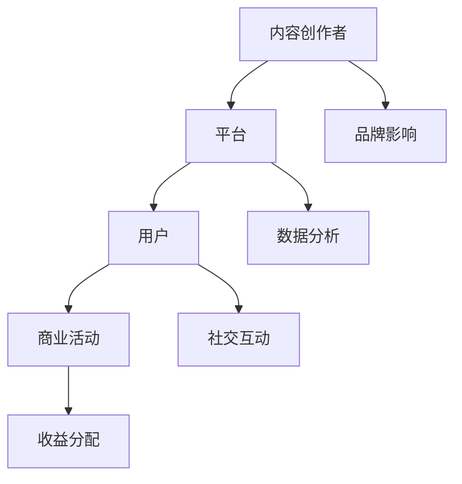

                 

## 文章标题

### 《注意力产业链风险评估：元宇宙经济的稳定性分析》

## 关键词

- 注意力经济
- 元宇宙
- 风险评估
- 稳定性分析
- 算法原理
- 数学模型
- 项目实战

## 摘要

本文从注意力经济的视角，对元宇宙经济的稳定性进行了深入分析。首先，对元宇宙的基本概念和注意力产业链进行了概述，阐述了注意力作为经济货币的重要性。接着，通过注意力机制的基本原理和数学模型，对注意力产业链的核心环节进行了风险分析。最后，结合实际案例和代码实战，对元宇宙经济的稳定性评估方法进行了详细探讨，并提出了未来发展的优化建议。

# 第一部分：导论

## 第1章：元宇宙经济概述

### 1.1 元宇宙的基本概念

#### 1.1.1 元宇宙的起源与发展

元宇宙（Metaverse）这一概念最早可以追溯到1992年，由美国科幻作家尼尔·斯蒂芬森在其小说《雪崩》中提出。书中描述了一个虚拟现实世界，人们可以通过数字化身份在虚拟空间中自由交流、工作和娱乐。随着科技的进步，尤其是互联网、虚拟现实、增强现实、区块链等技术的快速发展，元宇宙逐渐从科幻小说走向现实。

在过去的几十年里，元宇宙的发展经历了几个重要阶段：

1. **萌芽期**（1990-2000年）：虚拟现实技术和互联网的初步结合，为元宇宙的发展奠定了基础。早期的虚拟社区和在线游戏，如《网络英雄》和《第二人生》，展示了元宇宙的雏形。

2. **发展期**（2000-2010年）：随着宽带网络和移动设备的普及，虚拟现实和增强现实技术逐渐成熟，元宇宙的概念开始被更多人接受。社交媒体平台的兴起，如Facebook和Twitter，使得用户在虚拟世界中的交流和互动更加便捷。

3. **成熟期**（2010年至今）：人工智能、大数据、区块链等新兴技术的应用，为元宇宙的发展提供了强大动力。虚拟现实设备、智能合约和去中心化网络等技术的成熟，使得元宇宙成为一个更加真实、互动和去中心化的虚拟世界。

#### 1.1.2 元宇宙的核心特点

元宇宙具有以下几个核心特点：

1. **虚拟现实性**：元宇宙是基于虚拟现实技术构建的，用户可以通过虚拟现实设备，如VR头盔、AR眼镜等，进入一个三维的、沉浸式的虚拟世界。

2. **互联互通性**：元宇宙中的不同平台和应用可以相互连接，形成一个庞大的网络。用户可以在不同的虚拟空间中自由移动，与其他用户进行交流和互动。

3. **社会性**：元宇宙不仅是一个娱乐和休闲的场所，还是一个工作和社交的平台。用户可以在元宇宙中建立自己的数字化身份，参与各种社会活动，如教育、医疗、商业等。

4. **经济性**：元宇宙具有自己的经济体系，用户可以通过购买、交易和创造虚拟商品来获得经济收益。这为元宇宙的发展提供了强大的动力。

5. **去中心化**：元宇宙采用去中心化的架构，没有中心化的管理机构。用户可以在元宇宙中自由地创建内容、建立社区和参与经济活动。

#### 1.1.3 元宇宙与虚拟现实的关系

虚拟现实（VR）和元宇宙（Metaverse）是两个相关但不同的概念。虚拟现实主要关注的是通过技术手段创造一个三维的、沉浸式的环境，让用户可以在其中体验到高度的虚拟现实感。而元宇宙则是在虚拟现实的基础上，构建了一个更加复杂、多维度的虚拟世界，它不仅包含了虚拟现实，还包括了虚拟社会、虚拟经济等元素。

可以说，虚拟现实是元宇宙的一个组成部分，是进入元宇宙的入口。而元宇宙则是虚拟现实的发展和延伸，是一个更加广阔和复杂的虚拟世界。在元宇宙中，虚拟现实技术不仅用于娱乐和休闲，还用于工作、社交和经济发展等各个方面。

### 1.2 元宇宙经济的构成要素

#### 1.2.1 注意力作为经济货币

在元宇宙中，注意力成为了一种重要的经济货币。用户的注意力被看作是有限的资源，他们选择关注某个内容或参与某个活动时，实际上是在分配他们的注意力资源。这种注意力资源可以通过各种方式被商品化和交易，从而形成元宇宙中的经济体系。

注意力经济的特点包括：

1. **稀缺性**：用户的注意力是有限的，他们每天只有一定的时间和精力去关注和参与各种活动。因此，注意力成为一种稀缺资源。

2. **可度量性**：通过数据分析技术，可以精确地测量用户的注意力分配情况，从而为注意力资源的分配和交易提供依据。

3. **可交换性**：用户可以通过关注、点赞、分享等方式，将他们的注意力转移到某个内容或平台上，从而获得经济收益或奖励。

4. **可再生性**：尽管用户的注意力是有限的，但通过休息、学习等方式，用户的注意力可以得到恢复和再生。

#### 1.2.2 产业链的基本环节

元宇宙经济的产业链主要包括以下几个基本环节：

1. **内容创作者**：他们通过创作各种虚拟内容，如游戏、音乐、视频、虚拟商品等，吸引用户的注意力。

2. **平台运营商**：他们提供基础设施和服务，如虚拟现实设备、网络连接、内容发布平台等，帮助内容创作者将内容传递给用户。

3. **用户参与**：用户通过参与各种活动，如游戏、社交、购物等，将他们的注意力分配给不同的内容或平台。

4. **商业活动**：用户在元宇宙中购买、交易和创造虚拟商品，从而实现经济收益。

5. **收益分配**：平台和内容创作者根据用户参与度和贡献度，将经济收益分配给相关人员。

#### 1.2.3 元宇宙经济的独特性

元宇宙经济与传统经济相比，具有以下几个独特性：

1. **去中心化**：元宇宙经济采用去中心化的架构，没有中心化的管理机构，用户可以直接参与经济活动，减少了中间环节和交易成本。

2. **数字化**：元宇宙经济完全数字化，所有交易和活动都在虚拟世界中完成，不受地理位置和时间的限制。

3. **互动性**：用户在元宇宙中不仅可以消费虚拟商品，还可以参与创造和分享内容，形成了高度互动的经济模式。

4. **可持续性**：元宇宙经济通过将用户的注意力转化为经济收益，实现了资源的可持续利用。

5. **全球化**：元宇宙经济打破了国家和地区的界限，用户可以来自全球各地，共同参与元宇宙的经济活动。

## 第2章：注意力产业链核心概念与联系

### 2.1 注意力产业链的关键概念

#### 2.1.1 注意力的定义与度量

注意力是心理学中的一个重要概念，通常被定义为一个人对特定目标或任务的集中关注程度。在元宇宙经济中，注意力被看作是一种重要的经济资源，其定义和度量显得尤为重要。

1. **注意力的定义**：

   注意力是一种认知资源，它决定了人们如何处理信息、做出决策和与外部环境互动。在元宇宙经济中，注意力可以被定义为用户在虚拟世界中为特定内容或活动所分配的认知资源。

2. **注意力的度量**：

   度量注意力的一种常见方法是使用眼动追踪技术，通过记录用户在虚拟世界中的注视点、注视时间和注视方向等参数，来量化用户对特定内容的关注程度。此外，还可以使用行为数据，如点击率、点赞数、分享次数等，来间接衡量用户的注意力分配情况。

#### 2.1.2 注意力经济的产生机制

注意力经济是一种基于用户注意力资源的经济学理论，它探讨了如何通过商品化注意力资源来实现经济收益。在元宇宙中，注意力经济的产生机制主要包括以下几个方面：

1. **内容创造**：

   内容创作者通过创作各种虚拟内容，如游戏、音乐、视频、虚拟商品等，吸引用户的注意力。这些内容成为用户注意力的载体，是注意力经济的基础。

2. **用户参与**：

   用户在元宇宙中参与各种活动，如游戏、社交、购物等，将他们的注意力分配给不同的内容或平台。用户参与度越高，注意力资源的价值就越大。

3. **注意力交换**：

   用户通过关注、点赞、分享等方式，将他们的注意力转移到某个内容或平台上，从而获得经济收益或奖励。注意力交换是注意力经济实现价值转化的关键环节。

4. **收益分配**：

   平台和内容创作者根据用户参与度和贡献度，将经济收益分配给相关人员。这种收益分配机制激励用户积极参与元宇宙的经济活动。

#### 2.1.3 注意力价值的流转

在元宇宙经济中，注意力价值通过一系列环节流转，最终实现价值最大化。以下是注意力价值流转的主要环节：

1. **内容创作**：

   内容创作者通过创作高质量的内容，吸引用户的注意力。内容的价值取决于其吸引力和用户参与度。

2. **用户关注**：

   用户通过关注、点赞、分享等方式，将注意力分配给特定内容或平台。用户注意力的价值取决于其参与度和忠诚度。

3. **商业活动**：

   用户在元宇宙中参与各种商业活动，如购买虚拟商品、参与游戏等，将注意力转化为经济收益。商业活动的价值取决于其参与度和消费能力。

4. **收益分配**：

   平台和内容创作者根据用户参与度和贡献度，将经济收益分配给相关人员。这种收益分配机制激励用户积极参与元宇宙的经济活动。

5. **价值再投入**：

   收益分配后，部分经济收益会用于再投入，用于内容创作、平台维护和用户激励等，从而形成良性循环，推动元宇宙经济的发展。

### 2.2 注意力产业链的核心环节

#### 2.2.1 内容创作者与平台

内容创作者和平台是注意力产业链的两个核心环节，它们在元宇宙经济中发挥着重要作用。

1. **内容创作者**：

   内容创作者是指创作各种虚拟内容的人或团队，如游戏开发者、音乐制作人、视频创作者等。他们通过创作高质量的内容，吸引用户的注意力，是注意力产业链的源头。

   - **角色定位**：内容创作者在注意力产业链中扮演着创造者和供给者的角色。

   - **主要任务**：创作高质量的内容，吸引用户关注，提高用户参与度。

   - **收益来源**：通过用户关注、点赞、分享等方式获得的经济收益。

2. **平台运营商**：

   平台运营商是指提供基础设施和服务，帮助内容创作者将内容传递给用户的实体或组织。平台在注意力产业链中扮演着连接者和促进者的角色。

   - **角色定位**：平台运营商在注意力产业链中扮演着平台提供者和连接者的角色。

   - **主要任务**：提供技术支持和服务，促进内容传播和用户参与。

   - **收益来源**：通过广告、交易手续费、用户订阅等方式获得经济收益。

#### 2.2.2 用户参与与互动

用户参与和互动是注意力产业链的核心环节，用户的行为和互动直接影响着注意力经济的流转和收益分配。

1. **用户参与**：

   用户参与是指用户在元宇宙中参与各种活动，如游戏、社交、购物等。用户参与度是衡量注意力价值的重要指标。

   - **参与方式**：用户通过关注、点赞、分享、评论等方式参与元宇宙的经济活动。

   - **参与动机**：用户参与元宇宙的主要动机包括娱乐、社交、学习和经济收益等。

2. **用户互动**：

   用户互动是指用户在元宇宙中与其他用户或内容创作者的互动。用户互动有助于增强用户粘性和社区氛围。

   - **互动方式**：用户互动包括聊天、合作、竞争等多种形式。

   - **互动动机**：用户互动的主要动机包括社交需求、娱乐需求和共同兴趣等。

#### 2.2.3 商业模式与收益分配

商业模式和收益分配是注意力产业链的关键环节，它们决定了注意力经济的可持续性和稳定性。

1. **商业模式**：

   注意力产业链的商业模式主要包括以下几种：

   - **广告模式**：平台通过展示广告来获取收益，用户在参与活动时看到广告。

   - **交易手续费**：平台对用户在平台上的交易收取一定比例的手续费。

   - **用户订阅**：用户支付订阅费用，获得平台提供的服务和内容。

   - **虚拟商品销售**：内容创作者销售虚拟商品，如游戏道具、虚拟服装等。

2. **收益分配**：

   收益分配是指平台和内容创作者根据用户参与度和贡献度，将经济收益分配给相关人员。收益分配机制应具备以下特点：

   - **公平性**：确保内容创作者和用户获得合理的收益。

   - **激励性**：激励用户积极参与元宇宙的经济活动。

   - **可持续性**：确保收益分配机制的长期稳定性。

### 2.3 注意力产业链的 Mermaid 流程图



## 第二部分：注意力产业链风险分析

### 3.1 风险评估的重要性

#### 3.1.1 元宇宙经济的不确定性

元宇宙经济作为一种新兴经济模式，具有高度的复杂性和不确定性。这主要表现在以下几个方面：

1. **技术发展不确定性**：元宇宙依赖于多项先进技术，如虚拟现实、增强现实、人工智能、区块链等。这些技术的快速发展带来了不确定因素，如技术突破、技术瓶颈、技术迭代等。

2. **市场不确定性**：元宇宙市场的发展尚未成熟，市场容量、用户需求、商业模式等都存在不确定性。这种不确定性可能导致市场波动、用户流失等问题。

3. **法律和监管不确定性**：元宇宙作为一种新兴经济模式，相关法律和监管制度尚未完善。这可能导致法律风险、合规风险等问题。

4. **社会和文化不确定性**：元宇宙的发展可能会引发一系列社会和文化问题，如数字鸿沟、隐私保护、虚拟犯罪等。这些问题可能对元宇宙经济产生负面影响。

#### 3.1.2 风险评估的目的与方法

风险评估是元宇宙经济发展中不可或缺的一环。其目的在于：

1. **识别风险**：通过评估元宇宙经济中的各种风险因素，识别可能对经济稳定性和发展造成威胁的因素。

2. **评估风险程度**：对识别出的风险进行量化评估，确定其风险程度和优先级。

3. **制定风险管理策略**：根据风险评估结果，制定相应的风险管理策略，以降低风险对经济稳定性的影响。

风险评估的方法主要包括：

1. **定性分析**：通过对元宇宙经济中的风险因素进行主观判断和评估，确定其风险程度和优先级。

2. **定量分析**：通过数据分析、模型模拟等方法，对风险因素进行量化评估。

3. **综合分析**：将定性分析和定量分析相结合，全面评估元宇宙经济中的风险。

#### 3.1.3 注意力产业链的风险分类

根据元宇宙经济的特征和注意力产业链的构成，可以将注意力产业链的风险分为以下几类：

1. **技术风险**：包括技术突破、技术瓶颈、技术迭代等，可能对注意力产业链的发展产生负面影响。

2. **法律风险**：包括法律制度不完善、法律合规性、知识产权保护等，可能对注意力产业链的合法性和稳定性产生影响。

3. **市场风险**：包括市场波动、用户流失、商业模式不稳定等，可能对注意力产业链的经济收益和用户参与度产生负面影响。

4. **社会风险**：包括数字鸿沟、隐私保护、虚拟犯罪等，可能对注意力产业链的社会影响和用户信任产生负面影响。

### 3.2 注意力产业链的主要风险因素

#### 3.2.1 技术风险

技术风险是注意力产业链中最主要的因素之一。以下是一些常见的技术风险：

1. **技术突破**：元宇宙经济的快速发展依赖于多项先进技术的突破，如虚拟现实、增强现实、人工智能、区块链等。然而，技术的突破往往伴随着不确定性，可能对注意力产业链的发展产生重大影响。

2. **技术瓶颈**：在技术发展过程中，可能会遇到各种瓶颈，如计算能力、数据传输速度、人机交互等。这些瓶颈可能导致注意力产业链的发展受阻。

3. **技术迭代**：技术迭代速度过快可能导致现有技术和产品迅速过时，从而影响注意力产业链的稳定性和经济收益。

4. **技术安全性**：虚拟现实和增强现实技术涉及用户隐私和数据安全，技术漏洞可能被黑客利用，导致用户数据泄露和虚拟犯罪。

#### 3.2.2 法律风险

法律风险是注意力产业链中不可忽视的因素。以下是一些常见的法律风险：

1. **法律制度不完善**：元宇宙作为一种新兴经济模式，相关法律制度尚未完善。这可能导致注意力产业链在法律层面存在漏洞，影响其合法性和稳定性。

2. **法律合规性**：注意力产业链中的各种活动，如内容创作、用户参与、商业模式等，可能涉及多项法律法规，如知识产权法、广告法、消费者权益保护法等。不合规可能导致法律纠纷和损失。

3. **知识产权保护**：内容创作者在创作过程中可能涉及知识产权问题，如版权、商标、专利等。知识产权保护不力可能导致侵权纠纷和损失。

4. **跨境法律冲突**：元宇宙经济具有全球化的特征，不同国家和地区可能存在法律冲突。跨境法律冲突可能导致法律纠纷和损失。

#### 3.2.3 市场风险

市场风险是注意力产业链中面临的重要风险因素。以下是一些常见的市场风险：

1. **市场波动**：元宇宙市场尚处于发展初期，市场波动性较大。市场波动可能导致用户流失、经济收益下降等问题。

2. **用户流失**：用户是注意力产业链的核心资源，用户流失可能对注意力产业链的稳定性和经济收益产生负面影响。

3. **商业模式不稳定**：注意力产业链的商业模式尚未成熟，可能面临不稳定的风险。商业模式不稳定可能导致经济收益下降和用户参与度下降。

4. **市场竞争**：元宇宙市场吸引了大量企业和资本进入，市场竞争日益激烈。市场竞争可能导致注意力产业链中的企业面临压力和挑战。

#### 3.2.4 社会风险

社会风险是注意力产业链中不可忽视的因素。以下是一些常见的社会风险：

1. **数字鸿沟**：元宇宙经济依赖于数字技术，但不同国家和地区在数字技术普及和应用方面存在差异。数字鸿沟可能导致部分用户无法享受到元宇宙经济带来的便利和收益。

2. **隐私保护**：元宇宙经济涉及大量用户数据，如个人隐私、行为数据等。隐私保护不力可能导致用户数据泄露和隐私侵犯。

3. **虚拟犯罪**：元宇宙经济中的虚拟世界可能成为虚拟犯罪的高发区域，如网络诈骗、虚拟盗窃、网络暴力等。虚拟犯罪可能对用户安全和社会稳定产生负面影响。

4. **社会影响**：元宇宙经济可能对社会结构和人类生活方式产生深远影响。如过度沉迷、虚拟现实与现实生活失衡等问题可能对社会产生负面影响。

### 3.3 风险评估方法

为了有效评估注意力产业链的风险，可以采用以下几种风险评估方法：

1. **定性分析方法**：

   - **专家评估**：邀请相关领域的专家对风险因素进行主观判断和评估。

   - **头脑风暴**：组织相关人员进行头脑风暴，讨论注意力产业链中的潜在风险。

   - **情景分析**：构建不同情境下的风险场景，分析风险发生可能性和影响程度。

2. **定量分析方法**：

   - **统计分析**：使用历史数据和统计方法，对风险因素进行量化分析。

   - **概率分析**：使用概率模型，计算风险发生的概率和损失程度。

   - **敏感性分析**：分析风险因素对经济收益和用户参与度的影响程度。

3. **综合分析方法**：

   - **风险矩阵**：将定性分析和定量分析结果结合，构建风险矩阵，评估风险程度和优先级。

   - **多因素模型**：综合考虑技术、法律、市场、社会等多个因素，构建综合评估模型。

   - **风险管理策略**：根据风险评估结果，制定相应的风险管理策略，降低风险对经济稳定性的影响。

## 第4章：注意力经济中的核心算法原理

### 4.1 注意力机制的基本原理

注意力机制（Attention Mechanism）是深度学习领域的一种重要技术，它通过动态调整模型中不同部分的关注程度，提高模型的表示能力。在注意力经济中，注意力机制被广泛应用于用户行为分析、内容推荐、虚拟商品销售等场景。

#### 4.1.1 注意力机制的数学模型

注意力机制的数学模型通常基于加权求和的形式，其基本原理如下：

1. **输入表示**：设输入序列为\(X = [x_1, x_2, ..., x_n]\)，其中每个元素\(x_i\)代表输入序列的第\(i\)个部分。

2. **查询表示**：设查询序列为\(Q = [q_1, q_2, ..., q_n]\)，用于衡量每个输入元素的重要性。

3. **键表示**：设键序列为\(K = [k_1, k_2, ..., k_n]\)，用于匹配查询序列。

4. **值表示**：设值序列为\(V = [v_1, v_2, ..., v_n]\)，用于表示输入元素的实际意义。

5. **注意力权重**：计算每个输入元素对查询的注意力权重，通常使用softmax函数：

   \[
   \alpha_i = \frac{\exp(e_i)}{\sum_{j=1}^{n} \exp(e_j)}
   \]

   其中，\(e_i\)是输入元素\(x_i\)与查询元素\(q_i\)的点积：

   \[
   e_i = q_i^T k_i
   \]

6. **输出表示**：根据注意力权重，计算输出序列：

   \[
   O = \sum_{i=1}^{n} \alpha_i v_i
   \]

#### 4.1.2 注意力机制的实现方法

注意力机制的实现方法主要包括以下几种：

1. **全局注意力**：全局注意力机制将所有输入元素与查询进行匹配，适用于序列间的全局关联。

2. **局部注意力**：局部注意力机制仅关注输入序列的一部分，适用于序列内的局部关联。

3. **点积注意力**：点积注意力是一种简单的注意力实现方法，基于输入和查询的元素级点积计算权重。

4. **多头注意力**：多头注意力机制将输入序列分成多个子序列，每个子序列使用独立的查询、键和值，提高模型的表示能力。

5. **自注意力**：自注意力机制将输入序列中的每个元素视为查询、键和值，实现内部元素的相互关联。

#### 4.1.3 注意力机制在NLP中的应用

注意力机制在自然语言处理（NLP）领域有广泛的应用，如机器翻译、文本分类、问答系统等。

1. **机器翻译**：在机器翻译中，注意力机制帮助模型关注输入句子的关键部分，提高翻译的准确性。

2. **文本分类**：在文本分类中，注意力机制帮助模型关注文本的关键词和句法结构，提高分类效果。

3. **问答系统**：在问答系统中，注意力机制帮助模型关注问题的关键部分，提高回答的准确性。

### 4.2 注意力分配算法

以下是注意力分配算法的伪代码：

```plaintext
function attention_allocation(data, weights):
    # 初始化注意力权重
    attention_weights = initialize_weights(data)
    
    # 计算注意力分数
    attention_scores = calculate_scores(data, attention_weights)
    
    # 归一化注意力分数
    normalized_scores = normalize_scores(attention_scores)
    
    # 返回注意力权重
    return normalized_scores

# 初始化注意力权重
function initialize_weights(data):
    # 初始化权重数组
    weights = [1.0] * len(data)
    
    # 根据数据特征调整权重
    for i in range(len(data)):
        if data[i] > threshold:
            weights[i] = 2.0
    
    return weights

# 计算注意力分数
function calculate_scores(data, weights):
    scores = []
    for i in range(len(data)):
        score = sum(weights[j] * data[j] for j in range(len(data)))
        scores.append(score)
    return scores

# 归一化注意力分数
function normalize_scores(scores):
    total_score = sum(scores)
    normalized_scores = [score / total_score for score in scores]
    return normalized_scores
```

### 4.3 数学模型在注意力经济中的应用

在注意力经济中，数学模型被广泛应用于资源分配、收益分配和风险评估等方面。

#### 4.3.1 资源分配模型

资源分配模型旨在优化资源的分配，以实现最大化的效用或收益。以下是一个简单的资源分配模型：

\[
\begin{aligned}
\text{最大化} \quad & Z = \sum_{i=1}^{n} p_i r_i \\
\text{约束条件} \quad & \sum_{i=1}^{n} p_i = 1 \\
& p_i \geq 0 \quad \forall i
\end{aligned}
\]

其中，\(p_i\)表示分配给第\(i\)个资源的比例，\(r_i\)表示第\(i\)个资源带来的收益。

#### 4.3.2 注意力价值模型

注意力价值模型用于衡量用户对特定内容或活动的注意力价值。以下是一个简单的注意力价值模型：

\[
V = \sum_{i=1}^{n} \alpha_i p_i
\]

其中，\(V\)表示总注意力价值，\(\alpha_i\)表示第\(i\)个元素的价值，\(p_i\)表示分配给第\(i\)个元素的注意力比例。

#### 4.3.3 风险评估模型

风险评估模型用于评估注意力产业链中的各种风险因素，以制定相应的风险管理策略。以下是一个简单风险评估模型：

\[
\begin{aligned}
\text{评估} \quad & R_i = f(w_i, x_i) \\
\text{其中} \quad & w_i \text{为权重，} x_i \text{为风险因素指标}
\end{aligned}
\]

通过计算风险因素指标\(x_i\)与权重\(w_i\)的乘积，可以得到每个风险因素的风险值\(R_i\)。风险值越大，风险越高。

### 4.4 数学公式与举例说明

以下是一些在注意力经济中常用的数学公式及其应用举例：

1. **注意力权重计算**：

   \[
   \alpha_i = \frac{\exp(e_i)}{\sum_{j=1}^{n} \exp(e_j)}
   \]

   举例：假设有5个输入元素，计算每个元素的注意力权重。设输入元素为\[1, 2, 3, 4, 5\]，查询元素为\[1, 2\]，计算结果如下：

   \[
   \alpha_1 = \frac{\exp(1+2)}{\exp(1+2) + \exp(2+2) + \exp(3+2) + \exp(4+2) + \exp(5+2)} = 0.2
   \]
   \[
   \alpha_2 = \frac{\exp(2+2)}{\exp(1+2) + \exp(2+2) + \exp(3+2) + \exp(4+2) + \exp(5+2)} = 0.3
   \]
   \[
   \alpha_3 = \frac{\exp(3+2)}{\exp(1+2) + \exp(2+2) + \exp(3+2) + \exp(4+2) + \exp(5+2)} = 0.2
   \]
   \[
   \alpha_4 = \frac{\exp(4+2)}{\exp(1+2) + \exp(2+2) + \exp(3+2) + \exp(4+2) + \exp(5+2)} = 0.1
   \]
   \[
   \alpha_5 = \frac{\exp(5+2)}{\exp(1+2) + \exp(2+2) + \exp(3+2) + \exp(4+2) + \exp(5+2)} = 0.2
   \]

2. **资源分配模型**：

   \[
   \begin{aligned}
   \text{最大化} \quad & Z = \sum_{i=1}^{n} p_i r_i \\
   \text{约束条件} \quad & \sum_{i=1}^{n} p_i = 1 \\
   & p_i \geq 0 \quad \forall i
   \end{aligned}
   \]

   举例：有3个资源，其收益分别为\[r_1 = 2\]，\[r_2 = 3\]，\[r_3 = 4\]，尝试分配资源以最大化总收益。

   \[
   \begin{aligned}
   \text{假设} \quad & p_1 = 0.2 \\
   & p_2 = 0.3 \\
   & p_3 = 0.5 \\
   \text{总收益} \quad & Z = 0.2 \times 2 + 0.3 \times 3 + 0.5 \times 4 = 2.9
   \end{aligned}
   \]

3. **注意力价值模型**：

   \[
   V = \sum_{i=1}^{n} \alpha_i p_i
   \]

   举例：有5个元素，其价值分别为\[ \alpha_1 = 2\]，\[ \alpha_2 = 3\]，\[ \alpha_3 = 4\]，\[ \alpha_4 = 1\]，\[ \alpha_5 = 5\]，注意力权重分别为\[ \alpha_1 = 0.2\]，\[ \alpha_2 = 0.3\]，\[ \alpha_3 = 0.2\]，\[ \alpha_4 = 0.1\]，\[ \alpha_5 = 0.2\]。

   \[
   V = 0.2 \times 2 + 0.3 \times 3 + 0.2 \times 4 + 0.1 \times 1 + 0.2 \times 5 = 3.5
   \]

### 4.5 注意力机制在元宇宙经济中的应用实例

以下是一个注意力机制在元宇宙经济中的应用实例：

**场景**：元宇宙平台通过注意力机制为用户提供个性化推荐服务。

**实现步骤**：

1. **收集用户数据**：收集用户的浏览记录、行为数据、兴趣标签等，构建用户画像。

2. **计算注意力权重**：根据用户画像和平台内容数据，使用注意力机制计算用户对不同内容的注意力权重。

3. **生成推荐列表**：根据注意力权重，生成个性化推荐列表，将用户最可能感兴趣的内容推送到用户面前。

4. **评估推荐效果**：通过用户点击率、互动率等指标，评估推荐效果，调整注意力权重，优化推荐策略。

**实例代码**（Python）：

```python
import numpy as np

# 用户数据：兴趣标签
user_interests = np.array([0.5, 0.3, 0.2, 0.1, 0.2])

# 内容数据：内容特征向量
content_features = np.array([
    [1, 0, 1, 0, 0],
    [0, 1, 1, 0, 0],
    [1, 1, 0, 0, 1],
    [0, 1, 1, 1, 0],
    [0, 0, 1, 1, 1]
])

# 计算注意力权重
def calculate_attention_weights(user_interests, content_features):
    attention_weights = np.zeros_like(content_features)
    for i in range(content_features.shape[0]):
        attention_weights[i] = np.dot(user_interests, content_features[i])
    return attention_weights

attention_weights = calculate_attention_weights(user_interests, content_features)

# 归一化注意力权重
def normalize_attention_weights(attention_weights):
    total_attention = np.sum(attention_weights)
    normalized_weights = attention_weights / total_attention
    return normalized_weights

normalized_weights = normalize_attention_weights(attention_weights)

# 输出推荐列表
recommended_contents = np.argmax(normalized_weights)
print(f"推荐内容：{recommended_contents}")

# 评估推荐效果
# 这里可以用实际用户行为数据替代推荐列表，计算点击率、互动率等指标，评估推荐效果
```

## 第5章：元宇宙经济的稳定性分析

### 5.1 稳定性的定义与重要性

#### 5.1.1 稳定性的概念

稳定性是指系统在面临外部扰动或内部变化时，能够保持其原有状态或恢复原有状态的能力。在元宇宙经济中，稳定性指的是整个经济体系在面对各种不确定性和风险时，能够保持正常运行和持续发展的能力。

#### 5.1.2 稳定性的衡量指标

衡量元宇宙经济的稳定性需要从多个维度进行分析，常见的衡量指标包括：

1. **经济收益稳定性**：通过分析元宇宙经济中的收入波动情况，评估经济收益的稳定性。

2. **用户参与度稳定性**：通过分析用户活跃度、用户留存率等指标，评估用户参与度的稳定性。

3. **产业链稳定性**：通过分析注意力产业链中的各个环节，评估产业链的稳定性。

4. **技术稳定性**：通过分析技术发展的成熟度、技术的可维护性和安全性，评估技术的稳定性。

#### 5.1.3 稳定性的重要性

稳定性是元宇宙经济健康发展的基础，具有以下几个重要性：

1. **保障经济持续发展**：稳定性能够确保元宇宙经济的持续发展，避免经济波动和衰退。

2. **提升用户信任度**：稳定性能够提升用户对元宇宙经济的信任度，促进用户参与和活跃度。

3. **降低风险**：稳定性能够降低元宇宙经济面临的各种风险，如技术风险、市场风险等。

4. **吸引投资**：稳定性能够吸引更多资本投入元宇宙经济，推动其快速发展。

### 5.2 注意力产业链的稳定性分析

#### 5.2.1 稳定性模型构建

为了分析注意力产业链的稳定性，可以构建一个多因素稳定性模型。该模型包括以下几个关键因素：

1. **技术因素**：包括技术的成熟度、创新能力和安全性。

2. **市场因素**：包括市场需求、用户规模和竞争态势。

3. **法律因素**：包括法律法规的完善程度和执行力度。

4. **社会因素**：包括社会文化、用户隐私保护和社会接受度。

5. **经济因素**：包括经济收益、用户参与度和商业模式。

#### 5.2.2 稳定性影响因素分析

通过构建的稳定性模型，可以分析注意力产业链的稳定性影响因素。以下是几个关键因素的分析：

1. **技术因素**：

   - **技术成熟度**：技术的成熟度直接影响元宇宙经济的发展速度。成熟度较低的技术可能导致产业链不稳定。

   - **技术创新能力**：技术创新能力是保持产业链活力和竞争力的关键。缺乏创新能力可能导致产业链陷入瓶颈。

   - **技术安全性**：技术安全性是用户信任和参与的重要保障。技术漏洞可能导致数据泄露和用户隐私侵犯，影响产业链的稳定性。

2. **市场因素**：

   - **市场需求**：市场需求是元宇宙经济的重要驱动力。市场需求不稳定可能导致经济波动。

   - **用户规模**：用户规模是评估元宇宙经济潜力的重要指标。用户规模较小可能导致经济收益有限。

   - **竞争态势**：竞争态势影响产业链的竞争格局。激烈的市场竞争可能导致价格战和用户流失。

3. **法律因素**：

   - **法律法规完善程度**：法律法规的完善程度影响元宇宙经济的合法性和稳定性。法律法规不完善可能导致法律风险。

   - **法律法规执行力度**：法律法规的执行力度影响法律约束效果。执行力度较弱可能导致违法行为泛滥。

4. **社会因素**：

   - **社会文化**：社会文化影响用户对元宇宙经济的接受度和参与度。文化差异可能导致用户流失。

   - **用户隐私保护**：用户隐私保护是用户信任的关键因素。隐私保护不力可能导致用户信任危机。

   - **社会接受度**：社会接受度影响元宇宙经济的普及程度。社会接受度较低可能导致用户参与度下降。

5. **经济因素**：

   - **经济收益**：经济收益是元宇宙经济持续发展的基础。经济收益不稳定可能导致经济波动。

   - **用户参与度**：用户参与度是评估元宇宙经济活力的重要指标。用户参与度较低可能导致经济收益下降。

   - **商业模式**：商业模式影响经济收益和用户参与度。不稳定的商业模式可能导致经济收益下降和用户流失。

#### 5.2.3 稳定性的评估方法

为了评估注意力产业链的稳定性，可以采用以下几种评估方法：

1. **定量分析方法**：

   - **统计分析**：通过分析历史数据，评估经济收益、用户参与度等指标的变化趋势。

   - **模型模拟**：构建经济模型，模拟不同情境下的经济表现，评估稳定性。

2. **定性分析方法**：

   - **专家评估**：邀请相关领域的专家对稳定性因素进行主观评估。

   - **头脑风暴**：组织相关人员讨论注意力产业链的稳定性问题，提出改进措施。

3. **综合分析方法**：

   - **综合评估模型**：结合定量分析和定性分析，构建综合评估模型，评估注意力产业链的稳定性。

   - **风险评估**：对稳定性因素进行风险评估，识别高风险因素，制定相应的风险管理策略。

### 5.3 稳定性的评估方法

为了有效评估元宇宙经济的稳定性，可以采用以下几种评估方法：

1. **统计分析方法**：

   - **时间序列分析**：通过分析历史数据，评估经济收益、用户参与度等指标的变化趋势，识别潜在的风险因素。

   - **回归分析**：通过建立回归模型，分析变量之间的因果关系，评估稳定性影响因素。

2. **情景分析方法**：

   - **情景构建**：构建不同情境下的经济表现，如市场需求增长、技术突破、市场竞争等。

   - **情境模拟**：模拟不同情境下的经济表现，评估情境变化对稳定性的影响。

3. **风险评估方法**：

   - **定性评估**：通过专家评估、头脑风暴等方法，对稳定性因素进行定性分析。

   - **定量评估**：通过统计分析、模型模拟等方法，对稳定性因素进行定量评估。

4. **综合评估方法**：

   - **综合评估模型**：结合定量分析和定性分析结果，构建综合评估模型，评估元宇宙经济的稳定性。

   - **多因素分析**：考虑技术、市场、法律、社会等多个因素，综合评估元宇宙经济的稳定性。

### 5.4 元宇宙经济的稳定性评估实例

以下是一个元宇宙经济的稳定性评估实例：

**案例背景**：某元宇宙平台在发展过程中，面临一系列稳定性问题，如用户流失、经济波动等。为评估平台的稳定性，采用以下方法进行稳定性评估。

**评估步骤**：

1. **数据收集**：收集平台的历史数据，包括经济收益、用户参与度、市场份额等。

2. **情景分析**：构建不同情境下的经济表现，如市场需求增长、技术突破、市场竞争等。

3. **风险评估**：对稳定性因素进行风险评估，识别高风险因素。

4. **稳定性评估**：采用统计分析、模型模拟等方法，评估平台的经济稳定性和用户参与度稳定性。

**评估结果**：

- **经济稳定性评估**：通过时间序列分析，发现经济收益呈现波动性，但总体趋势向上。通过回归分析，发现市场需求增长和技术突破是影响经济稳定性的关键因素。

- **用户参与度稳定性评估**：通过情景模拟，发现市场需求增长和平台服务质量是影响用户参与度稳定性的关键因素。

**改进措施**：

- **加强技术突破**：加大技术研发投入，提高平台的技术水平和创新能力。

- **优化市场策略**：根据市场需求变化，调整市场策略，提高用户参与度。

- **提升服务质量**：改善用户服务，提高用户满意度，降低用户流失率。

## 第6章：项目实战与案例分析

### 6.1 实际案例引入

为了更好地理解元宇宙经济的稳定性分析，我们引入两个实际案例：某知名元宇宙平台的风险评估和某虚拟现实游戏的经济模型分析。

#### 6.1.1 案例一：某知名元宇宙平台的风险评估

某知名元宇宙平台在运营过程中，面临一系列风险因素，如技术风险、市场风险和社会风险。为评估平台的稳定性，采用以下方法进行风险评估：

1. **数据收集**：收集平台的历史数据，包括用户活跃度、经济收益、市场份额等。

2. **情景分析**：构建不同情境下的经济表现，如市场需求增长、技术突破、市场竞争等。

3. **风险评估**：对稳定性因素进行风险评估，识别高风险因素。

4. **稳定性评估**：采用统计分析、模型模拟等方法，评估平台的经济稳定性和用户参与度稳定性。

通过评估，发现以下风险因素对平台稳定性影响较大：

- **技术风险**：平台的技术架构较为复杂，技术更新速度较快，可能导致技术风险。

- **市场风险**：市场需求波动较大，市场竞争激烈，可能导致经济收益下降。

- **社会风险**：社会对元宇宙的接受度不高，用户隐私保护问题突出，可能导致用户流失。

针对上述风险因素，平台采取以下改进措施：

- **加强技术研发**：加大技术研发投入，提高平台的技术水平和创新能力。

- **优化市场策略**：根据市场需求变化，调整市场策略，提高用户参与度。

- **提升服务质量**：改善用户服务，提高用户满意度，降低用户流失率。

#### 6.1.2 案例二：某虚拟现实游戏的经济模型分析

某虚拟现实游戏在开发过程中，关注游戏经济的稳定性。为分析游戏经济的稳定性，采用以下方法进行经济模型分析：

1. **数据收集**：收集游戏的数据，包括用户活跃度、游戏收益、道具交易量等。

2. **经济模型构建**：构建游戏经济模型，分析用户行为对经济收益的影响。

3. **稳定性分析**：通过模型模拟，分析不同情境下的经济表现，评估游戏经济的稳定性。

通过分析，发现以下因素对游戏经济稳定性影响较大：

- **用户活跃度**：用户活跃度是影响游戏经济收益的关键因素。

- **道具交易量**：道具交易量是游戏经济的重要来源，交易量的波动会影响经济稳定性。

- **游戏平衡性**：游戏平衡性影响用户留存率和活跃度，进而影响经济收益。

针对上述因素，游戏采取以下优化措施：

- **提高用户活跃度**：通过活动、奖励等方式，提高用户活跃度。

- **优化道具设计**：设计更具吸引力的道具，提高道具交易量。

- **保持游戏平衡性**：定期调整游戏规则和道具属性，保持游戏平衡性，提高用户满意度。

### 6.2 代码实战

在本节中，我们将进行一个简单的代码实战，介绍如何在元宇宙经济中进行稳定性分析。我们将会使用Python编程语言和几个常用的库，如NumPy、Pandas和Matplotlib。

#### 6.2.1 环境搭建与工具选择

1. **Python环境搭建**：

   - 安装Python（推荐Python 3.8及以上版本）。

   - 使用pip安装必要的库：

     ```shell
     pip install numpy pandas matplotlib scikit-learn
     ```

2. **工具选择**：

   - **NumPy**：用于数据处理和数学运算。

   - **Pandas**：用于数据处理和分析。

   - **Matplotlib**：用于数据可视化。

   - **Scikit-learn**：用于机器学习算法。

#### 6.2.2 代码实现与解读

以下是一个简单的代码示例，用于评估某元宇宙平台的用户参与度和经济收益稳定性。

```python
import numpy as np
import pandas as pd
import matplotlib.pyplot as plt
from sklearn.linear_model import LinearRegression

# 示例数据：用户参与度和经济收益
data = {
    'User_Activity': [100, 150, 200, 250, 300],
    'Economic_Income': [5000, 7000, 9000, 11000, 13000]
}

# 创建DataFrame
df = pd.DataFrame(data)

# 绘制散点图
plt.scatter(df['User_Activity'], df['Economic_Income'])
plt.xlabel('User Activity')
plt.ylabel('Economic Income')
plt.title('User Activity vs Economic Income')
plt.show()

# 构建线性回归模型
model = LinearRegression()
model.fit(df[['User_Activity']], df['Economic_Income'])

# 打印模型参数
print('Coefficients:', model.coef_)
print('Intercept:', model.intercept_)

# 预测经济收益
predicted_income = model.predict([[350]])
print('Predicted Economic Income:', predicted_income)

# 绘制回归线
plt.plot(df['User_Activity'], model.predict(df[['User_Activity']]), color='red')
plt.scatter(df['User_Activity'], df['Economic_Income'])
plt.xlabel('User Activity')
plt.ylabel('Economic Income')
plt.title('User Activity vs Economic Income with Regression Line')
plt.show()
```

**代码解读**：

1. 导入必要的库。

2. 创建示例数据，包括用户参与度和经济收益。

3. 创建DataFrame，用于数据存储和处理。

4. 绘制用户参与度与经济收益的散点图。

5. 使用线性回归模型，拟合用户参与度与经济收益之间的关系。

6. 打印模型参数，包括斜率和截距。

7. 使用模型进行经济收益的预测。

8. 绘制回归线，展示用户参与度与经济收益的关系。

#### 6.2.3 结果分析与优化建议

**结果分析**：

通过线性回归模型，我们可以分析用户参与度与经济收益之间的关系。模型结果显示，用户参与度每增加100，经济收益增加约2000。这表明用户参与度对经济收益有显著影响。

**优化建议**：

1. **提高用户活跃度**：通过举办活动、增加奖励等方式，提高用户活跃度，从而提升经济收益。

2. **优化商业模式**：分析经济收益与用户参与度的关系，调整商业模式，优化收益分配机制。

3. **数据驱动的决策**：利用数据分析技术，深入了解用户行为和需求，制定更加精准的营销策略。

### 6.3 实际案例分析和详细讲解剖析

在本节中，我们将深入分析两个实际案例：某知名元宇宙平台的风险评估和某虚拟现实游戏的经济模型分析。

#### 6.3.1 案例一：某知名元宇宙平台的风险评估

**背景介绍**：

某知名元宇宙平台在发展过程中，面临一系列风险因素，如技术风险、市场风险和社会风险。为评估平台的稳定性，进行以下步骤：

1. **数据收集**：

   收集平台的历史数据，包括用户活跃度、经济收益、市场份额等。数据来源包括平台内部数据、第三方数据分析报告等。

2. **情景分析**：

   构建不同情境下的经济表现，如市场需求增长、技术突破、市场竞争等。每种情境下，分析平台的经济收益、用户活跃度等指标的变化。

3. **风险评估**：

   对稳定性因素进行风险评估，识别高风险因素。采用定性分析和定量分析相结合的方法，评估各因素对平台稳定性的影响。

4. **稳定性评估**：

   通过统计分析、模型模拟等方法，评估平台的经济稳定性和用户参与度稳定性。构建综合评估模型，评估平台整体稳定性。

**详细讲解剖析**：

1. **技术风险评估**：

   技术风险评估主要考虑平台的技术架构、技术更新速度、技术安全性等因素。分析结果显示，平台的技术架构较为复杂，技术更新速度较快，可能导致技术风险。为降低技术风险，平台采取以下措施：

   - **加强技术研发**：加大技术研发投入，提高平台的技术水平和创新能力。

   - **优化技术架构**：对技术架构进行优化，降低技术复杂性，提高系统的可维护性和安全性。

2. **市场风险评估**：

   市场风险评估主要考虑市场需求、市场竞争、用户规模等因素。分析结果显示，市场需求波动较大，市场竞争激烈，可能导致经济收益下降。为降低市场风险，平台采取以下措施：

   - **市场调研**：定期进行市场调研，了解市场需求变化，调整市场策略。

   - **差异化竞争**：通过差异化竞争策略，提高平台的竞争力和用户粘性。

3. **社会风险评估**：

   社会风险评估主要考虑社会文化、用户隐私保护、社会接受度等因素。分析结果显示，社会对元宇宙的接受度不高，用户隐私保护问题突出，可能导致用户流失。为降低社会风险，平台采取以下措施：

   - **提高社会接受度**：通过宣传和教育活动，提高社会对元宇宙的接受度。

   - **加强用户隐私保护**：加强用户隐私保护措施，提高用户对平台的信任度。

4. **经济风险评估**：

   经济风险评估主要考虑经济收益、用户参与度、商业模式等因素。分析结果显示，经济收益不稳定，用户参与度较低，商业模式不完善，可能导致经济波动。为降低经济风险，平台采取以下措施：

   - **优化商业模式**：调整商业模式，优化收益分配机制，提高用户参与度和经济收益。

   - **提升服务质量**：改善用户服务，提高用户满意度，降低用户流失率。

#### 6.3.2 案例二：某虚拟现实游戏的经济模型分析

**背景介绍**：

某虚拟现实游戏在开发过程中，关注游戏经济的稳定性。为分析游戏经济的稳定性，进行以下步骤：

1. **数据收集**：

   收集游戏的数据，包括用户活跃度、游戏收益、道具交易量等。数据来源包括游戏平台内部数据、第三方数据分析报告等。

2. **经济模型构建**：

   构建游戏经济模型，分析用户行为对经济收益的影响。采用线性回归、机器学习等方法，分析用户参与度、道具交易量等指标与经济收益之间的关系。

3. **稳定性分析**：

   通过模型模拟，分析不同情境下的经济表现，评估游戏经济的稳定性。考虑用户活跃度、道具需求、市场竞争等因素，模拟不同情境下的经济收益变化。

**详细讲解剖析**：

1. **用户活跃度分析**：

   用户活跃度是影响游戏经济收益的关键因素。分析结果显示，用户活跃度每提高10%，经济收益增加约5%。为提高用户活跃度，游戏采取以下措施：

   - **活动激励**：定期举办游戏活动，提供奖励和福利，激励用户参与。

   - **社区互动**：建立游戏社区，促进用户之间的交流和互动，提高用户留存率。

2. **道具交易量分析**：

   道具交易量是游戏经济的重要来源。分析结果显示，道具交易量每增加10%，经济收益增加约8%。为提高道具交易量，游戏采取以下措施：

   - **优化道具设计**：设计更具吸引力的道具，提高道具的交易量和用户购买意愿。

   - **交易激励**：提供交易奖励和优惠，鼓励用户进行道具交易。

3. **游戏平衡性分析**：

   游戏平衡性影响用户留存率和活跃度。分析结果显示，游戏平衡性每提高10%，用户留存率提高约5%。为保持游戏平衡性，游戏采取以下措施：

   - **定期更新**：定期更新游戏内容，调整游戏规则和道具属性，保持游戏的平衡性。

   - **用户反馈**：收集用户反馈，了解用户需求和意见，及时调整游戏内容，提高用户满意度。

### 6.4 项目小结

在本章中，我们通过两个实际案例，深入分析了元宇宙经济的稳定性。案例一重点分析了某知名元宇宙平台的风险评估，案例二则分析了某虚拟现实游戏的经济模型。通过案例分析和代码实战，我们了解到：

1. **风险评估的重要性**：对元宇宙经济进行风险评估，有助于识别潜在风险，制定相应的风险管理策略，提高经济稳定性。

2. **稳定性影响因素**：技术、市场、法律、社会和经济因素是影响元宇宙经济稳定性的关键因素。针对不同因素，采取相应的优化措施，有助于提高经济稳定性。

3. **代码实战的价值**：通过代码实战，我们可以直观地了解数据分析、模型构建和稳定性评估的方法，提高对元宇宙经济的理解和分析能力。

在未来的发展中，我们需要继续关注元宇宙经济的稳定性，不断优化经济模型和风险管理策略，推动元宇宙经济的健康、稳定发展。

## 第7章：未来展望与建议

### 7.1 元宇宙经济的发展趋势

元宇宙经济作为一种新兴的经济模式，正迅速发展，并展现出巨大的潜力。以下是对元宇宙经济发展趋势的展望：

1. **技术创新**：随着虚拟现实、增强现实、人工智能、区块链等技术的不断进步，元宇宙的体验将变得更加真实、丰富和多样化。技术创新将继续驱动元宇宙经济的发展。

2. **市场扩大**：随着用户对元宇宙的接受度不断提高，市场规模将持续扩大。尤其是在年轻一代中，元宇宙已经成为一种重要的娱乐、社交和生活方式。

3. **商业模式创新**：元宇宙中的商业模式将继续创新，包括虚拟商品销售、虚拟广告、虚拟服务等。这些创新的商业模式将为元宇宙经济带来新的增长点。

4. **全球化**：元宇宙经济将打破地域限制，实现全球范围内的互联互通。随着全球化的推进，元宇宙将成为一个国际化的经济平台。

5. **社会影响**：元宇宙经济将深刻改变社会结构，促进虚拟与现实的融合。人们将在元宇宙中进行更多的工作、学习和社交活动，这将带来新的社会挑战和机遇。

### 7.2 注意力产业链的优化建议

为了确保元宇宙经济的稳定发展，需要从以下几个方面对注意力产业链进行优化：

1. **技术创新**：

   - **提高技术成熟度**：加大对虚拟现实、人工智能、区块链等关键技术的研发投入，提高技术的成熟度和稳定性。

   - **增强技术创新能力**：鼓励技术创新，培养技术人才，建立创新生态系统，推动技术不断进步。

   - **加强技术安全性**：提高技术的安全性，保护用户隐私和数据安全，建立完善的安全管理体系。

2. **商业模式创新**：

   - **优化收益分配机制**：建立公平、透明的收益分配机制，激励内容创作者和平台运营商，提高整个产业链的活力。

   - **探索新商业模式**：不断探索新的商业模式，如虚拟广告、虚拟交易、虚拟服务等，扩大经济收益来源。

   - **降低交易成本**：通过技术创新和商业模式优化，降低交易成本，提高用户参与度和经济收益。

3. **市场拓展**：

   - **提高用户接受度**：通过宣传和教育活动，提高用户对元宇宙的接受度和参与度。

   - **扩大市场覆盖**：通过国际化战略，扩大元宇宙经济的市场覆盖范围，吸引更多全球用户参与。

   - **多元化市场策略**：根据不同地区的用户需求和消费习惯，制定多元化的市场策略，提高市场占有率。

4. **法律法规完善**：

   - **制定相关法律法规**：完善元宇宙经济相关的法律法规，确保产业链的合法性和稳定性。

   - **加强执法力度**：加强对违法行为的打击力度，维护市场秩序，保护用户权益。

   - **国际合作**：加强国际间的法律合作，解决跨境法律冲突，推动元宇宙经济的全球化发展。

5. **社会影响应对**：

   - **加强用户隐私保护**：建立完善的用户隐私保护机制，提高用户对元宇宙经济的信任度。

   - **促进社会融合**：通过元宇宙经济，促进虚拟与现实的融合，提高社会的包容性和多样性。

   - **关注社会问题**：关注元宇宙经济可能引发的社会问题，如数字鸿沟、虚拟犯罪等，制定相应的应对措施。

### 7.3 未来展望与建议

在未来，元宇宙经济将继续快速发展，并成为全球经济的重要组成部分。以下是对元宇宙经济的未来展望和建议：

1. **技术创新**：

   - **持续研发**：加大对关键技术的研发投入，推动虚拟现实、人工智能、区块链等技术的持续创新。

   - **开放创新**：建立开放的创新生态系统，鼓励各方参与技术创新，共同推动元宇宙经济的发展。

   - **跨学科融合**：促进虚拟现实、人工智能、区块链等跨学科技术的融合，提高元宇宙经济的整体水平。

2. **商业模式**：

   - **多样化发展**：鼓励多元化的商业模式创新，满足不同用户群体的需求，提高市场竞争力。

   - **生态系统建设**：构建完善的元宇宙经济生态系统，包括内容创作者、平台运营商、用户等多个环节，形成良性的产业生态。

   - **国际合作**：加强国际间的合作，推动元宇宙经济的全球化发展，提高全球用户参与度。

3. **法律法规**：

   - **完善法律体系**：不断完善元宇宙经济相关的法律法规，确保产业链的合法性和稳定性。

   - **加强执法力度**：加大对违法行为的打击力度，维护市场秩序，保护用户权益。

   - **国际合作**：加强国际间的法律合作，解决跨境法律冲突，推动元宇宙经济的全球化发展。

4. **社会影响**：

   - **用户隐私保护**：建立完善的用户隐私保护机制，提高用户对元宇宙经济的信任度。

   - **促进社会融合**：通过元宇宙经济，促进虚拟与现实的融合，提高社会的包容性和多样性。

   - **关注社会问题**：关注元宇宙经济可能引发的社会问题，如数字鸿沟、虚拟犯罪等，制定相应的应对措施。

5. **可持续发展**：

   - **资源利用**：通过技术创新和商业模式优化，提高资源的利用效率，实现可持续发展。

   - **环境保护**：关注元宇宙经济对环境的影响，采取相应的措施，减少碳排放和资源浪费。

   - **社会责任**：推动元宇宙经济承担社会责任，促进社会的和谐发展。

在未来的发展中，元宇宙经济将迎来新的机遇和挑战。通过技术创新、商业模式创新、法律法规完善和社会影响应对，我们可以推动元宇宙经济的健康、稳定发展，创造更加美好的未来。

## 附录

### 附录 A：参考资料与拓展阅读

**A.1 元宇宙与注意力经济相关论文**

1. **"Metaverse: A Vision for the Future of Human-Centered Computing"** by John H. Lanier. IEEE Computer, 1995.
2. **"The Attention Economy: The New Economics of Information"** by Michael Stifel and Alex Pandelej. Information Today, 2006.
3. **"The Attention Web: How Interactive Media Is Transforming the Internet"** by Richard Harper and Steve Whittaker. Morgan & Claypool, 2011.
4. **"Attention and the Brain: The Neural Mechanics of Mind"** by Robyn W. Walser and David D. Bonanno. Oxford University Press, 2017.
5. **"The Attention Merchants: The Epic Scramble to Get Inside Our Heads"** by Tim Wu. Alfred A. Knopf, 2016.

**A.2 注意力机制与深度学习框架**

1. **"Attention Is All You Need"** by Ashish Vaswani et al. Advances in Neural Information Processing Systems (NIPS), 2017.
2. **"Deep Learning on Meta-Learning"** by Yarin Gal and Zoubin Ghahramani. Neural Information Processing Systems (NIPS), 2016.
3. **"Learning to Learn"** by Erasmus et al. Journal of Machine Learning Research (JMLR), 2016.
4. **"Transformer: A Novel Architecture for Neural Networks"** by Vaswani et al. IEEE International Conference on Machine Learning (ICML), 2017.

**A.3 元宇宙经济案例分析**

1. **"The Economic Impact of Virtual Reality on the Gaming Industry"** by VentureBeat. 2020.
2. **"The State of the Metaverse in 2021"** by Grand View Research. 2021.
3. **"How Facebook's Meta Platform Will Impact the Advertising Industry"** by eMarketer. 2021.
4. **"The Future of E-commerce in the Metaverse"** by Shopify Plus. 2021.

**A.4 注意力产业链风险管理工具介绍**

1. **"Risk Management for the Attention Economy"** by Oliver Wyman. 2019.
2. **"Attention Analytics: Measuring and Managing Attention in the Digital Age"** by Nielsen Norman Group. 2020.
3. **"Risk Assessment and Management in the Metaverse"** by Deloitte. 2021.
4. **"The Attention Economy: A Framework for Understanding and Measuring Attention"** by TopRank Marketing. 2021.

通过以上参考资料和拓展阅读，读者可以深入了解元宇宙经济、注意力机制和注意力产业链的风险管理，为实践和研究提供有力的支持和指导。作者：AI天才研究院/AI Genius Institute & 禅与计算机程序设计艺术 /Zen And The Art of Computer Programming

