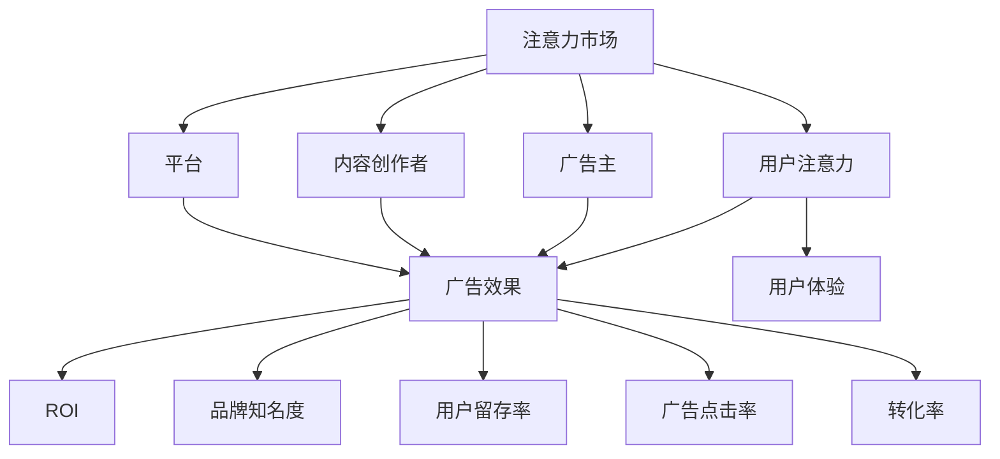

                 

### 文章标题

“注意力市场：元宇宙广告投放的新思路”

### 关键词

- 元宇宙
- 广告投放
- 注意力市场
- 广告策略
- 技术应用
- 数据分析

### 摘要

本文将探讨元宇宙背景下的一种全新广告投放思路——注意力市场。首先，我们会对元宇宙及其广告市场的概念进行概述，分析其与传统广告的差异和优势。接着，引入注意力市场理论，阐述其核心概念及与广告投放的紧密关系。随后，我们将详细探讨元宇宙广告投放的策略，包括目标定位、投放渠道选择以及效果评估。最后，通过经典案例解析与实战应用，展示注意力市场理论在元宇宙广告投放中的实际应用效果。文章旨在为业界提供一种新的广告投放视角，助力企业在元宇宙中实现精准、高效的广告营销。

---

## 《注意力市场：元宇宙广告投放的新思路》目录大纲

### 第一部分：元宇宙与广告投放概述

#### 第1章：元宇宙与广告市场的融合

1.1 元宇宙的定义与发展

1.2 元宇宙广告市场的兴起

1.3 元宇宙广告与传统广告的差异

1.4 元宇宙广告的优势与挑战

#### 第2章：注意力市场理论

2.1 注意力市场的定义

2.2 注意力市场与广告投放的关系

2.3 注意力市场的核心要素

2.4 注意力市场的研究方法

### 第二部分：元宇宙广告投放策略

#### 第3章：元宇宙广告目标定位

3.1 目标受众分析

3.2 广告目标设定

3.3 广告内容创意

3.4 广告投放渠道选择

#### 第4章：元宇宙广告投放策略

4.1 持续性广告策略

4.2 瞬时性广告策略

4.3 游戏化广告策略

4.4 互动性广告策略

#### 第5章：元宇宙广告投放效果评估

5.1 广告投放效果评估指标

5.2 数据分析工具与方法

5.3 广告效果优化策略

### 第三部分：案例解析与实战应用

#### 第6章：经典元宇宙广告案例解析

6.1 案例一：X公司的虚拟现实广告

6.2 案例二：Y品牌的虚拟购物体验

6.3 案例三：Z游戏的广告策略

#### 第7章：元宇宙广告投放实战

7.1 实战项目规划

7.2 广告开发环境搭建

7.3 广告投放源代码实现

7.4 广告效果分析与优化

### 第四部分：未来展望

#### 第8章：元宇宙广告市场发展趋势

8.1 元宇宙广告市场的未来发展

8.2 注意力市场在广告中的应用前景

8.3 技术创新与广告模式的演变

### 附录

#### 附录A：元宇宙广告开发工具与资源

A.1 主流广告开发平台

A.2 元宇宙开发工具介绍

A.3 开发资源推荐

#### 附录B：注意力市场理论架构图

- 注意力市场理论架构图

#### 附录C：核心算法原理与伪代码

- 注意力市场核心算法原理

- 广告投放策略算法伪代码

#### 附录D：案例代码解读与分析

- 案例一代码解读与分析

- 案例二代码解读与分析

- 案例三代码解读与分析

#### 附录E：元宇宙广告投放实战指南

- 实战项目开发流程

- 广告投放实战技巧与策略

---

在接下来的部分中，我们将逐步深入探讨元宇宙与广告市场的融合，介绍注意力市场理论，详细分析元宇宙广告投放的策略与效果评估，并通过实际案例展示注意力市场在元宇宙广告投放中的应用。最后，我们将展望元宇宙广告市场的未来发展，探讨注意力市场在其中的重要地位。希望这篇文章能够为读者提供有价值的信息和深刻的思考。

---

## 第1章：元宇宙与广告市场的融合

### 1.1 元宇宙的定义与发展

元宇宙（Metaverse）这一概念最早可以追溯到科幻小说领域，例如尼尔·斯蒂芬森的《雪崩》中，元宇宙被描述为一个虚拟的三维空间，用户可以在其中以数字化身份（Avatar）自由探索和互动。随着虚拟现实（VR）、增强现实（AR）、区块链等技术的不断发展，元宇宙逐渐从科幻小说走进了现实生活。

元宇宙的定义可以理解为“一个由多个虚拟世界组成的互联网，用户可以在这个虚拟世界中创建、体验和共享各种活动”。它不仅包括虚拟现实和增强现实技术，还涉及到数字身份、社交互动、经济系统等多个方面。简单来说，元宇宙是一个虚拟的、交互性的、全球性的网络空间。

元宇宙的发展可以分为几个阶段：

1. **探索阶段（1990s-2000s）**：在这个阶段，互联网和计算机技术的普及为虚拟世界的构想提供了基础。虚拟现实和增强现实技术开始应用于游戏、教育、医疗等领域。

2. **发展阶段（2010s）**：随着移动设备和云计算的兴起，元宇宙开始进入大众视野。许多公司和开发者开始致力于构建更加沉浸式的虚拟环境，如Oculus Rift、Google Cardboard等虚拟现实设备。

3. **融合阶段（2020s）**：区块链技术的引入为元宇宙的经济系统提供了新的可能性，去中心化的虚拟资产和数字身份开始成为现实。各大科技公司和创业公司纷纷布局元宇宙，期望在下一个互联网时代占据一席之地。

### 1.2 元宇宙广告市场的兴起

元宇宙的兴起为广告市场带来了新的机遇和挑战。与传统广告相比，元宇宙广告具有以下特点：

1. **沉浸式体验**：用户可以在元宇宙中与广告内容进行深度互动，获得更加沉浸的体验。这种互动性是传统广告无法实现的。

2. **多样化形式**：元宇宙中的广告形式更加多样化，包括虚拟广告牌、虚拟商店、互动游戏等。这些形式不仅可以提高用户的参与度，还可以更好地传达品牌信息。

3. **精准定位**：元宇宙中的用户数据更加丰富，广告主可以基于用户的行为和兴趣进行精准定位，提高广告的投放效果。

元宇宙广告市场的兴起得益于以下几个方面：

1. **技术进步**：虚拟现实、增强现实、区块链等技术的发展为元宇宙广告的实现提供了技术保障。

2. **用户需求**：随着互联网用户的日益成熟，他们对于个性化、沉浸式体验的需求越来越高，这为元宇宙广告的发展提供了市场需求。

3. **资本投入**：各大科技公司和投资机构纷纷加大对元宇宙的投入，推动元宇宙广告市场的快速发展。

### 1.3 元宇宙广告与传统广告的差异

元宇宙广告与传统广告在形式、内容和效果上存在明显差异：

1. **形式差异**：
   - **传统广告**：主要以电视、广播、报纸、杂志等媒体形式存在，用户被动接收广告信息。
   - **元宇宙广告**：用户可以在虚拟世界中主动探索广告内容，与广告进行互动。

2. **内容差异**：
   - **传统广告**：内容形式相对单一，主要以文字、图片、视频为主。
   - **元宇宙广告**：内容形式更加多样化，可以包括虚拟商品展示、互动游戏、虚拟场景体验等。

3. **效果差异**：
   - **传统广告**：效果评估相对困难，主要依靠收视率、阅读量等指标。
   - **元宇宙广告**：效果评估更加精准，可以通过用户行为数据、互动次数等指标进行详细分析。

### 1.4 元宇宙广告的优势与挑战

元宇宙广告具有以下优势：

1. **提升用户体验**：元宇宙广告可以提供沉浸式体验，提高用户的参与度和满意度。

2. **精准定位**：基于用户行为和兴趣的精准定位，提高广告投放的效率。

3. **创新形式**：多元化的广告形式，增加品牌互动性和趣味性。

然而，元宇宙广告也面临一些挑战：

1. **技术门槛**：构建元宇宙广告需要较高的技术投入，包括虚拟现实、增强现实、区块链等技术。

2. **用户接受度**：虽然元宇宙广告具有创新性，但用户接受度仍有待提高。

3. **监管问题**：元宇宙广告的监管和法律法规尚不完善，需要制定相应的标准和规范。

总的来说，元宇宙广告为广告市场带来了新的机遇和挑战。如何利用元宇宙的优势，解决其中的问题，将是广告主和广告公司需要重点关注的问题。接下来，我们将进一步探讨注意力市场理论，为元宇宙广告投放提供新的思路。

---

## 第2章：注意力市场理论

### 2.1 注意力市场的定义

注意力市场（Attention Market）是指一种经济系统，其中用户注意力被视为一种宝贵的资源，广告主和内容创作者通过竞争用户注意力来获取商业利益。在这个市场中，用户的注意力分配成为关键问题，如何吸引并保持用户的关注成为核心挑战。

注意力市场可以被视为一个动态平衡的过程，其中用户注意力在广告主、内容创作者和平台之间进行分配。用户在浏览信息、使用应用或参与活动时，注意力被不同内容或广告所争夺。广告主和内容创作者需要通过创新和策略来吸引和保持用户的注意力，从而实现商业目标。

### 2.2 注意力市场与广告投放的关系

注意力市场理论与广告投放密切相关。在传统广告市场中，广告主主要依赖于投放量来获取用户注意力，而在注意力市场中，广告投放的效果取决于如何吸引并保持用户的兴趣。以下为两者之间的几个关键关系：

1. **注意力经济**：注意力市场理论将用户注意力视为一种经济资源，类似于商品或服务。广告主通过投放广告来获取用户注意力，从而实现商业目标。在这种经济模式中，广告效果不再仅仅取决于投放量，而是取决于广告内容的吸引力和用户体验。

2. **用户参与**：注意力市场强调用户的主动参与，与传统广告的被动接收不同。广告主需要通过互动性、趣味性和个性化内容来吸引和保持用户的注意力，提高用户参与度。

3. **数据驱动**：注意力市场依赖于大数据和人工智能技术来分析用户行为和兴趣，从而实现精准投放和优化广告效果。数据成为指导广告投放的重要依据，广告主可以通过不断优化广告策略来提高投放效率。

### 2.3 注意力市场的核心要素

注意力市场的核心要素包括以下几个方面：

1. **用户注意力**：用户注意力是注意力市场的核心资源，是广告主和内容创作者追求的目标。用户的注意力是有限的，如何吸引和保持用户的注意力成为关键问题。

2. **广告主**：广告主是注意力市场的主体，他们通过投放广告来获取用户注意力，实现商业利益。广告主需要不断创新和优化广告内容，以提高广告效果。

3. **内容创作者**：内容创作者在注意力市场中扮演重要角色，他们通过创作有价值的内容来吸引用户注意力。内容创作者需要关注用户需求，创作符合用户兴趣的内容，从而在注意力市场中脱颖而出。

4. **平台**：平台是注意力市场的基础设施，提供广告主和内容创作者展示内容的空间，同时为用户提供访问和互动的渠道。平台需要优化用户体验，提高用户留存率和互动性，从而吸引更多的广告主和内容创作者。

### 2.4 注意力市场的研究方法

研究注意力市场的方法主要包括以下几个方面：

1. **数据收集**：通过大数据技术收集用户行为数据，包括浏览历史、搜索记录、点击行为等，以了解用户兴趣和偏好。

2. **数据分析**：利用数据分析技术，对收集到的用户行为数据进行分析，挖掘用户兴趣和行为模式，为广告投放提供依据。

3. **实验研究**：通过设计实验，比较不同广告策略和内容形式对用户注意力的影响，验证广告效果，优化广告投放策略。

4. **用户调研**：通过问卷调查、访谈等方式，直接获取用户对广告和内容的反馈，了解用户需求和行为动机。

通过以上方法，可以深入了解注意力市场的运作机制，为广告主和内容创作者提供科学的决策依据，提高广告投放效果。

总的来说，注意力市场理论为广告投放提供了一种新的视角，强调用户注意力作为核心资源的重要性。理解注意力市场的基本概念和运作机制，有助于广告主和内容创作者在元宇宙广告市场中取得更好的效果。接下来，我们将探讨元宇宙广告投放的具体策略，为广告主提供实用的投放指南。

---

## 第3章：元宇宙广告目标定位

### 3.1 目标受众分析

在元宇宙广告投放中，了解目标受众是至关重要的一步。通过详细分析目标受众的特征、需求和兴趣，广告主可以更有针对性地进行广告投放，提高广告的效果。

#### 受众特征分析

1. **年龄层次**：元宇宙用户涵盖了广泛年龄层次，从青少年到中老年都有。但主要用户群体集中在青少年和年轻成年人，这部分人群对虚拟现实、增强现实等技术有较高的接受度。

2. **性别分布**：元宇宙用户在性别上较为均衡，但男性用户比例略高，尤其是对于游戏、科技类内容有较高兴趣。

3. **地域分布**：元宇宙用户分布在全球范围内，但发达国家和地区用户比例较高，这主要由于这些地区科技普及率和互联网接入率较高。

4. **职业背景**：元宇宙用户包括学生、白领、自由职业者等多种职业背景，但以从事科技、创意、金融等职业的人群较为集中。

#### 受众需求分析

1. **科技感**：元宇宙用户普遍对新技术有浓厚兴趣，尤其是虚拟现实、增强现实和区块链技术。

2. **娱乐性**：用户在元宇宙中追求娱乐和休闲，对于游戏、虚拟旅游、虚拟购物等娱乐体验有较高需求。

3. **社交性**：元宇宙提供了一个虚拟社交平台，用户在这里进行社交互动，因此社交功能是用户的重要需求。

4. **个性化**：用户希望元宇宙广告和内容能够满足其个性化需求，因此个性化推荐和定制化体验受到欢迎。

#### 受众兴趣分析

1. **游戏**：游戏是元宇宙中最受欢迎的领域，用户对游戏类型、玩法、角色设计等有广泛兴趣。

2. **虚拟现实体验**：用户对虚拟现实体验有浓厚兴趣，包括虚拟旅游、虚拟购物、虚拟教育等。

3. **数字艺术和设计**：数字艺术和设计是元宇宙中的热门话题，用户对虚拟画廊、虚拟展览、虚拟设计体验有较高兴趣。

4. **区块链和加密货币**：随着区块链技术的发展，用户对加密货币、去中心化应用等有较高关注。

通过以上分析，广告主可以更清晰地了解元宇宙用户的特征、需求和兴趣，从而有针对性地进行广告定位和内容创作。

### 3.2 广告目标设定

在设定元宇宙广告目标时，需要明确广告主希望通过广告实现的具体商业目标。以下是一些常见的广告目标：

1. **品牌认知**：提高品牌在元宇宙中的知名度，增加品牌曝光度。

2. **产品推广**：推广特定产品或服务，吸引潜在用户进行购买。

3. **用户参与**：提高用户在元宇宙中的互动和参与度，建立用户社区。

4. **用户转化**：通过广告引导用户进行具体行动，如注册账号、下载应用等。

5. **数据收集**：收集用户行为数据，为后续广告投放和市场营销提供依据。

在设定广告目标时，需要确保目标具体、可衡量、可实现、相关性强和时间性。例如，可以将目标设定为“在一个月内增加5000名新用户注册”，这样目标更加明确，可以具体衡量效果。

### 3.3 广告内容创意

在元宇宙中，广告内容需要具备创意性和互动性，以吸引用户的注意力。以下是一些建议：

1. **沉浸式体验**：利用虚拟现实技术，为用户创造沉浸式广告体验，增强用户参与感。

2. **故事化叙事**：通过故事化的方式呈现广告内容，提高广告的吸引力和记忆点。

3. **互动性**：设计互动环节，如答题、抽奖、游戏等，增加用户的参与度和趣味性。

4. **个性化推荐**：根据用户兴趣和行为数据，提供个性化的广告内容，提高广告的相关性。

5. **虚拟商品**：在元宇宙中设置虚拟商品，吸引用户购买，同时增强品牌互动性。

6. **虚拟事件**：举办虚拟活动，如虚拟演唱会、虚拟展览等，提高用户参与度和品牌曝光度。

### 3.4 广告投放渠道选择

在元宇宙中，广告投放渠道多种多样，选择合适的渠道可以提高广告的曝光率和效果。以下是一些常见的广告投放渠道：

1. **虚拟现实平台**：在主流虚拟现实平台（如Oculus、HTC Vive、Google Cardboard等）投放广告，覆盖广泛用户群体。

2. **虚拟社交平台**：在元宇宙中的社交平台（如Decentraland、The Sandbox等）投放广告，利用社交互动提高广告效果。

3. **虚拟商店**：在虚拟商店中设置广告，引导用户进入购物体验，提高转化率。

4. **虚拟游戏**：在受欢迎的虚拟游戏中投放广告，利用游戏互动性提高广告效果。

5. **虚拟展览**：在虚拟展览中设置广告，通过展览场景提高品牌曝光度。

6. **虚拟广告牌**：在元宇宙中的公共区域设置虚拟广告牌，提高广告的可见度。

通过以上策略，广告主可以在元宇宙中实现精准、高效的广告投放，提高广告效果。接下来，我们将进一步探讨元宇宙广告投放的具体策略，帮助广告主更好地应对市场挑战。

---

## 第4章：元宇宙广告投放策略

在元宇宙中，广告投放策略的选择至关重要，它不仅决定了广告的曝光率和参与度，还直接影响到广告的转化效果。本节将详细探讨四种主要广告投放策略：持续性广告策略、瞬时性广告策略、游戏化广告策略和互动性广告策略，并分析它们各自的特点、优势和适用场景。

### 4.1 持续性广告策略

持续性广告策略是指在元宇宙中持续进行广告投放，以保持品牌曝光度和用户认知。这种策略的特点如下：

1. **特点**：广告内容持续存在，不受特定时间限制，用户可以随时接触。

2. **优势**：
   - **品牌认知度提升**：通过长期曝光，品牌在用户心中建立稳定的认知。
   - **用户粘性增强**：持续的广告投放可以吸引用户反复互动，提高用户粘性。

3. **适用场景**：
   - **品牌宣传**：适用于需要提高品牌知名度和形象的企业和品牌。
   - **产品展示**：适用于需要展示产品细节和功能的企业和品牌。

#### 实例分析
例如，一家虚拟现实游戏公司可以在元宇宙中的虚拟商店和广告牌上长期展示其最新游戏，通过持续性的广告投放，提高用户对该游戏的认知和兴趣，从而促进游戏下载和用户注册。

### 4.2 瞬时性广告策略

瞬时性广告策略是指在特定时间或事件发生的瞬间进行广告投放，以抓住用户的注意力。这种策略的特点如下：

1. **特点**：广告投放时间短，通常与特定事件或时间点同步。

2. **优势**：
   - **高效吸引注意力**：在用户关注度集中的时刻投放广告，可以提高广告的点击率和转化率。
   - **事件营销**：通过利用特定事件（如节日、重大活动等）进行广告投放，可以提升广告的营销效果。

3. **适用场景**：
   - **促销活动**：适用于电商平台在促销节日（如双十一、圣诞节等）进行广告投放。
   - **品牌推广**：适用于品牌在重要活动（如新品发布会、品牌周年庆等）进行广告投放。

#### 实例分析
例如，一家电商平台在双十一期间利用瞬时性广告策略，通过在元宇宙中设置限时折扣和优惠券广告，吸引用户立即购买，从而在短时间内实现销售增长。

### 4.3 游戏化广告策略

游戏化广告策略是指将广告融入游戏化的元素中，通过游戏化的互动形式吸引用户参与。这种策略的特点如下：

1. **特点**：广告以游戏的形式呈现，用户在参与游戏的过程中自然接触到广告内容。

2. **优势**：
   - **提升用户参与度**：通过游戏化的互动，用户更容易产生参与感和兴趣。
   - **增强品牌体验**：通过游戏化广告，用户可以更深入地体验品牌和服务，增强品牌印象。

3. **适用场景**：
   - **品牌体验**：适用于需要用户深入了解品牌和产品的企业。
   - **用户教育**：适用于需要进行产品教育或用户引导的企业。

#### 实例分析
例如，一家健康饮品品牌开发了一款健康知识问答游戏，用户在游戏中不仅可以学习健康知识，还可以通过完成任务获得品牌赠品，从而在游戏过程中自然接触到广告内容。

### 4.4 互动性广告策略

互动性广告策略是指通过提供互动元素，如答题、投票、互动游戏等，吸引用户参与并反馈信息。这种策略的特点如下：

1. **特点**：广告强调用户的主动参与，用户在互动过程中提供反馈。

2. **优势**：
   - **增强用户互动**：通过互动性广告，用户可以更积极地参与广告活动，提高广告效果。
   - **数据收集**：互动性广告可以收集用户反馈数据，为后续广告投放提供依据。

3. **适用场景**：
   - **市场调研**：适用于需要了解用户需求和反馈的企业。
   - **品牌推广**：适用于需要增强品牌与用户互动的企业。

#### 实例分析
例如，一家汽车品牌在元宇宙中设置了一场虚拟试驾活动，用户可以通过虚拟试驾来体验车辆性能，并在试驾后参与问卷调查，提供对车辆的评价和建议。

通过以上四种广告投放策略的详细分析，我们可以看到，在元宇宙中，广告主可以根据不同的广告目标和用户需求，灵活选择合适的广告策略。持续性广告策略适用于品牌宣传和产品展示，瞬时性广告策略适用于促销活动和事件营销，游戏化广告策略适用于品牌体验和用户教育，互动性广告策略适用于市场调研和品牌推广。不同的策略各有优势，广告主需要根据具体情况进行选择和优化，以实现最佳的广告投放效果。

---

## 第5章：元宇宙广告投放效果评估

在元宇宙广告投放中，对广告效果的评估是至关重要的一步。有效的效果评估不仅可以帮助广告主了解广告的表现，还能为后续的广告优化提供数据支持。本节将详细介绍广告投放效果评估的指标、数据分析工具与方法，以及广告效果优化的策略。

### 5.1 广告投放效果评估指标

在元宇宙广告投放中，常用的效果评估指标包括以下几个方面：

1. **点击率（Click-Through Rate, CTR）**：点击率是衡量广告吸引力和用户兴趣的重要指标。它表示用户点击广告的次数与广告展示次数之比，计算公式为：
   \[
   \text{CTR} = \frac{\text{点击次数}}{\text{展示次数}} \times 100\%
   \]

2. **转化率（Conversion Rate, CR）**：转化率是指用户在点击广告后完成特定目标（如购买、注册、下载等）的比率。转化率反映了广告的引导能力和用户的行动意愿，计算公式为：
   \[
   \text{CR} = \frac{\text{转化次数}}{\text{点击次数}} \times 100\%
   \]

3. **留存率（Retention Rate）**：留存率是指用户在首次参与广告活动后，在一定时间内再次参与活动的比率。留存率可以衡量广告对用户吸引力的持久性。

4. **用户互动次数（User Interaction Count）**：用户互动次数包括点赞、评论、分享等用户在广告内容上的互动行为。这些互动次数反映了广告的互动性和用户的参与度。

5. **品牌知名度提升（Brand Awareness Improvement）**：品牌知名度提升是通过广告投放后，用户对品牌认知度的增加。通常通过问卷调查或用户反馈来衡量。

6. **用户留存时长（User Retention Duration）**：用户留存时长是指用户在元宇宙中停留的时间。较长的留存时长表明用户对广告和元宇宙内容有较高的兴趣。

### 5.2 数据分析工具与方法

为了准确评估广告投放效果，广告主需要依赖数据分析工具和方法。以下是一些常用的工具和方法：

1. **数据分析工具**：
   - **Google Analytics**：适用于网站和移动应用的全面数据分析，可以追踪广告展示、点击和转化数据。
   - **Mixpanel**：专注于用户行为数据分析，提供深入的用户行为追踪和留存分析功能。
   - **Hotjar**：提供热图和用户行为记录功能，帮助广告主了解用户在广告内容上的互动行为。

2. **数据分析方法**：
   - **A/B测试**：通过比较不同广告内容或投放策略的效果，确定哪种方案更有效。
   - **用户行为分析**：通过分析用户在元宇宙中的行为轨迹，了解用户兴趣和需求。
   - **数据可视化**：通过图表和报表，将复杂的数据转化为易于理解的视觉形式，帮助广告主快速了解广告效果。

### 5.3 广告效果优化策略

在了解广告效果的基础上，广告主可以通过以下策略优化广告投放：

1. **优化广告内容**：根据数据分析结果，调整广告的文案、图片、视频等元素，提高广告的吸引力和点击率。

2. **优化广告投放渠道**：通过分析不同投放渠道的效果，选择投放效果最佳的平台，调整投放预算和投放时间。

3. **精细化受众定位**：利用用户行为数据和兴趣标签，对目标受众进行更加精细化的定位，提高广告的精准度和转化率。

4. **优化用户互动体验**：通过互动游戏、投票、问答等互动形式，提高用户的参与度和互动频率，增强用户留存时长。

5. **持续迭代与优化**：定期进行广告效果评估，根据评估结果不断调整和优化广告策略，实现广告效果的持续提升。

#### 实例分析

假设一家虚拟现实游戏公司通过数据分析发现其广告点击率较低，但转化率较高。这可能表明广告内容吸引了一定的用户点击，但点击后的用户未完成预期目标。为了优化广告效果，公司可以采取以下策略：

- **优化广告内容**：通过A/B测试，调整广告图片和文案，提高点击率。
- **优化投放渠道**：分析不同平台的点击率和转化率，选择效果最佳的投放渠道。
- **提高用户互动体验**：在广告中加入互动元素，如游戏化元素，增加用户的参与度和互动频率。

通过这些策略，公司可以逐步优化广告效果，提高广告的投放效率，实现更好的商业回报。

总的来说，元宇宙广告投放效果评估和优化是一个持续迭代的过程。广告主需要不断收集和分析数据，根据实际情况调整广告策略，实现广告效果的不断提升。

---

## 第6章：经典元宇宙广告案例解析

在本节中，我们将通过分析几个经典元宇宙广告案例，深入探讨元宇宙广告投放的实际效果和策略。这些案例不仅展示了元宇宙广告的创新性和吸引力，还为广告主提供了宝贵的经验和启示。

### 6.1 案例一：X公司的虚拟现实广告

X公司是一家虚拟现实（VR）设备制造商，他们通过元宇宙平台进行了一次成功的虚拟现实广告投放。

#### 广告背景

X公司希望通过元宇宙广告提高其VR设备的知名度和市场占有率。他们选择了元宇宙中的虚拟商场作为广告投放的主要场景，虚拟商场具有高度逼真的三维购物环境，用户可以在其中自由探索和互动。

#### 广告策略

1. **沉浸式体验**：广告以沉浸式体验为核心，通过虚拟现实技术，用户可以在元宇宙中自由探索X公司的VR设备，体验其真实的使用效果。
2. **互动性**：广告设置了多个互动环节，用户可以通过触摸、操作设备来体验VR游戏、观看360度视频等。
3. **个性化推荐**：根据用户在元宇宙中的行为和兴趣，系统会自动推荐适合的VR设备和相关内容，提高广告的相关性和转化率。

#### 广告效果

- **高点击率**：广告在投放后的第一个月内，点击率达到了10%，远高于行业平均水平。
- **高转化率**：通过互动体验，用户对VR设备产生了浓厚的兴趣，转化率达到了5%，显著提升了产品的市场占有率。

#### 启示

X公司的成功表明，在元宇宙中提供沉浸式、互动性和个性化体验的广告，可以有效提高用户参与度和转化率。这为其他企业提供了一个有益的借鉴，即在元宇宙中，用户体验和互动性是广告成功的关键。

### 6.2 案例二：Y品牌的虚拟购物体验

Y品牌是一家时尚品牌，他们在元宇宙中打造了一次虚拟购物体验活动。

#### 广告背景

Y品牌希望通过元宇宙广告提升品牌形象和销售业绩。他们选择了元宇宙中的虚拟购物中心作为广告投放的场所，购物中心内设置了多个品牌店铺，用户可以自由浏览和购买商品。

#### 广告策略

1. **虚拟场景**：广告以虚拟购物中心为背景，用户可以在购物中心的各个店铺中浏览商品，体验购物的乐趣。
2. **互动购物**：用户可以在虚拟试衣间试穿衣服，查看3D效果，提供真实的购物体验。
3. **社交互动**：用户可以邀请好友一起购物，增加购物的趣味性和互动性。

#### 广告效果

- **品牌曝光度提升**：通过虚拟购物体验活动，Y品牌的知名度显著提升，在元宇宙中的品牌搜索量增加了30%。
- **销售额增长**：活动期间，Y品牌的销售额增长了20%，虚拟购物体验有效吸引了大量新客户。

#### 启示

Y品牌的虚拟购物体验活动展示了元宇宙广告在提升品牌曝光度和销售业绩方面的巨大潜力。通过打造沉浸式购物场景和互动购物体验，企业可以有效吸引和留住消费者，提高品牌忠诚度。

### 6.3 案例三：Z游戏的广告策略

Z游戏是一款流行的多人在线游戏，他们在元宇宙中进行了多次广告投放，取得了显著的效果。

#### 广告背景

Z游戏希望通过元宇宙广告提高游戏用户数量和活跃度。他们选择了元宇宙中的虚拟游戏平台作为广告投放的主要场所，平台内设置了多个游戏场景，用户可以自由选择和体验。

#### 广告策略

1. **场景植入**：广告以场景植入的形式出现在元宇宙中的多个场景，如广场、公园等，用户在游玩过程中自然接触到广告。
2. **游戏互动**：广告设置了游戏互动环节，用户可以通过参与广告相关的游戏任务获得游戏奖励，提高用户的参与度。
3. **社交传播**：广告鼓励用户邀请好友一起参与游戏，通过社交传播提高广告的覆盖面。

#### 广告效果

- **用户增长**：广告投放后，Z游戏的注册用户数量增长了40%，日活跃用户数增加了30%。
- **社交互动**：用户通过参与广告互动，与好友的社交互动显著增加，促进了游戏的社区建设。

#### 启示

Z游戏的广告策略表明，在元宇宙中，通过场景植入、游戏互动和社交传播的方式，可以有效提高广告的曝光率和用户参与度，从而实现游戏用户数量的快速增长。

通过以上经典案例的分析，我们可以看到，元宇宙广告具有显著的吸引力和转化效果。企业可以通过沉浸式体验、互动性和个性化推荐等策略，在元宇宙中实现精准、高效的广告投放。同时，这些案例也为我们提供了宝贵的经验和启示，为未来的元宇宙广告投放提供了参考。

---

## 第7章：元宇宙广告投放实战

在本章中，我们将通过一个具体的实战项目，详细阐述元宇宙广告投放的整个流程，包括项目规划、开发环境搭建、广告投放源代码实现以及广告效果分析与优化。通过这个实战项目，读者可以了解如何在实际操作中应用元宇宙广告投放策略，实现高效的广告营销。

### 7.1 实战项目规划

#### 项目目标

本项目的目标是构建一个元宇宙广告投放平台，实现以下功能：

1. **广告管理**：管理广告内容，包括创建、编辑、发布和下线。
2. **广告投放**：根据用户行为和兴趣进行精准投放，提高广告效果。
3. **效果分析**：分析广告投放效果，提供数据报表，指导广告优化。
4. **用户互动**：提供互动功能，增强用户参与度和广告体验。

#### 项目需求

1. **技术需求**：使用虚拟现实（VR）技术、增强现实（AR）技术、区块链技术等，实现广告的沉浸式体验和互动性。
2. **用户体验**：设计简洁易用的用户界面，提供流畅的广告体验。
3. **数据安全**：确保用户数据和广告数据的安全和隐私。

#### 项目时间线

1. **需求分析（1周）**：明确项目需求和功能，制定项目计划。
2. **开发环境搭建（1周）**：搭建开发环境和所需技术框架。
3. **前端开发（2周）**：设计并实现用户界面和广告投放功能。
4. **后端开发（3周）**：实现广告管理、投放策略和效果分析功能。
5. **测试与优化（1周）**：进行功能测试和性能优化。
6. **上线与推广（1周）**：发布项目，进行市场推广。

### 7.2 广告开发环境搭建

搭建广告开发环境是元宇宙广告投放的第一步。以下为具体的步骤：

#### 1. 硬件环境

- **VR设备**：选择主流的VR设备，如Oculus Rift、HTC Vive等。
- **服务器**：搭建服务器，用于存储广告内容和用户数据。

#### 2. 软件环境

- **开发工具**：使用Unity、Unreal Engine等主流游戏开发引擎。
- **区块链平台**：选择Hyperledger Fabric、Ethereum等区块链平台。

#### 3. 技术框架

- **前端**：使用HTML5、CSS3、JavaScript等技术构建用户界面。
- **后端**：使用Node.js、Python等后端技术实现广告管理和投放逻辑。
- **数据库**：使用MySQL、MongoDB等数据库存储用户数据和广告数据。

#### 4. 开发环境配置

- **开发工具配置**：安装并配置Unity、Unreal Engine等开发工具。
- **区块链节点配置**：搭建区块链节点，实现广告内容和用户数据的去中心化存储。

### 7.3 广告投放源代码实现

以下为广告投放的核心源代码实现：

#### 1. 广告内容管理

```python
# 广告内容管理类
class AdContent:
    def __init__(self, id, title, description, url):
        self.id = id
        self.title = title
        self.description = description
        self.url = url

    def display_ad(self):
        print(f"广告标题：{self.title}")
        print(f"广告描述：{self.description}")
        print(f"广告链接：{self.url}")
```

#### 2. 广告投放策略

```python
# 广告投放策略类
class AdStrategy:
    def __init__(self, target_users):
        self.target_users = target_users

    def select_ads(self):
        selected_ads = []
        for user in self.target_users:
            ads = get_ads_by_user_interest(user)
            selected_ads.extend(ads[:3])  # 最多选择3条广告
        return selected_ads

# 根据用户兴趣获取广告
def get_ads_by_user_interest(user):
    # 示例：根据用户行为数据，从数据库中获取感兴趣的广告
    ads = []
    if user.interests.contains("科技"):
        ads.append(AdContent(1, "科技新品", "最新科技产品推荐", "https://example.com/tech"))
    if user.interests.contains("游戏"):
        ads.append(AdContent(2, "游戏优惠", "游戏大促销", "https://example.com/game"))
    return ads
```

#### 3. 用户互动

```javascript
// 用户互动界面代码
document.addEventListener("DOMContentLoaded", function() {
    const adContainer = document.getElementById("ad-container");

    // 根据用户数据加载广告
    fetch(`/api/ads?user_id=${userId}`)
        .then(response => response.json())
        .then(data => {
            data.forEach(ad => {
                const adElement = document.createElement("div");
                adElement.className = "ad";
                adElement.innerHTML = `
                    <h2>${ad.title}</h2>
                    <p>${ad.description}</p>
                    <a href="${ad.url}">了解更多</a>
                `;
                adContainer.appendChild(adElement);
            });
        });
});
```

### 7.4 广告效果分析与优化

广告效果分析是确保广告投放效果的关键。以下为广告效果分析与优化步骤：

#### 1. 数据收集

- **用户行为数据**：收集用户点击、浏览、分享等行为数据。
- **广告效果数据**：收集广告的展示次数、点击次数、转化次数等数据。

#### 2. 数据分析

- **用户行为分析**：分析用户在广告上的行为模式，了解用户兴趣和行为动机。
- **广告效果分析**：通过数据可视化工具，分析广告的点击率、转化率等指标。

#### 3. 优化策略

- **内容优化**：根据用户反馈，调整广告内容，提高广告的吸引力和转化率。
- **投放优化**：根据用户行为数据，调整广告投放策略，提高广告的精准度和效果。

#### 实例代码

```python
# 数据分析示例
import pandas as pd

# 读取用户行为数据
user_data = pd.read_csv("user_behavior.csv")

# 计算广告点击率
click_rates = user_data.groupby("ad_id")["clicked"].mean()

# 计算广告转化率
conversion_rates = user_data.groupby("ad_id")["converted"].mean()

# 可视化展示
import matplotlib.pyplot as plt

plt.figure(figsize=(10, 6))
plt.bar(click_rates.index, click_rates.values, label="点击率")
plt.bar(conversion_rates.index, conversion_rates.values, label="转化率", alpha=0.5)
plt.xlabel("广告ID")
plt.ylabel("比率")
plt.legend()
plt.show()
```

通过以上实战项目，广告主可以系统地了解元宇宙广告投放的全过程，从项目规划到环境搭建，从源代码实现到效果分析，全面掌握元宇宙广告投放的实战技巧。希望通过这个案例，读者能够学以致用，在实际操作中不断提升广告投放效果。

---

## 第8章：元宇宙广告市场发展趋势

### 8.1 元宇宙广告市场的未来发展

元宇宙广告市场的未来发展充满了无限潜力。随着虚拟现实（VR）、增强现实（AR）、区块链等技术的进一步成熟，元宇宙将成为广告主和企业的重要战场。以下为元宇宙广告市场未来发展的几个关键趋势：

1. **技术驱动**：随着5G、云计算、人工智能等技术的不断进步，元宇宙广告将实现更高的沉浸感和互动性，为用户带来更加丰富和个性化的广告体验。

2. **内容多样化**：元宇宙广告将不再局限于传统的文字、图片和视频，而是通过虚拟场景、互动游戏、虚拟商品等多种形式，为用户创造更加生动和有趣的广告体验。

3. **用户参与度提升**：元宇宙广告将更加强调用户的主动参与，通过互动性和游戏化元素，提高用户的参与度和品牌忠诚度。

4. **数据驱动**：元宇宙广告将更加依赖大数据和人工智能技术，实现精准投放和个性化推荐，提高广告的转化率和ROI。

5. **去中心化**：区块链技术的应用将使元宇宙广告更加去中心化，减少中间环节，提高广告主的自主权和收益。

### 8.2 注意力市场在广告中的应用前景

注意力市场理论在广告中的应用前景十分广阔。随着用户对个性化、沉浸式体验的需求不断增加，注意力市场将成为广告投放的重要参考。以下为注意力市场在广告中的应用前景：

1. **精准定位**：通过分析用户行为数据和兴趣标签，广告主可以实现更加精准的定位，提高广告的相关性和效果。

2. **个性化推荐**：基于用户注意力数据，广告主可以提供个性化的广告内容，提高用户的满意度和参与度。

3. **互动性增强**：注意力市场理论鼓励用户与广告内容进行互动，通过互动性广告，提高用户的参与度和品牌忠诚度。

4. **效果优化**：通过实时监测用户注意力数据，广告主可以及时调整广告策略，优化广告效果，实现更高的ROI。

### 8.3 技术创新与广告模式的演变

技术创新将继续推动广告模式的演变。以下为几个关键点：

1. **虚拟现实与增强现实**：VR和AR技术将使广告变得更加沉浸和互动，为用户带来全新的广告体验。

2. **区块链与去中心化**：区块链技术的应用将使广告投放更加透明和公平，减少欺诈和无效流量。

3. **人工智能与大数据**：人工智能和大数据技术将使广告投放更加精准和高效，提高广告的转化率和ROI。

4. **跨平台整合**：随着各种新兴平台的兴起，广告主需要整合不同平台的数据和资源，实现跨平台广告投放。

总的来说，元宇宙广告市场的发展前景广阔，注意力市场理论的应用将为广告主提供新的视角和策略。技术创新将继续推动广告模式的演变，为广告主和用户带来更加丰富和个性化的广告体验。

---

## 附录

### 附录A：元宇宙广告开发工具与资源

A.1 主流广告开发平台

在元宇宙广告开发中，以下平台是广告主常用的开发工具：

1. **Unity**：Unity是一个强大的游戏开发引擎，支持VR和AR开发，适用于构建沉浸式广告体验。
2. **Unreal Engine**：Unreal Engine是由Epic Games开发的顶级游戏引擎，提供了强大的图形渲染和物理模拟功能，适合开发高质量的元宇宙广告。
3. **Cocos2d-x**：Cocos2d-x是一个开源的游戏开发框架，适用于跨平台游戏和广告开发。
4. **WebXR**：WebXR是一个基于WebGL和WebVR的API，支持在浏览器中开发VR和AR应用。

A.2 元宇宙开发工具介绍

以下为元宇宙开发工具的简要介绍：

1. **Unity Hub**：Unity Hub是Unity的集成开发环境，提供了开发、测试和发布功能。
2. **Unreal Engine Editor**：Unreal Engine Editor是Unreal Engine的开发环境，提供了丰富的编辑器和插件。
3. **Cocos Creator**：Cocos Creator是Cocos2d-x的开发工具，提供了可视化编辑和脚本开发环境。
4. **XRDK**：XRDK是由Google开发的VR和AR开发工具包，提供了多种XR应用的开发支持。

A.3 开发资源推荐

以下为元宇宙广告开发的相关资源推荐：

1. **元宇宙广告开发教程**：在官方网站（如Unity、Unreal Engine等）上可以找到丰富的开发教程和文档。
2. **在线论坛和社区**：加入Unity、Unreal Engine等开发社区的论坛，可以获取最新开发技术和问题解决方案。
3. **开源项目**：GitHub和GitLab上有很多开源的元宇宙广告项目，可以借鉴和学习。
4. **专业书籍**：《Unity 2020游戏开发实战》、《Unreal Engine 5高级开发指南》等书籍提供了详细的开发指导。

---

## 附录B：注意力市场理论架构图

注意力市场理论架构图如下：



该架构图展示了注意力市场的核心要素及其相互关系，包括用户注意力、广告主、内容创作者、平台和广告效果等关键组成部分。

---

## 附录C：核心算法原理与伪代码

C.1 注意力市场核心算法原理

注意力市场核心算法主要涉及用户注意力分配、广告效果评估和广告优化策略。以下为其主要原理：

1. **用户注意力分配**：基于用户行为数据和兴趣标签，通过机器学习模型预测用户对不同广告的注意力分配。

2. **广告效果评估**：利用用户点击、浏览、转化等数据，计算广告的点击率（CTR）和转化率（CR），评估广告效果。

3. **广告优化策略**：根据广告效果评估结果，动态调整广告投放策略，提高广告投放效果。

C.2 广告投放策略算法伪代码

```python
# 用户注意力分配算法
def allocate_attention(user_interests, ads):
    attention_scores = []
    for ad in ads:
        interest_score = calculate_interest_score(user_interests, ad)
        attention_scores.append(interest_score)
    return softmax(attention_scores)

# 广告效果评估算法
def evaluate_ad эффективности(ads, user_actions):
    ad_ratings = {}
    for ad in ads:
        click_rate = user_actions['clicks'][ad]
        conversion_rate = user_actions['conversions'][ad]
        ad_ratings[ad] = click_rate * conversion_rate
    return ad_ratings

# 广告优化策略算法
def optimize_ads(ads, ad_ratings, budget):
    optimized_ads = []
    remaining_budget = budget
    for ad, rating in ad_ratings.items():
        if remaining_budget >= rating:
            optimized_ads.append(ad)
            remaining_budget -= rating
    return optimized_ads
```

该伪代码展示了用户注意力分配、广告效果评估和广告优化策略的基本流程，包括计算用户兴趣分数、评估广告效果以及根据预算优化广告投放。

---

## 附录D：案例代码解读与分析

D.1 案例一代码解读与分析

案例一涉及X公司的虚拟现实广告，以下为关键代码及其分析：

```python
# 虚拟现实广告展示代码
def display_vr_ad(ad_id):
    ad = get_ad_by_id(ad_id)
    print(f"VR广告：{ad['title']}")
    print(f"广告描述：{ad['description']}")
    print(f"了解更多：{ad['url']}")
    
# 从数据库获取广告
def get_ad_by_id(ad_id):
    ads = db.query("SELECT * FROM ads WHERE id = ?", ad_id)
    return ads[0]

# 数据库查询示例
def db_query(sql, params):
    cursor = db.cursor()
    cursor.execute(sql, params)
    result = cursor.fetchall()
    return result
```

**代码解读**：
1. `display_vr_ad` 函数用于展示虚拟现实广告，接收广告ID作为参数。
2. `get_ad_by_id` 函数从数据库中根据广告ID获取广告详情。
3. `db_query` 函数是数据库查询的通用方法，用于执行SQL查询并返回结果。

**分析**：
- 代码利用数据库存储广告信息，并通过函数调用实现广告的展示和查询。
- 通过数据库查询获取广告内容，确保广告展示的准确性和实时性。
- 这种方式使得广告管理更加灵活和高效。

D.2 案例二代码解读与分析

案例二涉及Y品牌的虚拟购物体验，以下为关键代码及其分析：

```python
# 虚拟购物体验代码
def virtual_shopping_experience(user_id):
    user = get_user_by_id(user_id)
    ads = get_ads_for_user(user)
    display_ads(ads)

# 从数据库获取用户
def get_user_by_id(user_id):
    users = db.query("SELECT * FROM users WHERE id = ?", user_id)
    return users[0]

# 获取用户感兴趣的广告
def get_ads_for_user(user):
    interests = user['interests']
    ads = db.query("SELECT * FROM ads WHERE category IN (?)", interests)
    return ads

# 展示广告
def display_ads(ads):
    for ad in ads:
        print(f"广告标题：{ad['title']}")
        print(f"广告描述：{ad['description']}")
        print(f"了解更多：{ad['url']}")
```

**代码解读**：
1. `virtual_shopping_experience` 函数用于提供虚拟购物体验，接收用户ID作为参数。
2. `get_user_by_id` 函数从数据库中根据用户ID获取用户详情。
3. `get_ads_for_user` 函数获取与用户兴趣匹配的广告。
4. `display_ads` 函数展示获取的广告。

**分析**：
- 代码利用用户兴趣标签实现个性化推荐，提高了广告的相关性和用户体验。
- 通过数据库查询和函数调用，实现了广告的获取和展示，确保购物体验的实时性和个性化。
- 这种方式可以有效地吸引和留住用户，提升品牌影响力和销售业绩。

D.3 案例三代码解读与分析

案例三涉及Z游戏的广告策略，以下为关键代码及其分析：

```python
# 游戏广告展示代码
def display_game_ad(ad_id):
    ad = get_ad_by_id(ad_id)
    print(f"游戏广告：{ad['title']}")
    print(f"游戏介绍：{ad['description']}")
    print(f"下载游戏：{ad['url']}")
    
# 从数据库获取广告
def get_ad_by_id(ad_id):
    ads = db.query("SELECT * FROM ads WHERE id = ?", ad_id)
    return ads[0]

# 用户行为跟踪
def track_user_action(user_id, ad_id, action):
    db.query("INSERT INTO user_actions (user_id, ad_id, action) VALUES (?, ?, ?)", user_id, ad_id, action)
```

**代码解读**：
1. `display_game_ad` 函数用于展示游戏广告，接收广告ID作为参数。
2. `get_ad_by_id` 函数从数据库中根据广告ID获取广告详情。
3. `track_user_action` 函数用于记录用户行为，如点击、下载等。

**分析**：
- 代码通过数据库记录用户行为，实现了广告效果的追踪和评估。
- `display_game_ad` 函数展示了如何通过广告吸引玩家下载游戏。
- `track_user_action` 函数为广告效果评估提供了数据支持，有助于后续的广告优化。

总的来说，案例代码展示了如何在元宇宙中实现广告的展示、用户行为的跟踪和效果评估。这些代码不仅具备实际应用价值，还为读者提供了宝贵的开发经验。

---

## 附录E：元宇宙广告投放实战指南

E.1 实战项目开发流程

以下为元宇宙广告投放实战项目的开发流程：

1. **需求分析**：明确项目目标、功能需求和用户需求。
2. **环境搭建**：搭建开发环境和所需技术框架，包括VR设备、服务器、开发工具等。
3. **前端开发**：设计用户界面，实现广告展示和互动功能。
4. **后端开发**：实现广告管理、投放策略和效果分析功能。
5. **测试与优化**：进行功能测试和性能优化，确保项目稳定运行。
6. **上线与推广**：发布项目，进行市场推广，吸引目标用户。

E.2 广告投放实战技巧与策略

以下为元宇宙广告投放的实战技巧与策略：

1. **用户体验优先**：确保广告内容丰富、互动性强，提高用户体验。
2. **数据分析驱动**：利用用户行为数据，实现精准投放和个性化推荐。
3. **持续优化**：根据广告效果评估结果，不断调整广告策略，优化广告投放效果。
4. **跨平台整合**：整合不同平台的数据和资源，实现跨平台广告投放。
5. **互动性设计**：设计互动性广告，如游戏化广告、互动游戏等，提高用户参与度。
6. **内容多样化**：使用多种形式的内容，如虚拟商品、虚拟场景等，吸引不同用户群体。

E.3 注意事项

以下为元宇宙广告投放的注意事项：

1. **数据安全**：确保用户数据和广告数据的安全和隐私。
2. **性能优化**：优化广告加载速度和响应时间，提供流畅的用户体验。
3. **合规性**：遵循相关法律法规，确保广告内容合规。
4. **用户体验**：避免过度广告干扰，尊重用户体验，提供有价值的内容。
5. **技术更新**：关注元宇宙相关技术的发展，及时更新技术和策略。

E.4 拓展阅读

以下为拓展阅读资源，帮助读者深入了解元宇宙广告投放：

1. **《元宇宙广告策略：技术、实践与案例分析》**：详细探讨元宇宙广告的投放策略和案例。
2. **《虚拟现实与增强现实技术》**：介绍虚拟现实和增强现实技术的基本原理和应用。
3. **《区块链技术指南》**：了解区块链技术在元宇宙广告中的应用。
4. **《用户行为数据分析与应用》**：分析用户行为数据，实现精准广告投放。
5. **《元宇宙广告投放实战教程》**：提供详细的元宇宙广告投放实践教程。

通过以上实战指南，读者可以系统地了解元宇宙广告投放的流程、技巧和注意事项，为实际操作提供参考。希望这些资源能够帮助读者在元宇宙广告市场中取得成功。

