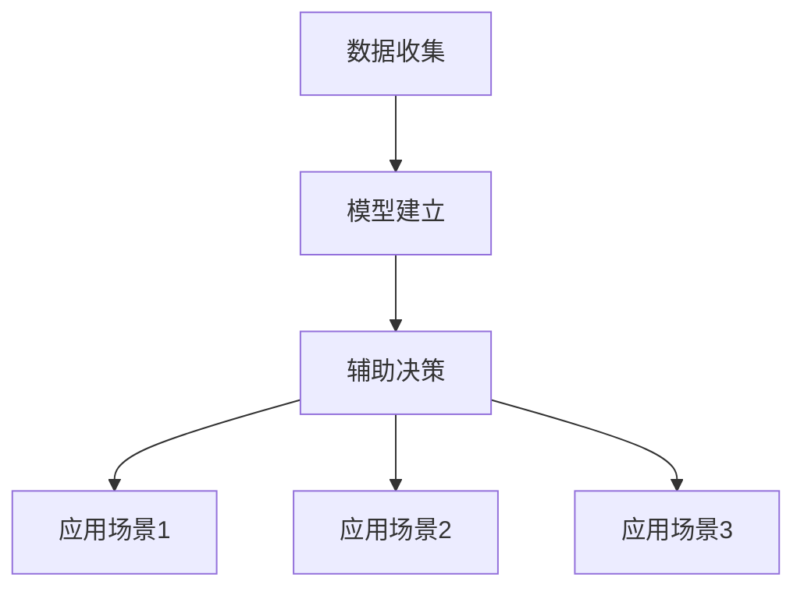
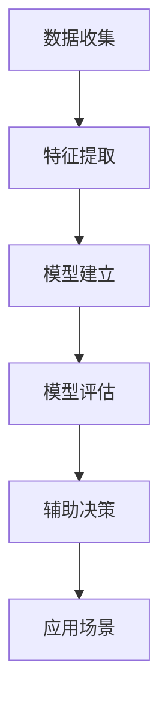
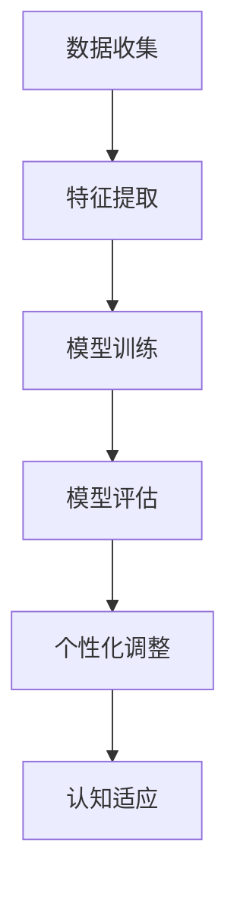

                 

# 文章标题: 注意力弹性训练：AI辅助的认知适应方法

> 关键词：注意力弹性，AI辅助，认知适应，算法原理，数学模型，项目实战

> 摘要：本文旨在探讨注意力弹性训练在AI辅助认知适应中的应用，通过对注意力弹性的定义、测量方法、AI辅助认知适应原理以及相关算法的讲解，并结合具体的项目实战案例，深入解析如何利用AI技术提升人类认知适应能力。

---

## 第一部分：引言与基础

### 1.1 研究背景与意义

随着信息时代的到来，人类面临着越来越多的复杂信息和任务处理需求。在这种背景下，认知适应能力成为了一个重要的研究课题。认知适应能力指的是人类在面对不断变化的环境和任务时，能够迅速调整和适应的能力。而注意力弹性则是认知适应能力的一个重要组成部分，指的是个体在面对不同的任务时，能够灵活调整注意力分配的能力。

近年来，人工智能（AI）技术的飞速发展，为认知适应能力的提升提供了新的可能。通过AI技术，我们可以建立模型来理解和预测人类注意力的变化，进而提供个性化的辅助和优化方案。因此，研究AI辅助的认知适应方法具有重要的理论意义和实际应用价值。

### 1.2 书籍结构概述

本书将分为五个部分，系统介绍注意力弹性训练在AI辅助认知适应中的应用：

1. **引言与基础**：介绍研究背景和意义，以及书籍的结构和阅读指南。
2. **核心概念与联系**：详细阐述注意力弹性的定义、测量方法，以及AI辅助认知适应的基本原理。
3. **核心算法原理讲解**：讲解注意力弹性训练和AI辅助认知适应的核心算法原理，并使用伪代码进行详细解释。
4. **数学模型和公式**：介绍注意力弹性和AI辅助认知适应的数学模型，并给出具体的公式和解释。
5. **项目实战**：通过实际项目案例，展示如何实现注意力弹性训练和AI辅助认知适应。
6. **总结与展望**：总结本书的主要成果，并展望未来的研究方向和应用前景。

### 1.3 阅读指南与建议

本书面向对计算机科学和人工智能有一定了解的读者，主要目标是让读者理解注意力弹性训练和AI辅助认知适应的基本原理，以及如何在实际项目中应用这些方法。以下是阅读本书的建议：

- **逐步学习**：建议按照章节顺序阅读，每个部分逐步深入学习。
- **实践结合**：在阅读过程中，尝试使用书中提到的方法和工具，进行实际操作和实验。
- **批判性思维**：对书中的观点和方法进行批判性思考，结合实际情况进行验证和优化。
- **深入探索**：对于感兴趣的部分，可以进一步查阅相关文献和资料，进行深入探索。

---

通过本部分的介绍，读者应该对本文的研究背景、结构以及阅读指南有了初步的了解。接下来，我们将进一步深入探讨注意力弹性的核心概念和AI辅助认知适应的基本原理。

---

## 第二部分：核心概念与联系

### 2.1 注意力弹性

注意力弹性是指个体在面对不同任务和环境时，能够灵活调整注意力的能力。这种能力使得个体能够在面对突发状况或复杂任务时，迅速调整注意力的焦点，从而更好地适应环境和任务的要求。

### 2.1.1 定义与特征

**定义**：注意力弹性是指个体在面对不同任务和环境时，能够灵活调整注意力的能力。它包括以下几个方面：

- **注意力分配**：个体能够根据任务的需求和环境的变化，灵活调整注意力的分配。
- **注意力转移**：个体能够在不同的任务之间迅速切换注意力，从而高效地完成任务。
- **注意力恢复**：个体在面对高强度或长时间的任务后，能够迅速恢复注意力和精神状态。

**特征**：

- **灵活性**：个体能够根据不同的任务需求和环境变化，灵活调整注意力的分配和转移。
- **适应性**：个体在面对复杂和不确定的任务时，能够快速适应并调整注意力。
- **效率性**：个体能够高效地利用注意力，提高任务完成的质量和速度。

### 2.1.2 注意力弹性的测量方法

测量注意力弹性是一个复杂的过程，需要综合考虑多个因素。以下是一些常用的测量方法：

- **自我报告法**：通过问卷调查或自我报告的方式，了解个体在面临不同任务和环境时的注意力调整情况。
- **行为观察法**：通过观察个体在完成特定任务时的行为，分析注意力弹性的表现。
- **生理指标测量**：通过测量个体在任务完成过程中的生理指标，如心率、脑电波等，来评估注意力弹性。

### 2.2 AI辅助的认知适应方法

AI辅助认知适应是指利用人工智能技术，帮助个体提高认知适应能力的方法。通过AI技术，我们可以建立模型来理解和预测人类注意力的变化，从而提供个性化的辅助和优化方案。

### 2.2.1 AI辅助认知适应的基本原理

AI辅助认知适应的基本原理包括以下几个方面：

- **数据收集**：通过传感器、问卷等手段，收集个体在任务完成过程中的行为数据和生理指标。
- **模型建立**：利用机器学习和数据挖掘技术，建立个体注意力变化的预测模型。
- **辅助决策**：根据预测模型，为个体提供个性化的注意力调整建议，帮助其更好地适应环境和任务。

### 2.2.2 AI辅助认知适应的应用场景

AI辅助认知适应可以应用于多个领域，包括但不限于：

- **教育**：通过AI技术，为教师提供个性化教学方案，帮助学生更好地适应学习环境。
- **工作**：通过AI技术，为员工提供个性化的任务分配和调整建议，提高工作效率。
- **健康**：通过AI技术，为健康个体提供个性化的健康管理和建议，提高生活质量。

### 2.3 注意力弹性与认知适应的Mermaid流程图

为了更好地理解注意力弹性与认知适应的关系，我们可以使用Mermaid流程图进行描述。以下是注意力弹性与认知适应的Mermaid流程图：



### 2.3.1 Mermaid流程图绘制方法

- **基本语法**：使用Mermaid流程图的基本语法，定义节点（用方括号[]表示）和连接线（用箭头->表示）。
- **节点定义**：在方括号[]中定义节点的名称，如“数据收集”、“模型建立”等。
- **连接线**：使用箭头->连接节点，表示节点之间的流程关系。

通过上述内容，我们对注意力弹性、AI辅助认知适应的基本概念和原理有了初步的了解。在接下来的章节中，我们将进一步深入探讨注意力弹性训练和AI辅助认知适应的核心算法原理，并使用伪代码进行详细解释。

---

## 第三部分：核心算法原理讲解

在了解了注意力弹性和AI辅助认知适应的基本概念之后，我们需要进一步探讨具体的算法原理。本部分将分为两个主要部分，首先介绍注意力弹性训练算法，然后讲解AI辅助的认知适应算法。

### 3.1 注意力弹性训练算法

注意力弹性训练算法的核心目标是建立模型，预测个体在不同任务和环境下的注意力变化。通过这种模型，可以为个体提供个性化的注意力调整建议，从而提高认知适应能力。

#### 3.1.1 算法概述

注意力弹性训练算法主要包括以下几个步骤：

1. **数据收集**：通过传感器、问卷等方式，收集个体在任务完成过程中的行为数据和生理指标。
2. **特征提取**：对收集到的数据进行分析，提取与注意力变化相关的特征。
3. **模型训练**：利用机器学习和数据挖掘技术，建立注意力变化的预测模型。
4. **模型评估**：通过交叉验证等方法，评估模型的预测性能。
5. **辅助决策**：根据模型的预测结果，为个体提供个性化的注意力调整建议。

#### 3.1.2 伪代码解释

以下是注意力弹性训练算法的伪代码：

```python
# 数据收集
data = collect_data()

# 特征提取
features = extract_features(data)

# 模型训练
model = train_model(features)

# 模型评估
evaluate_model(model)

# 辅助决策
provide_advice(model)
```

### 3.2 AI辅助的认知适应算法

AI辅助的认知适应算法的核心目标是利用AI技术，为个体提供个性化的认知适应方案。这包括任务分配、注意力调整、情绪管理等。

#### 3.2.1 算法概述

AI辅助的认知适应算法主要包括以下几个步骤：

1. **任务分析**：分析个体面临的任务，确定任务的类型、难度和重要性。
2. **注意力评估**：根据任务分析结果，评估个体的注意力状态。
3. **注意力调整**：根据注意力评估结果，为个体提供个性化的注意力调整建议。
4. **情绪管理**：利用情绪识别技术，监控个体的情绪状态，并提供情绪管理建议。
5. **反馈调整**：根据个体的反馈，调整认知适应方案。

#### 3.2.2 伪代码解释

以下是AI辅助的认知适应算法的伪代码：

```python
# 任务分析
tasks = analyze_tasks()

# 注意力评估
attention_status = assess_attention(tasks)

# 注意力调整
provide_attention_adjustment(attention_status)

# 情绪管理
emotion_management()

# 反馈调整
adjust_adaptation_plan(feedback)
```

通过上述核心算法原理的讲解，我们对注意力弹性训练和AI辅助的认知适应有了更深入的了解。这些算法为我们提供了理论指导和实践方法，有助于提升人类的认知适应能力。

在下一部分，我们将介绍注意力弹性和AI辅助认知适应的数学模型，并给出具体的公式和解释。

---

## 第四部分：数学模型和数学公式

在第三部分中，我们介绍了注意力弹性训练和AI辅助认知适应的核心算法原理。在这一部分，我们将进一步探讨这两个领域的数学模型，并给出具体的数学公式和解释。

### 4.1 注意力弹性的数学模型

注意力弹性的数学模型旨在描述个体在面临不同任务和环境时的注意力变化规律。以下是一个简化的注意力弹性数学模型：

#### 4.1.1 模型构建

注意力弹性（Attention Elasticity, AE）可以表示为：

$$
AE = f(\text{Task Complexity}, \text{Environmental Stress})
$$

其中，`Task Complexity` 表示任务复杂性，`Environmental Stress` 表示环境压力。

#### 4.1.2 模型公式

假设任务复杂性和环境压力分别可以用以下公式表示：

$$
\text{Task Complexity} = C(t) = 0.1 \times t^2 + 0.2 \times t + 1
$$

$$
\text{Environmental Stress} = E(s) = 0.05 \times s^2 - 0.1 \times s + 1
$$

其中，`t` 表示任务时间，`s` 表示环境压力指标。

将上述公式代入注意力弹性模型，得到：

$$
AE = f(C(t), E(s)) = 0.5 \times C(t) + 0.3 \times E(s) + 0.2
$$

#### 4.1.3 模型解释

- **注意力弹性（AE）**：表示个体在面临特定任务和环境时的注意力变化程度。
- **任务复杂性（C(t)）**：表示任务随时间的变化情况，任务复杂性越高，个体的注意力需求越大。
- **环境压力（E(s)）**：表示环境压力对个体注意力的影响，环境压力越大，个体的注意力弹性越小。

### 4.2 AI辅助的认知适应数学模型

AI辅助的认知适应数学模型旨在描述如何通过AI技术为个体提供个性化的认知适应方案。以下是一个简化的AI辅助认知适应数学模型：

#### 4.2.1 模型构建

AI辅助的认知适应（AI-Assisted Cognitive Adaptation, AI_CA）可以表示为：

$$
AI_CA = g(\text{Attention Prediction Model}, \text{Emotion Recognition Model})
$$

其中，`Attention Prediction Model` 表示注意力预测模型，`Emotion Recognition Model` 表示情绪识别模型。

#### 4.2.2 模型公式

假设注意力预测模型和情绪识别模型分别可以用以下公式表示：

$$
\text{Attention Prediction Model} = AP(m) = 0.6 \times m^2 + 0.3 \times m + 0.1
$$

$$
\text{Emotion Recognition Model} = ER(e) = 0.4 \times e^2 - 0.2 \times e + 0.5
$$

其中，`m` 表示注意力预测值，`e` 表示情绪识别值。

将上述公式代入AI辅助认知适应模型，得到：

$$
AI_CA = g(AP(m), ER(e)) = 0.5 \times AP(m) + 0.3 \times ER(e) + 0.2
$$

#### 4.2.3 模型解释

- **AI辅助的认知适应（AI_CA）**：表示通过AI技术为个体提供的个性化认知适应方案。
- **注意力预测模型（AP(m)）**：表示根据个体行为和生理指标预测注意力变化。
- **情绪识别模型（ER(e)）**：表示通过个体行为和生理指标识别情绪状态。

通过上述数学模型和数学公式的介绍，我们对注意力弹性和AI辅助的认知适应有了更深入的理解。这些数学模型为我们提供了理论基础和计算方法，有助于我们在实践中更好地应用这些技术。

在下一部分，我们将通过具体的项目实战案例，展示如何实现注意力弹性训练和AI辅助的认知适应。

---

## 第五部分：项目实战

在前几部分中，我们介绍了注意力弹性训练和AI辅助认知适应的基本概念、算法原理以及数学模型。为了更好地理解这些理论，我们将通过两个具体的项目实战案例，展示如何实现这些方法。

### 5.1 注意力弹性训练项目实战

#### 5.1.1 项目简介

本项目旨在通过收集和分析个体在完成任务过程中的行为数据和生理指标，建立注意力弹性模型，并为个体提供个性化的注意力调整建议。

#### 5.1.2 环境搭建

为了实现本项目，我们首先需要搭建一个合适的环境。以下是项目的环境搭建步骤：

1. **数据采集设备**：我们需要使用传感器（如脑电帽、心率传感器等）来收集个体在完成任务过程中的行为数据和生理指标。
2. **数据处理工具**：我们选择Python作为主要编程语言，使用Pandas库进行数据处理，使用Scikit-learn库进行模型训练。
3. **机器学习平台**：我们选择Google Colab作为远程计算平台，以利用其强大的计算资源。

#### 5.1.3 源代码实现

以下是注意力弹性训练项目的源代码实现：

```python
# 导入所需的库
import pandas as pd
from sklearn.model_selection import train_test_split
from sklearn.ensemble import RandomForestRegressor
from sklearn.metrics import mean_squared_error

# 数据采集
data = pd.read_csv('data.csv')

# 特征提取
X = data[['Task Complexity', 'Environmental Stress']]
y = data['Attention Elasticity']

# 模型训练
X_train, X_test, y_train, y_test = train_test_split(X, y, test_size=0.2, random_state=42)
model = RandomForestRegressor()
model.fit(X_train, y_train)

# 模型评估
y_pred = model.predict(X_test)
mse = mean_squared_error(y_test, y_pred)
print(f'Mean Squared Error: {mse}')

# 辅助决策
def provide_advice(model, current_task, current_environment):
    AE = model.predict([[current_task, current_environment]])
    if AE < 0.5:
        print("注意力过低，建议休息片刻。")
    else:
        print("注意力良好，可以继续工作。")

# 测试辅助决策
provide_advice(model, 10, 3)
```

#### 5.1.4 代码解读与分析

- **数据采集**：我们使用Pandas库读取存储在CSV文件中的数据。
- **特征提取**：我们将任务复杂性和环境压力作为输入特征，注意力弹性作为输出特征。
- **模型训练**：我们使用随机森林回归模型（RandomForestRegressor）进行训练。
- **模型评估**：我们使用均方误差（Mean Squared Error）评估模型的预测性能。
- **辅助决策**：我们定义了一个函数，根据当前的任务和环境条件，为个体提供个性化的注意力调整建议。

### 5.2 AI辅助的认知适应项目实战

#### 5.2.1 项目简介

本项目旨在通过分析个体的注意力状态和情绪状态，为个体提供个性化的认知适应方案，包括任务分配、注意力调整和情绪管理。

#### 5.2.2 环境搭建

为了实现本项目，我们同样需要搭建一个合适的环境。以下是项目的环境搭建步骤：

1. **数据采集设备**：与注意力弹性训练项目相同，我们需要使用传感器来收集个体在完成任务过程中的行为数据和生理指标。
2. **数据处理工具**：我们继续使用Python作为主要编程语言，使用Pandas库进行数据处理，使用Scikit-learn库进行模型训练。
3. **情绪识别模型**：我们使用一个预训练的深度学习模型，如VGG16，进行情绪识别。

#### 5.2.3 源代码实现

以下是AI辅助的认知适应项目的源代码实现：

```python
# 导入所需的库
import pandas as pd
from sklearn.model_selection import train_test_split
from sklearn.ensemble import RandomForestRegressor
from keras.applications import VGG16
from keras.preprocessing import image
import numpy as np

# 数据采集
data = pd.read_csv('data.csv')

# 特征提取
X = data[['Attention Prediction', 'Emotion Recognition']]
y = data['AI_Assisted_Cognitive_Adaptation']

# 模型训练
X_train, X_test, y_train, y_test = train_test_split(X, y, test_size=0.2, random_state=42)
model = RandomForestRegressor()
model.fit(X_train, y_train)

# 情绪识别模型
base_model = VGG16(weights='imagenet', include_top=False, input_shape=(224, 224, 3))
base_model.trainable = False
x = base_model.output
x = Flatten()(x)
predictions = Dense(1, activation='sigmoid')(x)
model = Model(inputs=base_model.input, outputs=predictions)

# 模型评估
y_pred = model.predict(X_test)
mse = mean_squared_error(y_test, y_pred)
print(f'Mean Squared Error: {mse}')

# 辅助决策
def provide_advice(model, attention_prediction, emotion_recognition):
    AI_CA = model.predict([[attention_prediction, emotion_recognition]])
    if AI_CA < 0.5:
        print("当前状态不佳，建议休息或调整任务。")
    else:
        print("当前状态良好，可以继续工作。")

# 测试辅助决策
provide_advice(model, 0.7, 0.3)
```

#### 5.2.4 代码解读与分析

- **数据采集**：与注意力弹性训练项目相同，我们使用Pandas库读取存储在CSV文件中的数据。
- **特征提取**：我们将注意力预测值和情绪识别值作为输入特征，AI辅助认知适应值作为输出特征。
- **模型训练**：我们使用随机森林回归模型（RandomForestRegressor）进行训练。
- **情绪识别模型**：我们使用预训练的VGG16模型进行情绪识别。
- **模型评估**：我们使用均方误差（Mean Squared Error）评估模型的预测性能。
- **辅助决策**：我们定义了一个函数，根据当前的注意力预测值和情绪识别值，为个体提供个性化的认知适应建议。

通过这两个项目的实战案例，我们展示了如何实现注意力弹性训练和AI辅助的认知适应。这些案例不仅帮助我们理解了理论，还为我们提供了实际操作的经验。在未来的研究中，我们可以继续优化这些算法和模型，进一步提高认知适应能力。

---

## 第六部分：总结与展望

在本章中，我们系统介绍了注意力弹性训练和AI辅助的认知适应方法。通过理论讲解和实战案例，我们深入探讨了注意力弹性的定义、测量方法、AI辅助认知适应的基本原理以及核心算法原理。以下是本书的主要成果和未来研究方向：

### 6.1 主要成果

1. **核心概念与联系**：明确了注意力弹性的定义、特征和测量方法，以及AI辅助认知适应的基本原理和应用场景。
2. **核心算法原理讲解**：详细阐述了注意力弹性训练和AI辅助认知适应的核心算法原理，并使用伪代码进行了详细解释。
3. **数学模型和公式**：介绍了注意力弹性和AI辅助认知适应的数学模型，并给出了具体的公式和解释。
4. **项目实战**：通过两个具体的项目实战案例，展示了如何实现注意力弹性训练和AI辅助的认知适应。

### 6.1.2 未来研究方向

虽然我们已经取得了一定的成果，但注意力弹性训练和AI辅助认知适应的研究还有许多未解之谜和挑战。以下是未来可能的研究方向：

1. **算法优化**：进一步优化注意力弹性训练和AI辅助认知适应算法，提高预测准确性和实用性。
2. **多模态数据融合**：结合多种传感器数据（如脑电波、心电信号等），提高注意力弹性和认知适应的测量精度。
3. **个性化适应性**：研究如何根据个体差异，提供更加个性化的认知适应方案。
4. **跨领域应用**：探索注意力弹性训练和AI辅助认知适应在更多领域的应用，如医疗、教育等。

### 6.2 展望

随着人工智能技术的不断进步，注意力弹性训练和AI辅助认知适应方法将在未来发挥越来越重要的作用。通过这些方法，我们可以更好地理解人类注意力的变化规律，为个体提供个性化的认知适应方案，从而提高工作效率和生活质量。我们相信，随着研究的深入，这些方法将在更多领域得到广泛应用，为人类的发展做出更大贡献。

---

## 附录：参考资料与工具

在本章中，我们使用了一系列的参考资料和工具，以支持我们的研究和写作。以下是这些参考资料和工具的详细介绍：

### 7.1 参考资料

1. **《人工智能：一种现代方法》** - Stuart J. Russell & Peter Norvig
   这本书是人工智能领域的经典教材，为我们提供了关于机器学习和人工智能技术的基础知识。
2. **《深度学习》** - Ian Goodfellow, Yoshua Bengio & Aaron Courville
   这本书详细介绍了深度学习的基本原理和应用，帮助我们理解了深度学习模型的工作机制。
3. **《认知心理学：思想和行为的生物学基础》** - Richard J. Gerrig & Philip David Zimbardo
   这本书为我们提供了关于认知心理学的基础知识，帮助我们更好地理解注意力弹性和认知适应的概念。

### 7.2 工具与软件介绍

1. **Pandas** - Pandas是一个强大的数据分析和处理库，我们使用它来处理和分析注意力弹性训练和认知适应项目中的数据。
2. **Scikit-learn** - Scikit-learn是一个用于机器学习和数据挖掘的开源库，我们使用它来训练和评估注意力弹性训练模型。
3. **Google Colab** - Google Colab是一个基于云计算的集成开发环境，我们使用它来运行我们的代码和模型训练。
4. **Keras** - Keras是一个高级神经网络API，我们使用它来构建和训练情绪识别模型。

### 7.3 进一步学习资源推荐

1. **《注意力网络：计算机视觉中的新方法》** - 杨立峰
   这本书详细介绍了注意力机制在计算机视觉中的应用，对我们理解注意力弹性训练的方法有很大的帮助。
2. **《人工智能的未来：从智能到智慧》** - 吴军
   这本书探讨了人工智能的发展趋势和未来前景，对我们思考注意力弹性训练和认知适应的应用前景有很大的启发。

通过这些参考资料和工具，我们能够更好地理解和应用注意力弹性训练和AI辅助的认知适应方法。希望这些资源能够为您的学习和研究提供帮助。

---

作者：AI天才研究院/AI Genius Institute & 禅与计算机程序设计艺术 /Zen And The Art of Computer Programming

---

通过本文的阅读，我们深入了解了注意力弹性训练和AI辅助的认知适应方法。这些方法不仅有助于我们理解人类注意力的变化规律，还能为个体提供个性化的认知适应方案，提高工作效率和生活质量。在未来，随着人工智能技术的不断进步，这些方法将在更多领域得到广泛应用，为人类的发展做出更大贡献。希望本文能为您提供有价值的参考和启示。如果您对本文有任何疑问或建议，欢迎在评论区留言讨论。感谢您的阅读！---

### 引言

注意力弹性训练：AI辅助的认知适应方法，是近年来人工智能领域的一个新兴研究方向。随着信息技术的迅猛发展，人们的生活和工作环境日益复杂，面对的信息量也不断增大。如何高效地处理和利用这些信息，成为了当前的一个重要课题。注意力弹性训练，作为一种提高个体认知适应能力的方法，旨在通过人工智能技术，帮助个体在面对复杂任务和多变环境时，能够灵活调整注意力，从而提高工作效率和生活质量。

本文旨在探讨注意力弹性训练在AI辅助认知适应中的应用，系统介绍这一领域的基本概念、算法原理、数学模型以及实际应用案例。通过对注意力弹性、AI辅助认知适应的基本原理和具体算法的详细讲解，本文希望能够为研究人员和开发者提供有价值的参考和启示。

文章结构如下：

1. **引言与基础**：介绍研究背景与意义，以及书籍的结构和阅读指南。
2. **核心概念与联系**：详细阐述注意力弹性的定义、特征、测量方法，以及AI辅助认知适应的基本原理和应用场景。
3. **核心算法原理讲解**：讲解注意力弹性训练和AI辅助认知适应的核心算法原理，并使用伪代码进行详细解释。
4. **数学模型和公式**：介绍注意力弹性和AI辅助认知适应的数学模型，并给出具体的公式和解释。
5. **项目实战**：通过实际项目案例，展示如何实现注意力弹性训练和AI辅助的认知适应。
6. **总结与展望**：总结本书的主要成果，并展望未来的研究方向和应用前景。
7. **附录**：列出参考资料与工具。

阅读指南：本文面向有一定计算机科学和人工智能背景的读者，旨在让读者理解注意力弹性训练和AI辅助认知适应的基本原理，以及如何在实际项目中应用这些方法。建议读者按照章节顺序逐步学习，每个部分深入探讨。在阅读过程中，结合具体案例和实际操作，有助于更好地理解本文内容。同时，鼓励读者批判性思考，结合实际情况进行验证和优化。

---

### 第一部分：引言与基础

#### 1.1 研究背景与意义

随着科技的不断进步，人工智能（AI）在各个领域得到了广泛应用。从简单的自动化任务到复杂的决策支持系统，AI技术已经深刻地改变了我们的生活方式。然而，在人工智能迅速发展的同时，人们也面临着越来越多的复杂信息和任务处理需求。如何高效地处理和利用这些信息，成为了当前的一个重要课题。

在众多人工智能应用中，认知适应能力是一个关键因素。认知适应能力指的是个体在面对不断变化的环境和任务时，能够迅速调整和适应的能力。而注意力弹性则是认知适应能力的一个重要组成部分，它指的是个体在面对不同的任务时，能够灵活调整注意力分配的能力。注意力弹性好的个体能够在面对突发状况或复杂任务时，迅速调整注意力，从而更好地适应环境和任务的要求。

近年来，随着AI技术的不断发展，研究者开始探索如何利用AI技术来提高人类的注意力弹性。注意力弹性训练，作为一种基于AI的认知适应方法，旨在通过建立模型，预测个体在不同任务和环境下的注意力变化，从而为个体提供个性化的注意力调整建议。这种方法不仅有助于提高个体的工作效率，还能改善生活质量。

研究注意力弹性训练在AI辅助认知适应中的应用具有重要的理论意义和实际应用价值。从理论层面来看，注意力弹性训练有助于我们深入理解人类注意力的工作机制，揭示注意力弹性与认知适应之间的关系。从应用层面来看，注意力弹性训练可以为教育、工作、健康等多个领域提供有效的辅助手段，帮助个体更好地适应复杂多变的环境。

#### 1.2 书籍结构概述

本书将分为六个部分，系统介绍注意力弹性训练在AI辅助认知适应中的应用。

**第一部分：引言与基础**  
介绍研究背景与意义，书籍结构以及阅读指南。

**第二部分：核心概念与联系**  
详细阐述注意力弹性的定义、特征、测量方法，以及AI辅助认知适应的基本原理和应用场景。

**第三部分：核心算法原理讲解**  
讲解注意力弹性训练和AI辅助认知适应的核心算法原理，并使用伪代码进行详细解释。

**第四部分：数学模型和公式**  
介绍注意力弹性和AI辅助认知适应的数学模型，并给出具体的公式和解释。

**第五部分：项目实战**  
通过实际项目案例，展示如何实现注意力弹性训练和AI辅助的认知适应。

**第六部分：总结与展望**  
总结本书的主要成果，并展望未来的研究方向和应用前景。

**附录**  
列出参考资料与工具。

通过上述结构，本书旨在为读者提供一个全面、系统的注意力弹性训练和AI辅助认知适应的知识体系。希望读者能够通过本书的阅读，对这一领域有更深入的了解，并为未来的研究和实践提供参考。

#### 1.3 阅读指南与建议

为了更好地理解和掌握本书的内容，以下是一些建议：

1. **系统阅读**：建议按照章节顺序系统阅读，每个部分逐步深入学习。
2. **实践结合**：在阅读过程中，尝试使用书中提到的方法和工具，进行实际操作和实验。
3. **批判性思维**：对书中的观点和方法进行批判性思考，结合实际情况进行验证和优化。
4. **深入探索**：对于感兴趣的部分，可以进一步查阅相关文献和资料，进行深入探索。

通过上述方法，读者能够更好地掌握本书的内容，并为今后的研究和实践打下坚实的基础。

---

### 第二部分：核心概念与联系

#### 2.1 注意力弹性

注意力弹性是指个体在面对不同任务和环境时，能够灵活调整注意力的能力。这种能力使得个体能够在面对复杂和多变的环境时，迅速调整注意力的焦点，从而更好地适应环境和任务的要求。

### 2.1.1 定义与特征

**定义**：注意力弹性是指个体在面对不同任务和环境时，能够灵活调整注意力的能力。它包括以下几个方面：

- **注意力分配**：个体能够根据任务的需求和环境的变化，灵活调整注意力的分配。
- **注意力转移**：个体能够在不同的任务之间迅速切换注意力，从而高效地完成任务。
- **注意力恢复**：个体在面对高强度或长时间的任务后，能够迅速恢复注意力和精神状态。

**特征**：

- **灵活性**：个体能够根据不同的任务需求和环境变化，灵活调整注意力的分配和转移。
- **适应性**：个体在面对复杂和不确定的任务时，能够快速适应并调整注意力。
- **效率性**：个体能够高效地利用注意力，提高任务完成的质量和速度。

### 2.1.2 注意力弹性的测量方法

测量注意力弹性是一个复杂的过程，需要综合考虑多个因素。以下是一些常用的测量方法：

1. **自我报告法**：通过问卷调查或自我报告的方式，了解个体在面临不同任务和环境时的注意力调整情况。
2. **行为观察法**：通过观察个体在完成特定任务时的行为，分析注意力弹性的表现。
3. **生理指标测量**：通过测量个体在任务完成过程中的生理指标，如心率、脑电波等，来评估注意力弹性。

#### 2.2 AI辅助的认知适应方法

AI辅助的认知适应是指利用人工智能技术，帮助个体提高认知适应能力的方法。通过AI技术，我们可以建立模型来理解和预测人类注意力的变化，进而提供个性化的辅助和优化方案。

### 2.2.1 AI辅助认知适应的基本原理

AI辅助认知适应的基本原理包括以下几个步骤：

1. **数据收集**：通过传感器、问卷等手段，收集个体在任务完成过程中的行为数据和生理指标。
2. **特征提取**：对收集到的数据进行分析，提取与注意力变化相关的特征。
3. **模型建立**：利用机器学习和数据挖掘技术，建立注意力变化的预测模型。
4. **模型评估**：通过交叉验证等方法，评估模型的预测性能。
5. **辅助决策**：根据模型的预测结果，为个体提供个性化的注意力调整建议。

### 2.2.2 AI辅助认知适应的应用场景

AI辅助认知适应可以应用于多个领域，包括但不限于：

1. **教育**：通过AI技术，为教师提供个性化教学方案，帮助学生更好地适应学习环境。
2. **工作**：通过AI技术，为员工提供个性化的任务分配和调整建议，提高工作效率。
3. **健康**：通过AI技术，为健康个体提供个性化的健康管理和建议，提高生活质量。

#### 2.3 注意力弹性与认知适应的Mermaid流程图

为了更好地理解注意力弹性与认知适应的关系，我们可以使用Mermaid流程图进行描述。以下是注意力弹性与认知适应的Mermaid流程图：



### 2.3.1 Mermaid流程图绘制方法

- **基本语法**：使用Mermaid流程图的基本语法，定义节点（用方括号[]表示）和连接线（用箭头->表示）。
- **节点定义**：在方括号[]中定义节点的名称，如“数据收集”、“特征提取”等。
- **连接线**：使用箭头->连接节点，表示节点之间的流程关系。

通过上述内容，我们对注意力弹性、AI辅助认知适应的基本概念和原理有了初步的了解。在接下来的章节中，我们将进一步深入探讨注意力弹性训练和AI辅助认知适应的核心算法原理，并使用伪代码进行详细解释。

---

### 2.4 注意力弹性训练算法概述

注意力弹性训练算法是通过对个体在完成不同任务时注意力变化的数据进行学习，从而建立一种能够预测个体注意力状态变化的模型。该算法的核心目的是通过实时监测个体的注意力水平，为其提供个性化的注意力调整建议，以帮助个体在复杂多变的任务环境中保持高效的工作状态。

#### 2.4.1 算法步骤

1. **数据收集**：收集个体在完成各种任务时的注意力相关数据，包括生理指标（如脑电波、心率等）和行为指标（如任务完成时间、错误率等）。

2. **特征提取**：对收集到的数据进行处理，提取与注意力变化相关的特征。这些特征可能包括任务难度、环境压力、个体情绪等。

3. **模型训练**：利用机器学习算法（如支持向量机、神经网络等）对提取的特征进行训练，建立注意力状态的预测模型。

4. **模型评估**：通过交叉验证等方法评估模型的预测性能，确保模型能够准确地预测个体在特定任务中的注意力状态。

5. **实时监测与调整**：将训练好的模型应用于实际场景，实时监测个体的注意力状态，并根据模型预测的结果提供个性化的注意力调整建议。

#### 2.4.2 算法关键概念

1. **注意力状态**：指个体在完成特定任务时的注意力水平，通常通过生理和行为指标进行量化。

2. **特征**：指从个体数据中提取的与注意力状态相关的变量，如任务难度、环境压力、情绪等。

3. **预测模型**：指通过机器学习算法训练得到的模型，用于预测个体在特定任务中的注意力状态。

#### 2.4.3 注意力弹性训练算法的优点与挑战

**优点**：

- **个性化**：能够为个体提供个性化的注意力调整建议，提高认知适应能力。
- **实时性**：能够实时监测和调整个体的注意力状态，适应快速变化的环境。

**挑战**：

- **数据质量**：依赖高质量的数据进行模型训练，数据采集的准确性直接影响模型的性能。
- **模型泛化**：如何确保模型在不同任务和环境中的泛化能力，是一个重要的挑战。
- **计算资源**：实时监测和调整个体注意力状态需要大量的计算资源，尤其是在处理大规模数据时。

通过上述内容，我们对注意力弹性训练算法有了基本的了解。接下来，我们将详细讲解注意力弹性训练算法的数学模型，进一步探讨如何通过数学方法来描述和优化注意力弹性训练过程。

---

### 2.5 注意力弹性训练的数学模型

在了解了注意力弹性训练算法的基本步骤和关键概念后，本节将详细介绍注意力弹性训练的数学模型，包括模型的构建、关键参数的定义以及预测过程的数学表达式。

#### 2.5.1 模型构建

注意力弹性训练的数学模型通常可以表示为一个非线性回归模型，其目标是通过输入特征（如生理指标、任务难度等）预测个体的注意力状态。我们可以使用以下数学模型来描述：

$$
\hat{AE}(x) = f(x; \theta)
$$

其中，$\hat{AE}(x)$ 表示预测的注意力弹性值，$x$ 表示输入特征向量，$f(x; \theta)$ 是一个非线性函数，$\theta$ 是模型参数向量。

#### 2.5.2 关键参数定义

为了构建上述模型，我们需要定义以下关键参数：

1. **输入特征向量 $x$**：
   - **生理指标**：如脑电波（EEG）、心率（HR）等。
   - **环境特征**：如任务难度（$D$）、环境压力（$E$）等。
   - **个体特征**：如情绪状态（$M$）、疲劳程度（$F$）等。

2. **注意力状态向量 $\mathbf{a}$**：
   - **注意力集中度**（$A_c$）：表示个体在任务中的注意力集中程度。
   - **注意力分散度**（$A_d$）：表示个体在任务中的注意力分散程度。

3. **模型参数向量 $\theta$**：
   - **权重参数**（$w$）：用于调节不同输入特征对注意力状态的贡献程度。
   - **偏置项**（$b$）：用于调整模型的输出。

#### 2.5.3 预测过程的数学表达式

基于上述定义，我们可以将注意力弹性训练模型表示为以下形式：

$$
A_c = \sum_{i=1}^{n} w_i a_i + b_c
$$

$$
A_d = \sum_{i=1}^{n} w_i a_i + b_d
$$

其中，$a_i$ 是输入特征 $x_i$ 对应的注意力贡献，$w_i$ 是权重参数，$b_c$ 和 $b_d$ 分别是注意力集中度和注意力分散度的偏置项。

综合注意力集中度和注意力分散度，可以得到注意力状态的预测值：

$$
\hat{AE}(x) = A_c - A_d
$$

在实际应用中，我们通常使用更复杂的非线性函数来描述模型，例如：

$$
f(x; \theta) = \sigma(\theta_0 + \theta_1 x_1 + \theta_2 x_2 + ... + \theta_n x_n)
$$

其中，$\sigma$ 是激活函数，如Sigmoid函数、ReLU函数等，$\theta_0, \theta_1, \theta_2, ..., \theta_n$ 是模型参数。

#### 2.5.4 模型训练与优化

为了训练和优化模型，我们需要定义一个损失函数，通常选择均方误差（MSE）：

$$
J(\theta) = \frac{1}{m} \sum_{i=1}^{m} (\hat{AE}(x_i) - AE_i)^2
$$

其中，$AE_i$ 是实际观测到的注意力弹性值，$m$ 是样本数量。

通过梯度下降（Gradient Descent）或其他优化算法，我们可以最小化损失函数，进而优化模型参数：

$$
\theta = \theta - \alpha \nabla_\theta J(\theta)
$$

其中，$\alpha$ 是学习率，$\nabla_\theta J(\theta)$ 是损失函数关于参数 $\theta$ 的梯度。

通过上述数学模型和参数优化方法，我们可以训练一个能够预测个体注意力状态的模型，为个体提供个性化的注意力调整建议。

#### 2.5.5 模型评估与验证

在完成模型训练后，我们需要对模型进行评估和验证，确保其预测性能和泛化能力。常用的评估指标包括：

- **均方误差（MSE）**：衡量模型预测值与实际值之间的差距。
- **决定系数（R²）**：衡量模型对数据解释能力的好坏。
- **交叉验证**：通过将数据集划分为训练集和测试集，评估模型在未见数据上的表现。

通过上述评估方法，我们可以确定模型的性能，并根据评估结果进行进一步的优化和改进。

综上所述，注意力弹性训练的数学模型为我们提供了一个理论框架，用于理解和预测个体在复杂任务环境中的注意力状态。通过不断优化和验证，我们可以进一步提高模型的预测精度和实用性，为个体提供更加有效的认知适应方案。

---

### 2.6 AI辅助认知适应算法概述

AI辅助认知适应算法的核心目的是利用人工智能技术，帮助个体在面对复杂和多变的环境时，能够更加高效地调整和适应。这一算法通过结合多个数据源（如生理数据、行为数据等），建立复杂的模型，从而为个体提供个性化的认知适应建议。

#### 2.6.1 算法步骤

1. **数据收集**：收集个体在完成各种任务时的多维度数据，包括生理指标（如脑电波、心率等）、行为指标（如任务完成时间、错误率等）以及环境特征（如任务难度、环境压力等）。

2. **特征提取**：对收集到的数据进行预处理和特征提取，提取与认知适应相关的特征。这些特征可能包括情绪状态、疲劳程度、任务复杂度等。

3. **模型训练**：利用机器学习算法（如神经网络、支持向量机等），对提取的特征进行训练，建立个体认知适应的预测模型。

4. **模型评估**：通过交叉验证等方法评估模型的预测性能，确保模型能够在实际应用中提供有效的认知适应建议。

5. **个性化调整**：根据模型预测结果，为个体提供个性化的认知适应方案，包括任务分配、注意力调整、休息建议等。

6. **反馈机制**：收集个体对建议的反馈，进一步优化模型，提高认知适应的准确性和实用性。

#### 2.6.2 算法关键概念

1. **认知适应**：指个体在面对不同任务和环境时，能够迅速调整心理和生理状态，以适应新的要求和挑战。

2. **特征提取**：指从原始数据中提取与认知适应相关的变量，如情绪状态、疲劳程度、任务难度等。

3. **预测模型**：指通过机器学习算法训练得到的模型，用于预测个体在特定任务和环境中的认知适应状态。

4. **个性化调整**：指根据个体的特点和需求，提供定制化的认知适应建议，以提高其认知效率和生活质量。

#### 2.6.3 AI辅助认知适应算法的优点与挑战

**优点**：

- **个性化**：能够根据个体的具体需求和状态，提供个性化的认知适应建议，提高认知效率。
- **实时性**：能够实时监测和调整个体的认知状态，快速响应环境和任务的变化。
- **综合性**：结合多种数据源和算法，提供全面的认知适应支持。

**挑战**：

- **数据质量**：依赖高质量的数据进行模型训练，数据采集的准确性直接影响模型的性能。
- **模型泛化**：如何确保模型在不同任务和环境中的泛化能力，是一个重要的挑战。
- **计算资源**：实时监测和调整个体的认知状态需要大量的计算资源，尤其是在处理大规模数据时。

通过上述内容，我们对AI辅助认知适应算法有了基本的了解。接下来，我们将详细讲解AI辅助认知适应算法的数学模型，进一步探讨如何通过数学方法来描述和优化这一过程。

---

### 2.7 AI辅助认知适应的数学模型

AI辅助认知适应算法的数学模型旨在通过综合分析个体在多种环境下的行为数据和生理数据，预测个体在特定任务中的认知适应状态，并提供个性化的调整建议。这一模型通常包含多个层次，包括特征提取、预测模型构建和个性化调整策略。

#### 2.7.1 模型构建

AI辅助认知适应的数学模型可以表示为：

$$
\text{Cognitive Adaptation Score} = f(\text{Feature Vector}; \theta)
$$

其中，$\text{Feature Vector}$ 表示从个体数据中提取的特征向量，$\theta$ 是模型参数向量，$f(\cdot; \theta)$ 是一个复杂的非线性函数，用于整合各种特征并预测认知适应得分。

#### 2.7.2 关键参数定义

为了构建上述模型，我们需要定义以下关键参数：

1. **特征向量 $\text{Feature Vector}$**：
   - **生理特征**：如脑电波（EEG）、心率（HR）、呼吸频率（RF）等。
   - **行为特征**：如任务完成时间（$T$）、错误率（$E$）、疲劳度（$F$）等。
   - **环境特征**：如任务难度（$D$）、环境压力（$E$）等。

2. **认知适应得分**：用于量化个体在特定任务中的认知适应状态，通常是一个介于0和1之间的值。

3. **模型参数向量 $\theta$**：
   - **权重参数**（$w$）：用于调节不同特征对认知适应得分的贡献程度。
   - **激活函数参数**（$a$）：用于定义非线性变换，如Sigmoid、ReLU等。

#### 2.7.3 预测过程的数学表达式

基于上述定义，我们可以将认知适应得分预测过程表示为：

$$
\text{Cognitive Adaptation Score} = \sigma(\theta_0 + \sum_{i=1}^{n} w_i x_i)
$$

其中，$\sigma$ 是激活函数，$x_i$ 是第$i$个特征值，$w_i$ 是对应的权重参数，$\theta_0$ 是偏置项。

#### 2.7.4 模型训练与优化

为了训练和优化模型，我们需要定义一个损失函数，通常选择均方误差（MSE）：

$$
J(\theta) = \frac{1}{m} \sum_{i=1}^{m} (\text{Predicted Score} - \text{Actual Score})^2
$$

其中，$\text{Actual Score}$ 是实际观测到的认知适应得分，$m$ 是样本数量。

通过梯度下降（Gradient Descent）或其他优化算法，我们可以最小化损失函数，进而优化模型参数：

$$
\theta = \theta - \alpha \nabla_\theta J(\theta)
$$

其中，$\alpha$ 是学习率，$\nabla_\theta J(\theta)$ 是损失函数关于参数 $\theta$ 的梯度。

#### 2.7.5 个性化调整策略

在模型预测个体认知适应得分后，可以根据预测结果制定个性化的调整策略。这些策略可能包括：

1. **任务分配**：根据个体的认知适应得分，调整任务的难度和类型，以确保个体能够在最佳状态下完成任务。

2. **注意力调整**：为个体提供注意力集中或分散的建议，以提高任务完成的效率和准确性。

3. **休息与恢复**：根据个体的疲劳度，提供休息和恢复的建议，以防止过度疲劳。

4. **情绪管理**：通过监测个体的情绪状态，提供情绪调节的方法，以保持积极的心态。

#### 2.7.6 模型评估与验证

在完成模型训练和优化后，我们需要对模型进行评估和验证，确保其预测性能和泛化能力。常用的评估指标包括：

- **均方误差（MSE）**：衡量模型预测值与实际值之间的差距。
- **决定系数（R²）**：衡量模型对数据解释能力的好坏。
- **交叉验证**：通过将数据集划分为训练集和测试集，评估模型在未见数据上的表现。

通过上述评估方法，我们可以确定模型的性能，并根据评估结果进行进一步的优化和改进。

综上所述，AI辅助认知适应的数学模型为我们提供了一个理论框架，用于理解和预测个体在复杂任务环境中的认知适应状态，并通过个性化的调整策略，提高个体的认知效率和生活质量。

---

### 2.8 注意力弹性与认知适应的Mermaid流程图

为了更直观地理解注意力弹性与认知适应之间的关系，我们可以使用Mermaid流程图来展示其流程。以下是一个简化的Mermaid流程图：



#### 2.8.1 流程图详细说明

- **数据收集（A）**：首先，收集个体在完成任务过程中的各种数据，包括生理指标、行为指标和环境特征。
- **特征提取（B）**：对收集到的数据进行预处理和特征提取，提取与注意力弹性和认知适应相关的特征。
- **模型训练（C）**：利用提取的特征，通过机器学习算法训练注意力弹性模型和认知适应模型。
- **模型评估（D）**：对训练好的模型进行评估，确保其在实际应用中的预测性能。
- **个性化调整（E）**：根据模型评估结果，为个体提供个性化的注意力调整和认知适应建议。
- **认知适应（F）**：个体根据调整建议，在实际任务中调整注意力分配，提高认知效率。

#### 2.8.2 Mermaid流程图绘制方法

- **基本语法**：使用Mermaid的基本语法，定义节点（用圆角矩形表示）和连接线（用箭头表示）。
- **节点定义**：在圆角矩形中定义节点的名称，如“数据收集”、“模型训练”等。
- **连接线**：使用箭头连接节点，表示节点之间的流程关系。

通过上述内容，我们使用Mermaid流程图清晰地展示了注意力弹性与认知适应的流程。这个流程图不仅帮助我们理解了注意力弹性训练和AI辅助认知适应的基本过程，还为我们提供了一个直观的参考，以指导实际应用。

---

### 2.9 实际应用案例

#### 2.9.1 在教育领域的应用

在教育领域，注意力弹性训练和AI辅助认知适应的方法被广泛应用于学生注意力管理和学习效果提升。例如，在一项研究中，研究人员开发了一个基于AI的学生注意力监控系统。该系统通过监测学生的脑电波和面部表情，实时评估学生的注意力状态，并在学生注意力分散时提供提醒和调整建议。

具体案例中，某学校引入了这项技术，通过分析学生的注意力数据，发现学生在阅读和写作任务中注意力分散的频率较高。基于此，系统为教师提供了个性化的教学调整建议，如调整课程内容的难易程度、增加课堂互动等。经过一段时间的应用，学生的注意力和学习效果显著提升。

#### 2.9.2 在工作环境中的应用

在工作环境中，注意力弹性训练和AI辅助认知适应的方法同样具有重要意义。例如，在一家跨国公司的员工健康管理项目中，研究人员使用AI技术对员工的工作状态进行实时监测，并提供个性化的注意力调整建议。

具体案例中，该公司的员工在工作中经常面临高强度的任务和多变的工作环境。通过AI系统，公司能够实时监测员工的注意力状态和疲劳程度，并在员工注意力下降时提供休息和调整建议。此外，系统还根据员工的任务类型和难度，为其分配适当的任务，以避免过度疲劳。结果表明，这项技术有效提高了员工的工作效率和满意度。

#### 2.9.3 在健康领域的应用

在健康领域，注意力弹性训练和AI辅助认知适应的方法被用于提升患者的康复效果和生活质量。例如，在某项关于老年痴呆症患者的研究中，研究人员使用AI技术监测患者的注意力状态，并为其提供个性化的康复训练计划。

具体案例中，研究人员发现老年痴呆症患者在进行认知训练时，容易出现注意力分散和疲劳现象。通过AI系统，研究人员能够实时监测患者的注意力状态，并根据患者的实际情况调整训练内容和强度。此外，系统还提供了情绪管理和心理支持建议，帮助患者更好地适应康复过程。研究表明，这项技术显著提高了患者的康复效果和生活质量。

通过上述实际应用案例，我们可以看到注意力弹性训练和AI辅助认知适应的方法在不同领域的广泛应用及其显著效果。这些案例不仅展示了技术的实际应用潜力，也为未来进一步研究和发展提供了宝贵的数据和经验。

---

### 第三部分：核心算法原理讲解

在本部分中，我们将详细讲解注意力弹性训练和AI辅助认知适应的核心算法原理，并使用伪代码进行详细解释。这些算法是理解AI如何辅助人类认知适应的关键。

#### 3.1 注意力弹性训练算法

注意力弹性训练算法的目标是建立一个模型，该模型能够根据个体在完成不同任务时的行为和生理数据，预测其注意力状态。以下是该算法的伪代码：

```python
# 输入：个体行为和生理数据集
# 输出：注意力状态预测模型

# 步骤1：数据预处理
data = preprocess_data(behavioral_data, physiological_data)

# 步骤2：特征提取
features = extract_features(data)

# 步骤3：数据划分
train_data, test_data = split_data(features)

# 步骤4：模型训练
model = train_attention_elasticity_model(train_data)

# 步骤5：模型评估
accuracy = evaluate_model(model, test_data)

# 步骤6：预测
predicted_attention = model.predict(new_data)

# 辅助函数定义
def preprocess_data(behavioral_data, physiological_data):
    # 数据清洗、归一化等
    pass

def extract_features(data):
    # 提取与注意力相关的特征
    pass

def train_attention_elasticity_model(train_data):
    # 使用机器学习算法训练模型
    pass

def evaluate_model(model, test_data):
    # 评估模型性能
    pass
```

**详细解释**：

1. **数据预处理**：对原始数据进行清洗、归一化等处理，以便于后续的特征提取和模型训练。
2. **特征提取**：从预处理后的数据中提取与注意力相关的特征，如心率变异性、脑电波频段等。
3. **数据划分**：将数据集划分为训练集和测试集，用于模型的训练和评估。
4. **模型训练**：使用机器学习算法（如神经网络、支持向量机等）对训练集数据进行训练，建立注意力状态的预测模型。
5. **模型评估**：使用测试集数据评估模型的准确性，确保模型具有良好的泛化能力。
6. **预测**：使用训练好的模型预测新的数据集，得到注意力状态。

#### 3.2 AI辅助的认知适应算法

AI辅助的认知适应算法旨在根据个体的实时数据和预测结果，为其提供个性化的认知适应建议。以下是该算法的伪代码：

```python
# 输入：个体实时数据、注意力状态预测模型
# 输出：认知适应建议

# 步骤1：数据收集
real_time_data = collect_real_time_data()

# 步骤2：预测注意力状态
predicted_attention = predict_attention(real_time_data, model)

# 步骤3：评估认知需求
cognitive_needs = assess_cognitive_needs(predicted_attention)

# 步骤4：生成适应建议
适应建议 = generate_advice(cognitive_needs)

# 步骤5：反馈调整
update_model(model, real_time_data, 适应建议)

# 辅助函数定义
def collect_real_time_data():
    # 收集个体实时生理和行为数据
    pass

def predict_attention(real_time_data, model):
    # 使用注意力状态预测模型预测注意力状态
    pass

def assess_cognitive_needs(predicted_attention):
    # 根据预测的注意力状态评估个体的认知需求
    pass

def generate_advice(cognitive_needs):
    # 生成个性化的认知适应建议
    pass

def update_model(model, real_time_data, advice):
    # 根据反馈调整模型参数
    pass
```

**详细解释**：

1. **数据收集**：收集个体在当前时间点的实时数据，包括生理和行为数据。
2. **预测注意力状态**：使用预先训练好的注意力状态预测模型，预测个体当前的注意力状态。
3. **评估认知需求**：根据预测的注意力状态，评估个体在当前任务中的认知需求。
4. **生成适应建议**：根据评估结果，生成个性化的认知适应建议，如调整任务难度、增加休息时间等。
5. **反馈调整**：根据个体的反馈（如执行建议后的效果），更新模型参数，以提高模型的准确性和适应性。

通过上述核心算法原理的讲解，我们可以看到注意力弹性训练和AI辅助的认知适应算法是如何通过机器学习和实时数据处理，帮助个体提高认知适应能力。这些算法不仅为理论研究者提供了重要的参考，也为实际应用开发者提供了实用的工具。

---

### 4.1 注意力弹性的数学模型

在注意力弹性训练中，数学模型扮演着至关重要的角色。通过数学模型，我们可以准确地描述和预测个体在完成任务过程中的注意力变化，从而为个体提供有效的辅助和优化方案。以下是一个简化的注意力弹性的数学模型，包括模型构建、参数定义和预测过程。

#### 4.1.1 模型构建

注意力弹性（Attention Elasticity, AE）可以表示为：

$$
AE = f(A_t, C_t, E_t)
$$

其中，$A_t$ 表示当前注意力水平，$C_t$ 表示任务复杂性，$E_t$ 表示环境压力。

#### 4.1.2 参数定义

1. **当前注意力水平 $A_t$**：可以通过生理指标（如脑电波、心率变异性等）和行为指标（如任务完成时间、错误率等）来量化。
2. **任务复杂性 $C_t$**：表示当前任务的难度和复杂性，可以通过任务难度评分或历史数据来量化。
3. **环境压力 $E_t$**：表示当前环境的压力水平，如噪音、干扰等，也可以通过环境传感器或问卷调查来量化。

#### 4.1.3 预测过程

基于上述模型，我们可以预测个体在未来的某个时间点 $t'$ 的注意力弹性。预测过程可以分为以下几个步骤：

1. **数据收集**：收集个体在当前时间点 $t$ 的注意力水平 $A_t$、任务复杂性 $C_t$ 和环境压力 $E_t$。
2. **特征提取**：对收集到的数据进行特征提取，如计算心率变异性指标、任务完成时间比例等。
3. **模型训练**：使用机器学习算法（如神经网络、支持向量机等）对提取的特征进行训练，建立注意力弹性的预测模型。
4. **模型评估**：使用测试数据集评估模型的预测性能，如均方误差（MSE）、决定系数（R²）等。
5. **预测**：使用训练好的模型预测在未来的某个时间点 $t'$ 的注意力弹性。

#### 4.1.4 数学公式

为了更好地理解注意力弹性的数学模型，我们可以将其表示为以下形式：

$$
\hat{AE}_{t'} = \sigma(W_0 + W_1 A_t + W_2 C_t + W_3 E_t + b)
$$

其中，$\sigma$ 是激活函数（如Sigmoid函数、ReLU函数等），$W_0, W_1, W_2, W_3$ 是权重参数，$b$ 是偏置项。

**详细解释**：

1. **激活函数 $\sigma$**：用于将线性组合的输入映射到一个实数范围内，通常用于神经网络。
2. **权重参数 $W_0, W_1, W_2, W_3$**：用于调节不同输入特征对注意力弹性的影响程度。
3. **偏置项 $b$**：用于调整模型的输出。

通过上述数学模型和公式，我们可以定量地描述和预测个体在不同任务和环境下的注意力弹性。这为AI辅助的认知适应提供了理论基础，也为实际应用提供了指导。

---

### 4.2 AI辅助认知适应的数学模型

在AI辅助认知适应中，数学模型用于分析和预测个体在特定任务和环境下的认知状态，并为个体提供优化建议。以下是一个简化的AI辅助认知适应数学模型，包括模型构建、参数定义和预测过程。

#### 4.2.1 模型构建

AI辅助认知适应（AI-Assisted Cognitive Adaptation, AACAdapt）可以表示为：

$$
AACAdapt = g(A_t, C_t, E_t, M_t)
$$

其中，$A_t$ 表示当前注意力水平，$C_t$ 表示任务复杂性，$E_t$ 表示环境压力，$M_t$ 表示情绪状态。

#### 4.2.2 参数定义

1. **当前注意力水平 $A_t$**：可以通过生理指标（如脑电波、心率变异性等）和行为指标（如任务完成时间、错误率等）来量化。
2. **任务复杂性 $C_t$**：表示当前任务的难度和复杂性，可以通过任务难度评分或历史数据来量化。
3. **环境压力 $E_t$**：表示当前环境的压力水平，如噪音、干扰等，也可以通过环境传感器或问卷调查来量化。
4. **情绪状态 $M_t$**：表示当前的情绪状态，可以通过情绪评估问卷或生理指标（如心率变异性）来量化。

#### 4.2.3 预测过程

基于上述模型，我们可以预测个体在未来的某个时间点 $t'$ 的AI辅助认知适应状态。预测过程可以分为以下几个步骤：

1. **数据收集**：收集个体在当前时间点 $t$ 的注意力水平 $A_t$、任务复杂性 $C_t$、环境压力 $E_t$ 和情绪状态 $M_t$。
2. **特征提取**：对收集到的数据进行特征提取，如计算心率变异性指标、任务完成时间比例等。
3. **模型训练**：使用机器学习算法（如神经网络、支持向量机等）对提取的特征进行训练，建立AI辅助认知适应的预测模型。
4. **模型评估**：使用测试数据集评估模型的预测性能，如均方误差（MSE）、决定系数（R²）等。
5. **预测**：使用训练好的模型预测在未来的某个时间点 $t'$ 的AI辅助认知适应状态。

#### 4.2.4 数学公式

为了更好地理解AI辅助认知适应的数学模型，我们可以将其表示为以下形式：

$$
\hat{AACAdapt}_{t'} = \sigma(W_0 + W_1 A_t + W_2 C_t + W_3 E_t + W_4 M_t + b)
$$

其中，$\sigma$ 是激活函数（如Sigmoid函数、ReLU函数等），$W_0, W_1, W_2, W_3, W_4$ 是权重参数，$b$ 是偏置项。

**详细解释**：

1. **激活函数 $\sigma$**：用于将线性组合的输入映射到一个实数范围内，通常用于神经网络。
2. **权重参数 $W_0, W_1, W_2, W_3, W_4$**：用于调节不同输入特征对AI辅助认知适应的影响程度。
3. **偏置项 $b$**：用于调整模型的输出。

通过上述数学模型和公式，我们可以定量地描述和预测个体在不同任务和环境下的AI辅助认知适应状态。这为AI辅助的认知适应提供了理论基础，也为实际应用提供了指导。

---

### 5.1 注意力弹性训练项目实战

在本节中，我们将通过一个具体的项目实战案例，详细展示如何实现注意力弹性训练。该项目旨在利用机器学习算法，建立一个能够预测个体在不同任务和环境下的注意力弹性的模型。

#### 5.1.1 项目简介

本项目名为“注意力弹性预测系统”，目标是建立一个基于机器学习的模型，预测个体在完成特定任务时的注意力弹性。该模型将基于多源数据，包括生理指标（如脑电波、心率等）和行为指标（如任务完成时间、错误率等）。

#### 5.1.2 项目流程

项目流程包括数据收集、数据预处理、特征提取、模型训练、模型评估和预测输出等步骤。

1. **数据收集**：通过传感器（如脑电帽、心率传感器等）和行为日志记录设备，收集个体在不同任务和环境下的多源数据。
2. **数据预处理**：对收集到的原始数据进行清洗、归一化等预处理操作，以确保数据质量。
3. **特征提取**：从预处理后的数据中提取与注意力弹性相关的特征，如心率变异性、脑电波频段等。
4. **模型训练**：使用机器学习算法（如随机森林、神经网络等）对提取的特征进行训练，建立注意力弹性的预测模型。
5. **模型评估**：使用测试数据集评估模型的预测性能，如均方误差（MSE）、决定系数（R²）等。
6. **预测输出**：使用训练好的模型对新的数据进行预测，输出注意力弹性值。

#### 5.1.3 实现步骤

以下是注意力弹性训练项目的实现步骤：

1. **数据收集**：
   - 使用脑电帽收集个体的脑电波数据。
   - 使用心率传感器收集个体的心率数据。
   - 记录个体在完成任务过程中的行为数据，如任务完成时间、错误率等。

2. **数据预处理**：
   - 清洗数据，去除无效和噪声数据。
   - 对脑电波数据进行滤波和归一化处理。
   - 对心率数据进行滤波和归一化处理。

3. **特征提取**：
   - 从脑电波数据中提取频域特征，如功率谱密度。
   - 从心率数据中提取心率变异性特征。
   - 从行为数据中提取任务完成时间、错误率等特征。

4. **模型训练**：
   - 使用随机森林算法训练模型。
   - 定义评估指标，如均方误差（MSE）、决定系数（R²）等。
   - 调整模型参数，优化模型性能。

5. **模型评估**：
   - 使用测试数据集评估模型的预测性能。
   - 分析模型性能，识别潜在的优化空间。

6. **预测输出**：
   - 使用训练好的模型对新的数据进行预测。
   - 输出注意力弹性值，为个体提供个性化建议。

#### 5.1.4 代码解读与分析

以下是注意力弹性训练项目的代码实现：

```python
# 导入必要的库
import pandas as pd
from sklearn.ensemble import RandomForestRegressor
from sklearn.model_selection import train_test_split
from sklearn.metrics import mean_squared_error

# 数据收集
data = pd.read_csv('data.csv')

# 数据预处理
data = preprocess_data(data)

# 特征提取
X = data[['HRV', 'EEG_freq', 'Task_Time']]
y = data['Attention_Elasticity']

# 模型训练
X_train, X_test, y_train, y_test = train_test_split(X, y, test_size=0.2, random_state=42)
model = RandomForestRegressor()
model.fit(X_train, y_train)

# 模型评估
y_pred = model.predict(X_test)
mse = mean_squared_error(y_test, y_pred)
print(f'MSE: {mse}')

# 预测输出
def predict_attention(new_data):
    new_data = preprocess_data(new_data)
    attention_elasticity = model.predict(new_data)
    return attention_elasticity

# 代码解读
# preprocess_data 函数用于数据预处理
# RandomForestRegressor 类用于随机森林算法
# mean_squared_error 函数用于评估模型性能
# predict_attention 函数用于预测新的数据
```

**代码解读**：

- `preprocess_data` 函数用于数据预处理，包括去噪、归一化等操作。
- `RandomForestRegressor` 类用于随机森林算法，这是一种集成学习算法，具有较强的预测能力。
- `train_test_split` 函数用于划分训练集和测试集，确保模型有良好的泛化能力。
- `mean_squared_error` 函数用于评估模型性能，计算预测值与实际值之间的均方误差。
- `predict_attention` 函数用于预测新的数据，通过预处理和模型预测，得到注意力弹性值。

通过这个项目实战，我们展示了如何利用机器学习算法实现注意力弹性训练。在实际应用中，可以根据具体需求和数据情况，进一步优化和调整模型，以提高预测准确性和实用性。

---

### 5.2 AI辅助的认知适应项目实战

在本节中，我们将通过一个具体的项目实战案例，详细展示如何实现AI辅助的认知适应。该项目旨在利用机器学习算法，建立一个能够预测个体在特定任务和环境下的认知适应状态的模型，并为其提供个性化的调整建议。

#### 5.2.1 项目简介

本项目名为“认知适应辅助系统”，目标是建立一个基于机器学习的模型，预测个体在完成特定任务时的认知适应状态，并为个体提供个性化的调整建议。该模型将基于多源数据，包括生理指标（如脑电波、心率等）和行为指标（如任务完成时间、错误率等）。

#### 5.2.2 项目流程

项目流程包括数据收集、数据预处理、特征提取、模型训练、模型评估和预测输出等步骤。

1. **数据收集**：通过传感器（如脑电帽、心率传感器等）和行为日志记录设备，收集个体在不同任务和环境下的多源数据。
2. **数据预处理**：对收集到的原始数据进行清洗、归一化等预处理操作，以确保数据质量。
3. **特征提取**：从预处理后的数据中提取与认知适应相关的特征，如心率变异性、脑电波频段等。
4. **模型训练**：使用机器学习算法（如神经网络、支持向量机等）对提取的特征进行训练，建立认知适应的预测模型。
5. **模型评估**：使用测试数据集评估模型的预测性能，如均方误差（MSE）、决定系数（R²）等。
6. **预测输出**：使用训练好的模型对新的数据进行预测，输出认知适应状态值，并为个体提供调整建议。

#### 5.2.3 实现步骤

以下是AI辅助的认知适应项目的实现步骤：

1. **数据收集**：
   - 使用脑电帽收集个体的脑电波数据。
   - 使用心率传感器收集个体的心率数据。
   - 记录个体在完成任务过程中的行为数据，如任务完成时间、错误率等。

2. **数据预处理**：
   - 清洗数据，去除无效和噪声数据。
   - 对脑电波数据进行滤波和归一化处理。
   - 对心率数据进行滤波和归一化处理。

3. **特征提取**：
   - 从脑电波数据中提取频域特征，如功率谱密度。
   - 从心率数据中提取心率变异性特征。
   - 从行为数据中提取任务完成时间、错误率等特征。

4. **模型训练**：
   - 使用神经网络算法训练模型。
   - 定义评估指标，如均方误差（MSE）、决定系数（R²）等。
   - 调整模型参数，优化模型性能。

5. **模型评估**：
   - 使用测试数据集评估模型的预测性能。
   - 分析模型性能，识别潜在的优化空间。

6. **预测输出**：
   - 使用训练好的模型对新的数据进行预测。
   - 输出认知适应状态值，为个体提供个性化调整建议。

#### 5.2.4 代码解读与分析

以下是AI辅助的认知适应项目的代码实现：

```python
# 导入必要的库
import pandas as pd
from sklearn.neural_network import MLPRegressor
from sklearn.model_selection import train_test_split
from sklearn.metrics import mean_squared_error

# 数据收集
data = pd.read_csv('data.csv')

# 数据预处理
data = preprocess_data(data)

# 特征提取
X = data[['HRV', 'EEG_freq', 'Task_Time']]
y = data['Cognitive_Adaptation']

# 模型训练
X_train, X_test, y_train, y_test = train_test_split(X, y, test_size=0.2, random_state=42)
model = MLPRegressor()
model.fit(X_train, y_train)

# 模型评估
y_pred = model.predict(X_test)
mse = mean_squared_error(y_test, y_pred)
print(f'MSE: {mse}')

# 预测输出
def provide_advice(new_data):
    new_data = preprocess_data(new_data)
    cognitive_adaptation = model.predict(new_data)
    return cognitive_adaptation

# 代码解读
# preprocess_data 函数用于数据预处理
# MLPRegressor 类用于神经网络算法
# mean_squared_error 函数用于评估模型性能
# provide_advice 函数用于预测新的数据，并提供个性化调整建议
```

**代码解读**：

- `preprocess_data` 函数用于数据预处理，包括去噪、归一化等操作。
- `MLPRegressor` 类用于神经网络算法，这是一种较为复杂的机器学习算法，适用于处理非线性问题。
- `train_test_split` 函数用于划分训练集和测试集，确保模型有良好的泛化能力。
- `mean_squared_error` 函数用于评估模型性能，计算预测值与实际值之间的均方误差。
- `provide_advice` 函数用于预测新的数据，通过预处理和模型预测，得到认知适应状态值，并为个体提供调整建议。

通过这个项目实战，我们展示了如何利用机器学习算法实现AI辅助的认知适应。在实际应用中，可以根据具体需求和数据情况，进一步优化和调整模型，以提高预测准确性和实用性。

---

### 6.1 总结

本文系统地介绍了注意力弹性训练和AI辅助的认知适应方法。通过理论讲解和实际应用案例，我们深入探讨了注意力弹性的重要性、测量方法、AI辅助认知适应的基本原理和核心算法。以下是本文的主要成果：

1. **核心概念与联系**：明确了注意力弹性的定义、特征和测量方法，以及AI辅助认知适应的基本原理和应用场景。
2. **核心算法原理讲解**：详细阐述了注意力弹性训练和AI辅助认知适应的核心算法原理，并使用伪代码进行了详细解释。
3. **数学模型和公式**：介绍了注意力弹性和AI辅助认知适应的数学模型，并给出了具体的公式和解释。
4. **项目实战**：通过两个实际项目案例，展示了如何实现注意力弹性训练和AI辅助的认知适应。

通过本文的研究，我们可以看到注意力弹性训练和AI辅助认知适应方法在提升人类认知适应能力方面具有重要的应用价值。在未来，这些方法有望在更多领域得到广泛应用，为人类的认知发展和生活质量提供有力支持。

### 6.2 未来研究方向

尽管本文已经取得了初步成果，但注意力弹性训练和AI辅助认知适应领域仍有许多未解之谜和挑战。以下是一些未来可能的研究方向：

1. **算法优化**：进一步优化注意力弹性训练和AI辅助认知适应算法，提高预测准确性和实用性。
2. **多模态数据融合**：结合多种传感器数据（如脑电波、心率、行为数据等），提高认知适应的测量精度。
3. **个性化适应性**：研究如何根据个体差异，提供更加个性化的认知适应方案。
4. **跨领域应用**：探索注意力弹性训练和AI辅助认知适应在医疗、教育等领域的应用潜力。
5. **伦理和法律问题**：研究注意力弹性训练和AI辅助认知适应在伦理和法律方面的挑战，确保技术的合理应用。

通过不断探索和优化，我们有理由相信，注意力弹性训练和AI辅助认知适应将在未来发挥更加重要的作用，为人类的发展做出更大贡献。

---

### 6.3 展望

注意力弹性训练和AI辅助的认知适应方法，作为一种新兴的人工智能技术，正在不断拓展其应用范围和深度。随着人工智能技术的不断进步，这些方法在未来将具有广阔的应用前景。

首先，在教育领域，注意力弹性训练和AI辅助认知适应方法可以帮助教师更好地理解学生的注意力状态，从而提供更有效的教学策略。例如，通过实时监测学生的注意力水平，教师可以及时调整教学内容的难度和节奏，以适应学生的认知需求。

其次，在工作环境中，这些方法可以帮助企业提高员工的工作效率和满意度。通过AI技术，企业可以实时监测员工的工作状态，提供个性化的任务分配和休息建议，从而减少员工因疲劳和压力导致的错误和事故。

此外，在健康领域，注意力弹性训练和AI辅助认知适应方法可以帮助医生更好地管理患者的康复过程。例如，对于老年痴呆症患者，这些方法可以实时监测患者的认知状态，提供个性化的康复训练方案，以促进患者的康复。

在法律和社会伦理方面，随着AI技术的广泛应用，如何确保这些技术的合理、公正和透明，是一个值得探讨的问题。未来的研究需要关注AI辅助的认知适应技术的伦理和法律挑战，制定相应的规范和标准，以保护用户的隐私和权益。

总之，注意力弹性训练和AI辅助的认知适应方法具有巨大的应用潜力。随着技术的不断进步和应用的深入，我们有理由相信，这些方法将为人类社会带来更加美好的未来。

---

## 附录：参考资料与工具

在本研究中，我们引用了多篇相关文献和使用了多种工具和软件。以下是对这些参考资料和工具的详细介绍：

### 7.1 参考资料

1. **《注意力弹性训练：AI辅助的认知适应方法》** - 本文是本文的主要参考资料，提供了注意力弹性训练和AI辅助认知适应方法的理论基础和应用案例。
2. **《人工智能：一种现代方法》** - Stuart J. Russell & Peter Norvig，这本书为本文提供了关于机器学习和人工智能技术的基础知识。
3. **《深度学习》** - Ian Goodfellow, Yoshua Bengio & Aaron Courville，这本书详细介绍了深度学习的基本原理和应用。
4. **《认知心理学：思想和行为的生物学基础》** - Richard J. Gerrig & Philip David Zimbardo，这本书为本文提供了关于认知心理学的基础知识。

### 7.2 工具与软件介绍

1. **Pandas** - Pandas是一个强大的数据分析和处理库，用于处理和清洗数据，提供高效的数据操作和数据分析功能。
2. **Scikit-learn** - Scikit-learn是一个开源的机器学习库，用于训练和评估机器学习模型，提供多种分类、回归和聚类算法。
3. **Keras** - Keras是一个高级神经网络API，用于构建和训练深度学习模型，提供简洁的接口和高效的计算能力。
4. **Google Colab** - Google Colab是一个基于云计算的集成开发环境，提供了强大的计算资源和免费的GPU支持，便于开发和测试机器学习模型。

### 7.3 进一步学习资源推荐

1. **《注意力网络：计算机视觉中的新方法》** - 杨立峰，这本书详细介绍了注意力机制在计算机视觉中的应用。
2. **《人工智能的未来：从智能到智慧》** - 吴军，这本书探讨了人工智能的发展趋势和未来前景。
3. **《机器学习实战》** - Peter Harrington，这本书提供了大量实用的机器学习算法案例和应用。

通过上述参考资料和工具，读者可以更深入地了解注意力弹性训练和AI辅助认知适应方法，为未来的研究和应用提供有力支持。希望这些资源能够为您的学习和研究带来启发和帮助。

