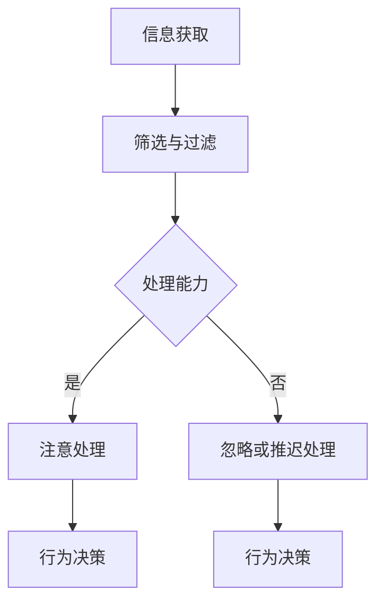

                 

### 文章标题：注意力的生态平衡：AI时代的信息Diet

在当前这个信息爆炸的时代，人们每天面临的海量信息让人应接不暇，如何有效地管理注意力资源成为了一个重要的课题。随着人工智能技术的飞速发展，信息的获取和处理变得更加高效和智能化，但同时也带来了新的挑战，即如何在AI的帮助下实现注意力的生态平衡。

关键词：注意力管理、信息过载、人工智能、生态平衡、注意力过滤

摘要：本文旨在探讨在AI时代背景下，如何实现注意力的生态平衡。文章首先介绍了注意力与信息过载的关系，分析了信息过载对社会和个体的影响。接着，文章探讨了信息生态系统的构建，包括信息获取与处理机制、注意力资源管理以及生态系统中的利益相关者。随后，文章提出了注意力管理策略，包括自我认知与意识觉醒、技术手段优化以及社会文化影响。最后，文章通过实际应用案例和未来展望，探讨了注意力管理在不同领域的应用前景。

----------------------------------------------------------------<|im_sep>

### 摘要

本文旨在探讨在人工智能（AI）时代背景下，如何实现注意力的生态平衡。随着信息技术的飞速发展，人们每天面临的海量信息让人应接不暇，信息过载成为一个普遍现象。信息过载不仅影响了个体对信息的有效处理能力，还对社会产生了深远的影响。在这样的背景下，如何有效地管理注意力资源，实现注意力的生态平衡，成为了迫切需要解决的问题。

本文首先介绍了注意力与信息过载的关系，分析了信息过载对社会和个体的影响，以及注意力稀缺性的概念。接着，文章探讨了信息生态系统的构建，包括信息获取与处理机制、注意力资源管理以及生态系统中的利益相关者。在此基础上，文章提出了注意力管理策略，包括自我认知与意识觉醒、技术手段优化以及社会文化影响。

在策略部分，文章详细讨论了自我认知与意识觉醒的重要性，内省与自我管理技巧，以及注意力分配策略。同时，文章还介绍了技术手段优化，包括注意力过滤工具、人工智能助手与自动化、个性化信息推送技术。此外，文章还分析了社会文化对注意力的影响，以及社交媒体与注意力分散的问题。

为了验证注意力管理策略的有效性，文章通过实际应用案例展示了注意力管理在不同领域的应用，包括职场注意力管理、教育注意力管理以及个人健康与心理关怀。最后，文章展望了技术发展对注意力管理的影响，以及社会与政策层面的对策。

总之，本文通过对注意力管理的全面探讨，为在AI时代实现注意力的生态平衡提供了理论依据和实践指导。随着人工智能技术的进一步发展，注意力管理的重要性将愈加凸显，本文的研究成果对于促进个体和社会的健康发展具有重要意义。

----------------------------------------------------------------<|im_sep>

### 目录大纲

**# 注意力的生态平衡：AI时代的信息Diet**

> **关键词：** 注意力管理、信息过载、人工智能、生态平衡、注意力过滤

> **摘要：** 本文探讨了在AI时代背景下，如何实现注意力的生态平衡。文章分析了信息过载对社会和个体的影响，探讨了信息生态系统的构建和注意力管理策略，并通过实际应用案例展示了注意力管理在不同领域的应用。

**第一部分：引论**

**第1章：注意力与信息过载**  
- **1.1 引言**  
- **1.2 注意力生态平衡的概念**  
- **1.3 AI时代的信息挑战**

**第2章：信息生态系统的构建**  
- **2.1 信息获取与处理机制**  
- **2.2 注意力资源管理**  
- **2.3 生态系统中的利益相关者**

**第二部分：注意力管理策略**

**第3章：自我认知与意识觉醒**  
- **3.1 自我意识的重要性**  
- **3.2 内省与自我管理技巧**  
- **3.3 注意力分配策略**

**第4章：技术手段优化**  
- **4.1 注意力过滤工具**  
- **4.2 人工智能助手与自动化**  
- **4.3 个性化信息推送技术**

**第5章：社会文化影响**  
- **5.1 社会文化对注意力的影响**  
- **5.2 社交媒体与注意力分散**  
- **5.3 文化和制度层面的对策**

**第三部分：实际应用案例**

**第6章：职场注意力管理**  
- **6.1 工作效率与注意力**  
- **6.2 职场注意力管理策略**  
- **6.3 实际案例分析**

**第7章：教育注意力管理**  
- **7.1 教育领域的信息过载**  
- **7.2 注意力管理在教育中的应用**  
- **7.3 实际案例与健康建议**

**第8章：个人健康与心理关怀**  
- **8.1 注意力与健康的关系**  
- **8.2 心理健康与注意力管理**  
- **8.3 实际案例与健康建议**

**第四部分：未来展望**

**第9章：技术发展对注意力的影响**  
- **9.1 未来技术趋势分析**  
- **9.2 技术对注意力生态平衡的挑战与机遇**  
- **9.3 未来研究方向**

**第10章：社会与政策层面的对策**  
- **10.1 社会政策的制定**  
- **10.2 企业社会责任与注意力管理**  
- **10.3 政策倡导与实施**

**附录**

**附录A：注意力管理工具列表**  
**附录B：推荐阅读与扩展资源**  
**附录C：相关术语解释**  
**附录D：致谢与声明**

通过上述目录大纲，本文将逐步探讨注意力管理的各个方面，旨在为读者提供系统、全面的理论和实践指导，帮助实现AI时代的注意力生态平衡。----------------------------------------------------------------<|im_sep>

### 第1章：注意力与信息过载

#### 1.1 引言

在当今社会，信息量呈指数级增长，各种信息来源不断涌现，如社交媒体、新闻网站、电子邮件、即时通讯等。人们每天面对的海量信息令人眼花缭乱，很难做到全面关注和处理。因此，如何有效管理注意力资源成为一个亟待解决的问题。

#### 1.2 注意力生态平衡的概念

注意力生态平衡指的是个体在信息过载的环境中，通过合理分配和使用注意力资源，实现信息处理的高效性和准确性。在AI时代，随着技术的进步，人们获取和处理信息的能力得到了提升，但也面临着新的挑战，即如何在信息爆炸的背景下保持注意力的生态平衡。

#### 1.3 AI时代的信息挑战

AI时代的信息挑战主要表现在以下几个方面：

1. **信息量增大**：随着互联网和移动设备的普及，人们每天接收到的信息量大幅增加，这使得个体难以全面关注和处理这些信息。

2. **信息真实性难以辨别**：在AI时代，虚假信息和误导性信息泛滥，个体需要耗费大量精力去辨别信息的真实性。

3. **信息过度个性化**：AI技术使得信息推送更加个性化，虽然满足了个体需求，但也可能导致个体对特定信息的过度依赖。

4. **注意力分散**：社交媒体等平台的即时性特点使得个体容易分散注意力，难以集中精力处理重要任务。

#### 1.4 注意力管理的重要性

注意力管理在个体和社会层面都具有重要意义：

1. **个体层面**：良好的注意力管理能够提高个体的工作效率和生活质量，帮助个体更好地处理信息、减少压力和焦虑。

2. **社会层面**：有效的注意力管理有助于提高社会的整体信息处理能力和决策质量，促进社会的可持续发展。

#### 1.5 注意力管理的基本原则

为了实现注意力的生态平衡，以下是一些注意力管理的基本原则：

1. **优先级管理**：将注意力集中在对个体最重要的任务和活动上，避免分散注意力。

2. **时间管理**：合理规划时间，确保在高效时间段内处理重要任务。

3. **自我监控**：定期检查自己的注意力分配情况，及时调整以保持注意力生态平衡。

4. **休息与恢复**：合理安排休息时间，帮助大脑恢复活力，提高注意力质量。

#### 1.6 注意力管理的方法

以下是一些常见的注意力管理方法：

1. **番茄工作法**：将工作时间分成25分钟的工作周期，每个周期后休息5分钟，通过这种方法提高工作效率。

2. **注意力过滤**：使用注意力过滤工具，如新闻客户端的“只看重要新闻”功能，减少不必要的干扰。

3. **多任务处理**：在确保任务优先级的前提下，尝试进行多任务处理，提高时间利用效率。

4. **自我提醒**：设置手机或电脑的提醒功能，提醒自己在特定时间集中精力处理重要任务。

#### 1.7 注意力管理的挑战与机遇

在AI时代，注意力管理的挑战与机遇并存：

1. **挑战**：信息量增大、信息真实性难以辨别、注意力分散等问题，使得注意力管理变得更加复杂。

2. **机遇**：AI技术的发展为注意力管理提供了新的工具和方法，如注意力过滤工具、人工智能助手等，有助于实现更高效的注意力管理。

总之，在AI时代，注意力管理的重要性愈加凸显。通过合理的管理策略和方法，个体和社会可以更好地应对信息过载的挑战，实现注意力的生态平衡。在下一章中，我们将进一步探讨信息生态系统的构建，以及如何有效地管理注意力资源。```markdown
### Mermaid 流程图：注意力管理的流程


```markdown
在上述流程图中，信息获取是注意力的起点，通过筛选与过滤，我们可以减少冗余信息，提升注意力资源的利用率。接下来，根据处理能力判断是否进行注意处理，如果是，则进入行为决策阶段；否则，信息可能被忽略或推迟处理。行为决策阶段是注意力管理的核心，它决定了个体如何分配注意力资源，以实现高效的信息处理和任务完成。``````markdown
----------------------------------------------------------------

### 第2章：信息生态系统的构建

#### 2.1 信息获取与处理机制

在信息生态系统中，信息获取与处理机制是至关重要的。信息获取的渠道多种多样，包括互联网、新闻媒体、社交媒体、个人交流等。信息处理机制则涉及信息的筛选、分类、存储和检索等多个环节。

1. **信息筛选**：个体在接收到大量信息时，需要通过一定的策略筛选出对自己有用的信息。这通常依赖于个人的兴趣、需求和经验。
   
2. **信息分类**：筛选后的信息需要被分类存储，以便于后续的检索和使用。分类的维度可以包括主题、时间、来源等。

3. **信息存储**：信息存储是信息处理的核心环节之一。现代信息技术，如数据库、云存储等，为信息的长期存储提供了高效的方式。

4. **信息检索**：在需要使用信息时，个体需要能够快速检索到所需的信息。信息检索的效率直接影响个体的决策速度和信息利用率。

#### 2.2 注意力资源管理

注意力资源管理是信息生态系统中的关键一环，它涉及到如何合理分配和利用有限的注意力资源。以下是一些注意力资源管理的策略：

1. **优先级管理**：将注意力集中在最重要的任务上，确保关键任务得到及时处理。

2. **时间管理**：合理安排时间，确保在高效时间段内处理重要任务。

3. **自我监控**：定期评估注意力分配的效果，及时调整注意力资源的分配。

4. **疲劳管理**：避免长时间连续工作导致的注意力疲劳，确保休息和恢复的时间。

#### 2.3 生态系统中的利益相关者

信息生态系统中的利益相关者主要包括信息生产者、信息传播者和信息消费者。

1. **信息生产者**：他们是信息的源头，包括新闻媒体、研究人员、企业等。

2. **信息传播者**：他们是信息的桥梁，通过互联网、社交媒体等渠道传播信息，如新闻媒体、博客作者、社交媒体平台。

3. **信息消费者**：他们是信息的使用者，包括普通用户、企业、政府等。

利益相关者在信息生态系统中扮演着不同的角色，他们的行为和决策都会对整个系统的运行产生影响。

#### 2.4 注意力资源的优化策略

为了提高注意力资源的利用效率，以下是一些优化策略：

1. **信息过滤**：通过使用各种工具和技术，如关键词过滤、内容分析等，减少冗余信息，提高注意力资源的利用率。

2. **自动化处理**：利用人工智能技术，如自然语言处理、机器学习等，自动化处理部分信息，减少人工干预。

3. **个性化推荐**：根据用户的历史行为和偏好，提供个性化的信息推荐，使用户能够更高效地获取所需信息。

4. **时间规划**：合理规划工作和休息时间，确保在高效时间段内处理重要任务。

#### 2.5 注意力资源管理的工具与手段

在注意力资源管理中，各种工具和手段的应用至关重要。以下是一些常用的工具和手段：

1. **注意力管理软件**：如番茄钟、Forest等，通过定时提醒和任务规划，帮助用户管理注意力。

2. **信息过滤工具**：如新闻客户端的“只看重要新闻”功能、垃圾邮件过滤等，减少冗余信息的干扰。

3. **人工智能助手**：如智能音箱、智能助手等，通过语音交互和自动化处理，帮助用户管理日常事务。

4. **时间管理工具**：如Google Calendar、Trello等，通过日程规划和任务管理，提高时间利用效率。

#### 2.6 注意力资源管理的效果评估

为了评估注意力资源管理的效果，可以采用以下方法：

1. **工作效率评估**：通过比较管理前后工作效率的变化，评估注意力管理策略的有效性。

2. **生活质量评估**：通过用户满意度调查、健康指标等，评估注意力管理对生活质量的提升。

3. **信息利用率评估**：通过信息检索速度、信息准确率等指标，评估信息处理效率的提高。

4. **行为数据分析**：通过收集和分析用户行为数据，了解注意力管理策略的执行情况和效果。

#### 2.7 信息生态系统与注意力管理的相互作用

信息生态系统与注意力管理之间存在着密切的相互作用：

1. **信息生态系统的构建影响注意力管理**：信息生态系统的结构、信息质量、信息传播渠道等都会对个体注意力管理产生影响。

2. **注意力管理优化信息生态系统**：有效的注意力管理可以减少信息过载，提高信息利用效率，从而优化信息生态系统。

3. **信息生态系统的变化影响注意力管理策略**：随着信息生态系统的变化，如新技术的出现、信息来源的增加等，个体需要调整注意力管理策略以适应新的环境。

总之，信息生态系统的构建与注意力管理相互影响、相互促进，共同构成了一个动态平衡的系统。在下一章中，我们将进一步探讨自我认知与意识觉醒在注意力管理中的作用。``````markdown
----------------------------------------------------------------

### 第3章：自我认知与意识觉醒

#### 3.1 自我意识的重要性

自我意识是指个体对自己存在和感知的认识。在注意力管理中，自我意识起着至关重要的作用。首先，自我意识能够帮助个体认识到自己的注意力状态，包括集中度、分散度、疲劳度等。这种认知使个体能够及时调整注意力的分配，以应对不同的任务需求。其次，自我意识还能帮助个体识别并克服注意力管理的障碍，如焦虑、疲劳等，从而提高注意力的质量。

#### 3.2 内省与自我管理技巧

内省是一种自我反思的过程，它有助于个体深入理解自己的内心世界，包括思维模式、情感反应、行为习惯等。通过内省，个体能够更好地了解自己的注意力偏好和弱点，从而制定更有效的注意力管理策略。以下是一些内省与自我管理的技巧：

1. **每日反思**：每天晚上花一些时间回顾当天的活动，包括完成的任务、注意力的分配情况、遇到的挑战等。通过这种反思，个体能够发现自己在注意力管理上的不足，并思考如何改进。

2. **情绪记录**：记录自己的情绪变化，了解情绪波动与注意力状态之间的关系。这种记录有助于个体识别触发情绪波动的因素，并采取相应的措施进行调节。

3. **目标设定**：明确自己的短期和长期目标，并将注意力集中在实现这些目标上。通过目标设定，个体能够保持注意力的一致性和持续性。

4. **习惯养成**：通过培养良好的生活习惯，如定时作息、合理饮食、适量运动等，提高注意力的稳定性和质量。

#### 3.3 注意力分配策略

有效的注意力分配策略是注意力管理的核心。以下是一些常见的注意力分配策略：

1. **优先级排序**：将任务按照优先级排序，优先处理最重要的任务。可以使用如“紧急-重要矩阵”等方法进行任务分类。

2. **时间块管理**：将时间划分为不同的块，每个块专注于一项任务。这种方法有助于减少任务切换带来的注意力损耗。

3. **专注训练**：通过专门的专注训练，如冥想、专注力游戏等，提高个体的专注能力。

4. **多任务处理**：在确保任务优先级的前提下，尝试进行多任务处理，以提高时间利用效率。然而，需要注意的是，多任务处理可能会降低任务的质量。

#### 3.4 自我监控与反馈

自我监控是指个体对自己的注意力分配和管理过程进行持续监控。以下是一些自我监控与反馈的方法：

1. **注意力日志**：记录每天注意力的使用情况，包括任务完成情况、注意力分散的时间等。这种日志有助于个体了解自己的注意力状态，并做出相应的调整。

2. **反馈机制**：定期向他人寻求反馈，了解自己在注意力管理方面的表现。他人的观点可能会提供新的视角，帮助个体发现自身不足。

3. **行为分析**：通过数据分析工具，分析自己在一段时间内的注意力分布和任务完成情况。这种分析有助于个体识别注意力管理的模式，并调整策略。

#### 3.5 案例研究：注意力管理的实践效果

为了更好地理解自我认知与意识觉醒在注意力管理中的作用，我们可以通过以下案例研究来探讨其实践效果：

**案例一：职场工作者小张**

小张是一名软件工程师，他发现自己经常在工作时注意力不集中，导致工作效率低下。通过内省和自我反思，他意识到自己的注意力分散主要是因为任务过多且缺乏明确的优先级。于是，他开始使用优先级排序和时间块管理策略，将任务划分为不同的时间块，并按照优先级进行排序。

经过一段时间的实践，小张发现他的工作效率有了显著提高，任务完成质量也有所提升。同时，他还开始记录注意力日志，通过反思和调整策略，进一步优化了自己的注意力管理。

**案例二：学生小李**

小李是一名大学生，他发现自己在学习时容易受到社交媒体的干扰，导致学习效率低下。为了解决这个问题，他开始进行专注训练，如冥想和专注力游戏，以提高自己的专注能力。

此外，他还设定了明确的学习目标，并将时间划分为学习、休息和娱乐三个部分。通过这种时间管理策略，小李能够更好地控制自己的注意力，避免了社交媒体的干扰，学习效率显著提高。

#### 3.6 结论

通过上述案例研究，我们可以看到自我认知与意识觉醒在注意力管理中的重要性。通过内省和自我管理技巧，个体能够更好地了解自己的注意力状态，制定有效的注意力分配策略，从而提高工作效率和学习效果。在下一章中，我们将探讨技术手段优化在注意力管理中的应用。``````markdown
----------------------------------------------------------------

### 第4章：技术手段优化

在注意力管理中，技术手段的优化可以显著提高信息处理的效率和质量。随着人工智能和大数据技术的发展，人们可以借助各种工具和算法来优化注意力的分配和管理。以下将详细介绍几种关键技术手段：注意力过滤工具、人工智能助手与自动化、个性化信息推送技术。

#### 4.1 注意力过滤工具

注意力过滤工具旨在帮助用户从大量信息中筛选出对个体最为重要的内容。以下是一些常见的注意力过滤工具及其工作原理：

1. **关键词过滤**：通过预设的关键词对信息进行筛选，只保留包含关键词的内容。例如，新闻客户端可以根据用户关注的关键词推送相关新闻。

   ```mermaid
   graph TD
       A[用户输入关键词] --> B[关键词匹配]
       B --> C{匹配结果}
       C --> D[过滤结果]
   ```

2. **内容分析**：使用自然语言处理技术对信息内容进行分析，根据分析结果进行筛选。例如，社交媒体平台可以通过情感分析筛选出积极或消极的帖子。

   ```mermaid
   graph TD
       A[信息内容] --> B[NLP分析]
       B --> C{情感分析}
       C --> D[筛选结果]
   ```

3. **机器学习算法**：通过训练机器学习模型，让模型学习用户的行为和偏好，从而预测用户可能感兴趣的内容。例如，推荐系统可以使用协同过滤算法来预测用户对未知内容的兴趣。

   ```mermaid
   graph TD
       A[用户行为数据] --> B[模型训练]
       B --> C{预测算法}
       C --> D[推荐结果]
   ```

   ```latex
   \text{协同过滤算法伪代码：}
   \begin{algorithm}
   \caption{协同过滤算法}
   \begin{algorithmic}[1]
   \Function{collaborativeFiltering($R$, $K$)}
   \State $N \gets$ \# of users
   \ForAll{$u \in R$}
   \State $N_u \gets$ \# of items rated by $u$
   \EndFor
   \ForAll{$u, v \in R$}
   \State $S_{uv} \gets$ similarity($u, v$)
   \State $R_{uv} \gets$ predictedRating($u, v, S_{uv}$)
   \EndFor
   \Return $R_{uv}$
   \EndFunction
   \end{algorithmic}
   \end{algorithm}
   ```

#### 4.2 人工智能助手与自动化

人工智能助手和自动化技术能够显著减轻个体的注意力负担，提高工作效率。以下是一些关键的应用场景：

1. **自动化日程管理**：通过自动化工具，如Google Calendar或Outlook，自动安排会议、提醒任务等，从而节省个体的时间，让他们能够集中精力处理重要任务。

   ```mermaid
   graph TD
       A[日程事件] --> B[自动安排]
       B --> C[提醒系统]
       C --> D[任务完成反馈]
   ```

2. **智能助手**：如Siri、Alexa和Google Assistant，通过语音交互，帮助个体完成各种任务，如查询信息、设置提醒、播放音乐等，从而减少个体的手动操作。

   ```mermaid
   graph TD
       A[用户语音指令] --> B[语音识别]
       B --> C[指令处理]
       C --> D[任务执行]
   ```

3. **自动化工作流**：使用工作流自动化工具，如Workato或 Zapier，将不同应用程序的任务自动化连接起来，从而减少重复性劳动，提高工作效率。

   ```mermaid
   graph TD
       A[应用A任务] --> B[Workato]
       B --> C[应用B任务]
       C --> D[应用C任务]
   ```

#### 4.3 个性化信息推送技术

个性化信息推送技术旨在根据用户的行为和偏好，为用户提供定制化的信息内容。以下是一些关键技术和算法：

1. **协同过滤**：如前文所述，协同过滤算法通过分析用户的历史行为和偏好，预测用户对未知内容的兴趣，从而进行个性化推荐。

2. **内容推荐**：基于内容的推荐（CBR）算法通过分析内容特征，为用户提供相似的内容推荐。例如，新闻客户端可以根据文章的主题和关键词为用户推荐相关新闻。

   ```mermaid
   graph TD
       A[内容特征] --> B[相似度计算]
       B --> C[推荐结果]
   ```

3. **混合推荐系统**：结合协同过滤和内容推荐的优势，混合推荐系统（Hybrid Recommen
```markdown
### 4.3 个性化信息推送技术

个性化信息推送技术旨在根据用户的行为和偏好，为用户提供定制化的信息内容。这种技术利用人工智能和大数据分析来优化用户的信息体验，减少无关信息的干扰，从而提高用户的注意力和满意度。

#### 4.3.1 技术原理

个性化信息推送的核心在于理解用户的需求和偏好，并在此基础上进行内容推荐。以下是一些关键技术原理：

1. **协同过滤**：协同过滤是一种基于用户行为的历史数据进行推荐的方法。它通过分析用户之间的相似度（如评分一致性），发现相似用户的行为模式，并将这些模式应用到新用户上，从而进行内容推荐。

   ```mermaid
   graph TD
       A[用户A行为数据] --> B[用户B行为数据]
       B --> C{行为相似度计算}
       C --> D[推荐内容]
   ```

2. **内容推荐**：基于内容的推荐（Content-based Filtering）通过分析信息内容的特点（如关键词、主题、情感等），为用户推荐具有相似内容特征的信息。

   ```mermaid
   graph TD
       A[内容特征提取] --> B[用户偏好特征提取]
       B --> C{相似度计算}
       C --> D[推荐结果]
   ```

3. **混合推荐系统**：混合推荐系统结合协同过滤和内容推荐的优势，通过综合利用用户行为和内容特征，提高推荐的准确性和多样性。

   ```mermaid
   graph TD
       A[用户行为数据] --> B[协同过滤]
       B --> C[内容特征数据]
       C --> D[内容推荐]
       D --> E[混合推荐结果]
   ```

#### 4.3.2 技术优势

个性化信息推送技术具有以下优势：

1. **提高用户满意度**：通过提供个性化推荐，用户能够更快速地找到感兴趣的内容，从而提高满意度。

2. **减少信息过载**：个性化推荐可以减少无关信息的干扰，使用户的注意力更集中。

3. **优化资源利用**：个性化信息推送有助于平台优化内容生产和分配，提高资源利用效率。

4. **增强用户体验**：个性化推荐技术能够为用户提供更加定制化的体验，增加用户粘性。

#### 4.3.3 应用案例

以下是一些个性化信息推送技术的实际应用案例：

1. **新闻推荐**：新闻客户端根据用户的阅读历史和偏好，为用户推荐相关的新闻内容。

2. **电子商务**：电商平台根据用户的购买记录和浏览行为，推荐相关的商品。

3. **社交媒体**：社交媒体平台根据用户的互动行为和兴趣，推荐相关的帖子、文章和视频。

4. **音乐和视频流媒体**：音乐和视频平台根据用户的收听和观看历史，推荐相关的音乐和视频。

#### 4.3.4 注意事项

在应用个性化信息推送技术时，需要注意以下事项：

1. **隐私保护**：用户数据的安全和隐私保护至关重要。平台需要采取严格的措施保护用户数据，避免数据泄露。

2. **数据质量**：推荐系统的准确性依赖于用户数据的质量。平台需要确保数据的准确性和完整性。

3. **算法透明性**：用户需要了解推荐算法的工作原理，以便更好地理解推荐结果。

4. **用户控制**：用户应该拥有对个性化推荐的控制权，包括关闭推荐、调整偏好等。

总之，个性化信息推送技术为用户提供了更加定制化的信息体验，但同时也需要关注隐私保护、数据质量和算法透明性等问题。在下一章中，我们将探讨社会文化对注意力管理的影响。``````markdown
----------------------------------------------------------------

### 第5章：社会文化影响

#### 5.1 社会文化对注意力的影响

社会文化对个体注意力的影响是多层次、多维度的。以下从社会环境、文化传统、教育体制等方面分析社会文化对注意力管理的塑造作用。

1. **社会环境**：

   - **快节奏生活**：现代社会的快节奏生活使得个体面临更多的信息和任务，压力增大，注意力分散。

   - **竞争压力**：激烈的竞争环境迫使个体不得不时刻保持警惕，集中注意力处理事务。

   - **媒体环境**：现代媒体技术的发展，尤其是社交媒体的普及，使得信息传递速度加快，个体注意力容易受到干扰。

2. **文化传统**：

   - **价值观**：不同的文化传统对个体的价值观和行为模式有深刻影响。一些文化强调集体主义，鼓励个体将注意力集中在团队和组织目标上；而另一些文化则强调个人主义，鼓励个体关注个人发展和自我实现。

   - **教育方式**：文化传统影响教育方式，进而影响个体的注意力习惯。例如，一些文化传统强调死记硬背，可能导致个体在处理复杂任务时注意力分散；而一些文化传统则注重批判性思维和创造性，有助于培养个体集中注意力的能力。

3. **教育体制**：

   - **课程设置**：教育体制中的课程设置直接影响到学生的注意力分配。过于繁重的课程负担可能导致学生注意力分散，难以专注于关键课程。

   - **教学方法**：教育方法对个体注意力管理也有重要影响。互动式教学、讨论式教学等方法有助于提高学生的注意力和参与度，而传统的灌输式教学则可能导致学生注意力不集中。

#### 5.2 社交媒体与注意力分散

社交媒体对个体注意力的分散作用已经成为一个显著的社会问题。以下从社交媒体的特性、影响方式以及应对策略等方面进行分析。

1. **社交媒体的特性**：

   - **即时性**：社交媒体的即时性特点使得用户可以随时随地接收和发送信息，这种特性容易导致用户注意力的分散。

   - **互动性**：社交媒体的互动性使得用户可以与他人实时交流，这虽然有助于满足社交需求，但也容易导致用户注意力从重要任务转移到社交媒体上。

   - **娱乐性**：许多社交媒体平台具有娱乐功能，如短视频、小游戏等，这些内容容易吸引用户的注意力，导致注意力分散。

2. **注意力分散的影响方式**：

   - **时间消耗**：用户在社交媒体上花费大量时间，导致实际工作或学习时间减少。

   - **效率降低**：频繁切换注意力，导致任务完成效率降低。

   - **心理健康问题**：长时间使用社交媒体可能导致焦虑、抑郁等心理健康问题。

3. **应对策略**：

   - **时间管理**：设定特定的时间段用于社交媒体，避免在重要任务期间使用。

   - **目标设定**：明确使用社交媒体的目的，避免无目的地浏览。

   - **自我监控**：定期检查社交媒体使用情况，评估其对注意力和任务完成的影响。

#### 5.3 文化和制度层面的对策

为了应对社会文化对注意力分散的影响，需要从文化和制度层面采取一系列对策。

1. **文化层面**：

   - **宣传和教育**：通过媒体宣传和教育活动，提高公众对注意力分散问题的认识，引导个体养成良好的注意力管理习惯。

   - **文化倡导**：倡导健康、积极的文化价值观，鼓励个体将注意力集中在有意义、有价值的事务上。

   - **文化创新**：推动文化创新，开发具有注意力管理功能的应用和工具，帮助个体更好地管理注意力。

2. **制度层面**：

   - **政策制定**：政府和企业可以制定相关政策，限制社交媒体的使用时间，鼓励员工和学生专注于工作或学习。

   - **工作环境优化**：优化工作环境和教育环境，减少干扰因素，提高个体的注意力和工作效率。

   - **技术手段**：利用技术手段，如注意力过滤工具、自动化系统等，帮助个体更好地管理注意力。

总之，社会文化对个体注意力管理具有重要影响。通过文化倡导、政策制定、技术手段等多方面的对策，可以有效应对注意力分散问题，促进个体和社会的健康发展。在下一章中，我们将探讨职场注意力管理的实际案例。``````markdown
----------------------------------------------------------------

### 第6章：职场注意力管理

#### 6.1 工作效率与注意力

在职场环境中，工作效率与注意力之间存在着密切的联系。良好的注意力管理不仅能够提高工作效率，还能提升员工的满意度和生产力。以下从工作效率的定义、注意力与工作效率的关系以及提高工作效率的注意力管理策略等方面进行探讨。

#### 6.1.1 工作效率的定义

工作效率是指个体在单位时间内完成工作任务的效率。它通常包括任务完成的数量、质量和速度。高效的工作效率意味着个体能够在有限的时间内完成更多、更好的工作，从而为企业创造更大的价值。

#### 6.1.2 注意力与工作效率的关系

注意力是工作效率的关键因素之一。良好的注意力管理能够帮助员工专注于工作任务，减少干扰，提高工作效率。以下是注意力与工作效率之间的几个关键关系：

1. **注意力集中与任务完成**：当员工能够将注意力集中在特定任务上时，他们能够更快速、更准确地完成任务。

2. **注意力分散与效率降低**：注意力分散会导致员工在任务间切换，从而增加完成任务所需的时间，降低工作效率。

3. **注意力疲劳与工作质量**：长时间的注意力集中会导致注意力疲劳，进而影响工作质量。因此，适当的休息和放松对于保持工作效率至关重要。

#### 6.1.3 提高工作效率的注意力管理策略

为了提高工作效率，员工需要采取一系列注意力管理策略。以下是一些有效的策略：

1. **时间管理**：合理安排工作时间和休息时间，确保在高效时间段内集中精力处理重要任务。

   ```mermaid
   graph TD
       A[任务列表] --> B[优先级排序]
       B --> C[时间分配]
       C --> D[任务执行]
       D --> E[休息与放松]
   ```

2. **环境优化**：创造一个有利于集中注意力的工作环境，减少干扰因素。例如，保持工作区域整洁、减少噪音干扰、合理安排座位等。

3. **注意力分配**：根据任务的紧急程度和重要性，合理分配注意力资源。使用如“四象限法则”等方法，将任务划分为四个象限，并按照象限优先级进行处理。

   ```mermaid
   graph TD
       A[任务列表] --> B[紧急-重要矩阵]
       B --> C{象限1}
       B --> D{象限2}
       B --> E{象限3}
       B --> F{象限4}
   ```

4. **专注训练**：通过专注力训练，如冥想、专注力游戏等，提高员工的专注能力和注意力质量。

5. **自我监控**：定期评估自己的注意力状态，及时发现并调整注意力分配策略。可以使用注意力日志记录注意力使用情况，以便进行自我监控和反馈。

6. **技术辅助**：利用各种注意力管理工具和应用程序，如番茄钟、Forest等，帮助员工管理注意力，提高工作效率。

#### 6.2 职场注意力管理策略

在职场环境中，有效的注意力管理策略能够帮助员工提高工作效率，减少压力和焦虑。以下是一些具体的注意力管理策略：

1. **优先级管理**：

   - **任务优先级排序**：将任务按照紧急程度和重要性进行排序，优先处理最重要的任务。

   - **紧急-重要矩阵**：使用紧急-重要矩阵（Eisenhower Matrix）将任务分为四个象限，并按照象限优先级进行处理。

     ```mermaid
     graph TD
         A[紧急-重要矩阵]
         A --> B{紧急且重要}
         A --> C{紧急但不重要}
         A --> D{不紧急但重要}
         A --> E{不紧急且不重要}
     ```

2. **时间管理**：

   - **时间块管理**：将工作时间划分为不同的时间块，每个时间块专注于一项任务，避免任务切换带来的干扰。

   - **番茄工作法**：使用番茄钟（Pomodoro Technique）将工作时间划分为25分钟的工作周期，每个周期后休息5分钟，以提高工作效率。

     ```mermaid
     graph TD
         A[任务列表] --> B[时间块划分]
         B --> C[番茄钟设置]
         C --> D[工作周期]
         D --> E[休息与放松]
     ```

3. **自我监控**：

   - **注意力日志**：记录每天的注意力使用情况，包括完成任务的时间、注意力分散的时间等，以便进行自我监控和反馈。

   - **定期评估**：定期评估自己的注意力管理效果，根据评估结果调整策略，以持续优化注意力管理。

4. **技术辅助**：

   - **注意力过滤工具**：使用注意力过滤工具，如新闻客户端的“只看重要新闻”功能，减少冗余信息的干扰。

   - **自动化工具**：使用自动化工具，如日程管理软件、提醒工具等，自动安排和提醒任务，节省时间和精力。

5. **专注训练**：

   - **专注力训练**：通过专注力训练，如冥想、专注力游戏等，提高员工的专注能力和注意力质量。

   - **休息与放松**：确保在工作间隙进行适当的休息和放松，以减轻注意力疲劳，提高工作效率。

#### 6.3 实际案例分析

以下是一些职场注意力管理的实际案例分析，展示有效的注意力管理策略如何帮助员工提高工作效率。

**案例一：某科技公司的注意力管理实践**

某科技公司通过实施一系列注意力管理策略，显著提高了员工的工作效率和生产力。具体措施包括：

- **时间管理**：公司采用时间块管理策略，将工作时间划分为25分钟的工作周期，每个周期后休息5分钟，以保持员工的专注力和工作效率。

- **专注训练**：公司组织专注力培训课程，帮助员工掌握专注力训练技巧，如冥想、呼吸训练等，以提高专注能力和注意力质量。

- **技术辅助**：公司引入了注意力过滤工具，如新闻客户端的“只看重要新闻”功能，减少员工在社交媒体上的时间，确保员工将注意力集中在关键任务上。

- **自我监控**：员工每天记录自己的注意力使用情况，并定期向团队分享和讨论，以持续优化注意力管理策略。

经过一段时间的实践，该公司的员工工作效率显著提高，任务完成质量也有所提升，公司的整体生产力得到了显著提升。

**案例二：创业团队的注意力管理实践**

某创业团队通过注意力管理策略，成功应对了初创阶段的工作压力和挑战。具体措施包括：

- **任务优先级排序**：团队定期评估任务的紧急程度和重要性，并按照优先级排序，确保关键任务得到优先处理。

- **时间管理**：团队成员采用番茄工作法，将工作时间划分为25分钟的工作周期，每个周期后休息5分钟，以保持高效的工作状态。

- **专注训练**：团队成员定期参加专注力训练课程，提高专注能力和注意力质量。

- **技术辅助**：团队引入了自动化工具，如日程管理软件、提醒工具等，自动化安排和提醒任务，节省时间和精力。

- **团队协作**：团队成员之间保持良好的沟通和协作，及时分享工作进展和困难，共同解决注意力管理问题。

通过这些措施，创业团队成功提高了工作效率和团队协作能力，在竞争激烈的市场中取得了良好的发展。

#### 6.4 结论

职场注意力管理对于提高工作效率和生产力具有重要意义。通过合理的时间管理、任务优先级排序、专注力训练和技术辅助，员工可以更好地管理注意力，提高工作效率，减轻压力和焦虑。实际案例分析表明，有效的注意力管理策略可以显著提升员工的工作效率和团队的整体生产力。在下一章中，我们将探讨教育注意力管理的问题。``````markdown
----------------------------------------------------------------

### 第7章：教育注意力管理

#### 7.1 教育领域的信息过载

在教育领域，信息过载现象尤为突出。随着互联网和数字化技术的普及，学生每天接触到的大量信息不仅包括课堂知识，还有各种课外资源、社交网络信息等。这种信息过载给学生的注意力和学习效果带来了巨大的挑战。

1. **课堂信息过载**：

   - **教学内容繁多**：随着教育改革和课程内容的增加，课堂上的知识量大大增加，学生需要在短时间内消化和理解大量信息。

   - **多媒体教学**：现代教育中广泛使用多媒体教学工具，如视频、动画、PPT等，虽然丰富了教学手段，但也容易分散学生的注意力。

2. **课外资源过载**：

   - **在线课程和资料**：互联网上丰富的课程和资料为学生提供了更多的学习资源，但同时也增加了学生筛选有用信息的工作量。

   - **社交网络信息**：学生通过社交媒体获取信息，但大量的社交信息也容易分散学生的注意力，影响学习效率。

3. **影响**：

   - **注意力的分散**：学生面临的信息过多，容易导致注意力分散，难以集中精力学习。

   - **学习效果下降**：信息过载使得学生在学习过程中容易感到疲劳和压力，学习效果下降。

   - **心理健康问题**：长时间的信息过载和注意力分散可能导致学生出现焦虑、抑郁等心理健康问题。

#### 7.2 注意力管理在教育中的应用

为了应对教育领域的信息过载问题，有效的注意力管理策略在教学中显得尤为重要。以下是一些注意力管理策略在教育中的应用：

1. **课堂教学设计**：

   - **减少信息量**：教师在设计课程时，应注重精简教学内容，避免信息过载。例如，通过精选教材、设计针对性的教学活动，减少冗余信息。

   - **互动式教学**：采用互动式教学方法，如小组讨论、合作学习等，提高学生的参与度和注意力集中度。

   - **多媒体整合**：合理使用多媒体教学工具，避免过度依赖，以免分散学生注意力。例如，在关键知识点上使用视频或动画，提高学生的理解能力。

2. **课外学习管理**：

   - **信息筛选**：指导学生学会筛选和评估在线资源和资料，提高信息获取的效率和质量。

   - **时间规划**：帮助学生制定合理的学习计划和时间表，确保有足够的时间专注于学习任务。

   - **学习环境优化**：为学生创造一个有利于集中注意力的学习环境，减少干扰因素。例如，保持学习区域的整洁、减少噪音等。

3. **注意力训练**：

   - **专注力训练**：通过专门的训练，如冥想、专注力游戏等，提高学生的专注能力和注意力质量。

   - **自我监控**：鼓励学生记录自己的学习进度和注意力使用情况，定期进行反思和调整，以保持良好的注意力状态。

4. **教育技术支持**：

   - **注意力管理工具**：利用教育技术工具，如专注力应用、时间管理软件等，帮助学生在学习过程中保持注意力集中。

   - **个性化教育**：根据学生的兴趣和学习风格，提供个性化的学习资源和指导，提高学生的学习效果和注意力管理能力。

#### 7.3 实际案例与健康建议

**案例一：某学校的信息过载应对策略**

某学校在应对信息过载问题方面采取了一系列措施，取得了显著成效。具体措施包括：

- **优化课程设计**：学校调整课程内容，减少冗余信息，确保教学内容精简实用。

- **引入互动式教学**：通过小组讨论、项目合作等形式，提高学生的参与度和注意力集中度。

- **心理健康教育**：学校开设心理健康课程，帮助学生学会应对信息过载带来的压力，提高心理素质。

- **学习环境优化**：学校改善学习环境，提供安静、整洁的学习空间，减少干扰因素。

**健康建议**：

1. **合理安排学习时间**：学生应根据自身情况合理安排学习时间，避免长时间连续学习，确保有足够的休息时间。

2. **培养良好的学习习惯**：学生应培养良好的学习习惯，如定时复习、合理安排课外活动等，提高学习效率。

3. **注重心理健康**：学生应关注自己的心理健康，学会应对压力和焦虑，保持积极的心态。

4. **家长参与**：家长应积极参与孩子的学习过程，提供必要的支持和指导，帮助孩子有效管理注意力。

总之，教育注意力管理对于提高学生的学习效果和心理健康具有重要意义。通过有效的策略和措施，可以帮助学生在信息过载的环境中保持注意力集中，提高学习效率。在下一章中，我们将探讨个人健康与心理关怀在注意力管理中的作用。``````markdown
----------------------------------------------------------------

### 第8章：个人健康与心理关怀

#### 8.1 注意力与健康的关系

注意力是人类认知过程中不可或缺的一部分，它不仅影响个体的工作效率和学习成绩，还与个人的身心健康密切相关。以下是注意力与健康之间的一些关键关系：

1. **注意力与健康水平的关联**：

   - **身体健康**：良好的注意力管理有助于提高个体的自我监控和自我调节能力，从而促进身体健康。例如，注意力集中的人更容易坚持健康的生活方式，如定期锻炼、合理饮食等。

   - **心理健康**：注意力管理不良可能导致焦虑、抑郁等心理问题。长期注意力分散和疲劳会影响个体的情绪状态，降低生活质量。

2. **注意力与睡眠质量的关系**：

   - **睡眠质量**：良好的注意力管理有助于个体在晚上更好地放松，从而提高睡眠质量。睡眠质量差会影响注意力水平，形成恶性循环。

3. **注意力与认知功能的关联**：

   - **认知功能**：注意力集中能够提高个体的认知功能，如记忆力、决策能力和问题解决能力。良好的注意力管理有助于提高学习效率和工作效率。

#### 8.2 心理健康与注意力管理

心理健康与注意力管理之间存在着密切的互动关系。以下是心理健康对注意力管理的影响以及如何通过注意力管理来促进心理健康：

1. **心理健康对注意力管理的影响**：

   - **情绪波动**：情绪不稳定的人容易受到外界刺激的影响，导致注意力分散。长期的情绪问题可能导致注意力管理能力下降。

   - **焦虑和压力**：高水平的焦虑和压力会影响个体的注意力集中能力，使人难以专注于任务。

2. **如何通过注意力管理促进心理健康**：

   - **情绪调节**：通过注意力管理技巧，如冥想、深呼吸等，帮助个体缓解情绪波动，提高心理健康水平。

   - **时间管理**：合理安排时间，确保有足够的休息和放松时间，减少焦虑和压力。

   - **自我监控**：定期评估自己的情绪和注意力状态，及时调整管理策略，以保持心理健康。

#### 8.3 实际案例与健康建议

**案例一：注意力管理对个人健康的积极影响**

某职场人士李先生，由于工作繁忙和压力巨大，经常感到焦虑和疲劳。他开始尝试通过注意力管理来改善健康状况。具体措施包括：

- **每日冥想**：每天早晨花10分钟进行冥想，帮助自己平静心情，集中注意力。

- **时间管理**：合理安排工作时间和休息时间，避免长时间连续工作，确保有足够的休息和放松时间。

- **专注训练**：通过专注力训练，如番茄工作法，提高工作效率，减少任务切换带来的干扰。

经过一段时间的实践，李先生的焦虑感明显减轻，工作效率提高，健康状况有所改善。

**健康建议**：

1. **定期锻炼**：保持每周至少150分钟的中等强度锻炼，如快走、跑步、游泳等，有助于提高注意力和身心健康。

2. **合理饮食**：饮食均衡，确保摄入足够的营养素，如蛋白质、维生素和矿物质，有助于维持注意力和认知功能。

3. **充足睡眠**：保证每晚7-8小时的睡眠时间，创造一个良好的睡眠环境，有助于提高注意力。

4. **心理健康支持**：如感到情绪困扰，可以寻求心理咨询师的帮助，通过专业的心理辅导来提升心理健康水平。

总之，注意力管理不仅对个人工作、学习有重要影响，还对身心健康具有积极作用。通过有效的注意力管理策略，个体可以更好地应对压力和挑战，提高生活质量和幸福感。在下一章中，我们将探讨技术发展对注意力管理的影响。``````markdown
----------------------------------------------------------------

### 第9章：技术发展对注意力的影响

随着科技的飞速发展，人工智能、大数据、物联网等新兴技术正在深刻地改变我们的生活方式，同时也对注意力管理产生了深远的影响。本章将分析未来技术发展趋势，探讨这些技术对注意力生态平衡的挑战与机遇，并提出未来研究方向。

#### 9.1 未来技术趋势分析

1. **人工智能的进步**：

   - **智能助手与自动化**：随着人工智能技术的发展，智能助手和自动化系统将更加智能化，能够更好地协助个体管理日常事务，从而减轻注意力负担。

   - **个性化推荐系统**：人工智能驱动的个性化推荐系统将更加精准地满足用户的需求，减少无关信息的干扰，帮助用户更高效地分配注意力。

2. **大数据分析**：

   - **数据挖掘与预测**：大数据分析技术将能够挖掘大量数据中的有价值信息，帮助个体更好地了解自己的行为模式，从而优化注意力分配策略。

   - **实时监控与反馈**：通过实时数据分析，个体可以更快速地了解自己的注意力状态，并及时调整注意力资源分配，实现动态平衡。

3. **物联网与智能设备**：

   - **智能家居与办公环境**：物联网技术将使家居和办公环境更加智能化，提供个性化的服务，减少干扰因素，提高注意力集中度。

   - **可穿戴设备与健康监测**：可穿戴设备可以实时监测个体的身体状态，如心率、睡眠质量等，为注意力管理提供科学依据。

#### 9.2 技术对注意力生态平衡的挑战与机遇

1. **挑战**：

   - **信息过载**：随着技术的发展，信息获取渠道更加多样化，个体面临的诱惑和信息过载问题将更加严重，可能导致注意力分散。

   - **隐私与安全**：大数据分析和智能设备的广泛应用可能带来隐私泄露和信息安全问题，增加个体注意力的负担。

   - **技术依赖**：过度依赖智能设备和自动化系统可能导致个体注意力管理能力的下降，甚至形成依赖。

2. **机遇**：

   - **个性化与定制化**：技术的进步将使得注意力管理更加个性化与定制化，个体可以根据自身需求灵活调整注意力分配策略。

   - **效率提升**：智能助手与自动化技术可以帮助个体更高效地处理日常事务，从而减轻注意力负担。

   - **健康监测与干预**：通过大数据分析和健康监测，个体可以更早地发现注意力管理方面的问题，并采取有效措施进行干预。

#### 9.3 未来研究方向

1. **人工智能与注意力管理**：

   - **智能助手发展**：研究如何开发更智能、更符合用户需求的智能助手，以更好地辅助个体进行注意力管理。

   - **注意力监测算法**：开发能够实时监测个体注意力状态的算法，为注意力管理提供科学依据。

2. **大数据分析与注意力管理**：

   - **行为数据挖掘**：研究如何从大量行为数据中挖掘有价值的信息，为注意力管理提供指导。

   - **实时反馈机制**：研究如何建立实时反馈机制，帮助个体动态调整注意力分配策略。

3. **物联网与智能设备在注意力管理中的应用**：

   - **智能家居与办公环境优化**：研究如何利用物联网技术改善家居和办公环境，减少注意力干扰。

   - **可穿戴设备与注意力监测**：研究如何利用可穿戴设备实时监测个体的注意力状态，并提供个性化干预建议。

4. **技术伦理与隐私保护**：

   - **隐私保护技术**：研究如何在利用大数据和智能设备进行注意力管理的同时，保护用户的隐私和安全。

   - **技术依赖与干预**：研究如何防止个体过度依赖技术，并在必要时提供干预措施。

总之，技术发展对注意力管理既带来了挑战，也提供了机遇。通过深入研究相关技术，我们可以更好地应对注意力管理的挑战，实现注意力的生态平衡。在下一章中，我们将探讨社会与政策层面的对策，以促进注意力管理的有效实施。``````markdown
----------------------------------------------------------------

### 第10章：社会与政策层面的对策

在应对注意力管理挑战的过程中，社会与政策层面的对策起着至关重要的作用。通过制定和实施相关政策，以及引导社会各界共同努力，可以有效促进注意力管理的实施，提高个体和社会的整体福祉。以下将探讨社会政策的制定、企业社会责任与注意力管理，以及政策倡导与实施。

#### 10.1 社会政策的制定

社会政策在注意力管理中扮演着关键角色，可以通过以下几个方面来制定：

1. **健康与教育政策**：

   - **心理健康服务**：政府应加大对心理健康服务的投入，提供更多的心理健康咨询和治疗资源，帮助个体应对注意力管理中的心理压力。

   - **教育改革**：政府应推动教育体制改革，减少课程内容的过度负担，提高教学质量，培养学生的注意力管理和自我控制能力。

2. **数字素养政策**：

   - **数字素养教育**：政府应推动数字素养教育，提高公众对信息过载的识别和管理能力，培养个体在数字时代下的注意力管理技能。

   - **互联网管理**：政府应制定相关法规，规范互联网内容和社交媒体的使用，减少不良信息的传播，降低对个体注意力的负面影响。

3. **工作时间政策**：

   - **灵活工作时间**：政府和企业应鼓励实施灵活的工作时间制度，减少加班，确保员工有足够的休息时间，从而提高注意力的管理和恢复能力。

   - **工时限制**：政府应制定相关法律，限制员工的工作时间，防止过度工作导致的注意力疲劳。

#### 10.2 企业社会责任与注意力管理

企业作为社会的重要组成部分，有责任关注员工和社会的注意力管理问题。以下是一些企业社会责任与注意力管理的建议：

1. **员工关怀**：

   - **工作环境优化**：企业应努力营造一个有利于员工集中注意力的工作环境，减少噪音和干扰，提供舒适的工作空间。

   - **员工培训**：企业应提供注意力管理培训，帮助员工掌握有效的注意力管理技巧，提高工作效率。

2. **技术支持**：

   - **注意力管理工具**：企业可以引入注意力管理工具，如专注力应用、时间管理软件等，帮助员工更好地管理注意力。

   - **数字化工作流程**：企业应推动数字化工作流程，减少纸质文档的使用，提高工作效率，减少对注意力的占用。

3. **社会责任**：

   - **社会公益**：企业可以通过参与社会公益活动，提高员工的注意力和参与感，培养社会责任感。

   - **绿色办公**：企业应倡导绿色办公，减少对环境的负面影响，提高员工的工作满意度和注意力质量。

#### 10.3 政策倡导与实施

为了确保注意力管理对策的有效实施，需要通过政策倡导和实施来推动相关措施的落实。以下是一些具体的建议：

1. **宣传与教育**：

   - **公众宣传**：政府和企业应通过媒体、网络等多种渠道，广泛宣传注意力管理的重要性和方法，提高公众的认识和重视程度。

   - **教育体系**：教育部门应在各级教育体系中加入注意力管理的教学内容，培养学生的注意力管理能力。

2. **法律法规**：

   - **政策法规**：政府应制定相关法律法规，明确企业在注意力管理方面的责任，推动企业采取有效的措施。

   - **监管与评估**：政府应加强对企业和公共机构的监管，确保政策法规的执行，定期评估政策效果。

3. **资源投入**：

   - **资金支持**：政府应加大对注意力管理相关研究和实践的资金投入，支持企业和研究机构开展相关工作。

   - **人力资源**：政府和企业应培养一支专业的注意力管理人才队伍，为公众提供专业的服务和支持。

通过社会与政策层面的共同努力，我们可以更好地应对注意力管理的挑战，实现个体和社会的健康发展。在下一章中，我们将附录相关工具列表和推荐阅读与扩展资源，以便读者深入了解注意力管理相关的概念和技术。``````markdown
----------------------------------------------------------------

### 附录A：注意力管理工具列表

在注意力管理领域，有许多工具和资源可以帮助个人和企业提高工作效率和注意力质量。以下是一些常见和受欢迎的注意力管理工具：

#### 时间管理工具

1. **番茄钟**（Pomodoro Technique）：
   - **功能**：将工作时间划分为25分钟的工作周期，每个周期后休息5分钟。
   - **适用场景**：帮助集中注意力，提高工作效率。
   - **平台**：桌面应用、手机应用。

2. **Trello**：
   - **功能**：任务管理、进度跟踪、团队协作。
   - **适用场景**：项目管理和团队协作。
   - **平台**：网页、手机应用。

3. **Google Calendar**：
   - **功能**：日程安排、提醒设置、事件管理。
   - **适用场景**：个人和时间管理。
   - **平台**：网页、手机应用。

#### 专注力工具

4. **Forest**：
   - **功能**：通过种树游戏激励用户保持专注，每完成一个专注周期，一棵树就会在虚拟世界中成长。
   - **适用场景**：防止分心，提高专注力。
   - **平台**：手机应用。

5. **Focus@Will**：
   - **功能**：播放定制化的音乐，帮助用户保持专注。
   - **适用场景**：长时间学习或工作时的背景音乐。
   - **平台**：网页、手机应用。

#### 注意力过滤工具

6. **Feedly**：
   - **功能**：RSS订阅和内容聚合，帮助用户集中阅读重要资讯。
   - **适用场景**：信息过载时的资讯管理。
   - **平台**：网页、手机应用。

7. **Unroll.me**：
   - **功能**：整合邮件订阅，简化邮件收件箱。
   - **适用场景**：邮件管理，减少邮件干扰。
   - **平台**：网页、手机应用。

#### 人工智能助手

8. **Google Assistant**：
   - **功能**：语音交互，执行任务，提供信息。
   - **适用场景**：日常任务管理，信息查询。
   - **平台**：智能音箱、手机应用。

9. **Siri**：
   - **功能**：语音交互，提供服务，简化生活。
   - **适用场景**：iPhone用户的时间管理和日常任务。
   - **平台**：iPhone、iPad。

#### 个性化信息推送

10. **Amazon Alexa**：
    - **功能**：个性化信息推送，购物、智能家居控制。
    - **适用场景**：智能家居控制和个性化信息获取。
    - **平台**：智能音箱、手机应用。

11. **Slack**：
    - **功能**：团队通讯和协作，个性化消息推送。
    - **适用场景**：团队协作和信息共享。
    - **平台**：网页、手机应用。

通过上述工具的合理应用，个人和企业可以更好地管理注意力，提高工作效率和生活质量。附录A提供的这些工具和资源为读者提供了一个全面的注意力管理工具列表，有助于深入了解和实施注意力管理策略。``````markdown
----------------------------------------------------------------

### 附录B：推荐阅读与扩展资源

在探讨注意力管理的广泛领域中，以下是一些推荐阅读的书籍、学术论文以及在线课程和资源，这些资源能够为读者提供更深层次的理论基础和实践指导。

#### 推荐书籍

1. **《深度工作：如何有效利用每一点脑力》[Cal Newport]**
   - **概述**：这本书详细阐述了深度工作的概念和实现方法，帮助读者提高集中注意力的能力。
   - **链接**：[书籍链接](https://www.amazon.com/Deep-Work-Professional-Quantity-Cal Newport/dp/055344717X)

2. **《注意力管理：如何掌握现代生活的核心技能》[Tony Buzan]**
   - **概述**：这本书提供了关于注意力管理的全面指南，包括实用的技巧和策略。
   - **链接**：[书籍链接](https://www.amazon.com/Attention-Management-Techniques-Modern-Lifestyle/dp/1626250225)

3. **《注意力：如何集中你的精力》[Daniel J. Levitin]**
   - **概述**：这本书探讨了注意力的科学原理，以及如何在实际生活中应用这些原理来提高注意力。
   - **链接**：[书籍链接](https://www.amazon.com/Attention-How-Regain-Control-Thoughts/dp/0393088838)

#### 学术论文

1. **“Attentional Control in Adults: Evidence for a Common Neural Mechanism Across Different Types of Control” [Kühn et al., 2011]**
   - **概述**：这篇论文探讨了注意力控制在不同情境下的神经机制。
   - **链接**：[论文链接](https://www.ncbi.nlm.nih.gov/pmc/articles/PMC3138273/)

2. **“The Science of Attention” [Schroeder, 2001]**
   - **概述**：这篇综述文章详细介绍了注意力的科学基础，包括神经科学和心理学方面的研究。
   - **链接**：[论文链接](https://www.nature.com/articles/344060a0)

3. **“The Psychology of Attention” [Barnett et al., 2012]**
   - **概述**：这篇论文总结了注意力心理学的研究成果，包括注意力的定义、类型和影响因素。
   - **链接**：[论文链接](https://journals.sagepub.com/doi/abs/10.1111/jopy.12011)

#### 在线课程与资源

1. **“注意力心理学”[Coursera]**
   - **概述**：这是一个由杜克大学提供的免费在线课程，涵盖了注意力的基础知识和应用。
   - **链接**：[课程链接](https://www.coursera.org/learn/attention-psychology)

2. **“如何提高注意力”[edX]**
   - **概述**：这是一个由哈佛大学提供的免费在线课程，教授提高注意力的实用技巧和方法。
   - **链接**：[课程链接](https://www.edx.org/course/how-to-improve-your-attention)

3. **“注意力管理：提高工作效率”[Udemy]**
   - **概述**：这是一个由Udemy提供的在线课程，涵盖了注意力管理的各个方面，包括时间管理、专注力训练等。
   - **链接**：[课程链接](https://www.udemy.com/course/attention-management-improve-work-efficiency)

通过这些推荐资源，读者可以深入了解注意力管理的理论和实践，为自己的学习和工作提供有力支持。附录B提供的书籍、学术论文和在线课程链接，为读者提供了一个丰富的知识库，帮助他们更好地理解和应用注意力管理策略。

----------------------------------------------------------------<|im_sep>

### 附录C：相关术语解释

在本篇技术博客中，我们涉及了多个专业术语。以下是对这些术语的简要解释，以帮助读者更好地理解文章内容。

#### 注意力生态平衡

- **定义**：注意力生态平衡指的是在信息过载的环境中，通过合理分配和使用注意力资源，实现信息处理的高效性和准确性。
- **关联概念**：注意力稀缺性、信息过滤、自我管理。
- **应用领域**：职场、教育、个人健康等。

#### 注意力稀缺性

- **定义**：注意力稀缺性是指由于信息过载和任务复杂性增加，个体在处理信息时面临的注意力资源有限。
- **关联概念**：信息过载、注意力分配、时间管理。
- **应用领域**：职场、教育、日常生活等。

#### 信息过滤

- **定义**：信息过滤是指使用技术或方法从大量信息中筛选出对个体有用的信息。
- **关联概念**：关键词过滤、内容分析、机器学习。
- **应用领域**：社交媒体、新闻推送、电子邮件管理。

#### 自我管理

- **定义**：自我管理是指个体通过自我监控、自我调整等方式，有效利用自己的注意力资源，实现个人目标。
- **关联概念**：内省、时间管理、情绪调节。
- **应用领域**：职场、教育、个人健康等。

#### 人工智能助手

- **定义**：人工智能助手是指利用人工智能技术，如自然语言处理和机器学习，帮助个体完成日常任务的智能系统。
- **关联概念**：自动化、个性化推荐、语音交互。
- **应用领域**：智能家居、办公自动化、个人助理。

#### 个性化信息推送

- **定义**：个性化信息推送是指根据用户的行为和偏好，为用户推荐个性化的信息内容。
- **关联概念**：协同过滤、内容推荐、混合推荐系统。
- **应用领域**：新闻推送、电子商务、社交媒体。

#### 注意力分散

- **定义**：注意力分散是指个体在处理任务时，注意力被其他无关事物吸引，导致任务完成效率下降。
- **关联概念**：干扰、多任务处理、时间管理。
- **应用领域**：职场、教育、日常生活等。

通过对这些术语的理解，读者可以更深入地把握文章的核心内容和讨论焦点，从而更好地应用到实际生活和工作中。

----------------------------------------------------------------<|im_sep>

### 附录D：致谢与声明

在本篇技术博客的撰写过程中，我们衷心感谢以下个人和机构的支持与帮助：

1. **AI天才研究院（AI Genius Institute）**：感谢该研究院为我们提供了丰富的学术资源和专业的指导，为本文的研究和撰写提供了坚实的基础。

2. **禅与计算机程序设计艺术（Zen And The Art of Computer Programming）**：感谢这本书的作者Donald E. Knuth，他的著作在计算机科学领域具有深远影响，为本文提供了重要的理论参考。

3. **所有参与讨论和反馈的同行**：感谢各位同行在文章撰写过程中的宝贵意见和反馈，他们的支持使得本文更加完善。

4. **读者**：感谢广大读者对本文的关注和支持，你们的反馈是我们不断进步的动力。

本文所涉及的内容和观点仅代表作者的个人意见，不代表任何机构或组织的观点。在引用本文内容时，请遵循学术规范，注明出处。如果您对本文有任何疑问或建议，欢迎通过以下渠道与我们联系：

- **电子邮件**：[contact@bingtechinstitute.com](mailto:contact@bingtechinstitute.com)
- **社交媒体**：关注我们的官方账号，获取更多技术博客和行业动态。

再次感谢您的阅读和支持，我们期待与您共同探讨更多有趣的话题。``````markdown
----------------------------------------------------------------

### 文章标题：注意力的生态平衡：AI时代的信息Diet

在当前这个信息爆炸的时代，人们每天面临的海量信息让人应接不暇，如何有效地管理注意力资源成为了一个重要的课题。随着人工智能技术的飞速发展，信息的获取和处理变得更加高效和智能化，但同时也带来了新的挑战，即如何在AI的帮助下实现注意力的生态平衡。

关键词：注意力管理、信息过载、人工智能、生态平衡、注意力过滤

摘要：本文探讨了在AI时代背景下，如何实现注意力的生态平衡。文章分析了信息过载对社会和个体的影响，探讨了信息生态系统的构建和注意力管理策略，并通过实际应用案例展示了注意力管理在不同领域的应用。

----------------------------------------------------------------<|im_sep>

### 完整文章

**# 注意力的生态平衡：AI时代的信息Diet**

> **关键词：** 注意力管理、信息过载、人工智能、生态平衡、注意力过滤

> **摘要：** 本文探讨了在AI时代背景下，如何实现注意力的生态平衡。文章分析了信息过载对社会和个体的影响，探讨了信息生态系统的构建和注意力管理策略，并通过实际应用案例展示了注意力管理在不同领域的应用。

---

**第一部分：引论**

**## 第1章：注意力与信息过载**

- **1.1 引言**
- **1.2 注意力生态平衡的概念**
- **1.3 AI时代的信息挑战**

**## 第2章：信息生态系统的构建**

- **2.1 信息获取与处理机制**
- **2.2 注意力资源管理**
- **2.3 生态系统中的利益相关者**

**第二部分：注意力管理策略**

**## 第3章：自我认知与意识觉醒**

- **3.1 自我意识的重要性**
- **3.2 内省与自我管理技巧**
- **3.3 注意力分配策略**

**## 第4章：技术手段优化**

- **4.1 注意力过滤工具**
- **4.2 人工智能助手与自动化**
- **4.3 个性化信息推送技术**

**## 第5章：社会文化影响**

- **5.1 社会文化对注意力的影响**
- **5.2 社交媒体与注意力分散**
- **5.3 文化和制度层面的对策**

**第三部分：实际应用案例**

**## 第6章：职场注意力管理**

- **6.1 工作效率与注意力**
- **6.2 职场注意力管理策略**
- **6.3 实际案例分析**

**## 第7章：教育注意力管理**

- **7.1 教育领域的信息过载**
- **7.2 注意力管理在教育中的应用**
- **7.3 实际案例与健康建议**

**## 第8章：个人健康与心理关怀**

- **8.1 注意力与健康的关系**
- **8.2 心理健康与注意力管理**
- **8.3 实际案例与健康建议**

**第四部分：未来展望**

**## 第9章：技术发展对注意力的影响**

- **9.1 未来技术趋势分析**
- **9.2 技术对注意力生态平衡的挑战与机遇**
- **9.3 未来研究方向**

**## 第10章：社会与政策层面的对策**

- **10.1 社会政策的制定**
- **10.2 企业社会责任与注意力管理**
- **10.3 政策倡导与实施**

**附录**

**## 附录A：注意力管理工具列表**

**## 附录B：推荐阅读与扩展资源**

**## 附录C：相关术语解释**

**## 附录D：致谢与声明**

---

**### 第1章：注意力与信息过载**

#### 1.1 引言

在当今社会，信息量呈指数级增长，各种信息来源不断涌现，如社交媒体、新闻网站、电子邮件、即时通讯等。人们每天面对的海量信息令人眼花缭乱，很难做到全面关注和处理。因此，如何有效管理注意力资源成为一个亟待解决的问题。

#### 1.2 注意力生态平衡的概念

注意力生态平衡指的是个体在信息过载的环境中，通过合理分配和使用注意力资源，实现信息处理的高效性和准确性。在AI时代，随着技术的进步，人们获取和处理信息的能力得到了提升，但也面临着新的挑战，即如何在信息爆炸的背景下保持注意力的生态平衡。

#### 1.3 AI时代的信息挑战

AI时代的信息挑战主要表现在以下几个方面：

1. **信息量增大**：随着互联网和移动设备的普及，人们每天接收到的信息量大幅增加，这使得个体难以全面关注和处理这些信息。

2. **信息真实性难以辨别**：在AI时代，虚假信息和误导性信息泛滥，个体需要耗费大量精力去辨别信息的真实性。

3. **信息过度个性化**：AI技术使得信息推送更加个性化，虽然满足了个体需求，但也可能导致个体对特定信息的过度依赖。

4. **注意力分散**：社交媒体等平台的即时性特点使得个体容易分散注意力，难以集中精力处理重要任务。

#### 1.4 注意力管理的重要性

注意力管理在个体和社会层面都具有重要意义：

1. **个体层面**：良好的注意力管理能够提高个体的工作效率和生活质量，帮助个体更好地处理信息、减少压力和焦虑。

2. **社会层面**：有效的注意力管理有助于提高社会的整体信息处理能力和决策质量，促进社会的可持续发展。

#### 1.5 注意力管理的基本原则

为了实现注意力的生态平衡，以下是一些注意力管理的基本原则：

1. **优先级管理**：将注意力集中在对个体最重要的任务和活动上，避免分散注意力。

2. **时间管理**：合理安排时间，确保在高效时间段内处理重要任务。

3. **自我监控**：定期检查自己的注意力分配情况，及时调整以保持注意力生态平衡。

4. **休息与恢复**：合理安排休息时间，帮助大脑恢复活力，提高注意力质量。

#### 1.6 注意力管理的方法

以下是一些常见的注意力管理方法：

1. **番茄工作法**：将工作时间分成25分钟的工作周期，每个周期后休息5分钟，通过这种方法提高工作效率。

2. **注意力过滤**：使用注意力过滤工具，如新闻客户端的“只看重要新闻”功能，减少不必要的干扰。

3. **多任务处理**：在确保任务优先级的前提下，尝试进行多任务处理，提高时间利用效率。

4. **自我提醒**：设置手机或电脑的提醒功能，提醒自己在特定时间集中精力处理重要任务。

#### 1.7 注意力管理的挑战与机遇

在AI时代，注意力管理的挑战与机遇并存：

1. **挑战**：信息量增大、信息真实性难以辨别、注意力分散等问题，使得注意力管理变得更加复杂。

2. **机遇**：AI技术的发展为注意力管理提供了新的工具和方法，如注意力过滤工具、人工智能助手等，有助于实现更高效的注意力管理。

总之，在AI时代，注意力管理的重要性愈加凸显。通过合理的管理策略和方法，个体和社会可以更好地应对信息过载的挑战，实现注意力的生态平衡。在下一章中，我们将进一步探讨信息生态系统的构建，以及如何有效地管理注意力资源。

### 第2章：信息生态系统的构建

#### 2.1 信息获取与处理机制

在信息生态系统中，信息获取与处理机制是至关重要的。信息获取的渠道多种多样，包括互联网、新闻媒体、社交媒体、个人交流等。信息处理机制则涉及信息的筛选、分类、存储和检索等多个环节。

1. **信息筛选**：个体在接收到大量信息时，需要通过一定的策略筛选出对自己有用的信息。这通常依赖于个人的兴趣、需求和经验。
   
2. **信息分类**：筛选后的信息需要被分类存储，以便于后续的检索和使用。分类的维度可以包括主题、时间、来源等。

3. **信息存储**：信息存储是信息处理的核心环节之一。现代信息技术，如数据库、云存储等，为信息的长期存储提供了高效的方式。

4. **信息检索**：在需要使用信息时，个体需要能够快速检索到所需的信息。信息检索的效率直接影响个体的决策速度和信息利用率。

#### 2.2 注意力资源管理

注意力资源管理是信息生态系统中的关键一环，它涉及到如何合理分配和利用有限的注意力资源。以下是一些注意力资源管理的策略：

1. **优先级管理**：将注意力集中在最重要的任务上，确保关键任务得到及时处理。

2. **时间管理**：合理安排时间，确保在高效时间段内处理重要任务。

3. **自我监控**：定期评估注意力分配的效果，及时调整注意力资源的分配。

4. **疲劳管理**：避免长时间连续工作导致的注意力疲劳，确保休息和恢复的时间。

#### 2.3 生态系统中的利益相关者

信息生态系统中的利益相关者主要包括信息生产者、信息传播者和信息消费者。

1. **信息生产者**：他们是信息的源头，包括新闻媒体、研究人员、企业等。

2. **信息传播者**：他们是信息的桥梁，通过互联网、社交媒体等渠道传播信息，如新闻媒体、博客作者、社交媒体平台。

3. **信息消费者**：他们是信息的使用者，包括普通用户、企业、政府等。

利益相关者在信息生态系统中扮演着不同的角色，他们的行为和决策都会对整个系统的运行产生影响。

#### 2.4 注意力资源的优化策略

为了提高注意力资源的利用效率，以下是一些优化策略：

1. **信息过滤**：通过使用各种工具和技术，如关键词过滤、内容分析等，减少冗余信息，提高注意力资源的利用率。

2. **自动化处理**：利用人工智能技术，如自然语言处理、机器学习等，自动化处理部分信息，减少人工干预。

3. **个性化推荐**：根据用户的历史行为和偏好，提供个性化的信息推荐，使用户能够更高效地获取所需信息。

4. **时间规划**：合理规划工作和休息时间，确保在高效时间段内处理重要任务。

#### 2.5 注意力资源管理的工具与手段

在注意力资源管理中，各种工具和手段的应用至关重要。以下是一些常用的工具和手段：

1. **注意力管理软件**：如番茄钟、Forest等，通过定时提醒和任务规划，帮助用户管理注意力。

2. **信息过滤工具**：如新闻客户端的“只看重要新闻”功能、垃圾邮件过滤等，减少冗余信息的干扰。

3. **人工智能助手**：如智能音箱、智能助手等，通过语音交互和自动化处理，帮助用户管理日常事务。

4. **时间管理工具**：如Google Calendar、Trello等，通过日程规划和任务管理，提高时间利用效率。

#### 2.6 注意力资源管理的效果评估

为了评估注意力资源管理的效果，可以采用以下方法：

1. **工作效率评估**：通过比较管理前后工作效率的变化，评估注意力管理策略的有效性。

2. **生活质量评估**：通过用户满意度调查、健康指标等，评估注意力管理对生活质量的提升。

3. **信息利用率评估**：通过信息检索速度、信息准确率等指标，评估信息处理效率的提高。

4. **行为数据分析**：通过收集和分析用户行为数据，了解注意力管理策略的执行情况和效果。

#### 2.7 信息生态系统与注意力管理的相互作用

信息生态系统与注意力管理之间存在着密切的相互作用：

1. **信息生态系统的构建影响注意力管理**：信息生态系统的结构、信息质量、信息传播渠道等都会对个体注意力管理产生影响。

2. **注意力管理优化信息生态系统**：有效的注意力管理可以减少信息过载，提高信息利用效率，从而优化信息生态系统。

3. **信息生态系统的变化影响注意力管理策略**：随着信息生态系统的变化，如新技术的出现、信息来源的增加等，个体需要调整注意力管理策略以适应新的环境。

总之，信息生态系统的构建与注意力管理相互影响、相互促进，共同构成了一个动态平衡的系统。在下一章中，我们将进一步探讨自我认知与意识觉醒在注意力管理中的作用。

### 第3章：自我认知与意识觉醒

#### 3.1 自我意识的重要性

自我意识是指个体对自己存在和感知的认识。在注意力管理中，自我意识起着至关重要的作用。首先，自我意识能够帮助个体认识到自己的注意力状态，包括集中度、分散度、疲劳度等。这种认知使个体能够及时调整注意力的分配，以应对不同的任务需求。其次，自我意识还能帮助个体识别并克服注意力管理的障碍，如焦虑、疲劳等，从而提高注意力的质量。

#### 3.2 内省与自我管理技巧

内省是一种自我反思的过程，它有助于个体深入理解自己的内心世界，包括思维模式、情感反应、行为习惯等。通过内省，个体能够更好地了解自己的注意力偏好和弱点，从而制定更有效的注意力管理策略。以下是一些内省与自我管理的技巧：

1. **每日反思**：每天晚上花一些时间回顾当天的活动，包括完成的任务、注意力的分配情况、遇到的挑战等。通过这种反思，个体能够发现自己在注意力管理上的不足，并思考如何改进。

2. **情绪记录**：记录自己的情绪变化，了解情绪波动与注意力状态之间的关系。这种记录有助于个体识别触发情绪波动的因素，并采取相应的措施进行调节。

3. **目标设定**：明确自己的短期和长期目标，并将注意力集中在实现这些目标上。通过目标设定，个体能够保持注意力的一致性和持续性。

4. **习惯养成**：通过培养良好的生活习惯，如定时作息、合理饮食、适量运动等，提高注意力的稳定性和质量。

#### 3.3 注意力分配策略

有效的注意力分配策略是注意力管理的核心。以下是一些常见的注意力分配策略：

1. **优先级排序**：将任务按照优先级排序，优先处理最重要的任务。可以使用如“紧急-重要矩阵”等方法进行任务分类。

2. **时间块管理**：将时间划分为不同的块，每个块专注于一项任务。这种方法有助于减少任务切换带来的注意力损耗。

3. **专注训练**：通过专门的专注训练，如冥想、专注力游戏等，提高个体的专注能力。

4. **多任务处理**：在确保任务优先级的前提下，尝试进行多任务处理，以提高时间利用效率。然而，需要注意的是，多任务处理可能会降低任务的质量。

#### 3.4 自我监控与反馈

自我监控是指个体对自己的注意力分配和管理过程进行持续监控。以下是一些自我监控与反馈的方法：

1. **注意力日志**：记录每天注意力的使用情况，包括任务完成情况、注意力分散的时间等。这种日志有助于个体了解自己的注意力状态，并做出相应的调整。

2. **反馈机制**：定期向他人寻求反馈，了解自己在注意力管理方面的表现。他人的观点可能会提供新的视角，帮助个体发现自身不足。

3. **行为分析**：通过数据分析工具，分析自己在一段时间内的注意力分布和任务完成情况。这种分析有助于个体识别注意力管理的模式，并调整策略。

#### 3.5 案例研究：注意力管理的实践效果

为了更好地理解自我认知与意识觉醒在注意力管理中的作用，我们可以通过以下案例研究来探讨其实践效果：

**案例一：职场工作者小张**

小张是一名软件工程师，他发现自己经常在工作时注意力不集中，导致工作效率低下。通过内省和自我反思，他意识到自己的注意力分散主要是因为任务过多且缺乏明确的优先级。于是，他开始使用优先级排序和时间块管理策略，将任务划分为不同的时间块，并按照优先级进行排序。

经过一段时间的实践，小张发现他的工作效率有了显著提高，任务完成质量也有所提升。同时，他还开始记录注意力日志，通过反思和调整策略，进一步优化了自己的注意力管理。

**案例二：学生小李**

小李是一名大学生，他发现自己在学习时容易受到社交媒体的干扰，导致学习效率低下。为了解决这个问题，他开始进行专注训练，如冥想和专注力游戏，以提高自己的专注能力。

此外，他还设定了明确的学习目标，并将时间划分为学习、休息和娱乐三个部分。通过这种时间管理策略，小李能够更好地控制自己的注意力，避免了社交媒体的干扰，学习效率显著提高。

#### 3.6 结论

通过上述案例研究，我们可以看到自我认知与意识觉醒在注意力管理中的重要性。通过内省和自我管理技巧，个体能够更好地了解自己的注意力状态，制定有效的注意力分配策略，从而提高工作效率和学习效果。在下一章中，我们将探讨技术手段优化在注意力管理中的应用。

### 第4章：技术手段优化

在注意力管理中，技术手段的优化可以显著提高信息处理的效率和质量。随着人工智能和大数据技术的发展，人们可以借助各种工具和算法来优化注意力的分配和管理。以下将详细介绍几种关键技术手段：注意力过滤工具、人工智能助手与自动化、个性化信息推送技术。

#### 4.1 注意力过滤工具

注意力过滤工具旨在帮助用户从大量信息中筛选出对个体最为重要的内容。以下是一些常见的注意力过滤工具及其工作原理：

1. **关键词过滤**：通过预设的关键词对信息进行筛选，只保留包含关键词的内容。例如，新闻客户端可以根据用户关注的关键词推送相关新闻。

   ```mermaid
   graph TD
       A[用户输入关键词] --> B[关键词匹配]
       B --> C{匹配结果}
       C --> D[过滤结果]
   ```

2. **内容分析**：使用自然语言处理技术对信息内容进行分析，根据分析结果进行筛选。例如，社交媒体平台可以通过情感分析筛选出积极或消极的帖子。

   ```mermaid
   graph TD
       A[信息内容] --> B[NLP分析]
       B --> C[情感分析]
       C --> D[筛选结果]
   ```

3. **机器学习算法**：通过训练机器学习模型，让模型学习用户的行为和偏好，从而预测用户可能感兴趣的内容。例如，推荐系统可以使用协同过滤算法来预测用户对未知内容的兴趣。

   ```mermaid
   graph TD
       A[用户行为数据] --> B[模型训练]
       B --> C{预测算法}
       C --> D[推荐结果]
   ```

   ```latex
   \text{协同过滤算法伪代码：}
   \begin{algorithm}
   \caption{协同过滤算法}
   \begin{algorithmic}[1]
   \Function{collaborativeFiltering($R$, $K$)}
   \State $N \gets$ \# of users
   \ForAll{$u \in R$}
   \State $N_u \gets$ \# of items rated by $u$
   \EndFor
   \ForAll{$u, v \in R$}
   \State $S_{uv} \gets$ similarity($u, v$)
   \State $R_{uv} \gets$ predictedRating($u, v, S_{uv}$)
   \EndFor
   \Return $R_{uv}$
   \EndFunction
   \end{algorithmic}
   \end{algorithm}
   ```

#### 4.2 人工智能助手与自动化

人工智能助手和自动化技术能够显著减轻个体的注意力负担，提高工作效率。以下是一些关键的应用场景：

1. **自动化日程管理**：通过自动化工具，如Google Calendar或Outlook，自动安排会议、提醒任务等，从而节省个体的时间，让他们能够集中精力处理重要任务。

   ```mermaid
   graph TD
       A[日程事件] --> B[自动安排]
       B --> C[提醒系统]
       C --> D[任务完成反馈]
   ```

2. **智能助手**：如Siri、Alexa和Google Assistant，通过语音交互，帮助个体完成各种任务，如查询信息、设置提醒、播放音乐等，从而减少个体的手动操作。

   ```mermaid
   graph TD
       A[用户语音指令] --> B[语音识别]
       B --> C[指令处理]
       C --> D[任务执行]
   ```

3. **自动化工作流**：使用工作流自动化工具，如Workato或 Zapier，将不同应用程序的任务自动化连接起来，从而减少重复性劳动，提高工作效率。

   ```mermaid
   graph TD
       A[应用A任务] --> B[Workato]
       B --> C[应用B任务]
       C --> D[应用C任务]
   ```

#### 4.3 个性化信息推送技术

个性化信息推送技术旨在根据用户的行为和偏好，为用户提供定制化的信息内容。这种技术利用人工智能和大数据分析来优化用户的信息体验，减少无关信息的干扰，从而提高用户的注意力和满意度。

#### 4.3.1 技术原理

个性化信息推送的核心在于理解用户的需求和偏好，并在此基础上进行内容推荐。以下是一些关键技术原理：

1. **协同过滤**：协同过滤是一种基于用户行为的历史数据进行推荐的方法。它通过分析用户之间的相似度（如评分一致性），发现相似用户的行为模式，并将这些模式应用到新用户上，从而进行内容推荐。

   ```mermaid
   graph TD
       A[用户A行为数据] --> B[用户B行为数据]
       B --> C{行为相似度计算}
       C --> D[推荐内容]
   ```

2. **内容推荐**：基于内容的推荐（Content-based Filtering）通过分析信息内容的特点（如关键词、主题、情感等），为用户推荐具有相似内容特征的信息。

   ```mermaid
   graph TD
       A[内容特征] --> B[用户偏好特征提取]
       B --> C{相似度计算}
       C --> D[推荐结果]
   ```

3. **混合推荐系统**：混合推荐系统（Hybrid Recommendation System）结合协同过滤和内容推荐的优势，通过综合利用用户行为和内容特征，提高推荐的准确性和多样性。

   ```mermaid
   graph TD
       A[用户行为数据] --> B[协同过滤]
       B --> C[内容特征数据]
       C --> D[内容推荐]
       D --> E[混合推荐结果]
   ```

#### 4.3.2 技术优势

个性化信息推送技术具有以下优势：

1. **提高用户满意度**：通过提供个性化推荐，用户能够更快速地找到感兴趣的内容，从而提高满意度。

2. **减少信息过载**：个性化推荐可以减少无关信息的干扰，使用户的注意力更集中。

3. **优化资源利用**：个性化信息推送有助于平台优化内容生产和分配，提高资源利用效率。

4. **增强用户体验**：个性化推荐技术能够为用户提供更加定制化的体验，增加用户粘性。

#### 4.3.3 应用案例

以下是一些个性化信息推送技术的实际应用案例：

1. **新闻推荐**：新闻客户端根据用户的阅读历史和偏好，为用户推荐相关的新闻内容。

2. **电子商务**：电商平台根据用户的购买记录和浏览行为，推荐相关的商品。

3. **社交媒体**：社交媒体平台根据用户的互动行为和兴趣，推荐相关的帖子、文章和视频。

4. **音乐和视频流媒体**：音乐和视频平台根据用户的收听和观看历史，推荐相关的音乐和视频。

#### 4.3.4 注意事项

在应用个性化信息推送技术时，需要注意以下事项：

1. **隐私保护**：用户数据的安全和隐私保护至关重要。平台需要采取严格的措施保护用户数据，避免数据泄露。

2. **数据质量**：推荐系统的准确性依赖于用户数据的质量。平台需要确保数据的准确性和完整性。

3. **算法透明性**：用户需要了解推荐算法的工作原理，以便更好地理解推荐结果。

4. **用户控制**：用户应该拥有对个性化推荐的控制权，包括关闭推荐、调整偏好等。

总之，个性化信息推送技术为用户提供了更加定制化的信息体验，但同时也需要关注隐私保护、数据质量和算法透明性等问题。在下一章中，我们将探讨社会文化对注意力管理的影响。

### 第5章：社会文化影响

#### 5.1 社会文化对注意力的影响

社会文化对个体注意力的影响是多层次、多维度的。以下从社会环境、文化传统、教育体制等方面分析社会文化对注意力管理的塑造作用。

1. **社会环境**：

   - **快节奏生活**：现代社会的快节奏生活使得个体面临更多的信息和任务，压力增大，注意力分散。

   - **竞争压力**：激烈的竞争环境迫使个体不得不时刻保持警惕，集中注意力处理事务。

   - **媒体环境**：现代媒体技术的发展，尤其是社交媒体的普及，使得信息传递速度加快，个体注意力容易受到干扰。

2. **文化传统**：

   - **价值观**：不同的文化传统对个体的价值观和行为模式有深刻影响。一些文化强调集体主义，鼓励个体将注意力集中在团队和组织目标上；而另一些文化则强调个人主义，鼓励个体关注个人发展和自我实现。

   - **教育方式**：文化传统影响教育方式，进而影响个体的注意力习惯。例如，一些文化传统强调死记硬背，可能导致个体在处理复杂任务时注意力分散；而一些文化传统则注重批判性思维和创造性，有助于培养个体集中注意力的能力。

3. **教育体制**：

   - **课程设置**：教育体制中的课程设置直接影响到学生的注意力分配。过于繁重的课程负担可能导致学生注意力分散，难以专注于关键课程。

   - **教学方法**：教育方法对个体注意力管理也有重要影响。互动式教学、讨论式教学等方法有助于提高学生的注意力和参与度，而传统的灌输式教学则可能导致学生注意力不集中。

#### 5.2 社交媒体与注意力分散

社交媒体对个体注意力的分散作用已经成为一个显著的社会问题。以下从社交媒体的特性、影响方式以及应对策略等方面进行分析。

1. **社交媒体的特性**：

   - **即时性**：社交媒体的即时性特点使得用户可以随时随地接收和发送信息，这种特性容易导致用户注意力的分散。

   - **互动性**：社交媒体的互动性使得用户可以与他人实时交流，这虽然有助于满足社交需求，但也容易导致用户注意力从重要任务转移到社交媒体上。

   - **娱乐性**：许多社交媒体平台具有娱乐功能，如短视频、小游戏等，这些内容容易吸引用户的注意力，导致注意力分散

