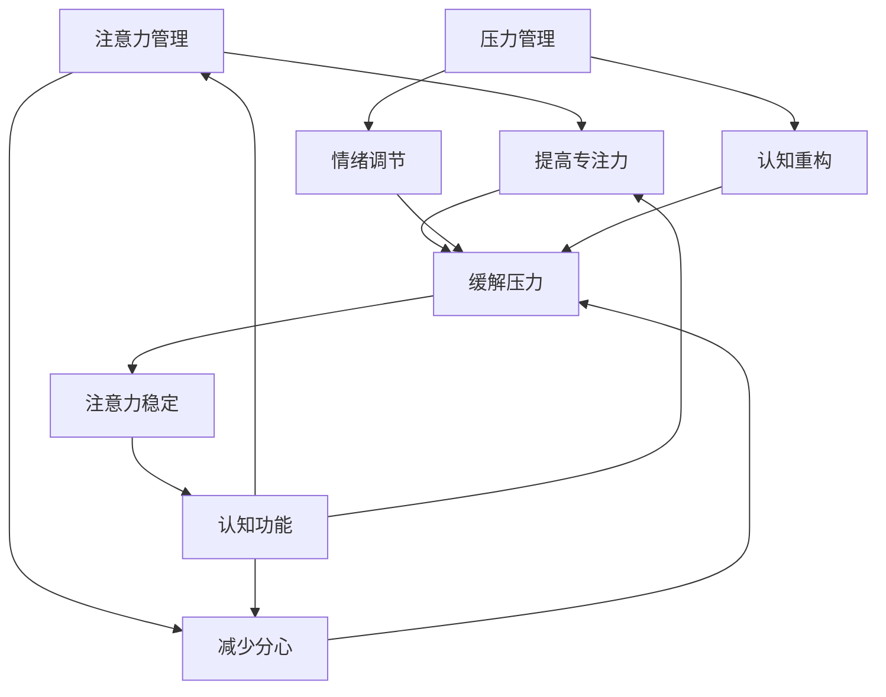

                 

### 文章标题

注意力管理与压力管理策略：在压力和焦虑中保持专注

### 关键词

注意力管理、压力管理、认知行为、情绪调节、生物传感、人工智能、时间管理、正念冥想

### 摘要

本文探讨了注意力管理与压力管理的核心概念、理论基础以及在实际场景中的应用。通过分析注意力管理和压力管理的定义与重要性，文章提出了一系列有效的策略和方法，包括认知行为策略、环境调整策略和情绪调节策略。同时，介绍了注意力与压力管理的工具和技术，如番茄工作法、正念应用程序、脑电波追踪器和压力日记应用程序等。通过具体的案例研究和未来趋势分析，本文旨在为读者提供全面的注意力与压力管理指南，帮助他们在压力和焦虑中保持专注。

---

### 第1章：注意力管理与压力管理概述

在当今快节奏、信息爆炸的时代，注意力管理和压力管理已经成为许多人日常生活和工作中不可或缺的部分。注意力管理是指通过调节和控制注意力，以更有效地完成任务和应对挑战。压力管理则是指通过一系列策略和技术来减少压力、应对压力源并提高生活质量。本章将首先定义注意力管理和压力管理，介绍它们的重要性，并探讨两者之间的关系。此外，还将讨论注意力管理与压力管理的理论基础，以及在不同情境中的应用。

#### 1.1.1 注意力管理的定义与重要性

**定义**：注意力管理是一种对自身注意力进行调节和控制的能力，涉及如何有效地分配、保持和恢复注意力。

在日常生活中，我们经常面临各种任务和挑战，如工作、学习、家庭事务等。注意力管理可以帮助我们更高效地处理这些任务，提高工作和学习效率。以下是注意力管理的重要性：

- **提高工作效率**：有效的注意力管理策略可以帮助我们在有限的时间内完成更多任务，减少拖延和分心。
- **增强决策能力**：通过集中注意力，我们可以更清晰地思考问题，做出更明智的决策。
- **改善心理健康**：注意力管理不仅有助于提高工作效率，还能减少焦虑和压力，提高生活质量。

#### 1.1.2 压力管理的定义与类型

**定义**：压力管理是指通过一系列策略和技术来减少压力、应对压力源并提高生活质量。

压力是生活中不可避免的一部分，但过度的压力会对身心健康产生负面影响。因此，学习如何管理压力至关重要。压力管理可以分为以下几种类型：

- **认知行为管理**：这种类型的管理策略涉及改变对压力的认知和反应。例如，通过认知重构来挑战和改变负面的思维模式。
- **情绪调节**：情绪调节策略包括通过呼吸、冥想等方式来调节情绪，以减少压力感。
- **行为调节**：行为调节策略涉及改变行为习惯，如增加运动、保持健康的饮食和睡眠等。

#### 1.1.3 注意力管理与压力管理之间的关系

注意力管理和压力管理之间存在着紧密的联系。有效的注意力管理可以帮助我们更好地应对压力，通过提高专注力和减少分心来降低压力水平。以下是两者之间的关系：

- **相互促进**：注意力管理策略可以缓解压力，因为集中注意力可以减少对压力源的关注，从而降低压力感。
- **相互影响**：压力管理策略也有助于提高注意力管理能力。通过减少压力，个体可以更轻松地集中注意力，从而提高工作效率。

#### 1.1.4 注意力管理与压力管理的理论基础

注意力管理和压力管理的理论基础涉及多个学科领域，包括认知心理学、神经科学和行为医学。以下是这些理论基础的简要概述：

- **认知心理学**：认知心理学提供关于注意力的理论和模型，如注意选择模型、注意分配模型。这些模型帮助我们理解注意力是如何工作的，以及如何通过调节注意力来提高工作效率。
- **神经科学**：神经科学研究大脑如何处理注意力，以及与压力相关的神经机制。例如，研究表明，大脑中的前额叶皮层与注意力调节有关，而杏仁核则与压力反应有关。
- **行为医学**：行为医学研究压力对健康的影响，以及如何通过行为干预来管理压力。例如，行为医学研究表明，运动和健康饮食有助于减轻压力，改善心理健康。

#### 1.1.5 注意力管理与压力管理在不同情境中的应用

注意力管理和压力管理可以在不同的情境中应用，包括工作环境、个人生活和社交场景等。以下是这些情境中的一些应用示例：

- **工作环境**：在职场中，注意力管理可以通过时间管理和任务优先级设置来减轻工作压力。例如，使用番茄工作法来提高工作效率，减少拖延。
- **个人生活**：在个人生活中，压力管理可以通过运动、放松技巧和社交活动来平衡个人生活与工作。例如，定期进行瑜伽和冥想，以缓解压力和焦虑。
- **社交场景**：在社交场景中，注意力管理可以帮助我们更好地处理人际交往中的压力。例如，通过正念冥想和情绪调节策略来提高社交能力和情绪稳定性。

#### 1.1.6 注意力管理与压力管理的现状与挑战

随着生活节奏的加快，注意力管理和压力管理的重要性日益凸显。然而，现代生活带来的信息过载和复杂任务增加了注意力管理和压力管理的难度。以下是当前注意力管理与压力管理面临的挑战：

- **信息过载**：随着互联网和社交媒体的普及，人们面临越来越多的信息，这使得注意力管理变得更加困难。
- **复杂任务**：现代工作中的任务日益复杂，需要更高的专注力和决策能力，这对压力管理提出了更高的要求。

#### 1.1.7 注意力管理与压力管理的研究趋势

未来，注意力管理和压力管理的研究趋势将集中在以下几个方面：

- **人工智能和机器学习**：人工智能和机器学习技术将被用于开发更智能、个性化的注意力管理和压力管理解决方案。
- **生物传感技术**：生物传感技术将被用于实时监测个体的生理和情绪状态，为注意力管理和压力管理提供数据支持。
- **大数据分析**：大数据分析技术将被用于分析个体行为模式和压力反应，以开发更有效的压力管理策略。

---

## 1.1.3 注意力管理与压力管理之间的关系

注意力管理与压力管理之间存在密切的联系和相互影响。以下是对两者之间关系的详细探讨：

### 1.1.3.1 注意力管理如何缓解压力

注意力管理可以帮助个体减少压力，通过以下几个关键方面实现：

1. **减少分心**：通过集中注意力，个体可以避免被不重要的干扰所分散，从而专注于当前任务，减少任务完成过程中的压力。
2. **提高效率**：有效的注意力管理可以提高工作或学习效率，减少因任务拖延或重复而产生的焦虑和压力。
3. **情绪调节**：通过注意力管理，个体可以更好地控制情绪反应，减少因情绪波动带来的压力。

### 1.1.3.2 压力管理如何影响注意力

压力管理对注意力管理也有重要影响：

1. **影响注意力分配**：过度的压力可能导致个体难以集中注意力，因为大脑在处理压力反应时需要大量资源。
2. **干扰注意力稳定**：长期的慢性压力可能导致注意力分散，影响个体的专注力。
3. **影响认知功能**：压力会影响大脑的认知功能，如记忆、决策和执行功能，这些功能的下降会进一步影响注意力管理。

### 1.1.3.3 注意力管理与压力管理的相互关系架构

为了更好地理解注意力管理与压力管理之间的关系，我们可以使用Mermaid流程图来构建一个简化的关系架构。以下是一个示例：

在这个流程图中，我们可以看到注意力管理和压力管理之间的双向互动。注意力管理通过提高专注力和减少分心来缓解压力，而压力管理通过情绪调节和认知重构来间接影响注意力管理和认知功能。

### 1.1.3.4 注意力管理与压力管理的应用案例

为了更好地理解注意力管理与压力管理之间的关系，以下是几个实际应用案例：

- **案例1**：一位职场人士在使用番茄工作法进行时间管理时，通过集中注意力提高了工作效率，从而减轻了工作压力。同时，通过定期进行深呼吸和冥想练习，他有效地调节了情绪，进一步缓解了压力。
- **案例2**：一位大学生在学习过程中发现，通过正念冥想和合理的时间管理，他的注意力得到了显著提升，从而能够更好地应对考试压力。此外，通过社交支持和情绪调节策略，他有效地缓解了学习压力。
- **案例3**：一家IT公司的管理层通过组织压力管理培训，帮助员工掌握了注意力管理和情绪调节技巧，从而提高了团队的协作效率和员工的满意度。

这些案例表明，注意力管理与压力管理之间的有效结合可以带来显著的个人和团队效益。

综上所述，注意力管理和压力管理之间存在着密切的联系和相互影响。通过理解两者之间的关系，我们可以制定更全面的策略，帮助个体在压力和焦虑中保持专注。

---

## 1.1.4 注意力管理与压力管理的理论基础

注意力管理与压力管理的理论基础涉及多个学科领域，包括认知心理学、神经科学和行为医学。以下是对这些理论基础的详细探讨：

### 1.1.4.1 认知心理学的理论

认知心理学提供了一系列关于注意力的理论和模型，这些理论有助于我们理解注意力管理的工作原理。

- **注意选择模型**：该模型认为注意力是一种有限的资源，个体在处理外部信息时需要主动选择关注某些信息而忽略其他信息。通过注意选择模型，个体可以更有效地调节和分配注意力资源。
- **注意分配模型**：该模型认为注意力不仅涉及选择关注哪些信息，还涉及如何在不同任务之间分配注意力。有效的注意分配策略可以帮助个体在多任务处理时保持高效。
- **工作记忆模型**：工作记忆是注意力管理的重要组成部分，它涉及对当前任务相关信息进行临时存储和操作。通过提升工作记忆能力，个体可以更好地保持注意力集中。

### 1.1.4.2 神经科学的理论

神经科学研究大脑如何处理注意力，以及与压力相关的神经机制。

- **大脑皮层功能**：大脑皮层，尤其是前额叶皮层，与注意力调节密切相关。前额叶皮层负责执行功能，包括注意力分配、规划和决策。通过训练和练习，个体可以提高前额叶皮层的功能，从而改善注意力管理。
- **神经递质**：神经递质是大脑中传递信息的化学物质，它们在注意力管理和压力调节中起着关键作用。例如，多巴胺和去甲肾上腺素与注意力集中和动机相关，而5-羟色胺与情绪调节相关。
- **大脑神经网络**：研究表明，大脑中的多个神经网络在注意力管理和压力响应中协同工作。例如，默认模式网络（DMN）与自我反思和内在情绪状态有关，而执行网络（EN）与外部注意力调节和任务执行有关。

### 1.1.4.3 行为医学的理论

行为医学关注行为对健康的影响，并研究如何通过行为干预来管理压力。

- **行为疗法**：行为疗法，如认知行为疗法（CBT），通过帮助个体识别和改变负面思维模式，来降低压力和焦虑。CBT强调注意力管理和情绪调节技巧，帮助个体更好地应对压力。
- **健康行为**：健康行为，如运动、饮食和睡眠，对压力管理和注意力管理至关重要。研究表明，定期的体育锻炼可以释放内啡肽，改善情绪和注意力，而健康的饮食和充足的睡眠有助于减少压力。
- **社会支持**：社会支持是压力管理的重要组成部分。通过与家人、朋友和社区建立紧密联系，个体可以获得情感支持和实际帮助，从而减轻压力。

### 1.1.4.4 理论基础的应用

注意力管理与压力管理的理论基础在实际应用中具有重要意义。以下是一些具体应用：

- **认知行为疗法**：认知行为疗法（CBT）通过帮助个体识别和改变负面思维模式，提供实用的注意力管理和压力管理技巧。例如，通过认知重构，个体可以学会以更积极的方式看待压力情境，减少焦虑和压力感。
- **神经可塑性训练**：神经可塑性训练，如冥想和认知训练，可以通过改变大脑结构和功能来改善注意力管理和压力调节。例如，正念冥想已被证明可以增强前额叶皮层的功能，提高注意力和情绪调节能力。
- **健康生活方式**：通过健康的生活方式，如定期锻炼、健康饮食和充足睡眠，个体可以改善整体健康状况，从而提高注意力管理和压力管理能力。例如，运动可以释放内啡肽，提高情绪和注意力，而良好的睡眠有助于恢复认知功能。

总之，注意力管理与压力管理的理论基础涵盖了认知心理学、神经科学和行为医学等多个学科。通过理解这些理论基础，我们可以更有效地制定和实施注意力管理和压力管理策略，提高生活质量。

---

## 1.1.5 注意力管理与压力管理在不同情境中的应用

注意力管理和压力管理在不同的情境中具有广泛的应用，以下是对这些应用的具体分析：

### 1.1.5.1 工作环境

在工作环境中，注意力管理和压力管理至关重要。高效的工作依赖于个体能够集中注意力并有效地应对压力。以下是几种常见应用策略：

- **时间管理**：通过时间管理工具，如番茄工作法，个体可以将工作时间分割成25分钟的工作块和5分钟的休息时间，以保持注意力集中。这种方法有助于提高工作效率，减少任务拖延和压力。
- **任务优先级设置**：设置任务优先级是另一个关键策略。通过识别和优先处理最重要的任务，个体可以更有效地利用时间，减少压力。例如，使用“艾森豪威尔矩阵”来分类和优先处理任务，有助于集中注意力。
- **工作环境优化**：创造一个有利于专注和减少干扰的工作环境也是重要的。这可以通过减少噪音、保持工作区域整洁、使用隔音设备等方式实现。一个安静、有序的工作环境有助于个体更好地管理注意力。

### 1.1.5.2 个人生活

在个人生活中，注意力管理和压力管理同样重要。通过以下策略，个体可以更好地平衡工作与生活，减少压力：

- **运动和锻炼**：定期进行体育锻炼，如跑步、瑜伽或游泳，可以帮助释放压力，提高情绪和注意力。运动不仅有助于身体健康，还能增强心理韧性，提高注意力管理能力。
- **放松技巧**：学习放松技巧，如深呼吸、冥想和渐进性肌肉放松，可以在压力较大的时刻帮助个体缓解紧张和焦虑。这些技巧有助于提高注意力的稳定性，使个体能够更好地应对日常生活中的压力源。
- **社交活动**：与家人、朋友和同事保持良好的社交联系是压力管理的重要组成部分。通过社交活动，个体可以获得情感支持和实际帮助，从而减轻压力。社交互动还可以提高情绪，增强心理韧性。

### 1.1.5.3 教育环境

在教育环境中，注意力管理和压力管理对学生的学习效果和心理健康至关重要。以下是几种常见的应用策略：

- **学习策略**：教师可以教授学生时间管理和任务优先级的设置技巧，帮助他们更有效地分配注意力。例如，使用番茄工作法来安排学习时间，确保学生在学习过程中保持专注。
- **情绪调节**：教师可以通过课堂活动和学生辅导，帮助学生掌握情绪调节技巧，如深呼吸、冥想和正念练习。这些技巧有助于学生在面对考试和学业压力时保持冷静和专注。
- **家庭和学校合作**：家庭和学校之间的合作对于学生的注意力管理和压力管理至关重要。通过家长会议和定期的沟通，家长和教师可以共同关注学生的压力水平，并提供必要的支持和资源。

### 1.1.5.4 社交场景

在社交场景中，注意力管理和压力管理同样重要。有效的管理技巧可以帮助个体在社交互动中保持专注和情绪稳定：

- **社交技巧**：通过社交技巧的练习，个体可以更好地处理社交压力。例如，学习如何倾听他人、表达自己，以及如何在社交场合中保持自信和舒适。
- **正念冥想**：正念冥想是一种强大的情绪调节工具，可以帮助个体在社交互动中保持专注和冷静。通过正念练习，个体可以学会更好地管理自己的情绪反应，减少社交压力。
- **社交支持**：建立和维护良好的社交支持网络对于应对社交压力至关重要。通过参与社区活动、加入兴趣小组或与朋友定期聚会，个体可以获得情感支持和实际帮助，从而减轻社交压力。

总之，注意力管理和压力管理在不同情境中的应用具有广泛的影响。通过掌握和应用这些策略，个体可以更好地应对日常生活中的各种压力，提高生活质量。

---

## 1.1.6 注意力管理与压力管理的现状与挑战

随着社会的快速发展和生活节奏的加快，注意力管理和压力管理已经成为当今社会的一个热门话题。然而，尽管人们对注意力管理和压力管理的重要性有了一定的认识，但在实际应用中仍然面临许多挑战。

### 1.1.6.1 注意力管理与压力管理的现状

1. **公众意识的提高**：随着心理学、神经科学和医学等领域的不断发展，越来越多的人开始意识到注意力管理和压力管理的重要性。许多公司和组织也开始重视员工的压力管理和心理健康，并提供相关的培训和资源。
2. **技术工具的应用**：智能手机、平板电脑和其他数字设备上的应用程序，如番茄工作法、正念冥想和压力日记等，为人们提供了方便的注意力管理和压力管理工具。这些工具可以帮助用户更好地分配注意力、进行放松练习和跟踪压力水平。
3. **学术研究的发展**：近年来，关于注意力管理和压力管理的研究取得了显著进展。学者们通过实验和实证研究，不断探索有效的注意力管理和压力管理策略，为公众提供了科学依据。

### 1.1.6.2 注意力管理与压力管理的挑战

1. **信息过载**：随着互联网和社交媒体的普及，人们每天接收到的信息量呈指数级增长。这导致个体在处理信息时面临更大的压力，注意力容易分散，影响工作和生活质量。
2. **复杂任务**：现代社会中，工作任务和学业任务日益复杂，需要个体具备更高的注意力和决策能力。然而，许多人在面对复杂任务时，往往感到力不从心，压力增大。
3. **心理健康问题**：长时间的压力和注意力管理不当可能导致心理健康问题，如焦虑、抑郁和睡眠障碍。这些问题不仅影响个体的日常生活，还可能导致工作效率和学业成绩下降。
4. **技术依赖**：随着技术工具的普及，一些人过度依赖这些工具来管理注意力和压力。这可能导致他们在没有这些工具的情况下，难以自我调节注意力，甚至出现焦虑和依赖症状。

### 1.1.6.3 应对策略

为了应对注意力管理和压力管理的挑战，可以采取以下策略：

1. **提高自我意识**：个体应该意识到自己的注意力分布和压力水平，并主动寻求改善。例如，通过记录每日任务和压力事件，个体可以更好地了解自己的注意力分布和压力源。
2. **综合运用策略**：结合多种注意力管理和压力管理策略，如时间管理、情绪调节、运动和放松技巧等，可以更全面地应对压力。
3. **技术工具的合理使用**：虽然技术工具在注意力管理和压力管理中起到重要作用，但个体应该学会合理使用这些工具，避免过度依赖。
4. **寻求专业帮助**：如果个体在注意力管理和压力管理方面遇到困难，可以寻求心理咨询师、医生或其他专业人士的帮助。他们可以提供个性化的建议和支持，帮助个体克服困难。

总之，注意力管理和压力管理在现代社会中具有重要意义。虽然面临着一些挑战，但通过采取有效的策略和方法，个体可以更好地管理自己的注意力和压力，提高生活质量。

---

## 1.1.7 注意力管理与压力管理的研究趋势

未来，注意力管理和压力管理的研究将继续向更个性化和高效的方向发展。以下是一些值得关注的研究趋势：

### 1.1.7.1 人工智能和机器学习技术

人工智能和机器学习技术在注意力管理和压力管理中的应用前景广阔。通过分析大量数据，人工智能可以识别个体在注意力管理和压力反应中的模式，提供个性化的解决方案。例如，智能手表和健康应用程序可以利用机器学习算法，根据用户的行为数据，提供个性化的提醒和建议，帮助用户更好地管理注意力。

### 1.1.7.2 生物传感技术

生物传感技术将进一步提升注意力管理和压力管理的精确性。通过实时监测心率、皮肤电导率和脑电波等生理信号，生物传感设备可以提供关于个体注意力和压力水平的高精度数据。这些数据将有助于开发更有效的干预策略，如个性化的放松练习和情绪调节方法。

### 1.1.7.3 大数据和数据分析

大数据和数据分析技术将在未来注意力管理和压力管理研究中发挥重要作用。通过对大规模数据集的分析，研究人员可以识别注意力管理和压力管理中的潜在关联，开发新的预测模型。例如，通过分析社交媒体数据，可以预测个体在特定情境下的压力反应，从而提前采取干预措施。

### 1.1.7.4 个性化解决方案

随着技术的发展，未来注意力管理和压力管理将更加个性化。基于个体行为、生理和心理健康数据，个性化解决方案将为用户提供量身定制的干预策略。例如，虚拟现实（VR）和增强现实（AR）技术可以创建个性化的放松和训练场景，帮助用户在压力环境中保持专注。

### 1.1.7.5 教育和职业培训

未来，注意力管理和压力管理将更多地融入教育和职业培训中。学校和企业将提供更多关于注意力管理和压力管理的课程和培训，帮助个体掌握相关技能。这些培训将不仅关注理论知识的传授，还将强调实践应用，帮助个体在日常生活中有效地管理注意力和压力。

总之，未来注意力管理和压力管理的研究将继续向个性化和高效化发展。通过结合人工智能、生物传感和大数据等技术，研究人员将开发出更精确、有效的干预策略，帮助个体更好地管理注意力和压力，提高生活质量。

---

## 1.1.7 注意力管理与压力管理的研究趋势

未来，注意力管理和压力管理的研究将继续向更个性化和高效的方向发展。以下是一些值得关注的研究趋势：

### 1.1.7.1 人工智能和机器学习技术

人工智能和机器学习技术在注意力管理和压力管理中的应用前景广阔。通过分析大量数据，人工智能可以识别个体在注意力管理和压力反应中的模式，提供个性化的解决方案。例如，智能手表和健康应用程序可以利用机器学习算法，根据用户的行为数据，提供个性化的提醒和建议，帮助用户更好地管理注意力。

### 1.1.7.2 生物传感技术

生物传感技术将进一步提升注意力管理和压力管理的精确性。通过实时监测心率、皮肤电导率和脑电波等生理信号，生物传感设备可以提供关于个体注意力和压力水平的高精度数据。这些数据将有助于开发更有效的干预策略，如个性化的放松练习和情绪调节方法。

### 1.1.7.3 大数据和数据分析

大数据和数据分析技术将在未来注意力管理和压力管理研究中发挥重要作用。通过对大规模数据集的分析，研究人员可以识别注意力管理和压力管理中的潜在关联，开发新的预测模型。例如，通过分析社交媒体数据，可以预测个体在特定情境下的压力反应，从而提前采取干预措施。

### 1.1.7.4 个性化解决方案

随着技术的发展，未来注意力管理和压力管理将更加个性化。基于个体行为、生理和心理健康数据，个性化解决方案将为用户提供量身定制的干预策略。例如，虚拟现实（VR）和增强现实（AR）技术可以创建个性化的放松和训练场景，帮助用户在压力环境中保持专注。

### 1.1.7.5 教育和职业培训

未来，注意力管理和压力管理将更多地融入教育和职业培训中。学校和企业将提供更多关于注意力管理和压力管理的课程和培训，帮助个体掌握相关技能。这些培训将不仅关注理论知识的传授，还将强调实践应用，帮助个体在日常生活中有效地管理注意力和压力。

总之，未来注意力管理和压力管理的研究将继续向个性化和高效化发展。通过结合人工智能、生物传感和大数据等技术，研究人员将开发出更精确、有效的干预策略，帮助个体更好地管理注意力和压力，提高生活质量。

---

## 1.2 注意力管理策略与方法

注意力管理策略与方法是提高注意力集中度和效率的关键。有效的注意力管理可以帮助我们更好地应对各种任务和挑战，从而提高工作和学习效率。以下是一些常见的注意力管理策略和方法。

### 2.1 认知行为策略

**2.1.1 正念冥想**

**定义**：正念冥想是一种通过专注、观察和接受当下的思维和感受来培养注意力集中的方法。

**原理**：通过冥想，个体能够减少杂念，增强专注力，从而更好地管理注意力。

**实践**：每日固定时间进行冥想，逐步增加冥想时间，以增强注意力管理的技巧。

**2.1.2 时间管理和任务优先级设置**

**定义**：时间管理和任务优先级设置是通过合理安排时间、优先处理重要任务来提高工作效率。

**原理**：通过有效的时间管理，可以减少干扰，提高注意力集中度。

**实践**：使用时间管理工具，如番茄工作法，合理安排工作和休息时间，提高注意力效率。

### 2.2 环境调整策略

**2.2.1 减少干扰**

**定义**：减少干扰是指通过减少环境中的干扰因素来提高注意力集中度。

**原理**：减少干扰可以减少注意力的分散，使个体更容易集中注意力。

**实践**：在专注工作时，关闭手机通知，选择安静的工作环境，避免多任务处理。

**2.2.2 提高环境舒适度**

**定义**：提高环境舒适度是指通过调整环境条件来增强个体的注意力管理能力。

**原理**：舒适的环境可以减少压力，提高个体的注意力和工作满意度。

**实践**：保持工作环境的整洁和适宜的温度，使用符合人体工程学的办公设备，以提升工作效率。

### 2.3 情绪调节策略

**2.3.1 深呼吸和放松技巧**

**定义**：深呼吸和放松技巧是通过调节呼吸和放松身体来缓解压力，提高注意力集中度。

**原理**：深呼吸可以促进身体放松，减少紧张和焦虑，从而改善注意力。

**实践**：在感到压力时，进行几次深呼吸，感受身体的放松，从而更好地集中注意力。

**2.3.2 情绪管理技巧**

**定义**：情绪管理技巧是通过认知和行为策略来控制和管理情绪。

**原理**：有效的情绪管理可以减少情绪波动，提高注意力的稳定性和集中度。

**实践**：使用情绪日记记录自己的情绪变化，学习认知重构技巧，以积极的态度应对挑战。

### 2.4 运动与注意力管理

**2.4.1 运动对注意力的积极影响**

**定义**：运动对注意力的积极影响是指通过运动来提高注意力的集中度和稳定性。

**原理**：运动可以促进大脑血液循环，增加神经递质的分泌，从而改善注意力。

**实践**：定期进行有氧运动，如跑步、游泳或骑自行车，以提升注意力管理能力。

**2.4.2 运动计划制定与执行**

**定义**：运动计划制定与执行是指通过合理规划运动时间和方式来确保运动的持续性和有效性。

**原理**：有计划的运动可以提高运动的持续性和效果，从而更好地管理注意力。

**实践**：制定每周运动计划，坚持运动，定期评估运动效果，并根据实际情况进行调整。

---

### 2.1 认知行为策略

#### 2.1.1 正念冥想

**定义**：正念冥想是一种通过专注、观察和接受当下的思维和感受来培养注意力集中的方法。

**原理**：通过冥想，个体能够减少杂念，增强专注力，从而更好地管理注意力。

**实践**：每日固定时间进行冥想，逐步增加冥想时间，以增强注意力管理的技巧。

#### 2.1.2 时间管理和任务优先级设置

**定义**：时间管理和任务优先级设置是通过合理安排时间、优先处理重要任务来提高工作效率。

**原理**：通过有效的时间管理，可以减少干扰，提高注意力集中度。

**实践**：使用时间管理工具，如番茄工作法，合理安排工作和休息时间，提高注意力效率。

---

## 2.1 认知行为策略

### 2.1.1 正念冥想

**定义**：正念冥想是一种通过专注、观察和接受当下的思维和感受来培养注意力集中的方法。

**原理**：通过冥想，个体能够减少杂念，增强专注力，从而更好地管理注意力。

**实践**：每日固定时间进行冥想，逐步增加冥想时间，以增强注意力管理的技巧。

### 2.1.2 时间管理和任务优先级设置

**定义**：时间管理和任务优先级设置是通过合理安排时间、优先处理重要任务来提高工作效率。

**原理**：通过有效的时间管理，可以减少干扰，提高注意力集中度。

**实践**：使用时间管理工具，如番茄工作法，合理安排工作和休息时间，提高注意力效率。

---

### 2.2 环境调整策略

#### 2.2.1 减少干扰

**定义**：减少干扰是指通过减少环境中的干扰因素来提高注意力集中度。

**原理**：减少干扰可以减少注意力的分散，使个体更容易集中注意力。

**实践**：在专注工作时，关闭手机通知，选择安静的工作环境，避免多任务处理。

#### 2.2.2 提高环境舒适度

**定义**：提高环境舒适度是指通过调整环境条件来增强个体的注意力管理能力。

**原理**：舒适的环境可以减少压力，提高个体的注意力和工作满意度。

**实践**：保持工作环境的整洁和适宜的温度，使用符合人体工程学的办公设备，以提升工作效率。

---

### 2.2 环境调整策略

#### 2.2.1 减少干扰

**定义**：减少干扰是指通过减少环境中的干扰因素来提高注意力集中度。

**原理**：减少干扰可以减少注意力的分散，使个体更容易集中注意力。

**实践**：在专注工作时，关闭手机通知，选择安静的工作环境，避免多任务处理。

#### 2.2.2 提高环境舒适度

**定义**：提高环境舒适度是指通过调整环境条件来增强个体的注意力管理能力。

**原理**：舒适的环境可以减少压力，提高个体的注意力和工作满意度。

**实践**：保持工作环境的整洁和适宜的温度，使用符合人体工程学的办公设备，以提升工作效率。

---

### 2.3 情绪调节策略

#### 2.3.1 深呼吸和放松技巧

**定义**：深呼吸和放松技巧是通过调节呼吸和放松身体来缓解压力，提高注意力集中度。

**原理**：深呼吸可以促进身体放松，减少紧张和焦虑，从而改善注意力。

**实践**：在感到压力时，进行几次深呼吸，感受身体的放松，从而更好地集中注意力。

#### 2.3.2 情绪管理技巧

**定义**：情绪管理技巧是通过认知和行为策略来控制和管理情绪。

**原理**：有效的情绪管理可以减少情绪波动，提高注意力的稳定性和集中度。

**实践**：使用情绪日记记录自己的情绪变化，学习认知重构技巧，以积极的态度应对挑战。

---

### 2.3 情绪调节策略

#### 2.3.1 深呼吸和放松技巧

**定义**：深呼吸和放松技巧是通过调节呼吸和放松身体来缓解压力，提高注意力集中度。

**原理**：深呼吸可以促进身体放松，减少紧张和焦虑，从而改善注意力。

**实践**：在感到压力时，进行几次深呼吸，感受身体的放松，从而更好地集中注意力。

#### 2.3.2 情绪管理技巧

**定义**：情绪管理技巧是通过认知和行为策略来控制和管理情绪。

**原理**：有效的情绪管理可以减少情绪波动，提高注意力的稳定性和集中度。

**实践**：使用情绪日记记录自己的情绪变化，学习认知重构技巧，以积极的态度应对挑战。

---

### 2.4 运动与注意力管理

#### 2.4.1 运动对注意力的积极影响

**定义**：运动对注意力的积极影响是指通过运动来提高注意力的集中度和稳定性。

**原理**：运动可以促进大脑血液循环，增加神经递质的分泌，从而改善注意力。

**实践**：定期进行有氧运动，如跑步、游泳或骑自行车，以提升注意力管理能力。

#### 2.4.2 运动计划制定与执行

**定义**：运动计划制定与执行是指通过合理规划运动时间和方式来确保运动的持续性和有效性。

**原理**：有计划的运动可以提高运动的持续性和效果，从而更好地管理注意力。

**实践**：制定每周运动计划，坚持运动，定期评估运动效果，并根据实际情况进行调整。

---

### 2.4 运动与注意力管理

#### 2.4.1 运动对注意力的积极影响

**定义**：运动对注意力的积极影响是指通过运动来提高注意力的集中度和稳定性。

**原理**：运动可以促进大脑血液循环，增加神经递质的分泌，从而改善注意力。

**实践**：定期进行有氧运动，如跑步、游泳或骑自行车，以提升注意力管理能力。

#### 2.4.2 运动计划制定与执行

**定义**：运动计划制定与执行是指通过合理规划运动时间和方式来确保运动的持续性和有效性。

**原理**：有计划的运动可以提高运动的持续性和效果，从而更好地管理注意力。

**实践**：制定每周运动计划，坚持运动，定期评估运动效果，并根据实际情况进行调整。

---

### 第3章：压力管理策略与方法

#### 3.1 认知行为策略

##### 3.1.1 认知重构

**定义**：认知重构是一种通过识别和挑战负面思维模式来改变对压力的认知的方法。

**原理**：通过认知重构，个体可以减少对压力的认知失调，从而降低压力水平。

**实践**：记录压力反应中的负面思维，通过替代性思维来改变这些认知。

##### 3.1.2 情绪调节策略

**定义**：情绪调节策略是通过调节情绪反应来减轻压力的方法。

**原理**：情绪调节可以帮助个体在压力情境中保持冷静和理智，从而更好地应对挑战。

**实践**：使用呼吸练习、肌肉放松和其他放松技巧来缓解压力。

#### 3.2 环境调整策略

##### 3.2.1 环境优化

**定义**：环境优化是指通过改善物理环境和社交环境来减少压力源。

**原理**：一个舒适和有益的工作或生活环境可以降低压力水平，提高生活质量。

**实践**：创造一个有序、整洁的工作环境，确保足够的休息和社交时间。

##### 3.2.2 社会支持

**定义**：社会支持是指通过与他人交流和寻求帮助来减轻压力。

**原理**：社会支持可以提供情感支持、信息资源和实际帮助，从而减轻压力负担。

**实践**：与家人、朋友或同事建立良好的沟通，积极参与社交活动。

#### 3.3 身体保健策略

##### 3.3.1 锻炼和运动

**定义**：锻炼和运动是通过身体活动来减轻压力的方法。

**原理**：运动可以促进身体释放内啡肽，提高情绪，减少压力感。

**实践**：定期进行有氧运动，如跑步、游泳或骑自行车，以降低长期压力。

##### 3.3.2 健康饮食

**定义**：健康饮食是通过摄入营养均衡的食物来促进身体健康，从而减轻压力。

**原理**：健康饮食可以提供能量，减少焦虑和压力，提高整体健康水平。

**实践**：遵循地中海饮食模式，确保饮食中包含丰富的蔬菜、水果和全谷物。

#### 3.4 心理辅导与咨询

##### 3.4.1 咨询与治疗

**定义**：咨询与治疗是通过专业的心理辅导来帮助个体理解和应对压力。

**原理**：心理咨询师可以提供个性化的策略和支持，帮助个体掌握有效的压力管理技巧。

**实践**：寻求专业心理咨询，参加压力管理课程或工作坊。

##### 3.4.2 自我反思与心理成长

**定义**：自我反思与心理成长是通过深入思考和自我探索来提高心理韧性。

**原理**：自我反思可以帮助个体更好地理解自己的情绪和行为，从而更好地管理压力。

**实践**：定期进行自我反思，记录日常生活中的压力源和应对策略，逐步提高自我认知。

---

### 第3章：压力管理策略与方法

#### 3.1 认知行为策略

##### 3.1.1 认知重构

**定义**：认知重构是一种通过识别和挑战负面思维模式来改变对压力的认知的方法。

**原理**：通过认知重构，个体可以减少对压力的认知失调，从而降低压力水平。

**实践**：记录压力反应中的负面思维，通过替代性思维来改变这些认知。

##### 3.1.2 情绪调节策略

**定义**：情绪调节策略是通过调节情绪反应来减轻压力的方法。

**原理**：情绪调节可以帮助个体在压力情境中保持冷静和理智，从而更好地应对挑战。

**实践**：使用呼吸练习、肌肉放松和其他放松技巧来缓解压力。

#### 3.2 环境调整策略

##### 3.2.1 环境优化

**定义**：环境优化是指通过改善物理环境和社交环境来减少压力源。

**原理**：一个舒适和有益的工作或生活环境可以降低压力水平，提高生活质量。

**实践**：创造一个有序、整洁的工作环境，确保足够的休息和社交时间。

##### 3.2.2 社会支持

**定义**：社会支持是指通过与他人交流和寻求帮助来减轻压力。

**原理**：社会支持可以提供情感支持、信息资源和实际帮助，从而减轻压力负担。

**实践**：与家人、朋友或同事建立良好的沟通，积极参与社交活动。

#### 3.3 身体保健策略

##### 3.3.1 锻炼和运动

**定义**：锻炼和运动是通过身体活动来减轻压力的方法。

**原理**：运动可以促进身体释放内啡肽，提高情绪，减少压力感。

**实践**：定期进行有氧运动，如跑步、游泳或骑自行车，以降低长期压力。

##### 3.3.2 健康饮食

**定义**：健康饮食是通过摄入营养均衡的食物来促进身体健康，从而减轻压力。

**原理**：健康饮食可以提供能量，减少焦虑和压力，提高整体健康水平。

**实践**：遵循地中海饮食模式，确保饮食中包含丰富的蔬菜、水果和全谷物。

#### 3.4 心理辅导与咨询

##### 3.4.1 咨询与治疗

**定义**：咨询与治疗是通过专业的心理辅导来帮助个体理解和应对压力。

**原理**：心理咨询师可以提供个性化的策略和支持，帮助个体掌握有效的压力管理技巧。

**实践**：寻求专业心理咨询，参加压力管理课程或工作坊。

##### 3.4.2 自我反思与心理成长

**定义**：自我反思与心理成长是通过深入思考和自我探索来提高心理韧性。

**原理**：自我反思可以帮助个体更好地理解自己的情绪和行为，从而更好地管理压力。

**实践**：定期进行自我反思，记录日常生活中的压力源和应对策略，逐步提高自我认知。

---

### 第4章：注意力与压力管理工具与技术

#### 4.1 专注力提升工具

##### 4.1.1 番茄工作法

**定义**：番茄工作法是一种基于时间管理的技术，通过将工作时间分割成25分钟的工作块和5分钟的休息时间来提高专注力。

**原理**：这种方法通过设置明确的专注时间和休息时间，帮助个体集中注意力并提高工作效率。

**实践**：使用番茄工作法应用程序或计时器，设定工作时间和休息时间，坚持执行。

##### 4.1.2 正念应用程序

**定义**：正念应用程序提供一系列冥想和放松练习，帮助用户提高专注力和情绪调节能力。

**原理**：这些应用程序通过指导用户进行深呼吸、身体扫描和正念冥想等练习，增强个体的注意力管理和情绪稳定性。

**实践**：下载并使用正念应用程序，如Headspace或Calm，每天进行冥想和放松练习。

#### 4.2 压力管理应用程序

##### 4.2.1 压力日记应用程序

**定义**：压力日记应用程序帮助用户记录和追踪日常生活中的压力源和压力反应。

**原理**：通过记录压力事件，用户可以更好地理解自己的压力模式，并采取相应的应对策略。

**实践**：使用压力日记应用程序，如Stress Tracker或My Stress Buddy，记录压力源和应对方法。

##### 4.2.2 呼吸练习应用程序

**定义**：呼吸练习应用程序提供指导用户进行深呼吸和其他放松技巧的工具。

**原理**：深呼吸有助于降低心率和血压，减少压力和焦虑。

**实践**：使用呼吸练习应用程序，如Breethe或Simple Breath，按照指导进行深呼吸练习。

#### 4.3 注意力追踪技术

##### 4.3.1 脑电波追踪器

**定义**：脑电波追踪器通过监测大脑的电活动来评估注意力和压力水平。

**原理**：脑电波活动与注意力状态有关，通过分析脑电波，可以了解个体的注意力变化。

**实践**：使用脑电波追踪器，如NeuroSky MindWave或Thync headband，进行实时注意力监测。

##### 4.3.2 眼动追踪技术

**定义**：眼动追踪技术通过监测眼睛的运动来分析注意力的集中度和分散程度。

**原理**：眼动追踪可以提供关于个体注意力分配和任务执行情况的详细信息。

**实践**：使用眼动追踪应用程序或设备，如eyeSee Ambassador或Smilesoft Eyegaze，进行注意力追踪和分析。

#### 4.4 数据分析与跟踪工具

##### 4.4.1 压力数据跟踪

**定义**：压力数据跟踪工具帮助用户记录和分析日常生活中的压力数据。

**原理**：通过收集和分析压力数据，用户可以识别压力模式和有效的应对策略。

**实践**：使用压力数据跟踪工具，如StressCheck或Headspace Insight，跟踪和分析个人压力状况。

##### 4.4.2 注意力数据跟踪

**定义**：注意力数据跟踪工具帮助用户记录和分析日常生活中的注意力使用情况。

**原理**：通过收集和分析注意力数据，用户可以了解自己的注意力模式，并优化时间管理。

**实践**：使用注意力数据跟踪工具，如Focus@Will或RescueTime，跟踪和分析个人注意力使用。

---

### 第4章：注意力与压力管理工具与技术

#### 4.1 专注力提升工具

##### 4.1.1 番茄工作法

**定义**：番茄工作法是一种基于时间管理的技术，通过将工作时间分割成25分钟的工作块和5分钟的休息时间来提高专注力。

**原理**：这种方法通过设置明确的专注时间和休息时间，帮助个体集中注意力并提高工作效率。

**实践**：使用番茄工作法应用程序或计时器，设定工作时间和休息时间，坚持执行。

##### 4.1.2 正念应用程序

**定义**：正念应用程序提供一系列冥想和放松练习，帮助用户提高专注力和情绪调节能力。

**原理**：这些应用程序通过指导用户进行深呼吸、身体扫描和正念冥想等练习，增强个体的注意力管理和情绪稳定性。

**实践**：下载并使用正念应用程序，如Headspace或Calm，每天进行冥想和放松练习。

#### 4.2 压力管理应用程序

##### 4.2.1 压力日记应用程序

**定义**：压力日记应用程序帮助用户记录和追踪日常生活中的压力源和压力反应。

**原理**：通过记录压力事件，用户可以更好地理解自己的压力模式，并采取相应的应对策略。

**实践**：使用压力日记应用程序，如Stress Tracker或My Stress Buddy，记录压力源和应对方法。

##### 4.2.2 呼吸练习应用程序

**定义**：呼吸练习应用程序提供指导用户进行深呼吸和其他放松技巧的工具。

**原理**：深呼吸有助于降低心率和血压，减少压力和焦虑。

**实践**：使用呼吸练习应用程序，如Breethe或Simple Breath，按照指导进行深呼吸练习。

#### 4.3 注意力追踪技术

##### 4.3.1 脑电波追踪器

**定义**：脑电波追踪器通过监测大脑的电活动来评估注意力和压力水平。

**原理**：脑电波活动与注意力状态有关，通过分析脑电波，可以了解个体的注意力变化。

**实践**：使用脑电波追踪器，如NeuroSky MindWave或Thync headband，进行实时注意力监测。

##### 4.3.2 眼动追踪技术

**定义**：眼动追踪技术通过监测眼睛的运动来分析注意力的集中度和分散程度。

**原理**：眼动追踪可以提供关于个体注意力分配和任务执行情况的详细信息。

**实践**：使用眼动追踪应用程序或设备，如eyeSee Ambassador或Smilesoft Eyegaze，进行注意力追踪和分析。

#### 4.4 数据分析与跟踪工具

##### 4.4.1 压力数据跟踪

**定义**：压力数据跟踪工具帮助用户记录和分析日常生活中的压力数据。

**原理**：通过收集和分析压力数据，用户可以识别压力模式和有效的应对策略。

**实践**：使用压力数据跟踪工具，如StressCheck或Headspace Insight，跟踪和分析个人压力状况。

##### 4.4.2 注意力数据跟踪

**定义**：注意力数据跟踪工具帮助用户记录和分析日常生活中的注意力使用情况。

**原理**：通过收集和分析注意力数据，用户可以了解自己的注意力模式，并优化时间管理。

**实践**：使用注意力数据跟踪工具，如Focus@Will或RescueTime，跟踪和分析个人注意力使用。

---

### 第5章：注意力与压力管理在具体场景中的应用

#### 5.1 工作场景

##### 5.1.1 时间管理策略

**定义**：时间管理策略是在工作环境中通过合理安排时间来提高工作效率。

**原理**：合理的时间管理可以帮助员工更好地分配注意力，减少拖延和压力。

**应用**：使用番茄工作法等时间管理工具来划分任务，确保高效率完成工作。

##### 5.1.2 压力管理技巧

**定义**：压力管理技巧是在工作环境中通过一系列方法来减轻工作压力。

**原理**：通过有效的压力管理，可以减少因工作压力导致的心理和生理问题。

**应用**：定期进行深呼吸和放松练习，利用正念冥想应用程序来缓解工作压力。

#### 5.2 教育场景

##### 5.2.1 学习策略

**定义**：学习策略是在教育环境中通过优化学习过程来提高学习效果。

**原理**：有效的学习策略可以帮助学生更好地集中注意力，提高学习效率。

**应用**：使用番茄工作法来安排学习时间，通过正念冥想来提高专注力和学习效果。

##### 5.2.2 教师压力管理

**定义**：教师压力管理是在教育环境中通过一系列方法来减轻教师的工作压力。

**原理**：教师压力管理可以帮助教师更好地应对工作压力，提高教学质量和满意度。

**应用**：教师可以通过定期的运动和放松练习来缓解压力，利用压力日记应用程序来记录和管理压力。

#### 5.3 生活场景

##### 5.3.1 家庭时间管理

**定义**：家庭时间管理是在家庭环境中通过合理安排时间来提高家庭生活质量。

**原理**：合理的时间管理可以帮助家庭成员更好地平衡工作、学习和家庭生活。

**应用**：使用时间管理工具来安排家庭活动时间，确保家庭成员有足够的休息和放松时间。

##### 5.3.2 社交压力管理

**定义**：社交压力管理是在社交环境中通过一系列方法来减轻社交压力。

**原理**：有效的社交压力管理可以帮助个体更好地处理社交互动中的压力。

**应用**：利用社交支持网络，进行定期的深呼吸和放松练习，通过正念冥想来提高社交能力。

---

### 第5章：注意力与压力管理在具体场景中的应用

#### 5.1 工作场景

##### 5.1.1 时间管理策略

**定义**：时间管理策略是在工作环境中通过合理安排时间来提高工作效率。

**原理**：合理的时间管理可以帮助员工更好地分配注意力，减少拖延和压力。

**应用**：使用番茄工作法等时间管理工具来划分任务，确保高效率完成工作。

##### 5.1.2 压力管理技巧

**定义**：压力管理技巧是在工作环境中通过一系列方法来减轻工作压力。

**原理**：通过有效的压力管理，可以减少因工作压力导致的心理和生理问题。

**应用**：定期进行深呼吸和放松练习，利用正念冥想应用程序来缓解工作压力。

#### 5.2 教育场景

##### 5.2.1 学习策略

**定义**：学习策略是在教育环境中通过优化学习过程来提高学习效果。

**原理**：有效的学习策略可以帮助学生更好地集中注意力，提高学习效率。

**应用**：使用番茄工作法来安排学习时间，通过正念冥想来提高专注力和学习效果。

##### 5.2.2 教师压力管理

**定义**：教师压力管理是在教育环境中通过一系列方法来减轻教师的工作压力。

**原理**：教师压力管理可以帮助教师更好地应对工作压力，提高教学质量和满意度。

**应用**：教师可以通过定期的运动和放松练习来缓解压力，利用压力日记应用程序来记录和管理压力。

#### 5.3 生活场景

##### 5.3.1 家庭时间管理

**定义**：家庭时间管理是在家庭环境中通过合理安排时间来提高家庭生活质量。

**原理**：合理的时间管理可以帮助家庭成员更好地平衡工作、学习和家庭生活。

**应用**：使用时间管理工具来安排家庭活动时间，确保家庭成员有足够的休息和放松时间。

##### 5.3.2 社交压力管理

**定义**：社交压力管理是在社交环境中通过一系列方法来减轻社交压力。

**原理**：有效的社交压力管理可以帮助个体更好地处理社交互动中的压力。

**应用**：利用社交支持网络，进行定期的深呼吸和放松练习，通过正念冥想来提高社交能力。

---

### 第6章：注意力与压力管理案例研究

#### 6.1 案例研究1：高效职场人士的注意力与压力管理

**背景**：李明是一位高级项目经理，经常面临多个项目同时进行的挑战，工作压力较大。

**策略**：
- **时间管理**：李明使用番茄工作法来划分任务，将工作分为25分钟的工作块，并在每个工作块后休息5分钟。这种方法帮助他保持专注，减少了任务拖延和压力。
- **情绪调节**：李明定期使用正念冥想应用程序进行放松练习，这帮助他在面对压力时保持冷静，减少焦虑。
- **运动**：李明每天晚上都会进行30分钟的瑜伽练习，这不仅缓解了工作压力，还提高了睡眠质量。

**结果**：通过这些策略，李明的工作效率显著提高，他能够更好地处理多个项目，同时压力感减轻，整体工作表现得到提升。

#### 6.2 案例研究2：学生群体的注意力与压力管理

**背景**：张华是一名大学生，面临着繁重的学业压力和考试压力。

**策略**：
- **学习策略**：张华使用番茄工作法来安排学习时间，将学习时间划分为25分钟的学习块，并在每个学习块后休息5分钟。这种方法帮助他提高学习效率，减少分心。
- **运动**：张华定期参加有氧运动，如跑步和游泳，这些运动帮助他缓解学习压力，提高情绪状态。
- **社交支持**：张华积极参与社交活动，与同学和老师交流，寻求帮助和建议。这种社交支持帮助他减轻了学习压力。

**结果**：通过这些策略，张华的学习效率提高，注意力更加集中，同时通过社交支持减轻了学习压力，整体表现得到改善。

#### 6.3 案例研究3：IT行业的压力管理实践

**背景**：某IT公司的员工经常面临项目截止日期和工作压力。

**策略**：
- **团队支持**：公司组织定期的团队建设活动和压力管理培训，提高员工的团队合作和压力应对能力。
- **工作环境优化**：公司改善工作环境，提供舒适的休息区域，减少干扰因素。
- **心理健康支持**：公司提供心理咨询和健康保险，鼓励员工寻求专业的心理健康服务。

**结果**：通过这些策略，员工的工作压力得到有效缓解，工作效率和质量提高，员工满意度和忠诚度增加。

---

### 第6章：注意力与压力管理案例研究

#### 6.1 案例研究1：高效职场人士的注意力与压力管理

**背景**：李明是一位高级项目经理，经常面临多个项目同时进行的挑战，工作压力较大。

**策略**：
- **时间管理**：李明采用番茄工作法来划分任务，将工作分为25分钟的工作块，并在每个工作块后休息5分钟。这种方法帮助他保持专注，减少了任务拖延和压力。
- **情绪调节**：李明定期使用正念冥想应用程序进行放松练习，这帮助他在面对压力时保持冷静，减少焦虑。
- **运动**：李明每天晚上都会进行30分钟的瑜伽练习，这不仅缓解了工作压力，还提高了睡眠质量。

**结果**：通过这些策略，李明的工作效率显著提高，他能够更好地处理多个项目，同时压力感减轻，整体工作表现得到提升。

#### 6.2 案例研究2：学生群体的注意力与压力管理

**背景**：张华是一名大学生，面临着繁重的学业压力和考试压力。

**策略**：
- **学习策略**：张华采用番茄工作法来安排学习时间，将学习时间划分为25分钟的学习块，并在每个学习块后休息5分钟。这种方法帮助他提高学习效率，减少分心。
- **运动**：张华定期参加有氧运动，如跑步和游泳，这些运动帮助他缓解学习压力，提高情绪状态。
- **社交支持**：张华积极参与社交活动，与同学和老师交流，寻求帮助和建议。这种社交支持帮助他减轻了学习压力。

**结果**：通过这些策略，张华的学习效率提高，注意力更加集中，同时通过社交支持减轻了学习压力，整体表现得到改善。

#### 6.3 案例研究3：IT行业的压力管理实践

**背景**：某IT公司的员工经常面临项目截止日期和工作压力。

**策略**：
- **团队支持**：公司组织定期的团队建设活动和压力管理培训，提高员工的团队合作和压力应对能力。
- **工作环境优化**：公司改善工作环境，提供舒适的休息区域，减少干扰因素。
- **心理健康支持**：公司提供心理咨询和健康保险，鼓励员工寻求专业的心理健康服务。

**结果**：通过这些策略，员工的工作压力得到有效缓解，工作效率和质量提高，员工满意度和忠诚度增加。

---

### 第7章：注意力与压力管理的未来趋势与挑战

注意力与压力管理的未来趋势与挑战反映了技术进步和社会变化的交汇点。在这一章节中，我们将探讨以下几个关键趋势：

#### 7.1 人工智能与注意力管理

随着人工智能（AI）技术的快速发展，注意力管理也在朝着智能化和个性化的方向发展。AI可以通过分析用户的行为模式、生理数据和情绪状态，提供个性化的注意力管理策略。例如，智能穿戴设备可以实时监测用户的注意力水平，并根据分析结果提供调整建议，如调整工作休息周期或推荐适当的放松活动。

#### 7.2 生物传感技术在压力管理中的应用

生物传感技术的进步使得实时监测个体的生理和情绪状态成为可能。通过监测心率、呼吸频率、皮肤电导率等生理信号，生物传感设备可以提供关于用户压力水平的准确数据。这些数据可以帮助用户及时调整自己的行为和情绪，以减少压力。例如，智能手环可以监测用户的压力水平，并在压力过高时提醒用户进行深呼吸或进行身体放松。

#### 7.3 个性化压力管理方案的发展

大数据和人工智能的结合为个性化压力管理方案的发展提供了新的机遇。通过分析海量数据，AI可以识别用户在压力管理中的独特需求和偏好，提供量身定制的解决方案。例如，在线压力管理平台可以根据用户的压力数据和活动记录，推荐个性化的放松练习、情绪调节技巧和心理健康建议。

#### 7.4 教育与职业培训中的注意力管理

随着对注意力管理和压力管理重要性的认识不断加深，这些领域正逐渐成为教育和职业培训的重要组成部分。学校和企业开始开设相关的课程和工作坊，帮助个体掌握有效的注意力管理和压力管理技巧。例如，教师可以通过课堂活动和训练帮助学生提高专注力和情绪调节能力，而企业则可以通过员工培训提高员工的压力应对能力。

#### 7.5 未来挑战与应对策略

尽管注意力与压力管理技术在不断进步，但仍面临一些挑战。以下是一些主要的挑战和应对策略：

- **信息过载**：随着信息量的增加，个体面临更多的分心因素，这对注意力管理提出了更高的要求。应对策略包括培养信息筛选和处理能力，使用注意力管理工具来减少干扰。
- **技术依赖**：过度依赖技术可能会影响个体的自我调节能力，导致依赖问题。应对策略包括平衡技术应用与自我管理，培养个体的自我调节能力。
- **心理健康问题**：长时间的压力和注意力管理不当可能导致心理健康问题，如焦虑和抑郁。应对策略包括提供更多的心理健康支持和服务，鼓励个体采取健康的生活方式。

总之，注意力与压力管理的未来充满机遇与挑战。通过结合人工智能、生物传感和个性化解决方案等技术，我们可以更好地应对这些挑战，提高个体和群体的生活质量。

---

### 第7章：注意力与压力管理的未来趋势与挑战

未来，注意力与压力管理的领域将继续向前发展，受到人工智能（AI）、生物传感技术、大数据分析等新兴技术的推动。以下是对未来趋势和潜在挑战的详细探讨：

#### 7.1 人工智能与注意力管理

人工智能在注意力管理中的应用前景广阔。通过机器学习和数据分析，AI可以个性化地调整注意力管理策略，为用户提供定制化的建议。例如：

- **个性化策略推荐**：AI可以分析用户的日常活动、工作习惯和生理数据，推荐最适合的注意力管理方法。例如，通过监测用户的心率变化，AI可以识别出用户何时需要休息或调整工作模式。
- **自动化提醒**：AI可以设置自动提醒，帮助用户在需要集中注意力时保持专注，或在疲劳时提醒休息。例如，智能手表可以监测用户的注意力水平，并在需要休息时发出提醒。

#### 7.2 生物传感技术在压力管理中的应用

生物传感技术的进步为实时监测个体的生理和情绪状态提供了新的工具。这些技术包括：

- **心率监测**：通过监测心率，用户可以了解自己的压力水平。例如，当心率升高时，可能意味着压力增加，需要采取放松措施。
- **皮肤电导率监测**：皮肤电导率的变化可以反映情绪状态。例如，当用户感到紧张或焦虑时，皮肤电导率会升高。
- **脑电波监测**：脑电波监测可以提供关于用户注意力状态的信息。例如，通过分析脑电波，AI可以识别用户的专注程度，并调整提醒和放松策略。

#### 7.3 个性化压力管理方案的发展

随着大数据和人工智能技术的发展，个性化压力管理方案将变得更加普及。这些方案可以根据用户的具体情况，提供量身定制的压力管理策略。例如：

- **健康数据分析**：通过分析用户的健康数据，如睡眠质量、饮食习惯和运动习惯，AI可以提供个性化的健康建议，以帮助用户降低压力水平。
- **行为模式识别**：AI可以识别用户的行为模式，预测未来的压力源，并提前提供应对策略。例如，如果AI发现用户在某个特定时间点经常感到压力，它可以提前提醒用户准备相应的放松练习。

#### 7.4 教育与职业培训中的注意力管理

在教育和职业培训领域，注意力管理的重要性日益凸显。以下是一些潜在的应用：

- **学生注意力提升**：教师可以通过课堂活动和在线工具帮助学生提高注意力。例如，使用番茄工作法来安排学习时间，或者使用正念冥想应用程序来提高学生的专注力。
- **职场压力管理**：企业可以提供注意力管理和压力管理培训，帮助员工更好地应对工作压力。这些培训可能包括时间管理技巧、情绪调节策略和放松技巧。

#### 7.5 未来挑战与应对策略

尽管注意力与压力管理技术在不断进步，但未来仍面临一些挑战：

- **信息过载**：随着信息的不断增多，个体面临更多分心因素，这可能会影响注意力管理。应对策略包括培养信息筛选和处理能力，使用注意力管理工具来减少干扰。
- **技术依赖**：过度依赖技术可能会导致个体失去自我调节能力，增加依赖问题。应对策略包括教育用户如何平衡技术应用与自我管理，以及提高个体的自我调节能力。
- **心理健康问题**：长时间的压力和注意力管理不当可能会导致心理健康问题。应对策略包括提供更多的心理健康支持和服务，鼓励个体采取健康的生活方式。

总之，未来注意力与压力管理的发展将受到多种技术的推动，同时也会面临一些挑战。通过不断创新和优化，我们可以更好地应对这些挑战，为个体提供更有效的注意力与压力管理解决方案。

---

### 第7章：注意力与压力管理的未来趋势与挑战

在未来，注意力与压力管理的领域将迎来新的发展机遇，同时也面临诸多挑战。以下是对未来趋势和潜在挑战的深入探讨：

#### 7.1 人工智能与注意力管理

人工智能（AI）在注意力管理中的应用将成为未来的重要趋势。AI技术能够通过分析用户行为、生理数据和情绪状态，提供个性化的注意力管理方案。例如：

- **个性化建议**：AI可以监测用户的行为模式，根据这些数据提供个性化的注意力管理建议，如调整工作休息周期、推荐放松活动等。
- **实时反馈**：通过AI算法，智能设备可以实时分析用户的状态，提供即时的注意力管理反馈，帮助用户在需要时进行调整。

#### 7.2 生物传感技术在压力管理中的应用

生物传感技术将大大提升压力管理的精确性和有效性。这些技术可以实时监测用户的生理指标，如心率、皮肤电导率、呼吸频率等，从而提供关于用户压力水平的准确信息。例如：

- **实时监测**：通过佩戴智能手环、心率监测器等设备，用户可以实时了解自己的压力水平，并根据监测结果采取相应的放松措施。
- **个性化干预**：基于生物传感数据，AI系统可以提供个性化的压力缓解方案，如呼吸练习、冥想指导等。

#### 7.3 个性化压力管理方案的发展

个性化压力管理方案将依赖于大数据和AI技术的进一步发展。这些方案可以根据用户的个体差异，提供量身定制的压力管理策略。例如：

- **健康数据分析**：通过分析用户的健康数据，如睡眠模式、饮食习惯、运动频率等，AI系统可以识别用户独特的压力源，并提供相应的干预措施。
- **行为模式识别**：AI系统可以识别用户的行为模式，预测未来的压力水平，并提前提供预防性建议。

#### 7.4 教育与职业培训中的注意力管理

在教育与职业培训中，注意力管理的重要性日益凸显。以下是一些潜在的应用方向：

- **学生注意力提升**：教师可以采用基于AI的注意力管理工具，帮助学生提高学习专注力。例如，使用智能应用程序跟踪学生的注意力状态，并提供实时反馈。
- **职场压力管理**：企业可以通过提供注意力管理和压力管理培训，帮助员工提高工作效率，减少压力。例如，提供在线课程、工作坊和个性化的指导。

#### 7.5 未来挑战与应对策略

尽管未来充满机遇，但注意力与压力管理领域也面临一些挑战：

- **信息过载**：随着信息量的增加，用户面临更多分心因素，这对注意力管理提出了更高的要求。应对策略包括教育用户如何有效筛选和处理信息，使用注意力管理工具来减少干扰。
- **技术依赖**：过度依赖技术可能会影响个体的自我调节能力，导致依赖问题。应对策略包括教育用户如何平衡技术应用与自我管理，提高个体的自我调节能力。
- **心理健康问题**：长期的压力和注意力管理不当可能导致心理健康问题。应对策略包括提供更多的心理健康支持和服务，鼓励个体采取健康的生活方式。

总之，未来注意力与压力管理的发展将受到多种技术的推动，同时也会面临一些挑战。通过不断创新和优化，我们可以更好地应对这些挑战，为个体提供更有效的注意力与压力管理解决方案。

---

## 7.5 未来挑战与应对策略

在未来，注意力与压力管理领域将继续面临诸多挑战，以下是对这些挑战及其应对策略的详细探讨：

### 7.5.1 信息过载

随着数字化时代的到来，信息过载成为了一个普遍问题。大量的信息来源和渠道使得人们难以集中注意力，这对注意力管理提出了更高的要求。

**挑战**：
- **注意力分散**：人们在面对大量信息时，容易分散注意力，导致无法有效地处理任务。
- **决策困难**：信息过载可能导致个体在做出决策时感到困惑，难以做出明智的选择。

**应对策略**：
- **信息筛选**：培养信息筛选能力，学会识别和筛选重要信息，避免被无关信息所干扰。
- **时间管理**：合理安排时间，确保有足够的专注时间来处理重要任务，避免多任务处理导致效率下降。
- **注意力工具**：使用注意力管理工具，如番茄工作法和正念冥想应用程序，帮助个体集中注意力，减少信息干扰。

### 7.5.2 技术依赖

随着人工智能和生物传感技术的发展，人们对技术的依赖性逐渐增强。虽然这些技术有助于提高注意力管理和压力管理的效率，但过度依赖可能导致一系列问题。

**挑战**：
- **自我调节能力下降**：过度依赖技术可能导致个体失去自我调节能力，难以在没有技术支持的情况下管理注意力。
- **依赖性问题**：个体可能对某些技术工具产生依赖，一旦停止使用，可能会感到不适应和焦虑。

**应对策略**：
- **平衡技术应用**：在利用技术工具的同时，保持自我调节能力，确保在技术缺失时仍能有效地管理注意力。
- **自我管理教育**：通过教育和培训，提高个体对注意力管理和压力管理的认识和技能，减少对技术的依赖。
- **技术限制**：设置技术使用的限制，避免过度依赖，确保在技术工具之外仍能有效地管理注意力。

### 7.5.3 心理健康问题

长期的压力和注意力管理不当可能导致一系列心理健康问题，如焦虑、抑郁和睡眠障碍。这些问题不仅影响个体的日常生活，还可能导致工作效率和学业成绩下降。

**挑战**：
- **心理健康问题增加**：现代社会的高压环境可能导致心理健康问题更加普遍。
- **康复困难**：心理健康问题一旦形成，康复过程可能会非常困难，需要长期的治疗和支持。

**应对策略**：
- **心理健康支持**：提供更多的心理健康支持和服务，如心理咨询、心理健康工作坊等，帮助个体及时应对和缓解心理健康问题。
- **健康生活方式**：鼓励个体采取健康的生活方式，如定期锻炼、健康饮食和充足睡眠，以增强心理韧性，提高注意力管理和压力管理能力。
- **情绪调节技巧**：教授个体情绪调节技巧，如深呼吸、冥想和正念练习，帮助个体在压力和焦虑时保持冷静和专注。

### 7.5.4 教育与职业培训中的挑战

在教育与职业培训中，注意力与压力管理的重要性日益凸显。然而，现有的教育体系和职业培训课程往往缺乏系统的注意力管理和压力管理教育。

**挑战**：
- **教育缺乏**：传统的教育体系和职业培训课程中，缺乏关于注意力管理和压力管理的系统教育。
- **培训效果不明显**：现有的培训课程可能难以满足个体的实际需求，导致培训效果不明显。

**应对策略**：
- **整合注意力管理与压力管理教育**：将注意力管理和压力管理教育纳入到教育体系和职业培训课程中，确保个体在学习和工作中能够有效地管理注意力。
- **个性化培训**：提供个性化的培训方案，根据个体的特点和需求，提供针对性的培训和指导。
- **实践与反思**：鼓励个体在学习和工作中实践注意力管理和压力管理技巧，通过反思和总结，不断提升自己的管理能力。

总之，未来注意力与压力管理领域将继续面临诸多挑战，但通过有效的策略和措施，我们可以更好地应对这些挑战，为个体提供更有效的注意力与压力管理解决方案。

---

### 结束语

本文系统地探讨了注意力管理与压力管理的核心概念、理论基础、实际应用和未来趋势。通过分析注意力管理的定义与重要性，我们认识到其在提高工作效率、增强决策能力和改善心理健康方面的关键作用。同时，压力管理的定义与类型使我们了解到，通过认知行为策略、情绪调节策略和环境调整策略，可以有效减轻压力，提高生活质量。

在实际应用部分，我们详细介绍了注意力管理和压力管理在不同情境中的具体策略，包括工作环境、教育场景和个人生活。通过案例研究，我们看到了这些策略在实际中的应用效果，强调了注意力管理和压力管理对于提高工作效率、缓解学习压力和改善家庭生活质量的重要性。

未来，随着人工智能、生物传感技术等新兴技术的发展，注意力与压力管理领域将继续向前发展。然而，我们也面临着信息过载、技术依赖和心理健康问题等挑战。因此，我们需要持续探索和创新，为个体提供更有效、个性化的注意力与压力管理解决方案。

为了进一步深入了解注意力管理与压力管理，以下是几个拓展阅读的建议：

1. **《正念：一种全新的生活方式》（Mindfulness: An Eight-Week Plan for Finding Peace in a Frantic World）**：这是一本关于正念冥想的入门书籍，详细介绍了如何通过冥想和实践来提高注意力和情绪调节能力。
2. **《番茄工作法》（The Pomodoro Technique）**：这本书详细介绍了番茄工作法的原理和实践方法，帮助读者提高工作和学习效率。
3. **《压力管理的艺术》（The Art of Stress Management）**：这本书提供了全面的压力管理策略，包括认知行为疗法、情绪调节技巧和身体保健方法，适合想要全面掌握压力管理技巧的读者。
4. **《人工智能的未来》（The Future Is Now: Artificial Intelligence and the Rise of the Technosphere）**：这本书探讨了人工智能的发展及其对社会和个体生活的影响，包括在注意力管理和压力管理中的应用。

通过这些拓展阅读，读者可以更深入地了解注意力管理与压力管理的理论和技术，掌握更全面的实践技巧，以更好地应对现代生活中的各种挑战。作者：AI天才研究院/AI Genius Institute & 禅与计算机程序设计艺术 /Zen And The Art of Computer Programming

