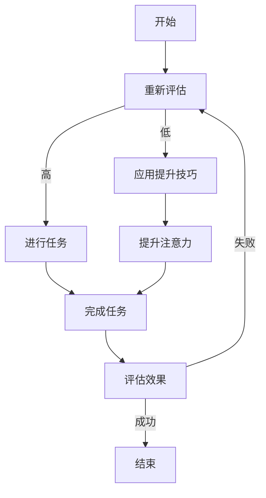

                 

### 文章标题

《注意力管理与时间管理策略：通过时间管理增强专注力和效率》

> 关键词：注意力管理、时间管理、专注力、效率、工作技巧

> 摘要：
本文旨在探讨注意力管理与时间管理的策略，以及如何通过这些策略增强个人的专注力和效率。文章首先介绍了注意力管理的基础概念，随后详细讲解了注意力分散的原因和重要性，接着提出了提高专注力的技巧和消除分心的方法。随后，文章深入分析了时间管理的重要性、基本原理和技巧，并通过案例和实践展示了如何有效地应用这些策略。最后，文章提出了注意力与时间管理的综合应用方法和自我管理能力的提升路径，旨在帮助读者在实际生活中提高工作效率和生活质量。

### 目录大纲

## 第一部分：注意力管理策略

### 第1章：了解注意力管理
- **1.1 注意力管理的基础概念**
  - 定义注意力
  - 注意力的分类
  - 注意力管理的重要性
- **1.2 注意力分散的原因**
  - 内在因素
  - 外在因素
- **1.3 注意力管理的重要性**
  - 提高工作效率
  - 提升学习效果
  - 增强身心健康

### 第2章：注意力管理策略
- **2.1 提高专注力的技巧**
  - 时间管理
  - 环境优化
  - 心理调适
- **2.2 消除分心的方法**
  - 数字干扰
  - 社交干扰
  - 其他分心因素的应对
- **2.3 高效工作方法**
  - 每日任务规划
  - 任务分解
  - 任务优先级排序

### 第3章：案例分析
- **3.1 成功的注意力管理案例**
  - 成功人士的专注力培养
  - 注意力管理在职场中的应用
- **3.2 注意力管理的挑战与解决策略**
  - 长时间工作的注意力管理
  - 注意力管理中的常见误区

## 第二部分：时间管理策略

### 第4章：时间管理基础
- **4.1 时间管理的重要性**
  - 提高工作效率
  - 增加个人成就感
  - 健康生活与工作平衡
- **4.2 时间的特性**
  - 时间的不可逆性
  - 时间的有限性
  - 时间的相对性
- **4.3 时间管理的基本原则**
  - 计划先行
  - 目标导向
  - 优先级排序

### 第5章：时间管理技巧
- **5.1 工作时间管理**
  - 每日工作计划
  - 工作时间分配
  - 工作效率提升
- **5.2 休闲时间管理**
  - 休闲时间的规划
  - 休闲活动的选择
  - 休闲时间的平衡
- **5.3 时间管理工具**
  - 日历工具
  - 任务管理工具
  - 时间追踪工具

### 第6章：时间管理实践
- **6.1 个人时间管理计划**
  - 制定个人时间管理计划
  - 时间管理计划的执行与调整
- **6.2 团队时间管理**
  - 团队时间管理策略
  - 团队时间管理工具应用
- **6.3 时间管理案例研究**
  - 成功的时间管理案例
  - 时间管理失败的案例分析

## 第三部分：综合管理策略

### 第7章：注意力与时间管理的综合应用
- **7.1 综合管理的概念**
  - 注意力与时间管理的结合
  - 综合管理的目标
- **7.2 综合管理的方法**
  - 提高专注力的时间管理方法
  - 时间管理中的注意力管理技巧
- **7.3 综合管理的挑战与解决方案**
  - 工作与生活的平衡
  - 高压工作环境下的综合管理
  - 个性化综合管理策略

### 第8章：自我管理能力的提升
- **8.1 自我管理的重要性**
  - 提高个人素质
  - 增强自我控制力
  - 提升职业竞争力
- **8.2 自我管理的方法**
  - 自我认知
  - 自我激励
  - 自我调整
- **8.3 自我管理能力的提升路径**
  - 学习与实践
  - 反思与总结
  - 持续改进

## 附录

### 附录A：注意力与时间管理资源
- **A.1 基础理论资源**
  - 注意力管理的经典书籍
  - 时间管理的权威文献
- **A.2 实践工具**
  - 时间管理软件推荐
  - 注意力管理应用的下载链接
- **A.3 案例研究资料**
  - 成功案例的详细解读
  - 失败案例的深入分析

### 第1章：了解注意力管理

#### 1.1 注意力管理的基础概念

**定义：**

注意力是指心理活动对一定对象的指向和集中，它使心理活动离开那些微弱刺激的影响，而加强对目标刺激的反应。注意力管理，即对个体注意力的调节和控制，目的是提高注意力的有效性和效率。

**分类：**

1. **选择性注意力：** 指在多个信息源中选择一个或几个信息源进行关注和处理。
2. **持续性注意力：** 指在较长时间内保持对特定任务的集中注意力。
3. **分配性注意力：** 指同时处理多个任务或信息的能力。

**重要性：**

1. **提高工作效率：** 注意力管理能够帮助个体在工作过程中保持专注，减少时间浪费，从而提高工作效率。
2. **提升学习效果：** 在学习过程中，注意力管理有助于学生集中精力，深入理解学习内容，提高学习效果。
3. **增强身心健康：** 注意力管理有助于个体减少压力和焦虑，提高身心健康水平。

#### 1.2 注意力分散的原因

**内在因素：**

1. **心理疲劳：** 长时间专注于一项任务可能导致心理疲劳，使个体难以保持注意力。
2. **动机不足：** 对于缺乏兴趣或挑战性的任务，个体可能会感到无聊，从而分散注意力。
3. **情绪波动：** 不良情绪，如焦虑、紧张或愤怒，会影响个体的注意力集中。

**外在因素：**

1. **环境干扰：** 高噪音、强光、不规则的工作环境等都可能干扰个体的注意力。
2. **设备干扰：** 如手机、电子邮件、即时通讯工具等，都可能导致个体注意力分散。
3. **社会干扰：** 如同事的交谈、会议的召集等，都可能打断个体的注意力。

#### 1.3 注意力管理的重要性

**提高工作效率：**

注意力管理能够帮助个体在工作过程中保持专注，减少时间浪费，从而提高工作效率。例如，通过设定具体的工作目标和时间限制，个体可以在短时间内集中精力完成任务，提高工作效率。

**提升学习效果：**

在学习过程中，注意力管理有助于学生集中精力，深入理解学习内容，提高学习效果。例如，通过减少学习中的干扰因素，如关闭手机通知、选择安静的学习环境，学生可以更好地专注于学习任务，从而提高学习效果。

**增强身心健康：**

注意力管理有助于个体减少压力和焦虑，提高身心健康水平。例如，通过定期休息和放松，个体可以缓解心理疲劳，提高心理韧性，从而增强身心健康。

### 第2章：注意力管理策略

#### 2.1 提高专注力的技巧

**时间管理：**

时间管理是提高专注力的关键策略之一。通过合理安排时间，个体可以避免因任务拖延而导致的注意力分散。以下是一些时间管理技巧：

1. **每日计划：** 制定每日工作或学习计划，将任务分解为小步骤，并为每个步骤设定具体的时间限制。
2. **优先级排序：** 根据任务的紧急程度和重要性，将任务排序，确保优先完成重要且紧急的任务。
3. **避免拖延：** 通过设定具体的时间限制和奖励机制，鼓励自己按时完成任务，避免拖延。

**环境优化：**

一个有利于集中注意力的环境可以显著提高个体的专注力。以下是一些环境优化的建议：

1. **减少干扰：** 选择一个相对安静、光线适宜的地方作为工作或学习环境，减少外界干扰。
2. **整理工作空间：** 保持工作空间的整洁，减少杂乱无章的事物对注意力的干扰。
3. **创造舒适环境：** 调整工作空间的温度、湿度等环境因素，创造一个舒适的工作或学习环境。

**心理调适：**

心理调适是提高专注力的另一个重要策略。以下是一些心理调适技巧：

1. **冥想和深呼吸：** 通过冥想和深呼吸练习，可以帮助个体放松身心，提高注意力集中能力。
2. **积极心态：** 保持积极的心态，面对困难和挑战时，相信自己能够克服，有助于提高专注力。
3. **心理放松：** 定期进行心理放松，如听音乐、散步等，有助于缓解心理压力，提高专注力。

#### 2.2 消除分心的方法

**数字干扰：**

数字干扰是现代生活中最常见的一种干扰因素。以下是一些消除数字干扰的方法：

1. **关闭通知：** 关闭手机和电脑的通知功能，避免在工作和学习过程中受到干扰。
2. **限定使用时间：** 制定具体的数字设备使用时间，确保在专注工作或学习时，不会受到数字设备的干扰。
3. **使用专注应用：** 使用专注应用，如番茄钟、Forest等，帮助自己保持专注，减少数字干扰。

**社交干扰：**

社交干扰也可能导致个体注意力分散。以下是一些消除社交干扰的方法：

1. **设定专注时间：** 在工作和学习时，设定专注时间，避免在专注过程中受到社交干扰。
2. **告知他人：** 在专注工作时，告知他人自己正在集中精力，请求他们在自己专注期间不要打扰。
3. **使用耳塞或耳机：** 使用耳塞或耳机，播放舒缓的音乐或白噪音，帮助自己屏蔽外界的社交干扰。

**其他分心因素的应对：**

除了数字干扰和社交干扰，还有其他一些分心因素可能影响个体的注意力。以下是一些应对其他分心因素的方法：

1. **明确目标：** 在开始工作和学习之前，明确自己的目标和任务，有助于自己集中注意力。
2. **定期休息：** 每45分钟工作或学习后，进行5-10分钟的休息，有助于恢复注意力。
3. **调整环境：** 如果可能，更换工作或学习环境，选择一个更适合自己的地方，有助于提高专注力。

#### 2.3 高效工作方法

**每日任务规划：**

每日任务规划是高效工作的重要步骤。以下是一些每日任务规划的方法：

1. **列出任务清单：** 每天开始时，列出当天需要完成的任务清单，明确每个任务的优先级。
2. **分解任务：** 将大任务分解为小任务，确保每个任务都能在合理的时间内完成。
3. **设定目标：** 为每个任务设定具体的目标，确保在完成任务时，能够达到预期效果。

**任务分解：**

任务分解是将大任务拆分为小任务的过程，有助于提高工作效率。以下是一些任务分解的方法：

1. **确定任务目标：** 在开始分解任务之前，明确每个任务的目标，确保任务分解后，仍然能够实现原始目标。
2. **评估任务难度：** 根据任务的难度和复杂性，将任务分解为更小的子任务。
3. **合理分配时间：** 为每个子任务分配合理的时间，确保在规定时间内能够完成。

**任务优先级排序：**

任务优先级排序是确保高效完成工作的关键。以下是一些任务优先级排序的方法：

1. **紧急且重要：** 首先完成紧急且重要的任务，确保关键任务得到及时处理。
2. **重要但不紧急：** 紧接着完成重要但不紧急的任务，避免这些任务积累过多，影响工作进度。
3. **紧急但不重要：** 尽量避免这些任务，如果无法避免，可以委托给他人处理。
4. **不重要且不紧急：** 将这些任务放在最后处理，或根据实际情况进行调整。

### 第3章：案例分析

#### 3.1 成功的注意力管理案例

**案例1：专注力提升的职场新员工**

**背景：**

张伟是一家互联网公司的软件工程师，他常常感觉在工作中无法集中注意力，导致工作效率低下，经常加班。为了改善这种情况，他决定学习并实践注意力管理策略。

**策略：**

1. **时间管理：** 张伟开始使用时间管理工具，如Trello和Google Calendar，制定每日工作计划，并将任务分解为小步骤。他还设定了具体的时间限制，确保每个任务都能在规定时间内完成。

2. **环境优化：** 张伟在工作时选择了一个安静的房间，关闭了手机通知，并使用耳机播放白噪音，以减少外界干扰。

3. **心理调适：** 张伟开始进行冥想和深呼吸练习，每天早上起床后进行10分钟的冥想，以帮助自己放松身心，提高专注力。

**结果：**

经过一段时间的实践，张伟的工作效率显著提高，他能够在规定时间内完成任务，不再需要加班。他的专注力也得到了提升，能够更好地处理复杂的工作任务。

**分析：**

张伟通过时间管理工具和策略，有效地规划了自己的工作时间，减少了任务拖延和注意力分散。同时，环境优化和心理调适技巧帮助他保持专注和放松，从而提高了工作效率。

**案例2：企业家的时间管理策略**

**背景：**

李华是一位成功的企业家，他的公司正处于快速发展期，工作任务繁重。为了更好地管理时间和提高工作效率，他决定采用一系列注意力管理策略。

**策略：**

1. **每日计划：** 李华每天早上会花10分钟时间列出当天需要完成的任务，并按照紧急程度和重要性进行排序。

2. **优先级排序：** 李华始终将重要且紧急的任务放在首位，确保关键任务得到优先处理。

3. **团队协作：** 李华通过建立高效的团队协作机制，将一些任务分配给团队成员，从而减轻自己的工作负担。

4. **定期休息：** 李华在工作过程中，每工作45分钟就会休息5-10分钟，以保持专注力和工作效率。

**结果：**

通过实施注意力管理策略，李华的工作效率大幅提升，他能够在有限的时间内完成更多任务。同时，他的团队也变得更加协作，工作效率得到显著提高。

**分析：**

李华通过每日计划和优先级排序，能够更好地规划和管理自己的工作时间。团队协作和定期休息策略帮助他保持高水平的专注力和工作效率，从而提高了整体工作效率。

#### 3.2 注意力管理的挑战与解决策略

**挑战1：长时间工作的注意力管理**

**问题描述：**

在长时间的工作过程中，个体容易感到疲劳，导致注意力下降，从而影响工作效率。

**解决策略：**

1. **任务分解：** 将长时间的工作分解为短期的任务，确保在每个任务期间能够保持专注。

2. **定期休息：** 每45分钟工作后，休息5-10分钟，帮助恢复注意力。

3. **交替工作：** 如果可能，交替进行不同类型的任务，避免长时间专注于单一任务导致的注意力下降。

**挑战2：注意力管理中的常见误区**

**问题描述：**

在实施注意力管理策略时，个体可能会陷入一些误区，如过度依赖时间管理工具、忽视休息和放松等，导致注意力管理效果不佳。

**解决策略：**

1. **合理使用工具：** 选择适合自己的时间管理工具，避免过度依赖，同时结合实际情况进行调整。

2. **重视休息和放松：** 定期休息和放松，确保身心得到充分的休息，从而提高注意力。

3. **持续改进：** 定期反思注意力管理策略的有效性，根据实际情况进行调整和改进。

### 第4章：时间管理基础

#### 4.1 时间管理的重要性

时间管理对于个人和组织的成功至关重要。以下是一些时间管理的重要性：

**提高工作效率：**

通过合理安排时间，个体可以更有效地完成任务，减少不必要的拖延和浪费时间的行为。这有助于提高工作效率，使个体能够更好地应对工作压力。

**增加个人成就感：**

时间管理不仅有助于提高工作效率，还可以增加个人成就感。当个体能够按时完成任务并取得显著成果时，会感到满足和自豪，从而增强自信心。

**健康生活与工作平衡：**

时间管理有助于个体在工作和生活之间找到平衡，确保有足够的时间进行休闲和娱乐活动。这有助于保持身心健康，提高生活质量。

#### 4.2 时间的特性

时间具有以下特性：

**不可逆性：**

时间一旦流逝，就无法回到过去。这意味着个体需要珍惜每一刻，合理安排时间，确保时间得到有效利用。

**有限性：**

每个人每天只有24小时，时间的供给是有限的。因此，个体需要学会合理分配时间，确保在有限的时间内实现最大价值。

**相对性：**

时间的感知因个体而异，受心理状态、工作内容等多种因素的影响。个体需要意识到时间的相对性，学会在不同情境下合理分配时间。

#### 4.3 时间管理的基本原则

以下是一些时间管理的基本原则：

**计划先行：**

在开始一天的工作之前，个体需要制定详细的时间计划，明确当天需要完成的任务和目标。这有助于个体有条不紊地安排时间，避免时间的浪费。

**目标导向：**

时间管理应以目标为导向，确保每一项任务都与个体的长期目标保持一致。通过设定明确的目标，个体可以更有效地利用时间，实现工作目标。

**优先级排序：**

在时间管理中，个体需要根据任务的紧急程度和重要性进行优先级排序。优先处理重要且紧急的任务，确保关键任务得到及时处理。

### 第5章：时间管理技巧

#### 5.1 工作时间管理

**每日工作计划：**

每日工作计划是时间管理的重要环节。以下是一些制定每日工作计划的方法：

1. **任务清单：** 列出当天需要完成的任务清单，包括工作内容和优先级。

2. **目标设定：** 为每个任务设定具体的目标，确保在规定时间内能够完成任务。

3. **时间分配：** 根据任务的重要性和紧急程度，为每个任务分配合适的时间，确保在有限的时间内完成任务。

**工作时间分配：**

合理的工作时间分配有助于提高工作效率。以下是一些工作时间分配的建议：

1. **集中精力时段：** 确定一天中自己精力最旺盛的时段，将其用于处理重要且紧急的任务。

2. **分散任务：** 将任务分散到不同的时间段，避免长时间连续工作导致的疲劳。

3. **优先处理：** 根据任务的紧急程度和重要性，优先处理重要且紧急的任务，确保关键任务得到及时处理。

**工作效率提升：**

以下是一些提升工作效率的技巧：

1. **任务分解：** 将大任务分解为小任务，确保每个任务都能在合理的时间内完成。

2. **避免干扰：** 在工作和学习过程中，避免不必要的干扰，如关闭手机通知、避免与他人交谈等。

3. **持续学习：** 不断学习新的工作技巧和方法，提高工作效率。

#### 5.2 休闲时间管理

**休闲时间规划：**

合理规划休闲时间有助于提高生活质量。以下是一些规划休闲时间的方法：

1. **休息间隔：** 在工作和学习过程中，每隔一段时间进行短暂的休息，有助于恢复精力。

2. **固定休息日：** 每周设定固定的休息日，用于放松和娱乐，确保身心得到充分休息。

3. **活动安排：** 根据个人兴趣和需求，安排丰富多彩的休闲活动，如运动、阅读、旅行等。

**休闲活动选择：**

选择适合自己的休闲活动有助于放松身心，提高生活质量。以下是一些建议：

1. **运动：** 运动有助于释放压力，增强身体素质，如跑步、游泳、瑜伽等。

2. **阅读：** 阅读有助于拓展知识面，提高思维能力和语言表达能力，如小说、专业书籍等。

3. **社交：** 与朋友聚会、参加社交活动，有助于缓解压力，提高生活质量。

**休闲时间平衡：**

在工作和休闲时间之间找到平衡是时间管理的关键。以下是一些建议：

1. **时间安排：** 合理安排工作和休闲时间，确保两者之间有足够的过渡和衔接。

2. **目标设定：** 设定休闲时间的目标，如完成阅读一本书籍、学习一项新技能等，确保休闲时间得到充分利用。

3. **灵活调整：** 根据实际情况灵活调整工作和休闲时间，确保在有限的时间内实现工作和生活平衡。

#### 5.3 时间管理工具

**日历工具：**

日历工具是时间管理的重要工具之一，有助于规划和管理时间。以下是一些常用的日历工具：

1. **Google Calendar：** Google Calendar 是一款功能强大的日历工具，支持日程安排、提醒、共享等功能。

2. **Outlook Calendar：** Outlook Calendar 是微软办公软件套件中的日历工具，提供灵活的日程安排和任务管理功能。

3. **iCal：** iCal 是苹果公司开发的日历工具，适用于Mac OS和iOS设备，支持多种日历视图和提醒功能。

**任务管理工具：**

任务管理工具有助于跟踪和管理任务，确保任务得到及时处理。以下是一些常用的任务管理工具：

1. **Trello：** Trello 是一款基于看板式的任务管理工具，支持任务分解、优先级排序、成员协作等功能。

2. **Asana：** Asana 是一款功能丰富的任务管理工具，提供任务分配、进度跟踪、报表分析等功能。

3. **JIRA：** JIRA 是一款专业的任务管理工具，适用于软件开发团队，提供任务跟踪、敏捷开发、报表分析等功能。

**时间追踪工具：**

时间追踪工具有助于跟踪时间使用情况，提高工作效率。以下是一些常用的时间追踪工具：

1. **RescueTime：** RescueTime 是一款自动跟踪时间使用的工具，可以记录应用程序使用时间、网站访问时间等。

2. **Toggl：** Toggl 是一款简单易用的时间追踪工具，支持手动和自动时间跟踪，提供详细的时间报告。

3. **Harvest：** Harvest 是一款专业的项目管理工具，提供时间追踪、费用管理、团队协作等功能。

### 第6章：时间管理实践

#### 6.1 个人时间管理计划

**制定个人时间管理计划**

制定个人时间管理计划是有效利用时间的关键步骤。以下是一个详细的个人时间管理计划的步骤：

1. **确定目标：** 确定个人时间管理的目标，如提高工作效率、平衡工作与生活、学习新技能等。

2. **评估时间使用：** 分析当前时间使用情况，了解在哪些方面存在浪费，如社交媒体、无效会议等。

3. **任务分类：** 将任务分为工作、学习、休闲、家庭等类别，确保每个类别都有足够的时间。

4. **设定优先级：** 根据任务的重要性和紧急程度，设定优先级，确保优先处理重要且紧急的任务。

5. **时间分配：** 根据任务优先级和时间需求，为每个任务分配合理的时间，确保在有限的时间内完成任务。

6. **制定日程：** 制定详细的日程安排，包括每天的工作、学习、休闲等活动，确保时间得到充分利用。

7. **定期评估：** 定期评估时间管理计划的执行情况，根据实际情况进行调整和优化。

**执行与调整**

执行时间管理计划需要坚持和自律，以下是一些执行和调整的建议：

1. **设定提醒：** 使用日历工具或手机提醒功能，设定任务和活动的提醒，确保按时完成。

2. **定期检查：** 定期检查日程安排，确保按照计划执行任务，及时调整计划，以应对突发情况。

3. **自我监督：** 通过自我监督和反思，了解自己的时间使用情况，及时纠正不良习惯。

4. **寻求支持：** 如果遇到困难或无法坚持，可以寻求家人、朋友或同事的支持和鼓励，共同监督执行计划。

5. **灵活调整：** 根据实际情况，灵活调整计划，确保计划与实际需求相符合。

#### 6.2 团队时间管理

**团队时间管理策略**

团队时间管理对于提高团队工作效率和协作至关重要。以下是一些团队时间管理策略：

1. **明确目标：** 确定团队时间管理的目标，如提高工作效率、缩短项目周期等。

2. **任务分配：** 根据团队成员的技能和特长，合理分配任务，确保任务分配公平和高效。

3. **时间规划：** 制定详细的项目时间表，明确每个阶段的任务和时间要求，确保项目按计划进行。

4. **沟通与协调：** 定期召开团队会议，讨论项目进展和问题，确保团队成员之间保持良好的沟通和协调。

5. **优先级排序：** 根据任务的紧急程度和重要性，为团队任务设定优先级，确保关键任务得到优先处理。

6. **时间追踪：** 使用时间管理工具，如Toggl或Harvest，追踪团队时间使用情况，分析团队效率，及时调整计划。

**团队时间管理工具应用**

以下是一些常用的团队时间管理工具及其应用：

1. **Trello：** Trello 是一款基于看板式的任务管理工具，支持任务分解、优先级排序、成员协作等功能，有助于团队高效管理任务。

2. **Asana：** Asana 是一款功能丰富的任务管理工具，提供任务分配、进度跟踪、报表分析等功能，有助于团队协作和管理。

3. **JIRA：** JIRA 是一款专业的任务管理工具，适用于软件开发团队，提供任务跟踪、敏捷开发、报表分析等功能，有助于团队高效管理任务。

4. **Slack：** Slack 是一款团队沟通工具，支持实时消息、文件共享、任务提醒等功能，有助于团队保持高效沟通和协作。

5. **Google Calendar：** Google Calendar 是一款功能强大的日历工具，支持日程安排、提醒、共享等功能，有助于团队协调和管理时间。

6. **Notion：** Notion 是一款多功能的笔记和组织工具，支持任务管理、知识库、团队协作等功能，有助于团队高效管理时间和任务。

#### 6.3 时间管理案例研究

**成功的时间管理案例**

**案例1：个人创业者成功管理时间和提高工作效率**

背景：
李先生是一位个人创业者，他的公司主要从事软件开发和咨询服务。由于业务繁忙，他发现自己经常无法有效地管理时间，导致工作效率低下，甚至影响了家庭生活。为了改善这种情况，他决定实施时间管理策略。

策略：
1. **制定每日计划：** 李先生每天早上花15分钟时间制定详细的工作计划，包括当天需要完成的任务、优先级和预计完成时间。

2. **使用时间管理工具：** 李先生选择了Trello和Google Calendar来帮助自己管理任务和时间。他使用Trello来分解任务并设置优先级，使用Google Calendar来安排会议和日常活动。

3. **定期休息：** 李先生每工作45分钟后，会休息5-10分钟，进行简单的伸展运动或喝杯水，以保持精力充沛。

结果：
通过实施这些时间管理策略，李先生的工作效率显著提高。他能够更有效地完成任务，减少了加班时间，同时也更好地平衡了工作与家庭生活。

**案例2：大型企业团队通过时间管理提高项目进度**

背景：
一家大型企业在进行一项关键项目时，发现团队成员之间的沟通和时间协调存在问题，导致项目进度缓慢。为了提高项目进度，企业决定实施团队时间管理策略。

策略：
1. **明确项目目标：** 企业首先明确了项目的目标，并制定了详细的项目计划，包括各个阶段的时间表和里程碑。

2. **使用团队协作工具：** 企业采用了Asana作为团队协作工具，用于任务分配、进度跟踪和沟通。团队成员可以通过Asana实时更新任务状态和项目进度。

3. **定期团队会议：** 每周召开一次团队会议，讨论项目进展、解决遇到的问题，并调整项目计划。

结果：
通过实施团队时间管理策略，企业显著提高了项目进度。团队成员之间的沟通更加顺畅，任务分配更加合理，项目按计划顺利完成。

**失败的时间管理案例**

**案例1：个人时间管理失败导致工作与家庭生活失衡**

背景：
张女士是一名全职母亲，同时也是一家小型企业的合伙人。由于她没有有效的时间管理策略，她发现自己经常陷入工作与家庭生活的冲突中。

策略：
1. **没有明确的计划：** 张女士没有制定具体的时间管理计划，每天都是随意地处理事务，没有优先级。

2. **缺乏时间追踪工具：** 张女士没有使用任何时间追踪工具来记录时间使用情况，导致她无法了解自己的时间分配。

3. **忽视休息和放松：** 张女士经常加班，忽视了休息和放松的重要性，导致身心疲惫。

结果：
由于缺乏有效的时间管理，张女士的工作效率低下，家庭生活也受到影响。她感到疲惫不堪，工作与家庭生活的冲突日益加剧。

**案例分析**

**成功案例的特点：**

1. **明确的计划和目标：** 成功的时间管理案例中，个人和团队都有明确的计划和目标，这有助于提高工作方向和效率。

2. **合理的时间管理工具：** 使用合适的时间管理工具，如Trello、Asana等，有助于任务分解、优先级排序和进度跟踪。

3. **定期休息和放松：** 成功的时间管理案例中，个人和团队都重视定期休息和放松，这有助于保持高效率和工作质量。

**失败案例的教训：**

1. **缺乏明确的时间管理计划：** 没有明确的时间管理计划会导致工作无序，影响工作效率。

2. **忽视休息和放松：** 忽视休息和放松会导致身心疲惫，影响工作质量。

3. **缺乏有效的沟通和协调：** 团队成员之间缺乏有效的沟通和协调，会导致任务分配不合理，影响项目进度。

### 第7章：注意力与时间管理的综合应用

#### 7.1 综合管理的概念

**注意力与时间管理的综合应用**

注意力与时间管理的综合应用是指将注意力管理和时间管理相结合，以实现更高效的工作和生活。这种综合应用不仅关注如何在短时间内集中注意力完成任务，还关注如何在有限的时间内最大化产出。

**综合管理的目标**

综合管理的目标包括：

1. **提高工作效率：** 通过注意力管理和时间管理的结合，使个体能够在短时间内集中注意力，高效地完成任务。

2. **增强工作质量：** 通过合理安排时间和任务，确保每个任务都能在高质量的情况下完成。

3. **平衡工作与生活：** 通过有效的时间管理，确保工作和生活之间有足够的平衡，避免工作过度占用个人时间。

4. **提升个人素质：** 通过综合管理，个体可以更好地培养自我管理能力，提升个人素质。

#### 7.2 综合管理的方法

**提高专注力的时间管理方法**

以下是一些提高专注力的时间管理方法：

1. **任务分解：** 将大任务分解为小任务，每个小任务都有明确的目标和时间限制，有助于个体集中注意力。

2. **设定时间限制：** 为每个任务设定具体的时间限制，如使用番茄工作法（25分钟工作，5分钟休息），有助于保持专注。

3. **优先级排序：** 根据任务的紧急程度和重要性，设定任务的优先级，确保优先处理重要任务。

4. **避免干扰：** 在工作和学习过程中，尽量减少干扰，如关闭手机通知、避免社交媒体等。

**时间管理中的注意力管理技巧**

以下是一些时间管理中的注意力管理技巧：

1. **定期休息：** 每45分钟工作后，进行5-10分钟的休息，有助于恢复专注力。

2. **环境优化：** 创造一个有利于专注的环境，如减少噪音、保持工作区域整洁。

3. **心理调适：** 通过冥想、深呼吸等技巧，保持心态平和，提高专注力。

4. **自我激励：** 设定奖励机制，完成任务后给予自己一定的奖励，提高工作积极性。

#### 7.3 综合管理的挑战与解决方案

**挑战1：工作与生活的平衡**

**问题描述：**

在综合管理中，一个常见的挑战是如何在工作与生活之间找到平衡。工作压力可能会导致工作时间延长，影响个人生活。

**解决方案：**

1. **时间规划：** 制定详细的时间规划，确保工作和生活都有足够的时间。

2. **设定工作优先级：** 根据任务的紧急程度和重要性，设定工作优先级，避免工作过度占用时间。

3. **设定家庭时间：** 为家庭生活设定固定的时间，如晚餐时间、亲子活动时间等，确保家庭生活得到重视。

**挑战2：高压工作环境下的综合管理**

**问题描述：**

在高压工作环境中，个体可能会感到身心疲惫，影响专注力和工作效率。

**解决方案：**

1. **定期休息：** 每45分钟工作后，进行短暂的休息，有助于恢复专注力。

2. **心理调适：** 通过冥想、深呼吸等技巧，保持心态平和，提高抗压能力。

3. **时间管理：** 合理安排时间，避免工作时间过长，确保有足够的时间进行休息和放松。

**挑战3：个性化综合管理策略**

**问题描述：**

每个人的工作和生活方式都不同，需要个性化的综合管理策略。

**解决方案：**

1. **自我评估：** 定期评估自己的时间使用情况和工作效率，了解自己的优势和劣势。

2. **定制化计划：** 根据自己的特点和需求，制定个性化的综合管理计划。

3. **持续改进：** 根据实际情况，不断调整和优化综合管理策略，确保策略的有效性。

### 第8章：自我管理能力的提升

#### 8.1 自我管理的重要性

**提高个人素质**

自我管理能力是提高个人素质的重要途径。通过自我管理，个体可以更好地规划自己的行为，培养良好的习惯，从而提升个人素质。

**增强自我控制力**

自我管理能力有助于个体增强自我控制力。在工作和生活中，自我控制力是克服诱惑、抵制干扰的重要能力，有助于个体实现目标。

**提升职业竞争力**

自我管理能力是职业竞争力的重要组成部分。在职场中，具备良好自我管理能力的个体更容易适应工作环境，提高工作效率，从而提升职业竞争力。

#### 8.2 自我管理的方法

**自我认知**

自我认知是自我管理的基础。个体需要了解自己的优点和缺点，明确自己的需求和目标，从而更好地进行自我管理。

**自我激励**

自我激励是保持动力和积极性的关键。个体可以通过设定奖励机制、设定目标等方式，激励自己不断前进。

**自我调整**

自我调整是自我管理的重要环节。个体需要根据实际情况，不断调整自己的行为和策略，以适应不断变化的环境。

#### 8.3 自我管理能力的提升路径

**学习与实践**

通过学习相关知识和技巧，个体可以提升自我管理能力。同时，通过实际应用和实践，个体可以不断验证和优化自我管理策略。

**反思与总结**

反思和总结是自我管理能力提升的重要环节。个体需要定期反思自己的行为和决策，总结经验教训，从而不断改进自我管理能力。

**持续改进**

自我管理能力不是一成不变的，个体需要根据实际情况，持续改进自我管理策略。通过不断学习和实践，个体可以不断提升自我管理能力。

### 附录A：注意力与时间管理资源

**A.1 基础理论资源**

- **《注意力管理：如何提升工作效率与生活质量》**：本书详细介绍了注意力管理的基本理论和方法，适用于希望提升个人工作效率和生活质量的读者。
- **《时间管理：如何高效利用每一分钟》**：本书通过实例和技巧，帮助读者掌握时间管理的方法，实现高效利用时间。

**A.2 实践工具**

- **Trello**：一款基于看板式的任务管理工具，适用于个人和团队任务管理。
- **Google Calendar**：谷歌提供的免费日历工具，适用于个人和时间规划。
- **RescueTime**：一款时间追踪工具，帮助用户了解自己的时间使用情况。

**A.3 案例研究资料**

- **《成功人士的时间管理策略》**：本书通过分析成功人士的时间管理策略，提供实用的案例和实践经验。
- **《时间管理失败案例分析》**：本书通过分析时间管理失败案例，提供教训和解决方案。

### 图1-1：注意力管理的 Mermaid 流程图

### 总结

本文详细介绍了注意力管理与时间管理的策略，以及如何通过这些策略增强个人的专注力和效率。首先，我们了解了注意力管理的基础概念、注意力分散的原因及其重要性。接着，提出了提高专注力的技巧和消除分心的方法，并通过每日任务规划、任务分解和任务优先级排序等高效工作方法，帮助读者提高工作效率。在时间管理部分，我们分析了时间管理的重要性、基本原理和技巧，并通过个人和团队时间管理案例，展示了如何实际应用这些策略。随后，我们提出了注意力与时间管理的综合应用方法和自我管理能力的提升路径，旨在帮助读者在实际生活中提高工作效率和生活质量。

通过本文的学习，读者应能够：

1. **理解注意力管理的基本概念和重要性。**
2. **掌握提高专注力和消除分心的方法。**
3. **运用时间管理技巧，合理安排工作和休闲时间。**
4. **制定个人和团队时间管理计划，提高工作效率。**
5. **提升自我管理能力，实现工作与生活的平衡。

最后，作者信息如下：

**作者：** AI天才研究院/AI Genius Institute & 禅与计算机程序设计艺术 /Zen And The Art of Computer Programming

通过本文的学习和实践，希望读者能够在日常生活中更好地管理自己的注意力和时间，实现更高的工作效率和生活质量。持续改进和反思，是提升自我管理能力的关键。希望本文能为读者提供有价值的指导和启示。**图1-1：注意力管理的 Mermaid 流程图**

### 最佳实践 Tips

1. **设立清晰的目标**：在开始任何任务之前，明确任务的目标和预期结果。这有助于保持专注，避免在任务过程中迷失方向。

2. **使用番茄工作法**：将工作时间分为25分钟的专注期和5分钟的休息期，有助于保持精力充沛，提高工作效率。

3. **减少数字干扰**：在工作和学习时，关闭不必要的通知和电子邮件提醒，减少数字设备的干扰。

4. **定期休息和放松**：每45分钟专注工作后，进行短暂休息，如站立伸展、深呼吸或短暂散步，有助于恢复注意力和精力。

5. **环境优化**：保持工作环境的整洁和安静，有助于提高专注力。

6. **自我激励**：设定小目标并给予自己奖励，有助于保持工作动力。

7. **反思和调整**：定期反思时间管理和注意力管理策略的效果，根据实际情况进行调整。

### 小结

本文通过深入分析和实例讲解，详细介绍了注意力管理与时间管理的策略，帮助读者提升专注力和效率。通过本文的学习，读者应能更好地理解注意力管理的基础概念，掌握提高专注力和消除分心的方法，并运用时间管理技巧，实现高效工作。在自我管理能力提升方面，本文提供了实用的方法和路径，旨在帮助读者在实际生活中实现工作与生活的平衡。

### 注意事项

1. **个性化策略**：时间管理和注意力管理策略应根据个人情况个性化调整，不同的人可能需要不同的方法和技巧。

2. **持续实践**：时间管理和注意力管理需要持续实践和反思，通过不断调整和优化，找到最适合自己的方法。

3. **避免过度自我管理**：过度的自我管理可能导致压力增加，影响身心健康。确保在追求效率的同时，注意身心健康和生活的平衡。

### 拓展阅读

- **《高效能人士的七个习惯》**：史蒂芬·柯维的这本经典著作，提供了关于时间管理和自我管理的方法和策略。
- **《如何高效学习》**：斯科特·扬的这本书详细介绍了注意力管理和学习技巧，有助于提升学习效果。
- **《深度工作》**：卡尔·纽波特的作品，探讨了如何在信息泛滥的时代保持专注和深度工作。

### 附录A：注意力与时间管理资源

**A.1 基础理论资源**

- **《注意力管理：如何提升工作效率与生活质量》**：作者通过实例和理论，详细阐述了注意力管理的重要性及其应用。
- **《时间管理：如何高效利用每一分钟》**：本书提供了实用的时间管理技巧和策略，帮助读者提高工作效率。

**A.2 实践工具**

- **Trello**：适用于个人和团队的在线任务管理工具，提供灵活的任务分解和优先级排序功能。
- **Google Calendar**：谷歌提供的免费日历工具，支持日程安排、事件提醒等，有助于时间规划。
- **RescueTime**：一款时间追踪工具，能够记录和分析你的时间使用情况，帮助你更好地管理时间。

**A.3 案例研究资料**

- **《成功人士的时间管理策略》**：本书通过分析成功人士的时间管理方法，提供了实用的案例和实践经验。
- **《时间管理失败案例分析》**：通过分析时间管理失败案例，揭示了常见的误区和挑战，并提供了解决策略。

