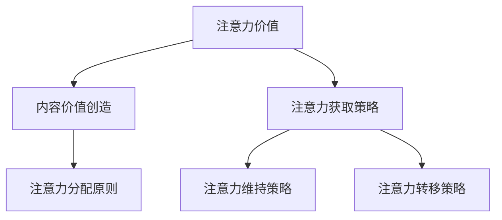
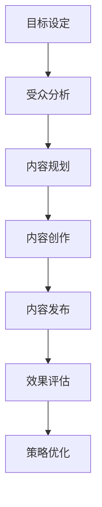

                 

### 文章标题

《注意力经济与内容策略规划与实践：为受众创建有影响力的内容》

#### 关键词

注意力经济、内容策略、内容营销、受众分析、内容创作、算法优化

#### 摘要

本文从注意力经济的理论基础入手，深入探讨了内容策略规划与实践的关键环节。首先，我们回顾了注意力经济的起源与核心概念，分析了注意力价值、内容价值创造及注意力分配原则。接着，本文详细阐述了内容策略规划的过程，包括目标受众分析、内容定位与选题策略、内容创作与优化等。随后，通过实际案例展示了内容营销的实战技巧，最后对未来注意力经济与内容策略的发展趋势进行了展望。本文旨在为IT领域从业者提供一套系统化的内容策略指导，帮助他们更好地创建有影响力的内容。

---

### 第一部分：注意力经济概述

#### 第1章：注意力经济的起源与理论基础

#### 1.1 注意力经济的起源

注意力经济（Attention Economy）这一概念起源于20世纪末期，最早由美国经济学家赫伯特·西蒙（Herbert Simon）提出。他在1971年的论文《关于财富、繁荣与进步的反思》中首次阐述了“信息过载”现象，并预言了未来社会中，个体的注意力将成为最稀缺的资源。

随着互联网的迅猛发展和信息爆炸，西蒙的预言逐渐成为现实。人们被海量信息包围，如何有效获取和利用注意力资源，成为企业和个人共同面对的挑战。在此背景下，注意力经济逐渐成为学术界和企业界关注的热点领域。

#### 1.2 注意力经济的理论基础

注意力经济建立在几个关键理论基础上，包括：

1. **注意力价值论**：这一理论认为，注意力是用户对信息的消费行为，其价值取决于用户的关注程度。高关注度的内容往往具有更高的价值。

2. **内容价值创造**：内容价值创造是指通过内容的生产、传播和优化，提升内容对用户注意力的吸引力。高质量的内容能够有效吸引和维持用户的注意力。

3. **注意力分配原则**：注意力分配原则是指用户在信息过载环境中，如何分配其有限的注意力资源。常见的注意力分配原则包括注意力优先级原则、注意力分散原则和注意力转移原则。

#### 1.3 注意力经济与传统经济的关系

注意力经济与传统经济之间存在密切联系，同时也存在一定区别。

1. **联系**：
   - 传统经济强调物质资源的稀缺性和价值，而注意力经济则将注意力资源视为新的稀缺资源。
   - 注意力经济中的价值创造过程，与传统经济中的价值创造过程类似，都需要通过生产、交换和消费实现。

2. **区别**：
   - 传统经济以物质资源为基础，而注意力经济以注意力资源为基础。
   - 传统经济中，价值主要通过商品和服务的交换实现，而注意力经济中，价值主要通过注意力的转移和分配实现。

#### 第2章：注意力经济的核心概念

##### 2.1 注意力价值论

注意力价值论是注意力经济的基础理论之一，它认为用户的注意力具有价值。具体来说，注意力价值取决于以下因素：

1. **注意力的集中程度**：高集中度的注意力往往具有更高的价值，因为它意味着用户对特定内容的深度关注。
   
2. **注意力的持续时间**：长时间保持对某一内容的注意力，能够增加内容的总价值。

3. **注意力的稀缺性**：在信息过载的环境中，用户的注意力资源是有限的，因此稀缺性成为注意力价值的重要决定因素。

##### 2.2 内容价值创造

内容价值创造是指通过内容的生产、传播和优化，提升内容对用户注意力的吸引力。具体来说，内容包括以下几个方面：

1. **内容生产**：高质量的内容是吸引用户注意力的关键。内容生产需要遵循用户需求，提供有价值、有深度、有趣味的内容。

2. **内容传播**：内容传播是扩大内容影响力的重要环节。有效的传播策略能够提高内容的可见度和覆盖面。

3. **内容优化**：内容优化包括内容形式、内容结构、内容呈现方式等方面的调整，旨在提升用户体验和内容价值。

##### 2.3 注意力分配原则

注意力分配原则是指用户在信息过载环境中，如何分配其有限的注意力资源。常见的注意力分配原则包括：

1. **注意力优先级原则**：用户会根据注意力优先级来分配注意力资源，通常优先关注具有重要性和紧急性的内容。

2. **注意力分散原则**：用户会将注意力分散在多个信息源上，以降低信息过载带来的压力。

3. **注意力转移原则**：用户会根据环境变化和需求变化，调整注意力的分配。

#### 第3章：注意力经济的运行机制

##### 3.1 注意力获取策略

注意力获取策略是指通过什么方式吸引和获取用户的注意力。以下是一些常见的注意力获取策略：

1. **内容营销**：通过高质量的内容吸引和留住用户。

2. **社交媒体营销**：利用社交媒体平台，通过互动和分享，提高内容曝光度。

3. **广告营销**：通过付费广告，直接获取用户的注意力。

##### 3.2 注意力维持策略

注意力维持策略是指如何保持用户对特定内容的持续关注。以下是一些常见的注意力维持策略：

1. **内容更新**：定期更新内容，保持内容的新鲜感和吸引力。

2. **用户互动**：通过用户评论、问答等互动方式，提高用户的参与度和忠诚度。

3. **个性化推荐**：根据用户的兴趣和行为，提供个性化的内容推荐。

##### 3.3 注意力转移策略

注意力转移策略是指如何引导用户将注意力从某一内容转移到另一内容。以下是一些常见的注意力转移策略：

1. **内容关联**：通过关联性内容，引导用户阅读更多相关内容。

2. **跨平台推广**：通过多平台推广，将用户从一平台引导到另一平台。

3. **事件营销**：通过特定事件，引导用户关注和参与。

---

### 第二部分：内容策略规划

#### 第4章：内容策略规划概述

##### 4.1 内容策略规划的必要性

内容策略规划是确保内容营销成功的关键环节。在信息爆炸的时代，有效的内容策略可以帮助企业和个人在众多竞争者中脱颖而出，吸引和留住目标受众。以下是一些内容策略规划的重要性：

1. **明确目标**：通过内容策略规划，可以明确内容营销的目标，确保内容创作和传播方向的一致性。

2. **提高效率**：有效的策略规划可以优化内容创作和传播流程，提高工作效率。

3. **提升效果**：明确的目标和优化的流程可以提升内容营销的效果，实现预期目标。

##### 4.2 内容策略规划的目标

内容策略规划的目标主要包括：

1. **吸引目标受众**：通过高质量的内容吸引潜在用户，提高品牌知名度。

2. **提升用户参与度**：通过互动性和个性化内容，提高用户的参与度和忠诚度。

3. **实现商业目标**：将内容营销与商业目标相结合，实现销售增长、品牌提升等商业目标。

##### 4.3 内容策略规划的过程

内容策略规划的过程可以分为以下几个步骤：

1. **目标设定**：明确内容营销的目标，包括品牌认知、用户参与度、销售转化等。

2. **受众分析**：通过用户画像、需求分析、行为分析等，了解目标受众的特点和需求。

3. **内容规划**：根据目标受众的特点和需求，制定内容规划，包括内容类型、主题、频率等。

4. **内容创作**：根据内容规划，创作高质量的内容，确保内容的价值和吸引力。

5. **内容传播**：通过多种渠道传播内容，提高内容的曝光度和覆盖面。

6. **效果评估**：对内容营销的效果进行评估，包括用户参与度、转化率、品牌认知度等，以优化后续的内容策略。

#### 第5章：目标受众分析

##### 5.1 受众画像

受众画像是对目标受众的全方位描述，包括年龄、性别、职业、收入水平、教育程度、兴趣爱好等。通过受众画像，可以更好地了解目标受众的特点和需求，为内容创作提供依据。

例如，一个针对年轻女性的美妆品牌，其受众画像可能包括以下特点：

- 年龄：18-35岁
- 性别：女性
- 职业分布：学生、职场新人、自由职业者
- 收入水平：中等偏上
- 教育程度：本科及以上
- 兴趣爱好：时尚、美妆、旅游、健身

##### 5.2 受众需求分析

受众需求分析是了解目标受众在特定情境下的需求和行为。通过需求分析，可以确定内容创作的方向和重点。

例如，针对上述美妆品牌的目标受众，其需求可能包括：

- 需求一：获取美妆技巧和产品推荐
- 需求二：了解潮流趋势和时尚资讯
- 需求三：寻求心理慰藉和社交互动

##### 5.3 受众行为分析

受众行为分析是研究目标受众的行为模式和习惯，包括在线行为、购买行为等。通过行为分析，可以优化内容营销策略，提高用户参与度和转化率。

例如，针对上述美妆品牌的目标受众，其行为可能包括：

- 行为一：在社交媒体上关注美妆博主，获取美妆技巧和产品推荐
- 行为二：在电商平台上浏览美妆产品，并进行购买
- 行为三：在社区论坛中参与讨论，寻求心理慰藉和社交互动

#### 第6章：内容定位与选题策略

##### 6.1 内容定位策略

内容定位策略是指确定内容在市场中的定位，包括内容风格、内容主题、目标受众等。通过内容定位，可以确保内容与目标受众的需求和期望相符。

例如，针对上述美妆品牌的目标受众，其内容定位可能包括：

- 内容风格：时尚、专业、亲切
- 内容主题：美妆技巧、产品推荐、潮流趋势、时尚资讯
- 目标受众：年轻女性，年龄18-35岁，关注美妆和时尚

##### 6.2 选题策略

选题策略是指根据内容定位，选择与目标受众需求相符的主题和内容。选题策略需要考虑以下几个因素：

1. **热点话题**：关注当前热点话题，吸引目标受众的注意力。

2. **用户需求**：根据用户需求，选择能够满足他们需求的内容。

3. **专业性**：确保内容的专业性和权威性，提升品牌形象。

4. **可操作性**：内容应具备可操作性，便于用户理解和实践。

##### 6.3 内容质量评估

内容质量评估是指对已发布的内容进行评估，以确定其是否符合目标和受众需求。内容质量评估可以从以下几个方面进行：

1. **内容相关性**：内容是否与目标受众的需求和期望相符。

2. **内容专业性**：内容是否具备专业性和权威性。

3. **内容可读性**：内容是否易于理解和阅读。

4. **用户互动**：内容是否引发用户互动和评论。

5. **转化率**：内容是否能够促进用户转化，如点击、购买等。

#### 第7章：内容创作与优化

##### 7.1 内容创作原则

内容创作原则是指遵循一系列原则，确保内容的质量和价值。以下是几个常见的内容创作原则：

1. **用户导向**：内容创作应以用户需求为导向，满足用户的需求和期望。

2. **原创性**：内容应具备原创性，避免抄袭和复制。

3. **专业性**：内容应具备专业性和权威性，提供有价值的信息。

4. **简洁性**：内容应简洁明了，避免冗长和复杂。

5. **一致性**：内容应保持风格和主题的一致性，确保品牌形象的一致性。

##### 7.2 内容优化方法

内容优化是指通过调整内容的形式、结构和呈现方式，提升用户体验和内容价值。以下是一些常见的内容优化方法：

1. **标题优化**：优化标题，使其更具吸引力和相关性。

2. **图片和视频**：使用高质量的图片和视频，提升内容的视觉效果。

3. **段落结构**：优化段落结构，使内容更易于阅读和理解。

4. **关键词优化**：在内容中合理使用关键词，提高内容的搜索引擎排名。

5. **交互设计**：增加交互元素，如问答、投票、评论等，提高用户参与度。

##### 7.3 内容营销策略

内容营销策略是指通过一系列策略，提高内容的传播效果和影响力。以下是一些常见的内容营销策略：

1. **社交媒体推广**：利用社交媒体平台，如微博、微信、抖音等，推广内容。

2. **合作推广**：与其他品牌或媒体合作，共同推广内容。

3. **SEO优化**：通过搜索引擎优化，提高内容的搜索引擎排名。

4. **广告投放**：通过付费广告，提高内容的曝光度。

5. **用户互动**：通过用户互动，如评论、点赞、分享等，提高内容的传播效果。

---

### 第三部分：实践与应用

#### 第8章：内容营销实战

##### 8.1 内容营销策略选择

内容营销策略选择应根据目标受众、内容类型和营销目标进行。以下是几种常见的内容营销策略：

1. **教育型内容**：通过提供有价值的信息和知识，教育用户，提高品牌知名度。

2. **娱乐型内容**：通过有趣、幽默的内容，吸引用户，提升品牌形象。

3. **故事型内容**：通过讲述品牌故事，建立情感连接，提高用户忠诚度。

4. **案例型内容**：通过分享成功案例，展示品牌实力，吸引潜在客户。

##### 8.2 内容营销执行流程

内容营销执行流程包括以下几个步骤：

1. **内容策划**：确定内容主题、类型和形式。

2. **内容创作**：根据策划，创作高质量的内容。

3. **内容发布**：选择合适的发布渠道，发布内容。

4. **内容推广**：通过社交媒体、广告等渠道，推广内容。

5. **效果评估**：对内容营销效果进行评估，优化策略。

##### 8.3 内容营销效果评估

内容营销效果评估可以从以下几个方面进行：

1. **用户参与度**：如评论数、点赞数、分享数等。

2. **转化率**：如点击率、购买率、咨询量等。

3. **品牌认知度**：如品牌搜索量、品牌提及量等。

4. **用户满意度**：如用户评价、反馈等。

通过评估，可以了解内容营销的效果，优化策略，提高营销效果。

#### 第9章：案例分析

##### 9.1 案例一：社交媒体内容营销

社交媒体内容营销是近年来最受欢迎的内容营销方式之一。以下是一个社交媒体内容营销的案例分析：

**案例背景**：某美妆品牌希望通过社交媒体平台推广新产品，提高品牌知名度。

**策略选择**：选择抖音、微博等热门社交媒体平台，通过短视频、图文等形式，发布产品介绍、使用教程、用户评价等内容。

**执行过程**：
1. **内容策划**：确定产品介绍、使用教程、用户评价等主题。
2. **内容创作**：邀请美妆博主拍摄产品使用教程，编辑高质量的短视频。
3. **内容发布**：在抖音、微博等平台发布内容，并设置话题标签。
4. **内容推广**：通过广告投放、合作推广等方式，提高内容曝光度。

**效果评估**：发布后，内容获得了大量点赞、分享和评论，品牌知名度显著提升，产品销量也有所增加。

##### 9.2 案例二：企业内部内容营销

企业内部内容营销是提高员工参与度和忠诚度的有效方式。以下是一个企业内部内容营销的案例分析：

**案例背景**：某大型企业希望通过内部内容营销，提高员工对企业的认同感和忠诚度。

**策略选择**：建立企业内部博客、论坛等平台，发布企业新闻、员工故事、行业动态等内容。

**执行过程**：
1. **内容策划**：确定企业新闻、员工故事、行业动态等主题。
2. **内容创作**：由企业内部员工撰写内容，确保内容的真实性和权威性。
3. **内容发布**：在内部博客、论坛等平台发布内容。
4. **内容推广**：通过内部邮件、通知等渠道，推广内容。

**效果评估**：发布后，员工参与度显著提高，企业内部的交流氛围更加活跃，员工对企业的认同感和忠诚度也有所提升。

##### 9.3 案例三：品牌内容营销

品牌内容营销是提高品牌形象和用户忠诚度的有效方式。以下是一个品牌内容营销的案例分析：

**案例背景**：某知名品牌希望通过内容营销，提高品牌知名度和用户忠诚度。

**策略选择**：建立品牌官方网站、社交媒体账号等平台，发布品牌故事、产品介绍、用户评价等内容。

**执行过程**：
1. **内容策划**：确定品牌故事、产品介绍、用户评价等主题。
2. **内容创作**：由品牌专家撰写内容，确保内容的权威性和专业性。
3. **内容发布**：在官方网站、社交媒体账号等平台发布内容。
4. **内容推广**：通过广告投放、合作推广等方式，提高内容曝光度。

**效果评估**：发布后，品牌知名度显著提升，用户对品牌的认同感和忠诚度也有所提高。

---

### 第10章：未来展望

#### 10.1 注意力经济与内容策略的未来趋势

随着互联网技术的不断发展和信息过载现象的加剧，注意力经济与内容策略的未来趋势将呈现出以下几个特点：

1. **个性化内容**：未来内容策略将更加注重个性化，通过数据分析和技术手段，为用户提供量身定制的内容。

2. **内容多样化**：除了文字和图片，视频、音频、互动游戏等多样化的内容形式将更加普及，以满足用户多样化的需求。

3. **跨平台整合**：内容策略将更加注重跨平台整合，通过多渠道、多平台的内容传播，扩大内容影响力。

4. **智能化**：人工智能技术将在内容策略中发挥更大作用，如通过自然语言处理、推荐系统等技术，优化内容创作和传播。

#### 10.2 内容策略规划面临的挑战与机遇

内容策略规划在发展过程中，既面临挑战，也充满机遇。

**挑战**：

1. **信息过载**：用户面临的信息量越来越大，如何在海量信息中脱颖而出，成为内容策略规划者面临的重大挑战。

2. **内容质量**：高质量的内容是吸引和留住用户的关键，如何在短时间内创作出高质量的内容，是内容策略规划者需要解决的问题。

3. **数据隐私**：在收集和分析用户数据的过程中，如何保护用户隐私，是内容策略规划者需要关注的问题。

**机遇**：

1. **技术进步**：随着人工智能、大数据等技术的不断发展，内容策略规划者可以借助这些技术，优化内容创作和传播，提高营销效果。

2. **用户需求**：随着用户需求的多样化，内容策略规划者有更多的机会，通过提供个性化、多样化的内容，满足用户需求。

3. **平台生态**：互联网平台为内容策略规划者提供了丰富的资源和渠道，可以更好地传播和推广内容。

#### 10.3 内容策略规划的创新方向

未来，内容策略规划的创新方向主要包括：

1. **内容智能化**：通过人工智能技术，实现内容创作、推荐、优化的自动化，提高内容质量和效率。

2. **内容场景化**：结合用户场景，提供场景化、情境化的内容，提高用户参与度和满意度。

3. **内容社交化**：通过社交媒体等平台，促进用户互动和分享，扩大内容影响力。

4. **内容多元化**：除了文字和图片，引入视频、音频、互动游戏等多种内容形式，满足用户多样化的需求。

---

### 附录

#### 附录A：注意力经济与内容策略相关工具与资源

**A.1 注意力监测工具**

- Google Analytics：分析用户行为，了解用户关注点。
- Mixpanel：用户行为分析，监控用户互动。
- BuzzSumo：分析热门内容，获取灵感。

**A.2 内容创作工具**

- Canva：设计图片、海报等视觉内容。
- Grammarly：校对和优化文本内容。
- Trello：项目管理，规划内容创作进度。

**A.3 内容营销平台**

- HubSpot：整合内容创作、营销和客户关系管理。
- Hootsuite：社交媒体管理，发布和监控内容。
- Mailchimp：邮件营销，推送内容通知。

---

### 附录B：Mermaid 流程图

**B.1 注意力经济核心概念联系图**



**B.2 内容策略规划流程图**



---

### 附录C：核心算法原理与伪代码

**C.1 注意力分配算法原理**

注意力分配算法的目标是根据内容的重要性和用户的兴趣，分配注意力资源。其原理可以表示为：

$$
\text{注意力分配} = \frac{\text{总注意力}}{\text{内容数量}}
$$

其中，总注意力为用户在一段时间内可分配的注意力资源，内容数量为当前用户需要关注的总内容数量。

**伪代码**：

```plaintext
初始化总注意力 totalAttention
初始化内容数量 contentCount

for i = 1 to contentCount do
    分配注意力 = totalAttention / contentCount
    更新总注意力 totalAttention -= 分配注意力
end for
```

**C.2 内容优化算法原理**

内容优化算法的目标是通过调整内容的形式、结构和呈现方式，提升用户体验和内容价值。其原理可以表示为：

$$
\text{内容优化} = \text{目标函数最大化}
$$

目标函数可以根据具体问题进行定义，如提高用户参与度、提升转化率等。

**伪代码**：

```plaintext
初始化参数
while 未收敛 do
    更新参数
    评估内容优化程度
end while
```

---

### 作者信息

**作者：AI天才研究院/AI Genius Institute & 禅与计算机程序设计艺术 /Zen And The Art of Computer Programming**

