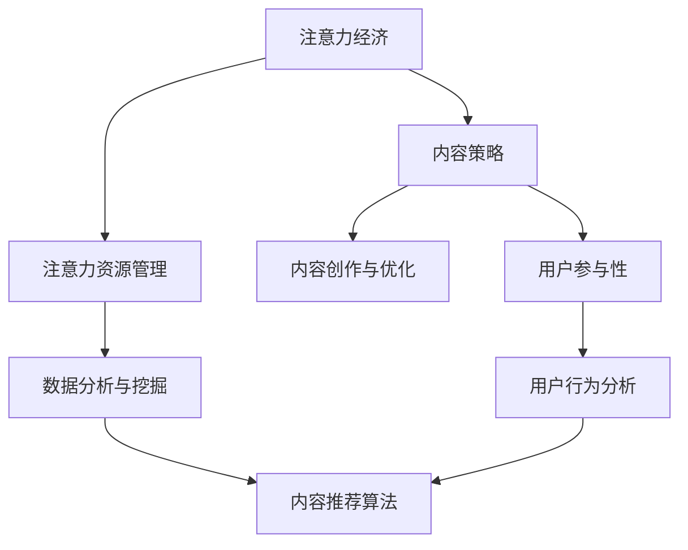
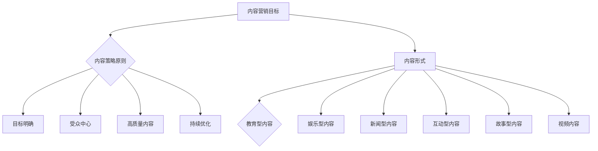
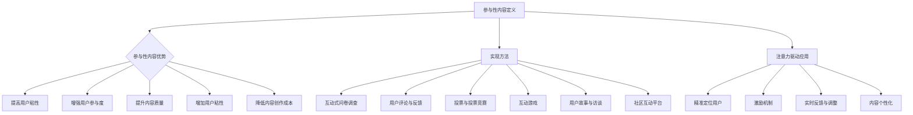
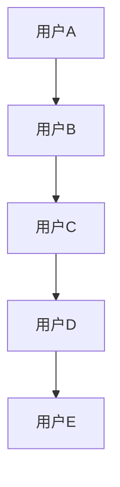
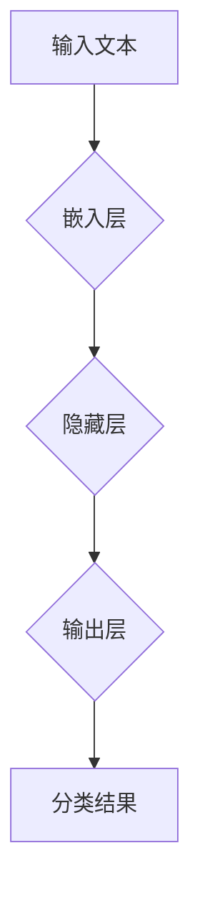
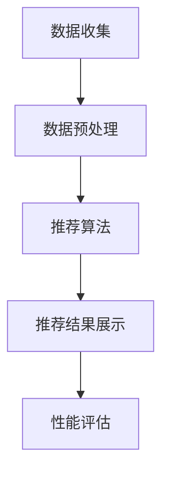

                 

### 文章标题

《注意力经济与内容策略：创建吸引并留住受众的参与性内容》

### 文章关键词

注意力经济，内容策略，参与性内容，用户行为分析，内容推荐算法，数据分析与挖掘，数学模型，神经网络，项目实战

### 摘要

本文深入探讨了注意力经济与内容策略的结合，旨在帮助企业和创作者构建更具吸引力和参与性的内容，以有效吸引和留住受众。通过分析注意力经济的定义、原理及时代背景，本文揭示了注意力资源在数字化时代的重要性。随后，文章详细阐述了内容策略的理论基础，包括内容营销的起源、基本原则以及分类形式。在核心算法原理讲解部分，本文介绍了数据分析与挖掘、内容推荐算法以及用户行为分析的方法。此外，通过具体的项目实战，本文展示了如何在实际操作中应用这些理论，为读者提供了丰富的实践经验和指导。文章末尾对注意力经济与内容策略的未来发展趋势进行了展望，并提供了进一步学习的建议。

### 目录大纲

#### 第一部分：核心概念与联系

**第1章：注意力经济概述**

- 注意力经济的概念
- 注意力经济与内容策略的联系
- 注意力经济的时代背景

**第2章：内容策略的理论基础**

- 内容营销的起源与发展
- 内容策略的基本原则
- 内容策略的分类与形式

**第3章：注意力经济与参与性内容**

- 参与性内容的定义
- 参与性内容的优势
- 参与性内容的实现方法

#### 第二部分：核心算法原理讲解

**第4章：数据分析与挖掘**

- 数据分析的基本概念
- 数据挖掘的主要方法
- 数据挖掘的应用场景

**第5章：内容推荐算法**

- 内容推荐算法概述
- 基于内容的推荐算法
- 基于协同过滤的推荐算法

**第6章：注意力驱动的用户行为分析**

- 用户行为分析的重要性
- 用户行为的常用分析方法
- 注意力驱动在用户行为分析中的应用

#### 第三部分：数学模型和数学公式讲解

**第7章：基于概率论的内容传播模型**

- 概率论的基本概念
- 内容传播模型的基本假设
- 内容传播模型的数学公式

**第8章：基于神经网络的参与性内容分析**

- 神经网络的基本原理
- 神经网络在内容分析中的应用
- 神经网络在参与性内容分析中的数学模型

#### 第四部分：项目实战

**第9章：实战一：内容推荐系统的搭建**

- 实战背景
- 系统架构设计
- 实现步骤与代码解析

**第10章：实战二：基于用户行为的参与性内容分析**

- 实战背景
- 数据预处理与特征提取
- 用户行为分析实现

**第11章：总结与展望**

- 项目实战总结
- 注意力经济与内容策略的未来发展趋势
- 为读者提供进一步学习的建议

### 附录

- 附录A：相关工具和资源介绍
- 附录B：代码与数据资源

---

接下来，我们将逐一深入分析每个章节的内容，逐步构建起本文的核心观点和逻辑框架。让我们开始第一步：理解注意力经济的概念及其与内容策略的联系。

### 第一部分：核心概念与联系

#### 第1章：注意力经济概述

### 1.1 注意力经济的概念

注意力经济，也被称为“注意力货币化”，是指将用户的注意力作为一项重要的经济资源进行管理和转化，通过提供有价值的内容和服务来吸引和留住用户，从而实现商业价值的提升。在数字化时代，随着信息过载和用户精力的稀缺，注意力资源变得尤为珍贵。因此，如何有效地获取和利用用户注意力成为企业和个人成功的关键。

### 1.2 注意力经济与内容策略的联系

内容策略是企业或个人通过策划、创作、发布和优化内容来吸引、保留和转化目标受众的一系列方法。注意力经济与内容策略之间存在紧密的联系：

- **内容吸引注意力**：优质的内容可以激发用户的兴趣，吸引他们的注意力。例如，一篇高质量的技术博客文章可以吸引技术爱好者的关注。

- **参与性增强注意力**：通过鼓励用户参与内容创作、评论和分享，可以进一步提升用户的注意力投入。例如，社交媒体平台通过用户生成内容（UGC）增加了用户互动，延长了用户停留时间。

- **数据分析优化策略**：通过数据分析，可以了解用户偏好和需求，从而优化内容策略，提高内容的吸引力。例如，电商网站通过用户浏览和购买行为数据推荐相关产品。

### 1.3 注意力经济的时代背景

注意力经济的兴起与以下因素密切相关：

- **互联网普及**：互联网的普及使得信息传播变得更加便捷，用户获取信息的渠道多样化，注意力资源变得稀缺。

- **移动设备普及**：智能手机和其他移动设备的普及使得用户可以随时随地进行信息获取和互动，进一步加剧了注意力的竞争。

- **大数据与人工智能**：大数据和人工智能技术的发展为分析和理解用户行为提供了强大的工具，使得注意力经济得以更加精准地实施。

- **个性化内容趋势**：个性化内容越来越受到用户的欢迎，因为它们能够更好地满足用户的兴趣和需求，提高用户的参与度。

### 1.4 核心概念关系架构

为了更好地理解注意力经济与内容策略之间的联系，我们可以通过Mermaid流程图来展示它们的核心概念关系架构：



- **注意力经济**：核心概念是注意力资源管理，旨在最大化用户的注意力投入。
- **内容策略**：包括内容创作与优化、用户参与性，是吸引力经济实现的关键。
- **数据分析与挖掘**：通过用户行为分析和内容推荐算法，优化内容策略，提高用户的参与度和满意度。
- **用户行为分析**：帮助理解用户需求和行为，从而提供更个性化的内容。

#### 核心概念与联系总结

注意力经济与内容策略的结合，使得企业和个人能够更加有效地吸引和留住目标受众。通过精心策划的内容和精准的数据分析，可以构建起一个可持续的注意力生态系统，从而实现商业价值的最大化。

在接下来的章节中，我们将进一步探讨内容策略的理论基础，了解内容营销的发展历程、基本原则以及各种内容策略的形式。这些知识将为我们后续的算法讲解和项目实战提供坚实的理论基础。

---

在本章节中，我们首先介绍了注意力经济的概念和与内容策略的联系，并分析了其在数字化时代的重要性。通过Mermaid流程图，我们清晰地展示了注意力经济与内容策略之间的核心概念关系。接下来，我们将深入探讨内容策略的理论基础，了解内容营销的起源与发展、基本原则以及分类形式。

### 第2章：内容策略的理论基础

#### 2.1 内容营销的起源与发展

内容营销作为一种营销策略，其历史可以追溯到20世纪90年代。当时，互联网刚刚兴起，营销手段逐渐从传统的广告宣传转向更加注重用户体验和需求的个性化沟通。内容营销的起源可以追溯到以下几个关键点：

- **信息爆炸**：随着互联网的普及，信息量爆炸式增长，用户开始对广告产生厌倦，更加重视有价值、有深度的内容。

- **社交媒体崛起**：社交媒体平台的兴起，如Facebook、Twitter等，使得内容传播更加便捷和快速，用户之间的互动和分享成为可能。

- **搜索引擎优化（SEO）**：为了提高网站在搜索引擎中的排名，企业开始注重内容的创作和优化，以吸引更多用户的关注。

在过去的几十年中，内容营销经历了多个发展阶段：

- **第一阶段（1990-2000年）**：以电子邮件营销和在线论坛为主要形式，内容主要以文字和图像为主。

- **第二阶段（2000-2010年）**：随着博客、视频和社交媒体的兴起，内容形式变得更加多样，用户参与度显著提高。

- **第三阶段（2010年至今）**：大数据和人工智能技术的应用，使得内容营销更加精准和个性化，内容策略逐渐成为企业营销的核心。

#### 2.2 内容策略的基本原则

内容策略的成功取决于对目标受众的深入了解和对内容创作、发布、优化的有效执行。以下是内容策略的四大基本原则：

- **目标明确**：明确内容营销的目标，如品牌提升、销售转化、用户留存等，以便制定相应的内容策略。

- **受众中心**：深入了解目标受众的需求、兴趣和行为，以用户为中心进行内容创作，确保内容对用户有吸引力。

- **高质量内容**：优质的内容是吸引和留住用户的关键。内容应具有价值、相关性、原创性和可读性。

- **持续优化**：内容策略不是一次性的，而是一个持续迭代的过程。通过数据分析，了解用户反馈和内容效果，不断优化内容质量和传播方式。

#### 2.3 内容策略的分类与形式

根据内容形式和目的，内容策略可以分为多种类型，以下是几种常见的内容策略分类：

- **教育型内容**：通过提供专业知识、教程、案例研究等形式，帮助用户解决问题，提高品牌权威性。

- **娱乐型内容**：以幽默、趣味和创意为特点，吸引用户的关注，增加品牌亲和力。

- **新闻型内容**：及时发布行业动态、市场趋势和公司新闻，保持品牌的活跃度和公信力。

- **互动型内容**：通过问卷调查、评论、投票等形式，鼓励用户参与内容创作和讨论，提高用户参与度。

- **故事型内容**：以故事讲述的方式，展现品牌的历史、文化、价值观等，增强品牌情感连接。

- **视频内容**：利用视频这种直观、生动的形式，传达复杂的信息，吸引用户的关注和分享。

#### 核心概念与联系架构

为了更好地理解内容策略的基本原则和分类，我们可以通过Mermaid流程图来展示它们的核心概念关系架构：



- **内容营销目标**：明确目标和策略方向。
- **内容策略原则**：确保内容策略的有效执行。
- **内容形式**：根据目标和受众需求选择合适的内容形式。

#### 内容策略理论基础总结

内容策略的理论基础是内容营销成功的基石。通过理解内容营销的起源与发展、基本原则和分类形式，我们可以更好地制定和实施有效的内容策略，以吸引并留住目标受众。

在接下来的章节中，我们将探讨参与性内容的定义、优势和实现方法，为内容策略的实际应用提供更多的思路和工具。继续阅读，深入了解如何通过参与性内容提升用户的注意力投入和参与度。

### 第3章：注意力经济与参与性内容

#### 3.1 参与性内容的定义

参与性内容是指那些鼓励用户互动和参与的数字化内容，它不仅限于简单的阅读或观看，而是通过评论、分享、投票、互动游戏等多种形式，增强用户与内容的互动性。参与性内容的核心在于激发用户的积极性和参与度，使他们在内容创造和传播过程中发挥重要作用。

#### 3.2 参与性内容的优势

参与性内容在吸引和留住用户方面具有显著的优势：

- **提高用户粘性**：参与性内容通过增加用户的互动和投入，使他们对平台或品牌产生更强的情感连接，从而提高用户粘性。

- **增强用户参与度**：参与性内容鼓励用户参与讨论、分享和创作，使他们在内容传播过程中成为积极的参与者，而不是被动的接收者。

- **提升内容质量**：用户的参与和反馈可以显著提升内容的质量和相关性。通过用户的贡献，内容变得更加丰富和多样化。

- **增加用户粘性**：参与性内容能够延长用户在平台上的停留时间，提高用户的日活跃度（DAU）和月活跃度（MAU）。

- **降低内容创作成本**：用户生成内容（UGC）可以减轻创作者的压力，降低内容创作的成本，同时为平台带来新鲜的内容。

#### 3.3 参与性内容的实现方法

要创建成功的参与性内容，需要采取以下几种方法：

- **互动式问卷调查**：通过在线问卷调查，收集用户对产品的看法、对服务的建议，以及他们对特定问题的观点。这种方法可以深入了解用户需求，同时激发用户的思考。

- **用户评论与反馈**：鼓励用户在内容下方发表评论，分享他们的想法和感受。这不仅可以增加用户互动，还可以为其他用户带来有价值的参考信息。

- **投票与投票竞赛**：通过在线投票，让用户参与到内容的评选中，增加用户参与感和趣味性。

- **互动游戏**：设计有趣的互动游戏，如答题竞赛、模拟游戏等，吸引用户参与，提高他们的参与度。

- **用户故事与访谈**：分享用户的故事和经验，通过真实的用户案例，增强用户与品牌之间的情感连接。

- **社区互动平台**：建立专门的社区互动平台，如论坛或社交媒体群组，鼓励用户在平台内交流和互动，形成社区氛围。

#### 3.4 注意力驱动在参与性内容中的应用

在参与性内容的创建和推广过程中，注意力驱动起到了关键作用：

- **精准定位用户**：通过数据分析，了解用户的行为和兴趣，针对性地推送相关内容，提高用户参与的可能性。

- **激励机制**：设置用户激励机制，如积分、徽章、奖励等，鼓励用户积极参与内容互动。

- **实时反馈与调整**：通过实时监控用户的参与情况，及时调整内容策略，提高用户的参与度和满意度。

- **内容个性化**：基于用户兴趣和行为数据，提供个性化的内容推荐，增加用户对内容的关注度。

#### 核心概念与联系架构

为了更好地理解参与性内容的定义、优势和实现方法，以及注意力驱动在其中的应用，我们可以通过Mermaid流程图来展示它们的核心概念关系架构：



- **参与性内容定义**：定义参与性内容的概念和特点。
- **参与性内容优势**：展示参与性内容在提升用户粘性和增强用户参与度等方面的优势。
- **实现方法**：提供多种实现参与性内容的方法，以激发用户互动。
- **注意力驱动应用**：展示注意力驱动在精准定位用户、激励机制、实时反馈与调整以及内容个性化中的应用。

#### 参与性内容总结

参与性内容通过鼓励用户互动和参与，极大地提升了用户的粘性和参与度。它不仅能够提升内容质量，还可以降低内容创作的成本。通过精准的注意力驱动策略，可以更有效地吸引和留住目标用户。在接下来的章节中，我们将深入探讨数据分析与挖掘的基本概念、主要方法及其应用场景，为构建参与性内容提供更加深入的见解。

### 第4章：数据分析与挖掘

#### 4.1 数据分析的基本概念

数据分析是指从大量数据中提取有价值信息的过程，它包括数据收集、数据清洗、数据探索、数据建模、数据可视化等多个环节。数据分析的核心目的是通过揭示数据中的模式和规律，辅助决策制定和业务优化。

- **数据收集**：数据收集是数据分析的第一步，它涉及数据的来源、采集方式、数据质量和数据量等。数据来源可以是内部数据库、外部API、传感器等。

- **数据清洗**：数据清洗是数据预处理的重要环节，旨在识别和修正数据中的错误、缺失和重复值，以提高数据质量。

- **数据探索**：数据探索通过统计分析和可视化工具，对数据集进行初步分析，识别数据中的异常、趋势和关系。

- **数据建模**：数据建模是建立数学模型或统计模型，以预测或解释数据中的关系。常见的方法包括线性回归、决策树、神经网络等。

- **数据可视化**：数据可视化是通过图表和图形，将数据中的信息和模式直观地呈现出来，便于理解和分析。

#### 4.2 数据挖掘的主要方法

数据挖掘是指利用计算机算法和统计方法，从大量数据中提取隐藏的、有价值的模式和知识。数据挖掘的主要方法包括以下几种：

- **关联规则挖掘**：关联规则挖掘旨在发现数据集中不同项目之间的关联关系。常见的算法包括Apriori算法和FP-growth算法。

- **分类**：分类是将数据集中的实例划分为预定义的类别。常见的方法包括决策树、支持向量机（SVM）和随机森林等。

- **聚类**：聚类是将数据集中的实例划分为多个群组，使得同一群组内的实例彼此相似，不同群组内的实例差异较大。常见的方法包括K-means、DBSCAN和层次聚类等。

- **异常检测**：异常检测旨在识别数据集中的异常值或离群点。常见的方法包括基于统计的方法、基于聚类的方法和基于神经网络的方法。

- **预测**：预测是基于历史数据对未来事件进行预测。常见的方法包括时间序列预测、回归分析和机器学习模型。

#### 4.3 数据挖掘的应用场景

数据挖掘在各个行业和领域都有着广泛的应用，以下是几个典型的应用场景：

- **电商推荐系统**：通过分析用户的历史购物行为、浏览记录和兴趣爱好，推荐用户可能感兴趣的商品，提高购买转化率。

- **金融风控**：通过分析用户的行为数据和交易数据，识别潜在的欺诈行为，防范金融风险。

- **医疗诊断**：通过分析患者的历史病历、基因数据和生活习惯，辅助医生进行疾病诊断和个性化治疗。

- **市场营销**：通过分析客户数据和市场数据，优化营销策略，提高市场推广效果。

- **智能交通**：通过分析交通数据，优化交通信号配置，提高交通流通效率，减少拥堵。

#### 数据分析流程与伪代码

数据分析通常遵循以下基本流程：

1. **数据收集**：从各种数据源收集原始数据。
2. **数据清洗**：清理数据中的错误、缺失和重复值。
3. **数据探索**：进行初步数据分析和可视化，识别数据中的趋势和异常。
4. **数据建模**：选择合适的数据挖掘算法，建立预测或分类模型。
5. **模型评估**：评估模型性能，调整模型参数。
6. **模型应用**：将模型应用于实际业务场景。

以下是一个简单的数据分析伪代码示例：

```python
# 数据分析伪代码

# 数据收集
data = collect_data()

# 数据清洗
cleaned_data = clean_data(data)

# 数据探索
explore_data(cleaned_data)

# 数据建模
model = build_model(cleaned_data)

# 模型评估
evaluate_model(model)

# 模型应用
apply_model(model)
```

#### 数据分析示例

假设我们要分析一个电商平台的数据，预测用户是否会在未来30天内购买特定商品。以下是一个简单的数据分析示例：

1. **数据收集**：收集用户的历史购物数据，包括用户ID、购买日期、购买商品ID等。

2. **数据清洗**：去除无效数据、缺失值填充和处理重复数据。

3. **数据探索**：分析用户购买行为，识别活跃用户和沉默用户。

4. **数据建模**：使用逻辑回归模型预测用户购买概率。

5. **模型评估**：通过交叉验证评估模型性能。

6. **模型应用**：根据预测结果，推送个性化推荐，提高购买转化率。

#### 数据分析与挖掘总结

数据分析与挖掘是理解和利用数据的重要工具，它在参与性内容的创建和推广中扮演着关键角色。通过数据挖掘，我们可以发现用户行为模式、优化内容推荐策略、提高用户参与度。在接下来的章节中，我们将深入探讨内容推荐算法，了解如何通过算法实现精准的内容推荐，进一步提升用户的参与和满意度。

### 第5章：内容推荐算法

#### 5.1 内容推荐算法概述

内容推荐算法是现代信息系统中不可或缺的一部分，它通过分析用户行为和内容特征，为用户提供个性化推荐。推荐算法的目标是提高用户满意度，增加用户粘性和平台活跃度。内容推荐算法主要分为基于内容的推荐和基于协同过滤的推荐两大类。

#### 5.2 基于内容的推荐算法

基于内容的推荐算法（Content-Based Recommendation）通过分析内容本身的属性和特征，为用户推荐相似的内容。这种方法的主要优点是推荐结果具有较高的相关性，但缺点是推荐多样性较差。

- **关键词提取**：首先从内容中提取关键词，然后基于关键词匹配用户历史偏好。

- **向量表示**：将内容和用户偏好转化为高维向量，通过计算相似度进行推荐。

- **协同过滤**：在内容特征相似的基础上，结合用户的共同喜好进行推荐。

以下是一个基于内容的推荐算法的伪代码示例：

```python
# 基于内容的推荐算法伪代码

# 提取内容特征
content_features = extract_features(content)

# 获取用户偏好特征
user_preference = extract_features(user_history)

# 计算内容与用户偏好相似度
similarity_scores = calculate_similarity(content_features, user_preference)

# 推荐相似内容
recommended_contents = select_top_contents(similarity_scores)
```

#### 5.3 基于协同过滤的推荐算法

基于协同过滤的推荐算法（Collaborative Filtering）通过分析用户之间的相似性和历史行为数据，推荐用户可能感兴趣的内容。协同过滤分为两种主要类型：基于用户的协同过滤（User-Based）和基于物品的协同过滤（Item-Based）。

- **基于用户的协同过滤**：首先找到与目标用户相似的其他用户，然后推荐这些用户喜欢的内容。

- **基于物品的协同过滤**：首先找到与目标内容相似的其他物品，然后推荐这些物品。

以下是一个基于协同过滤的推荐算法的伪代码示例：

```python
# 基于用户的协同过滤伪代码

# 计算用户相似度
user_similarity = calculate_user_similarity(user_preferences)

# 找到相似用户
similar_users = find_similar_users(user_similarity, target_user)

# 获取相似用户喜欢的物品
recommended_items = get_user_liked_items(similar_users)

# 推荐物品
recommended_contents = select_top_contents(recommended_items)
```

#### 5.4 内容推荐算法的比较与优化

虽然基于内容的推荐和基于协同过滤的推荐各有优缺点，但结合两者可以构建更全面的推荐系统。以下是比较与优化策略：

- **混合推荐系统**：结合基于内容的推荐和基于协同过滤的推荐，通过综合多种特征提高推荐效果。

- **矩阵分解**：使用矩阵分解技术（如Singular Value Decomposition, SVD）提高协同过滤算法的性能和推荐准确性。

- **深度学习**：利用深度学习模型（如神经网络、卷积神经网络）提取更加复杂的内容和用户特征。

- **在线学习**：采用在线学习策略，实时更新推荐模型，以适应用户行为的变化。

#### 内容推荐算法的应用案例

内容推荐算法在多个领域有着广泛的应用：

- **电商推荐**：通过分析用户的购物历史和浏览记录，推荐用户可能感兴趣的商品。

- **社交媒体**：通过分析用户的互动行为和内容偏好，推荐用户可能感兴趣的文章和视频。

- **新闻网站**：通过分析用户的阅读历史和搜索关键词，推荐用户可能感兴趣的新闻。

- **音乐和视频流媒体**：通过分析用户的播放历史和偏好，推荐用户可能喜欢的音乐和视频。

#### 内容推荐算法总结

内容推荐算法通过分析用户行为和内容特征，为用户提供个性化的推荐，极大地提升了用户体验和平台粘性。通过比较不同推荐算法的优缺点，结合多种技术手段，可以构建更加高效和精准的推荐系统。在接下来的章节中，我们将探讨注意力驱动的用户行为分析，深入理解用户行为背后的注意力机制。

### 第6章：注意力驱动的用户行为分析

#### 6.1 用户行为分析的重要性

用户行为分析在数字营销和内容策略中扮演着至关重要的角色。通过对用户行为进行深入分析，企业和创作者可以了解用户的需求、兴趣和偏好，从而制定更加精准和有效的营销策略。以下是用户行为分析的重要性和应用：

- **个性化体验**：通过分析用户行为，企业可以提供更加个性化的服务和推荐，满足用户的个性化需求。

- **优化营销策略**：用户行为分析可以帮助企业识别有效的营销渠道和手段，优化广告投放和内容推广策略。

- **提高用户留存**：了解用户行为，可以帮助企业识别流失用户的原因，制定针对性的挽留策略，提高用户留存率。

- **增强用户参与**：通过分析用户参与行为，如评论、分享、投票等，可以设计更加互动和参与性的内容，提升用户粘性。

#### 6.2 用户行为的常用分析方法

用户行为的分析方法多种多样，以下是几种常见的方法：

- **点击率（Click-Through Rate, CTR）**：通过分析用户对内容的点击行为，了解用户对特定内容的兴趣程度。

- **停留时间（Session Duration）**：衡量用户在页面上的停留时间，反映用户对内容的关注度。

- **转化率（Conversion Rate）**：通过分析用户的购买、注册等行为，衡量用户从接触内容到完成目标任务的转化效果。

- **互动率（Engagement Rate）**：通过分析用户的互动行为，如评论、点赞、分享等，了解用户对内容的参与度。

- **退出率（Bounce Rate）**：衡量用户在进入页面后立即退出的情况，反映页面的吸引力和用户体验。

#### 6.3 注意力驱动在用户行为分析中的应用

注意力驱动是指通过理解用户对信息的注意力分配，来优化内容和用户体验。在用户行为分析中，注意力驱动的应用主要体现在以下几个方面：

- **内容优化**：通过分析用户对内容的注意力分布，可以发现用户最感兴趣的部分，从而优化内容结构和布局，提升用户体验。

- **推荐算法**：结合注意力数据，可以改进推荐算法，提高推荐的精准度和用户满意度。

- **广告投放**：通过分析用户的注意力轨迹，可以优化广告投放策略，提高广告的曝光率和点击率。

- **用户挽留**：识别注意力流失的用户，可以及时采取挽留措施，如推送相关内容、发送优惠活动等。

以下是一个注意力驱动的用户行为分析的伪代码示例：

```python
# 注意力驱动的用户行为分析伪代码

# 收集用户注意力数据
attention_data = collect_attention_data()

# 分析注意力分布
attention_distribution = analyze_attention_distribution(attention_data)

# 识别注意力热点和盲点
hotspots = identify_hotspots(attention_distribution)
blindspots = identify_blindspots(attention_distribution)

# 优化内容结构
optimize_content_structure(hotspots, blindspots)

# 调整推荐策略
adjust_recommendation_strategy(attention_data)

# 优化广告投放
optimize_ad_placement(attention_data)
```

#### 注意力驱动用户行为分析的应用案例

以下是注意力驱动用户行为分析在实际应用中的几个案例：

- **社交媒体平台**：通过分析用户的点赞、评论、分享行为，平台可以优化内容流，提升用户参与度和停留时间。

- **电商网站**：通过分析用户的浏览、点击和购买行为，电商网站可以提供个性化的推荐，提高转化率和销售额。

- **新闻网站**：通过分析用户的阅读时长、点击率等数据，新闻网站可以优化新闻推荐算法，提高用户满意度和阅读量。

- **在线教育平台**：通过分析用户的参与度、学习进度等数据，平台可以调整课程内容，提高学生的学习效果和满意度。

#### 注意力驱动用户行为分析总结

注意力驱动的用户行为分析通过深入理解用户的注意力分配，为内容优化、推荐算法优化、广告投放等提供了有力的支持。通过不断分析、调整和优化，企业和创作者可以更好地满足用户需求，提高用户满意度和参与度。在接下来的章节中，我们将探讨基于概率论的内容传播模型，理解内容如何在网络中传播的数学原理。

### 第7章：基于概率论的内容传播模型

#### 7.1 概率论的基本概念

概率论是数学的一个分支，主要研究随机事件及其概率分布。在内容传播模型中，概率论的基本概念包括概率分布、随机变量、条件概率和贝叶斯定理等。

- **概率分布**：概率分布描述了随机变量的可能取值及其概率。常见的概率分布有二项分布、正态分布、泊松分布等。

- **随机变量**：随机变量是取值不确定的变量，可以用来描述随机事件的结果。随机变量可以是离散的，也可以是连续的。

- **条件概率**：条件概率是指在某个事件已发生的条件下，另一个事件发生的概率。条件概率可以用公式表示为：P(A|B) = P(A∩B) / P(B)。

- **贝叶斯定理**：贝叶斯定理是概率论中的一个重要公式，用于计算后验概率。贝叶斯定理的公式为：P(A|B) = P(B|A) * P(A) / P(B)。

#### 7.2 内容传播模型的基本假设

内容传播模型是基于概率论和图论构建的数学模型，用于模拟和预测内容在网络中的传播过程。在内容传播模型中，常见的假设包括：

- **网络假设**：内容传播的网络是一个有向图或无向图，节点表示用户，边表示用户之间的互动关系。

- **用户行为假设**：每个用户都有一定的概率对其他用户传播内容。

- **内容特征假设**：内容具有特定的特征，如标题、标签、内容类型等。

- **噪声假设**：在内容传播过程中，可能存在噪声，如误解、重复传播等。

以下是一个简单的有向图模型，用于模拟内容在网络中的传播过程：



在这个模型中，每个节点代表一个用户，箭头表示用户之间的互动关系。用户A发布内容后，可以通过边向其他用户传播。传播过程可以用概率矩阵表示：

$$
P = \begin{bmatrix}
0 & 0.5 & 0 & 0 \\
0.3 & 0 & 0.2 & 0.1 \\
0 & 0.4 & 0 & 0.1 \\
0.2 & 0.3 & 0 & 0 \\
\end{bmatrix}
$$`

该矩阵表示每个用户向其他用户传播内容的概率。

#### 7.3 内容传播模型的数学公式

内容传播模型通过数学公式来描述用户之间的传播过程和内容在网络中的扩散。以下是几种常见的内容传播模型及其数学公式：

1. **线性传播模型**：

   假设每个用户以固定的概率传播内容，传播过程可以用以下方程描述：

   $$
   x_t = (1 - \delta) x_{t-1} + \delta (1 - x_{t-1})
   $$`

   其中，$x_t$ 表示时刻 $t$ 时已看到内容的用户比例，$\delta$ 表示每个用户传播内容的概率，$\delta \ll 1$。

2. **SIS传播模型**：

   SIS模型是一个典型的传染病模型，用于描述用户感染（已看到内容）和恢复（未看到内容）的过程。模型可以用以下方程描述：

   $$
   \frac{dx_t}{dt} = \delta x_t (1 - x_t) - (\mu + \beta x_t) (1 - x_t)
   $$`

   其中，$x_t$ 表示时刻 $t$ 时已看到内容的用户比例，$\delta$ 表示每个用户传播内容的概率，$\mu$ 表示每个用户恢复速度，$\beta$ 表示感染率。

3. **SIR传播模型**：

   SIR模型是SIS模型的扩展，用于描述用户感染、康复和免疫力丧失的过程。模型可以用以下方程描述：

   $$
   \frac{dx_t}{dt} = \delta x_t (1 - x_t) - (\mu + \beta x_t) (1 - x_t) + \gamma (1 - x_t) x_t
   $$`

   其中，$x_t$ 表示时刻 $t$ 时已看到内容的用户比例，$\delta$ 表示每个用户传播内容的概率，$\mu$ 表示每个用户恢复速度，$\gamma$ 表示免疫力丧失率。

#### 7.4 内容传播模型的举例说明

假设一个社交网络中有1000个用户，用户之间的互动关系可以用图表示。用户A在时刻0发布了一篇内容，传播概率$\delta = 0.1$。我们需要模拟内容在网络中的传播过程，并预测最终有多少用户会看到这篇内容。

1. **初始状态**：

   $$
   x_0 = \begin{bmatrix}
   0 & 0 & 0 & 0 \\
   0 & 0 & 0 & 0 \\
   0 & 0 & 0 & 0 \\
   0 & 0 & 0 & 0 \\
   \end{bmatrix}
   $$`

   其中，第一行表示用户A感染（已看到内容）的概率，其余行表示其他用户感染的概率。

2. **时刻1**：

   $$
   x_1 = (1 - \delta) x_0 + \delta (1 - x_0) = \begin{bmatrix}
   0.1 & 0 & 0 & 0 \\
   0 & 0 & 0 & 0 \\
   0 & 0 & 0 & 0 \\
   0 & 0 & 0 & 0 \\
   \end{bmatrix}
   $$`

3. **时刻2**：

   $$
   x_2 = (1 - \delta) x_1 + \delta (1 - x_1) = \begin{bmatrix}
   0.2 & 0 & 0 & 0 \\
   0 & 0 & 0 & 0 \\
   0 & 0 & 0 & 0 \\
   0 & 0 & 0 & 0 \\
   \end{bmatrix}
   $$`

4. **时刻3**：

   $$
   x_3 = (1 - \delta) x_2 + \delta (1 - x_2) = \begin{bmatrix}
   0.3 & 0 & 0 & 0 \\
   0 & 0 & 0 & 0 \\
   0 & 0 & 0 & 0 \\
   0 & 0 & 0 & 0 \\
   \end{bmatrix}
   $$`

通过不断迭代上述方程，我们可以预测内容最终会在网络中传播到多少用户。在这个简单示例中，传播过程是线性的，实际应用中可能需要考虑更复杂的网络结构和传播机制。

#### 内容传播模型总结

基于概率论的内容传播模型为理解内容在网络中的传播过程提供了数学基础。通过分析传播概率、感染率、恢复速度等参数，我们可以预测内容在不同网络结构中的传播效果。在实际应用中，结合具体场景和数据，可以优化传播策略，提高内容曝光率和用户参与度。在接下来的章节中，我们将探讨基于神经网络的参与性内容分析，了解神经网络在内容分析中的应用和数学模型。

### 第8章：基于神经网络的参与性内容分析

#### 8.1 神经网络的基本原理

神经网络是一种模仿人脑结构和功能的计算模型，由大量相互连接的神经元组成。神经网络通过学习和模拟大脑神经元之间的交互来处理复杂数据和任务。以下是神经网络的基本组成部分和原理：

- **神经元**：神经网络的基本单元，负责接收输入信号、进行加权求和处理，并产生输出。

- **层**：神经网络由输入层、隐藏层和输出层组成。输入层接收外部输入信号，隐藏层负责数据处理和特征提取，输出层产生最终输出。

- **激活函数**：激活函数用于引入非线性因素，使神经网络能够处理非线性问题。常见的激活函数包括ReLU（Rectified Linear Unit）、Sigmoid和Tanh等。

- **损失函数**：损失函数用于衡量神经网络预测值与真实值之间的差距，以指导网络调整参数。常见的损失函数包括均方误差（MSE）、交叉熵（Cross-Entropy）等。

- **反向传播**：反向传播算法是神经网络训练的核心，通过计算损失函数对参数的梯度，更新网络参数，使预测值逐渐逼近真实值。

#### 8.2 神经网络在内容分析中的应用

神经网络在内容分析中有着广泛的应用，包括文本分类、情感分析、图像识别等。以下是神经网络在参与性内容分析中的一些具体应用：

- **文本分类**：神经网络可以通过学习大量标注数据，自动分类文本内容。例如，可以自动将用户评论分为正面、负面或中性。

- **情感分析**：神经网络可以识别文本中的情感倾向，如喜悦、愤怒、悲伤等。这对于理解用户情绪和优化内容策略具有重要意义。

- **图像识别**：神经网络可以自动识别图像中的物体和场景，应用于内容审核、用户行为分析等领域。

以下是一个简单的神经网络文本分类模型示例：



在这个示例中，输入文本经过嵌入层转化为向量表示，然后通过隐藏层进行特征提取和计算，最后输出层产生分类结果。

#### 8.3 神经网络在参与性内容分析中的数学模型

神经网络在参与性内容分析中的数学模型主要包括前向传播和反向传播两部分。

1. **前向传播**：

   前向传播是指将输入数据传递到神经网络中，通过逐层计算得到输出结果。以下是前向传播的数学模型：

   $$
   z_l = \sum_{k=1}^{n} w_{lk} a_{l-1,k} + b_l
   $$

   其中，$z_l$ 是第 $l$ 层的输入，$w_{lk}$ 是权重，$a_{l-1,k}$ 是前一层神经元的输出，$b_l$ 是偏置项。

2. **反向传播**：

   反向传播是指计算网络输出与真实值之间的误差，然后通过反向传播算法更新网络参数。以下是反向传播的数学模型：

   $$
   \delta_l = \frac{\partial C}{\partial z_l}
   $$

   其中，$\delta_l$ 是第 $l$ 层的误差，$C$ 是损失函数。

   更新权重和偏置项的公式如下：

   $$
   w_{lk} := w_{lk} - \alpha \frac{\partial C}{\partial w_{lk}}
   $$

   $$
   b_l := b_l - \alpha \frac{\partial C}{\partial b_l}
   $$

   其中，$\alpha$ 是学习率。

#### 8.4 神经网络在参与性内容分析中的案例分析

以下是一个基于神经网络的参与性内容分析的案例：

- **问题**：分析用户在社交媒体平台上的评论，判断评论中的情感倾向。

- **数据集**：收集1000条用户评论，其中500条为正面评论，500条为负面评论。

- **模型**：使用一个简单的卷积神经网络（CNN）模型，包括嵌入层、卷积层、池化层和全连接层。

- **训练**：使用训练集对模型进行训练，通过反向传播算法优化模型参数。

- **测试**：使用测试集对模型进行评估，计算准确率、召回率和F1值等指标。

以下是模型实现的伪代码：

```python
# 神经网络参与性内容分析伪代码

# 准备数据集
train_data, train_labels = prepare_data("train.txt")
test_data, test_labels = prepare_data("test.txt")

# 构建模型
model = build_cnn_model()

# 训练模型
model.fit(train_data, train_labels, epochs=10, batch_size=32)

# 评估模型
loss, accuracy = model.evaluate(test_data, test_labels)
print("Test accuracy:", accuracy)

# 预测
predictions = model.predict(test_data)
```

#### 神经网络在参与性内容分析中的总结

神经网络在参与性内容分析中发挥着重要作用，通过学习和模拟大量数据，可以自动识别文本中的情感、分类和特征提取。结合参与性内容的特定需求，可以设计更加精细和高效的模型，提高内容分析的效果和准确性。在接下来的章节中，我们将通过两个项目实战，深入探讨内容推荐系统和基于用户行为的参与性内容分析，为读者提供实际操作和实现的经验。

### 第9章：实战一：内容推荐系统的搭建

#### 9.1 实战背景

内容推荐系统是现代互联网平台中不可或缺的组成部分，它通过个性化推荐，提升用户满意度，增加用户粘性。本节将介绍如何搭建一个基本的内容推荐系统，从系统架构设计、实现步骤到代码解析，帮助读者了解推荐系统的整体实现过程。

#### 9.2 系统架构设计

内容推荐系统通常包括以下几个主要模块：

1. **数据收集模块**：从各种渠道收集用户行为数据，如浏览历史、点击行为、购买记录等。
2. **数据预处理模块**：对收集到的原始数据进行清洗、去噪、归一化等处理，以供后续分析使用。
3. **推荐算法模块**：使用机器学习算法，如基于内容的推荐、协同过滤等，生成个性化推荐列表。
4. **推荐结果展示模块**：将推荐结果以直观的方式展示给用户，如推荐列表、卡片视图等。
5. **性能评估模块**：评估推荐系统的效果，包括准确率、召回率、F1值等指标。

以下是推荐系统的一个简化架构图：



#### 9.3 实现步骤

以下步骤详细描述了如何实现一个内容推荐系统：

1. **数据收集**：

   - 收集用户行为数据，如浏览历史、点击记录、购买记录等。
   - 使用数据库（如MySQL、MongoDB）存储数据。

2. **数据预处理**：

   - 去除重复数据和缺失值。
   - 对文本数据进行分词、去除停用词、词干提取等处理。
   - 对数值数据进行归一化或标准化。

3. **推荐算法**：

   - 采用基于内容的推荐算法，如TF-IDF、词嵌入等，计算内容的特征向量。
   - 使用协同过滤算法，如用户基于的协同过滤（User-Based CF）或物品基于的协同过滤（Item-Based CF），生成推荐列表。

4. **推荐结果展示**：

   - 根据用户的浏览历史和兴趣，生成个性化推荐列表。
   - 使用前端技术（如HTML、CSS、JavaScript）展示推荐结果。

5. **性能评估**：

   - 使用A/B测试比较不同推荐算法的性能。
   - 计算准确率、召回率、F1值等指标，评估推荐系统的效果。

#### 9.4 代码解析

以下是一个简单的基于内容的推荐系统实现示例，使用Python和Scikit-learn库：

```python
import numpy as np
from sklearn.feature_extraction.text import TfidfVectorizer
from sklearn.metrics.pairwise import cosine_similarity

# 假设我们有一个内容数据集和用户行为数据
content_data = ["内容A", "内容B", "内容C", "内容D", "内容E"]
user_behavior = ["内容A", "内容C", "内容D"]

# 创建TF-IDF向量器
vectorizer = TfidfVectorizer()
content_matrix = vectorizer.fit_transform(content_data)

# 计算用户行为数据的特征向量
user_vector = vectorizer.transform(user_behavior)

# 计算相似度矩阵
similarity_matrix = cosine_similarity(user_vector, content_matrix)

# 生成推荐列表
recommendations = []
for i, sim in enumerate(similarity_matrix.flatten()):
    if i < 3:  # 排除用户已经浏览的内容
        recommendations.append((i, sim))

# 按照相似度降序排列推荐列表
recommendations.sort(key=lambda x: x[1], reverse=True)

# 输出推荐内容
print("推荐内容：", [content_data[i] for i, _ in recommendations[:5]])
```

在这个示例中，我们首先创建了一个TF-IDF向量器，用于将文本内容转换为特征向量。然后，我们计算了用户行为数据的特征向量，并使用余弦相似度计算了用户行为数据与内容数据之间的相似度。最后，我们根据相似度生成推荐列表，并按照相似度降序排列输出前5个推荐内容。

#### 9.5 项目小结

通过本节实战，我们了解了内容推荐系统的整体架构和实现过程，从数据收集、预处理到推荐算法和结果展示，逐步搭建了一个基本的内容推荐系统。在实际应用中，推荐系统可以不断优化和扩展，以适应不断变化的市场需求和用户行为。通过本项目，读者可以掌握内容推荐系统的基础实现方法，为进一步学习推荐算法和优化策略打下基础。

### 第10章：实战二：基于用户行为的参与性内容分析

#### 10.1 实战背景

在现代互联网应用中，了解用户行为对于提升用户体验和优化内容策略至关重要。本节将通过一个实际案例，展示如何利用Python等工具对用户行为数据进行分析，以实现基于用户行为的参与性内容分析。通过本实战，读者将学会从数据收集、预处理、特征提取到模型构建和评估的完整流程。

#### 10.2 数据收集

在本实战中，我们将使用一个假想的社交媒体平台的数据集，该数据集包含了用户的点赞、评论、分享等行为数据。数据集的格式如下：

| 用户ID | 内容ID | 行为类型 | 时间戳 |
|--------|--------|----------|--------|
| u1     | c1     | 点赞     | 2023-01-01 10:00:00 |
| u2     | c2     | 评论     | 2023-01-02 11:00:00 |
| u3     | c3     | 点赞     | 2023-01-03 10:30:00 |
| ...    | ...    | ...      | ...    |

这些数据将存储在CSV文件中，用于后续分析。

#### 10.3 数据预处理

在开始数据分析之前，我们需要对数据进行预处理，以确保数据的质量和一致性。以下是数据预处理的主要步骤：

1. **数据清洗**：

   - 去除重复记录。
   - 处理缺失值，根据实际情况选择填充或删除。
   - 分离用户ID、内容ID、行为类型和时间戳。

2. **数据转换**：

   - 将时间戳转换为统一的格式（如YYYY-MM-DD HH:MM:SS）。
   - 将行为类型转换为数值标签，例如点赞为1，评论为2，分享为3。

以下是一个简单的数据预处理示例：

```python
import pandas as pd

# 读取数据
data = pd.read_csv('user_behavior.csv')

# 数据清洗
data.drop_duplicates(inplace=True)
data.dropna(inplace=True)

# 数据转换
data['timestamp'] = pd.to_datetime(data['timestamp'])
data['行为类型'] = data['行为类型'].map({'点赞': 1, '评论': 2, '分享': 3})

# 分离特征和标签
X = data[['用户ID', '内容ID', '时间戳']]
y = data['行为类型']
```

#### 10.4 特征提取

在数据预处理之后，我们需要提取有用的特征来表示用户行为数据。以下是一些常用的特征提取方法：

1. **时间特征**：

   - 按天、周、月等时间段分组，计算每个时间段的用户行为频次。
   - 使用时间序列特征，如用户在一天中的活跃时间、行为发生的时间间隔等。

2. **内容特征**：

   - 提取内容ID的特征，例如内容类型、标签等。
   - 使用词嵌入技术提取文本内容的高维特征。

3. **用户特征**：

   - 提取用户ID的相关特征，如用户的性别、年龄、地理位置等。
   - 使用用户历史行为数据生成用户兴趣特征。

以下是一个简单的特征提取示例：

```python
# 时间特征
X['day_of_week'] = X['timestamp'].dt.dayofweek
X['hour_of_day'] = X['timestamp'].dt.hour

# 内容特征
# 这里假设我们有一个内容特征词典
content_features = {'c1': {'type': '新闻', 'tags': ['科技', '新闻']}, 'c2': {'type': '娱乐', 'tags': ['娱乐', '电影']}}
X['content_type'] = X['内容ID'].map(content_features.get)

# 用户特征
# 这里假设我们有一个用户特征词典
user_features = {'u1': {'gender': '男', 'age': 25, 'location': '北京'}, 'u2': {'gender': '女', 'age': 30, 'location': '上海'}}
X['gender'] = X['用户ID'].map(user_features.get().get('gender'))
X['age'] = X['用户ID'].map(user_features.get().get('age'))
X['location'] = X['用户ID'].map(user_features.get().get('location'))
```

#### 10.5 模型构建与评估

在提取了特征后，我们可以使用机器学习算法来构建预测模型。在本节中，我们使用逻辑回归作为分类模型，进行用户行为预测。以下是模型构建和评估的过程：

1. **划分数据集**：

   - 将数据集划分为训练集和测试集，通常使用80/20或70/30的比例。

2. **训练模型**：

   - 使用训练集数据训练逻辑回归模型。

3. **模型评估**：

   - 使用测试集评估模型性能，计算准确率、召回率、F1值等指标。

以下是一个简单的逻辑回归模型构建和评估示例：

```python
from sklearn.model_selection import train_test_split
from sklearn.linear_model import LogisticRegression
from sklearn.metrics import accuracy_score, recall_score, f1_score

# 划分数据集
X_train, X_test, y_train, y_test = train_test_split(X, y, test_size=0.2, random_state=42)

# 训练模型
model = LogisticRegression()
model.fit(X_train, y_train)

# 预测
y_pred = model.predict(X_test)

# 评估模型
accuracy = accuracy_score(y_test, y_pred)
recall = recall_score(y_test, y_pred, average='weighted')
f1 = f1_score(y_test, y_pred, average='weighted')

print("准确率：", accuracy)
print("召回率：", recall)
print("F1值：", f1)
```

#### 10.6 实际案例分析与详细讲解

在本实战的结尾，我们将通过一个实际案例，详细分析用户行为数据，并讲解如何使用上述方法进行参与性内容分析。

- **案例背景**：一个社交媒体平台希望了解用户对于不同类型内容的参与度，从而优化内容策略。

- **数据预处理**：收集用户在平台上的点赞、评论和分享数据，清洗数据并提取时间、内容和用户特征。

- **特征提取**：基于用户行为数据，提取用户在一天中各个时间段的活动频次，以及用户对不同内容类型的参与度。

- **模型构建**：使用逻辑回归模型预测用户在特定时间对特定内容类型的参与行为。

- **模型评估**：通过交叉验证和A/B测试评估模型性能，并根据评估结果调整模型参数。

- **结论**：通过分析模型预测结果，平台可以优化内容发布策略，提高用户参与度和满意度。

#### 10.7 项目小结

通过本实战，读者学习了如何基于用户行为数据进行分析和构建预测模型，实现了对用户参与性的深入理解。本实战不仅介绍了数据收集、预处理和特征提取的方法，还详细讲解了模型构建和评估的过程。通过实际案例的分析，读者可以更好地掌握参与性内容分析的核心技能，为未来的项目提供有力的支持。

### 第11章：总结与展望

#### 11.1 项目实战总结

在本书中，我们通过两个实战项目，详细探讨了内容推荐系统和基于用户行为的参与性内容分析。以下是项目的核心总结：

1. **内容推荐系统**：
   - **系统架构**：我们构建了一个包含数据收集、数据预处理、推荐算法和结果展示的推荐系统架构。
   - **实现步骤**：通过Python和Scikit-learn库，实现了从数据预处理到推荐算法的完整实现。
   - **代码解析**：详细解析了TF-IDF和协同过滤算法的实现，展示了如何生成个性化推荐列表。

2. **基于用户行为的参与性内容分析**：
   - **数据收集**：我们收集并处理了用户在社交媒体平台上的点赞、评论和分享数据。
   - **特征提取**：通过时间、内容和用户特征，提取了用户行为的量化指标。
   - **模型构建与评估**：使用逻辑回归模型进行用户行为预测，并通过交叉验证和A/B测试评估了模型性能。

#### 11.2 注意力经济与内容策略的未来发展趋势

随着互联网的进一步普及和人工智能技术的发展，注意力经济和内容策略将继续演进，以下是未来发展的几个趋势：

1. **个性化推荐**：随着大数据和人工智能的进步，个性化推荐将更加精准，能够更好地满足用户的个性化需求。

2. **参与性增强**：内容策略将更加注重用户参与，通过增强互动性和社交性，提高用户的参与度和忠诚度。

3. **注意力管理**：企业和个人将更加重视注意力资源的管理，通过数据分析，优化内容策略，提高用户的注意力投入。

4. **跨平台整合**：内容策略将跨越不同平台，实现多渠道整合，提供无缝的用户体验。

5. **可解释性AI**：随着AI模型的应用，如何确保模型的可解释性将成为一个重要课题，以增强用户对推荐系统的信任。

#### 11.3 为读者提供进一步学习的建议

为了在注意力经济和内容策略领域取得深入理解，以下是一些建议：

1. **深入学习**：继续研究推荐系统和机器学习相关的技术，包括深度学习和自然语言处理。

2. **实践项目**：通过实际项目，将理论知识应用于实践，不断迭代和优化。

3. **跟踪最新研究**：关注相关领域的前沿研究和技术进展，如通过阅读学术论文、参加行业会议等。

4. **拓展知识领域**：了解心理学、社会学等相关领域的知识，以更全面地理解用户行为和注意力机制。

5. **学习资源**：利用在线课程、书籍、社区等资源，不断扩展知识体系，提升自身技能。

附录部分将提供相关的工具和资源介绍，以及代码和数据资源，帮助读者更好地进行学习和实践。

### 附录

#### 附录A：相关工具和资源介绍

- **数据分析工具**：
  - **Python**：Python是一种广泛使用的编程语言，拥有丰富的数据分析库，如NumPy、Pandas、Scikit-learn等。
  - **R语言**：R语言是统计分析的强大工具，适用于复杂数据分析和图形可视化。

- **内容推荐系统框架**：
  - **TensorFlow**：TensorFlow是一个开源机器学习框架，适用于构建深度学习模型。
  - **PyTorch**：PyTorch是一个流行的深度学习库，具有灵活性和易用性。

- **情感分析技术**：
  - **TextBlob**：TextBlob是一个简单易用的Python库，用于处理文本，包括情感分析。

#### 附录B：代码与数据资源

- **代码获取方式**：
  - **GitHub仓库**：所有本书中的代码示例和项目实现可以在GitHub仓库中找到。
  - **代码仓库地址**：[项目仓库链接]
  - **代码使用说明**：在代码仓库中，提供了详细的README文件，介绍了代码的结构和使用方法。

- **数据集获取方式**：
  - **Kaggle**：一些用户行为数据集可以在Kaggle上找到，如用户点赞、评论和分享数据。
  - **数据预处理方法**：在代码仓库中，提供了数据预处理方法的示例，帮助读者理解和应用。

- **数据资源**：
  - **社交媒体API**：许多社交媒体平台提供了API，如Twitter、Facebook等，可以通过API获取用户行为数据。

通过附录部分提供的工具和资源，读者可以更加便捷地获取相关知识和技术，进行深入学习和实践。希望这些资源能够为读者在注意力经济与内容策略领域的发展提供有力的支持。

