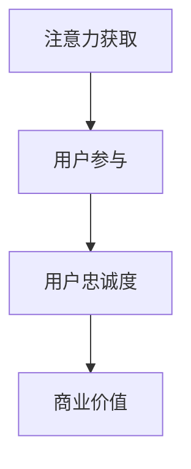
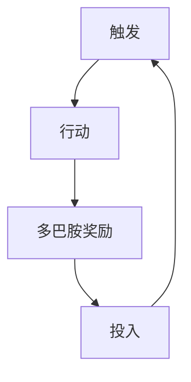

                 

### 文章标题: 注意力经济与用户体验优化：创建让人上瘾的产品和服务的秘诀

### 关键词：注意力经济、用户体验、产品优化、上瘾模型、案例分析、技术支持

### 摘要：

本文深入探讨了注意力经济与用户体验优化的核心概念和方法，旨在揭示如何通过有效的策略设计出让人上瘾的产品和服务。首先，我们介绍了注意力经济的基础概念和发展历程，阐述了注意力获取与保留的关键策略。接着，我们从用户体验设计的基础原则、界面设计技巧、内容创作与传播等方面，详细探讨了如何优化用户体验。随后，我们通过上瘾模型的分析和成功案例分析，为产品设计提供了实用的方法论。最后，我们探讨了技术支持与工具应用、团队协作与项目管理的重要性，并对未来注意力经济和用户体验的发展趋势进行了展望。通过这篇文章，读者将能够全面理解注意力经济与用户体验优化的原理和实践，为打造让人上瘾的产品和服务提供有力支持。

### 目录大纲

## 第一部分：注意力经济概述

### 第1章：注意力经济基础
#### 1.1 注意力经济核心概念与联系
#### 1.2 注意力经济的数学模型
#### 1.3 注意力经济案例分析

### 第2章：注意力获取与保留
#### 2.1 注意力获取方法
#### 2.2 用户注意力的保留策略
#### 2.3 注意力经济在社交媒体中的应用

## 第二部分：用户体验优化

### 第3章：用户体验设计基础
#### 3.1 用户体验的重要性
#### 3.2 用户体验设计的核心原则
#### 3.3 用户体验设计的流程

### 第4章：界面设计技巧
#### 4.1 界面布局与色彩
#### 4.2 字体与图标设计
#### 4.3 动效与交互设计

### 第5章：内容创作与传播
#### 5.1 内容创作的原则
#### 5.2 内容传播的策略
#### 5.3 内容优化与迭代

## 第三部分：让人上瘾的产品和服务

### 第6章：上瘾模型与案例分析
#### 6.1 上瘾模型的构成
#### 6.2 上瘾模型的应用场景
#### 6.3 成功案例分析

### 第7章：产品设计实战
#### 7.1 产品设计方法论
#### 7.2 产品迭代与优化
#### 7.3 产品测试与反馈

### 第8章：服务体验优化
#### 8.1 优质服务的标准
#### 8.2 服务流程设计
#### 8.3 服务体验提升策略

## 第四部分：构建注意力经济与用户体验优化的生态系统

### 第9章：技术支持与工具应用
#### 9.1 前端技术支持
#### 9.2 后端技术支持
#### 9.3 数据分析工具与平台

### 第10章：团队协作与项目管理
#### 10.1 团队协作的重要性
#### 10.2 项目管理的方法与工具
#### 10.3 项目风险管理

### 第11章：未来展望与趋势
#### 11.1 注意力经济与用户体验的未来
#### 11.2 技术进步对用户体验的影响
#### 11.3 行业趋势与挑战

### 第一部分：注意力经济概述

## 第1章：注意力经济基础

### 1.1 注意力经济核心概念与联系

#### 1.1.1 什么是注意力经济

在数字时代，注意力成为了一种新的“货币”，被称为“注意力经济”。与传统的货币经济不同，注意力经济强调的是用户对产品和服务的关注、参与和互动。注意力经济的核心概念可以概括为以下几点：

1. **注意力获取**：通过吸引和保持用户的注意力，实现用户参与和互动。
2. **用户参与**：用户在产品或服务中的深度互动，包括使用、评论、分享等行为。
3. **用户忠诚度**：用户对产品或服务的持续关注和重复使用。
4. **商业价值**：通过用户的持续参与和忠诚度，实现商业盈利。

#### Mermaid流程图：注意力经济的流程与环节

#### 1.1.2 注意力经济的起源与发展

注意力经济的概念最早由互联网企业家杰西·康恩伯格（Jesse Connell）在2006年提出。随着互联网和社交媒体的快速发展，人们获取信息的渠道变得多样化，而用户的注意力资源变得稀缺。因此，如何有效地获取和保留用户注意力，成为企业竞争的关键。

1. **2006-2010年：初步探索阶段**：注意力经济概念被提出，并开始应用于市场营销和广告领域。
2. **2011-2015年：快速发展阶段**：随着智能手机的普及，移动互联网成为主要的信息获取渠道，注意力经济在社交媒体、在线广告等领域得到广泛应用。
3. **2016年至今：成熟阶段**：注意力经济已经成为企业战略的重要组成部分，涉及领域也从市场营销扩展到产品设计、用户体验等各个方面。

#### 1.1.3 注意力经济的核心原则

1. **稀缺性原则**：注意力资源是有限的，用户在选择信息时往往优先关注最有价值的内容。
2. **参与性原则**：用户的参与和互动是注意力经济的关键，只有通过用户的积极参与，才能实现商业价值。
3. **个性化原则**：根据用户兴趣和行为数据，提供个性化的内容和体验，提高用户的忠诚度和满意度。
4. **创新性原则**：不断探索新的获取和保留注意力的方式，保持竞争力。

### 1.2 注意力经济的数学模型

#### 用户参与度的计算公式

用户参与度是衡量注意力经济成效的重要指标，可以通过以下公式计算：

$$ \text{用户参与度} = \frac{\text{用户活跃度} + \text{用户留存率}}{2} $$

其中：
- **用户活跃度**：用户在一定时间内与产品或服务的互动次数和时长。
- **用户留存率**：用户在一定时间内持续使用产品或服务的比例。

#### 举例说明

假设一个社交媒体平台的用户活跃度为100次/天，用户留存率为70%，则该平台的用户参与度为：

$$ \text{用户参与度} = \frac{100 + 70}{2} = 85\% $$

这意味着该平台的用户参与度较高，具有一定的竞争力。

### 1.3 注意力经济案例分析

#### 案例一：微博

微博作为一个社交媒体平台，通过以下策略实现了注意力经济：

1. **内容多样化**：提供多种类型的内容，满足不同用户的需求，提高用户活跃度。
2. **个性化推荐**：根据用户兴趣和行为数据，为用户提供个性化的内容推荐，提高用户留存率。
3. **社交互动**：鼓励用户之间的互动，如点赞、评论、转发等，增强用户参与度。

通过这些策略，微博吸引了大量用户，实现了商业盈利。

#### 案例二：抖音

抖音作为一个短视频平台，通过以下策略实现了注意力经济：

1. **算法推荐**：利用机器学习算法，为用户推荐感兴趣的视频，提高用户留存率。
2. **互动设计**：通过点赞、评论、分享等功能，增强用户参与度。
3. **品牌合作**：与知名品牌合作，提高平台知名度，吸引更多用户。

抖音的成功在于其精准的算法推荐和丰富的互动设计，使其成为用户喜爱的短视频平台。

通过以上案例分析，我们可以看到注意力经济在不同领域的应用，以及如何通过有效的策略实现用户参与和商业价值。

## 第2章：注意力获取与保留

### 2.1 注意力获取方法

在注意力经济中，获取用户注意力是关键的第一步。以下是一些常见的方法，帮助企业吸引目标用户：

#### 1. 内容营销

内容营销是通过提供有价值、相关且具有吸引力的内容，吸引并留住用户的一种策略。以下是一些关键步骤：

1. **了解目标受众**：通过市场调研和用户分析，了解目标受众的兴趣、需求和痛点。
2. **内容策划**：根据目标受众的特点，策划和创作高质量的内容，包括文章、视频、图片、音频等多种形式。
3. **内容发布**：在合适的时间和渠道发布内容，如社交媒体、博客、视频平台等。
4. **内容优化**：通过数据分析，持续优化内容，提高用户参与度和留存率。

#### 2. 社交媒体营销

社交媒体营销是利用社交媒体平台（如微博、微信、Facebook、Instagram等）来推广产品和服务的策略。以下是一些关键步骤：

1. **平台选择**：根据目标受众的特点，选择合适的社交媒体平台。
2. **内容创作**：发布有趣、有用、有价值的帖子，与用户互动，建立品牌形象。
3. **互动策略**：鼓励用户参与，如点赞、评论、分享等，提高用户活跃度。
4. **广告投放**：通过社交媒体广告，精准投放，扩大品牌影响力。

#### 3. 用户反馈

用户反馈是获取用户注意力的重要手段，以下是一些关键步骤：

1. **收集反馈**：通过问卷调查、在线评论、社交媒体互动等方式，收集用户的反馈。
2. **分析反馈**：对收集到的反馈进行分析，了解用户的满意度和痛点。
3. **改进服务**：根据用户反馈，改进产品和服务，提高用户体验。
4. **反馈激励**：通过奖励机制，鼓励用户积极参与反馈，提高用户忠诚度。

#### 4. 个人品牌建设

个人品牌建设是通过打造个人影响力，吸引目标用户的策略。以下是一些关键步骤：

1. **专业形象**：通过专业知识和经验，建立个人专业形象。
2. **内容输出**：定期发布高质量的内容，如博客、视频、演讲等，展示专业能力。
3. **社交媒体互动**：在社交媒体上积极参与讨论，与用户互动，扩大影响力。
4. **合作与演讲**：参与行业会议、讲座等活动，与同行交流，提升个人知名度。

#### 5. 事件营销

事件营销是通过策划和举办各种活动，吸引媒体和公众关注的一种策略。以下是一些关键步骤：

1. **活动策划**：根据目标受众和品牌形象，策划有吸引力的活动。
2. **宣传推广**：利用各种渠道，如社交媒体、广告、新闻稿等，进行活动宣传。
3. **活动执行**：确保活动顺利进行，提高用户参与度。
4. **活动总结**：对活动进行总结，评估效果，持续优化。

通过以上方法，企业可以有效地获取用户注意力，提高用户参与度和忠诚度，实现商业价值。

### 2.2 用户注意力的保留策略

获取用户注意力只是第一步，保留用户注意力同样重要。以下是一些有效的策略，帮助企业留住用户：

#### 1. 个性化推荐

个性化推荐是通过分析用户的兴趣和行为数据，为用户提供定制化的内容和服务的一种策略。以下是一些关键步骤：

1. **数据收集**：收集用户的基本信息、行为数据、兴趣偏好等。
2. **数据分析**：利用数据分析工具，分析用户数据，挖掘用户兴趣和行为模式。
3. **推荐系统**：基于用户数据，构建推荐系统，为用户推荐感兴趣的内容和服务。
4. **持续优化**：通过用户反馈和数据分析，持续优化推荐系统，提高推荐精度和用户满意度。

#### 2. 持续互动

持续互动是通过与用户保持沟通和互动，增强用户参与度和忠诚度的一种策略。以下是一些关键步骤：

1. **社交媒体互动**：在社交媒体平台上积极与用户互动，如回复评论、参与讨论等。
2. **邮件营销**：定期发送邮件，提供有价值的信息、优惠活动等，保持与用户的联系。
3. **在线客服**：提供高质量的在线客服服务，及时解决用户问题和疑虑。
4. **用户社区**：建立用户社区，鼓励用户参与讨论、分享经验，增强用户归属感。

#### 3. 优质内容

优质内容是通过提供有价值、有趣、相关的信息，吸引和留住用户的一种策略。以下是一些关键步骤：

1. **内容策划**：根据用户需求和兴趣，策划和创作高质量的内容。
2. **内容形式**：多种形式的内容，如文章、视频、图片、音频等，满足不同用户的需求。
3. **内容更新**：定期更新内容，保持内容的时效性和新鲜感。
4. **内容优化**：通过用户反馈和数据分析，持续优化内容，提高用户满意度。

#### 4. 用户体验优化

用户体验优化是通过改进产品和服务，提高用户满意度的一种策略。以下是一些关键步骤：

1. **用户体验设计**：根据用户需求和行为，设计易用、直观的用户界面。
2. **反馈机制**：建立有效的反馈机制，收集用户意见和建议。
3. **问题解决**：及时解决用户问题和疑虑，提高用户满意度。
4. **持续改进**：根据用户反馈和数据分析，持续优化产品和服务，提高用户体验。

#### 5. 社交互动

社交互动是通过用户之间的互动，增强用户参与度和忠诚度的一种策略。以下是一些关键步骤：

1. **社交功能**：在产品和服务中集成社交功能，如点赞、评论、分享等。
2. **活动策划**：定期举办线上或线下活动，鼓励用户参与和互动。
3. **社区建设**：建立用户社区，鼓励用户分享经验、解决问题。
4. **品牌形象**：通过积极的社交互动，树立良好的品牌形象，增强用户信任。

通过以上策略，企业可以有效地保留用户注意力，提高用户参与度和忠诚度，实现长期商业价值。

### 2.3 注意力经济在社交媒体中的应用

社交媒体平台在注意力经济中发挥着至关重要的作用，通过以下策略，企业可以在社交媒体上获取和保留用户注意力：

#### 1. 算法推荐

算法推荐是社交媒体平台的主要策略之一，通过分析用户行为数据，为用户推荐感兴趣的内容。以下是一些关键步骤：

1. **用户数据收集**：收集用户的基本信息、行为数据、兴趣偏好等。
2. **数据预处理**：对用户数据进行清洗、去噪和处理。
3. **特征提取**：提取用户行为和内容的关键特征，如浏览历史、点赞记录、评论内容等。
4. **模型训练**：利用机器学习算法，训练推荐模型，如协同过滤、基于内容的推荐等。
5. **模型评估**：评估推荐模型的准确性和效果，持续优化模型。

#### 2. 互动设计

互动设计是社交媒体平台吸引和留住用户的重要手段，以下是一些关键步骤：

1. **功能集成**：集成点赞、评论、分享等功能，鼓励用户互动。
2. **动态更新**：实时更新内容，吸引用户关注。
3. **互动奖励**：通过积分、优惠券等激励措施，鼓励用户积极参与互动。
4. **个性化互动**：根据用户行为和兴趣，提供个性化的互动体验。

#### 3. 品牌营销

品牌营销是社交媒体平台帮助企业获取用户注意力的关键策略，以下是一些关键步骤：

1. **品牌定位**：明确品牌定位和目标受众，制定相应的营销策略。
2. **内容创作**：创作有趣、有价值的品牌内容，吸引用户关注。
3. **广告投放**：通过社交媒体广告，精准投放，扩大品牌影响力。
4. **用户互动**：积极参与用户互动，树立良好的品牌形象。

#### 4. 用户反馈

用户反馈是社交媒体平台获取用户注意力的重要手段，以下是一些关键步骤：

1. **收集反馈**：通过问卷调查、在线评论、社交媒体互动等方式，收集用户反馈。
2. **分析反馈**：对收集到的反馈进行分析，了解用户的满意度和痛点。
3. **改进服务**：根据用户反馈，改进产品和服务，提高用户体验。
4. **反馈激励**：通过奖励机制，鼓励用户积极参与反馈，提高用户忠诚度。

#### 5. 社交互动

社交互动是社交媒体平台的核心功能，以下是一些关键步骤：

1. **社交功能**：在社交媒体平台上集成各种社交功能，如私信、群组、直播等。
2. **活动策划**：定期举办线上或线下活动，鼓励用户参与和互动。
3. **社区建设**：建立用户社区，鼓励用户分享经验、解决问题。
4. **品牌互动**：与用户保持互动，回应用户问题和需求，增强用户信任。

通过以上策略，社交媒体平台可以有效获取和保留用户注意力，实现商业价值。

## 第二部分：用户体验优化

### 第3章：用户体验设计基础

#### 3.1 用户体验的重要性

用户体验（User Experience，简称UX）是衡量产品和服务质量的重要指标，它关系到用户对产品或服务的满意度和忠诚度。一个良好的用户体验能够带来以下几方面的好处：

1. **用户满意度**：通过优化用户体验，提高用户对产品或服务的满意度，增强用户对品牌的信任和忠诚度。
2. **用户留存率**：良好的用户体验能够提高用户留存率，降低用户流失率，为企业带来持续的收益。
3. **用户推荐**：满意的用户体验会促使用户向他人推荐产品或服务，从而扩大用户群体，提高市场份额。
4. **业务增长**：通过用户体验的优化，提高用户活跃度和参与度，推动业务增长。

在当前市场竞争激烈的背景下，用户体验已成为企业赢得用户、赢得市场的关键因素。用户体验的重要性可以从以下几个方面进行阐述：

1. **用户需求**：用户体验设计旨在满足用户的需求，只有深入了解用户需求，才能提供真正有价值的产品和服务。
2. **竞争环境**：在同类产品和服务中，用户体验成为企业差异化竞争的重要手段，良好的用户体验能够帮助企业脱颖而出。
3. **技术发展**：随着技术的发展，用户体验设计的工具和方法越来越先进，企业可以通过技术创新，提升用户体验。

总之，用户体验是产品和服务质量的直接体现，是企业赢得市场和用户的关键。在设计和开发过程中，重视用户体验，将有助于企业取得长期的竞争优势。

#### 3.2 用户体验设计的核心原则

用户体验设计（User Experience Design，简称UXD）是一门综合性的学科，旨在通过系统的方法，设计出满足用户需求、易于使用且具有吸引力的产品和服务。以下是一些核心原则，指导用户体验设计的整个过程：

1. **以用户为中心**：用户体验设计的核心理念是“以用户为中心”，即在整个设计过程中，始终关注用户的需求、行为和体验。设计者需要深入理解用户群体，挖掘他们的痛点和需求，从而设计出真正符合用户期望的产品。

2. **简洁明了**：简洁明了是用户体验设计的一个重要原则。一个良好的设计应该尽量避免冗余和复杂性，让用户能够轻松地理解和使用产品。简洁的设计不仅提高了用户的满意度，还能减少用户的学习成本和错误率。

3. **一致性**：一致性在用户体验设计中至关重要。一致性体现在多个方面，如界面元素的设计风格、交互方式的规范、导航路径的统一等。一致性能够提高用户的操作效率和体验，降低用户的困惑和焦虑。

4. **易用性**：易用性是用户体验设计的核心目标之一。一个易用的产品应该具备以下几个特点：
   - **直观性**：用户能够通过直观的界面元素和交互方式，快速理解产品的功能和使用方法。
   - **可控性**：用户在使用产品时，能够感受到对产品的控制，能够轻松地撤销错误操作。
   - **反馈性**：产品能够及时给予用户反馈，帮助用户了解操作结果和系统状态。
   - **高效性**：产品能够优化用户的操作流程，提高用户完成任务的速度和效率。

5. **可访问性**：可访问性是指产品和服务能够被不同类型的用户使用，包括残疾人、老年人等。设计者需要考虑到不同用户群体的需求，提供多样化的设计方案，确保所有人都能享受到良好的用户体验。

6. **可持续性**：用户体验设计不仅仅关注短期效果，还需要考虑产品的长期可持续性。这包括产品功能的扩展性、系统的维护和更新、用户反馈的收集与处理等。

通过遵循以上核心原则，用户体验设计师能够设计出更符合用户需求、更具竞争力的产品和服务，从而提升用户满意度和忠诚度。

#### 3.3 用户体验设计的流程

用户体验设计的流程是一个系统化的过程，旨在通过一系列有序的步骤，从用户需求出发，逐步实现最终的设计目标。以下是用户体验设计的主要流程和每个阶段的关键任务：

1. **需求分析**：
   - **用户调研**：通过访谈、问卷调查、用户行为分析等方法，深入了解用户的需求、行为和痛点。
   - **需求整理**：将收集到的用户需求进行整理和分析，确定核心需求和优先级。
   - **需求文档**：编写需求文档，明确产品的功能、性能、用户体验等方面的要求。

2. **信息架构**：
   - **内容规划**：根据需求分析结果，规划产品内容结构，确定页面布局和导航方式。
   - **信息地图**：绘制信息地图，展示信息之间的关系和层次结构。
   - **原型设计**：制作信息架构的原型，验证和优化信息布局和导航。

3. **界面设计**：
   - **视觉设计**：根据品牌形象和用户需求，设计界面的视觉效果，包括色彩、字体、图标等。
   - **界面布局**：设计界面的布局，确保界面元素的可读性、一致性和直观性。
   - **交互设计**：设计用户与产品交互的方式，包括按钮、输入框、滚动条等。

4. **原型验证**：
   - **原型测试**：制作功能原型，进行用户测试，收集用户反馈。
   - **反馈分析**：分析用户测试结果，识别问题和改进点。
   - **迭代优化**：根据用户反馈，对原型进行优化和迭代，提高用户体验。

5. **开发与实施**：
   - **技术开发**：根据设计文档，进行产品的技术开发，实现功能、界面和交互。
   - **测试与验收**：对开发完成的产品进行全面的测试，确保功能完善、无漏洞。
   - **上线与推广**：将产品上线，进行市场推广，吸引目标用户。

6. **运营与优化**：
   - **数据分析**：收集用户行为数据，分析用户体验和产品性能。
   - **反馈收集**：通过用户调研、用户社区等方式，收集用户反馈和建议。
   - **持续优化**：根据用户数据和反馈，持续优化产品功能和用户体验。

通过以上流程，用户体验设计师能够系统地、有针对性地进行设计工作，确保最终产品能够满足用户需求，提供优质的用户体验。

### 第4章：界面设计技巧

#### 4.1 界面布局与色彩

界面布局与色彩是影响用户体验的重要因素，合理的布局和色彩搭配能够提高用户界面的易读性、吸引力和用户体验。以下是界面布局与色彩设计的关键技巧：

##### 1. 界面布局

- **网格系统**：采用网格系统进行界面布局，能够使界面元素更加整齐、有序。网格系统可以帮助设计师合理安排内容位置，提高界面的整体美观度。
- **黄金分割**：黄金分割是一种经典的美学原则，通过将界面元素按黄金比例进行布局，可以创造出更具视觉吸引力的界面。
- **层次感**：通过不同的字体大小、颜色、排版方式等，为界面元素建立明确的层次感，帮助用户快速理解和使用界面。
- **对齐原则**：遵循对齐原则，将界面元素对齐，可以提高界面的整洁度，减少用户的视觉疲劳。

##### 2. 色彩搭配

- **色彩理论**：了解色彩理论，如色轮、色彩对比等，可以帮助设计师选择合适的色彩搭配，创造出和谐、统一的界面视觉效果。
- **色彩心理学**：色彩心理学研究不同颜色对用户心理和行为的影响。设计师可以根据目标用户的特点和需求，选择适合的颜色。
- **背景与前景**：合理使用背景和前景颜色，使界面元素突出。例如，使用深色背景突出白色文字，使用浅色背景突出深色图标。
- **色彩对比**：通过对比色或近似色的运用，可以增强界面的视觉效果，提高用户的关注点。

#### 4.2 字体与图标设计

字体与图标设计是界面设计的重要组成部分，它们不仅影响界面的美观度，还影响用户的易读性和操作体验。以下是字体与图标设计的关键技巧：

##### 1. 字体设计

- **字体选择**：选择适合品牌形象和用户需求的字体，如正文字体应选择清晰易读的字体，标题字体应选择突出且具有辨识度的字体。
- **字号与行距**：合理设置字体大小和行距，使文本内容易于阅读。一般情况下，正文字体大小应在16px以上，行距应在1.2倍字体大小以上。
- **字体风格**：根据界面风格和内容特点，选择合适的字体风格。如科技类产品可选择简洁、现代的字体，教育类产品可选择正式、典雅的字体。

##### 2. 图标设计

- **图标类型**：根据功能和使用场景选择合适的图标类型，如功能图标、指示图标、操作图标等。
- **图标尺寸**：合理设置图标尺寸，确保图标在界面中清晰可见，不影响用户操作。
- **图标风格**：图标设计应与整体界面风格保持一致，如扁平化风格、写实风格等。
- **图标意义**：图标应具有明确的意义，避免用户产生误解。在设计过程中，可以通过符号学、色彩等手段增强图标的意义。

#### 4.3 动效与交互设计

动效与交互设计是提升用户体验的重要手段，通过合理的动效和交互设计，可以增强用户界面的互动性和吸引力。以下是动效与交互设计的关键技巧：

##### 1. 动效设计

- **动效目的**：动效应具有明确的目的，如引导用户操作、提供反馈、增强视觉吸引力等。避免不必要的动效，以免造成用户困扰。
- **动效时长**：合理设置动效时长，确保动效不过长也不过短。一般情况下，动效时长应在200-500毫秒之间。
- **动效节奏**：动效的节奏应与用户操作的速度相匹配，如按钮点击后的反馈动效应快速出现，以增强用户的操作体验。
- **动效视觉**：动效的视觉效果应简洁、美观，避免过于复杂或刺眼的设计。

##### 2. 交互设计

- **响应式交互**：设计响应式交互，使界面能够根据不同的设备和屏幕尺寸进行适配，提高用户体验。
- **操作反馈**：为用户的操作提供及时的反馈，如按钮点击后的高亮、加载动画等，以增强用户的操作信心。
- **导航设计**：设计直观、简洁的导航方式，帮助用户快速找到所需内容。
- **交互提示**：为用户提供必要的交互提示，如帮助文档、操作指南等，帮助用户了解如何使用界面。

通过以上技巧，设计师可以创造出美观、易用、具有吸引力的用户界面，提升用户体验，增强用户满意度和忠诚度。

### 第5章：内容创作与传播

#### 5.1 内容创作的原则

内容创作是影响用户体验的关键因素之一，高质量的内容不仅能够吸引和留住用户，还能提升品牌价值和市场竞争力。以下是一些内容创作的原则：

1. **目标明确**：明确内容创作的目标，包括传达的信息、预期的用户行为和目标受众。目标明确有助于内容创作更加聚焦和有效。

2. **用户导向**：以用户为中心，深入了解目标受众的需求、兴趣和痛点。内容应贴近用户实际生活和工作场景，提供有价值的信息和解决方案。

3. **独特性**：内容应具有独特性和创新性，避免与竞争对手的内容雷同。独特的内容能够吸引更多用户关注，提升品牌的差异化竞争力。

4. **易读性**：确保内容易于理解和阅读，避免使用过于专业或复杂的术语。易读性的内容能够提高用户的阅读体验，减少阅读障碍。

5. **简洁性**：简洁明了是内容创作的重要原则。简洁的内容能够帮助用户快速获取关键信息，提高阅读效率。

6. **连贯性**：内容应保持连贯性，逻辑清晰，避免出现信息断点或混淆。连贯的内容能够提升用户体验，增强用户对品牌的信任。

7. **可访问性**：确保内容对目标受众具有可访问性，包括语言、格式、渠道等方面的适配。可访问性的内容能够扩大用户群体，提高内容的传播效果。

8. **及时更新**：定期更新内容，保持信息的时效性和新鲜感。及时更新的内容能够吸引和保持用户的关注，提升用户参与度。

通过遵循以上原则，内容创作者能够创作出高质量、有价值、具有吸引力的内容，提升用户体验，实现品牌价值最大化。

#### 5.2 内容传播的策略

内容创作完成后，如何有效地传播是影响内容成功的关键。以下是一些内容传播的策略：

1. **社交媒体营销**：利用社交媒体平台（如微博、微信、抖音等）进行内容传播，通过发布有趣、有价值的帖子，吸引粉丝和受众。

2. **SEO优化**：通过搜索引擎优化（SEO）提高内容在搜索引擎中的排名，吸引更多潜在用户访问。

3. **邮件营销**：定期发送邮件，向订阅用户推送最新内容和优惠信息，保持与用户的联系和互动。

4. **合作伙伴**：与相关行业或领域的合作伙伴进行合作，通过联合推广、内容互换等方式扩大内容的传播范围。

5. **内容推广**：利用广告、内容营销工具（如Google Ads、社交媒体广告等）进行内容推广，提高内容的曝光率。

6. **用户互动**：通过用户评论、分享、点赞等方式，促进用户互动，提高内容的传播速度和影响力。

7. **KOL/网红合作**：与知名意见领袖（KOL）或网红合作，通过他们的推荐和传播，扩大内容的影响力。

8. **内容分发**：将内容分发到各种渠道，如博客、论坛、行业平台等，提高内容的覆盖面。

通过以上策略，内容创作者和传播者能够有效地推广内容，吸引更多用户关注，实现内容的最大价值化。

#### 5.3 内容优化与迭代

内容优化与迭代是持续提升用户体验和内容质量的重要环节。以下是一些关键步骤和技巧：

1. **用户反馈**：积极收集用户反馈，包括评论、调查问卷、社交媒体互动等，了解用户对内容的满意度、需求和痛点。

2. **数据分析**：通过数据分析工具，如Google Analytics、社交媒体分析等，收集内容的表现数据，包括访问量、跳出率、用户行为等。

3. **内容评估**：根据用户反馈和数据分析结果，评估内容的优缺点，确定优化方向和重点。

4. **优化执行**：针对评估结果，对内容进行优化，包括改进标题、摘要、正文结构、图片和视频等。

5. **A/B测试**：通过A/B测试，对比不同版本的内容表现，选择最优的内容方案。

6. **持续更新**：定期更新内容，保持信息的时效性和新鲜感，吸引和留住用户。

7. **迭代优化**：根据用户反馈和数据分析，不断迭代和优化内容，提高用户体验和内容质量。

通过以上步骤和技巧，内容创作者能够持续优化内容，提升用户体验，实现内容的长期价值。

### 第6章：上瘾模型与案例分析

#### 6.1 上瘾模型的构成

上瘾模型（Hook Model）是由心理学家和行为经济学家所提出的，用于解释产品和服务如何让人上瘾。上瘾模型由四个核心环节构成：

1. **触发（Trigger）**：触发是用户开始使用产品的动力，它可以是外部事件（如推送通知、广告等）或内部触发（如好奇心、需求等）。
2. **行动（Action）**：行动是用户对产品的实际操作，如点击、浏览、点赞等。
3. **多巴胺奖励（Variable Reward）**：多巴胺奖励是指用户在行动后获得的即时反馈和奖励，如游戏中的分数、社交媒体上的点赞等，这种奖励能够激发用户的愉悦感和继续使用产品的动力。
4. **投入（Investment）**：投入是指用户为获得更多奖励而投入的时间和资源，如完成游戏任务、分享内容等，这种投入能够增强用户的参与度和忠诚度。

通过以上四个环节的循环，产品能够逐步建立起用户上瘾的机制。

#### Mermaid流程图：上瘾模型的基本环节

#### 6.2 上瘾模型的应用场景

上瘾模型广泛应用于各类产品和服务中，以下是一些典型的应用场景：

1. **社交媒体**：通过推送通知、热门话题推荐等触发用户行动，提供点赞、评论等多巴胺奖励，鼓励用户投入更多时间和精力分享、互动。
2. **游戏**：通过游戏关卡、得分奖励等触发用户行动，提供新鲜感强、即时反馈的多巴胺奖励，鼓励用户投入更多时间和金钱购买虚拟物品。
3. **电商**：通过广告、促销活动等触发用户购买行为，提供优惠、积分等多巴胺奖励，鼓励用户持续购物和分享。
4. **健身应用**：通过每日打卡、进度追踪等触发用户锻炼行为，提供成就感和健康反馈等多巴胺奖励，鼓励用户持续投入时间和精力。

#### 6.3 成功案例分析

以下是一些成功应用上瘾模型的产品和服务案例：

**案例一：Instagram**

Instagram通过以下方式成功应用上瘾模型：

1. **触发**：通过推送通知，提醒用户有新的关注者或点赞。
2. **行动**：用户浏览、点赞、评论、分享图片和视频。
3. **多巴胺奖励**：用户获得点赞、评论等即时反馈，满足其社交需求。
4. **投入**：用户投入时间拍摄、编辑和分享内容，建立个人品牌。

通过上瘾模型，Instagram成功吸引了大量用户，成为了全球最受欢迎的社交媒体平台之一。

**案例二：Duolingo**

Duolingo是一款语言学习应用，通过以下方式应用上瘾模型：

1. **触发**：通过每日任务提醒，鼓励用户每天进行学习。
2. **行动**：用户完成语言学习任务，如听力、阅读、写作等。
3. **多巴胺奖励**：用户获得积分、成就等即时反馈，提升学习动力。
4. **投入**：用户投入时间学习，参与社区互动，提升语言能力。

Duolingo通过上瘾模型，成功帮助用户坚持学习，提高了用户的学习效果和满意度。

**案例三：Fitbit**

Fitbit是一款健身追踪设备，通过以下方式应用上瘾模型：

1. **触发**：通过每日健身提醒，鼓励用户进行运动。
2. **行动**：用户进行跑步、骑行、健身等运动。
3. **多巴胺奖励**：用户获得步数、卡路里消耗等即时反馈，满足健康需求。
4. **投入**：用户投入时间记录健身数据，设定目标，持续跟踪健康。

Fitbit通过上瘾模型，成功帮助用户养成健康习惯，提高了用户的生活质量。

通过以上案例，我们可以看到上瘾模型在不同产品和服务中的应用效果，它不仅能够吸引和留住用户，还能够提高用户参与度和忠诚度，实现商业价值。

### 第7章：产品设计实战

#### 7.1 产品设计方法论

成功的产品设计离不开科学的方法论。以下是一些常见的产品设计方法论，供设计师参考：

1. **用户中心设计（User-Centered Design）**：以用户为中心，通过用户研究、原型设计、测试和迭代，确保产品设计符合用户需求。

2. **敏捷开发（Agile Development）**：采用迭代和增量的开发方法，快速响应市场变化，提高产品质量和用户满意度。

3. **精益创业（Lean Startup）**：通过最小可行产品（MVP）验证市场需求，快速迭代，减少浪费。

4. **服务设计（Service Design）**：将产品、服务和体验作为一个整体，通过系统化的方法，提高用户满意度。

5. **设计思维（Design Thinking）**：通过同理心、定义问题、创意生成、原型设计和测试，解决复杂问题，创造有价值的产品。

#### 7.2 产品迭代与优化

产品迭代与优化是产品设计过程中不可或缺的一部分。以下是一些关键步骤和技巧：

1. **用户反馈**：通过用户调研、测试和反馈，收集用户对产品的意见和建议。

2. **数据分析**：利用数据分析工具，如Google Analytics、Mixpanel等，分析用户行为和产品表现，发现问题和改进点。

3. **迭代计划**：根据用户反馈和数据分析，制定迭代计划，确定优先级和改进方向。

4. **原型设计**：制作原型，进行用户测试，验证改进方案的有效性。

5. **A/B测试**：通过A/B测试，对比不同版本的产品表现，选择最优方案。

6. **持续优化**：根据用户反馈和数据分析，不断迭代和优化产品，提高用户体验。

通过以上步骤和技巧，产品团队能够有效地迭代和优化产品，提高用户满意度，实现商业目标。

#### 7.3 产品测试与反馈

产品测试与反馈是确保产品质量和用户体验的关键环节。以下是一些常见的产品测试方法和反馈渠道：

1. **功能测试**：验证产品的功能是否符合设计要求，确保产品能够正常运行。

2. **性能测试**：评估产品的响应速度、稳定性、并发处理能力等性能指标。

3. **用户体验测试**：通过实际用户操作产品，评估用户体验和易用性。

4. **A/B测试**：对比不同版本的产品，评估用户行为和满意度，选择最优方案。

5. **用户调研**：通过问卷调查、访谈、用户社区等方式，收集用户对产品的意见和建议。

6. **数据分析**：利用数据分析工具，分析用户行为和产品表现，识别问题和改进点。

通过以上方法，产品团队能够全面评估产品性能和用户体验，及时发现问题并进行优化，提高产品的质量和用户满意度。

### 第8章：服务体验优化

#### 8.1 优质服务的标准

优质服务是提升用户体验、增强品牌形象和赢得用户忠诚度的重要手段。以下是一些衡量优质服务的标准：

1. **响应速度**：及时回应用户的需求和问题，确保用户能够快速获得帮助和解决方案。

2. **解决问题的效率**：快速准确地解决问题，减少用户的等待时间和不满情绪。

3. **沟通质量**：提供清晰、礼貌、专业的沟通，确保用户感受到尊重和理解。

4. **用户满意度**：通过用户调查和反馈，了解用户对服务的满意程度，持续改进服务质量。

5. **个性化服务**：根据用户的特点和需求，提供定制化的服务，提高用户的满意度和忠诚度。

6. **持续改进**：定期评估服务质量，根据用户反馈和市场变化，不断优化和提升服务水平。

7. **员工培训**：提供专业培训和激励机制，确保员工具备良好的服务意识和技能。

通过以上标准，企业能够为用户提供优质的服务体验，增强用户满意度和品牌忠诚度。

#### 8.2 服务流程设计

服务流程设计是确保服务高效、有序进行的关键步骤。以下是一些关键步骤和注意事项：

1. **需求识别**：了解用户的需求和痛点，明确服务的目标。

2. **流程设计**：根据需求识别结果，设计服务流程，包括服务步骤、时间节点、责任人等。

3. **优化流程**：通过流程分析，识别和消除流程中的瓶颈和冗余，提高流程效率。

4. **标准化流程**：制定标准化的服务流程，确保服务质量的一致性。

5. **自动化工具**：利用自动化工具，如CRM系统、自动化客服等，提高服务效率。

6. **反馈机制**：建立反馈机制，收集用户对服务流程的反馈，持续改进服务流程。

通过以上步骤和注意事项，企业能够设计出高效、有序的服务流程，提高服务质量和用户满意度。

#### 8.3 服务体验提升策略

提升服务体验是增强用户满意度和忠诚度的重要策略。以下是一些有效的方法：

1. **个性化服务**：根据用户的特点和需求，提供定制化的服务，如个性化推荐、定制化解决方案等。

2. **互动式服务**：通过互动式客服、在线聊天、社交媒体互动等方式，增加用户参与度，提高用户满意度。

3. **用户体验优化**：优化服务流程、界面设计、沟通质量等，提高用户体验。

4. **增值服务**：提供额外的增值服务，如培训、咨询服务等，提高用户的满意度和忠诚度。

5. **客户关怀**：定期与客户沟通，了解客户的需求和反馈，提供个性化的关怀和帮助。

6. **服务质量监控**：建立服务质量监控机制，及时发现和解决服务问题，确保服务质量的持续提升。

通过以上策略，企业能够有效提升服务体验，增强用户满意度和忠诚度，实现长期商业价值。

### 第9章：技术支持与工具应用

#### 9.1 前端技术支持

前端技术是构建高质量用户体验的核心，以下是一些关键的前端技术支持和工具：

1. **HTML/CSS/JavaScript**：这些是前端开发的基础技术，HTML用于结构设计，CSS用于样式设计，JavaScript用于交互逻辑。

2. **响应式设计**：通过媒体查询和流体布局，实现不同设备上的自适应显示，提升用户体验。

3. **框架与库**：使用流行的前端框架和库，如React、Vue、Angular等，可以提高开发效率和代码质量。

4. **前端构建工具**：如Webpack、Gulp等，用于优化和打包前端资源，提高加载速度和性能。

5. **前端性能优化**：使用性能分析工具，如Lighthouse、WebPageTest等，优化页面加载速度和资源使用。

#### 9.2 后端技术支持

后端技术是支撑应用程序功能的关键，以下是一些关键的后端技术支持：

1. **Web服务器**：如Apache、Nginx等，用于处理HTTP请求和服务器端逻辑。

2. **数据库**：关系型数据库（如MySQL、PostgreSQL）和非关系型数据库（如MongoDB、Cassandra）适用于不同场景的数据存储和管理。

3. **框架**：如Spring、Django、Express等，用于简化后端开发和提高开发效率。

4. **缓存**：使用Redis、Memcached等缓存技术，提高数据读取速度和系统响应能力。

5. **API开发与接口测试**：使用RESTful API或GraphQL，设计并测试后端接口，确保前后端数据交互顺畅。

#### 9.3 数据分析工具与平台

数据分析是优化用户体验和业务决策的关键，以下是一些常用的数据分析工具与平台：

1. **数据分析平台**：如Google Analytics、Tableau等，提供全面的用户行为分析和数据可视化。

2. **实时分析**：如Kibana、Logstash等，用于实时处理和分析日志数据，监控系统性能和用户行为。

3. **机器学习与人工智能**：如TensorFlow、PyTorch等，用于构建复杂的数据分析模型，实现个性化推荐和智能预测。

4. **BI工具**：如Power BI、Looker等，用于企业级的数据分析和管理，支持多源数据整合和高级数据分析。

通过以上技术支持与工具应用，企业能够高效地开发、部署和优化产品和服务，提升用户体验和业务成效。

### 第10章：团队协作与项目管理

#### 10.1 团队协作的重要性

在现代企业中，团队协作是确保项目成功和业务增长的关键因素。以下是一些关键原因，解释为何团队协作如此重要：

1. **资源整合**：团队协作能够整合不同成员的专业知识和技能，形成互补，提高项目的整体效率和质量。

2. **提高沟通效率**：通过团队协作，信息能够更快速、准确地传递，减少误解和沟通障碍，确保项目进度和目标的达成。

3. **促进创新**：团队协作能够激发创新思维，通过集思广益，找到更有效的解决方案和改进方法。

4. **增强团队凝聚力**：团队协作有助于建立成员之间的信任和默契，提高团队凝聚力，增强员工的归属感和工作动力。

5. **应对复杂问题**：在复杂项目中，团队协作能够通过多人合作，共同应对各种挑战和不确定性，提高项目的成功率。

6. **提升客户满意度**：团队协作能够确保项目按时、按质完成，提供优质的客户服务，提升客户满意度和忠诚度。

通过有效的团队协作，企业能够更好地应对市场变化，提高业务效率和竞争力。

#### 10.2 项目管理的方法与工具

成功的项目管理是确保项目按时、按预算和按质量完成的关键。以下是一些常用的项目管理方法和工具：

1. **敏捷开发（Agile）**：通过迭代和增量开发，灵活应对需求变化，提高项目的适应性和客户满意度。

2. **瀑布模型（Waterfall）**：按照固定的顺序和阶段进行项目开发，确保每个阶段的工作得到充分验证。

3. **关键路径法（Critical Path Method，CPM）**：通过识别项目中的关键任务和路径，优化资源分配，确保项目按时完成。

4. **项目管理软件**：如Trello、Asana、Jira等，用于任务分配、进度跟踪、风险管理等，提高项目管理的效率和透明度。

5. **甘特图（Gantt Chart）**：通过可视化的方式，展示项目的时间线和任务进度，帮助项目经理监控项目进展。

6. **风险管理**：通过识别、评估和应对项目中的潜在风险，降低项目失败的概率，确保项目顺利实施。

通过以上方法和工具，项目经理能够有效地管理项目，确保项目目标的实现。

#### 10.3 项目风险管理

项目风险管理是确保项目成功的关键环节。以下是一些项目风险管理的方法和策略：

1. **风险评估**：通过识别和分析项目中的潜在风险，评估其发生的概率和影响程度，为风险应对提供依据。

2. **风险应对策略**：根据风险评估结果，制定相应的风险应对策略，包括风险避免、风险缓解、风险转移等。

3. **风险监控**：建立风险监控机制，定期检查项目风险的变化，及时调整风险应对措施。

4. **风险管理工具**：使用风险管理工具，如风险矩阵、风险评估表等，帮助识别和分析风险。

5. **应急计划**：制定应急计划，为项目可能出现的问题和突发事件提供解决方案，确保项目能够持续进行。

6. **团队协作**：通过团队协作，共同应对项目中的风险，提高项目管理的效率和成功率。

通过以上方法和策略，项目团队能够有效识别和管理项目风险，降低项目失败的概率，确保项目的顺利实施。

### 第11章：未来展望与趋势

#### 11.1 注意力经济与用户体验的未来

随着互联网和技术的不断发展，注意力经济和用户体验将迎来新的变革和机遇。以下是一些可能的未来趋势：

1. **个性化推荐**：随着人工智能和大数据技术的进步，个性化推荐将变得更加精准和智能，为用户提供更加个性化的内容和体验。

2. **沉浸式体验**：虚拟现实（VR）和增强现实（AR）技术的发展，将带来更加沉浸式的用户体验，提高用户的参与感和满意度。

3. **社交互动**：社交互动将越来越成为用户体验的重要组成部分，通过社交媒体和社区平台，用户之间可以更加便捷地互动和分享。

4. **可访问性**：随着对包容性和多样性的关注增加，产品和服务将更加注重可访问性，确保不同类型的用户都能享受到优质的体验。

5. **隐私保护**：随着用户对隐私保护的重视，企业将需要更加透明和负责任地处理用户数据，建立信任和合规的机制。

#### 11.2 技术进步对用户体验的影响

技术进步将持续推动用户体验的变革，以下是一些关键影响：

1. **智能化**：人工智能和机器学习技术将使产品和服务更加智能，能够根据用户行为和偏好，提供更加个性化的体验。

2. **个性化**：通过大数据和算法推荐，产品和服务将能够更好地满足用户个性化需求，提高用户满意度和忠诚度。

3. **互动性**：虚拟现实、增强现实和增强互动技术将增强用户的参与感和互动性，提供更加丰富的体验。

4. **效率**：自动化和智能化技术将提高产品和服务的工作效率，减少用户操作复杂度，提升用户体验。

5. **可访问性**：云计算和边缘计算技术将使产品和服务更加便捷和可访问，打破设备和地域的限制。

#### 11.3 行业趋势与挑战

在未来的发展过程中，注意力经济和用户体验优化将面临一些新的趋势和挑战：

1. **竞争加剧**：随着更多企业和平台进入市场，竞争将更加激烈，企业需要不断创新和提升用户体验，以保持竞争优势。

2. **隐私保护**：用户对隐私保护的重视将提高，企业需要更加注重隐私保护，建立透明和合规的数据处理机制。

3. **数据安全**：随着数据量的增加和技术的进步，数据安全将成为一个重要的挑战，企业需要采取有效的安全措施，保护用户数据。

4. **技术更新**：技术的快速发展将要求企业不断更新技术栈和工具，以适应新的趋势和需求。

5. **用户期望**：用户对产品和服务的要求将越来越高，企业需要持续提升用户体验，满足用户的期望。

通过关注这些趋势和挑战，企业可以更好地应对未来的变化，把握机遇，实现持续增长。

### 结束语

本文深入探讨了注意力经济与用户体验优化的核心概念、方法和实践，通过详细的案例分析和技术解析，展示了如何通过有效的策略设计出让人上瘾的产品和服务。从注意力经济的核心原则，到用户体验设计的基础，再到上瘾模型的应用，我们逐步揭示了注意力获取与保留的关键策略。同时，本文还介绍了技术支持与工具应用、团队协作与项目管理的重要性，并对未来趋势进行了展望。

通过本文的阅读，读者将能够全面理解注意力经济与用户体验优化的原理和实践，为打造让人上瘾的产品和服务提供有力支持。希望本文能够对读者在技术和业务领域的实践提供有价值的启示。作者：AI天才研究院/AI Genius Institute & 禅与计算机程序设计艺术 /Zen And The Art of Computer Programming。让我们共同探索和创新，推动注意力经济与用户体验优化的不断进步。

