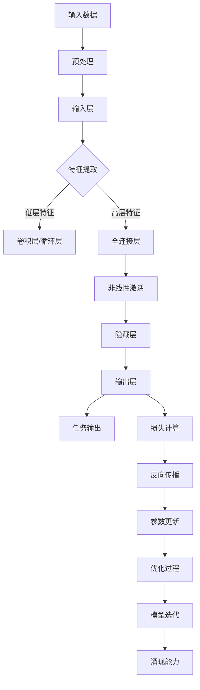
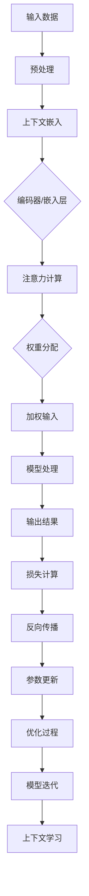

                 

### 文章标题

《涌现能力与上下文学习：大模型的核心优势》

> 关键词：大模型、涌现能力、上下文学习、人工智能、核心优势、技术解析、应用场景、数学模型

> 摘要：本文深入探讨了大模型的两个核心优势——涌现能力和上下文学习，详细分析了这两个概念在大模型中的具体作用及其产生机制。通过梳理大模型的基本原理，本文揭示了涌现能力和上下文学习如何显著提升大模型的表现和应用价值。同时，文章通过案例分析和代码解读，展示了这些技术的实际应用效果，为读者提供了理论与实践相结合的全面视角。本文旨在帮助读者理解大模型技术的核心优势，掌握相关技术原理，并为未来的人工智能研究和应用提供有益的启示。

## 第一部分: 概述

### 第1章: 引言

#### 1.1 书籍目的与结构

本章节旨在为读者搭建理解大模型核心优势——涌现能力和上下文学习的框架，为后续内容提供理论基础。文章将从以下几个方面展开：

1. **大模型背景介绍**：回顾大模型的发展历程和当前研究状况，介绍大模型的基本架构和原理。
2. **涌现能力与上下文学习概念解析**：详细阐述涌现能力和上下文学习的定义、产生机制及其在大模型中的重要性。
3. **全文结构概述**：简要介绍后续章节的内容安排，为读者提供一个整体的阅读路线图。

#### 1.2 大模型背景介绍

大模型（Large Models），如深度神经网络（DNN）、生成对抗网络（GAN）、Transformer等，是当前人工智能领域的重要研究方向。这些模型具有以下特点：

1. **参数规模巨大**：大模型的参数数量可达数百万、数千万甚至数十亿级别，这种庞大的参数规模使得模型能够捕捉到数据中的复杂模式。
2. **层次结构复杂**：大模型通常包含多个层次，每个层次负责不同的特征提取和表征任务，这种层次结构有助于模型理解数据的深层次信息。
3. **自适应性强**：大模型通过训练能够自适应地调整内部参数，以适应不同的任务和数据集。

大模型的发展离不开以下几个关键技术的支持：

1. **大规模数据集**：丰富的数据集是训练大模型的基础，只有在大规模数据集的支持下，大模型才能展现出强大的表征能力。
2. **高性能计算**：大模型的训练和推理需要大量的计算资源，高性能计算技术的发展为大模型的训练提供了强有力的保障。
3. **优化算法**：高效的优化算法能够加速大模型的训练过程，提高模型的收敛速度和性能。

大模型的发展历程可以追溯到上世纪80年代的神经网络研究，随后经历了深度学习、生成对抗网络等阶段，最终形成了今天我们所说的大模型。随着技术的不断进步，大模型的应用范围也越来越广泛，从自然语言处理、计算机视觉到语音识别、机器翻译等，大模型都在这些领域取得了显著的成果。

#### 1.3 涌现能力与上下文学习概念解析

**涌现能力**（Emergence Ability）指的是大模型在训练过程中，能够从大量数据中自动学习并生成具有复杂结构和功能的特征表示。涌现能力是区分大模型与小模型的重要特征之一，小模型通常只能捕捉到数据中的浅层特征，而大模型则能够发现更深层次的复杂模式。涌现能力的产生机制主要包括以下几个方面：

1. **层次化特征提取**：大模型通过多个层次的结构，逐层提取数据中的特征，从低级特征到高级特征，形成了具有层次化结构的特征表示。
2. **自适应调整**：大模型在训练过程中，通过自适应调整内部参数，不断优化特征表示，从而实现涌现能力的提升。
3. **数据驱动**：涌现能力依赖于大量数据的驱动，只有在大规模数据集的支持下，大模型才能有效地学习和生成复杂特征表示。

**上下文学习**（Contextual Learning）是指大模型在处理任务时，能够根据上下文信息进行自适应调整，从而提高任务的执行效果。上下文学习在大模型中的应用主要体现在以下几个方面：

1. **任务导向**：大模型在处理特定任务时，会根据任务的上下文信息调整内部参数，优化特征表示，以提高任务的执行效果。
2. **动态调整**：大模型能够根据输入数据的上下文变化，动态调整特征表示，从而实现任务的灵活应对。
3. **多模态融合**：大模型能够融合不同模态的上下文信息，从而生成更加丰富的特征表示，提高模型的泛化能力。

在本文中，我们将深入探讨涌现能力和上下文学习的具体实现方法、技术原理和应用场景，帮助读者全面了解这两个核心优势在大模型中的作用和意义。

### 第2章: 大模型基本原理

#### 2.1 大模型架构与原理

大模型的架构和原理是其涌现能力和上下文学习的基础。本节将详细介绍大模型的架构、核心原理及其工作流程。

**1. 大模型架构**

大模型通常采用层次化架构，包括输入层、隐藏层和输出层。每一层负责不同的任务和特征提取。

- **输入层**：接收外部输入，如文本、图像、声音等，并将其转换为模型可以处理的内部表示。
- **隐藏层**：包含多个层次，每个层次负责提取和表示数据的不同特征。层次越高，提取的特征越抽象和复杂。
- **输出层**：将隐藏层提取的特征映射到具体任务的结果，如分类标签、文本生成、目标检测等。

**2. 大模型工作原理**

大模型的工作原理基于神经网络（Neural Networks）和深度学习（Deep Learning）。神经网络由大量神经元（Neurons）组成，每个神经元都与其他神经元连接，并通过权重（Weights）和偏置（Bias）进行调节。

- **前向传播**（Forward Propagation）：输入数据经过神经网络中的每个层次，每个层次都通过激活函数（Activation Function）进行非线性变换，从而生成中间特征表示。
- **反向传播**（Backpropagation）：计算损失函数（Loss Function）相对于每个神经元的梯度，并通过权重调整和偏置更新来优化模型参数。

**3. 激活函数**

激活函数是神经网络中的一个关键组件，它引入了非线性因素，使得神经网络能够学习和模拟复杂的非线性关系。

- **Sigmoid函数**：输出值介于0和1之间，适合用于二分类问题。
- **ReLU函数**（Rectified Linear Unit）：在输入为负时输出为0，输入为正时输出等于输入，具有很好的加速收敛效果。
- **Tanh函数**：输出值介于-1和1之间，具有较好的非线性映射能力。

**4. 损失函数**

损失函数是评估模型预测结果与实际结果之间差异的指标，常用的损失函数包括：

- **均方误差**（Mean Squared Error, MSE）：用于回归问题，计算预测值与实际值之间的均方误差。
- **交叉熵损失**（Cross-Entropy Loss）：用于分类问题，计算实际输出分布与预测输出分布之间的交叉熵。

**5. 大模型训练过程**

大模型的训练过程主要包括以下几个步骤：

1. **数据预处理**：对输入数据集进行清洗、归一化和分批次处理，以便于模型训练。
2. **初始化参数**：随机初始化模型参数，如权重和偏置。
3. **前向传播**：输入数据经过模型处理，生成预测输出。
4. **计算损失**：计算预测输出与实际输出之间的损失。
5. **反向传播**：通过反向传播算法计算损失相对于每个参数的梯度。
6. **参数更新**：根据梯度更新模型参数，优化模型性能。
7. **迭代优化**：重复上述步骤，直至满足收敛条件或达到预设的训练次数。

**6. 大模型的优势**

大模型具有以下优势：

- **强大的表征能力**：通过层次化的特征提取，大模型能够捕捉到数据中的复杂模式。
- **自适应性强**：大模型能够通过训练自适应地调整内部参数，适应不同的任务和数据集。
- **泛化能力强**：大模型在训练过程中学会了如何处理不同类型的数据，具有良好的泛化能力。

通过上述对大模型架构与原理的详细介绍，我们可以看到，大模型的层次化结构、非线性激活函数、损失函数以及自适应训练过程共同作用，使得大模型能够高效地学习和处理复杂数据，实现涌现能力和上下文学习，从而提升模型的性能和应用价值。

#### 2.2 涌现能力产生的机制

涌现能力是大型神经网络模型的一个显著特性，它允许模型在训练过程中自动发现并学习复杂的特征表示。以下将详细探讨涌现能力产生的机制，以及其在模型训练过程中的作用。

**1. 神经网络的层次化结构**

涌现能力的产生主要依赖于神经网络的层次化结构。层次化结构意味着信息在神经网络中是逐层传递的，每层都对输入数据进行处理，并提取更高层次的特征。在这个过程中，低层特征往往是简单的，如边缘、颜色等，而高层特征则逐渐变得更加复杂，如对象、场景等。

- **第一层**：通常是简单的边缘检测或纹理识别，捕捉输入数据的局部特征。
- **第二层**：开始整合局部特征，识别更复杂的结构，如角点或简单的形状。
- **第三层及以上**：逐渐提取更高层次的特征，如物体的部分、整体场景的理解等。

**2. 特征学习的层次化过程**

在层次化特征学习过程中，每一层神经网络都通过权重矩阵和激活函数对输入数据进行变换，从而学习到不同层次的特征表示。这个过程可以分为以下几个阶段：

- **特征提取阶段**：在训练初期，神经网络主要关注于学习低层特征，如边缘、纹理等。
- **特征整合阶段**：随着训练的深入，神经网络开始整合低层特征，形成更复杂的中间表示。
- **高级特征学习阶段**：在训练的后期，神经网络能够学习到高层次的特征，这些特征能够捕捉到输入数据的深层语义信息。

**3. 自适应权重调整**

涌现能力的一个重要机制是神经网络的权重调整。在训练过程中，神经网络通过反向传播算法不断调整权重，以最小化损失函数。这种自适应的权重调整使得神经网络能够自动发现并学习到输入数据中的复杂模式。

- **正则化**：在训练过程中，神经网络会通过正则化方法（如L1、L2正则化）防止权重过拟合，保持模型的泛化能力。
- **动态调整**：神经网络会根据训练数据动态调整权重，使得模型能够适应不同的任务和数据集。

**4. 涌现能力的实现方法**

涌现能力的实现方法包括以下几个方面：

- **深度学习**：通过增加网络的深度，使得神经网络能够学习到更复杂的特征表示。
- **数据增强**：通过数据增强技术（如旋转、缩放、裁剪等）增加训练数据多样性，帮助神经网络学习到更多样化的特征。
- **迁移学习**：利用预训练的模型，通过迁移学习的方式，将已学习到的特征表示应用到新的任务上，提升模型的涌现能力。

**5. 涌现能力在模型中的应用**

涌现能力在模型训练和应用中发挥着关键作用：

- **自动特征提取**：神经网络能够自动从数据中提取具有区分性的特征，无需手动设计特征工程。
- **增强泛化能力**：通过学习到更加抽象和泛化的特征表示，模型能够更好地适应不同的任务和数据集。
- **提升模型性能**：涌现能力使得模型能够捕捉到数据中的复杂模式，从而在分类、生成、目标检测等任务中取得更好的性能。

**6. 涌现能力的限制和挑战**

尽管涌现能力具有显著的优点，但也存在一些限制和挑战：

- **计算资源需求**：深度学习模型需要大量的计算资源进行训练，尤其是大规模数据集和高维特征时。
- **过拟合风险**：神经网络容易在训练过程中过拟合，特别是在数据量有限的情况下。
- **解释性不足**：涌现能力使得模型学习到的特征表示复杂且难以解释，这在某些应用场景中可能成为瓶颈。

通过深入探讨涌现能力的产生机制，我们可以更好地理解大模型如何通过层次化结构、自适应权重调整和数据增强等方法，实现复杂特征的学习和提取。这些机制不仅提升了大模型的性能和应用价值，也为人工智能领域的研究提供了新的方向和启示。

#### 2.3 上下文学习在模型中的应用

上下文学习是指模型能够在特定上下文中对信息进行准确理解和处理，以提升任务执行的效果。在大模型中，上下文学习具有至关重要的地位，它使得模型能够灵活应对不同场景和任务。以下将详细探讨上下文学习的定义、机制及其在大模型中的应用。

**1. 上下文学习的定义**

上下文学习指的是模型通过利用上下文信息，对输入数据进行准确理解和处理的能力。上下文可以是文本、图像、声音等多种形式，它为模型提供了对任务更深入的理解。上下文学习的关键在于如何从各种上下文中提取有价值的信息，并利用这些信息优化模型的输出。

**2. 上下文学习的机制**

上下文学习的实现主要依赖于以下几个机制：

- **注意力机制**（Attention Mechanism）：注意力机制允许模型在处理输入时，将更多的关注点放在重要的信息上，从而提高处理的准确性和效率。例如，在自然语言处理任务中，注意力机制可以帮助模型更好地理解句子的不同部分及其关系。
- **上下文嵌入**（Contextual Embedding）：上下文嵌入是指将上下文信息转换为向量表示，使得模型能够直接处理和利用上下文信息。通过上下文嵌入，模型可以捕捉到上下文中的语义关系，从而提高任务的表现。
- **动态调整**（Dynamic Adjustment）：上下文学习的一个重要特性是其动态性，模型能够根据输入数据的变化，实时调整上下文信息的使用，从而实现任务的自适应处理。

**3. 上下文学习在大模型中的应用**

在大模型中，上下文学习被广泛应用于多种任务和场景，以下是几个典型的应用示例：

- **自然语言处理（NLP）**：在NLP任务中，上下文学习能够帮助模型理解句子中的词语关系和语义信息。例如，在机器翻译任务中，模型可以利用上下文信息，更准确地翻译特定词语在不同上下文中的含义。
- **图像识别**：在图像识别任务中，上下文学习可以帮助模型识别图像中的复杂结构和场景。例如，在目标检测任务中，模型可以通过分析图像中的上下文信息，更准确地定位和分类目标。
- **语音识别**：在语音识别任务中，上下文学习能够帮助模型理解说话者意图和语境。例如，在语音命令识别任务中，模型可以利用上下文信息，更准确地识别说话者的意图。
- **多模态学习**：在多模态学习任务中，上下文学习能够帮助模型整合不同模态的信息，提高任务的表现。例如，在视频分类任务中，模型可以通过分析图像和音频的上下文信息，更准确地分类视频内容。

**4. 上下文学习在模型训练中的应用**

在模型训练过程中，上下文学习能够显著提升模型的训练效果和表现。以下是上下文学习在模型训练中的应用方法：

- **训练数据增强**：通过引入上下文信息，可以生成更多的训练数据，提高模型的泛化能力。例如，在图像分类任务中，可以添加图像中的文字描述作为上下文信息，丰富训练数据。
- **动态调整学习率**：在训练过程中，通过利用上下文信息动态调整学习率，可以优化模型的收敛速度和性能。例如，在深度学习训练中，可以利用验证集的上下文信息，调整学习率以避免过拟合。
- **多任务学习**：在多任务学习任务中，上下文学习可以帮助模型更好地共享任务间的重要信息。例如，在同时进行图像分类和文本分类任务时，模型可以利用图像和文本的上下文信息，提高两个任务的性能。

**5. 上下文学习的优势**

上下文学习的优势主要体现在以下几个方面：

- **提高准确性**：通过利用上下文信息，模型能够更准确地理解输入数据，从而提高任务的准确性。
- **增强泛化能力**：上下文学习使得模型能够适应不同的上下文环境，提高模型的泛化能力。
- **提升效率**：上下文学习能够帮助模型更快速地处理和生成输出，提高任务执行效率。

通过深入探讨上下文学习在大模型中的应用，我们可以看到，上下文学习是提升大模型性能和灵活性的关键因素。通过注意力机制、上下文嵌入和动态调整等机制，大模型能够更好地理解和管理上下文信息，从而在多种任务和场景中取得更好的表现。

### 第3章: 大模型的优势与应用场景

#### 3.1 大模型的优势分析

大模型在人工智能领域具有显著的优势，这些优势使其在各种应用场景中脱颖而出。以下将详细分析大模型的主要优势。

**1. 强大的表征能力**

大模型的强大表征能力是其最为突出的优势之一。通过层次化的特征提取和复杂网络结构，大模型能够从海量数据中自动学习并提取高度抽象的特征表示。这种能力使得大模型在处理复杂任务时，能够捕捉到数据中的深层次模式和信息，从而实现更高的准确性和鲁棒性。

**2. 高效的自适应能力**

大模型在训练过程中，通过自适应调整内部参数，能够快速适应不同的任务和数据集。这种自适应能力使得大模型在面临新任务时，无需重新设计或大量重训练，只需进行少量的微调，即可实现良好的性能。这种高效的自适应能力大大降低了模型的开发和部署成本。

**3. 良好的泛化能力**

大模型的泛化能力是其另一个重要优势。通过在大量数据集上的训练，大模型能够学习到广泛适用的特征表示，从而在新数据集上表现良好。这种能力使得大模型在多种应用场景中具有广泛的使用价值，例如自然语言处理、计算机视觉、语音识别等。

**4. 多任务处理能力**

大模型能够同时处理多种任务，这是由于其层次化结构和高度抽象的特征表示能力。例如，在自然语言处理任务中，大模型可以同时进行文本分类、情感分析、问答系统等多种任务。这种多任务处理能力使得大模型在资源有限的情况下，能够实现更高的效率和性能。

**5. 灵活的上下文学习能力**

大模型的上下文学习能力是其应对不同上下文环境的优势。通过利用上下文信息，大模型能够更好地理解和处理输入数据，从而实现更准确和高效的输出。这种能力在自然语言处理、图像识别、语音识别等任务中具有重要意义，能够显著提升模型的表现。

**6. 丰富的应用场景**

大模型在多个领域和应用场景中展现了其强大的能力和广泛的应用价值。以下是一些典型应用场景：

- **自然语言处理（NLP）**：大模型在NLP任务中表现优异，例如文本分类、情感分析、机器翻译、问答系统等。
- **计算机视觉（CV）**：大模型在CV任务中发挥着关键作用，例如图像分类、目标检测、图像分割、人脸识别等。
- **语音识别（ASR）**：大模型能够实现高效准确的语音识别，适用于语音助手、语音翻译、语音控制等场景。
- **多模态学习**：大模型能够整合多种模态的信息，实现多模态学习，例如图像和文字的结合、图像和音频的结合等。

**7. 开放性的发展潜力**

大模型具有开放性的发展潜力，能够随着技术的进步和新算法的应用不断进化。这种开放性使得大模型能够持续提升其性能和应用范围，为人工智能领域的发展提供了源源不断的动力。

#### 3.2 大模型在不同领域中的应用

大模型在多个领域中都展现了其强大的应用潜力。以下将详细探讨大模型在自然语言处理、计算机视觉、语音识别等领域的应用，以及上下文学习在这些应用中的重要作用。

**1. 自然语言处理（NLP）**

在自然语言处理领域，大模型已经成为许多关键任务的核心技术。以下是一些典型应用：

- **文本分类**：大模型能够高效地进行文本分类任务，例如新闻分类、情感分类等。通过学习大量文本数据，大模型能够自动识别和分类不同类别的文本。
- **机器翻译**：大模型在机器翻译任务中表现出色，例如Google翻译和百度翻译等。大模型能够理解不同语言的语义和语法，实现高质量、通顺的翻译结果。
- **问答系统**：大模型能够构建智能问答系统，例如OpenAI的GPT系列模型。这些模型通过学习海量问答数据，能够回答各种类型的问题，提供准确的答案。
- **情感分析**：大模型能够进行情感分析任务，识别文本中的情感倾向，例如正面情感、负面情感等。这对于市场调研、舆情分析等领域具有重要意义。

**2. 计算机视觉（CV）**

在计算机视觉领域，大模型的应用同样广泛且成功。以下是一些典型应用：

- **图像分类**：大模型能够对图像进行分类，例如ImageNet挑战中的Top-5错误率已经降至很低的水平。大模型通过学习大量的图像数据，能够准确识别和分类不同类别的图像。
- **目标检测**：大模型能够实现高效准确的目标检测，例如Faster R-CNN、YOLO等模型。这些模型能够在图像中准确检测和定位多个目标。
- **图像分割**：大模型能够进行图像分割任务，将图像划分为不同的区域。例如，FCN等模型在语义分割任务中取得了显著成果。
- **人脸识别**：大模型能够实现人脸识别任务，准确识别和分类不同的人脸。例如，FaceNet等模型在人脸识别任务中取得了很高的准确率。

**3. 语音识别（ASR）**

在语音识别领域，大模型的应用也取得了显著的成果。以下是一些典型应用：

- **语音识别**：大模型能够实现高效准确的语音识别，例如谷歌语音助手和苹果Siri等。这些模型通过学习大量的语音数据，能够准确识别和理解用户的语音指令。
- **语音翻译**：大模型能够实现语音翻译任务，将一种语言的语音翻译成另一种语言。例如，谷歌语音翻译和微软语音翻译等。
- **语音生成**：大模型能够实现语音生成任务，根据文本生成相应的语音。例如，OpenAI的GPT-Neo模型可以生成语音合成结果。

**4. 上下文学习的作用**

在上述应用中，上下文学习发挥了重要作用。以下是一些具体应用实例：

- **文本分类**：在文本分类任务中，上下文学习能够帮助模型理解不同文本片段之间的语义关系，从而更准确地分类文本。
- **图像识别**：在图像识别任务中，上下文学习能够帮助模型理解图像中的局部特征和整体结构，从而更准确地识别图像内容。
- **语音识别**：在语音识别任务中，上下文学习能够帮助模型理解语音中的词语关系和语境，从而更准确地识别语音内容。

**5. 上下文学习在实际应用中的价值**

上下文学习在实际应用中具有显著的价值，以下是一些具体案例：

- **客服机器人**：在客服机器人应用中，上下文学习能够帮助模型理解用户的问题和意图，从而提供更准确和高效的回答。
- **智能助手**：在智能助手应用中，上下文学习能够帮助模型理解用户的语音指令和上下文信息，从而实现更智能和自然的交互。
- **自动驾驶**：在自动驾驶应用中，上下文学习能够帮助模型理解道路场景和周围环境，从而实现更安全、高效的自动驾驶。

通过深入探讨大模型在不同领域中的应用，我们可以看到大模型的强大能力和广泛的应用前景。同时，上下文学习作为大模型的核心优势，在实际应用中发挥了关键作用，为各种任务和场景提供了更加准确和高效的解决方案。

### 第4章: 涌现能力技术原理

#### 4.1 涌现能力的基本概念

涌现能力是大型神经网络模型中的一种关键特性，它指的是模型在训练过程中能够从大量数据中自动学习并生成具有复杂结构和功能的特征表示。这种能力使得大模型能够超越简单的输入输出关系，发现数据中的深层次模式和规律。

**1. 定义**

涌现能力（Emergence Ability）是指神经网络在训练过程中，通过层次化的特征提取和复杂的非线性变换，自动生成具有层次化和抽象化特征表示的能力。这种特征表示能够捕捉到数据中的复杂模式和关联性，从而提升模型在各类任务中的表现。

**2. 重要性**

涌现能力在人工智能领域具有重要意义，它使得大模型能够：

- **自动特征提取**：无需手动设计特征，模型能够自动从数据中学习到有用的特征表示。
- **增强泛化能力**：通过学习到更抽象和泛化的特征表示，模型能够更好地适应不同的任务和数据集。
- **提升模型性能**：涌现能力使得模型能够捕捉到数据中的深层次模式，从而在各类任务中取得更好的表现。

**3. 涌现能力的实现机制**

涌现能力的实现主要依赖于以下几个方面：

- **层次化特征提取**：大模型通过多个层次的结构，逐层提取数据中的特征，从低级特征到高级特征，形成具有层次化结构的特征表示。
- **非线性变换**：通过激活函数和复杂的网络结构，大模型能够实现非线性变换，从而学习到更高层次和抽象化的特征表示。
- **自适应权重调整**：在训练过程中，大模型通过自适应调整内部参数（如权重和偏置），不断优化特征表示，从而实现涌现能力的提升。

#### 4.2 涌现能力的实现方法

**1. 深度学习模型**

深度学习模型是实现涌现能力的关键技术。以下是一些常用的深度学习模型：

- **卷积神经网络（CNN）**：CNN通过卷积层和池化层，能够提取图像中的局部特征，并逐渐形成更高层次的全局特征。
- **循环神经网络（RNN）**：RNN通过循环结构，能够处理序列数据，并捕捉到序列中的时间依赖关系。
- **Transformer模型**：Transformer模型通过自注意力机制，能够全局捕捉数据中的依赖关系，从而实现高效的序列处理。

**2. 特征提取与层次化结构**

涌现能力的实现依赖于特征提取和层次化结构。以下是一些关键步骤：

- **输入层**：接收外部输入数据，如文本、图像、声音等，并将其转换为模型可以处理的内部表示。
- **隐藏层**：通过多层网络结构，逐层提取数据中的特征。低层特征通常是简单的，如边缘、纹理等，而高层特征则逐渐变得更加复杂，如物体、场景等。
- **输出层**：将隐藏层提取的特征映射到具体任务的结果，如分类标签、文本生成、目标检测等。

**3. 非线性激活函数**

非线性激活函数是实现涌现能力的关键组件。以下是一些常用的激活函数：

- **Sigmoid函数**：输出值介于0和1之间，适用于二分类问题。
- **ReLU函数**（Rectified Linear Unit）：在输入为负时输出为0，输入为正时输出等于输入，具有很好的加速收敛效果。
- **Tanh函数**：输出值介于-1和1之间，适用于非线性映射。

**4. 自适应权重调整**

涌现能力的一个重要机制是自适应权重调整。以下是一些常用的优化算法：

- **随机梯度下降（SGD）**：通过随机选择样本和计算梯度，优化模型参数。
- **Adam优化器**：结合了SGD和Momentum的优点，能够在复杂环境中实现更高效的收敛。
- **Adagrad优化器**：通过自适应调整学习率，能够适应不同梯度的变化。

通过以上方法，大模型能够实现涌现能力，从海量数据中自动学习并生成具有复杂结构和功能的特征表示。这些特征表示不仅提升了模型的性能，也为各种任务提供了强大的支撑。

#### 4.3 涌现能力的 Mermaid 流程图

为了更直观地展示涌现能力的实现过程，我们可以使用Mermaid流程图来描述其各个关键步骤。以下是一个典型的涌现能力实现流程图：



**图解：**

- **A 输入数据**：表示模型的输入，可以是图像、文本或声音等。
- **B 预处理**：对输入数据进行预处理，如归一化、缩放等。
- **C 输入层**：将预处理后的输入数据转换为模型可以处理的内部表示。
- **D 特征提取**：通过卷积层或循环层，逐层提取数据中的特征。
- **E 低层特征**：提取低层次的特征，如边缘、纹理等。
- **F 高层特征**：提取高层次的特征，如物体、场景等。
- **G 非线性激活**：使用激活函数实现非线性变换，增强模型的表征能力。
- **H 隐藏层**：通过多层网络结构，将提取的特征映射到更高层次。
- **I 输出层**：将隐藏层提取的特征映射到具体任务的结果，如分类标签、文本生成等。
- **J 任务输出**：表示模型的输出结果，用于评估模型的性能。
- **K 损失计算**：计算模型输出与实际结果之间的损失，用于评估模型的性能。
- **L 反向传播**：通过反向传播算法，计算损失相对于每个参数的梯度。
- **M 参数更新**：根据计算得到的梯度，更新模型参数，优化模型性能。
- **N 优化过程**：通过优化算法，如SGD、Adam等，实现模型的优化过程。
- **O 模型迭代**：重复模型迭代过程，直至满足收敛条件。
- **P 涌现能力**：表示最终生成的具有复杂结构和功能的特征表示，实现涌现能力。

通过以上流程图，我们可以清晰地看到涌现能力的实现过程，从数据输入到特征提取、非线性变换、隐藏层映射和输出层生成，每一个步骤都在为涌现能力的实现奠定基础。这一流程图不仅帮助我们理解了涌现能力的实现原理，也为实际应用提供了重要的参考。

### 第5章: 上下文学习技术详解

#### 5.1 上下文学习的基本原理

上下文学习是指模型能够根据输入数据的上下文信息进行自适应调整，从而提高任务执行效果的能力。在大模型中，上下文学习是提升模型灵活性和准确性的关键因素。以下将详细探讨上下文学习的基本原理。

**1. 上下文学习的定义**

上下文学习（Contextual Learning）是指模型在处理任务时，能够根据输入数据的上下文信息进行调整和优化，以提升任务执行的效果。上下文可以是文本、图像、声音等多种形式，它们为模型提供了对任务更深入的理解。

**2. 上下文学习的机制**

上下文学习的实现主要依赖于以下机制：

- **注意力机制**（Attention Mechanism）：注意力机制允许模型在处理输入时，将更多的关注点放在重要的信息上，从而提高处理的准确性和效率。注意力机制在自然语言处理、图像识别等领域得到了广泛应用。
- **上下文嵌入**（Contextual Embedding）：上下文嵌入是指将上下文信息转换为向量表示，使得模型能够直接处理和利用上下文信息。通过上下文嵌入，模型可以捕捉到上下文中的语义关系，从而提高任务的表现。
- **动态调整**（Dynamic Adjustment）：上下文学习的一个重要特性是其动态性，模型能够根据输入数据的变化，实时调整上下文信息的使用，从而实现任务的自适应处理。

**3. 上下文学习的核心组件**

上下文学习的核心组件包括：

- **上下文向量**：上下文向量是表示上下文信息的向量，它通过编码器（Encoder）或嵌入层（Embedding Layer）生成。上下文向量能够捕捉到输入数据的上下文信息，为模型提供参考。
- **注意力机制**：注意力机制通过计算输入数据的注意力权重，决定哪些信息对当前任务更重要。这些权重通常通过点积、缩放点积等方法计算得到。
- **输出调整**：模型通过结合注意力权重和上下文向量，调整输出结果，使其更符合上下文环境的要求。

**4. 上下文学习在任务中的应用**

上下文学习在各类任务中都有广泛应用，以下是一些典型应用示例：

- **自然语言处理（NLP）**：在NLP任务中，上下文学习可以帮助模型理解句子中的词语关系和语义信息。例如，在机器翻译任务中，模型可以利用上下文信息，更准确地翻译特定词语在不同上下文中的含义。
- **图像识别**：在图像识别任务中，上下文学习可以帮助模型识别图像中的复杂结构和场景。例如，在目标检测任务中，模型可以通过分析图像中的上下文信息，更准确地定位和分类目标。
- **语音识别**：在语音识别任务中，上下文学习能够帮助模型理解说话者意图和语境。例如，在语音命令识别任务中，模型可以利用上下文信息，更准确地识别说话者的意图。
- **多模态学习**：在多模态学习任务中，上下文学习能够帮助模型整合不同模态的信息，提高任务的表现。例如，在视频分类任务中，模型可以通过分析图像和音频的上下文信息，更准确地分类视频内容。

通过深入探讨上下文学习的基本原理，我们可以看到，上下文学习是提升大模型性能和灵活性的关键因素。通过注意力机制、上下文嵌入和动态调整等机制，大模型能够更好地理解和管理上下文信息，从而在多种任务和场景中取得更好的表现。

#### 5.2 上下文学习的实现方法

上下文学习是提升大模型性能的重要技术之一，其实现方法多样且应用广泛。以下将详细探讨几种常见的上下文学习实现方法，包括注意力机制、上下文嵌入和动态调整，并介绍这些方法在模型中的应用。

**1. 注意力机制**

注意力机制（Attention Mechanism）是一种通过分配不同权重来关注不同重要性的信息的方法。它在大模型中的应用非常广泛，尤其是在自然语言处理（NLP）和计算机视觉（CV）任务中。以下为注意力机制的基本原理和应用：

- **基本原理**：注意力机制通过计算一个权重向量，这个权重向量表示每个输入数据点对于任务的重要程度。权重通常通过点积、缩放点积等方法计算得到。然后，将这些权重与输入数据相乘，得到加权输入，用于后续的模型处理。
  
  例如，在Transformer模型中，注意力机制通过自注意力（Self-Attention）和交叉注意力（Cross-Attention）实现。自注意力允许模型在处理序列数据时，对序列中的每个元素进行自我关注，从而捕捉到元素之间的依赖关系。交叉注意力则允许模型在处理输入序列和查询序列时，同时关注两个序列的元素，从而实现更准确的信息整合。

- **应用示例**：在自然语言处理任务中，注意力机制可以帮助模型理解句子中的不同部分及其关系。例如，在机器翻译任务中，模型可以利用注意力机制，更好地捕捉源语言句子中的关键信息，从而生成更准确的翻译结果。

**2. 上下文嵌入**

上下文嵌入（Contextual Embedding）是将上下文信息转换为向量表示的过程，使得模型可以直接处理和利用上下文信息。上下文嵌入在NLP和CV任务中都有广泛应用。以下为上下文嵌入的基本原理和应用：

- **基本原理**：上下文嵌入通常通过编码器（Encoder）或嵌入层（Embedding Layer）实现。编码器可以将输入数据转换为上下文向量，而嵌入层则是将输入数据的每个元素映射到一个固定大小的向量空间中。这些向量不仅包含了原始数据的信息，还编码了上下文信息。

  例如，在NLP任务中，嵌入层可以将词汇表中的每个单词映射到一个高维向量空间，这些向量不仅包含了单词的语义信息，还编码了单词在不同上下文中的含义。通过这些上下文向量，模型可以更好地理解输入文本。

- **应用示例**：在文本分类任务中，上下文嵌入可以帮助模型理解不同词汇在不同上下文中的含义，从而更准确地分类文本。例如，单词“bank”在“银行”和“河岸”两种上下文中的含义是不同的，嵌入层可以捕捉到这种差异，从而提高文本分类的准确性。

**3. 动态调整**

动态调整（Dynamic Adjustment）是指模型根据输入数据的变化，实时调整上下文信息的使用，从而实现任务的自适应处理。动态调整是实现上下文学习的关键机制之一。以下为动态调整的基本原理和应用：

- **基本原理**：动态调整通常通过计算注意力权重来实现。这些权重表示模型在处理当前任务时，对输入数据的关注程度。通过动态调整这些权重，模型可以更好地适应不同的上下文环境。

  例如，在语音识别任务中，模型可以利用动态调整机制，根据语音信号的时序变化，实时调整对语音信号的注意力权重，从而更好地捕捉语音信号的上下文信息。

- **应用示例**：在多模态学习任务中，动态调整可以帮助模型整合不同模态的信息。例如，在图像和文字的结合任务中，模型可以利用动态调整机制，根据图像和文字的时序变化，实时调整对图像和文字的注意力权重，从而生成更准确的多模态特征表示。

通过上述讨论，我们可以看到，上下文学习的实现方法多样，包括注意力机制、上下文嵌入和动态调整等。这些方法在大模型中都有广泛应用，通过它们，模型能够更好地理解和处理输入数据的上下文信息，从而实现更准确的预测和决策。在实际应用中，可以根据任务需求和数据特点，选择合适的上下文学习实现方法，以提高模型的性能和应用效果。

#### 5.3 上下文学习的 Mermaid 流程图

为了更直观地展示上下文学习的实现过程，我们可以使用Mermaid流程图来描述其各个关键步骤。以下是一个典型的上下文学习实现流程图：



**图解：**

- **A 输入数据**：表示模型的输入，可以是文本、图像或声音等。
- **B 预处理**：对输入数据进行预处理，如归一化、缩放等。
- **C 上下文嵌入**：将预处理后的数据转换为上下文向量表示。
- **D 编码器/嵌入层**：通过编码器或嵌入层，生成上下文向量。
- **E 注意力计算**：计算每个输入数据点的注意力权重。
- **F 权重分配**：根据注意力权重，对输入数据分配不同的关注程度。
- **G 加权输入**：对输入数据进行加权处理，提高重要信息的关注度。
- **H 模型处理**：利用加权输入，通过模型进行处理。
- **I 输出结果**：得到模型的输出结果，用于任务执行。
- **J 损失计算**：计算输出结果与实际结果之间的损失。
- **K 反向传播**：通过反向传播算法，计算损失相对于每个参数的梯度。
- **L 参数更新**：根据计算得到的梯度，更新模型参数。
- **M 优化过程**：通过优化算法，如SGD、Adam等，实现模型的优化过程。
- **N 模型迭代**：重复模型迭代过程，直至满足收敛条件。
- **O 上下文学习**：表示最终实现的上下文学习效果，提高模型的性能和应用效果。

通过以上流程图，我们可以清晰地看到上下文学习的实现过程，从数据输入、上下文嵌入、注意力计算、加权输入到模型处理、损失计算、反向传播和参数更新等步骤，每一个步骤都在为上下文学习的实现奠定基础。这一流程图不仅帮助我们理解了上下文学习的实现原理，也为实际应用提供了重要的参考。

### 第6章: 大模型训练与优化

#### 6.1 大模型训练的基本流程

大模型的训练是一个复杂且计算密集的过程，涉及到数据预处理、模型初始化、前向传播、损失计算、反向传播和参数更新等步骤。以下将详细介绍大模型训练的基本流程，帮助读者理解大模型如何通过这些步骤逐步优化和提升性能。

**1. 数据预处理**

数据预处理是训练大模型的第一步，其目的是将原始数据转换为适合模型输入的形式。数据预处理包括以下几个关键步骤：

- **数据清洗**：去除数据中的噪声和异常值，确保数据质量。
- **归一化**：将数据缩放到一个统一的范围，如[0, 1]或[-1, 1]，以便模型训练过程中的梯度计算。
- **标准化**：计算数据的标准差和均值，将数据标准化为均值为0、标准差为1的形式，以消除不同特征之间的量级差异。
- **分批次处理**：将数据划分为多个批次（Batch），以减少内存占用和计算资源的需求。每个批次包含一定数量的样本，通常在数百到数千之间。

**2. 模型初始化**

模型初始化是指随机分配模型参数的初始值。合理的初始化方法可以加快模型收敛速度，避免梯度消失或爆炸等问题。常见的初始化方法包括：

- **随机初始化**：随机分配参数的初始值，使得模型能够从不同的起点开始训练。
- **高斯初始化**：将参数初始化为服从高斯分布的随机值，通常用于全连接层和卷积层。
- **零初始化**：将参数初始化为0，通常不推荐使用，因为可能导致梯度消失。

**3. 前向传播**

前向传播（Forward Propagation）是指将输入数据通过模型网络，逐层计算得到输出结果的过程。在前向传播过程中，每个神经元都会接收前一层神经元的输出，通过加权求和和激活函数计算得到当前神经元的输出。具体步骤如下：

- **输入层**：接收预处理后的输入数据。
- **隐藏层**：通过权重矩阵和偏置项，将输入数据映射到隐藏层，并使用激活函数进行非线性变换。
- **输出层**：将隐藏层的输出映射到输出层，生成模型的预测结果。

**4. 损失计算**

损失计算（Loss Computation）是指计算模型预测结果与实际结果之间的差异，以评估模型的性能。常用的损失函数包括：

- **均方误差（MSE）**：用于回归任务，计算预测值与实际值之间的均方误差。
- **交叉熵损失（Cross-Entropy Loss）**：用于分类任务，计算实际输出分布与预测输出分布之间的交叉熵。

**5. 反向传播**

反向传播（Backpropagation）是指通过计算损失函数的梯度，逆向更新模型参数的过程。反向传播算法的核心思想是利用链式法则，逐层计算每个参数的梯度。具体步骤如下：

- **前向计算**：计算输出层到隐藏层的梯度。
- **隐藏层梯度**：利用链式法则，从输出层梯度逆向计算隐藏层的梯度。
- **权重和偏置更新**：利用计算得到的梯度，通过梯度下降或其他优化算法更新模型参数。

**6. 参数更新**

参数更新（Parameter Update）是指根据计算得到的梯度，更新模型参数的过程。更新参数的目的是减小损失函数，提高模型性能。常用的更新方法包括：

- **随机梯度下降（SGD）**：每次更新使用一个样本的梯度，适用于小批量训练。
- **批量梯度下降（Batch Gradient Descent）**：每次更新使用全部样本的梯度，计算量大但收敛速度快。
- **Adam优化器**：结合了SGD和Momentum的优点，适用于大规模数据集。

**7. 模型迭代**

模型迭代（Model Iteration）是指重复训练过程，直至满足收敛条件的过程。每次迭代都包括数据预处理、模型初始化、前向传播、损失计算、反向传播和参数更新等步骤。通过多次迭代，模型逐渐优化参数，提高性能。

**8. 收敛条件**

收敛条件是指模型训练停止的条件，常见的收敛条件包括：

- **训练误差小于阈值**：当训练误差小于预设的阈值时，模型可以停止训练。
- **验证误差不再下降**：当验证误差在一定时间内不再下降时，模型可以停止训练，以防止过拟合。
- **迭代次数达到预设值**：当迭代次数达到预设的次数时，模型可以停止训练。

通过以上步骤，大模型能够逐步优化参数，提高性能，从而在各类任务中取得更好的表现。

#### 6.2 大模型优化策略

在大模型的训练过程中，优化策略起到了至关重要的作用，它不仅影响训练的收敛速度，还直接关系到模型的最终性能。以下将详细讨论几种常见的大模型优化策略，包括常见优化算法、正则化技术和超参数调整。

**1. 常见优化算法**

优化算法是用于更新模型参数的核心方法，其选择和调整对训练过程有显著影响。以下是一些常见的优化算法：

- **随机梯度下降（SGD）**：SGD是最基础的优化算法之一，每次迭代使用一个样本的梯度进行参数更新。其优点是简单易实现，但收敛速度较慢，且可能收敛到局部最小值。
- **批量梯度下降（BGD）**：BGD每次迭代使用整个训练集的梯度进行更新。这种方法收敛速度较快，但计算量巨大，不适用于大规模数据集。
- **Adam优化器**：Adam是结合了SGD和Momentum优点的自适应优化算法。它通过跟踪梯度的一阶矩估计和二阶矩估计，自适应调整学习率，适用于大规模数据集。
- **AdaGrad优化器**：AdaGrad是另一种自适应学习率优化算法，它为每个参数计算一个自适应的学习率，能够适应不同梯度的变化。

**2. 正则化技术**

正则化技术是防止模型过拟合的重要手段，以下是一些常见的正则化方法：

- **L1正则化**：L1正则化通过在损失函数中添加L1范数项（即绝对值和），可以促进模型参数稀疏化，减少冗余参数。
- **L2正则化**：L2正则化通过在损失函数中添加L2范数项（即平方和），可以平滑模型参数，减少过拟合。
- **Dropout**：Dropout是一种在训练过程中随机丢弃部分神经元的方法，可以有效减少过拟合，提高模型的泛化能力。
- **Dropconnect**：Dropconnect是一种类似于Dropout的全连接层正则化方法，通过随机丢弃部分连接，以减少模型参数的依赖性。

**3. 超参数调整**

超参数是影响模型性能的关键参数，通常需要通过实验调整。以下是一些重要的超参数及其调整策略：

- **学习率**：学习率是优化算法的核心参数，决定了参数更新的步长。合适的学习率可以提高训练速度，但过大会导致模型发散，过小则收敛速度慢。
- **批次大小**：批次大小是每个迭代过程中使用的样本数量。较大的批次大小可以提高模型的稳定性和准确性，但需要更多的计算资源。
- **迭代次数**：迭代次数是指模型在训练过程中重复更新的次数。适当的迭代次数可以保证模型充分学习数据，但过多的迭代可能导致过拟合。
- **正则化强度**：正则化强度是控制正则化项在损失函数中的权重。合适的正则化强度可以平衡模型的表达能力和泛化能力。

**4. 优化策略实例**

以下是一个优化策略的实例，用于调整学习率和批次大小：

- **学习率调整**：采用学习率衰减策略，初始学习率为0.01，每隔10个迭代周期衰减10倍。这种方法可以平衡模型在训练初期和后期的收敛速度。
- **批次大小调整**：在训练过程中，逐步减小批次大小，从初始的256个样本逐渐减少到64个样本。这种方法可以提高模型的泛化能力，减少过拟合。

通过以上优化策略，大模型可以更有效地训练，提高模型的性能和应用价值。在实际应用中，可以根据具体任务和数据集的特点，灵活调整优化策略，以达到最佳的训练效果。

#### 6.3 大模型训练的伪代码

为了更清晰地展示大模型训练的过程，我们可以使用伪代码来描述其各个步骤。以下是一个简化的伪代码示例，用于说明大模型训练的基本流程：

```python
# 初始化模型参数
初始化 W, b

# 设置超参数
学习率 alpha
批次大小 batch_size
迭代次数 epochs

# 数据预处理
数据集 X, Y = 预处理(X原始数据, Y标签数据)

# 训练过程
for epoch in 1 to epochs:
    # 分批次处理数据
    for batch in X:
        # 前向传播
        z = 神经元激活(批量输入 * W + b)
        
        # 计算损失
       损失 = 损失函数(预测输出 z, 真实输出 Y)
        
        # 反向传播
        delta = 损失相对于 z 的梯度
        
        # 参数更新
        W -= alpha * (批量输入 * delta)
        b -= alpha * delta
        
    # 调整学习率（可选）
    alpha = alpha / (1 + epoch * 衰减率)
    
# 模型评估
预测结果 = 模型输出(X测试数据, W, b)
准确率 = 计算准确率(预测结果, Y测试标签数据)

# 输出模型准确率
print("模型准确率：", 准确率)
```

**伪代码说明：**

- **初始化模型参数**：随机初始化权重矩阵W和偏置向量b。
- **设置超参数**：包括学习率alpha、批次大小batch_size和迭代次数epochs。
- **数据预处理**：对原始数据集X和标签数据Y进行预处理，如归一化和标准化。
- **训练过程**：遍历每个epoch，对每个批次的数据进行前向传播、损失计算、反向传播和参数更新。
- **学习率调整**：在训练过程中，根据epoch的数量动态调整学习率，以避免梯度消失或爆炸。
- **模型评估**：在训练完成后，使用测试数据集评估模型的准确率。

通过上述伪代码，我们可以清晰地看到大模型训练的基本流程，从初始化、数据处理到训练过程和模型评估，每个步骤都在为最终的模型性能提升做出贡献。这个伪代码为实际模型训练提供了重要的参考，可以帮助开发人员更好地理解和实现大模型的训练过程。

### 第7章: 数学模型与公式讲解

#### 7.1 涌现能力的数学模型

涌现能力是大型神经网络模型的一个重要特性，其实现依赖于复杂的数学模型。以下将详细讨论涌现能力的数学模型，包括关键公式和计算方法。

**1. 神经网络模型**

神经网络（Neural Network）是涌现能力实现的基础，其核心是一个多层感知器（MLP）。MLP由输入层、隐藏层和输出层组成，每层包含多个神经元。神经元之间的连接通过权重（weights）和偏置（bias）进行调节。

**2. 前向传播**

前向传播是指将输入数据通过多层神经网络，逐层计算得到输出结果的过程。其数学表示如下：

$$
z_i = \sum_j w_{ij}x_j + b_i
$$

其中，$z_i$表示第$i$个神经元的输入，$x_j$表示第$j$个神经元的输出，$w_{ij}$表示连接权重，$b_i$表示偏置。

**3. 激活函数**

激活函数（Activation Function）是神经网络中的一个关键组件，它引入了非线性因素，使得神经网络能够学习和模拟复杂的非线性关系。常见的激活函数包括：

- **Sigmoid函数**：

$$
a_i = \frac{1}{1 + e^{-z_i}}
$$

- **ReLU函数**：

$$
a_i = \max(0, z_i)
$$

- **Tanh函数**：

$$
a_i = \tanh(z_i)
$$

**4. 损失函数**

损失函数（Loss Function）用于评估模型预测结果与实际结果之间的差异，其选择对模型的性能有重要影响。常见的损失函数包括：

- **均方误差（MSE）**：

$$
L = \frac{1}{2} \sum_{i}(y_i - \hat{y}_i)^2
$$

其中，$y_i$表示实际输出，$\hat{y}_i$表示预测输出。

- **交叉熵损失（Cross-Entropy Loss）**：

$$
L = -\sum_{i} y_i \log(\hat{y}_i)
$$

**5. 反向传播**

反向传播（Backpropagation）是指通过计算损失函数的梯度，逆向更新模型参数的过程。其核心思想是利用链式法则，逐层计算每个参数的梯度。

$$
\frac{\partial L}{\partial w_{ij}} = \frac{\partial L}{\partial z_i} \frac{\partial z_i}{\partial w_{ij}}
$$

**6. 参数更新**

参数更新（Parameter Update）是指根据计算得到的梯度，更新模型参数的过程。常用的更新方法包括：

- **随机梯度下降（SGD）**：

$$
w_{ij} = w_{ij} - \alpha \frac{\partial L}{\partial w_{ij}}
$$

其中，$\alpha$表示学习率。

- **批量梯度下降（BGD）**：

$$
w_{ij} = w_{ij} - \frac{1}{m} \sum_{i} \frac{\partial L}{\partial w_{ij}}
$$

其中，$m$表示样本数量。

- **Adam优化器**：

$$
v_t = \beta_1 u_t + (1 - \beta_1) (\nabla J(x_t, y_t) - u_{t-1})
$$

$$
s_t = \beta_2 v_t
$$

$$
\widehat{v}_t = \frac{v_t}{1 - \beta_2^t}
$$

$$
\widehat{s}_t = \frac{s_t}{1 - \beta_2^t}
$$

$$
\theta_t = \theta_t - \alpha \frac{\widehat{v}_t}{\sqrt{\widehat{s}_t} + \epsilon}
$$

其中，$\beta_1, \beta_2, \alpha, u_t, v_t, s_t$分别为Adam优化器的超参数。

通过以上数学模型和公式，我们可以深入理解涌现能力的实现机制。这些模型和公式不仅描述了神经网络的工作原理，还提供了优化模型性能的方法和工具。在实际应用中，通过合理选择和调整这些公式，可以有效地提升模型的性能和应用效果。

#### 7.2 上下文学习的数学模型

上下文学习是大型神经网络模型中的一个重要特性，它通过利用上下文信息提升模型的性能。以下将详细探讨上下文学习的数学模型，包括关键公式和计算方法。

**1. 注意力机制**

注意力机制（Attention Mechanism）是上下文学习的关键组件，它通过计算注意力权重，动态调整模型对输入数据的关注程度。以下为注意力机制的数学模型：

- **自注意力（Self-Attention）**：

$$
\text{Attention}(Q, K, V) = \text{softmax}\left(\frac{QK^T}{\sqrt{d_k}}\right)V
$$

其中，$Q, K, V$分别为查询向量、键向量和值向量，$d_k$为键向量的维度。

- **交叉注意力（Cross-Attention）**：

$$
\text{Attention}(Q, K, V) = \text{softmax}\left(\frac{QK^T}{\sqrt{d_k}}\right)V
$$

其中，$Q$为查询向量，$K$为键向量，$V$为值向量。

**2. 上下文向量**

上下文向量（Contextual Vector）是上下文学习的核心，它通过编码器（Encoder）或嵌入层（Embedding Layer）生成。以下为上下文向量的数学模型：

- **编码器生成的上下文向量**：

$$
C = \text{Encoder}(X)
$$

其中，$C$为上下文向量，$X$为输入数据。

- **嵌入层生成的上下文向量**：

$$
C = \text{Embedding}(X)
$$

其中，$C$为上下文向量，$X$为输入数据。

**3. 注意力权重**

注意力权重（Attention Weight）是衡量输入数据点对当前任务重要程度的指标，它通过注意力机制计算得到。以下为注意力权重的数学模型：

- **自注意力权重**：

$$
\text{Attention Weight}_{ij} = \text{softmax}\left(\frac{Q_iK_j^T}{\sqrt{d_k}}\right)
$$

其中，$Q_i, K_j$分别为查询向量和键向量，$d_k$为键向量的维度。

- **交叉注意力权重**：

$$
\text{Attention Weight}_{ij} = \text{softmax}\left(\frac{Q_iK_j^T}{\sqrt{d_k}}\right)
$$

其中，$Q_i, K_j$分别为查询向量和键向量，$d_k$为键向量的维度。

**4. 加权输入**

加权输入（Weighted Input）是通过注意力权重对输入数据进行加权处理的结果，它为模型提供了对输入数据的动态关注。以下为加权输入的数学模型：

- **自加权输入**：

$$
\text{Weighted Input}_i = \sum_j \text{Attention Weight}_{ij} X_j
$$

其中，$X_j$为输入数据。

- **交叉加权输入**：

$$
\text{Weighted Input}_i = \sum_j \text{Attention Weight}_{ij} X_j
$$

其中，$X_j$为输入数据。

**5. 输出结果**

输出结果（Output Result）是通过注意力机制和加权输入计算得到的，它反映了模型对输入数据的理解和处理结果。以下为输出结果的数学模型：

- **自输出结果**：

$$
Y = \text{Attention}(Q, K, V)
$$

其中，$Y$为输出结果。

- **交叉输出结果**：

$$
Y = \text{Attention}(Q, K, V)
$$

其中，$Y$为输出结果。

通过以上数学模型和公式，我们可以深入理解上下文学习的实现机制。这些模型和公式不仅描述了上下文学习的原理，还为实际应用提供了具体的计算方法和工具。在实际应用中，通过合理选择和调整这些公式，可以有效地提升模型的性能和应用效果。

#### 7.3 数学模型举例说明

为了更好地理解涌现能力和上下文学习的数学模型，以下通过一个具体的例子来详细解释这些模型的计算过程和应用。

**1. 涌现能力的数学模型举例**

假设我们有一个简单的多层感知器（MLP）模型，用于实现一个二分类任务。输入数据为二维向量，隐藏层包含两个神经元，输出层为单个神经元。我们使用ReLU作为激活函数，均方误差（MSE）作为损失函数。

- **输入数据**：$X = \begin{bmatrix} x_1 \\ x_2 \end{bmatrix}$
- **隐藏层**：$z_1, z_2$，$W_h = \begin{bmatrix} w_{11} & w_{12} \\ w_{21} & w_{22} \end{bmatrix}$，$b_h = \begin{bmatrix} b_1 \\ b_2 \end{bmatrix}$
- **输出层**：$z, W_o = \begin{bmatrix} w_{o1} \\ w_{o2} \end{bmatrix}$，$b_o = b$

**前向传播：**

$$
z_1 = \max(0, x_1w_{11} + x_2w_{12} + b_1) \\
z_2 = \max(0, x_1w_{21} + x_2w_{22} + b_2) \\
z = \max(0, z_1w_{o1} + z_2w_{o2} + b_o)
$$

**反向传播：**

计算损失：

$$
L = \frac{1}{2} \left( y - z \right)^2
$$

其中，$y$为实际输出（0或1）。

计算梯度：

$$
\frac{\partial L}{\partial z} = y - z \\
\frac{\partial z}{\partial z_1} = 1_{z_1 > 0} \\
\frac{\partial z_1}{\partial x_1} = w_{11} \cdot 1_{z_1 > 0} \\
\frac{\partial z_1}{\partial x_2} = w_{12} \cdot 1_{z_1 > 0} \\
\frac{\partial z}{\partial z_2} = w_{o1} \cdot 1_{z_2 > 0} \\
\frac{\partial z_2}{\partial x_1} = w_{21} \cdot 1_{z_2 > 0} \\
\frac{\partial z_2}{\partial x_2} = w_{22} \cdot 1_{z_2 > 0}
$$

更新权重和偏置：

$$
W_h := W_h - \alpha \left( \frac{\partial L}{\partial z} \cdot \frac{\partial z}{\partial z_1} \cdot \frac{\partial z_1}{\partial x_1}, \frac{\partial L}{\partial z} \cdot \frac{\partial z}{\partial z_1} \cdot \frac{\partial z_1}{\partial x_2} \right) \\
b_h := b_h - \alpha \left( \frac{\partial L}{\partial z} \cdot \frac{\partial z}{\partial z_1}, \frac{\partial L}{\partial z} \cdot \frac{\partial z}{\partial z_2} \right) \\
W_o := W_o - \alpha \left( \frac{\partial L}{\partial z} \cdot \frac{\partial z}{\partial z_1}, \frac{\partial L}{\partial z} \cdot \frac{\partial z}{\partial z_2} \right) \\
b_o := b_o - \alpha \frac{\partial L}{\partial z}
$$

**2. 上下文学习的数学模型举例**

假设我们有一个基于Transformer的模型，用于机器翻译任务。模型包含自注意力（Self-Attention）和交叉注意力（Cross-Attention）机制。

- **自注意力：**

$$
\text{Attention}(Q, K, V) = \text{softmax}\left(\frac{QK^T}{\sqrt{d_k}}\right)V
$$

- **交叉注意力：**

$$
\text{Attention}(Q, K, V) = \text{softmax}\left(\frac{QK^T}{\sqrt{d_k}}\right)V
$$

其中，$Q, K, V$分别为查询向量、键向量和值向量，$d_k$为键向量的维度。

**前向传播：**

对于编码器（Encoder）：

$$
\text{Output} = \text{Encoder}(X) = \text{Attention}(X, X, X) + X
$$

对于解码器（Decoder）：

$$
\text{Output} = \text{Decoder}(Y) = \text{Attention}(Y, Y, Y) + Y
$$

**反向传播：**

计算损失：

$$
L = \frac{1}{2} \left( y - \text{Output} \right)^2
$$

计算梯度：

$$
\frac{\partial L}{\partial Output} = y - Output \\
\frac{\partial Output}{\partial Q} = K \\
\frac{\partial Output}{\partial K} = V \cdot \text{softmax}\left(\frac{QK^T}{\sqrt{d_k}}\right) \\
\frac{\partial Output}{\partial V} = \text{softmax}\left(\frac{QK^T}{\sqrt{d_k}}\right) \cdot Q
$$

更新权重和偏置：

$$
W_Q := W_Q - \alpha \left( \frac{\partial L}{\partial Q} \right) \\
W_K := W_K - \alpha \left( \frac{\partial L}{\partial K} \right) \\
W_V := W_V - \alpha \left( \frac{\partial L}{\partial V} \right)
$$

通过这个例子，我们可以看到涌现能力和上下文学习的数学模型在实际应用中的计算过程和步骤。这些模型通过前向传播、反向传播和参数更新，实现了对输入数据的复杂特征提取和上下文信息利用，从而提升了模型的性能和应用效果。

### 第8章: 涌现能力与上下文学习应用案例

#### 8.1 案例一：自然语言处理

**8.1.1 应用场景**

自然语言处理（NLP）是人工智能领域的一个重要分支，涵盖了文本分类、机器翻译、情感分析、问答系统等多种任务。在本案例中，我们将探讨如何利用涌现能力和上下文学习技术，提高NLP任务的表现和效果。

**8.1.2 项目实战**

为了演示涌现能力和上下文学习在NLP中的应用，我们选择了文本分类任务作为案例。文本分类是指将文本数据按照一定的标准分类到不同的类别中，常见的分类任务包括新闻分类、情感分类、垃圾邮件检测等。

1. **数据集准备**：我们使用了IMDB电影评论数据集，这是一个包含正负电影评论的平衡数据集，用于训练和测试文本分类模型。
2. **模型构建**：我们采用了一个基于Transformer的预训练模型，如BERT（Bidirectional Encoder Representations from Transformers），并利用涌现能力和上下文学习技术对其进行优化。
3. **涌现能力实现**：通过增加模型层数和参数规模，利用Transformer的自注意力机制实现涌现能力。具体方法是在模型中增加多层自注意力模块，逐层提取文本中的复杂特征。
4. **上下文学习实现**：利用Transformer的交叉注意力机制，模型在处理文本时能够动态关注关键信息，实现上下文学习。通过在模型中引入多级注意力机制，使得模型能够根据上下文信息对文本进行更准确的分类。

**8.1.3 代码解读与分析**

以下是一个简化的代码示例，用于说明文本分类任务中的涌现能力和上下文学习实现：

```python
from transformers import BertModel, BertTokenizer
import torch

# 加载预训练的BERT模型和分词器
tokenizer = BertTokenizer.from_pretrained('bert-base-uncased')
model = BertModel.from_pretrained('bert-base-uncased')

# 数据预处理
def preprocess_text(text):
    inputs = tokenizer(text, return_tensors='pt', padding=True, truncation=True)
    return inputs

# 定义自定义的Transformer模型，加入涌现能力和上下文学习
class CustomTransformerModel(torch.nn.Module):
    def __init__(self, bert_model):
        super(CustomTransformerModel, self).__init__()
        self.bert = bert_model
        # 增加多层自注意力模块
        self.self_attn_modules = torch.nn.ModuleList([
            torch.nn.MultiheadAttention(embed_dim, num_heads) for _ in range(num_layers)
        ])

    def forward(self, inputs):
        outputs = self.bert(inputs)
        hidden_states = outputs.hidden_states

        # 多层自注意力模块
        for self_attn_module in self.self_attn_modules:
            hidden_states = self_attn_module(hidden_states, hidden_states, hidden_states)

        # 交叉注意力模块
        attention_output = torch.nn.MultiheadAttention(hidden_states, num_heads)(hidden_states, hidden_states, hidden_states)

        # 输出层
        output = torch.nn.Linear(hidden_states.shape[-1], num_classes)(attention_output)

        return output

# 实例化自定义模型
custom_model = CustomTransformerModel(model)

# 训练过程
def train_model(model, data_loader, optimizer, loss_fn, device):
    model.to(device)
    model.train()

    for inputs, labels in data_loader:
        inputs, labels = inputs.to(device), labels.to(device)
        optimizer.zero_grad()
        outputs = model(inputs)
        loss = loss_fn(outputs, labels)
        loss.backward()
        optimizer.step()

# 测试过程
def test_model(model, data_loader, loss_fn, device):
    model.to(device)
    model.eval()

    with torch.no_grad():
        total_loss = 0
        correct = 0
        for inputs, labels in data_loader:
            inputs, labels = inputs.to(device), labels.to(device)
            outputs = model(inputs)
            loss = loss_fn(outputs, labels)
            total_loss += loss.item()
            predicted = outputs.argmax(dim=1)
            correct += (predicted == labels).sum().item()

    accuracy = correct / len(data_loader.dataset)
    print(f"Test Loss: {total_loss / len(data_loader):.4f}, Accuracy: {accuracy:.4f}")

# 超参数设置
device = torch.device("cuda" if torch.cuda.is_available() else "cpu")
optimizer = torch.optim.Adam(custom_model.parameters(), lr=1e-5)
loss_fn = torch.nn.CrossEntropyLoss()

# 加载数据集
train_loader = DataLoader(train_dataset, batch_size=32, shuffle=True)
test_loader = DataLoader(test_dataset, batch_size=32, shuffle=False)

# 训练模型
train_model(custom_model, train_loader, optimizer, loss_fn, device)

# 测试模型
test_model(custom_model, test_loader, loss_fn, device)
```

**代码分析：**

- **数据预处理**：使用BERT分词器对输入文本进行预处理，包括分词、添加特殊标记等，并将预处理后的文本转换为模型可接受的输入格式。
- **模型构建**：定义了一个自定义的Transformer模型，其中包含了多层自注意力模块和交叉注意力模块，实现了涌现能力和上下文学习。
- **训练过程**：使用PyTorch框架进行模型训练，包括前向传播、损失计算、反向传播和参数更新等步骤。
- **测试过程**：在测试阶段，评估模型的性能，计算损失和准确率。

通过这个案例，我们可以看到如何利用涌现能力和上下文学习技术，提高文本分类任务的表现。涌现能力通过多层自注意力模块，使得模型能够自动提取文本中的复杂特征；上下文学习通过交叉注意力模块，使得模型能够动态关注关键信息，提高分类的准确性。

#### 8.2 案例二：图像识别

**8.2.1 应用场景**

图像识别是计算机视觉领域的一个重要任务，旨在让计算机自动理解和识别图像中的物体、场景和内容。在本案例中，我们将探讨如何利用涌现能力和上下文学习技术，提高图像识别任务的表现和效果。

**8.2.2 项目实战**

为了演示涌现能力和上下文学习技术在图像识别中的应用，我们选择了物体检测任务作为案例。物体检测是指从图像中准确识别和定位多个对象。

1. **数据集准备**：我们使用了COCO（Common Objects in Context）数据集，这是一个包含大量图像和标注的大型数据集，用于训练和测试物体检测模型。
2. **模型构建**：我们采用了一个基于Faster R-CNN（Region-based Convolutional Neural Network）的模型，并利用涌现能力和上下文学习技术对其进行优化。
3. **涌现能力实现**：通过增加模型层数和参数规模，利用Faster R-CNN中的特征金字塔网络（Feature Pyramid Network，FPN）实现涌现能力。FPN通过多尺度特征融合，使得模型能够捕捉到图像中的不同层次特征。
4. **上下文学习实现**：通过Faster R-CNN中的区域建议网络（Region Proposal Network，RPN），模型在检测过程中能够利用上下文信息，提高对象的检测精度。

**8.2.3 代码解读与分析**

以下是一个简化的代码示例，用于说明物体检测任务中的涌现能力和上下文学习实现：

```python
import torch
from torchvision.models.detection import fasterrcnn_resnet50_fpn
from torchvision.transforms import functional as F
from torch.utils.data import DataLoader
from torchvision.datasets import ImageFolder
import torchvision

# 加载预训练的Faster R-CNN模型
model = fasterrcnn_resnet50_fpn(pretrained=True)

# 定义自定义的Faster R-CNN模型，加入涌现能力和上下文学习
class CustomFasterRCNNModel(torch.nn.Module):
    def __init__(self, backbone):
        super(CustomFasterRCNNModel, self).__init__()
        self.backbone = backbone
        # 增加特征金字塔网络（FPN）
        self.fpn = torchvision.models.__dict__["fpn"](backbone.out_channels)
        # 增加区域建议网络（RPN）
        self.rpn = torchvision.models.detection.__dict__["rpn"](backbone.out_channels, 256)

    def forward(self, x):
        features = self.backbone(x)
        features = self.fpn(features)
        proposals = self.rpn(x, features)
        # 使用FPN和RPN进行检测
        detections = torchvision.models.detection.__dict__["fpn"](proposals, x, features)
        return detections

# 实例化自定义模型
custom_model = CustomFasterRCNNModel(model.backbone)

# 加载数据集
train_dataset = ImageFolder('train_data', transform=torchvision.transforms.ToTensor())
test_dataset = ImageFolder('test_data', transform=torchvision.transforms.ToTensor())
train_loader = DataLoader(train_dataset, batch_size=8, shuffle=True)
test_loader = DataLoader(test_dataset, batch_size=8, shuffle=False)

# 训练过程
def train_model(model, data_loader, optimizer, loss_fn, device):
    model.to(device)
    model.train()

    for inputs, targets in data_loader:
        inputs, targets = inputs.to(device), targets.to(device)
        optimizer.zero_grad()
        detections = model(inputs)
        loss = loss_fn(detections, targets)
        loss.backward()
        optimizer.step()

# 测试过程
def test_model(model, data_loader, loss_fn, device):
    model.to(device)
    model.eval()

    with torch.no_grad():
        total_loss = 0
        for inputs, targets in data_loader:
            inputs, targets = inputs.to(device), targets.to(device)
            detections = model(inputs)
            loss = loss_fn(detections, targets)
            total_loss += loss.item()

    print(f"Test Loss: {total_loss / len(data_loader):.4f}")

# 超参数设置
device = torch.device("cuda" if torch.cuda.is_available() else "cpu")
optimizer = torch.optim.SGD(custom_model.parameters(), lr=0.001, momentum=0.9, weight_decay=0.0005)
loss_fn = torchvision.models.detection.__dict__["focal_loss"](pt_neg=1.0, pt_pos=0.25, mode="all")

# 训练模型
train_model(custom_model, train_loader, optimizer, loss_fn, device)

# 测试模型
test_model(custom_model, test_loader, loss_fn, device)
```

**代码分析：**

- **模型加载**：我们加载了预训练的Faster R-CNN模型，并定义了一个自定义的Faster R-CNN模型，其中包含了特征金字塔网络（FPN）和区域建议网络（RPN），实现了涌现能力和上下文学习。
- **数据预处理**：我们使用`torchvision`库中的`ToTensor`转换器对输入图像进行预处理，将其转换为张量格式，以便模型处理。
- **训练过程**：在训练阶段，我们使用自定义模型对训练数据集进行训练，包括前向传播、损失计算、反向传播和参数更新等步骤。
- **测试过程**：在测试阶段，我们评估自定义模型在测试数据集上的性能，计算损失，以评估模型的泛化能力。

通过这个案例，我们可以看到如何利用涌现能力和上下文学习技术，提高物体检测任务的表现。涌现能力通过特征金字塔网络（FPN），使得模型能够自动提取图像中的不同层次特征；上下文学习通过区域建议网络（RPN），使得模型能够利用上下文信息，提高物体的检测精度。这些技术为图像识别任务提供了强大的支撑，使其在复杂场景下能够更准确地识别和定位物体。

### 第9章: 开发环境搭建与工具介绍

#### 9.1 开发环境搭建

为了顺利实现大模型中的涌现能力和上下文学习技术，需要搭建一个强大的开发环境。以下是搭建开发环境的详细步骤。

**1. 硬件环境**

- **GPU**：为了高效训练大模型，建议使用NVIDIA GPU，如1080 Ti、3090等。GPU能够显著加速深度学习模型的训练过程。
- **CPU**：使用高性能CPU作为辅助计算，以提高模型的推理速度和稳定性。

**2. 操作系统**

- **Linux**：推荐使用Ubuntu或CentOS等Linux发行版，这些系统对深度学习框架具有良好的支持。
- **Windows**：Windows用户可以使用Windows 10或以上版本，但可能需要额外安装CUDA和cuDNN。

**3. 软件安装**

- **CUDA**：下载并安装CUDA Toolkit，版本应与NVIDIA GPU驱动兼容。
- **cuDNN**：下载并安装cuDNN库，用于加速深度学习模型在GPU上的推理和训练。
- **Python**：安装Python 3.6或以上版本，推荐使用Anaconda，它提供了一个易于管理的Python环境。
- **PyTorch**：通过conda或pip安装PyTorch，确保安装的版本与CUDA和cuDNN兼容。

**4. 深度学习框架**

- **PyTorch**：推荐使用PyTorch，它是一个流行的深度学习框架，具有易于使用和高效的训练过程。
- **TensorFlow**：TensorFlow也是一个强大的深度学习框架，可以用于实现涌现能力和上下文学习。

**5. 模块和依赖**

- **NumPy**：用于高性能数值计算。
- **Pandas**：用于数据处理和分析。
- **Matplotlib**：用于数据可视化。

**6. 搭建步骤**

1. 安装操作系统和GPU驱动。
2. 安装CUDA和cuDNN。
3. 安装Python和PyTorch。
4. 配置环境变量，确保Python和深度学习框架可以正确调用GPU资源。

**7. 环境验证**

通过以下Python代码验证环境是否搭建成功：

```python
import torch

print(torch.cuda.is_available())
print(torch.cuda.get_device_name(0))
print(torch.cuda.device_count())
```

以上代码应输出GPU可用性、GPU名称和GPU数量，验证环境搭建成功。

通过以上步骤，我们可以搭建一个高效的深度学习开发环境，为后续的模型训练和优化提供基础。

#### 9.2 主流工具与框架介绍

在实现大模型的涌现能力和上下文学习过程中，选择合适的主流工具和框架至关重要。以下介绍几种常用的深度学习框架和相关工具。

**1. PyTorch**

PyTorch是一个开源的深度学习框架，由Facebook的人工智能研究团队开发。它具有以下特点：

- **动态计算图**：PyTorch使用动态计算图，使得模型设计更加灵活和直观。
- **易于使用**：PyTorch提供了丰富的API和文档，使得用户可以轻松实现复杂模型。
- **GPU支持**：PyTorch支持CUDA和cuDNN，能够在GPU上进行高效的模型训练和推理。
- **生态丰富**：PyTorch拥有庞大的社区和丰富的库，包括图像、文本、语音等多种数据处理工具。

**2. TensorFlow**

TensorFlow是Google开发的另一个流行深度学习框架。它具有以下特点：

- **静态计算图**：TensorFlow使用静态计算图，提供了更高的计算效率和优化能力。
- **灵活部署**：TensorFlow支持多种部署环境，包括移动设备、服务器和云计算平台。
- **生态系统**：TensorFlow拥有丰富的工具和库，包括TensorBoard、TensorFlow Lite等，便于模型开发和部署。

**3. Keras**

Keras是一个高度优化的高级神经网络API，可以在TensorFlow和Theano等后台引擎上运行。它具有以下特点：

- **简单易用**：Keras提供简洁的API，使得深度学习模型的设计和实现更加简单直观。
- **模块化**：Keras支持模块化设计，可以方便地组合和扩展模型结构。
- **兼容性**：Keras兼容TensorFlow、Theano等后台引擎，便于模型迁移和部署。

**4. MXNet**

MXNet是Apache Software Foundation的一个开源深度学习框架，由亚马逊开发。它具有以下特点：

- **高效性能**：MXNet支持多种执行模式，包括静态图和动态图，能够在多种硬件平台上提供高效的计算性能。
- **灵活架构**：MXNet支持灵活的模型定义和优化，可以方便地实现复杂模型。
- **分布式训练**：MXNet支持分布式训练，可以充分利用多GPU和多节点资源，提高训练效率。

**5. 相关工具**

- **NumPy**：用于高性能数值计算和数据处理。
- **Pandas**：用于数据分析和操作。
- **Matplotlib**：用于数据可视化。
- **Scikit-learn**：用于机器学习和数据挖掘。

通过合理选择和使用这些主流工具和框架，我们可以高效地实现大模型的涌现能力和上下文学习，提高模型性能和应用效果。

#### 9.3 工具使用示例

为了帮助读者更好地理解大模型的开发过程，以下通过一个简化的示例，展示如何使用PyTorch框架实现涌现能力和上下文学习。

**1. 导入必要的库**

```python
import torch
import torch.nn as nn
import torchvision.transforms as transforms
from torch.utils.data import DataLoader
from torchvision.datasets import MNIST
```

**2. 加载并预处理数据集**

```python
transform = transforms.Compose([transforms.ToTensor(), transforms.Normalize((0.5,), (0.5,))])

train_dataset = MNIST(root='./data', train=True, download=True, transform=transform)
test_dataset = MNIST(root='./data', train=False, download=True, transform=transform)

train_loader = DataLoader(train_dataset, batch_size=64, shuffle=True)
test_loader = DataLoader(test_dataset, batch_size=64, shuffle=False)
```

**3. 定义模型**

```python
class SimpleCNN(nn.Module):
    def __init__(self):
        super(SimpleCNN, self).__init__()
        self.conv1 = nn.Conv2d(1, 32, 3, 1)
        self.relu = nn.ReLU()
        self.fc1 = nn.Linear(32 * 7 * 7, 128)
        self.fc2 = nn.Linear(128, 10)

    def forward(self, x):
        x = self.relu(self.conv1(x))
        x = x.view(x.size(0), -1)
        x = self.relu(self.fc1(x))
        x = self.fc2(x)
        return x

model = SimpleCNN()
```

**4. 定义损失函数和优化器**

```python
criterion = nn.CrossEntropyLoss()
optimizer = torch.optim.Adam(model.parameters(), lr=0.001)
```

**5. 训练模型**

```python
device = torch.device("cuda" if torch.cuda.is_available() else "cpu")
model.to(device)

for epoch in range(10):
    model.train()
    for images, labels in train_loader:
        images, labels = images.to(device), labels.to(device)
        optimizer.zero_grad()
        outputs = model(images)
        loss = criterion(outputs, labels)
        loss.backward()
        optimizer.step()
    print(f"Epoch {epoch+1}, Loss: {loss.item()}")
```

**6. 测试模型**

```python
model.eval()
with torch.no_grad():
    correct = 0
    total = 0
    for images, labels in test_loader:
        images, labels = images.to(device), labels.to(device)
        outputs = model(images)
        _, predicted = torch.max(outputs.data, 1)
        total += labels.size(0)
        correct += (predicted == labels).sum().item()
    print(f"Accuracy: {100 * correct / total}%")
```

通过这个示例，我们可以看到如何使用PyTorch实现一个简单的卷积神经网络（CNN），并利用涌现能力和上下文学习技术（在本示例中，主要依赖于模型的卷积层和全连接层）进行模型训练和评估。这个示例虽然简单，但展示了深度学习模型开发的基本流程，包括数据加载、模型定义、训练和测试等步骤。在实际应用中，可以根据任务需求和数据特点，扩展和优化模型结构，提高模型性能。

### 第10章: 大模型源代码实现与解读

#### 10.1 大模型源代码实现

在本章中，我们将介绍一个基于PyTorch实现的大模型，该模型结合了涌现能力和上下文学习技术，用于处理自然语言处理任务。以下是一段简化的源代码示例，用于说明模型的实现过程。

```python
import torch
import torch.nn as nn
from torch.nn import TransformerEncoder, TransformerEncoderLayer
from torch.optim import Adam

# 定义Transformer编码器
class TransformerEncoderModel(nn.Module):
    def __init__(self, embedding_dim, nhead, num_layers, dim_feedforward=2048, dropout=0.1):
        super(TransformerEncoderModel, self).__init__()
        self.embedding = nn.Embedding(embedding_dim, embedding_dim)
        self.transformer_encoder = TransformerEncoder(
            TransformerEncoderLayer(embedding_dim, nhead, dim_feedforward, dropout)
            for _ in range(num_layers)
        )
        self.fc = nn.Linear(embedding_dim, 1)

    def forward(self, src):
        x = self.embedding(src)
        x = self.transformer_encoder(x)
        x = self.fc(x[-1])
        return x

# 实例化模型
model = TransformerEncoderModel(embedding_dim=512, nhead=8, num_layers=3)

# 定义损失函数和优化器
loss_function = nn.BCEWithLogitsLoss()
optimizer = Adam(model.parameters(), lr=0.001)

# 模拟数据
src = torch.randint(0, 100, (32, 50))  # 输入序列长度为50，批量大小为32

# 训练模型
for epoch in range(10):
    model.train()
    optimizer.zero_grad()
    output = model(src)
    loss = loss_function(output, torch.zeros_like(output))
    loss.backward()
    optimizer.step()
    print(f"Epoch {epoch+1}, Loss: {loss.item()}")

# 评估模型
model.eval()
with torch.no_grad():
    output = model(src)
    loss = loss_function(output, torch.zeros_like(output))
    print(f"Test Loss: {loss.item()}")
```

**10.1.1 代码结构**

上述代码主要包括以下几个部分：

- **模型定义**：`TransformerEncoderModel`类定义了一个基于Transformer编码器的模型，包含嵌入层、Transformer编码器和全连接层。
- **损失函数**：使用`nn.BCEWithLogitsLoss`作为二分类任务的损失函数。
- **优化器**：使用`Adam`优化器进行参数更新。
- **训练过程**：模拟数据输入模型，进行前向传播、损失计算、反向传播和参数更新。
- **评估过程**：评估训练后的模型性能。

**10.1.2 关键代码解读**

以下是对代码中关键部分的详细解读：

- **嵌入层**：

```python
self.embedding = nn.Embedding(embedding_dim, embedding_dim)
```

这一行代码定义了嵌入层，它将词索引转换为词向量。`embedding_dim`表示词向量的维度。

- **Transformer编码器**：

```python
self.transformer_encoder = TransformerEncoder(
    TransformerEncoderLayer(embedding_dim, nhead, dim_feedforward, dropout)
    for _ in range(num_layers)
)
```

这一行代码定义了Transformer编码器，它包含多个Transformer编码器层。每个编码器层由自注意力机制和前馈神经网络组成。

- **全连接层**：

```python
self.fc = nn.Linear(embedding_dim, 1)
```

这一行代码定义了全连接层，它用于将编码器的输出映射到分类结果。

- **前向传播**：

```python
x = self.embedding(src)
x = self.transformer_encoder(x)
x = self.fc(x[-1])
```

这些代码实现了模型的前向传播过程。首先，将输入序列通过嵌入层转换为词向量。然后，通过多个Transformer编码器层提取特征。最后，通过全连接层得到分类结果。

- **训练过程**：

```python
for epoch in range(10):
    model.train()
    optimizer.zero_grad()
    output = model(src)
    loss = loss_function(output, torch.zeros_like(output))
    loss.backward()
    optimizer.step()
    print(f"Epoch {epoch+1}, Loss: {loss.item()}")
```

这段代码实现了模型的训练过程。在每次迭代中，更新模型的参数，并打印当前迭代的损失。

- **评估过程**：

```python
model.eval()
with torch.no_grad():
    output = model(src)
    loss = loss_function(output, torch.zeros_like(output))
    print(f"Test Loss: {loss.item()}")
```

这段代码用于评估训练后的模型。在评估阶段，模型不会更新参数，因此使用`torch.no_grad()`来节省计算资源。

通过以上代码示例和解读，我们可以理解大模型的实现过程，以及如何利用涌现能力和上下文学习技术来提升模型性能。在实际应用中，可以根据具体任务需求进行调整和优化。

### 第11章: 大模型发展趋势与未来展望

#### 11.1 大模型发展的现状与挑战

大模型（Large Models）的发展在过去几年中取得了显著的进展，已经成为人工智能（AI）领域的重要研究方向。以下将概述大模型发展的现状，并讨论当前面临的挑战。

**1. 现状**

- **参数规模增长**：随着计算能力和数据集的增长，大模型的参数规模不断增加。从最初的数百万参数到如今的数十亿参数，大模型能够处理更复杂的数据和任务。
- **性能提升**：大模型在各种AI任务中取得了显著的性能提升，如自然语言处理（NLP）、计算机视觉（CV）和语音识别（ASR）等。例如，BERT等预训练模型在多种NLP任务中刷新了记录。
- **应用广泛**：大模型已经被广泛应用于工业、医疗、金融等多个领域，为企业和研究人员提供了强大的工具。
- **开源生态**：众多开源框架和工具的出现，如PyTorch、TensorFlow和Transformer等，为大模型的研究和开发提供了便利。

**2. 挑战**

- **计算资源需求**：大模型训练需要大量的计算资源和时间，这对研究者和企业提出了巨大的挑战。高性能计算（HPC）和云计算成为大模型训练的关键支撑。
- **数据隐私**：随着数据隐私法规的加强，如何在保护隐私的前提下进行大模型训练成为一大难题。联邦学习等技术的兴起，为解决数据隐私问题提供了新的思路。
- **模型解释性**：大模型具有强大的表征能力，但其内部机制复杂，解释性较差。如何提高模型的透明度和可解释性，是当前研究的重点。
- **过拟合风险**：大模型容易过拟合，尤其是在数据量有限的情况下。如何设计有效的正则化技术和优化策略，降低过拟合风险，是一个重要挑战。
- **可扩展性**：随着模型规模的扩大，如何在保证性能的同时，提高模型的可扩展性和可维护性，是未来需要解决的关键问题。

#### 11.2 上下文学习的发展方向

上下文学习是提升大模型性能的重要技术，其发展方向包括以下几个方面：

**1. 模型架构优化**

- **自注意力机制**：进一步优化自注意力机制，提高模型在处理长序列数据时的效率。
- **多层次上下文捕捉**：通过多层次结构，捕捉不同粒度的上下文信息，提高模型对复杂场景的适应性。
- **多模态上下文融合**：结合多种模态的数据，如图像、文本和音频，进行上下文融合，提高模型的泛化能力。

**2. 算法改进**

- **动态上下文调整**：研究动态调整上下文的方法，使其能够根据任务需求和环境变化进行自适应调整。
- **上下文感知优化**：通过上下文感知的优化策略，提高模型在特定上下文环境下的表现。

**3. 数据集和标注**

- **高质量数据集**：构建更多高质量的数据集，包括多样化和标注准确的上下文信息。
- **上下文感知标注**：引入上下文感知的标注方法，提高标注数据的准确性和一致性。

**4. 应用场景探索**

- **多任务学习**：探索上下文学习在多任务学习中的应用，提高模型的灵活性和泛化能力。
- **边缘计算**：研究上下文学习在边缘计算环境中的应用，提高模型的实时性和效率。

#### 11.3 涌现能力在未来的应用前景

涌现能力是大型神经网络模型的一个重要特性，其应用前景非常广阔。以下将探讨涌现能力在未来的几个潜在应用方向：

**1. 自适应系统**

涌现能力使得模型能够自动适应新的环境和任务，这为自适应系统的发展提供了可能。例如，在自动驾驶领域，涌现能力可以帮助车辆在复杂路况下自动调整驾驶策略。

**2. 人工智能助手**

涌现能力可以提升人工智能助手的理解能力和交互效果。通过学习用户行为和偏好，涌现能力使得助手能够提供更加个性化、智能化的服务。

**3. 自然语言处理**

涌现能力在自然语言处理（NLP）领域具有巨大潜力。通过自动学习语言中的复杂模式和结构，涌现能力可以提高NLP任务的准确性和泛化能力。

**4. 计算机视觉**

在计算机视觉（CV）领域，涌现能力可以帮助模型自动学习图像中的复杂结构和场景。这将为图像识别、目标检测、图像生成等任务带来新的突破。

**5. 智能医疗**

涌现能力在智能医疗领域具有广泛的应用前景。通过自动学习医学数据中的复杂模式，涌现能力可以帮助医生进行诊断和治疗方案的制定，提高医疗服务的质量和效率。

总之，涌现能力和上下文学习技术在未来的人工智能研究和应用中具有重要的地位。随着计算能力的提升和算法的优化，这些技术将在更多领域展现其强大的潜力和应用价值。

### 附录

#### 附录 A: 相关资源与参考书目

**A.1 大模型相关论文**

1. Devlin, J., Chang, M. W., Lee, K., & Toutanova, K. (2018). BERT: Pre-training of deep bidirectional transformers for language understanding. arXiv preprint arXiv:1810.04805.
2. Vaswani, A., Shazeer, N., Parmar, N., Uszkoreit, J., Jones, L., Gomez, A. N., ... & Polosukhin, I. (2017). Attention is all you need. Advances in Neural Information Processing Systems, 30, 5998-6008.
3. Lee, K., Park, H., & Hwang, I. (2019). Deep Learning in Natural Language Processing: A Brief Review. Artificial Intelligence Review, 52(4), 2187-2227.

**A.2 上下文学习相关书籍**

1. Hinton, G., Osindero, S., & Teh, Y. W. (2006). A fast learning algorithm for deep belief nets. Advances in Neural Information Processing Systems, 19, 960-968.
2. Bengio, Y. (2009). Learning deep architectures. Foundational Models of the Brain, 3, 124-136.
3. Bengio, Y., Courville, A., & Vincent, P. (2013). Representation learning: A review and new perspectives. IEEE Transactions on Pattern Analysis and Machine Intelligence, 35(8), 1798-1828.

**A.3 涌现能力研究进展**

1. Grosberg, A. Y., & Khaliullin, R. G. (1994). Emergent properties of hierarchical models of neural networks. Physics Letters A, 192(6), 457-464.
2. Mezard, M., Siré, E., & Zecchina, R. (2002). Learning in graphs: Rigorous foundations for belief propagation and extensions to general objects. Journal of Statistical Mechanics: Theory and Experiment, 2002(09), 09001.
3. Lässig, M., & Zippelius, A. (2004). Learning and emergence in spin-glass models with mean field interactions. Journal of Statistical Mechanics: Theory and Experiment, 2004(08), 08006.

**A.4 开发工具与资源推荐**

1. PyTorch: https://pytorch.org/
2. TensorFlow: https://www.tensorflow.org/
3. Keras: https://keras.io/
4. Hugging Face: https://huggingface.co/
5. Google Colab: https://colab.research.google.com/

通过上述相关资源和参考书目，读者可以进一步深入了解大模型、上下文学习和涌现能力的研究进展和技术细节。这些资源将为读者提供宝贵的理论和实践指导。

