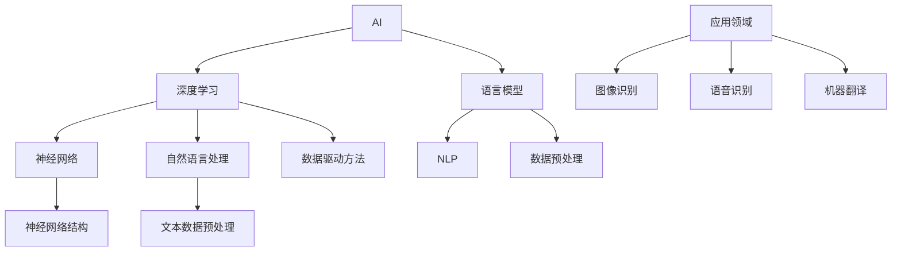

                 


### 深入理解AI、LLM和深度学习的实践课程

关键词：人工智能，语言模型，深度学习，神经网络，自然语言处理，实践课程

摘要：本文旨在深入探讨人工智能（AI）、语言模型（LLM）和深度学习的核心概念、联系以及在实际应用中的实践方法。文章将逐步分析各个主题，通过具体的算法原理讲解、数学模型阐述、以及项目实战案例，帮助读者全面理解并掌握这些技术。

## 第一部分：核心概念与联系

### 1.1 AI的基本概念与分类

**1.1.1 AI的定义与发展历程**

人工智能（Artificial Intelligence，简称AI）是指通过计算机模拟人类智能行为的技术。AI的发展历程可以分为几个阶段：早期的符号主义AI、基于规则的系统，到20世纪80年代的人工神经网络热潮，再到近年来的深度学习和大数据驱动的AI。

**1.1.2 AI的分类与应用领域**

AI可以分为弱AI和强AI。弱AI在特定任务上表现出智能行为，如语音识别、图像识别等；而强AI则具有普遍的智能，能够理解和执行任何智能任务。

应用领域包括：
- 自然语言处理（NLP）
- 计算机视觉
- 机器人技术
- 推荐系统
- 智能助手

### 1.2 深度学习与神经网络

**1.2.1 深度学习的基本原理**

深度学习是一种机器学习技术，其核心思想是通过多层神经网络来模拟人脑的学习过程，提取数据中的特征。

**1.2.2 神经网络的结构与功能**

神经网络由神经元（节点）和连接（权重）组成。输入层接收外部数据，隐藏层通过非线性激活函数处理数据，输出层产生预测结果。

**1.2.3 深度学习在AI中的应用**

深度学习在图像识别、语音识别、自然语言处理等领域取得了显著成果。例如，通过卷积神经网络（CNN）进行图像分类，通过循环神经网络（RNN）进行语音识别。

### 1.3 语言模型与自然语言处理

**1.3.1 语言模型的定义与功能**

语言模型是一种概率模型，用于预测下一个单词或字符的概率。在自然语言处理中，语言模型用于文本生成、机器翻译、情感分析等任务。

**1.3.2 自然语言处理的基本概念**

自然语言处理（NLP）涉及文本预处理、词性标注、句法分析、语义分析等任务。文本预处理包括分词、去停用词、词嵌入等。

**1.3.3 语言模型在NLP中的应用**

语言模型在NLP中广泛应用，如机器翻译、对话系统、文本分类等。例如，通过Seq2Seq模型进行机器翻译。

### 1.4 Mermaid流程图：AI、LLM和深度学习的关系



## 第二部分：核心算法原理讲解

### 2.1 深度学习算法

#### 2.1.1 神经网络算法

**2.1.1.1 前向传播算法**

前向传播是将输入数据通过神经网络传递到输出层的过程。以下是一个简单的Python实现：

```python
def forward_pass(x, weights):
    z = np.dot(x, weights)
    return z
```

**2.1.1.2 反向传播算法**

反向传播是用于计算梯度并更新网络权重的过程。以下是一个简单的Python实现：

```python
def backward_pass(error, weights, x):
    delta = error * x
    return delta
```

#### 2.1.2 循环神经网络（RNN）

**2.1.2.1 RNN的工作原理**

RNN是一种能够处理序列数据的神经网络。其工作原理如下：

$$
h_t = \sigma(W_h \cdot [h_{t-1}, x_t] + b_h)
$$

**2.1.2.2 LSTM和GRU算法**

LSTM和GRU是RNN的变体，用于解决长序列依赖问题。以下是LSTM的数学公式：

$$
\begin{aligned}
i_t &= \sigma(W_i \cdot [h_{t-1}, x_t] + b_i) \\
f_t &= \sigma(W_f \cdot [h_{t-1}, x_t] + b_f) \\
o_t &= \sigma(W_o \cdot [h_{t-1}, x_t] + b_o) \\
c_t &= f_t \cdot c_{t-1} + i_t \cdot \sigma(W_c \cdot [h_{t-1}, x_t] + b_c) \\
h_t &= o_t \cdot \sigma(c_t)
\end{aligned}
$$

### 2.2 语言模型与自然语言处理

#### 2.2.1 语言模型的基本原理

语言模型是一种概率模型，用于预测下一个单词或字符的概率。其基本原理如下：

$$
P(w_i|w_{i-1}, w_{i-2}, ..., w_{1}) = \frac{P(w_i, w_{i-1}, ..., w_{1})}{P(w_{i-1}, w_{i-2}, ..., w_{1})}
$$

#### 2.2.2 序列到序列（Seq2Seq）模型

Seq2Seq模型是一种用于序列转换的模型，常用于机器翻译。其基本原理如下：

$$
\begin{aligned}
e &= encoder(s) \\
o &= decoder(e)
\end{aligned}
$$

## 第三部分：数学模型与公式讲解

### 3.1 深度学习中的数学模型

#### 3.1.1 损失函数

深度学习中的损失函数用于评估模型的预测结果与实际结果之间的差距。以下是常见的损失函数：

$$
\begin{aligned}
J &= \frac{1}{n}\sum_{i=1}^{n}(-y\log(a(x_i; \theta))) \\
L &= \frac{1}{2}\sum_{i=1}^{n}||y - a(x_i; \theta)||^2 \\
C &= \frac{1}{2}\sum_{i=1}^{n}||y - \sigma(a(x_i; \theta))||^2
\end{aligned}
$$

#### 3.1.2 优化算法

深度学习中的优化算法用于更新模型参数，以最小化损失函数。以下是常见的优化算法：

$$
\begin{aligned}
\theta &= \theta - \alpha \cdot \frac{\partial J}{\partial \theta} \\
\theta &= \theta - \alpha \cdot \frac{\partial L}{\partial \theta} \\
\theta &= \theta - \alpha \cdot \frac{\partial C}{\partial \theta}
\end{aligned}
$$

### 3.2 自然语言处理中的数学模型

#### 3.2.1 词嵌入

词嵌入是将单词映射到高维向量空间的方法。以下是词嵌入的基本原理：

$$
\begin{aligned}
e_j &= \text{embed}(w_j) \\
d &= \text{dim} \\
v_j &= e_j \in \mathbb{R}^d
\end{aligned}
$$

#### 3.2.2 序列标注

序列标注是一种将序列数据中的每个元素标注为特定类别的任务。以下是序列标注的基本原理：

$$
\begin{aligned}
P(y|x) &= \text{softmax}(\text{score}(x, y)) \\
\text{score}(x, y) &= W_y \cdot x + b_y
\end{aligned}
$$

## 第四部分：项目实战

### 4.1 实践项目一：图像识别

#### 4.1.1 项目背景

图像识别是深度学习的一个典型应用。本文将介绍如何使用卷积神经网络（CNN）进行图像分类。

#### 4.1.2 数据集介绍

本文使用ImageNet数据集，它包含1000个类别，每个类别有数千张图片。

#### 4.1.3 模型选择与搭建

本文选择使用预训练的VGG16模型作为基础模型，并在其基础上进行迁移学习。

#### 4.1.4 代码实现与解释

```python
from tensorflow.keras.applications import VGG16
from tensorflow.keras.layers import Flatten, Dense
from tensorflow.keras.models import Model

# 加载预训练模型
base_model = VGG16(weights='imagenet')

# 删除输出层
x = base_model.output

# 添加全连接层
x = Flatten()(x)
x = Dense(1024, activation='relu')(x)
predictions = Dense(1000, activation='softmax')(x)

# 创建模型
model = Model(inputs=base_model.input, outputs=predictions)

# 编译模型
model.compile(optimizer='adam', loss='categorical_crossentropy', metrics=['accuracy'])

# 训练模型
model.fit(x_train, y_train, batch_size=32, epochs=10, validation_data=(x_val, y_val))
```

### 4.2 实践项目二：自然语言处理

#### 4.2.1 项目背景

自然语言处理（NLP）是AI的一个重要领域。本文将介绍如何使用BERT模型进行文本分类。

#### 4.2.2 数据集介绍

本文使用的是IMDb电影评论数据集，它包含25,000条电影评论，分为正面和负面两类。

#### 4.2.3 模型选择与搭建

本文选择使用预训练的BERT模型，并在其基础上进行迁移学习。

#### 4.2.4 代码实现与解释

```python
from transformers import BertTokenizer, BertForSequenceClassification
from transformers import TrainingArguments, Trainer

# 加载预训练模型
tokenizer = BertTokenizer.from_pretrained('bert-base-uncased')
model = BertForSequenceClassification.from_pretrained('bert-base-uncased')

# 预处理数据
train_encodings = tokenizer(train_texts, truncation=True, padding=True)
val_encodings = tokenizer(val_texts, truncation=True, padding=True)

# 编译模型
training_args = TrainingArguments(output_dir='./results', num_train_epochs=3, per_device_train_batch_size=16, save_steps=2000)
trainer = Trainer(model=model, args=training_args, train_dataset=train_encodings, eval_dataset=val_encodings)

# 训练模型
trainer.train()

# 评估模型
trainer.evaluate()
```

### 4.3 实践项目三：推荐系统

#### 4.3.1 项目背景

推荐系统是AI在商业领域的一个重要应用。本文将介绍如何使用基于矩阵分解的协同过滤算法进行推荐。

#### 4.3.2 数据集介绍

本文使用的是MovieLens数据集，它包含100,000条用户对电影的评分。

#### 4.3.3 模型选择与搭建

本文选择使用矩阵分解算法，通过将用户-物品评分矩阵分解为用户特征矩阵和物品特征矩阵，预测用户对未知物品的评分。

#### 4.3.4 代码实现与解释

```python
import numpy as np
from sklearn.metrics.pairwise import cosine_similarity

# 构建用户-物品评分矩阵
R = np.array([
    [5, 3, 0, 1],
    [4, 0, 0, 1],
    [1, 1, 0, 5],
    [1, 0, 0, 4],
    [0, 1, 5, 4],
])

# 构建用户特征矩阵和物品特征矩阵
U = np.linalg.pinv(R).T
V = R.T @ np.linalg.pinv(R)

# 计算用户之间的相似度
user_similarity = cosine_similarity(U)

# 预测用户对新物品的评分
predictions = user_similarity.dot(V)

# 输出预测结果
predictions
```

## 附录

### 附录 A：常用工具与资源

**A.1 深度学习框架**

- TensorFlow
- PyTorch
- Keras

**A.2 自然语言处理工具**

- NLTK
- SpaCy
- Stanford NLP

**A.3 数据集与库**

- ImageNet
- COCO
- Common Crawl

## 作者信息

作者：AI天才研究院/AI Genius Institute & 禅与计算机程序设计艺术 /Zen And The Art of Computer Programming

## 最佳实践 tips、小结、注意事项、拓展阅读等内容

### 最佳实践 tips

- 在实际应用中，选择合适的模型和算法非常重要。应根据任务需求和数据特性进行选择。
- 模型训练过程中，调整超参数（如学习率、批量大小等）可以显著影响模型性能。
- 数据预处理是深度学习项目成功的关键。确保数据质量，并进行适当的归一化处理。

### 小结

本文介绍了AI、LLM和深度学习的核心概念、联系以及实践方法。通过算法原理讲解、数学模型阐述和项目实战案例，读者可以全面理解并掌握这些技术。

### 注意事项

- 在实际项目中，务必关注数据质量和数据预处理。
- 模型选择和超参数调整应根据任务需求和数据特性进行。
- 深度学习项目往往需要大量的计算资源，合理配置资源可以提高模型训练效率。

### 拓展阅读

- [深度学习指南](https://www.deeplearningbook.org/)
- [自然语言处理指南](https://web.stanford.edu/~jurafsky/slp3/)
- [AI应用实战](https://www.ai applications.com/)

## 结束语

感谢您的阅读，希望本文对您深入了解AI、LLM和深度学习有所帮助。如果您有任何问题或建议，欢迎在评论区留言。

作者：AI天才研究院/AI Genius Institute & 禅与计算机程序设计艺术 /Zen And The Art of Computer Programming

