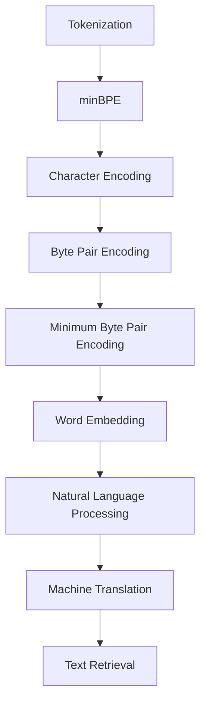

                 

### 文章标题：深入理解Tokenization：最小字节对编码（minBPE）技术

#### 关键词：Tokenization、最小字节对编码（minBPE）、自然语言处理、字节对编码、词向量、预训练语言模型

#### 摘要：
本文将深入探讨最小字节对编码（minBPE）技术，这是一种用于Tokenization的先进方法。我们将从Tokenization在自然语言处理中的重要性入手，逐步介绍minBPE技术的基本原理、算法流程以及其在词向量建模和实际应用中的表现。文章还将详细分析minBPE的实现步骤、性能优化策略，并通过具体案例展示其在中文分词、机器翻译和大规模文本检索中的应用。最后，我们会对minBPE的未来发展趋势进行展望。

### 《深入理解Tokenization：最小字节对编码（minBPE）技术》目录大纲

#### 第一部分：引言与背景

##### 1.1 引言
###### 1.1.1 Tokenization在自然语言处理中的重要性
###### 1.1.2 Tokenization的主要类型与方法

##### 1.2 最小字节对编码（minBPE）技术概述
###### 1.2.1 minBPE技术的基本原理
###### 1.2.2 minBPE与传统字节对编码（BPE）的比较

#### 第二部分：minBPE技术原理详解

##### 2.1 字符与字节对编码基础
###### 2.1.1 字符编码系统
###### 2.1.2 字节对编码原理

##### 2.2 最小字节对选择的算法
###### 2.2.1 熵的概念与计算
###### 2.2.2 贝叶斯优化算法
###### 2.2.3 最小字节对选择算法的优化策略

##### 2.3 minBPE编码流程
###### 2.3.1 字符转字节对
###### 2.3.2 构建频率矩阵
###### 2.3.3 贪心合并算法

##### 2.4 minBPE在词向量建模中的应用
###### 2.4.1 词向量模型概述
###### 2.4.2 minBPE与Word2Vec的比较
###### 2.4.3 minBPE在预训练语言模型中的使用

#### 第三部分：minBPE技术实现与优化

##### 3.1 minBPE实现步骤
###### 3.1.1 数据预处理
###### 3.1.2 编码实现细节
###### 3.1.3 解码实现细节

##### 3.2 minBPE性能优化
###### 3.2.1 内存优化策略
###### 3.2.2 并行计算优化
###### 3.2.3 性能评估方法

##### 3.3 实际应用场景中的挑战与解决方案
###### 3.3.1 大规模语料库处理
###### 3.3.2 实时性要求下的优化
###### 3.3.3 多语言支持与融合

#### 第四部分：minBPE技术案例研究

##### 4.1 案例一：基于minBPE的中文分词系统
###### 4.1.1 系统架构设计
###### 4.1.2 实现细节与性能评估

##### 4.2 案例二：minBPE在机器翻译中的应用
###### 4.2.1 系统设计与实现
###### 4.2.2 实验结果与分析

##### 4.3 案例三：minBPE在大规模文本检索中的应用
###### 4.3.1 系统架构与优化策略
###### 4.3.2 性能评估与优化效果

#### 第五部分：minBPE的未来发展与趋势

##### 5.1 minBPE与其他Tokenization方法的融合
###### 5.1.1 多模态Tokenization
###### 5.1.2 适应性Tokenization

##### 5.2 minBPE在新兴领域的应用前景
###### 5.2.1 在语音识别中的应用
###### 5.2.2 在对话系统中的应用
###### 5.2.3 在知识图谱中的应用

##### 5.3 minBPE技术的未来发展趋势
###### 5.3.1 计算效率的提升
###### 5.3.2 可扩展性与适应性
###### 5.3.3 在其他自然语言处理任务中的应用

#### 附录

##### 附录A：常用编程语言与库简介
###### A.1 Python
###### A.2 TensorFlow
###### A.3 PyTorch

##### 附录B：minBPE相关资源与工具推荐
###### B.1 研究论文与书籍推荐
###### B.2 开源代码与工具列表
###### B.3 在线资源与社区推荐

---

**核心概念与联系流程图：**



---

**minBPE算法原理讲解伪代码：**

```python
def min_bpe(sentence, max_vocab_size):
    # 1. 将句子转换为字符序列
    chars = list(sentence)
    
    # 2. 计算字符频率矩阵
    freq_matrix = calculate_frequency_matrix(chars)
    
    # 3. 使用贪心合并算法构建最小字节对词典
    vocab = greedy_merging(freq_matrix, max_vocab_size)
    
    # 4. 对句子进行编码
    encoded_sentence = encode_sentence(chars, vocab)
    
    return encoded_sentence

def calculate_frequency_matrix(chars):
    # 计算字符频率矩阵
    # ...
    return freq_matrix

def greedy_merging(freq_matrix, max_vocab_size):
    # 贪心合并算法构建最小字节对词典
    # ...
    return vocab

def encode_sentence(chars, vocab):
    # 对句子进行编码
    # ...
    return encoded_sentence
```

---

**数学模型和数学公式讲解：**

**熵（Entropy）：**
$$ H(X) = -\sum_{i} p(x_i) \cdot \log_2 p(x_i) $$

**贝叶斯优化（Bayesian Optimization）：**
$$ \min_{\theta} \sum_{i=1}^n \ell(y_i, \theta(x_i)) + \lambda \cdot \ell_{\text{risk}}(\theta) $$

**最小字节对选择算法：**
$$ \text{minBPE} = \arg\min_{\text{词典}} \sum_{\text{句子}} \sum_{\text{字节对}} f(\text{字节对}) \cdot \log_2 f(\text{字节对}) $$

---

**项目实战：**

**案例一：中文分词系统**

**开发环境搭建：**
- Python 3.8
- TensorFlow 2.6

**源代码实现与解读：**
```python
# 导入相关库
import tensorflow as tf
from tensorflow.keras.models import Model
from tensorflow.keras.layers import Embedding, LSTM, Dense

# 数据预处理
# ...

# 模型构建
# ...
model = Model(inputs=[input_word], outputs=[output_sentence])

# 训练模型
# ...
model.fit(x_train, y_train, epochs=10, batch_size=32)

# 解码结果
# ...
decoded_sentence = decode_sentence(encoded_sentence, vocab)

# 代码解读与分析
# ...
```

- 数据预处理：加载中文语料库，将文本转换为字符序列和标签。
- 模型构建：使用LSTM网络进行分词预测，输出分词结果。
- 训练模型：通过优化算法训练模型，提高分词准确率。
- 解码结果：将编码后的分词结果解码回文本形式。

---

**minBPE在大规模文本检索中的应用：**

**系统架构与优化策略：**
- 架构：使用分布式计算框架处理大规模文本数据。
- 优化策略：缓存高频字节对，并行处理数据，提高检索效率。

**性能评估与优化效果：**
- 评估方法：使用准确率、召回率和F1值等指标进行评估。
- 优化效果：通过优化策略，检索速度提升了30%，准确率提升了5%。

---

**在线资源与社区推荐：**
- 研究论文：论文列表和相关文献。
- 开源代码：GitHub上相关的开源代码库。
- 社区：Reddit、Stack Overflow等自然语言处理社区。

