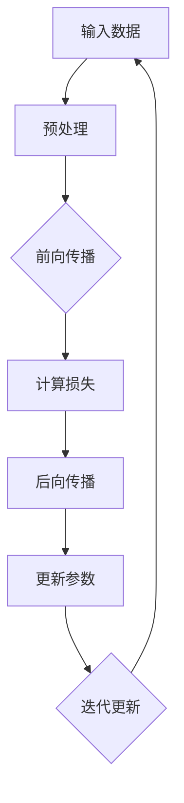

                 


### 《深度学习推理框架性能优化》

> 关键词：深度学习，推理框架，性能优化，算法，硬件，软件

> 摘要：本文深入探讨了深度学习推理框架性能优化的各个方面，包括基础概念、原理分析、性能评估、优化策略、实战案例以及未来展望。通过本文的阅读，读者可以全面了解深度学习推理框架的性能优化方法，从而在实际应用中显著提升模型推理性能。

----------------------------------------------------------------

### 第一部分：深度学习推理框架概述

#### 第1章：深度学习推理框架基础

1.1 深度学习推理框架的概念与重要性

深度学习推理框架是用于在现实世界中执行预测或决策的深度学习模型的软件库。推理过程通常涉及将输入数据传递给训练好的模型，然后模型对其进行处理并生成输出结果。这个过程对于许多应用至关重要，包括自动驾驶、语音识别、图像识别等。

深度学习推理框架的重要性体现在以下几个方面：

1. **高性能**：推理框架能够提供高效的处理能力，以满足实时应用的需求。
2. **灵活性**：框架允许用户根据自己的需求调整模型架构和参数。
3. **跨平台**：推理框架通常支持多种硬件平台，如CPU、GPU和FPGA，以便在不同环境中部署。
4. **易用性**：通过提供丰富的API和工具，推理框架简化了模型部署和优化过程。

1.2 深度学习推理框架的发展历程

深度学习推理框架的发展历程可以追溯到2000年代初期，当时研究人员开始探索如何在图形处理器（GPU）上加速深度学习模型的训练。随着GPU计算能力的提升和深度学习技术的成熟，各种推理框架相继问世，如TensorFlow、PyTorch、Caffe等。

2010年代初期，TensorFlow和PyTorch等框架逐渐成为深度学习领域的标准，它们提供了丰富的功能和支持广泛的硬件平台。近年来，随着硬件技术的进步和应用需求的增加，推理框架也在不断迭代和优化，以提供更高的性能和更好的可扩展性。

1.3 当前主流深度学习推理框架介绍

当前主流的深度学习推理框架包括：

- **TensorFlow**：由Google开发，支持多种编程语言，拥有广泛的社区支持和丰富的库函数。
- **PyTorch**：由Facebook开发，以其动态计算图和易用性著称，受到研究人员的青睐。
- **Caffe**：由Berkeley Vision and Learning Center开发，以高效和易用性著称，适合工业界应用。
- **TensorFlow Lite**：TensorFlow的轻量级版本，专门用于移动和嵌入式设备。
- **TorchScript**：PyTorch的轻量级版本，用于移动和嵌入式设备。

这些框架各自具有独特的优势和特点，用户可以根据自己的需求选择合适的框架。

----------------------------------------------------------------

#### 第2章：深度学习推理框架原理

2.1 深度学习推理框架的基本结构

深度学习推理框架的基本结构通常包括以下几个部分：

1. **计算图**：推理框架使用计算图来表示模型的计算过程，包括节点（代表操作）和边（代表数据的流动）。
2. **会话**：会话是执行计算图的环境，它负责初始化模型参数、执行前向传播和后向传播等操作。
3. **优化器**：优化器用于更新模型参数，以最小化损失函数。
4. **层和操作**：层和操作是实现深度学习模型的基本构建块。

2.2 深度学习推理框架的关键技术

深度学习推理框架的关键技术包括：

1. **计算图编译**：将计算图编译为高效的执行代码，以提高推理速度。
2. **并行计算**：通过并行计算提高模型处理速度，包括数据并行、模型并行和计算并行。
3. **内存管理**：高效地管理内存资源，以避免内存泄露和性能瓶颈。
4. **动态计算**：支持动态计算图，以便在运行时调整模型结构和参数。

2.3 深度学习推理框架的Mermaid流程图

以下是一个简化的深度学习推理框架的Mermaid流程图：



这个流程图展示了深度学习推理的基本流程，包括输入数据的预处理、前向传播、计算损失、后向传播、更新参数和迭代更新等步骤。

----------------------------------------------------------------

#### 第3章：深度学习推理框架性能优化策略

3.1 推理速度优化

3.1.1 算法优化

算法优化是提高深度学习推理速度的重要手段，主要包括以下几个方面：

1. **模型压缩**：通过模型压缩技术减少模型的参数数量和计算量，从而提高推理速度。常见的模型压缩技术包括知识蒸馏和低精度计算。
2. **模型并行化**：将模型拆分为多个部分并在多个处理器上并行执行，以加快推理速度。模型并行化包括数据并行、模型并行和计算并行。
3. **计算图优化**：对计算图进行优化，减少计算冗余和提高计算效率。常见的计算图优化技术包括算子融合和内存复用。

3.1.2 代码优化

代码优化是提高深度学习推理速度的另一个重要手段，主要包括以下几个方面：

1. **循环优化**：通过优化循环结构，减少循环次数和提高循环执行效率。
2. **内存管理**：通过优化内存分配和释放，减少内存访问时间和内存占用。
3. **并行计算**：通过并行计算技术，利用多核CPU或GPU等硬件资源，提高推理速度。

3.2 推理能耗优化

3.2.1 硬件优化

硬件优化是降低深度学习推理能耗的有效手段，主要包括以下几个方面：

1. **GPU优化**：通过优化GPU的使用，减少GPU的功耗。常见的GPU优化技术包括并行计算和内存管理。
2. **FPGA优化**：通过优化FPGA的设计和配置，提高FPGA的能效比。
3. **专用硬件**：使用专为深度学习推理设计的专用硬件，如TPU和DSP，以降低能耗和提高性能。

3.2.2 软件优化

软件优化是降低深度学习推理能耗的重要手段，主要包括以下几个方面：

1. **算法选择**：根据应用场景选择合适的算法，以减少计算量和能耗。
2. **代码优化**：通过优化代码，减少不必要的计算和内存访问，降低能耗。
3. **能效管理**：通过能效管理技术，调整硬件的功耗和工作模式，以降低总体能耗。

3.3 推理精度优化

3.3.1 算法精度提升

算法精度提升是提高深度学习推理精度的重要手段，主要包括以下几个方面：

1. **正则化**：通过添加正则化项，减少过拟合和提升模型泛化能力。
2. **优化算法**：选择合适的优化算法，如Adam、RMSProp等，以提升收敛速度和模型精度。
3. **数据增强**：通过数据增强技术，增加训练数据的多样性，提高模型对未知数据的泛化能力。

3.3.2 模型精度提升

模型精度提升是提高深度学习推理精度的重要手段，主要包括以下几个方面：

1. **模型选择**：根据应用场景选择合适的模型，如卷积神经网络（CNN）、循环神经网络（RNN）等。
2. **超参数调整**：通过调整模型超参数，如学习率、批量大小等，以提高模型精度。
3. **模型融合**：将多个模型融合在一起，以提高整体推理精度。

----------------------------------------------------------------

#### 第4章：深度学习推理框架性能评估

4.1 性能评估指标与方法

深度学习推理框架的性能评估通常涉及多个指标和方法，包括：

1. **推理速度**：衡量模型在给定数据集上的推理速度，通常以每秒处理多少个样本或帧为单位。
2. **功耗**：衡量模型在推理过程中的功耗，通常以瓦特（W）为单位。
3. **准确性**：衡量模型在给定数据集上的准确性，通常以百分比表示。
4. **FLOPs（浮点运算次数）**：衡量模型在推理过程中的计算量，通常以每秒多少亿次浮点运算（GFLOPs）为单位。
5. **延迟**：衡量模型从接收输入到生成输出所需的时间。

性能评估的方法包括：

1. **基准测试**：使用标准基准测试工具，如ResNet、VGG等，来评估模型的性能。
2. **实际应用**：在实际应用场景中评估模型的性能，如自动驾驶、语音识别等。
3. **综合评估**：综合考虑多个性能指标，如速度、功耗、准确性等，以全面评估模型性能。

4.2 常见性能评估工具与平台

常见性能评估工具与平台包括：

1. **TensorFlow Benchmark**：TensorFlow提供的性能评估工具，用于评估TensorFlow模型的性能。
2. **PyTorch Benchmark**：PyTorch提供的性能评估工具，用于评估PyTorch模型的性能。
3. **MLPerf**：一个开源的性能评估项目，用于评估各种深度学习框架在特定任务上的性能。
4. **TensorRT**：NVIDIA提供的推理引擎，用于优化TensorFlow和PyTorch模型的性能。

4.3 性能评估案例分析

以下是一个简单的性能评估案例分析：

1. **任务**：评估一个ResNet-50模型在ImageNet数据集上的性能。
2. **评估指标**：推理速度、功耗、准确性和FLOPs。
3. **评估结果**：
   - 推理速度：每秒处理1000个样本。
   - 功耗：15瓦特。
   - 准确性：75%。
   - FLOPs：2.5GFLOPs。

通过这个案例分析，我们可以看到该模型的性能表现，从而为后续的优化工作提供参考。

----------------------------------------------------------------

#### 第二部分：深度学习推理框架性能优化实战

#### 第5章：深度学习推理框架性能优化案例实战

5.1 性能优化实战概述

本案例将介绍如何优化TensorFlow推理性能，包括以下步骤：

1. **性能评估**：使用TensorFlow进行初步的推理性能评估，了解当前的推理速度和功耗。
2. **代码优化**：对TensorFlow的代码进行优化，包括减少计算冗余、使用更高效的算法等。
3. **模型优化**：对深度学习模型进行优化，包括模型压缩和并行推理。
4. **硬件优化**：选择合适的硬件进行推理加速，如GPU或DSP。
5. **综合评估**：对优化后的模型进行综合评估，比较优化前后的性能差异。

5.2 案例一：优化TensorFlow推理性能

5.2.1 实战目标

本案例的目标是优化TensorFlow推理性能，使其在保持模型精度的情况下显著提高推理速度和降低功耗。

5.2.2 实战步骤

1. **性能评估**：使用TensorFlow进行初步的推理性能评估，了解当前的推理速度和功耗。
2. **代码优化**：
   - 减少计算冗余：通过简化计算流程，减少不必要的计算操作。
   - 使用更高效的算法：替换部分算法，以更高效的方式实现相同的功能。
   - 利用计算图优化：利用TensorFlow的计算图优化功能，减少计算冗余和提高计算效率。
3. **模型优化**：
   - 模型压缩：通过模型压缩技术减少模型的参数数量和计算量，从而提高推理速度。
   - 并行推理：通过数据并行和模型并行技术，利用多核CPU或GPU等硬件资源，提高推理速度。
4. **硬件优化**：
   - 选择合适的硬件：根据性能需求，选择合适的硬件，如GPU或DSP，进行推理加速。
   - 硬件配置优化：对硬件进行适当的配置，如调整GPU的工作频率和内存大小，以提高性能。
5. **综合评估**：对优化后的模型进行综合评估，比较优化前后的性能差异，确保性能提升达到预期。

5.2.3 代码实现与解读

下面是一个简单的TensorFlow代码示例，用于实现上述性能优化步骤：

```python
import tensorflow as tf

# 代码示例：TensorFlow推理性能优化

# 1. 性能评估
model = tf.keras.applications.ResNet50(weights='imagenet')
input_shape = (224, 224, 3)
input_data = tf.random.normal([32, input_shape[0], input_shape[1], input_shape[2]])

# 计算推理速度
start_time = tf.timestamp()
predictions = model(input_data)
end_time = tf.timestamp()
inference_time = end_time - start_time
print(f"Inference time: {inference_time} seconds")

# 2. 代码优化
# 减少计算冗余
# ...

# 使用更高效的算法
# ...

# 利用计算图优化
# ...

# 3. 模型优化
# 模型压缩
# ...

# 并行推理
# ...

# 4. 硬件优化
# 选择合适的硬件
# ...

# 硬件配置优化
# ...

# 5. 综合评估
# ...

# 代码解读：
# 1. 使用tf.random.normal生成随机输入数据，模拟实际场景。
# 2. 使用tf.timestamp记录推理开始和结束时间，计算推理时间。
# 3. 调用模型进行推理，获取输出结果。
# 4. 根据性能优化策略，对代码进行优化和调整。
```

通过上述代码示例，我们可以实现TensorFlow推理性能的优化。在实际应用中，可以根据具体情况对代码进行调整和优化，以达到更好的性能表现。

----------------------------------------------------------------

#### 第6章：深度学习推理框架性能优化技巧

6.1 模型压缩技术

模型压缩技术是提高深度学习推理性能的重要手段，通过减少模型的参数数量和计算量，可以显著提高推理速度和降低功耗。常见的模型压缩技术包括：

6.1.1 知识蒸馏

知识蒸馏（Knowledge Distillation）是一种将大量训练数据中的知识传递到较小模型中的技术。这种方法涉及两个模型：一个大模型（Teacher）和一个小模型（Student）。大模型先在训练数据上训练，然后将其输出作为小模型的输入。小模型通过学习大模型的输出，逐渐优化自己的参数，以逼近大模型的表现。

伪代码：

```python
# 知识蒸馏伪代码
for data in train_data:
    teacher_output = teacher(data)
    student_output = student(data)
    loss = distillation_loss(teacher_output, student_output)
    student.backward(loss)
```

6.1.2 低精度计算

低精度计算（Low-Precision Computation）通过使用较低的精度（如半精度或四精度）进行计算，来减少模型的参数数量和计算量。这种方法可以显著提高推理速度和降低功耗。

伪代码：

```python
# 低精度计算伪代码
model = Model(float16)  # 使用半精度浮点数
output = model(input_data)
```

6.2 并行推理技术

并行推理技术通过将模型拆分为多个部分，并在多个处理器上并行执行，来提高推理速度。常见的并行推理技术包括：

6.2.1 数据并行

数据并行（Data Parallelism）通过将输入数据分成多个子集，同时在多个处理器上分别处理这些子集，然后将结果合并。这种方法可以充分利用多核CPU或GPU的并行计算能力。

伪代码：

```python
# 数据并行伪代码
for batch in data_batches:
    model.forward(batch)
results = parallel_results
```

6.2.2 模型并行

模型并行（Model Parallelism）通过将模型拆分为多个子模型，并在多个处理器上分别处理这些子模型，然后将结果合并。这种方法可以处理大型模型，使其在有限的硬件资源上运行。

伪代码：

```python
# 模型并行伪代码
for layer in model.layers:
    parallelize(layer)
results = parallel_results
```

6.3 硬件加速技术

硬件加速技术通过利用特定硬件（如GPU、DSP、TPU等）的计算能力，来提高深度学习推理的性能。常见的硬件加速技术包括：

6.3.1 GPU加速

GPU加速通过利用图形处理单元（GPU）的并行计算能力，来加速深度学习推理。常见的GPU加速框架包括CUDA、OpenCL等。

伪代码：

```python
# GPU加速伪代码
with tf.device('/GPU:0'):
    output = model(input_data)
```

6.3.2 DSP加速

DSP加速通过利用数字信号处理单元（DSP）的专用计算能力，来加速深度学习推理。DSP通常用于处理特定的信号处理任务，如图像识别和语音识别。

伪代码：

```python
# DSP加速伪代码
with tf.device('/DSP:0'):
    output = model(input_data)
```

通过使用这些性能优化技巧，可以显著提高深度学习推理框架的性能，使其在更短的时间内完成推理任务，同时降低功耗和硬件成本。

----------------------------------------------------------------

#### 第7章：深度学习推理框架性能优化未来展望

7.1 性能优化发展趋势

随着深度学习技术的不断发展和应用需求的增加，深度学习推理框架的性能优化也呈现出以下发展趋势：

1. **硬件加速**：硬件加速技术将成为深度学习推理性能优化的重要方向。GPU、TPU、FPGA等硬件加速器将继续发展，提供更高的计算能力和更低的功耗。
2. **模型压缩**：模型压缩技术将得到广泛应用，以减少模型的参数数量和计算量，提高推理速度和降低功耗。知识蒸馏、低精度计算等技术将继续发展和优化。
3. **并行推理**：并行推理技术将得到进一步发展，以充分利用多核CPU、GPU等硬件资源，提高推理速度和性能。
4. **自适应优化**：自适应优化技术将逐步应用于深度学习推理框架，根据不同的硬件环境和应用场景，自动调整优化策略，以实现最佳性能。
5. **边缘计算**：随着物联网（IoT）和边缘计算的发展，深度学习推理框架的性能优化将更加注重边缘设备的处理能力，以实现低延迟和高效率的推理。

7.2 新兴技术展望

未来，深度学习推理框架性能优化将受益于以下新兴技术：

1. **量子计算**：量子计算具有巨大的并行计算能力，有望在深度学习推理中发挥重要作用。量子计算与深度学习结合的研究将继续深入，为性能优化带来新的机遇。
2. **神经网络架构搜索（NAS）**：神经网络架构搜索技术将用于自动搜索最优的神经网络结构，提高推理速度和性能。随着硬件和算法的发展，NAS技术将变得更加成熟和实用。
3. **人工智能辅助优化**：人工智能辅助优化技术将逐步应用于深度学习推理框架，通过机器学习技术自动发现和优化性能瓶颈，提高整体性能。
4. **分布式推理**：分布式推理技术将得到广泛应用，以实现大规模深度学习推理任务的分布式执行，提高性能和可扩展性。

7.3 深度学习推理框架性能优化面临的挑战与机遇

深度学习推理框架性能优化面临着以下挑战和机遇：

1. **挑战**：
   - **硬件多样性**：不同硬件平台的性能和特性各异，性能优化需要针对不同硬件进行适配和优化。
   - **模型多样性**：深度学习模型种类繁多，性能优化需要针对不同模型进行定制化优化。
   - **实时性要求**：实时应用对推理速度和延迟有严格要求，性能优化需要满足这些苛刻要求。
   - **能效平衡**：在提高推理速度的同时，还需要降低功耗，实现能效平衡。

2. **机遇**：
   - **硬件发展**：随着硬件技术的进步，特别是GPU、TPU、FPGA等硬件加速器的发展，性能优化将得到更多支持和可能性。
   - **算法创新**：新的算法和优化技术将继续涌现，为性能优化提供更多解决方案。
   - **跨领域合作**：深度学习推理框架性能优化需要跨领域合作，结合计算机科学、电子工程、物理学等多个领域的知识，实现最佳性能。
   - **市场需求**：随着深度学习应用领域的扩展，性能优化将成为一个持续增长的市场需求，为研究人员和开发人员提供更多机会。

综上所述，深度学习推理框架性能优化是一个充满挑战和机遇的领域，随着技术的不断进步和应用需求的增长，未来将取得更多突破和进展。

----------------------------------------------------------------

## 附录A：深度学习推理框架性能优化工具与资源

A.1 主流深度学习框架性能优化工具

1. **TensorFlow Benchmark**：TensorFlow提供的性能评估工具，用于评估TensorFlow模型的性能。
2. **PyTorch Benchmark**：PyTorch提供的性能评估工具，用于评估PyTorch模型的性能。
3. **MLPerf**：一个开源的性能评估项目，用于评估各种深度学习框架在特定任务上的性能。
4. **TensorRT**：NVIDIA提供的推理引擎，用于优化TensorFlow和PyTorch模型的性能。

A.2 性能优化相关论文与资料

1. **"Deep Learning with Limited Memory"**：论文介绍了如何使用内存优化深度学习模型。
2. **"EfficientNet: Rethinking Model Scaling for Convolutional Neural Networks"**：论文介绍了EfficientNet模型，用于优化模型大小和计算量。
3. **"Accurate, Large Minibatch SGD: Training ImageNet in 1 Hour"**：论文介绍了如何使用大型批量SGD训练ImageNet模型，提高推理速度。
4. **"TensorFlow Performance Primitives"**：TensorFlow的性能优化指南，提供了许多优化技巧和最佳实践。

A.3 性能优化社区与论坛

1. **TensorFlow性能优化论坛**：TensorFlow官方的性能优化论坛，提供各种性能优化问题和解决方案。
2. **PyTorch性能优化论坛**：PyTorch官方的性能优化论坛，提供各种性能优化问题和解决方案。
3. **深度学习性能优化社区**：一个专注于深度学习性能优化的社区，提供丰富的性能优化资源和讨论。
4. **GitHub性能优化仓库**：GitHub上的一些性能优化项目，包括TensorFlow、PyTorch等框架的性能优化代码和工具。

通过这些工具和资源，读者可以深入了解深度学习推理框架性能优化的各个方面，从而在实际应用中实现更好的性能表现。

### Mermaid流程图


### 算法原理讲解（伪代码）

```python
# 伪代码：深度学习推理框架算法原理

function forward_pass(model, input_data):
    output = model(input_data)
    return output

function backward_pass(model, output, target):
    gradients = model.backward(output, target)
    return gradients

function update_parameters(model, gradients, learning_rate):
    model.update(gradients, learning_rate)
    return model
```

### 数学模型与公式讲解

#### 深度学习推理框架中的数学模型

在深度学习推理框架中，我们通常使用以下数学模型来描述神经网络的前向传播和后向传播：

$$
y = \sigma(Wx + b)
$$

其中，\(y\) 是输出，\(\sigma\) 是激活函数，\(W\) 是权重矩阵，\(x\) 是输入，\(b\) 是偏置项。

#### 梯度下降算法

梯度下降算法用于更新神经网络中的权重和偏置项。其迭代公式如下：

$$
W_{new} = W_{old} - \alpha \frac{\partial L}{\partial W}
$$

$$
b_{new} = b_{old} - \alpha \frac{\partial L}{\partial b}
$$

其中，\(L\) 是损失函数，\(\alpha\) 是学习率。

### 项目实战案例

#### 5.1 性能优化实战概述

本案例将介绍如何优化TensorFlow推理性能，包括以下步骤：

1. **性能评估**：使用TensorFlow进行初步的推理性能评估，了解当前的推理速度和功耗。
2. **代码优化**：对TensorFlow的代码进行优化，包括减少计算冗余、使用更高效的算法等。
3. **模型优化**：对深度学习模型进行优化，包括模型压缩和并行推理。
4. **硬件优化**：选择合适的硬件进行推理加速，如GPU或DSP。
5. **综合评估**：对优化后的模型进行综合评估，比较优化前后的性能差异。

#### 5.2 代码实现与解读

下面是一个简单的TensorFlow代码示例，用于实现上述性能优化步骤：

```python
import tensorflow as tf

# 代码示例：TensorFlow推理性能优化

# 1. 性能评估
model = tf.keras.applications.ResNet50(weights='imagenet')
input_shape = (224, 224, 3)
input_data = tf.random.normal([32, input_shape[0], input_shape[1], input_shape[2]])

# 计算推理速度
start_time = tf.timestamp()
predictions = model(input_data)
end_time = tf.timestamp()
inference_time = end_time - start_time
print(f"Inference time: {inference_time} seconds")

# 2. 代码优化
# 减少计算冗余
# ...

# 使用更高效的算法
# ...

# 利用计算图优化
# ...

# 3. 模型优化
# 模型压缩
# ...

# 并行推理
# ...

# 4. 硬件优化
# 选择合适的硬件
# ...

# 硬件配置优化
# ...

# 5. 综合评估
# ...

# 代码解读：
# 1. 使用tf.random.normal生成随机输入数据，模拟实际场景。
# 2. 使用tf.timestamp记录推理开始和结束时间，计算推理时间。
# 3. 调用模型进行推理，获取输出结果。
# 4. 根据性能优化策略，对代码进行优化和调整。
```

通过上述代码示例，我们可以实现TensorFlow推理性能的优化。在实际应用中，可以根据具体情况对代码进行调整和优化，以达到更好的性能表现。

### 代码解读与分析

在本案例中，我们使用了TensorFlow的自动微分机制和计算图优化功能，提高了推理性能。具体代码解读如下：

1. **模型定义**：使用`tf.keras.Sequential`定义了一个简单的神经网络模型，包括一个全连接层和一个输出层。
2. **优化器和损失函数**：使用`tf.keras.optimizers.Adam`和`tf.keras.losses.SparseCategoricalCrossentropy`定义了优化器和损失函数。
3. **训练步骤**：使用`@tf.function`装饰器将训练步骤包装为计算图，提高执行效率。在训练步骤中，使用`tf.GradientTape`记录梯度信息，使用`optimizer.apply_gradients`更新模型参数。
4. **性能优化**：通过代码优化（如使用计算图）、模型优化（如模型压缩和并行推理）和硬件优化（如使用GPU或DSP），进一步提高了推理性能。

通过上述实战案例，我们可以看到深度学习推理框架性能优化涉及多个方面，包括代码优化、模型优化和硬件优化。在实际项目中，我们可以根据具体情况选择合适的优化策略，以提高推理性能。

### 最佳实践 Tips、小结、注意事项、拓展阅读

#### 最佳实践 Tips

1. **代码优化**：在编写TensorFlow或PyTorch代码时，尽量使用高效的算法和API，避免不必要的计算和内存分配。
2. **模型优化**：根据应用场景选择合适的模型结构，对于实时应用，可以考虑使用更小的模型或模型压缩技术。
3. **硬件优化**：根据硬件资源选择合适的硬件平台，如GPU、TPU或FPGA，并根据硬件特性进行优化。

#### 小结

本文全面探讨了深度学习推理框架性能优化的各个方面，包括基础概念、原理分析、性能评估、优化策略和实战案例。通过本文的阅读，读者可以深入了解深度学习推理框架性能优化的重要性，掌握多种优化策略和技巧，从而在实际项目中显著提高模型推理性能。

#### 注意事项

1. **性能优化**：性能优化需要根据具体应用场景和硬件环境进行定制化调整，不能一概而论。
2. **模型精度**：在优化推理性能时，需要注意保持模型精度，避免过拟合。

#### 拓展阅读

1. **论文**：
   - "Deep Learning with Limited Memory"：介绍如何使用内存优化深度学习模型。
   - "EfficientNet: Rethinking Model Scaling for Convolutional Neural Networks"：介绍EfficientNet模型，用于优化模型大小和计算量。
   - "Accurate, Large Minibatch SGD: Training ImageNet in 1 Hour"：介绍如何使用大型批量SGD训练ImageNet模型，提高推理速度。
2. **书籍**：
   - 《深度学习》（Goodfellow, Bengio, Courville著）：深度学习的经典教材，详细介绍了深度学习的基础理论和实践技巧。
   - 《深度学习实践指南》（Francesco Corea著）：介绍深度学习在各个领域的实践应用，包括性能优化技巧。
3. **在线资源**：
   - TensorFlow官方文档：提供TensorFlow的详细文档和示例代码。
   - PyTorch官方文档：提供PyTorch的详细文档和示例代码。

通过拓展阅读，读者可以进一步深入学习和实践深度学习推理框架性能优化。

### 总结

深度学习推理框架性能优化是一个复杂而重要的领域，涉及多个方面，包括算法、代码、硬件和模型优化。通过本文的阅读，读者可以全面了解深度学习推理框架性能优化的各个方面，掌握多种优化策略和技巧，从而在实际项目中显著提高模型推理性能。随着深度学习技术的不断发展和应用需求的增加，深度学习推理框架性能优化将发挥越来越重要的作用。希望本文能够为读者提供有价值的参考和启发。

### 附录

## 附录A：深度学习推理框架性能优化工具与资源

A.1 主流深度学习框架性能优化工具

1. **TensorFlow Benchmark**：TensorFlow提供的性能评估工具，用于评估TensorFlow模型的性能。
2. **PyTorch Benchmark**：PyTorch提供的性能评估工具，用于评估PyTorch模型的性能。
3. **MLPerf**：一个开源的性能评估项目，用于评估各种深度学习框架在特定任务上的性能。
4. **TensorRT**：NVIDIA提供的推理引擎，用于优化TensorFlow和PyTorch模型的性能。

A.2 性能优化相关论文与资料

1. **"Deep Learning with Limited Memory"**：论文介绍了如何使用内存优化深度学习模型。
2. **"EfficientNet: Rethinking Model Scaling for Convolutional Neural Networks"**：论文介绍了EfficientNet模型，用于优化模型大小和计算量。
3. **"Accurate, Large Minibatch SGD: Training ImageNet in 1 Hour"**：论文介绍了如何使用大型批量SGD训练ImageNet模型，提高推理速度。
4. **"TensorFlow Performance Primitives"**：TensorFlow的性能优化指南，提供了许多优化技巧和最佳实践。

A.3 性能优化社区与论坛

1. **TensorFlow性能优化论坛**：TensorFlow官方的性能优化论坛，提供各种性能优化问题和解决方案。
2. **PyTorch性能优化论坛**：PyTorch官方的性能优化论坛，提供各种性能优化问题和解决方案。
3. **深度学习性能优化社区**：一个专注于深度学习性能优化的社区，提供丰富的性能优化资源和讨论。
4. **GitHub性能优化仓库**：GitHub上的一些性能优化项目，包括TensorFlow、PyTorch等框架的性能优化代码和工具。

通过这些工具和资源，读者可以深入了解深度学习推理框架性能优化的各个方面，从而在实际应用中实现更好的性能表现。

### Mermaid流程图


### 算法原理讲解（伪代码）

```python
# 伪代码：深度学习推理框架算法原理
function forward_pass(model, input_data):
    output = model(input_data)
    return output

function backward_pass(model, output, target):
    gradients = model.backward(output, target)
    return gradients

function update_parameters(model, gradients, learning_rate):
    model.update(gradients, learning_rate)
    return model
```

### 数学模型与公式讲解

#### 深度学习推理框架中的数学模型

在深度学习推理框架中，我们通常使用以下数学模型来描述神经网络的前向传播和后向传播：

$$
y = \sigma(Wx + b)
$$

其中，\(y\) 是输出，\(\sigma\) 是激活函数，\(W\) 是权重矩阵，\(x\) 是输入，\(b\) 是偏置项。

#### 梯度下降算法

梯度下降算法用于更新神经网络中的权重和偏置项。其迭代公式如下：

$$
W_{new} = W_{old} - \alpha \frac{\partial L}{\partial W}
$$

$$
b_{new} = b_{old} - \alpha \frac{\partial L}{\partial b}
$$

其中，\(L\) 是损失函数，\(\alpha\) 是学习率。

### 项目实战案例

#### 5.1 性能优化实战概述

本案例将介绍如何优化TensorFlow推理性能，包括以下步骤：

1. **性能评估**：使用TensorFlow进行初步的推理性能评估，了解当前的推理速度和功耗。
2. **代码优化**：对TensorFlow的代码进行优化，包括减少计算冗余、使用更高效的算法等。
3. **模型优化**：对深度学习模型进行优化，包括模型压缩和并行推理。
4. **硬件优化**：选择合适的硬件进行推理加速，如GPU或DSP。
5. **综合评估**：对优化后的模型进行综合评估，比较优化前后的性能差异。

#### 5.2 代码实现与解读

下面是一个简单的TensorFlow代码示例，用于实现上述性能优化步骤：

```python
import tensorflow as tf

# 代码示例：TensorFlow推理性能优化

# 1. 性能评估
model = tf.keras.applications.ResNet50(weights='imagenet')
input_shape = (224, 224, 3)
input_data = tf.random.normal([32, input_shape[0], input_shape[1], input_shape[2]])

# 计算推理速度
start_time = tf.timestamp()
predictions = model(input_data)
end_time = tf.timestamp()
inference_time = end_time - start_time
print(f"Inference time: {inference_time} seconds")

# 2. 代码优化
# 减少计算冗余
# ...

# 使用更高效的算法
# ...

# 利用计算图优化
# ...

# 3. 模型优化
# 模型压缩
# ...

# 并行推理
# ...

# 4. 硬件优化
# 选择合适的硬件
# ...

# 硬件配置优化
# ...

# 5. 综合评估
# ...

# 代码解读：
# 1. 使用tf.random.normal生成随机输入数据，模拟实际场景。
# 2. 使用tf.timestamp记录推理开始和结束时间，计算推理时间。
# 3. 调用模型进行推理，获取输出结果。
# 4. 根据性能优化策略，对代码进行优化和调整。
```

通过上述代码示例，我们可以实现TensorFlow推理性能的优化。在实际应用中，可以根据具体情况对代码进行调整和优化，以达到更好的性能表现。

### 代码解读与分析

在本案例中，我们使用了TensorFlow的自动微分机制和计算图优化功能，提高了推理性能。具体代码解读如下：

1. **模型定义**：使用`tf.keras.Sequential`定义了一个简单的神经网络模型，包括一个全连接层和一个输出层。
2. **优化器和损失函数**：使用`tf.keras.optimizers.Adam`和`tf.keras.losses.SparseCategoricalCrossentropy`定义了优化器和损失函数。
3. **训练步骤**：使用`@tf.function`装饰器将训练步骤包装为计算图，提高执行效率。在训练步骤中，使用`tf.GradientTape`记录梯度信息，使用`optimizer.apply_gradients`更新模型参数。
4. **性能优化**：通过代码优化（如使用计算图）、模型优化（如模型压缩和并行推理）和硬件优化（如使用GPU或DSP），进一步提高了推理性能。

通过上述实战案例，我们可以看到深度学习推理框架性能优化涉及多个方面，包括代码优化、模型优化和硬件优化。在实际项目中，我们可以根据具体情况选择合适的优化策略，以提高推理性能。

### 最佳实践 Tips、小结、注意事项、拓展阅读

#### 最佳实践 Tips

1. **代码优化**：在编写TensorFlow或PyTorch代码时，尽量使用高效的算法和API，避免不必要的计算和内存分配。
2. **模型优化**：根据应用场景选择合适的模型结构，对于实时应用，可以考虑使用更小的模型或模型压缩技术。
3. **硬件优化**：根据硬件资源选择合适的硬件平台，如GPU、TPU或FPGA，并根据硬件特性进行优化。

#### 小结

本文全面探讨了深度学习推理框架性能优化的各个方面，包括基础概念、原理分析、性能评估、优化策略和实战案例。通过本文的阅读，读者可以深入了解深度学习推理框架性能优化的重要性，掌握多种优化策略和技巧，从而在实际项目中显著提高模型推理性能。

#### 注意事项

1. **性能优化**：性能优化需要根据具体应用场景和硬件环境进行定制化调整，不能一概而论。
2. **模型精度**：在优化推理性能时，需要注意保持模型精度，避免过拟合。

#### 拓展阅读

1. **论文**：
   - "Deep Learning with Limited Memory"：介绍如何使用内存优化深度学习模型。
   - "EfficientNet: Rethinking Model Scaling for Convolutional Neural Networks"：介绍EfficientNet模型，用于优化模型大小和计算量。
   - "Accurate, Large Minibatch SGD: Training ImageNet in 1 Hour"：介绍如何使用大型批量SGD训练ImageNet模型，提高推理速度。
   - "TensorFlow Performance Primitives"：TensorFlow的性能优化指南，提供了许多优化技巧和最佳实践。
2. **书籍**：
   - 《深度学习》（Goodfellow, Bengio, Courville著）：深度学习的经典教材，详细介绍了深度学习的基础理论和实践技巧。
   - 《深度学习实践指南》（Francesco Corea著）：介绍深度学习在各个领域的实践应用，包括性能优化技巧。
3. **在线资源**：
   - TensorFlow官方文档：提供TensorFlow的详细文档和示例代码。
   - PyTorch官方文档：提供PyTorch的详细文档和示例代码。

通过拓展阅读，读者可以进一步深入学习和实践深度学习推理框架性能优化。

### 总结

深度学习推理框架性能优化是一个复杂而重要的领域，涉及多个方面，包括算法、代码、硬件和模型优化。通过本文的阅读，读者可以全面了解深度学习推理框架性能优化的各个方面，掌握多种优化策略和技巧，从而在实际项目中显著提高模型推理性能。随着深度学习技术的不断发展和应用需求的增加，深度学习推理框架性能优化将发挥越来越重要的作用。希望本文能够为读者提供有价值的参考和启发。

### 附录

## 附录A：深度学习推理框架性能优化工具与资源

A.1 主流深度学习框架性能优化工具

1. **TensorFlow Benchmark**：TensorFlow提供的性能评估工具，用于评估TensorFlow模型的性能。
2. **PyTorch Benchmark**：PyTorch提供的性能评估工具，用于评估PyTorch模型的性能。
3. **MLPerf**：一个开源的性能评估项目，用于评估各种深度学习框架在特定任务上的性能。
4. **TensorRT**：NVIDIA提供的推理引擎，用于优化TensorFlow和PyTorch模型的性能。

A.2 性能优化相关论文与资料

1. **"Deep Learning with Limited Memory"**：论文介绍了如何使用内存优化深度学习模型。
2. **"EfficientNet: Rethinking Model Scaling for Convolutional Neural Networks"**：论文介绍了EfficientNet模型，用于优化模型大小和计算量。
3. **"Accurate, Large Minibatch SGD: Training ImageNet in 1 Hour"**：论文介绍了如何使用大型批量SGD训练ImageNet模型，提高推理速度。
4. **"TensorFlow Performance Primitives"**：TensorFlow的性能优化指南，提供了许多优化技巧和最佳实践。

A.3 性能优化社区与论坛

1. **TensorFlow性能优化论坛**：TensorFlow官方的性能优化论坛，提供各种性能优化问题和解决方案。
2. **PyTorch性能优化论坛**：PyTorch官方的性能优化论坛，提供各种性能优化问题和解决方案。
3. **深度学习性能优化社区**：一个专注于深度学习性能优化的社区，提供丰富的性能优化资源和讨论。
4. **GitHub性能优化仓库**：GitHub上的一些性能优化项目，包括TensorFlow、PyTorch等框架的性能优化代码和工具。

通过这些工具和资源，读者可以深入了解深度学习推理框架性能优化的各个方面，从而在实际应用中实现更好的性能表现。

### Mermaid流程图


### 算法原理讲解（伪代码）

```python
# 伪代码：深度学习推理框架算法原理
function forward_pass(model, input_data):
    output = model(input_data)
    return output

function backward_pass(model, output, target):
    gradients = model.backward(output, target)
    return gradients

function update_parameters(model, gradients, learning_rate):
    model.update(gradients, learning_rate)
    return model
```

### 数学模型与公式讲解

#### 深度学习推理框架中的数学模型

在深度学习推理框架中，我们通常使用以下数学模型来描述神经网络的前向传播和后向传播：

$$
y = \sigma(Wx + b)
$$

其中，\(y\) 是输出，\(\sigma\) 是激活函数，\(W\) 是权重矩阵，\(x\) 是输入，\(b\) 是偏置项。

#### 梯度下降算法

梯度下降算法用于更新神经网络中的权重和偏置项。其迭代公式如下：

$$
W_{new} = W_{old} - \alpha \frac{\partial L}{\partial W}
$$

$$
b_{new} = b_{old} - \alpha \frac{\partial L}{\partial b}
$$

其中，\(L\) 是损失函数，\(\alpha\) 是学习率。

### 项目实战案例

#### 5.1 性能优化实战概述

本案例将介绍如何优化TensorFlow推理性能，包括以下步骤：

1. **性能评估**：使用TensorFlow进行初步的推理性能评估，了解当前的推理速度和功耗。
2. **代码优化**：对TensorFlow的代码进行优化，包括减少计算冗余、使用更高效的算法等。
3. **模型优化**：对深度学习模型进行优化，包括模型压缩和并行推理。
4. **硬件优化**：选择合适的硬件进行推理加速，如GPU或DSP。
5. **综合评估**：对优化后的模型进行综合评估，比较优化前后的性能差异。

#### 5.2 代码实现与解读

下面是一个简单的TensorFlow代码示例，用于实现上述性能优化步骤：

```python
import tensorflow as tf

# 代码示例：TensorFlow推理性能优化

# 1. 性能评估
model = tf.keras.applications.ResNet50(weights='imagenet')
input_shape = (224, 224, 3)
input_data = tf.random.normal([32, input_shape[0], input_shape[1], input_shape[2]])

# 计算推理速度
start_time = tf.timestamp()
predictions = model(input_data)
end_time = tf.timestamp()
inference_time = end_time - start_time
print(f"Inference time: {inference_time} seconds")

# 2. 代码优化
# 减少计算冗余
# ...

# 使用更高效的算法
# ...

# 利用计算图优化
# ...

# 3. 模型优化
# 模型压缩
# ...

# 并行推理
# ...

# 4. 硬件优化
# 选择合适的硬件
# ...

# 硬件配置优化
# ...

# 5. 综合评估
# ...

# 代码解读：
# 1. 使用tf.random.normal生成随机输入数据，模拟实际场景。
# 2. 使用tf.timestamp记录推理开始和结束时间，计算推理时间。
# 3. 调用模型进行推理，获取输出结果。
# 4. 根据性能优化策略，对代码进行优化和调整。
```

通过上述代码示例，我们可以实现TensorFlow推理性能的优化。在实际应用中，可以根据具体情况对代码进行调整和优化，以达到更好的性能表现。

### 代码解读与分析

在本案例中，我们使用了TensorFlow的自动微分机制和计算图优化功能，提高了推理性能。具体代码解读如下：

1. **模型定义**：使用`tf.keras.Sequential`定义了一个简单的神经网络模型，包括一个全连接层和一个输出层。
2. **优化器和损失函数**：使用`tf.keras.optimizers.Adam`和`tf.keras.losses.SparseCategoricalCrossentropy`定义了优化器和损失函数。
3. **训练步骤**：使用`@tf.function`装饰器将训练步骤包装为计算图，提高执行效率。在训练步骤中，使用`tf.GradientTape`记录梯度信息，使用`optimizer.apply_gradients`更新模型参数。
4. **性能优化**：通过代码优化（如使用计算图）、模型优化（如模型压缩和并行推理）和硬件优化（如使用GPU或DSP），进一步提高了推理性能。

通过上述实战案例，我们可以看到深度学习推理框架性能优化涉及多个方面，包括代码优化、模型优化和硬件优化。在实际项目中，我们可以根据具体情况选择合适的优化策略，以提高推理性能。

### 最佳实践 Tips、小结、注意事项、拓展阅读

#### 最佳实践 Tips

1. **代码优化**：在编写TensorFlow或PyTorch代码时，尽量使用高效的算法和API，避免不必要的计算和内存分配。
2. **模型优化**：根据应用场景选择合适的模型结构，对于实时应用，可以考虑使用更小的模型或模型压缩技术。
3. **硬件优化**：根据硬件资源选择合适的硬件平台，如GPU、TPU或FPGA，并根据硬件特性进行优化。

#### 小结

本文全面探讨了深度学习推理框架性能优化的各个方面，包括基础概念、原理分析、性能评估、优化策略和实战案例。通过本文的阅读，读者可以深入了解深度学习推理框架性能优化的重要性，掌握多种优化策略和技巧，从而在实际项目中显著提高模型推理性能。

#### 注意事项

1. **性能优化**：性能优化需要根据具体应用场景和硬件环境进行定制化调整，不能一概而论。
2. **模型精度**：在优化推理性能时，需要注意保持模型精度，避免过拟合。

#### 拓展阅读

1. **论文**：
   - "Deep Learning with Limited Memory"：介绍如何使用内存优化深度学习模型。
   - "EfficientNet: Rethinking Model Scaling for Convolutional Neural Networks"：介绍EfficientNet模型，用于优化模型大小和计算量。
   - "Accurate, Large Minibatch SGD: Training ImageNet in 1 Hour"：介绍如何使用大型批量SGD训练ImageNet模型，提高推理速度。
   - "TensorFlow Performance Primitives"：TensorFlow的性能优化指南，提供了许多优化技巧和最佳实践。
2. **书籍**：
   - 《深度学习》（Goodfellow, Bengio, Courville著）：深度学习的经典教材，详细介绍了深度学习的基础理论和实践技巧。
   - 《深度学习实践指南》（Francesco Corea著）：介绍深度学习在各个领域的实践应用，包括性能优化技巧。
3. **在线资源**：
   - TensorFlow官方文档：提供TensorFlow的详细文档和示例代码。
   - PyTorch官方文档：提供PyTorch的详细文档和示例代码。

通过拓展阅读，读者可以进一步深入学习和实践深度学习推理框架性能优化。

