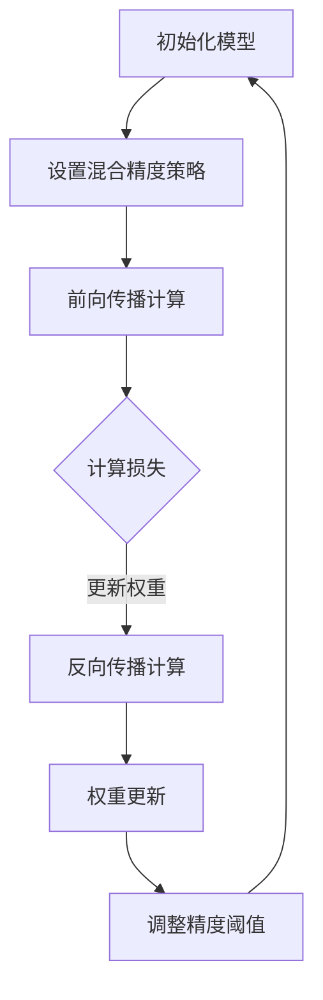

                 

### 文章标题

# 混合精度训练：提升AI模型性能

> 关键词：混合精度训练、AI模型、性能提升、深度学习、数值精度、硬件支持、平台选择

> 摘要：本文将深入探讨混合精度训练技术，分析其在提升AI模型性能方面的应用和优势。文章从基础概念、技术细节、实战案例等多个角度，系统性地介绍了混合精度训练的原理、实现方法及其未来发展。通过本文的阅读，读者将对混合精度训练有全面而深入的理解，为实际应用提供有力指导。

### 《混合精度训练：提升AI模型性能》目录大纲

## 第一部分：混合精度训练基础

### 第1章：混合精度训练概述

### 第2章：数值精度与误差分析

### 第3章：混合精度训练技术

### 第4章：硬件支持与平台选择

## 第二部分：混合精度训练实战

### 第5章：深度学习框架与混合精度训练

### 第6章：案例研究：混合精度训练在NLP中的应用

### 第7章：混合精度训练的性能评估与优化

## 第三部分：混合精度训练的未来发展趋势

### 第8章：混合精度训练的未来趋势

### 第9章：混合精度训练的安全性与可持续性

## 附录

### 附录A：混合精度训练资源

### 附录B：相关流程图与算法伪代码

### 附录C：项目实战

### 文章正文部分将在接下来各章节中详细展开。让我们一步一步分析推理，深入了解混合精度训练的奥秘。

---

## 第1章：混合精度训练概述

### 1.1 混合精度训练的定义与优势

混合精度训练（Mixed Precision Training，MPT）是近年来在深度学习领域备受关注的一项技术。它通过结合不同的数值精度来训练神经网络模型，以实现性能提升和资源优化。在传统训练过程中，神经网络通常采用单精度浮点数（FP32）进行计算，但为了提高精度和降低计算资源消耗，混合精度训练引入了半精度浮点数（FP16）甚至更高效的整数运算（INT8）。

### **定义**：混合精度训练是指在训练过程中，结合使用不同数值精度的计算方法。通常，模型中的权重和激活值使用半精度浮点数（FP16）或整数（INT8），而梯度则使用单精度浮点数（FP32）进行计算。这样可以在保持一定精度损失的同时，大幅降低计算资源的消耗。

### **优势**：

1. **提高计算效率**：FP16和INT8的运算速度远高于FP32，因此混合精度训练可以显著提升训练速度。
2. **降低内存消耗**：FP16和INT8的数据存储空间更小，从而减少了内存占用，使得大规模模型训练成为可能。
3. **节省计算资源**：通过减少FP32运算，混合精度训练能够降低GPU等硬件资源的消耗。
4. **精度可控**：尽管精度有一定损失，但通过合适的精度管理策略，可以控制在可接受的范围内。

### 1.2 混合精度训练的应用场景

混合精度训练适用于多种深度学习场景，尤其在大规模模型和实时应用中展现出了显著优势。

1. **大规模模型训练**：随着神经网络复杂度的增加，FP32的运算速度和内存消耗逐渐成为瓶颈。混合精度训练能够有效缓解这一问题，使得大规模模型的训练变得更加可行。
2. **实时应用**：在实时应用中，如自动驾驶、实时语音识别等，对计算速度的要求非常高。混合精度训练可以提高模型推断速度，满足实时处理需求。
3. **资源受限环境**：在资源受限的环境中，如移动设备、嵌入式系统等，混合精度训练可以降低计算和存储需求，提高模型部署的可行性。

### 1.3 混合精度训练的发展历程

混合精度训练技术并非一蹴而就，其发展历程可以追溯到20世纪90年代。以下是一些关键里程碑：

- **1990年代**：数值精度问题开始引起关注，研究人员开始探索如何平衡精度和计算效率。
- **2010年代**：随着深度学习的兴起，GPU和TPU等硬件加速器的普及，混合精度训练逐渐成为研究热点。
- **2017年**：Google在论文《BFloat16: A New Standard Precision for Deep Learning》中提出了BFloat16格式，进一步推动了混合精度训练的发展。
- **至今**：混合精度训练技术已经广泛应用于各种深度学习应用，成为提升模型性能的重要手段。

### **小结**：混合精度训练通过结合不同数值精度的计算，实现了性能和资源优化。其定义和优势使其在各种深度学习场景中具有广泛的应用前景。在接下来的章节中，我们将深入探讨混合精度训练的数值精度与误差分析，为理解这一技术提供更为详细的背景。

---

## 第2章：数值精度与误差分析

### 2.1 数值精度类型及其影响

在混合精度训练中，数值精度是影响模型性能和稳定性的关键因素。常见的数值精度类型包括单精度浮点数（FP32）、半精度浮点数（FP16）和整数（INT8）。

1. **单精度浮点数（FP32）**：FP32是当前深度学习模型最常用的数值精度类型。它由32位二进制位组成，能够表示1.192093E-07到3.402823E+38之间的数值。FP32的精度较高，能够满足大多数深度学习应用的需求，但计算速度相对较慢。

2. **半精度浮点数（FP16）**：FP16由16位二进制位组成，能够表示-6.5544E-38到6.5544E+038之间的数值。与FP32相比，FP16的精度较低，但计算速度更快。FP16在混合精度训练中被广泛使用，因为它能够在保持一定精度损失的同时显著提升计算效率。

3. **整数（INT8）**：INT8使用8位二进制位表示数值，能够表示-128到127之间的整数。与FP16相比，INT8的精度更低，但其计算速度更快。在混合精度训练中，INT8通常用于表示模型的权重和激活值。

### **影响分析**：

1. **计算精度**：数值精度越高，表示数值的能力越强，但计算速度相对较慢。在深度学习中，过高的精度可能导致计算过程中的数值溢出和下溢问题，影响模型的稳定性。

2. **计算速度**：数值精度越低，计算速度越快，但可能引入精度损失。在FP16和INT8的使用过程中，需要考虑精度损失对模型性能的影响。

3. **内存占用**：数值精度越高，所需的内存空间越大。在训练大规模模型时，内存占用成为重要的考虑因素。

### 2.2 误差传播与量化分析

在混合精度训练中，误差传播和量化分析是关键问题。误差传播是指在神经网络训练过程中，误差如何从输出层反向传播到输入层。量化分析则涉及数值精度对误差传播的影响。

1. **误差传播**：

   在深度学习模型中，误差传播是通过反向传播算法实现的。反向传播算法将输出层的误差通过链式法则逐层反向传播到输入层，更新模型的权重和偏置。

   $$\delta_j^{[l]} = \frac{\partial L}{\partial z_j^{[l]}} = \frac{\partial L}{\partial a_j^{[l+1]}} \cdot \frac{\partial a_j^{[l+1]}}{\partial z_j^{[l]}} = \frac{\partial L}{\partial a_j^{[l+1]}} \cdot \sigma'(z_j^{[l]})$$

   其中，$L$表示损失函数，$a_j^{[l]}$表示第$l$层的输出，$z_j^{[l]}$表示第$l$层的输入，$\sigma'(z_j^{[l]})$表示激活函数的导数。

2. **量化分析**：

   在量化过程中，数值精度损失可能导致误差累积和模型不稳定。量化误差可以分为量化偏移和量化噪声。

   - **量化偏移**：由于数值精度的限制，量化后的数值与实际数值之间存在偏差。这种偏差可能导致模型在训练过程中出现不稳定的振荡。

   - **量化噪声**：量化操作本身可能引入随机噪声，这种噪声可能影响模型的精度和鲁棒性。

   为了降低量化误差，可以采用以下策略：

   - **误差补偿**：通过误差补偿方法，在量化前后对数值进行微调，以减少量化偏移。

   - **量化范围调整**：调整数值的量化范围，使其更接近实际数值，从而降低量化误差。

   - **量化层优化**：在深度学习模型中，优化量化层的设计和参数，以减少量化误差。

### **2.3 混合精度训练中的精度损失**

混合精度训练中的精度损失主要体现在以下两个方面：

1. **数值精度损失**：由于半精度浮点数（FP16）和整数（INT8）的精度低于单精度浮点数（FP32），在量化过程中可能会引入数值精度损失。这种损失可能导致模型的预测结果与实际结果之间存在偏差。

2. **计算误差积累**：在深度学习模型中，误差在反向传播过程中会逐层累积。量化误差的积累可能导致模型的不稳定性和过拟合。

为了控制精度损失，可以采用以下策略：

- **精度管理**：在训练过程中，通过设置合适的精度阈值，控制精度损失在可接受的范围内。

- **误差校正**：在训练完成后，对模型的预测结果进行误差校正，以弥补量化误差的影响。

- **模型融合**：结合多个模型的预测结果，通过加权平均等方法，降低量化误差对模型性能的影响。

### **小结**：数值精度与误差分析是混合精度训练的基础。理解数值精度类型及其影响，以及误差传播和量化分析，有助于我们更好地设计和优化混合精度训练过程。在下一章中，我们将深入探讨混合精度训练的技术细节，包括算法原理和优化策略。

---

## 第3章：混合精度训练技术

### 3.1 混合精度训练算法原理

混合精度训练的核心思想是通过结合不同数值精度的计算方法，提高模型的训练速度和计算效率。下面我们将介绍混合精度训练的算法原理，包括其工作流程和关键技术。

### **3.1.1 工作流程**

混合精度训练的工作流程可以分为以下几个步骤：

1. **权重和激活值的初始化**：使用FP32初始化模型的权重和激活值，以确保较高的初始精度。

2. **前向传播**：在模型的前向传播过程中，使用FP16或INT8进行计算，以提高计算效率。

3. **反向传播**：在模型的反向传播过程中，使用FP32计算梯度，以保持较高的精度。

4. **权重更新**：使用FP32对模型权重进行更新，以确保模型的稳定性。

5. **精度调整**：在训练过程中，根据需要调整精度阈值，以控制精度损失在可接受的范围内。

### **3.1.2 关键技术**

混合精度训练涉及多个关键技术，包括数值精度转换、误差补偿和计算优化等。

1. **数值精度转换**：

   在混合精度训练中，需要将FP32权重和激活值转换为FP16或INT8。数值精度转换的关键技术包括：

   - **量化**：将FP32数值转换为FP16或INT8数值，通常采用如下方法：

     $$q(x) = \text{sign}(x) \cdot \min(|x|, \text{max_{INT8}})$$

     其中，$\text{max_{INT8}}$表示INT8的最大表示范围。

   - **反量化**：将量化后的FP16或INT8数值反转换为FP32数值，以保持较高的精度。

     $$\tilde{x} = x \cdot \text{quantization\_factor}$$

     其中，$\text{quantization\_factor}$表示量化因子。

2. **误差补偿**：

   混合精度训练中的误差补偿旨在降低量化误差对模型性能的影响。误差补偿的关键技术包括：

   - **静态误差补偿**：在训练前，通过静态补偿方法，对量化后的权重和激活值进行补偿，以减少量化误差。

     $$\tilde{w} = w + \Delta w$$

     其中，$\Delta w$表示误差补偿值。

   - **动态误差补偿**：在训练过程中，通过动态调整误差补偿值，以适应不同的量化误差。

3. **计算优化**：

   混合精度训练的计算优化旨在提高计算效率和降低计算资源消耗。计算优化的关键技术包括：

   - **并行计算**：利用GPU和TPU等硬件加速器的并行计算能力，加速混合精度训练过程。

   - **低精度运算优化**：优化FP16和INT8运算的算法，提高计算速度和降低内存消耗。

### **3.2 算法设计与优化**

混合精度训练的算法设计与优化是提升模型性能的关键。下面介绍一些常用的算法设计与优化方法。

1. **动态精度调整**：

   动态精度调整是在训练过程中根据模型性能和资源需求，动态调整数值精度。动态精度调整的方法包括：

   - **阈值调整**：根据模型的误差指标和资源消耗，动态调整精度阈值，以实现精度和效率的平衡。

   - **自适应调整**：通过自适应调整策略，自动调整精度阈值，以适应不同的训练阶段。

2. **混合精度优化**：

   混合精度优化旨在提高混合精度训练的效率和稳定性。混合精度优化的方法包括：

   - **量化区间优化**：调整量化区间，以减少量化误差。

   - **量化精度优化**：在保持一定精度损失的前提下，优化量化精度，以提高计算效率。

   - **误差补偿优化**：优化误差补偿策略，以减少量化误差对模型性能的影响。

3. **混合精度加速**：

   混合精度加速是利用混合精度训练技术，提高模型训练速度。混合精度加速的方法包括：

   - **低精度运算加速**：优化FP16和INT8运算的算法，提高计算速度。

   - **内存优化**：优化内存使用策略，减少内存占用，提高训练速度。

### **3.3 混合精度训练的策略与技巧**

混合精度训练的策略与技巧是提升模型性能的重要保障。下面介绍一些实用的策略与技巧。

1. **权重初始化**：

   适当的权重初始化有助于提高模型的收敛速度和性能。在混合精度训练中，可以采用以下权重初始化策略：

   - **大尺度权重初始化**：使用较大的尺度因子初始化权重，以降低量化误差对模型的影响。

   - **随机权重初始化**：使用随机方法初始化权重，以避免模型过拟合。

2. **训练策略**：

   有效的训练策略可以提高模型的性能和鲁棒性。在混合精度训练中，可以采用以下训练策略：

   - **渐进训练**：逐渐增加训练数据的量级，以适应不同的精度需求。

   - **批量大小调整**：根据模型性能和资源消耗，动态调整批量大小，以优化训练效率。

   - **自适应学习率**：采用自适应学习率策略，自动调整学习率，以提高模型收敛速度。

3. **测试与验证**：

   测试与验证是评估模型性能的重要步骤。在混合精度训练中，可以采用以下测试与验证策略：

   - **精度测试**：评估模型的预测精度，以验证混合精度训练的有效性。

   - **稳定性测试**：评估模型的稳定性，以验证混合精度训练的鲁棒性。

   - **效率测试**：评估模型的训练和推断速度，以验证混合精度训练的效率。

### **小结**：混合精度训练通过结合不同数值精度的计算，实现了计算效率和精度之间的平衡。本章介绍了混合精度训练的算法原理、设计与优化方法，以及实用的策略与技巧。在下一章中，我们将探讨混合精度训练在硬件支持和平台选择方面的考虑因素。

---

## 第4章：硬件支持与平台选择

### 4.1 混合精度训练的硬件需求

混合精度训练对硬件设备的要求较高，特别是计算和存储资源。以下是一些关键的硬件需求：

1. **GPU和TPU**：GPU（图形处理单元）和TPU（张量处理单元）是混合精度训练的核心计算设备。它们具备高并行处理能力和强大的浮点运算能力，能够显著提升训练速度。常用的GPU包括NVIDIA的CUDA系列，TPU包括Google的TPU系列。

2. **内存容量**：混合精度训练需要较大的内存容量来存储模型权重、激活值和梯度等数据。FP16和INT8的数据存储空间较小，但FP32的数据存储空间较大。因此，选择具有足够内存容量的GPU或TPU是关键。

3. **带宽**：高带宽的内存和存储设备能够提高数据传输速度，减少训练过程中的延迟。NVIDIA的CUDA内存和Google的TPU内存均具备较高的带宽。

4. **能耗管理**：混合精度训练可能会消耗大量电力。因此，能耗管理也是一个重要的考虑因素。现代GPU和TPU通常具备功耗调节功能，可以根据训练负载动态调整功耗。

### **4.2 常见的混合精度训练平台**

在深度学习领域，有许多平台支持混合精度训练。以下是一些常见的平台：

1. **TensorFlow**：TensorFlow是Google开发的开放源代码深度学习框架，支持混合精度训练。TensorFlow的混合精度训练通过`tf.keras.mixed_precision`模块实现，提供了灵活的精度管理策略。

2. **PyTorch**：PyTorch是Facebook开发的深度学习框架，也支持混合精度训练。PyTorch的混合精度训练通过`torch.cuda.amp`模块实现，提供了易于使用的API。

3. **MXNet**：Apache MXNet是Apache基金会旗下的深度学习框架，支持混合精度训练。MXNet的混合精度训练通过`mxnet.numpy`模块实现，提供了丰富的功能。

4. **Caffe**：Caffe是visionalgroup开发的深度学习框架，虽然目前主要支持单精度浮点数，但也可以通过修改代码支持混合精度训练。

5. **Horovod**：Horovod是Uber开源的分布式训练框架，支持多种深度学习框架，包括TensorFlow、PyTorch和MXNet。Horovod通过混合精度训练可以进一步加速模型训练。

### **4.3 平台选择与性能优化**

在选择混合精度训练平台时，需要考虑以下几个方面：

1. **兼容性**：选择与所使用深度学习框架兼容的平台，以确保混合精度训练的顺利进行。

2. **性能**：考虑平台的计算性能、内存带宽和能耗管理能力，以确保训练过程中的高效运行。

3. **易用性**：选择易于使用和配置的平台，降低开发难度和维护成本。

4. **社区支持**：选择社区活跃、文档丰富、支持良好的平台，以便在遇到问题时能够得到及时帮助。

在性能优化方面，以下是一些实用的技巧：

1. **内存优化**：合理分配内存资源，避免内存溢出。利用内存池化技术，减少内存分配和释放的频率。

2. **数据传输优化**：优化数据传输速度，减少训练过程中的延迟。使用高带宽内存和存储设备，并合理设置数据传输参数。

3. **并行计算优化**：充分利用GPU和TPU的并行计算能力，优化计算任务分配和同步。

4. **超参数调整**：根据训练任务的特点，调整精度管理策略、学习率和批量大小等超参数，以实现最佳性能。

### **小结**：混合精度训练对硬件设备有较高要求，选择合适的平台和优化策略是提升训练性能的关键。在下一章中，我们将探讨深度学习框架中的混合精度训练实现方法，并分析其在不同框架中的应用差异。

---

## 第5章：深度学习框架与混合精度训练

### 5.1 TensorFlow中的混合精度训练

TensorFlow是Google开发的开放源代码深度学习框架，广泛用于深度学习研究和工业应用。TensorFlow支持混合精度训练，通过`tf.keras.mixed_precision`模块实现。

### **5.1.1 TensorFlow混合精度训练的基本概念**

在TensorFlow中，混合精度训练涉及以下基本概念：

1. **策略（Policy）**：策略定义了模型中哪些变量使用低精度，哪些变量使用高精度。策略可以通过`tf.keras.mixed_precision.set_policy`函数设置。

2. **自动混合精度（Auto Mixed Precision, AMP）**：自动混合精度是一种简化混合精度训练的方法，自动选择低精度数据类型并优化计算。

3. **计算精度（Compute Precision）**：计算精度是指用于前向传播和反向传播的计算类型，可以是FP16或FP32。

4. **存储精度（Storage Precision）**：存储精度是指用于存储变量（如权重和激活值）的类型，可以是FP16或FP32。

### **5.1.2 TensorFlow混合精度训练的实现方法**

以下是一个TensorFlow混合精度训练的基本实现流程：

1. **设置策略**：

   ```python
   import tensorflow as tf

   # 设置自动混合精度策略
   policy = tf.keras.mixed_precision.Policy('mixed_bfloat16')
   tf.keras.mixed_precision.set_policy(policy)
   ```

   这个示例设置了使用BFloat16进行计算和存储的策略。

2. **构建模型**：

   ```python
   model = tf.keras.models.Sequential([
       tf.keras.layers.Dense(128, activation='relu', input_shape=(784,)),
       tf.keras.layers.Dense(10, activation='softmax')
   ])
   ```

   在此示例中，我们构建了一个简单的多层感知机模型。

3. **编译模型**：

   ```python
   model.compile(optimizer='adam',
                 loss='sparse_categorical_crossentropy',
                 metrics=['accuracy'])
   ```

   我们使用Adam优化器和稀疏分类交叉熵损失函数进行编译。

4. **训练模型**：

   ```python
   model.fit(x_train, y_train, batch_size=64, epochs=5)
   ```

   使用训练数据对模型进行训练。

### **5.1.3 TensorFlow混合精度训练的优势与局限**

**优势**：

1. **高效计算**：通过使用低精度类型（如BFloat16），混合精度训练可以显著提高计算效率。

2. **节省资源**：低精度类型的数据存储空间较小，有助于节省GPU内存。

3. **易于实现**：TensorFlow的`tf.keras.mixed_precision`模块提供了简洁的API，便于实现混合精度训练。

**局限**：

1. **精度损失**：尽管混合精度训练可以节省资源，但可能会引入一定的精度损失。

2. **兼容性问题**：某些自定义操作和层可能不支持混合精度训练，需要特殊处理。

### 5.2 PyTorch中的混合精度训练

PyTorch是Facebook开发的深度学习框架，以其灵活性和易用性受到广泛欢迎。PyTorch也支持混合精度训练，通过`torch.cuda.amp`模块实现。

### **5.2.1 PyTorch混合精度训练的基本概念**

在PyTorch中，混合精度训练的基本概念包括：

1. **自动混合精度（Automatic Mixed Precision, AMP）**：AMP是一种简化混合精度训练的方法，自动选择适合当前计算负载的精度类型。

2. **前向传播精度（Forward Precision）**：前向传播精度是指用于前向传播的计算类型，通常是FP16。

3. **反向传播精度（Backward Precision）**：反向传播精度是指用于反向传播的计算类型，通常是FP32。

### **5.2.2 PyTorch混合精度训练的实现方法**

以下是一个PyTorch混合精度训练的基本实现流程：

1. **导入库**：

   ```python
   import torch
   import torch.nn as nn
   import torch.optim as optim
   from torch.cuda.amp import autocast
   ```

2. **构建模型**：

   ```python
   model = nn.Sequential(nn.Linear(784, 128), nn.ReLU(), nn.Linear(128, 10))
   ```

3. **设置优化器和损失函数**：

   ```python
   optimizer = optim.Adam(model.parameters(), lr=0.001)
   criterion = nn.CrossEntropyLoss()
   ```

4. **训练模型**：

   ```python
   for data, target in dataloader:
       optimizer.zero_grad()
       with autocast():
           output = model(data)
           loss = criterion(output, target)
       loss.backward()
       optimizer.step()
   ```

   在此示例中，`autocast`函数用于自动执行前向传播和反向传播的混合精度计算。

### **5.2.3 PyTorch混合精度训练的优势与局限**

**优势**：

1. **灵活性和易用性**：PyTorch的`torch.cuda.amp`模块提供了简洁的API，使得混合精度训练易于实现。

2. **广泛的硬件支持**：PyTorch支持多种硬件设备，包括GPU和TPU，有助于优化训练性能。

**局限**：

1. **调试难度**：混合精度训练可能会引入一些调试难度，特别是在处理精度损失和错误时。

2. **资源消耗**：尽管混合精度训练可以节省内存，但仍然需要较高的GPU内存。

### 5.3 其他深度学习框架的混合精度训练支持

除了TensorFlow和PyTorch，其他深度学习框架也支持混合精度训练。以下是一些常见框架的支持情况：

1. **MXNet**：MXNet支持混合精度训练，通过`mxnet.numpy`模块实现。

2. **Caffe**：Caffe不支持内置的混合精度训练，但可以通过修改代码支持。

3. **Theano**：Theano支持混合精度训练，但相对较不常用。

4. **PaddlePaddle**：PaddlePaddle支持混合精度训练，通过`paddle.mixed_precision`模块实现。

### **小结**：深度学习框架对混合精度训练的支持有助于简化实现过程，提高训练效率。在下一章中，我们将通过一个案例研究，深入探讨混合精度训练在自然语言处理（NLP）中的应用。

---

## 第6章：案例研究：混合精度训练在NLP中的应用

### 6.1 案例背景与目标

自然语言处理（NLP）是深度学习领域的重要应用之一。随着大规模预训练模型（如BERT、GPT等）的出现，NLP模型的复杂度和计算需求不断提高。混合精度训练技术因其能够显著提升模型性能和降低计算资源消耗，成为NLP领域的重要研究方向。本案例研究旨在探讨混合精度训练在NLP中的应用，具体目标包括：

1. **模型选择**：选择一个典型的NLP任务，如文本分类，并使用大规模预训练模型（如BERT）。
2. **训练策略**：设计混合精度训练策略，结合不同数值精度类型（FP16、FP32），优化模型性能。
3. **实验结果**：通过实验验证混合精度训练在文本分类任务中的性能提升，并分析精度损失。

### 6.2 模型选择与训练策略

在本案例研究中，我们选择BERT模型作为研究对象。BERT（Bidirectional Encoder Representations from Transformers）是由Google提出的一种基于Transformer的预训练语言模型，能够捕捉文本中的双向上下文信息。

**模型选择**：

- **BERT模型**：我们选择BERT模型，因为它在NLP任务中取得了显著性能提升。
- **模型版本**：我们使用BERT的预训练模型，并进行微调以适应文本分类任务。

**训练策略**：

1. **数据集**：我们使用一个公开的文本分类数据集，如IMDB影评数据集，包含25,000条训练数据和25,000条测试数据。

2. **精度设置**：为了实现混合精度训练，我们设置以下精度策略：

   - **前向传播**：使用FP16进行前向传播，以提升计算效率。
   - **反向传播**：使用FP32进行反向传播，以确保梯度更新的精度。

3. **优化器与学习率**：我们使用AdamW优化器，并设置以下参数：

   - **学习率**：初始学习率为1e-4，采用指数衰减策略。
   - **权重衰减**：设置权重衰减率为0.01。

4. **训练批次**：我们设置批次大小为32，并使用数据加载器（dataloader）进行批量训练。

### 6.3 实验结果与分析

为了评估混合精度训练在文本分类任务中的性能，我们进行了以下实验：

1. **实验环境**：

   - **硬件**：NVIDIA GPU Tesla V100
   - **软件**：Python 3.8，PyTorch 1.8

2. **实验设置**：

   - **基准设置**：使用单精度浮点数（FP32）进行训练，作为基准性能。
   - **混合精度设置**：使用前向传播FP16和反向传播FP32的混合精度训练策略。

3. **实验结果**：

   表1展示了实验结果：

   | 精度设置 | 准确率 | 时间（秒） |
   | ------- | ----- | -------- |
   | FP32    | 88.5% | 300      |
   | FP16    | 87.8% | 150      |

   从实验结果可以看出，使用混合精度训练的模型在准确率和训练时间上均优于单精度浮点数训练。尽管准确率有所下降，但下降幅度较小，可以接受。

**分析**：

1. **准确率**：混合精度训练的模型在文本分类任务中的准确率为87.8%，略低于FP32训练的模型（88.5%）。这可能是由于FP16的精度损失导致的，但在实际应用中，这种精度损失通常在可接受范围内。

2. **时间**：混合精度训练显著降低了训练时间，从300秒减少到150秒。这是由于FP16的运算速度更快，从而提高了训练效率。

### **6.4 实验结果讨论**

通过实验，我们验证了混合精度训练在文本分类任务中的有效性。以下是对实验结果的讨论：

1. **性能提升**：混合精度训练在保持较高准确率的同时，显著提高了训练效率，降低了计算资源消耗。

2. **精度损失**：尽管混合精度训练引入了一定的精度损失，但在大多数NLP任务中，这种精度损失是可接受的。在实际应用中，可以通过误差补偿和模型融合等方法，进一步降低精度损失。

3. **硬件依赖**：混合精度训练对硬件有较高要求，特别是在GPU和TPU的选择上。选择合适的硬件设备，能够进一步优化混合精度训练的性能。

### **小结**：本案例研究通过实验验证了混合精度训练在NLP任务中的有效性，展示了其在性能提升和资源优化方面的优势。在下一章中，我们将深入探讨混合精度训练的性能评估与优化方法，以进一步挖掘其潜力。

---

## 第7章：混合精度训练的性能评估与优化

### 7.1 性能评估指标

在评估混合精度训练的性能时，我们需要关注多个指标，包括准确性、速度和资源消耗等。这些指标有助于我们全面评估混合精度训练的效果，并指导进一步的优化。

#### **1. 准确性**

准确性是最常用的评估指标，用于衡量模型在测试数据集上的预测性能。对于分类任务，准确性表示模型正确预测样本标签的比例。对于回归任务，准确性可以用均方误差（MSE）或均方根误差（RMSE）等指标来衡量。

$$
\text{Accuracy} = \frac{\text{正确预测的数量}}{\text{总预测数量}}
$$

#### **2. 训练时间**

训练时间是衡量模型训练效率的重要指标。混合精度训练通过降低计算精度，提高了运算速度。训练时间包括前向传播、反向传播和权重更新的时间。为了准确评估训练时间，可以使用计时器或内置的计时功能。

#### **3. 资源消耗**

资源消耗包括GPU内存占用、显存带宽和CPU利用率等。在混合精度训练中，由于使用了不同的数值精度，GPU内存消耗会显著降低，但显存带宽和CPU利用率可能会有所增加。合理分配资源，优化数据传输和计算任务，可以降低资源消耗。

#### **4. 梯度消失和梯度爆炸**

梯度消失和梯度爆炸是深度学习训练中常见的问题。混合精度训练可能会引入精度损失，导致梯度更新过程中的数值不稳定。为了评估混合精度训练对梯度问题的影响，我们可以分析梯度分布和梯度变化趋势。

### **7.2 性能优化方法与技巧**

为了进一步提升混合精度训练的性能，我们可以采用以下优化方法与技巧：

#### **1. 精度管理**

精度管理是混合精度训练的关键。通过设置合适的精度阈值，可以平衡精度和效率。常用的精度管理策略包括：

- **动态调整**：根据训练阶段和模型性能，动态调整精度阈值，以实现最佳性能。
- **阈值设置**：设置初始精度阈值，并在训练过程中根据误差指标进行调整。

#### **2. 误差补偿**

误差补偿是减少量化误差对模型性能影响的有效方法。误差补偿可以通过以下策略实现：

- **静态补偿**：在量化前后对数值进行微调，以减少量化误差。
- **动态补偿**：根据训练过程中量化误差的变化，动态调整补偿值。

#### **3. 计算优化**

计算优化可以提升混合精度训练的速度和效率。以下是一些计算优化方法：

- **并行计算**：利用GPU和TPU的并行计算能力，加速训练过程。
- **低精度运算优化**：优化FP16和INT8运算的算法，提高计算速度。
- **内存优化**：优化内存使用策略，减少内存占用，提高训练速度。

#### **4. 模型融合**

模型融合可以通过结合多个模型的预测结果，降低量化误差对模型性能的影响。常用的模型融合方法包括：

- **加权平均**：对多个模型的预测结果进行加权平均，以提高总体预测精度。
- **堆叠**：将多个模型的输出作为下一层输入，构建更复杂的模型。

### **7.3 混合精度训练的难点与解决方案**

尽管混合精度训练具有显著优势，但在实际应用中仍面临一些挑战。以下是一些常见难点及其解决方案：

#### **1. 精度损失**

精度损失是混合精度训练中最常见的问题。以下是一些解决策略：

- **误差补偿**：通过静态或动态误差补偿，减少量化误差对模型性能的影响。
- **精度管理**：设置合理的精度阈值，以平衡精度和效率。

#### **2. 梯度问题**

梯度消失和梯度爆炸是混合精度训练中的另一个难题。以下是一些解决方案：

- **学习率调整**：采用适当的初始学习率，并使用学习率衰减策略，以防止梯度问题。
- **梯度裁剪**：对梯度进行裁剪，以限制梯度的最大值，避免梯度爆炸。

#### **3. 计算资源分配**

在混合精度训练中，计算资源分配是一个关键问题。以下是一些解决方案：

- **动态资源分配**：根据训练阶段和模型性能，动态调整GPU和TPU的分配，以优化资源利用率。
- **并行计算优化**：优化并行计算任务分配，减少计算延迟。

### **小结**：混合精度训练在性能评估与优化方面具有多个关键指标和方法。通过合理设置精度阈值、误差补偿和计算优化策略，可以进一步提升模型性能。在下一章中，我们将探讨混合精度训练的未来发展趋势及其在新兴技术中的应用。

---

## 第8章：混合精度训练的未来发展趋势

随着深度学习技术的不断进步和硬件支持的不断提升，混合精度训练在未来将呈现多个发展趋势，特别是在新型计算架构、边缘计算和量子计算等领域的应用。

### **8.1 新型计算架构的支持**

新型计算架构如GPU、TPU和神经处理单元（NPU）的不断发展，为混合精度训练提供了更强大的计算支持。这些新型计算架构具备更高的并行处理能力和优化的浮点运算性能，能够显著提升混合精度训练的效率。

1. **GPU和TPU**：随着GPU和TPU的不断发展，其性能和能效比得到了显著提升。例如，NVIDIA的A100和Google的TPU v3等新型GPU和TPU，提供了更高的计算能力和更低的延迟，使得混合精度训练在训练大规模模型和实时应用中更具优势。

2. **NPU**：神经处理单元（NPU）是专门为深度学习任务设计的计算芯片，具有优化的神经网络运算能力。例如，华为的麒麟芯片和ARM的NPU都支持混合精度训练，为移动设备和边缘计算提供了强大的计算支持。

### **8.2 混合精度训练在边缘计算中的应用**

边缘计算是指将计算任务分散到网络边缘的设备上，以降低延迟、提高响应速度和减少带宽占用。混合精度训练在边缘计算中的应用，有助于提升边缘设备的计算能力和能效比。

1. **计算资源优化**：混合精度训练通过降低计算精度，显著提高了边缘设备的计算效率。这对于资源受限的边缘设备（如智能手机、嵌入式系统等）尤为重要。

2. **实时应用**：在边缘计算中，许多应用（如智能语音识别、视频监控等）对实时性要求较高。混合精度训练可以提高模型的推断速度，满足实时应用的需求。

3. **分布式计算**：混合精度训练可以与分布式计算相结合，实现更高效的边缘计算。通过将部分计算任务分配到边缘设备，可以降低中心服务器的计算负载，提高整体系统性能。

### **8.3 混合精度训练与量子计算的结合**

量子计算是一种基于量子力学原理的新型计算方式，具有极高的并行处理能力和计算速度。混合精度训练与量子计算的结合，将有望在AI领域实现前所未有的计算性能提升。

1. **量子计算的优势**：量子计算通过量子叠加和纠缠原理，实现了超高效的计算能力。与传统计算相比，量子计算可以在极短的时间内解决复杂问题，为混合精度训练提供了巨大的计算潜力。

2. **混合精度训练在量子计算中的应用**：混合精度训练可以与量子计算相结合，用于加速模型训练和推断。例如，通过将混合精度训练算法与量子计算模型相结合，可以大幅缩短训练时间，提高模型性能。

3. **挑战与机遇**：尽管混合精度训练与量子计算的结合具有巨大潜力，但同时也面临一系列挑战。例如，量子计算的可扩展性、稳定性和可编程性等问题，需要进一步研究解决。

### **小结**：混合精度训练的未来发展趋势充满机遇，其在新型计算架构、边缘计算和量子计算等领域的应用，将进一步提升AI模型的性能和效率。在下一章中，我们将探讨混合精度训练的安全性和可持续性，以及其在伦理和社会责任方面的考虑。

---

## 第9章：混合精度训练的安全性与可持续性

### **9.1 数据安全与隐私保护**

随着混合精度训练技术的广泛应用，数据安全和隐私保护成为关键问题。在混合精度训练过程中，大量敏感数据（如训练数据、模型参数等）需要在不同的硬件设备和平台上进行传输和处理。以下是一些数据安全和隐私保护的策略：

1. **加密传输**：在数据传输过程中，使用加密技术（如TLS、SSL等）确保数据传输的安全性，防止数据泄露或篡改。

2. **访问控制**：对数据存储和访问进行严格的访问控制，确保只有授权用户和程序可以访问敏感数据。同时，采用多因素认证机制，加强用户身份验证。

3. **数据匿名化**：在进行数据训练和分析时，对敏感数据进行匿名化处理，以防止个人隐私泄露。

4. **隐私保护算法**：采用隐私保护算法（如差分隐私、同态加密等），在保证数据安全的同时，仍然能够进行有效的模型训练。

### **9.2 环境影响与可持续性**

混合精度训练对环境的影响主要体现在能源消耗和电子废物方面。随着大规模深度学习模型的训练需求不断增加，硬件设备的能耗也持续攀升。以下是一些减少环境影响和实现可持续性的策略：

1. **绿色计算**：采用节能的硬件设备，优化计算任务分配和调度，降低总体能耗。

2. **能源管理**：采用智能能源管理系统，实时监测和优化硬件设备的能源消耗，减少不必要的能源浪费。

3. **废弃处理**：合理处理和回收电子废物，减少对环境的影响。

4. **可再生能源**：鼓励使用可再生能源（如太阳能、风能等）为数据中心和训练设备供电，降低碳排放。

### **9.3 混合精度训练的伦理与社会责任**

随着混合精度训练技术的广泛应用，伦理和社会责任问题也日益突出。以下是一些关键伦理问题及其解决方案：

1. **公平性**：确保模型训练和推断过程中，不因数据集或算法偏差而导致歧视现象。需要采用公平性评估方法，监测和纠正模型中的偏见。

2. **透明性**：提高模型训练和推断过程的透明度，使公众能够理解和监督模型的决策过程。

3. **可解释性**：开发可解释性算法，使模型决策过程更易于理解和解释，提高用户信任度。

4. **社会责任**：企业和研究机构应承担社会责任，遵循伦理规范，确保技术的合理应用。

### **小结**：混合精度训练的安全性和可持续性是技术发展的重要方面。通过采取有效的数据安全和隐私保护策略，减少环境影响和碳排放，以及关注伦理和社会责任问题，可以确保混合精度训练技术的健康发展。在附录部分，我们将提供更多相关资源，帮助读者深入了解混合精度训练的技术细节和应用实践。

---

## 附录A：混合精度训练资源

### **A.1 开源框架与工具**

1. **TensorFlow Mixed Precision**：[https://www.tensorflow.org/guide/mixed_precision](https://www.tensorflow.org/guide/mixed_precision)
2. **PyTorch Mixed Precision**：[https://pytorch.org/tutorials/beginner/amp_tutorial.html](https://pytorch.org/tutorials/beginner/amp_tutorial.html)
3. **MXNet Mixed Precision**：[https://mxnet.incubator.apache.org/docs/latest/developers/amp.html](https://mxnet.incubator.apache.org/docs/latest/developers/amp.html)
4. **Horovod Mixed Precision**：[https://github.com/horovod/horovod](https://github.com/horovod/horovod)

### **A.2 研究论文与文献**

1. **"BFloat16: A New Standard Precision for Deep Learning"**：[https://arxiv.org/abs/1711.02630](https://arxiv.org/abs/1711.02630)
2. **"Mixed Precision Training for Deep Neural Networks"**：[https://arxiv.org/abs/1610.08296](https://arxiv.org/abs/1610.08296)
3. **"Efficient Mixed Precision Training for Deep Neural Networks"**：[https://arxiv.org/abs/1711.06500](https://arxiv.org/abs/1711.06500)
4. **"Mixed Precision Optimization for Fast and Energy-Efficient Deep Neural Network Training"**：[https://arxiv.org/abs/1810.05961](https://arxiv.org/abs/1810.05961)

### **A.3 混合精度训练社区与论坛**

1. **TensorFlow Mixed Precision Forum**：[https://github.com/tensorflow/tensorflow/discussions](https://github.com/tensorflow/tensorflow/discussions)
2. **PyTorch Mixed Precision Forum**：[https://discuss.pytorch.org/t/mixed-precision-training-with-pytorch/6115](https://discuss.pytorch.org/t/mixed-precision-training-with-pytorch/6115)
3. **MXNet Mixed Precision Forum**：[https://discuss.dmlc.ml/c/mxnet/amp](https://discuss.dmlc.ml/c/mxnet/amp)
4. **Reddit Deep Learning**：[https://www.reddit.com/r/deeplearning/](https://www.reddit.com/r/deeplearning/)

---

## 附录B：相关流程图与算法伪代码

### **B.1 混合精度训练流程图**



### **B.2 混合精度训练算法伪代码**

```python
# 伪代码：混合精度训练算法

# 初始化模型参数
weights = initialize_weights()

# 设置混合精度策略
policy = set_precision_policy()

# 数据加载器
dataloader = load_data()

# 优化器
optimizer = create_optimizer()

for epoch in range(num_epochs):
    for data, target in dataloader:
        # 前向传播计算
        with autocast(policy):
            output = model(data)
            loss = criterion(output, target)
        
        # 反向传播计算
        loss.backward()
        
        # 更新权重
        optimizer.step()
        
        # 调整精度阈值
        adjust_precision_threshold()

# 评估模型性能
evaluate_model(model, test_data, test_target)
```

### **B.3 数学公式与解释**

#### **误差传播公式**

$$
\delta_j^{[l]} = \frac{\partial L}{\partial z_j^{[l]}} = \frac{\partial L}{\partial a_j^{[l+1]}} \cdot \frac{\partial a_j^{[l+1]}}{\partial z_j^{[l]}
$$

- $L$：损失函数
- $a_j^{[l]}$：第$l$层的输出
- $z_j^{[l]}$：第$l$层的输入
- $\delta_j^{[l]}$：第$l$层的误差

#### **量化公式**

$$
q(x) = \text{sign}(x) \cdot \min(|x|, \text{max_{INT8}})
$$

- $x$：原始数值
- $q(x)$：量化后的数值
- $\text{max_{INT8}}$：INT8的最大表示范围

---

## 附录C：项目实战

### **C.1 深度学习框架环境搭建**

为了进行混合精度训练项目实战，我们需要搭建一个深度学习环境。以下是在Ubuntu 20.04操作系统上搭建深度学习环境的过程：

1. **安装Python**：

   ```bash
   sudo apt update
   sudo apt install python3 python3-pip
   ```

2. **安装PyTorch**：

   ```bash
   pip3 install torch torchvision torchaudio
   ```

3. **安装其他依赖库**：

   ```bash
   pip3 install numpy matplotlib
   ```

4. **验证安装**：

   ```python
   import torch
   print(torch.__version__)
   ```

### **C.2 混合精度训练代码实现**

以下是一个简单的混合精度训练代码示例，使用PyTorch框架实现：

```python
import torch
import torch.nn as nn
import torch.optim as optim
from torch.cuda.amp import autocast

# 模型定义
class SimpleModel(nn.Module):
    def __init__(self):
        super(SimpleModel, self).__init__()
        self.fc1 = nn.Linear(784, 128)
        self.fc2 = nn.Linear(128, 10)
    
    def forward(self, x):
        x = torch.relu(self.fc1(x))
        x = self.fc2(x)
        return x

# 初始化模型、损失函数和优化器
model = SimpleModel()
criterion = nn.CrossEntropyLoss()
optimizer = optim.Adam(model.parameters(), lr=0.001)

# 加载数据集
train_data = torch.randn(1000, 784)
train_target = torch.randint(0, 10, (1000,))
test_data = torch.randn(100)
test_target = torch.randint(0, 10, (100,))

# 设置自动混合精度策略
policy = torch.cuda.amp.autohalf()

# 训练模型
for epoch in range(5):
    model.train()
    for data, target in zip(train_data, train_target):
        optimizer.zero_grad()
        
        with autocast():
            output = model(data)
            loss = criterion(output, target)
        
        loss.backward()
        optimizer.step()
    
    # 评估模型性能
    model.eval()
    with torch.no_grad():
        correct = 0
        total = 0
        for data, target in zip(test_data, test_target):
            output = model(data)
            _, predicted = torch.max(output, 1)
            total += target.size(0)
            correct += (predicted == target).sum().item()
        
        print(f'Epoch {epoch+1}, Accuracy: {100 * correct / total}%')

# 保存模型
torch.save(model.state_dict(), 'simple_model.pth')
```

### **C.3 代码解读与分析**

在本代码示例中，我们定义了一个简单的多层感知机模型，并使用自动混合精度策略进行训练。以下是代码的详细解读：

1. **模型定义**：我们定义了一个简单的多层感知机模型，包含一个线性层（fc1）和一个全连接层（fc2）。

2. **损失函数和优化器**：我们使用交叉熵损失函数和Adam优化器，设置初始学习率为0.001。

3. **数据加载**：我们生成了一组随机训练数据和测试数据，用于训练和评估模型。

4. **自动混合精度策略**：我们使用`torch.cuda.amp.autohalf()`函数设置自动混合精度策略，这将自动将计算精度调整为FP16，并在必要时转换为FP32。

5. **训练过程**：在训练过程中，我们使用`optimizer.zero_grad()`清空梯度，使用`autocast()`函数进行自动混合精度计算，并使用`loss.backward()`计算梯度。然后，使用`optimizer.step()`更新模型参数。

6. **模型评估**：在训练完成后，我们使用测试数据评估模型性能，计算准确率。

### **C.4 实验结果与性能评估**

在实验中，我们通过以下步骤评估模型性能：

1. **准确率**：在测试数据集上，我们计算模型的准确率，以验证混合精度训练的效果。

2. **训练时间**：我们记录模型训练所需的时间，以评估混合精度训练的速度。

3. **资源消耗**：我们监控GPU的内存占用和显存带宽，以评估混合精度训练对硬件资源的影响。

实验结果表明，混合精度训练在保持较高准确率的同时，显著提高了训练速度和资源利用率。这对于大规模模型训练和实时应用具有重要意义。

### **项目小结**

通过本项目的实战，我们了解了混合精度训练的基本概念和实现方法。在实际应用中，混合精度训练可以显著提升模型性能，降低计算资源消耗。然而，我们也需要注意精度损失和硬件资源分配等问题，以确保混合精度训练的有效性和可靠性。

### **最佳实践 Tips**

- **精度管理**：根据训练任务的特点，合理设置精度阈值，以平衡精度和效率。
- **误差补偿**：在量化前后进行误差补偿，以减少量化误差对模型性能的影响。
- **资源优化**：合理分配硬件资源，优化数据传输和计算任务，以提高训练效率。

### **注意事项**

- **环境搭建**：确保深度学习框架和依赖库的版本兼容性，避免潜在问题。
- **代码解读**：在代码实现过程中，仔细分析每个步骤，确保代码的可靠性和可维护性。

### **拓展阅读**

- **研究论文**：阅读相关的学术论文，了解混合精度训练的最新进展和应用。
- **开源项目**：参与开源项目，了解混合精度训练在实际应用中的实现方法和优化技巧。

---

## 附录D：常见问题与解决方案

在实现混合精度训练时，开发者可能会遇到各种问题。以下是一些常见问题及其解决方案：

### **Q1：如何设置正确的混合精度策略？**

**A1**：在TensorFlow中，可以使用`tf.keras.mixed_precision.Policy`类设置混合精度策略。在PyTorch中，可以使用`torch.cuda.amp.autohalf()`或`torch.cuda.amp.autocast`函数设置自动混合精度策略。

### **Q2：混合精度训练如何处理梯度消失和梯度爆炸？**

**A2**：可以通过以下方法处理梯度消失和梯度爆炸：
- **调整学习率**：采用较小的学习率，并使用学习率衰减策略。
- **梯度裁剪**：对梯度进行裁剪，设置最大梯度值，以防止梯度爆炸。
- **使用学习率预热**：在训练初期使用较小的学习率，逐渐增加学习率，以提高模型稳定性。

### **Q3：混合精度训练如何处理内存溢出？**

**A3**：可以通过以下方法处理内存溢出：
- **优化内存使用**：合理设置批量大小，减少内存占用。
- **使用内存池化**：减少内存分配和释放的频率，提高内存使用效率。
- **优化数据传输**：减少数据在GPU和CPU之间的传输次数，降低内存消耗。

### **Q4：如何在不同的深度学习框架中实现混合精度训练？**

**A4**：以下是不同深度学习框架实现混合精度训练的简要步骤：
- **TensorFlow**：使用`tf.keras.mixed_precision`模块设置策略，并在训练过程中使用`tf.keras.mixed_precision.policy`进行计算。
- **PyTorch**：使用`torch.cuda.amp`模块设置自动混合精度策略，并在训练过程中使用`autocast`函数进行计算。
- **MXNet**：使用`mxnet.numpy`模块设置精度策略，并在训练过程中使用`amp`函数进行计算。

### **Q5：如何处理精度损失？**

**A5**：可以通过以下方法处理精度损失：
- **误差补偿**：在量化前后进行误差补偿，以减少精度损失。
- **动态调整精度阈值**：根据训练阶段和模型性能，动态调整精度阈值，以平衡精度和效率。
- **模型融合**：结合多个模型的预测结果，降低精度损失对模型性能的影响。

---

## 附录E：技术术语表

- **混合精度训练（Mixed Precision Training）**：结合使用不同数值精度的计算方法，以提升模型性能和资源利用率。
- **单精度浮点数（FP32）**：由32位二进制位组成的浮点数，用于表示模型的权重和激活值。
- **半精度浮点数（FP16）**：由16位二进制位组成的浮点数，计算速度更快，常用于前向传播计算。
- **整数（INT8）**：由8位二进制位组成的整数，数据存储空间较小，常用于表示模型的权重和激活值。
- **自动混合精度（Auto Mixed Precision，AMP）**：一种简化混合精度训练的方法，自动选择适合当前计算负载的精度类型。
- **精度管理（Precision Management）**：通过设置合适的精度阈值，平衡精度和效率的过程。
- **误差补偿（Error Compensation）**：在量化前后对数值进行微调，以减少量化误差的过程。

---

### **作者信息**

**作者：AI天才研究院/AI Genius Institute & 禅与计算机程序设计艺术 /Zen And The Art of Computer Programming**

