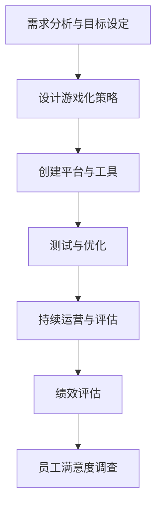
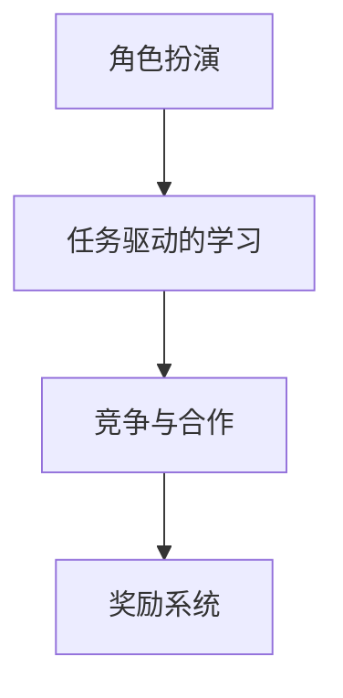
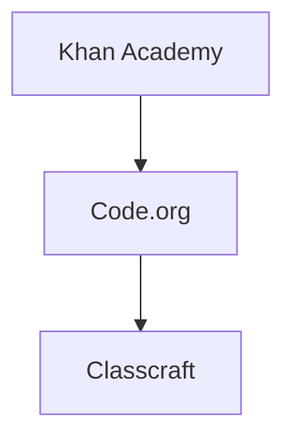
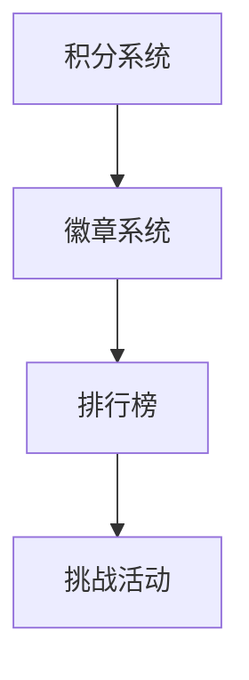
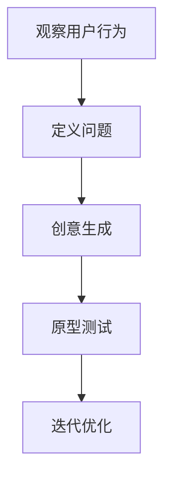
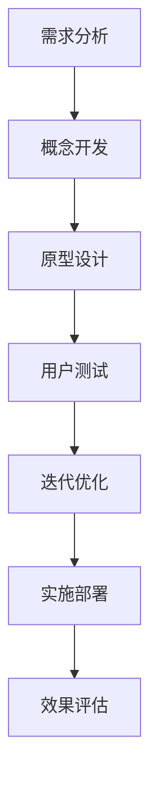
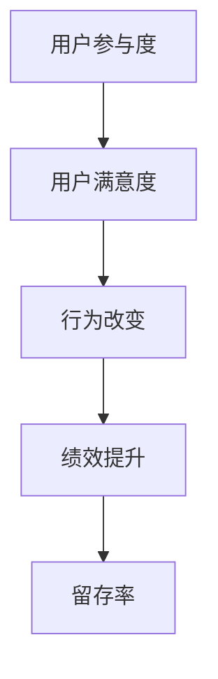
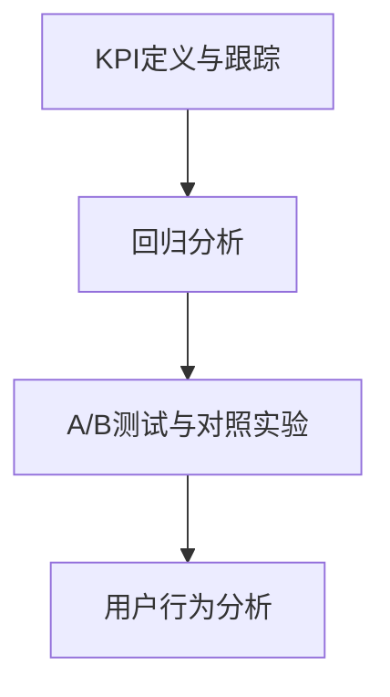
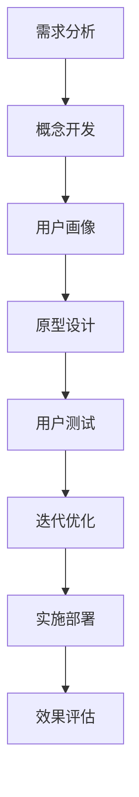
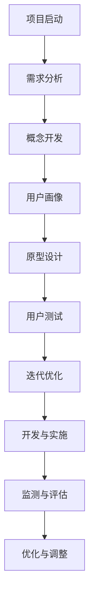

                 

# 游戏化体验：让参与人类计算乐在其中

## 关键词
游戏化，用户体验，参与感，激励，社交互动，设计原则

## 摘要
本文将深入探讨游戏化体验的概念、理论基础以及其在不同领域的应用。通过分析游戏化设计的核心要素和原则，我们旨在揭示如何通过游戏化策略提升用户参与度和满意度。本文将结合实际案例，详细阐述游戏化在营销、组织管理、教育、医疗健康和社交媒体等领域的实践，并提供游戏化设计的核心方法和评估优化技巧。通过这篇文章，我们希望帮助读者理解和应用游戏化，使其成为提升计算体验的重要工具。

---

### 《游戏化体验：让参与人类计算乐在其中》目录大纲

#### 第一部分：游戏化的概念与理论基础

##### 第1章：游戏化的起源与发展
- **1.1 引言：游戏化的概念**
- **1.2 游戏化在社会中的应用**
- **1.3 游戏化在教育中的实践**
- **1.4 游戏化的心理学基础**

##### 第2章：游戏化设计要素
- **2.1 游戏化体验的五个核心要素**
  - **2.1.1 目标与挑战**
  - **2.1.2 规则与反馈**
  - **2.1.3 虚拟奖励**
  - **2.1.4 社交互动**
  - **2.1.5 乐趣与沉浸感**
- **2.2 设计原则与实践**

#### 第二部分：游戏化在业务场景中的应用

##### 第3章：游戏化在营销中的策略
- **3.1 游戏化营销的概念**
- **3.2 游戏化营销的案例分析**
- **3.3 游戏化营销的挑战与机遇**

##### 第4章：游戏化在组织管理中的实践
- **4.1 组织游戏化的定义与目标**
- **4.2 游戏化组织的设计要素**
- **4.3 游戏化组织的实施步骤**
- **4.4 游戏化组织的效果评估**

##### 第5章：游戏化在教育中的创新
- **5.1 游戏化教育的基本原理**
- **5.2 游戏化教育的设计模式**
- **5.3 游戏化教育的应用案例**
- **5.4 游戏化教育的未来趋势**

##### 第6章：游戏化在医疗健康领域的应用
- **6.1 游戏化健康管理的概念**
- **6.2 游戏化健康管理的案例**
- **6.3 游戏化健康管理的挑战与解决方案**

##### 第7章：游戏化在社交媒体中的探索
- **7.1 社交媒体与游戏化的结合**
- **7.2 社交媒体游戏化的案例分析**
- **7.3 社交媒体游戏化的未来趋势**

#### 第三部分：游戏化的设计与实践技巧

##### 第8章：游戏化设计的核心方法
- **8.1 设计思维与游戏化**
- **8.2 游戏化设计的步骤**
- **8.3 游戏化设计工具与应用**

##### 第9章：游戏化评估与优化
- **9.1 游戏化评估指标**
- **9.2 游戏化效果的量化分析**
- **9.3 游戏化优化的策略**

##### 第10章：跨领域游戏化实践案例
- **10.1 从电商到社区运营的游戏化实践**
- **10.2 教育与公益领域的游戏化创新**
- **10.3 企业的数字化转型与游戏化**

#### 附录

##### 附录A：游戏化设计资源与工具
- **A.1 游戏化设计资源**
- **A.2 游戏化设计工具**

##### 附录B：游戏化体验设计指南
- **B.1 游戏化体验设计框架**
- **B.2 游戏化体验设计流程**
- **B.3 游戏化体验设计案例分析**

---

### 第一部分：游戏化的概念与理论基础

#### 第1章：游戏化的起源与发展

##### 1.1 引言：游戏化的概念

游戏化（Gamification）是一种通过将游戏设计元素和机制引入非游戏场景，以激励用户参与、提升互动性和增强用户体验的方法。它起源于2002年，由游戏设计师兼作家Nick Pelling首次提出。游戏化不仅关注游戏本身的娱乐性，更注重其在实际应用中的激励效果。通过引入游戏化的元素，如目标设定、挑战、奖励机制等，非游戏场景能够变得更加有趣、有动力和有意义。

##### 1.2 游戏化在社会中的应用

随着互联网和移动设备的普及，游戏化在社会各个领域得到了广泛应用。以下是一些典型的应用场景：

- **营销与广告**：品牌通过游戏化营销活动吸引消费者的注意力，例如使用挑战、奖励和排行榜来提高用户参与度和忠诚度。
- **教育**：游戏化教育利用游戏设计原则提高学生的学习兴趣和动力，例如通过虚拟实验室和角色扮演游戏进行知识传授。
- **健康与健身**：游戏化健康应用鼓励用户通过设定目标、跟踪进度和获取奖励来改善生活方式和健康状况。
- **组织管理**：企业通过游戏化策略激励员工参与公司事务，提高团队合作和绩效。
- **公益与社会影响**：游戏化被用于推动社会变革，通过参与游戏化的活动提高公众的环保意识和社会责任感。

##### 1.3 游戏化在教育中的实践

在教育领域，游戏化已被证明是一种有效的教学方法。通过引入游戏化元素，如奖励系统、挑战和排行榜，学生可以更主动地参与学习过程。以下是一些游戏化在教育中实践的具体例子：

- **学习平台**：例如，Khan Academy通过积分系统和排行榜激励学生完成课程和挑战。
- **角色扮演游戏**：通过角色扮演游戏，学生可以在模拟环境中学习历史、科学等知识。
- **游戏化作业**：教师设计游戏化作业，如解谜游戏，以提高学生的参与度和学习兴趣。

##### 1.4 游戏化的心理学基础

游戏化的成功部分归因于其背后的心理学原理。以下是几个关键心理学概念：

- **动机**：游戏化通过设定目标、提供挑战和奖励来激发用户的内在动机。
- **反馈**：及时的反馈可以增强用户的学习效果和满意度，使他们在参与过程中感到成就。
- **参与感**：游戏化设计注重用户的沉浸感和参与感，通过虚拟角色和社交互动增加用户的投入。
- **社交互动**：多人游戏和社交平台可以增强用户的归属感和团队合作精神。

通过理解这些心理学原理，游戏化设计师可以更好地创造出令人满意和富有挑战性的体验。

#### 第2章：游戏化设计要素

##### 2.1 游戏化体验的五个核心要素

游戏化体验的设计依赖于几个核心要素，这些要素共同作用，创造出吸引人的参与体验。以下是五个关键要素及其详细描述：

###### 2.1.1 目标与挑战

目标与挑战是游戏化体验的基础。设定明确的目标可以帮助用户了解他们需要达成的任务，而挑战则提供了达到这些目标所需的难度和刺激。目标可以是简单的，如完成任务或达到一定的分数，也可以是复杂的，如解决一系列问题或完成一个长期项目。挑战可以是具体的，如时间限制或资源管理，也可以是心理上的，如策略规划和决策。

**例子**：在健身应用中，用户可能会设定一个每天步数的目标，并接受每日步数排名的挑战。

###### 2.1.2 规则与反馈

规则是游戏化体验中的指导方针，它们定义了用户如何参与和完成任务。明确的规则可以帮助用户理解游戏化的过程，并减少不确定性。反馈机制是游戏化体验的关键，它们通过提供即时和持续的信息，帮助用户了解他们的进度、成就和错误。反馈可以是积极的，如奖励和赞扬，也可以是消极的，如提示和警告。

**例子**：在一个教育游戏中，规则可能包括正确的答案才能前进，而反馈可以是即时评分和解释错误的选项。

###### 2.1.3 虚拟奖励

虚拟奖励是游戏化体验中激励用户参与的重要工具。这些奖励可以是虚拟货币、徽章、等级提升或访问新的游戏功能。虚拟奖励不仅提供了即时满足，还鼓励用户持续参与，以获得更多的奖励。

**例子**：在社交平台上，用户可能会获得点赞数或分享次数作为虚拟奖励，这些奖励可以增加他们的社交地位。

###### 2.1.4 社交互动

社交互动增强了用户的参与感和归属感。通过与其他用户互动，用户可以分享经验、建立社交网络并互相激励。社交互动可以是直接的，如聊天和评论，也可以是间接的，如点赞和分享。

**例子**：在游戏社区中，用户可以参与讨论、组织比赛或加入小组，以增强社交互动。

###### 2.1.5 乐趣与沉浸感

乐趣和沉浸感是游戏化体验的核心。通过创造有趣和引人入胜的体验，用户更愿意投入时间和精力。沉浸感可以通过游戏化的环境设计、故事情节和视觉效果来实现。

**例子**：在一个虚拟探险游戏中，用户可能会探索神秘的岛屿、解决谜题并与虚构的角色互动，以获得沉浸感。

##### 2.2 设计原则与实践

游戏化设计不仅仅是将游戏元素添加到非游戏场景中，而是需要遵循一系列设计原则，以确保体验的吸引力和有效性。以下是几个关键设计原则：

- **用户中心**：设计时始终考虑用户的需求和动机，确保游戏化体验与用户的期望和目标一致。
- **简单性**：保持体验的简单和直观，以减少用户的学习成本和认知负荷。
- **适应性**：设计灵活，能够根据用户的行为和反馈进行调整，以提供个性化的体验。
- **平衡性**：在挑战和奖励之间保持平衡，以避免过度压力或奖励不足。
- **持续激励**：通过不断引入新的目标和挑战，保持用户的参与和兴趣。

**实践建议**：

1. **用户调研**：在开始设计前，了解目标用户的需求和偏好。
2. **原型测试**：创建原型并进行用户测试，以识别和解决潜在的问题。
3. **迭代优化**：根据用户反馈和数据分析，不断优化游戏化体验。

通过这些原则和实践，游戏化设计师可以创造出吸引人、有意义且持久的游戏化体验。

### 第二部分：游戏化在业务场景中的应用

#### 第3章：游戏化在营销中的策略

##### 3.1 游戏化营销的概念

游戏化营销是将游戏设计原理和机制应用于营销活动中，以提高用户参与度、增加品牌认知度和促进销售。它通过创造互动性和挑战性，激励用户参与品牌活动，从而提升营销效果。游戏化营销的核心在于利用游戏化的元素，如积分、奖励、挑战和社交互动，来吸引和留住用户。

##### 3.2 游戏化营销的案例分析

以下是一些成功的游戏化营销案例：

- **麦当劳的“麦积分”活动**：麦当劳通过引入“麦积分”系统，鼓励用户在购买食物时积累积分，并使用这些积分兑换免费餐点。活动增加了用户的参与感和忠诚度，提高了销售额。

  **Mermaid 流程图**：
  ```mermaid
  graph TD
    A[用户购买食物] --> B[获得麦积分]
    B --> C[积分兑换免费餐点]
    C --> D[提高用户忠诚度]
    D --> E[增加销售额]
  ```

- **英特尔“挑战计划”**：英特尔通过举办在线编程挑战，吸引开发者参与。参与者可以通过完成任务获得奖励和荣誉，这不仅提升了品牌形象，还吸引了潜在的人才。

  **Mermaid 流程图**：
  ```mermaid
  graph TD
    A[在线编程挑战] --> B[完成任务]
    B --> C[获得奖励和荣誉]
    C --> D[提升品牌形象]
    D --> E[吸引人才]
  ```

##### 3.3 游戏化营销的挑战与机遇

游戏化营销虽然具有显著的优势，但也面临一些挑战：

- **用户疲劳**：如果游戏化元素过于频繁或复杂，用户可能会感到疲劳，从而降低参与度。
- **隐私问题**：游戏化营销常常涉及用户数据收集，这可能引发隐私问题，需要确保数据的安全性和透明度。
- **平衡挑战与奖励**：过度的挑战可能导致用户压力过大，而奖励不足可能导致用户缺乏动力。

尽管如此，游戏化营销的机遇仍然巨大：

- **提高用户参与度**：通过创造有趣和互动的体验，用户更愿意参与品牌活动。
- **增加品牌忠诚度**：通过提供奖励和荣誉，用户对品牌产生更强的归属感。
- **创新营销手段**：游戏化营销提供了创新的营销策略，可以帮助品牌在竞争激烈的市场中脱颖而出。

**解决方案**：

1. **适度游戏化**：避免过度游戏化，确保用户体验不过度疲劳。
2. **用户数据保护**：严格遵守隐私法规，确保用户数据的保护和透明度。
3. **平衡挑战与奖励**：通过数据分析，找到最佳的挑战和奖励平衡点，提高用户参与度和满意度。

通过有效应用游戏化营销策略，企业可以提升品牌影响力，增加用户参与度，从而实现长期的销售增长。

#### 第4章：游戏化在组织管理中的实践

##### 4.1 组织游戏化的定义与目标

组织游戏化（Corporate Gamification）是将游戏设计原理应用于组织管理中，以激励员工、提高绩效和增强团队合作。通过游戏化的策略，组织可以创造一个更加有趣、有动力和富有成就感的氛围。组织游戏化的目标包括：

- **提高员工参与度**：通过设定明确的目标和挑战，激励员工积极参与组织活动。
- **提升绩效**：通过奖励系统和反馈机制，鼓励员工提高工作效率和质量。
- **增强团队合作**：通过团队竞赛和社交互动，促进员工之间的协作和沟通。
- **培养企业文化**：通过游戏化的元素，强化组织的价值观和文化。

##### 4.2 游戏化组织的设计要素

游戏化组织的设计需要考虑以下几个关键要素：

- **目标与挑战**：设定清晰、具有挑战性的目标，以激励员工不断进步。
- **规则与反馈**：制定明确的规则，提供及时和有意义的反馈，帮助员工了解自己的进展和表现。
- **虚拟奖励**：设计各种虚拟奖励，如积分、徽章、排名等，以激励员工。
- **社交互动**：创造一个支持社交互动的平台，鼓励员工分享经验、建立关系和互相激励。
- **乐趣与沉浸感**：设计有趣和沉浸式的体验，使员工在参与过程中感到快乐和满足。

##### 4.3 游戏化组织的实施步骤

实施游戏化组织需要遵循以下步骤：

1. **需求分析与目标设定**：了解员工的需求和期望，明确游戏化组织的目标。
2. **设计游戏化策略**：根据组织目标和员工需求，设计合适的游戏化策略和活动。
3. **创建平台与工具**：选择合适的平台和工具，搭建游戏化组织的操作环境。
4. **测试与优化**：进行测试，收集员工反馈，并根据反馈优化游戏化策略和体验。
5. **持续运营与评估**：定期评估游戏化组织的成效，持续优化和调整策略。

##### 4.4 游戏化组织的效果评估

评估游戏化组织的效果需要从以下几个方面进行：

- **参与度**：测量员工参与游戏化活动的频率和深度。
- **绩效**：评估员工在游戏化活动中的工作绩效，如工作效率、质量和创新。
- **团队合作**：评估员工之间的协作和沟通效果。
- **员工满意度**：通过调查和反馈了解员工的满意度和参与感受。

**Mermaid 流程图**：


通过以上步骤和评估方法，组织可以有效地实施游戏化策略，提高员工参与度和满意度，从而实现组织目标的达成。

#### 第5章：游戏化在教育中的创新

##### 5.1 游戏化教育的基本原理

游戏化教育是将游戏设计原理应用于教育过程中，以增强学生的学习兴趣、提高学习效果和促进知识的掌握。其基本原理包括以下几个方面：

- **目标与挑战**：通过设定具体的学习目标和挑战，激发学生的学习动力。
- **规则与反馈**：制定清晰的学习规则，并提供即时的反馈，帮助学生了解自己的学习进度和成效。
- **虚拟奖励**：设计各种虚拟奖励，如积分、徽章和等级提升，以增强学生的学习动机。
- **社交互动**：创造一个支持社交互动的学习环境，鼓励学生之间的合作和交流。
- **乐趣与沉浸感**：设计有趣和沉浸式的学习体验，使学生能够在轻松愉快的氛围中学习。

##### 5.2 游戏化教育的设计模式

游戏化教育的设计模式主要包括以下几种：

- **角色扮演**：学生通过扮演特定的角色参与学习活动，增强学习的真实感和投入感。
- **任务驱动的学习**：学生通过完成一系列任务来学习知识，每个任务都与实际应用场景相结合。
- **竞争与合作**：通过设置个人和团队竞赛，鼓励学生之间的竞争和合作，提高学习积极性。
- **奖励系统**：设计一个奖励系统，根据学生的学习成果和参与度提供各种虚拟奖励。

**Mermaid 流程图**：


##### 5.3 游戏化教育的应用案例

以下是一些成功的游戏化教育应用案例：

- **Khan Academy**：Khan Academy 通过游戏化元素，如积分系统和排行榜，激励学生学习数学、科学等科目。学生可以通过完成任务和问题来获得积分，这些积分可以用来解锁新的课程和挑战。
- **Code.org**：Code.org 利用游戏化策略，通过在线编程挑战和竞赛，鼓励学生学习编程。学生可以通过完成编程任务来获得徽章和奖励，同时还能与其他学生交流分享经验。
- **Classcraft**：Classcraft 将游戏化元素应用于虚拟课堂，通过角色扮演和任务驱动学习，增强学生的参与感和学习兴趣。学生在学习过程中可以积累经验值、获取装备和提升技能。

**Mermaid 流程图**：


##### 5.4 游戏化教育的未来趋势

随着技术的发展和教育的变革，游戏化教育在未来有望呈现出以下趋势：

- **个性化学习**：通过游戏化策略，实现个性化学习路径和定制化挑战，满足不同学生的学习需求和节奏。
- **混合学习**：将游戏化元素与在线和传统教学相结合，提供更加灵活和多样化的学习体验。
- **虚拟现实与增强现实**：利用虚拟现实和增强现实技术，创造更加沉浸式和互动性的学习环境。
- **社交互动与协作**：通过增强社交互动和协作，促进学生的合作学习和知识分享。

通过不断创新和优化，游戏化教育将继续在教育领域中发挥重要作用，为学生的全面发展提供支持。

#### 第6章：游戏化在医疗健康领域的应用

##### 6.1 游戏化健康管理的概念

游戏化健康管理是指将游戏设计原理应用于健康管理中，通过设定目标、挑战、奖励和社交互动等方式，激励个体参与健康行为，提高健康意识和生活质量。游戏化健康管理旨在利用游戏的激励机制，使个体在健康维护过程中感到有趣、有动力和有成就感。

##### 6.2 游戏化健康管理的案例

以下是一些成功的游戏化健康管理案例：

- **Lark Health**：Lark Health 是一款智能健康助手，通过游戏化设计，鼓励用户进行健康监测和锻炼。用户可以通过完成健康任务、获得积分和徽章来提升自己的等级，同时还可以与其他用户进行竞争和协作，增加参与感和动力。

  **Mermaid 流程图**：
  ```mermaid
  graph TD
    A[健康监测与锻炼] --> B[任务完成与积分获取]
    B --> C[等级提升与奖励]
    C --> D[用户竞争与协作]
  ```

- **Healthera**：Healthera 是一款专注于心理健康的游戏化应用，通过提供心理评估、任务挑战和社交支持，帮助用户改善心理健康。用户可以通过完成心理健康任务和参与社交互动，获得成就感和支持，从而更好地应对心理问题。

  **Mermaid 流程图**：
  ```mermaid
  graph TD
    A[心理评估与任务挑战] --> B[成就获取与社交支持]
    B --> C[心理健康改善]
  ```

##### 6.3 游戏化健康管理的挑战与解决方案

游戏化健康管理在实施过程中面临一些挑战，如：

- **用户疲劳**：如果游戏化元素过于频繁或复杂，用户可能会感到疲劳，从而降低参与度。
- **隐私保护**：健康管理涉及个人健康数据，需要确保数据的安全性和隐私性。
- **个性化需求**：不同用户对健康管理的需求和期望不同，如何提供个性化的游戏化体验是一个挑战。

针对这些挑战，可以采取以下解决方案：

- **适度游戏化**：避免过度游戏化，确保用户体验不过度疲劳。
- **数据安全**：严格遵守隐私法规，使用安全技术和加密措施保护用户数据。
- **个性化定制**：通过数据分析和技术手段，为用户提供个性化的游戏化体验。

通过克服这些挑战，游戏化健康管理可以更好地激励个体参与健康行为，提高健康水平和生活质量。

#### 第7章：游戏化在社交媒体中的探索

##### 7.1 社交媒体与游戏化的结合

社交媒体平台正越来越多地采用游戏化元素，以提高用户参与度和活跃度。这种结合通过引入积分、徽章、排行榜和挑战等机制，使社交媒体体验更加有趣和有动力。以下是一些典型的结合方式：

- **积分系统**：用户通过参与平台活动（如发布内容、点赞、评论等）获得积分，积分可以用来解锁新的功能和特权。
- **徽章系统**：用户完成特定任务或达到一定条件（如累计登录天数、完成社区挑战等）可以获得徽章，徽章用于显示用户的成就和参与度。
- **排行榜**：通过设置排行榜，展示用户在特定指标上的排名，如发帖数量、点赞数、互动频率等，激励用户竞争和参与。
- **挑战活动**：定期举办挑战活动，鼓励用户参与竞争，增加互动和乐趣。

**Mermaid 流程图**：


##### 7.2 社交媒体游戏化的案例分析

以下是一些成功的社交媒体游戏化案例：

- **Facebook**：Facebook 通过引入“年度故事”功能，鼓励用户分享他们在过去一年中的照片和经历。用户可以通过分享内容获得“故事徽章”，这些徽章显示在用户的个人资料页面上，增加了用户的参与感和成就感。

  **Mermaid 流程图**：
  ```mermaid
  graph TD
    A[分享照片和经历] --> B[获得故事徽章]
    B --> C[增加参与感]
  ```

- **Instagram**：Instagram 通过引入“挑战”功能，鼓励用户参与特定的摄影挑战，如“每周摄影挑战”。用户可以通过上传符合挑战主题的照片获得点赞和评论，这不仅增加了用户间的互动，还提高了平台的活跃度。

  **Mermaid 流程图**：
  ```mermaid
  graph TD
    A[参与摄影挑战] --> B[获得点赞和评论]
    B --> C[提高活跃度]
  ```

##### 7.3 社交媒体游戏化的未来趋势

随着社交媒体的不断发展和用户需求的多样化，游戏化在社交媒体中的应用将呈现出以下趋势：

- **个性化游戏化**：通过数据分析和技术进步，为用户提供更加个性化的游戏化体验，满足不同用户的需求和偏好。
- **增强现实与虚拟现实**：结合增强现实（AR）和虚拟现实（VR）技术，创造更加沉浸式和互动性的社交媒体体验。
- **跨平台整合**：将游戏化元素整合到多个社交媒体平台，提供无缝的用户体验，提高用户粘性。
- **社交互动创新**：探索新的社交互动方式，如多人游戏和虚拟社区，增加用户之间的互动和连接。

通过不断创新和优化，社交媒体游戏化将继续为用户提供更加有趣、有动力和有意义的体验。

### 第三部分：游戏化的设计与实践技巧

#### 第8章：游戏化设计的核心方法

##### 8.1 设计思维与游戏化

设计思维（Design Thinking）是一种以用户为中心的问题解决方法，它强调理解用户需求、探索多种解决方案并迭代优化。将设计思维应用于游戏化设计，可以确保游戏化体验不仅有趣，而且能够真正满足用户的需求。

**设计思维步骤**：

1. **观察**：通过观察用户行为和互动，了解用户的需求和痛点。
2. **定义问题**：明确用户面临的问题，并思考游戏化如何解决这些问题。
3. **创意生成**：通过头脑风暴和原型设计，生成多个游戏化解决方案。
4. **原型测试**：创建原型并进行用户测试，收集反馈以优化设计。
5. **迭代优化**：根据用户反馈进行迭代优化，确保游戏化体验不断提升。

**Mermaid 流程图**：


##### 8.2 游戏化设计的步骤

游戏化设计需要遵循一系列系统化的步骤，以确保设计的有效性。以下是游戏化设计的核心步骤：

1. **需求分析**：了解用户需求和行为模式，确定游戏化的目标和预期效果。
2. **概念开发**：基于需求分析，开发游戏化概念和初步设计方案。
3. **原型设计**：创建原型，模拟游戏化体验，并进行初步测试。
4. **用户测试**：通过用户测试，评估原型的效果，收集用户反馈。
5. **迭代优化**：根据用户反馈，对原型进行迭代优化，确保设计满足用户需求。
6. **实施部署**：将游戏化设计部署到实际环境中，进行实时运行和监测。
7. **效果评估**：定期评估游戏化体验的效果，并根据评估结果进行调整和优化。

**Mermaid 流程图**：


##### 8.3 游戏化设计工具与应用

游戏化设计需要使用多种工具和方法，以支持设计过程和优化体验。以下是几个常用的游戏化设计工具：

- **用户调研工具**：如SurveyMonkey、Google Forms等，用于收集用户需求和反馈。
- **原型设计工具**：如Figma、Sketch、InVision等，用于创建视觉原型和交互设计。
- **游戏化框架**：如 Gamification Framework、Gamification Design Model等，用于指导游戏化设计过程。
- **数据分析和评估工具**：如Google Analytics、Tableau等，用于监测用户行为和评估游戏化效果。

通过合理应用这些工具，游戏化设计师可以更有效地进行游戏化设计，提升用户体验和参与度。

#### 第9章：游戏化评估与优化

##### 9.1 游戏化评估指标

评估游戏化效果是确保其成功应用的关键步骤。以下是几个关键的评估指标：

- **用户参与度**：测量用户参与游戏化活动的频率和深度，如访问次数、任务完成率、用户停留时间等。
- **用户满意度**：通过调查和反馈了解用户对游戏化体验的满意度，如总体满意度、使用体验等。
- **行为改变**：评估游戏化对用户行为的实际影响，如健康行为、学习习惯等。
- **绩效提升**：测量游戏化对用户工作或学习绩效的提升，如生产效率、学习成果等。
- **留存率**：评估游戏化体验对用户留存率的影响，如用户回访率、流失率等。

**Mermaid 流程图**：


##### 9.2 游戏化效果的量化分析

量化分析是评估游戏化效果的重要手段。以下是几种常用的量化分析方法：

- **关键绩效指标（KPI）**：定义和跟踪关键的绩效指标，如参与度、满意度、绩效提升等，以衡量游戏化效果。
- **回归分析**：通过回归分析评估游戏化对特定结果的直接影响，如用户参与度和绩效提升之间的关系。
- **实验与对照**：进行A/B测试或对照实验，比较游戏化前后的数据，评估游戏化对用户体验和行为的影响。
- **用户行为分析**：通过用户行为分析，深入了解用户在游戏化活动中的行为模式，识别优化点。

**Mermaid 流�程图**：


##### 9.3 游戏化优化的策略

基于评估结果，可以采取以下策略进行游戏化优化：

- **调整目标与挑战**：根据用户反馈和行为数据，调整目标的难度和挑战性，确保它们既能激发用户的兴趣，又不会过于困难。
- **优化奖励系统**：根据用户参与度和满意度，调整奖励的类型和频率，确保奖励能够持续激励用户。
- **增强社交互动**：通过引入社交功能，如用户评论、点赞、分享等，增强用户之间的互动，提高参与度。
- **提高用户体验**：通过优化界面设计和交互流程，提高用户体验，减少用户的学习成本和认知负荷。
- **定期更新与迭代**：根据用户反馈和数据分析，定期更新游戏化元素和活动，保持体验的新鲜感和吸引力。

通过这些优化策略，游戏化体验可以不断改进，进一步提升用户参与度和满意度。

### 第10章：跨领域游戏化实践案例

##### 10.1 从电商到社区运营的游戏化实践

游戏化在电商和社区运营中有着广泛的应用。以下是一些跨领域的游戏化实践案例：

- **电商游戏化**：电商平台如亚马逊和天猫通过引入积分系统、排行榜和奖励机制，鼓励用户参与购物和评价活动。例如，用户可以通过购物和评价获得积分，积分可以用来兑换优惠券或礼品。这些游戏化元素不仅增加了用户的参与度，还提高了用户满意度和忠诚度。

  **Mermaid 流程图**：
  ```mermaid
  graph TD
    A[购物与评价] --> B[积分获取]
    B --> C[兑换优惠券]
    B --> D[奖励机制]
  ```

- **社区运营游戏化**：社区平台如Reddit和Discord通过引入徽章系统、挑战活动和积分制度，增强用户参与感和互动性。用户可以通过发帖、评论、参与活动等方式获得徽章和积分，这些徽章和积分可以用来显示用户的成就和地位。通过游戏化策略，社区平台能够吸引更多用户参与，提高社区活跃度和用户满意度。

  **Mermaid 流程图**：
  ```mermaid
  graph TD
    A[发帖与评论] --> B[徽章获取]
    B --> C[积分获取]
    C --> D[挑战活动]
  ```

##### 10.2 教育与公益领域的游戏化创新

游戏化在教育和非营利组织（NPO）中也展现出了巨大潜力。以下是一些创新案例：

- **教育游戏化**：教育机构如Khan Academy和Duolingo通过游戏化策略提高学生的学习兴趣和参与度。例如，Khan Academy使用积分系统、排行榜和奖励机制，鼓励学生完成课程任务并获得奖励。这种游戏化设计不仅提高了学习效率，还帮助学生建立了积极的 学习态度。

  **Mermaid 流程图**：
  ```mermaid
  graph TD
    A[完成任务] --> B[积分获取]
    B --> C[排行榜]
    B --> D[奖励机制]
  ```

- **公益游戏化**：非营利组织如World Food Programme（WFP）通过游戏化活动提高公众对饥饿问题的关注和支持。WFP的“饥饿游戏”项目允许玩家通过虚拟游戏获得虚拟货币，这些货币可以用来购买现实中的食物援助。这种游戏化策略不仅提高了公众参与度，还增加了对公益项目的资金支持。

  **Mermaid 流程图**：
  ```mermaid
  graph TD
    A[虚拟游戏] --> B[虚拟货币获取]
    B --> C[购买食物援助]
    B --> D[资金支持]
  ```

##### 10.3 企业的数字化转型与游戏化

随着数字化转型的发展，游戏化策略在企业运营和管理中发挥着越来越重要的作用。以下是一些关键实践：

- **员工培训**：企业通过游戏化培训提高员工的技能和知识。例如，通过设定学习任务、提供即时反馈和奖励机制，企业能够鼓励员工积极参与培训，提高培训效果。

  **Mermaid 流程图**：
  ```mermaid
  graph TD
    A[学习任务] --> B[即时反馈]
    B --> C[奖励机制]
  ```

- **销售激励**：企业通过游戏化销售激励活动提高销售团队的绩效。例如，通过设定销售目标、提供奖励和排行榜，企业能够激发销售团队的竞争精神和积极性，提高销售业绩。

  **Mermaid 流程图**：
  ```mermaid
  graph TD
    A[销售目标] --> B[奖励机制]
    B --> C[排行榜]
  ```

- **客户关系管理**：企业通过游戏化策略增强客户关系管理。例如，通过客户积分系统、互动活动和专属奖励，企业能够提高客户满意度和忠诚度，增强品牌影响力。

  **Mermaid 流程图**：
  ```mermaid
  graph TD
    A[客户积分系统] --> B[互动活动]
    B --> C[专属奖励]
  ```

通过跨领域的游戏化实践，企业不仅能够提高内部运营效率，还能增强外部客户和用户的互动和满意度。

### 附录A：游戏化设计资源与工具

#### A.1 游戏化设计资源

游戏化设计资源的丰富与否直接影响到游戏化项目的成功。以下是一些重要的游戏化设计资源：

1. **游戏化设计框架**：这些框架提供了游戏化设计的系统方法和步骤，如Gamification Framework、Gamer’s Genome等。
2. **游戏化设计指南**：这些指南详细介绍了游戏化设计的原则和最佳实践，如《Gameful Design: A Brief Introduction to Gamification》和《The Gamification of Learning and Instruction: Game-based Methods and Strategies for Training and Education》。
3. **游戏化案例研究**：这些案例研究了游戏化在不同领域的成功应用，提供了宝贵的实践经验和启示。
4. **游戏化工具**：这些工具可以帮助设计师创建游戏化体验，如Gamli.st、GameLift和Gameful.io等。
5. **游戏化社区和论坛**：这些社区和论坛聚集了游戏化设计师和实践者，提供了交流和学习的机会，如Gamification.co、LinkedIn Gamification Group等。

#### A.2 游戏化设计工具

游戏化设计工具是游戏化项目实现的关键。以下是一些常用的游戏化设计工具：

1. **用户体验工具**：如Figma、Sketch和InVision，用于原型设计和用户测试。
2. **数据分析工具**：如Google Analytics、Tableau和Power BI，用于监测用户行为和评估游戏化效果。
3. **游戏化平台**：如Gamli.st和GameLift，提供了一整套游戏化设计、实施和优化的工具和资源。
4. **虚拟现实（VR）和增强现实（AR）工具**：如Unity和Unreal Engine，用于创建沉浸式游戏化体验。
5. **社交媒体工具**：如Hootsuite和Buffer，用于管理社交媒体活动，整合游戏化元素。

通过合理利用这些资源和工具，游戏化设计师可以更高效地开展游戏化设计项目，提升用户体验和参与度。

### 附录B：游戏化体验设计指南

#### B.1 游戏化体验设计框架

游戏化体验设计框架是一个系统化的方法，用于设计和实现有效的游戏化体验。以下是一个基本的游戏化体验设计框架：

1. **需求分析**：了解用户需求、目标和行为模式，为游戏化设计提供基础。
2. **概念开发**：确定游戏化策略和关键要素，如目标、挑战、规则、奖励等。
3. **用户画像**：创建目标用户的画像，以便更好地满足他们的需求。
4. **原型设计**：创建原型，通过可视化工具展示游戏化体验的概貌。
5. **用户测试**：进行用户测试，收集反馈并优化设计。
6. **迭代优化**：根据用户反馈进行迭代优化，确保游戏化体验符合用户期望。
7. **实施部署**：将游戏化体验部署到实际环境中，进行实时运行和监测。
8. **效果评估**：定期评估游戏化效果，根据评估结果进行调整和优化。

**Mermaid 流程图**：


#### B.2 游戏化体验设计流程

游戏化体验设计流程是一个结构化的过程，旨在确保游戏化项目从概念到实施的每个阶段都得到有效管理。以下是游戏化体验设计流程的详细步骤：

1. **项目启动**：明确项目目标、范围和预期成果，组建项目团队。
2. **需求分析**：通过用户调研、问卷调查、访谈等方法，深入了解用户需求。
3. **概念开发**：基于需求分析，确定游戏化策略和核心要素。
4. **用户画像**：创建目标用户的详细画像，包括用户行为、动机和偏好。
5. **原型设计**：创建原型，使用可视化工具展示游戏化体验的概念和界面。
6. **用户测试**：进行用户测试，收集反馈并识别潜在问题。
7. **迭代优化**：根据用户反馈，对原型进行多次迭代优化，确保用户体验最佳。
8. **开发与实施**：编写代码，实现游戏化体验的原型，并部署到实际环境中。
9. **监测与评估**：实时监测用户体验和参与度，评估游戏化效果。
10. **优化与调整**：根据监测数据和用户反馈，持续优化游戏化体验。

**Mermaid 流程图**：


#### B.3 游戏化体验设计案例分析

以下是一个游戏化体验设计的实际案例：

**案例：Fitbit健康游戏化体验**

1. **需求分析**：Fitbit 通过用户调研发现，许多用户希望更积极地参与健康活动，但缺乏持续的动力。
2. **概念开发**：Fitbit 决定通过游戏化设计，激励用户完成健康目标，如步数、睡眠质量等。
3. **用户画像**：Fitbit 创建了不同类型的用户画像，包括健身爱好者、健康初学者和长期使用者。
4. **原型设计**：Fitbit 设计了一个积分系统，用户通过完成健康任务获得积分，积分可以兑换虚拟奖励或实物礼品。
5. **用户测试**：在发布前，Fitbit 进行了多次用户测试，收集反馈并进行优化。
6. **迭代优化**：根据用户反馈，Fitbit 调整了积分系统的奖励机制，增加了更多的挑战和互动。
7. **开发与实施**：Fitbit 开发了积分系统，并在其健康应用中集成。
8. **监测与评估**：Fitbit 使用数据分析工具，实时监测用户参与度和健康行为的变化。
9. **优化与调整**：Fitbit 根据监测数据，不断优化游戏化体验，如增加新的挑战和奖励。

通过这个案例，我们可以看到游戏化体验设计的关键步骤和实际应用，从而为其他项目提供借鉴和启示。

### 项目小结

本文通过对游戏化体验的深入探讨，从概念、理论基础到具体应用，展示了游戏化在不同领域的巨大潜力。我们分析了游戏化体验的五个核心要素，即目标与挑战、规则与反馈、虚拟奖励、社交互动和乐趣与沉浸感，并介绍了游戏化设计的原则和方法。通过案例分析和实际应用，我们展示了游戏化在营销、组织管理、教育、医疗健康和社交媒体等领域的成功实践。

游戏化不仅能够提升用户的参与度和满意度，还能够改善组织绩效和用户行为。然而，游戏化设计需要遵循一系列原则和步骤，确保其有效性和可持续性。未来，随着技术的进步和用户需求的变化，游戏化将继续发展和创新，为各个领域带来更多可能性。

在实践过程中，我们鼓励读者不断探索和尝试，通过游戏化策略提升用户体验和参与度。通过理解游戏化的核心原理和设计方法，读者可以更好地将游戏化应用于实际项目中，创造出令人满意和富有挑战性的游戏化体验。

### 最佳实践 tips

1. **用户调研**：在设计游戏化体验之前，进行充分的用户调研，了解目标用户的需求、动机和偏好。
2. **简单明了**：确保游戏化元素简单易懂，避免过于复杂，以降低用户的认知负担。
3. **持续迭代**：游戏化设计不是一次性任务，需要根据用户反馈和数据分析进行持续迭代和优化。
4. **个性化**：根据用户行为和偏好，提供个性化的游戏化体验，增加用户的参与感和满意度。
5. **公平性**：确保游戏化体验对所有用户公平，避免过度竞争或奖励不均。

### 注意事项

1. **隐私保护**：在设计游戏化体验时，注意保护用户隐私，遵守相关法律法规。
2. **游戏化过度**：避免游戏化过度，导致用户疲劳或失去兴趣，保持平衡和适度。
3. **目标设定**：确保目标既有挑战性，又能够实现，以避免用户失去动力或感到挫败。
4. **反馈机制**：建立有效的反馈机制，及时响应用户需求，提高用户体验和满意度。

### 拓展阅读

- 《游戏化革命：如何让一切变得更快乐、更有成效、更具创新性》（The Gamification of Everything: How Games Make Work and Life Better）
- 《游戏化：改变行为的心理学》（Gamification: Using Game Mechanics to Influence People and Improve Their Lives）
- 《游戏化设计：改变体验的艺术》（Gameful Design: A Brief Introduction to Gamification）

通过深入学习和实践这些资源，读者可以进一步了解游戏化的理论和实践，为实际项目提供有力支持。

