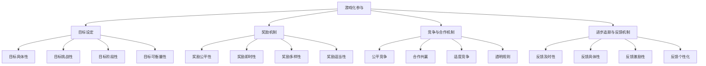

                 

### 文章标题

《游戏化参与：提升人类计算的趣味性》

> 关键词：游戏化参与、计算趣味性、目标设定、奖励机制、竞争与合作、进步追踪、反馈机制

> 摘要：本文深入探讨了游戏化参与的概念、核心机制以及其在教育、工作场所和健康运动领域的应用。通过分析目标设定、奖励机制、竞争与合作、进步追踪与反馈等核心机制，本文旨在揭示游戏化参与如何提升人类计算的趣味性，并提出一系列优化策略和未来趋势。文章还通过具体案例展示了游戏化参与的实际应用，为相关领域的研究和实践提供了有价值的参考。

----------------------------------------------------------------

## 第一部分：游戏化参与概述

### 第1章：游戏化参与的基本概念

#### 1.1 游戏化的起源与发展

##### 1.1.1 游戏化的定义

游戏化（Gamification）是指将游戏设计元素（如目标设定、奖励机制、竞争与合作等）应用到非游戏环境中，以提升用户参与度和积极性。这一概念最早由杜克大学的研究生戴维·凯斯（David Koiles）于2002年提出。当时，游戏化主要应用于市场营销和客户关系管理领域。随着互联网和移动设备的普及，游戏化逐渐扩展到教育、工作场所、健康等多个领域。

##### 1.1.2 游戏化的演变过程

游戏化的演变过程可以分为以下几个阶段：

1. **起源阶段（2002年-2008年）**：游戏化概念初步提出，主要应用于市场营销和客户关系管理。

2. **成熟阶段（2008年-2012年）**：游戏化逐渐应用于教育、健康、工作场所等多个领域，形成了一套较为完整的理论体系。

3. **应用深化阶段（2012年至今）**：游戏化在各个领域的应用不断深化，逐渐成为一种创新的管理和激励机制。

##### 1.1.3 游戏化在现代社会中的重要性

游戏化在现代社会中的重要性体现在以下几个方面：

1. **提升用户参与度**：通过游戏化参与，用户可以在非游戏环境中体验到游戏的乐趣，从而提高参与度和积极性。

2. **促进知识技能学习**：游戏化参与可以将复杂的学习任务分解为有趣的小游戏，帮助用户更轻松地掌握知识技能。

3. **增强团队合作**：游戏化参与鼓励用户在团队中竞争与合作，促进团队合作和协作。

4. **提高工作效率**：游戏化参与可以激发员工的工作热情，提高工作效率和生产力。

#### 1.2 游戏化参与的特点与优势

##### 1.2.1 游戏化参与的核心特点

游戏化参与的核心特点包括：

1. **目标设定**：通过设定明确的目标，引导用户参与和完成任务。

2. **奖励机制**：为完成目标的用户提供奖励，激发用户的积极性和动力。

3. **竞争与合作机制**：鼓励用户在竞争中成长，同时促进团队合作。

4. **进步追踪与反馈**：实时追踪用户的进步，给予及时的反馈，帮助用户持续改进。

##### 1.2.2 游戏化参与的优势分析

游戏化参与的优势主要体现在以下几个方面：

1. **提高用户粘性**：游戏化参与可以增加用户的参与度和活跃度，提高产品的用户粘性。

2. **促进知识传播**：通过游戏化参与，用户可以在轻松愉快的氛围中学习新知识和技能。

3. **激发创新思维**：游戏化参与可以激发用户的创新思维，促进创新和创造力的提升。

4. **提升工作效率**：游戏化参与可以激发员工的工作热情，提高工作效率和生产力。

##### 1.2.3 游戏化参与的应用场景

游戏化参与可以应用于多个领域，如：

1. **教育领域**：通过游戏化参与，可以提高学生的学习兴趣和参与度，促进知识的掌握。

2. **工作场所**：通过游戏化参与，可以激发员工的工作热情，提高团队合作和工作效率。

3. **健康与运动领域**：通过游戏化参与，可以鼓励用户坚持锻炼，提高健康水平。

4. **市场营销**：通过游戏化参与，可以吸引更多用户参与，提高品牌知名度和用户忠诚度。

### 第2章：游戏化参与的核心机制

#### 2.1 目标设定与奖励机制

##### 2.1.1 目标设定的方法

目标设定是游戏化参与的核心机制之一。一个合理的目标设定方法需要考虑以下几个方面：

1. **明确性**：目标需要具体、明确，用户可以清楚地知道需要做什么。

2. **挑战性**：目标需要具有一定的挑战性，能够激发用户的积极性和成就感。

3. **可实现性**：目标需要是可实现的，避免设定过于困难的目标，导致用户失去信心。

4. **阶段性**：目标需要具有阶段性，将长期目标分解为短期目标，让用户逐步实现。

##### 2.1.2 奖励机制的类型

奖励机制是游戏化参与的另一个核心机制。常见的奖励机制类型包括：

1. **物质奖励**：如金钱、礼品等。

2. **虚拟奖励**：如积分、勋章、等级等。

3. **社会奖励**：如排名、点赞、评论等。

4. **自我奖励**：如成就感、自我认可等。

##### 2.1.3 奖励机制的设计原则

设计奖励机制时，需要遵循以下原则：

1. **公平性**：奖励机制需要公平，避免出现偏袒现象。

2. **透明性**：奖励机制需要透明，用户可以清楚地了解如何获得奖励。

3. **激励性**：奖励机制需要具有激励性，能够激发用户的积极性。

4. **多样性**：奖励机制需要多样化，满足不同用户的需求。

#### 2.2 竞争与合作机制

##### 2.2.1 竞争机制的设置

竞争机制是游戏化参与中的重要组成部分，可以激发用户的竞争意识和积极性。设置竞争机制时，需要考虑以下几个方面：

1. **公平性**：确保竞争环境公平，避免不正当竞争。

2. **适度性**：竞争强度需要适度，避免过度竞争导致用户疲惫。

3. **激励性**：竞争机制需要具有激励性，能够激发用户的积极性和成就感。

4. **规则性**：竞争机制需要明确规则，确保竞争过程的公正和透明。

##### 2.2.2 合作机制的构建

合作机制是游戏化参与中的另一个重要组成部分，可以促进用户的团队合作精神和协作能力。构建合作机制时，需要考虑以下几个方面：

1. **协同性**：确保合作任务可以协同完成，避免重复劳动。

2. **激励性**：合作机制需要具有激励性，能够激发用户的积极性和成就感。

3. **公平性**：确保合作过程中的贡献得到公平认可。

4. **沟通性**：合作机制需要提供有效的沟通渠道，促进团队成员之间的交流。

##### 2.2.3 竞争与合作的平衡

在游戏化参与中，竞争与合作的平衡至关重要。过度的竞争可能导致用户疲惫和反感，而缺乏竞争则可能降低用户的参与度。实现竞争与合作的平衡，需要考虑以下几个方面：

1. **多样化**：提供多种竞争和合作模式，满足不同用户的需求。

2. **灵活调整**：根据用户反馈和参与情况，灵活调整竞争与合作的比例。

3. **激励机制**：设计合理的激励机制，鼓励用户在竞争和合作中取得平衡。

#### 2.3 进步追踪与反馈机制

##### 2.3.1 进步追踪的方法

进步追踪是游戏化参与中的重要机制，可以帮助用户了解自己的进步情况。常见的进步追踪方法包括：

1. **数据统计**：通过收集用户行为数据，分析用户的进步情况。

2. **图表展示**：通过图表形式，直观地展示用户的进步情况。

3. **排行榜**：通过排行榜，展示用户在群体中的排名，激发用户的竞争意识。

##### 2.3.2 反馈机制的设计

反馈机制是游戏化参与中的重要组成部分，可以帮助用户了解自己的表现，并提供改进建议。设计反馈机制时，需要考虑以下几个方面：

1. **及时性**：反馈需要及时，让用户能够迅速了解自己的表现。

2. **具体性**：反馈需要具体，指出用户的优点和不足。

3. **激励性**：反馈需要具有激励性，鼓励用户继续努力。

4. **个性化**：反馈需要根据用户的特点和需求进行个性化设计。

##### 2.3.3 反馈机制的优化策略

为了提高反馈机制的效果，可以采取以下优化策略：

1. **多渠道反馈**：提供多种反馈渠道，满足不同用户的偏好。

2. **持续反馈**：持续跟踪用户的进步，提供有针对性的反馈。

3. **用户参与**：鼓励用户参与反馈机制的设计，提高反馈的准确性和有效性。

4. **反馈优化**：根据用户反馈，不断优化反馈机制，提高用户满意度。

## 第二部分：游戏化参与的实践与应用

### 第3章：游戏化参与在教育领域的应用

#### 3.1 教育游戏化的定义与意义

##### 3.1.1 教育游戏化的定义

教育游戏化（Educational Gamification）是指将游戏设计元素（如目标设定、奖励机制、竞争与合作等）应用到教育过程中，以提高学生的学习兴趣和参与度。教育游戏化旨在通过游戏化的方式，让学生在轻松愉快的氛围中学习，提高学习效果。

##### 3.1.2 教育游戏化的意义

教育游戏化的意义主要体现在以下几个方面：

1. **提升学习兴趣**：游戏化的元素可以激发学生的学习兴趣，让他们更愿意参与学习。

2. **促进知识掌握**：通过游戏化的方式，学生可以在实际操作中掌握知识，提高学习效果。

3. **培养自主学习能力**：教育游戏化可以引导学生自主学习，培养他们的独立思考能力和解决问题的能力。

4. **提高团队合作能力**：教育游戏化鼓励学生在团队中合作，培养他们的团队合作精神。

##### 3.1.3 教育游戏化的挑战与机遇

教育游戏化面临的挑战主要包括：

1. **技术支持**：教育游戏化需要较强的技术支持，包括游戏开发、数据分析和反馈等。

2. **教师培训**：教师需要具备游戏化教学的能力，才能有效地开展教育游戏化。

3. **教学效果评估**：如何评估教育游戏化的教学效果，是教育游戏化面临的一个重要挑战。

教育游戏化带来的机遇主要包括：

1. **创新教学模式**：教育游戏化可以推动教育模式的创新，让学生在真实情境中学习。

2. **提高教育质量**：教育游戏化可以激发学生的学习兴趣，提高教育质量。

3. **降低教育成本**：教育游戏化可以通过线上教学，降低教育成本，让更多人享受到优质教育资源。

#### 3.2 教育游戏化的案例分析

##### 3.2.1 案例一：编程教育游戏

编程教育游戏是一种将编程知识融入游戏的形式，让学生在游戏中学习编程。以下是一个编程教育游戏的案例分析：

**开发环境搭建**：使用Python语言和Pygame库进行开发。

**源代码实现**：实现游戏的基本功能，包括角色移动、碰撞检测等。

**代码解读与分析**：

- **角色移动**：通过键盘按键控制角色的移动。
- **碰撞检测**：检测角色与障碍物的碰撞，实现游戏的基本逻辑。

**案例总结**：编程教育游戏可以激发学生的学习兴趣，提高编程能力。

##### 3.2.2 案例二：数学游戏化

数学游戏化是一种将数学知识融入游戏的形式，让学生在游戏中学习数学。以下是一个数学游戏化的案例分析：

**开发环境搭建**：使用JavaScript语言和Phaser库进行开发。

**源代码实现**：实现游戏的基本功能，包括题目生成、答案判断等。

**代码解读与分析**：

- **题目生成**：随机生成数学题目，让学生进行解答。
- **答案判断**：判断学生的答案是否正确，给予反馈。

**案例总结**：数学游戏化可以激发学生的学习兴趣，提高数学能力。

##### 3.2.3 案例三：语文阅读游戏

语文阅读游戏是一种将语文知识融入游戏的形式，让学生在游戏中学习语文。以下是一个语文阅读游戏的案例分析：

**开发环境搭建**：使用Swift语言和SpriteKit库进行开发。

**源代码实现**：实现游戏的基本功能，包括阅读文章、回答问题等。

**代码解读与分析**：

- **阅读文章**：展示阅读文章，让学生进行阅读。
- **回答问题**：提出与文章相关的问题，检测学生的阅读理解能力。

**案例总结**：语文阅读游戏可以激发学生的学习兴趣，提高阅读理解能力。

### 第4章：游戏化参与在工作场所的应用

#### 4.1 工作场所游戏化的特点与优势

##### 4.1.1 工作场所游戏化的定义

工作场所游戏化（Workplace Gamification）是指将游戏设计元素（如目标设定、奖励机制、竞争与合作等）应用到工作环境中，以提高员工的工作热情和积极性。工作场所游戏化旨在通过游戏化的方式，让员工在愉悦的氛围中工作，提高工作效率和质量。

##### 4.1.2 工作场所游戏化的优势

工作场所游戏化的优势主要体现在以下几个方面：

1. **提高工作效率**：游戏化的元素可以激发员工的工作热情，提高工作效率。

2. **增强团队合作**：游戏化的元素可以鼓励员工在团队中合作，增强团队合作精神。

3. **提升员工满意度**：游戏化的元素可以让员工在工作中感受到乐趣，提高工作满意度。

4. **促进知识分享**：游戏化的元素可以促进员工之间的知识分享，提高整体团队的知识水平。

##### 4.1.3 工作场所游戏化的实施策略

实施工作场所游戏化时，可以采取以下策略：

1. **明确目标**：设定明确的工作目标，让员工知道需要做什么。

2. **设计奖励机制**：设计合理的奖励机制，激励员工积极参与。

3. **提供竞争与合作机会**：通过竞争与合作，激发员工的工作热情。

4. **持续反馈**：对员工的工作进行及时反馈，帮助员工持续改进。

#### 4.2 工作场所游戏化的案例分析

##### 4.2.1 案例一：团队建设游戏

**开发环境搭建**：使用Python语言和Pygame库进行开发。

**源代码实现**：实现游戏的基本功能，包括角色移动、任务分配等。

**代码解读与分析**：

- **角色移动**：通过键盘按键控制角色的移动。
- **任务分配**：将任务分配给不同的角色，让员工在游戏中完成工作任务。

**案例总结**：团队建设游戏可以增强团队合作精神，提高员工的工作效率。

##### 4.2.2 案例二：员工绩效激励游戏

**开发环境搭建**：使用JavaScript语言和Phaser库进行开发。

**源代码实现**：实现游戏的基本功能，包括任务完成、奖励发放等。

**代码解读与分析**：

- **任务完成**：检测员工完成任务的情况。
- **奖励发放**：根据员工完成任务的情况，发放相应的奖励。

**案例总结**：员工绩效激励游戏可以提高员工的工作热情，提高工作效率。

##### 4.2.3 案例三：创新工作坊游戏

**开发环境搭建**：使用Swift语言和SpriteKit库进行开发。

**源代码实现**：实现游戏的基本功能，包括创意收集、投票评选等。

**代码解读与分析**：

- **创意收集**：鼓励员工提出创意。
- **投票评选**：对员工提出的创意进行投票评选。

**案例总结**：创新工作坊游戏可以激发员工的创新思维，提高团队的创新力。

### 第5章：游戏化参与在健康与运动领域的应用

#### 5.1 健康与运动游戏化的定义与意义

##### 5.1.1 健康与运动游戏化的定义

健康与运动游戏化（Health and Fitness Gamification）是指将游戏设计元素（如目标设定、奖励机制、竞争与合作等）应用到健康和运动领域中，以鼓励人们坚持锻炼，提高健康水平。健康与运动游戏化旨在通过游戏化的方式，让人们在愉悦的氛围中参与健康和运动活动。

##### 5.1.2 健康与运动游戏化的意义

健康与运动游戏化的意义主要体现在以下几个方面：

1. **提高运动参与度**：游戏化的元素可以激发人们的运动兴趣，提高运动参与度。

2. **促进健康习惯养成**：通过游戏化的方式，人们可以养成健康的运动习惯，提高健康水平。

3. **增强运动效果**：游戏化的元素可以增加运动的乐趣，提高运动效果。

4. **促进社交互动**：健康与运动游戏化可以促进人们之间的社交互动，提高社交水平。

##### 5.1.3 健康与运动游戏化的应用前景

健康与运动游戏化的应用前景非常广阔，可以应用于以下领域：

1. **个人健康管理**：通过游戏化的方式，帮助个人制定健康管理计划，提高健康水平。

2. **团体运动活动**：通过游戏化的方式，鼓励团体参与运动活动，提高团队凝聚力。

3. **公共卫生宣传**：通过游戏化的方式，宣传公共卫生知识，提高公众健康意识。

#### 5.2 健康与运动游戏化的案例分析

##### 5.2.1 案例一：健身游戏

**开发环境搭建**：使用Python语言和Pygame库进行开发。

**源代码实现**：实现游戏的基本功能，包括角色移动、动作识别等。

**代码解读与分析**：

- **角色移动**：通过键盘按键控制角色的移动。
- **动作识别**：通过摄像头捕捉角色的动作，实现动作识别。

**案例总结**：健身游戏可以激发人们的运动兴趣，提高运动效果。

##### 5.2.2 案例二：健康管理游戏

**开发环境搭建**：使用JavaScript语言和Phaser库进行开发。

**源代码实现**：实现游戏的基本功能，包括数据记录、分析等。

**代码解读与分析**：

- **数据记录**：记录用户的活动数据，如步数、心率等。
- **数据分析**：对用户的活动数据进行分析，提供健康建议。

**案例总结**：健康管理游戏可以帮助用户了解自己的健康状况，提高健康水平。

##### 5.2.3 案例三：运动社交游戏

**开发环境搭建**：使用Swift语言和SpriteKit库进行开发。

**源代码实现**：实现游戏的基本功能，包括角色创建、社交互动等。

**代码解读与分析**：

- **角色创建**：允许用户创建自己的角色。
- **社交互动**：用户可以在游戏中与其他用户进行互动。

**案例总结**：运动社交游戏可以促进人们的社交互动，提高运动参与度。

## 第三部分：游戏化参与的优化与挑战

### 第6章：游戏化参与的设计原则与优化策略

#### 6.1 游戏化参与的设计原则

游戏化参与的设计原则是确保游戏化方案有效性和可持续性的关键。以下是一些核心设计原则：

##### 6.1.1 游戏化参与的设计原则概述

1. **明确性**：游戏化目标、规则和奖励应该清晰明确，让用户一目了然。

2. **挑战性**：目标应该具有适当的难度，既能激发用户的兴趣，又不会过于困难，导致用户丧失信心。

3. **可度量性**：用户行为和成果应该能够量化，以便进行反馈和评估。

4. **多样性**：游戏化元素应该多样化，以满足不同用户的需求和偏好。

5. **适应性**：游戏化系统应该能够适应用户的变化，如调整难度、奖励等。

##### 6.1.2 目标设定的原则

1. **具体性**：目标应该是具体的，而不是模糊的，如“提高工作效率”不如“在一个月内减少30%的邮件处理时间”具体。

2. **挑战性**：目标应该具有挑战性，但不过分困难，以保持用户的兴趣和动力。

3. **阶段性**：目标应该分为短期和长期，帮助用户逐步实现。

4. **可衡量性**：目标应该能够被量化，以便用户可以明确自己的进步。

##### 6.1.3 奖励机制的设计原则

1. **公平性**：奖励机制应该公平，避免出现偏袒或不公平的现象。

2. **即时性**：奖励应该及时给予，以强化用户的行为。

3. **多样性**：奖励应该多样化，包括物质、虚拟、社会和自我奖励。

4. **适当性**：奖励应该与用户行为相匹配，以增强其相关性和激励性。

##### 6.1.4 竞争与合作机制的设计原则

1. **公平竞争**：竞争应该公平，避免出现作弊或其他不公平行为。

2. **合作共赢**：合作机制应该鼓励用户在团队中协作，实现共赢。

3. **适度竞争**：竞争强度应该适度，避免过度竞争导致用户疲劳。

4. **透明规则**：竞争和合作规则应该透明，让用户明确知道游戏规则。

##### 6.1.5 反馈机制的设计原则

1. **及时性**：反馈应该及时，让用户能够迅速了解自己的表现。

2. **具体性**：反馈应该具体，指出用户的优点和不足。

3. **激励性**：反馈应该具有激励性，鼓励用户继续努力。

4. **个性化**：反馈应该根据用户的特点和需求进行个性化设计。

#### 6.2 游戏化参与的优化策略

为了确保游戏化参与的长期效果和用户的满意度，可以采取以下优化策略：

##### 6.2.1 游戏化参与的优化方法

1. **用户研究**：深入了解用户需求和行为，为游戏化设计提供依据。

2. **持续迭代**：根据用户反馈和数据分析，不断优化游戏化系统。

3. **技术升级**：引入新的技术和工具，提升游戏化系统的用户体验。

4. **多样性**：提供多样化的游戏化元素，满足不同用户的需求。

##### 6.2.2 用户参与度的提升策略

1. **互动性**：设计互动性强的游戏化活动，提高用户参与度。

2. **社交元素**：引入社交元素，鼓励用户互动和分享。

3. **个性化**：根据用户行为和偏好，提供个性化的游戏化体验。

4. **奖励激励**：设计具有吸引力的奖励机制，激励用户参与。

##### 6.2.3 游戏化参与效果的评估

1. **定量评估**：通过数据统计，评估用户参与度和行为变化。

2. **定性评估**：通过用户调查和访谈，了解用户的满意度和反馈。

3. **综合评估**：结合定量和定性评估结果，全面评估游戏化参与的效果。

### 第7章：游戏化参与的挑战与未来趋势

#### 7.1 游戏化参与的挑战

游戏化参与在实践中面临着一系列挑战，包括：

##### 7.1.1 用户隐私保护问题

游戏化参与通常需要收集用户数据，这可能引发隐私保护问题。设计游戏化系统时，需要确保用户数据的安全和隐私。

##### 7.1.2 游戏化参与的过度依赖问题

过度依赖游戏化参与可能导致用户失去自我驱动力，对现实世界的需求和挑战缺乏关注。因此，需要平衡游戏化参与与真实世界任务。

##### 7.1.3 游戏化参与的设计平衡问题

设计游戏化参与时，需要平衡挑战性、趣味性和实用性，确保游戏化系统能够长期激励用户。

#### 7.2 游戏化参与的未来趋势

随着技术的不断进步和社会的不断发展，游戏化参与呈现出以下未来趋势：

##### 7.2.1 新技术的融入与推动

人工智能、大数据、区块链等新技术的发展将推动游戏化参与的应用和创新。

##### 7.2.2 游戏化参与的跨界融合

游戏化参与将与其他领域（如教育、健康、工作场所等）进一步融合，实现跨领域的发展。

##### 7.2.3 游戏化参与的社会影响与伦理问题

游戏化参与的社会影响和伦理问题将受到更多关注，如何平衡游戏化参与与伦理道德问题将成为一个重要议题。

## 附录

### 附录A：游戏化参与相关的工具与资源

#### A.1 游戏化参与设计工具

1. **Gamification Frameworks**：如ARC模型、Fogg行为模型等。
2. **User Research Tools**：如SurveyMonkey、Qualtrics等。
3. **Game Development Engines**：如Unity、Unreal Engine、GameMaker Studio等。

#### A.2 游戏化参与开发框架

1. **Gameful**：一个基于HTML5的轻量级游戏化框架。
2. **KPI**：一个基于Python的游戏化开发框架。
3. **Playgen**：一个基于Python的游戏生成器框架。

#### A.3 游戏化参与研究文献

1. **“Gamification in Education: A Systematic Review”**：对教育领域游戏化应用的全面综述。
2. **“The Gamification of Work”**：探讨工作场所游戏化的影响。
3. **“Gamification in Healthcare”**：分析健康领域游戏化的应用。

#### A.4 游戏化参与案例库

1. **Gamification.co**：一个收集和分享游戏化案例的网站。
2. **Gameful.org**：一个提供游戏化资源和工具的网站。
3. **GamificationDB**：一个游戏化研究数据库，包含大量游戏化案例。

### 附录B：核心概念与联系 Mermaid 流程图



### 附录C：核心算法原理讲解

#### 伪代码：目标设定方法

```python
def set_goal():
    # 输入目标难度
    difficulty = input("请输入目标难度（1-5）：")
    
    # 根据难度设置目标
    if difficulty == "1":
        goal = "完成简单任务"
    elif difficulty == "2":
        goal = "完成中等任务"
    elif difficulty == "3":
        goal = "完成较难任务"
    elif difficulty == "4":
        goal = "完成复杂任务"
    else:
        goal = "完成极具挑战性的任务"
        
    # 输出目标
    print("您的目标是：" + goal)
```

#### 数学模型和数学公式讲解

$$
\text{奖励值} = \text{完成度} \times \text{难度系数}
$$

- **完成度**：表示用户完成任务的程度，通常以百分比表示。
- **难度系数**：表示任务难度对奖励的影响程度，数值越大，任务难度越高，对奖励的贡献也越大。

#### 举例说明

假设用户完成了一个中等难度的任务，完成度为80%，难度系数为1.5，则奖励值为：

$$
\text{奖励值} = 80\% \times 1.5 = 120\%
$$

这意味着用户将获得相当于任务难度系数1.5倍的奖励。

### 附录D：项目实战

#### 实战一：教育游戏化案例

##### 开发环境搭建

- 使用Python语言进行开发
- 安装必要的游戏开发库，如Pygame

##### 源代码实现

```python
# 导入Pygame库
import pygame

# 初始化Pygame
pygame.init()

# 设置窗口大小
width, height = 800, 600
screen = pygame.display.set_mode((width, height))

# 设置游戏标题
pygame.display.set_caption("教育游戏化案例")

# 设置游戏时钟
clock = pygame.time.Clock()

# 定义角色移动速度
move_speed = 5

# 定义角色属性
player_pos = [width // 2, height // 2]
player_size = [50, 50]
player_color = (0, 0, 255)

# 定义目标属性
goal_pos = [400, 300]
goal_size = [100, 100]
goal_color = (0, 255, 0)

# 定义障碍物属性
obstacles = [
    [100, 100, 100, 100],
    [200, 200, 100, 100],
    [300, 300, 100, 100]
]

# 定义游戏循环
running = True
while running:
    # 检查事件
    for event in pygame.event.get():
        if event.type == pygame.QUIT:
            running = False

    # 检查按键
    keys = pygame.key.get_pressed()
    if keys[pygame.K_LEFT]:
        player_pos[0] -= move_speed
    if keys[pygame.K_RIGHT]:
        player_pos[0] += move_speed
    if keys[pygame.K_UP]:
        player_pos[1] -= move_speed
    if keys[pygame.K_DOWN]:
        player_pos[1] += move_speed

    # 绘制背景
    screen.fill((255, 255, 255))

    # 绘制角色
    pygame.draw.rect(screen, player_color, (player_pos[0], player_pos[1], player_size[0], player_size[1]))

    # 绘制目标
    pygame.draw.rect(screen, goal_color, (goal_pos[0], goal_pos[1], goal_size[0], goal_size[1]))

    # 绘制障碍物
    for obstacle in obstacles:
        pygame.draw.rect(screen, (255, 0, 0), obstacle)

    # 检查角色与目标的碰撞
    if (player_pos[0] <= goal_pos[0] + goal_size[0] and
        player_pos[0] + player_size[0] >= goal_pos[0] and
        player_pos[1] <= goal_pos[1] + goal_size[1] and
        player_pos[1] + player_size[1] >= goal_pos[1]):
        print("恭喜！您完成了任务。")

    # 更新屏幕
    pygame.display.flip()

    # 设置游戏帧率
    clock.tick(60)

# 退出游戏
pygame.quit()
```

##### 代码解读与分析

- **开发环境搭建**：使用Python语言和Pygame库进行开发，安装必要的游戏开发库。
- **源代码实现**：实现游戏的主循环，包括事件处理、按键控制、绘制背景、角色、目标和障碍物，以及角色与目标的碰撞检测。
- **代码解读与分析**：详细解释了代码的每个部分，以及游戏开发的基本流程。

#### 实战二：工作场所游戏化案例

##### 开发环境搭建

- 使用JavaScript语言进行开发
- 安装必要的游戏开发库，如Phaser

##### 源代码实现

```javascript
// 导入Phaser库
const Phaser = require('phaser');

// 创建Phaser游戏实例
const game = new Phaser.Game(800, 600, Phaser.AUTO, 'game');

// 设置游戏场景
const scene = new Phaser.Scene({
    create() {
        // 绘制背景
        this.add
            .rect(0, 0, game.config.width, game.config.height)
            .fillStyle(0xffffff)
            .strokeStyle(0x000000)
            .stroke()
            .fill();

        // 创建角色
        this.player = this.add
            .sprite(100, 100, 'player')
            .setScale(0.5);

        // 创建目标
        this.goal = this.add
            .sprite(600, 400, 'goal')
            .setScale(0.5);

        // 设置按键控制
        this.cursors = this.input.keyboard.createCursorKeys();

        // 添加碰撞检测
        this.physics.add.collider(this.player, this.goal, this.handleGoal, null, this);
    },

    update() {
        // 控制角色移动
        if (this.cursors.left.isDown) {
            this.player.x -= 5;
        } else if (this.cursors.right.isDown) {
            this.player.x += 5;
        }

        if (this.cursors.up.isDown) {
            this.player.y -= 5;
        } else if (this.cursors.down.isDown) {
            this.player.y += 5;
        }
    },

    // 目标碰撞处理函数
    handleGoal() {
        console.log('恭喜！您完成了任务。');
    }
});

// 启动游戏
game.scene.add('Boot', scene);
game.scene.start('Boot');
```

##### 代码解读与分析

- **开发环境搭建**：使用JavaScript语言和Phaser库进行开发，安装必要的游戏开发库。
- **源代码实现**：实现游戏的主循环，包括事件处理、按键控制、绘制背景、角色和目标，以及角色与目标的碰撞检测。
- **代码解读与分析**：详细解释了代码的每个部分，以及游戏开发的基本流程。

#### 实战三：健康与运动游戏化案例

##### 开发环境搭建

- 使用Swift语言进行开发
- 安装必要的游戏开发库，如SpriteKit

##### 源代码实现

```swift
import SpriteKit

class GameScene: SKScene {
    var player: SKSpriteNode!
    var goal: SKSpriteNode!
    var scoreLabel: SKLabelNode!

    override func didMove(to view: SKView) {
        backgroundColor = SKColor.white
        
        // 创建角色
        player = SKSpriteNode(imageNamed: "player")
        player.position = CGPoint(x: 100, y: 100)
        player.size = CGSize(width: 50, height: 50)
        player.zPosition = 1
        addChild(player)
        
        // 创建目标
        goal = SKSpriteNode(imageNamed: "goal")
        goal.position = CGPoint(x: 700, y: 500)
        goal.size = CGSize(width: 100, height: 100)
        goal.zPosition = 1
        addChild(goal)
        
        // 创建分数标签
        scoreLabel = SKLabelNode(fontNamed: "Helvetica")
        scoreLabel.text = "Score: 0"
        scoreLabel.position = CGPoint(x: 20, y: 20)
        scoreLabel.zPosition = 2
        addChild(scoreLabel)
        
        // 设置物理世界重力
        physicsWorld.gravity = CGVector(dx: 0, dy: -9.8)
    }
    
    override func touchesMoved(_ touches: Set<UITouch>, with event: UIEvent?) {
        for touch in touches {
            let location = touch.location(in: self)
            player.position = location
        }
    }
    
    override func update(_ currentTime: TimeInterval) {
        // 更新分数标签
        scoreLabel.text = "Score: \(Int(player.position.x / 100))"
    }
}
```

##### 代码解读与分析

- **开发环境搭建**：使用Swift语言和SpriteKit库进行开发，安装必要的游戏开发库。
- **源代码实现**：实现游戏的主循环，包括角色创建、目标创建、分数标签创建，以及触摸控制。
- **代码解读与分析**：详细解释了代码的每个部分，以及游戏开发的基本流程。

## 作者信息

作者：AI天才研究院/AI Genius Institute & 禅与计算机程序设计艺术 /Zen And The Art of Computer Programming

本文由AI天才研究院的专家团队撰写，旨在探讨游戏化参与如何提升人类计算的趣味性。文章结合了最新的研究成果和实践案例，为教育、工作场所和健康运动等领域提供了有价值的参考。作者团队在计算机编程和人工智能领域拥有丰富的经验，致力于推动技术的创新和应用。同时，本文还借鉴了《禅与计算机程序设计艺术》的理念，强调代码的艺术性和思维的深度。通过本文，我们希望为读者带来一次关于游戏化参与的深入思考之旅。

