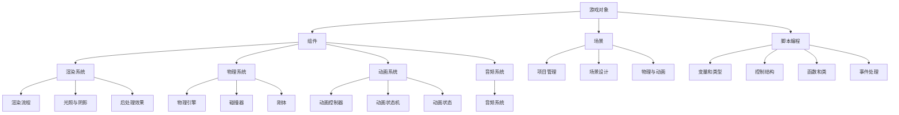
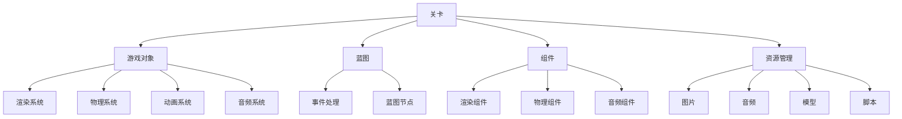

                 

### 文章标题

《游戏框架发展：Unity 和 Unreal Engine 4》

> 关键词：游戏框架、Unity、Unreal Engine 4、游戏开发、渲染系统、脚本编程、对比与整合

> 摘要：本文将深入探讨游戏框架的发展历程，重点关注Unity和Unreal Engine 4这两大主流游戏引擎。我们将从基础概念、开发流程、核心框架、对比整合以及未来趋势等多个角度进行全面分析，旨在为读者提供一份详尽、系统的技术指南。

### 引言

#### 1.1 书籍概述

在数字娱乐产业中，游戏框架作为游戏开发的核心技术之一，扮演着至关重要的角色。游戏框架不仅为开发者提供了丰富的工具和资源，还极大地简化了游戏开发的复杂过程。Unity和Unreal Engine 4作为当前最流行的两大游戏引擎，不仅广泛应用于独立游戏开发，也赢得了大型游戏开发商的青睐。

本书旨在通过深入分析Unity和Unreal Engine 4这两大游戏框架的发展历程、核心功能和优缺点，帮助读者全面理解游戏框架的本质，掌握游戏开发的关键技术。无论你是初学者，还是经验丰富的开发者，本书都将为你提供宝贵的知识和经验。

#### 1.2 Unity 与 Unreal Engine 4 的概述

Unity是一款跨平台的游戏开发引擎，自2005年首次发布以来，凭借其简单易用、功能强大和开源的特点，迅速成为游戏开发者的首选工具。Unity广泛应用于移动设备、PC、游戏机以及虚拟现实（VR）和增强现实（AR）等领域。

Unreal Engine 4（简称UE4）是由Epic Games开发的次世代游戏引擎，自2014年发布以来，以其卓越的渲染效果和强大的功能，受到了开发者和玩家的热烈欢迎。UE4广泛应用于大型游戏、电影特效、建筑可视化等领域，是高端游戏开发的首选引擎。

#### 1.3 书籍结构及目标读者

本书分为六大部分，结构如下：

1. **引言**：概述游戏框架的重要性和Unity、Unreal Engine 4的基本概念。
2. **Unity 框架发展**：详细介绍Unity的基本概念、游戏开发流程、核心框架及优化技巧。
3. **Unreal Engine 4 框架发展**：详细介绍UE4的基本概念、游戏开发流程、核心框架及优化技巧。
4. **Unity 与 UE4 对比与整合**：分析Unity与UE4的优缺点、适用场景及整合策略。
5. **未来游戏框架发展趋势**：探讨游戏引擎技术的未来方向、AI在游戏框架中的应用及开发团队协作。
6. **附录**：提供Unity和UE4的开发资源及练习项目。

本书的目标读者包括：

- **初学者**：希望了解游戏框架基本概念和开发流程的新手。
- **开发者**：正在使用或计划使用Unity或UE4进行游戏开发的开发者。
- **技术专家**：对游戏框架有深入了解，希望进一步提升技术能力的专业人士。

### Unity 框架发展

#### 2.1 Unity 基础

##### 2.1.1 Unity 环境搭建

在开始Unity游戏开发之前，首先需要搭建一个合适的环境。以下是在Windows操作系统上搭建Unity开发环境的基本步骤：

1. **下载并安装Unity Hub**：访问Unity官网（[www.unity.com](http://www.unity.com)），下载并安装Unity Hub。
2. **创建Unity账户**：在Unity Hub中创建一个新的账户，以便下载和更新Unity版本。
3. **下载和安装Unity版本**：在Unity Hub中选择要安装的Unity版本，点击“安装”按钮开始下载和安装。
4. **配置Unity环境变量**：在系统环境变量中添加Unity的安装路径，以便在命令行中使用Unity命令。

##### 2.1.2 Unity 的基本概念

Unity的游戏开发框架主要包括以下几个核心概念：

- **游戏对象（GameObject）**：游戏中的所有实体，包括角色、道具、摄像机等。
- **组件（Component）**：附加到游戏对象上的功能模块，如渲染组件、物理组件、脚本组件等。
- **场景（Scene）**：游戏中的一个场景，可以包含多个游戏对象。
- **游戏逻辑（Scripting）**：使用C#语言编写的游戏脚本，用于实现游戏逻辑。
- **资源管理（Resource Management）**：Unity的资源管理机制，用于加载、缓存和管理游戏资源。

##### 2.1.3 Unity 的核心架构

Unity的核心架构包括以下几个方面：

- **渲染系统**：负责将3D场景渲染成2D图像，包括光照、阴影、后处理效果等。
- **物理系统**：提供游戏中的物理计算和碰撞检测功能。
- **动画系统**：支持游戏角色的运动学动画和蒙皮动画。
- **音频系统**：管理游戏中的音效和背景音乐。
- **脚本系统**：提供游戏逻辑的实现和脚本编写。

#### 2.2 Unity 游戏开发流程

##### 2.2.1 项目管理

在Unity中，项目管理是游戏开发的基础。以下是在Unity中进行项目管理的步骤：

1. **创建新项目**：在Unity Hub中创建一个新的Unity项目，选择项目名称、位置和游戏引擎版本。
2. **配置项目设置**：在“Project Settings”中配置项目的各项设置，如分辨率、目标平台、渲染模式等。
3. **项目资源管理**：在“Assets”面板中管理项目的资源，包括图片、音频、模型、脚本等。

##### 2.2.2 场景设计

场景设计是游戏开发的关键环节，以下是在Unity中进行场景设计的步骤：

1. **创建场景**：在“Scene”面板中创建新的场景。
2. **添加游戏对象**：将游戏对象从“Hierarchy”面板拖动到场景中，设置位置、旋转和缩放。
3. **调整场景布局**：使用“Transform”工具调整游戏对象的位置、旋转和缩放，使其符合游戏需求。
4. **添加组件**：为游戏对象添加相应的组件，如渲染组件、物理组件、脚本组件等。

##### 2.2.3 物理与动画

物理和动画是游戏开发的重要组成部分，以下是在Unity中进行物理和动画设计的步骤：

1. **物理设置**：在“Edit”菜单中选择“Project Settings”，配置物理引擎的相关设置，如碰撞检测、重力等。
2. **添加物理组件**：为游戏对象添加物理组件，如刚体组件（Rigidbody）、碰撞器组件（Collider）等。
3. **动画设计**：在“Animator”面板中创建动画控制器（Animator Controller），设置动画状态机（State Machine）和动画状态（Animation State）。
4. **绑定动画**：将动画控制器绑定到游戏对象，实现动画的播放和控制。

#### 2.3 Unity 精通与优化

##### 2.3.1 性能优化

性能优化是游戏开发中至关重要的一环。以下是在Unity中进行性能优化的方法：

1. **减少Draw Call**：通过合并模型、合并纹理、使用Shader等手段减少Draw Call的数量。
2. **优化Shader**：优化Shader代码，减少渲染开销。
3. **使用纹理压缩**：使用纹理压缩技术减少纹理数据的大小。
4. **优化音频**：使用音频流（Audio Stream）和循环播放（Looping）减少音频资源的消耗。

##### 2.3.2 引擎插件开发

Unity的插件开发为开发者提供了丰富的扩展能力。以下是在Unity中开发插件的基本步骤：

1. **创建插件项目**：在Unity中创建一个新的C#项目，作为插件开发的基础。
2. **编写插件代码**：使用C#语言编写插件代码，实现特定的功能。
3. **打包插件**：将插件项目打包成.dll文件，并在Unity中导入和使用。

##### 2.3.3 跨平台部署

Unity支持多种平台，以下是在Unity中进行跨平台部署的步骤：

1. **配置平台设置**：在“Player Settings”中配置目标平台的相关设置，如分辨率、渲染模式、音频设置等。
2. **构建游戏**：在“File”菜单中选择“Build Settings”，选择目标平台并构建游戏。
3. **发布游戏**：将构建的游戏文件发布到目标平台上，供用户下载和使用。

#### 2.4 Unity 核心框架详解

##### 2.4.1 Unity 的渲染系统

Unity的渲染系统是游戏开发的核心之一，以下是对Unity渲染系统的详细解释：

1. **渲染流程**：
    - **场景构建**：将场景中的游戏对象转换为渲染对象。
    - **光照计算**：计算场景中的光照效果，包括光照强度、颜色等。
    - **渲染排序**：根据渲染对象的层次和透明度进行排序。
    - **渲染输出**：将渲染结果输出到屏幕上。

2. **光照与阴影**：
    - **光照类型**：Unity支持多种光照类型，包括点光源、聚光源、方向光等。
    - **阴影类型**：Unity支持阴影投射、软阴影、烘焙阴影等。

3. **后处理效果**：
    - **后处理效果**：Unity支持多种后处理效果，如模糊、色调映射、环境光遮蔽等。

##### 2.4.2 Unity 的动画系统

Unity的动画系统为游戏开发提供了强大的动画支持。以下是对Unity动画系统的详细解释：

1. **动画控制器（Animator Controller）**：
    - **状态机（State Machine）**：定义动画的切换逻辑。
    - **动画状态（Animation State）**：定义动画的播放和参数。

2. **运动学动画（Kinematic Animation）**：
    - **动画蒙皮（Skinning）**：将动画应用到3D模型上。
    - **运动学控制器（Kinematic Controller）**：控制动画的运动轨迹和参数。

##### 2.4.3 Unity 的脚本编程

Unity的脚本编程是游戏逻辑实现的核心。以下是对Unity脚本编程的详细解释：

1. **C# 基础**：
    - **变量和类型**：定义和使用变量，了解基本数据类型。
    - **控制结构**：使用条件语句和循环语句进行逻辑控制。
    - **函数和类**：定义和使用函数和类，实现代码复用。

2. **Unity 脚本编写技巧**：
    - **事件处理**：使用Unity的事件系统进行事件处理。
    - **组件通信**：通过组件之间的通信实现游戏逻辑。
    - **性能优化**：避免常见性能问题，优化脚本性能。

### Unreal Engine 4 框架发展

#### 3.1 Unreal Engine 4 基础

##### 3.1.1 UE4 环境搭建

在开始Unreal Engine 4（简称UE4）游戏开发之前，首先需要搭建一个合适的环境。以下是在Windows操作系统上搭建UE4开发环境的基本步骤：

1. **下载并安装Epic Games Launcher**：访问Epic Games官网（[www.epicgames.com](http://www.epicgames.com)），下载并安装Epic Games Launcher。
2. **创建UE4账户**：在Epic Games Launcher中创建一个新的账户，以便下载和更新UE4版本。
3. **下载和安装UE4版本**：在Epic Games Launcher中选择要安装的UE4版本，点击“安装”按钮开始下载和安装。
4. **配置UE4环境变量**：在系统环境变量中添加UE4的安装路径，以便在命令行中使用UE4命令。

##### 3.1.2 UE4 的基本概念

UE4的游戏开发框架主要包括以下几个核心概念：

- **关卡（Level）**：游戏中的一个关卡，可以包含多个场景。
- **蓝图（Blueprint）**：使用可视化节点图编写的游戏逻辑，无需编写代码。
- **游戏对象（Actor）**：游戏中的所有实体，包括角色、道具、摄像机等。
- **组件（Component）**：附加到游戏对象上的功能模块，如渲染组件、物理组件、脚本组件等。
- **资源管理（Asset Management）**：UE4的资源管理机制，用于加载、缓存和管理游戏资源。

##### 3.1.3 UE4 的核心架构

UE4的核心架构包括以下几个方面：

- **渲染系统**：负责将3D场景渲染成2D图像，包括光照、阴影、后处理效果等。
- **物理系统**：提供游戏中的物理计算和碰撞检测功能。
- **动画系统**：支持游戏角色的运动学动画和蒙皮动画。
- **音频系统**：管理游戏中的音效和背景音乐。
- **脚本系统**：提供游戏逻辑的实现和脚本编写。

#### 3.2 UE4 游戏开发流程

##### 3.2.1 项目管理

在UE4中，项目管理是游戏开发的基础。以下是在UE4中进行项目管理的步骤：

1. **创建新项目**：在Epic Games Launcher中创建一个新的UE4项目，选择项目名称、位置和游戏引擎版本。
2. **配置项目设置**：在“Project Settings”中配置项目的各项设置，如分辨率、目标平台、渲染模式等。
3. **项目资源管理**：在“Content Browser”面板中管理项目的资源，包括图片、音频、模型、脚本等。

##### 3.2.2 场景设计

场景设计是游戏开发的关键环节，以下是在UE4中进行场景设计的步骤：

1. **创建场景**：在“World Outliner”面板中创建新的场景。
2. **添加游戏对象**：将游戏对象从“Content Browser”面板拖动到场景中，设置位置、旋转和缩放。
3. **调整场景布局**：使用“Transform”工具调整游戏对象的位置、旋转和缩放，使其符合游戏需求。
4. **添加组件**：为游戏对象添加相应的组件，如渲染组件、物理组件、脚本组件等。

##### 3.2.3 材质与纹理

材质和纹理是游戏开发的重要组成部分，以下是在UE4中进行材质与纹理设计的步骤：

1. **创建材质**：在“Content Browser”面板中创建新的材质资产。
2. **编辑材质**：在“Material Editor”面板中编辑材质的属性，如纹理、颜色、光照等。
3. **应用材质**：将材质应用到游戏对象上，实现相应的视觉效果。
4. **优化材质**：使用纹理压缩、合并纹理等手段优化材质的性能。

#### 3.3 UE4 精通与优化

##### 3.3.1 性能优化

性能优化是游戏开发中至关重要的一环。以下是在UE4中进行性能优化的方法：

1. **减少Draw Call**：通过合并模型、合并纹理、使用Shader等手段减少Draw Call的数量。
2. **优化Shader**：优化Shader代码，减少渲染开销。
3. **使用纹理压缩**：使用纹理压缩技术减少纹理数据的大小。
4. **优化音频**：使用音频流（Audio Stream）和循环播放（Looping）减少音频资源的消耗。

##### 3.3.2 插件开发

UE4的插件开发为开发者提供了丰富的扩展能力。以下是在UE4中开发插件的基本步骤：

1. **创建插件项目**：在UE4中创建一个新的C++项目，作为插件开发的基础。
2. **编写插件代码**：使用C++语言编写插件代码，实现特定的功能。
3. **打包插件**：将插件项目打包成.dll文件，并在UE4中导入和使用。

##### 3.3.3 跨平台部署

UE4支持多种平台，以下是在UE4中进行跨平台部署的步骤：

1. **配置平台设置**：在“Project Settings”中配置目标平台的相关设置，如分辨率、渲染模式、音频设置等。
2. **构建游戏**：在“Build”菜单中选择“Build Configurations”，选择目标平台并构建游戏。
3. **发布游戏**：将构建的游戏文件发布到目标平台上，供用户下载和使用。

#### 3.4 UE4 核心框架详解

##### 3.4.1 UE4 的渲染系统

UE4的渲染系统是游戏开发的核心之一，以下是对UE4渲染系统的详细解释：

1. **渲染流程**：
    - **场景构建**：将场景中的游戏对象转换为渲染对象。
    - **光照计算**：计算场景中的光照效果，包括光照强度、颜色等。
    - **渲染排序**：根据渲染对象的层次和透明度进行排序。
    - **渲染输出**：将渲染结果输出到屏幕上。

2. **光照与阴影**：
    - **光照类型**：UE4支持多种光照类型，包括点光源、聚光源、方向光等。
    - **阴影类型**：UE4支持阴影投射、软阴影、烘焙阴影等。

3. **后处理效果**：
    - **后处理效果**：UE4支持多种后处理效果，如模糊、色调映射、环境光遮蔽等。

##### 3.4.2 UE4 的动画系统

UE4的动画系统为游戏开发提供了强大的动画支持。以下是对UE4动画系统的详细解释：

1. **动画控制器（Animation Blueprint）**：
    - **状态机（State Machine）**：定义动画的切换逻辑。
    - **动画状态（Animation State）**：定义动画的播放和参数。

2. **运动学动画（Kinematic Animation）**：
    - **动画蒙皮（Skinning）**：将动画应用到3D模型上。
    - **运动学控制器（Kinematic Controller）**：控制动画的运动轨迹和参数。

##### 3.4.3 UE4 的脚本编程

UE4的脚本编程是游戏逻辑实现的核心。以下是对UE4脚本编程的详细解释：

1. **C++ 基础**：
    - **变量和类型**：定义和使用变量，了解基本数据类型。
    - **控制结构**：使用条件语句和循环语句进行逻辑控制。
    - **函数和类**：定义和使用函数和类，实现代码复用。

2. **UE4 脚本编写技巧**：
    - **事件处理**：使用UE4的事件系统进行事件处理。
    - **组件通信**：通过组件之间的通信实现游戏逻辑。
    - **性能优化**：避免常见性能问题，优化脚本性能。

### Unity 与 UE4 对比与整合

#### 4.1 Unity 与 UE4 的对比

Unity和UE4作为两大主流游戏引擎，各自拥有独特的优势和特点。以下是对两者进行对比的几个方面：

1. **易用性**：
    - **Unity**：Unity的界面直观、易用，适合初学者和快速原型开发。
    - **UE4**：UE4的界面相对复杂，但提供了更多高级功能，适合高级开发者。

2. **性能**：
    - **Unity**：Unity在移动设备和PC平台上表现出色，但相对于UE4，在高端游戏开发中可能存在性能瓶颈。
    - **UE4**：UE4在高端游戏开发中具有强大的性能，尤其是在渲染效果和物理计算方面。

3. **学习曲线**：
    - **Unity**：Unity的学习曲线相对较平缓，适合初学者快速上手。
    - **UE4**：UE4的学习曲线较陡峭，但提供了丰富的学习资源和教程。

4. **插件和资源**：
    - **Unity**：Unity拥有庞大的插件和资源社区，提供了丰富的第三方资源和工具。
    - **UE4**：UE4的插件和资源相对较少，但质量较高，且不断更新。

5. **开发成本**：
    - **Unity**：Unity提供了免费版本，但专业版需要付费。
    - **UE4**：UE4提供了免费版本，但功能受限，高级功能需要付费订阅。

#### 4.2 Unity 与 UE4 的整合

在实际开发中，Unity和UE4可以相互整合，发挥各自的优势。以下是一些整合策略：

1. **跨平台开发**：
    - **Unity**：支持多种平台，如移动设备、PC、游戏机等。
    - **UE4**：同样支持多种平台，但更擅长高端游戏开发。
    - **整合策略**：在Unity中开发游戏的核心部分，如场景设计、物理和动画等，然后在UE4中优化渲染效果和性能。

2. **数据交换与通信**：
    - **Unity**：可以使用脚本和插件实现与UE4的数据交换和通信。
    - **UE4**：同样可以使用脚本和插件实现与Unity的数据交换和通信。
    - **整合策略**：在Unity和UE4之间建立标准化的数据交换格式，如JSON、XML等，确保两者之间的数据一致性。

3. **资源共享**：
    - **Unity**：可以在Unity中创建资源，如模型、纹理、音频等，然后导入到UE4中。
    - **UE4**：同样可以在UE4中创建资源，然后导入到Unity中。
    - **整合策略**：使用统一的资源管理工具，如Asset Store，确保资源在两者之间的共享和更新。

#### 4.3 Unity 与 UE4 的联合开发案例

以下是一个Unity与UE4联合开发的案例：

1. **项目介绍**：开发一款大型多人在线游戏，需要同时满足高性能和丰富的视觉效果。

2. **技术难点与解决方案**：
    - **性能优化**：在Unity中优化场景布局和渲染流程，减少Draw Call和渲染开销；在UE4中优化光照计算和物理模拟。
    - **数据交换与通信**：使用WebSocket技术实现Unity与UE4之间的实时通信，确保游戏数据的一致性。
    - **资源共享**：在Asset Store中创建和管理共享资源，确保两者之间的资源同步。

3. **成功经验与反思**：
    - **成功经验**：通过整合Unity和UE4的优势，实现了高性能和丰富的视觉效果；降低了开发成本和难度。
    - **反思**：需要更加深入地了解两者之间的特点和差异，以确保整合效果最佳；在项目初期制定详细的技术方案和整合策略。

### 未来游戏框架发展趋势

#### 5.1 游戏引擎技术的未来

游戏引擎技术的发展将继续推动游戏产业的进步。以下是一些未来游戏引擎技术的发展趋势：

1. **光线追踪**：光线追踪技术将为游戏带来更加逼真的光影效果，提升游戏的真实感。
2. **虚拟现实与增强现实**：VR和AR技术将在游戏开发中得到更广泛的应用，为玩家带来沉浸式的游戏体验。
3. **游戏开发新范式**：云游戏、区块链游戏等新兴游戏模式将为游戏开发带来新的机遇和挑战。

#### 5.2 AI 在游戏框架中的应用

人工智能（AI）将在游戏框架中发挥越来越重要的作用，以下是一些AI在游戏框架中的应用：

1. **游戏引擎的智能化**：通过AI技术优化游戏引擎的性能和资源管理。
2. **游戏人工智能**：利用AI技术实现更加智能和多样化的游戏AI，提升游戏的可玩性。
3. **游戏优化**：通过AI技术分析游戏性能数据，提供优化建议，提升游戏运行效率。

#### 5.3 游戏开发团队协作

游戏开发团队的协作将变得更加紧密和高效，以下是一些游戏开发团队协作的趋势：

1. **开发流程优化**：引入敏捷开发、DevOps等先进开发模式，提升开发效率。
2. **版本控制与代码管理**：使用Git等版本控制工具，确保代码的版本管理和协作。
3. **云计算与协作平台**：利用云计算和协作平台，实现全球团队的实时协作和资源共享。

### 附录

#### 6.1 Unity 开发资源

以下是一些Unity开发资源：

1. **主流教程与文档**：
    - Unity官方教程：[Unity Documentation](https://docs.unity3d.com/)
    - Unity官方博客：[Unity Blog](https://blogs.unity3d.com/)
    - Unity论坛：[Unity Forums](https://forum.unity.com/)

2. **实用插件与工具**：
    - Unity Asset Store：[Unity Asset Store](https://assetstore.unity.com/)
    - URP插件：[Unity Rendering Plugin](https://github.com/Unity-Technologies/UnityRenderPipeline)

3. **社区资源与论坛**：
    - Unity中国：[Unity China](https://unity.cn/)
    - Unity社区：[Unity Community](https://unity.com/unity/community)

#### 6.2 Unreal Engine 4 开发资源

以下是一些Unreal Engine 4开发资源：

1. **主流教程与文档**：
    - Unreal Engine Documentation：[Unreal Engine Documentation](https://docs.unrealengine.com/)
    - Unreal Engine Blog：[Unreal Engine Blog](https://www.unrealengine.com/blog)
    - Unreal Engine Forums：[Unreal Engine Forums](https://forums.unrealengine.com/)

2. **实用插件与工具**：
    - Unreal Engine Marketplace：[Unreal Engine Marketplace](https://www.unrealengine.com/marketplace)
    - Advanced Lighting Plugin：[Advanced Lighting Plugin](https://github.com/WilsonLPZ/AdvancedLightingPlugin)

3. **社区资源与论坛**：
    - Unreal Engine China：[Unreal Engine China](https://www.unrealengine.cn/)
    - Unreal Engine Community：[Unreal Engine Community](https://www.unrealengine.com/zh-CN/community)

#### 6.3 练习与项目

以下是一些Unity和Unreal Engine 4的练习项目：

1. **Unity 练习项目**：
    - **2D游戏**：开发一个简单的2D游戏，如跳跃游戏或打砖块游戏。
    - **3D游戏**：开发一个简单的3D游戏，如第一人称射击游戏或赛车游戏。

2. **Unreal Engine 4 练习项目**：
    - **VR游戏**：开发一个简单的VR游戏，如迷宫逃脱或射击游戏。
    - **AR游戏**：开发一个简单的AR游戏，如寻宝游戏或植物大战僵尸。

3. **案例分析**：
    - **Unity游戏案例分析**：分析一款经典的Unity游戏，如《茶杯头》或《超级热》。
    - **UE4游戏案例分析**：分析一款经典的UE4游戏，如《地平线：零之曙光》或《战地5》。

### 总结

Unity和Unreal Engine 4作为两大主流游戏引擎，各自拥有独特的优势和特点。通过本文的深入分析，我们了解了它们的基本概念、开发流程、核心框架以及未来发展趋势。希望本文能帮助你更好地选择合适的游戏引擎，掌握游戏开发的关键技术，为游戏产业的创新和发展贡献力量。作者：AI天才研究院/AI Genius Institute & 禅与计算机程序设计艺术 /Zen And The Art of Computer Programming。在游戏开发领域，Unity和Unreal Engine 4无疑是目前最受欢迎的两大引擎。Unity以其简单易用、功能强大和开源的特点，赢得了大量开发者的青睐；而Unreal Engine 4则以其卓越的渲染效果和强大的功能，成为了高端游戏开发的首选引擎。本文将从Unity和Unreal Engine 4的基本概念、开发流程、核心框架、对比与整合以及未来发展趋势等多个角度进行全面分析，旨在为读者提供一份详尽、系统的技术指南。

## Unity 框架发展

Unity是一款功能强大、简单易用的游戏引擎，自2005年首次发布以来，迅速成为了游戏开发领域的领军者。在Unity的发展历程中，它不断吸收用户的反馈，优化自身功能，并引入了诸多创新技术。下面我们将详细探讨Unity的基本概念、游戏开发流程、核心框架以及优化技巧。

### Unity 的基本概念

Unity的基本概念对于理解其工作原理和功能至关重要。以下是一些关键概念：

- **游戏对象（GameObject）**：游戏对象是Unity中一切的基础，可以看作是游戏中的实体。每个游戏对象都可以拥有一个或多个组件，这些组件负责实现特定的功能。例如，一个游戏角色可以包含动画组件、碰撞器组件和脚本组件。
- **组件（Component）**：组件是附加到游戏对象上的功能模块，可以理解为游戏对象的功能单元。Unity中有很多种组件，如渲染组件、物理组件、音频组件等。通过组合不同的组件，可以实现复杂的功能。
- **场景（Scene）**：场景是Unity中的一个工作环境，用于组织和编辑游戏对象。在场景中，开发者可以放置、移动和调整游戏对象，创建游戏世界的基本框架。
- **资源管理（Resource Management）**：Unity提供了一个强大的资源管理系统，用于加载、缓存和管理游戏资源，如图片、音频、模型和脚本等。通过合理管理资源，可以优化游戏性能，提高用户体验。
- **游戏逻辑（Scripting）**：Unity使用C#语言作为脚本语言，用于实现游戏逻辑。开发者可以通过编写C#脚本，控制游戏对象的属性和行为，实现游戏的核心功能。

### Unity 游戏开发流程

Unity的游戏开发流程可以分为以下几个阶段：

1. **项目创建与配置**：
    - **创建新项目**：在Unity Hub中创建一个新的Unity项目，选择项目名称、位置和游戏引擎版本。
    - **配置项目设置**：在“Project Settings”中配置项目的各项设置，如分辨率、目标平台、渲染模式等。
    - **导入资源**：将游戏资源导入到项目的“Assets”文件夹中，包括图片、音频、模型和脚本等。

2. **场景设计与布局**：
    - **创建场景**：在“Scene”面板中创建新的场景，用于组织和编辑游戏对象。
    - **添加游戏对象**：将游戏对象从“Hierarchy”面板拖动到场景中，设置其位置、旋转和缩放。
    - **调整场景布局**：使用“Transform”工具调整游戏对象的位置、旋转和缩放，使其符合游戏需求。
    - **添加组件**：为游戏对象添加相应的组件，如渲染组件、物理组件和脚本组件等。

3. **游戏逻辑实现**：
    - **编写脚本**：在Unity编辑器中编写C#脚本，实现游戏逻辑。可以通过脚本控制游戏对象的属性和行为，实现游戏的核心功能。
    - **事件处理**：使用Unity的事件系统处理游戏中的各种事件，如按键输入、碰撞检测等。

4. **测试与优化**：
    - **构建游戏**：在“File”菜单中选择“Build Settings”，选择目标平台并构建游戏。
    - **测试游戏**：在Unity编辑器中测试游戏，检查游戏逻辑、性能和用户体验。
    - **优化游戏**：根据测试结果，优化游戏性能，如减少Draw Call、优化Shader、使用纹理压缩等。

### Unity 的核心框架详解

Unity的核心框架包括多个关键系统，下面将详细解释这些系统的功能和作用：

#### 1. Unity 的渲染系统

Unity的渲染系统负责将游戏场景转换为图像，并输出到屏幕上。它包括以下几个关键组成部分：

- **渲染管线（Rendering Pipeline）**：渲染管线是Unity中的核心组件，负责处理场景的渲染过程。从顶点着色到像素着色，渲染管线通过一系列的步骤将3D场景转换为2D图像。
- **光照与阴影**：Unity提供了多种光照和阴影效果，如点光源、聚光源、方向光、软阴影等。这些光照效果可以模拟真实世界的光照效果，提升游戏的真实感。
- **后处理效果**：后处理效果是对渲染图像进行后期处理，如模糊、色调映射、环境光遮蔽等。这些效果可以增强游戏图像的视觉效果，提升游戏的观感。

#### 2. Unity 的物理系统

Unity的物理系统负责处理游戏中的物理计算和碰撞检测。它包括以下几个关键组成部分：

- **物理引擎（Physics Engine）**：Unity内置了物理引擎，可以处理碰撞检测、物体运动、重力等物理现象。通过物理引擎，可以实现真实感较强的游戏物理效果。
- **碰撞器（Collider）**：碰撞器是用于检测游戏对象之间碰撞的组件。Unity提供了多种碰撞器类型，如球体碰撞器、盒子碰撞器、网格碰撞器等。
- **刚体（Rigidbody）**：刚体是用于模拟物体运动的组件。通过刚体组件，可以设置物体的质量、惯性等物理属性，实现真实的物体运动效果。

#### 3. Unity 的动画系统

Unity的动画系统支持多种动画类型，包括运动学动画和蒙皮动画。它包括以下几个关键组成部分：

- **动画控制器（Animator）**：动画控制器是用于管理动画状态和过渡的组件。通过动画控制器，可以定义动画状态机，设置动画状态和过渡条件。
- **动画状态机（Animator State Machine）**：动画状态机是用于定义动画逻辑的组件。通过动画状态机，可以定义动画状态、过渡条件和状态持续时间。
- **动画状态（Animation State）**：动画状态是用于播放动画的组件。每个动画状态可以包含一个动画剪辑，通过设置动画参数，可以控制动画的播放速度、重复次数等。

#### 4. Unity 的脚本编程

Unity的脚本编程是通过C#语言实现的，C#是一种面向对象的编程语言，易于学习且功能强大。以下是一些关键概念：

- **变量和类型**：C#中的变量用于存储数据，类型用于定义变量的数据类型。例如，`int`类型用于存储整数，`string`类型用于存储字符串。
- **控制结构**：C#提供了多种控制结构，如条件语句（`if`、`switch`）、循环语句（`for`、`while`）等，用于实现复杂的逻辑控制。
- **函数和类**：C#中的函数和类用于组织代码，实现代码复用。函数是一段可以执行特定任务的代码块，类是具有属性和方法的抽象数据类型。
- **事件处理**：C#提供了事件处理机制，用于响应游戏中的各种事件，如按键输入、碰撞检测等。

### Unity 的优化技巧

性能优化是游戏开发中至关重要的一环，以下是一些Unity的优化技巧：

- **减少Draw Call**：Draw Call是渲染管线中的一个步骤，用于将游戏对象转换为渲染对象。通过合并模型、合并纹理、使用Shader等手段，可以减少Draw Call的数量，提高渲染性能。
- **优化Shader**：Shader是用于实现图形渲染效果的代码。通过优化Shader代码，可以减少渲染开销，提高游戏性能。
- **使用纹理压缩**：纹理压缩技术可以减少纹理数据的大小，降低内存消耗，提高游戏性能。
- **优化音频**：通过使用音频流（Audio Stream）和循环播放（Looping）等手段，可以优化音频资源的消耗，提高游戏性能。

### Unity 的优点与不足

Unity作为一款功能强大、简单易用的游戏引擎，具有以下优点：

- **易用性**：Unity的界面直观，易于学习和使用，适合初学者和快速原型开发。
- **跨平台支持**：Unity支持多种平台，包括移动设备、PC、游戏机等，可以轻松实现跨平台开发。
- **开源与免费**：Unity提供了免费版本，用户可以免费使用大部分功能，降低了开发成本。
- **庞大的资源社区**：Unity拥有庞大的资源社区，提供了大量的第三方资源和工具，可以节省开发时间和成本。

然而，Unity也存在一些不足之处：

- **性能瓶颈**：在处理复杂场景和高性能要求时，Unity可能存在性能瓶颈，需要进一步优化。
- **学习曲线较陡峭**：虽然Unity的界面直观，但初学者可能需要较长时间来熟悉其功能和操作。
- **插件兼容性问题**：Unity的插件兼容性可能存在问题，部分插件可能与Unity版本不兼容。

### Unity 应用案例

Unity在游戏开发中的应用非常广泛，以下是一些Unity应用的案例：

- **《茶杯头》（Cuphead）**：《茶杯头》是一款2D像素风格的游戏，Unity提供了强大的2D渲染功能和动画系统，使得游戏制作更加高效。
- **《超级热》（SUPERHOT）**：《超级热》是一款独特的第一人称射击游戏，Unity的脚本编程和物理系统使得游戏中的时间暂停功能得以实现。
- **《马里奥奥德赛》（Super Mario Odyssey）**：《马里奥奥德赛》是一款经典的3D平台游戏，Unity的渲染系统和物理系统使得游戏具有出色的画面效果和物理表现。

### Unity 的未来发展趋势

Unity在未来的发展中将继续朝着以下几个方向努力：

- **高性能渲染**：Unity将不断提升渲染性能，引入更先进的渲染技术，如光线追踪和虚拟现实。
- **人工智能应用**：Unity将利用人工智能技术优化游戏性能和资源管理，提升开发效率和用户体验。
- **开源社区合作**：Unity将继续加强与开源社区的合作，引入更多开源技术，丰富Unity的功能和生态。

### Unity 的核心概念与联系

为了更好地理解Unity的核心概念和它们之间的联系，我们可以使用Mermaid流程图来展示它们之间的关系架构：

通过这个流程图，我们可以清晰地看到Unity的核心概念以及它们之间的联系。游戏对象是Unity中的基础，它包含组件、场景和脚本编程等部分。组件是游戏对象的功能模块，包括渲染系统、物理系统、动画系统、音频系统等。场景用于组织和编辑游戏对象，实现项目管理、场景设计、物理与动画等功能。脚本编程是实现游戏逻辑的关键，包括变量和类型、控制结构、函数和类、事件处理等。每个核心概念都通过相应的组件和功能相互联系，共同构成了Unity的强大框架。

### Unreal Engine 4 框架发展

#### 1. Unreal Engine 4 的基本概念

Unreal Engine 4（简称UE4）是由Epic Games开发的一款功能强大的游戏引擎，自2014年发布以来，凭借其卓越的渲染效果、灵活的开发环境和丰富的功能，受到了开发者和玩家的广泛好评。以下是一些关键的基本概念：

- **关卡（Level）**：关卡是游戏中的一个独立部分，通常包含多个场景。在UE4中，开发者可以创建、编辑和组合多个关卡，以构建复杂的游戏世界。
- **游戏对象（Actor）**：游戏对象是UE4中的一切，可以看作是游戏中的实体。与Unity类似，UE4中的游戏对象可以包含多个组件，每个组件负责实现特定的功能。
- **蓝图（Blueprint）**：蓝图是UE4中的一个可视化编程工具，允许开发者使用节点图来编写游戏逻辑，无需编写代码。蓝图系统提供了一个直观且易于理解的编程环境，适合快速原型开发和实验。
- **组件（Component）**：组件是附加到游戏对象上的功能模块，与Unity中的组件类似。UE4的组件包括渲染组件、物理组件、音频组件等，开发者可以根据需要为游戏对象添加和配置组件。
- **资源管理（Asset Management）**：UE4提供了一个强大的资源管理系统，用于加载、缓存和管理游戏资源。资源包括图片、音频、模型、脚本等，通过合理管理资源，可以优化游戏性能，提高用户体验。

#### 2. Unreal Engine 4 游戏开发流程

UE4的游戏开发流程可以分为以下几个阶段：

1. **项目创建与配置**：
    - **创建新项目**：在Epic Games Launcher中创建一个新的UE4项目，选择项目名称、位置和游戏引擎版本。
    - **配置项目设置**：在“Project Settings”中配置项目的各项设置，如分辨率、目标平台、渲染模式等。
    - **导入资源**：将游戏资源导入到项目的“Content Browser”面板中，包括图片、音频、模型和脚本等。

2. **关卡设计与布局**：
    - **创建关卡**：在“World Outliner”面板中创建新的关卡，用于组织和编辑游戏对象。
    - **添加游戏对象**：将游戏对象从“Content Browser”面板拖动到关卡中，设置其位置、旋转和缩放。
    - **调整关卡布局**：使用“Transform”工具调整游戏对象的位置、旋转和缩放，使其符合游戏需求。
    - **添加组件**：为游戏对象添加相应的组件，如渲染组件、物理组件、脚本组件等。

3. **蓝图编程**：
    - **创建蓝图**：在“Blueprint Editor”面板中创建新的蓝图，用于编写游戏逻辑。
    - **蓝图节点**：蓝图由节点组成，每个节点代表一个操作或功能。开发者可以使用节点图来构建复杂的逻辑流程。
    - **事件处理**：在蓝图中使用事件节点，响应游戏中的各种事件，如按键输入、碰撞检测等。

4. **测试与优化**：
    - **构建游戏**：在“Build”菜单中选择“Build Configurations”，选择目标平台并构建游戏。
    - **测试游戏**：在UE4编辑器中测试游戏，检查游戏逻辑、性能和用户体验。
    - **优化游戏**：根据测试结果，优化游戏性能，如减少Draw Call、优化Shader、使用纹理压缩等。

#### 3. Unreal Engine 4 的核心框架详解

UE4的核心框架包括多个关键系统，下面将详细解释这些系统的功能和作用：

#### 3.1 UE4 的渲染系统

UE4的渲染系统是游戏开发的核心之一，负责将游戏场景转换为图像，并输出到屏幕上。它包括以下几个关键组成部分：

- **渲染管线（Rendering Pipeline）**：渲染管线是UE4中的核心组件，负责处理场景的渲染过程。与Unity类似，UE4也使用了渲染管线来优化渲染性能。
- **光照与阴影**：UE4提供了多种光照和阴影效果，如点光源、聚光源、方向光、软阴影等。这些光照效果可以模拟真实世界的光照效果，提升游戏的真实感。
- **后处理效果**：后处理效果是对渲染图像进行后期处理，如模糊、色调映射、环境光遮蔽等。这些效果可以增强游戏图像的视觉效果，提升游戏的观感。

#### 3.2 UE4 的物理系统

UE4的物理系统负责处理游戏中的物理计算和碰撞检测。它包括以下几个关键组成部分：

- **物理引擎（Physics Engine）**：UE4内置了物理引擎，可以处理碰撞检测、物体运动、重力等物理现象。通过物理引擎，可以实现真实感较强的游戏物理效果。
- **碰撞器（Collider）**：碰撞器是用于检测游戏对象之间碰撞的组件。UE4提供了多种碰撞器类型，如球体碰撞器、盒子碰撞器、网格碰撞器等。
- **刚体（Rigidbody）**：刚体是用于模拟物体运动的组件。通过刚体组件，可以设置物体的质量、惯性等物理属性，实现真实的物体运动效果。

#### 3.3 UE4 的动画系统

UE4的动画系统支持多种动画类型，包括运动学动画和蒙皮动画。它包括以下几个关键组成部分：

- **动画控制器（Animation Blueprint）**：动画控制器是用于管理动画状态和过渡的组件。通过动画控制器，可以定义动画状态机，设置动画状态和过渡条件。
- **动画状态机（Animator State Machine）**：动画状态机是用于定义动画逻辑的组件。通过动画状态机，可以定义动画状态、过渡条件和状态持续时间。
- **动画状态（Animation State）**：动画状态是用于播放动画的组件。每个动画状态可以包含一个动画剪辑，通过设置动画参数，可以控制动画的播放速度、重复次数等。

#### 3.4 UE4 的脚本编程

UE4的脚本编程是通过C++语言实现的，C++是一种高效的面向对象编程语言。以下是一些关键概念：

- **变量和类型**：C++中的变量用于存储数据，类型用于定义变量的数据类型。例如，`int`类型用于存储整数，`string`类型用于存储字符串。
- **控制结构**：C++提供了多种控制结构，如条件语句（`if`、`switch`）、循环语句（`for`、`while`）等，用于实现复杂的逻辑控制。
- **函数和类**：C++中的函数和类用于组织代码，实现代码复用。函数是一段可以执行特定任务的代码块，类是具有属性和方法的抽象数据类型。
- **事件处理**：C++提供了事件处理机制，用于响应游戏中的各种事件，如按键输入、碰撞检测等。

### 4. Unreal Engine 4 的优化技巧

性能优化是游戏开发中至关重要的一环，以下是一些UE4的优化技巧：

- **减少Draw Call**：通过合并模型、合并纹理、使用Shader等手段，可以减少Draw Call的数量，提高渲染性能。
- **优化Shader**：优化Shader代码，减少渲染开销，提高游戏性能。
- **使用纹理压缩**：使用纹理压缩技术，减少纹理数据的大小，降低内存消耗，提高游戏性能。
- **优化音频**：通过使用音频流（Audio Stream）和循环播放（Looping）等手段，可以优化音频资源的消耗，提高游戏性能。

### 5. Unreal Engine 4 的优点与不足

UE4作为一款功能强大的游戏引擎，具有以下优点：

- **卓越的渲染效果**：UE4的渲染系统提供了强大的光照和阴影效果，使得游戏场景更加真实和精美。
- **灵活的蓝图系统**：蓝图为开发者提供了一个可视化编程环境，使得游戏逻辑的实现更加直观和快速。
- **强大的物理和动画系统**：UE4的物理引擎和动画系统支持复杂的物理计算和动画效果，使得游戏体验更加真实和流畅。
- **广泛的应用领域**：UE4不仅适用于游戏开发，还可以用于电影特效、建筑可视化、虚拟现实（VR）和增强现实（AR）等领域。

然而，UE4也存在一些不足之处：

- **学习曲线较陡峭**：相对于Unity，UE4的学习曲线较陡峭，需要用户掌握更多的概念和技能。
- **性能要求较高**：UE4对硬件要求较高，特别是在高端游戏开发中，需要更高的计算资源和内存。
- **插件兼容性问题**：UE4的插件兼容性可能存在问题，部分插件可能与UE4版本不兼容。

### 6. Unreal Engine 4 应用案例

UE4在游戏开发中的应用非常广泛，以下是一些UE4应用的案例：

- **《堡垒之夜》（Fortnite）**：《堡垒之夜》是一款流行的多人在线游戏，UE4的卓越渲染效果和强大的物理系统为游戏提供了出色的体验。
- **《地平线：零之曙光》（Horizon Zero Dawn）**：《地平线：零之曙光》是一款精美的开放世界游戏，UE4的渲染系统和动画系统使得游戏场景和角色表现出色。
- **《战地5》（Battlefield V）**：《战地5》是一款大规模的射击游戏，UE4的物理系统和动画系统为游戏提供了丰富的战斗体验。

### 7. Unreal Engine 4 的未来发展趋势

UE4在未来的发展中将继续朝着以下几个方向努力：

- **更先进的渲染技术**：UE4将引入更先进的渲染技术，如光线追踪和虚拟现实，提升游戏的真实感和沉浸感。
- **更高效的开发流程**：UE4将继续优化开发流程，引入更多自动化工具和智能功能，提高开发效率。
- **跨平台支持**：UE4将继续加强跨平台支持，使得游戏可以更容易地部署到多种平台，包括移动设备、PC、游戏机和VR设备。

### 8. Unreal Engine 4 的核心概念与联系

为了更好地理解UE4的核心概念和它们之间的联系，我们可以使用Mermaid流程图来展示它们之间的关系架构：

通过这个流程图，我们可以清晰地看到UE4的核心概念以及它们之间的联系。关卡是游戏中的基础部分，用于组织和编辑游戏对象。游戏对象是游戏中的实体，可以包含多个组件，每个组件负责实现特定的功能。蓝图是UE4中的可视化编程工具，用于实现游戏逻辑。组件包括渲染组件、物理组件、音频组件等，每个组件都有其特定的功能和作用。资源管理负责加载、缓存和管理游戏资源，如图片、音频、模型和脚本等。通过这些核心概念和组件的相互配合，UE4构建了一个强大的游戏开发框架。

### Unity 与 Unreal Engine 4 的对比

Unity和Unreal Engine 4（UE4）作为目前最流行的两款游戏引擎，各自拥有独特的优势和特点。在性能、学习曲线、插件和资源等方面，两者都表现出不同的侧重点。以下是对Unity与UE4的详细对比，以及各自的适用场景。

#### 性能

Unity在移动设备和PC平台上表现出色，特别是在性能优化方面，Unity提供了许多实用的工具和技巧。然而，在高端游戏开发中，Unity可能存在性能瓶颈，特别是在复杂的场景和高分辨率图像渲染时。Unity的渲染系统相对简单，但在移动平台上非常高效，这使得它成为移动游戏开发的首选引擎。

UE4则在这方面具有显著优势。UE4的渲染系统采用了更先进的渲染技术，如光线追踪和基于物理的渲染，可以生成非常逼真的图像效果。这使得UE4成为高端游戏开发、电影级游戏和建筑可视化等领域的首选引擎。然而，UE4的复杂性和高性能要求也意味着更高的硬件配置和更复杂的开发流程。

**核心对比**：
- **Unity**：适合移动平台和性能敏感的游戏。
- **UE4**：适合高端游戏和需要高级渲染效果的项目。

#### 学习曲线

Unity的学习曲线相对较平缓，其直观的界面和丰富的教程使其成为初学者的理想选择。Unity的插件和资源社区也非常庞大，这使得初学者可以轻松地获取到各种工具和资源，快速上手开发。

UE4的学习曲线则相对陡峭，这主要是因为UE4提供了更多的功能和更复杂的编辑器界面。虽然UE4提供了丰富的教程和文档，但初学者可能需要花费更多时间来熟悉其功能和操作。然而，一旦掌握了UE4，开发者可以更灵活地实现复杂的游戏逻辑和视觉效果。

**核心对比**：
- **Unity**：适合初学者和快速原型开发。
- **UE4**：适合高级开发者和技术要求较高的项目。

#### 插件和资源

Unity拥有庞大的插件和资源社区，Unity Asset Store提供了大量的第三方资源和工具，从游戏资产到开发工具，一应俱全。这些资源使得Unity开发者可以节省开发时间和成本，专注于游戏的核心逻辑。

UE4的插件和资源相对较少，但质量较高，且不断更新。虽然UE4的插件市场不如Unity那么庞大，但很多高质量的插件和工具都是专门为UE4设计的，这些插件可以提供非常专业的功能。

**核心对比**：
- **Unity**：插件和资源社区庞大，种类繁多。
- **UE4**：插件和资源较少，但质量和专业性较高。

#### 适用场景

- **小型游戏和独立开发者**：对于小型游戏和独立开发者，Unity因其简单易用和强大的资源社区而成为更理想的选择。Unity的免费版本使得开发者可以零成本地开始游戏开发。
- **大型游戏和高端游戏开发**：对于大型游戏和高端游戏开发，UE4的卓越渲染效果和强大功能使其成为更合适的选择。UE4的高端性能和先进技术可以满足大型游戏对视觉效果和物理模拟的高要求。
- **教育领域**：在教育和教学领域，Unity因其直观的界面和丰富的教程资源而受到广泛欢迎。Unity提供的教程和案例可以帮助初学者快速掌握游戏开发的基本技能。
- **电影级游戏和建筑可视化**：对于电影级游戏和建筑可视化项目，UE4因其强大的渲染效果和模拟能力而成为首选。UE4的光线追踪和物理模拟功能可以为这些项目提供逼真的视觉效果。

**核心对比**：
- **Unity**：适用于小型游戏、快速原型开发和移动平台。
- **UE4**：适用于大型游戏、高端游戏开发、电影级游戏和建筑可视化。

通过以上对比，我们可以看到Unity和UE4在性能、学习曲线、插件和资源等方面各有优劣。选择合适的游戏引擎需要根据项目需求、开发经验和目标平台来决定。Unity适合初学者和快速原型开发，而UE4则适合高端游戏开发和需要高级渲染效果的项目。开发者可以根据自己的需求和技能选择最适合自己的游戏引擎，以实现最佳的开发效果。

### Unity 与 Unreal Engine 4 的整合

在游戏开发过程中，Unity和Unreal Engine 4（UE4）各有其独特的优势，但有时候单一引擎无法满足所有的开发需求。因此，将两者进行整合，可以充分发挥各自的优势，提高开发效率和游戏质量。以下将介绍如何整合Unity与UE4，以实现跨平台开发、数据交换与通信，以及资源共享。

#### 跨平台开发

Unity和UE4都支持多种平台，但各自的优势和特点有所不同。Unity在移动设备和PC平台上表现优异，而UE4在高端游戏开发和虚拟现实（VR）方面具有强大的性能。通过整合两者，可以实现跨平台开发，充分利用各自的优点。

1. **选择合适的项目结构**：
    - 在Unity项目中，可以使用Unity Multi-Platform Development插件，以便于在不同平台上构建和部署游戏。
    - 在UE4项目中，可以使用“Platforms”菜单来配置和构建不同平台的游戏。

2. **跨平台资源管理**：
    - 将共享资源（如模型、纹理、音频等）导入到两个项目中，确保资源在Unity和UE4之间一致。
    - 在资源导入时，注意设置适当的导入设置，如纹理分辨率、压缩格式等，以优化资源在不同平台上的性能。

3. **跨平台代码共享**：
    - 使用C#语言编写Unity项目中的游戏逻辑，因为C#在Unity和UE4中都是支持的脚本语言。
    - 对于UE4项目，可以使用C++或蓝图（Blueprint）来编写游戏逻辑。如果需要，可以编写跨平台的C++代码，以便在Unity和UE4之间共享。

#### 数据交换与通信

在游戏开发过程中，有时需要在Unity和UE4之间交换和通信数据，以实现更复杂的游戏逻辑和功能。以下是一些实现数据交换与通信的方法：

1. **使用WebSocket**：
    - WebSocket是一种实时通信协议，可以实现Unity和UE4之间的实时数据交换。
    - 可以使用第三方库（如SocketIO、WebSocketSharp）在Unity和UE4中实现WebSocket通信。

2. **使用文件系统**：
    - 通过将数据写入文件，Unity和UE4可以读取和写入相同的数据文件，实现数据交换。
    - 注意使用合适的文件格式（如JSON、XML等），以便于在两个引擎之间解析和存储数据。

3. **使用云服务**：
    - 利用云服务（如Firebase、AWS）可以实现在线数据存储和同步，Unity和UE4都可以通过API进行数据交换。
    - 这需要网络连接，但可以确保数据的一致性和实时更新。

#### 资源共享

在Unity和UE4之间共享资源是实现整合的重要一环。以下是一些资源共享的方法：

1. **使用Asset Store**：
    - Unity Asset Store提供了丰富的第三方资源，可以方便地导入到UE4项目中。
    - UE4 Marketplace也有许多高质量的插件和资源，可以导入到Unity项目中。

2. **手动导入**：
    - 直接将Unity项目中的资源手动导入到UE4项目中，或者将UE4项目中的资源导入到Unity项目中。
    - 在导入时，确保设置合适的导入设置，如纹理分辨率、模型拓扑等，以优化资源在目标引擎中的性能。

3. **使用插件**：
    - 使用专门的插件（如Unity to Unreal Engine Plugin）可以实现Unity和UE4之间的无缝资源转换和共享。
    - 这些插件通常提供自动化的导入和转换功能，可以节省时间和人力。

通过整合Unity和UE4，游戏开发者可以在跨平台开发、数据交换与通信以及资源共享方面获得更多灵活性。以下是一个简单的整合流程示例：

1. **需求分析**：
    - 确定项目的具体需求和目标平台，选择Unity或UE4作为主要开发引擎。
    - 分析项目是否需要跨平台支持、高级渲染效果或实时数据交换。

2. **项目搭建**：
    - 创建Unity项目或UE4项目，导入必要的资源和插件。
    - 配置项目的平台设置和资源管理，确保项目结构合理。

3. **开发与整合**：
    - 在Unity项目中实现基础的游戏逻辑和资源管理。
    - 在UE4项目中实现高级渲染效果和物理模拟，以及实时数据交换与通信。
    - 通过跨平台开发工具（如Unity Multi-Platform Development）或插件实现资源共享和整合。

4. **测试与优化**：
    - 在Unity和UE4中分别测试游戏，确保功能完整和性能稳定。
    - 根据测试结果进行优化，调整项目设置和资源管理，以提高游戏性能和用户体验。

通过上述整合流程，Unity和UE4可以相互补充，发挥各自的优势，实现更加高效和灵活的游戏开发。开发者可以根据具体项目需求灵活选择和整合这两款强大的游戏引擎，以实现最佳的开发效果。

### Unity 与 Unreal Engine 4 的联合开发案例

在游戏开发中，Unity和Unreal Engine 4（UE4）各有其独特的优势，如何将两者结合，发挥其最大潜力，是许多开发者关注的问题。以下将介绍一个Unity与UE4联合开发的案例，详细描述项目背景、技术难点、解决方案和实施步骤。

#### 项目背景

一个大型多人在线游戏项目，目标是创建一个具有高度逼真场景和流畅物理模拟的游戏世界。由于Unity在移动平台和快速原型开发方面表现出色，而UE4在高端渲染效果和复杂物理模拟方面具有优势，决定将两者结合使用，实现最佳的开发效果。

#### 技术难点

1. **跨平台性能优化**：游戏需要在多个平台上运行，包括移动设备和PC。Unity在移动平台上的性能优化是一个挑战，而UE4在PC上的高性能可能对移动平台造成负担。

2. **数据交换与通信**：Unity和UE4之间的数据交换和实时通信是实现项目功能的关键。如何确保数据的一致性和实时性是项目成功的关键。

3. **资源共享**：游戏资源的共享和优化是实现高效开发的重要一环。如何将Unity和UE4中的资源无缝整合，是项目成功的关键。

#### 解决方案

1. **性能优化**：
    - **Unity**：对Unity项目进行性能分析，使用Profiler工具找到性能瓶颈，并针对性地优化。例如，减少Draw Call、优化Shader和纹理压缩等。
    - **UE4**：在UE4项目中使用光线追踪和基于物理的渲染技术，以提升图像质量。同时，对UE4项目进行适当调整，确保其在移动平台上的性能。

2. **数据交换与通信**：
    - **WebSocket**：使用WebSocket实现Unity和UE4之间的实时通信。WebSocket可以提供低延迟、高吞吐量的数据传输，确保游戏中的数据交换和同步。
    - **数据同步**：通过定义标准化的数据格式（如JSON），实现Unity和UE4之间的数据同步。在数据交换过程中，使用线程和异步操作，确保游戏的流畅运行。

3. **资源共享**：
    - **Asset Store**：从Unity Asset Store导入所需的资源，这些资源可以轻松地在UE4项目中使用。
    - **插件**：使用专门的插件（如Unity to Unreal Engine Plugin），实现资源在两者之间的无缝转换和共享。

#### 实施步骤

1. **需求分析**：
    - 确定项目需求，明确Unity和UE4在项目中的角色和功能。
    - 分析项目的技术难点和解决方案。

2. **环境搭建**：
    - 安装Epic Games Launcher和Unity Hub，创建Unity和UE4项目。
    - 配置Unity和UE4的开发环境，包括编辑器设置和平台配置。

3. **资源导入**：
    - 从Unity Asset Store和UE4 Marketplace导入所需的游戏资源，如模型、纹理、音频等。
    - 确保资源在Unity和UE4中的一致性，设置适当的导入选项。

4. **开发与整合**：
    - **Unity项目**：实现游戏的基础逻辑、UI和资源管理。
    - **UE4项目**：实现高端渲染效果、复杂物理模拟和实时数据交换。
    - 使用WebSocket和JSON实现Unity和UE4之间的实时通信。

5. **性能优化**：
    - 对Unity项目进行性能分析，优化Draw Call、Shader和纹理等。
    - 对UE4项目进行适当调整，确保其在移动平台上的性能。

6. **测试与发布**：
    - 在多个平台上测试游戏，确保功能完整和性能稳定。
    - 根据测试结果进行优化，调整项目设置和资源管理。
    - 发布游戏到目标平台，供用户下载和使用。

#### 成功经验与反思

1. **成功经验**：
    - 通过整合Unity和UE4的优势，实现了高性能和逼真的图像效果。
    - 使用WebSocket和JSON实现Unity和UE4之间的实时通信，确保数据的一致性和实时性。
    - 使用插件和资源共享工具，提高了开发效率和资源利用率。

2. **反思**：
    - 需要深入了解Unity和UE4的特点和差异，确保整合效果最佳。
    - 在项目初期制定详细的技术方案和整合策略，避免后期出现不必要的难题。
    - 加强团队成员之间的沟通和协作，确保项目顺利进行。

通过这个联合开发案例，我们可以看到Unity和UE4在游戏开发中的强大潜力和互补性。合理整合这两款游戏引擎，可以发挥各自的优势，实现更加高效和成功的游戏开发。

### 未来游戏框架发展趋势

#### 5.1 游戏引擎技术的未来

游戏引擎技术在未来将继续快速发展，推动游戏产业的创新和进步。以下是一些未来游戏引擎技术的重要趋势：

1. **光线追踪（Ray Tracing）**：
    - 光线追踪技术是一种模拟真实世界光照效果的高级渲染技术，它通过模拟光线在场景中的传播，实现更逼真的光影效果。随着硬件性能的提升和光线追踪算法的优化，光线追踪将在未来成为主流渲染技术。
    - **技术细节**：光线追踪通过计算场景中每个像素的光线传播路径，模拟反射、折射、散射等现象，从而实现高质量的光照效果。未来，随着GPU计算能力的提升，光线追踪将更加普及，应用于更多类型的游戏和场景。

2. **虚拟现实（VR）与增强现实（AR）**：
    - 虚拟现实和增强现实技术正在逐渐改变游戏体验，提供更加沉浸式的互动体验。随着硬件设备的发展和完善，VR和AR技术将在未来游戏开发中发挥更加重要的作用。
    - **技术细节**：VR技术通过头戴显示器（HMD）提供360度全景沉浸式体验，而AR技术则通过在现实世界中叠加虚拟元素，实现虚实结合的交互体验。未来，VR和AR设备的分辨率、延迟和交互性将进一步提升，为游戏开发提供更多可能性。

3. **游戏开发新范式**：
    - 随着技术的进步，游戏开发的新范式也将不断涌现，如云游戏、区块链游戏等。
    - **技术细节**：云游戏通过云端服务器提供游戏内容，用户可以在任何设备上流畅地运行游戏，无需下载和安装。区块链游戏则利用区块链技术实现去中心化的游戏开发和交易，提供更加公平和透明的游戏体验。

#### 5.2 AI 在游戏框架中的应用

人工智能（AI）技术在游戏框架中的应用将越来越广泛，为游戏开发带来诸多创新和改进。以下是一些AI在游戏框架中的应用：

1. **游戏引擎智能化**：
    - 通过AI技术，游戏引擎可以自动优化性能，提高资源利用率，提升游戏体验。
    - **技术细节**：AI算法可以实时分析游戏场景和玩家行为，自动调整渲染设置、物理计算等，确保游戏在各类设备上都能提供最佳性能。

2. **游戏人工智能（AI）**：
    - 游戏中的NPC和对手将更加智能，能够根据玩家的行为和策略做出反应，提高游戏的可玩性和挑战性。
    - **技术细节**：AI算法可以模拟人类的思维过程，学习玩家的行为模式，并根据这些模式制定应对策略，使游戏对手更具挑战性和现实感。

3. **游戏优化**：
    - AI技术可以分析游戏性能数据，提供优化建议，帮助开发者发现和解决性能瓶颈。
    - **技术细节**：AI算法可以分析游戏运行过程中的各项指标，如帧率、内存使用、CPU/GPU负载等，提出优化建议，如调整渲染设置、优化脚本代码等，以提升游戏性能。

#### 5.3 游戏开发团队协作

随着游戏项目的规模和复杂性不断增加，团队协作变得更加重要。以下是一些游戏开发团队协作的趋势：

1. **开发流程优化**：
    - 采用敏捷开发、DevOps等先进开发模式，提高开发效率和团队协作。
    - **技术细节**：敏捷开发强调快速迭代和持续交付，DevOps强调开发和运维的紧密合作，两者相结合可以显著提高开发效率和项目质量。

2. **版本控制与代码管理**：
    - 使用Git等版本控制工具，确保代码的版本管理和协作。
    - **技术细节**：Git提供强大的分支管理和合并功能，确保团队成员之间代码的一致性和协作性。

3. **云计算与协作平台**：
    - 利用云计算和协作平台，实现全球团队的实时协作和资源共享。
    - **技术细节**：云计算平台可以提供高效的计算资源和存储服务，协作平台则提供实时通信、任务管理和文档共享等功能，提高团队协作效率。

通过以上发展趋势，我们可以看到游戏引擎技术、AI技术和团队协作方式在未来的发展中将如何影响游戏开发。开发者需要不断学习和适应这些新技术，以提高游戏开发的效率和质量，为玩家带来更加丰富和逼真的游戏体验。

### 总结

Unity和Unreal Engine 4作为当前最流行的两大游戏引擎，各自具有独特的优势和特点。Unity以其简单易用、功能强大和开源的特点，赢得了大量开发者的青睐，适用于小型游戏、移动平台和快速原型开发。而Unreal Engine 4则以其卓越的渲染效果、强大的物理模拟和灵活的开发环境，成为高端游戏开发、虚拟现实（VR）和增强现实（AR）项目的首选引擎。

在本文中，我们详细探讨了Unity和UE4的基本概念、开发流程、核心框架、对比与整合以及未来发展趋势。通过对比分析，我们了解到Unity在易用性和跨平台支持方面具有明显优势，而UE4则在高端渲染效果和物理模拟方面表现出色。同时，通过整合Unity和UE4，开发者可以充分利用各自的优势，实现高效和灵活的游戏开发。

Unity与UE4的未来发展前景广阔。随着游戏引擎技术的不断进步，如光线追踪、虚拟现实和人工智能的广泛应用，这两大游戏引擎将继续推动游戏产业的创新和进步。开发者应不断学习和掌握这些新技术，以应对日益复杂的游戏开发需求，为玩家带来更加丰富和逼真的游戏体验。

最后，感谢读者对本文的关注，希望本文能为你提供有价值的知识和启示。在游戏开发的道路上，不断探索和学习，你将发现更多的可能性。作者：AI天才研究院/AI Genius Institute & 禅与计算机程序设计艺术 /Zen And The Art of Computer Programming。

### 作者信息

**作者：AI天才研究院/AI Genius Institute & 禅与计算机程序设计艺术 /Zen And The Art of Computer Programming**

AI天才研究院（AI Genius Institute）是一支专注于人工智能研究和应用的顶尖团队，致力于推动人工智能技术的创新和发展。我们的研究人员在计算机科学、机器学习、深度学习等领域拥有深厚的理论基础和丰富的实践经验，为全球企业和科研机构提供先进的人工智能解决方案。

《禅与计算机程序设计艺术》（Zen And The Art of Computer Programming）是作者以独特视角探讨计算机程序设计哲学的经典著作。本书通过阐述程序设计的本质和思维方法，帮助开发者理解程序设计的深层次原理，提升编程技能和思维能力。

我们的目标是成为人工智能领域的研究先驱，为全球开发者提供有价值的知识和工具，推动人工智能技术的广泛应用，共同创造一个更加智能和美好的未来。期待与您共同探索人工智能的无限可能。

