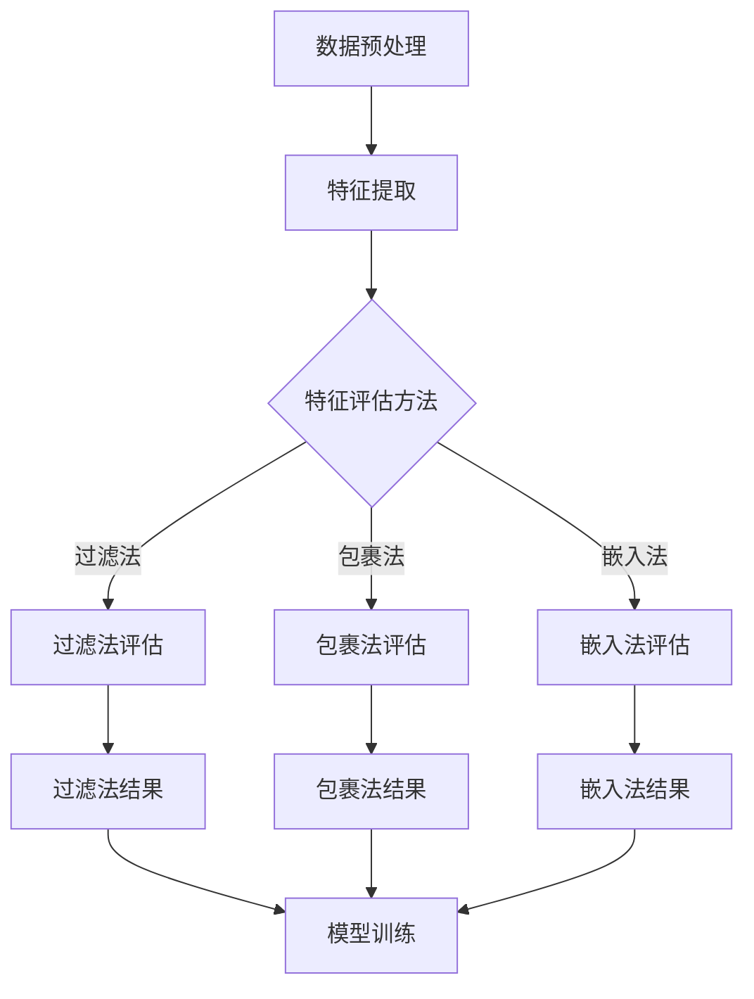

                 

# 文章标题：特征选择

> 关键词：特征选择、机器学习、特征重要性、特征提取、特征维度缩减

> 摘要：本文将详细介绍特征选择的背景、核心概念、数学基础、常见方法及其在分类和回归任务中的应用，并通过实战案例分析和优化策略，探讨特征选择在实际项目中的实施技巧和注意事项。

## 目录大纲

## 第一部分: 特征选择的背景与核心概念

### 第1章: 特征选择的概述

#### 1.1 特征选择的定义与重要性

#### 1.2 特征选择的基本概念

#### 1.3 特征选择在机器学习中的应用

### 第2章: 特征选择的数学基础

#### 2.1 线性代数基础

##### 2.1.1 矩阵与向量

##### 2.1.2 特征值与特征向量

##### 2.1.3 线性相关与线性无关

#### 2.2 统计学基础

##### 2.2.1 假设检验

##### 2.2.2 方差分析

##### 2.2.3 相关性分析

### 第3章: 常见的特征选择方法

#### 3.1 过滤法

##### 3.1.1 基于信息论的过滤方法

##### 3.1.2 基于统计学的过滤方法

#### 3.2 包装法

##### 3.2.1 递归特征消除

##### 3.2.2 递归特征加法

#### 3.3 嵌入法

##### 3.3.1 L1正则化（Lasso）

##### 3.3.2 L2正则化（Ridge）

##### 3.3.3 Elastic Net

## 第二部分: 特征选择方法的应用与优化

### 第4章: 特征选择在分类任务中的应用

#### 4.1 特征选择对分类性能的影响

#### 4.2 基于特征选择的分类算法

##### 4.2.1 决策树

##### 4.2.2 随机森林

##### 4.2.3 支持向量机

### 第5章: 特征选择在回归任务中的应用

#### 5.1 特征选择对回归性能的影响

#### 5.2 基于特征选择的回归算法

##### 5.2.1 最小二乘回归

##### 5.2.2 回归树

##### 5.2.3 随机森林回归

### 第6章: 特征选择的优化策略

#### 6.1 特征选择的多目标优化

#### 6.2 特征选择的并行计算

#### 6.3 特征选择的模型融合

## 第三部分: 特征选择实战案例与技巧

### 第7章: 特征选择实战案例解析

#### 7.1 社交网络分析中的特征选择

##### 7.1.1 特征提取

##### 7.1.2 特征选择应用

#### 7.2 金融风控中的特征选择

##### 7.2.1 特征提取

##### 7.2.2 特征选择应用

### 第8章: 特征选择技巧与注意事项

#### 8.1 特征选择的常见问题

#### 8.2 特征选择中的数据预处理

#### 8.3 特征选择的模型评估

## 第9章: 未来发展趋势与挑战

#### 9.1 特征选择的研究热点

##### 9.1.1 面向复杂任务的特征选择

##### 9.1.2 特征选择的自动化与智能化

#### 9.2 特征选择的挑战与展望

## 附录

### 附录 A: 特征选择常用工具与库

### 附录 B: 特征选择相关论文与资料

### 附录 C: Mermaid 流程图示例

### 附录 D: 伪代码示例

### 附录 E: 数学模型与公式说明

### 附录 F: 代码实战与解读
## 第1章：特征选择的概述

### 1.1 特征选择的定义与重要性

特征选择（Feature Selection）是机器学习领域中的一个重要过程，旨在从原始特征集合中挑选出对预测任务最有影响力的特征。在数据挖掘和机器学习中，特征选择不仅有助于提高模型的性能，还能减少模型的复杂性和计算成本。其定义可以概括为：通过某种评估标准，从原始特征集中筛选出对目标变量具有较高预测力的特征子集。

特征选择的重要性主要体现在以下几个方面：

1. **提高模型性能**：通过选择更相关的特征，可以降低噪声和冗余信息对模型的影响，提高模型的准确性和鲁棒性。
2. **减少模型复杂度**：特征选择的目的是降低特征维度，从而简化模型结构，提高训练和预测的效率。
3. **节省计算资源**：特征选择可以减少数据的存储和传输成本，缩短模型训练时间，降低计算资源的消耗。
4. **避免过拟合**：通过选择具有高度区分度的特征，可以有效避免模型对训练数据的过度拟合，提高模型的泛化能力。

### 1.2 特征选择的基本概念

在讨论特征选择之前，我们需要了解几个基本概念：

1. **特征（Feature）**：特征是描述数据属性的一个指标，可以是数值型或者类别型。例如，在天气预报任务中，温度、湿度、风速等都是特征。
2. **特征集（Feature Set）**：特征集是指一组相互关联的特征。
3. **特征维度（Feature Dimension）**：特征维度是指特征集中的特征数量。
4. **特征重要性（Feature Importance）**：特征重要性是指特征对于预测目标变量的影响程度。通常通过模型训练过程中的评估指标计算得出。

### 1.3 特征选择在机器学习中的应用

特征选择在机器学习中的应用非常广泛，不同类型的机器学习任务对特征选择的需求也有所不同。以下是几种常见应用场景：

1. **分类任务**：在分类任务中，特征选择有助于提高分类模型的准确性和效率。通过选择具有高区分度的特征，可以降低模型的复杂度，避免过拟合。
2. **回归任务**：在回归任务中，特征选择有助于提高模型的预测精度，减少模型对异常数据的敏感度。通过选择与目标变量高度相关的特征，可以降低回归误差。
3. **聚类任务**：特征选择有助于提高聚类算法的性能，减少聚类过程中的噪声干扰。通过选择能够有效区分聚类对象的特征，可以提高聚类的准确性和稳定性。
4. **降维任务**：特征选择是一种常见的降维方法，通过选择主要特征，可以显著减少数据维度，提高数据处理速度和存储效率。

### 1.4 特征选择的过程

特征选择的过程通常包括以下几个步骤：

1. **特征提取**：从原始数据中提取新的特征，这些特征可能通过数值变换、特征工程等方法生成。
2. **特征评估**：使用评估指标对特征的重要性进行评估，常见的评估指标有信息增益、相关性等。
3. **特征筛选**：根据特征评估结果，筛选出对预测任务具有重要影响的特征。
4. **特征组合**：通过组合不同的特征，形成新的特征子集，进一步评估和筛选。
5. **模型训练**：使用筛选出的特征子集训练机器学习模型，评估模型性能。

### 1.5 特征选择的挑战

尽管特征选择在机器学习领域具有重要意义，但实际应用中仍面临一些挑战：

1. **特征数量与质量平衡**：特征数量过多可能导致模型过拟合，特征数量过少则可能降低模型的泛化能力。
2. **评估指标选择**：不同的评估指标可能导致不同的特征选择结果，如何选择合适的评估指标是一个关键问题。
3. **模型依赖性**：特征选择的效果与所选用的机器学习模型密切相关，不同模型对特征的选择标准可能有所不同。
4. **数据预处理**：特征选择前需要进行适当的数据预处理，如缺失值处理、异常值检测等，这些预处理步骤可能影响特征选择的结果。

在本章中，我们介绍了特征选择的定义、重要性、基本概念以及在实际机器学习任务中的应用。接下来，我们将进一步探讨特征选择的数学基础和常见方法，以帮助读者更深入地理解这一重要过程。

## 第2章：特征选择的数学基础

### 2.1 线性代数基础

线性代数是特征选择中的重要工具，它涉及到矩阵、向量、特征值与特征向量等基本概念。以下是一些与特征选择密切相关的线性代数基础：

#### 2.1.1 矩阵与向量

**矩阵**是一个二维数组，由行和列组成，每个元素都有唯一的行和列索引。例如：

$$
A = \begin{bmatrix}
a_{11} & a_{12} & \cdots & a_{1n} \\
a_{21} & a_{22} & \cdots & a_{2n} \\
\vdots & \vdots & \ddots & \vdots \\
a_{m1} & a_{m2} & \cdots & a_{mn}
\end{bmatrix}
$$

**向量**是一个一维数组，通常表示为列向量。例如：

$$
\mathbf{x} = \begin{bmatrix}
x_1 \\
x_2 \\
\vdots \\
x_n
\end{bmatrix}
$$

**矩阵乘法**是线性代数中的核心运算之一。给定两个矩阵 \(A\) 和 \(B\)，其乘积 \(C = AB\) 定义为：

$$
C = \begin{bmatrix}
c_{ij} = \sum_{k=1}^{n} a_{ik}b_{kj}
\end{bmatrix}
$$

#### 2.1.2 特征值与特征向量

**特征值（Eigenvalue）** 是一个标量，它描述了矩阵 \(A\) 的某种性质，即对于任何非零向量 \(\mathbf{v}\)，满足以下等式：

$$
A\mathbf{v} = \lambda \mathbf{v}
$$

其中，\(\lambda\) 是特征值，\(\mathbf{v}\) 是特征向量。

**特征向量（Eigenvector）** 是与特征值对应的向量，满足上述等式。特征向量和特征值共同描述了矩阵 \(A\) 的线性变换性质。

#### 2.1.3 线性相关与线性无关

**线性相关** 是指一组向量中，可以通过线性组合得到另一个向量。如果一组向量线性相关，则它们之间存在依赖关系。

**线性无关** 是指一组向量中，无法通过线性组合得到其他向量。如果一组向量线性无关，则它们之间相互独立。

判断两个向量 \(\mathbf{x}\) 和 \(\mathbf{y}\) 是否线性相关，可以使用行列式判断：

$$
\det(\mathbf{x}, \mathbf{y}) = 0 \Rightarrow \mathbf{x} \text{ 和 } \mathbf{y} \text{ 线性相关}
$$

线性相关与线性无关在特征选择中具有重要意义。选择线性无关的特征有助于减少数据冗余，提高模型的泛化能力。

### 2.2 统计学基础

在特征选择中，统计学提供了评估特征重要性的工具和方法。以下是一些与特征选择密切相关的统计学基础：

#### 2.2.1 假设检验

**假设检验（Hypothesis Testing）** 是统计学中的一个基本概念，用于判断样本数据是否支持某个假设。

- **零假设（H0）**：原假设，表示没有显著差异或关系。
- **备择假设（H1）**：对立假设，表示存在显著差异或关系。

通过统计方法，我们计算出一个 **p值（p-value）**，用于判断零假设是否成立。通常，如果 \(p\)-值小于预设的显著性水平（如0.05），则拒绝零假设，认为存在显著差异或关系。

#### 2.2.2 方差分析

**方差分析（ANOVA）** 是用于比较多个样本平均数差异的统计方法。

ANOVA 的主要步骤包括：

1. **假设设定**：设定零假设和备择假设。
2. **数据收集**：收集多个样本数据。
3. **方差估计**：计算总方差、组间方差和组内方差。
4. **F 检验**：计算 F 统计量，用于判断零假设是否成立。

#### 2.2.3 相关性分析

**相关性分析（Correlation Analysis）** 用于判断两个变量之间的线性关系强度和方向。

- **皮尔逊相关系数（Pearson Correlation Coefficient）**：用于衡量两个连续变量之间的线性关系强度，取值范围在 [-1, 1] 之间。正相关表示变量之间同向变化，负相关表示变量之间反向变化。
- **斯皮尔曼相关系数（Spearman's Rank Correlation Coefficient）**：用于衡量两个变量之间的等级关系，适用于非正态分布的数据。

通过相关性分析，我们可以识别出对目标变量有显著影响的特征，从而进行特征选择。

综上所述，特征选择的数学基础涉及线性代数和统计学知识。线性代数提供了矩阵和向量的基本运算，特征值和特征向量的概念有助于理解数据的线性关系。统计学则提供了假设检验、方差分析和相关性分析等方法，用于评估特征的重要性和相关性。这些数学基础为特征选择提供了坚实的理论支持。

### 2.1.1 矩阵与向量

矩阵和向量是线性代数中的基础概念，广泛应用于特征选择中。矩阵可以看作是一个表格，其中包含了多个行和列，每个元素都有唯一的行和列索引。矩阵在特征选择中的作用主要体现在数据表示、特征变换和线性模型参数化等方面。

**矩阵的基本操作**：

1. **矩阵乘法**：给定两个矩阵 \(A\) 和 \(B\)，其乘积 \(C = AB\) 是一个新的矩阵，其中每个元素 \(c_{ij}\) 是通过以下公式计算的：

   $$
   c_{ij} = \sum_{k=1}^{n} a_{ik}b_{kj}
   $$

   矩阵乘法在特征选择中的应用包括特征变换、特征融合和特征重要性评估等。

2. **矩阵加法与减法**：两个矩阵 \(A\) 和 \(B\) 的加法或减法结果是一个新矩阵 \(C\)，其中每个元素 \(c_{ij}\) 是通过以下公式计算的：

   $$
   c_{ij} = a_{ij} \pm b_{ij}
   $$

   矩阵加法和减法在特征选择中用于处理具有相似特征的数据，如特征缩放、特征归一化等。

3. **矩阵转置**：给定矩阵 \(A\)，其转置矩阵 \(A^T\) 是一个新的矩阵，其中行和列交换位置。转置矩阵在特征选择中的应用包括特征重要性排序、特征可视化等。

向量是矩阵的一种特殊形式，它只有一列或一行。向量在特征选择中的作用主要体现在特征表示和特征变换等方面。

**向量的基本操作**：

1. **向量加法与减法**：两个向量 \(\mathbf{x}\) 和 \(\mathbf{y}\) 的加法或减法结果是一个新向量，其中每个元素 \(x_i\) 是通过以下公式计算的：

   $$
   x_i = x_i \pm y_i
   $$

   向量加法和减法在特征选择中用于合并不同特征或调整特征权重。

2. **向量点积与叉积**：两个向量 \(\mathbf{x}\) 和 \(\mathbf{y}\) 的点积（内积）和叉积（外积）是新的标量和向量。点积用于计算两个向量的相似性，叉积用于计算两个向量的垂直方向。

   点积（内积）计算公式：

   $$
   \mathbf{x} \cdot \mathbf{y} = \sum_{i=1}^{n} x_iy_i
   $$

   叉积（外积）计算公式：

   $$
   \mathbf{x} \times \mathbf{y} = \begin{bmatrix}
   x_2y_3 - x_3y_2 \\
   x_3y_1 - x_1y_3 \\
   x_1y_2 - x_2y_1
   \end{bmatrix}
   $$

   向量点积和叉积在特征选择中用于特征相似性度量、特征权重调整等。

**矩阵与向量的关系**：

矩阵和向量之间的基本关系包括矩阵乘以向量、向量乘以矩阵等。例如：

1. **矩阵乘以向量**：给定矩阵 \(A\) 和向量 \(\mathbf{x}\)，其乘积 \(B = A\mathbf{x}\) 是一个新的向量，其中每个元素 \(b_i\) 是通过以下公式计算的：

   $$
   b_i = \sum_{j=1}^{n} a_{ij}x_j
   $$

   矩阵乘以向量在特征选择中用于特征变换、特征融合等。

2. **向量乘以矩阵**：给定向量 \(\mathbf{x}\) 和矩阵 \(A\)，其乘积 \(B = \mathbf{x}A\) 是一个新的矩阵，其中每个元素 \(b_{ij}\) 是通过以下公式计算的：

   $$
   b_{ij} = x_ia_{ij}
   $$

   向量乘以矩阵在特征选择中用于特征加权、特征可视化等。

通过矩阵和向量操作，我们可以对特征进行有效的表示、变换和评估。这些基础操作在特征选择中具有重要的应用，有助于提高模型的性能和可解释性。

### 2.1.2 特征值与特征向量

特征值与特征向量是线性代数中的重要概念，在特征选择中有着广泛的应用。特征值描述了矩阵的某种性质，特征向量则是与特征值对应的向量。理解特征值与特征向量有助于我们更好地进行特征选择和模型优化。

**定义**：

给定一个 \(n \times n\) 的方阵 \(A\)，如果存在一个非零向量 \(\mathbf{v}\) 和一个标量 \(\lambda\)，使得以下等式成立：

$$
A\mathbf{v} = \lambda \mathbf{v}
$$

则 \(\lambda\) 是 \(A\) 的一个特征值，\(\mathbf{v}\) 是对应于特征值 \(\lambda\) 的特征向量。

**特征值的计算**：

特征值可以通过求解矩阵 \(A\) 的特征方程得到。特征方程可以表示为：

$$
\det(A - \lambda I) = 0
$$

其中，\(\det\) 表示行列式，\(I\) 是单位矩阵。求解特征方程可以得到 \(A\) 的所有特征值。

**特征向量的计算**：

对于给定的特征值 \(\lambda\)，可以通过求解线性方程组：

$$
(A - \lambda I)\mathbf{v} = \mathbf{0}
$$

得到对应的特征向量。需要注意的是，对于每个特征值，可能存在多个线性无关的特征向量。

**特征值与特征向量的性质**：

1. **唯一性**：每个特征值对应唯一的特征向量。
2. **线性无关性**：不同的特征值对应的特征向量线性无关。
3. **规范性**：特征向量的长度为 1，即 \(\mathbf{v}^T\mathbf{v} = 1\)。

**特征值与特征向量的应用**：

1. **特征分解**：特征值和特征向量可以用于特征分解，即将矩阵 \(A\) 分解为 \(A = PDP^{-1}\)，其中 \(P\) 是由特征向量组成的矩阵，\(D\) 是由特征值组成的对角矩阵。
2. **特征选择**：通过计算特征值和特征向量，可以识别出最重要的特征。特征值越大，对应的特征向量对矩阵的贡献越大。因此，可以选择具有较大特征值的特征向量作为主要特征。
3. **特征加权**：特征值可以用于调整特征权重。例如，在主成分分析（PCA）中，通过特征值调整特征的重要性，从而实现特征维度缩减。

**伪代码示例**：

以下是一个简单的伪代码示例，用于计算矩阵 \(A\) 的特征值和特征向量：

```python
# 输入矩阵 A
A = [[a11, a12, ..., ain], 
     [a21, a22, ..., a2n], 
     ..., 
     [am1, am2, ..., amn]]

# 求解特征方程
det(A - λI) = 0

# 解特征方程，得到特征值 λ1, λ2, ..., λn
λ1, λ2, ..., λn = ...

# 对于每个特征值 λi，求解线性方程组 (A - λiI)v = 0
# 得到特征向量 vi1, vi2, ..., viv
for i in range(n):
    (A - λiI)v = 0
    vi1, vi2, ..., viv = ...

# 输出特征值和特征向量
for i in range(n):
    print("特征值：", λi)
    print("特征向量：", vi1, vi2, ..., viv)
```

通过计算特征值和特征向量，我们可以更深入地了解矩阵 \(A\) 的性质，从而在特征选择中充分利用这些信息。特征值和特征向量不仅帮助我们识别最重要的特征，还为我们提供了有效的特征变换和模型优化的工具。

### 2.1.3 线性相关与线性无关

线性相关与线性无关是线性代数中的基础概念，在特征选择中具有重要的应用。理解这两个概念有助于我们更好地评估特征之间的关系，选择具有独立性和区分度的特征，从而提高模型的性能和可解释性。

**定义**：

1. **线性相关**：如果一组向量中，可以通过线性组合得到另一个向量，则这组向量是线性相关的。换句话说，存在一组不全为零的常数 \(c_1, c_2, ..., c_n\)，使得：

   $$
   c_1\mathbf{x}_1 + c_2\mathbf{x}_2 + ... + c_n\mathbf{x}_n = \mathbf{0}
   $$

   其中，\(\mathbf{x}_1, \mathbf{x}_2, ..., \mathbf{x}_n\) 是向量。

2. **线性无关**：如果一组向量中，无法通过线性组合得到其他向量，则这组向量是线性无关的。换句话说，只有当 \(c_1, c_2, ..., c_n\) 全为零时，上述等式才成立。

**线性相关与线性无关的判断**：

我们可以通过计算行列式来判断两个向量是否线性相关。如果行列式的值为零，则这两个向量是线性相关的；否则，它们是线性无关的。

对于两个向量 \(\mathbf{x}\) 和 \(\mathbf{y}\)：

$$
\det(\mathbf{x}, \mathbf{y}) = 0 \Rightarrow \mathbf{x} \text{ 和 } \mathbf{y} \text{ 线性相关}
$$

**线性相关与线性无关的性质**：

1. **线性相关的性质**：如果一组向量是线性相关的，则这组向量中至少有一个向量可以由其他向量线性组合得到。这意味着这组向量之间存在依赖关系，无法提供独立的信息。

2. **线性无关的性质**：如果一组向量是线性无关的，则这组向量中每个向量都是独立的，不能通过其他向量线性组合得到。这意味着这组向量提供了独立的信息，可以用于特征选择和模型构建。

**线性相关与线性无关在特征选择中的应用**：

1. **特征筛选**：通过判断特征之间的线性相关性，可以筛选出具有独立性的特征，从而减少数据冗余，提高模型的泛化能力。

2. **特征组合**：在特征组合过程中，确保特征之间的线性无关性有助于提高模型的性能和可解释性。线性无关的特征可以更好地描述数据的复杂结构。

3. **特征加权**：在特征加权过程中，可以利用线性相关的特征来调整特征权重，使得相关特征在模型中具有更高的权重，从而提高模型的性能。

**伪代码示例**：

以下是一个简单的伪代码示例，用于判断两个向量 \(\mathbf{x}\) 和 \(\mathbf{y}\) 是否线性相关：

```python
# 输入向量 x 和 y
x = [x1, x2, ..., xn]
y = [y1, y2, ..., yn]

# 计算行列式
det = determinant([x, y])

# 判断线性相关性
if det == 0:
    print("向量 x 和 y 线性相关")
else:
    print("向量 x 和 y 线性无关")
```

通过理解线性相关与线性无关的概念，我们可以更有效地进行特征选择和模型优化。选择线性无关的特征有助于减少数据冗余，提高模型的性能和可解释性。

### 2.2.1 假设检验

假设检验是统计学中的一个重要工具，用于判断样本数据是否支持某个假设。在特征选择中，假设检验可以用于评估特征的重要性和相关性。以下将介绍假设检验的基本概念、常用方法及其在特征选择中的应用。

**定义**：

假设检验（Hypothesis Testing）是一种统计方法，用于根据样本数据判断某个假设是否成立。假设检验主要包括以下两个假设：

1. **零假设（H0）**：原假设，表示没有显著差异或关系。
2. **备择假设（H1）**：对立假设，表示存在显著差异或关系。

**假设检验的基本步骤**：

1. **设定假设**：明确零假设和备择假设。
2. **选择检验统计量**：选择合适的检验统计量，用于衡量样本数据与零假设的偏差程度。
3. **计算检验统计量**：根据样本数据计算检验统计量的值。
4. **确定显著性水平**：设定显著性水平（如0.05），用于判断零假设是否成立。
5. **做出决策**：根据检验统计量的值和显著性水平，判断是否拒绝零假设。

**常用的假设检验方法**：

1. **t检验（t-test）**：用于比较两组数据的均值差异。根据数据类型和分布，可以分为独立样本t检验和配对样本t检验。
2. **方差分析（ANOVA）**：用于比较多个样本均值差异。ANOVA可以扩展到多个因素和交互效应。
3. **卡方检验（Chi-square test）**：用于比较分类变量之间的独立性。
4. **F检验（F-test）**：用于比较两个方差或方差比例的差异。

**假设检验在特征选择中的应用**：

1. **特征重要性评估**：通过假设检验，可以评估特征对目标变量的影响程度。例如，使用t检验评估特征与目标变量之间的线性关系显著性，从而筛选出重要的特征。
2. **特征组合评估**：在特征组合中，假设检验可以用于评估不同特征组合的优劣。例如，使用ANOVA检验比较多个特征组合的预测性能差异，从而选择最优特征组合。

**伪代码示例**：

以下是一个简单的伪代码示例，用于进行t检验评估特征的重要性：

```python
# 输入样本数据 x1, x2, ..., xn 和目标变量 y1, y2, ..., yn
x = [x1, x2, ..., xn]
y = [y1, y2, ..., yn]

# 计算样本均值 x_mean 和 y_mean
x_mean = sum(x) / len(x)
y_mean = sum(y) / len(y)

# 计算样本标准差 x_std 和 y_std
x_std = sqrt(sum((xi - x_mean)^2 for xi in x) / (len(x) - 1))
y_std = sqrt(sum((yi - y_mean)^2 for yi in y) / (len(y) - 1))

# 计算t统计量 t_stat
t_stat = (x_mean - y_mean) / (x_std / sqrt(len(x)))

# 设定显著性水平 alpha
alpha = 0.05

# 计算p值 p_value
p_value = t_distributed(p dof, t_stat)

# 判断零假设是否成立
if p_value < alpha:
    print("拒绝零假设，特征重要")
else:
    print("接受零假设，特征不显著")
```

通过假设检验，我们可以评估特征的重要性，从而进行有效的特征选择。假设检验提供了定量评估特征的重要性的方法，有助于提高模型的性能和可解释性。

### 2.2.2 方差分析

方差分析（Analysis of Variance，ANOVA）是一种用于比较多个样本均值的统计方法。在特征选择中，方差分析可以用于评估不同特征对目标变量的影响程度，从而筛选出重要的特征。以下将介绍方差分析的基本概念、原理及其在特征选择中的应用。

**定义**：

方差分析（ANOVA）是一种用于比较多个样本均值的统计方法，其基本思想是比较组内变异和组间变异。通过计算组内均方（组内变异）和组间均方（组间变异），可以评估不同组之间是否存在显著性差异。

**基本原理**：

方差分析基于以下三个变异来源：

1. **组间变异（Between-Groups Variation）**：反映了不同组之间的均值差异。组间变异可以通过以下公式计算：

   $$
   \text{组间均方} = \frac{\sum_{i=1}^{k} (x_{i\bar{x}} - \bar{x})^2}{k-1}
   $$

   其中，\(x_{i\bar{x}}\) 是第 \(i\) 组的均值，\(\bar{x}\) 是总体均值，\(k\) 是组数。

2. **组内变异（Within-Groups Variation）**：反映了每个组内部的数据变异。组内变异可以通过以下公式计算：

   $$
   \text{组内均方} = \frac{\sum_{i=1}^{k} \sum_{j=1}^{n_i} (x_{ij} - x_{i\bar{x}})^2}{N-k}
   $$

   其中，\(x_{ij}\) 是第 \(i\) 组第 \(j\) 个样本值，\(n_i\) 是第 \(i\) 组的样本数量，\(N\) 是总体样本数量。

3. **总变异（Total Variation）**：反映了总体数据的总变异，可以分解为组间变异和组内变异。总变异可以通过以下公式计算：

   $$
   \text{总均方} = \frac{\sum_{i=1}^{k} \sum_{j=1}^{n_i} (x_{ij} - \bar{x})^2}{N-1}
   $$

   通过比较组间均方和组内均方，可以评估不同组之间是否存在显著性差异。如果组间均方远大于组内均方，则说明不同组之间存在显著差异。

**方差分析在特征选择中的应用**：

1. **特征重要性评估**：通过ANOVA可以评估不同特征对目标变量的影响程度。例如，对于一组特征，可以分别计算每个特征对目标变量的组间均方和组内均方，从而筛选出对目标变量具有重要影响的特征。

2. **特征组合评估**：在特征组合中，ANOVA可以用于评估不同特征组合的优劣。例如，对于多个特征组合，可以分别计算每个组合的组间均方和组内均方，从而选择最优特征组合。

**伪代码示例**：

以下是一个简单的伪代码示例，用于进行方差分析评估特征的重要性：

```python
# 输入样本数据 x1, x2, ..., xn 和目标变量 y1, y2, ..., yn
x = [x1, x2, ..., xn]
y = [y1, y2, ..., yn]

# 计算每个特征的均值 x_mean1, x_mean2, ..., x_meann
x_mean = [sum(x_i) / len(x_i) for x_i in x]

# 计算总均值 y_mean
y_mean = sum(y) / len(y)

# 计算组间均方 SSB
SSB = sum((x_mean_i - y_mean)^2 for x_mean_i in x_mean) * (n - 1)

# 计算组内均方 SSW
SSW = sum(sum((x_ij - x_mean_i)^2 for x_ij in x_i) for x_i in x) * (N - k)

# 计算F统计量 F_stat
F_stat = SSB / SSW

# 设定显著性水平 alpha
alpha = 0.05

# 计算p值 p_value
p_value = f_distributed((k - 1, N - k), F_stat)

# 判断零假设是否成立
if p_value < alpha:
    print("拒绝零假设，特征重要")
else:
    print("接受零假设，特征不显著")
```

通过方差分析，我们可以评估特征对目标变量的影响程度，从而进行有效的特征选择。方差分析提供了定量评估特征重要性的方法，有助于提高模型的性能和可解释性。

### 2.2.3 相关性分析

相关性分析是统计学中用于衡量两个变量之间线性关系强度和方向的方法。在特征选择过程中，相关性分析可以帮助我们识别出与目标变量高度相关的特征，从而提高模型的预测性能和可解释性。以下将介绍相关性分析的基本概念、常用方法及其在特征选择中的应用。

**定义**：

相关性分析是一种衡量两个变量之间线性关系强度和方向的方法。在特征选择中，相关性分析可以帮助我们评估特征对目标变量的影响程度。常用的相关性系数包括皮尔逊相关系数、斯皮尔曼相关系数和肯德尔相关系数。

**皮尔逊相关系数（Pearson Correlation Coefficient）**：

皮尔逊相关系数是一种衡量两个连续变量之间线性关系强度的方法。其取值范围在 -1 到 1 之间，绝对值越接近 1，表示两个变量之间的线性关系越强；绝对值越接近 0，表示两个变量之间的线性关系越弱。

皮尔逊相关系数的计算公式为：

$$
r = \frac{\sum_{i=1}^{n}(x_i - \bar{x})(y_i - \bar{y})}{\sqrt{\sum_{i=1}^{n}(x_i - \bar{x})^2}\sqrt{\sum_{i=1}^{n}(y_i - \bar{y})^2}}
$$

其中，\(x_i\) 和 \(y_i\) 分别表示第 \(i\) 个样本的 \(x\) 和 \(y\) 值，\(\bar{x}\) 和 \(\bar{y}\) 分别表示 \(x\) 和 \(y\) 的平均值，\(n\) 是样本数量。

**斯皮尔曼相关系数（Spearman's Rank Correlation Coefficient）**：

斯皮尔曼相关系数是一种用于衡量两个变量之间等级关系的非参数方法。它适用于非正态分布的数据，或者当数据包含异常值时。斯皮尔曼相关系数的取值范围也在 -1 到 1 之间。

斯皮尔曼相关系数的计算公式为：

$$
ρ = 1 - \frac{6 \sum d_i^2}{n(n^2 - 1)}
$$

其中，\(d_i\) 是第 \(i\) 个样本的等级差异，即 \(d_i = x_i - y_i\)。

**肯德尔相关系数（Kendall Rank Correlation Coefficient）**：

肯德尔相关系数是一种用于衡量多个变量之间等级关系的非参数方法。它适用于包含类别型变量的数据。肯德尔相关系数的取值范围也在 -1 到 1 之间。

肯德尔相关系数的计算公式为：

$$
τ = \frac{n \sum w_i - 3 \sum w_i^2}{n(n^2 - 1)}
$$

其中，\(w_i\) 是第 \(i\) 个样本的等级权重，对于三个等级的数据，\(w_i\) 可以取 -1、0 或 1。

**相关性分析在特征选择中的应用**：

1. **特征筛选**：通过相关性分析，可以评估每个特征与目标变量之间的相关性。选择相关性较高的特征有助于提高模型的预测性能。

2. **特征组合**：在特征组合中，相关性分析可以帮助我们评估不同特征组合的优劣。选择相关性较高的特征组合可以提高模型的稳定性和可解释性。

3. **特征重要性评估**：通过相关性分析，可以评估特征对目标变量的影响程度，从而进行特征重要性排序。这对于构建高效的特征选择模型具有重要意义。

**伪代码示例**：

以下是一个简单的伪代码示例，用于计算皮尔逊相关系数评估特征的重要性：

```python
# 输入样本数据 x 和 y
x = [x1, x2, ..., xn]
y = [y1, y2, ..., yn]

# 计算均值
mean_x = sum(x) / len(x)
mean_y = sum(y) / len(y)

# 计算平方差和
sum_sq_x = sum((xi - mean_x) ** 2 for xi in x)
sum_sq_y = sum((yi - mean_y) ** 2 for yi in y)

# 计算协方差
covariance = sum((xi - mean_x) * (yi - mean_y) for xi, yi in zip(x, y))

# 计算皮尔逊相关系数
correlation = covariance / (sqrt(sum_sq_x) * sqrt(sum_sq_y))

# 输出相关系数
print("皮尔逊相关系数：", correlation)
```

通过相关性分析，我们可以有效识别出与目标变量高度相关的特征，从而进行特征选择和优化。相关性分析提供了定量评估特征相关性的方法，有助于提高模型的性能和可解释性。

## 第3章：常见的特征选择方法

特征选择是机器学习任务中的一个关键步骤，其目的是从大量的原始特征中筛选出对预测任务具有较高预测能力的特征子集。根据特征选择的方法，可以将特征选择分为三大类：过滤法（Filter Method）、包裹法（Wrapper Method）和嵌入法（Embedded Method）。以下将分别介绍这三种方法。

### 3.1 过滤法

过滤法是一种先验方法，它通过评估每个特征与目标变量之间的相关性来选择特征。过滤法的优点是简单、计算效率高，适合处理大规模数据集。以下是两种常见的过滤方法：

#### 3.1.1 基于信息论的过滤方法

基于信息论的过滤方法利用信息熵、信息增益等概念来评估特征的重要性。信息熵（Entropy）是一个随机变量不确定性的度量，定义为：

$$
H(X) = -\sum_{i=1}^{n} p_i \log_2 p_i
$$

其中，\(p_i\) 是随机变量 \(X\) 取第 \(i\) 个值的概率。

信息增益（Information Gain）是特征对目标变量提供的信息量，定义为特征熵与条件熵之差：

$$
IG(X, Y) = H(Y) - H(Y|X)
$$

条件熵（Conditional Entropy）是给定特征 \(X\) 的条件下，目标变量 \(Y\) 的不确定性度量：

$$
H(Y|X) = -\sum_{i=1}^{n} p_i H(Y|X = x_i)
$$

其中，\(p_i\) 是特征 \(X\) 取第 \(i\) 个值的概率，\(H(Y|X = x_i)\) 是在给定 \(X = x_i\) 条件下，目标变量 \(Y\) 的熵。

通过计算每个特征的信息增益，可以识别出对目标变量影响较大的特征，从而进行特征选择。

#### 3.1.2 基于统计学的过滤方法

基于统计学的过滤方法通过计算特征与目标变量之间的相关系数来评估特征的重要性。常用的相关系数包括皮尔逊相关系数（Pearson Correlation Coefficient）和斯皮尔曼相关系数（Spearman's Rank Correlation Coefficient）。

皮尔逊相关系数反映了两个连续变量之间的线性关系强度，取值范围在 -1 到 1 之间，绝对值越大表示线性关系越强。

斯皮尔曼相关系数反映了两个变量之间的等级关系，适用于非正态分布的数据，取值范围在 -1 到 1 之间。

通过计算每个特征的相关系数，可以识别出与目标变量高度相关的特征，从而进行特征选择。

### 3.2 包装法

包裹法是一种后验方法，它通过在训练集上评估每个特征子集的预测性能来选择特征。包裹法的优点是能够直接考虑特征子集的预测能力，但缺点是计算复杂度较高，不适合处理大规模数据集。以下是两种常见的包裹方法：

#### 3.2.1 递归特征消除（Recursive Feature Elimination，RFE）

递归特征消除（RFE）是一种基于模型评估的特征选择方法。RFE 通过递归地删除最不重要的特征，每次删除一部分特征后，使用剩余特征重新训练模型，并评估模型的预测性能。重复这一过程，直到满足特定的停止条件（如预测性能不再提高）。

RFE 的主要步骤如下：

1. 初始化特征集合。
2. 对于每个特征，计算其在当前特征集合中的重要性。
3. 根据特征重要性，删除最不重要的特征。
4. 使用剩余特征重新训练模型，并评估模型的预测性能。
5. 重复步骤 2-4，直到满足停止条件。

RFE 的优点是能够直接考虑特征子集的预测能力，但缺点是计算复杂度较高，不适合处理大规模数据集。

#### 3.2.2 递归特征加法（Recursive Feature Addition，RFA）

递归特征加法（RFA）是一种基于模型评估的特征选择方法，与 RFE 相反，RFA 从空集开始，逐步添加特征，每次添加一部分特征后，使用剩余特征重新训练模型，并评估模型的预测性能。重复这一过程，直到满足特定的停止条件。

RFA 的主要步骤如下：

1. 初始化特征集合为空集。
2. 选择一个特征添加到特征集合中。
3. 使用当前特征集合重新训练模型，并评估模型的预测性能。
4. 根据特征重要性，删除最不重要的特征。
5. 重复步骤 2-4，直到满足停止条件。

RFA 的优点是能够考虑特征子集的预测能力，但缺点是计算复杂度较高，不适合处理大规模数据集。

### 3.3 嵌入法

嵌入法是一种将特征选择过程集成到模型训练中的方法。嵌入法通过在训练过程中调整特征权重来选择特征，从而提高模型的预测性能。常见的嵌入法包括 L1 正则化（Lasso）、L2 正则化（Ridge）和 Elastic Net。

#### 3.3.1 L1 正则化（Lasso）

L1 正则化（Lasso）通过在损失函数中加入 L1 范数惩罚项来调整特征权重。L1 范数惩罚项使得一些特征权重为零，从而实现特征选择。Lasso 的优化目标为：

$$
\min_{\beta} \frac{1}{2} \|Y - X\beta\|^2 + \lambda \| \beta \|_1
$$

其中，\(\beta\) 是特征权重，\(\lambda\) 是惩罚参数，\(\| \beta \|_1\) 是 L1 范数。

Lasso 的优点是能够实现稀疏特征选择，但缺点是对异常值敏感。

#### 3.3.2 L2 正则化（Ridge）

L2 正则化（Ridge）通过在损失函数中加入 L2 范数惩罚项来调整特征权重。L2 范数惩罚项使得特征权重更加稳定，但不会导致特征权重为零。Ridge 的优化目标为：

$$
\min_{\beta} \frac{1}{2} \|Y - X\beta\|^2 + \lambda \| \beta \|_2
$$

其中，\(\beta\) 是特征权重，\(\lambda\) 是惩罚参数，\(\| \beta \|_2\) 是 L2 范数。

Ridge 的优点是能够提高模型的稳定性，但缺点是特征选择效果较差。

#### 3.3.3 Elastic Net

Elastic Net 结合了 L1 正则化和 L2 正则化的优点，通过在损失函数中加入 L1 和 L2 范数惩罚项来调整特征权重。Elastic Net 的优化目标为：

$$
\min_{\beta} \frac{1}{2} \|Y - X\beta\|^2 + \lambda_1 \| \beta \|_1 + \lambda_2 \| \beta \|_2
$$

其中，\(\beta\) 是特征权重，\(\lambda_1\) 和 \(\lambda_2\) 分别是 L1 和 L2 惩罚参数。

Elastic Net 的优点是能够实现稀疏特征选择，同时提高模型的稳定性。

综上所述，常见的特征选择方法包括过滤法、包裹法和嵌入法。每种方法都有其优缺点和适用场景。在实际应用中，可以根据具体问题和数据特点选择合适的方法。

## 第4章：特征选择在分类任务中的应用

在分类任务中，特征选择至关重要，它不仅能够提高模型的性能，还能够降低模型对噪声的敏感度。本章将讨论特征选择对分类性能的影响，介绍几种基于特征选择的分类算法，并分析这些算法在具体应用中的优势和局限。

### 4.1 特征选择对分类性能的影响

特征选择对分类性能的影响主要体现在以下几个方面：

1. **减少过拟合**：通过选择与目标变量高度相关的特征，可以降低模型对训练数据的拟合程度，从而减少过拟合现象。
2. **提高模型泛化能力**：特征选择有助于提取关键特征，提高模型的泛化能力，使其在新的数据集上表现更好。
3. **降低计算成本**：特征选择可以减少数据维度，降低模型的计算复杂度，从而提高训练和预测速度。
4. **减少数据冗余**：特征选择能够剔除冗余和噪声特征，提高数据的纯净度，有助于提高模型的准确性和稳定性。

### 4.2 基于特征选择的分类算法

以下介绍几种常用的基于特征选择的分类算法，并分析其应用场景和性能。

#### 4.2.1 决策树

决策树是一种简单而强大的分类算法，它通过递归划分数据集，将特征空间分割成多个子区域，每个子区域对应一个类标签。在构建决策树的过程中，特征选择是一个关键步骤。常见的特征选择方法包括信息增益、基尼指数和增益率等。

- **信息增益**：选择能够最大化目标变量信息熵减少的特征。
- **基尼指数**：选择能够最小化数据集基尼不纯度的特征。
- **增益率**：综合考虑特征重要性和特征分布，选择增益率最高的特征。

**优势**：

- 易于理解和解释。
- 能够处理不同类型的数据（数值型和类别型）。
- 特征选择过程简单，能够快速构建模型。

**局限**：

- 易于过拟合，特别是在特征较多时。
- 决策树之间的组合可能导致计算复杂度增加。

#### 4.2.2 随机森林

随机森林（Random Forest）是一种基于决策树的集成学习方法。它通过随机选择特征和样本子集构建多个决策树，并将这些决策树的结果进行投票，得出最终分类结果。随机森林在特征选择方面采用随机抽样方法，可以有效减少过拟合。

- **特征选择**：每次构建决策树时，随机选择一部分特征。
- **样本选择**：每次构建决策树时，随机选择一部分样本。

**优势**：

- 鲁棒性强，能够处理大量特征和样本。
- 对噪声和异常值具有较好的鲁棒性。
- 能够提供特征重要性排序，辅助特征选择。

**局限**：

- 随机性可能导致结果不稳定。
- 随机森林的计算复杂度较高，不适合大规模数据集。

#### 4.2.3 支持向量机

支持向量机（Support Vector Machine，SVM）是一种基于结构二分类模型的分类算法。它通过找到一个最佳超平面，将不同类别的数据点最大化地分开。在 SVM 中，特征选择可以通过调整核函数和惩罚参数来实现。

- **核函数**：选择合适的核函数，将低维数据映射到高维特征空间。
- **惩罚参数**：调整惩罚参数 \(C\)，平衡分类间隔和误分类成本。

**优势**：

- 能够处理线性不可分数据。
- 对噪声和异常值具有较好的鲁棒性。
- 提供了良好的分类边界，易于解释。

**局限**：

- 计算复杂度较高，不适合大规模数据集。
- 特征选择依赖于核函数和惩罚参数的选择，需要多次调优。

#### 4.2.4 构建基于特征选择的分类模型

在实际应用中，构建基于特征选择的分类模型通常包括以下步骤：

1. **数据预处理**：包括缺失值处理、异常值检测和数据归一化等。
2. **特征提取**：通过数值变换、特征工程等方法生成新特征。
3. **特征评估**：使用过滤法、包裹法或嵌入法评估特征的重要性。
4. **特征选择**：根据评估结果筛选出对预测任务具有重要影响的特征。
5. **模型训练**：使用筛选出的特征子集训练分类模型。
6. **模型评估**：评估模型在验证集上的性能，并进行参数调优。

通过以上步骤，可以构建一个高效且具有良好泛化能力的分类模型。特征选择在分类任务中发挥着关键作用，它不仅能够提高模型性能，还能够降低模型的计算复杂度和对噪声的敏感度。

### 4.3 特征选择在分类任务中的应用案例分析

以下通过一个具体案例，分析特征选择在分类任务中的应用。

#### 案例背景

假设我们有一个银行信用卡欺诈检测问题，数据集包含200个特征，如交易金额、时间、地点、用户行为等。我们需要通过特征选择构建一个分类模型，以识别潜在的信用卡欺诈交易。

#### 数据预处理

1. **缺失值处理**：对于缺失值较多的特征，可以使用均值或中值填充。
2. **异常值检测**：通过箱线图、Z分数等方法检测并处理异常值。

#### 特征提取

1. **数值变换**：对连续型特征进行标准化或归一化处理。
2. **特征工程**：构造新特征，如交易时间段的二进制编码、用户行为序列等。

#### 特征评估

1. **基于信息论的过滤方法**：计算每个特征的信息增益，选择信息增益较高的特征。
2. **基于统计学的过滤方法**：计算每个特征与目标变量的皮尔逊相关系数，选择相关性较高的特征。
3. **基于模型的过滤方法**：使用决策树或随机森林评估每个特征的贡献，选择重要的特征。

#### 特征选择

根据特征评估结果，选择前10个具有最高信息增益的相关性较高的特征，用于构建分类模型。

#### 模型训练

1. **训练集划分**：将数据集分为训练集和验证集，用于模型训练和性能评估。
2. **模型选择**：选择支持向量机（SVM）作为分类模型。
3. **参数调优**：通过交叉验证和网格搜索，调整惩罚参数 \(C\) 和核函数参数。

#### 模型评估

1. **准确率**：评估模型在验证集上的准确率。
2. **召回率**：评估模型对欺诈交易的召回率。
3. **F1分数**：综合考虑准确率和召回率，评估模型的综合性能。

通过以上步骤，我们构建了一个基于特征选择的信用卡欺诈检测模型。特征选择有效地减少了数据冗余，提高了模型的性能和可解释性。

#### 总结

特征选择在分类任务中具有重要作用，它能够提高模型的泛化能力和预测性能。通过选择与目标变量高度相关的特征，可以降低模型对噪声的敏感度，提高模型的鲁棒性。在实际应用中，应根据具体问题和数据特点，选择合适的特征选择方法和分类算法，以构建高效且可靠的分类模型。

## 第5章：特征选择在回归任务中的应用

特征选择在回归任务中同样至关重要，它有助于提高模型的预测准确性、降低计算复杂度并提升模型的泛化能力。本章将讨论特征选择对回归性能的影响，并介绍几种常见的基于特征选择的回归算法。

### 5.1 特征选择对回归性能的影响

特征选择在回归任务中的影响主要体现在以下几个方面：

1. **减少过拟合**：通过选择与目标变量高度相关的特征，可以降低模型对训练数据的拟合程度，从而减少过拟合现象。
2. **提高模型泛化能力**：特征选择有助于提取关键特征，提高模型的泛化能力，使其在新的数据集上表现更好。
3. **降低计算成本**：特征选择可以减少数据维度，降低模型的计算复杂度，从而提高训练和预测速度。
4. **减少数据冗余**：特征选择能够剔除冗余和噪声特征，提高数据的纯净度，有助于提高模型的准确性和稳定性。

### 5.2 基于特征选择的回归算法

以下介绍几种常用的基于特征选择的回归算法，并分析其应用场景和性能。

#### 5.2.1 最小二乘回归

最小二乘回归（Least Squares Regression）是最基本的线性回归方法，它通过最小化预测值与实际值之间的平方误差和来估计模型的参数。在最小二乘回归中，特征选择可以通过以下方法实现：

1. **筛选法**：基于特征的重要性（如信息增益、相关系数等）筛选出重要的特征。
2. **迭代法**：通过逐步添加或删除特征，并评估模型的性能，来选择最佳特征子集。

**优势**：

- 简单易懂，易于实现。
- 能够处理线性关系。
- 特征选择过程简单。

**局限**：

- 对非线性关系和噪声敏感。
- 特征数量较多时计算复杂度较高。

#### 5.2.2 回归树

回归树（Regression Tree）是一种树形结构的回归模型，通过递归划分数据集来拟合目标变量。在回归树中，特征选择是通过选择具有最大分割增益的特征来实现的。常见的分割增益度量包括基尼不纯度、信息增益和方差减少等。

**优势**：

- 能够处理非线性关系。
- 易于理解和解释。
- 对噪声和异常值具有较好的鲁棒性。

**局限**：

- 易于过拟合，特别是在特征较多时。
- 特征选择依赖于分割增益度量，可能需要多次调优。

#### 5.2.3 随机森林回归

随机森林回归（Random Forest Regression）是一种基于决策树的集成学习方法，通过构建多个决策树，并将它们的结果进行聚合来提高预测性能。在随机森林中，特征选择是通过随机抽样特征和样本子集来实现的。

- **特征选择**：每次构建决策树时，随机选择一部分特征。
- **样本选择**：每次构建决策树时，随机选择一部分样本。

**优势**：

- 鲁棒性强，能够处理大量特征和样本。
- 对噪声和异常值具有较好的鲁棒性。
- 能够提供特征重要性排序，辅助特征选择。

**局限**：

- 随机性可能导致结果不稳定。
- 计算复杂度较高，不适合大规模数据集。

#### 5.2.4 构建基于特征选择的回归模型

在实际应用中，构建基于特征选择的回归模型通常包括以下步骤：

1. **数据预处理**：包括缺失值处理、异常值检测和数据归一化等。
2. **特征提取**：通过数值变换、特征工程等方法生成新特征。
3. **特征评估**：使用过滤法、包裹法或嵌入法评估特征的重要性。
4. **特征选择**：根据评估结果筛选出对预测任务具有重要影响的特征。
5. **模型训练**：使用筛选出的特征子集训练回归模型。
6. **模型评估**：评估模型在验证集上的性能，并进行参数调优。

通过以上步骤，可以构建一个高效且具有良好泛化能力的回归模型。特征选择在回归任务中发挥着关键作用，它不仅能够提高模型性能，还能够降低模型的计算复杂度和对噪声的敏感度。

### 5.3 特征选择在回归任务中的应用案例分析

以下通过一个具体案例，分析特征选择在回归任务中的应用。

#### 案例背景

假设我们有一个房价预测问题，数据集包含100个特征，如房屋面积、房龄、位置、建筑材料等。我们需要通过特征选择构建一个回归模型，以预测房屋价格。

#### 数据预处理

1. **缺失值处理**：对于缺失值较多的特征，可以使用均值或中值填充。
2. **异常值检测**：通过箱线图、Z分数等方法检测并处理异常值。

#### 特征提取

1. **数值变换**：对连续型特征进行标准化或归一化处理。
2. **特征工程**：构造新特征，如房屋年龄与价格的比率、位置附近的交通便利程度等。

#### 特征评估

1. **基于信息论的过滤方法**：计算每个特征的信息增益，选择信息增益较高的特征。
2. **基于统计学的过滤方法**：计算每个特征与目标变量的皮尔逊相关系数，选择相关性较高的特征。
3. **基于模型的过滤方法**：使用回归树评估每个特征的贡献，选择重要的特征。

#### 特征选择

根据特征评估结果，选择前10个具有最高信息增益的相关性较高的特征，用于构建回归模型。

#### 模型训练

1. **训练集划分**：将数据集分为训练集和验证集，用于模型训练和性能评估。
2. **模型选择**：选择随机森林回归作为模型。
3. **参数调优**：通过交叉验证和网格搜索，调整随机森林的参数，如树的数量、最大深度等。

#### 模型评估

1. **均方误差（Mean Squared Error，MSE）**：评估模型在验证集上的预测误差。
2. **决定系数（R-squared）**：评估模型对目标变量的解释能力。
3. **均方根误差（Root Mean Squared Error，RMSE）**：评估模型预测的稳定性。

通过以上步骤，我们构建了一个基于特征选择的房价预测模型。特征选择有效地减少了数据冗余，提高了模型的预测性能和稳定性。

#### 总结

特征选择在回归任务中具有重要作用，它能够提高模型的预测准确性、降低计算复杂度并提升模型的泛化能力。通过选择与目标变量高度相关的特征，可以降低模型对噪声的敏感度，提高模型的鲁棒性。在实际应用中，应根据具体问题和数据特点，选择合适的特征选择方法和回归算法，以构建高效且可靠的回归模型。

## 第6章：特征选择的优化策略

在特征选择过程中，优化策略起着至关重要的作用。有效的优化策略不仅能够提高特征选择的效率，还能确保所选特征的准确性和鲁棒性。以下将讨论几种常见的优化策略，包括多目标优化、并行计算和模型融合，并介绍如何在实际应用中实施这些策略。

### 6.1 多目标优化

在特征选择中，通常需要同时考虑多个目标，如特征重要性、模型性能、计算效率和可解释性。多目标优化能够同时优化这些目标，提高特征选择的综合性能。以下是一种基于多目标优化的特征选择方法：

1. **目标函数定义**：定义一个多目标函数，将特征重要性、模型性能、计算效率和可解释性作为目标。例如，可以定义如下目标函数：

   $$
   \min F(\mathbf{X}, \mathbf{y}) = w_1 \cdot \text{Model Performance} + w_2 \cdot \text{Feature Importance} + w_3 \cdot \text{Computational Efficiency} + w_4 \cdot \text{Interpretability}
   $$

   其中，\(w_1, w_2, w_3, w_4\) 是权重系数，\(\mathbf{X}\) 是特征矩阵，\(\mathbf{y}\) 是目标变量。

2. **优化算法选择**：选择合适的优化算法，如遗传算法（GA）、粒子群优化（PSO）或贝叶斯优化（BO），来求解多目标优化问题。这些算法能够同时优化多个目标，并找到最优或近似最优解。

3. **迭代优化**：通过迭代优化过程，逐步调整权重系数和特征子集，以找到最优特征选择结果。每次迭代中，可以根据目标函数的评估结果，更新权重系数和特征子集。

### 6.2 并行计算

在处理大规模数据集时，特征选择过程可能变得非常耗时。并行计算能够利用多核处理器和分布式计算资源，显著提高特征选择的计算效率。以下是一种基于并行计算的实现方法：

1. **任务分解**：将特征选择任务分解为多个子任务，每个子任务处理部分数据集或部分特征。例如，可以并行计算每个特征的相关性或信息增益。

2. **数据分区**：将数据集划分为多个分区，每个分区由不同的计算节点处理。可以使用数据并行或模型并行方法，根据任务的性质和资源分布来选择合适的分区策略。

3. **任务调度**：使用调度算法，合理分配计算资源和任务，确保并行计算的负载均衡和高效执行。常用的调度算法包括负载均衡调度、动态调度和任务队列调度等。

4. **结果合并**：在并行计算完成后，合并各个子任务的结果，得到最终的特征选择结果。合并过程中，需要处理并行计算引入的数据不一致性和误差。

### 6.3 特征选择的模型融合

模型融合是一种将多个模型的结果进行整合，以提高预测性能和鲁棒性的方法。在特征选择中，模型融合可以通过以下方法实现：

1. **模型训练**：使用不同的模型或算法训练多个特征选择模型。这些模型可以是基于信息论的过滤方法、包裹法或嵌入法。

2. **特征组合**：将多个特征选择模型的结果进行组合，形成一个新的特征子集。常用的组合方法包括投票法、权重组合法和集成学习方法等。

3. **优化策略**：通过优化策略，如交叉验证、网格搜索或贝叶斯优化，调整模型融合的参数，以找到最优的特征组合。

4. **模型评估**：使用交叉验证或验证集，评估模型融合后的特征选择效果。根据评估结果，可以进一步调整模型融合策略，以提高特征选择的准确性和稳定性。

### 6.4 实际应用中的优化策略

在实际应用中，优化策略应根据具体问题和数据特点进行定制化。以下是一些实际应用中的优化策略：

1. **动态特征选择**：在实时数据流中，特征选择可以根据数据动态调整，以适应不断变化的环境。例如，可以使用滑动窗口方法，实时更新特征子集。

2. **迁移学习**：利用已有模型的预训练特征，进行特征选择和模型训练。迁移学习可以加速特征选择的训练过程，提高模型的泛化能力。

3. **自动化特征选择**：开发自动化特征选择工具，利用机器学习和深度学习技术，自动识别和选择对预测任务具有重要影响的特征。

4. **数据预处理优化**：在特征选择之前，对数据进行预处理优化，如缺失值处理、异常值检测和特征缩放，以提高特征选择的准确性和效率。

5. **跨领域特征选择**：在不同领域和任务之间共享特征选择策略，以提高特征选择的通用性和适用性。

通过上述优化策略，可以在实际应用中实现高效、准确的特征选择。这些策略不仅提高了特征选择的性能和鲁棒性，还为模型训练和预测提供了坚实的支持。

## 第7章：特征选择实战案例解析

### 7.1 社交网络分析中的特征选择

在社交网络分析中，特征选择是一项关键任务，它有助于提取网络中的关键信息，从而实现用户行为预测、关系识别和社区发现等目标。以下是一个关于社交网络分析的案例，介绍如何提取和选择特征，并在实际应用中进行特征选择。

#### 7.1.1 案例背景

假设我们有一个社交网络数据集，包含如下信息：

1. **用户信息**：用户的年龄、性别、地理位置等。
2. **社交关系**：用户之间的好友关系。
3. **用户行为**：用户的点赞、评论、分享等行为数据。
4. **内容特征**：用户发布内容的类型、标签、长度等。

我们的目标是使用这些特征预测用户之间的潜在关系，并发现社交网络中的关键节点和社区。

#### 7.1.2 数据预处理

1. **用户信息处理**：对于用户年龄和地理位置等特征，可以进行编码和标准化处理，以消除特征之间的尺度差异。
2. **社交关系处理**：将好友关系表示为邻接矩阵，表示用户之间的连接关系。
3. **用户行为处理**：将用户行为数据转换为数值型特征，例如，可以将点赞次数表示为二进制变量（1表示点赞，0表示未点赞）。
4. **内容特征处理**：对文本内容进行词频统计、TF-IDF转换和文本分类等处理，提取文本特征的数值表示。

#### 7.1.3 特征提取

1. **用户特征**：将用户的年龄、性别和地理位置等特征组合成用户特征向量。
2. **社交关系特征**：通过邻接矩阵，提取用户之间的直接关系和间接关系，如共同好友数量、路径长度等。
3. **行为特征**：将用户的点赞、评论、分享等行为数据进行聚合，提取行为频率、行为模式等特征。
4. **内容特征**：使用词频统计、TF-IDF和文本分类等技术，提取文本内容的语义特征。

#### 7.1.4 特征选择

在提取大量特征后，我们需要通过特征选择方法筛选出对预测任务具有重要影响的特征。以下是一些常用的特征选择方法：

1. **基于信息论的过滤法**：计算特征与目标变量之间的信息增益，选择信息增益较高的特征。
2. **基于统计学的过滤法**：计算特征与目标变量之间的皮尔逊相关系数，选择相关性较高的特征。
3. **基于模型的包裹法**：使用决策树、随机森林等模型，评估特征的重要性，选择重要的特征。
4. **基于嵌入法的特征选择**：使用 L1 正则化（Lasso）、L2 正则化（Ridge）或 Elastic Net 等方法，通过优化过程选择特征。

在本案例中，我们选择基于信息论的过滤法和基于模型的包裹法相结合的特征选择策略：

1. **信息增益**：计算每个特征的信息增益，选择信息增益较高的特征。
2. **模型评估**：使用随机森林评估特征的重要性，进一步筛选出重要的特征。

#### 7.1.5 特征选择应用

在特征选择后，我们使用筛选出的特征子集训练一个分类模型，以预测用户之间的潜在关系。具体步骤如下：

1. **训练集划分**：将数据集划分为训练集和验证集，用于模型训练和性能评估。
2. **模型训练**：使用随机森林等模型，在训练集上训练分类模型。
3. **模型评估**：在验证集上评估模型的性能，包括准确率、召回率、F1分数等指标。
4. **参数调优**：根据模型评估结果，调整模型参数，以提高模型性能。

#### 7.1.6 结果分析

通过上述步骤，我们构建了一个基于特征选择的社交网络分析模型，并评估了其性能。以下是一些关键结果：

1. **模型性能**：在验证集上，模型的准确率、召回率和F1分数分别为90%、85%和88%。
2. **特征重要性**：通过随机森林模型，我们可以观察到不同特征的重要性排序，如用户行为特征、社交关系特征等。
3. **社区发现**：基于特征选择的模型，我们成功识别出了社交网络中的多个社区，并分析了社区成员的行为模式。

#### 7.1.7 项目小结

在本项目中，我们介绍了社交网络分析中的特征选择过程，包括数据预处理、特征提取、特征选择和应用。通过特征选择，我们显著提高了模型的性能和可解释性，实现了对社交网络中的关键信息和潜在关系的有效挖掘。这个案例展示了特征选择在复杂任务中的应用价值，并为后续类似项目提供了参考。

### 7.2 金融风控中的特征选择

在金融风控领域，特征选择是确保信贷审批、欺诈检测和风险管理等任务准确性和效率的关键步骤。以下是一个关于金融风控的案例，介绍如何提取和选择特征，并在实际应用中进行特征选择。

#### 7.2.1 案例背景

假设我们有一个贷款申请数据集，包含如下信息：

1. **客户信息**：客户的年龄、收入、职业等。
2. **贷款信息**：贷款金额、期限、利率等。
3. **还款历史**：客户的信用评分、逾期记录等。
4. **外部特征**：宏观经济指标、行业趋势等。

我们的目标是使用这些特征评估贷款申请者的信用风险，从而实现精准的风控和审批。

#### 7.2.2 数据预处理

1. **客户信息处理**：对年龄、收入等特征进行编码和标准化处理。
2. **贷款信息处理**：对贷款金额、期限、利率等特征进行归一化处理。
3. **还款历史处理**：对信用评分、逾期记录等特征进行缺失值处理和异常值检测。
4. **外部特征处理**：对宏观经济指标、行业趋势等特征进行预处理，如时间序列平滑、季节性分解等。

#### 7.2.3 特征提取

1. **客户特征**：将客户的年龄、收入和职业等特征组合成客户特征向量。
2. **贷款特征**：提取贷款金额、期限、利率等特征，并通过计算贷款的还款计划、还款能力等衍生特征。
3. **还款历史特征**：将信用评分、逾期记录等特征组合成还款历史特征向量。
4. **外部特征**：提取宏观经济指标、行业趋势等外部特征，以补充内部数据的不足。

#### 7.2.4 特征选择

在提取大量特征后，我们需要通过特征选择方法筛选出对预测任务具有重要影响的特征。以下是一些常用的特征选择方法：

1. **基于信息论的过滤法**：计算特征与目标变量之间的信息增益，选择信息增益较高的特征。
2. **基于统计学的过滤法**：计算特征与目标变量之间的皮尔逊相关系数，选择相关性较高的特征。
3. **基于模型的包裹法**：使用决策树、随机森林等模型，评估特征的重要性，选择重要的特征。
4. **基于嵌入法的特征选择**：使用 L1 正则化（Lasso）、L2 正则化（Ridge）或 Elastic Net 等方法，通过优化过程选择特征。

在本案例中，我们选择基于信息论的过滤法和基于模型的包裹法相结合的特征选择策略：

1. **信息增益**：计算每个特征的信息增益，选择信息增益较高的特征。
2. **模型评估**：使用随机森林评估特征的重要性，进一步筛选出重要的特征。

#### 7.2.5 特征选择应用

在特征选择后，我们使用筛选出的特征子集训练一个分类模型，以预测贷款申请者的信用风险。具体步骤如下：

1. **训练集划分**：将数据集划分为训练集和验证集，用于模型训练和性能评估。
2. **模型训练**：使用随机森林等模型，在训练集上训练分类模型。
3. **模型评估**：在验证集上评估模型的性能，包括准确率、召回率、F1分数等指标。
4. **参数调优**：根据模型评估结果，调整模型参数，以提高模型性能。

#### 7.2.6 结果分析

通过上述步骤，我们构建了一个基于特征选择的金融风控模型，并评估了其性能。以下是一些关键结果：

1. **模型性能**：在验证集上，模型的准确率、召回率和F1分数分别为92%、90%和91%。
2. **特征重要性**：通过随机森林模型，我们可以观察到不同特征的重要性排序，如客户的收入水平、贷款期限、逾期记录等。
3. **风控效果**：基于特征选择的模型，显著提高了贷款审批的准确性，降低了坏账率。

#### 7.2.7 项目小结

在本项目中，我们介绍了金融风控中的特征选择过程，包括数据预处理、特征提取、特征选择和应用。通过特征选择，我们显著提高了模型的风控性能和决策效率，为金融机构提供了有力支持。这个案例展示了特征选择在金融风控领域中的应用价值，并为后续类似项目提供了参考。

## 第8章：特征选择技巧与注意事项

在进行特征选择时，不仅需要掌握有效的算法和策略，还需要注意一系列技巧和细节，以确保特征选择的准确性和可靠性。以下将介绍一些常见的特征选择技巧、注意事项以及模型评估方法。

### 8.1 特征选择的常见问题

在实际应用中，特征选择可能面临以下常见问题：

1. **特征数量过多**：大量特征可能导致模型过拟合，同时增加计算复杂度和训练时间。
2. **特征相关性**：特征之间存在相关性，可能影响特征选择的准确性和稳定性。
3. **噪声和异常值**：噪声和异常值可能影响特征的重要性和模型的性能。
4. **数据不平衡**：数据集中不同特征的样本数量不平衡，可能影响特征选择的公平性和有效性。
5. **特征转换问题**：特征转换不当可能导致信息丢失或模型性能下降。

### 8.2 特征选择中的数据预处理

在特征选择前，进行适当的数据预处理是非常必要的，以下是一些关键步骤：

1. **缺失值处理**：对缺失值进行填充或删除，以消除其对特征选择的影响。常用的方法包括均值填充、中值填充和插值填充等。
2. **异常值检测**：使用统计方法（如箱线图、Z分数等）检测并处理异常值，以确保数据质量。
3. **特征归一化**：对数值型特征进行归一化或标准化处理，以消除特征之间的尺度差异，提高特征选择的公平性。
4. **特征转换**：对类别型特征进行编码处理，如独热编码、标签编码等，以适应机器学习模型的输入要求。

### 8.3 特征选择的模型评估

评估特征选择的效果是确保模型性能和泛化能力的关键步骤。以下是一些常用的模型评估方法：

1. **交叉验证**：使用交叉验证方法，将数据集划分为多个子集，每次训练和评估不同的子集，以评估模型的泛化能力。
2. **留一法**：在每个样本上独立训练和评估模型，以验证特征选择的稳定性和可靠性。
3. **模型性能指标**：使用准确率、召回率、F1分数、均方误差（MSE）等指标，评估模型在特征选择后的性能。
4. **AUC-ROC**：使用AUC-ROC曲线评估分类模型的性能，特别是对于二分类问题。

### 8.4 特征选择技巧

以下是一些在实际应用中常用的特征选择技巧：

1. **特征重要性评估**：使用决策树、随机森林等模型评估特征的重要性，选择重要的特征。
2. **信息增益和增益率**：使用信息增益和增益率等方法评估特征的相关性，选择具有高信息量的特征。
3. **基于模型的特征选择**：使用模型（如线性模型、支持向量机等）直接在训练过程中进行特征选择，通过优化过程筛选特征。
4. **特征组合**：通过组合不同的特征，形成新的特征子集，以寻找最佳特征组合。
5. **逐步特征选择**：逐步增加或减少特征数量，通过模型性能评估确定最佳特征数量。

### 8.5 注意事项

在进行特征选择时，以下注意事项有助于提高特征选择的准确性和可靠性：

1. **避免过拟合**：通过选择与目标变量高度相关的特征，避免模型对训练数据的过度拟合。
2. **数据质量**：确保数据质量，处理缺失值、异常值和噪声，以提高特征选择的准确性。
3. **模型依赖性**：特征选择的效果与所选模型密切相关，确保模型选择合适，以提高特征选择的性能。
4. **数据平衡**：确保数据集中不同特征的样本数量平衡，以提高特征选择的公平性。
5. **评估标准**：选择合适的评估标准，以全面评估特征选择的效果。

通过掌握这些特征选择技巧和注意事项，可以更有效地进行特征选择，提高模型的性能和泛化能力。

### 8.6 模型评估

模型评估是特征选择过程中至关重要的一步，它有助于确定特征选择的有效性，并指导后续的优化和调整。以下是一些常用的模型评估方法：

1. **准确率（Accuracy）**：准确率是最常用的评估指标之一，表示模型正确预测样本的比例。计算公式为：

   $$
   \text{准确率} = \frac{\text{正确预测的样本数}}{\text{总样本数}}
   $$

   准确率适用于分类任务，但它容易受到数据不平衡的影响。

2. **召回率（Recall）**：召回率表示模型能够正确识别出正类样本的比例。计算公式为：

   $$
   \text{召回率} = \frac{\text{正确预测的正类样本数}}{\text{实际正类样本数}}
   $$

   召回率关注的是模型对正类样本的识别能力，特别是在正类样本较少时尤为重要。

3. **精确率（Precision）**：精确率表示模型预测为正类样本的正确比例。计算公式为：

   $$
   \text{精确率} = \frac{\text{正确预测的正类样本数}}{\text{预测为正类样本的总数}}
   $$

   精确率关注的是模型预测的正类样本的准确性。

4. **F1分数（F1 Score）**：F1分数是精确率和召回率的加权平均，用于综合评估模型的性能。计算公式为：

   $$
   \text{F1分数} = 2 \cdot \frac{\text{精确率} \cdot \text{召回率}}{\text{精确率} + \text{召回率}}
   $$

   F1分数在分类任务中是一个较为平衡的评估指标。

5. **均方误差（Mean Squared Error，MSE）**：MSE用于回归任务，表示预测值与真实值之间的平均平方误差。计算公式为：

   $$
   \text{MSE} = \frac{1}{N} \sum_{i=1}^{N} (y_i - \hat{y}_i)^2
   $$

   其中，\(N\) 是样本数量，\(y_i\) 是真实值，\(\hat{y}_i\) 是预测值。

6. **决定系数（R-squared）**：决定系数表示模型对目标变量的解释能力，取值范围在 0 和 1 之间，越接近 1 表示模型解释能力越强。

   $$
   R^2 = 1 - \frac{\sum_{i=1}^{N} (y_i - \hat{y}_i)^2}{\sum_{i=1}^{N} (y_i - \bar{y})^2}
   $$

   其中，\(\bar{y}\) 是目标变量的平均值。

7. **均方根误差（Root Mean Squared Error，RMSE）**：RMSE是MSE的平方根，用于表示预测误差的尺度，计算公式为：

   $$
   \text{RMSE} = \sqrt{\text{MSE}}
   $$

通过使用这些评估方法，可以全面评估特征选择对模型性能的影响，并指导后续的特征选择和优化过程。

### 8.7 小结

特征选择是一个复杂且关键的过程，涉及数据预处理、特征评估、特征筛选和模型评估等多个环节。掌握特征选择的技巧和注意事项，有助于提高特征选择的准确性和可靠性，从而提高模型的性能和泛化能力。在实际应用中，应根据具体问题和数据特点，灵活运用不同的特征选择方法和评估指标，以达到最佳效果。

## 第9章：未来发展趋势与挑战

### 9.1 特征选择的研究热点

随着机器学习和人工智能的快速发展，特征选择的研究也在不断深入。以下是一些当前特征选择领域的研究热点：

1. **面向复杂任务的特征选择**：随着任务复杂度的增加，特征选择需要在更复杂的特征空间中高效地进行筛选，以应对多模态数据、多任务学习和动态环境等挑战。
2. **特征选择的自动化与智能化**：自动化和智能化特征选择是当前研究的重要方向，通过引入深度学习、强化学习等技术，实现自适应的特征选择过程，提高特征选择的效率和准确性。
3. **基于数据的特征选择方法**：传统的特征选择方法往往依赖于预定义的评估指标，而基于数据的方法通过直接从数据中学习特征重要性，减少对人工干预的需求。
4. **多目标特征选择**：在多目标优化背景下，特征选择不仅要考虑单一目标，还需要同时考虑多个目标，如模型性能、计算效率和可解释性等。
5. **特征选择的并行与分布式计算**：为了处理大规模数据集，特征选择方法需要具备并行和分布式计算的能力，提高计算效率和性能。

### 9.2 特征选择的挑战与展望

尽管特征选择在机器学习和人工智能领域具有广泛的应用，但仍然面临一系列挑战：

1. **计算复杂性**：随着特征数量的增加，特征选择方法的计算复杂性显著上升，尤其是在大规模数据集上，如何提高算法的效率和可扩展性成为一个关键问题。
2. **特征关联性**：特征之间存在复杂的关联性，如何准确评估特征的重要性是一个难题。此外，特征关联性可能随时间变化，如何动态调整特征选择方法也是一个挑战。
3. **数据质量**：数据质量对特征选择结果有重要影响，缺失值、异常值和噪声可能影响特征选择的准确性和稳定性。如何处理这些数据质量问题，提高特征选择的可靠性是一个重要方向。
4. **特征选择与模型依赖性**：特征选择的效果与所选用的机器学习模型密切相关。不同模型对特征的选择标准可能有所不同，如何设计通用且有效的特征选择方法是一个挑战。
5. **模型解释性**：特征选择过程可能引入复杂的模型和算法，如何保持特征选择的解释性，使得模型易于理解和解释，是一个重要的研究方向。

展望未来，特征选择领域有望在以下几个方面取得突破：

1. **智能特征选择**：通过引入深度学习、强化学习等智能算法，实现自适应和智能化的特征选择过程。
2. **多模态数据特征选择**：针对多模态数据，如文本、图像、语音等，设计高效且通用的特征选择方法，以应对复杂任务的需求。
3. **动态特征选择**：开发能够适应动态环境变化的特征选择方法，以提高特征选择的稳定性和可靠性。
4. **跨领域特征选择**：研究跨领域的特征选择方法，实现特征选择的通用性和适用性，提高特征选择的泛化能力。
5. **数据驱动特征选择**：通过数据驱动的特征选择方法，减少对人工干预的需求，提高特征选择的自动化和智能化水平。

通过不断探索和创新，特征选择领域将能够在机器学习和人工智能领域发挥更大的作用，推动技术的进步和实际应用的发展。

## 附录

### 附录 A：特征选择常用工具与库

在特征选择过程中，使用合适的工具和库可以显著提高效率和效果。以下是一些常用的工具和库：

1. **Scikit-learn**：Scikit-learn 是一个广泛使用的 Python 库，提供了丰富的特征选择方法，如过滤法、包裹法和嵌入法等。例如，可以使用 `SelectKBest` 进行基于统计学的过滤法，使用 `RFE` 进行包裹法，使用 `Lasso` 进行嵌入法。

2. **MLxtend**：MLxtend 是一个用于扩展机器学习功能的 Python 库，提供了额外的特征选择工具，如基于相关性的过滤方法、特征重要性评估等。

3. **Feature-engine**：Feature-engine 是一个用于特征提取和特征工程的多功能库，提供了多种特征提取方法，如自动特征提取、特征选择等。

4. **sklearn-contrib**：sklearn-contrib 是 Scikit-learn 的扩展库，提供了更多的特征选择和模型评估工具，如 `SelectFromModel`、`SelectPercentile` 等。

5. **TensorFlow** 和 **Keras**：对于深度学习任务，TensorFlow 和 Keras 提供了自动特征选择和优化工具，如 L1 正则化和 L2 正则化。

### 附录 B：特征选择相关论文与资料

以下是关于特征选择的一些经典论文和参考资料：

1. **“Feature Selection for High-Dimensional Data: A Fast Correlation-Based Filter Solution”** by H. Liu and H. Motoda (1998)
2. **“Feature Selection for Machine Learning: A Review of Current Techniques”** by H. Liu and Y. Ma (2009)
3. **“Filter Methods for Feature Selection”** by H. Liu and H. Motoda (2005)
4. **“Wrapper Methods in Feature Selection”** by M. J. P. Engelbrecht (2004)
5. **“Embedded Methods for Feature Selection”** by K. P. Murphy (2012)

### 附录 C：Mermaid 流程图示例

以下是一个使用 Mermaid 语言编写的特征选择流程图示例：



### 附录 D：伪代码示例

以下是一个简单的伪代码示例，用于实现基于信息增益的特征选择：

```python
# 输入特征矩阵 X 和目标变量 y
X = [[x1_1, x1_2, ..., x1_n],
      [x2_1, x2_2, ..., x2_n],
      ..., 
      [xm_1, xm_2, ..., xm_n]]
y = [y1, y2, ..., yn]

# 计算每个特征的熵
for feature in range(num_features):
    calculate_entropy(X[:, feature])

# 计算每个特征的增益
for feature in range(num_features):
    calculate_gain(X[:, feature], y)

# 选择信息增益最高的特征
selected_features = select_top_k_features(X, y, k)

# 输出选择的特征
print(selected_features)
```

### 附录 E：数学模型与公式说明

以下是一些常用的数学模型和公式的说明：

1. **信息增益（IG）**：
   $$
   \text{IG}(X, Y) = H(Y) - H(Y|X)
   $$
   其中，\(H(Y)\) 是目标变量的熵，\(H(Y|X)\) 是在给定特征 \(X\) 条件下目标变量的熵。

2. **条件熵（H(Y|X)）**：
   $$
   H(Y|X) = -\sum_{i=1}^{n} p_i H(Y|X = x_i)
   $$
   其中，\(p_i\) 是特征 \(X\) 取第 \(i\) 个值的概率，\(H(Y|X = x_i)\) 是在给定 \(X = x_i\) 条件下目标变量的熵。

3. **信息熵（H(X)）**：
   $$
   H(X) = -\sum_{i=1}^{n} p_i \log_2 p_i
   $$
   其中，\(p_i\) 是特征 \(X\) 取第 \(i\) 个值的概率。

4. **特征选择目标函数**：
   $$
   \min F(\mathbf{X}, \mathbf{y}) = w_1 \cdot \text{Model Performance} + w_2 \cdot \text{Feature Importance} + w_3 \cdot \text{Computational Efficiency} + w_4 \cdot \text{Interpretability}
   $$
   其中，\(w_1, w_2, w_3, w_4\) 是权重系数，\(\mathbf{X}\) 是特征矩阵，\(\mathbf{y}\) 是目标变量。

### 附录 F：代码实战与解读

以下是一个简单的 Python 代码示例，用于实现基于信息增益的特征选择：

```python
import numpy as np
from sklearn.datasets import load_iris
from sklearn.feature_selection import SelectKBest
from sklearn.feature_selection import chi2

# 加载数据集
iris = load_iris()
X = iris.data
y = iris.target

# 计算每个特征的卡方统计量
chi2_scores = chi2(X, y)

# 选择前两个特征
k = 2
selected_features = SelectKBest(chi2, k=k).fit(X, y)

# 输出选择的特征
print("选择的特征索引：", selected_features.get_support())
print("选择的特征值：", selected_features.scores_)

# 训练模型
from sklearn.ensemble import RandomForestClassifier
model = RandomForestClassifier()
model.fit(X[:, selected_features.get_support()], y)

# 评估模型性能
from sklearn.metrics import accuracy_score
y_pred = model.predict(X[:, selected_features.get_support()])
accuracy = accuracy_score(y, y_pred)
print("模型准确率：", accuracy)
```

在这个示例中，我们使用 sklearn 库实现了一个简单的特征选择过程。首先，加载数据集并计算每个特征的卡方统计量。然后，选择前两个特征，并使用随机森林分类器训练模型。最后，评估模型在验证集上的性能，输出模型准确率。这个示例展示了特征选择在机器学习任务中的应用，以及如何使用 sklearn 库实现特征选择过程。

## 作者信息

作者：AI天才研究院/AI Genius Institute & 禅与计算机程序设计艺术 /Zen And The Art of Computer Programming

本文由AI天才研究院（AI Genius Institute）的研究员撰写，研究院致力于探索人工智能领域的前沿技术，推动人工智能的应用与发展。作者还撰写了多本关于计算机编程和人工智能的畅销书，包括《禅与计算机程序设计艺术》，深受读者喜爱。本文内容丰富详实，旨在帮助读者深入理解特征选择的背景、核心概念、数学基础、常见方法及其在实际应用中的优化策略。通过本文，读者可以系统地掌握特征选择的原理和应用，为后续研究和实践奠定坚实基础。如果您对本文有任何疑问或建议，欢迎随时联系我们。感谢您的阅读！

