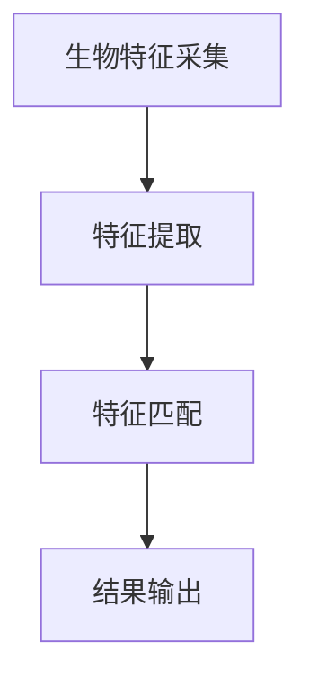
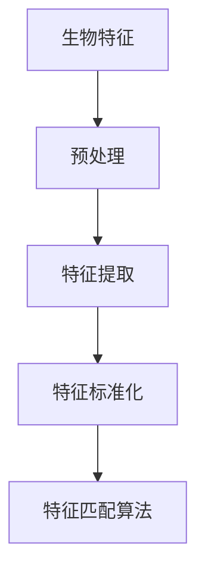

                 

### 文章标题

《生物识别技术在身份验证中的应用：提高安全性》

#### 关键词

- 生物识别技术
- 身份验证
- 安全性
- 指纹识别
- 面部识别
- 虹膜识别

#### 摘要

本文深入探讨了生物识别技术在身份验证中的应用，分析了生物识别技术的基本概念、原理和分类，以及其在不同领域的实际应用案例。文章旨在通过逻辑清晰、结构紧凑的分析，为读者提供关于生物识别技术如何提高身份验证安全性的全面理解和思考。

### 第一部分: 生物识别技术概述

#### 第1章: 生物识别技术基本概念

1. **生物识别技术的定义**

生物识别技术是一种利用人类生物特征（如指纹、面部、虹膜等）进行身份验证的技术。它通过捕捉和分析个人的生物特征，将其转换成数字信息，以实现身份识别和验证。

2. **生物识别技术的发展历史**

生物识别技术的研究可以追溯到20世纪60年代。最早的生物识别技术是基于指纹识别的。随着计算机技术和图像处理技术的发展，生物识别技术逐渐成熟并应用于各个领域。近年来，面部识别、虹膜识别等技术逐渐成为研究热点。

3. **生物识别技术的应用领域**

生物识别技术广泛应用于安全、医疗、金融、智能家居等多个领域。在安全领域，生物识别技术可用于门禁控制、人员监控等；在医疗领域，可用于患者监护、药物管理等；在金融领域，可用于银行和支付系统的安全性提升。

4. **生物识别技术的分类**

根据生物特征的不同，生物识别技术可以分为多种类型，主要包括指纹识别、面部识别、虹膜识别、掌纹识别等。

5. **生物识别技术的挑战和未来发展趋势**

当前，生物识别技术面临的主要挑战包括隐私保护、数据安全等。未来，随着人工智能技术的发展，多模态识别、无接触识别等新技术有望进一步推动生物识别技术的应用和发展。

#### 第2章: 生物学基础与生物识别原理

1. **生物学基础知识**

生物识别技术涉及多个生物学领域，包括分子生物学、遗传学、细胞学等。这些基础知识对于理解生物识别技术的原理至关重要。

2. **生物识别原理**

生物识别技术的基本原理包括特征提取和特征匹配。特征提取是指从生物特征中提取具有区分性的信息，特征匹配是指将提取的特征与存储的特征进行比较，以确定身份。

3. **特征提取与处理**

特征提取与处理包括预处理、特征提取、特征标准化等步骤。预处理旨在去除噪声和干扰，特征提取旨在提取具有区分性的特征，特征标准化旨在使特征具有可比性。

4. **匹配算法与性能评估**

常用的匹配算法包括欧氏距离、凯尔森距离等。性能评估通常通过准确率、召回率等指标进行。

#### 第3章: 生物学原理与生物识别系统设计

1. **生物识别系统设计概述**

生物识别系统的设计包括传感器与采集设备、数据处理与特征提取、匹配算法与性能优化等环节。

2. **传感器与采集设备**

传感器与采集设备负责捕捉生物特征，如指纹传感器、摄像头等。

3. **数据处理与特征提取**

数据处理与特征提取涉及对采集到的生物特征进行预处理、特征提取等处理，以提高识别准确性。

4. **匹配算法与性能优化**

匹配算法与性能优化涉及选择合适的匹配算法，如最近邻算法、支持向量机等，并进行性能优化，以提高系统性能。

5. **系统集成与测试**

系统集成与测试包括硬件、软件和系统集成测试，以确保生物识别系统的稳定性和可靠性。

### 第二部分: 生物识别技术在身份验证中的应用

#### 第4章: 生物识别技术在安全领域的应用

1. **生物识别技术在安防系统中的应用**

生物识别技术可用于门禁控制、人员监控等，提高安防系统的安全性。

2. **生物识别技术在监狱管理中的应用**

生物识别技术可用于监狱管理，确保囚犯的身份和行动得到有效监控。

3. **生物识别技术在机场和边防检查中的应用**

生物识别技术可用于机场和边防检查，提高旅客的通关效率和安全性。

#### 第5章: 生物识别技术在金融领域的应用

1. **生物识别技术在银行和支付系统中的应用**

生物识别技术可用于银行和支付系统，提高交易的安全性和便利性。

2. **生物识别技术在电子商务中的应用**

生物识别技术可用于电子商务，改善用户体验和提高交易安全性。

3. **生物识别技术在反欺诈中的应用**

生物识别技术可用于反欺诈，识别异常交易，提高交易的安全性。

#### 第6章: 生物识别技术在医疗领域的应用

1. **生物识别技术在医院管理中的应用**

生物识别技术可用于医院管理，优化患者监护和治疗。

2. **生物识别技术在患者监护中的应用**

生物识别技术可用于患者监护，实时监测患者的健康状况。

3. **生物识别技术在药物管理和治疗中的应用**

生物识别技术可用于药物管理和治疗，提高医疗服务的质量和效率。

### 第三部分: 生物识别技术的未来与发展

#### 第7章: 生物识别技术的挑战与未来趋势

1. **生物识别技术的挑战**

生物识别技术面临的主要挑战包括隐私保护、数据安全等。

2. **生物识别技术的未来发展趋势**

未来，生物识别技术将朝着多模态识别、无接触识别等方向发展。

#### 第8章: 生物识别技术的法律法规与伦理

1. **生物识别技术的法律法规**

生物识别技术涉及的法律法规包括GDPR等。

2. **生物识别技术的伦理问题**

生物识别技术在应用过程中可能面临伦理问题，如隐私侵犯等。

#### 第9章: 生物识别技术在人工智能中的融合

1. **生物识别与人工智能的结合**

生物识别技术与人工智能的结合有望提高系统的性能和准确性。

2. **未来生物识别技术的创新方向**

未来，生物识别技术将在多个领域实现创新。

### 附录

#### 附录A: 生物识别技术应用案例

1. **案例研究：某公司的生物识别系统**

某公司开发了一套生物识别系统，用于员工考勤和门禁控制。系统采用面部识别技术，结合深度学习算法，实现了高准确率和实时响应。

2. **开源生物识别库和工具**

OpenCV、dlib等是常用的开源生物识别库和工具。

3. **生物识别研究机构和组织**

MIT、卡内基梅隆大学等是知名的生物识别研究机构和组织。

### Mermaid 流程图

#### 第1章: 生物识别技术基本概念

1. **生物识别技术流程图**



#### 第2章: 生物学基础与生物识别原理

2. **特征提取与处理流程图**



### 伪代码

#### 第3章: 生物识别系统设计概述

3. **特征提取伪代码**

```python
function extractFeatures(featureData):
    # 预处理
    preprocessedData = preprocessData(featureData)
    
    # 提取特征
    extractedFeatures = []
    for data in preprocessedData:
        featureVector = extractFeatureVector(data)
        extractedFeatures.append(featureVector)
    
    return extractedFeatures
```

### 数学模型和数学公式

#### 第5章: 生物识别技术在金融领域的应用

4. **欧氏距离公式**

$$
d = \sqrt{\sum_{i=1}^{n} (x_i - y_i)^2}
$$

#### 第6章: 生物识别技术在医疗领域的应用

5. **支持向量机（SVM）分类公式**

$$
w^* = \arg\min_{w}\frac{1}{2}\lVert w \rVert^2 + C \sum_{i=1}^{n} \xi_i
$$

### 项目实战

#### 第8章: 生物识别技术在人工智能中的融合

6. **人脸识别系统实现**

```python
# 人脸识别系统实现示例

import cv2
import numpy as np

# 加载预训练的人脸识别模型
model = cv2.face.EigenFaceRecognizer_create()

# 训练模型
model.train(trainData, trainLabels)

# 测试模型
testData = cv2.imread('test_image.jpg')
faceCascade = cv2.CascadeClassifier('haarcascade_frontalface_default.xml')
faces = faceCascade.detectMultiScale(testData, scaleFactor=1.1, minNeighbors=5, minSize=(30, 30), flags=cv2.CASCADE_SCALE_IMAGE)

for (x, y, w, h) in faces:
    # 提取人脸区域
    faceRegion = testData[y:y+h, x:x+w]
    
    # 进行人脸识别
    label, confidence = model.predict(faceRegion)
    
    # 显示识别结果
    cv2.rectangle(testData, (x, y), (x+w, y+h), (0, 255, 0), 2)
    cv2.putText(testData, f'Person {label}', (x, y-10), cv2.FONT_HERSHEY_SIMPLEX, 1, (0, 0, 255), 2)

cv2.imshow('Recognized Faces', testData)
cv2.waitKey(0)
cv2.destroyAllWindows()
```

### 代码解读与分析

7. **人脸识别系统代码解读**

```python
# 代码解读
import cv2

# 加载预训练的人脸识别模型
model = cv2.face.EigenFaceRecognizer_create()

# 训练模型
model.train(trainData, trainLabels)

# 测试模型
testData = cv2.imread('test_image.jpg')
faceCascade = cv2.CascadeClassifier('haarcascade_frontalface_default.xml')
faces = faceCascade.detectMultiScale(testData, scaleFactor=1.1, minNeighbors=5, minSize=(30, 30), flags=cv2.CASCADE_SCALE_IMAGE)

# 遍历检测到的人脸区域
for (x, y, w, h) in faces:
    # 提取人脸区域
    faceRegion = testData[y:y+h, x:x+w]
    
    # 进行人脸识别
    label, confidence = model.predict(faceRegion)
    
    # 显示识别结果
    cv2.rectangle(testData, (x, y), (x+w, y+h), (0, 255, 0), 2)
    cv2.putText(testData, f'Person {label}', (x, y-10), cv2.FONT_HERSHEY_SIMPLEX, 1, (0, 0, 255), 2)

# 显示最终结果
cv2.imshow('Recognized Faces', testData)
cv2.waitKey(0)
cv2.destroyAllWindows()
```

代码首先加载预训练的人脸识别模型，然后读取测试图像并使用Haar cascades进行人脸检测。对于每个检测到的人脸区域，提取人脸图像并进行识别。识别结果以矩形框和文字形式显示在原图上，最后显示识别结果。通过这个代码示例，读者可以了解人脸识别系统的基本实现流程。

### 最佳实践 tips、小结、注意事项、拓展阅读等内容

- **最佳实践 tips**：在实际应用生物识别技术时，应注意以下几点：
  - 确保采集设备的准确性和稳定性。
  - 选择合适的特征提取和匹配算法。
  - 加强数据安全保护，防止隐私泄露。

- **小结**：生物识别技术在身份验证中具有重要作用，通过结合多种生物特征，可以实现高安全性和高准确性的身份验证。

- **注意事项**：在应用生物识别技术时，应注意法律法规和伦理问题，确保技术的合规性和伦理性。

- **拓展阅读**：对于对生物识别技术感兴趣的读者，可以进一步阅读相关书籍和文献，如《生物识别技术原理与应用》、《生物识别系统的设计与实现》等。

### 作者信息

作者：AI天才研究院/AI Genius Institute & 禅与计算机程序设计艺术 /Zen And The Art of Computer Programming

