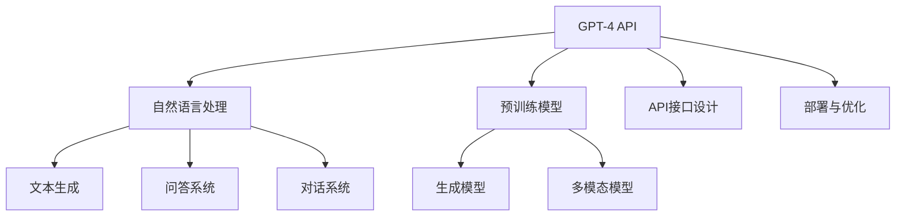

                 

### 《生生不息的循环：使用强大的GPT-4 API》

> **关键词：** GPT-4 API，自然语言处理，文本生成，对话系统，多模态应用

> **摘要：** 本文将深入探讨GPT-4 API的强大功能和应用，通过逐步分析其核心概念、技术基础、应用实战、性能优化以及未来展望，帮助读者全面了解并掌握这一前沿技术。GPT-4 API作为人工智能领域的里程碑，正引领着自然语言处理的革命，其应用前景无限广阔。

---

### **第一部分：GPT-4 API基础**

#### **第1章：GPT-4 API概述**

##### **1.1 GPT-4 API简介**

GPT-4 API是OpenAI推出的一款革命性自然语言处理（NLP）工具，基于预训练的生成预训练模型（GPT）构建，具有强大的文本生成、问答和对话系统能力。GPT-4 API的历史背景可追溯到2018年GPT的发布，至今已历经多次迭代和优化，性能不断提升。其核心特性包括：

1. **强大的文本生成能力**：GPT-4 API能够生成连贯、流畅的文本，适用于自动写作、对话系统等场景。
2. **先进的问答系统**：GPT-4 API能够理解用户提问，并生成准确、有用的回答，提升搜索引擎和智能客服的效率。
3. **灵活的多模态处理**：GPT-4 API不仅支持文本，还能够处理图像、音频等多模态数据，实现更丰富的应用场景。

GPT-4 API的应用场景广泛，包括但不限于：

1. **内容生成**：自动写作、新闻报道、摘要生成等。
2. **智能客服**：提供实时问答和对话支持。
3. **教育**：个性化学习助手、作文批改等。
4. **医疗**：诊断辅助、病历分析等。

##### **1.2 GPT-4 API的核心概念与联系**

为了更好地理解GPT-4 API的工作原理，我们需要先掌握其核心概念和联系。以下是一个使用Mermaid绘制的流程图，展示了GPT-4 API的核心概念和联系：

- **自然语言处理（NLP）**：NLP是GPT-4 API的核心，它涉及到文本的预处理、理解、生成等任务。
- **预训练模型**：GPT-4 API基于预训练模型构建，这些模型在大量文本数据上进行训练，能够捕捉语言模式。
- **生成模型**：生成模型是GPT-4 API的核心组成部分，它能够根据输入文本生成新的文本。
- **多模态模型**：多模态模型使得GPT-4 API能够处理图像、音频等非文本数据，实现更广泛的应用。
- **API接口设计**：GPT-4 API提供了丰富的API接口，方便开发者集成和使用。
- **部署与优化**：GPT-4 API的部署与优化涉及硬件选择、模型压缩、并行计算等方面，以提升性能。

##### **1.3 GPT-4 API的优势与挑战**

GPT-4 API具有显著的优势，但也面临一定的挑战。

**优势**：

1. **强大的文本生成能力**：GPT-4 API在文本生成方面表现出色，能够生成高质量、连贯的文本。
2. **先进的问答系统**：GPT-4 API能够理解复杂的问题，并生成准确的回答，提升智能客服和搜索引擎的效率。
3. **灵活的多模态处理**：GPT-4 API能够处理多种数据类型，实现更广泛的应用场景。
4. **高效的API接口**：GPT-4 API提供了丰富的API接口，方便开发者集成和使用。

**挑战**：

1. **计算资源需求**：GPT-4 API的训练和推理需要大量计算资源，对硬件配置要求较高。
2. **数据隐私问题**：在处理用户数据时，需要确保数据隐私和安全。
3. **算法偏见**：GPT-4 API在生成文本时可能存在算法偏见，需要采取措施降低偏见。
4. **模型压缩与优化**：为了在移动设备和嵌入式系统上应用GPT-4 API，需要对其模型进行压缩和优化。

展望未来，GPT-4 API将继续发展，并在更多领域发挥重要作用。随着计算资源的提升和数据隐私保护措施的完善，GPT-4 API的应用前景将更加广阔。

---

**总结**：GPT-4 API作为自然语言处理领域的里程碑，具有强大的文本生成、问答和对话系统能力。通过逐步分析其核心概念、技术基础、应用实战、性能优化以及未来展望，本文帮助读者全面了解并掌握这一前沿技术。接下来，我们将进一步探讨GPT-4 API的技术基础，包括语言模型与自然语言处理技术、数学模型以及GPT-4 API的工作原理。**

