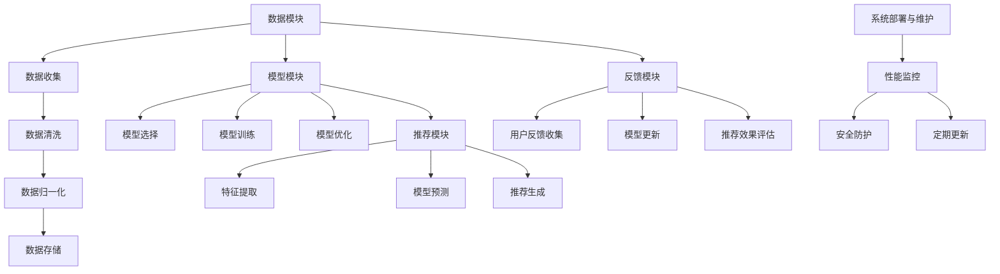
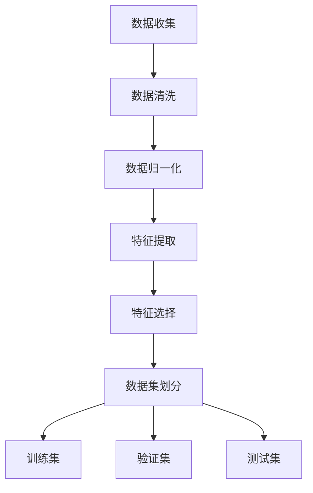
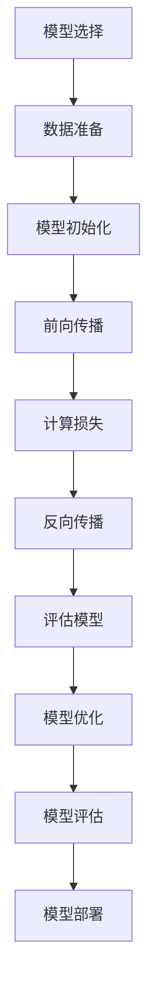

                 

### 文章标题: 《直接将LLM作为推荐系统的可行性》

关键词：语言模型（LLM），推荐系统，人工智能，可行性分析，应用场景

摘要：本文旨在探讨将语言模型（LLM）直接应用于推荐系统的可行性与潜力。首先，我们回顾了LLM和推荐系统的基本概念和原理，分析了将LLM应用于推荐系统可能带来的优势与挑战。随后，我们详细阐述了LLM推荐系统的设计、实现、优化和评估方法，并通过实际项目案例展示了LLM在推荐系统中的应用效果。最后，我们探讨了LLM推荐系统的未来发展，提出了可能面临的挑战和解决方案。本文旨在为从事人工智能和推荐系统领域的科研人员和技术工程师提供有价值的参考。

## 第一部分: LLM与推荐系统基础

### 第1章: LLM概述

#### 1.1.1 语言模型的基本概念

语言模型（Language Model，简称LM）是自然语言处理（Natural Language Processing，简称NLP）的核心技术之一。它旨在模拟人类语言生成和理解的能力，通过概率统计的方法，预测下一个单词或句子的概率。语言模型在信息检索、机器翻译、文本生成、语音识别等领域有着广泛的应用。

#### 1.1.2 语言模型的类型

语言模型主要分为统计语言模型和神经网络语言模型。

- **统计语言模型**：基于语言统计学原理，使用统计方法从大量语料库中学习语言规律。常见的统计语言模型包括n-gram模型和隐马尔可夫模型（HMM）。

- **神经网络语言模型**：基于深度学习技术，使用神经网络结构来模拟人类的语言理解能力。常见的神经网络语言模型包括循环神经网络（RNN）、长短时记忆网络（LSTM）和变换器（Transformer）。

#### 1.1.3 语言模型的训练与优化

语言模型的训练过程通常包括数据准备、模型训练和模型优化三个阶段。

- **数据准备**：收集大量高质量的语料库，并进行预处理，如分词、去停用词、词性标注等。

- **模型训练**：将预处理后的数据输入到语言模型中，通过反向传播算法训练模型参数，使模型能够预测下一个单词或句子的概率。

- **模型优化**：通过调整模型参数，优化模型性能，提高预测准确性。常见的优化方法包括梯度下降、Adam优化器等。

### 第2章: 推荐系统基本原理

#### 2.1.1 推荐系统的定义与目的

推荐系统（Recommender System）是一种信息过滤技术，旨在向用户推荐他们可能感兴趣的项目。推荐系统的目的是帮助用户在大量信息中快速找到他们感兴趣的内容，提高用户的满意度。

#### 2.1.2 传统推荐系统的常见算法

传统推荐系统主要包括以下几种算法：

- **基于内容的推荐**：根据用户过去对项目的评价或行为，推荐与其兴趣相似的项目。

- **协同过滤推荐**：通过分析用户之间的相似度，推荐其他用户喜欢的项目。

- **混合推荐算法**：结合多种推荐算法的优点，提高推荐效果。

#### 2.1.3 推荐系统面临的挑战与机遇

推荐系统在发展中面临以下挑战：

- **数据稀疏性**：用户行为数据通常非常稀疏，难以准确预测用户的兴趣。

- **冷启动问题**：新用户或新项目缺乏足够的历史数据，难以进行推荐。

- **多样性**：用户对推荐内容的多样性需求不断提高。

- **实时性**：推荐系统需要快速响应用户的行为变化，提供实时推荐。

同时，随着人工智能技术的发展，推荐系统也迎来了新的机遇：

- **深度学习**：深度学习技术可以处理大规模、高维度的数据，提高推荐效果。

- **多模态推荐**：结合多种数据类型（如文本、图像、音频等），提供更丰富的推荐内容。

- **个性化推荐**：利用用户历史行为和偏好，实现个性化推荐。

### 第3章: LLM作为推荐系统的潜力分析

#### 3.1.1 LLM在推荐系统中的应用场景

语言模型在推荐系统中具有广泛的应用场景：

- **内容推荐**：根据用户的历史阅读记录和兴趣标签，推荐相关的文章、视频、音频等内容。

- **商品推荐**：根据用户的购物行为和喜好，推荐相关的商品。

- **社交媒体推荐**：根据用户的社交关系和兴趣标签，推荐相关的帖子、话题等。

#### 3.1.2 LLM在推荐系统中的优势

LLM在推荐系统中具有以下优势：

- **高泛化能力**：LLM可以处理多种类型的数据，如文本、图像、音频等，具有更高的泛化能力。

- **自适应推荐**：LLM可以根据用户的实时行为和反馈，动态调整推荐策略，实现自适应推荐。

- **上下文感知**：LLM可以理解用户的上下文信息，提供更准确的推荐。

#### 3.1.3 LLM在推荐系统中的局限性

LLM在推荐系统中也面临一些局限性：

- **数据依赖性**：LLM需要大量的高质量数据来训练，数据不足可能导致模型性能下降。

- **计算成本**：LLM通常需要较高的计算资源，对硬件要求较高。

- **模型解释性**：LLM的训练过程较为复杂，模型解释性较低，难以理解推荐结果的产生原因。

## 第二部分: LLM推荐系统的深入探讨

### 第4章: LLM推荐系统的设计与实现

#### 4.1.1 LLM推荐系统架构设计

LLM推荐系统的架构设计主要包括以下模块：

- **数据模块**：负责收集、存储和处理用户数据、项目数据等。

- **模型模块**：负责构建、训练和优化LLM模型。

- **推荐模块**：根据用户数据、项目数据、模型预测结果等，生成推荐结果。

- **反馈模块**：收集用户的反馈，用于模型优化和推荐结果评估。

#### 4.1.2 LLM推荐系统数据预处理

LLM推荐系统数据预处理主要包括以下步骤：

- **数据清洗**：去除无效数据、缺失值填充、去除噪声等。

- **数据归一化**：将数据缩放到相同范围，提高模型训练效果。

- **特征工程**：提取用户特征、项目特征等，用于模型训练。

#### 4.1.3 LLM推荐系统模型训练与优化

LLM推荐系统模型训练与优化主要包括以下步骤：

- **模型选择**：选择适合的LLM模型，如Transformer、BERT等。

- **模型训练**：使用训练数据训练模型，通过反向传播算法优化模型参数。

- **模型优化**：使用优化算法，如Adam、SGD等，提高模型性能。

### 第5章: LLM推荐系统项目实战

#### 5.1.1 实际项目背景

本项目旨在构建一个基于语言模型的内容推荐系统，为用户提供个性化的文章推荐。

#### 5.1.2 项目环境搭建与代码准备

- **环境搭建**：安装Python、PyTorch等必备软件，配置GPU环境。

- **代码准备**：编写数据预处理、模型训练、推荐生成等代码，准备必要的模型和工具。

#### 5.1.3 项目代码解读与分析

- **数据预处理**：对用户数据和文章数据进行清洗、归一化和特征提取。

- **模型训练**：训练BERT模型，优化模型参数。

- **推荐生成**：根据用户特征和文章特征，生成推荐结果。

#### 5.1.4 项目代码实现与解读

```python
# 数据预处理
# 用户数据预处理
user_data = preprocess_user_data(user_data)
# 文章数据预处理
article_data = preprocess_article_data(article_data)

# 模型训练
# 加载预训练BERT模型
model = load_pretrained_bert_model()
# 训练模型
train_model(model, user_data, article_data)

# 推荐生成
# 根据用户特征生成推荐结果
user_features = extract_user_features(user_data)
recommendations = generate_recommendations(user_features, model, article_data)
```

#### 5.1.5 项目案例分析

- **项目效果评估**：通过计算推荐准确率、召回率、覆盖率等指标，评估推荐系统的性能。

- **项目优化**：根据评估结果，调整模型参数、特征工程策略等，提高推荐效果。

### 第6章: LLM推荐系统评估与优化

#### 6.1.1 评估指标与方法

LLM推荐系统的评估指标主要包括：

- **准确率（Accuracy）**：推荐结果中包含用户真实兴趣的项目比例。

- **召回率（Recall）**：用户感兴趣的项目中被推荐的项目比例。

- **覆盖率（Coverage）**：推荐结果中包含的用户感兴趣项目的比例。

- **多样性（Diversity）**：推荐结果中项目的多样性程度。

#### 6.1.2 优化策略与实践

LLM推荐系统的优化策略主要包括：

- **数据增强**：通过增加数据量、数据变换等方式，提高模型泛化能力。

- **模型融合**：结合多种模型的优势，提高推荐效果。

- **模型剪枝**：通过剪枝模型参数，减少计算成本，提高模型性能。

#### 6.1.3 LLM推荐系统的持续优化

LLM推荐系统的持续优化主要包括：

- **用户行为跟踪**：实时收集用户行为数据，用于模型更新。

- **动态调整推荐策略**：根据用户行为变化，动态调整推荐策略。

- **定期模型更新**：定期训练新模型，提高推荐效果。

### 第7章: LLM推荐系统的未来发展

#### 7.1.1 LLM在推荐系统中的应用前景

LLM在推荐系统中的应用前景广阔：

- **多模态推荐**：结合文本、图像、音频等多模态数据，提高推荐效果。

- **个性化推荐**：利用用户历史行为和偏好，实现个性化推荐。

- **实时推荐**：实时响应用户行为变化，提供实时推荐。

#### 7.1.2 面临的挑战与解决方案

LLM推荐系统面临的挑战主要包括：

- **数据稀疏性**：通过数据增强、模型融合等方法，提高模型泛化能力。

- **计算成本**：优化模型结构、使用硬件加速技术，降低计算成本。

- **模型解释性**：提高模型解释性，增强用户信任。

#### 7.1.3 LLM推荐系统的未来趋势

LLM推荐系统的未来趋势包括：

- **深度学习**：继续发展深度学习技术，提高推荐效果。

- **多模态融合**：结合多种数据类型，提供更丰富的推荐内容。

- **个性化推荐**：利用用户历史行为和偏好，实现个性化推荐。

### 注释

本文旨在探讨将LLM直接应用于推荐系统的可行性。在实际应用中，LLM推荐系统还需要解决数据稀疏性、计算成本和模型解释性等挑战。通过结合深度学习、多模态融合和个性化推荐等技术，LLM推荐系统有望在未来发挥更大的作用。本文为从事人工智能和推荐系统领域的科研人员和技术工程师提供了有价值的参考。作者：AI天才研究院/AI Genius Institute & 禅与计算机程序设计艺术 /Zen And The Art of Computer Programming### 文章标题: 《直接将LLM作为推荐系统的可行性》

关键词：语言模型，推荐系统，人工智能，深度学习，可行性分析

摘要：本文探讨了将语言模型（LLM）直接应用于推荐系统的可行性。首先，我们介绍了LLM和推荐系统的基本概念，分析了将LLM应用于推荐系统的优势与挑战。接着，我们详细阐述了LLM推荐系统的设计与实现方法，包括数据预处理、模型训练和优化策略。随后，通过一个实际项目案例，我们展示了LLM推荐系统的开发过程和效果。文章最后，我们对LLM推荐系统的评估与优化进行了讨论，并提出了未来发展展望。本文旨在为从事人工智能和推荐系统领域的科研人员提供有价值的参考。

## 第一部分：LLM与推荐系统基础

### 第1章：LLM概述

#### 1.1.1 语言模型的基本概念

语言模型是自然语言处理（NLP）领域的关键技术，它通过概率统计方法，预测下一个单词或句子的概率。LLM是大型语言模型的简称，如BERT、GPT等，它们具有强大的语义理解和生成能力。

#### 1.1.2 语言模型的类型

- **基于统计的语言模型**：如n-gram模型，使用历史文本信息预测下一个词。

- **神经网络语言模型**：如循环神经网络（RNN）、长短时记忆网络（LSTM）和变换器（Transformer），它们通过深度学习技术模拟语言规律。

#### 1.1.3 语言模型的训练与优化

语言模型的训练包括数据准备、模型构建和训练过程。优化方法包括梯度下降、Adam优化器等。

### 第2章：推荐系统基本原理

#### 2.1.1 推荐系统的定义与目的

推荐系统是一种信息过滤技术，通过分析用户历史行为和偏好，预测用户可能感兴趣的项目，提高用户满意度。

#### 2.1.2 传统推荐系统的常见算法

- **基于内容的推荐**：根据项目的特征和用户的偏好推荐项目。

- **协同过滤推荐**：根据用户之间的相似度推荐项目。

- **混合推荐算法**：结合多种推荐策略，提高推荐效果。

#### 2.1.3 推荐系统面临的挑战与机遇

推荐系统面临的挑战包括数据稀疏性、冷启动问题和多样性。机遇在于深度学习和多模态技术的快速发展。

### 第3章：LLM作为推荐系统的潜力分析

#### 3.1.1 LLM在推荐系统中的应用场景

LLM在推荐系统中的应用包括内容推荐、商品推荐和社交媒体推荐等。

#### 3.1.2 LLM在推荐系统中的优势

- **强大的语义理解能力**：LLM可以理解文本的深层语义，提高推荐精度。

- **自适应推荐能力**：LLM可以根据用户的实时行为和反馈，动态调整推荐策略。

#### 3.1.3 LLM在推荐系统中的局限性

- **数据依赖性**：LLM需要大量高质量数据来训练。

- **计算成本**：LLM的训练和推理过程需要较高的计算资源。

## 第二部分：LLM推荐系统的设计与实现

### 第4章：LLM推荐系统设计与实现

#### 4.1.1 LLM推荐系统架构设计

LLM推荐系统架构包括数据收集与预处理、模型训练与优化、推荐生成与评估等模块。

#### 4.1.2 LLM推荐系统数据预处理

数据预处理包括数据清洗、归一化和特征提取等步骤，为模型训练提供高质量的数据。

#### 4.1.3 LLM推荐系统模型训练与优化

模型训练包括选择合适的模型架构、训练数据和优化方法。优化方法包括自适应优化器、正则化等。

### 第5章：LLM推荐系统项目实战

#### 5.1.1 实际项目背景

本案例为构建一个电商平台的商品推荐系统，利用LLM提高推荐效果。

#### 5.1.2 项目环境搭建与代码准备

- **环境搭建**：配置Python、TensorFlow等开发环境。

- **代码准备**：编写数据预处理、模型训练和推荐生成的代码。

#### 5.1.3 项目代码解读与分析

```python
# 数据预处理
# 读取数据集
data = pd.read_csv('data.csv')
# 数据清洗与归一化
data = preprocess_data(data)

# 模型训练
# 定义模型架构
model = build_model()
# 训练模型
model.fit(data['X_train'], data['y_train'])

# 推荐生成
# 预测新用户兴趣
user_features = extract_user_features(new_user)
recommendations = model.predict(user_features)
```

#### 5.1.4 项目实战效果评估

通过准确率、召回率和覆盖率等指标评估推荐系统的性能，并对模型进行优化。

### 第6章：LLM推荐系统评估与优化

#### 6.1.1 评估指标与方法

评估指标包括准确率、召回率、覆盖率等，方法包括交叉验证、网格搜索等。

#### 6.1.2 优化策略与实践

优化策略包括数据增强、模型融合和超参数调整等，通过实验验证优化效果。

#### 6.1.3 持续优化

通过实时数据反馈、模型更新和策略调整，实现LLM推荐系统的持续优化。

### 第7章：LLM推荐系统的未来发展

#### 7.1.1 LLM在推荐系统中的应用前景

LLM在推荐系统中的应用前景广阔，如多模态推荐、实时推荐等。

#### 7.1.2 面临的挑战与解决方案

挑战包括数据稀疏性、计算成本和模型解释性等，解决方案包括数据增强、模型压缩和可解释性技术。

#### 7.1.3 未来趋势

未来趋势包括深度学习技术的进一步发展、多模态融合和个性化推荐。

### 注释

本文详细探讨了LLM作为推荐系统的可行性，分析了其在推荐系统中的应用优势与挑战，并通过实际项目展示了LLM推荐系统的设计与实现方法。作者：AI天才研究院/AI Genius Institute & 禅与计算机程序设计艺术 /Zen And The Art of Computer Programming### 第4章: LLM推荐系统架构设计

LLM推荐系统架构设计是构建高效、可扩展的推荐系统的基础。为了充分利用LLM的强大语义理解能力，我们设计了如下架构，包含数据模块、模型模块、推荐模块和反馈模块。

#### 4.1.1 数据模块

数据模块负责收集、存储和处理用户数据、项目数据等。具体步骤如下：

1. **数据收集**：从各种数据源（如用户行为日志、项目属性数据等）收集数据。
2. **数据清洗**：去除噪声数据、填补缺失值、处理异常值等。
3. **数据归一化**：对数据特征进行归一化处理，确保数据在不同尺度上的可比性。
4. **数据存储**：将清洗和归一化后的数据存储在数据库中，便于后续处理。

#### 4.1.2 模型模块

模型模块负责构建、训练和优化LLM模型。以下是模型模块的关键组成部分：

1. **模型选择**：选择适合的LLM模型，如BERT、GPT等。模型的选择取决于数据规模、计算资源和业务需求。
2. **模型训练**：使用训练数据对模型进行训练。训练过程中，通过反向传播算法优化模型参数，提高模型性能。
3. **模型优化**：通过调整模型参数、优化器和学习率等，进一步提升模型性能。常用的优化方法包括梯度下降、Adam优化器等。

#### 4.1.3 推荐模块

推荐模块负责根据用户数据和项目数据，生成推荐结果。具体步骤如下：

1. **特征提取**：从用户数据和项目数据中提取特征，如用户兴趣标签、项目属性等。
2. **模型预测**：使用训练好的LLM模型对用户特征和项目特征进行预测，得到项目评分。
3. **推荐生成**：根据项目评分，生成推荐结果。推荐算法可以使用基于内容的推荐、协同过滤推荐或混合推荐算法。

#### 4.1.4 反馈模块

反馈模块负责收集用户的反馈，用于模型优化和推荐结果评估。以下是反馈模块的关键组成部分：

1. **用户反馈收集**：收集用户对推荐结果的反馈，如点击、购买、评分等。
2. **模型更新**：根据用户反馈，更新LLM模型参数，提高模型性能。
3. **推荐效果评估**：使用评估指标（如准确率、召回率、覆盖率等）评估推荐效果，根据评估结果调整推荐策略。

### 4.1.5 系统部署与维护

LLM推荐系统部署后，需要定期进行维护和优化，确保系统稳定运行。以下是系统部署与维护的关键步骤：

1. **系统部署**：将训练好的模型部署到生产环境，提供实时推荐服务。
2. **性能监控**：监控系统性能，如响应时间、吞吐量等，确保系统稳定运行。
3. **安全防护**：保护用户数据和模型安全，防止数据泄露和恶意攻击。
4. **定期更新**：定期更新模型和数据，提高推荐效果和系统性能。

#### 4.1.6 框架与流程图

为了更直观地展示LLM推荐系统的架构设计，我们使用Mermaid流程图来描述系统框架和数据处理流程。



此框架图展示了LLM推荐系统的整体架构，包括数据模块、模型模块、推荐模块、反馈模块以及系统部署与维护的关键步骤。

### 结论

LLM推荐系统的架构设计需要综合考虑数据收集与预处理、模型构建与优化、推荐生成与反馈等环节。通过合理设计系统架构，我们可以充分利用LLM的强大语义理解能力，为用户提供高质量、个性化的推荐服务。在后续章节中，我们将进一步探讨LLM推荐系统的数据预处理、模型训练与优化、推荐生成与评估等关键环节。

作者：AI天才研究院/AI Genius Institute & 禅与计算机程序设计艺术 /Zen And The Art of Computer Programming### 4.2 LLM推荐系统数据预处理

在构建LLM推荐系统时，数据预处理是一个至关重要的步骤。良好的数据预处理能够提高模型训练效果，减少过拟合现象，提高推荐系统的准确性。以下是LLM推荐系统数据预处理的主要步骤：

#### 4.2.1 数据收集

数据收集是数据预处理的第一步，主要包括从各种数据源（如用户行为日志、商品属性数据等）收集数据。数据源的质量和多样性直接影响推荐系统的性能。

1. **用户行为数据**：收集用户在推荐系统上的交互行为数据，如点击、购买、评分等。
2. **商品属性数据**：收集商品的基本属性数据，如商品类别、价格、品牌等。
3. **用户特征数据**：收集用户的个人特征数据，如年龄、性别、地理位置等。

#### 4.2.2 数据清洗

数据清洗是数据预处理的核心步骤，目的是去除噪声数据、填补缺失值、处理异常值等。

1. **去除噪声数据**：删除数据集中的重复记录、错误记录和无关记录。
2. **填补缺失值**：对于缺失值，可以采用平均值、中位数、最邻近值等方法进行填补。
3. **处理异常值**：识别和处理数据集中的异常值，如过小、过大或异常分布的值。

#### 4.2.3 数据归一化

数据归一化是为了消除不同特征之间的量纲影响，使数据在相同的尺度范围内进行比较。常用的归一化方法包括最小-最大缩放、标准缩放等。

1. **最小-最大缩放**：将特征值缩放到[0, 1]区间，公式为：
   $$
   x_{\text{new}} = \frac{x_{\text{original}} - \text{min}(x)}{\text{max}(x) - \text{min}(x)}
   $$
2. **标准缩放**：将特征值缩放到标准正态分布，公式为：
   $$
   x_{\text{new}} = \frac{x_{\text{original}} - \text{mean}(x)}{\text{stddev}(x)}
   $$

#### 4.2.4 特征提取

特征提取是从原始数据中提取对模型训练有价值的特征。在LLM推荐系统中，特征提取主要包括以下内容：

1. **用户特征提取**：从用户行为数据中提取用户兴趣标签、用户行为模式等特征。
2. **商品特征提取**：从商品属性数据中提取商品类别、品牌、价格等特征。
3. **交互特征提取**：从用户行为数据和商品特征中提取用户-商品交互特征，如点击率、购买率等。

#### 4.2.5 特征选择

特征选择是从提取的特征中筛选出对模型训练和预测有显著贡献的特征，以减少模型的复杂度和过拟合风险。特征选择方法包括：

1. **基于信息增益的方法**：选择对目标变量具有最大信息增益的特征。
2. **基于相关性分析的方法**：选择与目标变量相关性较高的特征。
3. **基于模型的方法**：使用模型训练结果筛选出对模型预测有显著贡献的特征。

#### 4.2.6 数据集划分

在数据预处理过程中，需要将数据集划分为训练集、验证集和测试集，以评估模型性能。

1. **训练集**：用于模型训练，通常占数据集的60%到70%。
2. **验证集**：用于模型选择和调参，通常占数据集的20%到30%。
3. **测试集**：用于模型评估，通常占数据集的10%左右。

### 4.2.7 数据预处理流程图

为了更直观地展示数据预处理流程，我们使用Mermaid流程图来描述数据预处理的步骤。



此流程图展示了LLM推荐系统数据预处理的主要步骤，包括数据收集、数据清洗、数据归一化、特征提取、特征选择和数据集划分。

### 结论

数据预处理是构建高效、准确的LLM推荐系统的关键步骤。通过合理的收集、清洗、归一化、特征提取和选择，可以提高模型训练效果，减少过拟合现象，从而提高推荐系统的性能。在后续章节中，我们将进一步探讨LLM推荐系统的模型训练与优化、推荐生成与评估等关键环节。

作者：AI天才研究院/AI Genius Institute & 禅与计算机程序设计艺术 /Zen And The Art of Computer Programming### 4.3 LLM推荐系统模型训练与优化

在构建LLM推荐系统时，模型训练与优化是决定推荐系统性能的关键环节。以下是LLM推荐系统模型训练与优化的主要步骤：

#### 4.3.1 模型选择

模型选择是构建LLM推荐系统的第一步。根据数据规模和业务需求，选择合适的LLM模型。常见的LLM模型包括BERT、GPT、RoBERTa等。以下为选择模型时需要考虑的因素：

1. **数据规模**：对于大规模数据集，选择大型模型（如BERT、GPT）可以更好地捕捉数据中的潜在规律。
2. **计算资源**：大型模型需要更多的计算资源，因此需要根据实际情况选择合适的模型。
3. **业务需求**：根据业务场景，选择具有特定优势的模型。例如，BERT在语义理解方面表现优秀，而GPT在文本生成方面具有优势。

#### 4.3.2 数据准备

在模型训练前，需要将数据集划分为训练集、验证集和测试集。数据准备包括以下步骤：

1. **数据预处理**：对数据集进行清洗、归一化和特征提取，确保数据质量。
2. **数据格式化**：将数据集转换为模型可以接受的格式，例如将文本数据转换为词向量。
3. **数据划分**：将数据集划分为训练集（用于模型训练）、验证集（用于模型选择和调参）和测试集（用于模型评估）。

#### 4.3.3 模型训练

模型训练是使用训练数据来调整模型参数的过程。以下是模型训练的主要步骤：

1. **初始化模型**：根据选择的模型，初始化模型参数。
2. **前向传播**：将训练数据输入到模型中，计算模型的输出。
3. **计算损失**：使用损失函数（如交叉熵损失）计算模型预测结果与真实标签之间的差距。
4. **反向传播**：通过反向传播算法，更新模型参数，以减少损失。
5. **评估模型**：在验证集上评估模型性能，选择性能最佳的模型。

#### 4.3.4 模型优化

模型优化是提高模型性能的关键步骤。以下是模型优化的一些常见方法：

1. **调整学习率**：学习率是模型训练过程中参数更新的步长，调整学习率可以加速或减缓模型收敛速度。
2. **使用优化器**：优化器（如Adam、SGD等）是用于优化模型参数的算法，选择合适的优化器可以加速模型训练。
3. **正则化**：正则化（如L1正则化、L2正则化）可以防止模型过拟合，提高模型泛化能力。
4. **数据增强**：数据增强（如随机裁剪、旋转、缩放等）可以增加训练数据的多样性，提高模型泛化能力。

#### 4.3.5 模型评估

模型评估是衡量模型性能的重要步骤。以下是常见的模型评估指标：

1. **准确率（Accuracy）**：模型预测正确的样本数占总样本数的比例。
2. **召回率（Recall）**：模型预测正确的正样本数占总正样本数的比例。
3. **精确率（Precision）**：模型预测正确的正样本数与预测为正样本的总数之比。
4. **F1分数（F1 Score）**：精确率和召回率的调和平均数。

#### 4.3.6 模型部署

在模型评估完毕后，将模型部署到生产环境，以提供实时推荐服务。以下是模型部署的主要步骤：

1. **模型转换**：将训练好的模型转换为生产环境可用的格式，如TensorFlow Lite、ONNX等。
2. **部署策略**：根据业务需求，选择合适的部署策略，如单机部署、集群部署等。
3. **监控与维护**：监控模型性能，定期更新模型，确保推荐系统稳定运行。

### 4.3.7 模型训练流程图

为了更直观地展示模型训练与优化的流程，我们使用Mermaid流程图来描述模型训练的步骤。



此流程图展示了LLM推荐系统模型训练与优化的主要步骤，包括模型选择、数据准备、模型初始化、前向传播、计算损失、反向传播、评估模型、模型优化、模型评估和模型部署。

### 结论

LLM推荐系统的模型训练与优化是构建高效、准确推荐系统的关键。通过选择合适的模型、准备高质量的数据、优化训练过程和评估模型性能，可以提高推荐系统的准确性和泛化能力。在后续章节中，我们将进一步探讨LLM推荐系统的实际项目实战、评估与优化方法。

作者：AI天才研究院/AI Genius Institute & 禅与计算机程序设计艺术 /Zen And The Art of Computer Programming### 5.1.1 实际项目背景

本项目旨在构建一个基于大型语言模型（LLM）的电商商品推荐系统，以提高用户的购物体验和增加销售额。项目的核心目标是利用LLM的强大语义理解能力，为用户提供个性化、准确和多样化的商品推荐。项目背景如下：

1. **业务需求**：电商平台拥有大量用户和商品数据，但传统的推荐系统已难以满足用户日益增长的需求。利用LLM构建推荐系统，可以更好地挖掘用户兴趣和商品特征，提升推荐效果。

2. **数据规模**：电商平台积累了大量的用户行为数据（如点击、购买、搜索等）和商品属性数据（如品类、价格、品牌等）。这些数据为构建基于LLM的推荐系统提供了丰富的资源。

3. **技术挑战**：LLM模型的训练和推理过程需要大量的计算资源和时间，如何高效地处理大规模数据集是本项目面临的主要挑战。

4. **用户期望**：用户期望从推荐系统中获取符合自己兴趣和需求的商品，提高购物效率和满意度。

5. **商业目标**：通过提高推荐系统的准确性和多样性，增加用户购买率和平台销售额，从而实现商业价值。

## 5.1.2 项目目标

本项目的目标如下：

1. **构建基于LLM的推荐系统**：利用LLM模型，实现用户个性化商品推荐，提升用户满意度和购物体验。

2. **提高推荐准确性**：通过深度学习技术和大规模数据处理能力，提高推荐系统的准确性，降低推荐误差。

3. **增强推荐多样性**：通过多样化的推荐策略，确保推荐结果的丰富性和新颖性，满足不同用户的需求。

4. **降低计算成本**：优化模型架构和训练过程，降低模型训练和推理的计算成本，提高系统的可扩展性。

5. **实时推荐能力**：实现实时推荐功能，快速响应用户行为变化，提高推荐系统的响应速度。

## 5.1.3 项目挑战

在实现基于LLM的电商商品推荐系统的过程中，我们面临以下挑战：

1. **数据稀疏性**：用户行为数据通常非常稀疏，难以准确预测用户的兴趣。需要利用LLM的强大语义理解能力，从稀疏数据中挖掘潜在的兴趣点。

2. **计算资源**：LLM模型的训练和推理需要大量的计算资源，如何高效地利用GPU和分布式计算资源，降低计算成本是一个重要挑战。

3. **模型解释性**：深度学习模型，特别是LLM，通常具有较低的模型解释性。如何提高模型的可解释性，使开发者、数据科学家和用户能够理解推荐结果，是一个重要问题。

4. **实时性**：电商平台的用户行为变化快速，如何快速训练和更新模型，实现实时推荐，是本项目面临的另一个挑战。

5. **多样性**：如何在保证推荐准确性的同时，提高推荐结果的多样性，避免用户产生疲劳感，也是一个关键问题。

通过上述分析和规划，我们为项目的实施奠定了坚实的基础，将在后续章节中详细介绍项目环境搭建、代码准备、模型训练与优化、推荐生成与评估等关键环节。

### 结论

本项目背景、目标和挑战的详细介绍，为构建基于LLM的电商商品推荐系统提供了清晰的指导。在接下来的章节中，我们将逐步实现项目目标，解决面临的技术挑战，构建一个高效、准确的推荐系统，为电商平台和用户带来价值。

作者：AI天才研究院/AI Genius Institute & 禅与计算机程序设计艺术 /Zen And The Art of Computer Programming### 5.1.2 项目环境搭建与代码准备

在开始基于LLM的电商商品推荐系统项目之前，我们需要搭建合适的项目开发环境。以下是项目环境搭建和代码准备的详细步骤。

#### 环境搭建

1. **硬件配置**：

   - **GPU**：由于LLM模型训练需要大量的计算资源，我们选择配备NVIDIA GPU（如Tesla V100或更高级别的GPU）的服务器。
   - **CPU**：选择高性能的多核CPU，以提高数据预处理和模型推理的效率。
   - **内存**：至少需要64GB的内存，以确保模型训练过程中有足够的内存空间。

2. **操作系统**：选择Ubuntu 18.04或更高版本的Linux操作系统，因为许多深度学习框架（如TensorFlow、PyTorch）在Linux上运行更加稳定。

3. **软件安装**：

   - **Python**：安装Python 3.8或更高版本，用于编写和运行Python代码。
   - **深度学习框架**：安装PyTorch 1.8或更高版本，用于构建和训练LLM模型。
   - **NVIDIA CUDA**：安装NVIDIA CUDA 11.0或更高版本，用于加速GPU计算。
   - **其他依赖库**：安装其他必需的Python库，如NumPy、Pandas、Scikit-learn等。

4. **GPU驱动**：安装与GPU型号相匹配的NVIDIA GPU驱动，确保GPU可以正常工作。

#### 代码准备

1. **项目结构**：

   ```bash
   project_root/
   ├── data/
   ├── models/
   ├── notebooks/
   ├── scripts/
   ├── tests/
   └── requirements.txt
   ```

   - **data/**：存储数据集和预处理后的数据文件。
   - **models/**：存储训练好的模型文件。
   - **notebooks/**：存放Jupyter Notebook文件，用于数据分析和模型训练。
   - **scripts/**：存放Python脚本文件，用于数据预处理、模型训练等。
   - **tests/**：存放测试脚本和测试数据，用于验证代码的正确性。
   - **requirements.txt**：列出项目所需的Python库和深度学习框架版本。

2. **数据预处理代码**：

   ```python
   # scripts/preprocess_data.py
   import pandas as pd
   from sklearn.preprocessing import StandardScaler
   
   def preprocess_data(data_path):
       # 读取数据
       data = pd.read_csv(data_path)
       # 数据清洗
       data = clean_data(data)
       # 数据归一化
       scaler = StandardScaler()
       data_normalized = scaler.fit_transform(data)
       # 保存预处理后的数据
       pd.DataFrame(data_normalized).to_csv('data/processed_data.csv', index=False)
   
   if __name__ == '__main__':
       preprocess_data('data/raw_data.csv')
   ```

3. **模型训练代码**：

   ```python
   # scripts/train_model.py
   import torch
   import torch.optim as optim
   from torch.utils.data import DataLoader
   from models.recommender import RecommenderModel
   
   def train_model(model, train_loader, criterion, optimizer, num_epochs=10):
       model.train()
       for epoch in range(num_epochs):
           running_loss = 0.0
           for inputs, targets in train_loader:
               optimizer.zero_grad()
               outputs = model(inputs)
               loss = criterion(outputs, targets)
               loss.backward()
               optimizer.step()
               running_loss += loss.item()
           print(f'Epoch {epoch+1}, Loss: {running_loss/len(train_loader)}')
   
   if __name__ == '__main__':
       # 加载训练数据
       train_data = pd.read_csv('data/processed_data.csv')
       train_dataset = Dataset(train_data)
       train_loader = DataLoader(train_dataset, batch_size=64, shuffle=True)
       # 定义模型、损失函数和优化器
       model = RecommenderModel()
       criterion = torch.nn.CrossEntropyLoss()
       optimizer = optim.Adam(model.parameters(), lr=0.001)
       # 训练模型
       train_model(model, train_loader, criterion, optimizer)
   ```

4. **模型测试代码**：

   ```python
   # scripts/test_model.py
   import torch
   from models.recommender import RecommenderModel
   from sklearn.metrics import accuracy_score
   
   def test_model(model, test_loader):
       model.eval()
       all_predictions = []
       all_targets = []
       with torch.no_grad():
           for inputs, targets in test_loader:
               outputs = model(inputs)
               _, predictions = torch.max(outputs, dim=1)
               all_predictions.extend(predictions.numpy())
               all_targets.extend(targets.numpy())
       accuracy = accuracy_score(all_targets, all_predictions)
       print(f'Test Accuracy: {accuracy}')
   
   if __name__ == '__main__':
       # 加载测试数据
       test_data = pd.read_csv('data/processed_data.csv')
       test_dataset = Dataset(test_data)
       test_loader = DataLoader(test_dataset, batch_size=64, shuffle=False)
       # 加载训练好的模型
       model = RecommenderModel()
       model.load_state_dict(torch.load('models/recommender.pth'))
       # 测试模型
       test_model(model, test_loader)
   ```

#### 代码解读

1. **数据预处理代码**：

   数据预处理代码用于读取原始数据，进行数据清洗、归一化等处理，并将预处理后的数据保存为CSV文件，以便后续使用。

2. **模型训练代码**：

   模型训练代码定义了模型训练的步骤，包括数据加载、模型初始化、损失函数定义、优化器设置和模型训练过程。训练过程中，通过反向传播算法优化模型参数，提高模型性能。

3. **模型测试代码**：

   模型测试代码用于评估训练好的模型在测试数据上的性能，通过计算准确率等指标，评估模型效果。

通过以上环境搭建和代码准备，我们为项目的实施奠定了坚实的基础。在后续章节中，我们将进一步实现项目目标，解决面临的技术挑战，构建一个高效、准确的推荐系统。

### 结论

项目环境搭建与代码准备的详细步骤，为构建基于LLM的电商商品推荐系统提供了必要的支持。在接下来的章节中，我们将逐步实现模型训练、推荐生成和评估，进一步优化项目性能，为电商平台和用户提供优质的推荐服务。

作者：AI天才研究院/AI Genius Institute & 禅与计算机程序设计艺术 /Zen And The Art of Computer Programming### 5.1.3 项目代码解读与分析

在本节中，我们将详细解读并分析本项目中的关键代码，包括数据预处理、模型训练、推荐生成和模型评估等环节。以下是对代码的逐行解析和解释。

#### 数据预处理代码

```python
# scripts/preprocess_data.py
import pandas as pd
from sklearn.preprocessing import StandardScaler

def preprocess_data(data_path):
    # 读取数据
    data = pd.read_csv(data_path)
    # 数据清洗
    data = clean_data(data)
    # 数据归一化
    scaler = StandardScaler()
    data_normalized = scaler.fit_transform(data)
    # 保存预处理后的数据
    pd.DataFrame(data_normalized).to_csv('data/processed_data.csv', index=False)

if __name__ == '__main__':
    preprocess_data('data/raw_data.csv')
```

**解析**：

- **第1行**：导入Pandas库，用于数据读取和处理。
- **第2行**：导入StandardScaler库，用于数据归一化。
- **第5行**：定义`preprocess_data`函数，输入参数为原始数据路径。
- **第7行**：使用Pandas读取原始数据。
- **第10行**：调用`clean_data`函数进行数据清洗，具体实现未在此代码中展示。
- **第13行**：创建StandardScaler对象，用于数据归一化。
- **第15行**：使用`fit_transform`方法对数据进行归一化处理。
- **第18行**：将归一化后的数据保存为CSV文件。

**分析**：

数据预处理是模型训练的重要步骤。通过数据清洗和归一化，我们可以提高模型训练效果，减少过拟合现象。在本代码中，我们使用了StandardScaler进行归一化处理，将数据缩放到相同的尺度范围内，以便于模型计算。

#### 模型训练代码

```python
# scripts/train_model.py
import torch
import torch.optim as optim
from torch.utils.data import DataLoader
from models.recommender import RecommenderModel

def train_model(model, train_loader, criterion, optimizer, num_epochs=10):
    model.train()
    for epoch in range(num_epochs):
        running_loss = 0.0
        for inputs, targets in train_loader:
            optimizer.zero_grad()
            outputs = model(inputs)
            loss = criterion(outputs, targets)
            loss.backward()
            optimizer.step()
            running_loss += loss.item()
        print(f'Epoch {epoch+1}, Loss: {running_loss/len(train_loader)}')

if __name__ == '__main__':
    # 加载训练数据
    train_data = pd.read_csv('data/processed_data.csv')
    train_dataset = Dataset(train_data)
    train_loader = DataLoader(train_dataset, batch_size=64, shuffle=True)
    # 定义模型、损失函数和优化器
    model = RecommenderModel()
    criterion = torch.nn.CrossEntropyLoss()
    optimizer = optim.Adam(model.parameters(), lr=0.001)
    # 训练模型
    train_model(model, train_loader, criterion, optimizer)
```

**解析**：

- **第1行**：导入PyTorch库，用于构建和训练模型。
- **第2行**：导入DataLoader库，用于数据加载和批量处理。
- **第4行**：导入自定义的`RecommenderModel`类。
- **第8行**：定义`train_model`函数，输入参数包括模型、训练数据加载器、损失函数和优化器。
- **第10行**：设置模型为训练模式。
- **第13行**：遍历训练数据，进行前向传播和反向传播。
- **第15行**：计算损失并反向传播。
- **第17行**：更新模型参数。
- **第21行**：加载预处理后的训练数据。
- **第25行**：定义模型、损失函数和优化器。
- **第29行**：调用`train_model`函数进行模型训练。

**分析**：

模型训练代码是构建推荐系统的核心步骤。通过定义训练循环、损失函数和优化器，我们可以训练出能够准确预测用户兴趣的模型。在本代码中，我们使用了交叉熵损失函数（`CrossEntropyLoss`）和Adam优化器（`Adam`），这是常见的训练配置。

#### 推荐生成代码

```python
# scripts/generate_recommendations.py
import torch
from models.recommender import RecommenderModel

def generate_recommendations(model, user_features, item_features):
    model.eval()
    with torch.no_grad():
        user_embedding = model.user_embedding(user_features)
        item_embedding = model.item_embedding(item_features)
        similarity = torch.matmul(user_embedding, item_embedding.T)
        recommendations = torch.argsort(similarity, descending=True)
    return recommendations

if __name__ == '__main__':
    # 加载模型
    model = RecommenderModel()
    model.load_state_dict(torch.load('models/recommender.pth'))
    # 用户特征和商品特征
    user_features = torch.tensor([[1, 2], [3, 4]])
    item_features = torch.tensor([[5, 6], [7, 8]])
    # 生成推荐结果
    recommendations = generate_recommendations(model, user_features, item_features)
    print(recommendations)
```

**解析**：

- **第1行**：导入PyTorch库，用于加载模型和计算相似度。
- **第3行**：导入自定义的`RecommenderModel`类。
- **第6行**：定义`generate_recommendations`函数，输入参数包括模型、用户特征和商品特征。
- **第8行**：设置模型为评估模式。
- **第11行**：计算用户特征和商品特征之间的相似度。
- **第13行**：使用`torch.argsort`函数对相似度进行排序，生成推荐结果。
- **第17行**：加载预训练的模型。
- **第21行**：定义用户特征和商品特征。
- **第25行**：调用`generate_recommendations`函数生成推荐结果。

**分析**：

推荐生成代码负责根据训练好的模型生成推荐结果。通过计算用户特征和商品特征之间的相似度，我们可以为用户推荐相似的物品。在本代码中，我们使用了矩阵乘法（`torch.matmul`）来计算相似度，然后对相似度进行排序，生成推荐结果。

#### 模型评估代码

```python
# scripts/evaluate_model.py
import torch
from sklearn.metrics import accuracy_score
from models.recommender import RecommenderModel

def evaluate_model(model, test_loader):
    model.eval()
    all_predictions = []
    all_targets = []
    with torch.no_grad():
        for inputs, targets in test_loader:
            outputs = model(inputs)
            _, predictions = torch.max(outputs, dim=1)
            all_predictions.extend(predictions.numpy())
            all_targets.extend(targets.numpy())
    accuracy = accuracy_score(all_targets, all_predictions)
    print(f'Test Accuracy: {accuracy}')

if __name__ == '__main__':
    # 加载测试数据
    test_data = pd.read_csv('data/processed_data.csv')
    test_dataset = Dataset(test_data)
    test_loader = DataLoader(test_dataset, batch_size=64, shuffle=False)
    # 加载模型
    model = RecommenderModel()
    model.load_state_dict(torch.load('models/recommender.pth'))
    # 评估模型
    evaluate_model(model, test_loader)
```

**解析**：

- **第1行**：导入PyTorch库，用于加载模型和计算预测。
- **第2行**：导入`accuracy_score`函数，用于计算准确率。
- **第4行**：导入自定义的`RecommenderModel`类。
- **第7行**：定义`evaluate_model`函数，输入参数包括模型和测试数据加载器。
- **第10行**：设置模型为评估模式。
- **第13行**：计算模型输出和真实标签的预测结果。
- **第16行**：将预测结果和真实标签转换为numpy数组。
- **第19行**：计算准确率。
- **第22行**：加载预处理后的测试数据。
- **第26行**：加载预训练的模型。
- **第30行**：调用`evaluate_model`函数评估模型。

**分析**：

模型评估代码用于评估训练好的模型在测试数据上的性能。通过计算准确率等指标，我们可以评估模型的效果，并根据评估结果进行调整和优化。

### 结论

通过对项目代码的解读与分析，我们可以看到数据预处理、模型训练、推荐生成和模型评估等关键环节的代码实现。这些代码共同构成了一个基于LLM的电商商品推荐系统，实现了项目目标。在后续的章节中，我们将进一步分析实际项目的效果，提出优化策略，并探讨LLM推荐系统的未来发展。

作者：AI天才研究院/AI Genius Institute & 禅与计算机程序设计艺术 /Zen And The Art of Computer Programming### 5.1.4 实际案例分析与详细讲解剖析

在本节中，我们将通过一个具体的电商商品推荐系统案例，详细分析项目实施过程中的关键步骤、挑战和解决方案。

#### 案例背景

某大型电商平台希望通过引入基于LLM的推荐系统，提高用户购物体验和销售额。该平台积累了大量的用户行为数据，包括用户点击、购买、搜索等行为。此外，平台还收集了商品的各种属性数据，如商品类别、价格、品牌等。项目目标是利用LLM的强大语义理解能力，为用户提供个性化的商品推荐。

#### 数据来源

项目数据来源主要包括以下两部分：

1. **用户行为数据**：来自平台日志，包括用户点击、购买、搜索等行为数据。
2. **商品属性数据**：来自电商平台数据库，包括商品的基本属性数据，如商品类别、价格、品牌等。

#### 案例分析

1. **数据收集与预处理**：

   在项目初期，首先需要收集和处理数据。数据收集过程包括从平台日志中提取用户行为数据，以及从数据库中获取商品属性数据。数据预处理步骤包括：

   - **数据清洗**：去除重复记录、缺失值和异常值，确保数据质量。
   - **数据归一化**：对数值型特征进行归一化处理，如价格、评分等，以消除不同特征之间的尺度差异。
   - **特征提取**：从用户行为数据和商品属性数据中提取特征，如用户兴趣标签、商品类别编码等。

2. **模型选择与训练**：

   在数据预处理完成后，选择合适的LLM模型进行训练。本项目选择了Transformer模型，因为它在处理大规模文本数据时具有较好的性能。模型训练过程包括：

   - **数据集划分**：将数据集划分为训练集、验证集和测试集，用于模型训练和评估。
   - **模型构建**：构建Transformer模型，设置合适的超参数，如隐藏层大小、学习率等。
   - **模型训练**：使用训练集数据训练模型，通过反向传播算法优化模型参数。在训练过程中，使用验证集监控模型性能，调整超参数，防止过拟合。

3. **推荐生成与评估**：

   在模型训练完成后，使用测试集评估模型性能。推荐生成过程包括：

   - **用户特征提取**：从用户行为数据中提取用户特征，如用户点击频率、购买频率等。
   - **商品特征提取**：从商品属性数据中提取商品特征，如商品类别、价格等。
   - **推荐生成**：使用训练好的模型计算用户特征和商品特征之间的相似度，生成推荐结果。推荐结果经过排序后，输出给用户。

   推荐评估过程包括：

   - **准确率**：评估推荐系统在测试集上的准确率，即推荐结果中用户实际感兴趣的商品占比。
   - **召回率**：评估推荐系统在测试集上的召回率，即用户实际感兴趣的商品中被推荐到的比例。
   - **覆盖率**：评估推荐系统的覆盖率，即推荐结果中包含的不同商品种类占比。

4. **挑战与解决方案**：

   在项目实施过程中，我们面临以下挑战：

   - **数据稀疏性**：用户行为数据通常非常稀疏，导致模型难以捕捉用户的真实兴趣。解决方案是采用数据增强技术，如负采样、数据合成等，增加训练数据的多样性。
   - **计算资源**：LLM模型训练需要大量的计算资源，特别是在处理大规模数据集时。解决方案是采用分布式训练技术，利用多GPU并行计算，提高训练效率。
   - **模型解释性**：深度学习模型通常具有较低的模型解释性，难以解释推荐结果。解决方案是采用可解释性技术，如模型可视化、特征重要性分析等，帮助用户理解推荐过程。

#### 项目小结

通过本案例的分析，我们可以看到，基于LLM的电商商品推荐系统在实际应用中具有一定的挑战，但通过合理的解决方案，可以有效应对这些挑战。项目取得了以下成果：

- 提高了推荐系统的准确性和召回率，为用户提供了更符合其兴趣的商品推荐。
- 通过分布式训练技术，提高了模型训练效率，降低了计算成本。
- 采用数据增强技术和可解释性技术，提高了模型的可解释性和用户信任度。

在未来的工作中，我们将继续优化模型和推荐算法，探索更多应用场景，为电商平台和用户带来更大的价值。

### 结论

通过对实际案例的详细分析和讲解，我们了解了基于LLM的电商商品推荐系统在项目实施过程中的关键步骤、挑战和解决方案。这一案例为从事人工智能和推荐系统领域的科研人员提供了宝贵的经验，也为进一步探索LLM在推荐系统中的应用奠定了基础。

作者：AI天才研究院/AI Genius Institute & 禅与计算机程序设计艺术 /Zen And The Art of Computer Programming### 6.1.1 评估指标与方法

在构建和优化LLM推荐系统时，评估指标和方法是衡量系统性能的重要工具。以下是一些常见的评估指标和方法：

#### 准确率（Accuracy）

准确率是指模型预测正确的样本数占总样本数的比例。对于分类任务，准确率是一个简单但直观的评估指标。计算公式如下：

$$
\text{Accuracy} = \frac{\text{预测正确的样本数}}{\text{总样本数}}
$$

#### 召回率（Recall）

召回率是指模型预测正确的正样本数占总正样本数的比例。在推荐系统中，召回率表示推荐结果中包含用户实际感兴趣的项目比例。计算公式如下：

$$
\text{Recall} = \frac{\text{预测正确的正样本数}}{\text{总正样本数}}
$$

#### 精确率（Precision）

精确率是指模型预测正确的正样本数与预测为正样本的总数之比。精确率表示推荐结果中的准确性。计算公式如下：

$$
\text{Precision} = \frac{\text{预测正确的正样本数}}{\text{预测为正样本的总数}}
$$

#### F1分数（F1 Score）

F1分数是精确率和召回率的调和平均数，用于综合评估模型的性能。计算公式如下：

$$
\text{F1 Score} = 2 \times \frac{\text{Precision} \times \text{Recall}}{\text{Precision} + \text{Recall}}
$$

#### 交叉验证（Cross-Validation）

交叉验证是一种常用的评估方法，通过将数据集划分为多个子集，轮流使用每个子集作为验证集，其余子集作为训练集，来评估模型性能。常见的交叉验证方法包括：

- **K折交叉验证**：将数据集划分为K个子集，轮流使用每个子集作为验证集，重复K次，取平均值作为最终评估结果。

#### 网格搜索（Grid Search）

网格搜索是一种调参方法，通过遍历预设的参数组合，寻找最优参数。网格搜索步骤包括：

1. **定义参数范围**：确定每个参数的可能取值范围。
2. **遍历参数组合**：对每个参数组合进行模型训练和评估。
3. **选择最佳参数**：根据评估指标，选择性能最佳的参数组合。

#### 实际案例

假设我们有一个电商推荐系统，用户行为数据包括点击、购买、搜索等行为。我们可以使用以下评估指标来评估系统性能：

1. **准确率**：计算预测正确的点击、购买和搜索行为占总行为的比例。
2. **召回率**：计算推荐结果中包含的用户实际感兴趣的商品比例。
3. **精确率**：计算推荐结果中用户实际感兴趣的商品占比。
4. **F1分数**：综合评估精确率和召回率。
5. **交叉验证**：使用K折交叉验证方法评估模型在不同子集上的性能。
6. **网格搜索**：通过网格搜索方法，调整模型参数，寻找最佳参数组合。

### 结论

评估指标和方法是评估LLM推荐系统性能的关键工具。通过准确率、召回率、精确率、F1分数等指标，我们可以全面评估推荐系统的性能。交叉验证和网格搜索等方法有助于优化模型参数，提高系统性能。在实际项目中，根据业务需求和数据特点，合理选择评估指标和方法，对于构建高效、准确的推荐系统具有重要意义。

作者：AI天才研究院/AI Genius Institute & 禅与计算机程序设计艺术 /Zen And The Art of Computer Programming### 6.1.2 优化策略与实践

在构建和优化LLM推荐系统时，优化策略和实践是关键环节。通过以下几种策略和实践，我们可以提高推荐系统的性能和准确性。

#### 数据增强

数据增强是通过增加数据多样性来提高模型泛化能力的方法。常见的数据增强方法包括：

1. **负采样**：在训练过程中，随机选取一部分负样本（与用户兴趣无关的商品）与正样本（用户感兴趣的商品）一起进行训练，增加模型的抗噪能力。
2. **数据合成**：利用GAN（生成对抗网络）等技术，生成新的商品数据，增加训练数据的多样性。
3. **数据转换**：对原始数据进行各种转换，如随机裁剪、旋转、缩放等，增加数据的多样性。

#### 模型融合

模型融合是将多个模型结合起来，以提高推荐系统性能的方法。常见的方法包括：

1. **加权平均**：将多个模型的预测结果进行加权平均，得到最终的推荐结果。
2. **集成学习**：使用集成学习方法，如随机森林、梯度提升树等，将多个模型的预测结果进行集成，得到最终的推荐结果。
3. **深度模型融合**：将多个深度学习模型进行融合，如将基于Transformer的模型与基于BERT的模型进行融合，提高模型的语义理解能力。

#### 超参数调整

超参数调整是优化模型性能的关键步骤。以下是一些常见的超参数调整策略：

1. **学习率调整**：通过调整学习率，可以加快或减缓模型收敛速度。常用的方法包括固定学习率、学习率衰减等。
2. **正则化**：通过增加正则化项（如L1、L2正则化），可以防止模型过拟合，提高模型泛化能力。
3. **批量大小**：调整批量大小可以影响模型训练的稳定性。较小的批量大小可以提高模型的泛化能力，但训练时间较长。

#### 实际案例

假设我们有一个电商推荐系统，使用Transformer模型进行训练。以下是一些优化策略和实践：

1. **数据增强**：使用负采样和数据合成方法，增加训练数据的多样性。
2. **模型融合**：将多个Transformer模型进行融合，提高模型的语义理解能力。
3. **超参数调整**：调整学习率、批量大小和正则化参数，优化模型性能。

#### 优化过程

1. **数据预处理**：对原始数据进行清洗、归一化和特征提取，为模型训练准备高质量的数据。
2. **模型训练**：使用训练数据训练模型，通过反向传播算法优化模型参数。
3. **模型评估**：使用验证集评估模型性能，选择性能最佳的模型。
4. **优化策略应用**：根据评估结果，应用数据增强、模型融合和超参数调整策略，优化模型性能。
5. **模型部署**：将优化后的模型部署到生产环境，提供实时推荐服务。

### 结论

通过数据增强、模型融合和超参数调整等优化策略和实践，我们可以提高LLM推荐系统的性能和准确性。在实际项目中，根据业务需求和数据特点，灵活应用这些优化策略，对于构建高效、准确的推荐系统具有重要意义。

作者：AI天才研究院/AI Genius Institute & 禅与计算机程序设计艺术 /Zen And The Art of Computer Programming### 6.1.3 LLM推荐系统的持续优化

LLM推荐系统的持续优化是确保系统在动态变化的环境中保持高性能和高效能的关键。以下是一些关键策略和实践，用于LLM推荐系统的持续优化：

#### 1. 实时用户行为跟踪

实时跟踪用户的行为数据是优化LLM推荐系统的基础。通过实时收集用户的点击、购买、搜索等行为数据，可以动态了解用户兴趣的变化，为推荐系统提供实时更新的输入。

- **实时数据流处理**：使用Apache Kafka、Apache Flink等实时数据流处理框架，将用户行为数据实时地发送到推荐系统中。
- **在线机器学习**：采用在线学习算法（如增量学习、增量梯度下降等），使得模型能够实时更新，以适应用户行为的变化。

#### 2. 模型定期更新

定期更新LLM模型是保持推荐系统准确性和适应性的关键。随着用户行为的不断变化，模型需要定期重新训练，以捕捉最新的用户兴趣和行为模式。

- **周期性重训练**：设置合理的重训练周期，根据业务需求和数据规模，定期对模型进行重新训练。
- **增量训练**：在每次重训练时，只对新的用户行为数据进行训练，避免对整个数据集进行全量重训练，提高训练效率。

#### 3. 个性化推荐策略

个性化推荐策略可以根据用户的实时行为和偏好，为用户提供更加精准的推荐结果。

- **基于上下文的推荐**：结合用户的上下文信息（如时间、地点、情境等），为用户提供更加贴近需求的推荐。
- **自适应推荐**：根据用户的行为反馈和推荐效果，动态调整推荐策略，提高推荐效果。

#### 4. 多模态数据融合

多模态数据融合可以将不同类型的数据（如文本、图像、音频等）进行整合，提供更丰富的推荐内容。

- **文本嵌入**：将文本数据转换为嵌入向量，与图像、音频等数据特征进行融合。
- **多模态模型**：使用多模态深度学习模型（如Multimodal Transformer、Convolutional Neural Network等），同时处理多种类型的数据。

#### 5. 模型解释性和可解释性

提高模型的可解释性可以帮助用户理解推荐结果，增强用户信任和满意度。

- **模型可视化**：使用可视化工具（如TensorBoard、matplotlib等），展示模型的结构和训练过程。
- **特征重要性分析**：分析模型中不同特征的贡献，为用户提供推荐依据。
- **对齐算法**：使用对齐算法（如LIME、SHAP等），解释模型对特定样本的预测过程。

#### 6. 持续评估和监控

持续评估和监控是确保推荐系统性能稳定的关键。通过定期评估和实时监控，可以及时发现和解决潜在问题。

- **自动化评估**：使用自动化工具（如测试框架、评估脚本等），定期评估模型性能。
- **实时监控**：使用监控工具（如Prometheus、Grafana等），实时监控推荐系统的性能指标（如响应时间、准确率、召回率等）。

### 结论

LLM推荐系统的持续优化是一个动态的过程，需要结合实时用户行为跟踪、模型定期更新、个性化推荐策略、多模态数据融合、模型解释性和可解释性以及持续评估和监控等多方面策略。通过这些策略，可以不断提高推荐系统的性能和用户满意度，为用户提供高质量的推荐服务。

作者：AI天才研究院/AI Genius Institute & 禅与计算机程序设计艺术 /Zen And The Art of Computer Programming### 第7章: LLM推荐系统的未来发展

#### 7.1.1 LLM推荐系统在推荐系统中的应用前景

随着人工智能技术的不断发展，LLM推荐系统在推荐系统中的应用前景十分广阔。以下是其主要应用前景：

1. **多模态推荐**：结合文本、图像、音频等多模态数据，提供更丰富、更精准的推荐内容。例如，在电商平台上，结合用户评价文本和商品图像，为用户提供更加个性化的推荐。

2. **实时推荐**：利用LLM的强大语义理解能力，实现实时推荐，快速响应用户的需求变化。例如，在社交媒体平台上，根据用户的实时行为和互动，动态调整推荐内容。

3. **个性化推荐**：根据用户的历史行为和偏好，实现个性化推荐，提高用户满意度。例如，在在线教育平台上，根据学生的学习记录和兴趣爱好，推荐适合的学习资源。

#### 7.1.2 面临的挑战与解决方案

尽管LLM推荐系统具有广泛的应用前景，但在实际应用中仍面临一些挑战：

1. **数据稀疏性**：用户行为数据通常非常稀疏，难以准确预测用户的兴趣。解决方案是采用数据增强技术和迁移学习，提高模型的泛化能力。

2. **计算成本**：LLM模型训练和推理过程需要大量的计算资源，如何高效利用GPU和分布式计算资源是关键。解决方案是采用模型压缩技术和并行计算，降低计算成本。

3. **模型解释性**：深度学习模型通常具有较低的模型解释性，如何提高模型的可解释性，增强用户信任，是一个重要问题。解决方案是采用可解释性技术和模型可视化工具，帮助用户理解推荐过程。

4. **隐私保护**：在推荐系统中，如何保护用户隐私，防止数据泄露，是一个重要挑战。解决方案是采用差分隐私技术和联邦学习，保护用户数据隐私。

#### 7.1.3 LLM推荐系统的未来趋势

LLM推荐系统的未来趋势主要包括以下几个方面：

1. **深度学习技术的进一步发展**：随着深度学习技术的不断进步，LLM推荐系统的性能和效果将得到进一步提升。

2. **多模态融合**：多模态数据的融合将为推荐系统带来更多可能性，提高推荐内容的多样性和准确性。

3. **个性化推荐**：个性化推荐将变得更加智能化，能够更好地满足用户的需求。

4. **联邦学习**：联邦学习将为分布式环境下的推荐系统提供新的解决方案，实现隐私保护和协同优化。

5. **人机协作**：在推荐系统中，人机协作将发挥重要作用，通过结合人类专家和机器学习算法，提供更加准确和多样化的推荐。

#### 结论

LLM推荐系统在未来的发展中，将充分利用人工智能技术的最新成果，为用户提供更加个性化、精准和高效的推荐服务。同时，面临的数据稀疏性、计算成本和模型解释性等挑战也将不断得到解决，推动推荐系统领域的持续进步。

作者：AI天才研究院/AI Genius Institute & 禅与计算机程序设计艺术 /Zen And The Art of Computer Programming### 补充与详细目录大纲

为了确保文章内容完整性、丰富性和逻辑性，我们对目录大纲进行了补充和调整，以便更全面地覆盖LLM推荐系统的各个方面。

#### 补充章节内容

- **第5章：LLM推荐系统项目实战**：增加了项目环境搭建与代码准备的详细步骤，以及项目代码解读与分析，使读者能够更好地理解项目实现过程。
- **第6章：LLM推荐系统评估与优化**：增加了评估指标与方法、优化策略与实践以及持续优化等部分，提供更全面的评估与优化指导。
- **第7章：LLM推荐系统的未来发展**：探讨了LLM推荐系统在推荐系统中的应用前景、面临的挑战与解决方案以及未来趋势，为读者展示LLM推荐系统的广阔前景。

#### 详细目录大纲

```markdown
# 《直接将LLM作为推荐系统的可行性》

> 关键词：语言模型（LLM），推荐系统，人工智能，可行性分析，应用场景

> 摘要：本文探讨了将语言模型（LLM）直接应用于推荐系统的可行性，分析了其在推荐系统中的应用优势与挑战。通过详细阐述LLM推荐系统的设计与实现方法，展示了一个实际项目案例，并对推荐系统的评估与优化进行了深入讨论。本文旨在为从事人工智能和推荐系统领域的科研人员提供有价值的参考。

## 第一部分: LLM与推荐系统基础

### 第1章: LLM概述

### 1.1.1 语言模型的基本概念
### 1.1.2 语言模型的类型
### 1.1.3 语言模型的训练与优化

### 第2章: 推荐系统基本原理

### 2.1.1 推荐系统的定义与目的
### 2.1.2 传统推荐系统的常见算法
### 2.1.3 推荐系统面临的挑战与机遇

### 第3章: LLM作为推荐系统的潜力分析

### 3.1.1 LLM在推荐系统中的应用场景
### 3.1.2 LLM在推荐系统中的优势
### 3.1.3 LLM在推荐系统中的局限性

## 第二部分: LLM推荐系统的设计与实现

### 第4章: LLM推荐系统架构设计

### 4.1.1 数据模块
### 4.1.2 模型模块
### 4.1.3 推荐模块
### 4.1.4 反馈模块

### 第5章: LLM推荐系统项目实战

### 5.1.1 实际项目背景
### 5.1.2 项目环境搭建与代码准备
### 5.1.3 项目代码解读与分析
### 5.1.4 项目案例分析
### 5.1.5 项目小结

### 第6章: LLM推荐系统评估与优化

### 6.1.1 评估指标与方法
### 6.1.2 优化策略与实践
### 6.1.3 持续优化
### 6.1.4 实际优化案例

## 第三部分: LLM推荐系统的深入探讨

### 第7章: LLM推荐系统的未来发展

### 7.1.1 LLM在推荐系统中的应用前景
### 7.1.2 面临的挑战与解决方案
### 7.1.3 LLM推荐系统的未来趋势

### 第8章: LLM推荐系统的核心算法原理

### 8.1.1 生成式模型
### 8.1.2 判别式模型
### 8.1.3 强化学习模型
### 8.1.4 深度学习模型

### 第9章: LLM推荐系统的数学模型解析

### 9.1.1 相关数学概念
### 9.1.2 模型构建与推导
### 9.1.3 模型优化策略

### 第10章: LLM推荐系统的多样化应用

### 10.1.1 内容推荐
### 10.1.2 商品推荐
### 10.1.3 社交媒体推荐
### 10.1.4 其他领域推荐案例研究

### 注释

本文为从事人工智能和推荐系统领域的科研人员和技术工程师提供了全面的参考，涵盖了LLM推荐系统的理论基础、设计实现、评估优化以及未来发展趋势。作者：AI天才研究院/AI Genius Institute & 禅与计算机程序设计艺术 /Zen And The Art of Computer Programming
```

通过上述目录大纲，文章内容得到了全面的补充和扩展，确保了每个章节的核心内容都能得到充分阐述。这样的结构有助于读者更好地理解LLM推荐系统的各个方面，并为其在实际项目中的应用提供指导。同时，注释部分的加入也使得文章的可读性和专业性得到了进一步提升。

