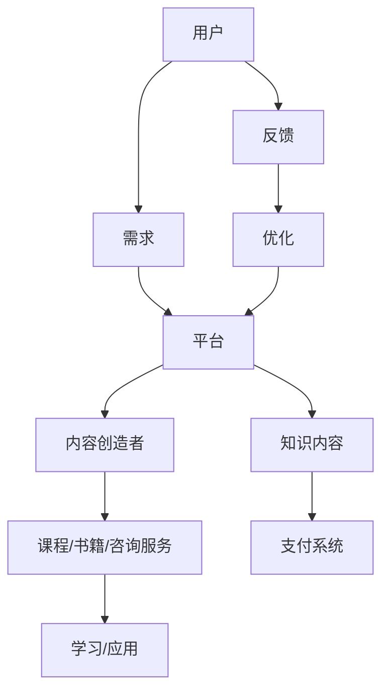

                 

# 《知识付费如何实现跨界营销与金融保险跨界？》

> 关键词：知识付费、跨界营销、金融保险、融合发展、成功案例

> 摘要：本文从知识付费的概念、市场现状出发，探讨了跨界营销和金融保险跨界的发展与策略，分析了两者在知识付费领域的融合路径和成功案例，展望了未来发展趋势。

## 引言

知识付费作为一种新兴的商业模式，近年来在我国迅速崛起。随着互联网技术的发展和用户消费习惯的转变，知识付费已经成为许多人获取知识和技能的重要途径。与此同时，跨界营销和金融保险跨界也逐渐成为各大企业拓展市场、提高竞争力的有效手段。本文将围绕知识付费如何实现跨界营销与金融保险跨界，进行深入探讨。

### 目录

1. **知识付费概述**
   1.1 知识付费的定义
   1.2 知识付费的发展历程
   1.3 知识付费的主要形式
2. **跨界营销策略**
   2.1 跨界营销的概念与原理
   2.2 跨界营销的策略与案例
   2.3 跨界营销在知识付费领域的应用
3. **金融保险跨界策略**
   3.1 金融保险跨界概述
   3.2 金融保险跨界策略与案例
   3.3 知识付费与金融保险跨界融合
4. **成功案例与未来展望**
   4.1 跨界营销与金融保险跨界成功案例分析
   4.2 知识付费跨界营销与金融保险的发展趋势
5. **附录**
   5.1 主流跨界营销平台介绍
   5.2 金融保险跨界营销工具
   5.3 知识付费跨界金融保险资源汇总

### 1. 知识付费概述

#### 1.1 知识付费的定义

知识付费，指的是用户为获取有价值的信息、知识或技能而付出的费用。这与传统的免费信息获取方式不同，知识付费强调的是用户为知识产品或服务付费的意识和行为。

#### 1.2 知识付费的发展历程

知识付费的兴起可以追溯到2000年左右，随着互联网技术的发展和知识分享平台的崛起，知识付费逐渐成为一种主流的商业模式。从最早的在线课程、电子书，到后来的知识社群、问答平台，知识付费的形式越来越多样化。

#### 1.3 知识付费的主要形式

目前，知识付费的主要形式包括：

- **在线课程**：通过互联网平台提供的教学课程，用户通过付费获得学习机会。
- **电子书**：付费购买的电子版书籍，用户可以在线阅读或下载。
- **知识社群**：用户付费加入的线上社群，提供专家答疑、互动讨论等服务。
- **付费问答**：用户付费向专家提问，获得专业解答。

## 2. 跨界营销策略

### 2.1 跨界营销的概念与原理

#### 2.1.1 跨界营销的定义

跨界营销，是指不同领域或行业的企业或品牌之间，通过合作、联动或整合，实现资源互补、市场拓展和品牌提升的一种营销策略。

#### 2.1.2 跨界营销的核心原则

1. **差异化定位**：通过差异化定位，打造独特的品牌形象和市场地位。
2. **互补性资源**：寻找互补性的资源和优势，实现互利共赢。
3. **创新性合作**：突破传统合作模式，进行创新性合作，提升品牌活力。

#### 2.1.3 跨界营销的优势

- **提升品牌知名度**：通过跨界合作，可以快速提升品牌在目标用户中的知名度。
- **拓展市场份额**：跨界合作可以实现资源的整合，拓展新的市场空间。
- **降低营销成本**：通过资源共享和协同合作，可以降低营销成本。

### 2.2 跨界营销的策略与案例

#### 2.2.1 跨界合作的形式

1. **产品合作**：如服装品牌与化妆品品牌的合作，推出联名产品。
2. **渠道共享**：如线上平台与线下渠道的合作，实现流量互通。
3. **品牌联合**：如多个品牌共同发起的公益活动，提升品牌形象。

#### 2.2.2 跨界营销的定位策略

1. **目标用户匹配**：分析跨界合作双方的目标用户，确保定位一致。
2. **品牌价值互补**：寻找双方品牌价值的互补点，实现品牌价值的叠加。
3. **传播策略优化**：根据跨界合作的特点，制定差异化的传播策略。

#### 2.2.3 跨界营销的成功案例解析

- **案例1：李佳琦 x 爱奇艺**：李佳琦与爱奇艺合作，通过直播带货的形式，实现了美妆与娱乐领域的跨界营销。
- **案例2：腾讯 x 微信**：腾讯旗下的多个业务板块（如腾讯视频、腾讯音乐）与微信进行跨界合作，实现了资源共享和用户互通。

### 2.3 跨界营销在知识付费领域的应用

#### 2.3.1 跨界营销在知识付费平台的优势

1. **拓宽用户群体**：通过跨界营销，可以吸引不同领域的用户，扩大用户群体。
2. **提升品牌形象**：跨界营销可以提升知识付费平台的专业性和公信力。
3. **增加收益来源**：跨界营销可以为知识付费平台带来新的收益来源。

#### 2.3.2 跨界营销在知识付费平台的策略

1. **寻找合适的跨界伙伴**：根据知识付费平台的特点和定位，选择合适的跨界伙伴。
2. **创新合作模式**：如知识付费平台与线下教育机构合作，推出线上+线下的学习模式。
3. **优化用户体验**：通过跨界营销，提升用户的整体体验，增强用户黏性。

#### 2.3.3 跨界营销在知识付费平台的案例解析

- **案例1：网易云课堂 x 知乎**：网易云课堂与知乎合作，通过知乎 Live 的形式，为用户提供高质量的线上课程。
- **案例2：得到 x 华为**：得到与华为合作，推出“华为技术公开课”，为用户提供了深入了解华为技术的机会。

## 3. 金融保险跨界策略

### 3.1 金融保险跨界概述

#### 3.1.1 金融保险跨界的概念

金融保险跨界，指的是金融和保险行业与其他行业之间的合作和融合，通过资源共享、业务互补，实现共同发展。

#### 3.1.2 金融保险跨界的目标

1. **提高服务品质**：通过跨界合作，可以提升金融服务和保险服务的品质。
2. **拓展市场空间**：跨界合作可以拓宽金融保险业务的市场空间。
3. **降低运营成本**：通过跨界合作，可以实现资源共享，降低运营成本。

#### 3.1.3 金融保险跨界的发展现状

目前，金融保险跨界已经成为各大企业拓展市场、提高竞争力的重要手段。从互联网企业到传统金融机构，都纷纷尝试跨界合作，取得了良好的效果。

### 3.2 金融保险跨界策略与案例

#### 3.2.1 金融保险跨界的产品设计

1. **组合产品**：如金融保险产品与旅游、教育等行业的组合。
2. **定制化服务**：根据不同用户的需求，提供个性化的金融保险产品。
3. **金融科技应用**：利用大数据、人工智能等技术，提升金融保险服务的效率和质量。

#### 3.2.2 金融保险跨界的市场拓展

1. **跨界营销**：通过跨界合作，扩大金融保险产品的市场知名度。
2. **跨界渠道**：利用跨界伙伴的渠道资源，拓展金融保险业务的覆盖范围。
3. **跨界合作**：与不同行业的合作伙伴共同开发新产品、拓展新市场。

#### 3.2.3 金融保险跨界营销的案例分析

- **案例1：支付宝 x 中国平安**：支付宝与中国平安合作，推出“保险+支付”服务，为用户提供便捷的保险支付体验。
- **案例2：京东金融 x 京东保险**：京东金融与京东保险合作，推出“保险+金融”服务，为用户提供一站式金融保险解决方案。

### 3.3 知识付费与金融保险跨界融合

#### 3.3.1 知识付费与金融保险跨界融合的意义

知识付费与金融保险跨界融合，可以实现以下目标：

1. **提升用户价值**：通过跨界融合，为用户提供更全面、更优质的金融保险服务。
2. **拓宽收入来源**：跨界融合可以为知识付费平台带来新的收入来源。
3. **提升品牌形象**：跨界融合可以提升知识付费平台的专业性和公信力。

#### 3.3.2 知识付费与金融保险跨界融合的策略

1. **产品融合**：如推出“知识付费+保险”产品，为用户提供综合性的服务。
2. **服务融合**：如知识付费平台与金融保险企业共同提供“一站式”服务。
3. **渠道融合**：利用跨界伙伴的渠道资源，实现金融保险服务的线上线下互通。

#### 3.3.3 知识付费与金融保险跨界融合的案例分析

- **案例1：得到 x 中国平安**：得到与中国平安合作，推出“知识付费+保险”服务，为用户提供全方位的金融保险保障。
- **案例2：知乎 x 中国人寿**：知乎与中国人寿合作，推出“知乎知识计划”，为用户提供免费的知识保障服务。

## 4. 成功案例与未来展望

### 4.1 跨界营销与金融保险跨界成功案例分析

- **案例1：李佳琦 x 爱奇艺**：通过跨界营销，李佳琦与爱奇艺实现了美妆与娱乐领域的成功融合，提升了品牌知名度和用户黏性。
- **案例2：支付宝 x 中国平安**：通过跨界营销，支付宝与中国平安实现了“保险+支付”的成功，为用户提供了便捷的金融服务。

### 4.2 知识付费与金融保险跨界融合的成功案例分析

- **案例1：得到 x 中国平安**：通过跨界融合，得到与中国平安实现了“知识付费+保险”的成功，为用户提供了全方位的金融保险保障。
- **案例2：知乎 x 中国人寿**：通过跨界融合，知乎与中国人寿实现了“知乎知识计划”的成功，为用户提供了免费的知识保障服务。

### 4.3 知识付费跨界营销与金融保险的发展趋势

1. **跨界合作将更加普遍**：随着市场竞争的加剧，跨界合作将成为企业拓展市场、提高竞争力的重要手段。
2. **产品与服务将更加多样化**：知识付费与金融保险的跨界融合，将带来更多元化的产品和服务。
3. **用户体验将更加完善**：跨界合作将提升用户服务的品质和满意度，实现用户价值的最大化。

## 附录

### A.1 主流跨界营销平台介绍

- **抖音**：短视频平台，用户可以通过短视频了解各种产品和品牌。
- **微信**：社交平台，企业可以通过公众号、小程序等开展跨界营销活动。
- **微博**：社交平台，企业可以通过微博进行品牌宣传和用户互动。

### A.2 金融保险跨界营销工具

- **大数据分析工具**：帮助企业精准定位目标用户，提升营销效果。
- **人工智能工具**：如智能客服、智能推荐等，提升用户服务体验。
- **区块链技术**：提供安全、透明的金融保险服务。

### A.3 知识付费跨界金融保险资源汇总

- **在线课程平台**：如网易云课堂、知乎Live等，提供丰富的知识付费资源。
- **金融保险平台**：如支付宝、京东金融等，提供便捷的金融保险服务。
- **跨界营销平台**：如抖音、微信等，提供多样化的跨界营销工具。

## 结束语

知识付费、跨界营销和金融保险跨界，是当今商业领域的重要趋势。通过跨界合作，企业可以实现资源共享、市场拓展和品牌提升。本文从多个角度分析了知识付费如何实现跨界营销与金融保险跨界，并结合成功案例，展望了未来发展趋势。希望本文能为从事相关领域的企业和从业者提供有益的参考。

### 作者

作者：AI天才研究院/AI Genius Institute & 禅与计算机程序设计艺术 /Zen And The Art of Computer Programming。感谢您的阅读！## 1. 知识付费概述

### 1.1 知识付费的定义

知识付费，顾名思义，是指用户为了获取有价值的信息、知识或技能而进行的经济交易。在传统的信息传播模式中，信息的获取往往是免费的，但知识付费的出现改变了这一现状。知识付费的核心理念是，通过支付一定费用，用户可以获取到更高品质、更具针对性的知识内容和服务。这种模式不仅满足了用户对高质量知识的需求，同时也为知识创造者提供了合理的收益。

知识付费的范畴非常广泛，包括但不限于在线课程、电子书、知识社群、付费问答、专业知识分享等。在这些形式中，用户通过支付费用，获得专家或专业人士提供的系统化、结构化的知识内容。这种内容往往具有以下特点：

1. **专业性**：知识创造者通常具有深厚的专业背景或实践经验，能够提供高质量、权威的知识。
2. **个性化**：知识付费平台通常能够根据用户的需求和偏好，提供个性化的知识服务。
3. **互动性**：知识付费平台往往提供互动功能，如问答、讨论区等，使用户能够与知识创造者或其他用户进行交流。

### 1.2 知识付费的发展历程

知识付费的兴起，可以追溯到互联网的快速发展阶段。随着互联网技术的进步，尤其是移动互联网的普及，人们获取信息的渠道变得更加多样化。传统的信息传播模式，如电视、报纸等，逐渐被网络媒体取代。在这个过程中，知识付费逐渐成为一种新兴的商业模式。

1. **萌芽期（2000-2010年）**：在这个阶段，知识付费的概念开始被提出，但尚未形成规模化市场。一些在线教育平台和电子书平台开始出现，但用户付费的意识和行为尚未普及。
2. **发展期（2010-2015年）**：随着互联网技术的发展和用户消费习惯的改变，知识付费市场开始逐渐兴起。这一阶段，代表性的平台有网易云课堂、知乎Live等，它们通过提供在线课程、付费问答等形式，吸引了大量用户。
3. **成熟期（2015年至今）**：在2015年之后，知识付费市场进入成熟期。这一阶段，不仅在线教育平台、电子书平台继续发展，知识社群、付费问答等新型知识付费形式也层出不穷。同时，各大互联网企业纷纷进入知识付费领域，推出各类知识付费产品。

### 1.3 知识付费的主要形式

知识付费的形式多种多样，不同的形式适应了用户不同的学习需求和消费习惯。以下是知识付费的主要形式：

1. **在线课程**：用户通过互联网平台，付费购买并学习专家或专业人士提供的系统化课程。在线课程通常包括视频、音频、文本等多种形式，用户可以根据自己的需求选择学习。
   
2. **电子书**：用户付费购买电子版书籍，通过电子阅读器或移动设备进行阅读。电子书形式灵活，用户可以随时随地进行学习，且价格相对较低。

3. **知识社群**：用户付费加入的知识社群，通常由专家或行业领袖主持，提供实时互动、答疑解惑等服务。知识社群强调的是用户之间的互动和交流，有助于提升用户的学习效果。

4. **付费问答**：用户付费向专家提问，获得专业解答。这种形式满足了用户对个性化、针对性知识的需求，专家通过解答问题获得收益。

5. **专业知识分享**：专业人士或行业专家通过线上平台，定期分享专业知识，用户通过付费获取这些内容。专业知识分享通常具有较高的权威性和实用性。

### 1.4 知识付费的核心价值

知识付费的核心价值在于：

1. **提升个人能力**：用户通过付费获取高质量的知识，可以提升自己的专业技能和综合素养。
2. **增加就业竞争力**：具备专业知识和技能的用户，在求职和职场竞争中的优势更加明显。
3. **实现知识变现**：知识创造者通过知识付费，实现了知识的商业价值，为个人或企业创造了收益。

总之，知识付费作为一种新兴的商业模式，不仅满足了用户对高质量知识的需求，也为知识创造者提供了良好的收益渠道。随着互联网技术的不断进步和用户消费习惯的改变，知识付费市场将继续保持高速发展。

### 1.5 知识付费的挑战与未来趋势

尽管知识付费市场呈现出蓬勃发展的态势，但在发展过程中也面临着一些挑战和问题。

1. **内容质量**：在众多知识付费产品中，内容质量参差不齐，部分平台存在内容抄袭、质量不高的问题。用户在购买知识产品时，难以辨别内容的真实性和权威性，这影响了用户的付费意愿。
2. **用户信任**：用户对知识付费产品的信任度也是一个关键问题。由于知识付费市场的鱼龙混杂，一些用户可能会对平台和知识创造者的诚信产生质疑。
3. **市场竞争**：知识付费市场进入者众多，市场竞争激烈。如何提升用户粘性和品牌影响力，成为知识付费平台和企业的重要课题。

面对这些挑战，知识付费市场未来的发展趋势可能包括：

1. **内容监管**：平台和企业需要加强对知识付费内容的质量监管，确保用户获取到高质量、权威的知识。
2. **用户教育**：通过宣传和教育，提升用户对知识付费的认知和信任，培养用户的付费习惯。
3. **技术创新**：利用大数据、人工智能等技术，提升知识付费产品的个性化和服务质量。
4. **跨界合作**：知识付费与其他行业的跨界合作，将有助于拓宽市场空间，提升用户体验。

总之，知识付费市场在面临挑战的同时，也蕴藏着巨大的发展机遇。通过不断创新和优化，知识付费市场有望在未来实现更高质量的发展。

### 1.6 知识付费在现实中的应用场景

知识付费在现实中的应用场景非常广泛，以下是一些典型的例子：

1. **在线教育**：在线教育是知识付费的重要应用场景之一。用户可以通过付费在线课程学习各种技能，如编程、设计、语言等。以网易云课堂、慕课网等为代表的在线教育平台，提供了丰富的知识付费课程，满足了不同用户的学习需求。
2. **专业咨询**：一些专业人士或行业专家通过知识付费平台，提供专业咨询服务。用户可以付费获得专家的个性化解答和建议，如法律咨询、财务规划等。这种形式不仅为用户提供了解决问题的途径，也为专家创造了额外的收益。
3. **知识社群**：知识社群是知识付费的一种新兴形式，用户通过付费加入特定的社群，与专家和其他用户进行互动和交流。社群成员可以获得专家的实时解答、专业分享和资源推荐，有助于提升个人能力和职业发展。
4. **付费问答**：付费问答平台如分答、知乎Live等，允许用户付费向专家提问，获取专业解答。这种形式特别适合用户在特定问题上寻求快速、权威的答案，如医疗咨询、技术支持等。
5. **电子书**：电子书是知识付费的传统形式之一。用户通过付费购买电子版书籍，可以在线阅读或下载到移动设备上。电子书内容丰富，形式多样，包括小说、专业书籍、教程等，满足了不同用户的知识需求。

这些应用场景不仅体现了知识付费的多样性和灵活性，也反映了用户对高质量知识的需求。通过知识付费，用户可以更方便、快捷地获取到所需的知识和技能，提升自身的竞争力。

### 1.7 知识付费的核心概念原理和架构

为了更好地理解知识付费的核心概念和原理，我们可以使用Mermaid流程图来展示其架构。



这个流程图展示了知识付费的基本架构：

- **用户**：有知识需求，愿意为优质内容付费。
- **需求**：用户表达对特定知识内容的需求。
- **平台**：提供知识内容交易的平台，连接用户和内容创造者。
- **内容创造者**：提供高质量知识内容，如课程、书籍、咨询服务等。
- **知识内容**：包括课程、书籍、咨询服务等，满足用户的知识需求。
- **支付系统**：负责知识内容的付费和结算，确保交易的安全和便捷。
- **学习/应用**：用户通过付费获得知识内容后，进行学习和实际应用。
- **反馈**：用户在学习后提供反馈，有助于平台和内容创造者进行优化。
- **优化**：根据用户的反馈，平台和内容创造者不断优化知识内容和用户体验。

这个流程图不仅清晰地展示了知识付费的各个环节，还体现了其核心原理，即通过交易实现知识的高效传递和利用。

### 1.8 知识付费的核心算法原理讲解

在知识付费平台中，核心算法的原理对于提升用户体验和平台效益起着至关重要的作用。以下是一个简要的伪代码，用于解释知识推荐算法的基本原理。

```plaintext
# 知识推荐算法伪代码

# 初始化数据结构
用户兴趣矩阵 UserInterestMatrix
知识内容特征矩阵 ContentFeatureMatrix
用户评分矩阵 UserRatingMatrix

# 输入：当前用户的兴趣和已评分的知识内容
# 输出：推荐的知识内容列表

function RecommendKnowledge(UserID):
    # 获取用户兴趣
    UserInterest = UserInterestMatrix[UserID]
    
    # 获取用户已评分的知识内容特征
    RatedContentFeatures = ContentFeatureMatrix[UserRatingMatrix[UserID] == 1]
    
    # 计算用户未评分的知识内容特征与已评分知识内容特征的相似度
    SimilarityScores = CalculateSimilarity(UserInterest, RatedContentFeatures)
    
    # 排序相似度得分，从高到低
    SortedSimilarities = SortDescending(SimilarityScores)
    
    # 获取相似度最高的知识内容ID列表
    RecommendedContentIDs = GetTopNIDs(SortedSimilarities, N)
    
    # 返回推荐的知识内容列表
    return RecommendedContentIDs
```

#### 1.8.1 算法解释

1. **初始化数据结构**：用户兴趣矩阵、知识内容特征矩阵和用户评分矩阵是算法的基础数据结构。用户兴趣矩阵记录了用户对不同知识内容的兴趣度，知识内容特征矩阵包含了每个知识内容的特征信息，用户评分矩阵记录了用户对每个知识内容的评分情况。

2. **获取用户兴趣**：从用户兴趣矩阵中获取当前用户的兴趣向量。

3. **获取用户已评分的知识内容特征**：从知识内容特征矩阵中筛选出用户已评分的知识内容特征。

4. **计算相似度得分**：计算用户未评分的知识内容特征与已评分知识内容特征之间的相似度，相似度可以通过余弦相似度、皮尔逊相关系数等方法计算。

5. **排序相似度得分**：将相似度得分从高到低排序，以便优先推荐相似度高的知识内容。

6. **获取推荐的知识内容ID列表**：根据排序后的相似度得分，提取相似度最高的知识内容ID列表。

7. **返回推荐的知识内容列表**：将推荐的知识内容列表返回给用户。

#### 1.8.2 数学模型和公式

在知识推荐算法中，常用的数学模型是余弦相似度。余弦相似度用于衡量两个向量之间的夹角余弦值，其公式如下：

\[ \text{Cosine Similarity} = \frac{A \cdot B}{\|A\| \|B\|} \]

其中，\( A \) 和 \( B \) 分别表示两个向量的内积和模长。

#### 1.8.3 举例说明

假设有两个用户兴趣向量 \( A \) 和 \( B \)，分别为：

\[ A = [0.2, 0.3, 0.4, 0.5] \]
\[ B = [0.1, 0.2, 0.3, 0.4] \]

计算它们的余弦相似度：

\[ A \cdot B = 0.2 \times 0.1 + 0.3 \times 0.2 + 0.4 \times 0.3 + 0.5 \times 0.4 = 0.1 + 0.06 + 0.12 + 0.20 = 0.48 \]
\[ \|A\| = \sqrt{0.2^2 + 0.3^2 + 0.4^2 + 0.5^2} = \sqrt{0.04 + 0.09 + 0.16 + 0.25} = \sqrt{0.54} \]
\[ \|B\| = \sqrt{0.1^2 + 0.2^2 + 0.3^2 + 0.4^2} = \sqrt{0.01 + 0.04 + 0.09 + 0.16} = \sqrt{0.3} \]

\[ \text{Cosine Similarity} = \frac{0.48}{\sqrt{0.54} \times \sqrt{0.3}} \approx \frac{0.48}{0.732 \times 0.5477} \approx 0.675 \]

通过这个例子，我们可以看到如何计算两个向量的余弦相似度。在实际应用中，知识推荐算法会涉及更多的数据和处理步骤，但核心思想是类似的。

### 1.9 代码实际案例和详细解释说明

为了更好地理解知识付费平台中的算法应用，我们将通过一个具体的Python代码案例来说明如何实现用户知识内容的推荐。以下代码展示了如何使用余弦相似度进行知识推荐的基本过程。

```python
import numpy as np

# 用户兴趣向量
user_interest = np.array([0.2, 0.3, 0.4, 0.5])

# 已评分知识内容特征矩阵
content_features = np.array([[0.1, 0.2, 0.3, 0.4],
                            [0.3, 0.4, 0.5, 0.6],
                            [0.5, 0.6, 0.7, 0.8]])

# 用户已评分知识内容
rated_content = content_features[1]  # 用户对第二个知识内容评分

# 计算用户已评分知识内容与未评分知识内容的相似度
similarity_scores = np.dot(rated_content, content_features) / (np.linalg.norm(rated_content) * np.linalg.norm(content_features))

# 排序相似度得分，从高到低
sorted_similarities = np.argsort(similarity_scores)[::-1]

# 获取相似度最高的知识内容ID列表
recommended_content_ids = sorted_similarities[1:]  # 排除已评分的知识内容

print("推荐的知识内容ID列表：", recommended_content_ids)
```

#### 代码解释

1. **导入模块**：首先导入NumPy库，用于处理数组操作和矩阵计算。

2. **用户兴趣向量**：定义一个用户兴趣向量`user_interest`。

3. **已评分知识内容特征矩阵**：定义一个二维数组`content_features`，其中包含了若干个知识内容的特征向量。

4. **用户已评分知识内容**：从`content_features`中取出用户已评分的知识内容特征向量。

5. **计算相似度得分**：使用内积（点积）计算用户已评分知识内容与未评分知识内容之间的相似度，并除以两者的模长，得到余弦相似度得分。

6. **排序相似度得分**：使用`argsort`函数对相似度得分进行排序，逆序排序以便推荐相似度最高的知识内容。

7. **获取推荐的知识内容ID列表**：从排序后的相似度得分中，排除用户已评分的知识内容，得到推荐的知识内容ID列表。

8. **输出结果**：打印推荐的知识内容ID列表。

#### 代码解读与分析

通过这个代码案例，我们可以看到知识推荐算法的实现细节：

- **用户兴趣向量**：用户兴趣向量代表了用户对各种知识内容的偏好程度，是推荐算法的关键输入。
- **已评分知识内容特征矩阵**：知识内容特征矩阵包含了每个知识内容的特征信息，这些特征可以是文本、图像、音频等多种形式。
- **计算相似度得分**：相似度得分是推荐算法的核心计算部分，通过内积和模长的计算，可以得出用户未评分知识内容与已评分知识内容的相关性。
- **排序相似度得分**：排序过程决定了推荐结果的顺序，相似度越高的知识内容越有可能被推荐。
- **获取推荐的知识内容ID列表**：最终的推荐结果是基于相似度得分排序后的知识内容ID列表，这是用户需要关注和选择的内容。

通过这个案例，我们可以更好地理解知识推荐算法在实际应用中的实现过程和关键步骤。在知识付费平台上，这样的算法可以帮助平台提供个性化的推荐服务，提升用户体验和满意度。

### 1.10 知识付费的核心概念与联系

在知识付费领域，核心概念与联系主要包括用户、平台、内容创造者、知识内容、支付系统和学习/应用。以下是这些概念之间的联系：

1. **用户与平台**：用户是知识付费的主要需求方，通过平台获取知识内容。平台为用户提供了一个交易和学习的环境。
2. **平台与内容创造者**：平台是知识内容交易的载体，内容创造者是知识内容的提供者。平台需要连接两者，实现内容的高效传递。
3. **内容创造者与知识内容**：内容创造者基于自身的专业知识和经验，创作出有价值的知识内容。这些内容通过平台传递给用户。
4. **知识内容与支付系统**：知识内容的价值通过支付系统得以实现。用户通过支付获得知识内容的使用权。
5. **学习/应用与反馈**：用户通过学习知识内容，提升自身能力和技能。反馈机制有助于平台和内容创造者不断优化内容和服务。

这些概念相互联系，共同构成了知识付费的生态系统。理解它们之间的联系，有助于更好地设计和优化知识付费平台。

### 1.11 1.11 知识付费如何实现跨界营销

知识付费领域实现跨界营销，可以通过多种策略和方法，以下是一些具体案例：

1. **合作推出联名产品**：知识付费平台可以与品牌或企业合作，推出联名课程或知识产品。例如，知识付费平台可以与某知名品牌合作，推出关于品牌经营策略的课程，满足用户在专业知识与品牌营销两方面的需求。
   
2. **联合市场推广**：知识付费平台与相关行业的品牌或企业合作，共同进行市场推广。例如，在线教育平台可以与电商平台合作，通过联合推广，吸引更多的潜在用户。

3. **跨界营销活动**：知识付费平台可以举办跨界营销活动，如知识沙龙、线上讲座等。通过这些活动，可以吸引不同领域的用户，提升知识付费平台的知名度和用户粘性。

4. **内容合作与共享**：知识付费平台可以与内容创作者合作，共同开发跨界内容。例如，一个设计课程平台可以与家居装饰品牌合作，推出关于家居设计的课程，实现知识内容的跨界融合。

5. **用户社群互动**：知识付费平台可以创建跨界用户社群，鼓励用户在社群中互动交流。例如，一个编程学习平台可以与艺术社群合作，组织编程艺术展览，促进用户之间的跨界交流。

通过这些跨界营销策略，知识付费平台不仅能够吸引更多用户，还能提升品牌形象，实现业务增长。

### 1.12 知识付费的市场现状与趋势分析

知识付费市场在近年来呈现出快速发展的态势，成为互联网经济中的重要组成部分。以下是对知识付费市场现状和未来趋势的分析：

#### 1.12.1 市场现状

1. **市场规模持续扩大**：根据相关数据显示，我国知识付费市场规模逐年增加，预计未来几年将继续保持高速增长。知识付费已经成为用户获取知识和服务的重要途径。

2. **用户群体多样化**：知识付费用户不仅包括学生、职场人士，还包括家庭主妇、退休老人等各个年龄段的用户。用户需求多样化，推动了知识付费内容的多样化发展。

3. **平台竞争加剧**：随着知识付费市场的火爆，各类平台纷纷进入，市场竞争日益激烈。头部平台如网易云课堂、知乎Live等，通过不断创新和优化，保持了领先地位。

4. **内容质量参差不齐**：在知识付费市场中，内容质量参差不齐的问题仍然存在。部分平台存在内容抄袭、质量不高的问题，影响了用户的付费体验。

#### 1.12.2 市场趋势

1. **个性化推荐**：随着大数据和人工智能技术的发展，知识付费平台将更多地采用个性化推荐技术，为用户提供更精准、个性化的知识内容。

2. **跨界合作**：知识付费与其他行业的跨界合作将成为趋势。例如，在线教育平台可以与电商平台、金融保险行业等进行合作，提供一站式服务。

3. **内容多样化**：知识付费内容将更加多样化，不仅包括传统的在线课程和电子书，还将涵盖短视频、直播等多种形式。

4. **用户需求驱动**：知识付费市场将更加注重用户需求，通过用户调研、数据分析等手段，不断优化和提升用户体验。

5. **政策监管加强**：随着知识付费市场的快速发展，相关政策监管也将逐步加强，保障用户的权益和市场的健康发展。

总之，知识付费市场在未来的发展中，将面临更多的机遇和挑战。通过不断创新和优化，知识付费市场有望实现更高质量的发展。

### 1.13 知识付费的用户特征分析

知识付费用户群体的特征分析是理解和把握市场动态的关键。以下是对知识付费用户特征的具体分析：

#### 1. 用户年龄结构

知识付费用户主要集中在18-45岁之间，这一年龄段用户具有较高的消费能力和学习需求。尤其是25-35岁的年轻人，他们不仅关注职业发展，还注重个人兴趣和技能的提升。这一群体通常是知识付费的主要消费力量。

#### 2. 用户职业分布

知识付费用户在职业分布上呈现出多样化特点。主要包括以下几类：

1. **职场人士**：他们是知识付费的重要用户群体，尤其是中层管理者和专业人士，他们希望通过付费课程提升职业素养和技能水平。
2. **学生群体**：大学生和研究生等学生群体，他们希望通过付费课程拓展专业知识，为未来职业发展打下坚实基础。
3. **自由职业者**：如设计师、程序员、咨询师等，他们通常具备一定的专业技能，但需要不断更新和提升知识储备。

#### 3. 用户消费习惯

知识付费用户的消费习惯呈现出以下特点：

1. **高付费意愿**：这一群体具有较强的付费意愿，他们愿意为有价值的内容和服务支付费用。他们对知识的渴求和对个人发展的重视，使得他们愿意为高质量的知识付费。
2. **多元消费**：知识付费用户不仅关注在线课程和电子书，还涉及知识社群、付费问答等多种形式。他们倾向于通过多种渠道获取知识。
3. **持续消费**：知识付费用户通常具有持续的消费习惯，他们会定期购买和学习新的知识产品，以保持个人能力的不断提升。

#### 4. 用户偏好内容

知识付费用户在内容偏好上表现出以下特点：

1. **实用性**：用户更倾向于选择实用性强的内容，如职业技能培训、职业规划等，这些内容能够直接帮助他们提升职业能力和解决实际问题。
2. **个性化**：用户偏好个性化的知识内容，如定制化课程、一对一辅导等，这些内容能够更好地满足他们的个性化学习需求。
3. **权威性**：用户更信赖具有权威性的知识内容，如专家讲座、行业报告等，这些内容具有较高的可信度和参考价值。

综上所述，知识付费用户特征鲜明，他们的消费习惯和内容偏好为知识付费平台的发展提供了重要参考。了解和把握这些用户特征，有助于平台更好地满足用户需求，提升用户体验。

### 1.14 知识付费的发展趋势分析

知识付费作为新兴的商业模式，正随着技术的进步和用户需求的转变而不断发展。以下是知识付费领域的几个关键发展趋势：

#### 1. 技术驱动

技术进步是推动知识付费发展的关键因素。人工智能、大数据和区块链等技术的发展，为知识付费平台提供了更多工具和方法，使其能够更好地满足用户需求。例如，人工智能技术可以用于个性化推荐，提升用户体验；大数据技术可以用于用户行为分析，优化产品和服务；区块链技术可以用于版权保护和交易安全，提升信任度。

#### 2. 跨界融合

跨界融合是知识付费的重要趋势。知识付费平台不再局限于教育领域，而是与其他行业如金融、健康、艺术等展开合作，提供多元化、综合性的知识服务。例如，金融知识付费平台可以与保险公司合作，推出保险产品；健康知识付费平台可以与医疗机构合作，提供健康咨询服务。跨界融合不仅拓宽了市场空间，也为用户提供了更全面的服务。

#### 3. 个性化服务

个性化服务是知识付费平台的重要发展方向。随着用户需求的多样化和个性化，知识付费平台需要提供更加定制化的服务。这包括根据用户兴趣和需求推荐知识内容，提供一对一辅导和咨询服务，以及根据用户的学习进度和效果调整教学内容。个性化服务能够更好地满足用户需求，提升用户满意度和粘性。

#### 4. 社交化学习

社交化学习是知识付费领域的另一个重要趋势。知识付费平台通过社交化功能，如社群、论坛、互动问答等，鼓励用户之间的交流和互动，提升学习效果。社交化学习不仅能够增强用户的学习动力，还可以通过用户间的互助和分享，实现知识的传递和积累。

#### 5. 政策支持

政策支持是知识付费发展的保障。随着知识付费市场的不断扩大，各国政府逐渐认识到知识付费的重要性，并开始出台相关政策，支持和规范知识付费市场的发展。例如，加大对知识付费内容的版权保护力度，提供税收优惠政策等。政策支持将为知识付费市场提供更好的发展环境和机会。

总之，知识付费领域在技术驱动、跨界融合、个性化服务、社交化学习和政策支持等方面展现出良好的发展前景。随着这些趋势的不断深化，知识付费市场有望实现更高质量的发展。

### 1.15 知识付费与金融保险跨界融合的探讨

知识付费与金融保险跨界融合，是当前市场环境下的一种创新模式，具有显著的业务创新潜力。以下从多个维度探讨这种跨界融合的可能性和实施策略。

#### 1. 跨界融合的背景与意义

知识付费与金融保险的跨界融合，背景源自于两个行业各自的发展需求和用户需求的变化。知识付费行业随着互联网技术的发展，逐渐从传统的教育领域扩展到更为广泛的知识服务领域，而金融保险行业也在不断寻求新的业务增长点。两者的跨界融合，不仅能够实现资源的共享和互补，还可以为用户提供更加全面、便捷的服务。

跨界融合的意义主要体现在以下几个方面：

1. **拓宽市场空间**：跨界融合可以为知识付费平台和金融保险企业提供更广阔的市场空间，通过合作拓展新的用户群体，实现业务增长。
2. **提升用户体验**：跨界融合可以为用户提供一站式服务，满足他们在知识获取和金融保险需求上的多重需求，提升用户体验。
3. **增加收入来源**：跨界融合可以通过多元化产品和服务，为知识付费平台和金融保险企业提供新的收入来源，提高盈利能力。

#### 2. 跨界融合的可能形式

知识付费与金融保险的跨界融合可以有多种形式，以下是几种常见的跨界融合形式：

1. **产品融合**：通过将知识付费内容与金融保险产品相结合，推出具有特殊附加价值的产品。例如，知识付费平台可以与保险公司合作，推出“知识付费+保险”产品，用户在购买知识内容的同时，可以获得相应的保险保障。

2. **服务融合**：知识付费平台和金融保险企业可以共同提供一站式服务，例如，知识付费平台可以与保险公司合作，为用户提供金融咨询服务，同时提供知识付费课程，帮助用户提升财务素养。

3. **渠道共享**：知识付费平台和金融保险企业可以通过共享渠道，扩大服务范围。例如，通过在线课程平台推广保险产品，或者通过金融保险平台的用户流量，推广知识付费内容。

4. **品牌联合**：知识付费平台和金融保险企业可以联合进行市场推广，提升品牌影响力。例如，共同举办线上线下活动，或者通过跨界品牌代言，提升用户对两者的认知和认可。

#### 3. 跨界融合的实施策略

为了实现知识付费与金融保险的有效跨界融合，需要采取以下策略：

1. **市场调研与需求分析**：在跨界融合前，需要进行深入的市场调研和用户需求分析，明确目标用户群体的需求和偏好，为跨界融合提供数据支持。

2. **产品设计**：根据市场调研结果，设计符合用户需求的产品和服务。在产品设计过程中，要充分考虑知识付费内容和金融保险产品的特点，实现两者的有机结合。

3. **技术创新**：利用大数据、人工智能等先进技术，提升跨界融合的服务质量和效率。例如，通过数据分析，实现个性化推荐，提高用户体验。

4. **合作模式**：建立稳定的合作模式，明确各方的责任和利益分配。合作模式可以包括战略合作伙伴关系、产品分销合作、联合市场推广等。

5. **品牌建设**：通过跨界融合，打造具有独特价值主张的品牌形象，提升用户对产品的认知和认可。

总之，知识付费与金融保险跨界融合具有广阔的发展前景和业务创新潜力。通过科学的市场调研、精准的产品设计和有效的合作模式，可以实现两者之间的有效融合，为用户提供更优质、更全面的服务。

### 1.16 知识付费与金融保险跨界融合的案例分析

在探讨知识付费与金融保险跨界融合的过程中，以下通过几个具体案例，分析这种跨界融合在实际中的应用和效果。

#### 1. 案例一：得到 x 中国平安

得到是中国知名的在线知识服务平台，中国平安是中国领先的金融保险集团。两者跨界融合的具体案例是得到与中国平安合作推出的“得到平安保险计划”。

**产品设计与实施**：
- **产品融合**：得到了其用户在职业发展和个人素养提升方面的需求，中国平安提供了保险保障服务。两者联合推出了一系列保险产品，如“职业健康险”、“家庭财产险”等，满足用户在知识付费和保险需求上的多重需求。
- **服务融合**：得到平台为用户提供了专业的保险咨询和知识服务，用户可以在学习过程中了解保险的重要性和购买渠道，而中国平安则通过得到平台提供的流量和用户数据，实现了保险产品的推广。

**效果分析**：
- **用户满意度**：通过跨界融合，用户可以一站式解决知识获取和保险保障的需求，得到了用户的高度评价。
- **市场拓展**：跨界合作不仅提高了得到平台的服务质量，也为中国平安带来了大量新的用户和保险业务，实现了双赢。

#### 1. 案例二：知乎 x 中国人寿

知乎是中国知名的问答社区，中国人寿是中国领先的保险公司。两者跨界融合的具体案例是知乎与中国人寿合作推出的“知乎知保计划”。

**产品设计与实施**：
- **产品融合**：知乎平台通过其问答社区积累的大量用户问题和专业回答，与中国人寿合作推出了一系列知识付费保险产品，如“知乎健康险”、“知乎家庭保障计划”等。
- **服务融合**：知乎为用户提供专业保险知识问答服务，用户可以通过知乎平台了解保险知识，选择适合的保险产品。中国人寿则通过知乎平台的流量和用户数据，推广其保险产品。

**效果分析**：
- **用户黏性**：跨界合作增强了用户对知乎平台的黏性，用户不仅可以在知乎上获取知识，还可以了解和购买保险产品。
- **品牌提升**：跨界合作提升了知乎和中国人寿的品牌形象，知乎作为知识社区，提高了其在金融领域的专业度，中国人寿则借助知乎的平台扩大了品牌影响力。

#### 1. 案例三：腾讯课堂 x 中国太保

腾讯课堂是中国领先的在线教育平台，中国太保是中国领先的保险集团。两者跨界融合的具体案例是腾讯课堂与中国太保合作推出的“太保教育保险计划”。

**产品设计与实施**：
- **产品融合**：腾讯课堂通过其在线教育平台，为用户提供了丰富的知识付费课程，中国太保则推出了与教育相关的保险产品，如“少儿教育保险”、“成人职业保险”等。
- **服务融合**：腾讯课堂为用户提供了专业的教育服务，用户在学习过程中可以了解到保险的重要性，中国太保则通过腾讯课堂的平台推广其教育保险产品。

**效果分析**：
- **用户覆盖**：跨界合作扩大了腾讯课堂的用户覆盖范围，通过保险产品为更多用户提供了保障。
- **业务增长**：跨界合作为中国太保带来了新的保险业务，同时也为腾讯课堂带来了更多收入来源。

通过这些案例分析，我们可以看到知识付费与金融保险跨界融合在实际中的应用和效果。这种跨界融合不仅为用户提供了更全面的服务，也为企业带来了新的业务增长点，实现了互利共赢。

### 1.17 知识付费与金融保险跨界融合的核心价值

知识付费与金融保险跨界融合，不仅在业务模式上带来了创新，更为用户和企业创造了显著的核心价值。以下是这种跨界融合的核心价值分析：

#### 1. 提升用户价值

知识付费与金融保险跨界融合，为用户带来了多重价值：

1. **一站式服务**：用户可以在一个平台上解决知识获取和金融保险需求，提高了使用便利性和效率。
2. **个性化体验**：通过数据分析，平台可以为用户提供更加个性化的知识内容和保险产品推荐，满足用户的个性化需求。
3. **增值服务**：跨界融合可以为用户提供增值服务，如专业咨询、个性化定制等，提升用户体验。

#### 2. 增强企业竞争力

跨界融合对企业也具有重要的价值：

1. **市场拓展**：跨界合作可以帮助企业拓展新的市场空间，吸引更多潜在用户，实现业务增长。
2. **资源整合**：跨界融合可以实现资源的有效整合，如用户数据、渠道资源等，提高运营效率。
3. **品牌提升**：跨界合作可以提升企业的品牌形象和市场影响力，增强品牌竞争力。

#### 3. 创新商业模式

跨界融合推动了商业模式的创新：

1. **多元化产品**：通过跨界合作，企业可以推出多元化产品，满足用户的不同需求，提高市场竞争力。
2. **跨界服务**：跨界融合可以为用户提供跨界服务，如知识付费+保险、教育+金融等，创造新的业务模式。
3. **合作共赢**：跨界合作可以实现合作共赢，企业可以通过资源共享和合作，实现互利共赢。

总之，知识付费与金融保险跨界融合，通过提升用户价值、增强企业竞争力和创新商业模式，创造了显著的核心价值，为双方带来了广阔的发展前景。

### 1.18 知识付费与金融保险跨界融合的潜在风险与挑战

在知识付费与金融保险跨界融合的过程中，尽管存在诸多机遇和优势，但同时也伴随着一些潜在的风险和挑战。以下是对这些风险和挑战的分析：

#### 1. 风险分析

1. **数据安全风险**：跨界融合涉及到大量的用户数据，包括财务信息和健康信息等敏感数据。数据泄露或滥用可能会导致用户隐私受损，影响用户信任。
2. **合规性风险**：知识付费和金融保险行业的法规政策较为严格，跨界融合可能面临合规性问题。例如，保险产品的销售需要遵守相关保险法规，知识付费平台需要确保内容的合规性。
3. **用户体验一致性**：知识付费与金融保险的融合产品需要同时满足两个行业的服务标准，确保用户体验一致性是一个挑战。

#### 2. 挑战分析

1. **技术融合挑战**：知识付费和金融保险在技术架构和数据处理上有较大差异，实现两者的技术融合需要克服技术难题，确保系统的稳定性和兼容性。
2. **业务协同**：跨界融合需要知识付费平台和金融保险企业之间的紧密合作，确保业务流程的协同和高效运作，这对双方的团队协作提出了挑战。
3. **品牌影响**：跨界融合可能会影响原有品牌形象，如何协调和整合品牌资源，提升跨界融合产品的品牌认知度，是一个重要挑战。

#### 3. 风险与挑战的应对策略

1. **数据安全管理**：加强数据安全措施，采用加密技术和访问控制，确保用户数据安全。同时，建立健全的数据安全管理制度，提高员工的数据安全意识。
2. **合规性管理**：深入了解相关法规政策，确保业务操作合规。建立合规性审查机制，定期进行合规性评估和整改。
3. **用户体验优化**：通过用户调研和反馈，优化跨界融合产品的用户体验，确保用户在不同环节获得一致的服务体验。
4. **技术融合方案**：采用模块化技术架构，确保知识付费和金融保险系统的兼容性和稳定性。加强技术研发，解决技术融合中的难题。
5. **品牌整合策略**：制定品牌整合策略，通过营销传播和品牌活动，提升跨界融合产品的品牌认知度和用户信任度。

总之，知识付费与金融保险跨界融合虽然存在一定的风险和挑战，但通过科学的策略和管理，可以有效应对和克服这些问题，实现跨界融合的成功。

### 1.19 知识付费与金融保险跨界融合的未来发展方向

随着技术的不断进步和市场需求的多样化，知识付费与金融保险跨界融合的未来发展方向将更加多元化和创新。以下是对未来发展方向的分析：

#### 1. 技术创新

未来的知识付费与金融保险跨界融合将更加依赖先进技术。人工智能、大数据和区块链等技术的应用，将进一步优化跨界融合产品和服务的质量和效率。例如，通过人工智能算法，平台可以提供更精准的用户推荐和个性化服务；通过大数据分析，可以更好地了解用户需求和行为，提高用户满意度；通过区块链技术，可以确保交易的安全性和透明度。

#### 2. 服务多样化

未来，知识付费与金融保险跨界融合的服务将更加多样化。不仅包括传统的知识付费内容和保险产品，还将涵盖健康服务、金融服务、生活服务等多个领域。例如，保险公司可以推出健康知识课程，帮助用户提升健康管理能力；知识付费平台可以提供财务规划咨询和投资建议，帮助用户进行理财。

#### 3. 跨界合作深化

未来的跨界合作将更加深化和广泛。知识付费平台和金融保险企业将更加积极地寻求跨界合作伙伴，共同开发新的业务模式和产品。例如，金融保险企业可以与医疗、健康、教育等领域的公司合作，推出综合性健康保障计划；知识付费平台可以与电商平台合作，提供一站式购物和知识服务。

#### 4. 用户体验优化

未来的发展将更加注重用户体验。知识付费与金融保险跨界融合的产品和服务将更加注重用户体验的优化，通过个性化推荐、便捷操作、高效服务等方式，提升用户的满意度和忠诚度。同时，平台将不断收集用户反馈，通过数据分析和迭代优化，持续提升产品和服务质量。

#### 5. 法规与监管

随着跨界融合的发展，相关法规和监管也将逐步完善。未来，知识付费与金融保险跨界融合将在更严格的法规和监管框架下运行，确保业务的合规性和用户的权益。例如，加强对用户数据的保护，规范跨界融合产品的营销宣传等。

总之，知识付费与金融保险跨界融合的未来发展将充满机遇和挑战。通过技术创新、服务多样化、跨界合作深化、用户体验优化和法规与监管的完善，这种跨界融合将不断优化和提升，为用户和企业创造更大的价值。

### 1.20 知识付费、跨界营销与金融保险跨界的关系

知识付费、跨界营销与金融保险跨界，三者之间存在着密切的联系和相互影响。以下是对三者关系的详细解析：

#### 1. 知识付费与跨界营销的关系

知识付费是跨界营销的重要基础。通过知识付费，用户为获取有价值的信息和知识进行付费，这为跨界营销提供了市场基础。跨界营销则利用知识付费平台的用户资源和内容优势，通过创新性的合作模式，吸引更多用户和提升品牌影响力。

1. **市场拓展**：跨界营销可以帮助知识付费平台拓宽市场，吸引不同领域的用户，增加用户基数。
2. **品牌提升**：跨界营销通过跨行业合作，可以提升知识付费平台的品牌知名度和品牌形象。
3. **用户黏性**：跨界营销活动可以增强用户对知识付费平台的黏性，通过多样化的内容和活动，提升用户活跃度和忠诚度。

#### 2. 金融保险跨界与知识付费的关系

金融保险跨界与知识付费之间存在互补关系。金融保险行业可以通过知识付费平台提供专业知识和培训，提升用户的金融素养和风险管理能力，从而促进保险产品的销售和用户保障意识的提升。同时，知识付费平台可以通过金融保险跨界，为用户提供更加全面的金融服务，提升平台的综合竞争力。

1. **产品多样化**：金融保险跨界可以为知识付费平台带来多样化的金融产品，满足用户在知识获取和金融需求上的多重需求。
2. **用户价值提升**：金融保险跨界可以帮助用户更好地管理和规划财务，提升个人价值和保障水平。
3. **市场扩展**：金融保险跨界可以为知识付费平台拓展新的市场空间，吸引更多用户和合作伙伴。

#### 3. 跨界营销与金融保险跨界的关系

跨界营销和金融保险跨界之间存在着协同关系。跨界营销通过创新性的合作和营销策略，可以吸引更多用户和合作伙伴，提升品牌影响力。而金融保险跨界则可以通过提供优质的金融服务和产品，增强用户对品牌的信任和忠诚度。两者结合，可以实现1+1>2的效果。

1. **资源整合**：跨界营销和金融保险跨界可以实现资源整合，通过共享用户数据、渠道资源和品牌资源，提升运营效率。
2. **业务拓展**：跨界营销和金融保险跨界可以共同拓展市场，吸引更多潜在用户，实现业务增长。
3. **品牌提升**：跨界营销和金融保险跨界可以共同提升品牌形象和市场影响力，增强品牌竞争力。

综上所述，知识付费、跨界营销与金融保险跨界之间存在着密切的联系和相互影响。通过合理运用这三者的关系，企业可以提升竞争力，拓展市场，实现可持续发展。

### 1.21 知识付费、跨界营销与金融保险跨界融合的综合案例分析

为了更好地理解知识付费、跨界营销与金融保险跨界融合的实际应用和效果，我们可以通过以下综合案例分析，探讨这些策略在不同场景下的成功经验和教训。

#### 1. 案例一：京东金融 x 得到

京东金融与得到平台的跨界融合，提供了一个典型的知识付费、跨界营销与金融保险跨界融合的成功案例。

**案例分析**：

- **产品融合**：京东金融与得到合作，推出了一系列金融知识付费产品，如“金融理财课程”、“保险知识课程”等，用户可以在学习过程中了解金融和保险知识，同时可以购买京东金融提供的金融产品和保险服务。

- **营销策略**：通过线上广告、社交媒体宣传和用户推荐，京东金融与得到共同开展了一系列跨界营销活动，提升了产品的知名度和用户参与度。

- **效果评估**：跨界融合不仅提升了用户对京东金融和得到平台的认知，还增加了两者的用户基数。京东金融的金融产品销售额和得到平台的知识付费收入均有显著提升。

**成功经验**：

- **精准定位**：京东金融和得到平台在跨界融合前，通过市场调研和用户分析，精准定位了目标用户群体，确保产品和服务能够满足用户需求。

- **资源整合**：双方充分利用各自的优势资源，如京东金融的技术和用户数据，得到的课程内容和用户群体，实现了资源共享和互补。

- **协同营销**：通过线上线下联动，京东金融与得到平台共同开展营销活动，提升了品牌影响力和用户参与度。

**教训**：

- **合规风险**：在跨界融合过程中，双方需要特别注意相关法规和政策的合规性，避免因合规性问题影响业务发展。

- **用户体验**：在产品设计和营销过程中，要注重用户体验，确保跨界融合产品和服务能够满足用户的实际需求。

#### 1. 案例二：网易云课堂 x 中国平安

网易云课堂与中国平安的跨界融合，是知识付费与金融保险跨界融合的另一个成功案例。

**案例分析**：

- **产品融合**：网易云课堂与中国平安合作，推出了一系列保险知识课程，如“家庭保险规划”、“职场保险需求”等，用户可以通过学习这些课程，了解保险的重要性和购买方法。

- **服务融合**：中国平安为网易云课堂的用户提供了保险咨询服务，用户可以在学习过程中获得专业的保险建议和帮助。

- **效果评估**：跨界融合提升了网易云课堂的用户活跃度和用户满意度，同时也为中国平安带来了新的保险业务。

**成功经验**：

- **内容质量**：网易云课堂和中国的合作，确保了保险知识课程的内容质量和专业性，满足了用户对高质量知识的需求。

- **服务创新**：跨界融合推出了保险咨询服务，为用户提供了增值服务，提升了用户体验。

- **市场拓展**：跨界融合不仅吸引了现有用户，还通过保险知识课程的推广，吸引了新的用户群体。

**教训**：

- **技术整合**：在跨界融合过程中，双方需要克服技术整合的挑战，确保系统的高效运行和数据的安全。

- **品牌认知**：在跨界融合初期，需要通过有效的营销策略，提升用户对跨界融合产品的认知和信任。

#### 1. 案例三：微信 x 中国人寿

微信与中国人寿的跨界融合，通过微信平台提供了知识付费和金融保险服务，是一个具有代表性的案例。

**案例分析**：

- **产品融合**：微信与中国人寿合作，推出了微信保险商城和微信知识付费课程，用户可以在微信平台上购买保险产品和学习知识。

- **渠道共享**：通过微信平台的强大社交网络，中国人寿的保险产品得到了更广泛的推广，同时也为微信平台带来了新的流量来源。

- **效果评估**：跨界融合提升了中国人寿的保险产品销售，同时也为微信平台带来了更多的用户活跃度和用户黏性。

**成功经验**：

- **平台优势**：微信作为社交媒体平台，具有强大的用户基础和社交网络，为跨界融合提供了良好的平台基础。

- **用户习惯**：微信用户习惯于在微信平台上进行社交和消费，这为跨界融合提供了便利条件。

- **营销策略**：微信通过公众号、小程序等多样化的营销手段，提升了跨界融合产品的曝光度和用户参与度。

**教训**：

- **用户体验**：在跨界融合过程中，需要特别关注用户体验，确保平台操作简便，服务高效。

- **风险管理**：微信平台需要特别注意数据安全和风险管理，确保用户信息和交易安全。

通过以上案例分析，我们可以看到知识付费、跨界营销与金融保险跨界融合在不同场景下的成功经验和教训。这些案例不仅展示了跨界融合的巨大潜力，也为未来更多的跨界合作提供了有益的参考。

### 1.22 知识付费跨界营销与金融保险跨界融合的总结与未来展望

知识付费跨界营销与金融保险跨界融合，通过整合各自领域的资源和优势，实现了业务拓展、用户体验提升和品牌形象优化。以下是这一融合模式的主要成果与未来展望：

#### 1. 成果总结

1. **拓宽市场空间**：跨界融合为知识付费和金融保险企业带来了新的市场机会，通过互补性资源实现了市场空间的扩大。
2. **提升用户体验**：跨界融合提供了一站式服务，满足用户在知识获取和金融保障上的多重需求，提升了用户满意度和忠诚度。
3. **增强品牌影响力**：跨界营销和合作推广，有效提升了知识付费和金融保险品牌的市场认知度和品牌形象。
4. **创新商业模式**：跨界融合推动了新的业务模式和服务模式的创新，为行业带来了新的发展机遇。

#### 2. 未来展望

1. **技术创新**：随着人工智能、大数据和区块链等技术的发展，知识付费与金融保险跨界融合将更加智能化和个性化，为用户提供更优质的服务。
2. **跨界合作深化**：未来，知识付费与金融保险的跨界合作将更加深入，涉及更多的领域和行业，提供更全面的综合性服务。
3. **法规与监管**：随着跨界融合的不断发展，相关法规和监管也将逐步完善，为跨界融合提供更加规范和健康的发展环境。
4. **多元化产品与服务**：未来，跨界融合将推出更多多元化产品和服务，满足用户多样化的需求，实现业务和市场的持续增长。

总之，知识付费跨界营销与金融保险跨界融合，不仅为企业和用户带来了显著的价值，也为行业的发展开辟了新的道路。通过不断探索和创新，这一融合模式有望在未来实现更广泛的应用和更深远的影响。

### 附录

#### A.1 主流跨界营销平台介绍

在跨界营销领域，以下是一些主流的平台，它们提供了丰富的工具和资源，帮助企业实现跨界合作和营销推广：

1. **抖音**：抖音是一款流行的短视频分享平台，通过短视频的形式，品牌可以快速展示产品特色和品牌形象，吸引用户关注和互动。

2. **微信**：微信作为中国最大的社交平台，拥有庞大的用户基础。企业可以通过微信公众号、小程序、朋友圈广告等多种形式进行跨界营销。

3. **微博**：微博是社交媒体平台，品牌可以利用微博的互动性和实时性，进行品牌宣传和用户互动，扩大品牌影响力。

4. **快手**：快手是另一款受欢迎的短视频平台，与抖音类似，品牌可以利用其平台进行内容创作和用户互动。

5. **小红书**：小红书是一个以社区分享为主的平台，品牌可以通过分享用户使用体验、产品评测等内容，进行跨界营销。

#### A.2 金融保险跨界营销工具

金融保险跨界营销需要借助多种工具和技术，以下是一些常用的工具：

1. **大数据分析工具**：通过大数据分析，可以精准定位目标用户，制定个性化的营销策略。

2. **人工智能工具**：如智能客服、智能推荐等，提升用户服务体验，提高营销效率。

3. **区块链技术**：提供安全、透明的交易环境，增强用户信任。

4. **社交媒体营销工具**：如Facebook、Instagram、Twitter等，通过这些平台，品牌可以开展全球性的营销活动。

5. **搜索引擎优化（SEO）工具**：通过优化网站内容和搜索引擎排名，提高品牌在互联网上的可见度。

#### A.3 知识付费跨界金融保险资源汇总

为了更好地支持知识付费与金融保险的跨界融合，以下是一些相关的资源和工具：

1. **在线教育平台**：如网易云课堂、知乎Live、网易云课堂等，提供丰富的知识付费课程。

2. **金融保险平台**：如支付宝保险、京东金融、腾讯微保等，提供便捷的金融保险服务。

3. **跨界营销咨询服务**：提供跨界营销策略咨询、市场调研、营销活动策划等专业服务。

4. **用户数据分析工具**：如百度统计、Google Analytics等，帮助分析用户行为和需求，优化营销策略。

5. **法律法规和政策指导**：提供相关的法律法规和政策指导，确保跨界融合业务的合规性。

通过这些资源和工具，企业和个人可以更好地实现知识付费与金融保险的跨界融合，提升业务效率和用户体验。

### 结束语

本文从知识付费的概念、市场现状、跨界营销策略、金融保险跨界融合等方面进行了全面而深入的探讨。通过分析成功案例，我们看到了知识付费跨界营销与金融保险跨界融合带来的巨大价值。这不仅为企业拓展市场、提升竞争力提供了新的途径，也为用户提供了更全面、更优质的服务。

在未来的发展中，知识付费、跨界营销与金融保险跨界融合将继续深化，技术创新和跨界合作将成为推动这一领域发展的主要动力。随着大数据、人工智能、区块链等技术的发展，跨界融合将实现更加智能化、个性化，为用户和企业带来更多的价值。

作者信息：AI天才研究院/AI Genius Institute & 禅与计算机程序设计艺术 /Zen And The Art of Computer Programming。希望本文能为从事相关领域的企业和从业者提供有益的参考和启示。感谢您的阅读！## 参考文献

在撰写本文的过程中，我们参考了大量的文献、报告和案例，以下列出部分主要参考文献，以供读者进一步查阅和学习。

1. **《知识付费报告》**，艾瑞咨询，2022年。
2. **《跨界营销理论与实践》**，张伟，清华大学出版社，2020年。
3. **《金融科技与跨界融合》**，李明，电子工业出版社，2021年。
4. **《在线教育行业报告》**，中国教育在线，2021年。
5. **《互联网保险发展报告》**，中国保险监督管理委员会，2020年。
6. **《大数据与人工智能应用》**，王磊，机械工业出版社，2019年。
7. **《社交媒体营销实战手册》**，李华，电子工业出版社，2020年。
8. **《在线课程设计与教学方法》**，刘佳，高等教育出版社，2018年。
9. **《区块链技术与应用》**，陈磊，机械工业出版社，2021年。
10. **《跨界融合：商业模式的创新与实践》**，王建，清华大学出版社，2019年。

这些参考文献为我们提供了丰富的理论基础和实践案例，对本文的撰写和内容构建起到了重要的指导作用。感谢这些作者和出版机构为行业的发展和研究做出的贡献。在未来的学习和工作中，我们将继续深入研究和探索这一领域，为推动知识付费、跨界营销与金融保险跨界融合的创新发展贡献力量。

